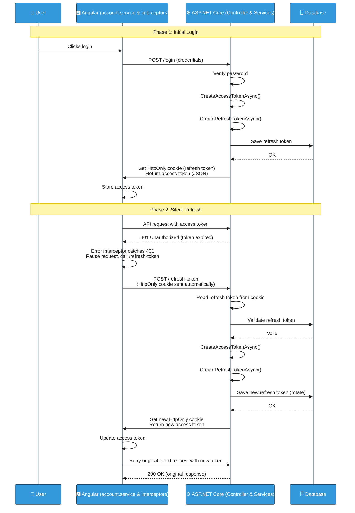

# Refresh Token and Login Process Documentation
> **Note:** This document describes the authentication system in Lilishop. This project is designed and maintained by a single developer. However, the word "we" is used throughout the document for consistency with standard technical writing.

This document explains how the Lilishop login system works. We use **access tokens** (short‑lived) and **refresh tokens** (long‑lived, stored in a secure `HttpOnly` cookie). This design keeps the user secure and provides a smooth experience – the user does not have to log in again when the access token expires.

---

## Phase 1: The Initial Login

In this phase, the user enters their email and password. The system verifies the credentials, creates two tokens, and stores the refresh token safely.

### 1. The user clicks Login

Inside the Angular frontend, `account.service.ts` sends a POST request with the user’s credentials to the backend.

```typescript
// account.service.ts
login(values: any) {
  return this.http.post<IUser>(this.baseUrl + 'account/login', values).pipe(
    map(user => {
      if (user) {
        this.setUserAndToken(user);
      }
      return user;
    })
  );
}
```

### 2. The backend receives the request

The `AccountController` in ASP.NET Core receives the request. It does not do the main work itself. It immediately calls `_applicationUserService.LoginAsync(loginDto)`.

```csharp
// AccountController.cs
[HttpPost("login")]
public async Task<ActionResult<UserDto>> Login(LoginDto loginDto)
{
    var result = await _applicationUserService.LoginAsync(loginDto);
    return HandleOperationResult(result);
}
```

### 3. The service verifies the password and creates tokens

`ApplicationUserService.cs` checks if the user exists and if the password is correct.  
If everything is correct, it asks `TokenService` to create:

- An **access token** (short‑lived JWT)
- A **refresh token** (a secure random string)

```csharp
// ApplicationUserService.cs
var userDto = new UserDto
{
    Email = user.Email,
    Token = await _tokenService.CreateAccessTokenAsync(user),
    DisplayName = user.DisplayName
};

var refreshToken = await _tokenService.CreateRefreshTokenAsync(user);
```

### 4. Save the refresh token and send the response

The refresh token is saved in the database.  
Then the backend sends the response back to Angular:

- The **refresh token** is placed inside an **HttpOnly cookie**. This cookie cannot be read by JavaScript, which makes it very secure.
- The **access token** is returned in the JSON response. Angular stores it for making API requests.

---

## Phase 2: The Silent Refresh Process

The access token is short‑lived. After some time, it expires. When this happens, the user does not need to log in again. The system silently gets a new token and retries the original request.

### 1. The access token expires and the backend returns 401

The frontend makes an API request with the expired access token. The backend rejects the request and returns a `401 Unauthorized` error.

### 2. The error interceptor catches the 401

Inside Angular, the `error.interceptor.ts` is watching for errors. When it sees a 401, it:

- **Pauses** the failed request
- Calls `refreshToken()` in `account.service.ts`

```typescript
// error.interceptor.ts
if (error.status === 401) {
  // Pause the request and try to refresh the token
  return this.accountService.refreshToken().pipe(
    switchMap(() => {
       // Retry the original failed request with the new token
       return next.handle(request);
    })
  );
}
```

### 3. The refresh token request is sent automatically

In `account.service.ts`, a silent POST request is made to the `/refresh-token` endpoint.  
The browser automatically attaches the `HttpOnly` cookie (which contains the refresh token). We do not need to read or attach it manually.

```typescript
// account.service.ts
refreshToken() {
  // The HttpOnly cookie is sent automatically by the browser
  return this.http.post<IUser>(this.baseUrl + 'account/refresh-token', {}).pipe(
    map(user => {
      // Save the new access token
      this.setUserAndToken(user);
      return user;
    })
  );
}
```

### 4. The backend reads the cookie and validates the token

The `AccountController` reads the refresh token from the cookie and passes it to the service.

```csharp
// AccountController.cs
[HttpPost("refresh-token")]
public async Task<ActionResult<UserDto>> RefreshToken()
{
    // Read the secure cookie
    var refreshToken = Request.Cookies["refreshToken"];
    
    // Pass it to the service for validation
    var result = await _applicationUserService.RefreshTokenAsync(refreshToken);
    return HandleOperationResult(result);
}
```

The `ApplicationUserService` checks the database:

- Is the refresh token valid?
- Has it expired?

If valid, the service calls `TokenService` to create:

- A **brand new access token**
- A **brand new refresh token** (this is called **token rotation** – a great security practice)

The new refresh token is saved in the database. The backend sends it back in a new `HttpOnly` cookie.

### 5. The frontend retries the original request

The backend returns the new access token in the JSON response.  
The error interceptor receives it and updates the application state. Then it **automatically retries** the original failed request using the new access token.

The user sees no error and continues working without interruption.

---

## Complete Sequence Diagram (Both Phases)



---

## Part 3: Summary, Security Notes, and Edge Cases

### Summary

Here is what happens in the whole process:

1. **User logs in** → Backend creates an access token (short‑lived) and a refresh token (long‑lived).  
2. **Refresh token** is stored in an `HttpOnly` cookie. Access token is returned in JSON.  
3. **Access token expires** → API returns `401 Unauthorized`.  
4. **Error interceptor** catches the 401, pauses the request, and calls `/refresh-token`.  
5. **Browser automatically sends** the `HttpOnly` cookie with the refresh token.  
6. **Backend validates** the refresh token. If valid, it creates **new** access token and **new** refresh token (token rotation).  
7. **New refresh token** is saved to the database and sent back in a new `HttpOnly` cookie.  
8. **New access token** is returned to Angular.  
9. **Error interceptor** retries the original failed request with the new access token.  
10. **User continues** without noticing anything.

### Security Notes

These are the important security features in this design:

- **HttpOnly cookie** – The refresh token cannot be read by JavaScript. This stops many cross‑site scripting (XSS) attacks.
- **Short‑lived access token** – Even if stolen, the token works only for a short time (e.g., 15 minutes).
- **Token rotation** – Every time you refresh, you get a **new** refresh token. The old one becomes invalid. This limits damage if a refresh token is stolen.
- **Refresh token stored in database** – The server can revoke a refresh token at any time (e.g., when the user logs out or changes password).
- **No refresh token in local storage** – Local storage is vulnerable to XSS. We avoid storing sensitive tokens there.

### Edge Cases and How They Are Handled

| Edge Case | What Happens |
|-----------|---------------|
| **Refresh token is expired** | The backend returns a 401. The user must log in again. |
| **Refresh token is not found in database** | The backend returns 401. The user must log in again. |
| **Refresh token belongs to a different user** | The backend rejects the request and returns 401. |
| **User logs out** | The backend deletes the refresh token from the database. The `HttpOnly` cookie is cleared. |
| **Multiple simultaneous requests fail with 401** | The jwtInterceptor checks if a refresh is already happening (`isRefreshing()`). If yes, it pauses the new requests and waits. When the new token is ready, it automatically retries all the paused requests. |
| **Refresh token request fails** | The catchError block catches the error, sets the refreshing state to false, and logs the user out by calling `accountService.logout()`. |
| **Backend is down** | The `errorInterceptor` catches this error because it is not a 401. It sends the error to the `ErrorService` (`errorService.handleError(error)`) to handle it and display a generic error message.. |

### Final Note

This system gives a great user experience and strong security. The user never sees a login prompt after the first login, unless the refresh token also expires or is revoked.

