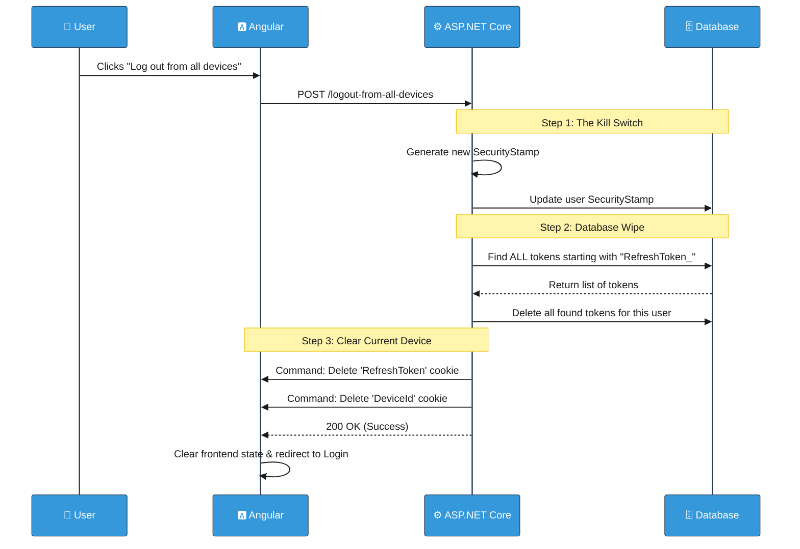

# Global Logout: Logging Out From All Devices in Lilishop

> **Note:** This document describes the security and authentication system in Lilishop. This project is designed and maintained by a single developer. However, the word "we" is used throughout the document for consistency with standard technical writing.

In modern web applications, users often log in from multiple devices (e.g., a phone, a work laptop, and a home tablet). This document explains our **"Log Out from All Devices"** feature. This feature provides enhanced security by allowing users to instantly kill all active sessions across every device they own.

---

## 1. The Idea and The "Why"

### What is the idea?
We want to give users a "panic button." When triggered, this button ensures that every single device currently logged into their account is forced to log out immediately. 

### Why is this necessary?
This is a critical security feature for several scenarios:
* **Lost or Stolen Device:** If a user loses their phone, they can log in from a computer and instantly terminate the session on the lost phone.
* **Public Computers:** If a user forgets to log out from a public library or internet cafe, they can secure their account remotely.
* **Hacked Accounts:** If a user suspects someone else is using their account, they can change their password and force a global logout, kicking the hacker out instantly.

---

## 2. The Mechanism: How do we track devices?

To log out from *all* devices, the system first needs a way to separate and recognize different devices. We handle this inside the `TokenService.cs` when the user logs in.

When an access token and refresh token are created, we also generate a unique **Device ID**:

```csharp
// TokenService.cs
public async Task<string> CreateRefreshTokenAsync(IUser user)
{
    var refreshToken = Convert.ToBase64String(RandomNumberGenerator.GetBytes(64));

    // 1. Generate a unique device identifier for this specific login
    var deviceId = Guid.NewGuid().ToString();
    string loginProvider = await _userManager.GetLoginProviderAsync((ApplicationUser)user);

    // 2. Save the token in the database with a name linked to the device!
    var tokenName = $"{TokenConstants.RefreshToken}_{deviceId}";
    await _userManager.SetAuthenticationTokenAsync((ApplicationUser)user, loginProvider, tokenName, refreshToken);

    // 3. Store the DeviceId safely in an HttpOnly cookie
    SetDeviceIdCookie(deviceId);

    return refreshToken;
}
```

**Database Perspective:** Instead of saving just one refresh token per user, our database table (`AspNetUserTokens`) can hold multiple refresh tokens for a single user. We differentiate them by attaching the `deviceId` to the token's name (e.g., `RefreshToken_a1b2c3...`).

---

## 3. The Execution: How Global Logout Works

When the user clicks "Log out from all devices," the Angular frontend sends a POST request to our `AccountController`. The heavy lifting is done in the `ApplicationUserService.cs`. 

Here is the step-by-step mechanism of how we terminate the sessions:

### Step 1: The "Kill Switch" (Security Stamp)
ASP.NET Core Identity uses a `SecurityStamp` for every user. This is a random string that represents the user's current security state. 
By generating a brand new `SecurityStamp`, we immediately invalidate any old session data and tokens linked to the previous stamp. 

```csharp
// Update SecurityStamp to invalidate all Access Tokens and Refresh Tokens
user.SecurityStamp = Guid.NewGuid().ToString();
var updateResult = await _userManager.UpdateAsync(user);
```

### Step 2: Wiping the Database
Next, we must delete all active refresh tokens belonging to this user so they cannot be used to generate new access tokens. The system searches the database for **every** token name that starts with `RefreshToken_` and deletes them.

```csharp
// Find all refresh tokens for this user across ALL devices
var tokens = await _userManager.Users
    .Where(u => u.Id == user.Id)
    .SelectMany(u => u.Tokens.Where(t => t.Name.StartsWith(TokenConstants.RefreshToken)))
    .ToListAsync();

// Loop through and delete them from the database
foreach (var token in tokens)
{
    await _userManager.RemoveAuthenticationTokenAsync(user, loginProvider, token.Name);
}
```

### Step 3: Clearing Local Cookies
Finally, we remove the secure cookies from the device the user is *currently* using to press the button.

```csharp
// Remove tokens from the current device's browser
_httpContextAccessor.HttpContext?.Response.Cookies.Delete(TokenConstants.RefreshToken);
_httpContextAccessor.HttpContext?.Response.Cookies.Delete(TokenConstants.DeviceId);
```

---

## 4. Visual Workflow (Sequence Diagram)

Here is a clear visual representation of the entire global logout process.



## 5. Edge Cases: What happens to the other devices?

You might wonder: *"If I press the button on my computer, how does my phone know it needs to log out?"*

Our Angular frontend on the other devices does not instantly know that the button was pressed. However, because of our strict security rules, they will be kicked out very quickly. Here is the exact flow:

1. **The Access Token Expires:** The phone is still holding a short-lived access token (e.g., valid for 15 minutes). Once this time passes, the next API request the phone makes will fail with a `401 Unauthorized` error.
2. **The Silent Refresh Fails:** As we learned in the Refresh Token workflow, the phone's Angular app will automatically try to get a new access token by silently sending its Refresh Token to the backend.
3. **The Backend Rejects It:** The backend receives the Refresh Token and checks the database. Because Step 2 of our Global Logout wiped all tokens for this user, the backend will not find the token! It will also see that the user's `SecurityStamp` has changed. 
4. **The Final Kick:** The backend rejects the refresh request. The Angular error interceptor catches this final failure, clears the phone's local storage, and kicks the user back to the login screen.

| Edge Case | What Happens |
|-----------|---------------|
| **User clicks "Global Logout" but an old device makes an API call immediately** | If the short-lived access token is still valid, the call might succeed. However, once it expires (within minutes), the device will be permanently locked out. |
| **User logs in again immediately after a Global Logout** | The system works normally. A new session is created with the new `SecurityStamp` and a brand new `DeviceId`. |
| **A hacker tries to use a stolen refresh token after Global Logout** | The backend rejects it completely because the token was deleted from the database. |

---

## 6. How to Test This Feature

If you are developing or testing the Lilishop application, you can easily verify that the "Log out from all devices" feature works perfectly by following these steps:

1. **Simulate Two Devices:** * Open your normal browser (e.g., Google Chrome) and log into Lilishop.
   * Open a different browser (e.g., Firefox) or an Incognito/Private window and log into the same account. 
2. **Trigger the Kill Switch:** * In Chrome, click the **"Log out from all devices"** button.
   * Verify that Chrome immediately clears your session and redirects you to the login page.
3. **Verify the Wipe in the Database:** * Open your SQL database tool. Check the `AspNetUserTokens` table for your user ID. You should see that all records starting with `RefreshToken_` have been completely deleted.
4. **Test the Second Device:** * Go back to Firefox (your second simulated device). 
   * Try to browse the shop or wait for the access token to expire. As soon as the frontend attempts a silent refresh, the backend will reject it, and Firefox will automatically redirect you to the login screen!

Here is the exact Markdown section you can add directly to the very end of your `0035_global-logout.md` document. It uses clear, simple English to explain the database mechanism based on your screenshot\!

-----

## 7\. Database View: Multiple Active Sessions

To see how this works in reality, look at the database screenshot below. This shows the `AspNetUserTokens` table when a single user is logged into the application from three different browsers (for example: Chrome, Firefox, and Edge) at the same exact time.

As you can see, there are three separate rows for the same user. Here is exactly what each column means in our system:

  * **`UserId`**: The unique identifier for the account. Notice that all three rows share the exact same ID because they belong to one person.
  * **`LoginProvider`**: This tells us how the user authenticated. In our application, "LiliShop" means they used our standard email and password login.
  * **`Name`**: This is where the device tracking happens\! It combines the prefix `RefreshToken_` with the unique `DeviceId` (a random GUID) that we generated during login. This structure is what allows us to have multiple active sessions.
  * **`Value`**: This is the actual Refresh Token itself. It is a long, highly secure, base64-encoded string. This exact same string is what gets saved securely inside the browser's `HttpOnly` cookie.

When the user clicks the **"Log out from all devices"** button, the system simply searches for this specific `UserId`, finds all rows where the Name starts with `RefreshToken_`, and deletes all three of them instantly\!


***

### Final Note
The **Global Logout** feature works hand-in-hand with our **Token Rotation** system to provide enterprise-level security. It ensures that users always have complete control over their account access, no matter where they left their sessions open!

***
