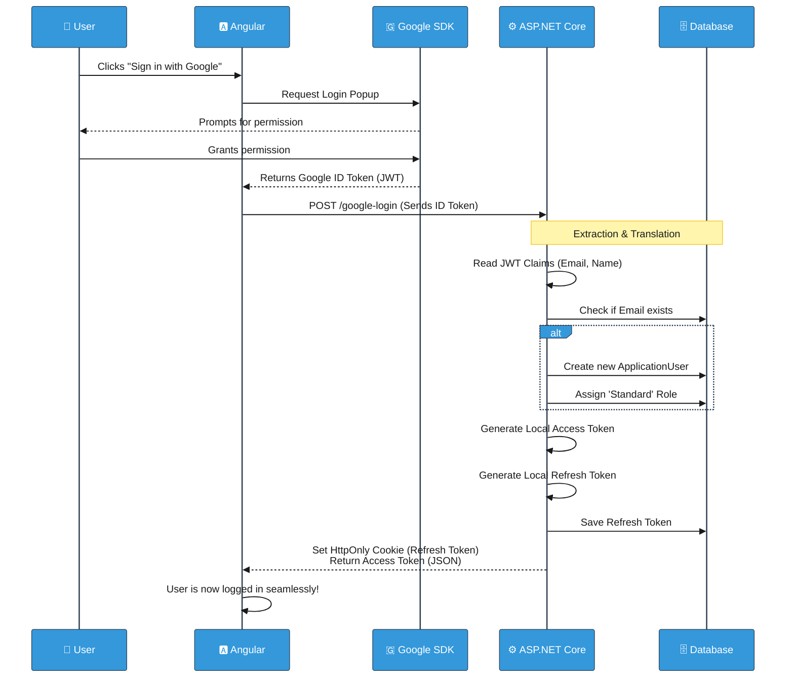

# Google External Login (Single Sign-On / SSO) in Lilishop

> **Note:** This document describes the security and authentication system in Lilishop. This project is designed and maintained by a single developer. However, the word "we" is used throughout the document for consistency with standard technical writing.

In modern web applications, forcing users to create a new password for every website causes friction. To provide a seamless and secure experience, Lilishop implements **Single Sign-On (SSO)** using Google. 

This document explains how our system securely receives a login request from Google, reads the token data, and seamlessly integrates the user into our local Role-Based Access Control (RBAC) and Refresh Token systems.

---

## 1. The Idea: Why do we issue our *own* tokens?

When a user logs in with Google, Google gives us an ID token. However, **we do not use Google's token to access our API.** Instead, we use a "Translation" strategy:
1. We read the Google token to extract the user's true identity (Email and Name).
2. We discard the Google token and issue our **own** local Access Token and Refresh Token. 

**Why?** Because Google does not know about our internal Lilishop roles (like `Administrator` or `Standard`), nor does it handle our silent background refresh logic. By issuing our own token pair, we maintain complete control over the user's permissions and session lifespan.

---

## 2. Phase 1: The Frontend Request

The process begins in the Angular frontend. The user clicks the **"Sign in with Google"** button. 

1. The browser communicates directly with Google's secure servers.
2. The user logs into their Google account and grants permission.
3. Google sends a secure **ID Token** (a JWT) back to our Angular application.
4. Angular immediately forwards this token to our ASP.NET Core backend inside a `GoogleTokenDto`.

---

## 3. Phase 2: The Core Service Logic (Reading & Translation)

The true magic happens inside `ApplicationUserService.cs`. The `GoogleLoginAsync` method is responsible for parsing the token, finding (or creating) the user, and generating our local session.

Here is the step-by-step breakdown of the logic:

### Step 1: Read the Google Token
We use the `JwtSecurityTokenHandler` to parse the incoming Google token. Once parsed, we extract the most important pieces of information from the token's claims: the user's `email` and their `name`.

```csharp
// ApplicationUserService.cs
public virtual async Task<IOperationResult<UserDto>> GoogleLoginAsync(GoogleTokenDto tokenDto)
{
    // 1. Parse the incoming Google JWT
    var handler = new JwtSecurityTokenHandler();
    var jsonToken = handler.ReadToken(tokenDto.Token) as JwtSecurityToken;

    // 2. Extract the user's email and name from the claims
    var email = jsonToken?.Claims.FirstOrDefault(claim => claim.Type == "email")?.Value;
    var name = jsonToken?.Claims.FirstOrDefault(claim => claim.Type == "name")?.Value;
```

### Step 2: Find or Create the User
Next, we check our database to see if this user has visited Lilishop before by searching for their email address. 

If they are a brand new user, we automatically register an account for them and assign them the `Standard` role! They do not have to fill out any tedious registration forms.

```csharp
    // 3. Check if the user already exists in our database
    var user = await _userManager.FindByEmailAsync(email);
    
    // 4. If they don't exist, create a new account silently!
    if (user is null)
    {
        user = new ApplicationUser
        {
            DisplayName = name,
            Email = email,
            UserName = email
        };

        var createdUser = await _userManager.CreateAsync(user);
        if (!createdUser.Succeeded)
        {
            return new FailureOperationResult<UserDto>(ErrorCode.CreationFailed, "An error occurred while creating the database object.");
        }

        await _userManager.AddToRoleAsync(user, Role.Standard);
    }
```

### Step 3: Issue Local Tokens (Access & Refresh)
Finally, we treat the user exactly like a standard logged-in user. We ask the `TokenService` to generate **both** our local Access Token and our secure Refresh Token. Generating the Refresh Token here is critical; without it, the Google user's session would drop as soon as the short-lived access token expires!

```csharp
    // 5. Generate our own local Access Token
    var token = await _tokenService.CreateAccessTokenAsync(user);

    // 6. Generate our secure Refresh Token and Device ID
    var refreshToken = await _tokenService.CreateRefreshTokenAsync(user);

    var result = new UserDto
    {
        DisplayName = user.DisplayName,
        Token = token,
        Email = user.Email,
        Role = Role.Standard,
        EmailConfirmed = user.EmailConfirmed
    };

    return new SuccessOperationResult<UserDto>(result);
}
```

---

## 4. Phase 3: The Controller and `HttpOnly` Cookie

Just like our standard login flow, the `AccountController` handles the final delivery of the tokens. 
While the short-lived Access Token is returned in the JSON payload for Angular to use, the Refresh Token was securely planted into an `HttpOnly` Cookie by the `TokenService` during its creation. 

By utilizing the `HttpOnly` cookie, the Google user is seamlessly hooked into our **Silent Refresh Process**. They will stay securely logged into Lilishop as long as they are active, completely shielded from XSS attacks.

---

## 5. Visual Workflow (Sequence Diagram)

Here is a visual map of how data flows between the User, Angular, Google, and our ASP.NET Core Backend.



---

## 6. Edge Cases Handled

| Edge Case | What Happens |
|-----------|---------------|
| **An existing user logs in with Google** | The system recognizes their email, skips the creation step, and logs them into their existing account, keeping their order history intact! |
| **Google token has expired during transit** | The `JwtSecurityTokenHandler` validation process will fail and reject the login attempt. |
| **Database creation fails** | The system catches the error and safely returns a `FailureOperationResult`, preventing partial or corrupted user profiles. |

### Final Note
By using Google SSO, Lilishop greatly improves conversion rates by removing the friction of passwords, while maintaining absolute control over local API security, session refresh cycles, and Role-Based Access Control (RBAC)!

***
