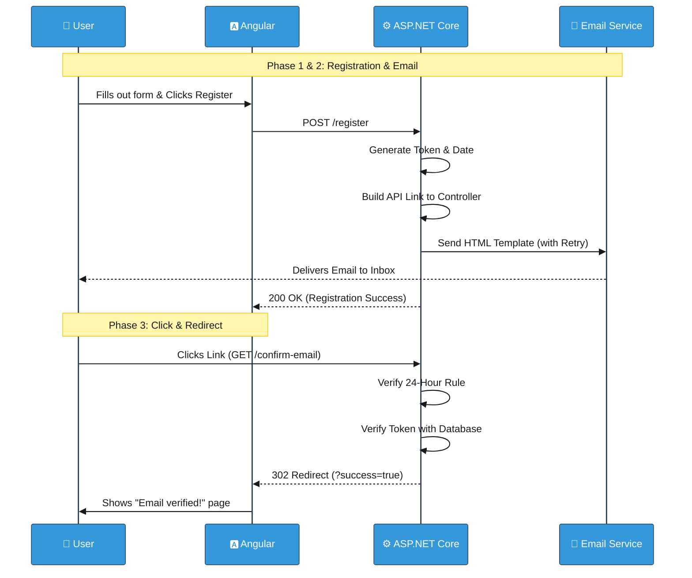

# Registration and Email Confirmation Flow

> **Note:** This document describes the user registration and verification system in Lilishop. This project is designed and maintained by a single developer. However, the word "we" is used throughout the document for consistency with standard technical writing.

When a new user signs up for Lilishop, simply saving their email and password in the database is not enough. We must ensure that the email address actually belongs to them and that it is active. 

This document explains our multi-step Registration and Email Confirmation flow. It covers how we securely generate confirmation tokens, build backend callback URLs, implement retry mechanisms, and redirect users smoothly to the Angular frontend.

---

## 1. The Idea: Why Confirm Emails?

Before we look at the code, it is important to understand *why* this flow exists:
1. **Preventing Fake Accounts:** It stops bots and malicious users from flooding our database with fake email addresses.
2. **Account Recovery:** If a user forgets their password later, we *must* have a verified email address to send the recovery link to safely.
3. **Communication:** We need to be 100% sure that order receipts and shipping updates are being sent to the correct person.

---

## 2. Phase 1: Generating the Token and the Link

After the user's basic account is created in the database, the `ApplicationUserService` calls a private method named `SendConfirmationEmailAsync`. This method does several highly advanced things to ensure the email is sent safely and accurately.

### Step 1: Tokens and Time Tracking
First, we generate a cryptographically secure token using ASP.NET Core Identity. We also record the exact UTC date and time the token was issued. We URL-encode both of these values so they do not break the web link!

```csharp
// Inside SendConfirmationEmailAsync
var confirmationToken = await _userManager.GenerateEmailConfirmationTokenAsync(user);
var tokenIssueDate = DateTime.UtcNow;
var encodedToken = HttpUtility.UrlEncode(confirmationToken);
var encodedDate = HttpUtility.UrlEncode(tokenIssueDate.ToString("o"));
```

### Step 2: Building the API Callback Link
Unlike many applications that link directly to the frontend, Lilishop builds a link that points directly to our **Backend API**. We use the `UrlHelperService` to generate a dynamic link to the `ConfirmEmail` endpoint in our `AccountController`.

```csharp
// ApplicationUserService.cs
var confirmationLink = _urlHelperService.GenerateConfirmationLink(encodedToken, encodedDate, user.Email);

// UrlHelperService.cs
public string? GenerateConfirmationLink(string token, string date, string email)
{
    // Generates a link pointing directly to our backend AccountController!
    var urlHelper = _urlHelperFactory.GetUrlHelper(...);
    return urlHelper.Action("ConfirmEmail", "Account", new { token, date, email }, context.Request.Scheme);
}
```

---

## 3. Phase 2: The HTML Template and Retry Mechanism

We want Lilishop to feel like a premium application, so we use a beautifully designed HTML template instead of plain text. 

More importantly, email servers can sometimes fail or timeout. To make our application enterprise-ready, we wrap the email sending process in a **Retry Mechanism with Exponential Backoff**. If it fails, it waits 2 seconds, then 4 seconds, then 8 seconds before giving up!

```csharp
// ApplicationUserService.cs
int maxRetries = 3;
int delay = 2000;

for (int attempt = 1; attempt <= maxRetries; attempt++)
{
    try
    {
        // Load the beautiful HTML template from the server files
        var htmlTemplatePath = Path.Combine(resourcesPath, "EmailTemplates", "EmailConfirmationTemplate.html");
        var htmlTemplate = await System.IO.File.ReadAllTextAsync(htmlTemplatePath);

        // Inject our custom link into the HTML
        htmlTemplate = htmlTemplate.Replace("{ConfirmationLink}", confirmationLink);

        // Send the email!
        await _emailService.SendEmailAsync(user.Email, "Email Confirmation", htmlTemplate);
        break; // Success! Exit the loop.
    }
    catch (Exception ex)
    {
        // Log the warning and try again after a delay
        _logger.LogWarning(ex, $"Attempt {attempt} failed to send email for user {user.Email}");
        await Task.Delay(delay);
        delay *= 2; // Exponential backoff!
    }
}
```

---

## 4. Phase 3: The User Clicks the Link (Validation & Redirect)

The user opens their email and clicks the confirmation button. Because of how we built the link in Phase 1, their browser makes a direct `GET` request to our backend API.

### The Backend Redirection Controller
The `AccountController` receives the request. It asks the service to validate the token. Based on the result, it uses the `Redirect()` method to push the user's browser back to the Angular Frontend, attaching a `success=true` or `success=false` message to the URL!

```csharp
// AccountController.cs
[HttpGet("confirm-email")]
public async Task<IActionResult> ConfirmEmail(string token, string date, string email)
{
    var result = await _applicationUserService.ConfirmEmailAsync(token, date, email);
    var frontendBaseUrl = _configuration["FrontendSettings:BaseUrl"];

    // Redirect the user to the Angular application with the result!
    if (result is SuccessOperationResult successResult)
    {
        return Redirect($"{frontendBaseUrl}/confirm-email?success=true&email={email}");
    }
    else if (result is FailureOperationResult failureResult)
    {
        return Redirect($"{frontendBaseUrl}/confirm-email?success=false&email={email}&message={HttpUtility.UrlEncode(failureResult.Message)}");
    }

    return BadRequest(new ApiResponse(StatusCodes.Status400BadRequest, "An unexpected error occurred."));
}
```

### The Custom Validation Logic
Inside the `ApplicationUserService.ConfirmEmailAsync` method, we perform a strict custom security check. Before we even check the token string, we check the `date`. We have a strict business rule: **Tokens expire after exactly 24 hours**. 

```csharp
// ApplicationUserService.cs
var decodedDate = HttpUtility.UrlDecode(date);
var tokenIssueDate = DateTime.Parse(decodedDate);

// Custom 24-hour expiration check
if (DateTime.UtcNow - tokenIssueDate > TimeSpan.FromHours(24))
{
    return new FailureOperationResult(ErrorCode.TokenExpired, "This confirmation token is expired.");
}

// Decode and verify the token against the database
var decodedToken = HttpUtility.UrlDecode(token);
var result = await _userManager.ConfirmEmailAsync(user, decodedToken);

if (result.Succeeded)
{
    return new SuccessOperationResult("Email confirmed successfully.");
}
```

---

## 5. Visual Workflow (Sequence Diagram)

Here is a clear visual representation of how the data flows across the entire verification lifecycle, including the backend redirection step.



---

## 6. Edge Cases Handled

| Edge Case | What Happens |
|-----------|---------------|
| **Email service is temporarily down** | The backend `for` loop uses an exponential backoff (2s, 4s, 8s) to safely retry sending the email 3 times before finally throwing an error. |
| **User waits more than 24 hours** | The custom TimeSpan check fails immediately. The user is redirected to the frontend with an expired token message. |
| **Token string is altered in the URL** | Even a one-character change breaks the cryptographic signature. The database check fails, and the user gets an "Email confirmation failed" message. |
| **URL date format is corrupted** | `DateTime.TryParse` catches the invalid data and safely rejects the request without crashing the application. |

### Final Note
By implementing this flow, Lilishop ensures a clean, verified database of users while providing a professional, fault-tolerant onboarding experience!

***
