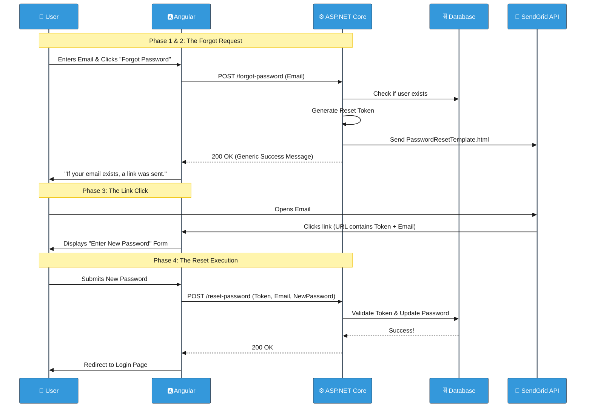

# Secure Password Recovery (Forgot / Reset Password) Flow in Lilishop

> **Note:** This document describes the security and authentication system in Lilishop. This project is designed and maintained by a single developer. However, the word "we" is used throughout the document for consistency with standard technical writing.

No matter how smooth an application is, users will inevitably forget their passwords. The process of recovering an account is one of the most vulnerable points in any system. If implemented poorly, hackers can easily hijack accounts or scrape the database for valid emails.

This document explains our highly secure, multi-step **Forgot Password** and **Reset Password** flow. It details how Lilishop safely generates recovery tokens, prevents email enumeration attacks, and delivers branded recovery emails.

---

## 1. The Idea: Why is Password Recovery so Sensitive?

When designing this flow, we had to adhere to strict enterprise security standards:
1. **No Email Enumeration:** If an attacker types `admin@company.com` into the "Forgot Password" form, the system *must not* tell the attacker whether that email actually exists in our database. 
2. **Time-Sensitive Tokens:** Recovery tokens must expire quickly. A forgotten password email sitting in an inbox from 6 months ago should be completely useless.
3. **One-Time Use:** Once a password is reset, the token must be instantly destroyed to prevent "replay" attacks.

---

## 2. Phase 1: The "Forgot Password" Request

The process begins when a user realizes they cannot log in. They navigate to the Angular frontend, enter their email address on the "Forgot Password" page, and click submit.

The request hits our `AccountController`. The controller acts purely as a router, taking the `ForgotPasswordDto` and passing the email to our core service.

```csharp
// AccountController.cs

[HttpPost("forgot-password")]
public async Task<IActionResult> ForgotPassword(ForgotPasswordDto forgotPasswordDto)
{
    // Pass the email address to the core service
    var result = await _applicationUserService.ForgotPasswordAsync(forgotPasswordDto);
    return HandleOperationResult(result);
}
```

---

## 3. Phase 2: Generating the Token and Sending the Email

Inside the `ApplicationUserService.cs`, the heavy lifting happens. This is where we secure the user's account and dispatch the recovery email.

### Step 1: The Database Check (and Security Trap)
First, we look up the user by their email using ASP.NET Core Identity. 

**The Security Trap:** If the user does *not* exist, we do not throw an error or tell the frontend! We silently return a generic success message. This perfectly hides our user list from malicious bots testing random emails.

### Step 2: Generating the Secure Token
If the user *does* exist, we generate a highly secure, one-time-use reset token specifically tied to their account and their current `SecurityStamp`.

```csharp
// ApplicationUserService.cs

// 1. Generate the secure reset token
var resetToken = await _userManager.GeneratePasswordResetTokenAsync(user);

// 2. URL-encode the token so it does not break the web link!
var encodedToken = HttpUtility.UrlEncode(resetToken);

// 3. Build the specific recovery link for the frontend using our UrlHelperService
var resetLink = _urlHelperService.GeneratePasswordResetLink(encodedToken, user.Email);
```

### Step 3: Sending the Email (With Retry Mechanism)
Just like our Registration flow, we want a premium user experience. We use our fault-tolerant loop to read a beautiful HTML template from the server, inject the `resetLink`, and send it via SendGrid.

```csharp
// Inside the email sending method in ApplicationUserService.cs
int maxRetries = 3;
int delay = 2000;

for (int attempt = 1; attempt <= maxRetries; attempt++)
{
    try
    {
        // Load the HTML template from our resources folder
        var htmlTemplatePath = Path.Combine(resourcesPath, "EmailTemplates", "PasswordResetTemplate.html");
        var htmlTemplate = await System.IO.File.ReadAllTextAsync(htmlTemplatePath);

        // Inject the secure recovery link
        htmlTemplate = htmlTemplate.Replace("{ResetLink}", resetLink);

        // Send the email using our external SendGrid service
        await _emailService.SendEmailAsync(user.Email, "Reset Your Password", htmlTemplate);
        break; // Success!
    }
    catch (Exception ex)
    {
        // Exponential backoff logic here...
    }
}
```

---

## 4. Phase 3: The User Clicks the Link

The user opens their email, sees the branded Lilishop template, and clicks the **"Reset Password"** button.

This link navigates them back to our Angular application (e.g., `/reset-password`). The Angular component instantly reads the `email` and the encoded `token` directly from the URL bar and securely holds them in its local memory. 

The user is then presented with a form asking them to type a **New Password**.

---

## 5. Phase 4: The "Reset Password" Execution

When the user submits their new password, the Angular application packages the data into a `ResetPasswordDto`. This object contains:
* The user's Email.
* The hidden Reset Token.
* The New Password.

It sends a `POST` request back to the `AccountController`.

```csharp
// AccountController.cs

[HttpPost("reset-password")]
public async Task<IActionResult> ResetPassword(ResetPasswordDto resetPasswordDto)
{
    var result = await _applicationUserService.ResetPasswordAsync(resetPasswordDto);
    return HandleOperationResult(result);
}
```

### The Final Execution
Inside `ApplicationUserService.cs`, the final validation happens in one powerful step. We decode the token and pass everything to `_userManager.ResetPasswordAsync`. ASP.NET Core Identity checks if the token is valid, checks if it has expired, and—if everything is perfect—safely overwrites the old password with the new one!

```csharp
// ApplicationUserService.cs

public async Task<IOperationResult> ResetPasswordAsync(ResetPasswordDto dto)
{
    var user = await _userManager.FindByEmailAsync(dto.Email);
    if (user == null)
    {
        // Security: Return a generic failure so we don't reveal the email doesn't exist
        return new FailureOperationResult(ErrorCode.InvalidData, "Password reset failed.");
    }

    var decodedToken = HttpUtility.UrlDecode(dto.Token);

    // Validate the token and update the password securely
    var resetResult = await _userManager.ResetPasswordAsync(user, decodedToken, dto.NewPassword);

    if (resetResult.Succeeded)
    {
        return new SuccessOperationResult("Your password has been successfully reset!");
    }

    return new FailureOperationResult(ErrorCode.InvalidToken, "The reset token is invalid or has expired.");
}
```

---

## 6. Visual Workflow (Sequence Diagram)

Here is the exact mapping of how a forgotten password is recovered securely.



---

## 7. Edge Cases Handled

| Edge Case | What Happens |
|-----------|---------------|
| **Attacker tests fake emails** | The backend always returns `200 OK` (or a generic message) for the "Forgot Password" request, completely protecting the database against email enumeration. |
| **Token expires before use** | ASP.NET Core Identity automatically rejects expired tokens inside the `ResetPasswordAsync` method, returning an `InvalidToken` error. |
| **User clicks the link twice** | Tokens are completely invalidated the moment the password is successfully changed. The second click will result in an "invalid token" error. |
| **Token gets altered in the URL** | The cryptography fails the signature check, and the password reset is immediately aborted. |

### Final Note
By adhering strictly to these enterprise security patterns, Lilishop ensures that users can regain access to their accounts smoothly without opening backdoors for hackers.

***
