# 📄 Comprehensive Architecture & System Design Document: Offline-First Smart Caregiver Platform

## 1. Introduction & Problem Statement
The objective of this system is to digitally transform the patient admission process (Admission Talk) conducted by healthcare caregivers. During these 30-minute sessions, critical patient information is gathered. The current paper-based, manual data entry system leads to wasted time and human error.
The primary goal is to develop a mobile application that records these conversations, processes the audio using Artificial Intelligence, and automatically generates structured reports.
**Key Constraint:** The system must be deployed in rural areas with poor coverage or complete lack of internet connectivity while the caregiver is at the patient's home.

## 2. Key Technical Challenges
Designing this system requires overcoming the following complex challenges:
* **Large & Variable Data Volume:** Generating and transmitting heavy audio files over unstable networks.
* **Storage Pressure:** Mobile device memory filling up if multiple consecutive sessions are recorded offline.
* **Asynchronous Processing:** AI operations are highly time-consuming; the client application must not be blocked waiting for a response.
* **Data Privacy & Security (GDPR Compliance):** Absolute necessity to encrypt highly sensitive medical data both at-rest and in-transit.

## 3. High-Level Architectural Design Patterns
To guarantee stability and scalability, this architecture is built upon two standard integration patterns:
* **Outbox Pattern:** To prevent data loss during network outages, all events and files are first written to the client's local database (acting as an Outbox) and are later synchronized with the server via a background service.
* **Claim-Check Pattern:** To prevent overloading the Message Brokers, the heavy audio payload is uploaded directly to Object Storage, and only a lightweight message containing the "File ID and URI" (the Claim-Check) is pushed into the processing queue.

## 4. Client Architecture & Tech Stack
To accommodate technical team requirements and modern mobile development standards, two parallel approaches are proposed for the client implementation:

### Approach A: React Native
* **Framework:** React Native for high-performance, native access to microphone and file-system APIs.
* **Offline Database:** **WatermelonDB** (or native SQLite), highly optimized for managing thousands of records offline and executing rapid synchronizations.
* **State Management:** **Redux Offline** to manage the queue of network requests during disconnections.

### Approach B: Angular & Ionic (Leveraging Enterprise Angular Architecture)
* **Framework:** Ionic Framework combined with Capacitor to compile the web application into a native mobile binary.
* **Reactive Database:** **RxDB**. This is one of the most powerful tools for Offline-First architectures in the Angular ecosystem due to its native RxJS support and built-in replication/sync mechanisms.

## 5. Data Security & Privacy
Medical data requires the highest level of security:
* **Encryption at Rest:** Immediately upon completion of the recording, the audio file is encrypted on the mobile file system using the robust **AES-256** algorithm, rendering the data unreadable if the device is stolen.
* **Encryption in Transit:** All data exchange with the server is conducted exclusively over the **TLS 1.3** protocol.
* **Cloud Access Management (IAM & Pre-signed URLs):** The processing backend (Workers) can only read files from AWS S3 via strict security roles (IAM Roles). For uploads, the client requests a **Pre-signed URL** with a limited expiration window (e.g., 15 minutes).

## 6. Synchronization, Upload Strategy & Conflict Resolution
### A) Storage Pressure Management
Before initiating a recording, the application checks the available device storage. If the available space drops below a defined threshold (e.g., less than 100 MB), the system automatically evicts (deletes) older encrypted files that have already been **successfully synced** with the server.

### B) Resumable Upload (TUS Protocol)
Given the unstable nature of rural internet, traditional upload methods (HTTP POST) risk wasting bandwidth upon failure. The system utilizes the **TUS (Resumable Uploads)** protocol. The file is divided into small chunks; if the connection drops, the upload resumes exactly from the last successful chunk upon reconnection.

### C) Conflict Resolution
In scenarios where a file is modified simultaneously offline and on the server (e.g., manual report edits), common strategies like *Last Write Wins* are discarded. For highly sensitive medical data, the system avoids Auto-Merge. Instead, it forks both versions and enforces **Manual Resolution**, delegating the final decision to the end-user or administrator.

## 7. Backend Infrastructure, Cost Optimization & IaC
* **Core Services:** Microservices built with **.NET Minimal APIs** for maximum speed and minimal overhead.
* **Storage Layer:** Audio files are stored in **AWS S3** or **Azure Blob Storage**, while structured data and metadata reside in a robust relational database like **PostgreSQL**.
* **Auto-scaling & Serverless (Cost Optimization):** Because caregiver workloads have unpredictable spikes throughout the day, the AI processing services (Workers) are deployed as **Serverless functions (e.g., AWS Lambda)** or using a **Horizontal Pod Autoscaler (HPA) in Kubernetes**. Scaling is triggered precisely by the **Queue Length**.
* **Infrastructure as Code (IaC):** All cloud infrastructure is provisioned using tools like **Terraform** or Pulumi, ensuring that Development, Staging, and Production environments are perfectly identical and reproducible.

## 8. Asynchronous AI Pipeline
Once the upload is successful, the client is free to proceed; it does not wait for the processing:
1.  **Message Queue:** The "upload successful" event is pushed to **RabbitMQ** or **Azure Service Bus**.
2.  **Speech-to-Text:** A Worker consumes the event and sends the audio file to a powerful transcription model like **OpenAI Whisper**, which excels at handling varied accents and specialized medical terminology.
3.  **Structured Data Extraction (LLM):** The raw text is passed to a Large Language Model (e.g., **GPT-4o**). Utilizing advanced Prompt Engineering and **JSON Mode**, the AI is instructed to extract and format specific fields (e.g., vital signs, prescribed medications, mobility needs) into a structured JSON object.

## 9. Observability & APM (Application Performance Monitoring)
To guarantee system health while serving hundreds of thousands of users, the infrastructure is heavily monitored:
* **Tools:** Integration with industry standards like **Prometheus & Grafana** or **Datadog**.
* **Key Monitored Metrics:**
    * API Error Rates (HTTP 5xx).
    * Network Response Latency.
    * CPU and Memory consumption across Worker nodes.
    * Message Queue Length (to proactively predict bottlenecks).

## 10. Step-by-Step Data Flow
1.  **Pre-check:** Mobile app verifies available local storage.
2.  **Record (Offline):** Caregiver presses record. The encrypted file (AES-256) and metadata are saved in the local DB (Outbox) with a `Pending_Sync` status.
3.  **Connection Detection:** A Background Task detects network connectivity.
4.  **Resilient Transfer:** Client initiates the resumable upload (TUS Protocol) directly to AWS S3 via Pre-signed URL.
5.  **Confirmation & Cleanup:** Server returns a Success message; the client deletes the heavy audio file from local storage and updates the status to `Synced`.
6.  **Queue Entry:** Server dispatches an event message to RabbitMQ (Claim-Check).
7.  **Cloud Processing:** A Worker picks up the file, transcribes it via Whisper, and generates a JSON report via GPT-4o.
8.  **Final Storage:** The structured report is saved in PostgreSQL, becoming instantly available for review and auditing via the web or mobile platform.

## 11. Future Phase: Edge AI Fallback
In subsequent product phases, to further reduce absolute reliance on cloud processing in areas with multi-day outages, lightweight on-device AI models (such as `Whisper.cpp`) can be integrated. This allows the mobile hardware to generate a preliminary draft report instantly, even entirely offline.

```mermaid
%%{init: {'theme':'base', 'themeVariables': {
  'background':'#FFFFFF',
  'primaryColor':'#FFFFFF',
  'primaryBorderColor':'#5c6bc0',
  'primaryTextColor':'#1E2C3A',
  'lineColor':'#5c6bc0',
  'clusterBkg':'#F8F9FA',
  'clusterBorder':'#B0BEC5',
  'titleColor':'#1E2C3A'
}}}%%
flowchart TB
    %% Style Classes for Nodes (Colorful Elements)
    classDef clientNode fill:#4A90E2,stroke:#1B4F72,stroke-width:2px,color:#fff,font-weight:bold;
    classDef uploadNode fill:#F5A623,stroke:#9A6D0B,stroke-width:2px,color:#fff,font-weight:bold;
    classDef securityNode fill:#F8E71C,stroke:#C4B000,stroke-width:2px,color:#1E2C3A,font-weight:bold;
    classDef queueNode fill:#9013FE,stroke:#4A0B8F,stroke-width:2px,color:#fff,font-weight:bold;
    classDef aiNode fill:#2ECC71,stroke:#1E8449,stroke-width:2px,color:#fff,font-weight:bold;
    classDef dbNode fill:#D0021B,stroke:#8B0015,stroke-width:2px,color:#fff,font-weight:bold;
    classDef outcomeNode fill:#1ABC9C,stroke:#0E6251,stroke-width:2px,color:#fff,font-weight:bold;
    
    %% Subgraph Styles (White / Smoke Backgrounds)
    style Client fill:#F8F9FA,stroke:#BDC3C7,stroke-width:1px,color:#2C3E50
    style Upload fill:#F8F9FA,stroke:#BDC3C7,stroke-width:1px,color:#2C3E50
    style CloudStorage fill:#F8F9FA,stroke:#BDC3C7,stroke-width:1px,color:#2C3E50
    style Processing fill:#F8F9FA,stroke:#BDC3C7,stroke-width:1px,color:#2C3E50
    style Outcome fill:#F8F9FA,stroke:#BDC3C7,stroke-width:1px,color:#2C3E50

    %% --- CLIENT SIDE (Offline) ---
    subgraph Client [📱 Mobile Caregiver Application]
        direction TB
        A[🎤 Caregiver Records<br/>Admission Talk]:::clientNode
        B[🔐 AES-256 Encryption<br/>at Rest]:::securityNode
        C[(🗄️ Local Outbox DB<br/>WatermelonDB / RxDB)]:::clientNode
        D{💾 Storage Pressure<br/>Check}:::clientNode
        E[🧹 Auto-Evict<br/>Synced Files]:::clientNode
        F[⏳ Background Sync Service]:::clientNode
        G[🌐 Network Detection]:::clientNode
        
        A --> B
        B --> C
        C --> D
        D -->|Space < 100MB| E
        D -->|OK| F
        F --> G
    end

    %% --- UPLOAD & CLAIM CHECK ---
    subgraph Upload [☁️ Resilient Transfer Layer]
        direction LR
        H[📤 TUS Resumable Upload<br/>Chunked Transfer]:::uploadNode
        I{🔗 Connection Drop?}:::uploadNode
        J[📨 Request Pre-signed URL<br/>TLS 1.3]:::securityNode
        K[🚀 Direct Upload to S3]:::uploadNode
        
        H --> I
        I -->|Yes| H
        I -->|No| J
        J --> K
    end

    %% --- CLOUD STORAGE ---
    subgraph CloudStorage [🗃️ Object Storage & Metadata]
        L[(📦 AWS S3 / Azure Blob<br/>Encrypted Audio)]:::dbNode
        M[(🐘 PostgreSQL<br/>Structured Reports)]:::dbNode
    end

    %% --- ASYNC PROCESSING PIPELINE ---
    subgraph Processing [⚙️ Serverless AI Workers]
        N[📬 RabbitMQ / Service Bus<br/>Claim-Check Message]:::queueNode
        O{📏 Queue Length Monitor}:::queueNode
        P[🔄 Horizontal Pod Autoscaler / Lambda]:::queueNode
        Q[🧠 Whisper Transcription<br/>Speech-to-Text]:::aiNode
        R[🤖 GPT-4o Extraction<br/>JSON Mode]:::aiNode
        S[📋 Structured Medical Report]:::aiNode
        
        N --> O
        O -->|Scale Trigger| P
        P --> Q
        Q --> R
        R --> S
    end

    %% --- FINAL ACCESS ---
    subgraph Outcome [📊 Review & Audit]
        T[🌍 Web Dashboard]:::outcomeNode
        U[📱 Mobile Report View]:::outcomeNode
    end

    %% --- FLOW CONNECTIONS ---
    G -->|Connectivity Available| H
    K -->|File Stored| L
    K -->|Upload Success Event| N
    L -->|File URI via Claim-Check| Q
    S --> M
    M --> T
    M --> U
    C -.->|Sync Confirmation| F
```

### 🎨 Color Key (Nodes Only)

| Component | Color | Hex Code |
| :--- | :--- | :--- |
| **Mobile Client Operations** | Royal Blue | `#4A90E2` |
| **Upload & Network** | Amber Orange | `#F5A623` |
| **Security (Encryption/URLs)** | Bright Yellow | `#F8E71C` |
| **Message Queue & Scaling** | Deep Purple | `#9013FE` |
| **AI Processing (Whisper/GPT)** | Emerald Green | `#2ECC71` |
| **Database & Object Storage** | Crimson Red | `#D0021B` |
| **Final Review Interface** | Teal | `#1ABC9C` |

