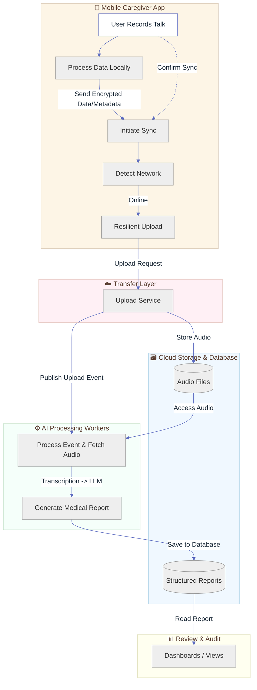

# Orchestrating the Offline‑First Healthcare Data Lifeline
## A Comprehensive Architecture & System Design Case Study for Rural Caregiver Workflows

## Table of Contents

1. [Introduction & Problem Statement](#1-introduction--problem-statement)
2. [Key Technical Challenges](#2-key-technical-challenges)
3. [High-Level Architectural Design Patterns](#3-high-level-architectural-design-patterns)
4. [Client Architecture & Tech Stack](#4-client-architecture--tech-stack)
5. [Data Security & Privacy](#5-data-security--privacy)
6. [Synchronization, Upload Strategy & Conflict Resolution](#6-synchronization-upload-strategy--conflict-resolution)
7. [Backend Infrastructure, Cost Optimization & IaC](#7-backend-infrastructure-cost-optimization--iac)
8. [Asynchronous AI Pipeline](#8-asynchronous-ai-pipeline)
9. [Observability & APM (Application Performance Monitoring)](#9-observability--apm-application-performance-monitoring)
10. [Step-by-Step Data Flow](#10-step-by-step-data-flow)
11. [Future Phase: Edge AI Fallback](#11-future-phase-edge-ai-fallback)
12. [Glossary of Key Terms & Concepts](#12-glossary-of-key-terms--concepts)
13. [Visual architecture presentation slide deck](#13-visual-architecture-presentation-slide-deck)
---

## 1. Introduction & Problem Statement
The objective of this system is to digitally transform the patient admission process (Admission Talk) conducted by healthcare caregivers. During these 30-minute sessions, critical patient information is gathered. The current paper-based, manual data entry system leads to wasted time and human error.
The primary goal is to develop a mobile application that records these conversations, processes the audio using Artificial Intelligence, and automatically generates structured reports.

**Key Constraint:** The system must be deployed in rural areas with poor coverage or complete lack of internet connectivity while the caregiver is at the patient's home.

### Figure 1: High-Level System Overview: Offline-First Caregiver Workflow
*(A conceptual view of the data lifecycle and system domains)*

## 2. Key Technical Challenges
Designing this system requires overcoming the following complex challenges:
* **Large & Variable Data Volume:** Generating and transmitting heavy audio files over unstable networks.
* **Storage Pressure:** Mobile device memory filling up if multiple consecutive sessions are recorded offline.
* **Asynchronous Processing:** AI operations are highly time-consuming; the client application must not be blocked waiting for a response.
* **Data Privacy & Security (GDPR Compliance):** Absolute necessity to encrypt highly sensitive medical data both at-rest and in-transit.

## 3. High-Level Architectural Design Patterns
To guarantee stability and scalability, this architecture is built upon two standard integration patterns:
* **Outbox Pattern:** To prevent data loss during network outages, all events and files are first written to the client's local database (acting as an Outbox) and are later synchronized with the server via a background service.
* **Claim-Check Pattern:** To prevent overloading the Message Brokers, the heavy audio payload is uploaded directly to Object Storage, and only a lightweight message containing the "File ID and URI" (the Claim-Check) is pushed into the processing queue.

| Layer / Component | Selected Technology | Design Pattern Implemented | Solves This Specific Constraint |
| :--- | :--- | :--- | :--- |
| **📱 Mobile Client DB** | WatermelonDB / RxDB | **Outbox Pattern** | Ensures zero data loss when caregiver has 0% signal in rural home. |
| **📤 File Transfer** | TUS Protocol (Resumable) | **Retry with Backoff** | Prevents wasted bandwidth when 4G drops mid-upload of a 30‑min audio file. |
| **🔒 Local Security** | AES‑256 File Encryption | **Encryption at Rest** | Compliance with GDPR Art. 32; data unreadable if device is stolen. |
| **☁️ Storage Routing** | AWS S3 / Azure Blob | **Claim‑Check Pattern** | Keeps the Message Broker (RabbitMQ) lightweight and fast. |
| **⚙️ Processing Trigger** | AWS Lambda / K8s HPA | **Event‑Driven Scaling** | Cost Optimization: Pay for compute only when audio is waiting in queue. |
| **🧠 AI Speech** | OpenAI Whisper (Cloud) | **Specialized Adapter** | Handles medical terminology and heavy accents better than native OS dictation. |
| **📋 Data Structuring** | GPT‑4o (JSON Mode) | **Prompt Engineering** | Transforms free‑form caregiver notes into strict database schema fields. |
| **🔄 Conflict Strategy** | Manual Fork Resolution | **Domain‑Specific Merge** | Prevents auto‑overwrite of critical medical notes (Patient Safety). |
  
## 4. Client Architecture & Tech Stack
To accommodate technical team requirements and modern mobile development standards, two parallel approaches are proposed for the client implementation:

### Approach A: React Native
* **Framework:** React Native for high-performance, native access to microphone and file-system APIs.
* **Offline Database:** **WatermelonDB** (or native SQLite), highly optimized for managing thousands of records offline and executing rapid synchronizations.
* **State Management:** **Redux Offline** to manage the queue of network requests during disconnections.

### Approach B: Angular & Ionic (Leveraging Enterprise Angular Architecture)
* **Framework:** Ionic Framework combined with Capacitor to compile the web application into a native mobile binary.
* **Reactive Database:** **RxDB**. This is one of the most powerful tools for Offline-First architectures in the Angular ecosystem due to its native RxJS support and built-in replication/sync mechanisms.

## 5. Data Security & Privacy
Medical data requires the highest level of security:
* **Encryption at Rest:** Immediately upon completion of the recording, the audio file is encrypted on the mobile file system using the robust **AES-256** algorithm, rendering the data unreadable if the device is stolen.
* **Encryption in Transit:** All data exchange with the server is conducted exclusively over the **TLS 1.3** protocol.
* **Cloud Access Management (IAM & Pre-signed URLs):** The processing backend (Workers) can only read files from AWS S3 via strict security roles (IAM Roles). For uploads, the client requests a **Pre-signed URL** with a limited expiration window (e.g., 15 minutes).

## 6. Synchronization, Upload Strategy & Conflict Resolution
### A) Storage Pressure Management
Before initiating a recording, the application checks the available device storage. If the available space drops below a defined threshold (e.g., less than 100 MB), the system automatically evicts (deletes) older encrypted files that have already been **successfully synced** with the server.

### B) Resumable Upload (TUS Protocol)
Given the unstable nature of rural internet, traditional upload methods (HTTP POST) risk wasting bandwidth upon failure. The system utilizes the **TUS (Resumable Uploads)** protocol. The file is divided into small chunks; if the connection drops, the upload resumes exactly from the last successful chunk upon reconnection.

### C) Conflict Resolution
In scenarios where a file is modified simultaneously offline and on the server (e.g., manual report edits), common strategies like *Last Write Wins* are discarded. For highly sensitive medical data, the system avoids Auto-Merge. Instead, it forks both versions and enforces **Manual Resolution**, delegating the final decision to the end-user or administrator.

### D) Data State Transition Table
| Stage | Local Status (Outbox) | File Location | Encryption State | Action Available |
| :--- | :--- | :--- | :--- | :--- |
| **1. Recording** | `RECORDING` | RAM Temp Buffer | None (Stream) | Stop / Cancel |
| **2. Local Storage** | `PENDING_SYNC` | App Sandbox | **AES‑256 (Encrypted)** | Retry / Delete |
| **3. Uploading** | `UPLOADING` | Chunks in Network Buffer | **TLS 1.3 (In‑Transit)** | Pause / Resume (TUS) |
| **4. Cloud Queue** | `SYNCED` | S3 (Cloud) | SSE‑S3 / KMS | Wait for AI Worker |
| **5. Processing** | `PROCESSING` | S3 + Worker Memory | Decrypted (In‑Memory) | View Status |
| **6. Completed** | `COMPLETED` | S3 + PostgreSQL | At‑Rest (Cloud) | View Report / **Auto‑Evict Local** |

## 7. Backend Infrastructure, Cost Optimization & IaC
* **Core Services:** Microservices built with **.NET Minimal APIs** for maximum speed and minimal overhead.
* **Storage Layer:** Audio files are stored in **AWS S3** or **Azure Blob Storage**, while structured data and metadata reside in a robust relational database like **PostgreSQL**.
* **Auto-scaling & Serverless (Cost Optimization):** Because caregiver workloads have unpredictable spikes throughout the day, the AI processing services (Workers) are deployed as **Serverless functions (e.g., AWS Lambda)** or using a **Horizontal Pod Autoscaler (HPA) in Kubernetes**. Scaling is triggered precisely by the **Queue Length**.
* **Infrastructure as Code (IaC):** All cloud infrastructure is provisioned using tools like **Terraform** or Pulumi, ensuring that Development, Staging, and Production environments are perfectly identical and reproducible.

## 8. Asynchronous AI Pipeline
Once the upload is successful, the client is free to proceed; it does not wait for the processing:
1.  **Message Queue:** The "upload successful" event is pushed to **RabbitMQ** or **Azure Service Bus**.
2.  **Speech-to-Text:** A Worker consumes the event and sends the audio file to a powerful transcription model like **OpenAI Whisper**, which excels at handling varied accents and specialized medical terminology.
3.  **Structured Data Extraction (LLM):** The raw text is passed to a Large Language Model (e.g., **GPT-4o**). Utilizing advanced Prompt Engineering and **JSON Mode**, the AI is instructed to extract and format specific fields (e.g., vital signs, prescribed medications, mobility needs) into a structured JSON object.

## 9. Observability & APM (Application Performance Monitoring)
To guarantee system health while serving hundreds of thousands of users, the infrastructure is heavily monitored:
* **Tools:** Integration with industry standards like **Prometheus & Grafana** or **Datadog**.
* **Key Monitored Metrics:**
    * API Error Rates (HTTP 5xx).
    * Network Response Latency.
    * CPU and Memory consumption across Worker nodes.
    * Message Queue Length (to proactively predict bottlenecks).

### A) Critical Thresholds & Actions
| Metric (Source) | Tool | Warning Threshold | Critical Action |
| :--- | :--- | :--- | :--- |
| **📱 Mobile Storage Pressure** | Client Analytics | < 200 MB Free | Trigger Auto‑Eviction of `SYNCED` files |
| **📤 Upload Success Rate** | Datadog / Prometheus | < 95% | Scale TUS Proxy / Check Rural CDN health |
| **📬 RabbitMQ Queue Length** | Grafana | > 500 Messages | Trigger **HPA Scale Out** (Add 2 Workers) |
| **🧠 Whisper API Latency** | Custom Middleware | > 45s per file | Switch to batch processing or fallback model |
| **🗄️ DB Connection Pool** | PostgreSQL Stats | > 80% Utilization | Increase `max_connections` or add Read Replica |

## 10. Step-by-Step Data Flow
1.  **Pre-check:** Mobile app verifies available local storage.
2.  **Record (Offline):** Caregiver presses record. The encrypted file (AES-256) and metadata are saved in the local DB (Outbox) with a `Pending_Sync` status.
3.  **Connection Detection:** A Background Task detects network connectivity.
4.  **Resilient Transfer:** Client initiates the resumable upload (TUS Protocol) directly to AWS S3 via Pre-signed URL.
5.  **Confirmation & Cleanup:** Server returns a Success message; the client deletes the heavy audio file from local storage and updates the status to `Synced`.
6.  **Queue Entry:** Server dispatches an event message to RabbitMQ (Claim-Check).
7.  **Cloud Processing:** A Worker picks up the file, transcribes it via Whisper, and generates a JSON report via GPT-4o.
8.  **Final Storage:** The structured report is saved in PostgreSQL, becoming instantly available for review and auditing via the web or mobile platform.

## 11. Future Phase: Edge AI Fallback
In subsequent product phases, to further reduce absolute reliance on cloud processing in areas with multi-day outages, lightweight on-device AI models (such as `Whisper.cpp`) can be integrated. This allows the mobile hardware to generate a preliminary draft report instantly, even entirely offline.

---
### **Figure 2: End‑to‑End Data Flow – Offline Recording to AI‑Generated Structured Report**

```mermaid
%%{init: {'theme':'base', 'themeVariables': {
  'background':'#FFFFFF',
  'primaryColor':'#FFFFFF',
  'primaryBorderColor':'#5c6bc0',
  'primaryTextColor':'#1E2C3A',
  'lineColor':'#5c6bc0',
  'clusterBkg':'#F8F9FA',
  'clusterBorder':'#B0BEC5',
  'titleColor':'#1E2C3A'
}}}%%
flowchart TB
    %% Style Classes for Nodes (Colorful Elements)
    classDef clientNode fill:#4A90E2,stroke:#1B4F72,stroke-width:2px,color:#fff,font-weight:bold;
    classDef uploadNode fill:#F5A623,stroke:#9A6D0B,stroke-width:2px,color:#fff,font-weight:bold;
    classDef securityNode fill:#F8E71C,stroke:#C4B000,stroke-width:2px,color:#1E2C3A,font-weight:bold;
    classDef queueNode fill:#9013FE,stroke:#4A0B8F,stroke-width:2px,color:#fff,font-weight:bold;
    classDef aiNode fill:#2ECC71,stroke:#1E8449,stroke-width:2px,color:#fff,font-weight:bold;
    classDef dbNode fill:#D0021B,stroke:#8B0015,stroke-width:2px,color:#fff,font-weight:bold;
    classDef outcomeNode fill:#1ABC9C,stroke:#0E6251,stroke-width:2px,color:#fff,font-weight:bold;
    
    %% Subgraph Styles (White / Smoke Backgrounds)
    style Client fill:#F8F9FA,stroke:#BDC3C7,stroke-width:1px,color:#2C3E50
    style Upload fill:#F8F9FA,stroke:#BDC3C7,stroke-width:1px,color:#2C3E50
    style CloudStorage fill:#F8F9FA,stroke:#BDC3C7,stroke-width:1px,color:#2C3E50
    style Processing fill:#F8F9FA,stroke:#BDC3C7,stroke-width:1px,color:#2C3E50
    style Outcome fill:#F8F9FA,stroke:#BDC3C7,stroke-width:1px,color:#2C3E50

    %% --- CLIENT SIDE (Offline) ---
    subgraph Client [📱 Mobile Caregiver Application]
        direction TB
        A[🎤 Caregiver Records<br/>Admission Talk]:::clientNode
        B[🔐 AES-256 Encryption<br/>at Rest]:::securityNode
        C[(🗄️ Local Outbox DB<br/>WatermelonDB / RxDB)]:::clientNode
        D{💾 Storage Pressure<br/>Check}:::clientNode
        E[🧹 Auto-Evict<br/>Synced Files]:::clientNode
        F[⏳ Background Sync Service]:::clientNode
        G[🌐 Network Detection]:::clientNode
        
        A --> B
        B --> C
        C --> D
        D -->|Space < 100MB| E
        D -->|OK| F
        F --> G
    end

    %% --- UPLOAD & CLAIM CHECK ---
    subgraph Upload [☁️ Resilient Transfer Layer]
        direction LR
        H[📤 TUS Resumable Upload<br/>Chunked Transfer]:::uploadNode
        I{🔗 Connection Drop?}:::uploadNode
        J[📨 Request Pre-signed URL<br/>TLS 1.3]:::securityNode
        K[🚀 Direct Upload to S3]:::uploadNode
        
        H --> I
        I -->|Yes| H
        I -->|No| J
        J --> K
    end

    %% --- CLOUD STORAGE ---
    subgraph CloudStorage [🗃️ Object Storage & Metadata]
        L[(📦 AWS S3 / Azure Blob<br/>Encrypted Audio)]:::dbNode
        M[(🐘 PostgreSQL<br/>Structured Reports)]:::dbNode
    end

    %% --- ASYNC PROCESSING PIPELINE ---
    subgraph Processing [⚙️ Serverless AI Workers]
        N[📬 RabbitMQ / Service Bus<br/>Claim-Check Message]:::queueNode
        O{📏 Queue Length Monitor}:::queueNode
        P[🔄 Horizontal Pod Autoscaler / Lambda]:::queueNode
        Q[🧠 Whisper Transcription<br/>Speech-to-Text]:::aiNode
        R[🤖 GPT-4o Extraction<br/>JSON Mode]:::aiNode
        S[📋 Structured Medical Report]:::aiNode
        
        N --> O
        O -->|Scale Trigger| P
        P --> Q
        Q --> R
        R --> S
    end

    %% --- FINAL ACCESS ---
    subgraph Outcome [📊 Review & Audit]
        T[🌍 Web Dashboard]:::outcomeNode
        U[📱 Mobile Report View]:::outcomeNode
    end

    %% --- FLOW CONNECTIONS ---
    G -->|Connectivity Available| H
    K -->|File Stored| L
    K -->|Upload Success Event| N
    L -->|File URI via Claim-Check| Q
    S --> M
    M --> T
    M --> U
    C -.->|Sync Confirmation| F
```

### 🎨 Color Key (Nodes Only)

| Component | Color | Hex Code |
| :--- | :--- | :--- |
| **Mobile Client Operations** | Royal Blue | `#4A90E2` |
| **Upload & Network** | Amber Orange | `#F5A623` |
| **Security (Encryption/URLs)** | Bright Yellow | `#F8E71C` |
| **Message Queue & Scaling** | Deep Purple | `#9013FE` |
| **AI Processing (Whisper/GPT)** | Emerald Green | `#2ECC71` |
| **Database & Object Storage** | Crimson Red | `#D0021B` |
| **Final Review Interface** | Teal | `#1ABC9C` |

---

## 12. Glossary of Key Terms & Concepts

This section provides simple, non‑technical explanations for the specialized vocabulary used throughout this architecture document.

| Term | Simple Explanation | Why It Matters for This System |
| :--- | :--- | :--- |
| **Offline‑First** | An application designed to work perfectly without internet, syncing data later when a connection becomes available. | Caregivers in rural areas with zero signal can still complete admission talks; data uploads automatically once they return to coverage. |
| **Outbox Pattern** | Instead of trying to send data immediately (and risking loss), the app saves everything locally first. A background process handles sending when the network is ready. | Prevents lost patient recordings when the 4G connection drops mid‑upload. |
| **Claim‑Check Pattern** | Large files (audio) are stored separately in cloud storage. Only a small "receipt" with the file's location travels through the processing system. | Keeps the message queue fast and cheap; the heavy 30‑minute audio file never clogs the pipeline. |
| **AES‑256** | A military‑grade encryption standard that scrambles data so it cannot be read without the correct key. | If a caregiver's phone is lost or stolen, patient audio files remain completely unreadable—mandatory for GDPR compliance. |
| **TLS 1.3** | The modern security protocol that protects data while it travels across the internet. | Ensures no one can eavesdrop on patient information during upload to the cloud. |
| **TUS Protocol (Resumable Upload)** | A method for uploading files that remembers progress. If the internet cuts out after 80% of the file is sent, it resumes from 80% instead of starting over. | Critical for rural uploads over unstable connections; avoids wasting time and mobile data. |
| **Pre‑signed URL** | A temporary, secure web address that grants permission to upload a file to cloud storage without needing a full account login. | The mobile app can upload directly to AWS S3 safely, without embedding secret cloud credentials in the app. |
| **GDPR** | General Data Protection Regulation—strict European privacy law governing how personal and medical data must be handled. | Every security and encryption decision in this design is driven by GDPR compliance requirements. |
| **Serverless / AWS Lambda** | A cloud computing model where code runs only when triggered, and you pay only for the milliseconds it executes. No permanent servers to maintain. | AI processing of audio files happens on‑demand; costs scale to zero when no one is recording. |
| **Horizontal Pod Autoscaler (HPA)** | A tool that automatically adds more processing workers when the queue gets long, and removes them when it's quiet. | Handles unpredictable spikes in caregiver activity without manual intervention or wasted cloud spending. |
| **Infrastructure as Code (IaC)** | Writing the cloud setup (servers, databases, storage) as configuration files, rather than clicking in a web console. | Ensures the testing environment is an exact copy of production—eliminating "works on my machine" surprises. |
| **Message Broker (RabbitMQ / Service Bus)** | A post‑office system for software components. One service drops off a message; another picks it up when ready. | Decouples the upload process from the AI processing. The mobile app can finish its job while the AI works in the background. |
| **Whisper (OpenAI)** | A specialized AI model designed specifically for converting spoken audio into written text. | Handles medical terminology and diverse accents far more accurately than generic phone dictation software. |
| **GPT‑4o** | A powerful large language model that can read unstructured text and extract specific information into a structured format. | Reads the transcript of a 30‑minute conversation and automatically populates the correct fields in the patient record (medications, vital signs, etc.). |
| **JSON Mode** | A setting that forces an AI model to output data in a strict, machine‑readable format with zero conversational filler. | Guarantees the AI response can be saved directly to a database without manual reformatting. |
| **Conflict Resolution (Manual Fork)** | When two versions of the same data exist (e.g., an offline edit and a simultaneous online edit), the system saves both and asks a human to decide which is correct. | Prevents automatic overwriting of critical medical information—a safety requirement for healthcare data. |
| **Observability / APM** | Tools and practices that provide a real‑time dashboard of system health: speed, errors, and resource usage. | Allows the operations team to detect a growing queue of audio files *before* it causes a delay for caregivers. |
| **Edge AI** | Running artificial intelligence directly on the mobile device, without needing to contact the cloud. | Future capability: a caregiver could receive a draft report instantly, even with zero connectivity for days. |

---

## 13. Visual Architecture Presentation (Slide Deck)

To supplement the technical documentation and provide a high-level narrative for stakeholders, the following slide deck visually breaks down the architecture. It maps the journey from the initial rural connectivity challenge to the final automated AI pipeline and future cloud roadmap.

### Presentation Overview

| Slide | Title / Focus | Key Insight |
| :--- | :--- | :--- |
| **Slide 1** | **Project Title** | Overview of the Smart Caregiver Platform. |
| **Slide 2** | **The Challenge** | Visual representation of the rural connectivity gap. |
| **Slide 3** | **Architecture Overview** | The high-level flow from Mobile to Cloud. |
| **Slide 4** | **Offline-First Design** | How the Outbox pattern and local DB work. |
| **Slide 5** | **Security & Privacy** | AES-256 and TLS 1.3 implementation for GDPR compliance. |
| **Slide 6** | **Resilient Upload** | The TUS protocol and chunked transfer logic. |
| **Slide 7** | **Async Processing** | Message Queues and the Claim-Check pattern. |
| **Slide 8** | **AI Pipeline** | Integration of OpenAI Whisper and GPT-4o. |
| **Slide 9** | **Observability** | Monitoring thresholds with Grafana & Datadog. |
| **Slide 10**| **Conclusion** | Summary of technical wins and business value. |
| **Slide 11**| **Database Schema** | Relational mapping of patients, recordings, and reports. |
| **Slide 12**| **Cloud Infrastructure** | The AWS/Azure resource map (Lambda, S3, K8s). |
| **Slide 13**| **CI/CD & IaC** | Automated deployment pipeline via Terraform. |
| **Slide 14**| **Future Roadmap** | Edge AI and advanced diagnostic integrations. |

### Presentation Slides

