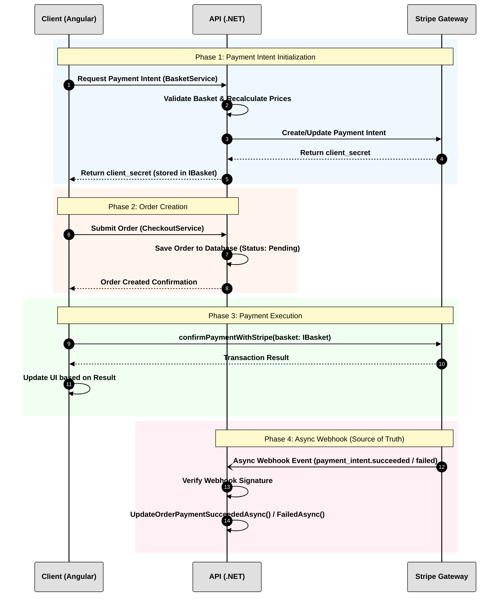

# LiliShop: Stripe Payment Process Documentation

## Table of Contents

  * **[1. Overview](https://www.google.com/search?q=%231-overview)**
  * **[2. Core Interfaces and Component Architecture](https://www.google.com/search?q=%232-core-interfaces-and-component-architecture)**
      * [Data Models](https://www.google.com/search?q=%23data-models)
      * [Client (Angular)](https://www.google.com/search?q=%23client-angular)
      * [API (.NET)](https://www.google.com/search?q=%23api-net)
  * **[3. Step-by-Step Process Flow](https://www.google.com/search?q=%233-step-by-step-process-flow)**
  * **[4. Flow Diagram](https://www.google.com/search?q=%234-flow-diagram)**
      * [Textual Sequence Summary](https://www.google.com/search?q=%23textual-sequence-summary)
  * **[5. Core Technologies and Configuration](https://www.google.com/search?q=%235-core-technologies-and-configuration)**
      * [What is a Webhook?](https://www.google.com/search?q=%23what-is-a-webhook)
      * [What is Stripe and Stripe with SCA?](https://www.google.com/search?q=%23what-is-stripe-and-stripe-with-sca)
      * [What is the Stripe SDK?](https://www.google.com/search?q=%23what-is-the-stripe-sdk)
      * [How to Configure Stripe in the Project](https://www.google.com/search?q=%23how-to-configure-stripe-in-the-project)
  * **[6. Local Development with Stripe CLI](https://www.google.com/search?q=%236-local-development-with-stripe-cli)**
      * [What are Scoop and Chocolatey?](https://www.google.com/search?q=%23what-are-scoop-and-chocolatey)
      * [Installing Scoop](https://www.google.com/search?q=%23installing-scoop)
      * [Installing the Stripe CLI](https://www.google.com/search?q=%23installing-the-stripe-cli)
      * [Authentication and Webhook Forwarding](https://www.google.com/search?q=%23authentication-and-webhook-forwarding)
      * [Version Management and Updating](https://www.google.com/search?q=%23version-management-and-updating)
  * **[7. Frequently Asked Questions (Q\&A)](https://www.google.com/search?q=%237-frequently-asked-questions-qa)**
  * **[7. Häufig gestellte Fragen (Q\&A)](https://www.google.com/search?q=%237-h%C3%A4ufig-gestellte-fragen-qa)**

## 1. Overview
This document outlines the secure payment workflow for the LiliShop project. The system architecture involves three primary entities:
* **Client (Frontend):** An Angular application responsible for capturing user input and securely submitting payment parameters to Stripe.
* **API (Backend):** A .NET application responsible for strictly validating order data, managing the database, and acting as the secure communication bridge with Stripe.
* **Stripe:** The external payment gateway handling the financial transaction.

The core security principle of this architecture is zero-trust on the client side regarding payment confirmation. All final order state changes (e.g., marking an order as paid) are executed exclusively through asynchronous webhooks sent directly from Stripe to the API.

## 2. Core Interfaces and Component Architecture

### Data Models
**`IBasket` Interface**
The interface defining the basket data structure utilized by the frontend to initiate and confirm payments:
```typescript
export interface IBasket {
  id               : string;
  items            : IBasketItem[];
  clientSecret    ?: string;
  paymentIntentId ?: string;
  deliveryMethodId?: number;
  shippingPrice   ?: number;
}
```

### Client (Angular)
* **`CheckoutPaymentComponent`**: The user interface component orchestrating the final checkout sequence.
    * `submitOrder()`: Initiates the creation of the order in the database.
    * `createOrder()`: Transmits the final order and shipping parameters to the API.
    * `confirmPaymentWithStripe(basket: IBasket)`: Extracts the `clientSecret` from the basket and the user's card details from the form state, submitting them securely to Stripe.
    * `handleSuccessfulPayment()`: Processes the preliminary success result from Stripe to update the user interface.
* **`BasketService`**: 
    * `createPaymentIntent()`: Requests the initialization or update of a Stripe payment intent from the API.
* **`CheckoutService`**:
    * `createOrder()`: Facilitates the HTTP request to the API to save the pending order.

### API (.NET)
* **`PaymentsController`**: The HTTP endpoint layer for payment operations.
    * `CreateOrUpdatePaymentIntent()`: Receives the client request to initialize the payment intent.
    * `StripeWebhook()`: The secure, unauthenticated endpoint configured in the Stripe dashboard to receive background event notifications.
* **`PaymentService`**: The business logic layer managing the payment lifecycle.
    * `CreateOrUpdatePaymentIntentAsync()`: Communicates with Stripe to create or update the `payment_intent` object.
    * `CalculateShippingPriceAsync()`: Computes the selected delivery cost.
    * `GetProductsForItemsInBasketAsync()` & `ApplyProductPricesToBasketItems()`: Queries the database to retrieve the true cost of items, recalculating the total to prevent client-side price manipulation.
    * `HandleStripeWebhookAsync()`: Parses and processes incoming Stripe events.
    * `UpdateOrderPaymentSucceededAsync()` / `UpdateOrderPaymentFailedAsync()`: Updates the authoritative order status in the database based on the webhook payload.

## 3. Step-by-Step Process Flow

**Phase 1: Payment Intent Initialization**
1.  The user adds items to the basket. The Client triggers `BasketService.createPaymentIntent()`.
2.  The API receives the request at `PaymentsController.CreateOrUpdatePaymentIntent()`.
3.  The API executes strict server-side validation. `PaymentService` discards client-submitted prices and recalculates the total utilizing exact database prices and shipping costs.
4.  The API makes a secure server-to-server call to Stripe to create or update a `payment_intent` with the validated total amount.
5.  Stripe generates and returns a unique `client_secret`. The API forwards this secret to the Client, which attaches it to the `IBasket` object.

**Phase 2: Order Creation**

6.  The user completes the checkout form and clicks submit. `CheckoutPaymentComponent.submitOrder()` is invoked.
7.  The Client calls `CheckoutService.createOrder()` to transmit shipping and basket identifiers to the API.
8.  The API creates an Order record in the database with an initial status of "Pending".

It was a mistake. The steps in the text and the diagram were not synchronized. 

Below are the corrected Section 3 and Section 4. They have been updated to map exactly 1:1, resulting in 14 synchronized steps in both the text and the diagram.

### 3. Step-by-Step Process Flow

**Phase 1: Payment Intent Initialization**
1.  **Client:** Requests the initialization of a payment intent by calling `BasketService.createPaymentIntent()`.
2.  **API:** Validates the basket contents and recalculates the total using database prices to prevent client-side manipulation.
3.  **API:** Makes a secure call to Stripe to create or update the `payment_intent`.
4.  **Stripe:** Generates and returns a unique `client_secret` to the API.
5.  **API:** Forwards the `client_secret` to the Client, which stores it in the `IBasket` object.

**Phase 2: Order Creation**

6.  **Client:** Submits the final order and shipping parameters via `CheckoutService.createOrder()`.
7.  **API:** Saves the order record to the database with an initial status of "Pending".
8.  **API:** Returns an order creation confirmation back to the Client.

**Phase 3: Payment Execution**

9.  **Client:** Immediately calls `confirmPaymentWithStripe(basket: IBasket)`, sending the `clientSecret` and card data directly to Stripe.
10. **Stripe:** Attempts to process the transaction and returns a preliminary success or failure result to the Client.
11. **Client:** Updates the user interface based on the transaction result (e.g., redirecting to a success or failure page).

**Phase 4: Webhook Confirmation (Security Layer)**

12. **Stripe:** Dispatches an asynchronous Webhook event (`payment_intent.succeeded` or `payment_failed`) to `PaymentsController.StripeWebhook()`.
13. **API:** Verifies the webhook signature using the secure endpoint secret.
14. **API:** Routes the event to `PaymentService.HandleStripeWebhookAsync()` and permanently updates the order status in the database by calling `UpdateOrderPaymentSucceededAsync()` or `UpdateOrderPaymentFailedAsync()`.

### 4. Flow Diagram




### Textual Sequence Summary

| Phase | Step | From → To | Action |
|-------|------|-----------|--------|
| **Phase 1** | 1 | Client → API | Request Payment Intent (BasketService) |
| | 2 | API → API | Validate basket & recalculate prices |
| | 3 | API → Stripe | Create/Update Payment Intent |
| | 4 | Stripe → API | Return `client_secret` |
| | 5 | API → Client | Return `client_secret` (stored in `IBasket`) |
| **Phase 2** | 6 | Client → API | Submit Order (CheckoutService) |
| | 7 | API → API | Save order to DB (Status: Pending) |
| | 8 | API → Client | Order Created Confirmation |
| **Phase 3** | 9 | Client → Stripe | `confirmPaymentWithStripe(basket: IBasket)` |
| | 10 | Stripe → Client | Transaction Result |
| | 11 | Client → Client | Update UI based on result |
| **Phase 4** | 12 | Stripe → API | Async Webhook Event (`payment_intent.succeeded` / `failed`) |
| | 13 | API → API | Verify webhook signature |
| | 14 | API → API | Update order payment status |

---
## 5. Core Technologies and Configuration

### What is a Webhook?
A webhook is an HTTP-based callback function that allows two systems to communicate automatically. Instead of the API constantly querying the payment gateway for status updates, Stripe automatically sends an HTTP request (a webhook event) to the API immediately after an event occurs, such as a successful or failed payment. This mechanism is critical for system security because it relies on server-to-server communication, preventing malicious users from manipulating payment statuses on the frontend.

### What is Stripe and Stripe with SCA?
**Stripe** is a global payment processing platform that provides the infrastructure to securely accept and manage online transactions.

**Stripe with SCA (Strong Customer Authentication)** refers to compliance with European regulatory rules designed to reduce fraud. SCA requires online payments to be verified using at least two independent authentication elements (e.g., a password and a fingerprint). When using Stripe's `PaymentIntent` system, Stripe automatically handles SCA requirements. If a customer's bank requires additional authentication, Stripe will trigger a modal (like 3D Secure) in the frontend, requiring the customer to verify the transaction via their banking app or an SMS code before the payment is confirmed.

### What is the Stripe SDK?
An SDK (Software Development Kit) is a collection of pre-built code libraries provided directly by Stripe. 

* **Why we need it:** Interacting with Stripe's raw REST APIs manually requires complex logic for handling HTTP requests, data serialization, authentication, and cryptographic webhook signature verification. The SDK abstracts this complexity, reducing development time and minimizing the risk of security errors.
* **How we use it:** We implement the SDK into our specific development environments (Angular and .NET). It provides dedicated classes and methods that allow developers to execute Stripe operations cleanly.

### How to Configure Stripe in the Project

The configuration is divided into two distinct environments to separate public capabilities from secret backend operations.

**Frontend Configuration (Angular)**
The frontend requires the **Publishable Key** to connect to the Stripe account safely. This key is safe to expose in the browser. Instead of relying on a Node package manager (NPM) installation, the frontend injects the Stripe library directly into the browser and initializes it using a custom helper function.

1. **Loading the Stripe Script:** The Stripe JavaScript library (`v3`) is injected dynamically into the Document Object Model (DOM) via the `index.html` file. This ensures the required Stripe objects are available globally in the browser when the user reaches the checkout page.
   ```html
   loadStripe: function() {
       const script = document.createElement('script');
       script.src = 'https://js.stripe.com/v3/';
       script.async = true;
       script.crossOrigin = 'anonymous';
       document.body.appendChild(script);
   }
   ```
2. **Initialization:** In the `CheckoutPaymentComponent`, the application uses a custom utility function (`getStripeInstance`) to initialize the Stripe object with the public key. 
   ```typescript
   // In checkout-payment.component.ts
   this.stripe = getStripeInstance('pk_test_your_publishable_key');
   ```
   *Note: This initialized `this.stripe` object is then used later to mount the card input elements and call `confirmCardPayment`.*

**Backend Configuration (.NET API)**
The backend uses the Stripe .NET SDK to validate totals, create payment intents, and verify incoming webhook events.

1. **Installation:** Run the following command in the terminal or use the NuGet Package Manager:
   ```bash
   dotnet add package Stripe.net
   ```
2. **Configuration:** The backend requires the **Secret Key** and the **Webhook Secret**. These keys grant full access to your Stripe account and must remain strictly confidential on the server.
   ```csharp
   // Configured in Program.cs
   StripeConfiguration.ApiKey = builder.Configuration["StripeSettings:SecretKey"];
   ```
3. **Webhook Verification:** The Webhook Secret is utilized inside the `PaymentsController` to cryptographically verify that the incoming HTTP webhook events actually originated from Stripe and not from an unauthorized source.

-----
## 6\. Local Development with Stripe CLI

When developing locally, Stripe cannot send webhook events directly to your `localhost` because your local server is not exposed to the public internet. The **Stripe CLI (Command Line Interface)** solves this by securely tunneling webhook events from your Stripe account directly to your local .NET API.

### What are Scoop and Chocolatey?

To install the Stripe CLI on Windows, it is best to use a package manager.

  * **Chocolatey (Choco):** A traditional, machine-level package manager for Windows that often requires Administrator privileges to install and manage software.
  * **Scoop:** A lightweight, user-level package manager for Windows that installs programs in your home directory, avoiding path pollution and rarely requiring Administrator privileges for standard use.

### Installing Scoop

If you choose to use Scoop, you can install it via PowerShell with the following command:

```powershell
iwr -useb get.scoop.sh | iex
```

**Understanding the parameters:**

  * `iwr`: An alias for `Invoke-WebRequest`, which downloads content from the internet.
  * `-useb`: An alias for `-UseBasicParsing`. This tells PowerShell to use a basic parser instead of relying on the Internet Explorer engine, making the request faster and more reliable.
  * `get.scoop.sh`: The URL of the installation script.
  * `|` (Pipe): Takes the downloaded script from the first command and passes it directly to the second command.
  * `iex`: An alias for `Invoke-Expression`, which executes the script downloaded by `iwr`.

### Installing the Stripe CLI

Once your preferred package manager is ready, you can install the Stripe CLI.

**Using Scoop:**

```powershell
scoop install stripe
```

**Using Chocolatey:**

```powershell
choco install stripe-cli
```

### Authentication and Webhook Forwarding

After installation, you must link the CLI to your Stripe account.

**1. Logging In**
Run the login command in your terminal. This will output a pairing code and open your web browser to authenticate your account.

```powershell
stripe login
```

*(To remove your credentials from the local machine at any time, run `stripe logout`)*

**2. Forwarding Webhooks**
Once authenticated, instruct the CLI to listen for events and forward them to your local .NET API webhook endpoint:

```powershell
stripe listen -f http://localhost:6001/api/payments/webhook
```

When you run this command, the CLI will output a webhook signing secret (e.g., `whsec_...`). You must copy this secret and place it in your backend configuration (e.g., `appsettings.Development.json`) to verify the events securely. This secret corresponds to the webhook configuration seen in your Stripe Dashboard.

### Version Management and Updating

To ensure you have the latest features and security updates, it is important to keep the CLI updated. You can check your current version at any time:

```powershell
stripe version
```

Occasionally, when running commands, Stripe will notify you if a newer version is available.

**Updating the CLI**
When an update is required, **you must open PowerShell in Administrator mode** to apply the upgrade successfully.

**To update via Chocolatey:**

```powershell
choco upgrade stripe-cli
```

**To update via Scoop:**

```powershell
scoop update stripe
```

-

-

-

-


---
## 7. Frequently Asked Questions (Q&A)

**Q1: In this architecture, why does the backend not trust the frontend to confirm that a payment was successful?**

**A:** This is a fundamental security principle called "zero-trust." The frontend runs in the user's browser, which means a malicious user could manipulate the code or intercept network requests to send a fake "success" message to the backend. To prevent this, the backend only considers a payment successful when it receives a secure, cryptographically signed webhook directly from Stripe's servers.

**Q2: During checkout, why does the API recalculate the basket total instead of just using the total sent by the client?**

**A:** Similar to the zero-trust principle above, a user could manipulate the HTTP request payload before sending it to the API, changing the price of an expensive item to 1 cent. The backend must always query the database for the true prices of the items and recalculate the total on the server side before creating the `payment_intent` with Stripe.

**Q3: What is the difference between the `client_secret` and the Webhook Secret?**

**A:** The **`client_secret`** is generated by Stripe for a specific `payment_intent`. It is sent to the frontend so the browser can securely send the user's card details directly to Stripe to attempt the charge. 
* The **Webhook Secret** is a static key configured in the backend (.NET API). It is strictly confidential and is used to cryptographically verify that incoming asynchronous events (like `payment_intent.succeeded`) were genuinely sent by Stripe and not forged by an attacker.

**Q4: What is SCA (Strong Customer Authentication), and how does your system handle it?**

**A:** SCA is a European regulatory requirement to reduce fraud by requiring multi-factor authentication for online payments (like 3D Secure). By using Stripe's SDK and `PaymentIntent` system, the complexity is abstracted. If the customer's bank requires SCA, Stripe's SDK automatically intercepts the flow and displays a secure modal to the user (e.g., asking for an SMS code) before the payment is finalized.

**Q5: How do you test Stripe webhooks in a local development environment since Stripe cannot reach `localhost`?**

**A:** You use the **Stripe CLI**. By running `stripe listen -f http://localhost:6001/api/payments/webhook`, the CLI creates a secure tunnel. It intercepts events from your Stripe dashboard and forwards them directly to your local .NET API endpoint, allowing you to test the entire webhook confirmation cycle without deploying to a public server.

---
## 7. Häufig gestellte Fragen (Q&A)

**F1: Warum vertraut das Backend in dieser Architektur nicht darauf, dass das Frontend eine erfolgreiche Zahlung bestätigt?**

**A:** Dies ist ein grundlegendes Sicherheitsprinzip namens "Zero-Trust" (Null-Vertrauen). Das Frontend läuft im Browser des Benutzers, was bedeutet, dass ein böswilliger Benutzer den Code manipulieren oder Netzwerkanfragen abfangen könnte, um eine gefälschte "Erfolgs"-Nachricht an das Backend zu senden. Um dies zu verhindern, betrachtet das Backend eine Zahlung nur dann als erfolgreich, wenn es einen sicheren, kryptografisch signierten Webhook direkt von den Stripe-Servern erhält.

**F2: Warum berechnet die API beim Checkout die Warenkorbsumme neu, anstatt einfach die vom Client gesendete Summe zu verwenden?**

**A:** Ähnlich wie beim oben genannten Zero-Trust-Prinzip könnte ein Benutzer die HTTP-Anfrage manipulieren, bevor sie an die API gesendet wird, und so den Preis eines teuren Artikels auf 1 Cent ändern. Das Backend muss immer die wahren Preise der Artikel aus der Datenbank abfragen und die Summe serverseitig neu berechnen, bevor der `payment_intent` bei Stripe erstellt wird.

**F3: Was ist der Unterschied zwischen dem `client_secret` und dem Webhook-Secret?**

**A:** Das **`client_secret`** wird von Stripe für einen bestimmten `payment_intent` generiert. Es wird an das Frontend gesendet, damit der Browser die Kartendaten des Benutzers sicher und direkt an Stripe senden kann, um die Abbuchung durchzuführen. 
* Das **Webhook-Secret** ist ein statischer Schlüssel, der im Backend (.NET API) konfiguriert ist. Er ist streng vertraulich und wird verwendet, um kryptografisch zu überprüfen, ob eingehende asynchrone Ereignisse (wie `payment_intent.succeeded`) wirklich von Stripe gesendet und nicht von einem Angreifer gefälscht wurden.

**F4: Was ist SCA (Strong Customer Authentication) und wie geht Ihr System damit um?**

**A:** SCA ist eine europäische Vorschrift zur Betrugsbekämpfung, die eine Multi-Faktor-Authentifizierung für Online-Zahlungen vorschreibt (wie 3D Secure). Durch die Verwendung des Stripe SDKs und des `PaymentIntent`-Systems wird diese Komplexität abstrahiert. Wenn die Bank des Kunden SCA verlangt, fängt das Stripe SDK den Ablauf automatisch ab und zeigt dem Benutzer ein sicheres Fenster (z. B. zur Eingabe eines SMS-Codes), bevor die Zahlung abgeschlossen wird.

**F5: Wie testen Sie Stripe-Webhooks in einer lokalen Entwicklungsumgebung, da Stripe `localhost` nicht erreichen kann?**

**A:** Man verwendet die **Stripe CLI**. Durch das Ausführen von `stripe listen -f http://localhost:6001/api/payments/webhook` erstellt die CLI einen sicheren Tunnel. Sie fängt Ereignisse von Ihrem Stripe-Dashboard ab und leitet sie direkt an Ihren lokalen .NET-API-Endpunkt weiter. So können Sie den gesamten Webhook-Bestätigungszyklus testen, ohne Ihre Anwendung auf einem öffentlichen Server bereitstellen zu müssen.


