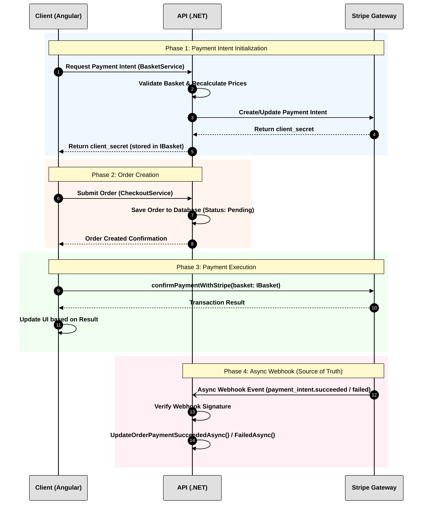

# LiliShop: Stripe Payment Process Documentation

## 1. Overview
This document outlines the secure payment workflow for the LiliShop project. The system architecture involves three primary entities:
* **Client (Frontend):** An Angular application responsible for capturing user input and securely submitting payment parameters to Stripe.
* **API (Backend):** A .NET application responsible for strictly validating order data, managing the database, and acting as the secure communication bridge with Stripe.
* **Stripe:** The external payment gateway handling the financial transaction.

The core security principle of this architecture is zero-trust on the client side regarding payment confirmation. All final order state changes (e.g., marking an order as paid) are executed exclusively through asynchronous webhooks sent directly from Stripe to the API.

## 2. Core Interfaces and Component Architecture

### Data Models
**`IBasket` Interface**
The interface defining the basket data structure utilized by the frontend to initiate and confirm payments:
```typescript
export interface IBasket {
  id               : string;
  items            : IBasketItem[];
  clientSecret    ?: string;
  paymentIntentId ?: string;
  deliveryMethodId?: number;
  shippingPrice   ?: number;
}
```

### Client (Angular)
* **`CheckoutPaymentComponent`**: The user interface component orchestrating the final checkout sequence.
    * `submitOrder()`: Initiates the creation of the order in the database.
    * `createOrder()`: Transmits the final order and shipping parameters to the API.
    * `confirmPaymentWithStripe(basket: IBasket)`: Extracts the `clientSecret` from the basket and the user's card details from the form state, submitting them securely to Stripe.
    * `handleSuccessfulPayment()`: Processes the preliminary success result from Stripe to update the user interface.
* **`BasketService`**: 
    * `createPaymentIntent()`: Requests the initialization or update of a Stripe payment intent from the API.
* **`CheckoutService`**:
    * `createOrder()`: Facilitates the HTTP request to the API to save the pending order.

### API (.NET)
* **`PaymentsController`**: The HTTP endpoint layer for payment operations.
    * `CreateOrUpdatePaymentIntent()`: Receives the client request to initialize the payment intent.
    * `StripeWebhook()`: The secure, unauthenticated endpoint configured in the Stripe dashboard to receive background event notifications.
* **`PaymentService`**: The business logic layer managing the payment lifecycle.
    * `CreateOrUpdatePaymentIntentAsync()`: Communicates with Stripe to create or update the `payment_intent` object.
    * `CalculateShippingPriceAsync()`: Computes the selected delivery cost.
    * `GetProductsForItemsInBasketAsync()` & `ApplyProductPricesToBasketItems()`: Queries the database to retrieve the true cost of items, recalculating the total to prevent client-side price manipulation.
    * `HandleStripeWebhookAsync()`: Parses and processes incoming Stripe events.
    * `UpdateOrderPaymentSucceededAsync()` / `UpdateOrderPaymentFailedAsync()`: Updates the authoritative order status in the database based on the webhook payload.

## 3. Step-by-Step Process Flow

**Phase 1: Payment Intent Initialization**
1.  The user adds items to the basket. The Client triggers `BasketService.createPaymentIntent()`.
2.  The API receives the request at `PaymentsController.CreateOrUpdatePaymentIntent()`.
3.  The API executes strict server-side validation. `PaymentService` discards client-submitted prices and recalculates the total utilizing exact database prices and shipping costs.
4.  The API makes a secure server-to-server call to Stripe to create or update a `payment_intent` with the validated total amount.
5.  Stripe generates and returns a unique `client_secret`. The API forwards this secret to the Client, which attaches it to the `IBasket` object.

**Phase 2: Order Creation**

6.  The user completes the checkout form and clicks submit. `CheckoutPaymentComponent.submitOrder()` is invoked.
7.  The Client calls `CheckoutService.createOrder()` to transmit shipping and basket identifiers to the API.
8.  The API creates an Order record in the database with an initial status of "Pending".

It was a mistake. The steps in the text and the diagram were not synchronized. 

Below are the corrected Section 3 and Section 4. They have been updated to map exactly 1:1, resulting in 14 synchronized steps in both the text and the diagram.

### 3. Step-by-Step Process Flow

**Phase 1: Payment Intent Initialization**
1.  **Client:** Requests the initialization of a payment intent by calling `BasketService.createPaymentIntent()`.
2.  **API:** Validates the basket contents and recalculates the total using database prices to prevent client-side manipulation.
3.  **API:** Makes a secure call to Stripe to create or update the `payment_intent`.
4.  **Stripe:** Generates and returns a unique `client_secret` to the API.
5.  **API:** Forwards the `client_secret` to the Client, which stores it in the `IBasket` object.

**Phase 2: Order Creation**

6.  **Client:** Submits the final order and shipping parameters via `CheckoutService.createOrder()`.
7.  **API:** Saves the order record to the database with an initial status of "Pending".
8.  **API:** Returns an order creation confirmation back to the Client.

**Phase 3: Payment Execution**

9.  **Client:** Immediately calls `confirmPaymentWithStripe(basket: IBasket)`, sending the `clientSecret` and card data directly to Stripe.
10. **Stripe:** Attempts to process the transaction and returns a preliminary success or failure result to the Client.
11. **Client:** Updates the user interface based on the transaction result (e.g., redirecting to a success or failure page).

**Phase 4: Webhook Confirmation (Security Layer)**

12. **Stripe:** Dispatches an asynchronous Webhook event (`payment_intent.succeeded` or `payment_failed`) to `PaymentsController.StripeWebhook()`.
13. **API:** Verifies the webhook signature using the secure endpoint secret.
14. **API:** Routes the event to `PaymentService.HandleStripeWebhookAsync()` and permanently updates the order status in the database by calling `UpdateOrderPaymentSucceededAsync()` or `UpdateOrderPaymentFailedAsync()`.

### 4. Flow Diagram




### Textual Sequence Summary

| Phase | Step | From → To | Action |
|-------|------|-----------|--------|
| **Phase 1** | 1 | Client → API | Request Payment Intent (BasketService) |
| | 2 | API → API | Validate basket & recalculate prices |
| | 3 | API → Stripe | Create/Update Payment Intent |
| | 4 | Stripe → API | Return `client_secret` |
| | 5 | API → Client | Return `client_secret` (stored in `IBasket`) |
| **Phase 2** | 6 | Client → API | Submit Order (CheckoutService) |
| | 7 | API → API | Save order to DB (Status: Pending) |
| | 8 | API → Client | Order Created Confirmation |
| **Phase 3** | 9 | Client → Stripe | `confirmPaymentWithStripe(basket: IBasket)` |
| | 10 | Stripe → Client | Transaction Result |
| | 11 | Client → Client | Update UI based on result |
| **Phase 4** | 12 | Stripe → API | Async Webhook Event (`payment_intent.succeeded` / `failed`) |
| | 13 | API → API | Verify webhook signature |
| | 14 | API → API | Update order payment status |

