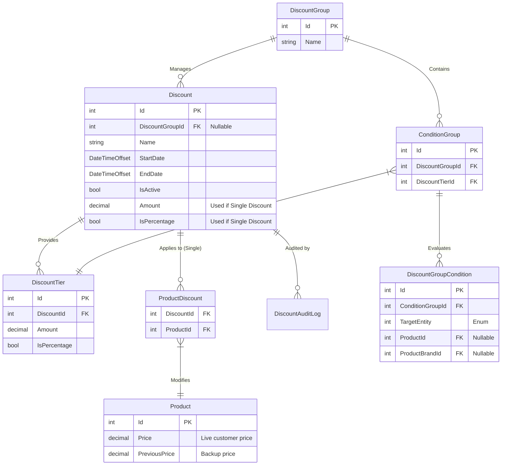
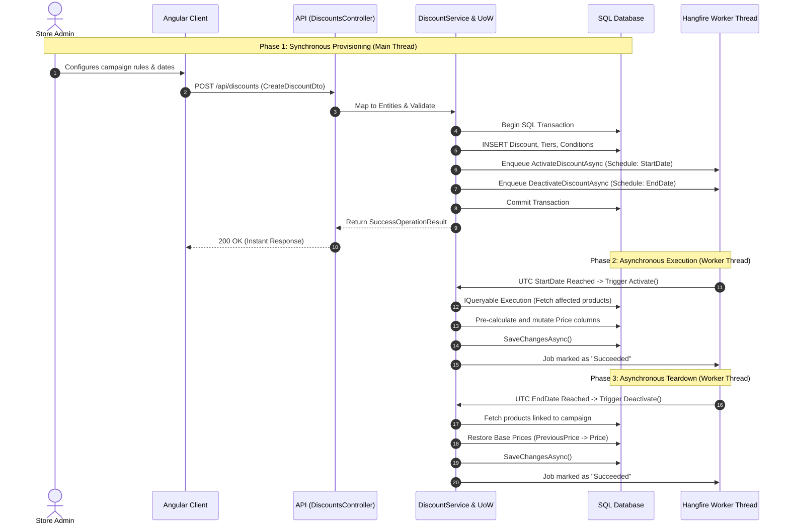

# Discount System Documentation (Lilishop)

## A. Introduction to the Discount System in Lilishop

### Business Goals and Requirements
The Lilishop discount system allows administrators to manage product pricing dynamically across the e-commerce platform without overwriting historical base prices. The system is designed to meet the following business requirements:
* **Flexibility:** Support percentage-based reductions, fixed-amount deductions, and free shipping triggers.
* **Granular Targeting:** Apply targeted discounts to single products (`ProductDiscount`) or execute store-wide campaigns based on entity relationships (Brands, Product Types, Sizes).
* **Automated Scheduling:** Execute campaign state transitions (activation/deactivation) asynchronously based on UTC timestamps.
* **Read-Heavy Optimization:** Ensure the customer-facing storefront requires zero mathematical calculation at runtime to determine the live price.

### High-Level Architectural Overview
Running store-wide sales traditionally poses a risk of data loss (overwriting base prices) or degraded storefront performance (calculating active discounts per request). 

Lilishop solves this using a **Pre-Calculation Architecture** managed by asynchronous background workers. The system is divided into two primary execution models:
1. **Single Discounts:** Direct, highest-priority overrides mapped via the `ProductDiscount` table directly to a single `Product`.
2. **Group Discounts:** Rule-based campaigns utilizing a multi-tier conditional engine (`DiscountGroup`, `ConditionGroup`) to evaluate database-wide entity targets.

Instead of calculating prices on the fly, the system schedules Hangfire background jobs to physically mutate the active `Price` column at the exact start time, utilizing a `PreviousPrice` column as a safe historical backup.

***

## B. How a Single Discount Works (Algorithm and Execution)

### System Logic
A single discount is a direct 1:1 mapping applied to a specific product. It serves as the highest-priority pricing rule in the application, inherently bypassing broader `DiscountGroup` conditions. 

### Price Calculation Flow
To guarantee $O(1)$ read performance on the storefront frontend, the system pre-calculates the final price during the update/activation phase. When an administrator provisions a single discount via the UI, the C# backend (`DiscountService` and `ProductMapper`) executes the following sequence:

1. **State Preservation:** The application securely copies the user-defined base price into the `PreviousPrice` column.
2. **Calculation Execution:** The system evaluates the `Discount` entity payload (`Amount`, `IsPercentage`). 
   * For percentages: `Price = BasePrice - (BasePrice * (Amount / 100m))`
   * For fixed amounts: `Price = BasePrice - Amount`
3. **Failsafe Clamping:** A mathematical failsafe guarantees the final evaluated price never drops below `0`.
4. **Persistence:** The calculated live price is written to the `Price` column. 

When a user requests the product via the Storefront API, the `ProductToReturnDto` strictly reads these two primitive columns, completely entirely avoiding relational database joins to the `Discount` tables.

### Handling Active State Updates
A critical edge case involves administrators modifying the base price of a product *while* a single discount is actively running. 

Inside `MapUpdateDtoToProductAsync()`, the system employs live state detection. If a modification is submitted while a sale is active (`StartDate <= UtcNow <= EndDate`), the backend intercepts the new base price, routes it directly to `PreviousPrice`, and recalculates the final `Price` inline before committing to the database.

When the single discount expires or is manually deactivated, the `DiscountService.RestorePricesForAffectedProductsAsync()` method is invoked to seamlessly swap `PreviousPrice` back to the `Price` column.

***

## C. Group Discounts and the Rules Engine

While a Single Discount applies directly to one product, a **Group Discount** applies to many products based on specific rules (for example, "20% off all Nike shoes").

Because the store might have thousands of products, the system cannot link the discount to each product manually. Instead, it uses a dynamic rules engine to find the right products automatically.

### Multi-Tier Rules Structure
A large promotional campaign often has different levels (tiers) of discounts. The database handles this using three main tables:
1. **DiscountGroup:** The main container that holds the start and end dates for the entire campaign.
2. **DiscountTier:** The specific discount value (for example, 10% off or $15 off).
3. **ConditionGroup:** A set of rules (Brand, Type, Size) that determine exactly which products receive this specific tier.

### Dynamic Filtering and the "ALL" Rule
Administrators can target specific categories using the `DiscountTargetType` enum (Product, Brand, Type, or Size). 

If an administrator selects "ALL" for a category (for example, "All Types"), the system stores a `null` value. To handle this efficiently, the C# backend checks `.HasValue` before applying any LINQ `.Where()` filters. If the value is `null`, the system completely skips the filter. This ensures Entity Framework includes all products in that category, rather than searching for products with a missing ID.

### Activation Logic (Code Implementation)
The core business logic runs inside the `DiscountService`. When it is time for a campaign to start, the background worker executes `ActivateDiscountByIdAsync()`. 

This method performs the following steps:
1. Eagerly loads the discount and all related condition groups from the database.
2. Dynamically builds a LINQ query based on the active rules.
3. Retrieves the list of all matching products.
4. Passes the products to a helper method that backs up the base price and applies the math.

Below is the complete implementation of this activation logic:

<details>
<summary><b>Code: ActivateDiscountByIdAsync(int discountId)</b></summary>
<br>

```csharp
public async Task<IOperationResult> ActivateDiscountByIdAsync(int discountId)
{
    // 1. Fetch the discount and eagerly load all related rule tables
    var discount = await _unitOfWork.Context.Set<Discount>()
        .Include(d => d.Tiers)
        .Include(d => d.DiscountGroup)
            .ThenInclude(dg => dg.ConditionGroups)
                .ThenInclude(cg => cg.DiscountGroupConditions)
        .Include(d => d.DiscountGroup)
            .ThenInclude(dg => dg.ConditionGroups)
                .ThenInclude(cg => cg.DiscountTier) 
        .FirstOrDefaultAsync(d => d.Id == discountId);

    if (discount == null)
    {
        return new FailureOperationResult(ErrorCode.ResourceNotFound, "Discount not found.");
    }

    var productsSet = _unitOfWork.Context.Set<Product>();

    // Scenario 1: Single Discount (Direct product mapping, no complex rules)
    if (discount.DiscountGroup == null)
    {
        var appliedTier = discount.Tiers.FirstOrDefault();
        if (appliedTier != null)
        {
            var productDiscountsSet = _unitOfWork.Context.Set<ProductDiscount>();
            var affectedProducts = await productDiscountsSet
                .Where(pd => pd.DiscountId == discountId)
                .Select(pd => pd.Product)
                .ToListAsync();

            ApplyTierToProducts(affectedProducts, appliedTier);
        }
    }
    // Scenario 2: Group Discount (Dynamic rules engine)
    else
    {
        var productCharacteristicsSet = _unitOfWork.Context.Set<ProductCharacteristic>();

        // Iterate through each logical rule box
        foreach (var conditionGroup in discount.DiscountGroup.ConditionGroups)
        {
            var appliedTier = conditionGroup.DiscountTier;
            if (appliedTier == null) continue;

            // Start a fresh query for the entire product catalog
            var query = productsSet.AsQueryable();

            // Dynamically append filters based on the database conditions
            foreach (var cond in conditionGroup.DiscountGroupConditions)
            {
                // .HasValue safely bypasses the filter if the target is "ALL"
                if (cond.TargetEntity == DiscountTargetType.Product && cond.ProductId.HasValue)
                    query = query.Where(p => p.Id == cond.ProductId.Value);

                else if (cond.TargetEntity == DiscountTargetType.ProductBrand && cond.ProductBrandId.HasValue)
                    query = query.Where(p => p.ProductBrandId == cond.ProductBrandId.Value);

                else if (cond.TargetEntity == DiscountTargetType.ProductType && cond.ProductTypeId.HasValue)
                    query = query.Where(p => p.ProductTypeId == cond.ProductTypeId.Value);

                else if (cond.TargetEntity == DiscountTargetType.Size && cond.SizeClassificationId.HasValue)
                    query = query.Where(p => productCharacteristicsSet.Any(pc => pc.ProductId == p.Id && pc.SizeClassificationId == cond.SizeClassificationId.Value));
            }

            // Execute the generated query against the database
            var affectedProducts = await query.ToListAsync();
            
            // Backup base prices and apply the discount math
            ApplyTierToProducts(affectedProducts, appliedTier);
        }
    }

    await _unitOfWork.CompleteAsync();
    await InvalidateDiscountCacheAsync();

    return new SuccessOperationResult("Discount activated successfully.");
}
```
</details>

***

## D. Relational Database Architecture (ERD & Entities)

The discount system relies on a highly normalized SQL database design to ensure data integrity while keeping the storefront fast. By strictly separating one-off `ProductDiscounts` from the dynamic `DiscountGroup` conditions, we avoid running heavy rules-engine queries for simple single-item sales.

### Entity Relationship Diagram (ERD)

Below is the architectural mapping of the discount system's core entities. Notice how the `Discount` table gracefully handles both standalone single discounts and complex group campaigns based on the nullability of its Foreign Key.



### Core Table Responsibilities

* **`Discount`**: The central entity representing a scheduled campaign. 
  * **For Single Discounts:** When `DiscountGroupId` is `NULL`, this table directly stores the exact financial variables (`Amount` and `IsPercentage`) needed to calculate the price drop.
  * **For Group Campaigns:** When linked to a `DiscountGroup`, it acts as a scheduling wrapper (`StartDate`, `EndDate`, `IsActive`), delegating the financial rules to the `DiscountTier` table.
* **`ProductDiscount`**: A highly efficient many-to-many junction table strictly used for **Single Discounts**. It directly maps a `DiscountId` to a `ProductId`, bypassing the rules engine entirely for simple use cases.
* **`DiscountTier`**: Stores the specific discount values for a group campaign. Because a single "Summer Sale" (`DiscountGroup`) might offer 10% off shirts but 30% off shoes, the financial variables are abstracted into Tiers.
* **`ConditionGroup` & `DiscountGroupCondition`**: The logical rules engine. `ConditionGroup` acts as the `AND` wrapper connecting targeting predicates (the Conditions) to a specific `DiscountTier`.
* **`DiscountAuditLog`**: Essential for state tracking in financial applications. It records the exact UTC timestamp, the admin's identity, and the specific mutation (`Created`, `Updated`, `Deleted`) applied to any discount.
* **`Product` (Pricing Columns)**: The `Product` table deliberately avoids calculating prices via SQL `JOIN`s to the discount tables on read requests. Instead, active discounts mathematically mutate the `Price` column while the original value is safely cached in `PreviousPrice`. This denormalized read-strategy guarantees $O(1)$ performance for customer page loads.


***

## E. Step-by-Step Execution Flow (Campaign Creation)

To understand how the relational entities interact during Creation, consider a standard operational scenario: an administrator schedules a **"Summer Clearance Sale"** offering a **20% reduction on all Nike Shoes**.

Instead of simple CRUD operations, this requires constructing a complex nested graph of entities. Here is the exact execution pipeline when the client submits the campaign to the backend:

1. **Payload Reception:** The Angular client submits a complex JSON payload to the `POST /api/discounts` endpoint. The `DiscountsController` receives this payload bound to a `CreateDiscountDto`.
2. **Entity Mapping:** The DTO is passed to the `DiscountMapper`. The mapper translates the flattened DTO structure into a hierarchical Domain Entity graph:
   * Instantiates the root `Discount` entity.
   * Instantiates a `DiscountTier` (Amount: 20, IsPercentage: true).
   * Instantiates a `ConditionGroup` containing two `DiscountGroupCondition` records (Target 1: ProductBrandId = 'Nike', Target 2: ProductTypeId = 'Shoes').
3. **Validation & Business Rules:** The `DiscountService` evaluates the mapped entities, ensuring dates are logically sequential (Start Date < End Date) and that the specific conditions do not create logical paradoxes.
4. **Persistence:** The validated entity graph is handed off to the Repository layer for database insertion. 

---

## F. Backend Persistence and Transaction Safety

Because saving a Group Discount involves inserting rows across up to five different SQL tables (`Discount`, `DiscountTier`, `DiscountGroup`, `ConditionGroup`, `DiscountGroupCondition`), the system is highly vulnerable to partial writes if a database failure occurs mid-execution. 

To guarantee data integrity, Lilishop strictly utilizes the **Repository Pattern** wrapped within a **Unit of Work (`IUnitOfWork`)**.

### The IUnitOfWork Pipeline
The `DiscountService` never interacts with `DbContext` directly. Instead, it orchestrates writes through the Unit of Work. This ensures that all Entity Framework `Add()` or `Update()` commands are cached in memory and dispatched to the SQL server in a single, batched transaction.

### Transactional Rollback Safety
For critical operations like creating or deleting a complex campaign, the service explicitly opens a database transaction. This acts as an "all-or-nothing" safety net.

Below is the architectural pattern utilized inside the `DiscountService` to ensure safety:

<details>
<summary><b>Code: CreateDiscountAsync(CreateDiscountDto dto)</b></summary>
<br>
  
```csharp
public async Task<IOperationResult<Discount>> CreateDiscountAsync(CreateDiscountDto dto)
{
    try
    {
        /* Map tiers (index matters!) */
        var tiers = dto.Tiers?
            .Select(t => new DiscountTier
            {
                Amount = t.Amount,
                IsPercentage = t.IsPercentage,
                IsFreeShipping = t.IsFreeShipping
            })
            .ToList();

        // Create the Discount shell (no single–product fields now)
        var discount = new Discount
        {
            Name = dto.Name,
            StartDate = dto.StartDate,
            EndDate = dto.EndDate,
            IsActive = dto.IsActive,
            Tiers = tiers,
        };

        /* Build the optional DiscountGroup + ConditionGroups */
        if (dto.DiscountGroup is not null && dto.DiscountGroup.ConditionGroups?.Any() == true)
        {
            // Name fallback + length‑guard
            var groupName = string.IsNullOrWhiteSpace(dto.DiscountGroup.Name)
                ? $"DiscountGroup-{dto.Name}-{DateTimeOffset.UtcNow.Ticks}"
                : dto.DiscountGroup.Name;
            groupName = groupName.Length > 100 ? groupName[..100] : groupName;

            var discountGroup = new DiscountGroup
            {
                Name = groupName,
                ConditionGroups = new List<ConditionGroup>()
            };

            foreach (var cgDto in dto.DiscountGroup.ConditionGroups)
            {
                // Tier‑index validation
                if (cgDto.TierIndex < 0 || cgDto.TierIndex >= discount.Tiers?.Count)
                {
                    return new FailureOperationResult<Discount>(ErrorCode.InvalidData, $"TierIndex {cgDto.TierIndex} is out of range.");
                }

                // pick the actual DiscountTier object
                var matchingTier = tiers[cgDto.TierIndex];

                var conditionGroup = new ConditionGroup
                {
                    DiscountGroupConditions = cgDto.Conditions?.Select(cond => new DiscountGroupCondition
                    {
                        TargetEntity = cond.TargetEntity,
                        ProductBrandId = DetermineValueForTargetEntityId(cond, DiscountTargetType.ProductBrand),
                        ProductTypeId = DetermineValueForTargetEntityId(cond, DiscountTargetType.ProductType),
                        SizeClassificationId = DetermineValueForTargetEntityId(cond, DiscountTargetType.Size),
                        ProductId = DetermineValueForTargetEntityId(cond, DiscountTargetType.Product),
                    }).ToList() ?? new List<DiscountGroupCondition>(),

                    // link the ConditionGroup to its DiscountTier
                    DiscountTier = matchingTier,
                };

                discountGroup.ConditionGroups.Add(conditionGroup);
            }

            discount.DiscountGroup = discountGroup;
        }
        else
        {
            // No conditions, apply to all
            discount.DiscountGroup = null;
        }

        var createdDiscount = await _unitOfWork.Repository<Discount>().AddAsync(discount);
        var result = await _unitOfWork.CompleteAsync();

        if (result <= 0)
        {
            return new FailureOperationResult<Discount>(ErrorCode.SaveOperationFailed, "Failed to save the discount.");
        }

        return new SuccessOperationResult<Discount>(createdDiscount, "Discount created successfully.");
    }
    catch (Exception ex)
    {
        _logger.LogError(ex, "An unexpected error occurred while creating the discount");
        return new FailureOperationResult<Discount>(ErrorCode.CreationFailed, "An unexpected error occurred while creating the discount");
    }
}
```
</details>

***

## G. Asynchronous Processing & Background Workers (Hangfire)

Executing a store-wide promotional campaign requires recalculating and persisting prices for potentially thousands of products. If this logic executed synchronously on the main API thread, it would inevitably cause HTTP 504 Gateway Timeouts, thread pool starvation, and a severely degraded user experience.

To solve this, Lilishop explicitly decouples campaign provisioning from campaign execution using **Hangfire** as an out-of-process background worker.

### Decoupling the HTTP Request Lifecycle
When an administrator creates a group discount, the API does not execute the pricing logic. It only validates the payload, saves the configuration to the database, and enqueues a future job. 
The API immediately returns a `200 OK`, ensuring the admin dashboard remains highly responsive regardless of the campaign's overall size.

### Worker Thread Execution
Hangfire runs on a separate worker thread pool, backed by a persistent SQL storage queue.
* **Activation Job:** The system schedules `DiscountService.ActivateDiscountByIdAsync(discountId)`. When the `StartDate` UTC timestamp is reached, the worker thread picks up the job, dynamically evaluates the Entity Framework queries, and updates the live catalog.
* **Deactivation Job:** Expiration is treated as a strict system event. The system schedules `DiscountService.DeactivateDiscountByIdAsync(discountId)` at the exact `EndDate` timestamp. The worker thread reverses the price changes, safely moving `PreviousPrice` back to the live `Price` column.

### Fault Tolerance and Eventual Consistency
Background workers introduce the risk of execution failure (e.g., the worker attempts to activate a discount, but the database is undergoing a temporary restart or experiencing a deadlock). 

Because Hangfire utilizes a persistent queue, jobs are strictly transactional. If `ActivateDiscountByIdAsync` throws a SQL exception, the job is not dropped. Instead, it triggers an **Exponential Backoff and Retry Policy**. Hangfire will automatically requeue and re-attempt the job over several hours until it succeeds, guaranteeing that the system achieves eventual consistency and no campaigns are ever permanently lost.

***

## H. System Execution Workflow (Sequence Diagram)

To visualize the boundary between the synchronous API threads and the asynchronous Worker threads, the sequence diagram below illustrates the complete lifecycle of a scheduled campaign.



***
## I. Edge Cases and System Safety Mechanisms

A dynamic pricing engine is highly susceptible to race conditions, conflicting rules, and state corruption. Lilishop implements strict failsafes to guarantee financial consistency across the catalog.

### 1. Conflict Resolution (Overlapping Promotions)
In a relational rules engine, a single product (e.g., a "Nike Shirt") could inadvertently qualify for multiple active campaigns simultaneously (e.g., a 10% off "Nike" campaign and a 20% off "Shirts" campaign). 

Lilishop enforces a **strict Priority Rules**:
* **Single Discount Override:** `ProductDiscount` entities carry absolute priority. If a product has a direct single discount, the background worker explicitly excludes it from any dynamic `DiscountGroup` LINQ queries.
* **Failsafe Clamping:** Regardless of mathematical combinations or overlapping executions, the `ApplyTierToProducts` method enforces a strict `Math.Max(0, calculatedPrice)` boundary, guaranteeing the database never persists a negative integer for a customer-facing price.

### 2. Rule Changes During an Active Sale (The Clean Slate Pattern)
If an administrator modifies the targeting rules of an *actively running* campaign (e.g., changing the target from "Nike" to "Adidas"), the system risks leaving the original Nike products "orphaned" on sale permanently.

To prevent this, `DiscountService.UpdateDiscountAndNotifyAsync()` utilizes a **Clean Slate Pattern**. Before applying any new rules to the database, the service forcefully executes `RestorePricesForAffectedProductsAsync()` against the *existing* conditions. Only after the catalog is restored to base prices does the system save the new rules and immediately re-trigger the activation sequence.

<details>
<summary><b>Code: RestorePricesForAffectedProductsAsync(int discountId)</b></summary>
<br>
  
```csharp
private async Task RestorePricesForAffectedProductsAsync(int discountId)
{
    // 1. Fetch the discount with all its group rules and conditions
    var discount = await _unitOfWork.Context.Set<Discount>()
        .Include(d => d.DiscountGroup)
            .ThenInclude(dg => dg.ConditionGroups)
                .ThenInclude(cg => cg.DiscountGroupConditions)
        .FirstOrDefaultAsync(d => d.Id == discountId);

    if (discount == null) {
        return;
    }

    var productsSet = _unitOfWork.Context.Set<Product>();
    var productsToRestore = new List<Product>();

    // SCENARIO 1: Single Discount (Uses ProductDiscount table)
    if (discount.DiscountGroup == null)
    {
        productsToRestore = await _unitOfWork.Context.Set<ProductDiscount>()
            .Where(pd => pd.DiscountId == discountId)
            .Select(pd => pd.Product)
            .ToListAsync();
    }
    // SCENARIO 2: Group Discount (Must dynamically find affected products)
    else
    {
        var productCharacteristicsSet = _unitOfWork.Context.Set<ProductCharacteristic>();

        foreach (var conditionGroup in discount.DiscountGroup.ConditionGroups)
        {
            var query = productsSet.AsQueryable();

            foreach (var cond in conditionGroup.DiscountGroupConditions)
            {
                if (cond.TargetEntity == DiscountTargetType.Product && cond.ProductId.HasValue)
                    query = query.Where(p => p.Id == cond.ProductId.Value);

                else if (cond.TargetEntity == DiscountTargetType.ProductBrand && cond.ProductBrandId.HasValue)
                    query = query.Where(p => p.ProductBrandId == cond.ProductBrandId.Value);

                else if (cond.TargetEntity == DiscountTargetType.ProductType && cond.ProductTypeId.HasValue)
                    query = query.Where(p => p.ProductTypeId == cond.ProductTypeId.Value);

                else if (cond.TargetEntity == DiscountTargetType.Size && cond.SizeClassificationId.HasValue)
                    query = query.Where(p => productCharacteristicsSet.Any(pc => pc.ProductId == p.Id && pc.SizeClassificationId == cond.SizeClassificationId.Value));
            }

            var affectedGroupProducts = await query.ToListAsync();
            productsToRestore.AddRange(affectedGroupProducts);
        }

        // Remove duplicates in case a product matched multiple Condition Groups
        productsToRestore = productsToRestore.DistinctBy(p => p.Id).ToList();
    }

    // 3. Restore the prices
    bool requiresSave = false;

    foreach (var product in productsToRestore)
    {
        // If the product has a backup price, restore it to normal
        if (product.PreviousPrice.HasValue)
        {
            product.Price = product.PreviousPrice.Value;
            product.PreviousPrice = null;
            requiresSave = true;
        }
    }

    // 4. Save to database
    if (requiresSave)
    {
        await _unitOfWork.CompleteAsync();
    }
}
```
</details>

### 3. Base Price Changes During a Sale
A critical race condition occurs if a store manager manually updates a product's base price in the dashboard while that product is currently on sale. If unhandled, the system would overwrite the active sale price and corrupt the `PreviousPrice` backup.

Lilishop intercepts this via a state-aware mapping layer (`MapUpdateDtoToProductAsync`). If the system detects an active discount (`StartDate <= UtcNow <= EndDate`), it intercepts the inbound base price update, routes it directly to the `PreviousPrice` column to preserve the new base value, and dynamically recalculates the active `Price` inline before persisting to SQL.

<details>
<summary><b>Code: MapUpdateDtoToProductAsync(IProductInputDto dto, Product targetProduct)</b></summary>
<br>

```csharp
public async Task<Product> MapUpdateDtoToProductAsync(IProductInputDto dto, Product targetProduct)
{
    // 1. Map Core Properties
    targetProduct.Name = dto.Name;
    targetProduct.Description = dto.Description;
    targetProduct.ProductTypeId = dto.ProductTypeId;
    targetProduct.ProductBrandId = dto.ProductBrandId;
    targetProduct.IsActive = dto.IsActive;
    targetProduct.PictureUrl = HandlePictureUrl(dto, targetProduct);
    targetProduct.ProductPhotos = HandleProductPhotos(dto, targetProduct);

    // 2. Handle Characteristics
    if (dto.ProductCharacteristics is not null && targetProduct.Id > 0)
    {
        await HandleProductCharacteristics(targetProduct, dto.ProductCharacteristics);
    }
    else
    {
        targetProduct.ProductCharacteristics = dto.ProductCharacteristics?
            .Select(x => new ProductCharacteristic
            {
                SizeClassificationId = x.SizeId,
                Quantity = x.Quantity,
            }).ToList() ?? new List<ProductCharacteristic>();
    }

    // 3. Handle Discount Logic
    Discount currentSingleDiscount = null;

    if (dto.Discount is not null)
    {
        if (IsValidDiscountUpdate(dto, targetProduct))
        {
            var existingDiscount = GetLatestProductDiscount(targetProduct)?.Discount;

            if (existingDiscount != null)
            {
                // Update Existing Discount
                existingDiscount.Name = string.IsNullOrWhiteSpace(dto.Discount.Name) ? "Single Discount" : dto.Discount.Name;
                existingDiscount.IsActive = dto.Discount.IsActive.GetValueOrDefault();
                existingDiscount.StartDate = dto.Discount.StartDate;
                existingDiscount.EndDate = dto.Discount.EndDate;
                existingDiscount.Amount = dto.Discount.Amount;
                existingDiscount.IsPercentage = dto.Discount.IsPercentage;
                existingDiscount.IsFreeShipping = dto.Discount.IsFreeShipping;

                currentSingleDiscount = existingDiscount;
            }
            else
            {
                // Create New Discount
                var newDiscount = new Discount
                {
                    Name = string.IsNullOrWhiteSpace(dto.Discount.Name) ? "Single Discount" : dto.Discount.Name,
                    IsActive = dto.Discount.IsActive.GetValueOrDefault(),
                    StartDate = dto.Discount.StartDate,
                    EndDate = dto.Discount.EndDate,
                    Amount = dto.Discount.Amount,
                    IsPercentage = dto.Discount.IsPercentage,
                    IsFreeShipping = dto.Discount.IsFreeShipping
                };

                targetProduct.ProductDiscounts ??= new List<ProductDiscount>();
                targetProduct.ProductDiscounts.Add(new ProductDiscount
                {
                    ProductId = targetProduct.Id,
                    Discount = newDiscount
                });

                currentSingleDiscount = newDiscount;
            }
        }
        else
        {
            // Admin unchecked the discount
            var existingDiscount = GetLatestProductDiscount(targetProduct)?.Discount;
            if (existingDiscount is not null)
            {
                existingDiscount.IsActive = false;
            }
        }
    }

    // 4. Accurate Base Price and Live Price Calculation
    bool isDiscountCurrentlyActive = false;

    // Check if the discount is actively running TODAY
    if (currentSingleDiscount != null && currentSingleDiscount.IsActive)
    {
        var now = DateTimeOffset.UtcNow;
        if (currentSingleDiscount.StartDate <= now && currentSingleDiscount.EndDate >= now)
        {
            isDiscountCurrentlyActive = true;
        }
    }

    // Apply the exact logic requested
    if (isDiscountCurrentlyActive)
    {
        // Discount is running. Backup the new base price requested by the admin.
        targetProduct.PreviousPrice = dto.Price;

        // Calculate the live discounted price based on the new base price
        decimal discountValue = currentSingleDiscount?.Amount ?? 0;

        if (currentSingleDiscount?.IsPercentage == true)
        {
            decimal reductionAmount = dto.Price * (discountValue / 100m);
            targetProduct.Price = dto.Price - reductionAmount;
        }
        else
        {
            targetProduct.Price = dto.Price - discountValue;
        }

        // Failsafe: Ensure price never drops below 0
        if (targetProduct.Price < 0)
        {
            targetProduct.Price = 0;
        }
    }
    else
    {
        // No discount, deactivated, or scheduled for the future.
        // The live price is simply the base price. Previous price is cleared.
        targetProduct.Price = dto.Price;
        targetProduct.PreviousPrice = null;
    }

    return targetProduct;
}
```
</details>

***

## J. Architecture Analysis & Engineering Trade-Offs

The Lilishop discount engine was designed by prioritizing read-performance and data safety over write-simplicity. Below is an analysis of the architectural trade-offs made to achieve enterprise-grade performance.

### 1. Pre-Calculation vs. Runtime Evaluation ($O(1)$ Reads)
* **The Problem:** Dynamically calculating prices on every `GET /api/products` request requires joining the `Product` table with the entire `Discount` rule graph, destroying database performance at scale.
* **The Solution:** The system uses a **Pre-calculated Read Strategy**. Complex relational rules (`ConditionGroup`, `DiscountTier`) are only evaluated during background worker *writes*. The storefront API simply reads the primitive `Price` and `PreviousPrice` columns, yielding fast $O(1)$ latency for end users.

### 2. Eventual Consistency via Background Workers
* **The Trade-Off:** Moving activation logic to Hangfire means there is a slight delay between an administrator clicking "Activate Now" and the catalog fully updating.
* **The Benefit:** By accepting **Eventual Consistency**, the main API thread is completely insulated from thread-pool starvation. An operation modifying 50,000 products completes safely in the background without causing HTTP 504 timeouts on the Admin dashboard.

### 3. Relational Flexibility vs. Hardcoding
* **The Trade-Off:** The database schema is complex (requiring 5 tables to map a single group discount), increasing the complexity of the EF Core queries.
* **The Benefit:** The system is infinitely extensible. By utilizing the `DiscountGroupCondition` pattern, adding a new targeting vector in the future (e.g., "Discount by Color" or "Discount by User VIP Tier") simply requires appending one enum and one `WHERE` clause to the query builder, without requiring database schema migrations or breaking existing campaign logic.

### Conclusion
By strictly separating the synchronous REST API from asynchronous Hangfire background updates, and by wrapping all complex relational operations within the `IUnitOfWork` transaction boundary, Lilishop successfully balances a highly flexible pricing engine with strict data integrity and uncompromising frontend performance.


