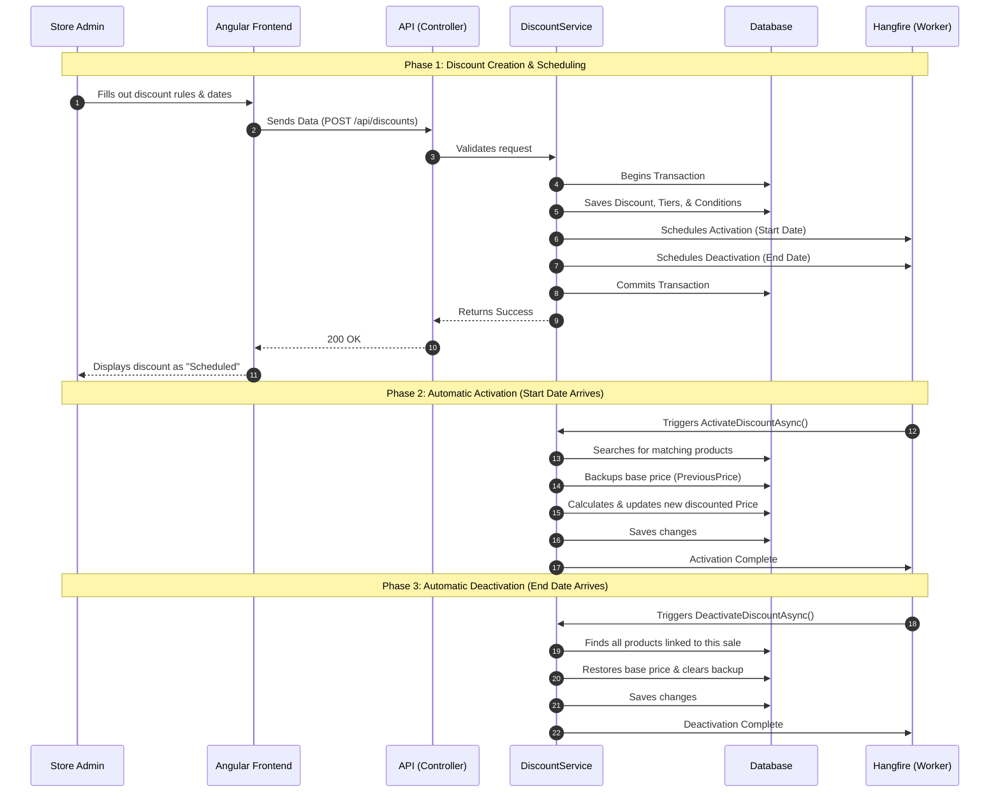

# Discount System Documentation (Lilishop)

## A. Introduction to the Discount System in Lilishop

## Why the Discount System Exists
The discount system exists to allow store administrators to manage product pricing dynamically without permanently changing the original base price of the items. It provides the tools needed to run sales, special offers, and promotional campaigns across the e-commerce platform.

## Business Goals and Requirements
The primary business goals for this system are:
* **Flexibility:** Support different types of discounts, such as percentage drops (e.g., 20% off), fixed amount reductions (e.g., $10 off), and free shipping.
* **Targeting:** Allow administrators to apply discounts to a single specific product or to a broad group of products based on rules (such as specific brands or product types).
* **Automation:** Automatically start and stop discounts at specific dates and times without requiring an administrator to be online.
* **Clear Pricing:** Always display the original price and the discounted price to the customer to highlight the savings.

## Problems It Solves in the System
Running a store-wide sale usually requires manually changing the base price of every single product and then changing them back when the sale ends. This discount system solves several technical and operational problems:
* **Eliminates Manual Price Updates:** Administrators no longer need to edit base prices. The system calculates the new price automatically.
* **Reduces Human Error:** By scheduling exact start and end times, the system prevents sales from running longer than intended.
* **Improves Storefront Performance:** The system uses a highly optimized architecture. Complex discount calculations are done in the background. The customer-facing storefront only reads the final price, which ensures the website loads very quickly.
* **Maintains Price History:** The database safely stores the original base price in a `PreviousPrice` column while a sale is active. This ensures the original data is never lost.

## High-Level Overview of the Feature
The Lilishop discount system is divided into two main categories:
1. **Single Discounts:** A simple, direct discount applied to one specific product. It has the highest priority and overrides other rules.
2. **Group Discounts:** A complex, rule-based discount that applies to multiple products (e.g., "All products from Brand X"). It uses a multi-tier structure to apply different conditions.

When an administrator creates a discount, the backend saves the rules and schedules a background job. When the exact start time arrives, the background system moves the product's base price to a backup column and applies the new discounted price. When the end time arrives, the system restores the original base price automatically.

***

## B. How a Single Discount Works (Algorithm and Business Logic)

### What a Single Discount Is
A single discount is a direct offer applied to one specific product in the store. It is the simplest and highest-priority type of discount. When a product has an active single discount, the system ignores any general group rules (like "10% off all shoes") and applies the specific single discount instead.

### How Price Calculation Works Step by Step
To keep the storefront loading instantly for customers, the system handles all price calculations in the background. When a single discount starts, the system follows these exact steps:

1. **Backup the Original Price:** The system takes the current base price and safely copies it into the `PreviousPrice` column in the database.
2. **Perform the Calculation:** The system looks at the discount settings (amount and type) and calculates the new price.
3. **Update the Live Price:** The newly calculated value is saved directly into the `Price` column. 
4. **Storefront Display:** When a customer views the product, the frontend simply reads these two columns. It displays the `PreviousPrice` with a strikethrough line and the new `Price` in red.

When the discount ends, the system automatically reverses this process. It moves the `PreviousPrice` back to the `Price` column and clears the backup.

### How Discount Types Are Applied
The system supports three core types of promotional values. The math is applied based on the administrator's configuration:

* **Percentage (%):** If the `IsPercentage` rule is true, the system reduces the price by a fraction of 100.
  * *Example:* Base Price = $200. Discount = 50%. The system calculates `$200 - ($200 * 50 / 100)`. The new price is $100.
* **Fixed Amount:** If the `IsPercentage` rule is false, the system subtracts the exact discount amount directly from the base price.
  * *Example:* Base Price = $200. Discount = $30. The system calculates `$200 - $30`. The new price is $170.
* **Free Shipping:** This operates independently of the product's price. If the `IsFreeShipping` flag is true, the checkout system reads this rule and waives the delivery fees associated with this item.

### How the Final Price Is Determined
To protect the store from human error (like an administrator accidentally setting a $50 discount on a $30 item), the system has a built-in safety net. 

After all mathematical calculations are complete, the system checks the final number. If the calculated price is less than zero, the system automatically forces the final price to exactly `0`. This guarantees the database never stores a negative price.

***

## C. How the Full Discount System Works (Business Rules & System Logic)

While Single Discounts are simple and apply to just one product, the system also supports complex, store-wide sales (like a "Summer Clearance" or "Black Friday" event). We call these **Group Discounts**. 

Group Discounts rely on a powerful rules engine to determine exactly which products get discounted and by how much.

### Discount Groups and Their Purpose
A **Discount Group** is a container for a large promotional event. Instead of creating 500 individual single discounts for 500 products, an administrator creates one Discount Group. This group holds all the rules, start dates, and end dates for the entire campaign. 

If the administrator pauses or deletes the Discount Group, all products tied to that group instantly return to their normal prices.

### Multi-Tier Discount Structure
A single campaign often has different levels of discounts. For example, during a "Black Friday" event, shoes might be 10% off, but winter jackets might be 30% off. 

To support this, the system uses a **Multi-Tier Structure**. A Discount Group can have multiple "Tiers". A **Tier** is simply a specific monetary value or percentage (e.g., Tier 1 = 10% off, Tier 2 = 30% off). The system links different rules to different tiers so one campaign can manage multiple price reductions at the same time.

### Targeting Logic (Brand, Product Type, Size)
To figure out which products belong to which Tier, the system uses targeting filters. An administrator can target products based on four main categories:
1. **Specific Product:** Target a product directly by its exact ID.
2. **Product Brand:** Target all products made by a specific brand (e.g., "Armani").
3. **Product Type:** Target all products of a specific category (e.g., "Shirts").
4. **Size Classification:** Target items based on their size (e.g., "All XXL items").

**The "ALL" Rule:**
The system is designed to be highly flexible. If an administrator creates a rule but leaves a target blank (for example, they select the Brand "Armani" but choose "ALL" for the Product Type), the system safely ignores the Product Type filter. This ensures that every single Armani product receives the discount, regardless of its type.

### Conditions and Rules Engine
The system groups these targeting filters into **Condition Groups**. 

A Condition Group acts like a logical "AND/OR" statement connecting the targets to a specific Tier. For example, an administrator can create a Condition Group that says:
* *IF* Brand is "Nike" *AND* Type is "Shoes" -> Apply **Tier 1** (10% off).

When a discount activates, the system's database engine reads these Condition Groups. It dynamically builds a search query, scans the entire store inventory, and finds every product that perfectly matches the rules.

### Activation, Deactivation, and Lifecycle
The lifecycle of a Group Discount is fully automated to ensure prices are always accurate:

1. **Scheduling:** The administrator sets a Start Date and End Date. The system registers these times with a background worker (Hangfire).
2. **Activation:** When the exact Start Date arrives, the background worker wakes up. It reads the Condition Groups, dynamically searches the database for all matching products, backs up their original base prices to the `PreviousPrice` column, applies the math from the specific Tiers, and saves the new prices.
3. **Updating / Editing:** If an administrator turns off the discount early or deletes it entirely, the system must clean up. It re-runs the dynamic search query to find all the products affected by the campaign and perfectly restores their original base prices.
4. **Deactivation (Expiration):** When the End Date arrives, the background worker wakes up again. It finds all products tied to the campaign, moves the `PreviousPrice` back to the live `Price` column, and removes the backup.

***

## D. Database Design and Table Responsibilities

The Lilishop discount system relies on a highly normalized and efficient database design. Each table has a specific role to ensure that the storefront stays fast while the rules engine remains flexible.

Below is the breakdown of each major table and its responsibilities.

### 1. Discount Table
* **Purpose:** The core entity for all sales and promotions.
* **Why it exists:** To store the main metadata of a sale, such as the `Name`, `StartDate`, `EndDate`, and whether it `IsActive`. For Single Discounts, it also directly holds the mathematical values (`Amount`, `IsPercentage`, `IsFreeShipping`).
* **Relationships:** It can optionally link to a `DiscountGroup` (if it is part of a larger campaign). It links to `ProductDiscount` (for single items) or `DiscountTier` (for group campaigns).

### 2. ProductDiscount Table
* **Purpose:** A simple mapping table used exclusively for **Single Discounts**.
* **Why it exists:** To directly connect one specific `Product` to one specific `Discount`. This prevents the system from having to run a complex rules engine for simple, one-off sales.
* **Relationships:** Connects a `Discount` ID to a `Product` ID.

### 3. DiscountTier Table
* **Purpose:** Holds the actual financial value of a promotion for **Group Discounts**.
* **Why it exists:** Because a large campaign (like a "Summer Sale") might have multiple levels of discounts (e.g., Level 1 = 10% off, Level 2 = 30% off). Tiers allow the database to store these different values cleanly.
* **Relationships:** Belongs to a single `Discount`. Is linked to one or more `ConditionGroup`s to determine who gets this specific tier.

### 4. DiscountGroup Table
* **Purpose:** A master container for complex, multi-rule promotional campaigns.
* **Why it exists:** To group multiple rules and tiers together under one logical umbrella. If an administrator deletes the group, the entire campaign is safely removed.
* **Relationships:** Contains multiple `Discount`s and multiple `ConditionGroup`s.

### 5. ConditionGroup Table
* **Purpose:** Acts as a logical "AND" container for targeting rules.
* **Why it exists:** To link a specific set of rules to a specific `DiscountTier`. For example, it tells the system: "If the rules in this box are met, give the customer the 20% off tier."
* **Relationships:** Belongs to a `DiscountGroup`. Links to exactly one `DiscountTier`. Contains multiple `DiscountGroupCondition`s.

### 6. DiscountGroupCondition Table
* **Purpose:** The actual targeting filter (the "Rule").
* **Why it exists:** To store the exact IDs the administrator selected (e.g., `ProductBrandId = 5`). If a value is left as NULL, the system knows to treat it as "ALL".
* **Relationships:** Belongs to a `ConditionGroup`. Points to specific tables like Brands, Types, or Products.

### 7. DiscountTargetType (Enum)
* **Purpose:** A simple text or number flag used inside the `DiscountGroupCondition` table.
* **Why it exists:** To tell the backend query builder exactly what type of data it is looking at. The options are: `Product`, `ProductBrand`, `ProductType`, or `Size`.

### 8. DiscountAuditLog Table
* **Purpose:** A security and history tracker.
* **Why it exists:** To record exactly who created, edited, or deleted a discount, and when they did it. This is crucial for store management and finding out why a price changed unexpectedly.
* **Relationships:** Linked directly to the `Discount` table.

### 9. Product Table (Pricing Columns)
* **Purpose:** The main inventory table, but with a special architecture for the discount engine.
* **Why it exists:** The product table has two crucial columns: `Price` and `PreviousPrice`. `Price` is always the live, customer-facing price. When a sale starts, the original price is moved to `PreviousPrice` for safekeeping. 
* **Role in the system:** This guarantees that the storefront NEVER has to calculate discounts while a customer is browsing. It simply reads the `Price` column, resulting in blazing-fast load times ($O(1)$ complexity).

***

## E. Step-by-Step Admin Flow (Real Example Scenario)

To understand how all the tables and rules work together, let's look at a concrete example. 

Imagine our store administrator wants to run a **"Summer Clearance Sale"**. The goal of this sale is to give a **20% discount on all Nike Shoes**. 

Here is exactly how the administrator builds this in the admin panel, and how the database reacts at each step.

### Step 1: Basic Discount Creation
The administrator starts by opening the "Create Discount" page in the frontend dashboard. They fill out the general information for the campaign:
* **Discount Name:** "Summer Clearance Sale"
* **Start Date:** June 1st at 00:00
* **End Date:** June 30th at 23:59
* **Is Active:** Checked (True)

**Database Impact:** The backend prepares a new record for the **`Discount`** table. At this stage, the system knows *when* the sale happens and what it is called, but it doesn't know the financial value or which products are affected.

---

### Step 2: Creating Discount Tiers
Next, the administrator needs to define the financial value of the sale. They click "Add Tier" and configure the math:
* **Amount:** 20
* **IsPercentage:** Checked (True)
* **FreeShipping:** Unchecked (False)

**Database Impact:** The backend prepares a new record for the **`DiscountTier`** table. This tier is linked directly to the Discount created in Step 1. The system now knows that a "20% reduction" is available during the Summer Clearance.

---

### Step 3: Assigning Target Entities
Now, the administrator must tell the system exactly *who* gets this 20% discount. They build a targeting rule:
* **Select Tier:** They select the "20%" tier created in Step 2.
* **Target Type 1:** They choose `ProductBrand` and select "Nike" from the dropdown.
* **Target Type 2:** They choose `ProductType` and select "Shoes" from the dropdown.

*Note: If the administrator just wanted to discount one specific pair of shoes, they would select `Product` and pick the exact item. But since this is a group sale, they use the brand and type filters.*

**Database Impact:** Because this uses multiple filters, the backend prepares a new **`ConditionGroup`** (the logical box). Inside that box, it creates two **`DiscountGroupCondition`** records: one pointing to the Nike Brand ID, and one pointing to the Shoes Type ID. 
*(If they had selected a single product instead, it would simply prepare a record for the **`ProductDiscount`** mapping table).*

---

### Final Step: Create Discount
The administrator reviews the summary and clicks the final **"Save Discount"** button.

1. **Final Save Action:** The Angular frontend sends all this data in one payload to the backend API.
2. **Database Transaction:** The backend uses Entity Framework to save the `Discount`, `DiscountTier`, `ConditionGroup`, and `DiscountGroupCondition` records into the database simultaneously.
3. **Audit Log:** The system automatically writes a record to the `DiscountAuditLog` table, noting which admin created the Summer Clearance Sale.
4. **Admin View:** The frontend navigates back to the discounts list, and the admin now sees "Summer Clearance Sale" marked as "Scheduled".

When June 1st arrives, the background worker will read this exact setup, find all Nike Shoes, and drop their prices by 20%.

***

## F. How Discount Data Is Persisted in the System

When an administrator clicks "Save" to create or edit a discount, the data must travel through several layers of the backend architecture. This multi-layer design ensures that the data is valid, secure, and properly stored. 

Here is how the data flows from the API down to the database.

### 1. Data Flow from API to Database
The journey of a discount begins at the API layer and moves downwards:

* **The API Controller (`DiscountsController`):** The Angular frontend sends a package of data (called a DTO, or Data Transfer Object) to the backend. The controller receives this request, checks if the user is authorized (an Admin), and hands the data to the service layer.
* **Data Mapping:** Before saving, the system uses "Mappers" (like `DiscountMapper`). Mappers translate the raw data from the frontend (DTOs) into standard Domain Entities (like `Discount` and `DiscountTier`) that the database can understand.

### 2. Application Services Involved
The **`DiscountService`** acts as the "brain" of the operation. 
It does not talk to the database directly. Instead, it handles all the business rules. For example, when updating a discount, the `DiscountService` will:
* Check if the discount actually exists.
* Call the mapping tools to update the entity properties.
* Decide if prices need to be restored (if a discount was just deactivated).
* Tell the system to clear the cache so the storefront shows the latest prices.

### 3. The Repository Layer and Unit of Work
To actually save the data, the system uses the **Repository Pattern** and the **Unit of Work** pattern.
* **Repositories (`GenericRepository`, `DiscountRepository`):** These are the only parts of the code that directly touch the database using Entity Framework Core. They handle the basic SQL commands like `INSERT`, `UPDATE`, and `DELETE`.
* **Unit of Work (`IUnitOfWork`):** This acts as a manager for the repositories. Instead of saving data every time a single row changes, the Unit of Work collects all the changes and saves them to the database in one single batch using `_unitOfWork.CompleteAsync()`.

### 4. Transaction Handling (Keeping Data Safe)
Because a single Discount Group might contain dozens of rules, tiers, and conditions, saving or deleting a discount is a complex process. The system uses **Transactions** to keep the database completely safe from errors.

A transaction acts like an "all-or-nothing" safety net.
* **Begin:** The system starts a transaction (`BeginTransactionAsync`).
* **Process:** The system tries to delete the Tiers, delete the Condition Groups, and restore the product prices.
* **Commit:** If *every single step* succeeds, the system permanently saves the changes (`CommitTransactionAsync`).
* **Rollback:** If *any step fails* (for example, the database goes offline halfway through), the system triggers a rollback (`RollbackTransactionAsync`). A rollback undoes everything, ensuring no broken or half-deleted discounts are ever left in the database.

By strictly separating the controllers, services, and repositories, the system remains very easy to maintain and test. 

***

## G. Role of Background Jobs and Hangfire

To keep the storefront loading instantly for customers, the system must do all the heavy lifting behind the scenes. Lilishop uses a popular tool called **Hangfire** to manage these background jobs. 

Hangfire acts like an invisible assistant that constantly watches the clock and performs tasks automatically so administrators do not have to.

### Why Background Processing Is Needed
If an administrator schedules a massive "Black Friday" sale to begin exactly at midnight, they do not want to stay awake to click an "Activate" button. Furthermore, calculating new prices for 10,000 products takes time. 

If we tried to calculate the discount at the exact moment a customer loads the webpage, the website would be extremely slow. Background processing solves this. The background worker calculates the prices silently and updates the database. When the customer visits, they just see the final, fast result.

### Scheduled Activation and Deactivation
When an administrator creates a Discount Group, they set a Start Date and an End Date.
* **The Start Job:** The system tells Hangfire, *"Wake up on [Start Date] and run the `ActivateDiscountAsync` method."* When that time arrives, Hangfire automatically runs the dynamic search queries, applies the math, and updates the prices.
* **The End Job:** The system also tells Hangfire, *"Wake up on [End Date] and run the `DeactivateDiscountAsync` method."* When the sale is over, Hangfire automatically finds the affected products and restores their original prices.

### Expiration Handling
Expiration (deactivation) is treated as a critical system event. If a discount expires, the system must guarantee that products do not remain on sale forever. Hangfire strictly executes the price restoration logic (moving `PreviousPrice` back to the `Price` column) exactly at the expiration minute.

### Retry Mechanisms (Safety First)
What happens if Hangfire tries to activate a sale at midnight, but the database is temporarily offline or restarting?

If a normal web request fails, the user gets an error screen. But because Hangfire is an automatic background worker, it has a **Retry Mechanism**. If a job fails due to a temporary network or database error, Hangfire does not give up. It will wait a few minutes and try again. It will keep trying until the sale successfully activates, ensuring no campaign is ever skipped or lost.

### Async Processing Benefits
Using background jobs provides massive benefits to the Lilishop architecture:
1. **Zero Wait Time for Admins:** When an admin saves a massive store-wide discount, they don't have to stare at a loading screen while the system updates 10,000 products. The admin clicks save, gets an instant success message, and the background worker handles the rest.
2. **Storefront Speed:** Because the heavy logic is separated from the storefront, customers always experience instant, $O(1)$ page loads.
3. **Reliability:** The retry system guarantees that price changes happen even during temporary server issues.

***

## H. System Workflow (Mermaid Diagram)

To help developers and architects understand the complete lifecycle of a discount, the sequence diagram below illustrates the exact workflow. 

It shows the journey from the moment an administrator creates the discount, to how it is saved in the database, and finally how the background worker (Hangfire) automatically manages the pricing changes when the start and end dates arrive.

### Understanding the Diagram:
1. **Phase 1 (Creation):** The admin does the manual work. The backend saves the rules and tells Hangfire exactly when to wake up in the future.
2. **Phase 2 (Activation):** This happens automatically. Hangfire wakes up, reads the rules, does the math, and updates the live prices for the storefront.
3. **Phase 3 (Deactivation):** This also happens automatically. Hangfire wakes up again when the sale ends and safely puts everything back to normal.

***

## I. Why This System Is Efficient (Architecture Analysis)

The Lilishop discount system was heavily refactored to prioritize speed, reliability, and ease of use. By moving away from "live calculations" and adopting a background-processing model, the system achieves enterprise-level efficiency.

Here is a breakdown of why this architecture is highly effective:

### 1. Massive Performance Benefits ($O(1)$ Complexity)
In many e-commerce systems, when a user visits a product page, the server has to check if a sale is active, do the math, and return the result. This slows down the website. 

In our system, the storefront does absolutely **zero math**. When a customer views a product, the system performs an $O(1)$ lookup—it simply reads the `Price` and `PreviousPrice` columns directly from the database. Because all the heavy calculations are done in advance by the background worker, the customer-facing website loads instantly.

### 2. Scalability
Because the system uses Hangfire for background processing, it is highly scalable. 
If an administrator puts 100,000 products on sale, the background worker handles the database updates steadily in a queue. This means a massive store-wide promotion will never cause the live website to crash or time out.

### 3. Clean Separation of Concerns
The database and the code are clearly separated based on their responsibilities:
* **Single vs. Group:** Simple one-off discounts use a direct mapping table (`ProductDiscount`), avoiding the heavy rules engine entirely. Complex campaigns use the structured tables (`DiscountGroup`, `ConditionGroup`).
* **Code Layers:** The API Controllers only handle web requests, the Mappers only handle data translation, the Services enforce the business rules, and the Repositories handle the SQL logic. This makes the code very easy to read, test, and debug.

### 4. Maintainability
By normalizing the database (splitting data into `Discount`, `DiscountTier`, and `DiscountGroupCondition`), we avoid duplicating data. If an administrator needs to change the name of a campaign, they change it in exactly one place. If a rule is deleted, the database automatically cleans up the related tiers and mappings safely.

### 5. Flexibility for Future Features
The Condition Rules engine is designed to grow. Right now, it targets Products, Brands, Types, and Sizes. If the business decides tomorrow that they want to offer discounts based on "Color" or "User VIP Status", developers only need to add one new property to the `DiscountGroupCondition` table and update the `WHERE` clause in the query builder. The rest of the architecture remains completely untouched.

### 6. Auditability and Traceability
In a financial system, knowing *why* a price changed is critical. 
* **Safe Restorations:** The `PreviousPrice` column ensures that the original base price of a product is never lost or overwritten by accident. 
* **Audit Logs:** The `DiscountAuditLog` table permanently records which administrator created, edited, or deleted a discount, and at what exact time. This guarantees total transparency and security for store owners.

***

### Conclusion
The Lilishop discount system successfully balances a simple, instant experience for the customer with a powerful, automated, and flexible rules engine for the administrator.

***

