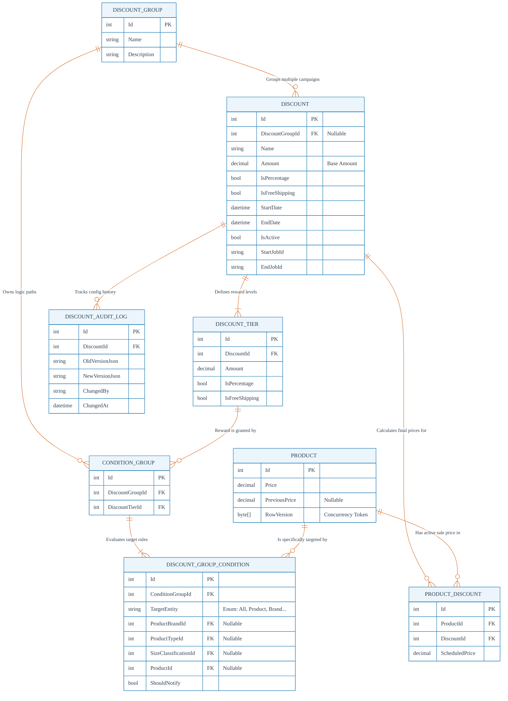
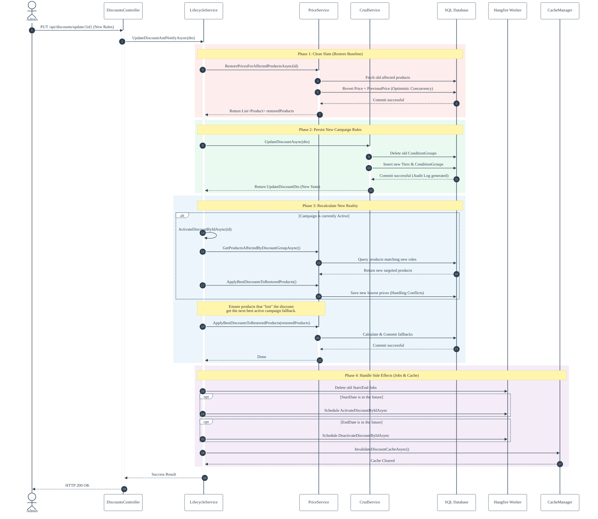
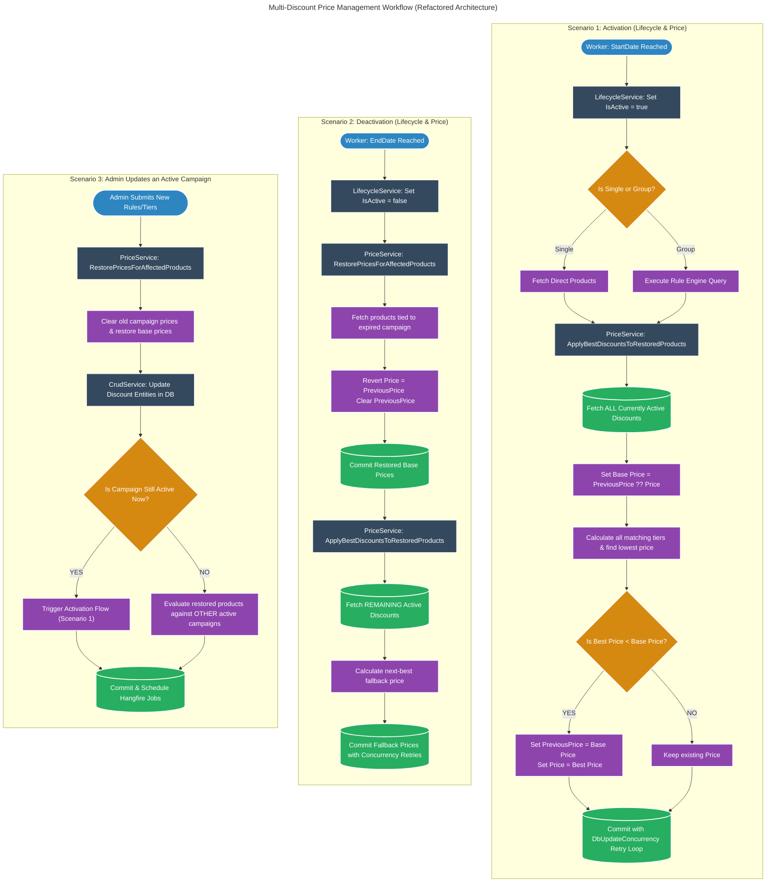
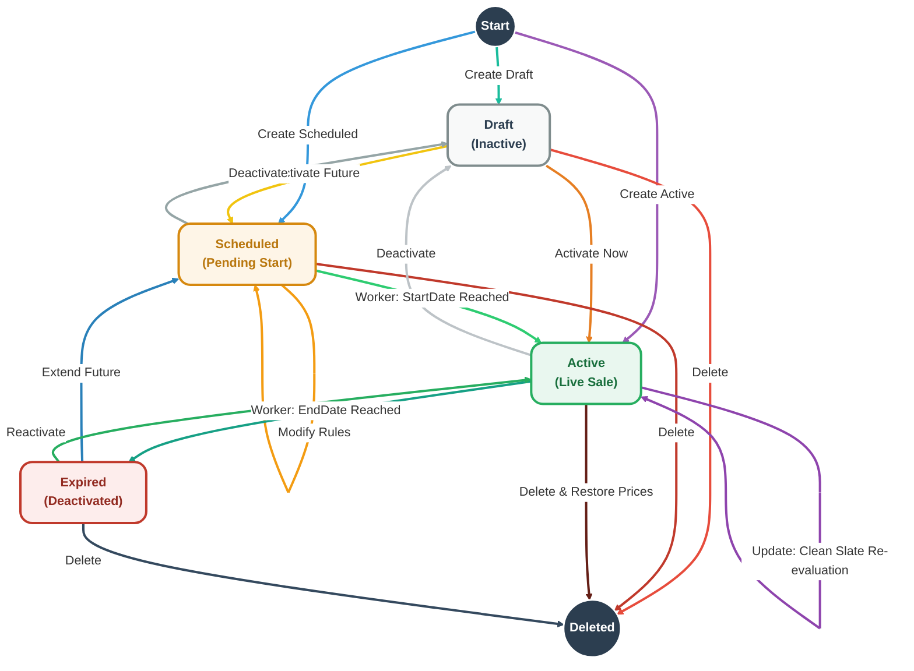

# Discount System – Entity Relationship Diagram (ERD)

**Version:** 1.0  
**Project:** LiliShop – Discount System  
**Date:** 2026-05-16

---

## 1. Introduction

The discount system of LiliShop is built around a set of database tables that store campaign rules, reward tiers, targeting conditions, and execution results. The Entity Relationship Diagram (ERD) below visualises how these tables are connected and how they work together to turn a marketing idea into a real‑time price on the storefront.

This document describes each table’s purpose, its columns, and its relationships. It also includes realistic dummy data so you can immediately see how a discount campaign is stored and evaluated.

---

## 2. Entity Relationship Diagram



---

## 3. Table Descriptions and Dummy Data

### 3.1 `DISCOUNT_GROUP`

**Goal:**  
A logical container that holds a set of targeting conditions (via `CONDITION_GROUP`). It acts as a “rule book” that can be reused by one or more `DISCOUNT` campaigns.

**Columns:**

| Column | Type | Description |
|--------|------|-------------|
| `Id` | int (PK) | Unique identifier |
| `Name` | string | Friendly name, e.g. “Nike Summer Campaign” |
| `Description` | string | Optional internal notes |

**Relationships:**

- One `DISCOUNT_GROUP` can have many `DISCOUNT` records (a rule book shared by multiple time‑based campaigns).
- One `DISCOUNT_GROUP` owns many `CONDITION_GROUP` records.

**Dummy Data:**

| Id | Name | Description |
|----|------|-------------|
| 1 | Nike Shoes Promo | All conditions targeting Nike footwear |
| 2 | Sitewide Free Shipping | Conditions that apply to all products |

---

### 3.2 `DISCOUNT`

**Goal:**  
The central campaign entity. It defines the marketing promotion: name, type of reward (percentage, amount, free shipping), and its active time window. It also stores background job IDs for automatic activation and deactivation.

**Columns:**

| Column | Type | Description |
|--------|------|-------------|
| `Id` | int (PK) | Unique identifier |
| `DiscountGroupId` | int? (FK) | Links to the rule book; null means a direct product discount |
| `Name` | string | Campaign name, e.g. “Summer Sale – 20% off” |
| `Amount` | decimal | Primary discount amount (used if the campaign has a single tier) |
| `IsPercentage` | bool | True if `Amount` is a percentage, false if fixed amount |
| `IsFreeShipping` | bool | True if the discount includes free shipping |
| `StartDate` | datetime | When the discount becomes active (null = immediately) |
| `EndDate` | datetime | When the discount expires (null = manual only) |
| `IsActive` | bool | Whether the discount is currently live |
| `StartJobId` | string | Hangfire job ID for automatic activation |
| `EndJobId` | string | Hangfire job ID for automatic deactivation |

**Relationships:**

- Belongs to zero or one `DISCOUNT_GROUP`.
- Defines many `DISCOUNT_TIER` records.
- Has many `PRODUCT_DISCOUNT` records (direct product links).
- Has many `DISCOUNT_AUDIT_LOG` records.

**Dummy Data:**

| Id | DiscountGroupId | Name | Amount | IsPercentage | IsFreeShipping | StartDate | EndDate | IsActive | StartJobId | EndJobId |
|----|-----------------|------|--------|--------------|----------------|-----------|---------|----------|------------|----------|
| 10 | 1 | Summer Nike 20% | 20.00 | true | false | 2026-06-01 | 2026-08-31 | true | job‑123 | job‑456 |
| 11 | NULL | Flash Sale – $5 Off Product #99 | 5.00 | false | false | 2026-05-15 | 2026-05-16 | true | NULL | job‑789 |
| 12 | 2 | Free Shipping Weekend | 0 | false | true | 2026-05-20 | 2026-05-22 | false | job‑101 | job‑102 |

---

### 3.3 `DISCOUNT_TIER`

**Goal:**  
Represents a reward level for a discount. A single campaign can have multiple tiers, e.g. “Buy 1 get 10%, Buy 2 get 20%”. Each tier can be linked to a specific `CONDITION_GROUP` that determines when it is applied.

**Columns:**

| Column | Type | Description |
|--------|------|-------------|
| `Id` | int (PK) | Unique identifier |
| `DiscountId` | int (FK) | The parent discount |
| `Amount` | decimal | The discount value for this tier |
| `IsPercentage` | bool | True if percentage, false if fixed amount |
| `IsFreeShipping` | bool | True if free shipping for this tier |

**Relationships:**

- Belongs to one `DISCOUNT`.
- May be linked to one or more `CONDITION_GROUP` (via `DiscountTierId` in `CONDITION_GROUP`).

**Dummy Data:**

| Id | DiscountId | Amount | IsPercentage | IsFreeShipping |
|----|------------|--------|--------------|----------------|
| 100 | 10 | 20.00 | true | false |
| 101 | 11 | 5.00 | false | false |
| 102 | 12 | 0.00 | false | true |

---

### 3.4 `CONDITION_GROUP`

**Goal:**  
A bridge between a `DISCOUNT_GROUP` and a specific `DISCOUNT_TIER`. It groups a set of `DISCOUNT_GROUP_CONDITION` rows that must **all** be true for the linked tier to be awarded.

**Columns:**

| Column | Type | Description |
|--------|------|-------------|
| `Id` | int (PK) | Unique identifier |
| `DiscountGroupId` | int (FK) | The rule book this condition group belongs to |
| `DiscountTierId` | int (FK) | The specific tier that is granted when the conditions are met |

**Relationships:**

- Belongs to one `DISCOUNT_GROUP`.
- Points to one `DISCOUNT_TIER`.
- Contains many `DISCOUNT_GROUP_CONDITION` rows.

**Dummy Data:**

| Id | DiscountGroupId | DiscountTierId |
|----|-----------------|----------------|
| 200 | 1 | 100 |
| 201 | 2 | 102 |

---

### 3.5 `DISCOUNT_GROUP_CONDITION`

**Goal:**  
The finest level of targeting. Each row describes a single condition that must be met for the parent `CONDITION_GROUP` to succeed. The `TargetEntity` field selects what kind of object is being matched (Product, ProductBrand, ProductType, Size, or All).

**Columns:**

| Column | Type | Description |
|--------|------|-------------|
| `Id` | int (PK) | Unique identifier |
| `ConditionGroupId` | int (FK) | Parent condition group |
| `TargetEntity` | string (Enum) | `ProductType`, `ProductBrand`, `Size`, `Product`, or `All` |
| `ProductBrandId` | int? (FK) | Required when TargetEntity = `ProductBrand` |
| `ProductTypeId` | int? (FK) | Required when TargetEntity = `ProductType` |
| `SizeClassificationId` | int? (FK) | Required when TargetEntity = `Size` |
| `ProductId` | int? (FK) | Required when TargetEntity = `Product` |
| `ShouldNotify` | bool | Whether subscribers should be notified when the discount is applied |

**Relationships:**

- Belongs to one `CONDITION_GROUP`.
- Optionally references a `PRODUCT`, `ProductBrand`, `ProductType`, or `SizeClassification` (not shown in detail in the ERD) depending on `TargetEntity`.

**Dummy Data for Discount Group 1 (Nike Shoes Promo):**

| Id | ConditionGroupId | TargetEntity | ProductBrandId | ProductTypeId | SizeClassificationId | ProductId | ShouldNotify |
|----|------------------|--------------|----------------|----------------|----------------------|-----------|--------------|
| 301 | 200 | ProductBrand | 5 (Nike) | NULL | NULL | NULL | false |
| 302 | 200 | ProductType | NULL | 12 (Shoes) | NULL | NULL | false |

**Dummy Data for Discount Group 2 (Sitewide Free Shipping):**

| Id | ConditionGroupId | TargetEntity | ProductBrandId | ProductTypeId | SizeClassificationId | ProductId | ShouldNotify |
|----|------------------|--------------|----------------|----------------|----------------------|-----------|--------------|
| 303 | 201 | All | NULL | NULL | NULL | NULL | false |

---

### 3.6 `PRODUCT`

**Goal:**  
The product entity (simplified for the discount system). It holds the current `Price` and an optional `PreviousPrice` that stores the original price when a discount is applied. The `RowVersion` column is a concurrency token used by Entity Framework to detect and handle simultaneous updates.

**Columns (only discount‑relevant fields shown):**

| Column | Type | Description |
|--------|------|-------------|
| `Id` | int (PK) | Product identifier |
| `Price` | decimal | Current selling price |
| `PreviousPrice` | decimal? | Original price before discount was applied (null if not discounted) |
| `RowVersion` | byte[] | Concurrency token (timestamp) |

**Relationships:**

- Has many `PRODUCT_DISCOUNT` records.
- Can be specifically targeted by many `DISCOUNT_GROUP_CONDITION` rows (when `TargetEntity = Product`).

**Dummy Data:**

| Id | Price | PreviousPrice | RowVersion |
|----|-------|---------------|------------|
| 500 | 80.00 | 100.00 | 0x00000000000007D1 |
| 501 | 60.00 | NULL | 0x00000000000007D2 |
| 502 | 5.00 | 10.00 | 0x00000000000007D3 |

(Product 500 is discounted from $100 to $80; product 501 is not on sale; product 502 has a $5 discount from $10.)

---

### 3.7 `PRODUCT_DISCOUNT`

**Goal:**  
A fast, direct link between a product and a discount, together with the pre‑calculated `ScheduledPrice`. This table is used when a discount is directly assigned to specific products (single discount) without using condition groups. It allows the system to instantly fetch the discounted price without recalculating rules every time.

**Columns:**

| Column | Type | Description |
|--------|------|-------------|
| `Id` | int (PK) | Unique identifier |
| `ProductId` | int (FK) | The product |
| `DiscountId` | int (FK) | The directly linked discount |
| `ScheduledPrice` | decimal | The pre‑computed price after this discount |

**Relationships:**

- Belongs to one `PRODUCT`.
- Belongs to one `DISCOUNT`.

**Dummy Data:**

| Id | ProductId | DiscountId | ScheduledPrice |
|----|-----------|------------|----------------|
| 400 | 502 | 11 | 5.00 |
| 401 | 500 | 10 | 80.00 |

(Product 502 gets a direct $5 off from discount 11; product 500 is part of the Nike group discount, and the system stores the calculated price here for fast retrieval.)

---

### 3.8 `DISCOUNT_AUDIT_LOG`

**Goal:**  
A complete history of changes made to a `DISCOUNT`. Every time a discount is created or updated, the system serialises the old and new state as JSON and records who made the change and when.

**Columns:**

| Column | Type | Description |
|--------|------|-------------|
| `Id` | int (PK) | Unique identifier |
| `DiscountId` | int (FK) | The discount that was changed |
| `OldVersionJson` | string | JSON snapshot of the discount before the change |
| `NewVersionJson` | string | JSON snapshot after the change |
| `ChangedBy` | string | Email of the admin or “System” |
| `ChangedAt` | datetime | Timestamp of the change |

**Relationships:**

- Belongs to one `DISCOUNT`.

**Dummy Data:**

| Id | DiscountId | OldVersionJson | NewVersionJson | ChangedBy | ChangedAt |
|----|------------|----------------|----------------|-----------|-----------|
| 1001 | 10 | {"Name":"Summer Nike 20%","Amount":15.00,...} | {"Name":"Summer Nike 20%","Amount":20.00,...} | admin@lilishop.com | 2026-05-14T10:30:00Z |
| 1002 | 11 | NULL | {"Name":"Flash Sale – $5 Off","Amount":5.00,...} | admin@lilishop.com | 2026-05-15T08:00:00Z |

---

## 4. How the Tables Work Together – A Small Story

1. The marketing team creates a **Discount Group** “Nike Shoes Promo” (Id=1).  
2. Inside that group they define a **Condition Group** (Id=200) that points to **Tier** 100 (20% off).  
3. The Condition Group has two **Discount Group Conditions**: one requiring `ProductBrand = Nike` and one requiring `ProductType = Shoes`. Both must be true.  
4. A **Discount** (Id=10) is created, linked to that group, set to active from June 1 to August 31. Hangfire jobs are stored in `StartJobId` and `EndJobId`.  
5. When the discount becomes active, the system finds all products that satisfy the two conditions (e.g., Product 500).  
6. The price service calculates the best price, sets `Product.PreviousPrice = 100.00` and `Product.Price = 80.00`. A **ProductDiscount** row may be inserted for fast lookups.  
7. Every modification to the discount is recorded in **Discount Audit Log**.

This ERD and the dummy data illustrate exactly how the database supports the flexible, multi‑tier, rule‑based discount engine of LiliShop.

---

## 5. Conclusion

The discount system ERD is designed to separate the “what” (the discount reward), the “when” (the time window), the “who” (the target conditions), and the “result” (the applied prices). This separation allows:

- Reusing the same rule book for multiple time‑limited campaigns.
- Overlapping discounts with automatic best‑price resolution.
- Full traceability of every change through audit logs.
- Direct product discounts when needed, without the complexity of condition groups.

*************************************************************************************
*************************************************************************************

# Discount System – Service Architecture Class Diagram

**Version:** 1.0  
**Project:** LiliShop – Discount System  
**Date:** 2026-05-16

---

## 1. Introduction

After refactoring the original “God Class” `DiscountService`, the discount logic of LiliShop was split into four focused services, each defined by a clear interface. The class diagram below captures this architecture: it shows the interfaces (abstractions), their concrete implementations, and the dependency relationships between them.

This document explains the diagram, decodes the visual notation, and provides a detailed description of every service and interface. Use it as the authoritative reference for the discount system's service layer.

---

## 2. Class Diagram

```mermaid
%%{init: {
  'theme': 'base',
  'themeVariables': {
    'background': '#ffffff',
    'primaryTextColor': '#2C3E50',
    'lineColor': '#7F8C8D',
    'fontFamily': 'Arial, Helvetica, sans-serif'
  }
}}%%
classDiagram
    direction TB

    %% INTERFACES
    class IDiscountCrudService {
        <<interface>>
        +GetPaginatedDiscountsAsync(discountParams) IOperationResult
        +GetDiscountByIdAsync(discountId) IOperationResult
        +CreateDiscountAsync(dto) IOperationResult
        +UpdateDiscountAsync(dto) IOperationResult
        +DeleteDiscountAsync(id) IOperationResult
    }

    class IDiscountQueryService {
        <<interface>>
        +BuildEffectiveDiscountsQuery(prod, asOf, discountId) IQueryable
        +GetProductsByDiscountIdAsync(discountId) IReadOnlyList
        +GetProductsCountByDiscountIdAsync(discountId) int
        +GetProductsByDiscountIdWithPagingAsync(...) Tuple
        +GetSingleDiscountForProduct(productId) IOperationResult
    }

    class IDiscountPriceService {
        <<interface>>
        +ResolveTierForProduct(discount, product) DiscountTier
        +CalculateEffectivePrice(product, tier) decimal
        +ApplyBestDiscountsToRestoredProductsAsync(products, excludeId) Task
        +RestorePricesForAffectedProductsAsync(discountId) List~Product~
        +GetProductsAffectedByDiscountGroupAsync(group) List~Product~
    }

    class IDiscountLifecycleService {
        <<interface>>
        +CreateDiscountAndNotifySubscribers...(dto) IOperationResult
        +ActivateDiscountByIdAsync(discountId) IOperationResult
        +DeactivateDiscountByIdAsync(discountId) IOperationResult
        +UpdateDiscountAndNotifyAsync(dto) IOperationResult
        +SweepExpiredDiscountsAsync() IOperationResult
        +DeleteDiscountAndCleanUpAsync(id) IOperationResult
    }

    %% CONCRETE IMPLEMENTATIONS
    class DiscountCrudService {
        -_unitOfWork: IUnitOfWork
        -_httpContextAccessor: IHttpContextAccessor
        -_logger: ILogger
        -CreateAuditLog() DiscountAuditLog
    }

    class DiscountQueryService {
        -_unitOfWork: IUnitOfWork
        -BuildDiscountedProductsQuery() IQueryable
    }

    class DiscountPriceService {
        -_unitOfWork: IUnitOfWork
        -_logger: ILogger
        -DoesConditionMatchProduct() bool
    }

    class DiscountLifecycleService {
        -_crudService: IDiscountCrudService
        -_queryService: IDiscountQueryService
        -_priceService: IDiscountPriceService
        -_unitOfWork: IUnitOfWork
        -_cacheManager: ICacheManagerService
        -_notificationService: Lazy~INotificationService~
        -InvalidateDiscountCacheAsync() Task
    }

    %% RELATIONSHIPS
    DiscountCrudService ..|> IDiscountCrudService
    DiscountQueryService ..|> IDiscountQueryService
    DiscountPriceService ..|> IDiscountPriceService
    DiscountLifecycleService ..|> IDiscountLifecycleService

    DiscountLifecycleService --> IDiscountCrudService : Injects
    DiscountLifecycleService --> IDiscountQueryService : Injects
    DiscountLifecycleService --> IDiscountPriceService : Injects

    %% STYLING
    style IDiscountCrudService fill:#EAFAF1,stroke:#27AE60,stroke-width:2px,color:#2C3E50
    style IDiscountQueryService fill:#EBF5FB,stroke:#2980B9,stroke-width:2px,color:#2C3E50
    style IDiscountPriceService fill:#F5EEF8,stroke:#8E44AD,stroke-width:2px,color:#2C3E50
    style IDiscountLifecycleService fill:#FEF5E7,stroke:#E67E22,stroke-width:2px,color:#2C3E50

    style DiscountCrudService fill:#ffffff,stroke:#27AE60,stroke-width:2px,stroke-dasharray: 5 5,color:#2C3E50
    style DiscountQueryService fill:#ffffff,stroke:#2980B9,stroke-width:2px,stroke-dasharray: 5 5,color:#2C3E50
    style DiscountPriceService fill:#ffffff,stroke:#8E44AD,stroke-width:2px,stroke-dasharray: 5 5,color:#2C3E50
    style DiscountLifecycleService fill:#ffffff,stroke:#E67E22,stroke-width:3px,color:#2C3E50
```



---

## 3. Understanding the Diagram Notation

### 3.1 Boxes – Classes and Interfaces

- **Solid boxes with solid borders** = **Interfaces** (e.g., `IDiscountCrudService`).  
  They are tinted with a distinct colour to visually group them. The `<<interface>>` stereotype confirms their role.
- **Solid boxes with dashed borders** = **Concrete service classes** (e.g., `DiscountCrudService`).  
  They have a white background for clarity. The dashed stroke indicates “implementation detail” – the outside world should depend on the interface, not these classes.
- **The Lifecycle orchestrator** (`DiscountLifecycleService`) uses a **thicker solid border** to emphasize its special role as the central coordinator.

### 3.2 Arrows and Lines

The diagram uses two kinds of relationships:

| Relationship | Mermaid Syntax | Appearance | Meaning |
|--------------|----------------|------------|---------|
| **Interface Implementation** | `..|>` | Dashed line with a hollow triangle arrow | The concrete class implements the interface. E.g., `DiscountCrudService` realises `IDiscountCrudService`. |
| **Dependency / Injection** | `-->` | Solid line with an open arrowhead | One class depends on another (typically via constructor injection). The arrow points from the dependent class to the dependency. E.g., `DiscountLifecycleService` depends on `IDiscountCrudService`. |

In the Mermaid code, the implementation arrows are the four lines:
```
DiscountCrudService ..|> IDiscountCrudService
...
```
The injection arrows are:
```
DiscountLifecycleService --> IDiscountCrudService : Injects
...
```

The label `Injects` reminds us that the dependency is provided through Dependency Injection.

### 3.3 Direction and Layout

The keyword `direction TB` (top‑to‑bottom) instructs the renderer to arrange classes vertically. Interfaces appear at the top, concrete implementations below, and the orchestrator at the bottom. This layout naturally shows the abstraction stack.

### 3.4 Color Scheme

Each interface and its matching implementation share a colour family, making it easy to trace which class belongs to which contract:

- **Green** (`#27AE60`) → CRUD operations.
- **Blue** (`#2980B9`) → Queries and rule engine.
- **Purple** (`#8E44AD`) → Price calculations and tier logic.
- **Orange** (`#E67E22`) → Lifecycle orchestration and scheduling.

---

## 4. Interface and Class Descriptions

### 4.1 `IDiscountCrudService` / `DiscountCrudService`

**Purpose:** Pure persistence layer. Handles creation, reading, updating, and deleting of discount entities, along with audit logging.

**Key Members:**
- `GetPaginatedDiscountsAsync(DiscountSpecParams)` – Returns a paginated list of discounts using specifications.
- `GetDiscountByIdAsync(int discountId)` – Loads a discount with all its details (tiers, groups, conditions).
- `CreateDiscountAsync(CreateDiscountDto)` – Persists a new discount, including its tier, group, and condition hierarchy.
- `UpdateDiscountAsync(UpdateDiscountDto)` – Updates discount properties, condition groups, tiers; manages audit log creation. Runs within a database transaction.
- `DeleteDiscountAsync(int id)` – Removes a discount and its child entities, cancels background jobs, restores prices (if needed), and cleans up the discount group.

**Key Dependencies:**
- `IUnitOfWork` – For database access.
- `IHttpContextAccessor` – To read the current user for audit logs.

**Note:** This service does **not** schedule Hangfire jobs, touch caches, or send notifications. Those are the Lifecycle service’s responsibilities.

---

### 4.2 `IDiscountQueryService` / `DiscountQueryService`

**Purpose:** All read‑only queries needed for the discount system. It builds complex queries that determine which products are covered by a discount and which discounts apply to a product.

**Key Members:**
- `BuildEffectiveDiscountsQuery(Product, DateTimeOffset, int?)` – Returns an `IQueryable<Discount>` that finds all active discounts matching a given product at a specific time. Used extensively by the price service and the rule engine.
- `GetProductsByDiscountIdAsync(int)` – Retrieves the list of products affected by a specific discount (either directly or via condition groups).
- `GetProductsCountByDiscountIdAsync(int)` – Returns the count of such products.
- `GetProductsByDiscountIdWithPagingAsync(...)` – Paginated version of the above.
- `GetSingleDiscountForProduct(int productId)` – Fetches the single, direct discount (if any) assigned to a product.

**Key Dependencies:**
- `IUnitOfWork` – For access to `Product`, `Discount`, `ProductDiscount`, `ConditionGroup`, `DiscountGroupCondition`, and `ProductCharacteristic` tables.

**Note:** All query methods use `AsNoTracking()` to avoid side‑effects on the change tracker. This service is side‑effect‑free.

---

### 4.3 `IDiscountPriceService` / `DiscountPriceService`

**Purpose:** Pure domain logic. It knows how to match a discount to a product (tier resolution), calculate the final price, and apply the best price across multiple overlapping discounts. It also contains the price restoration and re‑application logic with concurrency retries.

**Key Members:**
- `ResolveTierForProduct(Discount, Product)` – Determines which `DiscountTier` (if any) applies to the given product by evaluating all conditions in the discount’s group.
- `CalculateEffectivePrice(Product, DiscountTier)` – Applies the tier’s amount/percentage to the product’s base price (`PreviousPrice ?? Price`).
- `ApplyBestDiscountsToRestoredProductsAsync(List<Product>, int? excludeDiscountId)` – The core “best price” loop. For a batch of products, it loads all active discounts, resolves tiers, calculates prices, and updates each product with the lowest found price. It also handles `DbUpdateConcurrencyException` with a retry loop (using the `RowVersion` column).
- `RestorePricesForAffectedProductsAsync(int discountId)` – Reverts products back to their original price (`Price = PreviousPrice`, `PreviousPrice = null`) for a given discount, with concurrency retries.
- `GetProductsAffectedByDiscountGroupAsync(DiscountGroup)` – Queries products that match a set of condition groups.

**Key Dependencies:**
- `IUnitOfWork` – To load products, discounts, tiers, conditions, and to persist price changes.
- `ILogger` – For logging concurrency conflicts.

**Note:** This service contains the critical “safety net” logic that guarantees a product always shows the best available price and never a stale one.

---

### 4.4 `IDiscountLifecycleService` / `DiscountLifecycleService`

**Purpose:** The orchestrator. It coordinates the other three services and handles all external concerns: Hangfire job scheduling, cache invalidation, and notification triggering. It implements the complete workflows for activation, deactivation, and live updates.

**Key Members:**
- `CreateDiscountAndNotifySubscribersAboutNewDiscountAsync(CreateDiscountDto)` – Creates a discount, schedules activation/deactivation jobs, and, if the discount is already active, immediately applies prices and notifies subscribers.
- `ActivateDiscountByIdAsync(int discountId)` – Activates a discount (called by Hangfire or admin). It fetches affected products and delegates price application to `DiscountPriceService`.
- `DeactivateDiscountByIdAsync(int discountId)` – Deactivates a discount (called by Hangfire or sweeper). It restores prices and applies fallback discounts.
- `UpdateDiscountAndNotifyAsync(UpdateDiscountDto)` – The “clean slate” update flow: restores old prices, updates the discount entity, then reapplies the new rules or fallback discounts, schedules jobs, and triggers notifications.
- `SweepExpiredDiscountsAsync()` – Finds all active discounts whose `EndDate` has passed and deactivates them.
- `DeleteDiscountAndCleanUpAsync(int id)` – A convenience method that wraps deletion with proper price restoration and job cancellation (orchestrates `DiscountCrudService.DeleteDiscountAsync` plus lifecycle steps).

**Key Dependencies:**
- `IDiscountCrudService`, `IDiscountQueryService`, `IDiscountPriceService` – The three sibling services, injected via constructor.
- `IUnitOfWork` – For direct data access when needed (e.g., fetching products).
- `ICacheManagerService` – To invalidate product caches after price changes.
- `Lazy<INotificationService>` – To send notifications about discounted products (avoids circular dependency).

**Note:** This service is the only one that references Hangfire or the cache manager. It acts as a **Facade** for external consumers (controllers, Hangfire jobs). All time‑based logic (scheduling, rescheduling, sweeping) resides here.

---

## 5. Relationships and Dependency Flow

The diagram illustrates a clean dependency hierarchy:

1. **Interfaces define contracts** – The rest of the application depends only on `IDiscountCrudService`, `IDiscountQueryService`, etc. Controllers or Hangfire jobs never reference concrete classes.
2. **Concrete classes implement contracts** – Each concrete class fulfils exactly one interface.
3. **The Lifecycle service depends on the other three interfaces** – This makes it the orchestrator. It does **not** inherit from them; it uses them as injected services. This is a classic **Facade with Mediator** pattern.
4. **No circular dependencies** – The query, price, and CRUD services have no knowledge of the lifecycle service or each other. This keeps the system modular and testable.

The dependency graph can be summarised as:

```
Controller / Hangfire
      |
      v
IDiscountLifecycleService (orchestrator)
      |            |            |
      v            v            v
IDiscountCrudService  IDiscountQueryService  IDiscountPriceService
```

Each “leaf” service talks directly to the database via `IUnitOfWork`. The orchestrator may also use `IUnitOfWork` for operations that don’t fit neatly into one of the leaf services (e.g., updating the `Discount` entity’s `StartJobId`).

---

## 6. Design Patterns in Play

- **Single Responsibility Principle** – Each service has exactly one reason to change.
- **Dependency Inversion** – High‑level modules (orchestrator, controllers) depend on abstractions, not concretions.
- **Facade Pattern** – `DiscountLifecycleService` provides a simplified interface that hides the complexity of coordinating three services, caching, and background jobs.
- **Strategy Pattern (implicit)** – The price calculation logic inside `DiscountPriceService` can be seen as a family of algorithms (resolve tier, calculate price) that can be swapped via the interface.
- **Unit of Work** – The `IUnitOfWork` manages database transactions across services.

---

## 7. Conclusion

This class diagram and the accompanying documentation form the architectural blueprint of LiliShop's discount engine. By separating concerns into four well‑defined services and expressing their relationships through interfaces, the system achieves high maintainability, testability, and scalability.

For any future development, please refer to this document to understand where new functionality should be placed:
- New database operations → `IDiscountCrudService`.
- New read‑only queries → `IDiscountQueryService`.
- New pricing rules → `IDiscountPriceService`.
- New scheduling or notification logic → `IDiscountLifecycleService`.

The refactored architecture ensures that extending the discount system remains straightforward and safe.

***
***

# Sequence Diagram – Admin Updates an Active Campaign

**Version:** 1.0  
**Project:** LiliShop – Discount System  
**Date:** 2026-05-16

---

## 1. Overview

When an administrator modifies the rules, dates, or tiers of an already active discount campaign, the system must update the discount safely without leaving any product with an incorrect price. This sequence diagram models the entire interaction between the controller, the refactored services, the database, Hangfire, and the cache.

The flow implements the **Clean Slate** pattern: first, all effects of the old discount are removed (prices restored), then the new rules are persisted, then new prices are calculated using the updated rules, and finally side effects (background jobs, cache) are updated.

The diagram corresponds to **Scenario 3: Admin Updates an Active Campaign** from the Multi‑Discount Price Management Workflow and to the **Active → Active** self‑transition in the Discount Lifecycle State Diagram.

---

## 2. Sequence Diagram



---

## 3. Participants

| Participant | Abbreviation | Role |
|-------------|--------------|------|
| **Admin** | – | The human user updating the discount from the admin panel. |
| **DiscountsController** | API | The ASP.NET Core controller that receives the HTTP request. |
| **DiscountLifecycleService** | Life | The orchestrator that coordinates the entire update flow. |
| **DiscountPriceService** | Price | Domain service for price restoration, tier resolution, and best‑price calculation. |
| **DiscountCrudService** | Crud | Persistence service that updates discount entities and generates audit logs. |
| **SQL Database** | DB | The relational database storing discounts, products, conditions, and prices. |
| **Hangfire Worker** | HF | Background job scheduler for future activation/deactivation. |
| **CacheManager** | Cache | In‑memory or distributed cache for product data. |

---

## 4. The Four Phases

The diagram is split into four coloured regions, each representing a distinct phase of the update process.

### Phase 1: Clean Slate – Restore Baseline (Red)

**Goal:** Remove all price effects of the old discount before applying new rules.

| Step | Caller → Callee | Method | Description |
|------|-----------------|--------|-------------|
| 1–2 | Admin → API → Life | `UpdateDiscountAndNotifyAsync(dto)` | Request enters the system. |
| 3 | Life → Price | `RestorePricesForAffectedProductsAsync(id)` | Asks the price service to undo the old discount. |
| 4–5 | Price → DB | Fetch & Update | Retrieves products that were affected by the old discount. For each product, sets `Price = PreviousPrice` (original price) and clears `PreviousPrice`. Uses optimistic concurrency (`RowVersion`) to prevent overwrites. |
| 6 | Price → Life | Return | Returns the list of restored products (`restoredProducts`). |

**Outcome:** All products are back to their original prices. No trace of the old discount remains.

---

### Phase 2: Persist New Campaign Rules (Green)

**Goal:** Save the administrator’s updated discount definition to the database.

| Step | Caller → Callee | Method | Description |
|------|-----------------|--------|-------------|
| 7 | Life → Crud | `UpdateDiscountAsync(dto)` | Hands the updated DTO to the CRUD service. |
| 8 | Crud → DB | Delete + Insert | Deletes all old `ConditionGroup` entities, inserts new tiers and condition groups, updates the discount’s fields. An audit log is created with a before/after JSON snapshot. Everything runs in a single database transaction. |
| 9 | Crud → Life | Return | Returns the updated `UpdateDiscountDto` reflecting the persisted state. |

**Outcome:** The database now holds exactly the new rules, but no product prices have changed yet.

---

### Phase 3: Recalculate New Reality (Blue)

**Goal:** Apply the new discount rules to products and ensure products that no longer match get the next‑best active discount.

#### Sub‑flow A: Campaign is currently Active

| Step | Caller → Callee | Method | Description |
|------|-----------------|--------|-------------|
| 10 | Life → Life | `ActivateDiscountByIdAsync(id)` | Triggers the full activation flow for the updated discount. |
| 11 | Life → Price | `GetProductsAffectedByDiscountGroupAsync()` | Finds all products that match the **new** condition groups. |
| 12 | Price → DB | Query | Rule engine query to fetch matching products. |
| 13 | Life → Price | `ApplyBestDiscountsToRestoredProducts(…)` | For these products, loads all active discounts, resolves tiers, calculates the lowest price, and updates `Price`/`PreviousPrice`. Concurrency conflicts are handled with a retry loop. |

#### Sub‑flow B: Fallback for products that “lost” the discount

| Step | Caller → Callee | Method | Description |
|------|-----------------|--------|-------------|
| 14 | Life → Price | `ApplyBestDiscountsToRestoredProducts(restoredProducts)` | The products that were restored in Phase 1 but do **not** match the new rules still need the next‑best active discount. The current discount is excluded from this evaluation. |
| 15 | Price → DB | Calculate & Commit | For each product, the system finds the best alternative discount and updates the price. Committed with concurrency protection. |

**Outcome:**  
- Products that still match the campaign get the new (or best) discounted price.  
- Products that no longer match get the next‑best price from any other active discount.  
- No product is left without a valid discount if one exists.

---

### Phase 4: Handle Side Effects – Jobs & Cache (Purple)

**Goal:** Update Hangfire background jobs and clear the product cache so that the frontend reflects the latest prices.

| Step | Caller → Callee | Method | Description |
|------|-----------------|--------|-------------|
| 16 | Life → HF | Delete | Removes the old activation and deactivation Hangfire jobs (identified by `StartJobId` and `EndJobId`). |
| 17 | Life → HF | Schedule (optional) | If the new `StartDate` is in the future, schedules a new `ActivateDiscountByIdAsync` job. If the new `EndDate` is in the future, schedules a `DeactivateDiscountByIdAsync` job. |
| 18 | Life → Cache | `InvalidateDiscountCacheAsync()` | Clears the product cache so that the next page load fetches fresh prices. |
| 19–20 | Life → API → Admin | Return | Returns a success result to the controller, and the controller responds with HTTP 200 OK. |

---

## 5. Key Design Points

- **Clean Slate First:** Prices are always restored before any new rules are applied. This prevents double‑discounting or orphaned sale prices.
- **Transactional Integrity:** Phase 2 (the database update) is wrapped in a transaction; if anything fails, the whole discount update is rolled back.
- **Best‑Price Guarantee:** Phase 3 doesn’t just apply the updated discount – it evaluates **all** active discounts to ensure the customer always sees the lowest price.
- **Concurrency Safety:** The price service uses a `DbUpdateConcurrencyException` retry loop with `RowVersion` to handle simultaneous updates from other jobs or admin actions.
- **Orchestrator Pattern:** The `LifecycleService` coordinates everything but doesn’t do the heavy lifting itself. This keeps the code modular and testable.
- **Separation of Concerns:** The diagram directly maps to the refactored services: `PriceService` for pricing logic, `CrudService` for persistence, `LifecycleService` for orchestration and side effects.

---

## 6. Mapping to Code

| Phase | Primary Method(s) |
|-------|-------------------|
| **Phase 1** | `DiscountLifecycleService.UpdateDiscountAndNotifyAsync` → `DiscountPriceService.RestorePricesForAffectedProductsAsync` |
| **Phase 2** | `DiscountCrudService.UpdateDiscountAsync` |
| **Phase 3** | `DiscountLifecycleService.ActivateDiscountByIdAsync` + `DiscountPriceService.GetProductsAffectedByDiscountGroupAsync` + `DiscountPriceService.ApplyBestDiscountsToRestoredProductsAsync` |
| **Phase 4** | Hangfire job deletion/rescheduling calls inside `UpdateDiscountAndNotifyAsync`, `InvalidateDiscountCacheAsync` |

---

## 7. Conclusion

This sequence diagram captures one of the most intricate operations in LiliShop’s discount engine. By following the clean‑slate, four‑phase approach, the system guarantees that product prices are always accurate, even when an active campaign is modified on the fly.

****************************************************************************
****************************************************************************

# Multi-Discount Price Management Workflow

**Version:** 1.0  
**Project:** LiliShop – Discount System  
**Architecture:** Refactored (Separation of Concerns)  
**Date:** 2026-05-16

---

## 1. Introduction

The discount system in LiliShop must handle overlapping promotions, scheduled activations, manual updates, and safe deactivation—all while guaranteeing that each product always displays the best valid price. After refactoring the original *God Class* `DiscountService`, the logic now lives in four focused services:

- **`DiscountLifecycleService`** – orchestrates state transitions (activate, deactivate, update) and coordinates Hangfire background jobs, cache invalidation, and notifications.
- **`DiscountPriceService`** – contains pure domain logic for tier resolution, price calculation, and applying the best discount across multiple campaigns.
- **`DiscountCrudService`** – handles persistence, audit logs, and transaction management.
- **`DiscountQueryService`** – serves all read‑only queries (rule engine, paginated product retrieval).

This document describes the three main operational workflows using a flowchart and maps every step to the responsible method(s). The diagram and text assume you have the refactored code from the previous step.

---

## 2. Workflow Overview

The following Mermaid flowchart visualises the three scenarios covered by the system. Each scenario is a sub‑graph with a distinct trigger.



The next three sections walk through each scenario in detail.

---

## 3. Scenario 1: Campaign Activation (Background Worker)

### Trigger
A Hangfire job scheduled at the discount’s `StartDate` fires and invokes:

```
DiscountLifecycleService.ActivateDiscountByIdAsync(discountId)
```

### Step-by-Step Execution

| Step | Description | Responsible Method |
|------|-------------|-------------------|
| 1 | Set `IsActive = true` on the discount entity and save it. | `DiscountLifecycleService.ActivateDiscountByIdAsync` |
| 2 | Determine if the discount is a **single** direct assignment or a **group** rule‑based one. | `if (discount.DiscountGroup == null)` inside `ActivateDiscountByIdAsync` |
| 3a | **Single** discount → fetch affected products from `ProductDiscount`. | Query `productDiscountsSet.Where(pd => pd.DiscountId == discountId).Select(pd => pd.Product)` |
| 3b | **Group** discount → execute the rule engine query. | `DiscountPriceService.GetProductsAffectedByDiscountGroupAsync(discount.DiscountGroup)` |
| 4 | Collect all affected products (distinct) and hand them to the price service. | Call to `DiscountPriceService.ApplyBestDiscountsToRestoredProductsAsync(allAffectedProducts)` |
| 5 | Inside the price service: load **all currently active discounts** (not just the activated one). | `_unitOfWork.Context.Set<Discount>()...` with filters on `IsActive`, dates, and exclusion of a specific discount (if any) |
| 6 | For each product, set **base price** = `PreviousPrice ?? Price` (original price before any discount). | `ApplyBestDiscountsToRestoredProductsAsync` – the loop over products |
| 7 | For each active discount, resolve the matching tier and compute the discounted price. Keep the lowest price found. | `DiscountPriceService.ResolveTierForProduct(discount, product)` and `CalculateEffectivePrice(product, tier)` |
| 8 | If the best discounted price is lower than the base price: set `PreviousPrice = basePrice`, `Price = bestPrice`. Otherwise, leave the product unchanged. | Conditional assignment inside the loop |
| 9 | Commit all price changes with a **concurrency retry loop** (up to 3 retries using `DbUpdateConcurrencyException` handling and `RowVersion` reload). | `ApplyBestDiscountsToRestoredProductsAsync` – `try/catch` block |
| 10 | Schedule the deactivation Hangfire job (if `EndDate` is set) and invalidate the product cache. | `ActivateDiscountByIdAsync` – `BackgroundJob.Schedule` and `InvalidateDiscountCacheAsync` |

**Outcome:** All products covered by the discount now show the best possible price considering all overlapping promotions.

---

## 4. Scenario 2: Campaign Deactivation / Expiration

### Trigger
A Hangfire job scheduled at the discount’s `EndDate` (or a sweeper job for missed discounts) calls:

```
DiscountLifecycleService.DeactivateDiscountByIdAsync(discountId)
```

### Step-by-Step Execution

| Step | Description | Responsible Method |
|------|-------------|-------------------|
| 1 | Set `IsActive = false` on the discount. Cancel any associated Hangfire jobs (`StartJobId`, `EndJobId`). | `DeactivateDiscountByIdAsync` |
| 2 | Call the price service to restore original prices for all products that were affected by this discount. | `DiscountPriceService.RestorePricesForAffectedProductsAsync(discountId)` |
| 3 | Inside that method: fetch the affected products. For **single** discounts, query `ProductDiscount`; for **group** discounts, use `GetProductsAffectedByDiscountGroupAsync`. | `RestorePricesForAffectedProductsAsync` |
| 4 | For each product where `PreviousPrice` is set, revert `Price = PreviousPrice` and clear `PreviousPrice`. | Loop inside `RestorePricesForAffectedProductsAsync` |
| 5 | Commit the restored base prices with concurrency retries. | `RestorePricesForAffectedProductsAsync` – retry loop |
| 6 | Now that the expired discount’s prices are gone, apply any **other active discounts** to the same restored products. | `DiscountPriceService.ApplyBestDiscountsToRestoredProductsAsync(restoredProducts, excludeDiscountId: discountId)` |
| 7 | The method loads all remaining active discounts, resolves tiers, computes prices, and updates products exactly like Scenario 1, but with the expired discount excluded. | `ApplyBestDiscountsToRestoredProductsAsync` |
| 8 | Commit the fallback prices (again with concurrency retries). | Same method |
| 9 | Invalidate the product cache to reflect the new prices. | `InvalidateDiscountCacheAsync` inside `DeactivateDiscountByIdAsync` |

**Outcome:** Products revert to their original prices or the next best active discount, never showing a stale sale price.

---

## 5. Scenario 3: Admin Updates an Active Campaign (Clean Slate)

### Trigger
An administrator modifies the rules, dates, or tiers of a discount that is currently active. The controller calls:

```
DiscountLifecycleService.UpdateDiscountAndNotifyAsync(dto)
```

### Step-by-Step Execution

| Step | Description | Responsible Method |
|------|-------------|-------------------|
| 1 | **Undo the old discount:** Restore prices for all products that were affected by the current (pre‑update) version of the discount. | `DiscountPriceService.RestorePricesForAffectedProductsAsync(dto.Id)` |
| 2 | All affected products get their original base price back (`Price = PreviousPrice`), and `PreviousPrice` is cleared. | Inside `RestorePricesForAffectedProductsAsync` |
| 3 | **Update the discount entity** (rules, tiers, conditions, dates) in the database, including audit logging. This is a transactional operation. | `DiscountCrudService.UpdateDiscountAsync(dto)` |
| 4 | After the update, check whether the discount is still active **right now** (`IsActive == true` and `StartDate <= now <= EndDate`). | Decision inside `UpdateDiscountAndNotifyAsync` |
| 5a | **YES – still active:** Trigger the full activation flow (Scenario 1) to apply the *new* rules to all matching products. | Calls `ActivateDiscountByIdAsync(dto.Id)` |
| 5b | **NO – no longer active:** Apply only the other active discounts to the restored products, excluding this discount. | Calls `ApplyBestDiscountsToRestoredProductsAsync(restoredProducts, excludeDiscountId: dto.Id)` |
| 6 | Schedule or re‑schedule Hangfire background jobs for activation/deactivation based on the new `StartDate` and `EndDate`. | `BackgroundJob.Schedule` calls inside `UpdateDiscountAndNotifyAsync` |
| 7 | Invalidate the product cache so that the frontend reflects the latest prices. | `InvalidateDiscountCacheAsync` |

**Outcome:** The discount’s updated rules take effect seamlessly. Products that no longer match receive the next best available price; products that still match are recalculated. No price is left in an inconsistent state.

---

## 6. Key Design Principles

- **Best‑price guarantee:** Every price recalculation considers *all* currently active discounts, not just the one being toggled.  
- **Clean slate approach:** Before applying new rules, the system completely removes the old discount’s prices, eliminating any risk of double‑counting or orphaned prices.  
- **Concurrency safety:** All database commits that modify product prices are wrapped in a `DbUpdateConcurrencyException` retry loop, using the `RowVersion` column to detect conflicts.  
- **Separation of concerns:** The `LifecycleService` orchestrates, the `PriceService` does math, the `CrudService` handles persistence, and the `QueryService` handles reads. This makes each piece independently testable and maintainable.  
- **Hangfire integration:** All time‑based transitions rely on persisted job IDs, with proper cancellation and rescheduling when dates change.

---

## 7. Conclusion

The refactored Multi-Discount Price Management Workflow guarantees that every product in LiliShop always reflects the most beneficial active promotion, even when discounts overlap, are updated live, or expire. By following the three scenarios described above—and using the exact methods referenced—any developer can understand, debug, or extend the system with confidence.

For further questions, refer to the source code of `DiscountLifecycleService`, `DiscountPriceService`, `DiscountCrudService`, and `DiscountQueryService` inside `LiliShop.Infrastructure.Services`.

***
***

# Discount Lifecycle State Diagram – Technical Documentation

**Version:** 1.0  
**Project:** LiliShop – Discount System  
**Date:** 2026-05-16

---

## 1. Introduction

Every discount in LiliShop follows a strict lifecycle governed by four distinct states. The state diagram below visualises all possible transitions—17 in total—triggered by admin actions, background jobs, or system sweeps. This document defines each state, explains every transition, and references the responsible service methods from the refactored codebase.

**Key Services Involved**

- **`DiscountLifecycleService`** – orchestrates state changes, Hangfire jobs, cache invalidation, and notifications.
- **`DiscountPriceService`** – handles price restoration, best‑price recalculation, and concurrency‑safe commits.
- **`DiscountCrudService`** – manages persistence of discount entities and audit logs.
- **`DiscountQueryService`** – provides read‑only queries used during transitions (e.g., fetching affected products).

---

## 2. State Diagram



---

## 3. State Descriptions

### 3.1 Draft (Inactive)

**Colour:** Grey  
**Meaning:** The discount exists in the database but has absolutely **no effect** on product prices. `IsActive` is `false`. No Hangfire jobs are scheduled.

**Characteristics:**
- Saved as a template; all fields editable by admin.
- No price changes, no cache invalidation.
- Can be safely deleted without any price restoration.

**Typical use:** A marketer prepares a discount for later review, or an active campaign is manually paused.

---

### 3.2 Scheduled (Pending Start)

**Colour:** Gold/Amber  
**Meaning:** The discount is **intended to become active**, but the current time is before its `StartDate`. `IsActive` is `true`, but the discount is **not yet** applied to any product. A Hangfire job is scheduled to activate it at the exact start time.

**Characteristics:**
- A `StartJobId` is stored in the `Discount` entity.
- No product prices are touched.
- The discount can still be modified; rules and dates can change, causing a self‑loop transition (jobs are rescheduled).
- Deletion cancels the pending job.

**Typical use:** A promotion set to start next Monday.

---

### 3.3 Active (Live Sale)

**Colour:** Green  
**Meaning:** The discount is **currently affecting product prices**. `IsActive` is `true`, the current time is between `StartDate` and `EndDate`, and all eligible products have their prices recalculated.

**Characteristics:**
- A deactivation Hangfire job (`EndJobId`) is scheduled for the `EndDate`.
- Products that match the discount rules have `PreviousPrice` set to the original price and `Price` updated to the discounted amount (or the best available price from overlapping discounts).
- Any update triggers a “clean slate” re‑evaluation to avoid stale prices.
- Deactivation or deletion restores base prices and applies fallback discounts.

**Typical use:** A 20% off summer sale that is currently running.

---

### 3.4 Expired (Deactivated)

**Colour:** Red  
**Meaning:** The discount’s `EndDate` has passed. It is **no longer active** and does not affect product prices. It remains in the database for historical/audit purposes.

**Characteristics:**
- `IsActive` is `false`.
- No Hangfire jobs associated.
- Products previously discounted by this campaign have already been restored (via Scenario 2).
- Can be extended or reactivated, moving it back to Scheduled or Active.

**Typical use:** A past Black Friday deal that the team may want to reuse next year.

---

## 4. Transition Catalogue

The diagram defines **17 transitions**. Below, each is listed with its trigger, outcome, and the primary method(s) responsible.

### 4.1 Creation Flows

| # | Transition | Trigger | Outcome | Method(s) |
|---|-----------|---------|---------|-----------|
| 1 | **Create Draft** | Admin creates discount with `IsActive = false`. | Discount saved in **Draft**, no jobs. | `DiscountCrudService.CreateDiscountAsync` |
| 2 | **Create Scheduled** | Admin creates with `IsActive = true` and `StartDate > Now`. | Discount moves to **Scheduled**, activation job scheduled. | `DiscountLifecycleService.CreateDiscountAndNotifySubscribersAboutNewDiscountAsync` (orchestrates) |
| 3 | **Create Active** | Admin creates with `IsActive = true` and `StartDate <= Now`. | Discount is immediately **Active**; prices are applied. | `DiscountLifecycleService.CreateDiscountAndNotifySubscribersAboutNewDiscountAsync` |

---

### 4.2 Draft Transitions

| # | Transition | Trigger | Outcome | Method(s) |
|---|-----------|---------|---------|-----------|
| 4 | **Activate Future** | Admin sets `IsActive = true` and a future `StartDate`. | Moves to **Scheduled**, schedules activation job. | Handled inside `DiscountCrudService.UpdateDiscountAsync` and/or `UpdateDiscountAndNotifyAsync` |
| 5 | **Activate Now** | Admin sets `IsActive = true` and `StartDate <= Now`. | Moves to **Active**, prices recalculated (Scenario 1). | `DiscountLifecycleService.UpdateDiscountAndNotifyAsync` → triggers `ActivateDiscountByIdAsync` |
| 6 | **Delete** | Admin removes the discount. | Permanently deleted; no price impact. | `DiscountCrudService.DeleteDiscountAsync` |

---

### 4.3 Scheduled Transitions

| # | Transition | Trigger | Outcome | Method(s) |
|---|-----------|---------|---------|-----------|
| 7 | **Deactivate** | Admin sets `IsActive = false`. | Moves back to **Draft**, cancels pending job. | `DiscountCrudService.UpdateDiscountAsync` + job cancellation |
| 8 | **Worker: StartDate Reached** | Hangfire job fires. | Discount becomes **Active**, prices applied (Scenario 1). | `DiscountLifecycleService.ActivateDiscountByIdAsync` |
| 9 | **Modify Rules** | Admin changes dates or conditions while still Scheduled. | Stays in **Scheduled**, reschedules the activation job. | `UpdateDiscountAndNotifyAsync` (handles job rescheduling) |
| 10 | **Delete** | Admin removes the discount. | Cancels the scheduled job and deletes the discount. | `DiscountCrudService.DeleteDiscountAsync` |

---

### 4.4 Active Transitions

| # | Transition | Trigger | Outcome | Method(s) |
|---|-----------|---------|---------|-----------|
| 11 | **Deactivate** | Admin sets `IsActive = false`. | Moves to **Draft**, restores prices, applies fallback discounts (Scenario 2). | `DiscountLifecycleService.DeactivateDiscountByIdAsync` or `UpdateDiscountAndNotifyAsync` |
| 12 | **Update: Clean Slate Re‑evaluation** | Admin modifies rules/tiers of an already active discount. | Stays **Active**, but prices are restored and then reapplied with new rules (Scenario 3). | `DiscountLifecycleService.UpdateDiscountAndNotifyAsync` → `RestorePricesForAffectedProductsAsync` → `UpdateDiscountAsync` → `ActivateDiscountByIdAsync` |
| 13 | **Worker: EndDate Reached** | Hangfire job (or sweeper) fires. | Moves to **Expired**, prices restored, fallback discounts applied (Scenario 2). | `DeactivateDiscountByIdAsync` or `SweepExpiredDiscountsAsync` |
| 14 | **Delete & Restore Prices** | Admin deletes an active discount. | Permanently deleted; prices restored, fallback discounts applied, jobs cancelled. | `DiscountCrudService.DeleteDiscountAsync` (orchestrates restoration) |

---

### 4.5 Expired Transitions

| # | Transition | Trigger | Outcome | Method(s) |
|---|-----------|---------|---------|-----------|
| 15 | **Extend Future** | Admin sets a new future `StartDate`. | Moves back to **Scheduled**, schedules new activation job. | `UpdateDiscountAndNotifyAsync` (reschedules based on new dates) |
| 16 | **Reactivate** | Admin sets `IsActive = true` and a current or past `StartDate`. | Moves directly to **Active**, prices recalculated. | `UpdateDiscountAndNotifyAsync` → triggers `ActivateDiscountByIdAsync` |
| 17 | **Delete** | Admin removes the expired discount. | Permanently deleted; no price impact (already restored). | `DiscountCrudService.DeleteDiscountAsync` |

---

## 5. System‑Level Guarantees

- **No orphaned sale prices:** Every transition that leaves the Active state triggers a price restoration and fallback evaluation, using `DiscountPriceService.RestorePricesForAffectedProductsAsync` and `ApplyBestDiscountsToRestoredProductsAsync`.
- **Atomic transactions:** Updates that involve both entity changes and product price modifications are wrapped in database transactions and concurrency retry loops (`DbUpdateConcurrencyException` + `RowVersion`).
- **Traceability:** Every modification to a discount’s core fields is captured as a `DiscountAuditLog` entry by `DiscountCrudService`.
- **Time‑bound automation:** All future state changes rely on Hangfire jobs, with job IDs stored on the discount entity. If dates change, jobs are cancelled and re‑created.

---

## 6. Conclusion

The discount lifecycle state diagram provides a complete, deterministic map of how any discount moves from creation to deletion. It complements the multi‑discount price management workflow by showing *when* price calculations occur and *what triggers* them.

***
***

# Understanding Optimistic Concurrency in the Discount System

**Version:** 1.0  
**Project:** LiliShop – Discount System  
**Date:** 2026-05-16

---

## 1. The Problem – Two Jobs, One Product

Imagine two background workers running at the same time:

- **Worker A** wants to apply a 20 % summer discount to Product X.  
  It reads the current price ($100), calculates $80, and is ready to save.
- **Worker B** has just expired an old flash sale on the same product and wants to restore the original price ($100).  
  It reads the price ($100), keeps it unchanged, and is about to save.

If both simply write their numbers without checking, the one that saves last wins. Worker A might set $80, then Worker B instantly overwrites it back to $100. The summer discount disappears. This is called a **lost update**.

We need a way to detect such collisions and **retry the operation using the latest data**.

---

## 2. How Entity Framework Detects Collisions – The `RowVersion` Token

Every row in the `Product` table has a hidden “version number” called `RowVersion`:

```csharp
[Timestamp]
public byte[] RowVersion { get; set; }
```

- The database automatically changes this number every time the row is updated.
- When Entity Framework saves a product, it adds a condition to the SQL:  
  `WHERE RowVersion = @oldValue`.  
- If another process has already changed the row, the version in the database no longer matches. Zero rows are updated, and EF throws a `DbUpdateConcurrencyException`.

This is called **optimistic concurrency** – we *hope* no one else changed the data, and we check only at the last moment. If we’re wrong, we get an exception and can react.

---

## 3. The Retry Loop – How We React

The discount system uses a simple retry loop (up to 3 attempts) around the price‑saving logic:

```csharp
for (int retry = 0; retry < 3; retry++)
{
    try
    {
        // … (A) business logic that sets Price and PreviousPrice …
        await _unitOfWork.CompleteAsync();   // (B) try to save
        break; // success
    }
    catch (DbUpdateConcurrencyException ex)
    {
        // (C) fix the change tracker (explained below)
        await ResolveProductConcurrencyConflictsAsync(ex);
        // (D) wait a moment before retrying
        await Task.Delay(100);
    }
}
```

The trick is step (C) – we cannot simply call `CompleteAsync()` again with the same data; we must first refresh our in‑memory objects from the database. That’s what the resolution method does.

---

## 4. The Resolution Method – A Simple Step‑by‑Step Guide

Here is the method, followed by a line‑by‑line explanation in plain English.

```csharp
private async Task ResolveProductConcurrencyConflictsAsync(DbUpdateConcurrencyException ex)
{
    foreach (var entry in ex.Entries)
    {
        if (entry.Entity is Product conflictedProduct)
        {
            var databaseValues = await entry.GetDatabaseValuesAsync();
            if (databaseValues != null)
            {
                // 1. Tell EF: "Forget what you thought – the original version is the one now in the DB."
                entry.OriginalValues.SetValues(databaseValues);

                // 2. Also update the current values so the tracker shows the latest data.
                entry.CurrentValues.SetValues(databaseValues);

                // 3. Explicitly set the two fields we will recalculate in the next loop.
                conflictedProduct.Price = (decimal)databaseValues[nameof(Product.Price)];
                conflictedProduct.PreviousPrice = (decimal?)databaseValues[nameof(Product.PreviousPrice)];
            }
            else
            {
                // The product was deleted by another thread – stop tracking it.
                entry.State = EntityState.Detached;
            }
        }
    }
}
```

### Step‑by‑step explanation

1. **The method receives a `DbUpdateConcurrencyException`** – this exception carries a list of all the database rows that failed to save because of a version mismatch.

2. **Loop through each failed row** – `ex.Entries` contains only the problematic ones. Usually there’s just one product, but we check them all.

3. **Is this failed row a `Product`?**  
   We only know how to fix products. If another type of entity is in the list, we skip it.

4. **Fetch the latest version from the database** – `GetDatabaseValuesAsync()` asks the database for the current, real values of that row, including the brand‑new `RowVersion`.

5. **If the row still exists (`databaseValues != null`)**:
   - **Reset EF Core’s memory about the “original” row.**  
     By overwriting `entry.OriginalValues` with the database snapshot, we tell EF Core, “This is the version you read. Forget the old one.” The next save will use this fresh `RowVersion` for the `WHERE` clause – so it will pass.
   - **Update the “current” in‑memory values to match the database.**  
     This step removes any leftover changes that the other thread made and aligns EF’s internal state with reality.
   - **Explicitly set the two price fields** – `Price` and `PreviousPrice` – to whatever the database now contains. This ensures that when the retry loop runs again, our pricing logic will start from the correct, up‑to‑date numbers. The method doesn’t decide the final price; it just provides a clean base for recalculation.

6. **If the row has been deleted (`databaseValues == null`)** – another process removed the product entirely. We set the entity’s state to `Detached` so EF Core stops tracking it. This prevents any accidental attempt to update a non‑existent row.

After this method finishes, the retry loop jumps back to step (A). The business logic recalculates the discount using the fresh price values, and then tries `CompleteAsync()` again. This time the `RowVersion` matches, and the save succeeds.

---

## 5. Why a Simple `for`‑Loop Instead of Polly?

You already use **Polly** beautifully for sending emails:

```csharp
var retryPolicy = Policy
    .Handle<Exception>()
    .WaitAndRetryAsync(3, attempt => TimeSpan.FromSeconds(Math.Pow(2, attempt)), ...);
await retryPolicy.ExecuteAsync(() => _emailService.SendEmailAsync(...));
```

Polly is perfect for **stateless** retries – network calls, email, or any operation where the data doesn’t change between attempts. If the first email fails, the second attempt sends exactly the same content.

A `DbUpdateConcurrencyException` is **stateful**. The database has moved on. If we simply told Polly to retry `SaveChangesAsync`, it would send the same outdated `RowVersion` again – every attempt would fail instantly. We **must** reload the entity and re‑apply business logic before saving. That “reload + recalculate” step has to happen inside the catch block.

- Polly can run an `onRetryAsync` delegate, but cramming the EF Core tracker‑manipulation logic there would make the code messy and hard to follow.  
- The `for` loop keeps everything together: catch the conflict, refresh the data, loop again. It follows the [official Microsoft recommendation for handling concurrency tokens](https://learn.microsoft.com/en-us/ef/core/saving/concurrency#resolving-concurrency-conflicts).

So we use:

| Scenario | Tool | Reason |
|----------|------|--------|
| Sending email, calling external APIs | **Polly** | The operation is identical on retry; only transient network faults matter. |
| Saving product prices with `RowVersion` | **Manual `for`‑loop** | The in‑memory state must be refreshed from the database before every retry. |

---

## 6. A Whiteboard Analogy

Think of a whiteboard where two people write a price.

- The board has a small “version number” in the corner.  
- You read the price and the version (say, version 3).  
- While you do your maths, someone else wipes the board, writes a new price, and bumps the version to 4.  
- You return with your new number, but see the version is now 4, not 3. You know you’re about to overwrite their work.

Instead of ignoring the change (the “last writer wins” mistake), you:
1. Read the new price and version they wrote.  
2. Re‑do your calculation using the **new** number.  
3. Write the correct final price and increase the version to 5.

The retry loop with the resolution method does exactly this – it reloads the board, recalculates, and then writes the best price.

---

## 7. Conclusion

- **`RowVersion`** gives us automatic conflict detection.  
- **`DbUpdateConcurrencyException`** tells us that someone else changed the data while we were working on it.  
- The **resolution method** refreshes our in‑memory objects from the database and resets EF Core’s tracker.  
- The **retry loop** then reapplies the pricing logic on the latest data.  
- The manual `for`‑loop is the right choice because we need to manipulate the EF Core change tracker before retrying – something Polly is not designed for. Polly remains the perfect tool for stateless network retries like sending emails.

With this simple but robust approach, even when multiple jobs collide, LiliShop’s product prices stay correct and trustworthy.

***********************************************************
***********************************************************
