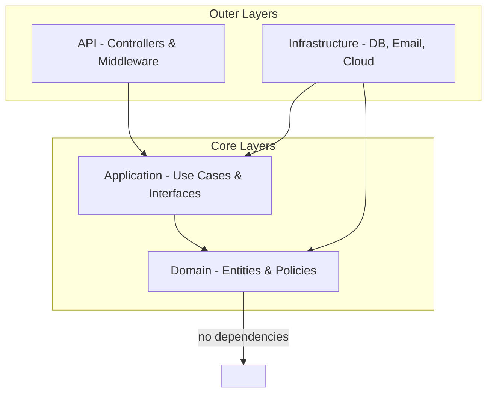
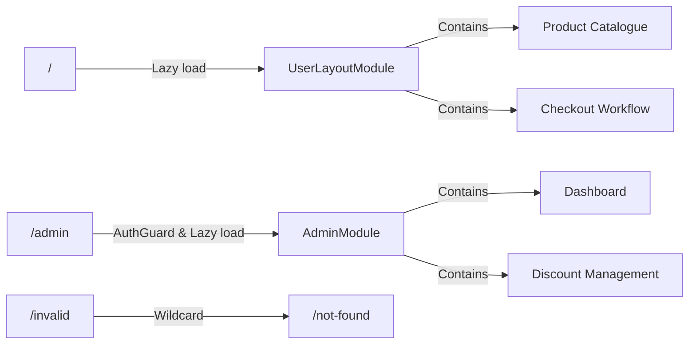
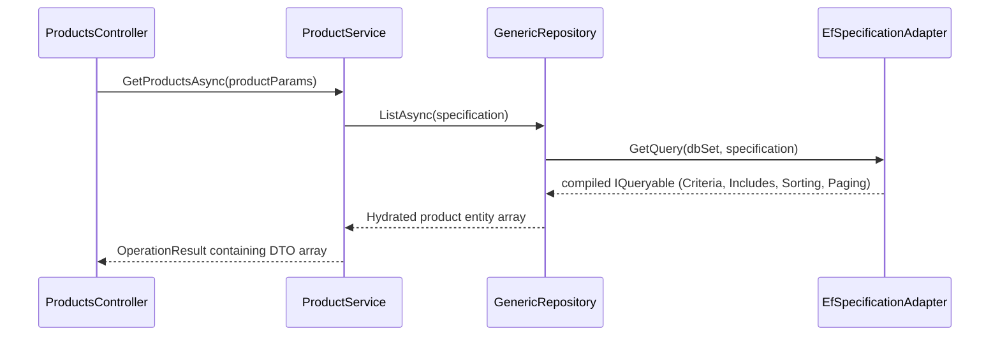
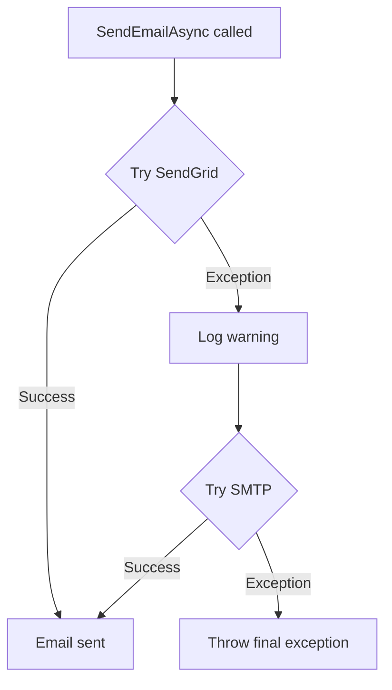
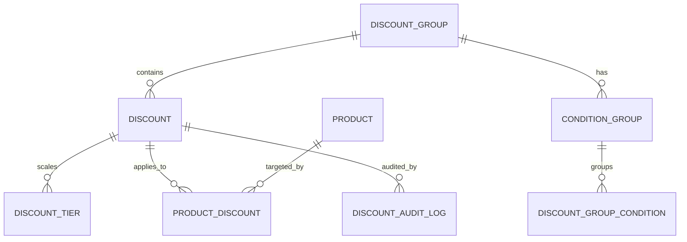
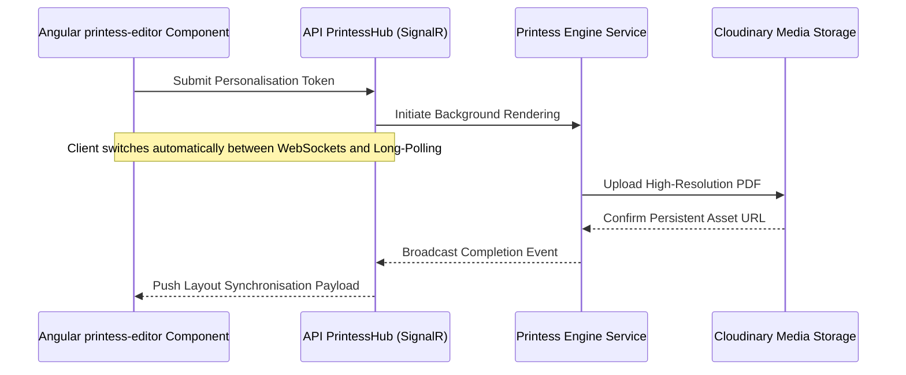

# LiliShop: Comprehensive Technical Architecture, Design Patterns, and Structure Manual

**Backend:** .NET 10 · **Frontend:** Angular 21 · **Architecture:** Clean Architecture

> A production‑grade breakdown of the LiliShop e‑commerce platform.  
> This document explains how the system is structured, the design patterns it uses, and the principles that keep it maintainable, testable, and independent of external frameworks.

---

## Table of Contents

1. [Introduction](#1-introduction)
2. [Why Clean Architecture?](#2-why-clean-architecture)
3. [Global Solution Structure](#3-global-solution-structure)
4. [Backend Architecture – .NET 10](#4-backend-architecture--net-10)
5. [Frontend Architecture – Angular 21](#5-frontend-architecture--angular-21)
6. [Design Patterns in Action](#6-design-patterns-in-action)
7. [Specialised Subsystems](#7-specialised-subsystems)
8. [SOLID Principles Compliance](#8-solid-principles-compliance)
9. [Conclusion](#9-conclusion)

---

## 1. Introduction

LiliShop is a modern e‑commerce platform built with **.NET 10** on the backend and **Angular 21** on the frontend. It started as a traditional layered application and was refactored into a **Clean Architecture** design. The goal was to achieve long‑term maintainability, independent testability, and freedom from framework lock‑in.

This manual documents every major architectural decision, the design patterns used, and how all parts of the system fit together. It is written in plain, clear English, with **Mermaid diagrams** to visualise the most important structures.

---

## 2. Why Clean Architecture?

Most applications begin with a simple **N‑layer architecture**:  
`Presentation → Business Logic → Data Access`.  
This works well for small projects, but as the codebase grows, problems appear:

- **Business logic leaks into the database layer.** Code that decides discount rules suddenly knows about SQL tables and Entity Framework change tracking.
- **Testing becomes difficult.** To test a business rule you need a real database or heavy mocks.
- **Changing infrastructure is risky.** Switching from SendGrid to another email provider may force you to rewrite hundreds of lines of business code.

**Clean Architecture**, introduced by Robert C. Martin, solves these problems by inverting the dependency flow. Instead of everything depending on the database, the core business rules sit in the centre and all outer layers depend on them.

### Key Benefits

- **Framework independence** – The core logic does not reference ASP.NET Core, Entity Framework, or Angular.
- **Isolated testability** – Business rules can be tested with fast, in‑memory fakes.
- **UI agnosticism** – The frontend can be completely replaced without touching backend business rules.
- **Storage independence** – You can swap SQL Server for another database by changing only the Infrastructure layer.



*Arrows show compile‑time dependencies. The Domain layer has no dependencies on anything outside itself.*

---

## 3. Global Solution Structure

### 3.1 Backend Solution Tree

```
Main/
├── LiliShop.Domain/
│   ├── Constants/            (Role.cs, PolicyType.cs)
│   ├── Entities/             (Product.cs, Order.cs, NotificationSubscription.cs)
│   ├── Enums/                (OrderStatus.cs, AlertType.cs)
│   └── Specifications/       (ISpecification.cs)
├── LiliShop.Application/
│   ├── Common/
│   │   ├── Pagination/       (Pagination.cs)
│   │   └── Results/          (OperationResult.cs, ErrorCode.cs)
│   ├── DTOs/                 (ProductToReturnDto.cs, CustomerBasketDto.cs)
│   ├── Interfaces/
│   │   ├── Data/             (IShopDbContext.cs)
│   │   ├── Repositories/     (IUnitOfWork.cs, IGenericRepository.cs)
│   │   └── Services/         (IProductService.cs, IEmailService.cs)
│   ├── Mappers/              (ProductMapper.cs, BasketMappers.cs)
│   └── Specifications/Core/  (BaseSpecification.cs)
├── LiliShop.Infrastructure/
│   ├── Caching/              (CacheManagerService.cs)
│   ├── Data/
│   │   ├── Config/           (ProductConfiguration.cs, OrderConfiguration.cs)
│   │   ├── Migrations/       (ShopDbContextModelSnapshot.cs)
│   │   ├── Specifications/   (EfSpecificationAdapter.cs)
│   │   └── ShopDbContext.cs
│   ├── Identity/             (ApplicationUser.cs, ApplicationRole.cs)
│   └── Services/             (PaymentService.cs, FallbackEmailService.cs)
└── LiliShop.API/
    ├── Controllers/          (ProductsController.cs, BasketController.cs)
    ├── Extensions/           (ApplicationServiceExtensions.cs, IdentityServiceExtensions.cs)
    ├── Hubs/                 (PrintessHub.cs)
    ├── Middlewares/          (CustomExceptionHandler.cs)
    └── Program.cs
```

### 3.2 Frontend Workspace Tree

```
src/app/
├── core/
│   ├── guards/               (auth.guard.ts)
│   ├── interceptors/         (error.interceptor.ts, jwt.interceptor.ts)
│   └── services/             (account.service.ts, basket.service.ts, printess-signal-r.service.ts)
├── shared/
│   ├── components/           (basket-summary/, order-totals/, text-input/)
│   ├── directives/           (check-policy.directive.ts)
│   └── models/               (product.ts, basket.ts, discount-system.ts)
└── features/
    ├── user-area/            (catalog/, basket/, checkout/, home/)
    └── admin-area/           (admin-dashboard/, product-management/, discounts/)
```

---

## 4. Backend Architecture – .NET 10

The backend is divided into four .NET projects, each one matching a layer of Clean Architecture.

### 4.1 Domain Layer – `LiliShop.Domain`

**Purpose:** Define *what* the business is.  
This project contains pure C# entities, enums, custom exceptions, and the specification interface. It has **zero references** to any external framework.

To prevent accidental coupling, the `.csproj` file explicitly blocks implicit imports from Entity Framework Core and ASP.NET Identity:

```xml
<Project Sdk="Microsoft.NET.Sdk">
  <PropertyGroup>
    <TargetFramework>net10.0</TargetFramework>
    <ImplicitUsings>enable</ImplicitUsings>
    <Nullable>enable</Nullable>
    <DisableImplicitNamespaceImports>
      Microsoft.EntityFrameworkCore;Microsoft.AspNetCore.Identity
    </DisableImplicitNamespaceImports>
  </PropertyGroup>
</Project>
```

Entities are plain C# objects, free from ORM attributes:

```csharp
public class Product : BaseEntity
{
    public string Name { get; set; } = string.Empty;
    public string Description { get; set; } = string.Empty;
    public decimal Price { get; set; }
    public string PictureUrl { get; set; } = string.Empty;
    public int ProductTypeId { get; set; }
    public ProductType? ProductType { get; set; }
    public int ProductBrandId { get; set; }
    public ProductBrand? ProductBrand { get; set; }
}
```

### 4.2 Application Layer – `LiliShop.Application`

**Purpose:** Define *what* the system does, but not *how*.  
This layer contains use‑case orchestration, interfaces (contracts), DTOs, and mapping profiles. It depends only on the Domain project.

#### The `OperationResult<T>` Pattern

LiliShop avoids throwing exceptions for business rule violations (exceptions are expensive and break normal flow). Instead, it uses a generic result wrapper:

```csharp
public class OperationResult<T> : IOperationResult
{
    public bool IsSuccess { get; private set; }
    public T? Data { get; private set; }
    public ErrorCode ErrorCode { get; private set; }
    public string ErrorMessage { get; private set; } = string.Empty;

    public static OperationResult<T> Success(T data) => 
        new() { IsSuccess = true, Data = data };

    public static OperationResult<T> Failure(ErrorCode code, string message) => 
        new() { IsSuccess = false, ErrorCode = code, ErrorMessage = message };
}
```

The Application layer also defines the interfaces that the Infrastructure must implement:

- `IShopDbContext` – abstraction for the database context
- `IUnitOfWork` and `IGenericRepository<T>` – transactional and query abstractions
- `IEmailService`, `IPhotoService`, `IPrintessService` – external service contracts

### 4.3 Infrastructure Layer – `LiliShop.Infrastructure`

**Purpose:** Provide concrete implementations for all interfaces defined in the Application layer.  
This is where the system talks to the outside world.

#### Key Contents

- **Data persistence** – `ShopDbContext` uses Entity Framework Core with SQL Server. Fluent API configurations (e.g., `ProductConfiguration`) keep mappings clean.
- **Repositories** – `GenericRepository<T>` and `UnitOfWork` implement the abstractions.
- **External services** – `EmailService` (SendGrid), `PhotoService` (Cloudinary), payment processing (Stripe).
- **Identity** – `ApplicationUser` and everything related to `Microsoft.AspNetCore.Identity` lives strictly here.
- **Caching** – In‑memory and distributed cache strategies.
- **Background jobs** – Hangfire is used for scheduled tasks like discount processing.

The Infrastructure project references both Application and Domain.

### 4.4 API Layer – `LiliShop.API`

**Purpose:** Expose the application to the outside world via REST and WebSockets.  
This is a thin ASP.NET Core Web API project. It contains controllers, middleware, and the composition root.

```csharp
// Simplified Program.cs
var builder = WebApplication.CreateBuilder(args);

builder.Services.AddControllers();
builder.Services.AddApplicationServices(builder.Configuration);
builder.Services.AddIdentityServices(builder.Configuration);
builder.Services.AddSwaggerDocumentation();

var app = builder.Build();

app.UseMiddleware<CustomExceptionHandler>(); // global error handling
app.UseStatusCodePagesWithReExecute("/errors/{0}");

app.UseHttpsRedirection();
app.UseRouting();
app.UseCors("CorsPolicy");

app.UseAuthentication();
app.UseAuthorization();

app.MapControllers();
app.MapHub<PrintessHub>("/hub/printess"); // real-time communication

app.Run();
```

The API project references both Application and Infrastructure, but architecture tests ensure that controllers never bypass the Application layer.

---

## 5. Frontend Architecture – Angular 21

The client side is built with Angular 21 and follows a feature‑based modular structure. The focus is on performance (lazy loading), memory safety, and real‑time capabilities.

### 5.1 Module Organisation & Lazy Loading

The root router loads feature modules only when needed:

```typescript
const routes: Routes = [
  {
    path: '',
    loadChildren: () => import('./features/user-area/user-layout.module')
                          .then(m => m.UserLayoutModule)
  },
  {
    path: 'admin',
    canActivate: [AuthGuard],
    loadChildren: () => import('./features/admin-area/admin/admin.module')
                          .then(m => m.AdminModule)
  },
  { path: 'not-found', component: NotFoundComponent },
  { path: 'server-error', component: ServerErrorComponent },
  { path: '**', redirectTo: 'not-found' }
];
```

- The **user storefront** (`UserLayoutModule`) loads when a visitor enters the shop.
- The **admin back‑office** (`AdminModule`) loads only after the `AuthGuard` has verified the user’s claims.

### 5.2 Zoneless Change Detection & Hybrid State Management

LiliShop operates **without `zone.js**`, completely removing the global overhead of standard Angular change detection. By utilizing **Angular Signals**, the application achieves fine-grained reactivity. The framework updates only the specific DOM elements affected by data updates, bypassing heavy component-tree checks.

State within the application is managed via a hybrid model leveraging both Signals and RxJS:

* **Angular Signals:** Manages synchronous, UI-bound state and derived values using local variables, `signal`, `computed`, and `input` parameters.
* **RxJS Observables:** Handles asynchronous asynchronous data streams (API HTTP calls, real-time SignalR events).
* **Interoperability:** The bridge between stream models and state variables utilizes Angular's `rxjs-interop` package via `toSignal`. Where explicit template or service subscriptions remain, the codebase isolates memory leaks using the `@ngneat/until-destroy` automatic cleanup utility.

```typescript
import { Component, OnInit, signal } from '@angular/core';
import { toSignal } from '@angular/core/rxjs-interop';
import { UntilDestroy, untilDestroyed } from '@ngneat/until-destroy';
import { ProductService } from '@core/services/product.service';

@UntilDestroy()
@Component({
  selector: 'app-shop',
  templateUrl: './shop.component.html'
})
export class ShopComponent implements OnInit {
  // Convert the asynchronous API data stream directly into a reactive Signal
  products = toSignal(this.productService.getProducts());
  searchTerm = signal<string>('');

  constructor(private productService: ProductService) {}

  ngOnInit(): void {
    // Standard RxJS event flows use explicit unsubscription safety hooks
    this.productService.searchQueries$
      .pipe(untilDestroyed(this))
      .subscribe(term => this.searchTerm.set(term));
  }
}

```

### 5.3 Real‑Time Communication with SignalR

The Printess Editor feature depends on a persistent WebSocket connection. The Angular client uses `@microsoft/signalr` to connect to the backend `PrintessHub`. The frontend can dynamically switch between **webhook mode** and **long‑polling mode** depending on browser capabilities and network restrictions.

### 5.4 Routing Flow Diagram



---

### 6.1 Specification Pattern

**Problem:** Traditional data repositories accumulate numerous specialized querying methods like `GetProductsByBrand`, `GetProductsBySearchAndType`, or `GetCountOfActiveProducts`. Every time the frontend UI introduces a new combination of filters, sorting options, or pagination parameters, the developer is forced to modify both the repository interface and its concrete data implementation class. This process leads to repository bloat and violates the Open/Closed Principle.

**Solution:** The Specification pattern isolates data query generation rules into independent, reusable domain classes.

* **`ISpecification<T>`** (defined in the Domain layer) specifies properties such as filtering `Criteria`, eager-loading `Includes`, pagination arguments, and sorting configurations.
* **`BaseSpecification<T>`** (defined in the Application layer) provides a base class to cleanly configure these query rules.
* **Concrete Specifications** (like `ProductsSpecification` below) encapsulate all filtering, searching, dynamic sorting, and multi-relational database joins for a specific use case.
* **`EfSpecificationAdapter`** (defined in the Infrastructure layer) accepts any `ISpecification<T>` configuration, applies the parameters directly to an Entity Framework `IQueryable<T>` data pipeline, and generates a highly optimized SQL command execution stream.



```csharp
namespace LiliShop.Infrastructure.Data.Specifications.Concrete
{
    public class ProductsSpecification : BaseSpecification<Product>
    {
        public ProductsSpecification(ProductSpecParams productParams, bool returnOnlyCount = false)
            : base(CreateProductFilter(productParams))
        {
            if (returnOnlyCount)
            {
                return;
            }

            AddIncludes();

            ApplySorting(productParams);

            SetPagingOptions(productParams.PageSize * (productParams.PageIndex - 1), productParams.PageSize);
        }

        public ProductsSpecification(int id)
            : base(x => x.Id == id)
        {
            AddIncludes();
        }

        private static Expression<Func<Product, bool>> CreateProductFilter(ProductSpecParams productParams)
        {
            // some code 
        }

        private void ApplySorting(ProductSpecParams productParams)
        {
            // some code 
        }

        private void AddIncludes()
        {
            AddInclude(x => x.ProductType);
            AddInclude(x => x.ProductBrand);
            AddInclude(x => x.ProductCharacteristics);
            AddInclude(x => x.ProductPhotos);
        }
    }
}

```

By structuring queries via `ProductsSpecification`, adding or altering incoming client search filters (like `BrandId`, `TypeId`, size dimensions, or `Sale` status) only requires updating this isolated class. The execution repositories, database contexts, and translation adapters remain unchanged.New queries are added by creating a new specification class—the repository and adapter remain untouched. This is a perfect example of the **Open/Closed Principle**.

### 6.2 Fallback Pattern for Resilience

**Problem:** If the primary email service (SendGrid) fails, the entire order confirmation process could break.

**Solution:** The `FallbackEmailService` implements `IEmailService` and wraps two concrete services: the primary `SendGridEmailService` and the backup `SmtpEmailService`.



```csharp
public class FallbackEmailService : IEmailService
{
    private readonly SendGridEmailService _primaryService;
    private readonly SmtpEmailService _fallbackService;
    private readonly ILogger<FallbackEmailService> _logger;

    public FallbackEmailService(
        SendGridEmailService primaryService,
        SmtpEmailService fallbackService,
        ILogger<FallbackEmailService> logger)
    {
        _primaryService = primaryService;
        _fallbackService = fallbackService;
        _logger = logger;
    }

    public async Task<bool> SendEmailAsync(string to, string subject, string htmlContent)
    {
        // 1. Try SendGrid
        bool isSuccess = await _primaryService.SendEmailAsync(to, subject, htmlContent);

        if (isSuccess)
        {
            return true;
        }

        // 2. Fallback to native SMTP
        _logger.LogWarning("Primary email service failed. Executing SMTP fallback.");
        bool fallbackSuccess = await _fallbackService.SendEmailAsync(to, subject, htmlContent);

        if (!fallbackSuccess)
        {
            _logger.LogCritical("Critical failure: Both primary and fallback email services failed to send email to {To}", to);
            throw new InvalidOperationException("The email delivery system is currently unavailable.");
        }

        return true;
    }
}
```

The application code only knows about `IEmailService`. It is completely unaware of the fallback mechanism, satisfying both **Dependency Inversion** and the **Strategy pattern**.

### 6.3 Dependency Injection & Composition Root

Dependency Injection (DI) manages how objects are created and how their dependencies are delivered. In .NET 10, the lifetime of a service determines how long that object lives before it is destroyed and replaced. Choosing the correct lifetime prevents multi-threading bugs, data corruption, and memory leaks.

To clarify these concepts, here is an explanation of the three lifetimes with concrete examples from the `LiliShop` backend codebase:

#### 1. Scoped Lifetime

* **What it means:** A single instance is created per HTTP request. Every component that asks for this service within the same web request gets the exact same instance. Once the request ends, the instance is disposed.
* **Why it matters:** It is used for services that maintain a state unique to a single operation, such as database tracking states.
* **LiliShop Example:** `ShopDbContext` and `UnitOfWork`. If `OrderService` creates an order and `DiscountLifecycleService` updates a promotion count during the same checkout request, both services must share the **exact same instance** of `ShopDbContext`. If they used different instances, Entity Framework Core would track the changes separately, and the transaction would fail to save atomically when `IUnitOfWork.CompleteAsync()` is called.

#### 2. Transient Lifetime

* **What it means:** A brand-new instance is created every single time it is requested (injected). It is never shared, even within the same HTTP request.
* **What "Stateless and Lightweight" means:**
* * **Stateless:** The class does not store any internal data or variables that alter its behavior between calls. It performs a task purely based on the parameters passed into its methods, finishes the execution, and holds no memory of it.
* **Lightweight:** The class instantiation has no expensive overhead (like opening database connections or reading large files from a disk). It is cheap to create and destroy instantly.

* **LiliShop Example:** `SendGridEmailService` or `SmtpEmailService`. These services are operational utilities. They contain a single method—`SendEmailAsync(string to, string subject, string body)`. They do not store user data or database connections inside class fields. They receive data, trigger an external network call, and can be immediately thrown away. Making them Transient ensures they are completely isolated and free from concurrent request contamination.

#### 3. Singleton Lifetime

* **What it means:** Only one single instance is created when the application starts up. This same instance is shared across **every user, every request, and every thread** for the entire lifecycle of the web server.
* **Why it matters:** It is used when an operation must be globally shared to keep a unified state or when the setup cost of the service is too expensive to repeat. It **must be thread-safe**, meaning it can handle multiple users accessing it at the exact same millisecond without crashing or mixing up data.
* **LiliShop Example:** `ResponseCacheService`. This service manages the connection to your Redis multiplexer or local memory cache to store compiled API responses. If it were Scoped or Transient, the application would have to reconnect to Redis on every single page click, destroying performance. As a Singleton, a single cache connection pool is established once and safely shared by thousands of concurrent shoppers browsing the LiliShop product catalog.

---

### Implementation in the Composition Root

Instead of cluttering the main entry point, these lifetimes are organized into the `LiliShop.API` layer using structured `IServiceCollection` extension methods. This architecture guarantees a clean separation between application configuration and pipeline execution.

```csharp
// Main/LiliShop.API/Extensions/ApplicationServiceExtensions.cs
public static class ApplicationServiceExtensions
{
    public static IServiceCollection AddApplicationServices(this IServiceCollection services, IConfiguration config)
    {
        // SINGLETON: Initialized once, shared globally across all threads
        services.AddSingleton<IResponseCacheService, ResponseCacheService>();

        // SCOPED: One instance shared per HTTP request boundary (critical for EF Core tracking)
        services.AddDbContext<ShopDbContext>(options => 
            options.UseSqlServer(config.GetConnectionString("DefaultConnection")));
            
        services.AddScoped<IUnitOfWork, UnitOfWork>();
        services.AddScoped<IProductService, ProductService>();
        services.AddScoped<IDiscountPriceService, DiscountPriceService>();

        // TRANSIENT: Instantiated on every single injection request (stateless, zero overhead)
        services.AddTransient<ISendGridEmailService, SendGridEmailService>();
        services.AddTransient<ISmtpEmailService, SmtpEmailService>();
        services.AddTransient<IEmailService, FallbackEmailService>();

        return services;
    }
}

```

## 7. Specialised Subsystems

### 7.1 Multi‑Discount Engine

LiliShop uses a clear and flexible discount system that applies a single best-matching promotion to a product. It supports two levels of promotions:

* **Single Discounts:** Discounts applied directly to individual products. These have the highest priority.
* **Group Discounts:** Campaigns or promotions applied to a specific group of products.

#### Price Calculation Logic

The system does not combine or add different discount percentages together. Instead, it selects a single discount using the following rules:

1. **Highest Priority:** If a product has an active **Single Discount**, the system selects it immediately.
2. **Best Reduction:** If no Single Discount exists but the product belongs to multiple active **Group Discounts**, the engine automatically selects the single discount that offers the highest reduction (the lowest final price for the customer).

The calculation for the final price ($P_{\text{final}}$) based on the product's base price ($P_{\text{base}}$) uses this formula:

$$P_{\text{final}} = P_{\text{base}} \times (1 - \text{ActiveDiscount}_{\%})$$

The selected $\text{ActiveDiscount}_{\%}$ value is determined by this priority chain:

* **Rule 1:** If $\text{SingleDiscount}$ exists $\rightarrow \text{ActiveDiscount}_{\%} = \text{SingleDiscount}$
* **Rule 2:** Else $\rightarrow \text{ActiveDiscount}_{\%} = \max(\text{GroupDiscount}_1, \text{GroupDiscount}_2, \dots)$

To keep the codebase clean, modular, and easy to maintain, the discount system is split across four focused interfaces instead of using one large, heavy service:

```csharp
public interface IDiscountCrudService { ... }      // Create, update, and delete discount configurations
public interface IDiscountLifecycleService { ... } // Activate, deactivate, and schedule discount periods
public interface IDiscountPriceService { ... }     // Calculate final effective prices and apply discount rules
public interface IDiscountQueryService { ... }     // Find active discounts matching products or users

```

#### Core Components

* **Discount Groups:** High-level campaign containers (such as a “Summer Sale”). They manage the overall promotion timeline and link related rules together.
* **Condition Groups:** A collection of requirements. All rules inside a condition group must match before the system applies the discount.
* **Discount Group Conditions:** The specific rules inside a condition group that check if a discount is valid. They evaluate database fields to limit eligibility based on parameters like:
* Product brand
* Product type
* Specific product items
* User properties


* **Discounts:** The direct definitions that establish the actual markdown value (the percentage reduction factor).
* **Audit Logs:** A permanent tracking record of all discount modifications and final price calculations. These logs make it easy to debug and track pricing decisions.

#### Database Schema



### 7.2 Printess Editor Pipeline

The platform allows customers to personalise print designs (business cards, flyers, etc.) directly in the browser.



1. **Client Interaction** – The `printess-editor.component.ts` captures user input inside an iframe. It supports both a **callback mode** (immediate save) and a **polling mode** (periodic status checks).
2. **Real‑time Sync** – Status updates are pushed through `PrintessHub` over SignalR, keeping the UI in sync without page reloads.
3. **Asset Storage** – The backend renders production‑grade PDFs and uploads them to Cloudinary, where they remain available for checkout.

---

## 8. SOLID Principles Compliance

The entire codebase is built around the five SOLID principles.

| Principle | Application in LiliShop |
|-----------|-------------------------|
| **S**ingle Responsibility | Controllers only handle HTTP concerns. The specification adapter only translates specs to EF queries. Repositories only handle persistence. The `FallbackEmailService` only deals with email resilience. |
| **O**pen/Closed | New filters are added via new specification classes, never by modifying existing repositories. The discount engine accepts new discount types by adding new strategy classes. |
| **L**iskov Substitution | Any class implementing `ISpecification<T>` works transparently with the `EfSpecificationAdapter`. Subtypes never break the expected behaviour. |
| **I**nterface Segregation | The discount subsystem uses four narrow interfaces instead of one giant `IDiscountService`. Email services expose only what is necessary (`IEmailService`). |
| **D**ependency Inversion | The Application layer defines `IShopDbContext` and `IEmailService`. The Infrastructure layer implements them. High‑level policy never depends on low‑level details. |

---

## 9. Conclusion

LiliShop’s transition to Clean Architecture transformed a traditional layered codebase into a modular, resilient, and highly maintainable system. The strict separation of concerns allows developers to:

- Write unit tests for business logic without touching a database.
- Add new features (like a new payment gateway) by implementing an interface, not rewriting core code.
- Understand the system quickly because responsibilities are clearly divided.

The frontend mirrors this discipline with lazy‑loaded modules, memory‑safe reactive programming, and real‑time capabilities via SignalR.

The combination of design patterns—**Specification** for queries, **Fallback** for resilience, **ISP‑driven** service contracts, and a comprehensive **multi‑discount engine**—makes LiliShop a professional‑grade e‑commerce platform that is ready to grow with minimal technical debt.

---

*Document version 1.0 – covering the architecture of LiliShop as of .NET 10 and Angular 21.*
