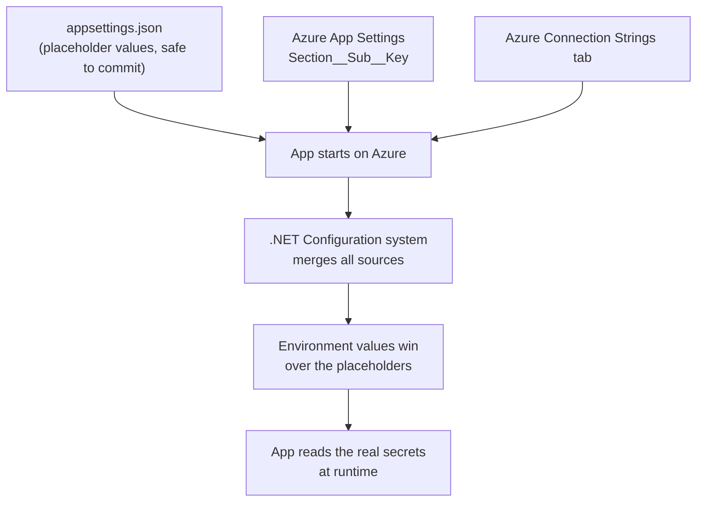

# How I Deployed LiliShop to Azure

   

**Live demo:** [lilishop-bwdfb5azanh0cfa8.germanywestcentral-01.azurewebsites.net/shop](https://lilishop-bwdfb5azanh0cfa8.germanywestcentral-01.azurewebsites.net/shop)

LiliShop is my full-stack e-commerce project — a .NET 10 API on the backend, an Angular 22 storefront on the frontend. This document is about one specific thing: how I got it running on Azure, end to end, using GitHub Actions.

I'm skipping the very basic Azure steps here (creating a resource group, creating the App Service itself) since Microsoft already documents those well — I've linked the best ones at the end. What I want to walk through instead are the three things that actually took me time to figure out:

1. Authenticating GitHub Actions to Azure without setting up full OIDC
2. Building **two separate repositories** — backend and frontend — into one deployable app
3. Keeping every secret out of `appsettings.json` and mapping it correctly to Azure

### Contents
- [The Big Picture](#the-big-picture)
- [Why a Publish Profile Instead of OpenID Connect](#why-a-publish-profile-instead-of-openid-connect)
- [Step 1 — Getting the Publish Profile from Azure](#step-1--getting-the-publish-profile-from-azure)
- [Step 2 — Saving It as a GitHub Secret](#step-2--saving-it-as-a-github-secret)
- [Step 3 — The Multi-Repo Problem: Pulling in the Angular Frontend](#step-3--the-multi-repo-problem-pulling-in-the-angular-frontend)
- [Step 4 — The Workflow File, Step by Step](#step-4--the-workflow-file-step-by-step)
  - 📄 Companion deep-dive: [Understanding GitHub Actions: A Line-by-Line Guide to `main_lilishop.yml`](https://github.com/jahanalem/LinkedIn2GitHub/blob/main/Learning/github-actions-workflow-explained.md)
- [Step 5 — Keeping Secrets Out of appsettings.json](#step-5--keeping-secrets-out-of-appsettingsjson)
- [Step 6 — Pushing It and Checking It Worked](#step-6--pushing-it-and-checking-it-worked)
- [A Few Things I Learned Along the Way](#a-few-things-i-learned-along-the-way)
- [Useful Resources](#useful-resources)

---

## The Big Picture

My backend repo (`LiliShop-backend-dotnet`) owns the GitHub Actions workflow. When it runs, it does two jobs: **build**, then **deploy**.

```mermaid
flowchart LR
    A[I trigger the workflow] --> B[Build job]
    B --> B1[Checkout backend repo]
    B1 --> B2[Build the .NET API]
    B2 --> B3[Checkout frontend repo\nusing a PAT]
    B3 --> B4[npm ci + ng build\nAngular production build]
    B4 --> B5[Copy Angular output\ninto wwwroot]
    B5 --> B6[dotnet publish]
    B6 --> B7[Upload the result\nas one artifact]
    B7 --> C[Deploy job]
    C --> C1[Download the artifact]
    C1 --> C2[azure/webapps-deploy\nusing my Publish Profile]
    C2 --> D[Live on Azure App Service]
```



The important part: **one Azure App Service serves both the API and the Angular app.** There's no separate static-hosting service for the frontend — Angular's production build gets copied straight into the .NET project's `wwwroot` folder, and ASP.NET Core serves it as static files alongside the API endpoints. One deployment, one URL, one thing to keep alive.

---

## Why a Publish Profile Instead of OpenID Connect

If you've read Microsoft's own docs on this, you'll notice they push OpenID Connect (OIDC) pretty hard these days, and for good reason — it avoids storing a long-lived credential anywhere. But for LiliShop, I went with the older Publish Profile method instead, for a few practical reasons:

- **It's scoped to one App Service.** A publish profile only grants access to the single app it was generated for (`lilishop`). If it ever leaks, the damage is contained — it can't touch anything else in my Azure account.
- **No Service Principal, no federated identity setup.** OIDC needs an Entra app registration, a service principal, and federated credentials configured on both the Azure and GitHub sides. For a solo project with one deployment target, that's a lot of moving parts for not much extra benefit.
- **It's a one-step handoff.** The `azure/webapps-deploy` action reads the profile and authenticates directly — no separate login step needed first.

If LiliShop ever became a team project with multiple environments, I'd switch to OIDC. For now, this is the right amount of complexity.

---

## Step 1 — Getting the Publish Profile from Azure

1. Open the [Azure Portal](https://portal.azure.com) and go to **App Services**.
2. Select my app (`lilishop`).
3. On the **Overview** page, click **Get publish profile** in the top toolbar.
4. A file with a `.PublishSettings` extension downloads automatically.


That file is basically a password — full deploy access to this one App Service. I don't commit it anywhere; it goes straight into a GitHub secret in the next step.

---

## Step 2 — Saving It as a GitHub Secret

1. In my backend repo, go to **Settings → Secrets and variables → Actions**.
2. Click **New repository secret**.
3. Name it `AZURE_PUBLISH_PROFILE`.
4. Open the downloaded `.PublishSettings` file in a text editor, copy the **entire XML content**, and paste it as the secret's value.
5. Click **Add secret**.


From here, the workflow references it as `${{ secrets.AZURE_PUBLISH_PROFILE }}`. GitHub encrypts it at rest and only decrypts it inside the running job — it never shows up in logs.

---

## Step 3 — The Multi-Repo Problem: Pulling in the Angular Frontend

This was the part that wasn't obvious at first. My workflow lives in the backend repo, but it also needs the frontend code from a **completely separate repository** (`LiliShop-frontend-angular`) to build the Angular app.

The default `GITHUB_TOKEN` that every workflow gets automatically only has permission to touch the repository it's running in — it can't clone a different repo, even one I own. And even though my frontend repo happens to be public, GitHub's automated data-center runners still hit rate limits on anonymous, unauthenticated cloning. So I needed a **Personal Access Token (PAT)**.

**Creating the token:**

1. Go to [github.com/settings/tokens](https://github.com/settings/tokens).
2. Click **Generate new token → Generate new token (classic)**.
3. Give it a clear name (I used something like "CI/CD Pipeline Access") and an explicit expiration date — mine expires December 6, 2026, so I've got a calendar reminder to renew it before then.
4. Under scopes, check **repo** (to clone) and **workflow** (needed since the token touches an Actions-related checkout).
5. Click **Generate token**, and copy it immediately — GitHub only shows it once.


**Saving it as a secret**, same as before: backend repo → **Settings → Secrets and variables → Actions → New repository secret**, named `GH_PAT`.


In the workflow, it's used as the `token` input on the checkout step for the frontend repo — that's the part that turns an anonymous clone attempt into an authenticated one.

---

## Step 4 — The Workflow File, Step by Step

Here's the actual workflow, `main_lilishop.yml`, with a quick explanation of each stage below it.

```yaml
name: Build and deploy ASP.Net Core app to Azure Web App - lilishop

on:
  workflow_dispatch:

jobs:
  build:
    runs-on: windows-latest

    env:
      PROJECT_PATH: ./Main/LiliShop.API

    steps:
      - uses: actions/checkout@v4

      - name: Print working directory
        run: pwd

      - name: Set up .NET Core
        uses: actions/setup-dotnet@v4
        with:
          dotnet-version: '10.x'

      - name: Build with dotnet
        run: dotnet build ${{env.PROJECT_PATH}} --configuration Release

      - name: Check out frontend repository
        uses: actions/checkout@v4
        with:
          repository: jahanalem/LiliShop-frontend-angular
          path: frontend
          token: ${{ secrets.GH_PAT }}

      - name: Set up Node.js
        uses: actions/setup-node@v4
        with:
          node-version: '26'

      - name: Install dependencies and build Angular app
        run: |
          cd frontend
          npm ci --legacy-peer-deps
          npx ng build --configuration=production --output-path="../Main/LiliShop.API/ClientBuildOutput" --output-hashing=all

      - name: Copy Angular browser output to wwwroot
        run: |
          cd "${{ github.workspace }}"
          xcopy /E /I /Y "Main\LiliShop.API\ClientBuildOutput\browser\*" "Main\LiliShop.API\wwwroot\browser"

      - name: List wwwroot contents after Angular build
        run: ls -R ./Main/LiliShop.API/wwwroot/browser

      - name: dotnet publish
        run: dotnet publish ${{env.PROJECT_PATH}} -c Release -o "${{github.workspace}}/myapp"

      - name: List publish output contents
        run: ls -R "${{github.workspace}}/myapp"

      - name: Upload artifact for deployment job
        uses: actions/upload-artifact@v4
        with:
          name: .net-app
          path: "${{github.workspace}}/myapp"

  deploy:
    runs-on: windows-latest
    needs: build
    environment:
      name: 'Production'
      url: ${{ steps.deploy-to-webapp.outputs.webapp-url }}

    steps:
      - name: Download artifact from build job
        uses: actions/download-artifact@v4
        with:
          name: .net-app
          path: .

      - name: Deploy to Azure Web App
        id: deploy-to-webapp
        uses: azure/webapps-deploy@v3
        with:
          app-name: 'lilishop'
          publish-profile: ${{ secrets.AZURE_PUBLISH_PROFILE }}
          package: .
```

A few notes on the choices in here:

- **`runs-on: windows-latest`** — I use `xcopy` to merge the Angular build into `wwwroot`, which is a Windows-only command. That's the reason both jobs run on Windows runners instead of the more common (and slightly faster) `ubuntu-latest`.
- **`npm ci --legacy-peer-deps`** — Angular 22 is new enough that some third-party packages haven't updated their peer dependency ranges yet. This flag tells npm to install anyway instead of failing on version mismatches.
- **`--output-hashing=all`** — adds a unique hash to every built file name, so browsers don't serve a cached, outdated version of my JS/CSS after a new deployment.
- **The `browser` subfolder** — since Angular 17, `ng build` outputs into a `browser` folder by default (this exists to support server-side rendering setups, even though I'm not using SSR here). That's why the copy step specifically targets `ClientBuildOutput\browser\*`.
- **No separate Azure login step** — because I'm using a publish profile, `azure/webapps-deploy` authenticates on its own. There's nothing to log into beforehand.

One small thing I noticed while writing this up: my `deploy` job still has `permissions: id-token: write` left over from when I was experimenting with OIDC. It's not doing anything now that I've switched to a publish profile — harmless to leave, but safe to delete too.

---

## Step 5 — Keeping Secrets Out of appsettings.json

None of my real API keys or connection strings live in `appsettings.json`. Locally, it's full of placeholders like this:

```json
{
  "StripeSettings": {
    "PublishableKey": "StripeSettings__PublishableKey read-from-environment-variables-azure",
    "SecretKey": "StripeSettings__SecretKey read-from-environment-variables-azure",
    "WhSecret": "StripeSettings__WhSecret read-from-environment-variables-azure"
  },
  "ConnectionStrings": {
    "DefaultConnection": "read-from-environment-variables-azure",
    "Redis": "read-from-environment-variables-azure"
  }
}
```

That "value" isn't a real setting — it's a note to myself, spelling out the exact environment variable name I need to configure in Azure. It means I never have to keep a separate cheat sheet lying around.

**Why this works without any extra code:** ASP.NET Core reads configuration from environment variables automatically. Nested JSON keys use a colon (`Section:SubSection:Key`), but environment variables can't contain colons — so .NET's convention is to use a double underscore (`Section__SubSection__Key`) instead, and it gets converted automatically. In Azure, I set these under **App Service → Settings → Environment variables → App settings**:

| What it configures | Azure App Setting name | Matches this JSON key |
|---|---|---|
| Stripe publishable/secret/webhook keys | `StripeSettings__PublishableKey`, `StripeSettings__SecretKey`, `StripeSettings__WhSecret` | `StripeSettings:PublishableKey`, etc. |
| Cloudinary API key, secret, cloud name | `CloudinarySettings__ApiKey`, `CloudinarySettings__ApiSecret`, `CloudinarySettings__CloudName` | `CloudinarySettings:ApiKey`, etc. |
| SendGrid email API key | `EmailSenderProvider__SendGrid__ApiKey` | `EmailSenderProvider:SendGrid:ApiKey` |
| JWT signing key | `Token__Key` | `Token:Key` |
| Admin notification email | `AdminSettings__AdminEmail` | `AdminSettings:AdminEmail` |
| Printess designer service token | `Printess__ServiceToken` | `Printess:ServiceToken` |

Every other nested setting follows the exact same pattern — two underscores wherever there'd be a colon.


**Connection strings work a bit differently.** Notice they don't get the `Section__Key` reminder prefix in my placeholder file — that's on purpose. Azure has a dedicated **Connection strings** tab (separate from App settings), and whatever type you pick there (SQL Database, Custom, etc.) determines an internal prefix that .NET's configuration system strips off automatically, landing it in `ConnectionStrings:<Name>` without me doing anything extra:

| Name in Azure | Maps to | What it's for |
|---|---|---|
| `DefaultConnection` | `ConnectionStrings:DefaultConnection` | The Azure SQL Database |
| `Redis` | `ConnectionStrings:Redis` | The Redis cache |

One extra thing worth knowing if you're setting this up yourself: Microsoft's own documentation notes a long-standing quirk where a few connection types — Redis, PostgreSQL, Cosmos DB, Service Bus, Event Hubs — don't get picked up reliably under their "native" type in .NET's environment-variable reader. Their recommendation is to add those specific ones as type **Custom** instead of their specific database type. If a connection string ever mysteriously doesn't show up in your app, that setting is the first thing worth checking.



Nothing sensitive ever touches source control. Locally, I fall back to my own `appsettings.Development.json` or user secrets; in Azure, the real values simply take over.

---

## Step 6 — Pushing It and Checking It Worked

1. Trigger the workflow (mine is set to `workflow_dispatch`, so I run it manually from the **Actions** tab).
2. Watch the **build** job — it checks out both repos, compiles Angular, copies the output, and publishes the .NET app.
3. Watch the **deploy** job — it downloads that artifact and pushes it to Azure.
4. Open the live URL and confirm everything actually loads: [lilishop-bwdfb5azanh0cfa8.germanywestcentral-01.azurewebsites.net/shop](https://lilishop-bwdfb5azanh0cfa8.germanywestcentral-01.azurewebsites.net/shop)

If the site loads but anything touching the database or Stripe fails, it's almost always a missing or misspelled App Setting — not a code problem.

---

## A Few Things I Learned Along the Way

- **A publish profile is fine for a solo project.** I don't need to over-engineer authentication for an app with one deployment target and one contributor.
- **Two repos, one deployment, is very doable** — it just needs a PAT with the right scopes, and a clear mental model of which token can access what.
- **Set a calendar reminder for PAT expiration.** Classic tokens with an expiry date are safer, but they will silently break your deploys the day they expire if you forget about them.
- **The double-underscore convention removed almost all my "how do I get this secret into Azure" confusion.** Once I understood the pattern, every new setting just followed the same rule.
- **Leftover config from earlier experiments (like my stray `id-token: write` permission) is easy to miss.** Worth a once-over on the workflow file every so often.

---

## Useful Resources

- [Deploy by using GitHub Actions — Azure App Service (Microsoft Learn)](https://learn.microsoft.com/en-us/azure/app-service/deploy-github-actions)
- [Configure an App Service app — environment variables & connection strings (Microsoft Learn)](https://learn.microsoft.com/en-us/azure/app-service/configure-common)
- [Managing your personal access tokens (GitHub Docs)](https://docs.github.com/en/authentication/keeping-your-account-and-data-secure/managing-your-personal-access-tokens)
- [azure/webapps-deploy action (GitHub Marketplace)](https://github.com/Azure/webapps-deploy)
- [Configuration in ASP.NET Core (Microsoft Learn)](https://learn.microsoft.com/en-us/aspnet/core/fundamentals/configuration/)
- [Quickstart: Create a single database — Azure SQL Database (Microsoft Learn)](https://learn.microsoft.com/en-us/azure/azure-sql/database/single-database-create-quickstart?view=azuresql)
