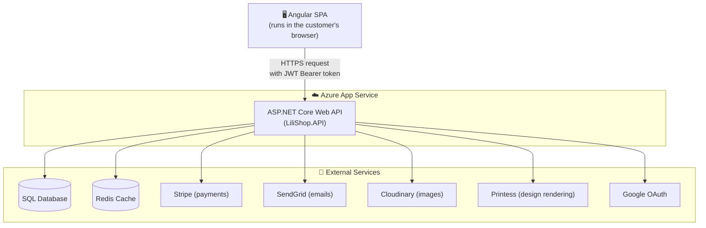
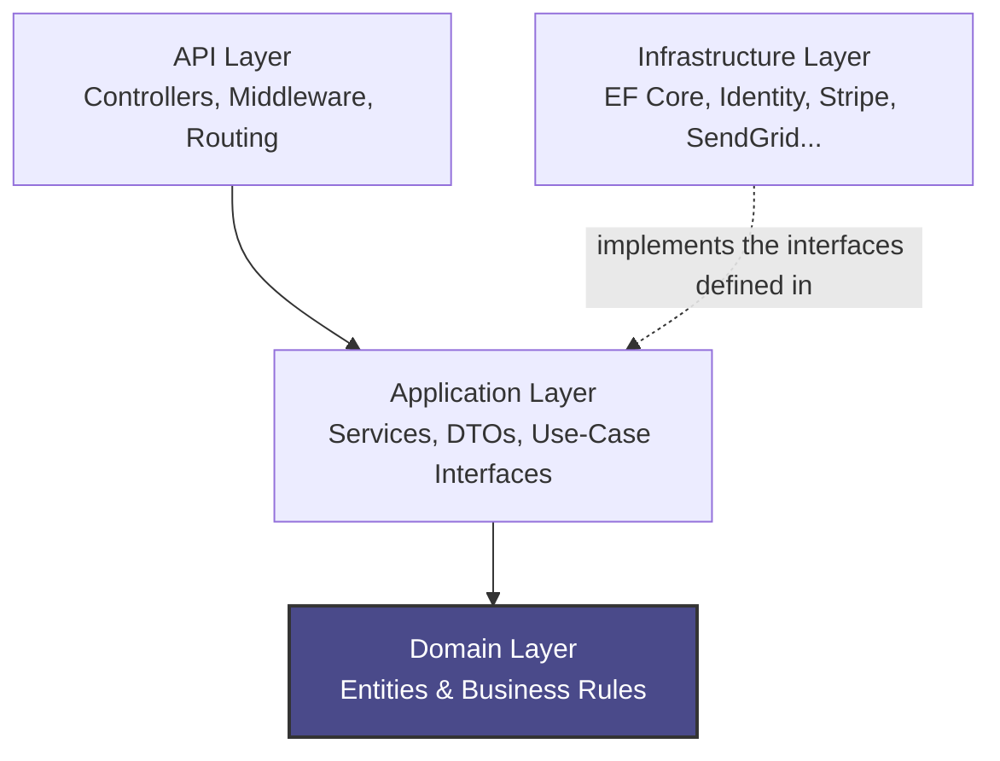
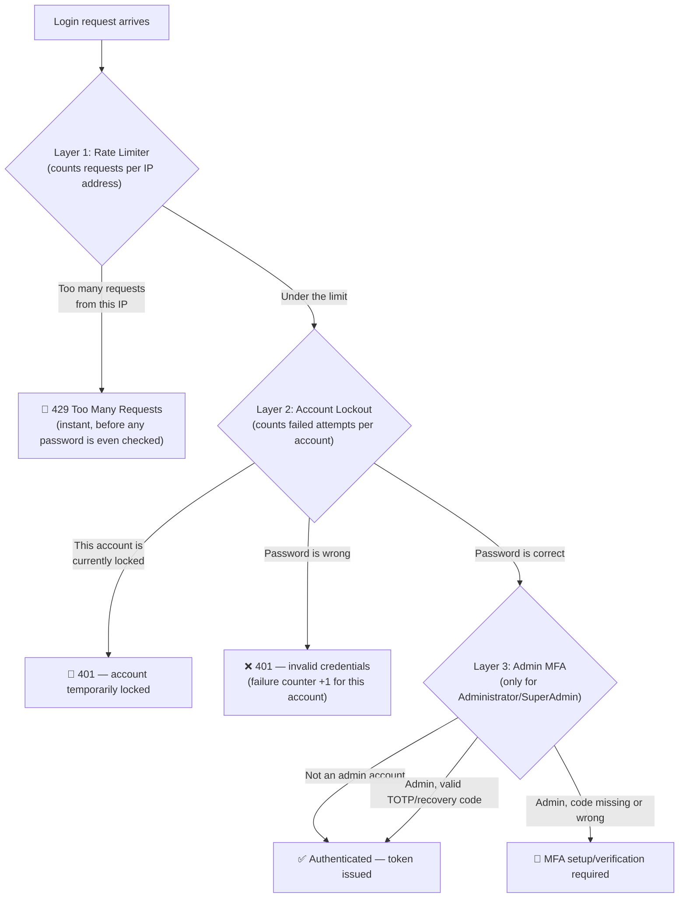
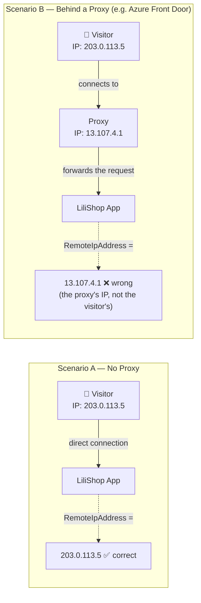
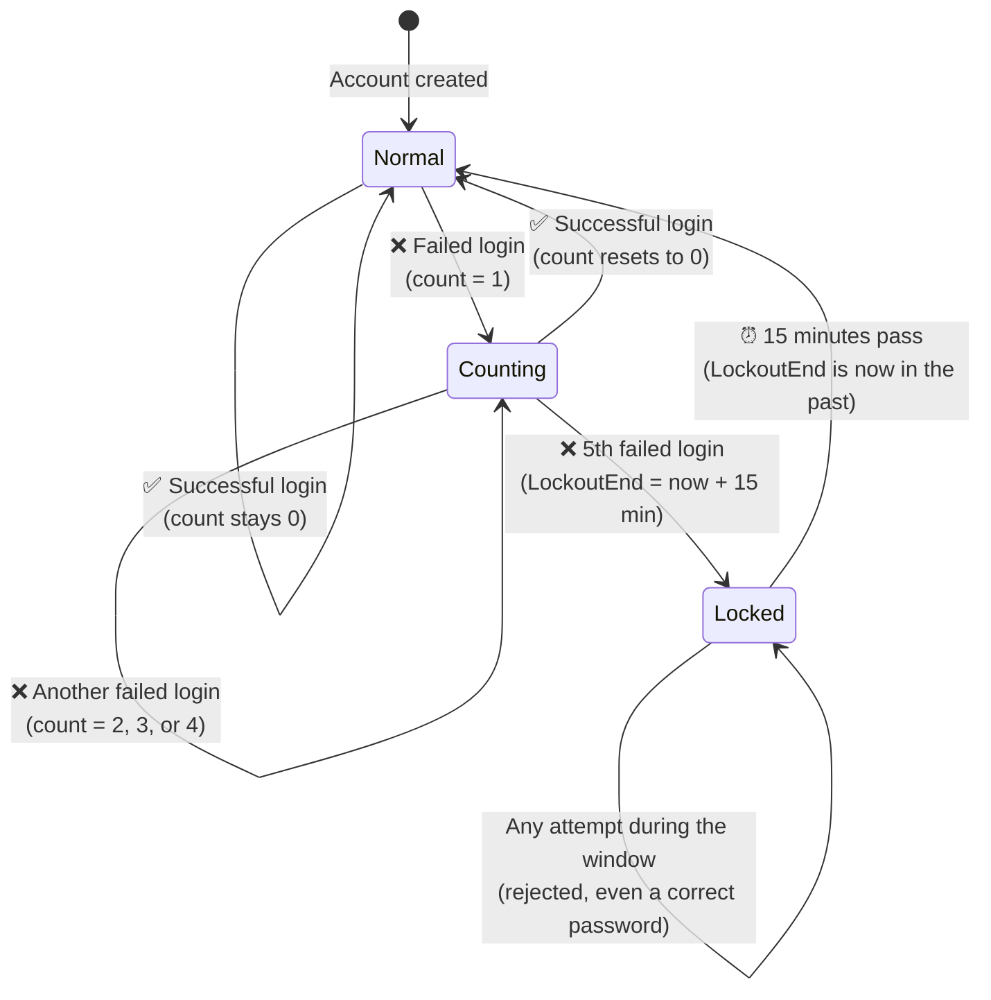
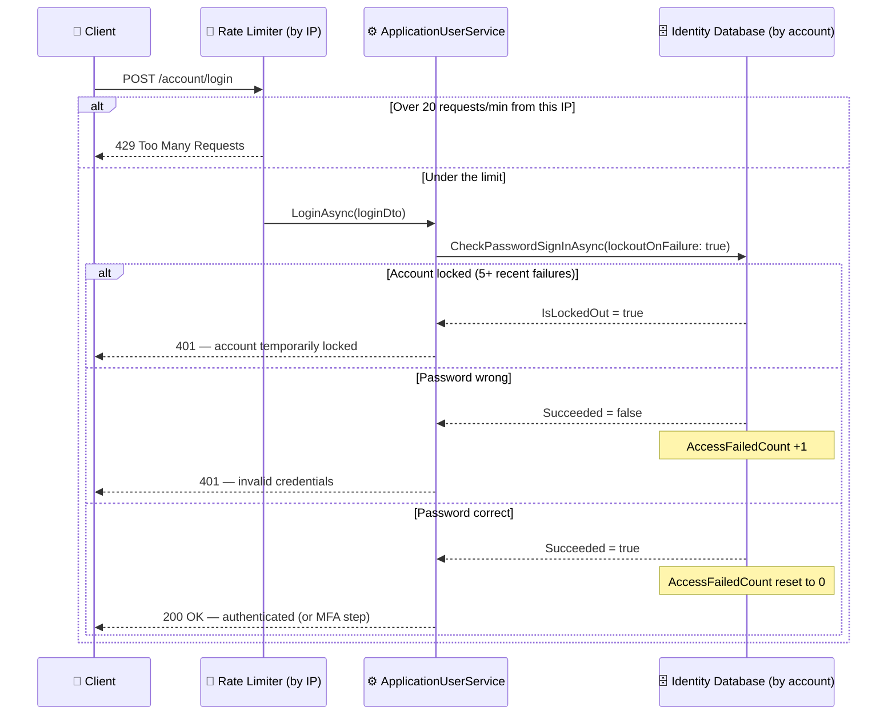

# 🛡️ LiliShop Security Series — Part 1: Brute-Force Attack Protection

> A complete technical guide to how LiliShop is built, and — in particular — how it defends itself against one of the most common attacks on any website with a login form: **brute-force password guessing**.

This document assumes **no prior background**. Every technical term is explained the first time it appears. If you're new to security concepts like rate limiting, account lockout, or multi-factor authentication, this is written for you.

---

## 📑 Table of Contents

1. [Introduction](#1-introduction)
2. [Tech Stack & Architecture](#2-tech-stack--architecture)
3. [Security Hardening — The Big Picture](#3-security-hardening--the-big-picture)
4. [🎯 Deep Dive: Defending LiliShop Against Brute-Force Attacks](#4--deep-dive-defending-lilishop-against-brute-force-attacks)
   - [4.1 What Is a Brute-Force Attack?](#41-what-is-a-brute-force-attack)
   - [4.2 Why This Matters for LiliShop](#42-why-this-matters-for-lilishop)
   - [4.3 The Two-Layer (Plus One) Defense Strategy](#43-the-two-layer-plus-one-defense-strategy)
   - [4.4 Layer 1: Rate Limiting](#44-layer-1-rate-limiting)
   - [4.5 Making the Rate Limiter Trustworthy: Forwarded Headers & Proxies](#45-making-the-rate-limiter-trustworthy-forwarded-headers--proxies)
   - [4.6 Layer 2: Account Lockout](#46-layer-2-account-lockout)
   - [4.7 Putting It Together: Four Real Attack Scenarios](#47-putting-it-together-four-real-attack-scenarios)
   - [4.8 The Frontend Side: Handling a 429 Gracefully](#48-the-frontend-side-handling-a-429-gracefully)
   - [4.9 Advantages & Limitations of This Approach](#49-advantages--limitations-of-this-approach)
   - [4.10 Try It Yourself](#410-try-it-yourself)
5. [🔐 Admin Multi-Factor Authentication (MFA)](#5--admin-multi-factor-authentication-mfa)
6. [Other Security Hardening (Reference Summary)](#6-other-security-hardening-reference-summary)
7. [📖 Glossary of Terms](#7--glossary-of-terms)
8. [Appendix: Configuration Reference](#8-appendix-configuration-reference)

---

## 1. Introduction

**LiliShop** is a full-stack e-commerce application — a real online shop where customers can browse products, customize designs, and pay for orders — built with a modern, production-style architecture.

It's made of two separate projects that talk to each other over HTTP:

- A **backend API** (built with .NET 10 / ASP.NET Core) that owns all the business logic, the database, and every security decision.
- A **frontend single-page application** (built with Angular) that runs in the customer's browser and calls the backend API to get and send data.

This document has two goals:

1. Give a newcomer a clear picture of how the whole system fits together.
2. Walk through — in real tutorial depth, with actual code and actual numbers — **how LiliShop protects itself from brute-force login attacks**. This is the centerpiece of the document, because it's a problem every application with a login form has to solve, and the solution involves several moving parts that only make sense when you see them working together.

> [!NOTE]
> Every code snippet in this document is taken directly from LiliShop's real source code — nothing here is a generic textbook example unless explicitly labeled as one.

---

## 2. Tech Stack & Architecture

### 2.1 The Technologies Involved

| Area | Technology | What it's for (in plain terms) |
|---|---|---|
| Backend framework | .NET 10 / ASP.NET Core | The engine that runs the server-side code and handles web requests |
| Database access | Entity Framework Core (EF Core) | Lets C# code read/write the database without writing raw SQL by hand |
| Caching | Redis | A very fast in-memory data store, used to avoid repeating slow work |
| Identity & login | ASP.NET Core Identity | A built-in, battle-tested system for managing user accounts, passwords, and login security |
| Authentication tokens | JWT (JSON Web Token) | A signed, tamper-proof "ID card" the server hands a user after login |
| Payments | Stripe | Handles credit card processing so LiliShop never touches raw card numbers |
| Emails | SendGrid | Sends transactional emails (password resets, confirmations) |
| Images | Cloudinary | Stores and processes product photos |
| Design rendering | Printess | Renders customer-designed products (e.g., custom print jobs) |
| Background jobs | Hangfire | Runs scheduled/background tasks (e.g., cleanup jobs) outside the normal request flow |
| Real-time updates | SignalR | Lets the server push live updates to the browser (e.g., "your design is ready") without the browser having to keep asking |
| Frontend framework | Angular | Builds the interactive website the customer actually sees and clicks around in |

### 2.2 High-Level Architecture

Here's how a request actually travels through the system:



### 2.3 Clean Architecture: Why the Backend Is Split Into Layers

LiliShop's backend isn't one giant pile of code — it's deliberately split into four layers, a pattern called **Clean Architecture**. The core idea: *the most important business rules should not depend on technical details like "which database we use."*

| Layer | What lives here | Analogy |
|---|---|---|
| **Domain** | The core business entities (Product, Order, User) and the rules that define them | The blueprint of the business itself — would still make sense even without a computer |
| **Application** | Use cases — "place an order," "log in," "apply a discount" — plus the interfaces (contracts) that describe what the outside world must provide | The recipe book — describes *what* needs to happen, not *how* it's technically done |
| **Infrastructure** | The actual technical implementations: EF Core database code, calls to Stripe/SendGrid/Cloudinary, the JWT token generator | The kitchen equipment — the actual tools that carry out the recipe |
| **API** | Controllers, middleware, routing — the outermost layer that receives HTTP requests and hands them to the Application layer | The waiter — takes the order from the customer and passes it to the kitchen |



> [!TIP]
> The arrow direction matters. The Domain layer is at the center and depends on *nothing*. Everything else depends inward, toward the Domain. This means you could swap out the entire database technology (say, from SQL Server to PostgreSQL) by only touching the Infrastructure layer — the business rules in Domain wouldn't need to change at all.

---

## 3. Security Hardening — The Big Picture

Before the deep dive into brute-force protection, it's worth knowing the context: LiliShop went through a comprehensive, white-box security audit and hardening pass, covering the OWASP Top 10 and the OWASP API Security Top 10 (industry-standard checklists of the most common web application vulnerabilities). Dozens of issues were found and fixed, ranging from Critical to Low severity.

Here's a summary table of the major categories addressed. Section 6 covers each of these briefly; **Section 4 covers brute-force protection in full tutorial depth**, since that's the focus of this document.

| Category | What was fixed (short version) |
|---|---|
| 🔴 Authentication bypass | Google sign-in was accepting forged tokens without verifying them cryptographically |
| 🔴 Secret exposure | Real API keys and passwords were committed to git history |
| 🟠 Brute-force / credential stuffing | **No protection existed at all** — this is the subject of Section 4 |
| 🟠 Broken access control (IDOR) | Some endpoints let a logged-in user access *other* users' data by changing an ID in the URL |
| 🟠 SSRF (Server-Side Request Forgery) | A callback endpoint could be tricked into making the server fetch internal/private URLs |
| 🟡 Security misconfiguration | Missing security headers, loose CORS rules, verbose logging |
| 🟡 Business logic gaps | Payment amounts weren't being double-checked against what was actually charged |

> [!IMPORTANT]
> The single biggest, most exploitable gap before this hardening pass was the **complete absence of brute-force protection** on the login endpoint. Anyone, anywhere, could attempt unlimited password guesses against any account — including admin accounts — with no slowdown and no lockout. That's exactly what Section 4 is about.


---

## 4. 🎯 Deep Dive: Defending LiliShop Against Brute-Force Attacks

### 4.1 What Is a Brute-Force Attack?

Imagine a locked suitcase with a 4-digit combination lock. Someone trying to open it without knowing the code could just start trying every possibility: `0000`, `0001`, `0002`, all the way to `9999`. No cleverness involved — just patient, mechanical repetition until something works. That's the literal meaning of "brute force": overpowering a problem through sheer repetition rather than through insight.

A **brute-force attack** on a login page is the same idea, aimed at a password field. An attacker (almost always using an automated script, not a human typing by hand) sends login request after login request, trying a different password each time, until one of them works.

There are two closely related variants worth knowing by name, because LiliShop's real code comments actually mention both:

| Attack | How it works | Example |
|---|---|---|
| **Brute-force attack** | Attacker targets *one specific account* and tries many different passwords against it | Attacker knows `admin@lilishop.com` exists and tries `password1`, `Summer2024!`, `admin123`, ... against that one address |
| **Credential stuffing** | Attacker already has real email/password pairs, usually leaked from a *different* website's data breach, and tries the exact same pairs here | A password that leaked from an unrelated shopping site last year gets tried against LiliShop, betting the person reused it |
| **Password spraying** | Attacker tries one or two very common passwords against *many different accounts*, to avoid triggering a per-account lockout | Trying `Winter2024!` against 500 different email addresses, one attempt each |

All three are automated, all three are about volume, and — as you'll see in Section 4.7 — LiliShop's layered defenses catch each of them slightly differently.

### 4.2 Why This Matters for LiliShop

It's tempting to think "who would bother attacking a small shop?" — but brute-forcing isn't manual, targeted effort. It's cheap, automated, and untargeted; attackers run the same script against thousands of websites simultaneously, LiliShop included, without ever specifically choosing it.

The consequences if it succeeds:

- **Customer account takeover** — an attacker who guesses a customer's password gets their saved addresses, order history, and potentially stored payment methods.
- **Admin account takeover** — this is the worst case. LiliShop's admin roles (`Administrator`, `SuperAdmin`) can manage discounts, view all orders, and control the store itself. A successfully guessed admin password, with no other protection, would mean total compromise of the shop.
- **Reputational and business damage** — fraudulent orders, manipulated pricing, and a breach disclosure are all expensive, both financially and in customer trust.

> [!WARNING]
> Before this hardening pass, LiliShop's login endpoint had **zero** brute-force protection: no rate limit, no account lockout, `lockoutOnFailure: false`. An attacker could try passwords as fast as their script could send HTTP requests — potentially thousands per minute — against any account, including admin accounts, with nothing to stop them.

### 4.3 The Two-Layer (Plus One) Defense Strategy

There's no single silver-bullet fix for brute-force attacks. LiliShop instead uses **three layers of defense**, stacked on top of each other, where each layer catches a different shape of attack:



| Layer | Tracks by | Stops | Covered in |
|---|---|---|---|
| **1. Rate Limiting** | IP address | Fast, high-volume automated guessing from one source | Section 4.4 |
| **2. Account Lockout** | User account | Sustained guessing against one account, even from many different IPs | Section 4.6 |
| **3. Admin MFA** | Nothing you *know* — something you *have* (a phone with an authenticator app) | A correctly guessed password from being sufficient on its own, for the highest-privilege accounts | Section 5 |

The reason you need more than one layer is that each layer has a blind spot the *other* layer covers. That's not a coincidence — it's the whole design philosophy, and Section 4.7 walks through concrete scenarios that make this vivid.

### 4.4 Layer 1: Rate Limiting

#### 4.4.1 The Idea

Think of rate limiting like a bouncer standing at a door. The bouncer doesn't check anyone's identity — they just count: "how many people have come through this door in the last minute?" Past a certain number, the bouncer starts turning people away, regardless of who they are or what they want.

That's exactly what LiliShop's rate limiter does for the login endpoint (and several other sensitive endpoints). It doesn't know or care whether a password is right or wrong — it just counts *how many requests* have arrived from a given IP address in the last 60 seconds, and blocks any request past the limit, instantly, before the request is even allowed to check a password.

This matters because it's the **first, cheapest line of defense**. Checking a password requires the server to do real work — query the database, hash-compare the password. Rate limiting stops an attacker before any of that work happens, at a tiny fraction of the cost.

#### 4.4.2 How It's Configured (Real Code)

This is set up in two places. First, in `Program.cs`, the rules are defined once:

```csharp
using System.Threading.RateLimiting;

// Rate limiting to protect authentication endpoints from brute-force / credential stuffing
// and to blunt abuse of sensitive flows. The "auth" policy is a per-IP fixed window.
builder.Services.AddRateLimiter(options =>
{
    options.RejectionStatusCode = StatusCodes.Status429TooManyRequests;

    options.AddPolicy("auth", httpContext =>
        RateLimitPartition.GetFixedWindowLimiter(
            partitionKey: httpContext.Connection.RemoteIpAddress?.ToString() ?? "unknown",
            factory: _ => new FixedWindowRateLimiterOptions
            {
                PermitLimit = 20,
                Window = TimeSpan.FromMinutes(1)
            }));

    options.OnRejected = (context, _) =>
    {
        var logger = context.HttpContext.RequestServices.GetRequiredService<ILogger<Program>>();
        logger.LogWarning("Rate limit rejected request. Path={Path} RemoteIp={RemoteIp}",
            context.HttpContext.Request.Path.Value,
            context.HttpContext.Connection.RemoteIpAddress?.ToString() ?? "unknown");
        return ValueTask.CompletedTask;
    };
});
```

Let's unpack every piece of this, in order:

**`AddRateLimiter(options => { ... })`** registers the rate-limiting feature with the application, and everything inside the braces configures how it behaves.

**`RejectionStatusCode = StatusCodes.Status429TooManyRequests`** sets what HTTP status code gets sent back to anyone who's blocked. `429` is the standard, official HTTP status code that means exactly this: "you've sent too many requests, slow down." Any HTTP client — a browser, a script, a mobile app — recognizes this code.

**`AddPolicy("auth", ...)`** defines a named rule set called `"auth"`. The name is arbitrary — it could be called anything — but it's how the code later says "use *this* specific rule" on specific endpoints (you'll see this in a moment).

**`partitionKey: httpContext.Connection.RemoteIpAddress?.ToString() ?? "unknown"`** — this is the most important line to understand. A "partition" is a separate bucket. This says: *give every distinct IP address its own separate bucket of allowed requests.* Think of it like a bakery handing out numbered tickets — everyone with a different ticket number waits in their own line. If IP address `203.0.113.5` and IP address `198.51.100.9` both hit the login endpoint, they get two completely separate counters — one attacker hammering the endpoint doesn't use up a legitimate visitor's allowance. The `?? "unknown"` part is just a safety fallback: "if for some reason the IP can't be determined, put this request in a bucket literally named 'unknown' instead of crashing."

**`PermitLimit = 20` and `Window = TimeSpan.FromMinutes(1)`** — this is the actual rule: 20 requests allowed per IP address, per 60-second window. This is a **fixed window** limiter specifically, which means the clock resets to zero at fixed 60-second boundaries (as opposed to a "sliding" window that continuously re-evaluates the last 60 seconds on a rolling basis — more on this trade-off in Section 4.9).

**`OnRejected = (context, _) => { ... }`** runs every time someone actually gets blocked. It writes a log line recording the request path and the IP address — deliberately *not* logging the email or password that was attempted, so nothing sensitive ends up sitting in a log file. This gives visibility: if the logs suddenly show a spike of blocked requests all hitting `/account/login` from one IP, that's a clear, searchable signal that an attack is happening in real time.

Second, the policy actually gets *applied* to the login endpoint in `AccountController.cs`:

```csharp
[EnableRateLimiting("auth")]
[HttpPost("login")]
public async Task<ActionResult<UserDto>> Login(LoginDto loginDto)
{
    var result = await _applicationUserService.LoginAsync(loginDto);
    return HandleOperationResult(result);
}
```

The `[EnableRateLimiting("auth")]` attribute is the "sign on the door" — it tells ASP.NET Core "use the `auth` bouncer rules for this specific endpoint." In LiliShop, this same attribute is applied to every endpoint an attacker could realistically abuse to guess credentials or spam users: `login`, `register`, `google-login`, `forgot-password`, `reset-password`, `resend-confirmation-email`, `mfa/setup`, and `mfa/enable`.

Finally, the rate limiter middleware needs to actually run in the request pipeline, and *where* it runs matters:

```csharp
app.UseForwardedHeaders();  // must run first — more on this in Section 4.5
app.UseCors("CorsPolicy");
app.UseRouting();
app.UseRateLimiter();        // ⬅ the bouncer stands here
app.UseAuthentication();
app.UseAuthorization();
```

> [!TIP]
> Notice `UseRateLimiter()` runs **before** `UseAuthentication()`. This ordering is deliberate: the app checks "have you sent too many requests?" before it spends any effort checking "is your password correct?" This way, an attacker gets stopped cheaply and early, rather than after the server has already done the more expensive work of touching the database.

#### 4.4.3 A Concrete Walkthrough With Real Numbers

Say an attacker at IP address `203.0.113.5` starts hammering `/account/login`, sending one request roughly every 2 seconds.

| Request # | Time (seconds into the window) | Result |
|---|---|---|
| 1 | 0 | ✅ Processed (password checked — wrong) |
| 2 | 2 | ✅ Processed (wrong) |
| ... | ... | ✅ Processed |
| 20 | 38 | ✅ Processed (the 20th and last allowed request this window) |
| 21 | 40 | 🚫 **429 Too Many Requests** — instantly rejected, no password check happens |
| 22–35 | 42–68 | 🚫 429 for every single one |
| — | 60 | ⏱️ The 60-second window resets. Counter goes back to 0. |
| 36 | 61 | ✅ Processed again (fresh window) |

Two things worth noticing here. First, requests 21 onward are rejected **instantly** — the server never even looks at the password field for those, which is exactly the point: cheap, early rejection. Second, notice the attacker still gets a fresh batch of 20 every single minute, forever, unless something else stops them — which is exactly why **Layer 2 (account lockout)** exists as a backstop, covered in Section 4.6.

#### 4.4.4 Is 20 Requests Per Minute the Right Number?

This is genuinely a judgment call, not a fixed rule — but here's how to reason about it.

Think about a real, honest customer who's simply forgotten their password. Realistically, they might try 2, maybe 3 password variations by hand before giving up and clicking "Forgot password?" Typing takes time — a human is very unlikely to naturally generate 20 login attempts in one minute.

An automated attack script, on the other hand, could easily attempt hundreds of passwords per second if nothing stood in its way. Against that kind of speed, a limit of 20 per minute isn't a wall — it's a speed bump. It doesn't make brute-forcing *impossible* on its own; it makes it *slow and loud* (every rejected request gets logged), which is exactly why it's paired with account lockout as a second layer, rather than being relied on alone.

A reasonable industry rule of thumb for a login endpoint specifically is closer to **5–10 requests per minute**, since genuine humans rarely need more than that. Endpoints like `forgot-password` or `resend-confirmation-email` can reasonably stay a bit more generous, since a real user might trigger those a couple of times without anything suspicious going on (e.g., "the email didn't arrive, let me resend it").

> [!NOTE]
> **20/minute isn't wrong for LiliShop** — it's on the generous side specifically for the login endpoint, but it's not the only defense in play. Account lockout (Section 4.6) is what actually stops a determined attacker, and rate limiting's real job is to blunt raw speed and create a clear, loggable signal of abuse. If real-world logs ever show abuse patterns, this is a single number that's easy to tighten later — for example, splitting `login`/`register` down to 5–10/minute while leaving `forgot-password`-style endpoints closer to 20.

### 4.5 Making the Rate Limiter Trustworthy: Forwarded Headers & Proxies

The rate limiter in Section 4.4 has one critical assumption baked into it: `httpContext.Connection.RemoteIpAddress` actually reflects the *real visitor's* IP address. If that assumption breaks, the entire rate limiter silently breaks with it. This section explains why, and how LiliShop guards against it.

#### 4.5.1 What Is a Proxy?

A **proxy** is simply a middleman — a server that sits between two parties and passes messages along, instead of the two talking directly.

A real-world analogy: calling a company's support line. You don't get connected straight to the specific person who can help — a receptionist answers first and routes your call onward. The receptionist is a proxy. You're technically talking *to* them, but the conversation is *meant for* someone else.

In web terms, a proxy is a server that receives traffic first and forwards it to the real application server behind it. Common examples: a CDN (content delivery network), a load balancer, or a service like **Azure Front Door**.

#### 4.5.2 The Problem a Proxy Creates

If a proxy sits in front of an application, the application's connection is technically *with the proxy*, not with the original visitor. So `Connection.RemoteIpAddress` — which just reports "who is this TCP connection actually coming from?" — reports the **proxy's** IP address, not the real visitor's.



Here's why this quietly destroys the rate limiter. Remember Section 4.4.2: the rate limiter partitions (buckets) requests by `RemoteIpAddress`. If every single visitor's request shows up as coming from the *same* proxy IP, then every visitor gets lumped into **one shared bucket**. Twenty legitimate customers logging in around the same minute could exhaust the entire 20-request allowance between them — locking out real customers — while, ironically, doing nothing to actually stop a real attacker whose traffic might route through a *different* path entirely.

#### 4.5.3 The Fix: `X-Forwarded-For` and Trusted Proxies

The standard solution: a well-behaved proxy adds a header to the request before forwarding it, called `X-Forwarded-For`, containing the real visitor's IP address. ASP.NET Core has built-in middleware, `ForwardedHeadersMiddleware`, whose only job is to read that header and — if it's trusted — use it to correct `RemoteIpAddress` back to the real value.

The word **"trusted"** is the entire security story here. `X-Forwarded-For` is just a regular HTTP header — anyone sending a request controls every header in it, including this one. If the app blindly believed *any* `X-Forwarded-For` header from *anyone*, an attacker could simply fabricate one, claiming to be a random IP address, and completely dodge the rate limiter's partitioning. So the app must only trust this header when it genuinely arrives *from* a proxy it already recognizes as legitimate — never from an arbitrary stranger on the internet.

#### 4.5.4 The Real LiliShop Code, Line by Line

```csharp
using Microsoft.AspNetCore.HttpOverrides;

// Forwarded headers: makes HttpContext.Connection.RemoteIpAddress / Request.Scheme reflect the REAL
// client when the app runs behind a reverse proxy (Azure App Service / Front Door / App Gateway / Nginx).
// The rate limiter partitions by client IP, so an accurate IP is a security requirement.
//
// SECURITY: X-Forwarded-For is client-spoofable. We clear the framework defaults and trust forwarded
// headers ONLY from the proxies/networks listed in configuration. If none are configured (e.g. local dev),
// no forwarded header is honoured and RemoteIpAddress stays the direct connection IP — safe by default.
builder.Services.Configure<ForwardedHeadersOptions>(options =>
{
    options.ForwardedHeaders = ForwardedHeaders.XForwardedFor | ForwardedHeaders.XForwardedProto;
    options.KnownIPNetworks.Clear();
    options.KnownProxies.Clear();

    var forwardLimit = builder.Configuration.GetValue<int?>("ForwardedHeaders:ForwardLimit");
    if (forwardLimit.HasValue)
    {
        options.ForwardLimit = forwardLimit.Value;
    }

    foreach (var proxy in builder.Configuration.GetSection("ForwardedHeaders:KnownProxies").Get<string[]>() ?? Array.Empty<string>())
    {
        if (IPAddress.TryParse(proxy, out var ip))
        {
            options.KnownProxies.Add(ip);
        }
    }

    foreach (var network in builder.Configuration.GetSection("ForwardedHeaders:KnownNetworks").Get<string[]>() ?? Array.Empty<string>())
    {
        if (System.Net.IPNetwork.TryParse(network, out var parsed))
        {
            options.KnownIPNetworks.Add(parsed);
        }
    }
});
```

Breaking this down piece by piece:

- **`ForwardedHeaders = XForwardedFor | XForwardedProto`** — turns on two specific headers to watch for. `XForwardedFor` fixes the visitor's IP; `XForwardedProto` fixes whether the original request was `http` or `https` (proxies often talk to the app internally over plain `http` even when the visitor used `https`, so without this, the app could wrongly think a secure request wasn't secure).
- **`options.KnownIPNetworks.Clear()` / `options.KnownProxies.Clear()`** — wipes any framework defaults, starting from a position of *trusting nobody* until explicitly told otherwise. This is a deliberate "safe by default" choice.
- **The `ForwardLimit` block** reads an optional number from configuration — explained in detail in 4.5.5 below (the "hop count" concept).
- **The `KnownProxies` loop** reads a list of exact, individual IP addresses from configuration and adds each as a trusted proxy.
- **The `KnownNetworks` loop** reads a list of IP *ranges* (CIDR notation — explained in 4.5.6) and trusts an entire range at once, which matters because large services like Azure Front Door don't operate from one fixed IP, but from a whole published range of them.

And in `appsettings.json`, this is what actually gets read:

```json
"ForwardedHeaders": {
  "ForwardLimit": 1,
  "KnownProxies": [],
  "KnownNetworks": []
}
```

> [!IMPORTANT]
> With both `KnownProxies` and `KnownNetworks` empty, **the loops above run zero times** — nothing is added as a trusted proxy, and no `X-Forwarded-For` header is ever honored, no matter what. `RemoteIpAddress` simply stays as the direct connection value. This is intentional, safe-by-default behavior — but it also means this feature is a no-op until it's actually needed.

#### 4.5.5 Hop Count: What `ForwardLimit` Actually Means

A request can pass through *more than one* proxy before reaching an application — for example, a CDN in front of a load balancer in front of the actual app. Each proxy in that chain can append its own entry to the `X-Forwarded-For` header, so by the time the app sees it, the header might actually be a list:

```
X-Forwarded-For: 203.0.113.5, 13.107.4.1
```

Read this **right to left**: the last entry is the proxy that most recently touched the request; the further left you go, the further back in the chain you go. In this example, `13.107.4.1` is the closest proxy, and `203.0.113.5` — one hop further back — is the real original visitor.

`ForwardLimit` tells the middleware exactly how many entries, counted from the right, it's allowed to "peel off" and trust:

| `ForwardLimit` | What gets trusted from `"203.0.113.5, 13.107.4.1"` |
|---|---|
| `1` | Only the last entry: `13.107.4.1` — still just the nearest proxy, **not** the real visitor |
| `2` | Peels off two entries and correctly reaches `203.0.113.5` — the real visitor |

LiliShop's current setting is `ForwardLimit: 1`, which is correct **if there is exactly one proxy hop** in front of the app (or none at all, in which case this setting has no effect either way). If a second proxy were ever added in front of LiliShop later, this number would need to increase to match.

#### 4.5.6 CIDR Notation: How to Trust a Whole Range of IPs

An individual IP address looks like `13.107.4.1` — one specific address. **CIDR notation** is a compact way of describing a whole *range* of addresses at once, written like `13.107.0.0/16`.

Here's how to read it, with a simpler example first: `192.168.1.0/24`.

- The `/24` means the first 24 bits — the first three number-groups, `192.168.1` — are **fixed**.
- Only the last number-group can vary, from `0` to `255`.
- So this one line describes 256 addresses: everything from `192.168.1.0` to `192.168.1.255`.

Now `13.107.0.0/16`:

- The `/16` fixes only the first two number-groups: `13.107`.
- The last two can be anything — `0` to `255` each.
- That's 65,536 addresses in one line: `13.107.0.0` through `13.107.255.255`.

This matters because large cloud services like Azure Front Door don't operate from a single fixed address — they run across thousands of servers spread over many published IP ranges. Listing each one individually would be unmanageable; CIDR lets you say "trust this entire published block" in one line instead.

#### 4.5.7 What Is Azure Front Door, and Why Might LiliShop Need It?

**Azure Front Door** is Microsoft's global proxy/CDN service — think of it as a network of "receptionist" servers scattered across many cities worldwide, all forwarding traffic back to your actual application.

Three concrete reasons a growing shop might add it later:

1. **Speed for distant customers.** Without Front Door, every visitor — no matter where they are — connects directly to LiliShop's one server (currently in Germany West Central). A customer browsing from Tokyo has to wait for every request to physically travel to Germany and back, adding real, noticeable delay. With Front Door, that same customer connects to a nearby edge server instead, which can respond faster and only reaches back to Germany when it actually needs to.
2. **Attack filtering.** Front Door can absorb and filter out large volumes of malicious traffic before it ever reaches the actual application server.
3. **Multiple backend copies.** If LiliShop ever runs more than one copy of itself for reliability, Front Door is what would intelligently route visitors to whichever copy is healthy.

> [!NOTE]
> **How LiliShop's current setup was actually verified:** checking the browser's Network tab for a real request to LiliShop's live URL showed no `X-Azure-Ref` or `X-Azure-FDID` headers — the two fingerprints Azure Front Door always attaches to every response it handles. Their absence, combined with the presence of an `ARRAffinity` cookie (Azure App Service's own internal load-balancing cookie, unrelated to Front Door), confirmed LiliShop is currently running on **plain Azure App Service with no proxy in front of it at all** — meaning the empty `KnownProxies`/`KnownNetworks` configuration above is correct *as-is*, not a gap waiting to be filled in.

If Front Door (or any other proxy) is ever added in front of LiliShop in the future, `KnownNetworks` would need to be populated with that proxy's published IP ranges — otherwise the rate limiter would immediately degrade into the "one shared bucket" problem described in Section 4.5.2.

### 4.6 Layer 2: Account Lockout

#### 4.6.1 Why Rate Limiting Alone Isn't Enough

Section 4.4 explained that the rate limiter partitions requests **by IP address**. That's a real gap: an attacker with access to many different IP addresses (a botnet, a pool of proxies, or a cloud service that assigns rotating IPs) could send just one or two attempts from each IP — comfortably under the 20/minute limit every time — while still adding up to hundreds of guesses against the *same account* overall.

Account lockout closes exactly this gap, because it tracks failures by **account**, not by IP. It doesn't matter how many different addresses the attempts come from — the account itself remembers how many times it's been guessed wrong, recently, regardless of source.

#### 4.6.2 How It's Configured (Real Code)

This uses ASP.NET Core Identity's own built-in lockout mechanism — not custom code written from scratch, but a feature Identity already ships with, simply switched on and tuned:

```csharp
var builder = services.AddIdentityCore<ApplicationUser>(options =>
{
    // Password settings
    options.Password.RequiredLength = 6;
    options.Password.RequireDigit = true;
    options.Password.RequireLowercase = true;
    options.Password.RequireUppercase = true;
    options.Password.RequireNonAlphanumeric = true;
    options.Password.RequiredUniqueChars = 1;

    // Lockout settings (brute-force / credential-stuffing protection).
    // Works together with CheckPasswordSignInAsync(..., lockoutOnFailure: true) in the login flow.
    options.Lockout.AllowedForNewUsers = true;
    options.Lockout.MaxFailedAccessAttempts = 5;
    options.Lockout.DefaultLockoutTimeSpan = TimeSpan.FromMinutes(15);
});
```

The three lockout-specific lines say, in plain English: *"apply this to every new account; lock an account after 5 consecutive failed password attempts; and when it locks, keep it locked for 15 minutes."*

> [!NOTE]
> This configuration alone doesn't *do* anything by itself — it only sets the rule. The rule only gets enforced where the code explicitly asks for it, which is the next piece.

#### 4.6.3 The Actual Login Flow (Full Walkthrough)

Here is LiliShop's real `LoginAsync` method, in full, with the security-relevant lines annotated below it:

```csharp
public virtual async Task<OperationResult<UserDto>> LoginAsync(LoginDto loginDto)
{
    var user = await _userManager.FindByEmailAsync(loginDto.Email);

    // Return an identical response for "unknown email" and "wrong password" so the endpoint
    // cannot be used to enumerate which email addresses have accounts.
    if (user is null)
    {
        return OperationResult.Failure<UserDto>(ErrorCode.InvalidPassword, "Invalid email or password.");
    }

    // lockoutOnFailure: true records failed attempts and locks the account after the configured
    // threshold (see AddIdentityCore options), providing brute-force / credential-stuffing protection.
    var isPasswordCorrect = await _signInManager.CheckPasswordSignInAsync(user, loginDto.Password, lockoutOnFailure: true);

    if (isPasswordCorrect.IsLockedOut)
    {
        _logger.LogWarning("Login blocked: account is locked out. UserId={UserId}", user.Id);
        return OperationResult.Failure<UserDto>(ErrorCode.AuthorizationRequired, "Account temporarily locked due to multiple failed login attempts. Please try again later.");
    }

    if (!isPasswordCorrect.Succeeded)
    {
        return OperationResult.Failure<UserDto>(ErrorCode.InvalidPassword, "Invalid email or password.");
    }

    var role = await user.GetRoleAsync(_userManager);

    // F14.2 — administrators MUST authenticate with a second factor.
    if (IsMfaRequiredForRole(role))
    {
        var mfaOutcome = await EnforceAdminMfaAsync(user, role, loginDto.TwoFactorCode);
        if (mfaOutcome is not null)
        {
            return mfaOutcome;
        }
    }

    var accessToken = await _tokenService.CreateAccessTokenAsync(user);
    var refreshToken = await _tokenService.CreateRefreshTokenAsync(user);
    _tokenService.SetRefreshTokenCookie(refreshToken);

    var result = new UserDto
    {
        Id = user.Id,
        Email = user.Email,
        Token = accessToken,
        DisplayName = user.DisplayName,
        Role = role,
        EmailConfirmed = user.EmailConfirmed
    };

    return OperationResult.Success<UserDto>(result);
}
```

**Step 1 — `FindByEmailAsync` and the enumeration guard.** If no account matches the given email, the method returns *the exact same message* — `"Invalid email or password."` — as it would for a wrong password. This is deliberate: if the message were different (e.g., "no account found" vs. "wrong password"), an attacker could feed in thousands of email addresses and use the *different responses* to build a list of which ones are real registered accounts, even without ever guessing a single correct password. That list would then become the target list for a real password-guessing attack. Making both cases indistinguishable removes that entire reconnaissance step.

**Step 2 — `CheckPasswordSignInAsync(user, loginDto.Password, lockoutOnFailure: true)`.** This single call, provided by ASP.NET Core Identity, does *all* of the following internally, every single time it's invoked:

1. Checks whether the account is currently locked (is a stored `LockoutEnd` timestamp still in the future?).
2. If not locked, checks whether the supplied password is actually correct.
3. Updates the failure counter accordingly — increments it on a wrong password, resets it to zero on a correct one, and sets the lockout timestamp if the failure count just reached the configured threshold.

**Step 3 — the two `if` checks that follow** simply read the *outcome* of that internal work: `IsLockedOut` and `Succeeded`.

**Step 4 — the MFA gate** (covered fully in Section 5) only runs *after* the password has already been confirmed correct, and only for admin-level roles.

**Step 5 — token issuance** only happens once every prior gate has been cleared.

#### 4.6.4 What's Actually Happening in the Database — A Concrete Trace

Behind that one `CheckPasswordSignInAsync` call, ASP.NET Core Identity is quietly reading and writing two fields on the user's row in the `AspNetUsers` table: `AccessFailedCount` and `LockoutEnd`. Here's a realistic trace of an attacker guessing against one account:

| Attempt # | Time | Password tried | Result | `AccessFailedCount` (after) | `LockoutEnd` (after) |
|---|---|---|---|---|---|
| 1 | 10:00:01 | `password1` | ❌ Wrong | 1 | *(null)* |
| 2 | 10:00:03 | `Summer2024` | ❌ Wrong | 2 | *(null)* |
| 3 | 10:00:05 | `admin123` | ❌ Wrong | 3 | *(null)* |
| 4 | 10:00:07 | `Qwerty!23` | ❌ Wrong | 4 | *(null)* |
| 5 | 10:00:09 | `LetMeIn99` | ❌ Wrong | **5** | **10:15:09** *(now + 15 min)* |
| 6 | 10:00:11 | `P@ssw0rd` *(the correct password!)* | 🔒 **Blocked — locked out** | 5 | 10:15:09 |
| 7 | 10:16:00 | `P@ssw0rd` *(correct)* | ✅ **Success** | **0** *(reset)* | *(null)* |

Two things worth noticing here. First, attempt #6 uses the *correct* password — and it still gets rejected, because the lockout check happens *before* the password is even evaluated. This is the whole point: once locked, it doesn't matter whether the "right" password shows up in the guessing stream — the account simply isn't checking passwords at all during that window. Second, notice attempt #7, at 10:16:00 — 15 minutes and roughly one second after the lockout began — succeeds normally, with no special action required. That leads to the next question.

#### 4.6.5 What Happens After the 15 Minutes Pass?

Nothing has to be manually "unlocked." `LockoutEnd` isn't a locked door someone has to open — it's more like a **timestamp written on a parking meter ticket**. Nobody walks over and physically unlocks the meter; the system just checks, every time someone asks, "has the current time already passed what's written on this ticket?"

So when the correct login attempt arrives at 10:16:00, `CheckPasswordSignInAsync` runs its usual first check — "is `LockoutEnd` still in the future?" — and the answer is now **no**, because `10:16:00` is later than the stored `10:15:09`. The account is therefore no longer considered locked, so the method proceeds to check the password as normal. Since it's correct, `Succeeded` becomes `true`, and Identity quietly resets `AccessFailedCount` back to `0` behind the scenes — a clean slate.



#### 4.6.6 An Edge Case Worth Knowing: `LockoutEnabled`

This entire mechanism has one more prerequisite: it only applies to accounts where a separate field, `LockoutEnabled`, is set to `true`. Accounts created *before* this protection existed — for example, older seeded or legacy accounts — might still have that flag set to `false` from before the feature was ever turned on, which would silently exempt them from lockout even after this code went live.

The practical fix is a one-time database update, run once as part of deploying this protection:

```sql
UPDATE AspNetUsers SET LockoutEnabled = 1;
```

> [!CAUTION]
> If this update is skipped, any pre-existing accounts (including, potentially, an original admin account) would have unlimited password attempts even with all of the code above correctly in place. This is exactly the kind of gap that's invisible from reading the C# code alone — it only shows up by checking the actual data.

### 4.7 Putting It Together: Four Real Attack Scenarios

This is where the two layers' complementary strengths become concrete. Each scenario below shows *which* layer actually stops the attack — and, importantly, some scenarios show a layer that does **not** help, to make clear why both are necessary.

Here's the complete flow both layers participate in:



---

**Scenario A — A legitimate customer mistyping their password**

Maria tries her password twice with a typo, then gets it right on the third try, all within about 10 seconds.

| Layer | What happens |
|---|---|
| Rate limiter | 3 requests from her IP — nowhere near the 20/minute limit. No effect. |
| Account lockout | `AccessFailedCount` goes 1 → 2, then resets to 0 on the successful 3rd attempt. No lockout ever triggers. |

**Outcome:** Maria logs in normally on her third try, with a small, unremarkable delay. Neither defense layer was ever a factor for her — exactly as intended.

---

**Scenario B — A single-IP brute-force attack against one account**

An attacker at one IP address (`203.0.113.5`) tries password after password against `admin@lilishop.com`, one every 2 seconds.

| Layer | What happens |
|---|---|
| Rate limiter | Requests 1–20 go through in the first ~40 seconds; request 21 onward gets an instant `429` for the rest of that minute. |
| Account lockout | Independently, by the 5th failed attempt (around the 10-second mark, well before the rate limiter even kicks in), the account itself locks for 15 minutes — so even the requests the rate limiter *would* allow through next minute get rejected anyway, because the account is locked. |

**Outcome:** this attacker is stopped almost immediately by account lockout, and even if they somehow avoided that, the rate limiter caps their overall throughput regardless. Both layers agree here — this is the simplest case, and the one most attacks in the wild actually look like.

---

**Scenario C — A distributed attack, rotating IP addresses**

A more sophisticated attacker has access to 100 different IP addresses (for example, via a pool of proxies) and sends exactly one login guess from each one, all targeting the *same* account.

| Layer | What happens |
|---|---|
| Rate limiter | **Does not help here.** Each IP only sends 1 request — nowhere near the 20/minute threshold for any individual IP. From the rate limiter's point of view, this looks like 100 completely unrelated, low-volume visitors. |
| Account lockout | **This is what actually stops it.** The lockout counter doesn't care which IP a failure came from — it only cares that it's the *same account* being guessed against. By the 5th failed guess (regardless of which of the 100 IPs it came from), the account locks for 15 minutes, and guesses 6 through 100 all fail immediately, no matter their source. |

**Outcome:** this scenario is exactly *why* account lockout exists as an independent layer, not just a backup to rate limiting. Without it, this specific attack pattern would sail straight through unopposed.

---

**Scenario D — Password spraying across many accounts**

A different attacker, from one single IP, tries the same guessed password (`Winter2024!`) against 50 *different* email addresses, one attempt per account, all within one minute.

| Layer | What happens |
|---|---|
| Rate limiter | **This is what actually stops it.** The rate limiter doesn't care *which* account is being targeted — it only counts total requests from that one IP. After 20 requests (against 20 different accounts) in that minute, requests 21–50 all get an instant `429`, regardless of which account they were aimed at. |
| Account lockout | **Does not help here, at least not quickly.** Each individual account only receives *one* failed attempt — nowhere near the 5-attempt threshold needed to trigger lockout on any single one of them. |

**Outcome:** this is the mirror image of Scenario C, and it's exactly why the *other* layer matters too. An attacker deliberately staying under each account's failure threshold, by spreading guesses thin across many accounts instead of piling them onto one, would defeat account lockout entirely — but gets caught by the IP-based rate limiter instead.

> [!IMPORTANT]
> Scenarios C and D are the real justification for running *both* layers simultaneously, rather than picking whichever one seems simpler. Each layer has a specific blind spot that the *other* layer happens to cover perfectly. Removing either one reopens a real, exploitable gap.

### 4.8 The Frontend Side: Handling a 429 Gracefully

When the rate limiter rejects a request, the browser needs to show the person something sensible rather than a confusing raw error. This is handled centrally in Angular's `ErrorService`, which every failed HTTP request in the app funnels through:

```typescript
import { HttpErrorResponse } from '@angular/common/http';
import { inject, Injectable } from '@angular/core';
import { Router } from '@angular/router';
import { NotificationService } from '../notification.service';

@Injectable({
  providedIn: 'root'
})
export class ErrorService {
  private notificationService = inject(NotificationService);
  private router = inject(Router);

  handleError(response: HttpErrorResponse) {
    let defaultErrorMessage = "An error occurred";
    const error = response.error || {};

    switch (response.status) {
      case 400:
        defaultErrorMessage = this.getBadRequestMessage(error);
        break;
      case 401:
        defaultErrorMessage = error.title || "Unauthorized";
        break;
      case 403:
        defaultErrorMessage = "Access denied. You do not have permission to perform this action.";
        break;
      case 404:
        this.handleNotFound();
        return;
      case 429:
        // Rate limited. The throttling middleware returns an empty body, so rely on the status.
        this.notificationService.showError('Too many requests. Please wait a moment and try again.');
        return;
      case 500:
        defaultErrorMessage = "A server error occurred. Please try again later.";
        break;
      default:
        defaultErrorMessage = response.message || defaultErrorMessage;
        break;
    }

    const message = error.title || defaultErrorMessage;
    this.notificationService.showError(`Error ${response.status}: ${message}`);
  }

  handleNotFound() {
    this.notificationService.showError('404 Error: The resource was not found.');
    this.router.navigateByUrl('/not-found');
  }

  private getBadRequestMessage(error: any): string {
    if (error.errors) {
      const modalStateErrors = [];
      for (const key in error.errors) {
        if (error.errors[key]) {
          modalStateErrors.push(error.errors[key]);
        }
      }
      return modalStateErrors.flat().join('\n');
    } else {
      return error.message || "Bad Request";
    }
  }
}
```

**Why the `429` case is special.** Most other cases (`400`, `401`, `403`) read details out of `error.title` or `error.errors`, because the backend sends a structured JSON body describing what went wrong. But the rate limiter, from Section 4.4, never sends a body at all — just the bare `429` status code. So this case can't read any details from the response; it simply recognizes the number `429` itself and shows a fixed, friendly message instead: *"Too many requests. Please wait a moment and try again."*

**Why `return` instead of `break`.** Look closely: cases `404` and `429` both end with `return`, while every other case ends with `break`. This distinction matters. A `break` lets execution continue down to the function's final line:

```typescript
const message = error.title || defaultErrorMessage;
this.notificationService.showError(`Error ${response.status}: ${message}`);
```

For a `429`, falling through to that line would produce something unhelpful, like `"Error 429: An error occurred"` — technically true, but not useful to a real person. Using `return` instead shows the friendly, purpose-written message and exits immediately, skipping that generic fallback entirely.

### 4.9 Advantages & Limitations of This Approach

#### ✅ Advantages

- **Layered defense.** No single point of failure — Section 4.7 showed concretely how each layer covers the other's blind spot.
- **Built on framework primitives, not custom cryptography or hand-rolled logic.** Both the rate limiter (`System.Threading.RateLimiting`) and account lockout (ASP.NET Core Identity) are official, well-tested, actively maintained parts of .NET itself — not bespoke code that has to be independently trusted and maintained.
- **Cheap to run.** Rate limiting rejects abusive traffic before any database work happens at all.
- **Observable.** Every rejection — both the `429` rejections and the lockout events — writes a structured, searchable log line, making real attacks visible operationally rather than silent.
- **No extra infrastructure required.** Neither layer needs a CAPTCHA service, a Web Application Firewall, or any third-party dependency to provide a real baseline of protection.

#### ⚠️ Limitations

- **The rate limiter's accuracy depends entirely on `RemoteIpAddress` being correct**, which in turn depends on the Forwarded Headers configuration from Section 4.5 being set up correctly *if and only if* a proxy is ever introduced. Get that wrong, and the limiter silently degrades — either overly strict (one shared bucket for everyone behind a proxy) or, in the worst case, spoofable.
- **A "fixed window" has a boundary-timing quirk.** Because the 60-second window resets at a fixed point rather than continuously rolling, it's theoretically possible for an attacker to send 20 requests right at the very end of one window (say, at second 59) and another 20 immediately as the next window opens (second 61) — effectively 40 requests in about 2 real seconds, right at the boundary. A "sliding window" algorithm avoids this edge case but is more complex to implement; LiliShop currently accepts this trade-off for simplicity, backed up by account lockout as an independent second layer that isn't affected by this timing quirk at all.
- **The rate limiter's counters live in the application's own memory, not in a shared external store.** If LiliShop is ever scaled out to run on multiple server instances behind a load balancer, each instance would keep its *own independent* counter — meaning the *effective* real-world limit could end up being (20 × number of instances) rather than a true global 20/minute. Since LiliShop already uses Redis (see Section 2.1), a future improvement would be a Redis-backed rate limiter store, so all instances share one true counter. This isn't an issue today on a single instance, but is worth knowing about before scaling out.
- **Neither layer distinguishes a human from a well-disguised bot** that paces its requests slowly enough to stay under both thresholds — for example, one guess every 5 minutes, forever, from a rotating pool of IPs, never touching an individual account's failure count fast enough to lock it, and never touching any one IP's rate limit either. This kind of extremely slow, extremely patient attack is a genuine limitation; a CAPTCHA, anomaly detection, or an external Web Application Firewall would be the next layer up if this ever became a real, observed threat.

### 4.10 Try It Yourself

The best way to actually see this behavior, rather than just reading about it, is to trigger it deliberately on a test account:

1. Pick a non-production, throwaway test account.
2. Attempt to log in with the **wrong** password 5 times in a row, in quick succession.
3. On the 6th attempt, try the **correct** password — it should be rejected with *"Account temporarily locked due to multiple failed login attempts. Please try again later."*
4. Either wait the full 15 minutes, or (faster, for testing purposes only) manually edit that account's `LockoutEnd` value in the database to a time already in the past.
5. Try the correct password again — it should now succeed normally, exactly as traced through in Section 4.6.5.

To see the rate limiter specifically, send more than 20 requests to `/account/login` within one minute (a quick script, or a tool like Postman's runner, works well for this) — the 21st request onward should come back as a bare `429`, with no JSON body, exactly matching what the frontend `ErrorService` from Section 4.8 is built to expect.

---

## 5. 🔐 Admin Multi-Factor Authentication (MFA)

Sections 4.4 and 4.6 make it much harder to *guess* a password successfully. But they don't help at all if a password is ever obtained through some *other* means — a data breach on another site the person reused a password on, a phishing email, or malware on their computer. In any of those cases, an attacker would simply have the correct password already, and neither the rate limiter nor account lockout would even notice, because from the system's point of view, it *is* a correct login.

For a `Standard` customer account, that's a real but contained risk. For an `Administrator` or `SuperAdmin` account — which can manage discounts, view all customer orders, and control the store itself — that same risk is far more severe. This is why LiliShop adds a third layer specifically for admin roles: **Multi-Factor Authentication (MFA)**, requiring a rotating code from an authenticator app on the admin's phone in addition to the password. This is the "Layer 3" referenced in the diagram back in Section 4.3, and it runs as part of the same `LoginAsync` flow walked through in Section 4.6.3 — right after the password has already been confirmed correct.

> [!NOTE]
> MFA is a large enough topic on its own — TOTP, the login state machine, recovery codes, and the related backend and frontend implementation — that it's covered in full depth in a separate, dedicated document. This section exists only to explain *why* that third layer is there and how it fits into the overall login flow.

---

## 6. Other Security Hardening (Reference Summary)

Brute-force protection (Section 4) was the deepest, most tutorial-style focus of this document, with MFA (Section 5) covered at a high level and reserved for its own dedicated document. LiliShop's broader security hardening pass covered many other areas too. This section is a concise reference, not a full walkthrough — think of it as a map of what else was addressed.

| Area | The problem | The fix |
|---|---|---|
| **Google authentication bypass** | Google ID tokens were only decoded, never cryptographically verified — anyone could forge one and log in as any user, including an admin | Tokens are now validated against Google's own signature, issuer, expiry, and audience, using the official `Google.Apis.Auth` library |
| **Committed secrets** | Real API keys and passwords (SendGrid, Stripe, Google OAuth, database credentials) were committed to git history | Removed from tracking, added to `.gitignore`; rotation and git-history purge are operational follow-ups |
| **IDOR** *(Insecure Direct Object Reference)* | Some endpoints let a logged-in user view or modify *another* user's data just by changing an ID number in the request | Endpoints now verify the requester actually owns the resource they're asking for, or requires an admin role for cross-user access |
| **SSRF** *(Server-Side Request Forgery)* | A callback endpoint would fetch any URL handed to it, including internal/private network addresses | The callback now requires a shared secret and only fetches URLs whose IP address resolves to a public range |
| **Hangfire dashboard exposure** | The background-job dashboard's authorization check was an unfinished stub, so it fell back to a weak default | A real authorization filter now requires an authenticated `SuperAdmin` in production |
| **CORS misconfiguration** | The allowed-origins check used substring matching (`Contains`), so an origin like `evil.com.attacker.net` could sneak past a check meant only for `attacker.net` | Replaced with exact-match origin comparison |
| **Missing security headers** | No `X-Frame-Options`, `Content-Security-Policy`, or HSTS, leaving the site more exposed to clickjacking | Standard security headers added to every response |
| **Payment integrity** | Nothing verified that the amount Stripe actually charged matched the order total, and duplicate webhook deliveries weren't handled safely | Amounts are now reconciled and logged on mismatch; webhook processing is idempotent |
| **SignalR broadcast leak** | Rendered design output was sent to *every* connected client, not just the customer who requested it | Output is now scoped to a per-job group, so only the requesting client's connection receives it |

> [!TIP]
> For the full, itemized backlog — including lower-priority items still open — see `SECURITY_REMEDIATION_ROADMAP.md` in the project root.

---

## 7. 📖 Glossary of Terms

| Term | Meaning |
|---|---|
| **Brute-force attack** | Repeatedly guessing passwords (or any secret) through sheer trial and error, usually via an automated script |
| **Credential stuffing** | Trying email/password pairs leaked from a *different* website's breach against this site, betting on password reuse |
| **Password spraying** | Trying a small number of common passwords against *many* different accounts, to avoid tripping per-account lockouts |
| **Rate limiting** | Capping how many requests a given source (e.g., an IP address) can make within a time window |
| **Account lockout** | Temporarily disabling login for one specific account after too many failed password attempts |
| **MFA (Multi-Factor Authentication)** | Requiring more than one type of proof of identity — e.g., a password *and* a rotating phone code |
| **TOTP (Time-based One-Time Password)** | The algorithm behind authenticator apps; produces a code that changes every 30 seconds, derived from a shared secret and the current time |
| **Proxy** | A server that sits between a client and the real destination server, forwarding traffic on its behalf |
| **CDN (Content Delivery Network)** | A network of geographically distributed servers that cache and serve content closer to each visitor, for speed |
| **CIDR notation** | A compact way of writing a *range* of IP addresses, e.g. `13.107.0.0/16` |
| **X-Forwarded-For** | An HTTP header a proxy adds to tell the destination server the original visitor's real IP address |
| **JWT (JSON Web Token)** | A signed, tamper-evident token used to prove a user is authenticated, without the server needing to look anything up on every request |
| **IDOR (Insecure Direct Object Reference)** | A vulnerability where an app trusts a user-supplied ID without checking that the user actually owns that resource |
| **SSRF (Server-Side Request Forgery)** | Tricking a server into making an HTTP request to a URL of the attacker's choosing, often targeting internal/private addresses |
| **CORS (Cross-Origin Resource Sharing)** | Browser-enforced rules controlling which websites are allowed to make requests to a given API |
| **OWASP** | Open Worldwide Application Security Project — publishes the industry-standard "Top 10" lists of common web vulnerabilities used as a security review checklist |
| **Clean Architecture** | A way of structuring code into layers (Domain, Application, Infrastructure, API) so business rules don't depend on technical implementation details |

---

## 8. Appendix: Configuration Reference

### 8.1 Rate Limiting (`Program.cs`)

```csharp
options.AddPolicy("auth", httpContext =>
    RateLimitPartition.GetFixedWindowLimiter(
        partitionKey: httpContext.Connection.RemoteIpAddress?.ToString() ?? "unknown",
        factory: _ => new FixedWindowRateLimiterOptions
        {
            PermitLimit = 20,
            Window = TimeSpan.FromMinutes(1)
        }));
```

### 8.2 Account Lockout (`IdentityServiceExtensions.cs`)

```csharp
options.Lockout.AllowedForNewUsers = true;
options.Lockout.MaxFailedAccessAttempts = 5;
options.Lockout.DefaultLockoutTimeSpan = TimeSpan.FromMinutes(15);
```

### 8.3 Forwarded Headers (`appsettings.json`)

```json
"ForwardedHeaders": {
  "ForwardLimit": 1,
  "KnownProxies": [],
  "KnownNetworks": []
}
```

> [!NOTE]
> As documented in Section 4.5.7, this stays empty in LiliShop's current deployment because there is no proxy in front of the application. If a proxy (such as Azure Front Door) is ever introduced, `KnownNetworks` must be populated with that proxy's published IP ranges for the rate limiter to keep working correctly.

### 8.4 Endpoints Protected by the `"auth"` Rate-Limit Policy

`login` · `register` · `google-login` · `forgot-password` · `reset-password` · `resend-confirmation-email` · `mfa/setup` · `mfa/enable`

---

<div align="center">

*This document was written to be read start-to-finish by someone with no prior exposure to the project.*

</div>
