# 🔐 LiliShop — Multi-Factor Authentication (MFA) Implementation

> A complete, tutorial-style guide to how LiliShop adds a second layer of login security for administrators — using Time-based One-Time Passwords (TOTP), the same technology behind Google Authenticator and Authy.

This document assumes **no prior knowledge of MFA**. Every concept is explained the first time it appears, in plain English, and illustrated with LiliShop's real backend (ASP.NET Core) and frontend (Angular) code. By the end, you'll understand not just *what* the code does, but *why* each design decision was made — enough to build a similar system yourself.

> [!NOTE]
> This is **Part 2** of the LiliShop security series. Part 1 covered brute-force protection (rate limiting and account lockout). MFA is the third and strongest layer of the login defense described there — this document zooms in on it in full. This revision also covers a later round of work: a real vulnerability that was found and closed in the enrollment endpoints, a self-service and a SuperAdmin-assisted way to recover from a lost authenticator device, and how LiliShop keeps MFA state and login sessions consistent whenever an administrator's role changes.

---

## 📑 Table of Contents

1. [Introduction: Why MFA?](#1-introduction-why-mfa)
2. [Core Concepts](#2-core-concepts)
   - [2.1 Authentication vs. Authorization](#21-authentication-vs-authorization)
   - [2.2 Factors: Something You Know, Have, Are](#22-factors-something-you-know-have-are)
   - [2.3 OTP and TOTP](#23-otp-and-totp)
   - [2.4 The Shared Secret](#24-the-shared-secret)
   - [2.5 Authenticator Apps & QR Codes](#25-authenticator-apps--qr-codes)
   - [2.6 Recovery Codes](#26-recovery-codes)
3. [System Architecture](#3-system-architecture)
4. [How TOTP Actually Works](#4-how-totp-actually-works)
5. [Backend Implementation](#5-backend-implementation)
   - [5.1 The DTOs](#51-the-dtos-the-shapes-of-data)
   - [5.2 Enrollment: Two Steps (and a Vulnerability That Was Closed)](#52-enrollment-getting-set-up-two-steps-and-a-vulnerability-that-was-closed)
   - [5.3 The Login Gate](#53-the-login-gate-enforcing-mfa)
   - [5.4 The Recovery Code Fallback](#54-the-recovery-code-fallback)
   - [5.5 MFA Recovery: Self-Service and SuperAdmin Reset](#55-mfa-recovery-self-service-and-superadmin-reset)
6. [Administrator Roles, Mandatory MFA, and Role Changes](#6-administrator-roles-mandatory-mfa-and-role-changes)
   - [6.1 Which Roles Require MFA](#61-which-roles-require-mfa)
   - [6.2 Promotion: MFA Enrollment Starts Fresh](#62-promotion-mfa-enrollment-starts-fresh)
   - [6.3 Demotion: Automatic MFA Cleanup](#63-demotion-automatic-mfa-cleanup)
   - [6.4 Force Logout: SecurityStamp and Refresh-Token Revocation](#64-force-logout-securitystamp-and-refresh-token-revocation)
7. [The Login State Machine](#7-the-login-state-machine)
8. [Frontend Implementation](#8-frontend-implementation)
   - [8.1 The Login Component](#81-the-login-component-the-orchestrator)
   - [8.2 The Setup Component](#82-the-setup-component)
   - [8.3 The Verify Component](#83-the-verify-component)
   - [8.4 Rendering the QR Code](#84-rendering-the-qr-code)
   - [8.5 The Admin Profile Page: Self-Service Reset UI](#85-the-admin-profile-page-self-service-reset-ui)
   - [8.6 The Edit User Page: SuperAdmin Break-Glass Reset UI](#86-the-edit-user-page-superadmin-break-glass-reset-ui)
9. [The JWT Interceptor: Managing Tokens and Protecting the Login Flow](#9-the-jwt-interceptor-managing-tokens-and-protecting-the-login-flow)
10. [Closing the Google Bypass](#10-closing-the-google-bypass)
11. [The Complete End-to-End Flow](#11-the-complete-end-to-end-flow)
12. [API Reference](#12-api-reference)
13. [Testing the MFA System](#13-testing-the-mfa-system)
14. [📖 Glossary](#14--glossary)

---

## 1. Introduction: Why MFA?

For decades, logging in meant one thing: type your password. If it's correct, you're in. This worked when passwords were the only realistic barrier — but it has a fundamental weakness. **A password is a single secret, and secrets leak.**

Here are the real, everyday ways a password gets into the wrong hands, none of which involve "guessing" it:

- **Data breaches on other sites.** People reuse passwords. If someone's password leaks from an unrelated website's breach, attackers try that same password everywhere else — including your shop. (This is called *credential stuffing*.)
- **Phishing.** A fake login page tricks the user into typing their real password, handing it straight to the attacker.
- **Malware.** A keylogger on the user's computer records everything they type, password included.

In every one of these cases, the attacker ends up holding the *correct* password. From the system's point of view, their login looks completely legitimate — because it *is* the right password. No amount of password-strength rules or brute-force protection helps here, because nothing is being brute-forced.

**This is the exact gap MFA closes.** MFA (Multi-Factor Authentication) requires a *second, independent* proof of identity — something the attacker almost certainly does **not** have, even if they stole the password. In LiliShop, that second proof is a rotating 6-digit code from an app on the user's phone.

### Why only administrators?

LiliShop enforces MFA specifically for `Administrator` and `SuperAdmin` accounts. The reasoning is a straightforward risk trade-off:

| Account type | What's at risk if compromised | MFA required? |
|---|---|---|
| `Standard` (customer) | That one customer's orders and saved details | No (optional) |
| `AdminPanelViewer` / `DiscountManager` | Read-only or limited admin-panel access | No |
| `Administrator` / `SuperAdmin` | Discounts, **all** customer orders, store control | **Yes, mandatory** |

An admin account is a master key to the whole shop. The small extra friction of entering a phone code at login is a very cheap price for protecting that level of access. A regular customer, by contrast, would find mandatory MFA more annoying than the contained risk justifies — so for them it's not forced. [Section 6](#6-administrator-roles-mandatory-mfa-and-role-changes) covers exactly how this requirement is tied to a user's *current* role, and what happens the moment that role changes.

> [!TIP]
> **The core idea in one sentence:** a password proves you *know* a secret; MFA additionally proves you *physically have* a specific device. Stealing a secret is easy and remote; stealing a physical phone is hard and local. Requiring both makes remote attacks dramatically harder.

---

## 2. Core Concepts

Before diving into code, let's define every term you'll need. Each is explained in plain language first.

### 2.1 Authentication vs. Authorization

These two words sound alike and are constantly confused, but they mean different things:

- **Authentication** = *"Who are you?"* — proving your identity. Logging in is authentication.
- **Authorization** = *"What are you allowed to do?"* — checking your permissions. Being blocked from an admin page because you're a regular customer is authorization.

MFA is part of **authentication** — it's an extra step in proving *who you are*. It happens during login, before any permission checks.

### 2.2 Factors: Something You Know, Have, Are

A "factor" is a *category* of evidence for proving identity. There are three classic categories:

| Factor | Meaning | Example |
|---|---|---|
| Something you **know** | A secret in your memory | Password, PIN |
| Something you **have** | A physical object you possess | Your phone, a hardware key |
| Something you **are** | A physical trait of your body | Fingerprint, face scan |

"**Multi**-factor" means using **two or more different categories** together. The key word is *different*. A password plus a security question is **not** true MFA — both are "something you know," so a single leak (a phishing page) could capture both. LiliShop combines *something you know* (password) with *something you have* (phone) — two genuinely different categories, so one leak doesn't compromise both.

- The **first factor** in LiliShop is the password.
- The **second factor** is the phone-generated code.

### 2.3 OTP and TOTP

- **OTP** = **One-Time Password**. A code that's valid only once (or only briefly), then becomes useless. Unlike your regular password, which stays the same for months, an OTP is disposable.
- **TOTP** = **Time-based One-Time Password**. A specific kind of OTP that automatically changes based on the *current time* — typically every 30 seconds. This is the 6-digit number you see counting down in an authenticator app.

Why time-based? Because it means the code is self-expiring. Even if an attacker somehow glimpsed a valid code, it would already be dead within 30 seconds — long before they could realistically use it.

### 2.4 The Shared Secret

This is the heart of how TOTP works, so it's worth getting crystal clear.

When you set up MFA, the server generates a random **secret** — a string like `JBSWY3DPEHPK3PXP` — and shares it with your phone exactly once (via a QR code). From that moment, **both the server and your phone hold the same secret.**

Here's the crucial part that surprises most people: **after that one-time sharing, your phone and the server never communicate again.** There is no live "give me a code" request over the internet. Instead, both sides independently run the same math — combining the shared secret with the current time — and both arrive at the *same* 6-digit number, separately.

> [!IMPORTANT]
> **Analogy: two twins with synchronized watches.** Imagine two twins who, just once, agree on a secret math formula and set their watches to the exact same time. From then on, without ever speaking again, each can look at their own watch, plug the time into the shared formula, and both produce the identical number. TOTP works exactly like this — the "formula input" is the shared secret, the "watch" is each side's clock, and the "number" is the 6-digit code. No communication needed after setup.
>
> This shared secret is precious: whoever holds it can generate valid codes forever, without ever touching the phone. [Section 5.2](#52-enrollment-getting-set-up-two-steps-and-a-vulnerability-that-was-closed) covers a real vulnerability that once let this secret leak to anyone holding just the account's password — and how it was closed.

### 2.5 Authenticator Apps & QR Codes

An **authenticator app** is a free phone app that stores TOTP secrets and displays the current codes. Any of these work with LiliShop, because TOTP is an open standard not owned by any one company:

- Google Authenticator
- Microsoft Authenticator
- Authy
- 1Password (and most password managers)

A **QR code** is just a convenient way to transfer the secret to the phone. Rather than making the user carefully type a long secret like `JBSWY3DPEHPK3PXP` by hand, the server encodes it in a QR image; the user points their phone camera at it, and the app reads the secret instantly. (Manual typing is still offered as a fallback for anyone who can't scan.)

### 2.6 Recovery Codes

MFA introduces a new fear: *"What if I lose my phone? Am I locked out forever?"*

**Recovery codes** are the answer — a set of 10 single-use backup codes, generated during setup. Each one can substitute for a phone code exactly once. If your phone is lost, you use a recovery code to get in. They're the emergency spare key for your MFA.

But what if you lose the phone **and** the recovery codes at the same time? That used to mean a permanent lockout with no self-service way back in. [Section 5.5](#55-mfa-recovery-self-service-and-superadmin-reset) covers the recovery workflow LiliShop built specifically for that scenario.

---

## 3. System Architecture

Before the details, here's the big picture: which pieces exist, and how they relate. MFA in LiliShop spans the backend, the frontend, and the user's phone.

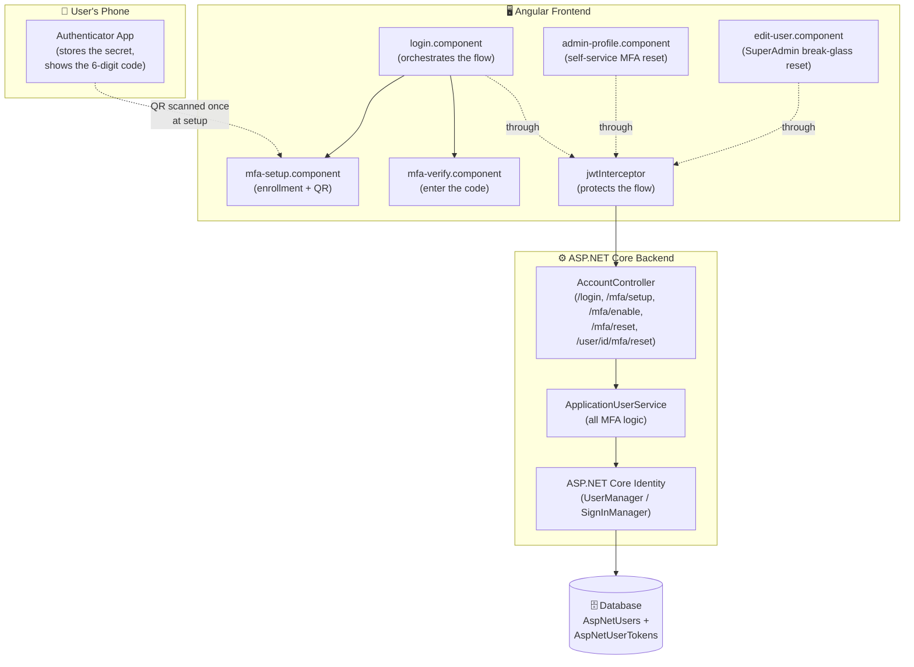

The division of responsibility is clean:

| Layer | Responsibility |
|---|---|
| **Phone (authenticator app)** | Holds the secret; generates the current 6-digit code |
| **`login.component`** | The "traffic controller" — decides which screen to show based on the backend's response |
| **`mfa-setup.component`** | Handles first-time enrollment: shows the QR, confirms the first code, displays recovery codes |
| **`mfa-verify.component`** | Handles entering the code during a normal login |
| **`admin-profile.component`** | Lets a signed-in administrator reset their own MFA after re-entering their password |
| **`edit-user.component`** | Lets a SuperAdmin reset another locked-out administrator's MFA |
| **`jwtInterceptor`** | Attaches tokens to requests and — critically — keeps login errors from breaking the flow |
| **`AccountController`** | The HTTP entry points the frontend calls |
| **`ApplicationUserService`** | Where all the actual MFA decisions live |
| **ASP.NET Core Identity** | The built-in engine that stores secrets, verifies codes, manages recovery codes |
| **Database** | Persists the secret, the "MFA enabled" flag, and the hashed recovery codes |

> [!NOTE]
> A key thing to appreciate: LiliShop did **not** hand-write the cryptography. TOTP generation, verification, secret storage, and recovery codes are all provided by **ASP.NET Core Identity**, which you already use for passwords. The custom code is only the *policy* — "admins must use MFA," "here's how the screens flow," and "here's how to recover safely" — wrapped around Identity's proven primitives. This is exactly how you *should* build MFA: never roll your own crypto.

---

## 4. How TOTP Actually Works

This section makes the "two twins with synchronized watches" idea concrete, because understanding it removes all the mystery from the code later.

### The one-time setup

1. The server generates a random secret, e.g. `JBSWY3DPEHPK3PXP`.
2. It saves that secret in its database.
3. It shows the secret to the phone (via QR code) exactly once.
4. The phone saves the secret too.

Now **both sides have the same secret**, permanently. This never needs to happen again.

### Generating a code (both sides, independently)

Every 30 seconds, both the phone and the server can do this same calculation, *without talking to each other*:

```
current_time ÷ 30   →   a "time-slice number" (e.g. 58212345)

secret + time-slice number   →   [ cryptographic formula ]   →   truncate to 6 digits   →   483920
```

Both the phone and the server:
- use the **same secret** (`JBSWY3DPEHPK3PXP`),
- read the **same current time**, producing the **same time-slice number**,
- run the **same formula**,
- and therefore land on the **same 6-digit code** (`483920`).

The phone *shows* you that code. The server *recalculates* it when you log in, and checks whether what you typed matches what it computed. **No network call between them — ever — after setup.**

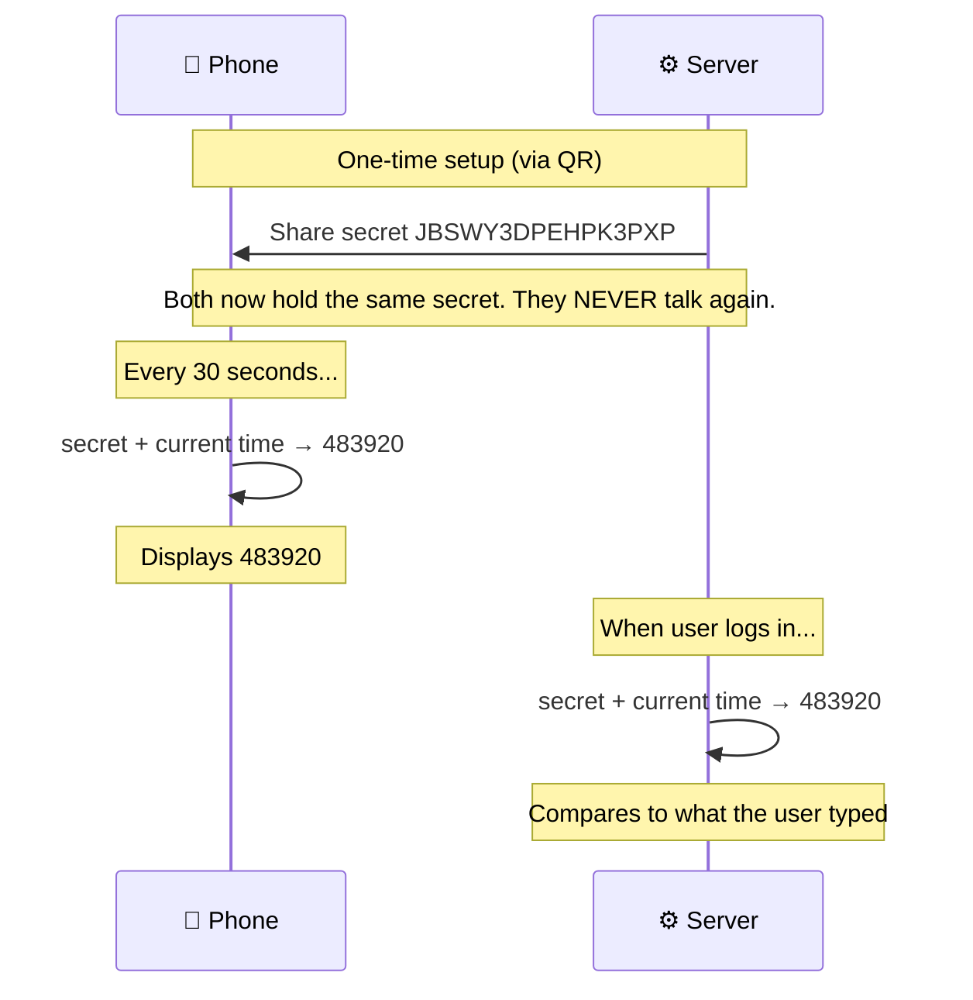

### The clock-drift safety margin

Phones and servers rarely have *perfectly* synchronized clocks — one might be a few seconds off. If the check were exact-to-the-second, a slightly-off phone would produce a code the server rejects, locking out a legitimate user.

To prevent this, the verification also accepts the code from the *previous* and *next* 30-second time-slice, not only the exact current one. So a phone that's up to ~30 seconds off still works. This tolerance is built into ASP.NET Core Identity — LiliShop gets it for free, no code required.

> [!TIP]
> This is why you'll never see LiliShop's server "ask" the phone for anything. When you read `VerifyTwoFactorTokenAsync` in the backend code later, remember: it's the server *recalculating the code itself* from the stored secret and its own clock — the "look at my own watch and do the math" step from the twins analogy.


---

## 5. Backend Implementation

Now we get into LiliShop's real code. All the MFA logic lives in one service, `ApplicationUserService`, which leans on ASP.NET Core Identity's `UserManager` and `SignInManager` for the heavy lifting.

### 5.1 The DTOs (the "shapes" of data)

A **DTO** (Data Transfer Object) is a simple class that defines the *shape* of data moving between the frontend and backend. It carries only what's needed — never the full internal database entity. Here are the MFA-related DTOs.

**`LoginDto`** — what the client sends to log in:

```csharp
public class LoginDto
{
    public required string Email { get; set; }
    public required string Password { get; set; }

    /// Optional TOTP authenticator code (or a recovery code). Required only for accounts that must use
    /// multi-factor authentication (administrators). Ignored for accounts without MFA.
    public string? TwoFactorCode { get; set; }
}
```

The important field is `TwoFactorCode`, and notice it's **optional** (`string?`). A regular customer never fills it in. An admin fills it in on their second login attempt (with the code from their phone). This one optional field is what lets a *single* login endpoint handle both MFA and non-MFA users — a design we'll explore fully in Section 7.

**`UserDto`** — what the backend sends back after a login attempt:

```csharp
public class UserDto
{
    public int? Id { get; set; }
    public string? Email { get; set; }
    public required string DisplayName { get; set; }
    public required string Token { get; set; }
    public required string Role { get; set; }
    public bool EmailConfirmed { get; set; }

    /// True when the account must enrol an authenticator before it can obtain a token (admin without MFA).
    /// When either two-factor flag is true, Token is empty — no session was issued.
    public bool RequiresTwoFactorSetup { get; set; }

    /// True when the account has MFA enabled and must supply a valid authenticator/recovery code to log in.
    public bool RequiresTwoFactorCode { get; set; }
}
```
These two boolean properties represent **two different stages** of the MFA flow:

- **`RequiresTwoFactorSetup`** is `true` when the user is required to enable MFA but has **not enrolled an authenticator app yet**. The frontend should redirect the user to the MFA setup page, where they can scan a QR code and complete enrollment. No JWT token is issued at this stage.

- **`RequiresTwoFactorCode`** is `true` when the user has **already enabled MFA** and must provide a valid authenticator code (or a recovery code) to complete sign-in. Again, no JWT token is issued until the code is successfully verified.

These two flags are **mutually exclusive**. Only one of them can be `true` during a login attempt, and if either flag is `true`, the `Token` property is empty because authentication has not yet been completed.
The two boolean flags — `RequiresTwoFactorSetup` and `RequiresTwoFactorCode` — are the signals that tell the frontend what to do next. We'll see exactly how in Section 7.

**`AuthenticatorSetupDto`** — the data needed to show a QR code during enrollment:

```csharp
public class AuthenticatorSetupDto
{
    public required string SharedKey { get; set; }        // for manual entry
    public required string AuthenticatorUri { get; set; } // otpauth:// URI, rendered as a QR code
}
```

**`EnableAuthenticatorDto`** — what the client sends to *finish* enrollment:

```csharp
public class EnableAuthenticatorDto
{
    public required string Email { get; set; }
    public required string Password { get; set; }
    public required string Code { get; set; }
}
```

**`EnableAuthenticatorResultDto`** — the recovery codes, returned once after enabling MFA:

```csharp
public class EnableAuthenticatorResultDto
{
    /// Result of enabling MFA: one-time recovery codes the user must store securely to regain access if the
    /// authenticator device is lost. Shown exactly once.
    public string[] RecoveryCodes { get; set; } = Array.Empty<string>();
}
```

**`ResetAuthenticatorDto`** — new: what a signed-in administrator sends to reset their own MFA:

```csharp
namespace LiliShop.Application.DTOs
{
    /// <summary>
    /// Identity confirmation for the self-service MFA reset: a signed-in administrator must re-enter
    /// the account password before the authenticator secret and recovery codes are invalidated.
    /// </summary>
    public class ResetAuthenticatorDto
    {
        public required string Password { get; set; }
    }
}
```

Notice this DTO carries **no email** — unlike `LoginDto` or `EnableAuthenticatorDto`. That's because, as you'll see in Section 5.5, this endpoint requires an already-authenticated session: the backend already knows *who* is calling from their JWT, so only the password re-confirmation needs to be sent. The SuperAdmin break-glass reset (also Section 5.5) needs no DTO at all — the target user is identified by a route parameter, and the caller's own identity again comes from their JWT.

| DTO | Direction | Purpose |
|---|---|---|
| `LoginDto` | Client → Server | Email, password, and optional 2FA code |
| `UserDto` | Server → Client | Login result + the two "pending" flags |
| `AuthenticatorSetupDto` | Server → Client | The secret + QR URI for enrollment |
| `EnableAuthenticatorDto` | Client → Server | Credentials + first code to confirm enrollment |
| `EnableAuthenticatorResultDto` | Server → Client | The one-time recovery codes |
| `ResetAuthenticatorDto` | Client → Server | The current password, to confirm a self-service MFA reset |

### 5.2 Enrollment: Getting Set Up (Two Steps, and a Vulnerability That Was Closed)

**Enrollment** is the one-time process of registering an authenticator app (such as Google Authenticator or Microsoft Authenticator) with a user's account. Once enrollment is complete, both the server and the phone hold the same secret and can independently generate matching TOTP codes, exactly as described in Section 4.

Enrollment faces a subtle problem:

> "To log in, you need MFA. To set up MFA, you need to be logged in."

This is a chicken-and-egg problem: admins must use MFA before they can receive a token, but they can't configure MFA without a token to prove who they are in the first place.

LiliShop breaks this loop by having the enrollment endpoints **re-verify the password directly**, instead of requiring a token. Enrollment happens across two endpoints.

#### Step 1 — `GetAuthenticatorSetupAsync` (get the QR)

```csharp
public virtual async Task<OperationResult<AuthenticatorSetupDto>> GetAuthenticatorSetupAsync(LoginDto loginDto)
{
    // Re-authenticate the user because MFA enrollment happens before a login token exists.
    // Each enrollment request proves the user's identity independently, keeping the API stateless.
    var user = await AuthenticateForMfaEnrolmentAsync(loginDto.Email, loginDto.Password);

    if (user is null)
    {
        return OperationResult.Failure<AuthenticatorSetupDto>(
            ErrorCode.InvalidPassword,
            "Invalid email or password.")
            .WithMessageKey("Auth.InvalidCredentials");
    }

    // SECURITY: An account whose MFA is already enabled must never be able to read its shared
    // secret again with only a password — otherwise anyone holding just the password could
    // fetch the secret, mint valid TOTP codes, and bypass the second factor entirely.
    // Reconfiguration goes through the authenticated, password-confirmed reset flow
    // (ResetAuthenticatorAsync), which first invalidates the old secret and recovery codes.
    if (await _userManager.GetTwoFactorEnabledAsync(user))
    {
        _logger.LogWarning("MFA setup blocked: two-factor authentication is already enabled. UserId={UserId}", user.Id);

        return OperationResult.Failure<AuthenticatorSetupDto>(
            ErrorCode.AuthorizationRequired,
            "Two-factor authentication is already configured for this account.")
            .WithMessageKey("Auth.MfaAlreadyConfigured");
    }

    // Retrieve the user's existing authenticator secret, if one has already been created.
    // ASP.NET Core Identity stores this secret internally (typically in AspNetUserTokens).
    var key = await _userManager.GetAuthenticatorKeyAsync(user);

    // First-time enrollment: no secret exists yet.
    // Generate a new random shared secret and persist it so that both the server
    // and the authenticator app can use it to generate matching TOTP codes.
    if (string.IsNullOrEmpty(key))
    {
        await _userManager.ResetAuthenticatorKeyAsync(user);
        key = await _userManager.GetAuthenticatorKeyAsync(user);
    }

    // A valid shared secret and email address are required to build the otpauth:// URI.
    if (string.IsNullOrEmpty(key) || string.IsNullOrEmpty(user.Email))
    {
        return OperationResult.Failure<AuthenticatorSetupDto>(
            ErrorCode.GeneralException,
            "Unable to generate an authenticator key.");
    }

    // Return both representations of the same shared secret:
    // - SharedKey: the raw Base32 secret for manual entry.
    // - AuthenticatorUri: the otpauth:// URI that frontend renders as a QR code.
    return OperationResult.Success<AuthenticatorSetupDto>(new AuthenticatorSetupDto
    {
        SharedKey = key,
        AuthenticatorUri = BuildAuthenticatorUri(user.Email, key)
    });
}
```

Step by step:

1. **Re-verify the password** (via the helper, explained below). No token required.
2. **The already-enrolled guard** (new — see the vulnerability writeup right after this list). If MFA is already switched on for this account, the method stops here and returns a failure — the secret is never touched.
3. **`GetAuthenticatorKeyAsync`** asks: does this user already have a secret? If not...
4. **`ResetAuthenticatorKeyAsync`** generates a brand-new random secret and saves it to the database, then fetches it back. **This is the moment the secret is born — at this point it exists only on the server, not yet on the phone.**
5. **`BuildAuthenticatorUri`** wraps the secret in the special `otpauth://` format the phone understands (see below).
6. Return the secret (`SharedKey`) and the URI (`AuthenticatorUri`).

**Why does the response include both `SharedKey` and `AuthenticatorUri`?** They look different, but they hold **exactly the same secret** — just in two formats:

| Field | Format | Purpose |
|---|---|---|
| `SharedKey` | Raw Base32 text | For manual typing, if the user can't scan a QR |
| `AuthenticatorUri` | An `otpauth://` link wrapping the same secret | For rendering as a QR code |

**Where is the secret stored?** In a table ASP.NET Core Identity manages automatically, `AspNetUserTokens` — deliberately *not* in the `AspNetUsers` table itself, since `AspNetUserTokens` is Identity's general-purpose place for storing different kinds of per-user tokens in a consistent way. A row looks like:

| UserId | LoginProvider | Name | Value |
|---|---|---|---|
| `42` | `[AspNetUserStore]` | `AuthenticatorKey` | `JBSWY3DPEHPK3PXP` |

That `Value` is the secret. It stays there **permanently** — it does not expire — until MFA is reset or disabled.

#### 🛡️ The vulnerability that was closed here

Look again at step 2 in the list above. Before that guard existed, `GetAuthenticatorSetupAsync` had no idea whether the account already had MFA turned on — it simply re-verified the password and then returned whatever secret it found (generating a new one only if none existed yet). That sounds harmless until you think through what "re-verify the password" actually proves: **only that the caller knows the password.** It proves nothing about whether they hold the phone.

That gap made this attack possible:

1. An administrator's password leaks — through a data breach on another site, a phishing page, or malware (exactly the scenarios from [Section 1](#1-introduction-why-mfa)). Their phone is completely untouched; the attacker never had it and never will.
2. The attacker calls `POST /account/mfa/setup` with the stolen email and password.
3. The endpoint re-verifies the password — succeeds — and, since a key already exists for this account (MFA is already configured and in daily use), it returns that **live, currently-active secret** straight back in the response.
4. The attacker types that secret into their *own* authenticator app. From that moment, their app computes the exact same 6-digit codes as the real admin's phone — because, as Section 4 explained, the code is nothing more than a calculation over the shared secret and the current time. There is no way for the server to tell the two devices apart; both hold a legitimate copy of the same secret.
5. The attacker now has a permanent, silent, self-service copy of the second factor — indistinguishable from the real one — obtained using nothing but the leaked password.

This didn't just weaken MFA — it defeated its entire purpose for that account. The whole point of a second factor is that *knowing the password is not enough*; this bug meant that, for an already-enrolled admin, knowing the password *was* enough to also obtain "something you have," because "something you have" had been reduced to "a string you can read from an API response."

The fix is exactly the guard shown above: **once `GetTwoFactorEnabledAsync` reports `true`, the endpoint refuses outright and never touches the key.** The identical guard was added to `EnableAuthenticatorAsync` (Step 2, below) for the same reason — without it, an attacker who'd captured the secret through some other means could still call `mfa/enable` to mint themselves a *fresh* set of recovery codes, using only the password and a code they could compute from the stolen secret. From this point on, reconfiguring MFA on an already-enrolled account is only possible through [`ResetAuthenticatorAsync`](#55-mfa-recovery-self-service-and-superadmin-reset) — a genuinely different, stronger check: it requires an **existing authenticated session** (a valid JWT, not just a password), *and* it invalidates the old secret and recovery codes **before** any new ones can ever be produced.

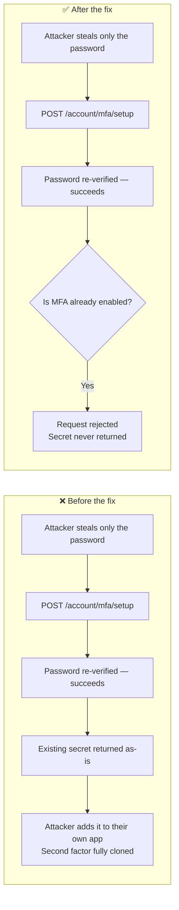

**Building the QR URI** — `BuildAuthenticatorUri`:

```csharp
private static string BuildAuthenticatorUri(string email, string unformattedKey)
{
    const string issuer = "LiliShop";
    return $"otpauth://totp/{Uri.EscapeDataString(issuer)}:{Uri.EscapeDataString(email)}"
         + $"?secret={unformattedKey}&issuer={Uri.EscapeDataString(issuer)}&digits=6";
}
```

This produces a string like:

```
otpauth://totp/LiliShop:admin@lilishop.com?secret=JBSWY3DPEHPK3PXP&issuer=LiliShop&digits=6
```

Every part has a job:

| Part | Meaning |
|---|---|
| `otpauth://totp/` | "This is a TOTP setup link" — every authenticator app recognizes this |
| `LiliShop:admin@lilishop.com` | The label the app displays, so the user knows which account it's for |
| `secret=JBSWY3DPEHPK3PXP` | **The actual secret** the phone stores |
| `issuer=LiliShop` | Who issued it (for display) |
| `digits=6` | The code should be 6 digits |

> [!WARNING]
> This URI contains the secret **in plain text**. It must never be written to application logs, error messages, or analytics — and it should only ever be sent to the one authenticated user completing enrollment, never displayed or transmitted anywhere else. This is exactly the property the vulnerability above violated: the endpoint was sending this same plain-text secret to *anyone* who could supply the password, not just to a caller genuinely completing first-time enrollment.

When the phone scans the QR made from this string, it extracts `secret=` and stores it. **This is the one and only moment the secret travels to the phone.** After that, neither side ever sends the secret again — the phone keeps its copy, the server keeps its copy, and (as covered in Section 4) both independently generate matching 6-digit codes from that shared secret and the current time.

Here's the secret's full journey, from birth to first use:

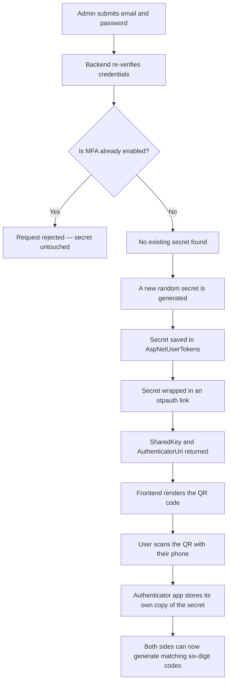

#### Step 2 — `EnableAuthenticatorAsync` (confirm & turn on)

At this point the user already has the QR code from Step 1 and has scanned it — their authenticator app is now generating live 6-digit codes. This step asks them to submit one of those codes back to the server, proving the setup actually worked, before MFA is switched on for real.

```csharp
public virtual async Task<OperationResult<EnableAuthenticatorResultDto>> EnableAuthenticatorAsync(
    EnableAuthenticatorDto dto)
{
    var user = await AuthenticateForMfaEnrolmentAsync(dto.Email, dto.Password);
    if (user is null)
    {
        return OperationResult.Failure<EnableAuthenticatorResultDto>(
            ErrorCode.InvalidPassword,
            "Invalid email or password.")
            .WithMessageKey("Auth.InvalidCredentials");
    }

    // SECURITY: Mirror of the guard in GetAuthenticatorSetupAsync — once MFA is enabled,
    // enrollment endpoints (which require only email + password) must be inert for the
    // account. Re-enrollment is only possible after the password-confirmed reset flow has
    // invalidated the previous secret and disabled MFA.
    if (await _userManager.GetTwoFactorEnabledAsync(user))
    {
        _logger.LogWarning("MFA enable blocked: two-factor authentication is already enabled. UserId={UserId}", user.Id);

        return OperationResult.Failure<EnableAuthenticatorResultDto>(
            ErrorCode.AuthorizationRequired,
            "Two-factor authentication is already configured for this account.")
            .WithMessageKey("Auth.MfaAlreadyConfigured");
    }

    var isValid = await _userManager.VerifyTwoFactorTokenAsync(
        user, _userManager.Options.Tokens.AuthenticatorTokenProvider, NormalizeCode(dto.Code));

    if (!isValid)
    {
        return OperationResult.Failure<EnableAuthenticatorResultDto>(
            ErrorCode.InvalidData,
            "Verification code is invalid. Please try again.")
            .WithMessageKey("Auth.InvalidVerificationCode");
    }

    var enableResult = await _userManager.SetTwoFactorEnabledAsync(user, true);
    if (!enableResult.Succeeded)
    {
        return OperationResult.Failure<EnableAuthenticatorResultDto>(
            ErrorCode.UpdateOperationFailed,
            "Failed to enable two-factor authentication.")
            .WithMessageKey("Auth.EnableMfaFailed");
    }

    _logger.LogInformation("Two-factor authentication enabled. UserId={UserId}", user.Id);

    var recoveryCodes = await _userManager.GenerateNewTwoFactorRecoveryCodesAsync(user, RecoveryCodeCount);

    return OperationResult.Success<EnableAuthenticatorResultDto>(new EnableAuthenticatorResultDto
    {
        RecoveryCodes = recoveryCodes?.ToArray() ?? Array.Empty<string>()
    });
}
```

Step by step:

1. **Re-verify the password** *again* (yes, again — see the callout below for why).
2. **The already-enrolled guard**, same as Step 1 — a second, independent line of defense in case an already-enrolled account somehow reaches this endpoint at all.
3. **`VerifyTwoFactorTokenAsync`** checks the 6-digit code the user typed. This isn't the server blindly trusting whatever the user submits — it's the server independently recalculating what the correct code *should* be right now, using the secret it already has stored (the exact same TOTP math from Section 4), and checking whether that matches what was typed. If they match, it proves the phone really was set up with the right secret — a wrong or fabricated code simply won't compute to the same number.
4. **`SetTwoFactorEnabledAsync(user, true)`** flips the `TwoFactorEnabled` column on the user's row in `AspNetUsers` from `false` to `true`. This single value is what changes everything about future logins — from this moment on, the MFA gate in `EnforceAdminMfaAsync` (Section 5.3) will demand a valid code from this admin every time they log in.
5. **`GenerateNewTwoFactorRecoveryCodesAsync(user, RecoveryCodeCount)`** creates 10 one-time emergency backup codes — each one can stand in for a phone code exactly once, if the device is ever lost. They're returned here and shown to the user **only once**; once this screen is left, the same codes can never be retrieved again. (The full mechanics — why they're stored hashed, how the login fallback uses them — are covered in Section 5.4.)

> [!IMPORTANT]
> **Why re-check the password in *both* steps (and again at final login)?** Look at the helper's comment:
> ```csharp
> /// Re-authenticates a user by email + password for the MFA enrolment endpoints (which are reached
> /// before a token exists). Honours account lockout. Returns null on any failure.
> private async Task<ApplicationUser?> AuthenticateForMfaEnrolmentAsync(string email, string password)
> {
>     var user = await _userManager.FindByEmailAsync(email);
>     if (user is null) return null;
>     var passwordCheck = await _signInManager.CheckPasswordSignInAsync(user, password, lockoutOnFailure: true);
>     return passwordCheck.Succeeded ? user : null;
> }
> ```
> The key phrase is **"reached before a token exists."** Normally the server knows who you are from your login token — but enrollment happens *before* any token exists. So the only way the server can know who's calling is to re-verify the password on each request. This is the **secure, stateless** choice: the server never has to *remember* "this person passed step 1," which would mean storing exploitable pending state. Each step proves itself independently. Notice too that `lockoutOnFailure: true` means even these enrollment endpoints respect the account-lockout protection — an attacker can't hammer them with password guesses.

Here's the full enrollment flow, showing how the two endpoints fit together as one HTTP conversation:

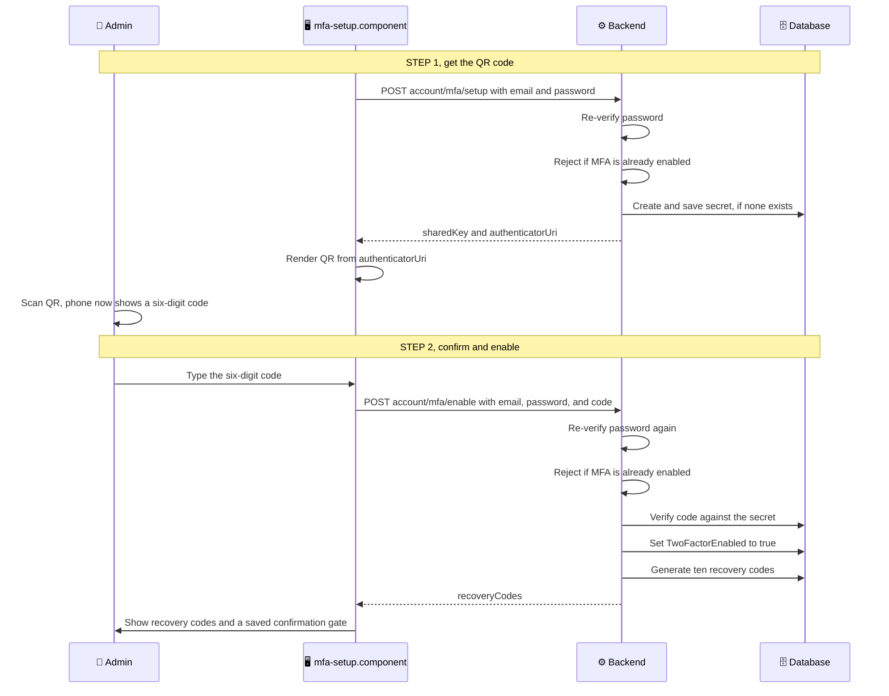

> [!NOTE]
> **Enrollment ≠ login.** At the end of enrollment, the admin still has **no token** — enabling MFA and logging in are deliberately separate. After saving recovery codes, they're sent to the verify screen to log in with a *fresh* code. This ensures that even right after setup, they prove they can produce a live code.

### 5.3 The Login Gate: Enforcing MFA

Now the login side. This is where an admin's password-correct login gets checked for MFA *before* any token is issued. It lives inside `LoginAsync`, the same method that handles every login.

Before looking at the code, here's the shape of the decision LiliShop makes on every login attempt, once the password and lockout checks (covered in the brute-force protection document) have already passed:

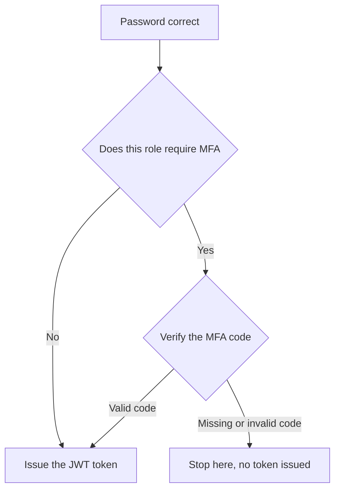

Here's the relevant portion of the real code:

```csharp
public virtual async Task<OperationResult<UserDto>> LoginAsync(LoginDto loginDto)
{
    var user = await _userManager.FindByEmailAsync(loginDto.Email);
    if (user is null)
    {
        return OperationResult.Failure<UserDto>(ErrorCode.InvalidPassword, "Invalid email or password.")
            .WithMessageKey("Auth.InvalidCredentials");
    }

    var isPasswordCorrect = await _signInManager.CheckPasswordSignInAsync(user, loginDto.Password, lockoutOnFailure: true);

    if (isPasswordCorrect.IsLockedOut) { /* ... locked-out response ... */ }
    if (!isPasswordCorrect.Succeeded)  { /* ... invalid credentials ... */ }

    var role = await user.GetRoleAsync(_userManager);

    // F14.2 — administrators MUST authenticate with a second factor. This gate runs BEFORE any token is
    // issued: an admin without an enrolled authenticator receives no token (only a "setup required"
    // signal), and an enrolled admin must supply a valid TOTP / recovery code.
    if (IsMfaRequiredForRole(role))
    {
        var mfaOutcome = await EnforceAdminMfaAsync(user, role, loginDto.TwoFactorCode);
        if (mfaOutcome is not null)
        {
            return mfaOutcome;   // stop here — either "pending" or "invalid code"
        }
    }

    // ... only reached if MFA is satisfied (or not required): issue tokens ...
    var accessToken = await _tokenService.CreateAccessTokenAsync(user);
    // ... build and return the authenticated UserDto ...
}
```

> [!IMPORTANT]
> Notice the ordering above: **no JWT token is ever created until every required authentication step — password, lockout, and (for admins) MFA — has completed successfully.** There is no code path where a partially-authenticated admin can slip through with a token. This is the single most important security guarantee this section makes.

**Which roles need MFA** — a tiny helper, revisited in full in [Section 6](#6-administrator-roles-mandatory-mfa-and-role-changes):

```csharp
private static bool IsMfaRequiredForRole(string role)
    => role == Role.Administrator || role == Role.SuperAdmin;
```

**The gate itself** — `EnforceAdminMfaAsync`. This method doesn't behave like a typical method that always returns a clear success or failure — its return value carries a special meaning of its own:

- A **non-null** `OperationResult` means "stop immediately — login cannot continue."
- **`null`** is the *only* value that means "MFA has been fully satisfied — `LoginAsync`, go ahead and issue the token."

Read the summary comment on the method itself; it states this contract directly:

```csharp
/// <summary>
/// Enforces the administrator MFA policy during login.
///
/// This method acts as a security gate immediately before JWT token creation.
/// It does not complete the login or issue a token. Instead, it decides whether
/// login may continue.
///
/// Returns:
/// - a non-null <see cref="OperationResult{T}"/> when login must stop immediately
///   (MFA setup required, MFA code required, or an invalid authentication code);
/// - null only when all MFA requirements have been satisfied and LoginAsync may
///   safely continue issuing the JWT token.
/// </summary>
private async Task<OperationResult<UserDto>?> EnforceAdminMfaAsync(ApplicationUser user, string role, string? twoFactorCode)
{
    // MFA has not been enrolled for this administrator yet.
    // Do not issue a token. Instead, tell the frontend to start the
    // MFA enrollment flow (display the QR code setup screen).
    if (!await _userManager.GetTwoFactorEnabledAsync(user))
    {
        _logger.LogWarning("Admin login blocked: two-factor authentication is not enrolled. UserId={UserId}", user.Id);

        return OperationResult.Success<UserDto>(BuildMfaPendingDto(user, role, setupRequired: true));
    }

    // MFA is already enabled, but no authenticator (or recovery) code was supplied.
    // The frontend should prompt the user for their six-digit authenticator code
    // before login can continue.
    if (string.IsNullOrWhiteSpace(twoFactorCode))
    {
        return OperationResult.Success<UserDto>(BuildMfaPendingDto(user, role, setupRequired: false));
    }

    // Remove spaces or dashes so formats like "123 456" or "123-456"
    // are accepted before verification.
    var normalizedCode = NormalizeCode(twoFactorCode);

    // Verify the TOTP code generated by the user's authenticator app.
    // ASP.NET Core Identity recreates the expected code from the stored
    // shared secret and the current time, then compares it with the
    // code supplied by the user.
    var isTotpValid = await _userManager.VerifyTwoFactorTokenAsync(
        user,
        _userManager.Options.Tokens.AuthenticatorTokenProvider,
        normalizedCode);

    if (!isTotpValid)
    {
        // If the authenticator code is invalid, allow a one-time recovery code
        // as a fallback. This prevents users who have lost their authenticator
        // device from being permanently locked out of their account.
        var redeemed = await _userManager.RedeemTwoFactorRecoveryCodeAsync(user, normalizedCode);

        if (!redeemed.Succeeded)
        {
            _logger.LogWarning("Admin login failed: invalid two-factor / recovery code. UserId={UserId}", user.Id);

            return OperationResult.Failure<UserDto>(ErrorCode.InvalidPassword, "Invalid authentication code.")
                .WithMessageKey("Auth.InvalidAuthCode");
        }

        _logger.LogWarning("Admin login completed using a recovery code. UserId={UserId}", user.Id);
    }

    // MFA has been successfully satisfied.
    // Returning null tells LoginAsync that it may now continue
    // and issue the JWT token.
    return null;
}
```

Here's every path through this method, and exactly what each one returns:

| Situation | What's returned | Effect on `LoginAsync` |
|---|---|---|
| MFA not enrolled yet | `OperationResult` with `RequiresTwoFactorSetup = true` | Stops here — no token issued |
| Enrolled, but no code was sent | `OperationResult` with `RequiresTwoFactorCode = true` | Stops here — no token issued |
| A valid TOTP or recovery code was sent | `null` | `LoginAsync` continues and issues the token |
| An invalid code was sent | `OperationResult` failure | Stops here — no token issued |

**Understanding `VerifyTwoFactorTokenAsync`** — this is the line that checks the code:

```csharp
var isTotpValid = await _userManager.VerifyTwoFactorTokenAsync(
    user, _userManager.Options.Tokens.AuthenticatorTokenProvider, normalizedCode);
```

Internally, `VerifyTwoFactorTokenAsync` performs the same TOTP calculation described in Section 4:

1. It retrieves the user's secret key from `AspNetUserTokens`. This is the same secret that was shared with the user's authenticator app during MFA setup.

2. It reads the current server time. TOTP codes are not stored anywhere; they are calculated dynamically from the secret key and the current time.

3. It calculates the expected 6-digit code. Because a user's phone clock and the server clock may differ slightly (for example, the phone clock may be a few seconds ahead or behind), Identity also accepts codes from the immediately previous or next time period. This small tolerance prevents valid users from being rejected because of minor clock differences.

4. It compares the calculated code with the code entered by the user (`normalizedCode`).

5. It returns `true` if the codes match. The server never contacts the user's phone and the phone never sends the code to the server. Both sides independently calculate the same code using the shared secret and the current time. If the calculations produce the same result, the code is considered valid.

If this check fails, the code gives the user one last chance to authenticate by accepting a recovery code instead (using `RedeemTwoFactorRecoveryCodeAsync`; the full mechanics are covered in Section 5.4). A valid recovery code is treated as an alternative second factor, allowing login to continue. However, it is immediately consumed and permanently removed from the account, ensuring that each recovery code can be used only once.

**A small thoughtful touch — `NormalizeCode`:**

```csharp
private static string NormalizeCode(string code)
    => code.Replace(" ", string.Empty).Replace("-", string.Empty);
```

This means all of these inputs:

```
483920
483 920
483-920
```

normalize to the exact same value before being checked:

```
483920
```

Small, but it prevents needless "invalid code" frustration from a stray space or dash.

---

You can think of `EnforceAdminMfaAsync` as a **security gate** placed immediately before token issuance. Passing the password check gets an administrator to the gate; passing MFA is what opens it.

### 5.4 The Recovery Code Fallback

Look again at the fallback inside `EnforceAdminMfaAsync`:

```csharp
if (!isTotpValid)
{
    // Fall back to a one-time recovery code so a lost authenticator does not cause a permanent lockout.
    var redeemed = await _userManager.RedeemTwoFactorRecoveryCodeAsync(user, normalizedCode);
    if (!redeemed.Succeeded) { /* both failed → reject */ }
    _logger.LogWarning("Admin login completed using a recovery code. UserId={UserId}", user.Id);
}
```

This is elegant: the user types a code into the *same* box, whether it's a phone code or a recovery code. The server tries it as a TOTP first; if that fails, it tries it as a recovery code. Only if *both* fail is the login rejected.

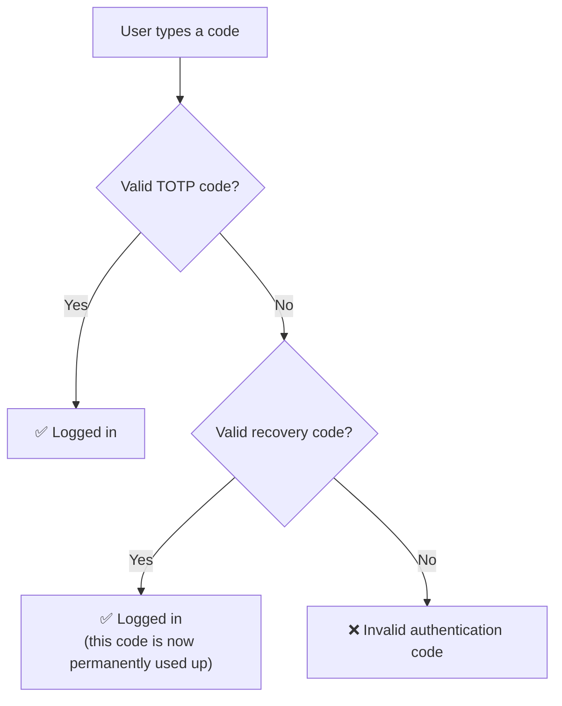

Two important properties:

**Recovery codes are stored hashed.** When `GenerateNewTwoFactorRecoveryCodesAsync` saves them, it stores only a scrambled, one-way *hash* of each code — not the code itself. This is why they're **"shown exactly once"**: the server literally cannot display them again, because it doesn't keep the originals, only their fingerprints. (Same reason a well-built site can't email you your existing password.) This is a security feature, not a limitation.

**"Redeem" means consumed.** The word `Redeem` in the method name is deliberate — when a recovery code is used, it's permanently marked as used and can never work again. Ten codes means ten emergency logins, total, until regenerated.

> [!TIP]
> Notice the recovery-code login is logged at **Warning** level even though the login *succeeded*. Why warn on a success? Because using a recovery code is *unusual* — a legitimate admin normally uses their phone. Falling back to a recovery code means either they genuinely lost their device, or someone who shouldn't have the codes is using them. Either way, it's a security-relevant event worth an administrator's attention. That's a security-conscious detail.

But what happens if the phone **and** all ten recovery codes are gone at the same time? That's exactly the scenario the next section covers.

### 5.5 MFA Recovery: Self-Service and SuperAdmin Reset

Ten recovery codes sound generous, but they run out, get lost, or are simply never saved properly. Before the work described here, an administrator who lost their authenticator device *and* their recovery codes had no self-service way back in at all — the only option was direct, manual database editing by whoever had that kind of access, which is slow, error-prone, and uncomfortable to perform under any kind of change control. This section covers the recovery workflow that replaces that.

There are two paths, chosen by how much the locked-out admin still has:

| Situation | Who can act | Endpoint |
|---|---|---|
| Still signed in, still remembers the password | The admin themselves | `POST /account/mfa/reset` |
| Locked out entirely (no session, or password also forgotten) | A `SuperAdmin`, on the admin's behalf | `POST /account/user/{id}/mfa/reset` |

Both paths end up calling the exact same teardown logic, `ResetMfaStateAsync`, and both immediately end every one of the account's sessions — a mechanism explained in full in [Section 6.4](#64-force-logout-securitystamp-and-refresh-token-revocation). This section focuses on the two entry points; Section 6.4 focuses on what "end every session" concretely means and why it matters here.

#### The self-service reset

This is the common case: the admin is still logged in right now (they still have a valid browser session), but the *next* time they'd need their authenticator — say, after logging out, or on a new device — they won't have it. Rather than waiting for that to become an emergency, they can pre-emptively reset MFA from their own profile page.

```csharp
/// <summary>
/// Self-service MFA recovery for a signed-in administrator who lost the authenticator device
/// (and possibly the recovery codes) but still holds a valid session.
///
/// Security model:
/// - The caller must already be authenticated (enforced by the endpoint's authorization policy),
///   AND must re-confirm their identity by entering the account password — a stolen, unlocked
///   session alone is not enough to swap the second factor.
/// - The password check is lockout-protected so the endpoint cannot be used for brute force.
/// - On success every old MFA credential becomes invalid (secret, QR code, recovery codes),
///   all sessions are terminated, and the next sign-in runs the standard enrollment flow,
///   which produces a new QR code and a new set of recovery codes.
///
/// MFA itself is never weakened: at no point does an account with enabled MFA reveal a secret,
/// and the account cannot sign in without completing the fresh enrollment.
/// </summary>
public virtual async Task<OperationResult<object>> ResetAuthenticatorAsync(ClaimsPrincipal principal, ResetAuthenticatorDto dto)
{
    var user = principal is null ? null : await _userManager.GetUserAsync(principal);
    if (user is null)
    {
        return OperationResult.Failure<object>(ErrorCode.AuthorizationRequired);
    }

    if (string.IsNullOrEmpty(dto?.Password))
    {
        return OperationResult.Failure<object>(ErrorCode.InvalidArgument, "The current password is required.")
            .WithMessageKey("Auth.PasswordRequired");
    }

    var passwordCheck = await _signInManager.CheckPasswordSignInAsync(user, dto.Password, lockoutOnFailure: true);

    if (passwordCheck.IsLockedOut)
    {
        _logger.LogWarning("MFA reset blocked: account is locked out. UserId={UserId}", user.Id);

        return OperationResult.Failure<object>(
            ErrorCode.AuthorizationRequired,
            "Account temporarily locked due to multiple failed login attempts. Please try again later.")
            .WithMessageKey("Auth.AccountLocked");
    }

    if (!passwordCheck.Succeeded)
    {
        _logger.LogWarning("MFA reset rejected: password confirmation failed. UserId={UserId}", user.Id);

        return OperationResult.Failure<object>(ErrorCode.InvalidPassword);
    }

    var resetResult = await ResetMfaStateAsync(user);
    if (resetResult.IsFailure)
    {
        return OperationResult.Failure<object>(resetResult);
    }

    await RevokeAllRefreshTokensAsync(user);

    _logger.LogInformation("MFA was reset by the account owner after password confirmation. UserId={UserId}", user.Id);

    return OperationResult.Success<object>(new
    {
        Message = Localize("Auth.MfaResetDone",
            "Two-factor authentication has been reset. You have been signed out everywhere and will set up a new authenticator app at your next sign-in.")
    });
}
```

Two things make this safe rather than a shortcut around MFA:

1. **Two independent checks stack together.** `[Authorize(Policy = PolicyType.RequireAtLeastAdministratorRole)]` on the controller action (shown below) means an unauthenticated caller never even reaches this method — the caller must already hold a valid JWT. On top of that, the method re-confirms the *password* with `CheckPasswordSignInAsync(..., lockoutOnFailure: true)` — the exact same lockout-protected check used at login. A stolen but unlocked browser tab is not enough on its own; the attacker would also need to know the password.
2. **The response never contains new secrets.** `ResetMfaStateAsync` (below) is called and its success is checked, but nothing it produces is read or returned here. This endpoint can only *destroy* the old credentials — it cannot be used to peek at a fresh secret or fresh recovery codes. Those only ever appear through the normal enrollment endpoints (Section 5.2), on the next login.

The shared teardown logic both recovery paths call:

```csharp
/// <summary>
/// Invalidates every MFA credential of the account so that a fresh enrollment is required:
/// <list type="bullet">
/// <item>The TOTP secret is replaced — authenticator apps configured with the old QR code stop
/// producing valid codes immediately.</item>
/// <item>Outstanding recovery codes are burned by regenerating them server-side without ever
/// revealing the replacements, so no usable recovery code exists until enrollment completes.</item>
/// <item>TwoFactorEnabled is switched off, which makes the next administrator login return
/// RequiresTwoFactorSetup and run the standard enrollment (new QR code + new recovery codes).</item>
/// </list>
/// Identity rotates the security stamp inside these operations, so live access tokens fail the
/// per-request stamp validation as a side effect. Callers that must also end refresh-token
/// sessions call <see cref="RevokeAllRefreshTokensAsync"/> afterwards.
/// </summary>
private async Task<OperationResult> ResetMfaStateAsync(ApplicationUser user)
{
    var resetKeyResult = await _userManager.ResetAuthenticatorKeyAsync(user);
    if (!resetKeyResult.Succeeded)
    {
        _logger.LogError("Failed to reset the authenticator key. UserId={UserId}", user.Id);
        return OperationResult.Failure(ErrorCode.UpdateOperationFailed, "Failed to reset the authenticator key.");
    }

    await _userManager.GenerateNewTwoFactorRecoveryCodesAsync(user, RecoveryCodeCount);

    var disableResult = await _userManager.SetTwoFactorEnabledAsync(user, false);
    if (!disableResult.Succeeded)
    {
        _logger.LogError("Failed to disable two-factor authentication. UserId={UserId}", user.Id);
        return OperationResult.Failure(ErrorCode.UpdateOperationFailed, "Failed to disable two-factor authentication.");
    }

    return OperationResult.Success();
}
```

Notice this reuses `_userManager.ResetAuthenticatorKeyAsync` — the exact same Identity method Section 5.2 uses to generate the *first* secret during enrollment. Calling it again on an account that already has a secret simply replaces it with a brand-new one, which is precisely "invalidate the old QR code." `GenerateNewTwoFactorRecoveryCodesAsync` runs the same way, silently discarding its return value — the whole point of this method is to destroy old credentials without ever handing back new ones.

#### The SuperAdmin break-glass reset

Self-service reset still assumes the admin has an active session *and* remembers their password. If both are gone — the account is genuinely locked out — a `SuperAdmin` can perform the reset on their behalf:

```csharp
/// <summary>
/// Break-glass MFA recovery performed by a SuperAdmin for another account that lost both the
/// authenticator device and the recovery codes (and therefore cannot sign in at all).
///
/// This replaces direct database manipulation with an audited, controlled operation:
/// the target's MFA credentials are invalidated, every session is terminated, and the target
/// must sign in with their password again, which restarts the standard MFA enrollment.
/// A SuperAdmin cannot use this on their own account — self-service reset requires the
/// password-confirmed flow instead, so a hijacked SuperAdmin session cannot quietly replace
/// its own second factor.
/// </summary>
public virtual async Task<OperationResult> ResetAuthenticatorForUserAsync(int targetUserId, ClaimsPrincipal actingPrincipal)
{
    var actingUser = actingPrincipal is null ? null : await _userManager.GetUserAsync(actingPrincipal);
    if (actingUser is null)
    {
        return OperationResult.Failure(ErrorCode.AuthorizationRequired);
    }

    if (actingUser.Id == targetUserId)
    {
        return OperationResult.Failure(
            ErrorCode.InvalidArgument,
            "Use the password-confirmed self-service reset for your own account.")
            .WithMessageKey("Auth.MfaResetOwnAccount");
    }

    var targetUser = await _userManager.FindByIdAsync(targetUserId.ToString());
    if (targetUser is null)
    {
        return OperationResult.Failure(ErrorCode.UserNotFound, "User not found.");
    }

    var resetResult = await ResetMfaStateAsync(targetUser);
    if (resetResult.IsFailure)
    {
        return resetResult;
    }

    await RevokeAllRefreshTokensAsync(targetUser);

    // Deliberately logged at warning level: this is a sensitive, audit-relevant action.
    _logger.LogWarning(
        "MFA was reset by a SuperAdmin. TargetUserId={TargetUserId}, ActingUserId={ActingUserId}",
        targetUserId, actingUser.Id);

    return OperationResult.Success("Two-factor authentication has been reset for the user.");
}
```

The line worth staring at is `if (actingUser.Id == targetUserId)`. Without it, a SuperAdmin's own already-authenticated session — no password re-entry required on *this* endpoint, since it's designed for acting on *someone else* — could be used to strip its own MFA in a single request. Rejecting the own-account case closes that off: the only way a SuperAdmin can touch their own MFA is the password-gated self-service flow above, exactly like every other administrator. `[Authorize(Policy = PolicyType.RequireSuperAdminRole)]` on the controller action further restricts this whole capability to the single most privileged role — not any `Administrator` — following the same least-privilege principle used everywhere else in the authorization model (Section 6.1 covers the role hierarchy in full). And logging at `LogWarning` rather than `LogInformation` is a deliberate choice: "this account's second factor was just disabled by someone else" is exactly the kind of event that should stand out to anyone reviewing the logs.

**The controller endpoints:**

```csharp
// Self-service MFA recovery for a signed-in administrator who lost the authenticator device:
// requires the current session AND a fresh password confirmation, then invalidates the old
// secret and recovery codes, signs the user out everywhere, and the next login restarts the
// standard enrollment with a new QR code and new recovery codes.
[Authorize(Policy = PolicyType.RequireAtLeastAdministratorRole)]
[EnableRateLimiting("auth")]
[HttpPost("mfa/reset")]
public async Task<IActionResult> ResetAuthenticator([FromBody] ResetAuthenticatorDto dto)
{
    var result = await _applicationUserService.ResetAuthenticatorAsync(User, dto);
    return HandleOperationResult(result);
}


// Break-glass MFA recovery: a SuperAdmin resets another account that lost both the
// authenticator and its recovery codes. The target is signed out everywhere and re-enrols
// at the next login. Own account is rejected — self-service reset (with password) applies.
[Authorize(Policy = PolicyType.RequireSuperAdminRole)]
[EnableRateLimiting("auth")]
[HttpPost("user/{id}/mfa/reset")]
public async Task<IActionResult> ResetAuthenticatorForUser(int id)
{
    var result = await _applicationUserService.ResetAuthenticatorForUserAsync(id, User);
    return HandleOperationResult(result);
}
```

Both carry `[EnableRateLimiting("auth")]`, the same rate limit already applied to login and password-reset — an MFA reset endpoint is just as attractive a brute-force target as a login endpoint, so it gets the same protection.

Here's the whole recovery picture in one diagram — both entry points converge on the same teardown and the same session-ending step (detailed in Section 6.4):

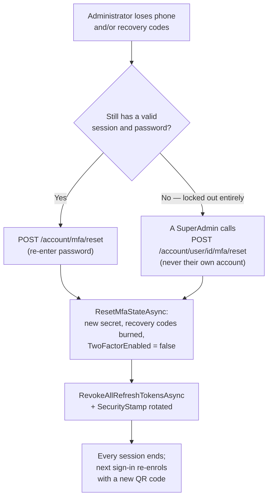

---

## 6. Administrator Roles, Mandatory MFA, and Role Changes

Section 1 introduced the rule "MFA is mandatory for administrators." This section explains exactly how that rule is enforced, and — just as importantly — what happens the moment someone's role changes: a promotion into an MFA-required role, a demotion out of one, or a lateral move between the two admin roles.

### 6.1 Which Roles Require MFA

LiliShop defines five roles:

```csharp
public static class Role
{
    public const string SuperAdmin = "SuperAdmin";           // all privileges
    public const string Administrator = "Administrator";     // most admin features
    public const string DiscountManager = "DiscountManager"; // manages the discount system
    public const string Standard = "Standard";                // can log in and buy
    public const string AdminPanelViewer = "AdminPanelViewer";
}
```

Only two of them carry the MFA obligation, decided by one small, pure function you already saw in Section 5.3:

```csharp
private static bool IsMfaRequiredForRole(string role)
    => role == Role.Administrator || role == Role.SuperAdmin;
```

This function is called fresh on **every single login** (`LoginAsync`, Section 5.3) — there is no separate "requires MFA" flag stored anywhere on the user. MFA is a *derived* property of whatever role the account currently holds, recomputed every time, never cached or written to a column. That single design choice is what makes everything in the rest of this section work correctly without any extra bookkeeping.

### 6.2 Promotion: MFA Enrollment Starts Fresh

Say a `Standard` customer is promoted to `Administrator`. What happens to MFA?

Nothing needs to happen *proactively* — and that's the point. The account's `TwoFactorEnabled` flag is still `false` (it was never turned on for a standard user). On their very next login attempt, `IsMfaRequiredForRole` now returns `true` for the first time, `EnforceAdminMfaAsync` runs, sees `GetTwoFactorEnabledAsync(user)` is `false`, and returns the familiar "not enrolled yet" response (`RequiresTwoFactorSetup = true`) — the exact same path a brand-new administrator account goes through. The promoted user is walked through full enrollment (Section 5.2) before they can obtain a token.

No code was written specifically for "what happens on promotion" — it falls directly out of the fact that MFA requirements are recomputed from the role on every login rather than tracked separately.

### 6.3 Demotion: Automatic MFA Cleanup

The opposite direction is more interesting. If an `Administrator` is demoted to `Standard`, simply changing the role would leave a working, fully-enrolled authenticator secret and a set of still-valid recovery codes attached to an account that no longer needs them — and if that same person were promoted back to `Administrator` later, those old, potentially long-exposed credentials would silently become usable again, with no fresh enrollment ever required.

`UpdateUserAsync` — the same method the admin user-management screen calls to save role changes — closes this gap directly:

```csharp
if (!string.IsNullOrEmpty(user.RoleName) && existingRole != user.RoleName)
{
    // ... remove the old role, add the new one (existing code) ...

    requiresSecurityStampUpdate = true;
    _logger.LogInformation($"User {userId}'s Role changed from {existingRole} to {user.RoleName}");

    // MFA is a role-based obligation: an account leaving the administrator roles must not
    // keep privileged MFA state behind. Tear it down completely (secret, recovery codes,
    // TwoFactorEnabled) so the account behaves like any standard user — and so a later
    // promotion starts a fresh enrollment instead of trusting stale credentials.
    if (IsMfaRequiredForRole(existingRole ?? string.Empty) && !IsMfaRequiredForRole(user.RoleName))
    {
        var mfaCleanupResult = await ResetMfaStateAsync(existingUser);
        if (mfaCleanupResult.IsFailure)
        {
            _logger.LogError("Failed to clean up MFA state after role downgrade. UserId={UserId}", userId);
            return OperationResult.Failure<IUser>(mfaCleanupResult);
        }
    }

    // The permission set changed, so every active session must end now — see Section 6.4.
    await RevokeAllRefreshTokensAsync(existingUser);
}
if (requiresSecurityStampUpdate)
{
    existingUser.SecurityStamp = Guid.NewGuid().ToString(); // Change SecurityStamp to invalidate tokens
}
```

`IsMfaRequiredForRole(existingRole) && !IsMfaRequiredForRole(user.RoleName)` is `true` only for a genuine *downgrade*: an `Administrator` or `SuperAdmin` moving to `Standard`, `DiscountManager`, or `AdminPanelViewer`. Exactly then, `ResetMfaStateAsync` — the very same teardown helper Section 5.5 uses for the two recovery flows — runs again here: new secret, burned recovery codes, `TwoFactorEnabled` switched off. It's the same method, the same guarantees, reused for a third caller.

Here's every role-transition case, side by side, matching each one to what the codebase actually does:

| Transition | MFA state touched? | Sessions ended? |
|---|---|---|
| `Standard` → `Administrator` (promotion) | No — nothing to clean up; enrollment starts on next login (6.2) | Yes |
| `Administrator` → `Standard` (demotion) | **Yes** — secret replaced, recovery codes burned, MFA disabled | Yes |
| `SuperAdmin` → `Standard` (demotion) | **Yes** — same cleanup | Yes |
| `Administrator` ↔ `SuperAdmin` (lateral move) | No — both roles require MFA; the enrolled authenticator stays valid | Yes |
| Any other field changed, role unchanged | No | No |

Every row that changes the role — including the lateral move between the two admin roles, which never touches MFA state at all — still ends every session. That's the subject of the next section.

### 6.4 Force Logout: SecurityStamp and Refresh-Token Revocation

To understand why every role change ends every session, and how that's actually implemented, you need one piece of background this article hasn't covered yet: how LiliShop issues and revokes login sessions at all.

LiliShop issues two related credentials at login: a short-lived **access token** (a JWT, valid for about 15 minutes) that proves "this request comes from a signed-in user" on every API call, and a longer-lived **refresh token**, stored in the database (one row per device, in `AspNetUserTokens`), which lets the frontend quietly obtain a new access token once the old one expires, without asking for a password again. (Section 8.3 of the JWT interceptor material covers the refresh mechanism itself in more depth.)

A JWT's defining property is that it doesn't need a database lookup to be *valid* — it's self-contained, cryptographically signed data, checked only against its own signature and expiry. That's great for performance, but it creates a real problem: how do you make an already-issued, not-yet-expired JWT stop working the moment you decide it should — say, the instant an admin's role changes? LiliShop closes that gap with one extra claim baked into every access token at issuance: a `SecurityStamp`, copied from the user's own database row. Every incoming request is checked against the *current* value of that same column:

<details>
<summary>API/Extensions/IdentityServiceExtensions.cs (the SecurityStamp check)</summary>

```csharp
// Custom event to validate the SecurityStamp from the token
options.Events = new JwtBearerEvents
{
    OnTokenValidated = async context =>
    {
        var userManager = context.HttpContext.RequestServices.GetRequiredService<UserManager<ApplicationUser>>();
        var claimsPrincipal = context.Principal;
        if (claimsPrincipal is null)
        {
            context.Fail("Invalid token: no principal.");
            return;
        }

        var userId = claimsPrincipal.FindFirst(ClaimTypes.NameIdentifier)?.Value;
        var tokenSecurityStamp = claimsPrincipal.FindFirst("SecurityStamp")?.Value;

        if (string.IsNullOrEmpty(userId) || string.IsNullOrEmpty(tokenSecurityStamp))
        {
            context.Fail("Invalid token: Missing required claims.");
            return;
        }

        var user = await userManager.FindByIdAsync(userId);
        if (user == null)
        {
            context.Fail("User no longer exists.");
            return;
        }

        // Check if the current SecurityStamp of the user is the same as the one in the token
        var currentSecurityStamp = await userManager.GetSecurityStampAsync(user);
        if (tokenSecurityStamp != currentSecurityStamp)
        {
            context.Fail("Token is no longer valid due to logout or password change.");
        }
    }
};
```

</details>

`tokenSecurityStamp != currentSecurityStamp` is the whole mechanism. The moment the stamp on the user's row is replaced with a fresh random value (`existingUser.SecurityStamp = Guid.NewGuid().ToString();`, in the `UpdateUserAsync` snippet in Section 6.3), every access token minted before that change carries the *old* stamp, fails this comparison on its very next request, and is rejected outright — even though the token hasn't actually expired and nobody deleted anything. This is how "sign this user out everywhere, right now" works without keeping a list ("a blocklist") of every token ever handed out.

That covers tokens already sitting in a browser. It says nothing about the refresh token in the database, which a client could still use to mint a *brand-new* access token — one signed with the *new* stamp, which would sail straight through the check above and quietly restore the old session. Genuinely ending a session means doing both: rotate the stamp, *and* delete the stored refresh token(s):

```csharp
/// <summary>
/// Removes every stored refresh token of the user (all devices). Combined with a security-stamp
/// rotation this forces a full re-authentication: existing access tokens fail the per-request
/// stamp check, and no device can silently renew its session through the refresh endpoint.
/// </summary>
private async Task RevokeAllRefreshTokensAsync(ApplicationUser user)
{
    var loginProvider = await _userManager.GetLoginProviderAsync(user);

    var refreshTokens = await _userManager.Users
        .Where(u => u.Id == user.Id)
        .SelectMany(u => u.Tokens.Where(t => t.Name.StartsWith(TokenConstants.RefreshToken)))
        .ToListAsync();

    foreach (var token in refreshTokens)
    {
        await _userManager.RemoveAuthenticationTokenAsync(user, loginProvider, token.Name);
    }
}
```

This is the same helper `LogoutFromAllDevicesAsync` already used for a user-initiated "log out everywhere," now reused for role changes and both MFA recovery flows. Nothing complicated: fetch every stored refresh token belonging to this user, across every device (each device gets its own row, named `RefreshToken_{deviceId}`), and remove them one by one.

Put together, this is exactly why the `UpdateUserAsync` role-change branch in Section 6.3 ends with both calls:

```csharp
// The permission set changed, so every active session must end now: the security stamp
// rotation below kills live access tokens (validated per request), and revoking the
// refresh tokens prevents any device from silently renewing the old session. The user
// signs in again and receives a token with the new role claims.
await RevokeAllRefreshTokensAsync(existingUser);
// ...
existingUser.SecurityStamp = Guid.NewGuid().ToString();
```

**Why this matters concretely.** Imagine an `Administrator` is demoted to `Standard` because of a policy violation, while they're mid-session in an open browser tab. Without this mechanism, their still-valid 15-minute access token would keep working exactly as before for however many minutes remained — and once it expired, the still-valid refresh token would silently mint a *new* one, carrying the *old* `Administrator` role claim, indefinitely. The demotion would be real in the database but meaningless in practice until the admin happened to log out on their own. With `SecurityStamp` rotation and refresh-token revocation running as part of the same operation that saves the role change, the demotion takes effect **immediately** — the very next request from that browser tab is rejected, and the only way back in is a brand-new login, which is also the only moment a fresh JWT is minted, carrying the new role's claims.

That last point matters for MFA too: because a new JWT is issued only at a fresh sign-in, and `IsMfaRequiredForRole` is re-evaluated at that same sign-in, **the new token's claims and the account's MFA requirement are always back in sync at the same moment** — there's no window where an old token with stale role claims could coexist with a role that now has different MFA obligations.

This also connects back to the recovery flows from Section 5.5 in a way worth noticing: a break-glass reset performed by a SuperAdmin doesn't just clear the target's MFA — by calling this same `RevokeAllRefreshTokensAsync`, it also ends any session the locked-out admin might still technically have open somewhere. If that admin has a browser tab open elsewhere, its next API call gets rejected by the `SecurityStamp` check, its refresh attempt fails (the token is gone), and — as you'll see in Section 9 — the frontend's own interceptor logic then logs that tab out on its own, with no extra code needed for this scenario at all.

---

## 7. The Login State Machine

This is the architectural heart of the whole design, so it deserves its own section. It explains *why* the code is shaped the way it is.

### The problem: one login, three outcomes

Before MFA, login had two outcomes: success (here's your token) or failure. With MFA, an admin's login can now end in **three** places:

1. **Straight success** — normal customer, or an admin who sent a valid code → here's your token.
2. **"Set up MFA first"** — an admin who's never enrolled → no token; go to the setup screen.
3. **"Enter your code"** — an enrolled admin who didn't send a code → no token; go to the verify screen.

The question: **how does the frontend know which of the three happened?**

### The solution: one endpoint, flags in the response

A naive design would use three separate endpoints. LiliShop instead uses **one login endpoint**, and the *response* carries flags telling the frontend what to do. Every response is a `UserDto`, but *which fields are set* tells the story:

| Outcome | `Token` | `RequiresTwoFactorSetup` | `RequiresTwoFactorCode` |
|---|---|---|---|
| **Success** | *(a real token)* | `false` | `false` |
| **Needs setup** | `""` (empty) | `true` | `false` |
| **Needs code** | `""` (empty) | `false` | `true` |

The backend builds the "pending" responses with this helper:

```csharp
private static UserDto BuildMfaPendingDto(ApplicationUser user, string role, bool setupRequired) => new()
{
    Id = user.Id,
    Email = user.Email,
    DisplayName = user.DisplayName,
    Role = role,
    Token = string.Empty,          // No session is issued until MFA is satisfied.
    EmailConfirmed = user.EmailConfirmed,
    RequiresTwoFactorSetup = setupRequired,
    RequiresTwoFactorCode = !setupRequired
};
```

Note the two flags are mirror images, and **`Token` is always empty** in a pending response.

### Why there's NO "pending login" state on the server

This is the most important design decision. From the frontend's `mfa-verify.component`:

```typescript
/**
 * Second factor for administrators. Re-posts the login with the TOTP (or recovery) code — the backend
 * holds no pending-login state, so the credentials plus the code are submitted together.
 */
```

A **stateful** design would have the server *remember* "this admin passed the password check and is waiting for a code." LiliShop deliberately does the opposite — the server remembers **nothing**. When the admin enters their code, the frontend re-sends *everything* — email, password, **and** the code — together in a fresh login call:

```typescript
this.accountService
  .login({ email: this.email(), password: this.password(), twoFactorCode: code })
  .subscribe(...)
```

**Why stateless is better here:**

| Concern | Stateful (remembering) | Stateless (LiliShop) |
|---|---|---|
| Expiry management | Must decide how long a half-login lives, and clean up abandoned ones | No half-logins exist; nothing to expire |
| Multiple servers | Pending state on server A doesn't exist on server B | Each attempt carries everything; works on any server |
| Attack surface | A half-authenticated session could be hijacked | Nothing half-authenticated exists to hijack |

The trade-off: the password briefly lives in the browser's memory during the flow. LiliShop handles this correctly — the credentials live *only* in component memory (Angular signals), never in `localStorage` or `sessionStorage`.

### The one rule that must never be broken

Every one of the three outcomes returns **HTTP 200 OK**. The pending responses are *successful* responses that simply mean "not done yet." This creates a trap: if the frontend assumed "200 = logged in," an admin in a pending state would appear authenticated *without a token* — a serious hole.

The rule that closes it, stated in the frontend `IUser` model:

```typescript
export interface IUser {
  // ...
  token: string;   // '' whenever an MFA step is pending — never treat '' as authenticated
  requiresTwoFactorSetup?: boolean;
  requiresTwoFactorCode?: boolean;
}
```

**An empty token is NEVER "logged in."** The verify component enforces this explicitly before declaring success:

```typescript
next: (user) => {
  this.submitting.set(false);
  if (this.accountService.isAuthenticatedUser(user)) {   // checks the token is real & non-empty
    this.authenticated.emit(user);
  } else {
    this.serverError.set('Verification did not complete. Please try again.');
  }
}
```

### The complete state machine

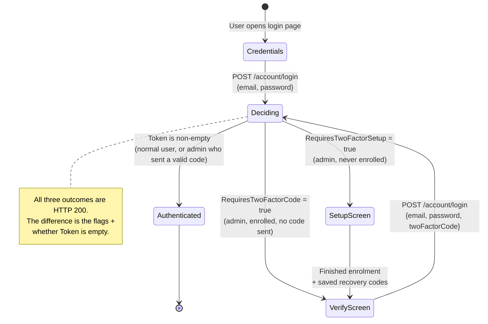

Trace a brand-new admin's first login: enter credentials → backend says "setup required" → land on setup screen → enroll & save recovery codes → move to verify screen → enter a fresh code → re-post login *with* the code → backend satisfied → token issued → authenticated.

---

## 8. Frontend Implementation

The Angular side has several components working together, all built with modern Angular **signals** (reactive state holders) and the `@if`/`@else` template syntax. Before looking at each one individually, here's how they relate as a whole:

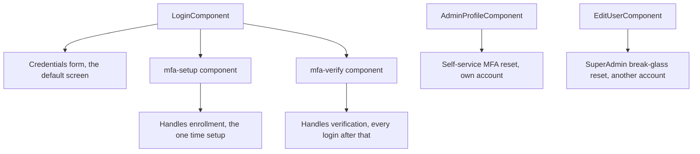

`LoginComponent` never navigates to separate routes for the enrollment/verification steps — instead it behaves like a small state machine of its own: changing its `stage` signal simply swaps which one of `mfa-setup`/`mfa-verify` is currently rendered inside the same page. `AdminProfileComponent` and `EditUserComponent`, covered in 8.5 and 8.6, are separate, ordinary admin pages reached only after a full login — they're not part of the login state machine at all.

### 8.1 The Login Component (the orchestrator)

`login.component` is the traffic controller. It holds a `stage()` signal that decides which of three screens to show, and the template branches on it:

```html
@if (stage() === 'credentials') {
    <!-- the email/password form -->
} @else if (stage() === 'verify') {
    <app-mfa-verify
      [email]="credentials().email"
      [password]="credentials().password"
      (authenticated)="onVerified($event)"
      (cancelled)="onCancelMfa()">
    </app-mfa-verify>
} @else {
    <app-mfa-setup
      [email]="credentials().email"
      [password]="credentials().password"
      (enrolled)="onEnrolled()"
      (cancelled)="onCancelMfa()">
    </app-mfa-setup>
}
```

So the login page is really *three screens sharing one component*, and `stage()` is the switch. When a login response comes back with `RequiresTwoFactorSetup = true`, the component sets `stage` to show `mfa-setup`; when `RequiresTwoFactorCode = true`, it shows `mfa-verify`.

Notice it passes `email` and `password` down to the child components. This connects directly to the stateless design from Section 7: **the first login attempt never creates a session at all** — the backend only confirms the password is correct and replies with a "next step required" signal, with an empty token. Since the backend keeps no memory of that first attempt, the *second* request (the one carrying the MFA code) has to resubmit the original credentials from scratch, not the code alone. That's exactly why these two child components need `email` and `password` as inputs — they're not decorative, they're required for the re-post to work at all.

### 8.2 The Setup Component

`mfa-setup.component` handles **enrollment** — the one-time process, introduced in Section 5.2, of registering an authenticator app for the first time. This is different from *verification* (Section 8.3, next), which happens on every ordinary login once enrollment is already done. The component has two internal stages of its own, tracked by a `stage` signal (`'scan'` → `'recovery'`).

On load, it fetches the setup data and renders the QR:

```typescript
ngOnInit(): void {
  this.loadSetup();
}

private loadSetup(): void {
  this.loading.set(true);
  this.serverError.set(null);

  this.accountService.getAuthenticatorSetup(this.email(), this.password()).subscribe({
    next: async (setup) => {
      this.sharedKey.set(setup.sharedKey);
      try {
        this.qrDataUrl.set(await QRCode.toDataURL(setup.authenticatorUri, { margin: 1, width: 220 }));
      } catch {
        this.qrDataUrl.set('');   // manual key entry still works if QR rendering fails
      }
      this.loading.set(false);
    },
    error: (err) => {
      this.loading.set(false);
      this.serverError.set(this.extractError(err, TranslationKeys.Mfa.SetupFailed));
    },
  });
}
```

If the caller reaches this component for an account that's already fully enrolled — which, after the fix in Section 5.2, the backend now actively refuses — this `error` branch is exactly what surfaces the `Auth.MfaAlreadyConfigured` rejection to the user, using the same generic error-display path as any other failed request. No special-case handling was needed on the frontend for the vulnerability fix; the existing error path already covered it correctly.

When the user submits the first code, it calls enable, then switches to the recovery-codes stage:

```typescript
enable(): void {
  const code = this.code().trim();
  if (!code || this.loading()) return;

  this.loading.set(true);
  this.serverError.set(null);

  this.accountService.enableAuthenticator(this.email(), this.password(), code).subscribe({
    next: (result) => {
      this.loading.set(false);
      this.recoveryCodes.set(result.recoveryCodes ?? []);
      this.stage.set('recovery');   // switch from 'scan' screen to 'recovery' screen
    },
    error: (err) => {
      this.loading.set(false);
      this.serverError.set(this.extractError(err, TranslationKeys.Mfa.InvalidCode));
    },
  });
}
```

**The recovery-code safety gate.** This is the most safety-critical UI in the whole flow, because the codes are shown *once*. Three deliberate features enforce careful handling:

```html
<!-- 1. A copy button for easy saving -->
<button mat-stroked-button type="button" (click)="copyRecoveryCodes()">
  <mat-icon>content_copy</mat-icon> {{ TranslationKeys.Mfa.CopyCodes | translate }}
</button>

<!-- 2. A mandatory confirmation checkbox -->
<mat-checkbox name="saved" [ngModel]="savedConfirmed()" (ngModelChange)="savedConfirmed.set($event)" data-cy="recovery-confirm">
  {{ TranslationKeys.Mfa.SavedConfirm | translate }}
</mat-checkbox>

<!-- 3. "Continue" is disabled until the box is ticked -->
<button mat-raised-button color="primary" type="button" data-cy="mfa-finish"
  [disabled]="!savedConfirmed()" (click)="finish()">
  {{ TranslationKeys.Mfa.ContinueToSignIn | translate }}
</button>
```

This is a "speed bump" by design — a user rushing through setup *cannot* skip past the one screen they'll never see again. The `finish()` method only proceeds if the box is ticked:

```typescript
finish(): void {
  if (this.savedConfirmed()) {
    this.enrolled.emit();
  }
}
```

After the user leaves this screen, the backend will never return these exact codes again — the value is only ever included in this one API response. If they're lost before being saved, the account is not permanently stuck: the same self-service reset described in [Section 5.5](#55-mfa-recovery-self-service-and-superadmin-reset) can invalidate the half-remembered setup and start enrollment over from a clean slate, this time producing a completely new set of codes.

### 8.3 The Verify Component

`mfa-verify.component` handles entering the code during a normal login. Its job is simple: take the code, re-post the *whole* login, and check the result.

```typescript
submit(): void {
  const code = this.code().trim();
  if (!code || this.submitting()) return;

  this.submitting.set(true);
  this.serverError.set(null);

  this.accountService
    .login({ email: this.email(), password: this.password(), twoFactorCode: code })
    .subscribe({
      next: (user) => {
        this.submitting.set(false);
        if (this.accountService.isAuthenticatedUser(user)) {
          this.authenticated.emit(user);
        } else {
          this.serverError.set(this.translationService.translate(TranslationKeys.Mfa.VerifyIncomplete));
        }
      },
      error: (err) => {
        this.submitting.set(false);
        this.serverError.set(this.extractError(err));
      },
    });
}
```

It's worth being precise about what this component does and does not do. **It never verifies the code itself.** All it does is collect what the user typed and send it to the backend — the actual TOTP calculation and comparison (Section 5.3) happens entirely server-side. The backend stays the single source of truth for every authentication decision; the frontend's only job here is to display whatever the backend decides.

This is exactly why the `isAuthenticatedUser(user)` check matters so much. Remember from Section 7: **every one of the three login outcomes returns HTTP 200** — even the "please set up MFA" and "please enter your code" responses. So a 200 status alone says nothing about whether the user is actually logged in. The only reliable signal is whether `token` is non-empty, and that's precisely what this check enforces before the component fires its `authenticated` event.

This is the "stateless re-post" in action: it sends `email`, `password`, and `twoFactorCode` all together. And the template even tells the user they can use a recovery code here: *"Enter the 6-digit code from your authenticator app. You can also enter a one-time recovery code."* — matching the backend's recovery-code fallback.

### 8.4 Rendering the QR Code

The backend sends the `otpauth://` URI as plain text — it doesn't send an image. The frontend turns that text into an actual QR picture using the `qrcode` npm package:

```typescript
import * as QRCode from 'qrcode';
// ...
this.qrDataUrl.set(await QRCode.toDataURL(setup.authenticatorUri, { margin: 1, width: 220 }));
```

`toDataURL` converts the URI string into a data-URL image that's dropped straight into an `` tag. Two supporting configuration details make this work cleanly:

```jsonc
// angular.json — qrcode is a CommonJS module; this silences the build warning
"allowedCommonJsDependencies": ["qrcode"]
```

A quick note on why the next file exists at all: TypeScript normally expects type information for every package it imports, so the compiler knows what functions exist and what arguments they take. The official types for `qrcode` caused a conflict in this project, so this file is a small, hand-written substitute — just enough type information for the one function actually used:

```typescript
// src/app/shared/types/qrcode.d.ts — a minimal hand-written type declaration
// We deliberately avoid @types/qrcode because it pulls in @types/node, whose global
// declarations (e.g. AbortSignal) conflict with the DOM lib in this project.
declare module 'qrcode' {
  export function toDataURL(text: string, options?: QRCodeToDataURLOptions): Promise<string>;
}
```

> [!NOTE]
> That hand-written `.d.ts` file is a small but real engineering decision: the "official" `@types/qrcode` package would have dragged in Node.js type definitions that clash with the browser's DOM types, causing build errors. Writing a minimal declaration for just the one function actually used avoids the whole conflict.

### 8.5 The Admin Profile Page: Self-Service Reset UI

This is the frontend half of Section 5.5's self-service reset — a new page at `/admin/profile`, reachable from the admin toolbar once logged in. Unlike the login-flow components above, this one is an ordinary authenticated page, not part of the login state machine.

```typescript
@Component({
  selector: 'app-admin-profile',
  templateUrl: './admin-profile.component.html',
  styleUrls: ['./admin-profile.component.scss'],
  changeDetection: ChangeDetectionStrategy.OnPush,
  standalone: true,
  imports: [TranslatePipe, FormsModule, MatButtonModule, MatCardModule, MatFormFieldModule, MatIconModule, MatInputModule],
})
export class AdminProfileComponent implements OnInit {
  private accountService = inject(AccountService);
  private authorizationService = inject(AuthorizationService);
  private notificationService = inject(NotificationService);
  private translationService = inject(TranslationService);
  private dialog = inject(MatDialog);

  readonly canResetMfa = signal<boolean>(false);
  readonly password = signal<string>('');
  readonly resetting = signal<boolean>(false);
  readonly serverError = signal<string | null>(null);

  ngOnInit(): void {
    this.authorizationService
      .isCurrentUserAuthorized(PolicyNames.RequireAtLeastAdministratorRole)
      .subscribe(isAllowed => this.canResetMfa.set(isAllowed));
  }

  resetMfa(): void {
    if (this.resetting()) return;

    if (!this.password().trim()) {
      this.serverError.set(this.translationService.translate(TranslationKeys.Admin.Profile.PasswordRequired));
      return;
    }

    const dialogData: IDialogData = {
      title: this.translationService.translate(TranslationKeys.Admin.Profile.ResetMfaConfirmTitle),
      content: this.translationService.translate(TranslationKeys.Admin.Profile.ResetMfaConfirmContent),
      showConfirmationButtons: true,
    };

    this.dialog.open<DialogComponent, IDialogData>(DialogComponent, { data: dialogData })
      .afterClosed()
      .subscribe(confirmed => { if (confirmed) { this.performReset(); } });
  }

  private performReset(): void {
    this.resetting.set(true);
    this.serverError.set(null);

    this.accountService.resetAuthenticator(this.password()).subscribe({
      next: (response) => {
        this.resetting.set(false);
        this.notificationService.showSuccess(response.message);
        this.accountService.logout();   // backend already ended every session; finish it locally too
      },
      error: (err) => {
        this.resetting.set(false);
        this.serverError.set(err?.error?.detail || err?.error?.title
          || this.translationService.translate(TranslationKeys.Admin.Profile.ResetMfaFailed));
      },
    });
  }
}
```

A few details worth calling out:

- **`canResetMfa` gates the whole UI.** The button only renders for accounts the `RequireAtLeastAdministratorRole` policy allows — matching the same policy the backend enforces on `POST /account/mfa/reset` (Section 5.5). This is purely a UX courtesy, though: the real security boundary is the backend's own `[Authorize]` attribute and password re-check, not this client-side flag, since nothing stops a direct API call from bypassing the UI entirely.
- **The confirmation dialog is a second speed bump**, similar in spirit to the recovery-code checkbox from Section 8.2 — the user has to type their password *and* explicitly confirm a dialog that spells out the consequence before anything happens.
- **`this.accountService.logout()` runs after a successful reset.** By the time this line runs, the backend has already invalidated every session server-side (Section 6.4); this call simply finishes the job on the *current* tab — clearing the locally stored token and navigating back to the login page — so the admin lands somewhere sensible rather than continuing to click around with credentials the server has already discarded.

Corresponding template (trimmed):

```html
@if (canResetMfa()) {
  <mat-card class="security-card">
    <h2 class="security-card-heading">
      <mat-icon>security</mat-icon>
      {{ TranslationKeys.Admin.Profile.MfaHeading | translate }}
    </h2>
    <p class="security-card-description">{{ TranslationKeys.Admin.Profile.MfaDescription | translate }}</p>

    <form (ngSubmit)="resetMfa()" class="reset-form">
      <mat-form-field appearance="outline" class="password-field">
        <mat-label>{{ TranslationKeys.Admin.Profile.CurrentPassword | translate }}</mat-label>
        <input matInput type="password" name="password"
          [ngModel]="password()" (ngModelChange)="password.set($event)"
          autocomplete="current-password" data-cy="mfa-reset-password" required />
      </mat-form-field>

      @if (serverError()) {
        <p class="server-error" data-cy="mfa-reset-error">{{ serverError() }}</p>
      }

      <button mat-raised-button color="warn" type="submit"
        data-cy="mfa-reset-submit" [disabled]="resetting() || !password().trim()">
        <mat-icon>restart_alt</mat-icon>
        {{ TranslationKeys.Admin.Profile.ResetMfa | translate }}
      </button>
    </form>
  </mat-card>
}
```

### 8.6 The Edit User Page: SuperAdmin Break-Glass Reset UI

This is the frontend half of Section 5.5's break-glass reset. It's a small addition to the existing "edit user" admin screen, visible only when a SuperAdmin is viewing *someone else's* account:

```typescript
/** True when the signed-in SuperAdmin may reset the DISPLAYED user's MFA (never the own account). */
readonly canResetMfa = computed(() =>
  this.isSuperAdmin() && !!this.adminUser() && this.adminUser()!.id !== this.currentUserId());
readonly resettingMfa = signal<boolean>(false);

/**
 * Break-glass MFA recovery for the displayed user (see backend ResetAuthenticatorForUserAsync):
 * after confirmation, their authenticator secret and recovery codes are invalidated, every
 * session ends, and their next password sign-in restarts the standard MFA enrollment.
 */
resetMfa(): void {
  const user = this.adminUser();
  if (!user?.id || this.resettingMfa()) {
    return;
  }

  const dialogData: IDialogData = {
    title: this.translationService.translate(TranslationKeys.Admin.Users.ResetMfaConfirmTitle),
    content: this.translationService.translate(TranslationKeys.Admin.Users.ResetMfaConfirmContent),
    showConfirmationButtons: true,
  };

  this.dialog.open<DialogComponent, IDialogData>(DialogComponent, { data: dialogData })
    .afterClosed()
    .subscribe((confirmed?: boolean) => {
      if (!confirmed) return;

      this.resettingMfa.set(true);
      this.accountService.resetAuthenticatorForUser(user.id!).subscribe({
        next: () => {
          this.resettingMfa.set(false);
          this.notificationService.showSuccess(
            this.translationService.translate(TranslationKeys.Admin.Users.MfaResetDone));
        },
        error: (error) => {
          this.resettingMfa.set(false);
          this.notificationService.showError(error?.error?.detail || error?.error?.title
            || this.translationService.translate(TranslationKeys.Admin.Users.MfaResetFailed));
        },
      });
    });
}
```

`canResetMfa` is a direct UI mirror of the backend's own-account rejection from Section 5.5 (`if (actingUser.Id == targetUserId)`) — a SuperAdmin viewing their *own* profile in this screen simply never sees the button. As with Section 8.5, this is a UX convenience layered on top of a check the backend enforces regardless.

The corresponding button in the template only appears under that same condition:

```html
<!-- Break-glass MFA recovery (SuperAdmin, never for the own account): invalidates the
     user's authenticator + recovery codes and signs them out everywhere, so a user who
     lost both phone and codes can sign in with their password and re-enrol. -->
@if (canResetMfa()) {
  <button type="button" mat-stroked-button class="mfa-reset-button" data-cy="admin-mfa-reset"
    (click)="resetMfa()" [disabled]="resettingMfa()">
    <mat-icon>restart_alt</mat-icon>
    {{ TranslationKeys.Admin.Users.ResetMfa | translate }}
  </button>
}
```

Notice this call passes no password at all — unlike the self-service flow, there's nothing here for the *acting* SuperAdmin to re-confirm on this particular request, because the identity check happens differently: the backend already knows who's calling (their own valid, already-authenticated session, protected by `RequireSuperAdminRole`), and the safety property that matters here isn't "prove you know a secret" but "you cannot target yourself" — which the backend enforces unconditionally, not based on anything the frontend sends.

---

## 9. The JWT Interceptor: Managing Tokens and Protecting the Login Flow

### 9.1 What Is an HTTP Interceptor?

An **HTTP interceptor** is code that sits between the Angular app and the network, automatically inspecting and modifying every request going out and every response coming back — like a mailroom that stamps all outgoing mail and sorts all incoming mail centrally, so individual components don't each have to handle it themselves.

`jwtInterceptor` does two jobs: attaching tokens to outgoing requests, and deciding what to do when a response comes back `401`. Neither job involves the interceptor "deciding" anything in a human sense — it applies the same fixed rule to every request that passes through it. That distinction matters for what follows.

### 9.2 Job 1 — Attaching the Token

```typescript
const isApiRequest = request.url.startsWith(environment.apiUrl);
const token = storageService.get<string>(LOCAL_STORAGE_KEYS.AUTH_TOKEN);

if (token && isApiRequest) {
  request = request.clone({
    setHeaders: { Authorization: `Bearer ${token}` }
  });
}
```

If we have a token *and* the request goes to our own API, stamp the token on it. The `isApiRequest` check is a quiet security detail: it stops your login token from leaking to any *third-party* host the app might call. Every request this article has covered from Section 8.5 and 8.6 onward — `mfa/reset` and `user/{id}/mfa/reset` — is an authenticated request, so this is exactly what attaches the caller's bearer token to them.

### 9.3 Job 2 — Refreshing Expired Tokens

Access tokens are deliberately short-lived (about 15 minutes, per `TokenService.CreateAccessTokenAsync`). This is a security trade-off: if one is ever stolen, the window in which it's useful to an attacker is small. But short-lived tokens create an obvious usability problem on their own — nobody wants to re-enter their password every 15 minutes. A **refresh token** (a longer-lived secret) solves that trade-off: it lets the app quietly obtain a fresh access token in the background, so the short expiry buys security without costing the user constant re-logins.

```typescript
return next(request).pipe(
  catchError((error: any) => {
    if (error.status === 401 && isApiRequest && !isAuthEndpoint) {
      return accountService.refreshToken().pipe(
        switchMap((newToken) => {
          storageService.set(LOCAL_STORAGE_KEYS.AUTH_TOKEN, newToken);
          request = request.clone({ setHeaders: { Authorization: `Bearer ${newToken}` } });
          return next(request);   // retry the original request with the fresh token
        }),
        catchError(refreshError => {
          accountService.logout();   // refresh also failed → give up, log out
          return throwError(() => refreshError);
        })
      );
    }
    return throwError(() => error);
  })
);
```

Concretely, here's what "retry the original request" means: say a `GET /api/orders` call goes out with an expired token and comes back `401`. The interceptor holds onto that original request, calls the refresh endpoint, gets a new access token back, and resends that *exact same* `GET /api/orders` request — this time with the new token in the header. The code that originally asked for the orders never sees the intermediate `401` at all; it just receives the eventual successful response, slightly later than usual.

This is exactly the mechanism that surfaces a role change (Section 6.4) or an MFA reset (Section 5.5) to a *different*, already-open browser tab: its next request gets a `401` (the `SecurityStamp` no longer matches), the interceptor tries to refresh — but the refresh token was already revoked server-side, so the refresh call fails too — and the `catchError` above calls `accountService.logout()`. No code anywhere had to be written specifically for "log out the other tabs of a demoted or reset user"; it falls directly out of infrastructure that already existed for ordinary token expiry.

> [!NOTE]
> **Guarding against a "refresh stampede."** If several requests all hit a `401` around the same moment, you wouldn't want each one triggering its own separate refresh call. A `tokenService.isRefreshing()` flag ensures only the *first* 401 starts a refresh; any others that arrive while it's in progress wait for that same refresh to finish and then retry using its result, instead of firing off duplicate refresh requests of their own.

### 9.4 The Critical Guard: `isAuthEndpoint`

Look at the condition: `if (error.status === 401 && isApiRequest && !isAuthEndpoint)`. That `!isAuthEndpoint` is the guard, checked against this list:

```typescript
const isAuthEndpoint = [
  'account/login',
  'account/mfa/',
  'account/google-login',
  'account/register',
  'account/forgot-password',
  'account/reset-password',
  'account/refresh-token',
].some((path) => request.url.includes(path));
```

Its comment explains exactly why:

```typescript
// Pre-authentication endpoints. A 401 from these means "bad credentials / wrong
// MFA code / admin blocked" — NOT "session expired", so we must not attempt a
// silent token refresh + retry (that would swallow the error and force a logout
// redirect, breaking the MFA and Google flows). Let their 401 reach the caller.
```

One entry on that list is worth calling out specifically: `account/refresh-token` is in there too. This isn't an oversight — if a refresh attempt itself came back `401` and the interceptor tried to "refresh the refresh," it would be trying to fix a broken session by calling the very endpoint that just failed, with nothing to recover with. Excluding it stops that recursive dead end before it can happen; a failed refresh just means the session is over, and the user needs to log in again.

> [!IMPORTANT]
> **A subtlety worth being precise about: `'account/mfa/'` also matches the self-service reset URL.** `account/mfa/reset` contains the substring `account/mfa/`, so a `401` from `POST /account/mfa/reset` (Section 5.5) is treated the same way as a `401` from `mfa/setup` or `mfa/enable` — shown inline, no refresh attempted. For a *wrong password* on the reset form, that's exactly the right behavior, for the same reason it's right on the login form: it's a credential failure, not an expired session, and swallowing it into a refresh-and-logout cycle would be just as disruptive here as during enrollment. Note that `account/user/{id}/mfa/reset` (the SuperAdmin break-glass endpoint) does **not** match this prefix — its URL contains `account/user/42/mfa/reset`, with `/user/42/` breaking up the substring — so a `401` there (which really would mean an expired SuperAdmin session, since that endpoint takes no password) correctly goes through the normal refresh-and-retry path instead.

### 9.5 Why This Guard Protects the MFA Flow

Before walking through what goes wrong without this guard, it's worth being precise about what a `401` means here. Normally, `401` signals "your access token is missing or has expired." But ASP.NET Core also reuses the same status code for a completely different situation: a login or MFA attempt that was simply *wrong* — a bad password, a bad code. At this pre-authentication stage, there is no session and no access token yet to have expired at all — the user hasn't logged in yet. The interceptor has to tell these two situations apart, and the guard is exactly how it does that.

Now picture what would happen **without** the guard, when an admin types a wrong MFA code:

1. Admin types a wrong code into `mfa-verify.component`.
2. The re-posted login comes back `401`.
3. Without the guard, the interceptor's normal rule fires anyway: *"401 from a non-auth endpoint means the token probably expired — refresh and retry."* It has no way to know this particular `401` actually came from a wrong code, not an expired session.
4. It refreshes and retries the login... which fails again (still the same wrong code)...
5. The real error ("Invalid authentication code") is **swallowed** by the refresh attempt.
6. When the refresh eventually fails too, the interceptor calls `logout()` and redirects to login.

The result: **one wrong digit throws the admin out of the login flow entirely.** The same thing would happen with a wrong password, or with the Google admin-block from Section 10, or with a mistyped password on the MFA reset form from Section 8.5. The guard prevents all of this by letting these specific 401s pass straight through to the components that display them inline, instead of running the refresh logic on them at all.

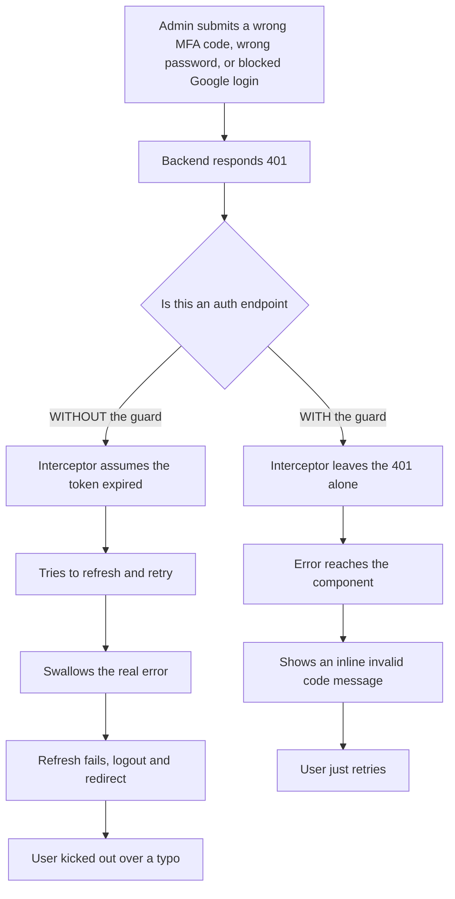

### 9.6 Two Meanings of HTTP 401

> [!IMPORTANT]
> **A `401` status code alone is not enough to know what happened.** The same status is used for two completely different situations, and the interceptor has to tell them apart using something other than the status code itself:
>
> | A 401 from... | Actually means | Correct response |
> |---|---|---|
> | A **protected** endpoint (`/orders`, `/basket`, `/user/{id}/mfa/reset`) | "Your session's access token expired" | Refresh silently and retry |
> | An **auth** endpoint (`/login`, `/mfa/*` including `/mfa/reset`, `/google-login`) | "Your credentials or code were wrong — you were never logged in this session to begin with" | Show the error inline; never refresh or log out |
>
> The *URL* is the only clue available. The `isAuthEndpoint` list is the interceptor asking, on every single 401, "which of these two situations is this?" — and only applying the refresh-and-retry logic to the first one.

---

## 10. Closing the Google Bypass

LiliShop also supports "Sign in with Google." This is convenient and safe **for regular customers** — but it's inherently **single-factor**: it proves only *"this person controls this Google account,"* with no concept of TOTP or codes.

If admins could use it, it would be a silent bypass around all the MFA work:

1. You carefully force admins through password + MFA on the normal login.
2. An attacker phishes the admin's *Google* account (a separate attack).
3. The attacker clicks "Sign in with Google"... and walks in as an admin, **with no second factor ever requested.**

It's like fitting a vault door on the front of a building but leaving a side door with an ordinary lock. So the fix is absolute: **admins are blocked from Google sign-in entirely** and redirected to the password + MFA flow.

```csharp
var role = await user.GetRoleAsync(_userManager);

// F14.2 — Google sign-in is single-factor and carries no TOTP code, so it must not become an MFA
// bypass for privileged accounts. Administrators are required to use the email/password + MFA flow.
if (IsMfaRequiredForRole(role))
{
    _logger.LogWarning("Google sign-in blocked for an MFA-required administrator account. UserId={UserId}", user.Id);
    return OperationResult.Failure<UserDto>(ErrorCode.AuthorizationRequired,
        "Administrator accounts must sign in with email, password, and an authenticator code.")
        .WithMessageKey("Auth.AdminMfaSignInRequired");
}
```

This reuses the exact same `IsMfaRequiredForRole` helper from Section 6.1 — the Google sign-in path and the password login path both ask the same question, of the same source of truth, and get the same answer.

And this connects directly to the interceptor: notice `account/google-login` is in the `isAuthEndpoint` list from Section 9.4. That's deliberate — its `401` is *not* treated as "session expired," so the message passes straight through to the form's error display instead of triggering a refresh-and-logout.

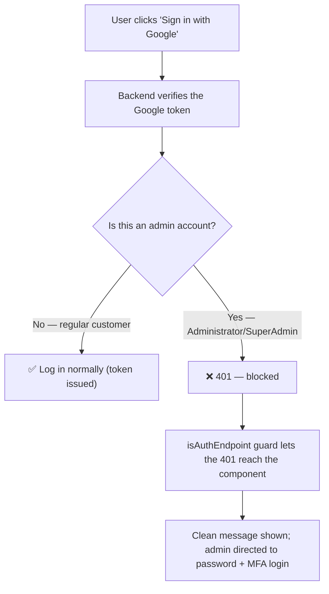

> [!IMPORTANT]
> **The principle: a security control is only as strong as the weakest way around it.** Protecting the *main* login path isn't enough if an *alternate* path skips the protection. Adding MFA to the password login while leaving Google login open for admins wouldn't be "mostly secure" — it would be effectively unprotected, because an attacker just picks the open door. Closing the Google door for admins is what makes the MFA guarantee actually hold.


---

## 11. The Complete End-to-End Flow

Here's everything tied together — the full journey of a brand-new admin, from their very first login through to accessing a protected resource. This diagram combines every piece covered above.

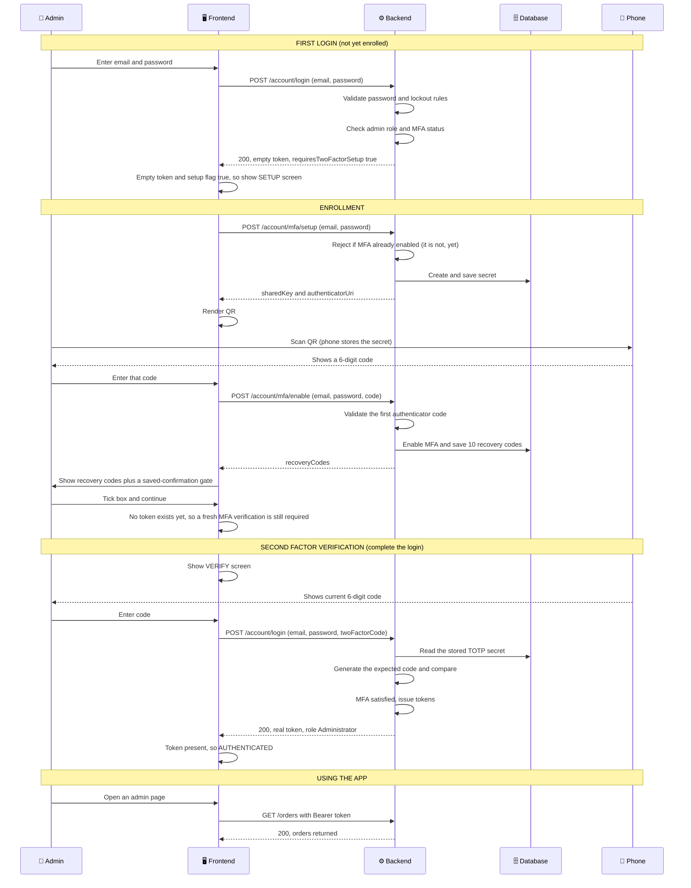

And every **subsequent** login (already enrolled) is much shorter — the enrollment stage disappears entirely:

Credentials → Second factor verification → Authenticated

This matches the "three screens sharing one component" idea from Section 8.1: a first-time admin sees all three screens (credentials, setup, verify) in sequence, but every login after that only ever shows two of them (credentials, verify). Three screens collapse to two.

The diagram above is the happy path. Section 9 covers what happens when the code entered is wrong, and why that failure has to be handled carefully so it doesn't accidentally log the admin out. Here's that failure path in isolation:

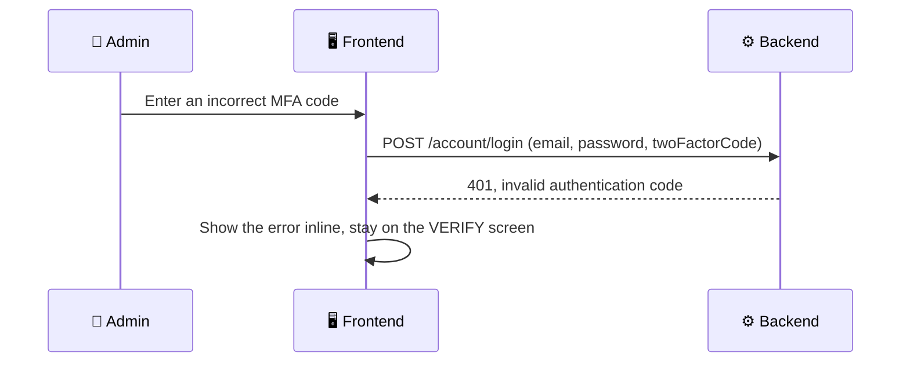

And here's the recovery path from Section 5.5, for an admin who lost their phone and their recovery codes, but is still signed in:

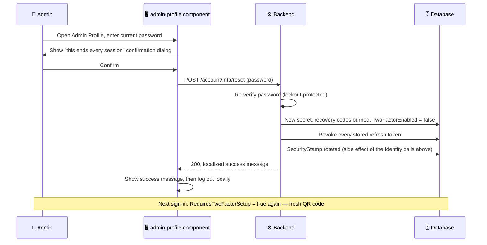

---

## 12. API Reference

### Endpoints

| Method | Endpoint | Purpose | Auth required? |
|---|---|---|---|
| `POST` | `/account/login` | Log in; also submits the TOTP code (MFA step) | No (pre-auth) |
| `POST` | `/account/mfa/setup` | Get the secret + QR URI to begin enrollment (rejected if MFA is already enabled) | No — re-verifies password |
| `POST` | `/account/mfa/enable` | Confirm the first code, enable MFA, get recovery codes (rejected if MFA is already enabled) | No — re-verifies password |
| `POST` | `/account/mfa/reset` | Self-service reset: invalidate the current secret + recovery codes, sign out everywhere | **Yes** — `RequireAtLeastAdministratorRole`, plus re-verifies password |
| `POST` | `/account/user/{id}/mfa/reset` | Break-glass reset of another user's MFA (never the caller's own account) | **Yes** — `RequireSuperAdminRole` |
| `POST` | `/account/google-login` | Google sign-in (blocked for admins) | No (pre-auth) |

### Sample requests & responses

**Login — admin, first attempt (no code yet):**

```jsonc
// Request
POST /account/login
{ "email": "admin@lilishop.com", "password": "CorrectPassword1!" }

// Response — 200 OK (but NOT authenticated: token is empty)
{
  "id": 42,
  "email": "admin@lilishop.com",
  "displayName": "Site Admin",
  "token": "",
  "role": "Administrator",
  "emailConfirmed": true,
  "requiresTwoFactorSetup": false,
  "requiresTwoFactorCode": true
}
```

**Login — admin, second attempt (with code):**

```jsonc
// Request
POST /account/login
{ "email": "admin@lilishop.com", "password": "CorrectPassword1!", "twoFactorCode": "483920" }

// Response — 200 OK, now authenticated (token present)
{
  "id": 42,
  "email": "admin@lilishop.com",
  "displayName": "Site Admin",
  "token": "eyJhbGciOiJIUzI1NiIsInR5cCI6...",
  "role": "Administrator",
  "emailConfirmed": true,
  "requiresTwoFactorSetup": false,
  "requiresTwoFactorCode": false
}
```

**Setup — begin enrollment:**

```jsonc
// Request
POST /account/mfa/setup
{ "email": "admin@lilishop.com", "password": "CorrectPassword1!" }

// Response — 200 OK
{
  "sharedKey": "JBSWY3DPEHPK3PXP",
  "authenticatorUri": "otpauth://totp/LiliShop:admin@lilishop.com?secret=JBSWY3DPEHPK3PXP&issuer=LiliShop&digits=6"
}
```

**Setup — rejected, MFA already enabled (the vulnerability fix from Section 5.2):**

```jsonc
// Request
POST /account/mfa/setup
{ "email": "admin@lilishop.com", "password": "CorrectPassword1!" }

// Response — 401 Unauthorized
{
  "status": 401,
  "detail": "Two-factor authentication is already configured for this account."
}
```

**Enable — confirm & get recovery codes:**

```jsonc
// Request
POST /account/mfa/enable
{ "email": "admin@lilishop.com", "password": "CorrectPassword1!", "code": "483920" }

// Response — 200 OK (recovery codes shown ONCE)
{
  "recoveryCodes": [
    "4f8a2-91bc7", "d0e11-77a3f", "b62c9-40de8", "1a5f3-c8b90", "9e7d4-2f16a",
    "c3b80-6ea51", "72f9d-13c40", "a41e6-9db27", "5c0af-3e819", "e8d72-04b6c"
  ]
}
```

**Reset — self-service (authenticated administrator):**

```jsonc
// Request — Authorization: Bearer <token>
POST /account/mfa/reset
{ "password": "CorrectPassword1!" }

// Response — 200 OK
{
  "message": "Two-factor authentication has been reset. You have been signed out everywhere and will set up a new authenticator app at your next sign-in."
}
```

**Reset — SuperAdmin break-glass, for another user:**

```jsonc
// Request — Authorization: Bearer <SuperAdmin token>
POST /account/user/42/mfa/reset
// (empty body)

// Response — 204 No Content
```

**Reset — SuperAdmin targets their own account (rejected):**

```jsonc
// Request — Authorization: Bearer <SuperAdmin token>, targetUserId equals the caller's own id
POST /account/user/1/mfa/reset

// Response — 400 Bad Request
{
  "status": 400,
  "detail": "Use the password-confirmed self-service reset for your own account."
}
```

### Common error responses

| Status | Meaning | Example message |
|---|---|---|
| `400` | Bad code during enrollment / missing reset password / SuperAdmin targeted their own account | `"Verification code is invalid. Please try again."` / `"The current password is required."` / `"Use the password-confirmed self-service reset for your own account."` |
| `401` | Wrong password / wrong code / admin Google-blocked / MFA already configured / account locked out | `"Invalid email or password."` / `"Invalid authentication code."` / `"Two-factor authentication is already configured for this account."` |
| `404` | SuperAdmin targeted a user id that doesn't exist | `"User not found."` |
| `429` | Rate limited (too many attempts) | *(empty body — detected by status)* |

> [!TIP]
> Remember from Section 9: a `401` from these auth endpoints — including `mfa/reset`, since its URL matches the `isAuthEndpoint` guard — is an *expected credential failure* shown inline. It does **not** trigger the token-refresh/logout path. `user/{id}/mfa/reset`, by contrast, is a genuinely protected endpoint outside that guard, so a `401` there is treated as an expired session and silently refreshed.

---

## 13. Testing the MFA System

Every behaviour described in this article has an automated test behind it, in `ApplicationUserServiceMfaAndLocalizationTests.cs` and `ApplicationUserServiceRoleChangeTests.cs` on the backend, and in the individual component spec files on the frontend. This section shows a representative slice of each, so you can see exactly how these guarantees are verified rather than just asserted in prose.

### Backend: the enrollment vulnerability fix, tested directly

<details>
<summary>ApplicationUserServiceMfaAndLocalizationTests.cs (excerpt)</summary>

```csharp
[Fact]
public async Task GetAuthenticatorSetup_IsBlocked_WhenMfaAlreadyEnabled()
{
    var admin = BuildUser(role: Role.Administrator, email: "admin@example.com");
    _userManagerMock.Setup(m => m.FindByEmailAsync(admin.Email!)).ReturnsAsync(admin);
    _signInManagerMock
        .Setup(s => s.CheckPasswordSignInAsync(admin, "pw", true))
        .ReturnsAsync(SignInResult.Success);
    _userManagerMock.Setup(m => m.GetTwoFactorEnabledAsync(admin)).ReturnsAsync(true);

    var result = await _sut.GetAuthenticatorSetupAsync(new LoginDto { Email = admin.Email!, Password = "pw" });

    result.IsFailure.Should().BeTrue();
    result.MessageKey.Should().Be("Auth.MfaAlreadyConfigured");
    // The shared secret must never be read for an already-enrolled account.
    _userManagerMock.Verify(m => m.GetAuthenticatorKeyAsync(It.IsAny<ApplicationUser>()), Times.Never);
}
```

</details>

The last assertion is the sharpest part of this test: it doesn't just check that the call fails, it checks that `GetAuthenticatorKeyAsync` — the method that would read the secret out of storage — was **never even called**. That's the direct, automated proof that the vulnerability described in Section 5.2 stays fixed: no code path in this test run ever touched the secret.

### Backend: the self-service reset invalidates everything at once

<details>
<summary>ApplicationUserServiceMfaAndLocalizationTests.cs (excerpt)</summary>

```csharp
[Fact]
public async Task ResetAuthenticator_WithConfirmedPassword_InvalidatesSecretCodesAndSessions()
{
    var admin = BuildUser(id: 7, role: Role.Administrator, refreshTokenDeviceIds: new[] { "phone", "laptop" });
    var principal = SetupCurrentUser(admin);
    SetupUsersQueryable(admin);
    _signInManagerMock
        .Setup(s => s.CheckPasswordSignInAsync(admin, "pw", true))
        .ReturnsAsync(SignInResult.Success);
    SetupMfaResetPipeline(admin);
    _translations["Auth.MfaResetDone"] = "MFA wurde zurückgesetzt.";

    var result = await _sut.ResetAuthenticatorAsync(principal, new ResetAuthenticatorDto { Password = "pw" });

    result.IsSuccess.Should().BeTrue();
    MessageOf(result.Data!).Should().Be("MFA wurde zurückgesetzt.");

    // Old secret dies (new key), old recovery codes are burned by unseen replacements,
    // MFA is disabled so the next login restarts enrollment, and every session ends.
    _userManagerMock.Verify(m => m.ResetAuthenticatorKeyAsync(admin), Times.Once);
    _userManagerMock.Verify(m => m.GenerateNewTwoFactorRecoveryCodesAsync(admin, It.IsAny<int>()), Times.Once);
    _userManagerMock.Verify(m => m.SetTwoFactorEnabledAsync(admin, false), Times.Once);
    VerifyAllRefreshTokensRevoked(admin);
}
```

</details>

Notice this test builds an admin with refresh tokens on *two* devices (`"phone"`, `"laptop"`) specifically to prove `VerifyAllRefreshTokensRevoked` checks that **both** get removed, not just one — matching the "sign out everywhere," not "sign out this device," guarantee from Section 5.5.

### Backend: role changes and the own-account rejection

<details>
<summary>ApplicationUserServiceRoleChangeTests.cs and ApplicationUserServiceMfaAndLocalizationTests.cs (excerpts)</summary>

```csharp
[Fact]
public async Task RoleChange_RevokesEveryRefreshToken_AndRotatesSecurityStamp()
{
    var existingUser = SetupExistingUser(Role.Standard, "phone", "laptop", "tablet");
    var originalStamp = existingUser.SecurityStamp;

    var result = await _sut.UpdateUserAsync(5, BuildUpdatePayload(existingUser, Role.AdminPanelViewer));

    result.IsSuccess.Should().BeTrue();
    existingUser.SecurityStamp.Should().NotBe(originalStamp,
        "a rotated stamp invalidates every outstanding access token on its next request");
    VerifyAllRefreshTokensRevoked(existingUser);
}

[Fact]
public async Task AdminDemotedToStandard_ClearsAdminMfaState()
{
    var existingUser = SetupExistingUser(Role.Administrator, "phone");
    SetupMfaResetPipeline(existingUser);

    var result = await _sut.UpdateUserAsync(5, BuildUpdatePayload(existingUser, Role.Standard));

    result.IsSuccess.Should().BeTrue();
    _userManagerMock.Verify(m => m.ResetAuthenticatorKeyAsync(existingUser), Times.Once);
    _userManagerMock.Verify(m => m.SetTwoFactorEnabledAsync(existingUser, false), Times.Once);
    VerifyAllRefreshTokensRevoked(existingUser);
}

[Fact]
public async Task AdminMovedToSuperAdmin_KeepsMfaState()
{
    var existingUser = SetupExistingUser(Role.Administrator, "phone");

    var result = await _sut.UpdateUserAsync(5, BuildUpdatePayload(existingUser, Role.SuperAdmin));

    result.IsSuccess.Should().BeTrue();
    // Both roles require MFA — the enrolled authenticator stays valid.
    _userManagerMock.Verify(m => m.ResetAuthenticatorKeyAsync(It.IsAny<ApplicationUser>()), Times.Never);
    VerifyAllRefreshTokensRevoked(existingUser);
}

[Fact]
public async Task ResetAuthenticatorForUser_OwnAccount_IsRejected()
{
    var superAdmin = BuildUser(id: 1, role: Role.SuperAdmin);
    var principal = SetupCurrentUser(superAdmin);

    var result = await _sut.ResetAuthenticatorForUserAsync(superAdmin.Id, principal);

    result.IsFailure.Should().BeTrue();
    result.MessageKey.Should().Be("Auth.MfaResetOwnAccount");
    _userManagerMock.Verify(m => m.ResetAuthenticatorKeyAsync(It.IsAny<ApplicationUser>()), Times.Never);
}
```

</details>

These four tests map directly onto the truth table in Section 6.3: a plain role change always ends sessions; a demotion out of the MFA-required roles also clears MFA state; a lateral move between the two admin roles ends sessions but leaves MFA state alone; and a SuperAdmin can never point the break-glass endpoint at themselves.

### Frontend: the self-service reset component

<details>
<summary>admin-profile.component.spec.ts (excerpt)</summary>

```typescript
it('resets MFA after confirmation and signs the user out', () => {
  (accountService.resetAuthenticator as Mock).mockReturnValue(of({ message: 'done' }));

  component.password.set('P@ssw0rd');
  component.resetMfa();

  expect(dialog.open).toHaveBeenCalled();
  expect(accountService.resetAuthenticator).toHaveBeenCalledWith('P@ssw0rd');
  expect(notificationService.showSuccess).toHaveBeenCalledWith('done');
  expect(accountService.logout).toHaveBeenCalled();
});

it('requires the current password before asking the backend', () => {
  component.password.set('   ');
  component.resetMfa();

  expect(component.serverError()).toBeTruthy();
  expect(dialog.open).not.toHaveBeenCalled();
  expect(accountService.resetAuthenticator).not.toHaveBeenCalled();
});
```

</details>

The second test is worth a closer look: it proves the frontend's own guard runs *before* the confirmation dialog even opens — an admin who forgets to type a password never even sees the "this will sign you out everywhere" warning, because there's nothing to confirm yet.

### What isn't covered here

This section shows a representative slice, not the full suite — `ApplicationUserServiceMfaAndLocalizationTests.cs` alone contains additional cases for account lockout during reset, a wrong password on the reset form, an unknown target user id for the break-glass endpoint, and the standard TOTP/recovery-code login paths this article already walked through in Section 5.3 and 5.4. Reading the test files directly alongside this article is the most reliable way to confirm any specific claim made here against the actual, current behaviour of the code.

---

## 14. 📖 Glossary

| Term | Meaning |
|---|---|
| **Authentication** | Proving *who you are* (logging in) |
| **Authorization** | Checking *what you're allowed to do* (permissions) |
| **Factor** | A category of identity evidence. The three common factors are: something you know (a password), something you have (a phone or authenticator app), and something you are (a fingerprint or face) |
| **MFA** | Multi-Factor Authentication — requiring two or more *different* factors together. Password + a second password is not MFA (both are "something you know"); password + an authenticator code is |
| **MFA Enrollment** | The first-time setup process where a user registers an authenticator app, confirms it with a valid code, enables MFA, and receives their recovery codes |
| **MFA Reset (self-service)** | An authenticated administrator invalidating their own current secret and recovery codes after re-confirming their password, so they can start a fresh enrollment |
| **MFA Reset (break-glass)** | A SuperAdmin invalidating another, locked-out administrator's MFA credentials on their behalf; never usable on the SuperAdmin's own account |
| **OTP** | One-Time Password — a temporary code that's valid only once, or only for a short window |
| **TOTP** | Time-based OTP — a specific kind of OTP generated from a shared secret and the current time, changing every 30 seconds. TOTP is one type of OTP |
| **Shared secret** | The random value both the server and the phone hold, used to independently generate matching TOTP codes. Also sometimes called the "TOTP secret" |
| **Authenticator app** | A phone app (Google Authenticator, Authy…) that stores secrets and shows current codes |
| **QR code** | A visual representation of an `otpauth://` setup URI. The authenticator app scans it and extracts the shared secret and account details from that URI — the QR image itself isn't the secret, it's just a container for it |
| **Recovery codes** | One-time backup codes generated during MFA enrollment. Each one can be used only once and is permanently consumed after a successful login |
| **DTO** | Data Transfer Object — a simple class defining the shape of data sent between client and server |
| **JWT** | JSON Web Token — a signed token issued after successful authentication. The client sends it with later requests so the backend can identify the user |
| **Access token** | The short-lived (~15 min) JWT sent with each request, typically as a Bearer token in the `Authorization` header |
| **Refresh token** | A longer-lived credential, stored server-side (one row per device in `AspNetUserTokens`), exchanged for a new access token once the old one expires |
| **SecurityStamp** | A random value stored on the user's row and copied into every access token at issuance. Rotating it (assigning a new random value) makes every previously-issued access token fail validation on its very next request, without needing a blocklist of individual tokens |
| **Refresh-token revocation** | Deleting a user's stored refresh tokens so no device can silently obtain a new access token. Combined with a `SecurityStamp` rotation, this is how LiliShop ends every session of an account immediately — used for role changes and both MFA reset flows |
| **Interceptor** | Angular code that inspects and modifies every HTTP request and response centrally |
| **Stateless** | A design where the server keeps no memory of temporary login progress between requests — each request carries everything needed to continue on its own |
| **HTTP 401 Unauthorized** | A status meaning authentication failed. In this application it can mean two different things depending on the endpoint: an expired or missing access token, or invalid login/MFA/reset credentials (see Section 9.6) |
| **`AspNetUserTokens`** | An ASP.NET Core Identity table for storing user tokens and provider-specific values — including the authenticator secret used for TOTP generation and the refresh tokens used for session renewal |

---

<div align="center">

*Part 2 of the LiliShop security series. This document uses LiliShop's real backend and frontend code as its running example throughout.*

</div>
