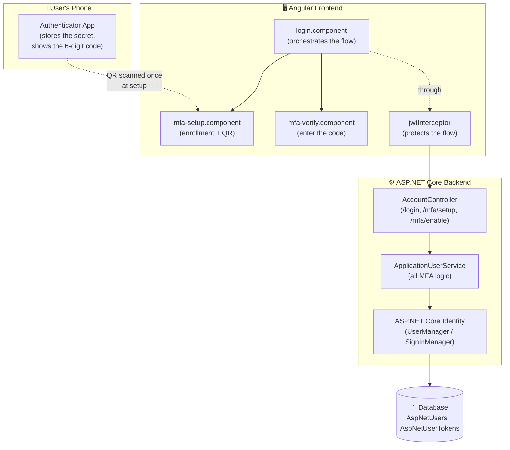
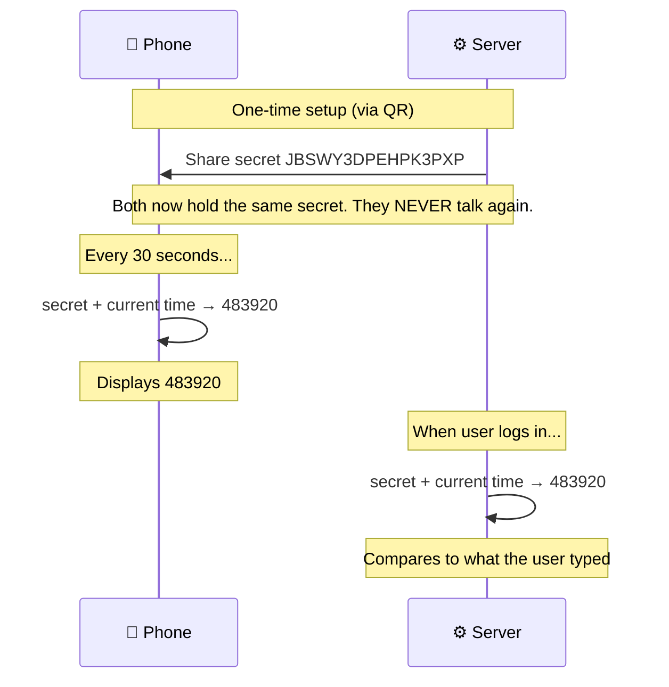
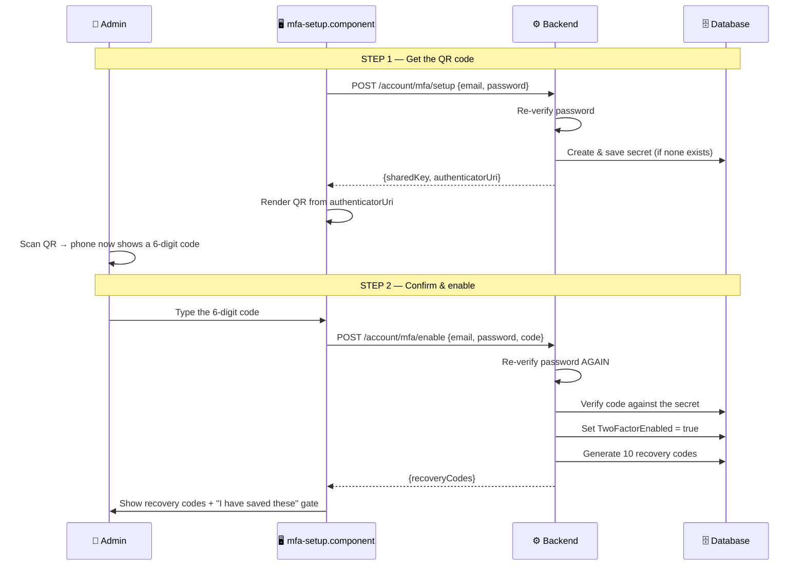
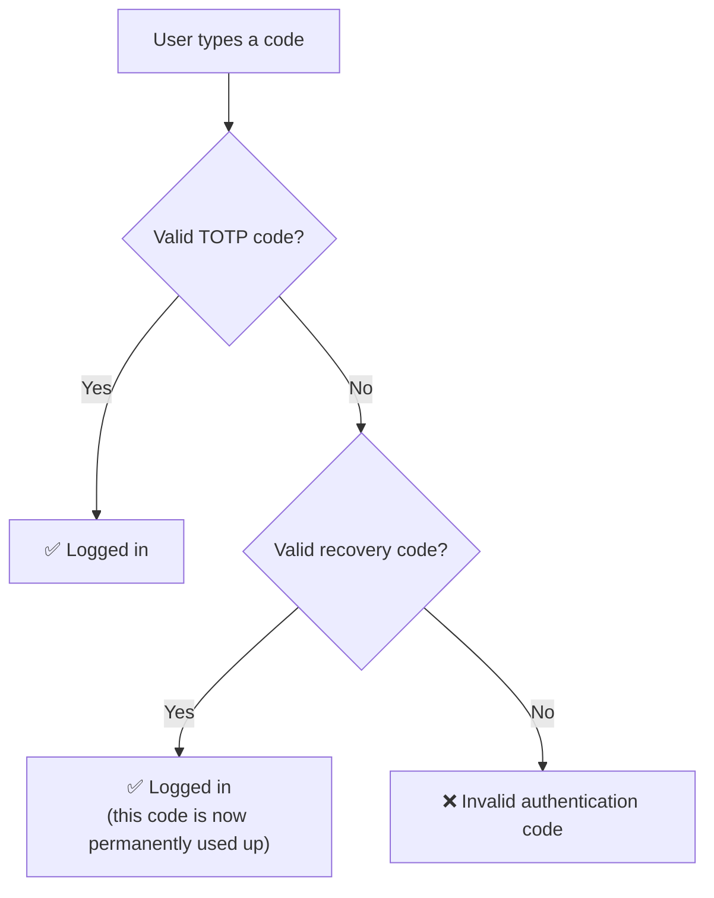
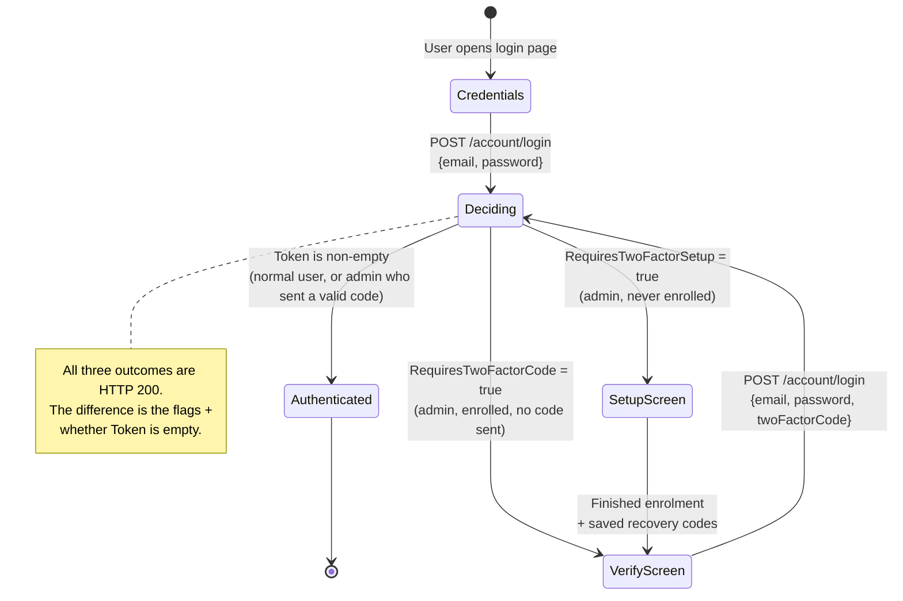
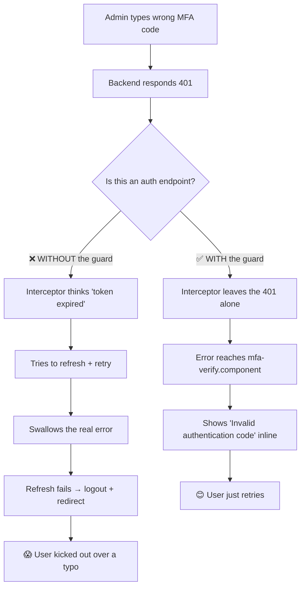
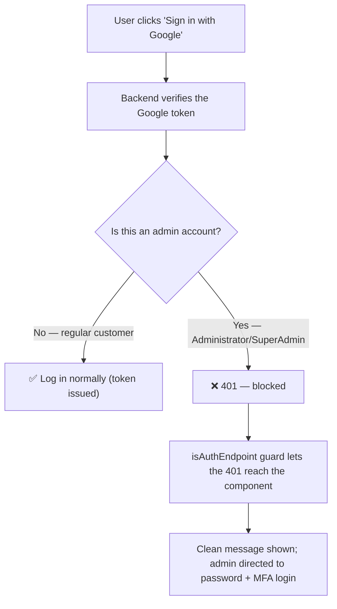
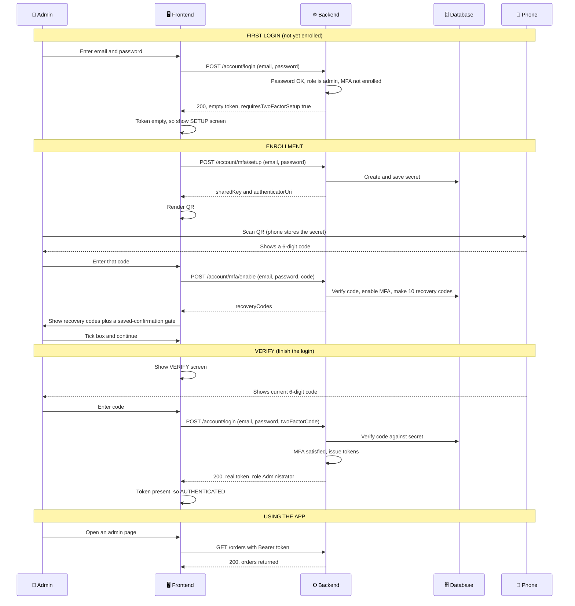

# 🔐 LiliShop — Multi-Factor Authentication (MFA) Implementation

> A complete, tutorial-style guide to how LiliShop adds a second layer of login security for administrators — using Time-based One-Time Passwords (TOTP), the same technology behind Google Authenticator and Authy.

This document assumes **no prior knowledge of MFA**. Every concept is explained the first time it appears, in plain English, and illustrated with LiliShop's real backend (ASP.NET Core) and frontend (Angular) code. By the end, you'll understand not just *what* the code does, but *why* each design decision was made — enough to build a similar system yourself.

> [!NOTE]
> This is **Part 2** of the LiliShop security series. Part 1 covered brute-force protection (rate limiting and account lockout). MFA is the third and strongest layer of the login defense described there — this document zooms in on it in full.

---

## 📑 Table of Contents

1. [Introduction: Why MFA?](#1-introduction-why-mfa)
2. [Core Concepts](#2-core-concepts)
   - [2.1 Authentication vs. Authorization](#21-authentication-vs-authorization)
   - [2.2 Factors: Something You Know, Have, Are](#22-factors-something-you-know-have-are)
   - [2.3 OTP and TOTP](#23-otp-and-totp)
   - [2.4 The Shared Secret](#24-the-shared-secret)
   - [2.5 Authenticator Apps & QR Codes](#25-authenticator-apps--qr-codes)
   - [2.6 Recovery Codes](#26-recovery-codes)
3. [System Architecture](#3-system-architecture)
4. [How TOTP Actually Works](#4-how-totp-actually-works)
5. [Backend Implementation](#5-backend-implementation)
   - [5.1 The DTOs](#51-the-dtos-the-shapes-of-data)
   - [5.2 Enrollment: Two Steps](#52-enrollment-getting-set-up-two-steps)
   - [5.3 The Login Gate](#53-the-login-gate-enforcing-mfa)
   - [5.4 Recovery Code Fallback](#54-the-recovery-code-fallback)
6. [The Login State Machine](#6-the-login-state-machine)
7. [Frontend Implementation](#7-frontend-implementation)
   - [7.1 The Login Component](#71-the-login-component-the-orchestrator)
   - [7.2 The Setup Component](#72-the-setup-component)
   - [7.3 The Verify Component](#73-the-verify-component)
   - [7.4 Rendering the QR Code](#74-rendering-the-qr-code)
8. [The JWT Interceptor: The Guard That Protects Everything](#8-the-jwt-interceptor-the-guard-that-protects-everything)
9. [Closing the Google Bypass](#9-closing-the-google-bypass)
10. [The Complete End-to-End Flow](#10-the-complete-end-to-end-flow)
11. [API Reference](#11-api-reference)
12. [📖 Glossary](#12--glossary)

---

## 1. Introduction: Why MFA?

For decades, logging in meant one thing: type your password. If it's correct, you're in. This worked when passwords were the only realistic barrier — but it has a fundamental weakness. **A password is a single secret, and secrets leak.**

Here are the real, everyday ways a password gets into the wrong hands, none of which involve "guessing" it:

- **Data breaches on other sites.** People reuse passwords. If someone's password leaks from an unrelated website's breach, attackers try that same password everywhere else — including your shop. (This is called *credential stuffing*.)
- **Phishing.** A fake login page tricks the user into typing their real password, handing it straight to the attacker.
- **Malware.** A keylogger on the user's computer records everything they type, password included.

In every one of these cases, the attacker ends up holding the *correct* password. From the system's point of view, their login looks completely legitimate — because it *is* the right password. No amount of password-strength rules or brute-force protection helps here, because nothing is being brute-forced.

**This is the exact gap MFA closes.** MFA (Multi-Factor Authentication) requires a *second, independent* proof of identity — something the attacker almost certainly does **not** have, even if they stole the password. In LiliShop, that second proof is a rotating 6-digit code from an app on the user's phone.

### Why only administrators?

LiliShop enforces MFA specifically for `Administrator` and `SuperAdmin` accounts. The reasoning is a straightforward risk trade-off:

| Account type | What's at risk if compromised | MFA required? |
|---|---|---|
| `Standard` (customer) | That one customer's orders and saved details | No (optional) |
| `Administrator` / `SuperAdmin` | Discounts, **all** customer orders, store control | **Yes, mandatory** |

An admin account is a master key to the whole shop. The small extra friction of entering a phone code at login is a very cheap price for protecting that level of access. A regular customer, by contrast, would find mandatory MFA more annoying than the contained risk justifies — so for them it's not forced.

> [!TIP]
> **The core idea in one sentence:** a password proves you *know* a secret; MFA additionally proves you *physically have* a specific device. Stealing a secret is easy and remote; stealing a physical phone is hard and local. Requiring both makes remote attacks dramatically harder.

---

## 2. Core Concepts

Before diving into code, let's define every term you'll need. Each is explained in plain language first.

### 2.1 Authentication vs. Authorization

These two words sound alike and are constantly confused, but they mean different things:

- **Authentication** = *"Who are you?"* — proving your identity. Logging in is authentication.
- **Authorization** = *"What are you allowed to do?"* — checking your permissions. Being blocked from an admin page because you're a regular customer is authorization.

MFA is part of **authentication** — it's an extra step in proving *who you are*. It happens during login, before any permission checks.

### 2.2 Factors: Something You Know, Have, Are

A "factor" is a *category* of evidence for proving identity. There are three classic categories:

| Factor | Meaning | Example |
|---|---|---|
| Something you **know** | A secret in your memory | Password, PIN |
| Something you **have** | A physical object you possess | Your phone, a hardware key |
| Something you **are** | A physical trait of your body | Fingerprint, face scan |

"**Multi**-factor" means using **two or more different categories** together. The key word is *different*. A password plus a security question is **not** true MFA — both are "something you know," so a single leak (a phishing page) could capture both. LiliShop combines *something you know* (password) with *something you have* (phone) — two genuinely different categories, so one leak doesn't compromise both.

- The **first factor** in LiliShop is the password.
- The **second factor** is the phone-generated code.

### 2.3 OTP and TOTP

- **OTP** = **One-Time Password**. A code that's valid only once (or only briefly), then becomes useless. Unlike your regular password, which stays the same for months, an OTP is disposable.
- **TOTP** = **Time-based One-Time Password**. A specific kind of OTP that automatically changes based on the *current time* — typically every 30 seconds. This is the 6-digit number you see counting down in an authenticator app.

Why time-based? Because it means the code is self-expiring. Even if an attacker somehow glimpsed a valid code, it would already be dead within 30 seconds — long before they could realistically use it.

### 2.4 The Shared Secret

This is the heart of how TOTP works, so it's worth getting crystal clear.

When you set up MFA, the server generates a random **secret** — a string like `JBSWY3DPEHPK3PXP` — and shares it with your phone exactly once (via a QR code). From that moment, **both the server and your phone hold the same secret.**

Here's the crucial part that surprises most people: **after that one-time sharing, your phone and the server never communicate again.** There is no live "give me a code" request over the internet. Instead, both sides independently run the same math — combining the shared secret with the current time — and both arrive at the *same* 6-digit number, separately.

> [!IMPORTANT]
> **Analogy: two twins with synchronized watches.** Imagine two twins who, just once, agree on a secret math formula and set their watches to the exact same time. From then on, without ever speaking again, each can look at their own watch, plug the time into the shared formula, and both produce the identical number. TOTP works exactly like this — the "formula input" is the shared secret, the "watch" is each side's clock, and the "number" is the 6-digit code. No communication needed after setup.

### 2.5 Authenticator Apps & QR Codes

An **authenticator app** is a free phone app that stores TOTP secrets and displays the current codes. Any of these work with LiliShop, because TOTP is an open standard not owned by any one company:

- Google Authenticator
- Microsoft Authenticator
- Authy
- 1Password (and most password managers)

A **QR code** is just a convenient way to transfer the secret to the phone. Rather than making the user carefully type a long secret like `JBSWY3DPEHPK3PXP` by hand, the server encodes it in a QR image; the user points their phone camera at it, and the app reads the secret instantly. (Manual typing is still offered as a fallback for anyone who can't scan.)

### 2.6 Recovery Codes

MFA introduces a new fear: *"What if I lose my phone? Am I locked out forever?"*

**Recovery codes** are the answer — a set of 10 single-use backup codes, generated during setup. Each one can substitute for a phone code exactly once. If your phone is lost, you use a recovery code to get in. They're the emergency spare key for your MFA.

---

## 3. System Architecture

Before the details, here's the big picture: which pieces exist, and how they relate. MFA in LiliShop spans the backend, the frontend, and the user's phone.



The division of responsibility is clean:

| Layer | Responsibility |
|---|---|
| **Phone (authenticator app)** | Holds the secret; generates the current 6-digit code |
| **`login.component`** | The "traffic controller" — decides which screen to show based on the backend's response |
| **`mfa-setup.component`** | Handles first-time enrollment: shows the QR, confirms the first code, displays recovery codes |
| **`mfa-verify.component`** | Handles entering the code during a normal login |
| **`jwtInterceptor`** | Attaches tokens to requests and — critically — keeps login errors from breaking the flow |
| **`AccountController`** | The HTTP entry points the frontend calls |
| **`ApplicationUserService`** | Where all the actual MFA decisions live |
| **ASP.NET Core Identity** | The built-in engine that stores secrets, verifies codes, manages recovery codes |
| **Database** | Persists the secret, the "MFA enabled" flag, and the hashed recovery codes |

> [!NOTE]
> A key thing to appreciate: LiliShop did **not** hand-write the cryptography. TOTP generation, verification, secret storage, and recovery codes are all provided by **ASP.NET Core Identity**, which you already use for passwords. The custom code is only the *policy* — "admins must use MFA" and "here's how the screens flow" — wrapped around Identity's proven primitives. This is exactly how you *should* build MFA: never roll your own crypto.

---

## 4. How TOTP Actually Works

This section makes the "two twins with synchronized watches" idea concrete, because understanding it removes all the mystery from the code later.

### The one-time setup

1. The server generates a random secret, e.g. `JBSWY3DPEHPK3PXP`.
2. It saves that secret in its database.
3. It shows the secret to the phone (via QR code) exactly once.
4. The phone saves the secret too.

Now **both sides have the same secret**, permanently. This never needs to happen again.

### Generating a code (both sides, independently)

Every 30 seconds, both the phone and the server can do this same calculation, *without talking to each other*:

```
current_time ÷ 30   →   a "time-slice number" (e.g. 58212345)

secret + time-slice number   →   [ cryptographic formula ]   →   truncate to 6 digits   →   483920
```

Both the phone and the server:
- use the **same secret** (`JBSWY3DPEHPK3PXP`),
- read the **same current time**, producing the **same time-slice number**,
- run the **same formula**,
- and therefore land on the **same 6-digit code** (`483920`).

The phone *shows* you that code. The server *recalculates* it when you log in, and checks whether what you typed matches what it computed. **No network call between them — ever — after setup.**



### The clock-drift safety margin

Phones and servers rarely have *perfectly* synchronized clocks — one might be a few seconds off. If the check were exact-to-the-second, a slightly-off phone would produce a code the server rejects, locking out a legitimate user.

To prevent this, the verification also accepts the code from the *previous* and *next* 30-second time-slice, not only the exact current one. So a phone that's up to ~30 seconds off still works. This tolerance is built into ASP.NET Core Identity — LiliShop gets it for free, no code required.

> [!TIP]
> This is why you'll never see LiliShop's server "ask" the phone for anything. When you read `VerifyTwoFactorTokenAsync` in the backend code later, remember: it's the server *recalculating the code itself* from the stored secret and its own clock — the "look at my own watch and do the math" step from the twins analogy.


---

## 5. Backend Implementation

Now we get into LiliShop's real code. All the MFA logic lives in one service, `ApplicationUserService`, which leans on ASP.NET Core Identity's `UserManager` and `SignInManager` for the heavy lifting.

### 5.1 The DTOs (the "shapes" of data)

A **DTO** (Data Transfer Object) is a simple class that defines the *shape* of data moving between the frontend and backend. It carries only what's needed — never the full internal database entity. Here are the MFA-related DTOs.

**`LoginDto`** — what the client sends to log in:

```csharp
public class LoginDto
{
    public required string Email { get; set; }
    public required string Password { get; set; }

    /// Optional TOTP authenticator code (or a recovery code). Required only for accounts that must use
    /// multi-factor authentication (administrators). Ignored for accounts without MFA.
    public string? TwoFactorCode { get; set; }
}
```

The important field is `TwoFactorCode`, and notice it's **optional** (`string?`). A regular customer never fills it in. An admin fills it in on their second login attempt (with the code from their phone). This one optional field is what lets a *single* login endpoint handle both MFA and non-MFA users — a design we'll explore fully in Section 6.

**`UserDto`** — what the backend sends back after a login attempt:

```csharp
public class UserDto
{
    public int? Id { get; set; }
    public string? Email { get; set; }
    public required string DisplayName { get; set; }
    public required string Token { get; set; }
    public required string Role { get; set; }
    public bool EmailConfirmed { get; set; }

    /// True when the account must enrol an authenticator before it can obtain a token (admin without MFA).
    /// When either two-factor flag is true, Token is empty — no session was issued.
    public bool RequiresTwoFactorSetup { get; set; }

    /// True when the account has MFA enabled and must supply a valid authenticator/recovery code to log in.
    public bool RequiresTwoFactorCode { get; set; }
}
```
These two boolean properties represent **two different stages** of the MFA flow:

- **`RequiresTwoFactorSetup`** is `true` when the user is required to enable MFA but has **not enrolled an authenticator app yet**. The frontend should redirect the user to the MFA setup page, where they can scan a QR code and complete enrollment. No JWT token is issued at this stage.

- **`RequiresTwoFactorCode`** is `true` when the user has **already enabled MFA** and must provide a valid authenticator code (or a recovery code) to complete sign-in. Again, no JWT token is issued until the code is successfully verified.

These two flags are **mutually exclusive**. Only one of them can be `true` during a login attempt, and if either flag is `true`, the `Token` property is empty because authentication has not yet been completed.
The two boolean flags — `RequiresTwoFactorSetup` and `RequiresTwoFactorCode` — are the signals that tell the frontend what to do next. We'll see exactly how in Section 6.

**`AuthenticatorSetupDto`** — the data needed to show a QR code during enrollment:

```csharp
public class AuthenticatorSetupDto
{
    public required string SharedKey { get; set; }        // for manual entry
    public required string AuthenticatorUri { get; set; } // otpauth:// URI, rendered as a QR code
}
```

**`EnableAuthenticatorDto`** — what the client sends to *finish* enrollment:

```csharp
public class EnableAuthenticatorDto
{
    public required string Email { get; set; }
    public required string Password { get; set; }
    public required string Code { get; set; }
}
```

**`EnableAuthenticatorResultDto`** — the recovery codes, returned once after enabling MFA:

```csharp
public class EnableAuthenticatorResultDto
{
    /// Result of enabling MFA: one-time recovery codes the user must store securely to regain access if the
    /// authenticator device is lost. Shown exactly once.
    public string[] RecoveryCodes { get; set; } = Array.Empty<string>();
}
```

| DTO | Direction | Purpose |
|---|---|---|
| `LoginDto` | Client → Server | Email, password, and optional 2FA code |
| `UserDto` | Server → Client | Login result + the two "pending" flags |
| `AuthenticatorSetupDto` | Server → Client | The secret + QR URI for enrollment |
| `EnableAuthenticatorDto` | Client → Server | Credentials + first code to confirm enrollment |
| `EnableAuthenticatorResultDto` | Server → Client | The one-time recovery codes |

### 5.2 Enrollment: Getting Set Up (Two Steps)

Enrollment is the first-time setup an admin goes through before MFA is active. It faces a subtle problem: **to set up MFA, the admin must prove who they are — but they can't log in yet**, because an admin without MFA can't get a token. It's a chicken-and-egg situation:

> "To log in, you need MFA. To set up MFA, you need to be logged in."

LiliShop breaks this loop by having the enrollment endpoints **re-verify the password directly** each time, instead of requiring a token. Enrollment happens across two endpoints.

#### Step 1 — `GetAuthenticatorSetupAsync` (get the QR)

```csharp
public virtual async Task<OperationResult<AuthenticatorSetupDto>> GetAuthenticatorSetupAsync(LoginDto loginDto)
{
    var user = await AuthenticateForMfaEnrolmentAsync(loginDto.Email, loginDto.Password);
    if (user is null)
    {
        return OperationResult.Failure<AuthenticatorSetupDto>(ErrorCode.InvalidPassword, "Invalid email or password.");
    }

    // Provision an authenticator key if the user does not already have one.
    var key = await _userManager.GetAuthenticatorKeyAsync(user);
    if (string.IsNullOrEmpty(key))
    {
        await _userManager.ResetAuthenticatorKeyAsync(user);
        key = await _userManager.GetAuthenticatorKeyAsync(user);
    }

    if (string.IsNullOrEmpty(key) || string.IsNullOrEmpty(user.Email))
    {
        return OperationResult.Failure<AuthenticatorSetupDto>(ErrorCode.GeneralException, "Unable to generate an authenticator key.");
    }

    return OperationResult.Success<AuthenticatorSetupDto>(new AuthenticatorSetupDto
    {
        SharedKey = key,
        AuthenticatorUri = BuildAuthenticatorUri(user.Email, key)
    });
}
```

Step by step:

1. **Re-verify the password** (via the helper, explained below). No token required.
2. **`GetAuthenticatorKeyAsync`** asks: does this user already have a secret? If not...
3. **`ResetAuthenticatorKeyAsync`** generates a brand-new random secret and saves it to the database, then fetches it back. **This is the moment the secret is born.**
4. **`BuildAuthenticatorUri`** wraps the secret in the special `otpauth://` format the phone understands (see below).
5. Return the secret (`SharedKey`, for manual entry) and the URI (`AuthenticatorUri`, for the QR).

**Where is the secret stored?** In a table ASP.NET Core Identity manages automatically, `AspNetUserTokens`. A row looks like:

| UserId | LoginProvider | Name | Value |
|---|---|---|---|
| `42` | `[AspNetUserStore]` | `AuthenticatorKey` | `JBSWY3DPEHPK3PXP` |

That `Value` is the secret. It stays there **permanently** — it does not expire — until MFA is reset or disabled.

**Building the QR URI** — `BuildAuthenticatorUri`:

```csharp
private static string BuildAuthenticatorUri(string email, string unformattedKey)
{
    const string issuer = "LiliShop";
    return $"otpauth://totp/{Uri.EscapeDataString(issuer)}:{Uri.EscapeDataString(email)}"
         + $"?secret={unformattedKey}&issuer={Uri.EscapeDataString(issuer)}&digits=6";
}
```

This produces a string like:

```
otpauth://totp/LiliShop:admin@lilishop.com?secret=JBSWY3DPEHPK3PXP&issuer=LiliShop&digits=6
```

Every part has a job:

| Part | Meaning |
|---|---|
| `otpauth://totp/` | "This is a TOTP setup link" — every authenticator app recognizes this |
| `LiliShop:admin@lilishop.com` | The label the app displays, so the user knows which account it's for |
| `secret=JBSWY3DPEHPK3PXP` | **The actual secret** the phone stores |
| `issuer=LiliShop` | Who issued it (for display) |
| `digits=6` | The code should be 6 digits |

When the phone scans the QR made from this string, it extracts `secret=` and stores it. **This is the one and only moment the secret travels to the phone.**

#### Step 2 — `EnableAuthenticatorAsync` (confirm & turn on)

```csharp
public virtual async Task<OperationResult<EnableAuthenticatorResultDto>> EnableAuthenticatorAsync(EnableAuthenticatorDto dto)
{
    var user = await AuthenticateForMfaEnrolmentAsync(dto.Email, dto.Password);
    if (user is null)
    {
        return OperationResult.Failure<EnableAuthenticatorResultDto>(ErrorCode.InvalidPassword, "Invalid email or password.");
    }

    var isValid = await _userManager.VerifyTwoFactorTokenAsync(
        user, _userManager.Options.Tokens.AuthenticatorTokenProvider, NormalizeCode(dto.Code));

    if (!isValid)
    {
        return OperationResult.Failure<EnableAuthenticatorResultDto>(ErrorCode.InvalidData, "Verification code is invalid. Please try again.");
    }

    var enableResult = await _userManager.SetTwoFactorEnabledAsync(user, true);
    if (!enableResult.Succeeded)
    {
        return OperationResult.Failure<EnableAuthenticatorResultDto>(ErrorCode.UpdateOperationFailed, "Failed to enable two-factor authentication.");
    }

    _logger.LogInformation("Two-factor authentication enabled. UserId={UserId}", user.Id);

    var recoveryCodes = await _userManager.GenerateNewTwoFactorRecoveryCodesAsync(user, 10);

    return OperationResult.Success<EnableAuthenticatorResultDto>(new EnableAuthenticatorResultDto
    {
        RecoveryCodes = recoveryCodes?.ToArray() ?? Array.Empty<string>()
    });
}
```

Step by step:

1. **Re-verify the password** *again* (yes, again — see the box below).
2. **`VerifyTwoFactorTokenAsync`** checks the 6-digit code the user typed. This proves the phone was set up correctly — they couldn't produce a valid code otherwise.
3. **`SetTwoFactorEnabledAsync(user, true)`** flips the `TwoFactorEnabled` flag on the user's row to `true`. From this moment, that admin's future logins will demand a code.
4. **`GenerateNewTwoFactorRecoveryCodesAsync(user, 10)`** creates 10 recovery codes and returns them (covered in Section 5.4).

> [!IMPORTANT]
> **Why re-check the password in *both* steps (and again at final login)?** Look at the helper's comment:
> ```csharp
> /// Re-authenticates a user by email + password for the MFA enrolment endpoints (which are reached
> /// before a token exists). Honours account lockout. Returns null on any failure.
> private async Task<ApplicationUser?> AuthenticateForMfaEnrolmentAsync(string email, string password)
> {
>     var user = await _userManager.FindByEmailAsync(email);
>     if (user is null) return null;
>     var passwordCheck = await _signInManager.CheckPasswordSignInAsync(user, password, lockoutOnFailure: true);
>     return passwordCheck.Succeeded ? user : null;
> }
> ```
> The key phrase is **"reached before a token exists."** Normally the server knows who you are from your login token — but enrollment happens *before* any token exists. So the only way the server can know who's calling is to re-verify the password on each request. This is the **secure, stateless** choice: the server never has to *remember* "this person passed step 1," which would mean storing exploitable pending state. Each step proves itself independently. Notice too that `lockoutOnFailure: true` means even these enrollment endpoints respect the account-lockout protection — an attacker can't hammer them with password guesses.

Here's the full enrollment flow visualized:



> [!NOTE]
> **Enrollment ≠ login.** At the end of enrollment, the admin still has **no token** — enabling MFA and logging in are deliberately separate. After saving recovery codes, they're sent to the verify screen to log in with a *fresh* code. This ensures that even right after setup, they prove they can produce a live code.


### 5.3 The Login Gate: Enforcing MFA

Now the login side. This is where an admin's password-correct login gets checked for MFA *before* any token is issued. It lives inside `LoginAsync`, the same method that handles every login. Here's the relevant portion:

```csharp
public virtual async Task<OperationResult<UserDto>> LoginAsync(LoginDto loginDto)
{
    var user = await _userManager.FindByEmailAsync(loginDto.Email);
    if (user is null)
    {
        return OperationResult.Failure<UserDto>(ErrorCode.InvalidPassword, "Invalid email or password.");
    }

    var isPasswordCorrect = await _signInManager.CheckPasswordSignInAsync(user, loginDto.Password, lockoutOnFailure: true);

    if (isPasswordCorrect.IsLockedOut) { /* ... locked-out response ... */ }
    if (!isPasswordCorrect.Succeeded)  { /* ... invalid credentials ... */ }

    var role = await user.GetRoleAsync(_userManager);

    // F14.2 — administrators MUST authenticate with a second factor. This gate runs BEFORE any token is
    // issued: an admin without an enrolled authenticator receives no token (only a "setup required"
    // signal), and an enrolled admin must supply a valid TOTP / recovery code.
    if (IsMfaRequiredForRole(role))
    {
        var mfaOutcome = await EnforceAdminMfaAsync(user, role, loginDto.TwoFactorCode);
        if (mfaOutcome is not null)
        {
            return mfaOutcome;   // stop here — either "pending" or "invalid code"
        }
    }

    // ... only reached if MFA is satisfied (or not required): issue tokens ...
    var accessToken = await _tokenService.CreateAccessTokenAsync(user);
    // ... build and return the authenticated UserDto ...
}
```

The critical ordering: **password is checked first, then MFA, then (only if both pass) a token is issued.** The MFA gate sits squarely between "password correct" and "here's your token."

**Which roles need MFA** — a tiny helper:

```csharp
private static bool IsMfaRequiredForRole(string role)
    => role == Role.Administrator || role == Role.SuperAdmin;
```

**The gate itself** — `EnforceAdminMfaAsync`. Read the summary comment carefully; it explains the return contract:

```csharp
/// Enforces the admin MFA policy. Returns a non-null result when login must NOT continue:
///  * an MFA "setup required" / "code required" pending response (200, no token), or
///  * an invalid-code failure.
/// Returns null when MFA is satisfied and the caller may issue tokens.
private async Task<OperationResult<UserDto>?> EnforceAdminMfaAsync(ApplicationUser user, string role, string? twoFactorCode)
{
    if (!await _userManager.GetTwoFactorEnabledAsync(user))
    {
        _logger.LogWarning("Admin login blocked: two-factor authentication is not enrolled. UserId={UserId}", user.Id);
        return OperationResult.Success<UserDto>(BuildMfaPendingDto(user, role, setupRequired: true));
    }

    if (string.IsNullOrWhiteSpace(twoFactorCode))
    {
        return OperationResult.Success<UserDto>(BuildMfaPendingDto(user, role, setupRequired: false));
    }

    var normalizedCode = NormalizeCode(twoFactorCode);

    var isTotpValid = await _userManager.VerifyTwoFactorTokenAsync(
        user, _userManager.Options.Tokens.AuthenticatorTokenProvider, normalizedCode);

    if (!isTotpValid)
    {
        // Fall back to a one-time recovery code so a lost authenticator does not cause a permanent lockout.
        var redeemed = await _userManager.RedeemTwoFactorRecoveryCodeAsync(user, normalizedCode);
        if (!redeemed.Succeeded)
        {
            _logger.LogWarning("Admin login failed: invalid two-factor / recovery code. UserId={UserId}", user.Id);
            return OperationResult.Failure<UserDto>(ErrorCode.InvalidPassword, "Invalid authentication code.");
        }
        _logger.LogWarning("Admin login completed using a recovery code. UserId={UserId}", user.Id);
    }

    return null; // MFA satisfied.
}
```

This method has three possible paths, read top to bottom:

1. **MFA not enrolled yet?** → return a "setup required" pending response (no token). The admin needs to enroll first.
2. **Enrolled, but no code was sent?** → return a "code required" pending response (no token). The admin needs to enter their code.
3. **A code was sent?** → verify it. If the TOTP is valid *or* a recovery code redeems successfully, return `null` (meaning "proceed, issue the token"). If both fail, return an invalid-code failure.

The `null` return is the "all clear" signal — it's how the gate tells `LoginAsync` "MFA is satisfied, go ahead."

**Understanding `VerifyTwoFactorTokenAsync`** — this is the line that checks the code:

```csharp
var isTotpValid = await _userManager.VerifyTwoFactorTokenAsync(
    user, _userManager.Options.Tokens.AuthenticatorTokenProvider, normalizedCode);
```

Internally, this does exactly the "twins" calculation from Section 4:
1. Looks up the user's own secret from `AspNetUserTokens`.
2. Reads the server's current time.
3. Recalculates what the correct 6-digit code should be right now (checking the previous/next slice too, for clock drift).
4. Compares its own answer to `normalizedCode`.
5. Returns `true` if they match. **It never contacts the phone.**

**A small thoughtful touch — `NormalizeCode`:**

```csharp
private static string NormalizeCode(string code)
    => code.Replace(" ", string.Empty).Replace("-", string.Empty);
```

This strips spaces and dashes before verifying, so a user who types `483 920` or `483-920` still succeeds. Small, but it prevents needless "invalid code" frustration.

### 5.4 The Recovery Code Fallback

Look again at the fallback inside `EnforceAdminMfaAsync`:

```csharp
if (!isTotpValid)
{
    // Fall back to a one-time recovery code so a lost authenticator does not cause a permanent lockout.
    var redeemed = await _userManager.RedeemTwoFactorRecoveryCodeAsync(user, normalizedCode);
    if (!redeemed.Succeeded) { /* both failed → reject */ }
    _logger.LogWarning("Admin login completed using a recovery code. UserId={UserId}", user.Id);
}
```

This is elegant: the user types a code into the *same* box, whether it's a phone code or a recovery code. The server tries it as a TOTP first; if that fails, it tries it as a recovery code. Only if *both* fail is the login rejected.



Two important properties:

**Recovery codes are stored hashed.** When `GenerateNewTwoFactorRecoveryCodesAsync` saves them, it stores only a scrambled, one-way *hash* of each code — not the code itself. This is why they're **"shown exactly once"**: the server literally cannot display them again, because it doesn't keep the originals, only their fingerprints. (Same reason a well-built site can't email you your existing password.) This is a security feature, not a limitation.

**"Redeem" means consumed.** The word `Redeem` in the method name is deliberate — when a recovery code is used, it's permanently marked as used and can never work again. Ten codes means ten emergency logins, total, until regenerated.

> [!TIP]
> Notice the recovery-code login is logged at **Warning** level even though the login *succeeded*. Why warn on a success? Because using a recovery code is *unusual* — a legitimate admin normally uses their phone. Falling back to a recovery code means either they genuinely lost their device, or someone who shouldn't have the codes is using them. Either way, it's a security-relevant event worth an administrator's attention. That's a security-conscious detail.


---

## 6. The Login State Machine

This is the architectural heart of the whole design, so it deserves its own section. It explains *why* the code is shaped the way it is.

### The problem: one login, three outcomes

Before MFA, login had two outcomes: success (here's your token) or failure. With MFA, an admin's login can now end in **three** places:

1. **Straight success** — normal customer, or an admin who sent a valid code → here's your token.
2. **"Set up MFA first"** — an admin who's never enrolled → no token; go to the setup screen.
3. **"Enter your code"** — an enrolled admin who didn't send a code → no token; go to the verify screen.

The question: **how does the frontend know which of the three happened?**

### The solution: one endpoint, flags in the response

A naive design would use three separate endpoints. LiliShop instead uses **one login endpoint**, and the *response* carries flags telling the frontend what to do. Every response is a `UserDto`, but *which fields are set* tells the story:

| Outcome | `Token` | `RequiresTwoFactorSetup` | `RequiresTwoFactorCode` |
|---|---|---|---|
| **Success** | *(a real token)* | `false` | `false` |
| **Needs setup** | `""` (empty) | `true` | `false` |
| **Needs code** | `""` (empty) | `false` | `true` |

The backend builds the "pending" responses with this helper:

```csharp
private static UserDto BuildMfaPendingDto(ApplicationUser user, string role, bool setupRequired) => new()
{
    Id = user.Id,
    Email = user.Email,
    DisplayName = user.DisplayName,
    Role = role,
    Token = string.Empty,          // No session is issued until MFA is satisfied.
    EmailConfirmed = user.EmailConfirmed,
    RequiresTwoFactorSetup = setupRequired,
    RequiresTwoFactorCode = !setupRequired
};
```

Note the two flags are mirror images, and **`Token` is always empty** in a pending response.

### Why there's NO "pending login" state on the server

This is the most important design decision. From the frontend's `mfa-verify.component`:

```typescript
/**
 * Second factor for administrators. Re-posts the login with the TOTP (or recovery) code — the backend
 * holds no pending-login state, so the credentials plus the code are submitted together.
 */
```

A **stateful** design would have the server *remember* "this admin passed the password check and is waiting for a code." LiliShop deliberately does the opposite — the server remembers **nothing**. When the admin enters their code, the frontend re-sends *everything* — email, password, **and** the code — together in a fresh login call:

```typescript
this.accountService
  .login({ email: this.email(), password: this.password(), twoFactorCode: code })
  .subscribe(...)
```

**Why stateless is better here:**

| Concern | Stateful (remembering) | Stateless (LiliShop) |
|---|---|---|
| Expiry management | Must decide how long a half-login lives, and clean up abandoned ones | No half-logins exist; nothing to expire |
| Multiple servers | Pending state on server A doesn't exist on server B | Each attempt carries everything; works on any server |
| Attack surface | A half-authenticated session could be hijacked | Nothing half-authenticated exists to hijack |

The trade-off: the password briefly lives in the browser's memory during the flow. LiliShop handles this correctly — the credentials live *only* in component memory (Angular signals), never in `localStorage` or `sessionStorage`.

### The one rule that must never be broken

Every one of the three outcomes returns **HTTP 200 OK**. The pending responses are *successful* responses that simply mean "not done yet." This creates a trap: if the frontend assumed "200 = logged in," an admin in a pending state would appear authenticated *without a token* — a serious hole.

The rule that closes it, stated in the frontend `IUser` model:

```typescript
export interface IUser {
  // ...
  token: string;   // '' whenever an MFA step is pending — never treat '' as authenticated
  requiresTwoFactorSetup?: boolean;
  requiresTwoFactorCode?: boolean;
}
```

**An empty token is NEVER "logged in."** The verify component enforces this explicitly before declaring success:

```typescript
next: (user) => {
  this.submitting.set(false);
  if (this.accountService.isAuthenticatedUser(user)) {   // checks the token is real & non-empty
    this.authenticated.emit(user);
  } else {
    this.serverError.set('Verification did not complete. Please try again.');
  }
}
```

### The complete state machine



Trace a brand-new admin's first login: enter credentials → backend says "setup required" → land on setup screen → enroll & save recovery codes → move to verify screen → enter a fresh code → re-post login *with* the code → backend satisfied → token issued → authenticated.

---

## 7. Frontend Implementation

The Angular side has three components working together, all built with modern Angular **signals** (reactive state holders) and the `@if`/`@else` template syntax.

### 7.1 The Login Component (the orchestrator)

`login.component` is the traffic controller. It holds a `stage()` signal that decides which of three screens to show, and the template branches on it:

```html
@if (stage() === 'credentials') {
    <!-- the email/password form -->
} @else if (stage() === 'verify') {
    <app-mfa-verify
      [email]="credentials().email"
      [password]="credentials().password"
      (authenticated)="onVerified($event)"
      (cancelled)="onCancelMfa()">
    </app-mfa-verify>
} @else {
    <app-mfa-setup
      [email]="credentials().email"
      [password]="credentials().password"
      (enrolled)="onEnrolled()"
      (cancelled)="onCancelMfa()">
    </app-mfa-setup>
}
```

So the login page is really *three screens sharing one component*, and `stage()` is the switch. When a login response comes back with `RequiresTwoFactorSetup = true`, the component sets `stage` to show `mfa-setup`; when `RequiresTwoFactorCode = true`, it shows `mfa-verify`. Notice it passes `email` and `password` down to the child components — they need these to re-post to the backend (because, as we established, the backend re-checks credentials on every call).

### 7.2 The Setup Component

`mfa-setup.component` handles enrollment. It has two internal stages of its own, tracked by a `stage` signal (`'scan'` → `'recovery'`).

On load, it fetches the setup data and renders the QR:

```typescript
ngOnInit(): void {
  this.loadSetup();
}

private loadSetup(): void {
  this.loading.set(true);
  this.accountService.getAuthenticatorSetup(this.email(), this.password()).subscribe({
    next: async (setup) => {
      this.sharedKey.set(setup.sharedKey);
      try {
        this.qrDataUrl.set(await QRCode.toDataURL(setup.authenticatorUri, { margin: 1, width: 220 }));
      } catch {
        this.qrDataUrl.set('');   // manual key entry still works if QR rendering fails
      }
      this.loading.set(false);
    },
    error: (err) => {
      this.loading.set(false);
      this.serverError.set(this.extractError(err, 'Could not start MFA setup. Please try again.'));
    },
  });
}
```

When the user submits the first code, it calls enable, then switches to the recovery-codes stage:

```typescript
enable(): void {
  const code = this.code().trim();
  if (!code || this.loading()) return;

  this.loading.set(true);
  this.accountService.enableAuthenticator(this.email(), this.password(), code).subscribe({
    next: (result) => {
      this.loading.set(false);
      this.recoveryCodes.set(result.recoveryCodes ?? []);
      this.stage.set('recovery');   // switch from 'scan' screen to 'recovery' screen
    },
    error: (err) => {
      this.loading.set(false);
      this.serverError.set(this.extractError(err, 'Verification code is invalid. Please try again.'));
    },
  });
}
```

**The recovery-code safety gate.** This is the most safety-critical UI in the whole flow, because the codes are shown *once*. Three deliberate features enforce careful handling:

```html
<!-- 1. A copy button for easy saving -->
<button mat-stroked-button (click)="copyRecoveryCodes()">
  <mat-icon>content_copy</mat-icon> Copy codes
</button>

<!-- 2. A mandatory confirmation checkbox -->
<mat-checkbox [ngModel]="savedConfirmed()" (ngModelChange)="savedConfirmed.set($event)">
  I have saved these recovery codes.
</mat-checkbox>

<!-- 3. "Continue" is disabled until the box is ticked -->
<button [disabled]="!savedConfirmed()" (click)="finish()">
  Continue to sign in
</button>
```

This is a "speed bump" by design — a user rushing through setup *cannot* skip past the one screen they'll never see again. The `finish()` method only proceeds if the box is ticked:

```typescript
finish(): void {
  if (this.savedConfirmed()) {
    this.enrolled.emit();
  }
}
```

### 7.3 The Verify Component

`mfa-verify.component` handles entering the code during a normal login. Its job is simple: take the code, re-post the *whole* login, and check the result.

```typescript
submit(): void {
  const code = this.code().trim();
  if (!code || this.submitting()) return;

  this.submitting.set(true);
  this.serverError.set(null);

  this.accountService
    .login({ email: this.email(), password: this.password(), twoFactorCode: code })
    .subscribe({
      next: (user) => {
        this.submitting.set(false);
        if (this.accountService.isAuthenticatedUser(user)) {
          this.authenticated.emit(user);
        } else {
          this.serverError.set('Verification did not complete. Please try again.');
        }
      },
      error: (err) => {
        this.submitting.set(false);
        this.serverError.set(this.extractError(err));
      },
    });
}
```

This is the "stateless re-post" in action: it sends `email`, `password`, and `twoFactorCode` all together. The `isAuthenticatedUser(user)` check enforces the "empty token is never authenticated" rule. And the template even tells the user they can use a recovery code here: *"Enter the 6-digit code from your authenticator app. You can also enter a one-time recovery code."* — matching the backend's recovery-code fallback.

### 7.4 Rendering the QR Code

The backend sends the `otpauth://` URI as plain text — it doesn't send an image. The frontend turns that text into an actual QR picture using the `qrcode` npm package:

```typescript
import * as QRCode from 'qrcode';
// ...
this.qrDataUrl.set(await QRCode.toDataURL(setup.authenticatorUri, { margin: 1, width: 220 }));
```

`toDataURL` converts the URI string into a data-URL image that's dropped straight into an `` tag. Two supporting configuration details make this work cleanly:

```jsonc
// angular.json — qrcode is a CommonJS module; this silences the build warning
"allowedCommonJsDependencies": ["qrcode"]
```

```typescript
// src/app/shared/types/qrcode.d.ts — a minimal hand-written type declaration
// We deliberately avoid @types/qrcode because it pulls in @types/node, whose global
// declarations (e.g. AbortSignal) conflict with the DOM lib in this project.
declare module 'qrcode' {
  export function toDataURL(text: string, options?: QRCodeToDataURLOptions): Promise<string>;
}
```

> [!NOTE]
> That hand-written `.d.ts` file is a small but real engineering decision: the "official" `@types/qrcode` package would have dragged in Node.js type definitions that clash with the browser's DOM types, causing build errors. Writing a minimal declaration for just the one function actually used avoids the whole conflict.


---

## 8. The JWT Interceptor: The Guard That Protects Everything

An **HTTP interceptor** is code that sits between the Angular app and the network, automatically inspecting/modifying **every** request and response — like a mailroom that stamps all outgoing mail and sorts all incoming mail centrally, so individual components don't each have to.

`jwtInterceptor` does two jobs. The second one contains a guard that, if missing, would *silently break the entire MFA flow*.

### Job 1 — attach the token (outgoing)

```typescript
const isApiRequest = request.url.startsWith(environment.apiUrl);
const token = storageService.get<string>(LOCAL_STORAGE_KEYS.AUTH_TOKEN);

if (token && isApiRequest) {
  request = request.clone({
    setHeaders: { Authorization: `Bearer ${token}` }
  });
}
```

If we have a token *and* the request goes to our own API, stamp the token on it. The `isApiRequest` check is a quiet security detail: it stops your login token from leaking to any *third-party* host the app might call.

### Job 2 — refresh expired tokens (incoming)

Access tokens are short-lived (~15 min) so a stolen one is only briefly useful. But that would log users out mid-task. The fix: a **refresh token** (in a secure cookie) that silently obtains a new access token:

```typescript
return next(request).pipe(
  catchError((error: any) => {
    if (error.status === 401 && isApiRequest && !isAuthEndpoint) {
      return accountService.refreshToken().pipe(
        switchMap((newToken) => {
          storageService.set(LOCAL_STORAGE_KEYS.AUTH_TOKEN, newToken);
          request = request.clone({ setHeaders: { Authorization: `Bearer ${newToken}` } });
          return next(request);   // retry the original request with the fresh token
        }),
        catchError(refreshError => {
          accountService.logout();   // refresh also failed → give up, log out
          return throwError(() => refreshError);
        })
      );
    }
    return throwError(() => error);
  })
);
```

Happy path: a `401` (token expired) → refresh → retry → user never notices. Only if the *refresh itself* fails does it log out.

### The critical guard: `isAuthEndpoint`

Look at the condition: `if (error.status === 401 && isApiRequest && !isAuthEndpoint)`. That `!isAuthEndpoint` is the guard, checked against this list:

```typescript
const isAuthEndpoint = [
  'account/login',
  'account/mfa/',
  'account/google-login',
  'account/register',
  'account/forgot-password',
  'account/reset-password',
  'account/refresh-token',
].some((path) => request.url.includes(path));
```

Its comment explains exactly why:

```typescript
// Pre-authentication endpoints. A 401 from these means "bad credentials / wrong
// MFA code / admin blocked" — NOT "session expired", so we must not attempt a
// silent token refresh + retry (that would swallow the error and force a logout
// redirect, breaking the MFA and Google flows). Let their 401 reach the caller.
```

### Why this guard saves the MFA flow

Recall that a **wrong MFA code** returns HTTP `401`. Now picture the disaster **without** this guard:

1. Admin types a wrong code into `mfa-verify.component`.
2. The re-posted login comes back `401`.
3. The interceptor thinks: *"Expired token! Let me refresh and retry."*
4. It refreshes and retries the login... which fails again (still a wrong code)...
5. The real error ("Invalid authentication code") is **swallowed** by the refresh attempt.
6. When refresh eventually fails, the interceptor calls `logout()` and redirects to login.

The result: **one wrong digit throws the admin out of the login flow entirely.** The same disaster would hit a wrong password and the Google admin-block. The guard prevents all of this by letting auth-endpoint 401s pass straight through to the components that display them inline.



### The key insight: two meanings of "401"

The whole reason the guard is needed is that `401` means **two different things** depending on where it comes from:

| A 401 from... | Actually means | Correct response |
|---|---|---|
| A **protected** endpoint (`/orders`, `/basket`) | "Your session expired" | Refresh & retry silently |
| An **auth** endpoint (`/login`, `/mfa/*`) | "Your credentials/code were wrong" | Show inline; do NOT refresh or log out |

The status code alone can't distinguish them — the *URL* is the only clue. The `isAuthEndpoint` list is the interceptor asking: *"Is this a 'wrong password' 401 or a 'session expired' 401?"* — and only applying refresh-and-retry to the second kind.

> [!NOTE]
> The interceptor also guards against a "refresh stampede" — if several requests hit `401` at once, only the *first* triggers a refresh (via an `isRefreshing()` flag); the others wait for that same refresh and then retry with its result, rather than each firing its own. A nice robustness detail, secondary to the MFA-protecting guard above.

---

## 9. Closing the Google Bypass

LiliShop also supports "Sign in with Google." This is convenient and safe **for regular customers** — but it's inherently **single-factor**: it proves only *"this person controls this Google account,"* with no concept of TOTP or codes.

If admins could use it, it would be a silent bypass around all the MFA work:

1. You carefully force admins through password + MFA on the normal login.
2. An attacker phishes the admin's *Google* account (a separate attack).
3. The attacker clicks "Sign in with Google"... and walks in as an admin, **with no second factor ever requested.**

It's like fitting a vault door on the front of a building but leaving a side door with an ordinary lock. So the fix is absolute: **admins are blocked from Google sign-in entirely** and redirected to the password + MFA flow.

The backend returns a `401` with a clear message (e.g. *"Administrator accounts must sign in with email, password, and an authenticator code."*). And this connects directly to the interceptor: notice `account/google-login` is in the `isAuthEndpoint` list. That's deliberate — its `401` is *not* treated as "session expired," so the message passes straight through to the form's error display instead of triggering a refresh-and-logout.



> [!IMPORTANT]
> **The principle: a security control is only as strong as the weakest way around it.** Protecting the *main* login path isn't enough if an *alternate* path skips the protection. Adding MFA to the password login while leaving Google login open for admins wouldn't be "mostly secure" — it would be effectively unprotected, because an attacker just picks the open door. Closing the Google door for admins is what makes the MFA guarantee actually hold.


---

## 10. The Complete End-to-End Flow

Here's everything tied together — the full journey of a brand-new admin, from their very first login through to accessing a protected resource. This diagram combines every piece covered above.



And every **subsequent** login (already enrolled) is much shorter: enter email + password → backend says `requiresTwoFactorCode:true` → verify screen → enter phone code → re-post login with the code → authenticated. Three screens collapse to two.

---

## 11. API Reference

### Endpoints

| Method | Endpoint | Purpose | Auth required? |
|---|---|---|---|
| `POST` | `/account/login` | Log in; also submits the TOTP code (MFA step) | No (pre-auth) |
| `POST` | `/account/mfa/setup` | Get the secret + QR URI to begin enrollment | No — re-verifies password |
| `POST` | `/account/mfa/enable` | Confirm the first code, enable MFA, get recovery codes | No — re-verifies password |
| `POST` | `/account/google-login` | Google sign-in (blocked for admins) | No (pre-auth) |

### Sample requests & responses

**Login — admin, first attempt (no code yet):**

```jsonc
// Request
POST /account/login
{ "email": "admin@lilishop.com", "password": "CorrectPassword1!" }

// Response — 200 OK (but NOT authenticated: token is empty)
{
  "id": 42,
  "email": "admin@lilishop.com",
  "displayName": "Site Admin",
  "token": "",
  "role": "Administrator",
  "emailConfirmed": true,
  "requiresTwoFactorSetup": false,
  "requiresTwoFactorCode": true
}
```

**Login — admin, second attempt (with code):**

```jsonc
// Request
POST /account/login
{ "email": "admin@lilishop.com", "password": "CorrectPassword1!", "twoFactorCode": "483920" }

// Response — 200 OK, now authenticated (token present)
{
  "id": 42,
  "email": "admin@lilishop.com",
  "displayName": "Site Admin",
  "token": "eyJhbGciOiJIUzI1NiIsInR5cCI6...",
  "role": "Administrator",
  "emailConfirmed": true,
  "requiresTwoFactorSetup": false,
  "requiresTwoFactorCode": false
}
```

**Setup — begin enrollment:**

```jsonc
// Request
POST /account/mfa/setup
{ "email": "admin@lilishop.com", "password": "CorrectPassword1!" }

// Response — 200 OK
{
  "sharedKey": "JBSWY3DPEHPK3PXP",
  "authenticatorUri": "otpauth://totp/LiliShop:admin@lilishop.com?secret=JBSWY3DPEHPK3PXP&issuer=LiliShop&digits=6"
}
```

**Enable — confirm & get recovery codes:**

```jsonc
// Request
POST /account/mfa/enable
{ "email": "admin@lilishop.com", "password": "CorrectPassword1!", "code": "483920" }

// Response — 200 OK (recovery codes shown ONCE)
{
  "recoveryCodes": [
    "4f8a2-91bc7", "d0e11-77a3f", "b62c9-40de8", "1a5f3-c8b90", "9e7d4-2f16a",
    "c3b80-6ea51", "72f9d-13c40", "a41e6-9db27", "5c0af-3e819", "e8d72-04b6c"
  ]
}
```

### Common error responses

| Status | Meaning | Example message |
|---|---|---|
| `401` | Wrong password / wrong code / admin Google-blocked | `"Invalid email or password."` / `"Invalid authentication code."` |
| `400` | Bad code during enrollment | `"Verification code is invalid. Please try again."` |
| `429` | Rate limited (too many attempts) | *(empty body — detected by status)* |

> [!TIP]
> Remember from the state-machine section: a `401` from these auth endpoints is an *expected credential failure* shown inline — it does **not** trigger the token-refresh/logout path, thanks to the interceptor's `isAuthEndpoint` guard.

---

## 12. 📖 Glossary

| Term | Meaning |
|---|---|
| **Authentication** | Proving *who you are* (logging in) |
| **Authorization** | Checking *what you're allowed to do* (permissions) |
| **Factor** | A category of identity evidence: something you know / have / are |
| **MFA** | Multi-Factor Authentication — requiring two or more *different* factors |
| **OTP** | One-Time Password — a code valid only once/briefly |
| **TOTP** | Time-based OTP — a code derived from a shared secret + the current time, changing every 30s |
| **Shared secret** | The random value both the server and phone hold; the basis for generating codes |
| **Authenticator app** | A phone app (Google Authenticator, Authy…) that stores secrets and shows current codes |
| **QR code** | An image that transfers the secret to the phone by scanning |
| **Recovery codes** | 10 one-time backup codes for logging in if the phone is lost |
| **DTO** | Data Transfer Object — a simple class defining the shape of data sent between client and server |
| **JWT** | JSON Web Token — the signed token proving a user is authenticated after login |
| **Access token** | The short-lived (~15 min) JWT sent with each request |
| **Refresh token** | A longer-lived secret (in a cookie) used to silently get a new access token |
| **Interceptor** | Angular code that inspects/modifies every HTTP request and response centrally |
| **Stateless** | A design where the server keeps no memory between requests; each request carries everything it needs |
| **`AspNetUserTokens`** | The ASP.NET Core Identity database table where the TOTP secret is stored |

---

<div align="center">

*Part 2 of the LiliShop security series. This document uses LiliShop's real backend and frontend code as its running example throughout.*

</div>
