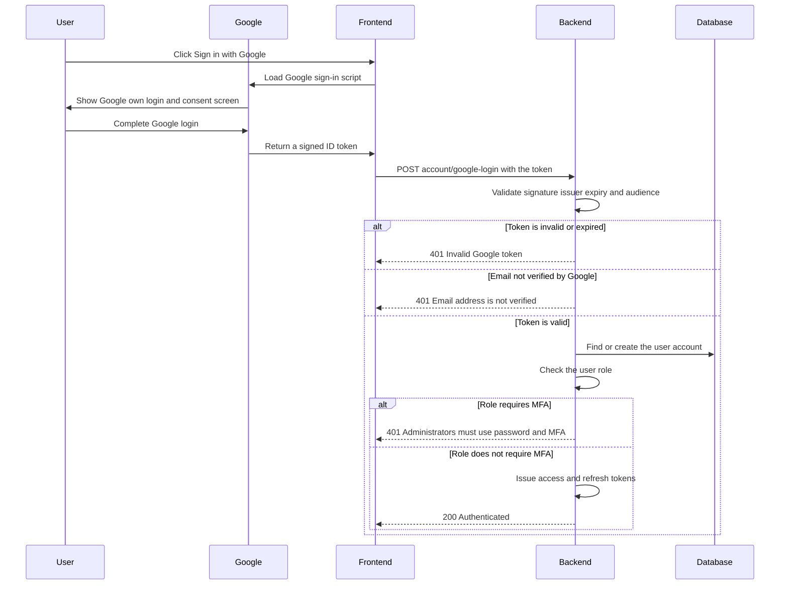

# 🔑 LiliShop Security Series — Part 3: The JWT Forgery Vulnerability in Google Sign-In

> How a one-line shortcut — decoding a token instead of verifying it — turned LiliShop's "Sign in with Google" button into a way to log in as *anyone*, including an administrator, with nothing but a text editor. This document walks through the vulnerability, the attack, and the fix, using LiliShop's real backend (ASP.NET Core) and frontend (Angular) code throughout.

This document assumes **no prior knowledge of JWTs, OAuth, or cryptographic signing**. Every concept is explained in plain English the first time it appears.

> [!NOTE]
> This is **Part 3** of the LiliShop security series. Part 1 covered brute-force protection; Part 2 covered admin multi-factor authentication. This document covers a different door into the same login system — "Sign in with Google" — and a vulnerability that, left unfixed, would have let an attacker walk straight past both of the defenses built in Parts 1 and 2.

---

## 📑 Table of Contents

1. [Introduction](#1-introduction)
2. [Core Concepts](#2-core-concepts)
   - [2.1 What Is a JWT?](#21-what-is-a-jwt)
   - [2.2 What Does "Signing" a Token Actually Mean?](#22-what-does-signing-a-token-actually-mean)
   - [2.3 What Is "Sign in with Google," Technically?](#23-what-is-sign-in-with-google-technically)
   - [2.4 The Vulnerability Class: JWT Forgery](#24-the-vulnerability-class-jwt-forgery)
3. [The Problem: Decoding Instead of Verifying](#3-the-problem-decoding-instead-of-verifying)
4. [Anatomy of the Attack](#4-anatomy-of-the-attack)
5. [The Fix: `GoogleLoginAsync`](#5-the-fix-googleloginasync)
   - [5.1 Guarding the Input](#51-guarding-the-input)
   - [5.2 `ValidateAsync` — The Four Real Checks](#52-validateasync--the-four-real-checks)
   - [5.3 The Email-Verified Check](#53-the-email-verified-check)
   - [5.4 Provisioning a New User](#54-provisioning-a-new-user)
   - [5.5 Closing the MFA Bypass for Admins](#55-closing-the-mfa-bypass-for-admins)
   - [5.6 Issuing Tokens](#56-issuing-tokens)
6. [Why `Google.Apis.Auth`? Never Roll Your Own Crypto](#6-why-googleapisauth-never-roll-your-own-crypto)
7. [The Frontend: How the Token Actually Gets Created](#7-the-frontend-how-the-token-actually-gets-created)
   - [7.1 Loading Google's Sign-In Script](#71-loading-googles-sign-in-script)
   - [7.2 Initializing and Rendering the Button](#72-initializing-and-rendering-the-button)
   - [7.3 Handling the Credential Response](#73-handling-the-credential-response)
8. [The Complete End-to-End Flow](#8-the-complete-end-to-end-flow)
9. [Advantages & Residual Considerations](#9-advantages--residual-considerations)
10. [Glossary](#10-glossary)
11. [Appendix: Before & After](#11-appendix-before--after)

---

## 1. Introduction

"Sign in with Google" is a convenience feature. Instead of creating a new password just for LiliShop, a customer can click one button, and — because they're already logged into Google in their browser — be signed into LiliShop instantly. No new password to remember, no email confirmation step, because Google has already done that work.

For this to be secure, LiliShop has to solve one specific problem every time someone clicks that button: **how does the backend know the person on the other end of this request really did just authenticate with Google, and isn't simply lying about it?**

The answer Google provides is a signed token — proof, cryptographically sealed by Google itself, that says "this person really did just sign in with this Google account." LiliShop's job is to check that seal before trusting anything the token claims.

The original implementation skipped that check entirely. This document explains exactly what that means, why it's dangerous, what it's called, and how the real fix works.

> [!WARNING]
> Before this fix, LiliShop's Google sign-in endpoint would authenticate **any email address, for any user, including administrators**, based solely on a claim inside a token that was never cryptographically verified. This is covered in full in Section 3 and 4.

---

## 2. Core Concepts

### 2.1 What Is a JWT?

**JWT** stands for **JSON Web Token**. It's a specific, standardized format for packaging a set of claims (small facts, like "this user's email is x@example.com") in a way that can be checked for authenticity later.

A JWT is just a plain text string made of three parts, separated by dots:

```
header.payload.signature
```

Each of the first two parts — `header` and `payload` — is just a JSON object, encoded in a text format called Base64URL. Here's the crucial thing to understand, because it's the heart of this entire vulnerability:

> [!IMPORTANT]
> **Base64URL encoding is not encryption. It's not even close.** It's a reversible text transformation, similar to writing something in a slightly unusual alphabet. Anyone — a browser, a script, a human with an online decoder — can decode the header and payload of *any* JWT and read exactly what's inside, instantly. There is no secret required to *read* a JWT.

So if reading a JWT tells you nothing about whether it's genuine, what actually proves authenticity? That's the third part: the **signature**.

### 2.2 What Does "Signing" a Token Actually Mean?

Think of it like a wax seal on a royal letter. Anyone can read the letter's contents — the wax seal doesn't hide anything. What the seal proves is that *only the king*, who holds the one unique royal signet ring, could have pressed that exact seal into the wax. A forger can write any letter they like, but they can't produce a genuine seal without the ring.

A cryptographic signature works the same way, using a **private key** (Google's "ring," which only Google holds) and a matching **public key** (freely published, which anyone can use to check a seal, but never to make one). When Google issues a token, it signs the header and payload using its private key. Anyone who wants to verify that token — including LiliShop's backend — fetches Google's freely published public key and checks: *"does this signature actually match, for this exact header and payload, using Google's key?"*

If even one character of the header or payload changes, the signature check fails. This is what makes a JWT tamper-evident: you can read it freely, but you cannot alter it — or forge a brand-new one — without holding the private key.

**The critical takeaway:** decoding a JWT tells you what it *claims*. Verifying its signature tells you whether those claims are *actually true*. These are two completely different operations, and confusing them is exactly what went wrong here.

### 2.3 What Is "Sign in with Google," Technically?

When a user clicks "Sign in with Google," here's what actually happens, at a high level:

1. Google itself handles the login — checking the user's Google password, their own MFA if they have it, all on Google's servers, never touching LiliShop at all.
2. Once Google is satisfied the user is who they say they are, Google creates a JWT — called an **ID token** — containing claims like the user's email, name, and whether that email is verified.
3. Google signs this ID token with Google's own private key.
4. Google hands this signed ID token back to the browser, which passes it along to LiliShop's frontend.
5. LiliShop's frontend sends that token to LiliShop's *backend*.
6. **This is the step that matters:** the backend must verify the token's signature is genuinely Google's before trusting a single claim inside it.

Step 6 is the entire point of this document. Everything before it — Google's own login screen, Google's own signing process — was never the problem. The problem was entirely on LiliShop's side, in how (or rather, whether) that final check was performed.

### 2.4 The Vulnerability Class: JWT Forgery

This vulnerability has a name at two levels of precision, and it's worth knowing both.

**The broad, official category:** OWASP (the organization that publishes the industry-standard security checklists referenced throughout this series) classifies this as **Broken Authentication** — specifically **API2:2023** in the OWASP API Security Top 10, and **A07:2021 (Identification and Authentication Failures)** in the general OWASP Top 10. This is the umbrella term covering many different authentication bugs, not just this one.

**The specific mechanism:** this particular flavor is called **JWT forgery** — accepting the claims inside a token without ever checking the signature that's supposed to guarantee those claims are genuine. It's closely related to a well-documented historical pattern called the **"alg:none" attack**, where a poorly-configured JWT library can be tricked into accepting a token whose header simply claims `"alg": "none"` — telling the library "there is no signature to check," which some libraries, disastrously, used to just believe.

LiliShop's original bug was actually a step *beyond* the classic "alg:none" attack: the code being used, `JwtSecurityTokenHandler.ReadToken()`, doesn't perform *any* validation regardless of what the token's header claims. It wasn't tricked into skipping the check — the check was simply never written at all.

---

## 3. The Problem: Decoding Instead of Verifying

Here is what the original code did, before this fix (this exact pattern no longer exists in LiliShop's codebase — it's shown here purely to illustrate what the vulnerability looked like):

```csharp
var handler = new JwtSecurityTokenHandler();
var jsonToken = handler.ReadToken(tokenDto.Token) as JwtSecurityToken;
var email = jsonToken?.Claims.FirstOrDefault(c => c.Type == "email")?.Value;
// ... proceeds to find-or-create a user account using this email, and log them in ...
```

Look closely at what `ReadToken()` actually does versus what its name might suggest it does. `ReadToken()` **parses** a JWT — it splits the string on its dots, Base64URL-decodes the header and payload, and hands you back the resulting JSON as objects you can read in C#. That is its *entire* job.

Here's the complete list of things `ReadToken()` does **not** check:

| Check | What it would confirm | Did `ReadToken()` perform it? |
|---|---|---|
| **Signature** | The token was genuinely signed by Google's private key | ❌ No |
| **Issuer** | The token actually came from `accounts.google.com` | ❌ No |
| **Audience** | The token was issued specifically for LiliShop, not some other app | ❌ No |
| **Expiry** | The token hasn't expired | ❌ No |

Every single one of these was skipped. The code trusted the `email` claim inside the token purely because it was *present*, with zero verification that the token — or the claim inside it — was ever actually produced by Google.

> [!CAUTION]
> This is the single most important sentence in this document: **a JWT that hasn't had its signature verified is not a proof of anything.** It's just a piece of text formatted to look like a JWT. Reading claims out of an unverified token and trusting them is functionally identical to reading claims out of a text file the attacker uploaded themselves.

---

## 4. Anatomy of the Attack

Because a JWT's header and payload are just Base64URL-encoded JSON — readable and, crucially, **constructible** by anyone — an attacker doesn't need any special tools to forge one. A text editor and a Base64 encoder are sufficient. Here is what a forged token aimed at the old endpoint would have looked like, decoded for readability:

**Header:**
```json
{ "alg": "none", "typ": "JWT" }
```

**Payload:**
```json
{
  "email": "admin@lilishop.com",
  "email_verified": true,
  "name": "Forged Admin",
  "iss": "https://accounts.google.com"
}
```

**Signature:**
```
(left empty, or filled with arbitrary garbage — it made no difference)
```

The attacker Base64URL-encodes these two JSON objects, joins them with dots, and sends the result as `tokenDto.Token` to the old `/api/account/google-login` endpoint. `ReadToken()` decodes it, pulls out `"admin@lilishop.com"` as the email claim, and — because an account with that email genuinely exists in LiliShop's database (it's the real administrator's account) — the attacker is authenticated as that administrator. No password guessed, no Google account compromised, no cryptographic key broken. Just a hand-built string that was never checked.

### Business impact

This is about as severe as a vulnerability gets. An attacker with this technique could:

- Log in as **any** existing user by simply knowing (or guessing common patterns for) their email address.
- Log in as an **administrator or SuperAdmin**, gaining full control over discounts, all customer orders, and the store itself.
- Trigger **account creation**: if the claimed email doesn't already exist, the original code's find-or-create logic would happily create a brand-new account for that email — meaning an attacker could also mint accounts at will.

Note also that this bypass sits entirely *outside* the defenses documented in Parts 1 and 2 of this series. Rate limiting and account lockout (Part 1) only apply to the password-based login endpoint — they never see this traffic at all. MFA (Part 2) never enters the picture either, because MFA is a step inside the *password* login flow; this endpoint issued a token directly, without ever touching that gate. A perfectly-configured brute-force defense and a perfectly-implemented MFA system would have done nothing to stop this — which is exactly why this vulnerability was rated Critical on its own, independent of everything else in the audit.

---

## 5. The Fix: `GoogleLoginAsync`

Here is LiliShop's real, current implementation, in full. The rest of this section walks through it piece by piece.

```csharp
public virtual async Task<OperationResult<UserDto>> GoogleLoginAsync(GoogleTokenDto tokenDto)
{
    if (tokenDto is null || string.IsNullOrWhiteSpace(tokenDto.Token))
    {
        return OperationResult.Failure<UserDto>(ErrorCode.InvalidData, "The Google token is missing.");
    }

    // SECURITY: Cryptographically validate the Google ID token instead of merely decoding it.
    // ValidateAsync verifies Google's signature, issuer and expiry. When the ClientId is configured
    // it is enforced as the audience, so tokens minted for a different application are rejected.
    // (Previously the token was read with JwtSecurityTokenHandler.ReadToken, which validates NOTHING —
    //  allowing anyone to forge an unsigned token and authenticate as any user.)
    GoogleJsonWebSignature.Payload payload;
    try
    {
        var settings = new GoogleJsonWebSignature.ValidationSettings();

        var googleClientId = _configuration["Authentication:Google:ClientId"];
        if (!string.IsNullOrWhiteSpace(googleClientId))
        {
            settings.Audience = new[] { googleClientId };
        }

        payload = await GoogleJsonWebSignature.ValidateAsync(tokenDto.Token, settings);
    }
    catch (InvalidJwtException ex)
    {
        _logger.LogWarning(ex, "Rejected an invalid Google ID token.");
        return OperationResult.Failure<UserDto>(ErrorCode.AuthorizationRequired, "Invalid Google token.");
    }

    if (!payload.EmailVerified || string.IsNullOrEmpty(payload.Email))
    {
        return OperationResult.Failure<UserDto>(ErrorCode.AuthorizationRequired, "The Google account email address is not verified.");
    }

    var email = payload.Email;
    var name = payload.Name;

    var user = await _userManager.FindByEmailAsync(email);
    if (user is null)
    {
        user = new ApplicationUser
        {
            DisplayName = name ?? string.Empty,
            Email = email,
            UserName = email,
            EmailConfirmed = true // Google has already verified ownership of this email address.
        };

        var createdUser = await _userManager.CreateAsync(user);
        if (!createdUser.Succeeded)
        {
            return OperationResult.Failure<UserDto>(ErrorCode.CreationFailed, "An error occurred while creating the object in the database.");
        }

        await _userManager.AddToRoleAsync(user, Role.Standard);
    }

    var role = await user.GetRoleAsync(_userManager);

    // F14.2 — Google sign-in is single-factor and carries no TOTP code, so it must not become an MFA
    // bypass for privileged accounts. Administrators are required to use the email/password + MFA flow.
    if (IsMfaRequiredForRole(role))
    {
        _logger.LogWarning("Google sign-in blocked for an MFA-required administrator account. UserId={UserId}", user.Id);
        return OperationResult.Failure<UserDto>(ErrorCode.AuthorizationRequired,
            "Administrator accounts must sign in with email, password, and an authenticator code.");
    }

    var token = await _tokenService.CreateAccessTokenAsync(user);
    var refreshToken = await _tokenService.CreateRefreshTokenAsync(user);

    _tokenService.SetRefreshTokenCookie(refreshToken);

    var result = new UserDto
    {
        Id = user.Id,
        DisplayName = user.DisplayName,
        Token = token,
        Email = user.Email,
        Role = role,
        EmailConfirmed = user.EmailConfirmed
    };

    return OperationResult.Success<UserDto>(result);
}
```

### 5.1 Guarding the Input

```csharp
if (tokenDto is null || string.IsNullOrWhiteSpace(tokenDto.Token))
{
    return OperationResult.Failure<UserDto>(ErrorCode.InvalidData, "The Google token is missing.");
}
```

A simple defensive check before any real work happens: if there's no token at all, fail immediately with a clear error rather than letting a null or empty string travel further into the method.

### 5.2 `ValidateAsync` — The Four Real Checks

This is the line that replaces the entire vulnerability:

```csharp
payload = await GoogleJsonWebSignature.ValidateAsync(tokenDto.Token, settings);
```

Unlike `ReadToken()`, this method — provided by Google's own official library — performs genuine cryptographic verification. Internally, it does all of the following, and throws an `InvalidJwtException` if any single one fails:

1. **Fetches Google's current public signing keys** (Google rotates these periodically; the library handles fetching the current, valid set automatically).
2. **Verifies the signature** — confirms the token's header and payload were genuinely signed using Google's corresponding private key, and haven't been altered since.
3. **Verifies the issuer** — confirms the `iss` claim is actually `accounts.google.com` (or Google's equivalent), not some other party claiming to be Google.
4. **Verifies the expiry** — confirms the token's `exp` claim hasn't already passed.

And, when configured, a fifth check:

```csharp
var googleClientId = _configuration["Authentication:Google:ClientId"];
if (!string.IsNullOrWhiteSpace(googleClientId))
{
    settings.Audience = new[] { googleClientId };
}
```

5. **Verifies the audience** — confirms this specific token was issued *for LiliShop's own Google Client ID*, not for some other application that also happens to use "Sign in with Google." Without this, a token that's completely genuine — signed by Google, for a real user — but originally intended for a *different* website could, in principle, be replayed against LiliShop.

> [!NOTE]
> Audience validation is conditional here: `settings.Audience` is only set when `Authentication:Google:ClientId` is actually configured. If that setting is missing in a given environment, the other four checks (signature, issuer, expiry) still run — the token still must be genuinely, currently valid and issued by Google — but this specific "was it meant for *us*" check is skipped. This is a documented, known residual: setting the Client ID in every environment (especially production) is what closes this last gap completely.

Every one of these checks is exactly the kind of thing that's easy to get subtly wrong by hand — which is precisely why Section 6 explains why this uses Google's library rather than custom code.

### 5.3 The Email-Verified Check

```csharp
if (!payload.EmailVerified || string.IsNullOrEmpty(payload.Email))
{
    return OperationResult.Failure<UserDto>(ErrorCode.AuthorizationRequired, "The Google account email address is not verified.");
}
```

This check is different in kind from the four above — it's not about whether the *token* is genuine (that's already settled by this point), but about a fact *inside* the token: does Google itself consider this email address confirmed? Google sets `email_verified` to `false` in cases like a Google Workspace account where the administrator hasn't confirmed the address, or certain third-party-linked accounts. LiliShop treats an unverified email as insufficient — since the whole reason `EmailConfirmed` gets set to `true` a few lines later is the trust that Google already did that verification work.

### 5.4 Provisioning a New User

```csharp
var user = await _userManager.FindByEmailAsync(email);
if (user is null)
{
    user = new ApplicationUser
    {
        DisplayName = name ?? string.Empty,
        Email = email,
        UserName = email,
        EmailConfirmed = true // Google has already verified ownership of this email address.
    };
    // ... create, assign Standard role ...
}
```

If no existing account matches this email, LiliShop creates one automatically — this is the "sign up with Google" behavior baked into the same endpoint as "sign in with Google." Notice `EmailConfirmed = true` is set directly, with no separate confirmation email sent. This is safe specifically *because* of the checks in Sections 5.2 and 5.3: by this point in the method, the code has cryptographic proof the email came from a real, currently-issued Google token, *and* proof that Google itself considers that email verified. Skipping LiliShop's own email-confirmation step is a reasonable shortcut here — but only because it's standing on the verified result of someone else's (Google's) confirmation work, not skipping verification altogether.

Every newly-created account is assigned the `Standard` role — Google sign-in never creates an admin account on its own.

### 5.5 Closing the MFA Bypass for Admins

```csharp
var role = await user.GetRoleAsync(_userManager);

// F14.2 — Google sign-in is single-factor and carries no TOTP code, so it must not become an MFA
// bypass for privileged accounts. Administrators are required to use the email/password + MFA flow.
if (IsMfaRequiredForRole(role))
{
    _logger.LogWarning("Google sign-in blocked for an MFA-required administrator account. UserId={UserId}", user.Id);
    return OperationResult.Failure<UserDto>(ErrorCode.AuthorizationRequired,
        "Administrator accounts must sign in with email, password, and an authenticator code.");
}
```

This is worth pausing on, because it's easy to assume that once a token is *cryptographically verified*, the security story is finished. It isn't. Even a perfectly genuine, perfectly verified Google token only ever proves **one factor**: that this person controls this Google account. It carries no TOTP code, no concept of a second factor at all.

If this check didn't exist, an attacker who managed to compromise an admin's *Google* account through any means (phishing Google's own login page, for instance — a completely separate attack from anything in this document) could sign into LiliShop as that admin with a single click, skipping the entire MFA system documented in Part 2. This check is what Part 2, Section 9 refers to as "closing the Google bypass" — seen here from the code that actually enforces it. `IsMfaRequiredForRole` is the exact same helper method used in the password-based login flow, so the rule — MFA is mandatory for `Administrator` and `SuperAdmin` — is defined in exactly one place and applied consistently across both login paths.

### 5.6 Issuing Tokens

```csharp
var token = await _tokenService.CreateAccessTokenAsync(user);
var refreshToken = await _tokenService.CreateRefreshTokenAsync(user);
_tokenService.SetRefreshTokenCookie(refreshToken);
```

Only once every prior check has passed — token verified, email confirmed by Google, and (if applicable) the MFA gate cleared — does the method actually create a session. This is the same "no shortcuts to a token" discipline seen throughout the password-login flow in Part 2: there is no code path here where a partially-verified request ends up with a valid access token.

---

## 6. Why `Google.Apis.Auth`? Never Roll Your Own Crypto

This is the same principle that showed up in Part 2 with TOTP: LiliShop doesn't hand-write the cryptography here either. `Google.Apis.Auth` is Google's own official .NET library, and `GoogleJsonWebSignature.ValidateAsync` is the method it provides specifically for this purpose.

Here's what correctly implementing signature verification *by hand* would actually require:

- Fetching Google's public signing keys from Google's published endpoint.
- Correctly matching the right key to the token (Google publishes multiple keys and rotates them; the token's header indicates which one was used).
- **Re-fetching and caching those keys correctly** as Google rotates them over time, without ever using a stale or wrong key.
- Implementing the actual signature-verification algorithm precisely to spec.
- Correctly parsing and checking every one of the standard JWT claims (`iss`, `aud`, `exp`, and others) against the right values, in the right way.
- Avoiding a whole class of subtle "algorithm confusion" attacks, where a maliciously crafted token tries to trick a verifier into using the wrong verification method entirely.

Any single mistake in that list reopens some version of the exact vulnerability this document describes. Using Google's own maintained library means Google's own security engineers — who built the token format in the first place — are responsible for getting these details right, and for keeping them right as standards evolve. This is the same reasoning Part 2 gave for leaning on ASP.NET Core Identity's TOTP implementation rather than writing custom time-based code: **cryptography is one of the few areas in software where "write it yourself" is almost always the wrong call**, even for an experienced developer.

---

## 7. The Frontend: How the Token Actually Gets Created

Everything in Sections 3–6 assumes a token has already arrived at the backend. This section covers where that token actually comes from — LiliShop's Angular frontend, in `RegisterComponent`.

### 7.1 Loading Google's Sign-In Script

```typescript
private loadGoogleScript(): void {
  const googleScript = document.createElement('script');
  googleScript.src = 'https://accounts.google.com/gsi/client';
  googleScript.async = true;
  googleScript.defer = true;
  googleScript.onload = () => this.initializeGoogleSignIn();
  document.body.appendChild(googleScript);
}
```

This loads Google's own JavaScript library directly from Google's servers — LiliShop doesn't implement any part of Google's actual sign-in UI itself. Once the script finishes loading, `initializeGoogleSignIn()` runs.

### 7.2 Initializing and Rendering the Button

```typescript
private initializeGoogleSignIn(): void {
  google.accounts.id.initialize({
    client_id: this.clientId,
    callback: this.handleCredentialResponse.bind(this),
    auto_select: false,
    cancel_on_tap_outside: true,
  });

  const buttonDiv = document.getElementById('buttonDiv');
  if (buttonDiv) {
    google.accounts.id.renderButton(buttonDiv, {
      theme: 'outline',
      size: 'large',
      shape: 'rectangular',
      width: '100%',
    });
  }

  google.accounts.id.prompt((_n: PromptMomentNotification) => {});
}
```

Two things worth noticing:

- **`client_id: this.clientId`** — this is LiliShop's own Google Client ID, the same value that (when configured) becomes the `Audience` check on the backend in Section 5.2. It tells Google's script "identify yourself as LiliShop when you talk to Google," and it's what allows the backend to later confirm a token was genuinely minted *for this app*.
- **`callback: this.handleCredentialResponse.bind(this)`** — this registers the function that Google's own script will call once a user successfully signs in. LiliShop's code never handles the actual username/password/consent screen at all; that entire experience is rendered and controlled by Google, inside Google's own script.

### 7.3 Handling the Credential Response

```typescript
private handleCredentialResponse(response: CredentialResponse): void {
  this.accountService.LoginWithGoogle(response.credential).subscribe({
    next: (user: IUser) => {
      this.accountService.updateCurrentUserState(user);
      this.ngZone.run(() => this.router.navigateByUrl('/shop'));
    },
    error: (error: any) => {
      // Administrator accounts are blocked from single-factor Google sign-in by the backend (they must
      // use email + password + MFA). Show the backend message cleanly rather than failing silently.
      const message =
        error?.error?.detail ||
        error?.error?.title ||
        'Google sign-in could not be completed. Please try again.';
      this.ngZone.run(() => this.errors.set([message]));
    },
  });
}
```

`response.credential` is the ID token — the exact JWT described throughout this document, already signed by Google before it ever reaches LiliShop's code. Look closely at what this function does with it: **nothing**. It doesn't decode it, doesn't inspect any claims, doesn't make any trust decisions about it at all. It simply forwards that token, unopened, straight to the backend via `LoginWithGoogle(response.credential)`.

This mirrors a pattern from Part 2: recall that `mfa-verify.component` never verifies a TOTP code itself — it just collects what the user typed and sends it to the backend, which remains the single source of truth for every authentication decision. The exact same discipline applies here. The frontend's only job is to relay Google's token; the backend's `GoogleLoginAsync` is the only place any trust decision actually gets made. If the frontend ever tried to make its own judgment about whether a token looked valid, that logic could be bypassed entirely by simply calling the backend endpoint directly — so correctly, there is no such logic here to bypass.

The `error` handler is the frontend counterpart to Section 5.5: when an admin's Google sign-in gets rejected by the backend's MFA-required check, this is exactly where that message surfaces — read directly from the backend's response and shown to the user, rather than being silently swallowed.

---

## 8. The Complete End-to-End Flow

Here's everything from Sections 5 and 7 tied together — the full journey from clicking the button to either a completed login or a clean rejection.



Notice that LiliShop's own frontend code appears in exactly two places on this diagram: loading Google's script, and forwarding the resulting token. Every trust decision — is this token real, is the email verified, does this role require MFA — happens entirely inside the backend's `GoogleLoginAsync`.

---

## 9. Advantages & Residual Considerations

### ✅ Advantages

- **Delegates identity verification to Google's own infrastructure.** LiliShop never sees or handles a Google password; Google's own login protections (including any MFA the user has set up *on their Google account*) apply before LiliShop is ever involved.
- **Built on an officially maintained library, not custom cryptography.** `Google.Apis.Auth` is maintained by Google itself, and updated as key rotation and signing standards evolve — LiliShop doesn't have to track that maintenance burden.
- **Consistent design with the rest of the login system.** The same core discipline seen in Part 2 — never trust a client-supplied claim without independently verifying it server-side — is applied here identically. The frontend relays; the backend verifies. Nothing is trusted just because it arrived over the network looking correctly formatted.
- **No separate password to protect for this login path.** A customer using only Google sign-in has no LiliShop-specific password that could itself be phished, reused, or leaked from LiliShop's own database.

### ⚠️ Residual Considerations

- **Audience validation depends on configuration.** As covered in Section 5.2, the `Audience` check only runs when `Authentication:Google:ClientId` is set. In an environment where that value is missing, signature/issuer/expiry are still verified — the token must still be genuinely, currently valid — but the "was this token meant for LiliShop specifically" check is skipped. Confirming this setting is populated in every deployed environment, especially production, is what closes this gap fully.
- **Google sign-in remains single-factor by design, not by oversight.** This isn't a flaw to fix — it's an accepted, deliberate trade-off, which is exactly why Section 5.5's MFA block exists for admin-tier accounts. For `Standard` customer accounts, the risk this represents is judged acceptable, matching the same risk-based reasoning Part 2 used to decide who needs MFA in the first place.
- **The security boundary stops at "did Google verify this correctly."** If a user's actual Google account is ever compromised (through a phishing attack against Google's own login page, for instance), LiliShop's Google sign-in would correctly authenticate that attacker — because, cryptographically, they really did just complete a legitimate Google login. This is inherent to how federated login works everywhere, not specific to LiliShop, and it's the exact scenario Section 5.5's admin block exists to contain for the highest-privilege accounts.

---

## 10. Glossary

| Term | Meaning |
|---|---|
| **JWT (JSON Web Token)** | A text format for packaging claims (small facts) in a way whose authenticity can be cryptographically checked |
| **Claim** | A single fact inside a JWT's payload, such as an email address or an expiry time |
| **Signature** | The third part of a JWT, proving the header and payload were produced by whoever holds the matching private key, and haven't been altered since |
| **Private key** | A secret value only the issuer (here, Google) holds, used to create a genuine signature |
| **Public key** | A freely published value anyone can use to check a signature, but never to create one |
| **Base64URL encoding** | A reversible text encoding used for JWT parts. It is not encryption — anyone can decode it |
| **Issuer (`iss`)** | The claim identifying who created the token — checked to confirm it's genuinely Google |
| **Audience (`aud`)** | The claim identifying which application the token was issued for |
| **ID token** | The specific kind of JWT Google issues after a successful sign-in, containing the user's identity claims |
| **JWT forgery** | Constructing a JWT by hand and having it trusted because its signature was never checked |
| **"alg:none" attack** | A historical, related JWT attack where a token's header claims no signing algorithm was used, and a vulnerable verifier accepts it anyway |
| **Broken Authentication** | The broad OWASP category (API2:2023 / A07:2021) covering authentication flaws in general, including JWT forgery |
| **`Google.Apis.Auth`** | Google's official .NET library for verifying Google-issued tokens correctly |

---

## 11. Appendix: Before & After

| | Before (vulnerable) | After (fixed) |
|---|---|---|
| **Method used** | `JwtSecurityTokenHandler.ReadToken()` | `GoogleJsonWebSignature.ValidateAsync()` |
| **Signature checked?** | ❌ No | ✅ Yes |
| **Issuer checked?** | ❌ No | ✅ Yes |
| **Expiry checked?** | ❌ No | ✅ Yes |
| **Audience checked?** | ❌ No | ✅ Yes (when `ClientId` is configured) |
| **Email-verified checked?** | ❌ No | ✅ Yes |
| **Could a forged token authenticate a user?** | ✅ Yes — trivially | ❌ No |
| **Could an admin bypass MFA via this path?** | ✅ Yes | ❌ No — explicitly blocked |
| **OWASP classification** | API2:2023 / A07:2021 — Broken Authentication (Critical) | Resolved |

```csharp
// BEFORE — decodes only, verifies nothing
var jsonToken = handler.ReadToken(tokenDto.Token) as JwtSecurityToken;
var email = jsonToken?.Claims.FirstOrDefault(c => c.Type == "email")?.Value;
```

```csharp
// AFTER — cryptographically verifies signature, issuer, expiry, and (when configured) audience
payload = await GoogleJsonWebSignature.ValidateAsync(tokenDto.Token, settings);
if (!payload.EmailVerified || string.IsNullOrEmpty(payload.Email)) { /* reject */ }
```

---

<div align="center">

*Part 3 of the LiliShop security series. This document uses LiliShop's real backend and frontend code as its running example throughout.*

</div>
