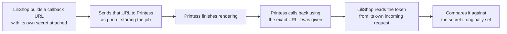
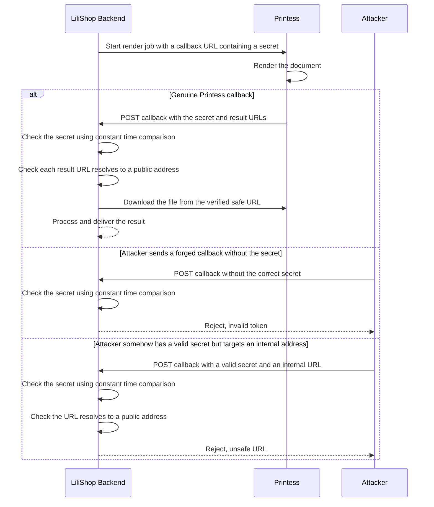

# 🌐 LiliShop Security Series — Part 4: Server-Side Request Forgery (SSRF) — The Printess Callback

> How an endpoint designed to receive good news from a trusted partner — "your document is ready" — could have been tricked into fetching whatever an attacker wanted, from wherever LiliShop's own server could reach. This document explains what SSRF is, why the Printess callback was exposed to it, and how LiliShop's real defense works, layer by layer.

This document assumes **no prior knowledge of SSRF, DNS, or network addressing**. Every concept is explained in plain English the first time it appears, using LiliShop's real backend (ASP.NET Core) and frontend (Angular) code throughout.

> [!NOTE]
> This is **Part 4** of the LiliShop security series. Parts 1–3 covered brute-force protection, admin MFA, and the Google Sign-In JWT forgery fix — all defenses around *who is allowed in*. This document is different in kind: it's about a server-to-server integration, where the danger isn't a person logging in, but LiliShop's own server being tricked into fetching something it shouldn't.

---

## 📑 Table of Contents

1. [Introduction](#1-introduction)
2. [Core Concepts](#2-core-concepts)
   - [2.1 What Is SSRF?](#21-what-is-ssrf)
   - [2.2 Why Servers Are a Different Kind of Target Than Browsers](#22-why-servers-are-a-different-kind-of-target-than-browsers)
   - [2.3 The Cloud Metadata Attack](#23-the-cloud-metadata-attack)
   - [2.4 Two Different Questions, Two Different Defenses](#24-two-different-questions-two-different-defenses)
3. [Why This Endpoint Exists: Polling vs. Callback](#3-why-this-endpoint-exists-polling-vs-callback)
4. [Layer 1: Authenticating the Callback](#4-layer-1-authenticating-the-callback)
   - [4.1 The Secret's Round Trip](#41-the-secrets-round-trip)
   - [4.2 `IsValidCallbackToken`](#42-isvalidcallbacktoken)
   - [4.3 Why Constant-Time Comparison?](#43-why-constant-time-comparison)
5. [Layer 2: Validating the URL Itself](#5-layer-2-validating-the-url-itself)
   - [5.1 `IsSafePublicUrlAsync`](#51-issafepublicurlasync)
   - [5.2 `IsPrivateOrReserved` — The Blocked Ranges](#52-isprivateorreserved--the-blocked-ranges)
   - [5.3 A Concrete Attack, Illustrated](#53-a-concrete-attack-illustrated)
6. [Layer 3: The Safe Fetch Itself](#6-layer-3-the-safe-fetch-itself)
7. [Putting It Together: `ProcessCallbackResultAsync`](#7-putting-it-together-processcallbackresultasync)
8. [The Complete Flow](#8-the-complete-flow)
9. [A Known Residual: DNS Rebinding](#9-a-known-residual-dns-rebinding)
10. [The Frontend: Job-Isolated Delivery](#10-the-frontend-job-isolated-delivery)
11. [Advantages & Residual Considerations](#11-advantages--residual-considerations)
12. [Glossary](#12-glossary)
13. [Appendix: The Three Layers at a Glance](#13-appendix-the-three-layers-at-a-glance)

---

## 1. Introduction

LiliShop lets customers design custom printed products through Printess, a third-party rendering service. When a design is finished, Printess has to hand the finished file — a PDF or an image — back to LiliShop. One of the two ways this happens is a **callback**: Printess itself sends an HTTP request straight to LiliShop's server, saying "the job is done, here's where to download it."

That single sentence contains the entire problem this document is about. LiliShop's server, on receiving that message, has to go fetch a URL — and the *only* thing telling it which URL to fetch is the content of an incoming HTTP request. If nothing stops it, that server will dutifully fetch **whatever URL is written in that request**, whether it genuinely came from Printess or not, and whether it points somewhere safe or not.

> [!WARNING]
> Before this protection existed, LiliShop's Printess callback endpoint had no verification of *who* was calling it, and no check on *what* URL it was told to fetch. Anyone who found the endpoint could send a request claiming "your render is ready, download it from here" — and point "here" at anything LiliShop's own server could reach, including addresses that are completely invisible and unreachable from the public internet.

---

## 2. Core Concepts

### 2.1 What Is SSRF?

**SSRF** stands for **Server-Side Request Forgery**. Break the name down piece by piece: *Server-Side* means this happens on your server, not in a user's browser. *Request Forgery* means an attacker fakes — forges — the reason for a request your server makes, tricking it into fetching something on the attacker's behalf rather than for a legitimate purpose.

Here's a real-world analogy that makes this click. Imagine a hotel with a concierge who's trusted with a master key — they can fetch a package from *any* room in the building, including staff-only areas guests can never enter themselves. A legitimate guest asks: "Please bring me package #204 from the mailroom." The concierge, being trusted with building-wide access, fetches it and hands it over — no problem, that's exactly their job.

Now imagine the concierge takes requests from *anyone who can slip a note under the door*, without checking who wrote it. A guest could write: "Please go to the manager's office and bring me whatever's in the top drawer." The concierge — still just doing their job, still just fetching whatever's requested — walks into a room the guest could never have entered themselves, and hands the contents over. The concierge wasn't the real target. They were the *tool*, trusted with access the requester didn't have, and tricked into using that access on the requester's behalf.

That's SSRF. Your server is the concierge. It has network access a random visitor from the internet doesn't have. If an attacker can control *what URL your server fetches*, they can use your server's own access as a bridge into places they could never reach directly.

### 2.2 Why Servers Are a Different Kind of Target Than Browsers

It's worth pausing on why this is specifically a *server-side* problem, and not just "URLs are dangerous" in general.

When your own browser fetches a URL, it's making that request from your home internet connection — it can reach the public internet, and basically nothing else. If a malicious website tricks your browser into fetching a bad URL, the blast radius is limited to what your home network can see, which is usually just... the internet.

A server sitting inside a cloud provider's infrastructure is a completely different animal. It often has network routes to things that are *deliberately* invisible from the public internet — an internal database, an admin dashboard with no login screen because "well, only internal traffic can reach it," or a cloud provider's own internal services. These things are safe specifically *because* the public internet can't address them directly. SSRF breaks that assumption by using the server itself as the bridge.

### 2.3 The Cloud Metadata Attack

If you look back at the code from our earlier discussion, you'll notice a very specific IP address called out by name in the comments: `169.254.169.254`. This isn't an arbitrary example — it's arguably the single most famous SSRF target that exists, and it's worth understanding exactly why.

Major cloud providers (AWS, Azure, Google Cloud) run a small internal web service on every virtual machine, reachable *only* from that machine itself, at the address `169.254.169.254`. This service answers questions like "what cloud credentials does this machine currently have?" and "what role is this machine running as?" — genuinely useful for the machine's own software to configure itself automatically. It's never meant to be reachable from outside that one machine.

If an attacker can trick a cloud-hosted server into fetching `http://169.254.169.254/latest/meta-data/...` (the exact path varies by provider), the server will happily return live cloud credentials — potentially handing an attacker the keys to your entire cloud account, not just your application. This single address is responsible for a long list of real, high-profile breaches, which is exactly why it's called out explicitly in LiliShop's SSRF guard.

### 2.4 Two Different Questions, Two Different Defenses

LiliShop's defense against this asks two genuinely separate questions, and it's worth keeping them distinct before diving into the code:

1. **"Is this request actually from Printess?"** — This is about *authentication*. Anyone on the internet can send a POST request shaped like a Printess callback. Something has to verify the sender is really who they claim to be.
2. **"Even if this really is Printess, is the URL it's telling me to fetch actually safe?"** — This is about *validation*. Even a completely genuine callback from Printess should never be trusted to point somewhere dangerous without checking — because trusting a partner's *identity* is not the same thing as trusting every value they ever send you.

LiliShop answers question 1 with a callback secret (Section 4) and question 2 with URL validation (Section 5). Both exist, independently, because either one alone would leave a real gap.

---

## 3. Why This Endpoint Exists: Polling vs. Callback

`PrintessService.cs` actually offers *two* different ways to get a rendered document back, and understanding the difference is what makes clear why the callback path specifically needs this extra protection.

**Polling** (`BuildDocumentWithPollingAsync`) — LiliShop's server asks Printess to start rendering, then repeatedly asks "is it done yet?" in a loop, waiting up to 3 minutes:

```csharp
var timeout = DateTime.UtcNow.AddMinutes(3);
while (DateTime.UtcNow < timeout)
{
    var statusResponseRaw = await _httpClient.PostAsJsonAsync("production/status/get", statusRequest);
    statusResponse = await statusResponseRaw.Content.ReadFromJsonAsync<StatusResponse>();
    if (statusResponse?.IsFinalStatus == true) break;
    await Task.Delay(1000);
}
```

Here, LiliShop is always the one *initiating* every request. Printess never reaches out to LiliShop at all in this flow — there's no inbound door for anyone to knock on.

**Callback** (`BuildDocumentWithCallbackAsync`) — LiliShop tells Printess "call me back at this URL when you're done," and returns immediately:

```csharp
public async Task<string> BuildDocumentWithCallbackAsync(BuildDocumentRequestDto dto)
{
    var produceRequest = BuildProduceRequest(dto, isCallback: true);
    var response = await _httpClient.PostAsJsonAsync("production/produce", produceRequest);
    // ...
    return result.JobId;
}
```

This is faster and more efficient — no server sitting in a loop for up to 3 minutes — but it introduces something the polling flow never had: an **inbound** endpoint. Something out there on the internet is now allowed to send LiliShop's server a POST request unprompted, claiming to be Printess with a finished job. That inbound door is exactly what needs the two layers of defense covered next.

---

## 4. Layer 1: Authenticating the Callback

### 4.1 The Secret's Round Trip

Before looking at how the incoming callback gets checked, it helps to see where the secret it's checked *against* comes from. Look at `BuildCallbackUrl`, used when LiliShop first tells Printess where to call back:

```csharp
private string BuildCallbackUrl()
{
    var baseUrl = _options.CallbackUrl;
    if (string.IsNullOrEmpty(_options.CallbackSecret))
    {
        return baseUrl;
    }

    var separator = baseUrl.Contains('?') ? '&' : '?';
    return $"{baseUrl}{separator}token={Uri.EscapeDataString(_options.CallbackSecret)}";
}
```

This takes LiliShop's own configured callback URL and appends its own secret (`Printess:CallbackSecret`) as a query parameter, e.g. `https://lilishop.example.com/api/printessEditor/printess-callback?token=a-long-random-value`. This exact URL — secret included — is the one LiliShop hands to Printess when starting the job.

Here's the round trip that makes this work as authentication:



Printess never has to know anything special about this token — it's just faithfully calling back the URL it was handed, secret and all. LiliShop is really just checking: **"did whoever is calling me right now present the exact value I originally embedded in the URL I gave to Printess?"** Someone who never saw that original URL has no way to know the correct value to present.

### 4.2 `IsValidCallbackToken`

Here's the actual verification, run when a callback request arrives (the token would be read from the incoming request's query string, then handed to this method):

```csharp
public bool IsValidCallbackToken(string? providedToken)
{
    // Fail closed: if no secret is configured, reject all callbacks.
    if (string.IsNullOrEmpty(_options.CallbackSecret) || string.IsNullOrEmpty(providedToken))
    {
        _logger.LogWarning("Printess callback rejected: callback secret not configured or token absent.");
        return false;
    }

    var provided = Encoding.UTF8.GetBytes(providedToken);
    var expected = Encoding.UTF8.GetBytes(_options.CallbackSecret);

    var isValid = provided.Length == expected.Length &&
                  CryptographicOperations.FixedTimeEquals(provided, expected);

    if (!isValid)
    {
        _logger.LogWarning("Printess callback rejected: invalid callback token.");
    }

    return isValid;
}
```

Two design choices worth naming explicitly:

**Fail closed, not fail open.** If `CallbackSecret` isn't configured at all — say, in an environment where someone forgot to set it — the method doesn't shrug and allow every callback through. It rejects everything. This is the safer failure mode: a *misconfigured* system that rejects legitimate Printess callbacks is a bug you'll notice quickly (your renders stop working). A *misconfigured* system that silently accepts everyone is a security hole you might never notice at all.

**Length is checked before content.** `provided.Length == expected.Length` runs first. This isn't about security directly — it's a practical necessity, because the comparison method used next requires both inputs to be the same length to run at all.

### 4.3 Why Constant-Time Comparison?

`CryptographicOperations.FixedTimeEquals` is deliberately used here instead of an ordinary equality check like `provided.SequenceEqual(expected)` or `providedToken == _options.CallbackSecret`. This is worth explaining properly, because the reasoning is genuinely subtle.

A normal comparison typically checks values one piece at a time and **stops as soon as it finds a mismatch** — this is a completely sensible performance optimization for almost every use in software. But it creates an unexpected side effect: comparing two strings that share the first few characters takes *very slightly* longer than comparing two strings that differ immediately, because the comparison gets further before giving up.

Here's the concrete danger. Imagine the real secret starts with the letter `A`. An attacker sends thousands of guesses, all starting with different letters, and measures precisely how long each request takes to get rejected:

- A guess starting with `Z` fails on the very first character — fast rejection.
- A guess starting with `A` (matching the real first character) takes a *microscopically* longer time before failing on the second character — because the comparison got one step further before giving up.

By measuring these tiny timing differences over enough attempts, an attacker could — in principle — reconstruct the secret one character at a time, never having to guess the whole thing at once. This is called a **timing attack** (a specific kind of *side-channel attack*, so named because the attacker isn't breaking the cryptography itself, they're exploiting *timing* as an accidental side channel of information leaking out).

`FixedTimeEquals` is built specifically to take the same amount of time to run **no matter where, or whether, a mismatch occurs**. It always checks every byte, regardless of earlier mismatches, so the timing of the response reveals nothing about how much of the guess was correct. This closes that side channel entirely.

> [!TIP]
> A useful mental model: a normal comparison is like a bouncer who stops checking your ID the instant something looks wrong — fast, but the *speed* of the rejection itself leaks a clue. A constant-time comparison is a bouncer who always inspects the *entire* ID, top to bottom, no matter what, and only announces the verdict at the very end. Slower per-check, but the time it takes never gives anything away.

---

## 5. Layer 2: Validating the URL Itself

Even with the callback secret in place, LiliShop doesn't stop there. Section 2.4 already previewed why: a genuine, correctly-authenticated caller isn't automatically a *safe* one to blindly trust with every value they send. This layer checks the actual URL, independent of who sent it.

### 5.1 `IsSafePublicUrlAsync`

```csharp
private static async Task<bool> IsSafePublicUrlAsync(string? url)
{
    if (string.IsNullOrWhiteSpace(url) ||
        !Uri.TryCreate(url, UriKind.Absolute, out var uri) ||
        uri.Scheme != Uri.UriSchemeHttps)
    {
        return false;
    }

    try
    {
        var addresses = await Dns.GetHostAddressesAsync(uri.DnsSafeHost);
        return addresses.Length > 0 && addresses.All(ip => !IsPrivateOrReserved(ip));
    }
    catch
    {
        return false;
    }
}
```

**The format gate.** Before anything else, the URL must be non-empty, a valid absolute URL, and specifically `https`. That last check is doing more than blocking plain `http` — it excludes every other scheme entirely, including things like `file://`, which could otherwise be used to read files directly off the server's own disk rather than fetching anything over the network at all.

**The real check: resolve, then inspect the actual address.** This is the heart of the method, and the detail that's easy to get wrong if you tried to write this yourself. A hostname is just a label — `some-cdn.example.com` tells you nothing about safety on its own. What matters is the actual IP address that hostname resolves to *right now*, because that's what the connection will actually be made to.

```csharp
var addresses = await Dns.GetHostAddressesAsync(uri.DnsSafeHost);
return addresses.Length > 0 && addresses.All(ip => !IsPrivateOrReserved(ip));
```

Notice `.All(...)`, not `.Any(...)`. A single hostname can resolve to several IP addresses (common for load-balanced or geographically distributed services). This line requires **every single one** of those addresses to be safe — if even one resolved address is private or reserved, the whole URL is rejected. That's a deliberately conservative choice: better to occasionally reject a legitimate multi-address host than to let one dangerous address slip through because most of the others looked fine.

**Fail closed on errors, too.** If DNS resolution itself throws — the hostname doesn't exist, a DNS server is unreachable, whatever the reason — the `catch` block returns `false`. An error becomes a rejection, not an "I don't know, let's allow it and hope for the best."

### 5.2 `IsPrivateOrReserved` — The Blocked Ranges

```csharp
private static bool IsPrivateOrReserved(IPAddress ip)
{
    if (ip.IsIPv4MappedToIPv6)
    {
        ip = ip.MapToIPv4();
    }

    if (IPAddress.IsLoopback(ip))
    {
        return true;
    }

    var bytes = ip.GetAddressBytes();

    if (ip.AddressFamily == AddressFamily.InterNetwork)
    {
        return bytes[0] == 0
            || bytes[0] == 10
            || bytes[0] == 127
            || (bytes[0] == 169 && bytes[1] == 254)
            || (bytes[0] == 172 && bytes[1] >= 16 && bytes[1] <= 31)
            || (bytes[0] == 192 && bytes[1] == 168)
            || (bytes[0] == 100 && bytes[1] >= 64 && bytes[1] <= 127);
    }

    if (ip.AddressFamily == AddressFamily.InterNetworkV6)
    {
        return ip.IsIPv6LinkLocal
            || ip.IsIPv6SiteLocal
            || ip.IsIPv6Multicast
            || (bytes[0] & 0xFE) == 0xFC;
    }

    return true; // unknown address family -> treat as unsafe
}
```

Before the table, one setup line worth understanding: `IsIPv4MappedToIPv6`. Some systems represent an IPv4 address using a special IPv6-formatted wrapper (looking like `::ffff:192.168.1.1`). Without unwrapping this first, an attacker could potentially write a private IPv4 address in this disguised IPv6 form and slip past checks that only look for the plain IPv4 pattern. Unwrapping it first ensures every address gets checked the same way, however it was originally written.

Here's every range this method blocks, and why each one specifically matters:

| Range | Name | Why it's dangerous to allow |
|---|---|---|
| `127.0.0.0/8` (and `IsLoopback`) | **Loopback** | This means "talk to yourself." A URL pointing here would make LiliShop's server fetch from *itself* — potentially reaching internal-only endpoints on the very same machine that has no business being reachable from a Printess-shaped request. |
| `169.254.0.0/16` | **Link-local** | This is the range containing the cloud metadata address from Section 2.3 (`169.254.169.254`). Blocking this entire range is what stops the cloud-credential-theft attack. |
| `10.0.0.0/8`, `172.16.0.0/12`, `192.168.0.0/16` | **Private ranges** | These are the standard address blocks reserved for internal/private networks — the kind of addresses a company's internal database, admin tools, or other backend services typically live on, specifically *because* they're never meant to be reachable from the public internet. |
| `100.64.0.0/10` | **CGNAT** (Carrier-Grade NAT) | A range used internally by cloud providers and ISPs to network many machines behind shared infrastructure. Similar risk profile to the private ranges above — internal-only addressing that shouldn't be reachable from an external-facing fetch. |
| `0.0.0.0/8` | **"This network"** | A reserved, non-routable range with special meaning to networking software; never a legitimate destination for an outbound fetch. |
| IPv6 link-local, site-local, multicast | **IPv6 equivalents** | The same categories of risk as their IPv4 counterparts, just in IPv6's addressing scheme. |
| `fc00::/7` | **Unique Local Address (ULA)** | IPv6's rough equivalent of the IPv4 private ranges — internal-network-only addressing. |
| *(any unrecognized address family)* | — | Treated as unsafe by default, rather than assumed safe. Another instance of the same fail-closed philosophy seen throughout this defense. |

> [!IMPORTANT]
> Notice the overall shape of this method: it's a **blocklist of everything known to be dangerous**, and the code will reject a URL even if it merely resolves into one of these ranges — regardless of what the hostname claimed to be. This is a meaningfully different (and stronger) approach than trying to build an *allowlist* of "known good" hostnames, which would need constant maintenance as legitimate endpoints change, and would still be vulnerable to exactly the DNS-based trick this range-based approach closes.

### 5.3 A Concrete Attack, Illustrated

To make this tangible, here's what a malicious callback body might have looked like against the *unprotected* version of this endpoint (illustrative only — this exact request is now rejected by the two layers just covered):

```json
POST /api/printessEditor/printess-callback?token=guessed-or-missing
{
  "Result": {
    "P": [
      { "U": "http://169.254.169.254/latest/meta-data/iam/security-credentials/" }
    ]
  }
}
```

Two independent things now stop this. First, `IsValidCallbackToken` rejects it outright because the attacker doesn't have LiliShop's real secret — this request never even reaches the URL-fetching code. But suppose, hypothetically, an attacker *did* somehow obtain a valid token (say, through some other compromise entirely unrelated to this endpoint) — the URL itself would still be caught by `IsSafePublicUrlAsync`, because `http://` isn't `https://` for a start, and even correcting that, `169.254.169.254` resolves straight into the link-local range blocked by `IsPrivateOrReserved`. Two independent gates, either one of which alone would have stopped this specific attack.

---

## 6. Layer 3: The Safe Fetch Itself

```csharp
private async Task<byte[]> DownloadSafelyAsync(string? url)
{
    if (!await IsSafePublicUrlAsync(url))
    {
        _logger.LogWarning("Blocked an unsafe render-output download. Host={Host}", TryGetHost(url));
        throw new InvalidOperationException("Refusing to download from a disallowed or non-public URL.");
    }

    return await _downloadClient.GetByteArrayAsync(url!);
}
```

This method is the single place every actual download in this file goes through — check first, fetch only if the check passes. Two details worth calling out:

**It throws, rather than silently skipping.** If the check fails, this stops execution loudly with an exception, forcing whatever called it to treat this as a real failure rather than quietly continuing as if a file had been downloaded when it hadn't.

**The log only records the host, not the full URL.** `TryGetHost` extracts just the hostname for the log line, deliberately leaving out query strings or paths that might contain incidental sensitive detail. Enough information to spot an attack pattern in your logs, without dumping potentially sensitive URL contents into a log file.

There's one more layer of defense sitting quietly in the constructor, worth connecting back to:

```csharp
private static readonly HttpClient _downloadClient = new HttpClient();
// ...
_httpClient.DefaultRequestHeaders.Authorization = new AuthenticationHeaderValue("Bearer", _options.ServiceToken);
```

`DownloadSafelyAsync` fetches using `_downloadClient` — a completely separate `HttpClient` instance from `_httpClient`, which is the one carrying LiliShop's Printess API bearer token. This is defense-in-depth: even in some scenario where a URL somehow slipped past both checks above, the request fetching it still wouldn't be carrying LiliShop's own service credentials along for the ride. Two different jobs — talking to Printess's real API versus downloading a rendered file — get two different clients, on purpose, so a mistake in one context can't leak a credential meant for another.

---

## 7. Putting It Together: `ProcessCallbackResultAsync`

This is where everything above actually gets used, once a callback request has already passed the token check from Section 4:

```csharp
public async Task<(RenderResult? Result, string? FileType)> ProcessCallbackResultAsync(PrintessCallbackDto callback)
{
    string? fileType = null;
    RenderResult? result = null;

    if (callback.Result?.P is not null && callback.Result.P.Count > 1)
    {
        fileType = "zip";
        var zipBytes = await CreateZipFromUrlsAsync(callback.Result.P.Select(p => p.U).ToList(), "png");
        result = new RenderResult { FileBytes = zipBytes, FileName = "outputs.zip", ContentType = "application/zip" };
    }
    else if (callback.Result?.P is not null && callback.Result.P.Count == 1)
    {
        var imageUrl = callback.Result.P.First().U;
        var imageBytes = await DownloadSafelyAsync(imageUrl);
        fileType = "image";
        result = new RenderResult { FileBytes = imageBytes, FileName = "output.png", ContentType = "image/png" };
    }
    else if (callback.Result?.R is not null && callback.Result.R.Any())
    {
        var pdfUrl = callback.Result.R.First().Value;
        var pdfBytes = await DownloadSafelyAsync(pdfUrl);
        fileType = "pdf";
        result = new RenderResult { FileBytes = pdfBytes, FileName = "output.pdf", ContentType = "application/pdf" };
    }

    return (result, fileType);
}
```

Three branches, handling three shapes Printess's result can take: multiple images (zipped together), a single image, or a PDF. What matters for this document is what's common to **all three branches**: every single one reaches its file bytes through `DownloadSafelyAsync` (directly, or via `CreateZipFromUrlsAsync`, which itself calls `DownloadSafelyAsync` for each URL in the zip). There is no branch here that fetches a URL any other way. Every path through this method funnels through the same two-layer guard from Sections 4 and 5 — no shortcut exists that bypasses it.

### Where the callback actually lands: `PrintessEditorController`

This is the real controller code — the piece that sits between the raw incoming HTTP request and everything covered so far:

```csharp
[HttpPost("printess-callback")]
public async Task<IActionResult> ReceiveCallback([FromBody] PrintessCallbackDto callback)
{
    // Authenticate the callback: only requests carrying the shared secret (which we embedded in the
    // callback URL sent to Printess) are processed. This prevents anonymous attackers from POSTing
    // forged callbacks that would drive server-side URL fetches (SSRF) and client broadcasts.
    if (!_printessService.IsValidCallbackToken(Request.Query["token"]))
    {
        return Unauthorized();
    }

    var (result, fileType) = await _printessService.ProcessCallbackResultAsync(callback);

    if (result is not null)
    {
        // Deliver only to clients that subscribed to this specific job, not every connected client.
        await _hubContext.Clients.Group(callback.JobId).SendAsync("PrintessOutputReady", new
        {
            jobId = callback.JobId,
            file = Convert.ToBase64String(result.FileBytes),
            fileName = result.FileName,
            contentType = result.ContentType,
            type = fileType
        });
    }

    return Ok();
}
```

Four things worth confirming, now that the real code is in front of us:

- **`Request.Query["token"]`** — this confirms exactly what Section 4.1 described: the callback secret really does arrive as a query string parameter on the incoming request, matching the exact format `BuildCallbackUrl` originally attached to the URL sent to Printess.
- **`return Unauthorized()`** — an invalid or missing token gets a plain HTTP `401`. Notice this line runs *before* `callback` — the deserialized request body — is touched by any other logic at all. The authentication check is the very first thing this method does.
- **`ProcessCallbackResultAsync(callback)`** is only ever reached on the line *after* that check has already passed. There's no code path in this method that reaches Section 5's URL-validation logic without first clearing Section 4's token check.
- **The SignalR broadcast lives here, in the controller** — not inside `PrintessService`. `_hubContext.Clients.Group(callback.JobId).SendAsync(...)` is what actually delivers the result to the frontend, and it's already scoped to `callback.JobId`'s group specifically, rather than `Clients.All`. This is the piece Section 10 covers from the receiving end.

### The other three endpoints, briefly

For completeness, the same controller also exposes:

```csharp
[HttpGet("templates")]
public async Task<IActionResult> GetTemplates()
{
    var templates = await _printessService.GetTemplatesAsync();
    return Ok(templates);
}

[HttpPost("render-document")]
public async Task<IActionResult> RenderDocument([FromBody] BuildDocumentRequestDto dto)
{
    try
    {
        var result = await _printessService.BuildDocumentWithPollingAsync(dto);
        Response.Headers.Add("Content-Disposition", $"attachment; filename={result.FileName}");
        return File(result.FileBytes, result.ContentType, result.FileName);
    }
    catch (Exception)
    {
        return StatusCode(500, "An error occurred while rendering the document.");
    }
}

[HttpPost("start-callback-job")]
public async Task<IActionResult> StartCallbackJob([FromBody] BuildDocumentRequestDto dto)
{
    try
    {
        string jobId = await _printessService.BuildDocumentWithCallbackAsync(dto);
        return Ok(new { jobId });
    }
    catch (Exception ex)
    {
        return StatusCode(500, ex.Message);
    }
}
```

`GetTemplates` and `RenderDocument` (the polling flow from Section 3) round out the picture — both call into the same `PrintessService` methods already covered. `StartCallbackJob` is what kicks off the callback flow: it starts the job and immediately returns a `jobId`, without waiting for Printess to actually finish.

> [!NOTE]
> **A brief aside, outside this document's main SSRF scope, but worth flagging since it's sitting right here in the code.** Compare the two `catch` blocks above: `RenderDocument` returns a fixed, generic message, while `StartCallbackJob` returns `ex.Message` directly to the caller. That difference means an unhandled exception on the callback-job path could leak internal exception detail (stack-adjacent text, internal type names, and so on) to whoever called the endpoint — a minor information-disclosure inconsistency, not an SSRF issue, and not something this document is scoped to fix. Worth a look the next time error handling gets a pass.

---

## 8. The Complete Flow

Here's every piece from Sections 4–7 tied together — the genuine flow, and the two ways an attack attempt gets stopped.



Notice the two rejection paths are **independent** — the middle branch never even reaches the URL check, because the secret check alone stops it. The bottom branch exists specifically to show that even clearing the first gate isn't enough on its own; the URL still has to pass its own, separate check.

---

## 9. A Known Residual: DNS Rebinding

This is a real, documented gap in the current implementation — not something already fixed, but worth understanding honestly rather than glossing over.

Look again at the two-step shape of the defense:

```csharp
private async Task<byte[]> DownloadSafelyAsync(string? url)
{
    if (!await IsSafePublicUrlAsync(url))   // Step 1: resolve DNS, check the address
    {
        // reject
    }
    return await _downloadClient.GetByteArrayAsync(url!);   // Step 2: resolve DNS again, actually connect
}
```

`IsSafePublicUrlAsync` resolves the hostname to an IP address and checks *that* address. But then, separately, `GetByteArrayAsync` performs its **own, independent** DNS resolution when it actually opens the connection. These are two separate lookups, happening moments apart.

This class of bug is called **TOCTOU** — *Time Of Check to Time Of Use*. It describes any situation where something is verified as safe at one moment, but used at a slightly later moment, and the two moments aren't actually guaranteed to see the same reality.

Here's the theoretical attack: if an attacker controls the DNS server for the hostname in the callback URL, they could configure it to answer with a genuinely public, safe IP address the *first* time it's asked (during the check), and then — in the brief window before the second lookup happens — switch the DNS answer to a private, internal address. This technique is called **DNS rebinding**.

**Why this is currently low risk, specifically for this endpoint:** exploiting this requires the attacker to *already* have a valid callback secret (Section 4) — without that, the request never even reaches this code. It also requires the attacker to control DNS for whatever hostname they'd need LiliShop to be tricked into resolving differently, and to win a fairly narrow timing race between two nearly-back-to-back lookups. This is a meaningfully higher bar than the direct attack in Section 5.3.

**What a complete fix looks like** — this hasn't been implemented yet, so this is a description of the *approach*, not a claim about existing code: resolve the hostname exactly once, remember the specific IP address that passed the safety check, and then force the actual connection to use *that exact IP* rather than re-resolving the hostname a second time. In .NET, this is typically done with a custom `SocketsHttpHandler.ConnectCallback` that pins the connection to the already-validated address. An alternative approach is routing all outbound Printess-related fetches through a dedicated egress proxy or allow-list, so the validation and the connection are guaranteed to be looking at the exact same target.

> [!NOTE]
> This gap is tracked in LiliShop's own security roadmap. It's listed here for completeness and honesty, not because it represents an urgent, easily-exploitable hole — the combination of "must already have the secret" and "must win a DNS race" makes this a low-priority, low-likelihood item relative to everything else this document covers.

---

## 10. The Frontend: Job-Isolated Delivery

Once a callback has passed both layers of defense above, LiliShop needs to actually deliver the resulting file back to the *right* customer's browser — not to everyone who happens to be connected. This section covers the real code on both sides of that hand-off: `PrintessHub` on the backend, and `PrintessSignalRService` / `PrintessEditorComponent` on the frontend.

### The hub itself: `PrintessHub`

```csharp
using Microsoft.AspNetCore.SignalR;

namespace LiliShop.API.Hubs
{
    /// <summary>
    /// Clients subscribe to the output of a specific render job by joining a group named after its jobId.
    /// The callback then pushes the rendered file only to that group, so one customer's document is never
    /// broadcast to every connected client.
    /// </summary>
    public class PrintessHub : Hub
    {
        public Task JoinJobGroup(string jobId)
        {
            if (string.IsNullOrWhiteSpace(jobId))
            {
                return Task.CompletedTask;
            }

            return Groups.AddToGroupAsync(Context.ConnectionId, jobId);
        }

        public Task LeaveJobGroup(string jobId)
        {
            if (string.IsNullOrWhiteSpace(jobId))
            {
                return Task.CompletedTask;
            }

            return Groups.RemoveFromGroupAsync(Context.ConnectionId, jobId);
        }
    }
}
```

This confirms, in real code, exactly what Section 11's residual describes. Look at what `JoinJobGroup` actually checks before adding a connection to a group: only that `jobId` is a non-empty string. There is no check that this particular connection, or the user behind it, has any relationship to that job at all — no lookup against "did *this* browser start *this* job," nothing. `class PrintessHub : Hub` also carries no `[Authorize]` attribute, so the hub itself doesn't require any authentication to connect to in the first place.

Practically, this means: if a client — any client, from any browser, logged in or not — happens to know or successfully guesses a valid `jobId` string, calling `JoinJobGroup` with it is enough to start receiving that job's `PrintessOutputReady` broadcast. The group-scoping this hub provides is real, and it's a genuine improvement over broadcasting to every connected client — but it's scoping by a *shared secret-like value* (the `jobId`), not by verified ownership. How much this matters in practice depends heavily on how guessable or discoverable `jobId` values are; if they're generated as long, random, unpredictable strings, this is a low-likelihood gap. If they're ever short, sequential, or otherwise predictable, it becomes a much more practical one.

### Starting a job and joining its group

`PrintessEditorComponent.startCallbackJob()` kicks off the callback flow from the browser's side:

```typescript
this.http.post<{ jobId: string }>(`${this.baseUrl}printessEditor/start-callback-job`, requestPayload).subscribe({
  next: (res) => {
    if (res?.jobId) {
      this.printessSignalR.joinJobGroup(res.jobId).catch((err) => {
        console.error('Failed to join the render job group', err);
        this.printessSignalR.isLoading.set(false);
        alert('Could not subscribe to the render job. Please try again.');
      });
    }
  },
  error: (err) => {
    this.printessSignalR.isLoading.set(false);
    alert('Failed to start job: ' + err.message);
  }
});
```

The backend hands back a `jobId` the moment the job is *started* — long before Printess has actually finished rendering anything. The frontend immediately uses that `jobId` to join a SignalR group scoped to this one job, via `PrintessSignalRService`:

```typescript
async joinJobGroup(jobId: string): Promise<void> {
  if (!jobId) {
    return;
  }
  await this.ensureConnected();
  await this.hubConnection.invoke('JoinJobGroup', jobId);
  this.currentJobId = jobId;
}
```

`ensureConnected()` is called first specifically to guard against a real timing hazard: if the SignalR connection hasn't finished establishing yet, trying to invoke a hub method would fail. This method waits (polling briefly) until the connection is genuinely in a `Connected` state before attempting to join the group — a small but important piece of defensive sequencing, given that rendering can complete relatively quickly and the join has to happen before that.

### Receiving the result

When the backend's callback processing (Sections 4–7) completes successfully, it broadcasts to that job's specific group — and only that group. The frontend listens once, centrally:

```typescript
private registerOutputHandler(): void {
  if (this.outputHandlerRegistered) {
    return;
  }
  this.outputHandlerRegistered = true;

  this.hubConnection.on('PrintessOutputReady', (data) => {
    // ... decode the base64 file, trigger a browser download ...
    // ...
    this.leaveJobGroup(data.jobId);
  });
}
```

Two things worth noting. The `outputHandlerRegistered` flag prevents this handler from accidentally being registered more than once — without it, reconnecting or calling `ensureConnected()` multiple times could end up firing the same download multiple times for a single result. And once a job's output has arrived and been handled, `leaveJobGroup` is called to clean up that subscription, so the client doesn't sit in a stale group indefinitely.

### Why this matters, and why it's a separate concern from SSRF

It's worth being precise about what job-group scoping actually protects against, because it's easy to conflate with the SSRF defenses covered earlier. The SSRF guard (Sections 4–6) decides *whether LiliShop's server should fetch a given URL at all*. Job-group scoping is downstream of that entirely — it decides *who receives the result of a fetch that was already deemed safe and already happened*. Before this scoping existed, a rendered file would have been broadcast to **every connected client**, regardless of who actually requested it — a completely different problem (information disclosure between customers) from the one this document is mainly about. They happen to live in the same feature, but they're separate defenses for separate risks.

---

## 11. Advantages & Residual Considerations

### ✅ Advantages

- **Two genuinely independent layers.** Authentication (Section 4) and URL validation (Section 5) each stop a real attack on their own, without depending on the other. Section 8's diagram shows this explicitly — either check alone would have stopped the illustrated attack.
- **Fail-closed at every decision point.** A missing secret rejects everything. A DNS resolution error rejects the URL. An unrecognized address family is treated as unsafe. There is no path through this code where "something went wrong" quietly defaults to "allow it."
- **Range-based blocking, not fragile allowlisting.** Blocking known-dangerous address *ranges* (Section 5.2) is more robust than trying to maintain a list of "approved" hostnames, which would need constant upkeep and would still be vulnerable to the exact DNS-resolution trick this approach closes.
- **Credential isolation.** The dedicated `_downloadClient` (Section 6) means even a URL that somehow passed both checks couldn't walk away with LiliShop's Printess service token — a second, independent line of defense against a worse outcome.
- **The polling flow gets the same protection.** `BuildDocumentWithPollingAsync` (Section 3) also routes its downloads through `DownloadSafelyAsync` — this isn't a callback-specific patch bolted onto one code path; it's a shared method every download in the file goes through.

### ⚠️ Residual Considerations

- **DNS rebinding (TOCTOU)** — covered in full in Section 9. A real, documented, low-likelihood gap, not yet closed.
- **The SignalR hub itself is not yet authenticated.** Section 10 shows this directly: `PrintessHub` carries no `[Authorize]`, and `JoinJobGroup` doesn't verify that the joining client actually owns the job it's asking to join — only that `jobId` is a non-empty string. Job-group scoping is a real improvement over broadcasting to everyone, but it isn't the same thing as verified ownership.
- **Audience-narrow by design, not by accident.** These defenses are specific to the Printess callback's own needs (fetching from Printess-controlled infrastructure). They aren't a general-purpose SSRF firewall for the whole application — any *other* endpoint in LiliShop that ever fetches a URL based on external input would need its own equivalent review; this protection doesn't automatically extend elsewhere.

---

## 12. Glossary

| Term | Meaning |
|---|---|
| **SSRF (Server-Side Request Forgery)** | Tricking a server into making an HTTP request to a URL of the attacker's choosing, often reaching addresses the attacker could never reach directly |
| **Callback** | A pattern where instead of repeatedly asking "is it done yet," a service is told to proactively call back with the result once finished |
| **Cloud metadata endpoint** | A special address (commonly `169.254.169.254`) that cloud VMs use to query their own configuration and credentials — dangerous if reachable via SSRF |
| **Fail closed** | A design where, when something goes wrong or is unconfigured, the system defaults to rejecting/denying rather than allowing |
| **Constant-time comparison** | A comparison method that always takes the same amount of time regardless of where or whether a mismatch occurs, closing timing-based side channels |
| **Timing attack** | An attack that extracts secret information by measuring how long an operation takes to complete, rather than its direct output |
| **Side-channel attack** | Any attack that exploits incidental information (like timing, power usage, or error messages) rather than breaking the core security mechanism directly |
| **Private / reserved IP range** | Blocks of IP addresses set aside for internal networks or special purposes, never meant to be reachable from the public internet |
| **CGNAT (Carrier-Grade NAT)** | A shared addressing range (`100.64.0.0/10`) used internally by ISPs and cloud providers |
| **TOCTOU (Time Of Check to Time Of Use)** | A class of bug where something verified as safe at one moment may no longer be true by the time it's actually used |
| **DNS rebinding** | An attack exploiting TOCTOU specifically against DNS — answering a lookup differently at check-time versus connect-time |
| **Job group (SignalR)** | A named subscription channel that isolates message delivery to only the clients who explicitly joined it |

---

## 13. Appendix: The Three Layers at a Glance

| Layer | Method | Question it answers | Failure mode |
|---|---|---|---|
| **1. Authentication** | `IsValidCallbackToken` | Is this really Printess calling back? | Reject with an invalid-token warning |
| **2. URL validation** | `IsSafePublicUrlAsync` / `IsPrivateOrReserved` | Even if it's really Printess, is the URL itself safe to fetch? | Reject with an unsafe-URL warning |
| **3. Credential isolation** | `DownloadSafelyAsync` via `_downloadClient` | If something did go wrong, what's the worst that leaks? | The Printess service token, at least, never leaves with the request |

```csharp
// The one line every download in this file passes through:
return await _downloadClient.GetByteArrayAsync(url!);
// — reached only after both IsValidCallbackToken (Section 4)
//   and IsSafePublicUrlAsync (Section 5) have already passed.
```

---

<div align="center">

*Part 4 of the LiliShop security series. This document uses LiliShop's real backend and frontend code as its running example throughout — including `PrintessEditorController` and `PrintessHub`, both shown verbatim.*

</div>
