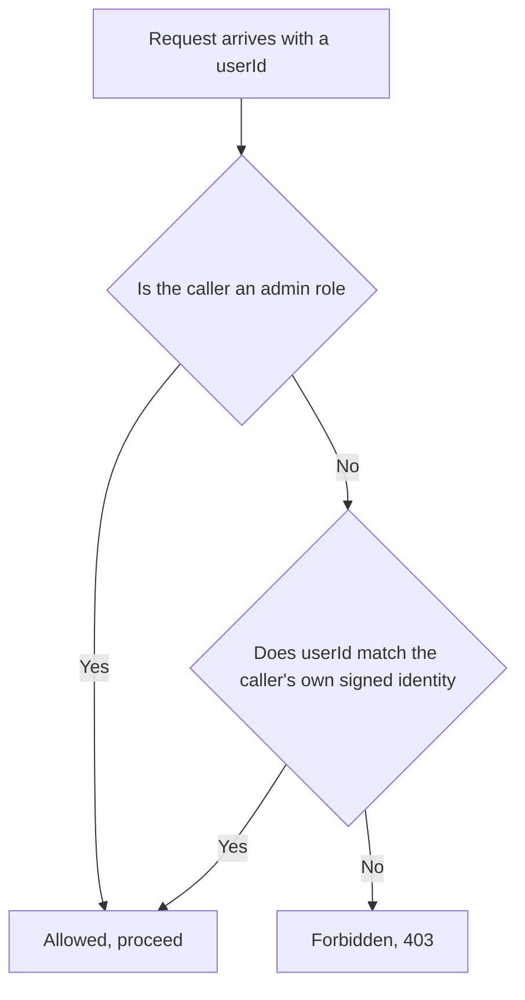
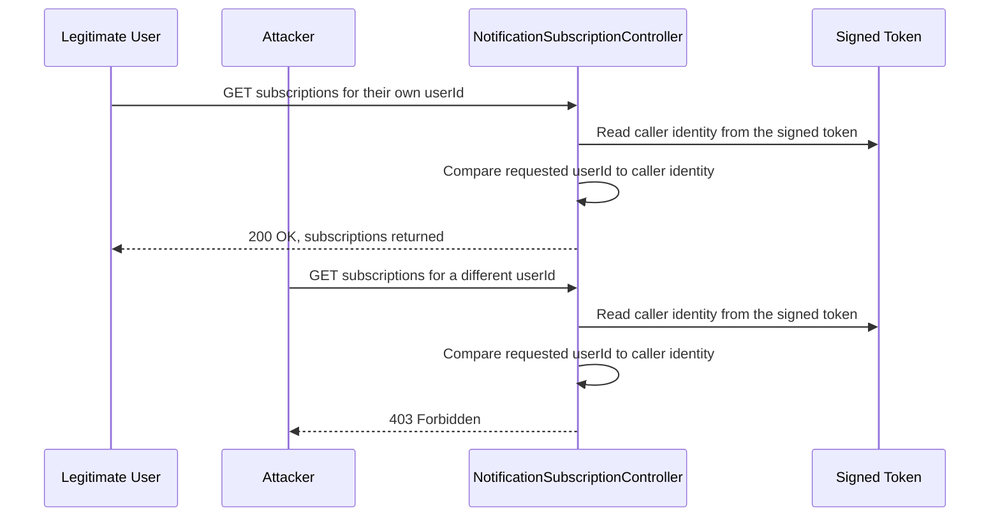
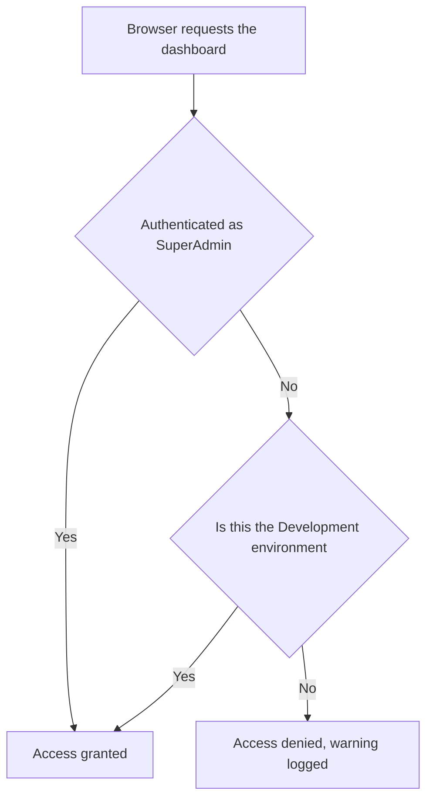

# 🔓 LiliShop Security Series — Part 5: Broken Access Control — IDOR and Function-Level Authorization

> Two different questions your code has to answer before letting anyone touch anything: "does this data belong to you?" and "should you be allowed near this feature at all?" This document walks through both, using LiliShop's real backend code — a controller with three different, deliberately-chosen fixes for the first question, and a dashboard filter for the second.

This document assumes **no prior knowledge of access control, JWTs, or authorization patterns**. Every concept is explained in plain English the first time it appears, using LiliShop's real ASP.NET Core code throughout.

> [!NOTE]
> This is **Part 5** of the LiliShop security series. Parts 1–4 covered defenses around *getting in the door* — brute-force protection, MFA, Google Sign-In, and SSRF. This document is about something that happens *after* someone is already, legitimately, logged in: making sure being logged in as *someone* doesn't quietly mean being able to act as *anyone*.

---

## 📑 Table of Contents

1. [Introduction](#1-introduction)
2. [Core Concepts](#2-core-concepts)
   - [2.1 What Is Broken Access Control?](#21-what-is-broken-access-control)
   - [2.2 Two Different Questions](#22-two-different-questions)
   - [2.3 What Is IDOR?](#23-what-is-idor)
   - [2.4 Where This Sits in OWASP](#24-where-this-sits-in-owasp)
3. [The Foundation: Identity From a Signed Token, Never From the Request](#3-the-foundation-identity-from-a-signed-token-never-from-the-request)
4. [IDOR in Practice: Three Patterns in One Controller](#4-idor-in-practice-three-patterns-in-one-controller)
   - [4.1 Pattern A — Reject with `Forbid()`](#41-pattern-a--reject-with-forbid)
   - [4.2 Pattern B — Silently Overwrite, Don't Reject](#42-pattern-b--silently-overwrite-dont-reject)
   - [4.3 Pattern C — Possession of a Secret Token](#43-pattern-c--possession-of-a-secret-token)
   - [4.4 Why Three Patterns, Not One](#44-why-three-patterns-not-one)
5. [When the Data Itself Is Administrative](#5-when-the-data-itself-is-administrative)
6. [The Complete Endpoint Map](#6-the-complete-endpoint-map)
7. [Function-Level Authorization: A Different Kind of Broken Access Control](#7-function-level-authorization-a-different-kind-of-broken-access-control)
   - [7.1 What Went Wrong: The Hangfire Dashboard](#71-what-went-wrong-the-hangfire-dashboard)
   - [7.2 The Fix: `HangfireAuthorizationFilter`](#72-the-fix-hangfireauthorizationfilter)
   - [7.3 Wiring It Up: Why the Filter Alone Isn't Enough](#73-wiring-it-up-why-the-filter-alone-isnt-enough)
   - [7.4 A Residual Worth Knowing](#74-a-residual-worth-knowing)
8. [IDOR vs. Function-Level Authorization, Side by Side](#8-idor-vs-function-level-authorization-side-by-side)
9. [The Complete Flow](#9-the-complete-flow)
10. [Advantages & Residual Considerations](#10-advantages--residual-considerations)
11. [Glossary](#11-glossary)
12. [Appendix: Quick Reference](#12-appendix-quick-reference)

---

## 1. Introduction

Most of this security series has been about proving *who* someone is — a password, a second factor, a signed token from Google. This document is about a different, easy-to-overlook question that only becomes relevant *after* identity is already settled: once we know who you are, does the code actually check whether the thing you're asking for is yours?

It's a surprisingly easy check to skip, because the code often still *looks* secure at a glance — there's a login requirement, there's a role check, everything seems locked down. The gap hides in a much smaller place: an endpoint that takes an ID — a user ID, an order ID, a product ID — straight from the URL or the request body, and never stops to ask "wait, does this ID actually belong to whoever is asking?"

> [!WARNING]
> Before the fixes covered in this document, a logged-in `Standard` customer at LiliShop could request another customer's price-drop subscription list simply by changing a number in the URL — no special access, no exploit tooling, just a different ID. Separately, LiliShop's background-job dashboard — capable of viewing, triggering, and deleting scheduled jobs — had an authorization check that had never actually been finished.

---

## 2. Core Concepts

### 2.1 What Is Broken Access Control?

**Access control** is the general term for deciding who is allowed to do what. **Broken access control** is what happens when that decision-making has a gap — somewhere, the code either forgets to check, or checks the wrong thing, and ends up letting someone do something they shouldn't be able to.

This is deliberately a broad category, because it covers a lot of genuinely different-looking bugs. This document focuses on two specific, common shapes it takes.

### 2.2 Two Different Questions

Broken access control tends to split into two distinct questions, and it's worth keeping them separate from the start, because they get fixed in completely different ways:

1. **"Does this specific piece of data belong to the person asking for it?"** — This is about *objects* (a specific user's subscription list, a specific order). Section 4 of this document is entirely about this question.
2. **"Should this person be allowed to use this feature at all, regardless of which specific record they'd be looking at?"** — This is about *functions* (an entire dashboard, an entire category of action). Section 7 covers this.

A system can get the first question right and the second one wrong, or vice versa — they're genuinely independent failure modes, which is exactly why LiliShop's codebase has two separate fixes for two separate problems, rather than one fix covering both.

### 2.3 What Is IDOR?

**IDOR** stands for **Insecure Direct Object Reference**. Unpack the phrase slowly: a "direct object reference" is simply an ID that points straight at a specific piece of data — a `userId` in a URL, an `orderId` in a request body. It's "insecure" when the code trusts that reference without checking whether the person presenting it actually has any right to it.

Here's an analogy that makes this concrete. Think of a theater coat check. The *correct* model: you hand over your coat, get a numbered ticket. To retrieve it, you present that exact ticket — the attendant matches ticket to coat, and doesn't even need to know your name to get this right.

The **insecure** version: the attendant simply asks "what's your coat number?" and hands over whatever number you say, with no check that you're the one who actually deposited that coat. If you say "give me coat `#12`," and coat `#12` exists, you get it back — even if it belongs to a total stranger. That's IDOR: trusting a reference (the coat number, the `userId`) purely because it was presented, with no check on whether the presenter actually owns what it points to.

### 2.4 Where This Sits in OWASP

Both problems in this document map to specific entries in the OWASP API Security Top 10 — the industry-standard checklist referenced throughout this series:

- **IDOR** maps to **API1:2023 — Broken Object Level Authorization (BOLA)**. This is consistently ranked as the single most common API vulnerability found in real-world security assessments.
- **Function-level authorization gaps** (covered in Section 7) map to **API5:2023 — Broken Function Level Authorization**.

They're numbered API1 and API5 for a reason — they're recognized as genuinely distinct categories, not two names for the same bug.

---

## 3. The Foundation: Identity From a Signed Token, Never From the Request

Every IDOR fix in this document rests on one small piece of code, so it's worth understanding fully before looking at anything else:

```csharp
// Identity of the caller taken from the validated JWT — never from the request payload.
private int? CurrentUserId()
    => int.TryParse(User.FindFirstValue(ClaimTypes.NameIdentifier), out var id) ? id : null;
```

Here's why this one line is the whole foundation everything else depends on. A request can contain all sorts of client-supplied values — a `userId` in the URL, a `UserId` field in a JSON body — and **none of them can be trusted**, because the client fully controls what it sends. Someone can type any number they like into a URL.

But `User` here isn't "whatever the client claims" — it's populated by ASP.NET Core's authentication middleware, from the **JWT** the client presented in its `Authorization` header. That token was issued by LiliShop's own server at login time and cryptographically signed — a client can't forge a new claim inside it or edit an existing one without the signature failing verification (this is exactly the same signature-trust mechanism covered in Part 3's Google Sign-In discussion, just applied to LiliShop's own tokens instead of Google's).

So `ClaimTypes.NameIdentifier` inside that signed token is a claim about identity that the *server* attached, back when it issued the token — not something the client can currently edit by changing a request. `CurrentUserId()` reads *that* — the one piece of identity information in this entire request that the client genuinely cannot fake.

```csharp
private bool IsAdmin() => AdminRoles.Any(User.IsInRole);

private bool CanActOnBehalfOf(int userId) => IsAdmin() || CurrentUserId() == userId;
```

`CanActOnBehalfOf` puts this to work: *"either the caller holds an admin-tier role, or the ID being asked about matches their own verified identity."* Every IDOR fix in Section 4 is, at its core, some variation of this one comparison.



---

## 4. IDOR in Practice: Three Patterns in One Controller

Here's the important thing to notice before looking at any individual endpoint: `NotificationSubscriptionController` doesn't apply *one* IDOR fix uniformly everywhere. It uses **three genuinely different patterns**, each deliberately matched to what actually makes sense for that specific action.

### 4.1 Pattern A — Reject with `Forbid()`

Used wherever the caller is *asking a question about* another user's data:

```csharp
[HttpGet("subscriptions/price-drop/{userId}")]
public async Task<IActionResult> GetPriceDropSubscriptionsByUserId(int userId)
{
    // Prevent IDOR: a standard user may only read their own subscriptions.
    if (!CanActOnBehalfOf(userId))
    {
        return Forbid();
    }

    var result = await _notificationSubscriptionService.GetPriceDropSubscriptionsByUserId(userId);
    return HandleOperationResult(result);
}
```

Straightforward: check first, and if the caller has no right to this `userId`, stop immediately with an explicit HTTP `403 Forbidden` — before the service layer, and therefore the database, is ever touched at all. This same pattern shows up again in `Unsubscribe(int userId, int productId)` and `CheckSubscription(int productId, int userId)`.

### 4.2 Pattern B — Silently Overwrite, Don't Reject

Used for the *write* actions — `AddSubscriber` and `DeleteSubscriber` — where the philosophy is different:

```csharp
[HttpPost("add")]
public async Task<ActionResult> AddSubscriber([FromBody] NotificationSubscriptionDto subscriptionDto)
{
    // Prevent a caller from creating subscriptions on behalf of another user by tampering with UserId.
    if (!IsAdmin())
    {
        var currentUserId = CurrentUserId();
        if (currentUserId is null)
        {
            return Unauthorized();
        }
        subscriptionDto.UserId = currentUserId.Value;
    }

    var result = await _notificationSubscriptionService.AddSubscriptionAsync(subscriptionDto);
    return HandleOperationResult(result);
}
```

Instead of checking "is the `UserId` the client sent correct?" and rejecting when it isn't, this code takes a different approach entirely: it **forces** `subscriptionDto.UserId` to be the caller's own verified ID, overwriting whatever the client actually sent, before the value is ever used. `DeleteSubscriber` follows the exact same shape.

Why does this make sense here specifically, rather than using Pattern A? Think about what a legitimate `AddSubscriber` call ever needs to look like: a non-admin user is *always* subscribing themselves — there's no real-world case where a regular customer legitimately needs to specify someone else's ID on this action at all. Given that, rejecting-with-an-error would just be extra friction for no benefit; silently substituting the correct value in place of whatever the client sent achieves the same security outcome with less ceremony.

### 4.3 Pattern C — Possession of a Secret Token

```csharp
[HttpGet("unsubscribe")]
public async Task<IActionResult> Unsubscribe(string token)
{
    var frontendBaseUrl = _configuration["FrontendSettings:BaseUrl"];

    var result = await _notificationSubscriptionService.UnsubscribeAsync(token);
    if (result.Status == OperationResultStatus.Success)
    {
        return Redirect($"{frontendBaseUrl}/unsubscribe-confirmation?success=true");
    }

    return Redirect($"{frontendBaseUrl}/unsubscribe-confirmation?success=false");
}
```

Notice what's genuinely absent here: no `userId` parameter at all, no call to `CanActOnBehalfOf`, not even a requirement to currently be logged in beyond whatever the controller's class-level policy demands. This is the classic email "unsubscribe" link pattern, and it uses a completely different authorization model on purpose: instead of "prove you're logged in as this specific user," the model is **"prove you possess the unique token that was emailed to this specific address."**

That's a legitimate, well-established alternative to identity-based checks — appropriate here specifically because unsubscribe links are conventionally expected to work without forcing someone to log in first (imagine how much worse the experience would be if every marketing email's unsubscribe link demanded a password before it would work).

### 4.4 Why Three Patterns, Not One

It might look inconsistent to see three different fixes in one file — but that's the wrong read. Each pattern is the *right tool* for a different job:

| Situation | Right pattern | Why |
|---|---|---|
| Reading another user's data by ID | **A: Reject** | The request is inherently a question about someone specific; an explicit no is the clearest response |
| Writing data that only ever makes sense as "about the caller themselves" | **B: Overwrite** | There's no legitimate case for the client-sent value to differ, so correcting it is simpler than rejecting it |
| An action reachable without being logged in at all | **C: Secret token** | Identity-based checks don't apply when there's no session to check identity against |

> [!IMPORTANT]
> A single, uniform rule applied everywhere in this controller would likely have made the code *worse*, not more consistent. "Always reject on mismatch" would have added pointless friction to the add/delete flow. "Always silently correct" would be wrong for read endpoints, where the caller is genuinely asking about specific data and deserves an honest answer about whether they're allowed to see it. Recognizing which situation you're in is itself part of getting this right.

---

## 5. When the Data Itself Is Administrative

There's a fourth endpoint worth looking at separately, because it isn't really an IDOR fix in the same sense as Sections 4.1–4.3, even though it lives in the same controller:

```csharp
// Returns the full subscriber list (including UserIds) for a product. This is administrative /
// analytical data about other customers, so it is restricted to admin roles. Regular users must use
// the "check" endpoint to query only their own subscription status. (Background notification jobs call
// the service layer directly and are unaffected by this HTTP-level restriction.)
[Authorize(Policy = PolicyType.RequireAtLeastAdminPanelViewerRole)]
[HttpGet("product/{productId}")]
public async Task<ActionResult<List<NotificationSubscriptionDto>>> GetActiveSubscriptionsByProductIdAsync(int productId)
{
    var result = await _notificationSubscriptionService.GetActiveSubscriptionDtosByProductIdAsync(productId);
    return HandleOperationResult(result);
}
```

Notice there's no `CanActOnBehalfOf` check here at all — instead, the entire endpoint is gated by `[Authorize(Policy = PolicyType.RequireAtLeastAdminPanelViewerRole)]`. Why the different treatment?

Think about *what the data actually is*. This endpoint doesn't answer "what are *my* subscriptions" for any particular caller — it answers "who, in total, is watching this product for price drops," including every subscriber's `UserId`. There's no version of "does this belong to the caller" that applies here, because the response was never about any single customer's own data in the first place — it's a list *about many different customers at once*. No IDOR-style ownership check could ever make this endpoint safe for a regular customer to call, because the problem isn't a mismatched ID — it's that the entire response is inherently the kind of aggregate, cross-customer data only staff should see at all.

This is worth naming explicitly: **not every access-control problem is IDOR.** Sometimes the right question isn't "does this ID belong to the caller," it's simply "should a non-admin ever see this category of data, regardless of which ID is involved." That's a function-level judgment, foreshadowing Section 7.

---

## 6. The Complete Endpoint Map

Every endpoint in `NotificationSubscriptionController`, and exactly which pattern protects it:

| Endpoint | Method | Protection | Pattern |
|---|---|---|---|
| `GET /all` | `GetAll` | Admin-only policy | Admin-gated entirely |
| `GET /subscriptions/price-drop` | `GetPriceDropSubscriptions` | Admin-only policy | Admin-gated entirely |
| `GET /subscriptions/price-drop/{userId}` | `GetPriceDropSubscriptionsByUserId` | `CanActOnBehalfOf` → `Forbid()` | A — Reject |
| `POST /add` | `AddSubscriber` | `IsAdmin()` → overwrite `UserId` | B — Overwrite |
| `DELETE /delete` | `DeleteSubscriber` | `IsAdmin()` → overwrite `UserId` | B — Overwrite |
| `DELETE /unsubscribe/{userId}/{productId}` | `Unsubscribe(int, int)` | `CanActOnBehalfOf` → `Forbid()` | A — Reject |
| `GET /unsubscribe?token=` | `Unsubscribe(string)` | Token possession | C — Secret token |
| `GET /product/{productId}` | `GetActiveSubscriptionsByProductIdAsync` | Admin-only policy | Admin-gated entirely (Section 5) |
| `GET /check` | `CheckSubscription` | `CanActOnBehalfOf` → `Forbid()` | A — Reject |

Every single endpoint in this controller falls into exactly one of these categories — there's no action left ungated, and no endpoint relying purely on "you're logged in, that's enough" the way the original vulnerable version reportedly did.

---

## 7. Function-Level Authorization: A Different Kind of Broken Access Control

### 7.1 What Went Wrong: The Hangfire Dashboard

LiliShop uses Hangfire — a library for running background jobs (things like scheduled cleanup tasks). Hangfire ships with a built-in web dashboard for viewing, triggering, and deleting those jobs. Notice immediately how this is a different shape of problem from Section 4: there's no `jobId` ownership question here at all. The question is simply: **should this person be allowed anywhere near this dashboard, period?**

The dashboard's authorization is controlled by a filter you write yourself. Before the fix documented here, that filter existed in the codebase but was an unfinished stub — its `AuthorizeAsync` implementation simply threw `NotImplementedException` whenever it was called. Since Hangfire can't practically use a filter that crashes on every request, it silently fell back to its own built-in default behavior instead: a check called `LocalRequestsOnlyAuthorizationFilter`, which permits access only to requests that appear to originate from `localhost`.

That fallback sounds reasonable until you remember something from Part 1 of this series: "does this request look like it came from `localhost`" is exactly the kind of check that becomes unreliable the moment any reverse proxy sits in front of the application — the same underlying problem that motivated the entire `ForwardedHeaders` discussion earlier in this series, resurfacing in a completely different corner of the app.

### 7.2 The Fix: `HangfireAuthorizationFilter`

```csharp
public class HangfireAuthorizationFilter : IDashboardAsyncAuthorizationFilter
{
    private readonly IWebHostEnvironment _environment;
    private readonly ILogger<HangfireAuthorizationFilter> _logger;

    public HangfireAuthorizationFilter(IWebHostEnvironment environment, ILogger<HangfireAuthorizationFilter> logger)
    {
        _environment = environment;
        _logger = logger;
    }

    public Task<bool> AuthorizeAsync(DashboardContext context)
    {
        var httpContext = context.GetHttpContext();
        var user = httpContext.User;

        if (user?.Identity?.IsAuthenticated == true && user.IsInRole(Role.SuperAdmin))
        {
            return Task.FromResult(true);
        }

        // Developer convenience only — never relaxes authorization outside the Development environment.
        if (_environment.IsDevelopment())
        {
            return Task.FromResult(true);
        }

        _logger.LogWarning("Denied Hangfire dashboard access. Authenticated={IsAuthenticated} RemoteIp={RemoteIp}",
            user?.Identity?.IsAuthenticated == true,
            httpContext.Connection.RemoteIpAddress?.ToString() ?? "unknown");

        return Task.FromResult(false);
    }
}
```

Two gates, checked in a specific order:

1. **Is this person authenticated, and specifically `SuperAdmin`?** — not just any admin-tier role, the single strictest one LiliShop has. Only then is access granted.
2. **Is this the `Development` environment?** — a deliberate, explicitly-commented convenience bypass, so developers running the app locally aren't blocked from a dashboard they need day-to-day. The comment is direct about the boundary: this "never relaxes authorization outside the Development environment."

If neither gate opens, access is denied, and a warning is logged — recording only whether the request was authenticated and its IP address, deliberately nothing more sensitive than that.

> [!TIP]
> Notice the same "fail closed" philosophy from Part 4's SSRF document showing up again here. There's no third branch, no "well, if we're not sure, let's allow it." Every path through this method that isn't an explicit `true` ends in `false`.

### 7.3 Wiring It Up: Why the Filter Alone Isn't Enough

```csharp
// The Hangfire dashboard exposes and can trigger/delete background jobs, so it must be authorized.
// HangfireAuthorizationFilter requires an authenticated SuperAdmin in non-Development environments.
app.UseHangfireDashboard("/hangfire-lilishop19", new DashboardOptions
{
    AsyncAuthorization = new[] { app.Services.GetRequiredService<HangfireAuthorizationFilter>() }
});
```

This line deserves just as much attention as the filter class itself, because a perfectly-written `AuthorizeAsync` sitting unused elsewhere in the codebase would protect *nothing*. It's `AsyncAuthorization = new[] { ... }` that actually connects the filter to the dashboard's request pipeline. This is the same lesson that's come up more than once already in this series — `app.UseForwardedHeaders()` needing to actually run in the middleware pipeline, `[EnableRateLimiting("auth")]` needing to actually be applied to each endpoint. **Correct logic that isn't wired into the thing it's meant to protect provides zero protection.** Writing the check is only half the job; connecting it is the other half, and it's just as easy to get wrong.

### 7.4 A Residual Worth Knowing

There's a genuine operational wrinkle here worth being aware of, separate from whether the *logic* is correct. `user.IsInRole(Role.SuperAdmin)` depends on `httpContext.User` being populated for this specific request — which depends on however the app authenticates the browser making a direct page-load request to `/hangfire-lilishop19`.

LiliShop's Angular SPA authenticates to its own API using a bearer token attached to the `Authorization` header on each API call — but a browser navigating straight to a dashboard URL is making a plain page load, not an API call with that header attached. Unless there's a *separate*, cookie-based login path specifically for the dashboard, a genuine SuperAdmin might find this page effectively unreachable in production, not just attackers. This isn't a security hole — if anything, it errs toward being too strict — but it's worth confirming whether accessing this dashboard in production is actually something that currently works for legitimate admins, or whether it needs a cookie-based login path added if it's meant to be used day-to-day.

One smaller, related detail: the dashboard is mounted at `/hangfire-lilishop19` rather than the default `/hangfire`. That's a mild obscurity measure — harmless, but worth being clear-eyed that it does no real protective work on its own. `AsyncAuthorization` is the actual defense; the unusual path is, at best, a small amount of extra friction against automated scanners that only ever check the default path.

---

## 8. IDOR vs. Function-Level Authorization, Side by Side

Now that both problems have been walked through in full, here's the comparison that ties Section 2.2's framing back together with concrete examples:

| | IDOR (Object-Level) | Function-Level Authorization |
|---|---|---|
| **The question being asked** | Does this specific record belong to the caller? | Should the caller be here at all? |
| **OWASP category** | API1:2023 — Broken Object Level Authorization | API5:2023 — Broken Function Level Authorization |
| **Example in this document** | `userId` in a subscription URL | The entire Hangfire dashboard |
| **What "wrong" looks like** | Any logged-in user can view any other user's data by changing an ID | Any user (or, before the fix, potentially nobody at all) reaches an admin-only feature |
| **The fix's shape** | Compare a client-supplied ID against the caller's own verified identity | Check the caller's role before granting entry to the feature, independent of any specific ID |
| **Granularity** | Per-record | Per-feature |

Both are real, both are common, and — as Section 5 showed — sometimes a single endpoint needs the function-level answer ("only admins, full stop") rather than the object-level one, because the data itself was never about a single record to begin with.

---

## 9. The Complete Flow

**IDOR: a legitimate request alongside an attack attempt, side by side.**



Notice both requests are handled by the *exact same code path* — there's no special "attacker detection" happening. The only thing that changes the outcome is whether the requested `userId` happens to match the identity already sitting, unforgeable, inside the caller's own signed token.

**Function-level authorization: the Hangfire dashboard's decision.**



Here there's no comparison against a specific ID at all — just a flat yes-or-no gate that applies identically to every visitor, regardless of what they'd be looking at once inside.

---

## 10. Advantages & Residual Considerations

### ✅ Advantages

- **Identity comes from a place the client can't edit.** Every fix in this document ultimately traces back to reading identity out of a signed JWT claim, never out of client-supplied input — the same trust boundary that makes tokens meaningful throughout this whole security series.
- **The right tool for each situation, not one rule everywhere.** Section 4.4 showed this directly: reject, overwrite, and secret-token-possession are three legitimate patterns, deliberately matched to three different kinds of endpoint, rather than one blunt rule forced onto all of them.
- **Recognizing when IDOR isn't the right frame at all.** Section 5's admin-data endpoint shows a more mature version of this thinking — sometimes the fix isn't "check ownership," it's "recognize this data was never about a single owner in the first place."
- **Fail-closed authorization for the dashboard.** Every path through `HangfireAuthorizationFilter` that isn't an explicit, deliberate "yes" ends in "no" — the same disciplined default seen in Part 4's SSRF guard.
- **Function-level and object-level gaps get genuinely separate treatment.** Nothing in this codebase tries to use one mechanism to solve both problems — which matters, because (as Section 8 makes clear) they're answering different questions entirely.

### ⚠️ Residual Considerations

- **The Hangfire bearer-token/cookie gap (Section 7.4).** Whether a real SuperAdmin can actually reach the dashboard in production, given the SPA's bearer-token authentication model, is worth confirming rather than assuming — this is an operational question, not a vulnerability, but it affects whether the dashboard is actually usable day-to-day.
- **The obscure dashboard path provides no real security.** `/hangfire-lilishop19` is friction against casual automated scanning at best; the authorization filter is the entire defense, and should be treated as such.
- **This document covers one controller and one dashboard.** The patterns shown here — particularly Pattern A and Pattern B from Section 4 — are the right *shape* of fix to look for elsewhere in the codebase, wherever a client-supplied ID determines access to a specific record. This document doesn't claim to have audited every such endpoint in LiliShop; it documents the ones already reviewed and fixed.

---

## 11. Glossary

| Term | Meaning |
|---|---|
| **Broken Access Control** | The general category of bugs where code fails to correctly check who is allowed to do what |
| **IDOR (Insecure Direct Object Reference)** | Trusting a client-supplied ID (like a `userId` in a URL) without verifying the caller actually has rights to the record it points to |
| **BOLA (Broken Object Level Authorization)** | OWASP's formal name for the IDOR vulnerability class, API1:2023 |
| **Object-level authorization** | Checking whether a specific piece of data belongs to (or is otherwise accessible to) the specific caller asking for it |
| **Function-level authorization** | Checking whether a caller should be allowed to use an entire feature at all, independent of any specific record |
| **JWT claim** | A single fact embedded inside a signed token — such as the caller's user ID — that the client cannot forge without breaking the token's signature |
| **`ClaimTypes.NameIdentifier`** | The standard .NET claim type conventionally used to store a user's unique identifier inside a token |
| **Fail closed** | A design where, when a check can't be confidently answered "yes," the default outcome is "no" |
| **Dashboard authorization filter** | Hangfire's mechanism for controlling who may access its background-job dashboard |

---

## 12. Appendix: Quick Reference

```csharp
// The one comparison every IDOR fix in this document is built on:
private bool CanActOnBehalfOf(int userId) => IsAdmin() || CurrentUserId() == userId;

// The one gate every Hangfire access decision is built on:
if (user?.Identity?.IsAuthenticated == true && user.IsInRole(Role.SuperAdmin))
{
    return Task.FromResult(true);
}
```

| Pattern | When to reach for it |
|---|---|
| **Reject (`Forbid()`)** | The caller is asking a question about a specific record that might not be theirs |
| **Overwrite** | The action only ever makes sense as "about the caller themselves" |
| **Secret token** | The action needs to work without requiring a login session at all |
| **Admin-only policy** | The data or feature was never about any single caller's own records to begin with |

---

<div align="center">

*Part 5 of the LiliShop security series. This document uses LiliShop's real backend code as its running example throughout.*

</div>
