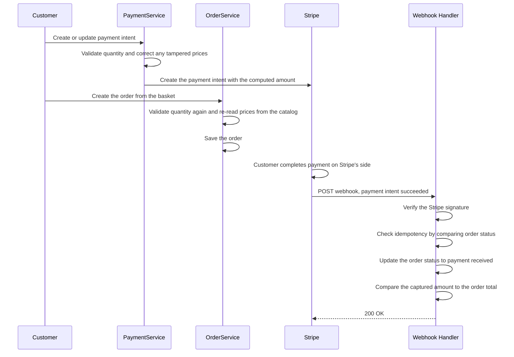

# 💳 LiliShop Security Series — Part 6: Payment & Business Logic Integrity — Defending Against Price and Quantity Tampering

> Some attacks don't need a stolen password, a forged token, or a clever exploit at all. They just need a form field that trusts whatever number the client sends. This document walks through how LiliShop makes sure the money that actually changes hands always matches what should have changed hands — even when quantities, prices, and webhook deliveries can't be taken at face value.

This document assumes **no prior knowledge of payment processing, webhooks, or business-logic security**. Every concept is explained in plain English the first time it appears, using LiliShop's real backend code throughout.

> [!NOTE]
> This is **Part 6** of the LiliShop security series. Parts 1–5 were mostly about *who* is making a request — a person, an attacker, Google, Printess. This document is about something different: even from a completely legitimate, correctly-authenticated customer, can the *numbers* in a request be trusted? The answer, throughout, is no — and this document is about what LiliShop does instead of trusting them.

---

## 📑 Table of Contents

1. [Introduction](#1-introduction)
2. [Core Concepts](#2-core-concepts)
   - [2.1 What Is Business Logic Abuse?](#21-what-is-business-logic-abuse)
   - [2.2 Parameter Tampering](#22-parameter-tampering)
   - [2.3 Preventive vs. Detective Controls](#23-preventive-vs-detective-controls)
   - [2.4 Idempotency, Briefly](#24-idempotency-briefly)
3. [The First Gate: Verifying the Webhook Is Really From Stripe](#3-the-first-gate-verifying-the-webhook-is-really-from-stripe)
4. [Layer 1: Quantity Validation, Checked Twice](#4-layer-1-quantity-validation-checked-twice)
5. [Layer 2: Price Integrity, Two Defenses Stacked](#5-layer-2-price-integrity-two-defenses-stacked)
6. [A Real Bug, Fixed: The Shipping-Price Truncation](#6-a-real-bug-fixed-the-shipping-price-truncation)
7. [Detective Control: Reconciling the Paid Amount](#7-detective-control-reconciling-the-paid-amount)
8. [Idempotency: What It Catches, and What It Doesn't](#8-idempotency-what-it-catches-and-what-it-doesnt)
9. [Robustness: The Default-Case Cast Fix](#9-robustness-the-default-case-cast-fix)
10. [The Complete Flow](#10-the-complete-flow)
11. [Advantages & Residual Considerations](#11-advantages--residual-considerations)
12. [Glossary](#12-glossary)
13. [Appendix: Quick Reference](#13-appendix-quick-reference)

---

## 1. Introduction

Every other document in this series has been about identity in some form — proving who someone is, or verifying that a message genuinely came from who it claims to be from. This document is about something quieter and, in some ways, more fundamental: even once you know exactly who's making a request, can you trust the *numbers* they're sending?

An online shop runs almost entirely on numbers a client can, technically, type anything into: how many of an item, what it costs, what the total should be. Every one of those numbers is an opportunity, if the server ever trusts them at face value, for the amount of money that actually changes hands to quietly stop matching the amount that *should* change hands.

> [!WARNING]
> Left unguarded, a request could specify a negative item quantity to drag a charge total below zero — effectively getting paid to receive goods — or claim a price different from what's actually in the product catalog. Separately, a webhook endpoint that trusts an incoming request without verifying it truly came from the payment provider could be used to fake a "payment succeeded" event entirely.

---

## 2. Core Concepts

### 2.1 What Is Business Logic Abuse?

Most of the vulnerabilities covered so far in this series — SSRF, IDOR, JWT forgery — have a certain shape: something the code was *supposed* to check, but didn't. **Business logic abuse** is subtly different. Often, every individual check is technically working exactly as written — the bug is that the *rules themselves* didn't account for a value being outside the range anyone expected.

A simple way to think about it: a form field for "how many items" is usually only ever tested, by the people who built it, with positive, reasonable numbers — because why would anyone type anything else? An attacker's whole method is asking exactly that question, and then trying the number nobody expected: zero, negative, or absurdly large.

### 2.2 Parameter Tampering

**Parameter tampering** is the general technique underlying most of this document: modifying a value the client controls — a form field, a URL parameter, a hidden field, a JSON body — to something the server didn't anticipate, hoping the server trusts it anyway. This document covers two specific, common flavors:

- **Quantity tampering** — sending a negative or absurd item count (Section 4).
- **Price tampering** — sending a price that doesn't match the real product catalog (Section 5).

Both share the same underlying fix, worth stating up front because it's the thread running through this whole document: **never trust a number the client sent for anything that affects money. Re-derive it, or re-verify it, from something the server itself controls — the database.**

### 2.3 Preventive vs. Detective Controls

This document uses both of these terms throughout, and the distinction matters:

- **A preventive control** stops something bad from happening at all. Quantity validation (Section 4) is preventive — an invalid quantity never gets the chance to influence a charge, because the request is rejected before that can happen.
- **A detective control** doesn't prevent anything — it notices, after the fact, that something looks wrong, and raises a signal for a human to investigate. Amount reconciliation (Section 7) is detective — by the time it runs, money has already changed hands; there's nothing left to "prevent."

Good security design uses both, matched to what's actually possible at each point in a process. Trying to force a detective-style problem into a preventive-style fix (or vice versa) usually produces worse code, not better — a theme that comes up directly in Section 7.

### 2.4 Idempotency, Briefly

One more term worth defining before diving in: an operation is **idempotent** if doing it more than once produces the same result as doing it exactly once. This matters here because Stripe (LiliShop's payment provider) explicitly guarantees only "at least once" delivery for webhook events — meaning the *same* event can genuinely arrive at LiliShop's server two or more times. Without some form of idempotency, that could mean the same "payment succeeded" event triggering duplicate work every time it's redelivered. Section 8 covers exactly how LiliShop handles this, and where the current approach's limits are.

---

## 3. The First Gate: Verifying the Webhook Is Really From Stripe

Before any of the money-integrity logic in this document even runs, one line has to pass first:

```csharp
var stripeEvent = EventUtility.ConstructEvent(json, context.Request.Headers["Stripe-Signature"], _whSecret);
```

This checks a cryptographic signature Stripe computes over the raw request body, using a secret (`_whSecret`) only LiliShop and Stripe know. If this check fails, `ConstructEvent` throws a `StripeException`, caught by the method's outer `catch` block — and nothing past this line ever executes.

This is worth naming explicitly, because it's a pattern this series keeps returning to: Part 3 covered Google verifying an ID token's signature before trusting any claim inside it; Part 4 covered the Printess callback secret before trusting any URL inside a callback body. This is the exact same principle, applied to a third external integration: **don't trust the shape of an incoming request just because it looks correctly formatted — verify it was genuinely sent by the party you trust, before reading anything out of it.**

One detail worth noticing in `PaymentsController`: `StripeWebhook()` carries no `[Authorize]` attribute, unlike the sibling `CreateOrUpdatePaymentIntent` endpoint right above it in the same file. That's not an oversight — Stripe isn't a logged-in LiliShop customer, so bearer-token authentication doesn't apply to it at all. The signature check *is* this endpoint's authentication; it's simply a different mechanism, matched to who's actually supposed to be calling it.

---

## 4. Layer 1: Quantity Validation, Checked Twice

### The attack, made concrete

Look at how a basket's total actually gets computed:

```csharp
var itemsTotal = basket.Items.Sum(i => i.Quantity * i.Price);
```

Now imagine a customer adds a real item, then tampers with the request to also include a second line for the same product with a **negative** quantity:

| Item | Price | Quantity | Line total |
|---|---|---|---|
| Custom Mug | $15.00 | 3 | $45.00 |
| Custom Mug *(tampered line)* | $15.00 | -2 | −$30.00 |
| **Sum** | | | **$15.00** |

The customer would receive 5 mugs' worth of goods (assuming the negative "quantity" doesn't stop real items from shipping) while being charged for effectively zero — the negative line drags the total down to a fraction of what it should be. This is sometimes called a **negative-quantity attack**, and it's one of the most common business-logic bugs in e-commerce systems specifically because "quantity" so rarely gets validated as anything other than "is this present."

### The fix, in two places

```csharp
// In PaymentService.CreateOrUpdatePaymentIntentAsync:
if (basket.Items.Any(item => item.Quantity <= 0 || item.Quantity > MaxItemQuantity))
{
    return LogAndReturnError(ErrorCode.InvalidData, "Basket contains an invalid item quantity.");
}
```

```csharp
// In OrderService.CreateOrderAsync:
if (basket.Items.Any(item => item.Quantity <= 0 || item.Quantity > MaxItemQuantity))
{
    return OperationResult.Failure<Order>(ErrorCode.InvalidData, "Order contains an invalid item quantity.");
}
```

The exact same rule — `Quantity <= 0` rejects the negative-quantity trick above (and a zero-quantity line, which would offer no real defense but also serves no legitimate purpose); `Quantity > MaxItemQuantity` (`1000`) guards against an absurdly large number used purely for abuse rather than a genuine order.

**Why is this checked in two separate services, not once?** This isn't duplication for its own sake — it's closing a real gap between two distinct moments in the checkout process. `CreateOrUpdatePaymentIntentAsync` runs while the customer is entering payment details; `CreateOrderAsync` runs afterward, as a separate step, reading the basket *again* from storage. If quantity were validated only when the payment intent is first created, there would be a window — however small — where the basket could still be modified before the order-creation step reads it, and that step would never have re-checked it on its own. Validating independently at both entry points closes that window entirely, rather than relying on one check to protect a step it never actually runs alongside.

> [!NOTE]
> `MaxItemQuantity = 1000` is declared as a separate `private const int` in both `PaymentService` and `OrderService`. Not a security issue on its own, but worth knowing: if this threshold ever needs to change, it currently has to be updated in two places to stay consistent.

---

## 5. Layer 2: Price Integrity, Two Defenses Stacked

### The attack

If a client can specify a product's `Price` inside the request body, and the server ever uses that value directly, an attacker could claim any product costs $0.01 — no database access required, just a modified request.

### Defense 1 — silently correct the price (a pattern from Part 5)

```csharp
// In PaymentService.ApplyProductPricesToBasketItems:
if (productItem != null && item.Price != productItem.Price)
{
    item.Price = productItem.Price;
}
```

Whatever price the basket claims, it gets forced back to the real database price before it can influence the Stripe charge amount at all. If you've read Part 5 of this series, this should look familiar: it's the exact same shape as **Pattern B — "silently overwrite, don't reject"** — there, applied to a tampered `UserId`; here, applied to a tampered `Price`. Same underlying idea: there's no legitimate reason for the client-sent value to ever differ from the correct one, so rather than reject the whole request over it, the code simply corrects it in place.

### Defense 2 — don't even read the client's value a second time

`OrderService.CreateOrderAsync` goes a step further, and it's worth noticing precisely what it does differently:

```csharp
var productItem = products.FirstOrDefault(p => p.Id == item.Id);
if (productItem != null)
{
    var itemOrdered = new ProductItemOrdered(productItem.Id, productItem.Name, productItem.PictureUrl);
    var orderItem = new OrderItem(itemOrdered, productItem.Price, item.Quantity);
    items.Add(orderItem);
}
```

Look at `new OrderItem(itemOrdered, productItem.Price, item.Quantity)` — this uses `productItem.Price`, the value freshly read from the product table, **not** `item.Price` (the basket's own price field, even though it was already sanitized once in Defense 1). The order is built without ever reading the basket's price field for this purpose at all.

This is a second, genuinely independent layer, not a redundant repeat of the first. If Defense 1 were ever removed, had a bug, or were somehow skipped on some code path, Defense 2 still wouldn't be affected by it — it never depended on the basket's price field being correct in the first place. Two different mechanisms, arriving at the same safe outcome through two different means, is exactly the kind of defense-in-depth this whole series keeps demonstrating.

---

## 6. A Real Bug, Fixed: The Shipping-Price Truncation

This section covers a genuine, already-fixed bug in LiliShop's own arithmetic — not an attack, but a good concrete lesson in exactly how precision quietly gets lost when converting between number types.

### The old code, and why it was wrong

The comment in `CreateOrUpdatePaymentIntentAsync` documents the original bug precisely:

```csharp
// The previous "(long)shippingPrice * 100" truncated the shipping price to
// whole dollars BEFORE multiplying (e.g. $4.99 shipping was charged as $4.00)
```

Here's exactly why that happened, worked through step by step:

| Step | Old code | Value |
|---|---|---|
| Start | `shippingPrice` | `4.99m` (a `decimal`) |
| Cast to `long` **first** | `(long)shippingPrice` | `4` — the `.99` is simply discarded, not rounded |
| Then multiply by 100 | `4 * 100` | `400` cents |
| **Result** | | **$4.00 charged** — 99 cents silently missing |

Converting a `decimal` to a `long` doesn't round to the nearest whole number — it **truncates**, chopping off everything after the decimal point, no matter how close to the next whole number the value was. `4.99` becomes `4`. `9.999` would *also* become `9`. The order of operations — cast first, multiply second — meant this precision loss happened before the multiplication that was supposed to convert dollars into cents, so the lost cents were gone before they ever had a chance to matter.

### The fix

```csharp
var itemsTotal = basket.Items.Sum(i => i.Quantity * i.Price);
var basketAmount = (long)Math.Round((itemsTotal + shippingPrice) * 100m, MidpointRounding.AwayFromZero);
```

| Step | New code | Value |
|---|---|---|
| Add everything together first, in full decimal precision | `itemsTotal + shippingPrice` | e.g. `44.99m` |
| Multiply by 100 **once**, while still a `decimal` | `... * 100m` | `4499.0m` |
| Round explicitly, as the very last step | `Math.Round(..., MidpointRounding.AwayFromZero)` | `4499` |
| Only now convert to `long` | `(long)...` | `4499` cents = **$44.99 charged**, correctly |

The general lesson, worth remembering well beyond this one bug: **do every bit of arithmetic in full precision first, and only truncate or round as the very last, explicit, deliberate step.** Converting to an integer type early is exactly where silent precision loss creeps in — and because it doesn't throw an exception or produce an obviously wrong-looking number, it's the kind of bug that can run in production for a long time completely unnoticed.

### How this bug was actually found

Worth appreciating: the original comment doesn't just say this was fixed — it says this truncation was *"causing the webhook amount-reconciliation to flag a false mismatch."* In other words, Section 7's reconciliation control — built to catch tampering or desyncs — caught LiliShop's own arithmetic bug instead, simply by comparing "what Stripe actually captured" against "what the order total says it should be." That's a genuinely good sign for a detective control: it does its job regardless of whether the mismatch's cause is an attacker or an honest mistake in your own code.

---

## 7. Detective Control: Reconciling the Paid Amount

```csharp
private void VerifyPaidAmountMatchesOrder(PaymentIntent intent, Order order)
{
    if (order.DeliveryMethod is null)
    {
        _logger.LogWarning("Cannot reconcile paid amount for OrderId {OrderId}: delivery method not loaded.", order.Id);
        return;
    }

    var expectedMinorUnits = (long)Math.Round(order.GetTotal() * 100m, MidpointRounding.AwayFromZero);

    if (intent.AmountReceived != expectedMinorUnits)
    {
        _logger.LogCritical(
            "Payment amount mismatch for OrderId {OrderId} / PaymentIntent {PaymentIntentId}: Stripe captured {AmountReceived} but the order total is {ExpectedAmount} (minor units).",
            order.Id, intent.Id, intent.AmountReceived, expectedMinorUnits);
    }
}
```

`order.GetTotal()` itself is defined on the `Order` entity:

```csharp
public decimal GetTotal()
{
    return Subtotal + DeliveryMethod.Price;
}
```

This is the natural, dedicated place for this calculation to live — it's a fact about an order, computed from the order's own fields, not something that should be recalculated slightly differently in multiple services. (This is also why `OrderByPaymentIntentIdSpecification` explicitly loads `OrderItems` and `DeliveryMethod` — `GetTotal()` needs `DeliveryMethod.Price` to be populated to run at all, so the specification used to fetch the order for this exact reconciliation step has to eager-load it.)

### Why this only logs — and why that's correct, not a missed opportunity

Notice `VerifyPaidAmountMatchesOrder` never blocks, cancels, or refunds anything — it only calls `_logger.LogCritical`. Look at exactly when this method runs, inside the webhook handler:

```csharp
var result = await UpdateOrderPaymentSucceededAsync(intent.Id);
// ...
order = result.Data;
VerifyPaidAmountMatchesOrder(intent, order);   // ← runs AFTER the order is already marked paid
```

By the time this check runs, two things have already happened, both outside this code's control: Stripe has already captured real money (that happened on Stripe's own servers, before this webhook was even sent to LiliShop), and the order's status has already been updated to reflect that. There's genuinely nothing left here to *prevent* — the transaction already occurred.

What reconciliation actually answers is a narrower, still valuable question: **does the amount that was genuinely captured match what this order's current contents say it should cost?** A mismatch could mean the basket changed between intent-creation and order-creation, some other desync between the two, or — as Section 6 demonstrated — a bug in LiliShop's own arithmetic. Any of those deserves a human's attention, but none of them can be safely auto-corrected by the webhook handler itself; it doesn't know *why* the numbers disagree, only that they do. `LogCritical` — flag it loudly for a person to investigate — is the appropriate response to a fact that already happened and can't be undone by this code, which is exactly what Section 2.3 meant by matching a detective control to a situation where prevention is no longer possible.

> [!TIP]
> This only works if something is actually watching for `LogCritical` entries — a log line nobody reads doesn't function as a control. Confirming there's real alerting on critical-severity logs (not just that they're being written to a file somewhere) is the difference between this being a genuine safety net and a paper one.

---

## 8. Idempotency: What It Catches, and What It Doesn't

```csharp
private async Task<OperationResult<Order>> UpdateOrderPaymentStatusByPaymentIntentIdAsync(OrderStatus orderStatus, string paymentIntentId)
{
    var spec = new OrderByPaymentIntentIdSpecification(paymentIntentId);
    var order = await _unitOfWork.Repository<Order>().GetEntityWithSpecAsync(spec);

    if (order == null)
    {
        return OperationResult.Failure<Order>(ErrorCode.ResourceNotFound, "Order not found.");
    }

    // Idempotency: Stripe can deliver the same webhook event more than once. If the order is
    // already in the target status there is nothing to do, so we avoid redundant writes.
    if (order.Status == orderStatus)
    {
        _logger.LogInformation("Order {OrderId} is already in status {Status}; ignoring duplicate webhook.", order.Id, orderStatus);
        return OperationResult.Success<Order>(order);
    }

    order.Status = orderStatus;
    _unitOfWork.Repository<Order>().Update(order);
    await _unitOfWork.CompleteAsync();

    return OperationResult.Success<Order>(order);
}
```

Recall from Section 2.4: Stripe explicitly guarantees only "at least once" delivery — meaning the *same* webhook event can genuinely arrive twice (or more). Without any check here, a redelivered "payment succeeded" event would run the same status update again — probably harmless on its own for a simple status flip, but exactly the kind of assumption that becomes dangerous the moment webhook handling ever grows to include something non-repeatable, like sending a confirmation email or decrementing inventory.

This check catches the common case cleanly: if the order's already in the target status, log it and stop — no redundant database write.

### What this doesn't catch

This is worth being precise about, because it's a real, currently-open limitation, not a hidden bug — it's actually tracked explicitly in LiliShop's own roadmap. The check here is **status-based**: it asks "is the order already where I'm trying to move it?" It does *not* ask "have I specifically already processed *this exact event ID* before?"

Two consequences follow from that distinction:

- **It can't distinguish "the same event redelivered" from "a different event that happens to want the same outcome."** If two genuinely different Stripe events both tried to set an order to the same status, this check couldn't tell them apart — though in practice this matters less for a simple linear status flow than it would for something with more possible transitions.
- **It doesn't fully protect against two near-simultaneous deliveries.** If the *same* event were somehow delivered twice in very close succession, both requests could read the order's *old* status before either one has finished writing the new one — a genuine, if narrow, race condition. This has the same underlying shape as the DNS-rebinding TOCTOU gap covered in Part 4: something gets checked, and then used, and the two moments aren't perfectly guaranteed to see the same reality.

LiliShop's own roadmap documents the complete fix for this: persisting each processed `stripeEvent.Id` in a dedicated table with a unique index, and checking *that* — rather than order status — before processing any event. That table doesn't exist in the code shown in this document; it's a planned, not-yet-implemented improvement, and this document should be read accordingly.

---

## 9. Robustness: The Default-Case Cast Fix

This is the last of the specific bugs in this document, and it's a good lesson in how a webhook handler has to behave differently from most other code — because it doesn't get to choose what arrives at its door.

```csharp
switch (stripeEvent.Type)
{
    case "payment_intent.succeeded":
        intent = (PaymentIntent)stripeEvent.Data.Object;
        // ...
        break;
    case "payment_intent.payment_failed":
        intent = (PaymentIntent)stripeEvent.Data.Object;
        // ...
        break;
    default:
        // Do NOT cast Data.Object to PaymentIntent here: unhandled events (e.g. charge.*,
        // checkout.*) carry a different object type and the cast would throw InvalidCastException,
        // which escapes the StripeException catch below and returns 500 -> Stripe retries forever.
        _logger.LogInformation("Unhandled Stripe event type: {EventType}", stripeEvent.Type);
        break;
}
```

Stripe sends *many* different kinds of events to one webhook URL — not just the two this switch explicitly cares about. Whatever your Stripe dashboard has enabled might include `charge.refunded`, `checkout.session.completed`, and plenty of others LiliShop's code never asked to handle but Stripe will still deliver.

The old version of this code, before the fix, cast `stripeEvent.Data.Object` to `PaymentIntent` unconditionally — including inside a `default` branch meant to handle *everything else*. But an event like `charge.refunded` doesn't actually carry a `PaymentIntent` object at all; it carries a different type entirely. Forcing that cast throws `InvalidCastException` — and that exception type isn't a `StripeException`, so it wouldn't be caught by this method's `catch (StripeException e)` block. It would propagate up as an unhandled 500 error.

Here's why that specific failure mode is worse than it might sound: Stripe interprets any non-2xx response to a webhook delivery as "this failed, try again later" — and will keep retrying, on its own schedule, for a genuinely long time. An event type that was *never* going to succeed, no matter how many times it's retried (because the code would throw the exact same exception every single time), would trigger an essentially endless retry loop. The fix is almost anticlimactic once you see the bug: the `default` branch simply doesn't need the typed `PaymentIntent` object for anything — it just wants to log and move on — so it never performs the cast that was causing the problem in the first place.

---

## 10. The Complete Flow

Here's every piece from Sections 3–9 tied together — from the customer starting checkout through to the webhook's final reconciliation check.



Notice how many of these steps are independent checks, each capable of stopping or flagging a problem on its own — quantity validation runs twice, price correction happens in two different ways, the webhook itself won't even be trusted without a valid signature, and the final reconciliation step runs regardless of whether everything before it went perfectly. No single step in this chain is doing all the work by itself.

---

## 11. Advantages & Residual Considerations

### ✅ Advantages

- **Numbers are re-derived, not re-checked, wherever it matters most.** Section 5's "Defense 2" is the clearest example — rather than validating the client's price and hoping the validation is never skipped, the order-creation code simply never reads that field for this purpose at all.
- **Validation runs at every entry point that can influence money, not just the first one.** Section 4 showed this precisely: the same quantity check exists independently in both services, closing the gap between two separate steps in checkout rather than trusting one check to protect a process it doesn't fully observe.
- **Detective and preventive controls are matched to what's actually possible at each step.** Section 7 is the clearest illustration — the code doesn't try to force a "block it" response onto a situation where the money has already moved; it does the thing that's actually useful at that point, which is flagging it loudly for a human.
- **A detective control that's already proven itself.** Section 6's bug wasn't found by a security review — it was surfaced by the reconciliation check doing exactly its job, against LiliShop's own honest arithmetic mistake rather than an attacker.
- **The webhook is authenticated the correct way for what it actually is.** No bearer token, no login — Stripe's own cryptographic signature, the same "verify before trusting" principle that's run through Parts 3 and 4 of this series as well.

### ⚠️ Residual Considerations

- **Webhook idempotency is status-based, not event-ID-based (Section 8).** This is the one item on this list that's explicitly tracked as open on LiliShop's own roadmap (F32) — worth treating as a known, planned improvement rather than a surprise.

- **Exception messages leak into responses in at least three places.** This is worth flagging clearly, because it's a repeated pattern across both files reviewed in this document, not a single isolated line. Compare these two catch blocks in `PaymentService`:

  ```csharp
  catch (StripeException ex)
  {
      return LogAndReturnError(ErrorCode.StripeError, $"An error occurred while interacting with Stripe: {ex.Message}", ex);
  }
  catch (Exception ex)
  {
      return LogAndReturnError(ErrorCode.GeneralException, $"An unexpected error occurred: {ex.Message}", ex);
  }
  ```

  and this one in `OrderService.CreateOrderAsync`:

  ```csharp
  catch (Exception ex)
  {
      _logger.LogError($"An error occurred while creating the order. Error: {ex.Message}", ex);
      return OperationResult.Failure<Order>(ErrorCode.GeneralException, ex.Message);
  }
  ```

  In all three, `ex.Message` — the raw exception text — gets embedded directly into the message returned to whatever called the service, rather than a fixed, generic string. Depending on how far that message travels through `HandleOperationResult` into the actual HTTP response, this could hand a client more internal detail than intended (this is the same category of issue as the `StartCallbackJob` finding in Part 4's SSRF document — an information-disclosure concern, genuinely different from the tampering-focused topic of this document, but visible right in the code being walked through here, so worth naming rather than silently passing over).

- **`MaxItemQuantity` is duplicated as a separate constant in two files (Section 4).** Not a security bug, but a maintainability trap — updating the threshold in one service without the other would silently create two different effective limits.

- **This document doesn't confirm how `basketId` values are generated.** `PaymentsController.CreateOrUpdatePaymentIntent` takes `basketId` directly from the URL, protected only by `[Authorize]` — no ownership check comparable to Part 5's `CanActOnBehalfOf` pattern. Whether this matters in practice depends entirely on whether basket IDs are long, random, unguessable values (in which case this is low-risk, similar to Part 5's "secret token possession" pattern) or something more predictable. This document doesn't have enough information to say which, and it's worth checking rather than assuming.

---

## 12. Glossary

| Term | Meaning |
|---|---|
| **Business logic abuse** | Exploiting the *rules* of an application rather than a technical flaw — often by supplying a value nobody anticipated, like a negative quantity |
| **Parameter tampering** | Modifying a client-controlled value (a field, a URL parameter) to something the server didn't expect |
| **Preventive control** | A defense that stops a bad outcome before it happens |
| **Detective control** | A defense that notices and flags a bad outcome after it has already occurred, for human review |
| **Idempotency** | The property of an operation producing the same result whether it runs once or multiple times |
| **Webhook** | An HTTP request one service sends to another to report that something happened, rather than being asked repeatedly |
| **Truncation** | Discarding the fractional part of a number when converting to an integer type, without rounding |
| **Minor units** | The smallest unit of a currency (e.g. cents for USD) — the format Stripe expects payment amounts in |
| **Reconciliation** | Comparing two independently-derived values (here, the amount captured vs. the amount expected) to confirm they agree |
| **Race condition** | A bug that occurs specifically because of the relative timing of two operations happening close together |

---

## 13. Appendix: Quick Reference

```csharp
// The quantity guard, checked independently in two services:
if (basket.Items.Any(item => item.Quantity <= 0 || item.Quantity > MaxItemQuantity)) { /* reject */ }

// The price guard, enforced two different ways:
item.Price = productItem.Price;                              // Defense 1: overwrite
var orderItem = new OrderItem(itemOrdered, productItem.Price, item.Quantity); // Defense 2: never read the client's value

// The rounding lesson: add first, multiply once, round last, THEN convert to an integer type.
var basketAmount = (long)Math.Round((itemsTotal + shippingPrice) * 100m, MidpointRounding.AwayFromZero);
```

| Layer | What it protects against | Preventive or detective? |
|---|---|---|
| Webhook signature check | A forged "payment succeeded" event | Preventive |
| Quantity validation (×2) | Negative/absurd quantities distorting a total | Preventive |
| Price correction (×2) | A tampered price influencing a charge | Preventive |
| Amount reconciliation | Any desync between captured and expected amounts | Detective |
| Status-based idempotency | Redundant writes from a redelivered webhook | Preventive (for the common case) |

---

<div align="center">

*Part 6 of the LiliShop security series. This document uses LiliShop's real backend code as its running example throughout.*

</div>
