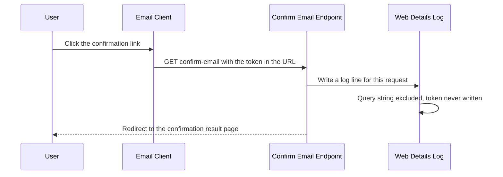
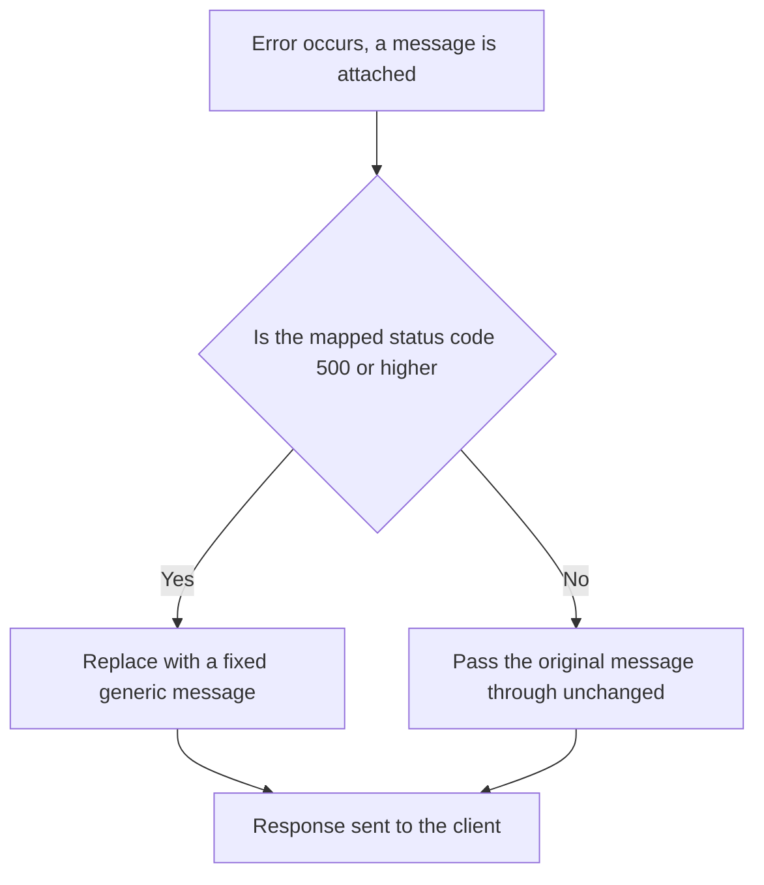
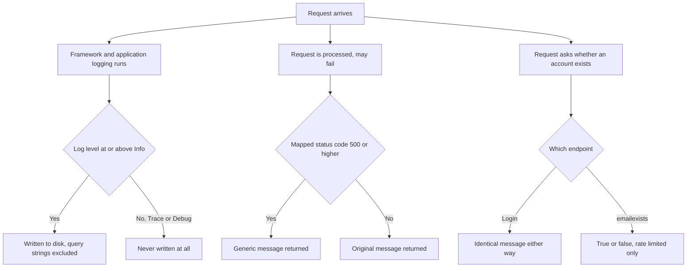

# 🔍 LiliShop Security Series — Part 7: Information Disclosure — Logs, Error Messages, and User Enumeration

> Not every security problem is about stopping someone from getting in. Some are about what your own system quietly *tells* someone, just by responding — a stack trace it shouldn't have shown, a log file holding a token nobody meant to persist, or a "yes/no" answer to a question an attacker never should have been able to ask at all. This document walks through three places LiliShop's own responses could leak more than intended, and what stops each one.

This document assumes **no prior knowledge of logging, error handling, or enumeration attacks**. Every concept is explained in plain English the first time it appears, using LiliShop's real backend code throughout.

> [!NOTE]
> This is **Part 7** of the LiliShop security series. It's a bit different from Parts 3–6, which each centered on one clear vulnerability with one clear fix. Information disclosure is more of a *theme* than a single bug — it shows up in log files, error responses, and ordinary-looking endpoints that happen to answer a question they shouldn't. This document follows that theme across three genuinely different parts of the codebase.

---

## 📑 Table of Contents

1. [Introduction](#1-introduction)
2. [Core Concepts](#2-core-concepts)
   - [2.1 What Is Information Disclosure?](#21-what-is-information-disclosure)
   - [2.2 Where This Sits in OWASP](#22-where-this-sits-in-owasp)
   - [2.3 The Common Thread](#23-the-common-thread)
3. [Logging Hygiene: What Ends Up on Disk](#3-logging-hygiene-what-ends-up-on-disk)
   - [3.1 Log Level: Why Trace and Debug Are Dangerous](#31-log-level-why-trace-and-debug-are-dangerous)
   - [3.2 The Query-String Problem, Made Concrete](#32-the-query-string-problem-made-concrete)
   - [3.3 The "BlackHole" Pattern](#33-the-blackhole-pattern)
4. [Error Responses: What Reaches the Client](#4-error-responses-what-reaches-the-client)
   - [4.1 The 5xx / 4xx Split](#41-the-5xx--4xx-split)
   - [4.2 Tracing a Leak That Doesn't Happen](#42-tracing-a-leak-that-doesnt-happen)
   - [4.3 A Landmine Worth Watching](#43-a-landmine-worth-watching)
5. [User Enumeration: When the System Answers a Question It Shouldn't](#5-user-enumeration-when-the-system-answers-a-question-it-shouldnt)
   - [5.1 What Is Enumeration?](#51-what-is-enumeration)
   - [5.2 Already Fixed: Login](#52-already-fixed-login)
   - [5.3 Confirmed Still Open: `emailexists`](#53-confirmed-still-open-emailexists)
   - [5.4 Unconfirmed: Registration and Forgot-Password](#54-unconfirmed-registration-and-forgot-password)
6. [A Known Residual: The Login Timing Side-Channel](#6-a-known-residual-the-login-timing-side-channel)
7. [The Complete Picture](#7-the-complete-picture)
8. [Advantages & Residual Considerations](#8-advantages--residual-considerations)
9. [Glossary](#9-glossary)
10. [Appendix: Quick Reference](#10-appendix-quick-reference)

---

## 1. Introduction

Most of this security series has been about *actions* — logging in, fetching a URL, charging a card. This document is about something quieter: the things a system says, simply by responding at all. A log file that persists a bit too much. An error message that describes exactly what went wrong internally. An endpoint that answers "does this account exist" with a plain yes or no.

None of these require an attacker to break anything. They just require the system to be, in some small way, too honest — handing over a fact that was never meant to leave the server, or letting an attacker use the system's own behavior to learn something it should never have revealed.

> [!WARNING]
> A single leaked token sitting in a log file for a password-reset link is functionally equivalent to that password having been reset by someone else. An endpoint that confirms which email addresses have accounts hands an attacker a ready-made target list for phishing or credential-stuffing, with zero guessing involved.

---

## 2. Core Concepts

### 2.1 What Is Information Disclosure?

**Information disclosure** is any situation where a system reveals information to someone who shouldn't have it — not by being tricked or attacked in a technical sense, but simply by responding normally to a request in a way that exposes more than intended. The formal name for this vulnerability class is **CWE-200** (*Exposure of Sensitive Information to an Unauthorized Actor*), a catalog entry referenced across nearly every serious security standard.

What makes this category distinct from most of this series: there's often no "exploit" in the usual sense. Nobody forged anything, bypassed anything, or fetched a URL they shouldn't have been able to reach. The system just... told them something, because nobody had specifically decided it shouldn't.

### 2.2 Where This Sits in OWASP

Unlike SSRF (Part 4) or IDOR (Part 5), information disclosure doesn't map to one single, clean OWASP category — it's genuinely a theme that cuts across several:

- **Sensitive data in logs or error responses** touches on **A09:2021 — Security Logging and Monitoring Failures**, and overlaps with the broader concerns under **A02:2021 — Cryptographic Failures** (which, in its earlier OWASP naming, was literally called "Sensitive Data Exposure").
- **User enumeration** is generally discussed under **A07:2021 — Identification and Authentication Failures**, the same category Part 1's brute-force protection and Part 3's Google Sign-In fix both referenced.

Worth being upfront about this rather than forcing a false, single, tidy classification onto a topic that genuinely doesn't have one.

### 2.3 The Common Thread

Every example in this document — logs, error messages, enumeration — shares the same underlying fix: **decide, deliberately, what a given response is allowed to reveal, and enforce that decision at the boundary, rather than trusting every inner layer to have already gotten it right.** You'll see this pattern precisely in Section 4, where a single check at the very edge of the system (the HTTP response boundary) neutralizes a mistake made several layers earlier — a theme worth watching for as you read.

---

## 3. Logging Hygiene: What Ends Up on Disk

### 3.1 Log Level: Why Trace and Debug Are Dangerous

LiliShop's real `nlog.config` sets every rule to a minimum level of `Info`:

```xml
<logger name="*" minlevel="Info" writeTo="allLogsFile" />
```

To understand why this matters, it helps to know what sits *below* `Info` in a typical logging framework: `Debug` and, below that, `Trace`. These are the most verbose levels — designed for step-by-step diagnostic detail during active development, and they routinely include things like full request/response bodies, raw parameter values, and internal state that was never meant for long-term storage. A production system logging at `Trace` level is, in effect, writing a detailed diary of everything that happens — including, potentially, passwords typed into a request, full JWTs, or other values that were only ever meant to exist in memory for the length of one request.

Setting the floor at `Info` means none of that verbose detail is ever written to disk in the first place. This isn't about redacting sensitive values after the fact — it's simpler and more reliable than that: the categories of log entry most likely to contain sensitive detail are excluded by level before they're ever recorded.

### 3.2 The Query-String Problem, Made Concrete

```xml
layout="...|url: ${aspnet-request-url:IncludeQueryString=false}|action: ${aspnet-mvc-action}"
```

`IncludeQueryString=false` strips everything after the `?` from the URL before it's written to the `webDetailsFile` log. This single attribute is worth understanding precisely, because it's protecting against a specific, real risk: a URL's *path* (`/account/confirm-email`) is usually just a resource identifier — safe to log. A URL's **query string** (`?token=abc123&email=...`) is where secrets tend to travel, specifically because `GET` requests have no request body to put them in instead.

LiliShop's own `AccountController` has a perfect real example of exactly this risk:

```csharp
[HttpGet("confirm-email")]
public async Task<IActionResult> ConfirmEmail(string token, string date, string email)
```

Email confirmation links are, by necessity, `GET` requests — they're clicked directly from an email client, which has no way to send a `POST` body. That leaves the confirmation `token` with nowhere to travel except the URL itself. Without `IncludeQueryString=false`, every confirmation link ever clicked would have its token sitting in plain text in a log file — and anyone with read access to that log file could use it to confirm (or, depending on what the token is also used for, potentially take over) that account.



Worth a quick contrast: `reset-password` and `forgot-password` both use `[FromBody]`, meaning their tokens travel in the request body rather than the URL — structurally safer from the start, simply because those endpoints don't have the same "must be clickable from an email client" constraint that forces `confirm-email` into using a `GET`.

### 3.3 The "BlackHole" Pattern

```xml
<logger name="Microsoft.*" maxlevel="Info" final="true" />
<logger name="System.Net.Http.*" maxlevel="Info" final="true" />
```

Read this carefully, because the *absence* of a `writeTo` attribute is the entire point. A `maxlevel="Info"` rule with no destination target, combined with `final="true"` (which stops any further rules from processing that log entry), means: anything from these namespaces at `Info` level or below simply vanishes — written nowhere.

Why does this matter for information disclosure specifically, and not just noise reduction? `System.Net.Http.*` is the namespace .NET's own HTTP client machinery logs under — and LiliShop's own code makes outbound HTTP calls to Stripe, Printess, and Google throughout this series. Left unfiltered, that framework-level logging can include details of those outbound requests and responses. Silencing it isn't only about keeping log files smaller — it's one more place those integrations' details are prevented from quietly accumulating on disk.

---

## 4. Error Responses: What Reaches the Client

### 4.1 The 5xx / 4xx Split

```csharp
// Do not expose server-side (5xx) failure details to clients — service methods sometimes place raw
// exception messages into the result. Only client-actionable (4xx) messages are returned verbatim.
string? safeDetail = statusCode >= StatusCodes.Status500InternalServerError
    ? "An unexpected error occurred while processing your request."
    : detail;
```

This one line in `OperationResultHandler.BuildProblemDetails` is doing something worth stating precisely: it doesn't try to fix every place in the codebase that might construct an overly detailed error message. Instead, it enforces a blanket rule at the single point where every response leaves the server: **if the status code is 500 or higher, the detail is always replaced with a fixed, generic sentence — no matter what any inner service actually put there.**



The comment's own wording is worth noticing: *"service methods sometimes place raw exception messages into the result."* That's not a hypothetical — it's an acknowledgment that this exact thing happens elsewhere in the codebase, and this check exists specifically to catch it, rather than assuming it'll never occur.

### 4.2 Tracing a Leak That Doesn't Happen

Part 6 of this series flagged something worth resolving here directly. Both `PaymentService` and `OrderService` embed `ex.Message` into the messages they return:

```csharp
// PaymentService
catch (Exception ex)
{
    return LogAndReturnError(ErrorCode.GeneralException, $"An unexpected error occurred: {ex.Message}", ex);
}
```

```csharp
// OrderService.CreateOrderAsync
catch (Exception ex)
{
    return OperationResult.Failure<Order>(ErrorCode.GeneralException, ex.Message);
}
```

Whether that actually reaches a client depends entirely on what HTTP status code `ErrorCode.GeneralException` (and, in the payment case, `ErrorCode.StripeError`) map to. `ErrorCodeToStatusMapper` settles this precisely:

```csharp
{ ErrorCode.GeneralException, StatusCodes.Status500InternalServerError },
{ ErrorCode.StripeError, StatusCodes.Status500InternalServerError },
```

Both map to `500`. Trace it through: `500 >= 500` is true, so Section 4.1's check replaces the message with the fixed generic sentence before it ever reaches the client. **The leak doesn't currently happen.**

This is worth sitting with, because it's a genuinely useful pattern to recognize: not every information-disclosure risk needs to be fixed at its source to be neutralized. A correctly-designed outer boundary can catch an inner mistake without that inner mistake ever needing to be individually found and corrected. That's real defense-in-depth, working exactly as intended.

But it's worth being precise about the *kind* of safe this is. It's **conditionally** safe — dependent on two things staying true: every response has to actually flow through `OperationResultHandler` (not some other, uncovered response path), and `GeneralException` / `StripeError` have to keep mapping to 5xx. Neither is guaranteed to stay true forever just because it's true today. The honest way to describe this: the symptom is currently suppressed by a good outer control, but the root cause — embedding raw exception text into a message string that's *capable* of reaching a client — is still sitting in both files, unresolved, waiting for some future change to the mapping table to make it live again.

### 4.3 A Landmine Worth Watching

One entry in the mapping table doesn't get this same safety net:

```csharp
{ ErrorCode.CreationFailed, StatusCodes.Status400BadRequest },
```

`CreationFailed` is the one operation-failure code mapped to a 4xx rather than a 5xx — meaning anything using this code passes straight through Section 4.1's check with its original message intact. This document doesn't have visibility into every place `CreationFailed` gets thrown, so it can't claim there's a confirmed, live leak here today. But it's worth flagging as the one gap in an otherwise solid safety net — if a future change ever attaches an exception message to a `CreationFailed` result the way Section 4.2 showed happening elsewhere, it would reach the client unfiltered.

---

## 5. User Enumeration: When the System Answers a Question It Shouldn't

### 5.1 What Is Enumeration?

**Enumeration** is using a system's own behavior — not any secret it reveals, just the pattern of its ordinary responses — to build a list of valid targets. The classic shape: an endpoint that behaves even slightly differently depending on whether a given email address has an account. Ask about a thousand email addresses, note which ones get the "exists" response, and walk away with a confirmed list of real customers — useful for phishing, or as the target list for a credential-stuffing run using passwords leaked from some unrelated site.

### 5.2 Already Fixed: Login

This one is covered in full in **Part 1** of this series, so it's worth only a brief callback here rather than repeating it. LiliShop's `LoginAsync` returns the exact same message — `"Invalid email or password."` — whether the email doesn't exist at all or the email exists but the password was wrong:

```csharp
if (user is null)
{
    return OperationResult.Failure<UserDto>(ErrorCode.InvalidPassword, "Invalid email or password.");
}
```

No enumeration oracle here — the two cases are indistinguishable by message. (Section 6 of this document revisits this exact code from a different angle — the *timing* of these two branches, not their wording.)

### 5.3 Confirmed Still Open: `emailexists`

```csharp
[EnableRateLimiting("auth")]
[HttpGet("emailexists")]
public async Task<ActionResult<bool>> CheckEmailExistsAsync([FromQuery] string email)
{
    return await _applicationUserService.CheckEmailExistsAsync(email);
}
```

This is real, confirmed code, and it settles the question plainly: this endpoint returns a literal `true`/`false` for whether a given email has an account. There's no ambiguity to resolve here — **this is an enumeration oracle by design, not by accident.** It almost certainly exists to support something like inline "this email is already registered" validation on a signup form — a genuinely reasonable feature to want.

`[EnableRateLimiting("auth")]` is present, and it does real work — it caps how fast an attacker can query this endpoint, using the same `"auth"` policy covered in full depth in Part 1. But it's worth being precise about what rate limiting does and doesn't accomplish here: it doesn't close the oracle, it only slows how quickly it can be exploited. Given enough time (or enough rotating IP addresses, the exact gap Part 1's Section 4.6 covered when explaining why account lockout exists *alongside* rate limiting, not instead of it), the underlying answer this endpoint provides is still fully available to someone patient enough to ask for it slowly.

This is a legitimate trade-off, not obviously a bug to eliminate outright — "let users know their email is already registered before they finish filling out a form" is a real, common UX pattern many sites use. The honest way to describe this endpoint: a deliberate convenience feature with a known, accepted, rate-limited cost, not an oversight.

### 5.4 Unconfirmed: Registration and Forgot-Password

This section is worth handling with the same honesty as this document's treatment of unseen code elsewhere in the series. Two other places were flagged in LiliShop's original security audit as relevant to enumeration:

- **Registration** was noted as returning the message *"Email address is in use"* when a signup attempt targets an already-registered address — which, if accurate, is itself a small enumeration channel through a different endpoint than `emailexists`.
- **Forgot-password** was separately described as *"correctly generic"* — implying it already returns the same response regardless of whether the submitted email has an account.

Neither of these has been confirmed against real, current source code in this conversation — both descriptions come from an earlier audit pass, not from a file shown directly for this document. Given how directly this document is about being precise regarding what a system reveals, it would be inconsistent to present secondhand claims as verified fact. If you'd like this section tightened into a confirmed finding rather than a described one, sharing `RegisterAsync` and `ForgotPasswordAsync` from `ApplicationUserService` would let it be checked directly, the same way `emailexists` was above.

---

## 6. A Known Residual: The Login Timing Side-Channel

This is a real, currently open gap — tracked as F30 on LiliShop's own roadmap — worth understanding honestly rather than glossed over, in the same spirit as Part 4's DNS-rebinding residual.

Look again at the start of `LoginAsync`, from Part 1:

```csharp
var user = await _userManager.FindByEmailAsync(loginDto.Email);

if (user is null)
{
    return OperationResult.Failure<UserDto>(ErrorCode.InvalidPassword, "Invalid email or password.");
}

var isPasswordCorrect = await _signInManager.CheckPasswordSignInAsync(user, loginDto.Password, lockoutOnFailure: true);
```

Section 5.2 already confirmed the *message* is identical either way. But notice the *shape* of the two paths: if `user is null`, the method returns almost immediately — no password check ever runs. If the user *does* exist, execution continues into `CheckPasswordSignInAsync`, which performs a password hash comparison. The password hashing algorithms ASP.NET Core Identity uses are deliberately, intentionally slow — often tens of milliseconds per check, by design, specifically to make brute-forcing a stolen password hash impractical.

That deliberate slowness is exactly what creates the side channel here: an unknown-email request returns in a near-instant amount of time, while a known-email request takes measurably longer, because it actually performs that slow hash comparison. An attacker who submits many login attempts and measures response time precisely could, in principle, distinguish "this email doesn't exist" (fast) from "this email exists, wrong password" (slower) — without ever needing to read a different message. The uniform wording from Section 5.2 solves the *content* half of enumeration; it doesn't solve the *timing* half.

This is worth explicitly connecting to a concept from earlier in this series: this is the **same underlying vulnerability class** — a timing side-channel — that motivated `CryptographicOperations.FixedTimeEquals` in Part 4's Printess callback-secret check. There, the concern was an attacker reconstructing a secret one character at a time by measuring comparison speed. Here, the concern is smaller in scope (distinguishing two outcomes, not reconstructing a value) but the root cause is identical: **two code paths that should look the same from the outside take measurably different amounts of time internally.**

LiliShop's own roadmap documents the fix, not yet implemented in code: perform a dummy password-hash comparison against a fixed, meaningless hash on the unknown-email path too, so both branches do comparable work and take comparable time — closing the timing gap without changing either branch's actual outcome.

---

## 7. The Complete Picture

Unlike most earlier parts of this series, this document doesn't follow one single request through one linear flow — it covers three genuinely separate mechanisms. Here's how they relate, side by side:



Three independent decisions, each answering a different version of the same underlying question this whole document has been about: **exactly what is this response allowed to reveal, and who decided that?**

---

## 8. Advantages & Residual Considerations

### ✅ Advantages

- **A blanket rule at the boundary, not a scattered patch job.** Section 4.1's 5xx/4xx split is the strongest example in this document — one check, at one location, protects against a whole category of mistake made anywhere upstream of it, rather than requiring every individual service method to be independently audited and trusted.
- **Log-level filtering removes risk by exclusion, not redaction.** Section 3.1's `Info` floor means the most dangerous categories of verbose logging never get the chance to write anything sensitive — a simpler, more reliable guarantee than trying to scrub sensitive values after they've already been captured.
- **A targeted fix for a specific, real risk.** Section 3.2's query-string exclusion isn't a generic "be careful with logs" gesture — it's aimed precisely at the one endpoint shape (`confirm-email`, forced into `GET` by its nature as a clickable link) where a token has nowhere else to travel.
- **Honest trade-offs, not blanket bans.** Section 5.3 treats `emailexists` as a deliberate, rate-limited convenience feature rather than pretending every enumeration surface must be eliminated outright — a more mature framing than reflexively calling every information-revealing endpoint a bug.

### ⚠️ Residual Considerations

- **The login timing side-channel (Section 6) is real and currently open**, tracked explicitly as F30. The uniform error *message* is fixed; the uniform response *time* is not yet.
- **The `CreationFailed` gap (Section 4.3)** is the one status-code mapping that doesn't benefit from the 5xx safety net — worth a periodic check as new failure paths get added to the codebase.
- **`emailexists` remains a working oracle**, just a slowed one. Whether that residual risk is acceptable is a product decision as much as a security one — this document documents the trade-off rather than making that call.
- **Two enumeration claims are unverified (Section 5.4).** The registration and forgot-password behaviors described here come from an earlier audit pass, not confirmed source code — this document should be updated once that code is available, rather than treated as a settled finding in the meantime.

---

## 9. Glossary

| Term | Meaning |
|---|---|
| **Information disclosure** | Revealing information to someone who shouldn't have it, through ordinary system behavior rather than a technical exploit |
| **CWE-200** | The formal catalog name for information disclosure: *Exposure of Sensitive Information to an Unauthorized Actor* |
| **Log level** | A severity ranking (Trace, Debug, Info, Warning, Error) controlling how much detail gets recorded |
| **Query string** | The part of a URL after the `?`, commonly used to carry parameters — and, in some designs, tokens |
| **Enumeration** | Using a system's own response pattern to build a list of valid targets, such as registered email addresses |
| **Oracle** | An endpoint or behavior that reveals a true/false fact an attacker shouldn't be able to directly query |
| **Timing side-channel** | Extracting information by measuring how long an operation takes, rather than reading its direct output |
| **Detective vs. preventive control** | Terms introduced in Part 6 — a detective control notices a problem after the fact; a preventive control stops it beforehand |

---

## 10. Appendix: Quick Reference

```csharp
// The one rule that neutralizes exception-message leaks at the response boundary:
string? safeDetail = statusCode >= StatusCodes.Status500InternalServerError
    ? "An unexpected error occurred while processing your request."
    : detail;

// The one config attribute that keeps confirmation tokens out of log files:
// layout="...|url: ${aspnet-request-url:IncludeQueryString=false}|..."
```

| Mechanism | Confirmed against real code? | Status |
|---|---|---|
| Log level floor (`Info`) | ✅ Yes | Fixed |
| Query-string exclusion in logs | ✅ Yes | Fixed |
| `Microsoft.*` / `System.Net.Http.*` blackholing | ✅ Yes | Fixed |
| 5xx generic error message | ✅ Yes | Fixed (at the boundary) |
| Login enumeration (message) | ✅ Yes (Part 1) | Fixed |
| Login enumeration (timing) | ✅ Yes | Open (F30) |
| `emailexists` oracle | ✅ Yes | Accepted trade-off, rate-limited |
| Registration message enumeration | ⚠️ Described only | Unconfirmed |
| Forgot-password enumeration | ⚠️ Described only | Unconfirmed |

---

<div align="center">

*Part 7 of the LiliShop security series. This document uses LiliShop's real backend code as its running example throughout, and is explicit about which findings are confirmed versus described.*

</div>
