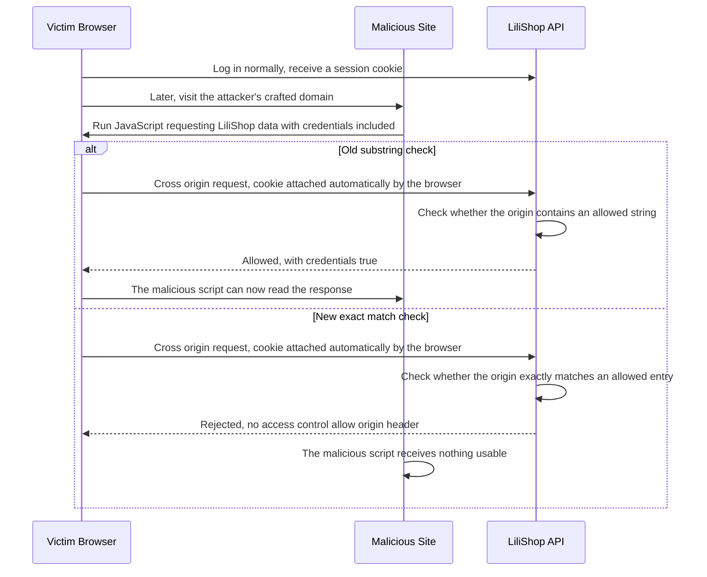
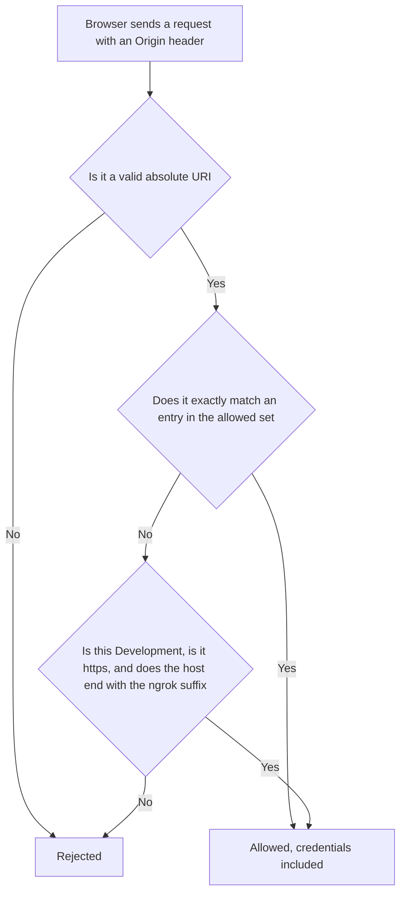

# 🌍 LiliShop Security Series — Part 8: CORS Misconfiguration & Security Headers

> A single method name, used two different ways, is the whole story of this document's central bug. `Contains` checking whether one string sits *inside* another was the vulnerability. `Contains` checking whether a value exists *exactly* in a set is the fix. Same word, opposite meaning — and the difference between them decided whether an attacker's website could read a logged-in visitor's private LiliShop data.

This document assumes **no prior knowledge of CORS, browser security policies, or HTTP headers**. Every concept is explained in plain English the first time it appears, using LiliShop's real backend configuration code throughout.

> [!NOTE]
> This is **Part 8** of the LiliShop security series. It was originally just one line in Part 1's summary table — *"CORS misconfiguration... replaced with exact-match origin comparison"* — the same way Google Sign-In, SSRF, and IDOR each started as a single row before becoming their own full documents. This is that row, expanded.

---

## 📑 Table of Contents

1. [Introduction](#1-introduction)
2. [Core Concepts](#2-core-concepts)
   - [2.1 What Is CORS, Really?](#21-what-is-cors-really)
   - [2.2 The Same-Origin Policy](#22-the-same-origin-policy)
   - [2.3 What Is an "Origin"?](#23-what-is-an-origin)
   - [2.4 Why Credentials Change Everything](#24-why-credentials-change-everything)
3. [The Vulnerability: Substring Matching](#3-the-vulnerability-substring-matching)
4. [The Attack, Step by Step](#4-the-attack-step-by-step)
5. [The Fix: Exact-Match Allowlisting](#5-the-fix-exact-match-allowlisting)
   - [5.1 Two Different `Contains` — Don't Confuse Them](#51-two-different-contains--dont-confuse-them)
   - [5.2 The Ngrok Exception, Done Safely](#52-the-ngrok-exception-done-safely)
   - [5.3 Why `AllowAnyHeader` / `AllowAnyMethod` Is Fine](#53-why-allowanyheader--allowanymethod-is-fine)
6. [Security Headers: Four Small Lines, Four Different Jobs](#6-security-headers-four-small-lines-four-different-jobs)
   - [6.1 `X-Content-Type-Options`](#61-x-content-type-options)
   - [6.2 `X-Frame-Options` and `Content-Security-Policy`](#62-x-frame-options-and-content-security-policy)
   - [6.3 `Referrer-Policy` — Connecting Back to Part 7](#63-referrer-policy--connecting-back-to-part-7)
7. [The Complete Flow](#7-the-complete-flow)
8. [Advantages & Residual Considerations](#8-advantages--residual-considerations)
9. [Glossary](#9-glossary)
10. [Appendix: Quick Reference](#10-appendix-quick-reference)

---

## 1. Introduction

Browsers already protect you from one website reading another website's data, by default, automatically, without any code needing to ask for it. That protection is the whole reason this document exists — because LiliShop's server has to explicitly tell browsers "actually, trust *this* other website too," and the way that instruction was originally written was, in one specific and serious way, wrong.

This document covers two related things: **CORS**, the mechanism controlling which other websites are allowed to make requests to LiliShop's API and read the results, and **security headers**, a handful of small response headers that each close a different, narrower gap in how browsers handle LiliShop's content.

> [!WARNING]
> Before this fix, a specifically-crafted domain name could pass LiliShop's origin check despite being owned by an attacker, not LiliShop. Combined with credentialed CORS, this meant a logged-in visitor who simply visited that attacker's page could have their authenticated LiliShop data read by that page's own JavaScript — without clicking anything, without entering any credentials on the attacker's site at all.

---

## 2. Core Concepts

### 2.1 What Is CORS, Really?

**CORS** stands for **Cross-Origin Resource Sharing**. The single most important thing to understand about it, before anything else: **CORS is a browser feature, not a server security feature.** It doesn't protect a server from anything on its own. What it actually does is let a *server* tell *browsers*, "it's fine for JavaScript running on these other websites to read responses from me."

This framing matters, because a common misconception is thinking of CORS misconfiguration as "the server got broken into." Nothing was broken into. The server simply told browsers to trust something it shouldn't have.

### 2.2 The Same-Origin Policy

To understand what CORS is loosening, you need to know what browsers do *without* it. Every browser enforces the **same-origin policy** by default: JavaScript running on `attacker.com` cannot read the response of a request it makes to `api.lilishop.com`. This isn't optional, and it isn't something LiliShop's code has to turn on — it's just how browsers already behave.

CORS exists purely to create *exceptions* to that default. A server can say "I'll allow this specific other origin to read my responses" — and that's exactly what LiliShop's CORS policy does, for its own frontend (running on a different port during development, or a different domain in some deployments) and a small allowlist of other trusted origins.

### 2.3 What Is an "Origin"?

An **origin** is the combination of scheme (`http` or `https`), hostname, and port. Change *any one* of those three things, and you have a different origin, as far as the browser is concerned — even if two addresses look almost identical to a human. `http://localhost:4200` and `https://localhost:4200` are different origins (different scheme). `http://localhost:4200` and `http://localhost:4201` are different origins (different port). This precision matters, because it's exactly the kind of precision the vulnerable code in Section 3 failed to apply.

### 2.4 Why Credentials Change Everything

CORS has a separate, opt-in setting for whether cross-origin requests are allowed to carry **credentials** — cookies, in LiliShop's case, specifically the refresh-token cookie covered in Part 2's MFA document. Without credentials, a cross-origin request from an allowed origin can typically only read public, non-personalized data. *With* `AllowCredentials()` turned on, an allowed origin's JavaScript can make requests that automatically carry the visitor's own login cookie — meaning it can act, and read data, *as that logged-in visitor*.

This is the detail that turns a loose origin check from "mildly sloppy" into "a real vulnerability." An imprecise allowlist without credentials mostly risks letting an unintended site read non-sensitive public data. The exact same imprecise allowlist, *with* `AllowCredentials()` — which is exactly LiliShop's configuration — risks letting an unintended site read another user's authenticated, private data.

---

## 3. The Vulnerability: Substring Matching

The original CORS check used a pattern like `origin.Contains("https://web.postman.co")`. To understand exactly why this is dangerous, it helps to be precise about what `string.Contains` actually does: it checks whether one string appears *anywhere* inside another — beginning, middle, or end. It says nothing about where the match occurs, or what surrounds it.

Here's the concrete consequence, laid out string by string:

| Origin the browser actually sent | Does it contain `"https://web.postman.co"`? | *Should* it be allowed? | Old check's answer |
|---|---|---|---|
| `https://web.postman.co` | Yes (it's the whole string) | Yes | ✅ Allowed (correct) |
| `https://web.postman.co.attacker.com` | Yes (as a prefix) | **No** | ❌ Allowed (bug) |
| `http://localhost:42000` | Yes, if checked against `"http://localhost:4200"` | **No** | ❌ Allowed (bug) |

Look at that second row closely. `https://web.postman.co.attacker.com` is a domain the attacker fully controls — they registered `attacker.com`, and `web.postman.co.attacker.com` is simply a subdomain of their own domain, one they can create freely, with no relationship to the real Postman company at all. But as a literal string, it genuinely does contain `"https://web.postman.co"` as its first several characters. `Contains` doesn't know or care that everything after that point belongs to someone else entirely — it already found its match and stopped looking.

The third row shows the same problem in a different shape: `http://localhost:42000` isn't even a subdomain trick, it's just a longer port number that happens to start with the digits of an allowed one. Depending on exactly how the old check was written, values like this could also slip through the same substring logic.

---

## 4. The Attack, Step by Step

Here's how Section 3's flawed check, combined with Section 2.4's `AllowCredentials()`, becomes an actual attack — not a hypothetical, but the specific mechanism this fix closes:



Walk through the "old" branch slowly, because each step is doing something specific:

1. **The victim never does anything unusual.** They log into LiliShop normally, on LiliShop's real site. Their browser now holds a valid session cookie.
2. **Later, separately, they visit an attacker's page** — say, `https://web.postman.co.attacker.com`, chosen precisely because it passes the flawed check. This could arrive via a phishing link, a malicious ad, anything that gets a victim to load *any* page on that domain.
3. **That page's JavaScript makes a request to LiliShop's API**, with `credentials: 'include'` (or the browser's default credentialed behavior for same-site-style requests, depending on cookie settings) — this is ordinary JavaScript, nothing exotic, running entirely on the attacker's own page.
4. **The browser attaches the victim's cookie automatically.** This is a critical detail worth being explicit about: cookies are sent based on which domain the request is *going to* (LiliShop), not which domain the *script* came from (the attacker's page). The victim's browser doesn't know or care that the JavaScript asking for this request originated somewhere untrustworthy.
5. **LiliShop's old check says yes.** The origin `https://web.postman.co.attacker.com` "contains" the allowed string, so the server responds as if this were a trusted origin — including the headers that grant permission to read the response *with* credentials.
6. **The browser, seeing those headers, lets the attacker's script read the response.** Whatever that endpoint would have returned to the real, logged-in victim — their account details, order history, whatever the API call targeted — is now readable by code the attacker wrote.

Notice the victim clicked nothing suspicious-looking, typed no credentials into any attacker-controlled form, and would have no way to know this happened just by looking at the page. The entire attack lives in a mismatch between what the *browser* correctly did (attach the real cookie, respect the CORS headers it was given) and what the *server* incorrectly told it (that this origin was trustworthy).

---

## 5. The Fix: Exact-Match Allowlisting

Here's the real, current code:

```csharp
var allowedExactOrigins = new HashSet<string>(StringComparer.OrdinalIgnoreCase)
{
    "http://localhost:4200",
    "https://web.postman.co"
};

var allowNgrokTunnels = builder.Environment.IsDevelopment();

opt.AddPolicy("CorsPolicy", policy =>
{
    policy.AllowAnyHeader()
    .AllowAnyMethod()
    .AllowCredentials()
    .SetIsOriginAllowed(origin =>
    {
        if (string.IsNullOrWhiteSpace(origin) ||
            !Uri.TryCreate(origin, UriKind.Absolute, out var uri))
        {
            return false;
        }

        if (allowedExactOrigins.Contains(origin))
        {
            return true;
        }

        return allowNgrokTunnels &&
               uri.Scheme == Uri.UriSchemeHttps &&
               uri.Host.EndsWith(".ngrok-free.app", StringComparison.OrdinalIgnoreCase);
    });
});
```

### 5.1 Two Different `Contains` — Don't Confuse Them

This is worth stopping on, because the fixed code still has a line that says `.Contains(origin)`, and it would be easy to assume nothing actually changed:

```csharp
if (allowedExactOrigins.Contains(origin))
```

This is **not** the same operation as Section 3's vulnerable check, despite sharing a method name. `allowedExactOrigins` is a `HashSet<string>` — and `HashSet<T>.Contains` asks a completely different question than `string.Contains` does. `string.Contains` asks "does this substring appear anywhere inside this larger string?" `HashSet<string>.Contains` asks "does this *entire* string exactly match one of the complete entries stored in this collection?" `"https://web.postman.co.attacker.com"` is not, in its entirety, equal to the entry `"https://web.postman.co"` — so this check correctly returns `false` for it, where the old `string.Contains` version returned `true`.

Same English word, same method name even — genuinely opposite behavior, because the *type* it's called on determines what "contains" means. Worth reading code like this carefully rather than pattern-matching on the method name alone.

### 5.2 The Ngrok Exception, Done Safely

**Ngrok** is a tool that gives anyone a free, instant, public HTTPS URL tunneling to a service running on their own machine — genuinely useful for local development, since it lets you test how your app behaves when accessed via a real public URL rather than `localhost`. LiliShop's policy allows any `*.ngrok-free.app` origin, but only under specific conditions:

```csharp
return allowNgrokTunnels &&
       uri.Scheme == Uri.UriSchemeHttps &&
       uri.Host.EndsWith(".ngrok-free.app", StringComparison.OrdinalIgnoreCase);
```

Compare `EndsWith` here against `Contains` from Section 3, with real strings:

| Host | Ends with `.ngrok-free.app`? | Would the old `Contains` pattern have matched? |
|---|---|---|
| `abc123.ngrok-free.app` | ✅ Yes — genuinely correct | Yes |
| `ngrok-free.app.attacker.com` | ❌ No — this string ends in `.attacker.com` | Yes — this is exactly the substring trap |

`EndsWith`, anchored specifically to the *end* of the string, with a leading dot baked into the pattern (`".ngrok-free.app"`, not `"ngrok-free.app"`), is the correct way to check a subdomain suffix. An attacker's domain can be crafted to *contain* `ngrok-free.app` somewhere in the middle, but they cannot make their own domain *genuinely end with* a suffix they don't control the DNS for — `ngrok-free.app` is a real domain owned by the ngrok company, not something an attacker can forge the ending of.

`allowNgrokTunnels` being gated to `builder.Environment.IsDevelopment()` is the other half of this safety: even a *correctly written* suffix check would be a real risk in production, because ngrok tunnels are free and instant for anyone to create. If this exception applied in production, any stranger on the internet could spin up their own tunnel and gain a domain that would pass this check — turning a developer convenience into an open door. Restricting it to `Development` means this exception simply doesn't exist as an attack surface in the environment that actually matters.

### 5.3 Why `AllowAnyHeader` / `AllowAnyMethod` Is Fine

A natural question worth answering directly: if the fix is all about being strict, why does the same policy allow *any* header and *any* HTTP method?

The answer is that the **origin check is the actual security boundary** in a CORS policy — header and method restrictions exist mostly for fine-grained control over API shape, not as a primary line of defense. An attacker who can't pass the origin check at all doesn't benefit from `AllowAnyHeader` being permissive, because they never get past the first gate. Being generous with headers and methods is a reasonable, low-risk choice specifically *because* the origin allowlist is now solid — tightening a secondary control doesn't meaningfully add security once the primary one is correctly enforced.

---

## 6. Security Headers: Four Small Lines, Four Different Jobs

```csharp
headers["X-Content-Type-Options"] = "nosniff";
headers["X-Frame-Options"] = "DENY";
headers["Referrer-Policy"] = "strict-origin-when-cross-origin";
headers["Content-Security-Policy"] = "frame-ancestors 'none'";
```

Unlike CORS, which is one mechanism with several moving parts, these four headers are each independent, unrelated defenses that happen to be set together because they're all simple, response-wide instructions to the browser. Worth taking each on its own.

### 6.1 `X-Content-Type-Options`

`nosniff` stops a browser from **guessing** a file's type based on its content, overriding what the server actually declared. Without this header, a browser might look at an uploaded file's bytes, decide "this looks like it could be HTML," and render it as a webpage — script tags and all — even though the server's `Content-Type` header said it was a plain image. This matters specifically wherever LiliShop accepts file uploads (product photos, for instance): it closes a path where a cleverly-crafted "image" could otherwise be interpreted as executable content by a browser that decided to second-guess the server.

### 6.2 `X-Frame-Options` and `Content-Security-Policy`

```
X-Frame-Options: DENY
Content-Security-Policy: frame-ancestors 'none'
```

Both of these do the same job through two different mechanisms: they stop any other website from embedding LiliShop's pages inside an `<iframe>`. This matters because of an attack called **clickjacking**: an attacker builds their own page, invisibly overlays a real LiliShop page inside a transparent iframe on top of their own decoy content, and tricks a victim into clicking something that looks harmless on the decoy — but is actually a real click landing on the invisible LiliShop page underneath, potentially triggering a real action (like confirming a purchase, or changing account settings) the victim never intended.

Why both headers, doing the same job? `X-Frame-Options` is the older mechanism, understood by essentially every browser. `frame-ancestors` (part of CSP) is the modern replacement, more flexible but not universally supported by very old browsers. Setting both is a deliberate belt-and-suspenders choice — whichever one a given browser understands, the protection still applies.

### 6.3 `Referrer-Policy` — Connecting Back to Part 7

```
Referrer-Policy: strict-origin-when-cross-origin
```

This one is worth connecting directly to Part 7 of this series. The **`Referer`** header (note the famous historical misspelling — it's baked permanently into the HTTP standard) is what a browser sends to tell a destination site "here's the page the visitor was just on before clicking this link." Without a `Referrer-Policy`, a browser's default behavior can send the *full URL* of the page someone is leaving — including its query string.

Recall Part 7's running example: `confirm-email?token=...`. If a user were on a page whose URL contained a sensitive token, and clicked a link leading *away* from LiliShop to some other site, the full URL — token included — could leak to that destination site via the `Referer` header, entirely separately from anything covered in the logging discussion in Part 7.

`strict-origin-when-cross-origin` closes this specific gap with a simple rule: for a same-origin navigation (staying within LiliShop), the full URL is still sent, since there's no cross-boundary leak risk. For a cross-origin navigation (leaving LiliShop for another site), only the bare origin is sent — `https://lilishop.com`, with no path and no query string — never enough detail to leak a token.

---

## 7. The Complete Flow

Here's the full origin-checking decision, every branch from Sections 3 and 5 tied together:



Trace `https://web.postman.co.attacker.com` through this exact diagram: it's a valid URI, so it passes the first gate. It does *not* exactly match `"https://web.postman.co"` as a complete string, so the second gate fails. It's not a `.ngrok-free.app` host either, so the third gate fails too. It reaches `F` — rejected — every single time, regardless of which developer wrote the check or which environment it's running in, because the logic no longer has a substring-shaped gap for a crafted domain to slip through.

---

## 8. Advantages & Residual Considerations

### ✅ Advantages

- **The origin check is now precise by construction, not by convention.** Exact-match comparison and anchored suffix matching don't rely on developers remembering to be careful with future edits the way a substring check silently invites mistakes — the data structure itself (a `HashSet` of complete strings) makes the imprecise version harder to accidentally write again.
- **The risky exception is scoped to where it can't cause real harm.** Section 5.2's ngrok allowance is both correctly implemented (anchored suffix, not substring) *and* environment-gated — two independent reasons it can't become a production risk, not just one.
- **Security headers cover genuinely different threats with minimal code.** Four lines, four unrelated attack classes (content-type confusion, clickjacking twice over, referrer leakage) — a good example of cheap, broad-coverage defenses that don't require ongoing maintenance to keep working.
- **A direct, traceable connection to Part 7's findings.** Section 6.3 isn't a coincidental overlap — `Referrer-Policy` and the logging `IncludeQueryString=false` setting are two independent defenses against the same underlying risk (a token riding along in a URL), approached from two different angles.

### ⚠️ Residual Considerations

- **The Content-Security-Policy is intentionally narrow.** Only `frame-ancestors 'none'` is set. CSP is capable of far more — restricting which script and style sources the browser will even execute, which is CSP's strongest weapon against XSS — but building a complete CSP for an Angular SPA that legitimately talks to Stripe, Google, Cloudinary, and Printess without breaking something is a genuinely involved undertaking. This document should be read as "CSP doing one specific, narrow job well," not "CSP fully configured."
- **No `Permissions-Policy` header.** This header lets a site explicitly disable browser features (camera, microphone, geolocation) it never uses, reducing what a compromised page could access even in a worst-case scenario. Not a vulnerability by its absence — just a header some more hardened configurations include that this one currently doesn't.
- **A middleware-ordering question worth verifying independently, not asserting as fact.** `UseCors("CorsPolicy")` runs before `UseRouting()` in LiliShop's pipeline. Current Microsoft guidance for endpoint routing commonly recommends `UseRouting()` → `UseCors()` → `UseAuthentication()` → `UseAuthorization()`. This document can't confirm with certainty whether the current ordering causes a practical issue here — LiliShop appears to use a single global CORS policy rather than per-endpoint `[EnableCors]` overrides, which is the scenario where this kind of ordering tends to matter most — but it's flagged honestly as worth checking against current official documentation rather than left unmentioned or asserted as definitely correct.

---

## 9. Glossary

| Term | Meaning |
|---|---|
| **CORS (Cross-Origin Resource Sharing)** | A browser mechanism letting a server grant other origins permission to read its responses |
| **Same-origin policy** | The browser's default rule that JavaScript on one origin cannot read responses from a different origin |
| **Origin** | The combination of scheme, hostname, and port that defines a distinct source in browser security |
| **Credentials (in CORS)** | Cookies (or similar) automatically attached to a request, letting a cross-origin call act as a logged-in user |
| **Clickjacking** | Tricking a user into clicking something real, hidden inside an invisible frame beneath decoy content |
| **`Referer` header** | The (famously misspelled) HTTP header telling a destination site which page a visitor came from |
| **CSP (Content Security Policy)** | A header controlling what content types, scripts, and frames a browser is allowed to load or embed for a page |
| **Substring match** | A check for whether one string appears anywhere inside another, regardless of position |
| **Exact match** | A check for whether two strings are identical in their entirety |

---

## 10. Appendix: Quick Reference

```csharp
// The line that matters most in this whole document — a HashSet check, not a substring check:
if (allowedExactOrigins.Contains(origin)) { return true; }

// The correctly-anchored suffix check, safe against the same trick that broke the old code:
uri.Host.EndsWith(".ngrok-free.app", StringComparison.OrdinalIgnoreCase)
```

| Header | Protects against | One-line reason |
|---|---|---|
| `X-Content-Type-Options: nosniff` | Content-type confusion | Stops a browser from reinterpreting a file as something more dangerous than declared |
| `X-Frame-Options: DENY` | Clickjacking (legacy browsers) | Blocks embedding LiliShop in another site's iframe |
| `Content-Security-Policy: frame-ancestors 'none'` | Clickjacking (modern browsers) | Same protection, current standard |
| `Referrer-Policy: strict-origin-when-cross-origin` | URL/token leakage via outbound links | Strips path and query string for cross-origin navigation |

---

<div align="center">

*Part 8 of the LiliShop security series. This document uses LiliShop's real backend configuration code as its running example throughout.*

</div>
