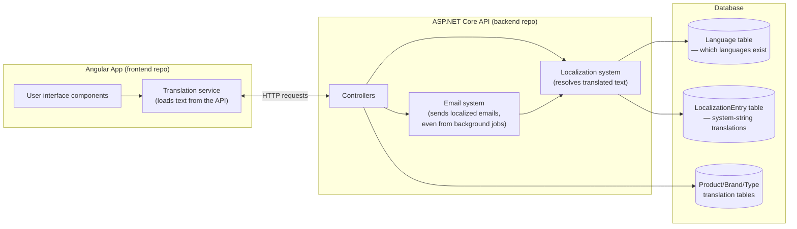
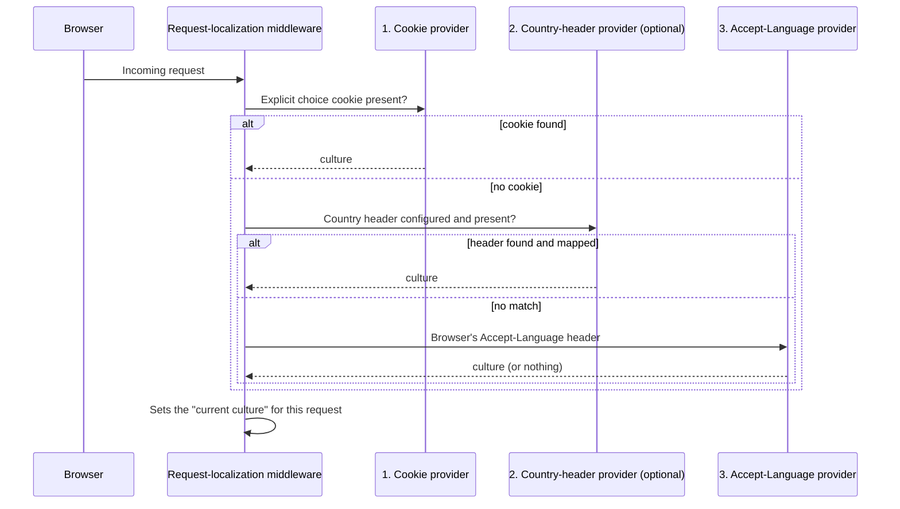

# LiliShop Localization Architecture — Deep Dive

*A code-enriched, part-by-part walkthrough of LiliShop's database-driven multilingual system, built for developers learning from the project.*

## Table of Contents

- [Part 00 — Introduction and Architecture Overview](#part-00)
- [Part 01 — The Localization Problem and Architecture Decisions](#part-01)
- [Part 02 — Database Design and Translation Models](#part-02)
- [Part 03 — Backend System Translations with `IStringLocalizer`](#part-03)
- [Part 04 — Request Culture Resolution and Runtime Language Activation](#part-04)
- [Part 05 — Caching and Versioning Strategy](#part-05)
- [Part 06 — Dynamic Language and Translation Management](#part-06)
- [Part 07 — Business Data Localization](#part-07)
- [Part 08 — Angular Runtime Translation System](#part-08)
- [Part 09 — Language Detection and RTL Support](#part-09)
- [Part 10 — Localized Email Architecture](#part-10)
- [Part 11 — Security Considerations](#part-11)
- [Part 12 — Testing Strategy](#part-12)
- [Part 13 — Lessons Learned and Future Improvements](#part-13)

---


<a id="part-00"></a>

## Part 00 — Introduction and Architecture Overview

### Who this tutorial is for

This is a tutorial for developers. It walks through a real, working multilingual (multi-language) system built into an e-commerce application called **LiliShop**, and explains not just *what* the code does, but *why* it was built this way.

You don't need to know anything about LiliShop before reading this. You do need basic familiarity with web development — what a database table is, what an API endpoint is, what a frontend framework does. Anything more specific than that (ASP.NET Core concepts, Angular concepts, caching, cryptography) will be explained the first time it comes up, in plain language, before we use the technical term.

By the end of this series, you should understand:
- How to make an application support many languages without hardcoding them.
- How to let a non-developer edit translated text without a software deployment.
- How to keep that system fast, even though it reads from a database instead of files.
- How to make languages "sound right" in emails sent from background jobs that have no user request to work with.
- How to detect a visitor's likely language without asking them or tracking their location.
- How the same translation catalog covers authentication messages too — like the confirmation shown after a password-reset request — without turning into a second, drift-prone translation system.
- What trade-offs were made along the way, and why.

### What "multilingual" means in LiliShop, concretely

LiliShop is an online shop. Before this feature existed, every piece of text in the application — button labels, error messages, product names, confirmation emails — existed in exactly one language. This project added support for **11 languages**:

| Code | Language | Direction |
|---|---|---|
| `en` | English (default) | Left-to-right |
| `de` | German | Left-to-right |
| `fa` | Persian | Right-to-left |
| `ru` | Russian | Left-to-right |
| `es` | Spanish | Left-to-right |
| `hi` | Hindi | Left-to-right |
| `zh` | Chinese | Left-to-right |
| `ar` | Arabic | Right-to-left |
| `tr` | Turkish | Left-to-right |
| `da` | Danish | Left-to-right |
| `sv` | Swedish | Left-to-right |

This list comes directly from the application's seed data (`languages.json` in the backend project) and is not hardcoded anywhere as a fixed list — it lives in a database table, which is one of the central ideas this tutorial series will keep coming back to. Here's the actual beginning of that seed file, so you can see the shape of the real data behind the table above:

<details>
<summary>Data/SeedData/languages.json (first three entries, shortened)</summary>

```json
[
  {
    "Code": "en",
    "NativeName": "English",
    "EnglishName": "English",
    "Direction": "Ltr",
    "IsActive": true,
    "IsDefault": true,
    "DisplayOrder": 1,
    "CountryCodes": "US,GB,CA,AU,NZ,IE,ZA,SG"
  },
  {
    "Code": "de",
    "NativeName": "Deutsch",
    "EnglishName": "German",
    "Direction": "Ltr",
    "IsActive": true,
    "IsDefault": false,
    "DisplayOrder": 2,
    "CountryCodes": "DE,AT,CH,LI,LU"
  },
  {
    "Code": "fa",
    "NativeName": "فارسی",
    "EnglishName": "Persian",
    "Direction": "Rtl",
    "IsActive": true,
    "IsDefault": false,
    "DisplayOrder": 3,
    "CountryCodes": "IR,AF,TJ"
  }
  // ... 8 more languages, same shape
]
```

</details>

Every field you'll learn about in [Part 02](#part-02) is already visible here in plain JSON: a `Code`, a human-readable name in two forms, a `Direction`, an `IsActive`/`IsDefault` flag pair, a `DisplayOrder`, and a `CountryCodes` list. This JSON file is only ever read once, to *seed* a fresh database — after that, everything about a language lives in the database table, editable through the admin screens covered in [Part 06](#part-06).

A quick vocabulary note before we go further, since these two words will appear constantly:

- **Culture code**: a short string that identifies a language (and sometimes a region), like `en`, `de`, or `fa`. Some systems use more specific codes like `de-DE` (German, as spoken in Germany) versus `de-AT` (German, as spoken in Austria). LiliShop mostly works with the simpler two-letter form.
- **Locale**: closely related to "culture," but usually refers to everything that changes based on a user's region and language together — not just the words on screen, but also how dates, numbers, and currency are displayed (for example, whether a decimal point or a decimal comma is used).

Two of LiliShop's 11 languages — Persian and Arabic — are **right-to-left (RTL)** languages. That means the entire page layout has to mirror itself: text starts on the right edge of the screen instead of the left, navigation menus flip, and even icons that imply direction (like an arrow "back" button) need to point the other way. The other nine languages are **left-to-right (LTR)**, the direction most Western languages and most English-speaking developers are used to by default. Supporting RTL is not just a translation problem — it's a layout problem, and we'll dedicate a full chapter ([Part 09](#part-09)) to how LiliShop solves it.

### The two codebases

LiliShop is built as two separate applications that talk to each other over HTTP:

- **`LiliShop-backend-dotnet`** — a .NET (C#) API server, built using a style called **Clean Architecture**. In short, this means the codebase is organized into layers, where each layer has one job and doesn't need to know the details of the layers around it. We'll explain each layer as we encounter it, but at a glance:
  - **Domain** — the core data shapes (e.g., "a Product has a Name and a Price"), with no dependency on databases, web frameworks, or anything external.
  - **Application** — the business rules and the *interfaces* (contracts) that describe what operations are available, without saying how they're implemented.
  - **Infrastructure** — the actual implementations: talking to the SQL database, talking to Redis (a caching system we'll explain in [Part 05](#part-05)), sending emails, and so on.
  - **API** — the outermost layer: the controllers that turn incoming HTTP requests into calls against the Application layer, and turn the results back into HTTP responses.

- **`LiliShop-frontend-angular`** — the shopper- and admin-facing website, built with Angular, a JavaScript/TypeScript framework for building web user interfaces.

This separation matters for localization specifically because **translated text has to be correct in three very different places**: on screen in the Angular app, inside error messages the .NET API sends back, and inside emails the .NET backend generates — sometimes with no web request involved at all (more on that in a moment). Understanding both codebases, and how they agree on "what language is this?", is the core subject of this tutorial.

### The two localization systems, and why there are two

Here is the single most important architectural fact to understand before reading anything else in this series: **LiliShop's translated content is split into two independent systems**, because the two kinds of content behave completely differently.

#### System 1 — System strings (UI text, error messages, email copy)

Things like "Add to Cart," "Your email or password is incorrect," or "Your order has shipped" are **system strings**: short pieces of text that are part of the *application itself*, not part of the shop's product catalog. There's a fixed, known set of these (currently a few hundred), and the same text ("Add to Cart") needs to be translated once per language and then reused everywhere it appears.

These are stored in a database table called `LocalizationEntry`. Each row is one translated phrase for one language, addressed by a short identifier called a **key** — for example, the key `Auth.InvalidCredentials` might map to "Your email or password is incorrect" in English and "Ihre E-Mail-Adresse oder Ihr Passwort ist falsch" in German. We'll dig into this table's exact structure in [Part 02](#part-02), and into exactly how a key gets turned into displayed text in [Part 03](#part-03).

#### System 2 — Business data (product names, brand names, category names)

A product name like "Wireless Bluetooth Headphones" is completely different from a system string. There isn't a small, fixed catalog of product names — there could be thousands of products, each needing its own translation into each of the 11 languages, and new products are added constantly by shop administrators, not developers.

These translations live in their own tables — one for products, one for product brands, one for product types (categories) — separate from the `LocalizationEntry` table entirely. We'll cover exactly how this works, including what happens when a product *hasn't* been translated into a given language yet, in [Part 07](#part-07).

#### Why not just use one system for both?

It might seem simpler to store everything — UI text and product names alike — in one big table. LiliShop's design deliberately doesn't do that, and the reasoning is a preview of a theme that runs through this whole series: **the two kinds of content have different shapes, different volumes, and different owners**, so combining them would make both harder to work with. System strings are a small, mostly-fixed set edited occasionally by an administrator through a translation-management screen. Product translations are potentially huge in number, tied directly to a specific product record, and edited by whoever manages that product. [Part 01](#part-01) goes into this trade-off — and the other major architecture decisions — in much more depth.

### The core idea: translations live in the database, not in files

If you've worked with localization in other applications, you may have seen it done with **files**: a `.resx` file per language in .NET, or a `messages.json` per language in a JavaScript app. Every translated string sits in a file that's part of the source code, gets committed to version control, and only takes effect after the application is rebuilt and redeployed.

LiliShop takes a different approach: **almost all translated text lives in the database**, not in files, and can be added or edited by an administrator through a web page, taking effect immediately — with no code change, no rebuild, and no redeployment.

This single decision is what makes almost everything else in this tutorial series necessary:

- Because translations live in a database instead of files, reading them on every request would normally be slow — so LiliShop needed a **caching strategy** ([Part 05](#part-05)) to keep things fast.
- Because a database can be updated by an admin at any moment, the running application needs a way to find out "did anything change?" without constantly re-reading the whole database — that's the **versioning** part of [Part 05](#part-05).
- Because languages themselves (not just their translated text) are rows in a database table, a brand-new language can be **activated without a deployment** — that's the subject of Parts [04](#part-04) and [06](#part-06).
- Because emails are sometimes sent by background processes with no active web request, and those processes still need to read from the same database-backed translation system, a specific piece of engineering was needed to make that work reliably — that's [Part 10](#part-10).

[Part 01](#part-01) explains this decision in full detail, including exactly what problems a file-based approach would have caused for LiliShop specifically, and what alternatives (JSON bundles, third-party translation services) were considered and rejected.

### A first look at the moving parts

Before diving into any single piece, it helps to see how the major pieces fit together. This diagram is deliberately simplified — every box here gets its own detailed explanation in a later file.



A few things worth noticing already, even before we explore each box:

- The **Language table** is read by nearly everything — it's the single source of truth for "which languages exist right now, and what are their properties (name, direction, is it currently active)?"
- The **frontend never hardcodes a list of languages or a list of translated phrases**. It asks the backend, at startup, "what languages exist?" and "what does each phrase translate to in my chosen language?" We'll see exactly how in [Part 08](#part-08).
- The **email system reuses the exact same localization system** as the rest of the API — it doesn't have its own separate set of translated email templates per language. [Part 10](#part-10) explains why that reuse was possible and what problem it solved.

### What "verified" means in this series

Before we go further, one commitment: **everything in this tutorial series is based on directly reading LiliShop's actual source code** — real class names, real file paths, real database columns, and now, real code snippets pulled straight from the repositories. Where something is unclear from the code, or where a feature described here has a known limitation, this series will say so explicitly rather than guessing. You'll see this most clearly in [Part 09](#part-09) (language detection has real, acknowledged limitations) and [Part 13](#part-13) (a closing, honest assessment of what's production-ready versus what would need more work).

### How this series is organized

This is Part [0](#part-00) of [14](#part-14). Each Part builds on the ones before it — you can read them in order, or, once you understand this introduction, jump to whichever topic you need. Here's the full map:

| # | Part | What it covers |
|---|---|---|
| 00 | Introduction and Architecture Overview | *You are here.* |
| 01 | The Localization Problem and Architecture Decisions | Why database-driven translations were chosen over files, JSON bundles, or third-party services |
| 02 | Database Design and Translation Models | The actual tables: `Language`, `LocalizationEntry`, and the product/brand/type translation tables |
| 03 | Backend System Translations with `IStringLocalizer` | How a translation key becomes displayed text on the server |
| 04 | Request Culture Resolution and Runtime Language Activation | How the server figures out which language to use for a given request, and how a new language goes live instantly |
| 05 | Caching and Versioning Strategy | How the database-backed system stays fast, and how it knows when to refresh |
| 06 | Dynamic Language and Translation Management | The admin screens for managing languages and editing translations |
| 07 | Business Data Localization | How product, brand, and category names get translated |
| 08 | Angular Runtime Translation System | How the frontend loads and displays translated text |
| 09 | Language Detection and RTL Support | How LiliShop guesses a new visitor's language, and how right-to-left layout works |
| 10 | Localized Email Architecture | How emails — including ones sent by background jobs — get sent in the right language |
| 11 | Security Considerations | How LiliShop protects a specific, security-sensitive email link (unsubscribing) |
| 12 | Testing Strategy | What's automatically tested, and what specific mistakes each test prevents |
| 13 | Lessons Learned and Future Improvements | What to take away for your own projects, and what LiliShop's system still doesn't do |

Let's start with **why** this system was built the way it was — [Part 01](#part-01).

***

<a id="part-01"></a>

## Part 01 — The Localization Problem and Architecture Decisions

Part [00](#part-00] told you *what* LiliShop built: a system where translated text lives in a database instead of in files, and can be edited by an administrator without a deployment. Before we look at *how* it's built, this Part explains *why* that specific choice was made. Understanding the reasoning here will make every later Part easier to follow, because almost every technical decision in this series traces back to the problem explained on this page.

### Start with the obvious approach, and why it doesn't hold up

If you've never built a multilingual application before, the "obvious" way to do it is to keep a file of translated text for each language. In the .NET world, this is usually done with **`.resx` files** — one file per language, containing a list of key/value pairs, something like:

```
Auth.InvalidCredentials = "Your email or password is incorrect"
```

You'd have `Messages.resx` (the default, usually English), `Messages.de.resx` (German), `Messages.fa.resx` (Persian), and so on — one file per language, sitting inside the project's source code.

This is a completely reasonable approach for many applications, and it's what ASP.NET Core supports out of the box. So why didn't LiliShop use it?

#### Problem 1: every translation fix requires a deployment

A `.resx` file is a source file. It gets compiled into the application when the application is built. If a translator finds a typo in the German text three weeks after launch — or if the shop wants to reword a single sentence in the checkout flow — fixing it means:

1. A developer edits the file.
2. The change goes through code review.
3. The application is rebuilt.
4. The application is redeployed to production.

For a single sentence of copy. On a shop that is actively taking orders in 11 languages, translation tweaks are not rare events — they happen constantly, as content teams review live text, run marketing campaigns, or notice something reads awkwardly in a language the original developer doesn't speak. Tying every one of those tweaks to a full software deployment is slow, and it puts translation quality in the hands of people who have to ask a developer to do something as small as fixing a comma.

#### Problem 2: it doesn't fit the people who need to edit it

Related to the above: `.resx` files live in source control, in a format most translators, administrators, or shop-content people are not equipped to edit safely. Someone without developer tools would need a developer's help just to change a sentence. LiliShop's requirement (visible directly in the codebase, which we'll examine in [Part 06](#part-06)) is a web-based admin screen where an authorized non-developer can search for a phrase, edit it, and save — and see the change reflected on the live site within moments, not after the next release.

#### The same two problems apply to JSON translation bundles

A common alternative — especially on the frontend side, where `.resx` doesn't even apply — is a **JSON translation bundle**: a file like `en.json`, `de.json`, `fa.json`, shipped as a static asset with the built frontend application. This is simpler than `.resx` and very common in JavaScript frameworks. But it has exactly the same two core problems: the files are part of the built application, so a text change means a frontend rebuild and redeploy, and it's not something a non-developer can safely edit through source control alone.

It also introduces a *third* problem, specific to LiliShop: a JSON bundle only solves translation for the frontend. It says nothing about how the **backend** — which generates error messages and emails — gets its text translated. You'd end up needing a second, separate mechanism for backend text, and now you have two translation systems that can drift out of sync with each other (the German word for "confirm" might read differently in an email than it does on a button, simply because they were translated by different people at different times using different tools).

#### Problem 3: third-party translation platforms solve a different problem

There are commercial platforms built specifically for managing translations (services like [Lokalise](https://lokalise.com/), [Crowdin](https://crowdin.com/), or [POEditor](https://poeditor.com/) are the general category — the Codebase Analysis Summary that this series is based on notes these as the kind of alternative considered, not as specific vendors LiliShop evaluated in detail). These tools are genuinely good at what they do: giving professional translators a proper workflow, tracking translation memory (reusing previous translations for similar phrases), and sometimes integrating machine translation.

But they come with real costs that mattered for this decision: they are an **external dependency** — your application now depends on a third-party service being available and affordable; they typically require a **network call at build time or runtime** to fetch translations; and for a project at LiliShop's current scale, the operational overhead of integrating and paying for such a platform is disproportionate to the actual problem being solved. This isn't a claim that such platforms are bad — only that they solve a *workflow and scale* problem LiliShop didn't yet have, while leaving the *redeploy* problem (the actual blocker) partly unsolved unless the platform also pushes translations into the running application without a rebuild.

A related idea is using a **CMS (content management system)** — a general-purpose tool for managing editable content — to hold translated text. This has the same shape of trade-off: good non-developer editing experience, but it's a second system a developer now has to keep in sync with the actual translation *keys* referenced in code, and it's a heavy tool to introduce just for short UI strings.

### The deciding factor: one catalog, three surfaces

Here is the specific fact from LiliShop's codebase that tips the decision, and it's worth understanding in detail because it's the single strongest piece of evidence for the architecture this series documents.

LiliShop's backend needs to produce translated text in **three different situations**, not just one:

1. **UI labels and messages** shown directly in the Angular application — the obvious case every localization approach handles.
2. **Error messages returned by the API.** When something goes wrong on the server — say, a login attempt fails — the backend doesn't just return a raw error code. It returns a human-readable message, and that message needs to be in the user's language too. In the actual code, this happens in a class called `OperationResultHandler`, which takes an internal error result and turns it into the HTTP response the frontend receives — and it looks up the translated version of that error message on the way out.
3. **Emails.** Confirmation emails, password reset emails, price-drop notifications — all generated entirely on the server, with no frontend involved at all, and all needing to be in the recipient's preferred language. In the actual code, this is handled by a class called `EmailComposer`.

Here's the problem a file-based (or frontend-only) approach creates: a JSON bundle shipped to the browser can translate a button label, but it cannot translate an error message generated deep inside the server, and it cannot translate the body of an email sent by a background process that never talks to a browser at all. You would need the JSON bundle for the frontend, *plus* some separate `.resx`-based mechanism for backend errors, *plus* some other mechanism for emails — three different translation systems, three different places a translator has to check, and three different chances for the same phrase to be translated inconsistently.

LiliShop's answer was to make **all three surfaces read from the same single catalog** — the `LocalizationEntry` database table introduced in [Part 00](#part-00). A translated string entered once by an administrator is immediately available to the UI, to server-side error messages, and to emails, because all three go through the same lookup mechanism underneath.

#### The mechanism that made this possible: `IStringLocalizer`

To understand how "the same lookup mechanism" is even possible across such different situations (a web request, a background email job), you need one piece of background about ASP.NET Core (the web framework LiliShop's backend is built on).

ASP.NET Core has a built-in, standard way for backend code to ask for a translated piece of text, called **`IStringLocalizer`**. Think of it as a simple contract: "give me a piece of text by its name (its key), and I'll hand you back the translated version for whatever language is currently active." Code that needs translated text doesn't need to know or care *where* that text is actually stored — a file, a database, anywhere — it just asks the `IStringLocalizer` for a key and gets a string back.

Normally, ASP.NET Core's built-in implementation of this contract reads from `.resx` files — that's the "default backing store" this tutorial keeps mentioning. LiliShop's key architectural move was: **keep using the standard `IStringLocalizer` contract everywhere in the codebase (so the code that consumes translations looks completely normal and idiomatic), but replace what's behind it** with a custom implementation that reads from the `LocalizationEntry` database table instead of `.resx` files.

Here's exactly where that swap happens — a single line, sitting among dozens of other, completely ordinary service registrations in the backend's dependency-injection setup:

<details>
<summary>API/Extensions/ApplicationServiceExtensions.cs (excerpt — the DI swap)</summary>

```csharp
// Localization Domain
services.AddScoped<ILanguageService, LanguageService>();
services.AddScoped<IBusinessTranslationService, BusinessTranslationService>();
services.AddScoped<ILocalizationEntryService, LocalizationEntryService>();
services.AddSingleton<IRequestCultureRefresher, RequestCultureRefresher>();

// Replaces the default .resx-based factory: all IStringLocalizer/IStringLocalizer<T>
// instances read from the LocalizationEntry table via HybridCache.
services.AddSingleton<IStringLocalizerFactory, DatabaseStringLocalizerFactory>();
```

</details>

That last line is the entire architectural pivot this Part has been building up to. Everywhere else in the codebase, code asks the dependency-injection container for an `IStringLocalizer` exactly the way any standard ASP.NET Core application would — nothing about *that* code changes. This one registration is what decides that every one of those requests gets served by `DatabaseStringLocalizer` (the class [Part 03](#part-03) opens up in full) instead of the framework's built-in `.resx` reader. Swap this one line back to the framework default, and every other line of localization-consuming code in the entire backend would keep compiling and running unchanged — it would just be reading from `.resx` files again. That's precisely the point of coding against an interface (`IStringLocalizerFactory`) instead of a concrete class.

This is why the same catalog can serve all three surfaces: `OperationResultHandler` (for error messages) and `EmailComposer` (for emails) both simply ask the standard `IStringLocalizer` for a translated string, exactly the same way any UI-facing code would. Neither of them needed to be taught anything special about databases or caching — that complexity is hidden behind the standard interface. [Part 03](#part-03) opens up this custom implementation in detail and shows exactly how a lookup works from end to end — including a third pattern, added later, where a service asks for `IStringLocalizer<SharedResource>` directly instead of going through `OperationResultHandler` at all, for a message that needed to be localized *before* a result object even existed.

### What this decision costs — and why it was worth it here

Every real trade-off has a downside, and this tutorial series tries to be honest about them rather than presenting one option as free of costs.

**Cost 1 — you have to build the caching yourself.** A `.resx` file is compiled directly into the application; reading it is essentially free. A database table is not free to read on every single request — done naively, this would add a database round trip to every page load, in every language, for every user. This is why LiliShop needed to build a real caching and cache-invalidation strategy ([Part 05](#part-05)) — something a file-based approach gets for free from the way compiled code works.

**Cost 2 — the frontend needs an extra network request.** Instead of translations being baked into the built frontend application, the Angular app has to *ask* the backend for the current dictionary of translated phrases when it starts up. LiliShop reduces the impact of this (using a locally cached copy in the browser plus a lightweight "has anything changed?" check, both covered in Parts [05](#part-05) and [08](#part-08)), but it is a genuine architectural cost compared to translations being bundled directly into the shipped JavaScript.

**Cost 3 — more moving parts to build and maintain.** A `.resx`-based system is "free" in the sense that ASP.NET Core already does all the work. Building a database-backed replacement means writing and testing the lookup logic, the fallback behavior (what happens when a translation is missing — covered in [Part 03](#part-03)), the caching layer, and the admin tooling to manage it all. This is real engineering effort that a simpler approach wouldn't have required.

LiliShop's bet is that these costs are worth paying because the alternative — tying every translation fix to a software deployment, and needing three separate translation mechanisms for UI, errors, and emails — was a worse long-term problem for a shop actively operating in 11 languages. Whether that's the right call for *your* project depends on your own scale and team — [Part 13](#part-13), the closing chapter of this series, revisits this question directly with a practical checklist.

### Summary: the shape of the decision

| Approach | Fixes without a deploy? | Non-developer editable? | Covers backend errors and emails too? |
|---|---|---|---|
| `.resx` files (ASP.NET Core default) | No | No | Yes, but still requires a deploy per change |
| JSON bundles (typical frontend pattern) | No | No | No — frontend only |
| Third-party translation platform | Depends on integration | Yes | Not by itself — still needs wiring into backend errors/emails |
| CMS-based content | Yes | Yes | Not by itself — a second system to keep in sync |
| **LiliShop's database-backed `IStringLocalizer`** | **Yes** | **Yes** | **Yes — one catalog, three surfaces** |

With the *why* established, [Part 02](#part-02) moves on to the *what*: the actual database tables — `Language`, `LocalizationEntry`, and the separate tables that hold translated product, brand, and category names — and exactly how they're structured and why.

***
<a id="part-02"></a>

## Part 02 — Database Design and Translation Models

[Part 01](#part-01) explained *why* LiliShop stores translations in a database. This Part shows exactly *what* that database looks like: the actual tables, the columns on each one, and the rules (constraints) that keep the data correct. Every backend Part after this one assumes you understand this schema, so it's worth reading slowly.

A quick note on how LiliShop's backend talks to its database, for readers new to .NET: LiliShop uses **Entity Framework Core** (usually just called "EF Core"), a tool that lets you describe database tables as ordinary C# classes instead of writing raw SQL. Each class like `Language` or `Product` becomes a table, and each property on the class (like `Name` or `Code`) becomes a column. We'll see this pattern throughout this Part.

### The two systems, now as real tables

[Part 00](#part-00) introduced the idea that LiliShop has two separate localization systems: one for short, fixed **system strings**, and one for **business data** like product names. Here's what that looks like as an actual database diagram.


That's the whole schema this feature added. Let's go through each table, one at a time, with the real C# class behind it, and understand exactly why it exists and why its columns look the way they do.

### The `Language` table — the catalog of what languages exist

In the actual code, this is the `Language` class. Here it is in full — it's short enough to show without trimming anything:

<details>
<summary>Domain/Entities/Language.cs</summary>

```csharp
using LiliShop.Domain.Enums;

namespace LiliShop.Domain.Entities
{
    /// <summary>
    /// A language supported by the shop (language metadata only — translations live elsewhere).
    /// Adding a row with <see cref="IsActive"/> = true makes the language available to the
    /// request-culture pipeline and the frontend switcher without any code change.
    /// </summary>
    public class Language : BaseEntity
    {
        /// <summary>ISO 639-1 culture code, e.g. "en", "de", "fa".</summary>
        public string Code { get; set; } = null!;

        /// <summary>Name in the language itself, e.g. "Deutsch", "فارسی".</summary>
        public string NativeName { get; set; } = null!;

        /// <summary>Name in English, e.g. "German", "Persian".</summary>
        public string EnglishName { get; set; } = null!;

        public LanguageDirection Direction { get; set; }

        public bool IsActive { get; set; }

        /// <summary>Exactly one language is the default; it is the last fallback for every lookup.</summary>
        public bool IsDefault { get; set; }

        /// <summary>Sort order in the language switcher.</summary>
        public int DisplayOrder { get; set; }

        /// <summary>
        /// Comma-separated ISO 3166-1 alpha-2 country codes this language is suggested for
        /// (e.g. "DE,AT,CH"). Drives first-visit language detection; several countries can map
        /// to one language, and a country may appear on several languages (DisplayOrder wins).
        /// </summary>
        public string? CountryCodes { get; set; }
    }
}
```

</details>

A few things worth pointing out line by line, since this small class carries a lot of the whole system's design on its shoulders:

- `Language : BaseEntity` — `BaseEntity` is a shared base class (not shown here) that every entity in the system inherits from, giving it an `Id` and audit timestamps for free. You'll see this same inheritance on every other entity in this Part.
- `public string Code` — this is the column marked unique in the database (shown in the configuration class below). It's what every other part of the system — the request-culture pipeline, the frontend switcher, the translation tables — uses to refer to a specific language.
- `public LanguageDirection Direction` — notice this is *not* a `string`. It's the enum type mentioned in [Part 00](#part-00), shown in full below. Using a real type here instead of a raw string is what makes an invalid value like `"letf-to-right"` structurally impossible.
- `public string? CountryCodes` — the `?` marks this as **nullable**: a language is allowed to have no country associations at all. This is the one column in the whole class that exists purely to support a single feature (first-visit detection, covered in [Part 09](#part-09)) rather than being core to "what is a language."

Here's the `LanguageDirection` enum itself, referenced above — genuinely this short in the real code:

<details>
<summary>Domain/Enums/LanguageDirection.cs</summary>

```csharp
namespace LiliShop.Domain.Enums
{
    /// <summary>
    /// Text direction of a language. Drives the <c>dir</c> attribute on the frontend
    /// (e.g. Persian/Arabic render right-to-left).
    /// </summary>
    public enum LanguageDirection
    {
        Ltr = 0,
        Rtl = 1
    }
}
```

</details>

#### Why "exactly one default language" needed a special kind of index

Here's a detail worth understanding, because it's a good example of a general database technique. The rule "exactly one language can be the default" is important — if two languages were both marked default, the whole fallback system ([Part 03](#part-03)) wouldn't know which one to use.

The obvious way to enforce "this column can only be true once across the whole table" would be a normal **unique index** — a database rule that says "no two rows may have the same value in this column." But a plain unique index on `IsDefault` wouldn't work here, because `IsDefault` is a true/false column, and *every other* language row has `IsDefault = false`. A normal unique index would immediately complain that there are many rows with the same value (`false`) — which is not the rule we actually want.

The solution used in LiliShop's database configuration is called a **filtered unique index**: a unique index that only applies to rows matching a specific condition. Here's the actual configuration class that sets this up, using EF Core's fluent configuration pattern (explained further down this Part):

<details>
<summary>Infrastructure/Data/Config/LanguageConfiguration.cs</summary>

```csharp
public class LanguageConfiguration : IEntityTypeConfiguration<Language>
{
    public void Configure(EntityTypeBuilder<Language> builder)
    {
        builder.Property(l => l.Code)
            .IsRequired()
            .HasMaxLength(10);

        builder.Property(l => l.NativeName)
            .IsRequired()
            .HasMaxLength(100);

        builder.Property(l => l.EnglishName)
            .IsRequired()
            .HasMaxLength(100);

        builder.Property(l => l.CountryCodes)
            .HasMaxLength(500);

        builder.HasIndex(l => l.Code)
            .IsUnique();

        // At most one default language; the filter keeps non-default rows out of the unique constraint.
        builder.HasIndex(l => l.IsDefault)
            .IsUnique()
            .HasFilter("[IsDefault] = 1");
    }
}
```

</details>

Two lines matter most here:

- `builder.HasIndex(l => l.Code).IsUnique();` — the plain unique index guaranteeing no two languages ever share a code.
- `builder.HasIndex(l => l.IsDefault).IsUnique().HasFilter("[IsDefault] = 1");` — this is the filtered unique index. `.HasFilter("[IsDefault] = 1")` is the piece that changes everything: it tells the database "only enforce uniqueness among rows where this condition is true." Because `false` rows are excluded from the filter entirely, only the (at most one) `true` row is ever checked for uniqueness — exactly the rule LiliShop needs, enforced directly by the database itself, not just by application code that could have a bug.

### The `LocalizationEntry` table — the system-string catalog

This is the `LocalizationEntry` class, and it's the table behind everything covered conceptually in [Part 00](#part-00)'s "System 1." Its shape is intentionally simple:

<details>
<summary>Domain/Entities/LocalizationEntry.cs</summary>

```csharp
namespace LiliShop.Domain.Entities
{
    /// <summary>
    /// One translated system string (error, validation, UI label, email text) for one culture.
    /// A key has at most one value per culture — UNIQUE(Key, Culture).
    /// Business data (product names etc.) is NOT stored here; it lives in per-entity
    /// translation tables.
    /// </summary>
    public class LocalizationEntry : BaseEntity
    {
        /// <summary>Dot-separated translation key, e.g. "Auth.InvalidCredentials".</summary>
        public string Key { get; set; } = null!;

        /// <summary>Culture code matching Language.Code, e.g. "en", "de", "fa".</summary>
        public string Culture { get; set; } = null!;

        /// <summary>Translated text; may contain composite-format placeholders like {0}.</summary>
        public string Value { get; set; } = null!;

        /// <summary>Who last changed this entry (audit); timestamps come from BaseEntity.</summary>
        public string? UpdatedBy { get; set; }
    }
}
```

</details>

Four properties, and that's the entire table: `Key`, `Culture`, `Value`, and `UpdatedBy`. The class's own doc-comment states the critical rule directly — "A key has at most one value per culture" — and here's exactly how that rule is enforced, in the matching configuration class:

<details>
<summary>Infrastructure/Data/Config/LocalizationEntryConfiguration.cs</summary>

```csharp
public class LocalizationEntryConfiguration : IEntityTypeConfiguration<LocalizationEntry>
{
    public void Configure(EntityTypeBuilder<LocalizationEntry> builder)
    {
        builder.Property(e => e.Key)
            .IsRequired()
            .HasMaxLength(200);

        builder.Property(e => e.Value)
            .IsRequired()
            .HasMaxLength(4000);

        // A key has exactly one translation per culture.
        builder.HasIndex(e => new { e.Key, e.Culture })
            .IsUnique();

        // The hot query loads one culture's full dictionary.
        builder.HasIndex(e => e.Culture);
    }
}
```

</details>

Look closely at `builder.HasIndex(e => new { e.Key, e.Culture }).IsUnique();` — the `new { e.Key, e.Culture }` part is what makes this a **composite index**: an index across *two* columns together, rather than one. That means you could have a row for (`Auth.InvalidCredentials`, `en`) and a separate row for (`Auth.InvalidCredentials`, `de`) — that's normal, expected, and how translations for the same phrase in different languages coexist — but you could never have two different rows both claiming to be (`Auth.InvalidCredentials`, `en`), because that would be ambiguous: which one is the real English translation?

The second `HasIndex(e => e.Culture)` call, with no `.IsUnique()`, is a plain (non-unique) index on `Culture` alone — its comment explains why it's there: "the hot query loads one culture's full dictionary." This exists purely so the most common operation in the whole system — Part 03 and Part 05's "get every translation for this language" — is fast.

### The `LocalizationVersion` table — a single counter

This one is unusual: it's a table designed to hold exactly one row, containing a single number.

<details>
<summary>Domain/Entities/LocalizationVersion.cs</summary>

```csharp
namespace LiliShop.Domain.Entities
{
    /// <summary>
    /// Single-row global version counter for the system translations. Bumped on every
    /// translation change; exposed to clients so translation payloads can be cached
    /// aggressively (versioned URL + ETag) and refreshed only when it changes.
    /// </summary>
    public class LocalizationVersion : BaseEntity
    {
        public long Value { get; set; }
    }
}
```

</details>

`long Value` is the entire meaningful content of this table — a counter that goes up by one every time any translation anywhere is added, changed, or removed. Part 05 is entirely dedicated to how this one number gets used, so it isn't shown here beyond its shape — but even this tiny class's own doc-comment already tells you its whole purpose: letting clients cache aggressively and refresh "only when it changes."

### The business-data translation tables

Now for "System 2" from Part 00: translated product, brand, and category (product type) names. There are three separate tables — `ProductTranslation`, `ProductBrandTranslation`, and `ProductTypeTranslation` — and they all follow the exact same pattern, so once you understand one, you understand all three.

Take `ProductTranslation` as the example, since it's the richest of the three:

<details>
<summary>Domain/Entities/ProductTranslation.cs</summary>

```csharp
using System.ComponentModel.DataAnnotations;
using System.Text.Json.Serialization;

namespace LiliShop.Domain.Entities
{
    /// <summary>
    /// Per-culture content of a product. The base Product.Name/Description columns remain the
    /// default-culture fallback, so existing data and queries keep working; a missing translation
    /// simply falls back to them. UNIQUE(ProductId, Culture).
    /// </summary>
    public class ProductTranslation : BaseEntity
    {
        public int ProductId { get; set; }

        [JsonIgnore]
        public virtual Product Product { get; set; } = null!;

        /// <summary>Culture code matching Language.Code, e.g. "en", "de", "fa".</summary>
        public string Culture { get; set; } = null!;

        public string Name { get; set; } = null!;
        public string Description { get; set; } = null!;

        public string? SeoTitle { get; set; }
        public string? SeoDescription { get; set; }

        [Timestamp]
        public byte[] RowVersion { get; set; } = null!;
    }
}
```

</details>

Two properties deserve a closer look:

- `public int ProductId { get; set; }` paired with `public virtual Product Product { get; set; }` — this pair is a **foreign key** relationship: `ProductId` is the actual column stored in the database, and `Product` is a convenience property EF Core uses to let code navigate directly from a translation row to its parent product object, without writing a manual lookup query. The `[JsonIgnore]` attribute above `Product` matters for a subtle reason: without it, serializing a `ProductTranslation` to JSON (to send it over the API) would try to serialize the *entire* parent `Product` object too — which itself references its `Translations` collection, which references its `Product` again, and so on forever. `[JsonIgnore]` cuts that cycle.
- `[Timestamp] public byte[] RowVersion` — this is the optimistic-concurrency column explained below. `[Timestamp]` is a .NET attribute that tells EF Core "the database itself should generate and update this value automatically on every save," which is exactly the behavior optimistic concurrency needs.

`ProductBrandTranslation` and `ProductTypeTranslation` are simpler versions of the same idea:

<details>
<summary>Domain/Entities/ProductBrandTranslation.cs and ProductTypeTranslation.cs</summary>

```csharp
// ProductBrandTranslation.cs
public class ProductBrandTranslation : BaseEntity
{
    public int ProductBrandId { get; set; }

    [JsonIgnore]
    public virtual ProductBrand ProductBrand { get; set; } = null!;

    public string Culture { get; set; } = null!;
    public string Name { get; set; } = null!;
}

// ProductTypeTranslation.cs — identical shape, one field renamed
public class ProductTypeTranslation : BaseEntity
{
    public int ProductTypeId { get; set; }

    [JsonIgnore]
    public virtual ProductType ProductType { get; set; } = null!;

    public string Culture { get; set; } = null!;
    public string Name { get; set; } = null!;
}
```

</details>

Each just has a foreign key back to its parent (`ProductBrandId` or `ProductTypeId`), a `Culture` column, and a translated `Name`. Brands and product types don't have descriptions or SEO fields in this system, so their translation tables don't either — the shape of each translation table mirrors exactly how much translatable content its parent entity actually has.

Here's the configuration class for `ProductTranslation`, showing how the foreign key, the composite unique index, and the `RowVersion` behavior are all wired up together:

<details>
<summary>Infrastructure/Data/Config/ProductTranslationConfiguration.cs</summary>

```csharp
public class ProductTranslationConfiguration : IEntityTypeConfiguration<ProductTranslation>
{
    public void Configure(EntityTypeBuilder<ProductTranslation> builder)
    {
        // Matches the base Product.Name length so any translation fits wherever the name is shown.
        builder.Property(t => t.Name)
            .IsRequired()
            .HasMaxLength(100);

        builder.Property(t => t.RowVersion)
            .IsRowVersion()
            .ValueGeneratedOnAddOrUpdate();

        builder.HasOne(t => t.Product)
            .WithMany(p => p.Translations)
            .HasForeignKey(t => t.ProductId)
            .OnDelete(DeleteBehavior.Cascade);

        // One translation per product and culture; also the covering index for the read path.
        builder.HasIndex(t => new { t.ProductId, t.Culture })
            .IsUnique();
    }
}
```

</details>

A few lines worth calling out:

- `builder.HasOne(t => t.Product).WithMany(p => p.Translations).HasForeignKey(t => t.ProductId)` — this is EF Core's way of describing the relationship shown in the ER diagram above: one `Product` has many `ProductTranslation` rows. `.OnDelete(DeleteBehavior.Cascade)` means if a product is ever deleted, its translation rows are automatically deleted along with it — there's no way to end up with orphaned translation rows pointing at a product that no longer exists.
- `builder.Property(t => t.RowVersion).IsRowVersion().ValueGeneratedOnAddOrUpdate();` — this is where `[Timestamp]` on the entity class becomes a real database behavior: `.IsRowVersion()` tells EF Core this column is specifically for optimistic-concurrency checks (explained below), and `.ValueGeneratedOnAddOrUpdate()` means the database itself assigns a new value every time the row is inserted or updated — application code never has to manage this value manually.

#### Why not just add columns like `Name_EN`, `Name_DE`, `Name_FA`?

This is a question worth asking directly, because "one column per language" is often the very first idea a developer has when facing this problem, and it's important to understand why LiliShop's codebase deliberately avoided it — this reasoning is stated directly in the code's own comments on these classes (look back at `ProductTranslation.cs`'s doc-comment above: "The base Product.Name/Description columns remain the default-culture fallback... a missing translation simply falls back to them").

Imagine instead that the `Product` table itself had columns `Name_EN`, `Name_DE`, `Name_FA`, `Name_RU`, and so on — one column per supported language. This looks simple at first, but breaks down quickly:

1. **Adding a language means changing the database schema.** To support language #12, you'd need to run a database migration (a structural change to the table) adding a new column to `Product`, and also to `ProductBrand` and `ProductType`. Every query anywhere in the codebase that reads a product's name would potentially need updating too. Compare this to what actually happened in LiliShop's history: eight new languages were added in a single change, and it required precisely zero schema changes — only new rows of data.
2. **It wastes space for untranslated content.** If a product hasn't been translated into Danish yet, a `Name_DA` column sitting on every single product row holds an empty (`NULL`) value. Multiply that by 11 languages across thousands of products, and most of that space is empty, unused columns.
3. **It can't be queried generically.** "Give me every translation of product #42" becomes a simple `WHERE ProductId = 42` against the `ProductTranslation` table. With a column-per-language design, the same question means inspecting a different, differently-named column for each language — code that has to change every time a language is added.
4. **It breaks the fallback design.** LiliShop's actual model — which we'll return to in Part 07 — is that `Product.Name` (the original column, still on the `Product` table itself) represents the *default* language's text, and a missing translation row simply means "fall back to that column." A translation existing or not existing is a normal, easy-to-detect state (a row is present, or it isn't) rather than a special case involving checking whether a specific column happens to be `NULL`.

This is why `Product`, `ProductBrand`, and `ProductType` still keep their original `Name`/`Description` columns even after this feature was added — they were never replaced. Here's `Product` itself, showing exactly how the original columns and the new `Translations` collection now sit side by side:

<details>
<summary>Domain/Entities/Product.cs (trimmed to the localization-relevant members)</summary>

```csharp
public class Product : BaseEntity, IProductCommon
{
    public string Name { get; set; } = null!;
    public string Description { get; set; } = null!;
    public decimal Price { get; set; }
    // ... PictureUrl, IsActive, PreviousPrice, RowVersion omitted for clarity

    public int ProductTypeId { get; set; }
    public virtual ProductType ProductType { get; set; } = null!;

    public int ProductBrandId { get; set; }
    public virtual ProductBrand ProductBrand { get; set; } = null!;

    public virtual ICollection<ProductTranslation> Translations { get; set; } = new List<ProductTranslation>();
    // ... ProductCharacteristics, ProductPhotos, and other collections omitted for clarity
}
```

</details>

`Name` and `Description` are exactly where they always were — untouched. `Translations` is the only new addition, and it's simply a collection of related rows, the EF Core equivalent of "everything in the `ProductTranslation` table where `ProductId` matches this product." The base columns now serve double duty: they're both the original data *and* the default-language fallback, used whenever no matching translation row exists for the requested language.

#### What `RowVersion` is for, and why only `ProductTranslation` has it

`ProductTranslation` has one column the other two translation tables don't: `RowVersion`. This is LiliShop's implementation of a pattern called **optimistic concurrency control**.

Here's the problem it solves: imagine two administrators open the same product's German translation for editing at the same time. Admin A saves a change. A few seconds later, Admin B — who has been looking at a now-outdated copy of the same data — saves *their* change, accidentally overwriting Admin A's edit without ever seeing it. This is called a "lost update," and it's a classic problem whenever more than one person can edit the same data.

Optimistic concurrency solves this without locking the record (which would mean only one admin could even *open* it for editing at a time — a heavier-handed and often frustrating approach). Instead, every row carries a hidden version marker (`RowVersion`) that automatically changes every time the row is saved — this is exactly what `.IsRowVersion().ValueGeneratedOnAddOrUpdate()` in the configuration class above sets up. When someone tries to save an edit, the database checks: "does the version marker I'm about to overwrite still match the version marker I originally read?" If Admin B's save is based on a version that's already been superseded by Admin A's edit, the save is rejected, and Admin B is told their data is stale instead of silently destroying Admin A's work.

Only `ProductTranslation` has this protection. `ProductBrandTranslation` and `ProductTypeTranslation` don't — they hold just a single short text field each (a brand or category name), which is both lower-risk to accidentally overwrite and much less likely to be edited concurrently in practice than a full product's translated name, description, and SEO fields.

### How these rules are actually written in the code

If you compare the entity classes above (`Language.cs`, `ProductTranslation.cs`) to their matching configuration classes (`LanguageConfiguration.cs`, `ProductTranslationConfiguration.cs`), you'll notice a clean split: the entity classes describe *what data a thing holds*, while the configuration classes separately describe *what database rules apply to it*. This is EF Core's **fluent configuration** pattern — each table gets a small, dedicated class implementing `IEntityTypeConfiguration<T>`, found under `Infrastructure/Data/Config/`. This keeps the entity classes clean and focused, and keeps all the database-specific concerns (unique indexes, the filtered index, `RowVersion` behavior, maximum string lengths) collected together in one predictable place per table, rather than scattered across attributes on the entity class itself.

### Summary

| Table | Holds | Key rule enforced |
|---|---|---|
| `Language` | Which languages exist and their properties | Unique `Code`; at most one `IsDefault = true` (filtered unique index) |
| `LocalizationEntry` | System-string translations | At most one row per (`Key`, `Culture`) pair |
| `LocalizationVersion` | A single change-counter | N/A — deliberately a single row |
| `ProductTranslation` | Translated product name/description/SEO text | At most one row per (`ProductId`, `Culture`); protected against lost updates via `RowVersion` |
| `ProductBrandTranslation` | Translated brand names | At most one row per (`ProductBrandId`, `Culture`) |
| `ProductTypeTranslation` | Translated category names | At most one row per (`ProductTypeId`, `Culture`) |

With the data model established, Part 03 moves from *storage* to *retrieval*: how a key like `Auth.InvalidCredentials` actually turns into the right piece of translated text at the moment the server needs it, through the `IStringLocalizer` mechanism introduced conceptually in Part 01.

***
<a id="part-03"></a>

## Part 03 — Backend System Translations with `IStringLocalizer`

Part 01 introduced `IStringLocalizer` as a concept: a standard ASP.NET Core contract that says "give me a piece of text by its key, and I'll hand back the translated version." Part 02 showed you the table it reads from, `LocalizationEntry`. This Part opens up the actual implementation and shows, step by step, how a key like `Auth.InvalidCredentials` becomes real translated text — and how that same mechanism ends up powering error messages, not just UI labels.

### A quick refresher: what `IStringLocalizer` actually looks like in code

Before looking at LiliShop's version, it helps to see the shape of the contract itself. Code that wants a translated string writes something like this:

```csharp
var message = _localizer["Auth.InvalidCredentials"];
```

That square-bracket syntax is called an **indexer** in C# — it lets an object be used a bit like an array or dictionary, even though it isn't really one underneath. So `_localizer["Auth.InvalidCredentials"]` reads almost like "look up this key in a dictionary of localized strings," which is exactly the mental model you should have. The `_localizer` object here is of type `IStringLocalizer` — an **interface**, meaning it's a contract describing *what* operations are available ("give me a string for this key"), without saying *how* they're implemented. Code that calls `_localizer["Auth.InvalidCredentials"]` doesn't need to know or care whether the answer comes from a file, a database, or anywhere else.

By default, ASP.NET Core ships with an implementation of this contract that reads from `.resx` files (the approach discussed and rejected in Part 01). LiliShop's entire strategy in this Part is: **keep every piece of code that consumes translations exactly as-is, using the same standard `IStringLocalizer` contract** — but swap out what's running behind it.

### `DatabaseStringLocalizer` — the custom implementation

The class that does this swap is called `DatabaseStringLocalizer`. It implements the same `IStringLocalizer` contract described above, but instead of reading `.resx` files, it reads from the `LocalizationEntry` table (via a caching layer we'll get to in Part 05). Let's build it up piece by piece, starting with its constructor and fields:

<details>
<summary>Infrastructure/Localization/DatabaseStringLocalizer.cs (constructor and fields)</summary>

```csharp
public class DatabaseStringLocalizer : IStringLocalizer
{
    private readonly IServiceScopeFactory _scopeFactory;
    private readonly ILogger<DatabaseStringLocalizer> _logger;

    public DatabaseStringLocalizer(IServiceScopeFactory scopeFactory, ILogger<DatabaseStringLocalizer> logger)
    {
        _scopeFactory = scopeFactory;
        _logger = logger;
    }

    // ... indexers and lookup methods shown below
}
```

</details>

Notice this class implements `IStringLocalizer` directly — that `: IStringLocalizer` right after the class name is the whole promise: "I fulfil the same contract the framework's `.resx`-based localizer does." The only two things it's constructed with are a logger (for the missing-key warnings you'll see below) and an `IServiceScopeFactory` — which is worth pausing on before we go further.

#### A necessary detour: dependency injection "scopes"

Before we look at the lookup logic itself, there's one piece of background worth understanding, because you'll see it in almost every class this series covers: **dependency injection**, or DI.

In a typical ASP.NET Core application, classes don't create the other objects they depend on themselves. Instead, they declare what they need (for example, "I need something that can talk to the database"), and a central system — the DI container — hands them a ready-made instance when they're constructed. This keeps classes decoupled from exactly how their dependencies are built.

Some of those dependencies are meant to live for the lifetime of a single web request (a "scoped" lifetime) — for example, a database connection that should be reused for the duration of one request, then closed. `DatabaseStringLocalizer`, however, is registered so it lives for the *entire lifetime of the application* (we'll see exactly why in Part 04) — meaning it can't simply ask for a scoped dependency directly at construction time, because there is no single request it belongs to. Instead, it's given an `IServiceScopeFactory`, which is exactly what it sounds like: a factory whose only job is to create new scopes on demand. Every time `DatabaseStringLocalizer` needs to look something up, it opens a fresh scope, grabs the scoped services it needs from that scope, and lets the scope get cleaned up afterward. You'll see this exact pattern in the lookup code below.

#### Looking up a single key

Here's the indexer itself — the code that runs every time something writes `_localizer["Auth.InvalidCredentials"]`:

<details>
<summary>Infrastructure/Localization/DatabaseStringLocalizer.cs (the indexers)</summary>

```csharp
public LocalizedString this[string name]
{
    get
    {
        var (value, found) = Resolve(name);
        return new LocalizedString(name, value, resourceNotFound: !found);
    }
}

public LocalizedString this[string name, params object[] arguments]
{
    get
    {
        var (format, found) = Resolve(name);
        var value = found
            ? string.Format(CultureInfo.CurrentCulture, format, arguments)
            : format;
        return new LocalizedString(name, value, resourceNotFound: !found);
    }
}
```

</details>

Two indexers here, matching two ways `IStringLocalizer` can be used. The first, `this[string name]`, is the simple "give me this key's text" form. The second, `this[string name, params object[] arguments]`, supports placeholders — if you write `_localizer["Email.PriceDrop.Subject", productName]`, the looked-up text (something like `"Price drop: {0}"`) has `{0}` filled in with `productName` via `string.Format`. Both forms delegate the actual lookup work to a private helper, `Resolve`, and both wrap the result in a `LocalizedString` — the standard return type `IStringLocalizer` implementations are required to produce, which carries not just the text but also a `resourceNotFound` flag saying whether the key was actually found or not.

Now the private `Resolve` method itself — this is where the real work happens:

<details>
<summary>Infrastructure/Localization/DatabaseStringLocalizer.cs (Resolve)</summary>

```csharp
private (string Value, bool Found) Resolve(string name)
{
    // IStringLocalizer is synchronous by contract while the cache is async; blocking here is
    // safe (no synchronization context in ASP.NET Core) and only ever waits on a warm cache
    // or a single short database query per culture.
    using var scope = _scopeFactory.CreateScope();
    var entryService = scope.ServiceProvider.GetRequiredService<ILocalizationEntryService>();

    foreach (var culture in CultureChain(includeFallbacks: true, scope))
    {
        var entries = entryService.GetEntriesOrEmptyAsync(culture).GetAwaiter().GetResult();
        if (entries.TryGetValue(name, out var value))
        {
            return (value, true);
        }
    }

    _logger.LogWarning("Missing translation for key '{Key}' (culture '{Culture}').",
        name, CultureInfo.CurrentUICulture.Name);

    return (name, false);
}
```

</details>

Walking through this line by line:

- `using var scope = _scopeFactory.CreateScope();` — exactly the pattern described above: a fresh DI scope, created for this one lookup, automatically cleaned up (thanks to `using`) once the method returns.
- `var entryService = scope.ServiceProvider.GetRequiredService<ILocalizationEntryService>();` — from that scope, it pulls out `ILocalizationEntryService`, the class (covered fully in Part 05) that actually knows how to fetch a language's full dictionary of translated strings, using a fast cache instead of hitting the database every time.
- `foreach (var culture in CultureChain(includeFallbacks: true, scope))` — this loop is the fallback chain, described in detail in the next section. `CultureChain` hands back a sequence of culture codes to try, in priority order.
- `entryService.GetEntriesOrEmptyAsync(culture).GetAwaiter().GetResult()` — this is the "blocking on async code" pattern explained further below. `GetEntriesOrEmptyAsync` is naturally an asynchronous method, but this line forces it to complete synchronously before continuing.
- `if (entries.TryGetValue(name, out var value)) { return (value, true); }` — if this culture's dictionary contains the key, we're done: return the value immediately, and the loop (and the whole fallback chain) never even looks at the remaining cultures.
- If the loop finishes without ever returning, every culture in the chain was checked and none had the key — that's the `_logger.LogWarning(...)` line, followed by `return (name, false)`: the raw key is returned as the value, and `Found` is `false`.

#### The fallback chain, explained with a real example

This is one of the most important behaviors in the whole system, so let's walk through it concretely, then look at the exact method that implements it. Say a request comes in for `de-CH` (German as used in Switzerland) for a key that's only ever been translated for the plain `de` code.

`DatabaseStringLocalizer`'s candidate cultures, in order, stopping at the first one where the key is found:

1. **The exact requested culture** — e.g., `de-CH`.
2. **Its parent culture** — e.g., `de`. Many culture codes come in a specific-region form (`de-CH`, `de-DE`, `de-AT`) built on top of a more general "neutral" form (`de`). .NET's built-in `CultureInfo` type already understands this relationship.
3. **The default language** — whatever language is currently marked `IsDefault = true` in the `Language` table (Part 02). This is the safety net: if a translation genuinely doesn't exist for the requested language at all, the default language's version is used instead of showing nothing.
4. **The key itself, unchanged** — handled by the `return (name, false)` line you already saw above, once the loop in `Resolve` exhausts every culture `CultureChain` yields.

Here's `CultureChain` itself:

<details>
<summary>Infrastructure/Localization/DatabaseStringLocalizer.cs (CultureChain)</summary>

```csharp
/// <summary>Distinct, ordered culture candidates: current → parent → default language.</summary>
private static IEnumerable<string> CultureChain(bool includeFallbacks, IServiceScope scope)
{
    var seen = new HashSet<string>(StringComparer.OrdinalIgnoreCase);
    var current = CultureInfo.CurrentUICulture;

    if (seen.Add(current.Name))
    {
        yield return current.Name;
    }

    if (!includeFallbacks)
    {
        yield break;
    }

    if (!string.IsNullOrEmpty(current.Parent?.Name) && seen.Add(current.Parent.Name))
    {
        yield return current.Parent.Name;
    }

    var languageService = scope.ServiceProvider.GetRequiredService<ILanguageService>();
    var (_, defaultCode) = languageService.GetActiveCultureCodesAsync().GetAwaiter().GetResult();
    if (seen.Add(defaultCode))
    {
        yield return defaultCode;
    }
}
```

</details>

A couple of details worth pointing out:

- `var seen = new HashSet<string>(...)` — this small set is what keeps the chain from wasting effort checking the same culture twice. This matters, for instance, when the requested culture's parent *is* already the default language — without `seen`, the chain might try the default language's dictionary twice in a row.
- `yield return` — this is C#'s way of writing a sequence that's produced lazily, one item at a time, rather than building a whole list up front. Combined with the `foreach` loop in `Resolve` that stops the moment a key is found, this means: if the key is found in the *first* culture tried, the method never even bothers computing the parent culture or asking the database for the default language — real, deliberate laziness, not just a stylistic choice.
- `current.Parent?.Name` — this is exactly how .NET's built-in culture hierarchy is consulted: `CultureInfo.Parent` on `de-CH` returns the `CultureInfo` object for `de`, automatically, with no manual string-splitting needed.

This is deliberately *not* an empty string or blank text when everything fails — a raw key showing up on screen is ugly, but it's *visible*, which makes gaps in the translation catalog obvious during testing rather than silently invisible. Part 06 will show the admin tool built specifically to find these gaps before they reach production.

#### A safe use of "blocking" code — sync over async

Here's a detail that looks unusual if you're used to modern C# code, and it's worth explaining rather than skipping over. `IStringLocalizer`'s indexer (`this[string name]`) is a **synchronous** method — it has to return a value immediately, the moment it's called, because the interface's contract doesn't allow returning "a promise of a value later." But the actual lookup — asking the cache or database for a dictionary of translations — is naturally an **asynchronous** operation (something that might take a moment and shouldn't block the whole application while it waits).

`DatabaseStringLocalizer` bridges this gap with `.GetAwaiter().GetResult()` — visible in the `Resolve` snippet above — a pattern generally known as **"blocking on async code,"** and one that's usually risky. In many .NET application types (like older-style desktop or ASP.NET applications), doing this can cause a **deadlock** — a situation where the code waiting for the result and the code trying to produce that result end up stuck waiting on each other forever, because of something called a "synchronization context" that tries to run continuations back on a specific thread.

ASP.NET Core specifically does **not** have that synchronization context — a change from older ASP.NET versions that was made deliberately, partly because it makes this exact pattern safe. The comment right above `Resolve`'s first line says this directly: "blocking here is safe (no synchronization context in ASP.NET Core) and only ever waits on a warm cache or a single short database query per culture."

#### Getting every translated string at once

Besides the single-key indexers, `IStringLocalizer` also defines `GetAllStrings`, which returns *every* translated string for the current context rather than just one:

<details>
<summary>Infrastructure/Localization/DatabaseStringLocalizer.cs (GetAllStrings)</summary>

```csharp
public IEnumerable<LocalizedString> GetAllStrings(bool includeParentCultures)
{
    using var scope = _scopeFactory.CreateScope();
    var entryService = scope.ServiceProvider.GetRequiredService<ILocalizationEntryService>();

    var merged = new Dictionary<string, string>();
    foreach (var culture in CultureChain(includeFallbacks: includeParentCultures, scope))
    {
        var entries = entryService.GetEntriesOrEmptyAsync(culture).GetAwaiter().GetResult();
        foreach (var (key, value) in entries)
        {
            merged.TryAdd(key, value);
        }
    }

    return merged.Select(pair => new LocalizedString(pair.Key, pair.Value, resourceNotFound: false));
}
```

</details>

The interesting line here is `merged.TryAdd(key, value)` inside the inner loop. `TryAdd` only inserts a key if it isn't already present in `merged` — so because the outer loop walks cultures in priority order (current culture first, then fallbacks), the *first* culture to have a given key "wins," and later, lower-priority cultures can never overwrite an already-found value. This is how a key present in the default language but missing in the current one still ends up included in the merged result — using the default language's version — without any special-case code needed. This matters for one specific use in LiliShop: exporting a *complete* dictionary of translations to send to the Angular frontend, which is exactly the endpoint Parts 05 and 08 cover in detail.

### `DatabaseStringLocalizerFactory` — replacing the framework's default

`IStringLocalizer` objects aren't usually created directly — they're handed out by a second interface, `IStringLocalizerFactory`, whose whole job is to produce the right localizer for a given situation. LiliShop's implementation is short enough to show in full:

<details>
<summary>Infrastructure/Localization/DatabaseStringLocalizerFactory.cs</summary>

```csharp
public class DatabaseStringLocalizerFactory : IStringLocalizerFactory
{
    private readonly DatabaseStringLocalizer _localizer;

    public DatabaseStringLocalizerFactory(IServiceScopeFactory scopeFactory, ILoggerFactory loggerFactory)
    {
        _localizer = new DatabaseStringLocalizer(scopeFactory, loggerFactory.CreateLogger<DatabaseStringLocalizer>());
    }

    public IStringLocalizer Create(Type resourceSource) => _localizer;

    public IStringLocalizer Create(string baseName, string location) => _localizer;
}
```

</details>

Here's a subtlety worth explaining. In the traditional `.resx`-based design, translations are often organized **per "resource type"** — for example, you might have one `.resx` file (and thus one localizer) specifically for account-related messages, and a separate one for product-related messages, each tied to a specific C# class or feature area. The factory's job, traditionally, is to figure out *which* set of resource files to use based on the type or name you ask for.

LiliShop doesn't organize its catalog that way at all — every system string lives in the single flat `LocalizationEntry` table described in Part 02, regardless of what feature it belongs to. Look at the two methods above: `Create(Type resourceSource)` and `Create(string baseName, string location)` both simply `=> _localizer` — they return the exact same single `DatabaseStringLocalizer` instance (constructed once, in the factory's own constructor), no matter what type or name was asked for. The "which resource type do you want?" question that the traditional factory design answers just doesn't apply here — there's only ever one catalog.

#### `SharedResource` — a class that does nothing, on purpose

Because of the point above, you'll see code elsewhere in the backend ask for `IStringLocalizer<SharedResource>` rather than a plain `IStringLocalizer`. Here's the entire file:

<details>
<summary>Application/Common/Localization/SharedResource.cs</summary>

```csharp
namespace LiliShop.Application.Common.Localization
{
    public class SharedResource
    {
    }
}
```

</details>

That's the whole class — no properties, no methods, nothing inside it at all. Its only purpose is to exist as a name you can pass as a **generic type parameter** — the `<SharedResource>` part — purely so that .NET's dependency injection system has something concrete to hand you a strongly-typed localizer for. Since `DatabaseStringLocalizerFactory` ignores the type anyway and always returns the same localizer, `SharedResource` isn't pointing at a real resource file the way a traditional `.resx`-per-type design would use it — it's essentially a formality needed to use the standard `IStringLocalizer<T>` syntax at all.

### From UI labels to error messages: `OperationResultHandler`

Part 01 promised that this same catalog serves error messages, not just UI text. Here's exactly how that connection works. Deep inside LiliShop's backend, when an operation fails, the service layer doesn't throw a raw exception up to the API layer — it returns an `OperationResult`, carrying a machine-readable `ErrorCode` and a human-readable `Message`. Turning that into an HTTP response is `OperationResultHandler`'s job, and its `LocalizeMessage` method is where translation happens:

<details>
<summary>Infrastructure/Web/OperationResultHandler.cs (LocalizeMessage)</summary>

```csharp
private static string? LocalizeMessage(OperationResult operationResult, HttpContext? httpContext)
{
    var localizer = httpContext?.RequestServices?.GetService<IStringLocalizer<SharedResource>>();
    if (localizer is null)
    {
        return operationResult.Message;
    }

    if (!string.IsNullOrEmpty(operationResult.MessageKey))
    {
        var localized = operationResult.MessageArgs is { Length: > 0 }
            ? localizer[operationResult.MessageKey, operationResult.MessageArgs]
            : localizer[operationResult.MessageKey];

        return localized.ResourceNotFound ? operationResult.Message : localized.Value;
    }

    if (operationResult.ErrorCode is { } errorCode &&
        operationResult.Message == DefaultMessages.For(errorCode))
    {
        var localized = localizer[$"Error.{errorCode}"];
        if (!localized.ResourceNotFound)
        {
            return localized.Value;
        }
    }

    return operationResult.Message;
}
```

</details>

Reading this top to bottom, it follows three rules in order:

1. **`if (!string.IsNullOrEmpty(operationResult.MessageKey))`** — if the result carries an explicit `MessageKey`, that key is looked up directly through `localizer[...]` — notice this is the exact same indexer syntax from the very top of this Part, meaning it goes through `DatabaseStringLocalizer`'s full fallback chain. `localized.ResourceNotFound` is the `resourceNotFound` flag from `LocalizedString` mentioned earlier — if the lookup genuinely failed, this rule falls through to the original, untranslated `Message` rather than showing a raw key to an end user in an error response.
2. **`if (operationResult.ErrorCode is { } errorCode && operationResult.Message == DefaultMessages.For(errorCode))`** — this checks whether the result's message is exactly the generic, boilerplate default message for its error code (meaning nobody wrote a specific custom message). If so, it tries a naming convention: `localizer[$"Error.{errorCode}"]` — for example, `Error.InvalidArgument`. If that conventionally-named key exists, its translation is used.
3. **The final `return operationResult.Message;`** — the safety net. If neither rule above produced a translated value, the original, untranslated `Message` text is returned exactly as-is — better to show *some* message in English than a broken lookup or nothing at all.

Notice that step 1 and step 2 both ultimately call the very same `_localizer[key]` indexer this whole Part has been describing — meaning error messages go through **exactly the same fallback chain** (requested culture → parent culture → default language → raw key) as any UI label would. There is no separate error-translation system; it's the same one, reused.

### A second consumption pattern: localizing text embedded inside a *successful* response

Everything so far in this Part assumed something *failed* — `OperationResultHandler.LocalizeMessage` is only ever called from the branch of `HandleOperationResult` that checks `if (operationResult.IsFailure)`. A successful result's payload is returned to the client exactly as the service built it, untouched by `OperationResultHandler`. Most of the time that's fine — a successful response usually doesn't carry a human-readable sentence at all, just data. But some endpoints are the exception.

`ForgotPasswordAsync` is one of them. For privacy reasons, this endpoint must never reveal whether a given email address actually has an account — so whether the address exists or not, it always returns the same *successful* response, with a friendly sentence baked directly into the payload:

```csharp
return OperationResult.Success<object>(new { Message = resetLinkSentMessage });
```

Because this is a success path, `OperationResultHandler` never touches it — there's no `ErrorCode`, no `MessageKey` mechanism to hook into, nothing for it to localize. So `ApplicationUserService` handles it itself, by asking the dependency-injection container for the very same `IStringLocalizer<SharedResource>` type `OperationResultHandler` uses, as an ordinary constructor dependency:

<details>
<summary>Infrastructure/Services/ApplicationUserService.cs (the localizer dependency and a small helper)</summary>

```csharp
private readonly IStringLocalizer<SharedResource> _localizer;

public ApplicationUserService(
    // ...other dependencies...
    IStringLocalizer<SharedResource> localizer,
    IUnitOfWork unitOfWork) : base(unitOfWork, logger)
{
    // ...
    _localizer = localizer;
}

/// <summary>
/// Localizes a user-visible message for the current request culture, falling back to the
/// given English text when no translation exists. Used for messages embedded in a success
/// payload — failure messages are localized centrally by the OperationResultHandler via
/// OperationResult.WithMessageKey.
/// </summary>
private string Localize(string key, string fallback)
{
    var localized = _localizer[key];
    return localized.ResourceNotFound ? fallback : localized.Value;
}
```

</details>

And here's the call site, right at the top of `ForgotPasswordAsync`:

```csharp
public virtual async Task<OperationResult<object>> ForgotPasswordAsync(ForgotPasswordDto dto)
{
    // Localized because the frontend shows this text verbatim; the English literal stays as
    // the fallback for cultures without a translation.
    string resetLinkSentMessage = Localize("Auth.ResetLinkSent",
        "If an account with this email address exists and is already activated, a password reset link has been sent.");

    // ...
}
```

There's nothing exotic happening here — `_localizer[key]` inside `Localize` is the *exact same indexer*, on the *exact same* `DatabaseStringLocalizer` instance, that every other example in this Part has used. It walks the identical fallback chain (requested culture → parent culture → default language → raw key). The only thing that's different is *who* is calling it and *when*: instead of a generic handler localizing a message on the way out of the API for every failed result, the service localizes its own message explicitly, while it's still building a successful one — because `OperationResultHandler` has no way of knowing that this particular `object` payload happens to contain a translatable `Message` field.

`Localize`'s own `localized.ResourceNotFound ? fallback : localized.Value` is a small, local version of the same safety net `OperationResultHandler` already has: never let a missing translation blank out the message a user sees, always fall back to *something* readable. It's the same philosophy, reimplemented in one extra place because that place needed it.

The bigger point this makes concrete: `IStringLocalizer<SharedResource>` isn't special-cased to `OperationResultHandler` and `EmailComposer`. It's an ordinary type any class in the backend can ask for through the constructor, exactly like any other dependency — and here, a third class does exactly that, reading from the identical `LocalizationEntry` catalog Part 01 promised would serve every surface that needs translated text.

### Following one lookup, start to finish

To tie this all together, here's the complete story of what happens when a German-speaking user tries to log in with the wrong password:

1. The login attempt fails inside the service layer, which returns an `OperationResult` with `ErrorCode = InvalidArgument` and the standard boilerplate message for that error code.
2. `OperationResultHandler.LocalizeMessage` checks: no explicit `MessageKey` was set, but the message *is* the standard boilerplate for `InvalidArgument` — so it tries looking up `Error.InvalidArgument`.
3. That lookup goes to `IStringLocalizer<SharedResource>` — which, thanks to `DatabaseStringLocalizerFactory`, is really a `DatabaseStringLocalizer`.
4. `DatabaseStringLocalizer.Resolve` opens a scope, fetches the German dictionary (from cache, most likely — see Part 05), and finds `Error.InvalidArgument` translated as "Ihre E-Mail-Adresse oder Ihr Passwort ist falsch."
5. That translated text flows back up through `OperationResultHandler`, into the HTTP error response, and the user sees the message in German — even though nothing about the login logic itself, or the `OperationResult` it returned, ever mentioned German specifically.

### How this is proven to work: the tests

Two test files exist specifically to verify the behavior described in this Part. Here's a representative slice of `DatabaseStringLocalizerTests.cs`, showing exactly how the fallback chain gets tested with mocked dependencies:

<details>
<summary>Applications/Lili.Shop.Tests/Services/Localization/DatabaseStringLocalizerTests.cs (excerpt)</summary>

```csharp
public class DatabaseStringLocalizerTests : IDisposable
{
    private readonly Mock<ILocalizationEntryService> _entryServiceMock = new();
    private readonly Mock<ILanguageService> _languageServiceMock = new();
    private readonly DatabaseStringLocalizer _sut;

    public DatabaseStringLocalizerTests()
    {
        // ... scope-factory and service-provider mocks wired together (omitted for clarity)

        _languageServiceMock
            .Setup(s => s.GetActiveCultureCodesAsync(It.IsAny<CancellationToken>()))
            .ReturnsAsync((new[] { "en", "de", "fa" }, "en"));

        _sut = new DatabaseStringLocalizer(scopeFactoryMock.Object, Mock.Of<ILogger<DatabaseStringLocalizer>>());
    }

    // ... test methods, e.g. verifying a missing key falls through
    // requested culture -> parent culture -> default language -> raw key
}
```

</details>

The pattern worth noticing: `Mock<ILocalizationEntryService>` and `Mock<ILanguageService>` are **mocks** — stand-in objects that behave like the real dependencies without needing a real database or cache running. `_languageServiceMock.Setup(...)` tells the mock exactly what to return when asked for the active culture codes, so the test can control precisely which "default language" `CultureChain` will fall back to, and assert on the result. `OperationResultHandlerLocalizationTests.cs` follows the same pattern to verify the `MessageKey` → `Error.{ErrorCode}` → raw-message logic. Together, these tests are what let you trust that a change to this code won't silently break translated error messages — Part 12 covers the full testing strategy across the whole system.

### What's still missing

This Part explained how a translation gets *found*, once you know what culture (language) to look in. It deliberately left one big question unanswered: **how does the system decide what "the current culture" even is** for a given request, and how can a brand-new language become usable the moment an admin activates it, without restarting the application? That's the subject of Part 04.

***
<a id="part-04"></a>

## Part 04 — Request Culture Resolution and Runtime Language Activation

Part 03 explained how `DatabaseStringLocalizer` turns a key into translated text, *once it already knows what language to look in*. This Part answers the question that comes before that: for a given request, how does the server decide which language is active? And just as importantly — how can an administrator add and activate a brand-new language, and have the server start using it immediately, with no restart and no deployment?

### What "middleware" means, and why it matters here

Before explaining how culture is resolved, you need one piece of background about how ASP.NET Core processes a request at all.

An incoming HTTP request doesn't go straight to your application code. It passes through a chain of small, focused steps first, each one allowed to inspect or modify the request (or the response) before handing it to the next step. This chain is called **middleware**, and each step in it is a piece of middleware. Common examples include middleware that logs every request, middleware that checks whether the user is authenticated, and — the one relevant to this Part — middleware that figures out what language and region ("culture") the request should be treated as.

Middleware runs in a specific, configured order, and that order matters: whatever a middleware step decides gets passed down the chain to everything after it. This is important here because **culture resolution has to happen before almost anything else** — you can't correctly generate a translated error message (Part 03) if the code generating it doesn't yet know what language to use.

### The built-in mechanism: `RequestLocalizationOptions` and its providers

ASP.NET Core ships with its own middleware for exactly this purpose, called request localization. You turn it on with a line like `app.UseRequestLocalization(...)`, and you configure it with an object called `RequestLocalizationOptions`, which answers three questions: which cultures does this application support at all, which culture is the default, and how should the middleware figure out what culture a specific request wants. That last question is answered by a list of `RequestCultureProvider`s — each one knows how to look for a language preference in one specific place, and the middleware tries them **in order**, using the first one that finds something.

Here's exactly how LiliShop wires this list up, in the backend's startup code:

<details>
<summary>API/Program.cs (ConfigureLocalization)</summary>

```csharp
void ConfigureLocalization(WebApplicationBuilder builder)
{
    builder.Services.AddLocalization();

    // Registered as a mutable singleton on purpose: RequestCultureRefresher swaps the supported-culture
    // lists at runtime from the Language table, so activating a new language needs no redeploy.
    // Until the first refresh (right after seeding) only the default culture is supported.
    var localizationOptions = new RequestLocalizationOptions
    {
        DefaultRequestCulture = new RequestCulture("en"),
        SupportedCultures = new List<CultureInfo> { CultureInfo.GetCultureInfo("en") },
        SupportedUICultures = new List<CultureInfo> { CultureInfo.GetCultureInfo("en") },
        // Browsers send region-specific codes ("de-DE", "fa-IR"); fall back to the neutral
        // cultures ("de", "fa") stored in the Language table.
        FallBackToParentCultures = true,
        FallBackToParentUICultures = true,
    };

    // Resolution order (URL-prefix provider is added with SSR later):
    // cookie (explicit choice) → [optional CDN country header → geo language] → Accept-Language → default.
    var cultureProviders = new List<IRequestCultureProvider>
    {
        new CookieRequestCultureProvider(),
    };

    // Geo step is opt-in: set Localization:CountryHeader (e.g. "CF-IPCountry") when the app runs
    // behind an edge that stamps a country code. No IP is read or stored by the application.
    var countryHeader = builder.Configuration["Localization:CountryHeader"];
    if (!string.IsNullOrWhiteSpace(countryHeader))
    {
        cultureProviders.Add(new LiliShop.Infrastructure.Localization.CountryHeaderRequestCultureProvider(countryHeader));
    }

    cultureProviders.Add(new AcceptLanguageHeaderRequestCultureProvider());
    localizationOptions.RequestCultureProviders = cultureProviders;

    builder.Services.AddSingleton(localizationOptions);
}
```

</details>

This method deserves a close read, because it sets up nearly everything the rest of this Part explains:

- `var cultureProviders = new List<IRequestCultureProvider> { new CookieRequestCultureProvider() };` — the list starts with exactly one provider: the cookie provider, representing an **explicit choice the user already made**. Being first in the list means an explicit past choice always wins over any other signal.
- The `if (!string.IsNullOrWhiteSpace(countryHeader))` block conditionally adds `CountryHeaderRequestCultureProvider` (LiliShop's own custom provider, covered below) — but only if a specific configuration setting is present. If it's missing, this whole block is skipped, and the provider simply never gets added to the list.
- `cultureProviders.Add(new AcceptLanguageHeaderRequestCultureProvider());` — always added last: the built-in provider that reads the standard `Accept-Language` browser header, the fallback for a visitor with no explicit choice.
- `builder.Services.AddSingleton(localizationOptions);` — this is the registration the code comment right above the whole block is explaining: `localizationOptions` is registered as a singleton *instance* (not just a singleton *type*), meaning the exact same object, in memory, is what every request's middleware reads from — which is precisely what makes it possible to mutate later, as you'll see below.



#### The optional geo step: `CountryHeaderRequestCultureProvider`

This is a custom provider LiliShop built, and it's worth understanding both what it does and — just as important — what it deliberately does *not* do:

<details>
<summary>Infrastructure/Localization/CountryHeaderRequestCultureProvider.cs</summary>

```csharp
public class CountryHeaderRequestCultureProvider : RequestCultureProvider
{
    private readonly string _headerName;

    public CountryHeaderRequestCultureProvider(string headerName)
    {
        _headerName = headerName;
    }

    public override async Task<ProviderCultureResult?> DetermineProviderCultureResult(HttpContext httpContext)
    {
        var country = httpContext.Request.Headers[_headerName].ToString();
        if (string.IsNullOrWhiteSpace(country) || country.Length > 3)
        {
            return null;
        }

        country = country.Trim().ToUpperInvariant();

        var languageService = httpContext.RequestServices.GetRequiredService<ILanguageService>();
        var languages = await languageService.GetActiveLanguagesAsync(httpContext.RequestAborted);
        if (!languages.HasData)
        {
            return null;
        }

        // Languages come ordered by DisplayOrder, so when two languages claim the same
        // country the earlier one wins deterministically.
        var match = languages.Data.FirstOrDefault(l => l.Countries.Contains(country));

        return match is null ? null : new ProviderCultureResult(match.Code);
    }
}
```

</details>

Some hosting setups sit behind a content delivery network (CDN) or edge service that can inspect a visitor's IP address and stamp an HTTP header on the request with the visitor's two-letter country code — for example, a header like `CF-IPCountry: DE`. Look at what this class actually does with it:

- `httpContext.Request.Headers[_headerName].ToString()` — it reads *that already-computed header* by name (whatever name was configured, e.g. `"CF-IPCountry"`). There is no IP address lookup anywhere in this class — it only ever reads a string some other system already produced.
- `if (string.IsNullOrWhiteSpace(country) || country.Length > 3) { return null; }` — a simple sanity check: a real two-letter country code will never be longer than a few characters, so this rejects anything implausible outright, before it's ever used for anything.
- `var match = languages.Data.FirstOrDefault(l => l.Countries.Contains(country));` — the country code is matched against each active language's country list (the same `CountryCodes` data from Part 02), and `FirstOrDefault` combined with languages already being ordered by `DisplayOrder` (as the comment states) is exactly what makes the tie-breaking rule deterministic when two languages claim the same country.

Two things worth being precise about: this provider never resolves an IP address itself, and it's entirely optional — inert unless the `Localization:CountryHeader` setting names a header to look for, as you saw in the `ConfigureLocalization` snippet above.

### The harder problem: activating a language without a restart

Here's where this Part gets to LiliShop's most distinctive piece of engineering in the whole backend. Normally, `RequestLocalizationOptions` is something you configure once at startup, and it stays fixed for the application's whole lifetime. But LiliShop's list of supported languages is **data** — rows in the `Language` table — that an administrator can change at any time. If `RequestLocalizationOptions` were only ever set once, activating a new language would require restarting the whole application first.

#### A quick note on "singleton" vs. other service lifetimes

Objects registered with the DI container (introduced in Part 03) can have different **lifetimes**. A **scoped** object lives for one request and is then discarded. A **singleton** object is created once, the very first time it's needed, and then the *same instance* is reused for the entire lifetime of the running application. LiliShop registers `RequestLocalizationOptions` as a singleton — but that alone wouldn't solve the problem, since a singleton is still just "created once and left alone" by default. The trick is what LiliShop does *with* that singleton after it's created: it treats it as a target that can be updated later, safely, while the application keeps running.

#### `RequestCultureRefresher` — updating the singleton live

<details>
<summary>Infrastructure/Localization/RequestCultureRefresher.cs</summary>

```csharp
public class RequestCultureRefresher : IRequestCultureRefresher
{
    private readonly RequestLocalizationOptions _options;
    private readonly IServiceScopeFactory _scopeFactory;
    private readonly ILogger<RequestCultureRefresher> _logger;

    public RequestCultureRefresher(
        RequestLocalizationOptions options,
        IServiceScopeFactory scopeFactory,
        ILogger<RequestCultureRefresher> logger)
    {
        _options = options;
        _scopeFactory = scopeFactory;
        _logger = logger;
    }

    public async Task RefreshAsync(CancellationToken cancellationToken = default)
    {
        using var scope = _scopeFactory.CreateScope();
        var languageService = scope.ServiceProvider.GetRequiredService<ILanguageService>();

        var (activeCodes, defaultCode) = await languageService.GetActiveCultureCodesAsync(cancellationToken);

        var cultures = new List<CultureInfo>();
        foreach (var code in activeCodes)
        {
            try
            {
                cultures.Add(CultureInfo.GetCultureInfo(code));
            }
            catch (CultureNotFoundException)
            {
                // A bad code in the Language table must not take down culture resolution for the rest.
                _logger.LogWarning("Ignoring invalid culture code '{Code}' from the Language table.", code);
            }
        }

        if (cultures.Count == 0)
        {
            _logger.LogWarning("No valid active languages found; keeping the current request-culture configuration.");
            return;
        }

        _options.DefaultRequestCulture = new RequestCulture(defaultCode);
        _options.SupportedCultures = cultures;
        _options.SupportedUICultures = cultures;
    }
}
```

</details>

This is worth reading carefully, because every line does real work:

- `private readonly RequestLocalizationOptions _options;` — notice the constructor takes a `RequestLocalizationOptions` directly, not a factory or a wrapper. Because this is the *exact same singleton instance* registered in `Program.cs`'s `ConfigureLocalization`, any change made to `_options` here is immediately visible to the request-localization middleware too — they're pointing at the same object in memory.
- The `foreach (var code in activeCodes)` loop wraps `CultureInfo.GetCultureInfo(code)` in a `try`/`catch` for `CultureNotFoundException` — if a code in the `Language` table turns out to be invalid (say, a typo), that one code is skipped, with a warning logged, and the loop simply continues with the rest. One bad row can never take down culture resolution for every other language.
- `if (cultures.Count == 0) { ...; return; }` — a second safety net: if *nothing* valid was found at all, the method deliberately does nothing further, leaving whatever configuration was already in place untouched, rather than leaving the application with zero supported cultures.
- The final three lines — `_options.DefaultRequestCulture = ...`, `_options.SupportedCultures = cultures;`, `_options.SupportedUICultures = cultures;` — are the entire mechanism. Each one **replaces** the property with a brand-new value.

#### Why this is safe without locks

If you're familiar with concurrent programming, you might expect that changing shared, application-wide data while other requests are actively reading it would need some kind of lock, to prevent one request from reading a half-updated, inconsistent state. Look again at those three assignment lines above: each property (like `SupportedCultures`) is replaced with a **brand new `List<CultureInfo>`**, built up completely in the `cultures` variable *before* being assigned — never modified in place. Replacing a reference to point at a new object is an **atomic operation** in .NET: from the perspective of any other code reading `_options.SupportedCultures`, it either sees the old list, complete and unchanged, or the new list, complete and unchanged. There's no possible moment where a reader could see a list that's half-old, half-new. This is what lets in-flight requests keep working correctly even if a refresh happens at the exact same moment.

#### When does a refresh actually happen?

Two triggers: once at application startup, right after database seeding runs, and every time an administrator saves a language through the admin Languages screen — specifically, right after `LanguageService.UpsertLanguageAsync` commits a language change to the database (Part 06 covers this admin flow in full).

### `CultureScope` — when there's no request at all

Everything described so far assumes there's an actual HTTP request flowing through the middleware pipeline, setting the "current culture" along the way. But not all of LiliShop's code runs inside a request. Part 10 covers this in depth, but the short version: LiliShop sends emails from **background jobs** — code running on a separate worker process, with no browser, no HTTP request, and therefore **no middleware pipeline ever running at all**.

For situations like this, LiliShop uses a small helper class. Here it is, complete:

<details>
<summary>Infrastructure/Localization/CultureScope.cs</summary>

```csharp
public sealed class CultureScope : IDisposable
{
    private readonly CultureInfo _previousCulture;
    private readonly CultureInfo _previousUICulture;

    public CultureScope(string cultureCode)
    {
        _previousCulture = CultureInfo.CurrentCulture;
        _previousUICulture = CultureInfo.CurrentUICulture;

        var culture = CultureInfo.GetCultureInfo(cultureCode);
        CultureInfo.CurrentCulture = culture;
        CultureInfo.CurrentUICulture = culture;
    }

    public void Dispose()
    {
        CultureInfo.CurrentCulture = _previousCulture;
        CultureInfo.CurrentUICulture = _previousUICulture;
    }
}
```

</details>

This class implements `IDisposable` — a standard .NET interface for "something that needs cleanup once you're done with it" — which lets it be used with C#'s `using` block:

```csharp
using (new CultureScope("de"))
{
    // Any code here that asks for the "current culture" — including
    // DatabaseStringLocalizer lookups from Part 03 — sees "de".
}
// Outside the block, the culture is back to whatever it was before.
```

The constructor does two things: it remembers whatever `CultureInfo.CurrentCulture`/`CurrentUICulture` were *before* this scope started (`_previousCulture`, `_previousUICulture`), then forces them both to the culture you asked for. `Dispose()` — called automatically when the `using` block ends, even if an exception is thrown inside it — simply puts the original values back. This is the piece that connects Part 03's lookup mechanism (which relies on "the current culture" being set correctly) to situations where no middleware ever ran to set it. Part 10 shows exactly where this gets used for real, in the email-sending code.

### How this is proven to work: the tests

`RequestCultureRefresherTests.cs` directly tests the behaviors described above. Here's one representative test, showing exactly how a mocked `ILanguageService` lets the refresh logic be verified without a real database:

<details>
<summary>Applications/Lili.Shop.Tests/Services/Localization/RequestCultureRefresherTests.cs (excerpt)</summary>

```csharp
[Fact]
public async Task RefreshAsync_SkipsInvalidCultureCodes()
{
    SetupActiveCodes(new[] { "en", "not a culture!!" }, "en");

    await _sut.RefreshAsync();

    _options.SupportedCultures!.Select(c => c.Name).Should().BeEquivalentTo("en");
}

[Fact]
public async Task RefreshAsync_PicksUpNewlyActivatedLanguage()
{
    SetupActiveCodes(new[] { "en", "de" }, "en");
    await _sut.RefreshAsync();

    // A fourth language is activated in the database — data only, no code change.
    SetupActiveCodes(new[] { "en", "de", "tr" }, "en");
    await _sut.RefreshAsync();

    _options.SupportedCultures!.Select(c => c.Name).Should().Contain("tr");
}
```

</details>

`RefreshAsync_SkipsInvalidCultureCodes` feeds the refresher a deliberately broken culture code (`"not a culture!!"`) alongside a valid one, and asserts that only the valid one survives — directly exercising the `try`/`catch` block from `RefreshAsync` shown earlier. `RefreshAsync_PicksUpNewlyActivatedLanguage` is the test that most directly proves the "add language #12 with zero redeploy" story: it calls `RefreshAsync` once with two languages, then simulates a *third* language being activated in the database, calls `RefreshAsync` again, and asserts the new language now shows up in `SupportedCultures` — exactly what the request-localization middleware would need to see to start accepting requests in that language. `CountryHeaderRequestCultureProviderTests.cs` separately verifies that the optional geo provider only reacts to short, plausible-looking country codes, and correctly ignores malformed or oversized header values.

### What's still missing

This Part explained how the *correct* culture gets determined for a request, and how the list of valid cultures can change live. It didn't yet explain how the actual translation lookups (Part 03) stay fast despite reading from a database, or how the system knows when its cached data has gone stale after an admin makes an edit. That's the entire subject of Part 05.

***
<a id="part-05"></a>

## Part 05 — Caching and Versioning Strategy

Parts 03 and 04 explained how a translation gets looked up and how the server knows what language to look in. Both of those explanations quietly assumed that looking things up in the `LocalizationEntry` table (Part 02) is fast. This Part explains why that assumption holds up in practice, and — the harder half of the problem — how the system still stays *correct* after an administrator edits a translation, without needing to constantly re-check the database "just in case."

### Why reading from a database on every request would be too slow

Here's the problem in concrete terms. LiliShop is a shop, not an internal tool — every single page a shopper loads involves multiple translated strings. If every one of those lookups meant a fresh trip to the database, you'd be adding a database round trip to practically everything the application does, just to fetch text that changes extremely rarely. The standard fix for "the same data is read constantly but changes rarely" is a **cache**: a fast, temporary copy of the data kept somewhere quicker to read from than the original source.

### `HybridCache` — two layers instead of one

LiliShop uses a caching tool called `HybridCache`, which is worth understanding as "two caches in one": a local, in-process cache that lives inside the memory of the specific running instance handling a given request (the fastest option, but only visible to that one instance), and a distributed cache backed by **Redis** — a separate, dedicated caching server every instance of the API can talk to, so an edit becomes visible to *every* instance at once, not just the one that handled the admin's save request.

Here's exactly how `HybridCache` is configured at startup — a small but important piece, since it sets the *defaults* everything else builds on:

<details>
<summary>API/Program.cs (HybridCache registration)</summary>

```csharp
// Add HybridCache service
builder.Services.AddHybridCache(options =>
{
    options.DefaultEntryOptions = new HybridCacheEntryOptions
    {
        Expiration = TimeSpan.FromSeconds(CacheDurations.Default),
        LocalCacheExpiration = TimeSpan.FromSeconds(CacheDurations.Short)
    };
}).AddSerializerFactory<SystemTextJsonSerializerFactory>();
```

</details>

Two separate `TimeSpan` values here — `Expiration` and `LocalCacheExpiration` — are the "two expiration times, not one" idea: `Expiration` governs the shared, distributed (Redis) layer, and `LocalCacheExpiration` governs the local, in-process layer specifically. `.AddSerializerFactory<SystemTextJsonSerializerFactory>()` tells `HybridCache` how to actually convert cached objects to and from bytes for storage in Redis — `SystemTextJsonSerializerFactory` uses the same JSON serializer the rest of the API already uses for HTTP responses.

Now let's look at how LiliShop's localization services actually *use* this cache. Here's the relevant slice of `LocalizationEntryService`, showing its own, more specific `CacheEntryOptions`, and the per-culture dictionary lookup:

<details>
<summary>Infrastructure/Services/LocalizationEntryService.cs (caching the per-culture dictionary)</summary>

```csharp
public class LocalizationEntryService : BaseService<LocalizationEntry>, ILocalizationEntryService
{
    public const string CacheTag = "localization";
    private const string VersionCacheKey = "localization:version";
    private const long InitialVersion = 1;

    private static readonly HybridCacheEntryOptions CacheEntryOptions = new()
    {
        Expiration = TimeSpan.FromSeconds(CacheDurations.Long),
        LocalCacheExpiration = TimeSpan.FromSeconds(CacheDurations.Short)
    };

    public async Task<IReadOnlyDictionary<string, string>> GetEntriesOrEmptyAsync(string culture, CancellationToken cancellationToken = default)
    {
        var normalizedCulture = NormalizeCulture(culture);

        try
        {
            return await _cache.GetOrCreateAsync(
                $"localization:dict:{normalizedCulture}",
                async token =>
                {
                    var entries = await EntityRepository
                        .GetByCriteria(e => e.Culture == normalizedCulture)
                        .ToListAsync(token);

                    return (IReadOnlyDictionary<string, string>)entries.ToDictionary(e => e.Key, e => e.Value);
                },
                CacheEntryOptions,
                tags: [CacheTag],
                cancellationToken: cancellationToken);
        }
        catch (Exception ex)
        {
            // Message resolution must never take a request down; the caller falls back.
            _logger.LogError(ex, "Failed to load localization entries for culture {Culture}.", normalizedCulture);
            return new Dictionary<string, string>();
        }
    }
}
```

</details>

This is the exact method `DatabaseStringLocalizer.Resolve` calls from Part 03, so it's worth understanding closely:

- `_cache.GetOrCreateAsync("localization:dict:{culture}", async token => { ... }, ...)` — this is `HybridCache`'s core API, and its name says what it does: **get** the value for this key if it's already cached, or **create** it (by running the given function, which queries the database) if it isn't, storing the result in the cache automatically before returning it. Callers never have to write "check the cache, and if it's missing, query the database, and then store the result" by hand — `GetOrCreateAsync` does all three steps as one call.
- `tags: [CacheTag]` — where `CacheTag` is the constant `"localization"` defined at the top of the class. This is what makes tag-based invalidation possible: every per-culture dictionary cached by this method carries the same tag, so they can all be thrown away together in one call, without knowing each individual cache key.
- The `try`/`catch` wrapping the whole thing, returning an empty dictionary on failure — the same "never take the request down" philosophy you'll see again in Part 07 for business-data translations.

### Cache "tags" and why invalidation matters more than expiration

Relying purely on "the cache automatically expires after some time" is a weak strategy on its own. LiliShop's answer is to not rely on expiration timing alone, but to **explicitly and immediately invalidate** the moment something is known to be out of date. Here's exactly what that looks like, in the method that saves a translation edit:

<details>
<summary>Infrastructure/Services/LocalizationEntryService.cs (UpsertEntryAsync and BumpVersionAsync)</summary>

```csharp
public async Task<OperationResult<LocalizationEntryUpsertResult>> UpsertEntryAsync(
    string key, string culture, string value, string? updatedBy, CancellationToken cancellationToken = default)
{
    // ... validation omitted for clarity

    var normalizedKey = key.Trim();
    var normalizedCulture = NormalizeCulture(culture);

    var entry = await EntityRepository
        .GetByCriteria(e => e.Key == normalizedKey && e.Culture == normalizedCulture, trackChanges: true)
        .FirstOrDefaultAsync(cancellationToken);

    var created = entry is null;
    if (entry is null)
    {
        entry = new LocalizationEntry { Key = normalizedKey, Culture = normalizedCulture };
        await EntityRepository.AddAsync(entry);
    }

    entry.Value = value;
    entry.UpdatedBy = updatedBy;

    var newVersion = await BumpVersionAsync(cancellationToken);
    await _unitOfWork.CompleteAsync();

    // Drop cached dictionaries and the cached version so the next read sees this change.
    await _cacheManager.InvalidateCacheByTagsAsync([CacheTag]);

    return OperationResult.Success(new LocalizationEntryUpsertResult
    {
        EntryId = entry.Id,
        NewVersion = newVersion,
        Created = created
    });
}

private async Task<long> BumpVersionAsync(CancellationToken cancellationToken)
{
    var versionRepository = _unitOfWork.Repository<LocalizationVersion>();
    var row = await versionRepository
        .GetByCriteria(trackChanges: true)
        .OrderBy(v => v.Id)
        .FirstOrDefaultAsync(cancellationToken);

    if (row is null)
    {
        row = new LocalizationVersion { Value = InitialVersion + 1 };
        await versionRepository.AddAsync(row);
    }
    else
    {
        row.Value++;
    }

    return row.Value;
}
```

</details>

Notice the order of operations in `UpsertEntryAsync`: the entry is found-or-created and its `Value`/`UpdatedBy` are set, then `BumpVersionAsync` is called (incrementing the `LocalizationVersion` row's `Value` from Part 02 — literally `row.Value++`), then `_unitOfWork.CompleteAsync()` commits *both* changes to the database together in one transaction, and only *after* that succeeds does `await _cacheManager.InvalidateCacheByTagsAsync([CacheTag])` run. This ordering matters: the cache is only ever cleared after the database write it's supposed to reflect has actually been committed — clearing the cache before a database write completed (or failed) could let a request slip through the gap and re-cache the *old* data, which is exactly the kind of subtle bug tag-based invalidation is meant to eliminate.

### `LocalizationVersion` — telling clients "something changed" cheaply

Here's the controller endpoints that expose the version-check-then-fetch pattern to the outside world:

<details>
<summary>API/Controllers/LocalizationController.cs (GetVersion and GetDictionary)</summary>

```csharp
/// <summary>
/// Current global translation version. Never cached, tiny payload: clients call this at
/// startup and then request the dictionary with ?v={version}, which IS long-cacheable —
/// a translation edit bumps the version and thereby busts every client/CDN cache.
/// </summary>
[HttpGet("version")]
public async Task<ActionResult<object>> GetVersion()
{
    var version = await _localizationEntryService.GetCurrentVersionAsync(HttpContext.RequestAborted);
    Response.Headers.CacheControl = "no-cache";
    return Ok(new { version });
}

/// <summary>
/// The full system-translation dictionary for one culture (default-culture values fill any
/// gaps), e.g. GET /api/localization/de?v=12. The version query parameter is a cache-buster
/// for clients/CDNs; the response carries a version-based ETag, so unchanged dictionaries
/// revalidate as 304 without a body.
/// </summary>
[HttpGet("{culture}")]
public async Task<ActionResult<LocalizationDictionaryDto>> GetDictionary(string culture, [FromQuery(Name = "v")] long? version = null)
{
    var result = await _localizationEntryService.GetDictionaryAsync(culture, HttpContext.RequestAborted);

    if (!result.HasData)
    {
        return HandleOperationResult(result);
    }

    var etag = new EntityTagHeaderValue($"\"loc-{result.Data.Culture}-v{result.Data.Version}\"");

    if (Request.Headers.IfNoneMatch.Contains(etag.ToString()))
    {
        return StatusCode(StatusCodes.Status304NotModified);
    }

    Response.Headers.ETag = etag.ToString();
    // Versioned URLs make responses effectively immutable; cap the age so a client that
    // ignores the version convention still refreshes within a day.
    Response.Headers.CacheControl = "public,max-age=86400";

    return Ok(result.Data);
}
```

</details>

`GetVersion` is deliberately tiny: `Response.Headers.CacheControl = "no-cache"` forces every call to genuinely reach the server — this endpoint's entire job is to be trustworthy proof of freshness, so caching it at all would defeat its purpose. `GetDictionary` is where the payoff shows up:

- `var etag = new EntityTagHeaderValue($"\"loc-{result.Data.Culture}-v{result.Data.Version}\"");` — building the `ETag` directly from the culture and the version number means the fingerprint is, by construction, guaranteed to change exactly when — and only when — the actual content would change.
- `if (Request.Headers.IfNoneMatch.Contains(etag.ToString())) { return StatusCode(StatusCodes.Status304NotModified); }` — `If-None-Match` is the header a browser sends back with the `ETag` it remembers from last time. If it matches what the server would generate *now*, the server can skip sending the dictionary body entirely and just reply "nothing's changed" (`304`).
- `Response.Headers.CacheControl = "public,max-age=86400";` — because the URL itself (`/api/localization/de?v=12`) can never return different content once a version number is fixed, this response is safe to cache for a full day, as a safety net for clients that don't perfectly follow the version-check-first pattern.

### Following one full edit, start to finish

This is the story that ties Parts 03, 04, and 05 together. Suppose an administrator fixes a typo in the German text for `Auth.InvalidCredentials`:

1. The admin's save request reaches `LocalizationEntryService.UpsertEntryAsync` (shown above), which writes the corrected text into the `LocalizationEntry` table and bumps `LocalizationVersion` — both in the same database transaction.
2. Immediately after committing, `InvalidateCacheByTagsAsync(["localization"])` runs, clearing every cached dictionary and the cached version number, across the local cache of the instance that handled this request *and* the shared Redis cache.
3. Some time later, a shopper's browser calls `GET /api/localization/version` (Part 08 explains exactly when) — that call now returns the new, incremented version number.
4. Because the number differs from what the browser cached, it fetches `GET /api/localization/de?v={new version}` — a URL it has never requested before, so there's no stale cached copy of *that specific URL* to get in the way — and receives the freshly corrected dictionary.
5. The corrected German text now appears everywhere in the shopper's UI that uses that key.

### What happens when the application itself starts up

There's one more piece worth knowing about, because it closes a subtle gap. Because the distributed Redis cache persists independently of the API process, a freshly-restarted application could seed in new data (Part 06 covers seeding) and yet still have an old, pre-seeding cached dictionary sitting in Redis from before the restart. LiliShop's startup code closes this gap directly:

<details>
<summary>API/Program.cs (post-seed cache invalidation)</summary>

```csharp
// Seed initial data into the database
await SeedDatabaseAsync(services, app.Environment, false);

// The seed may have merged new translation keys or languages into an existing database;
// drop the (possibly Redis-persisted) caches so this process serves fresh data.
await services.GetRequiredService<LiliShop.Application.Caching.ICacheManagerService>()
    .InvalidateCacheByTagsAsync(new[] { "localization", "languages" });

// Load the active languages from the database into the request-localization pipeline.
// Runs after seeding so a fresh database already contains the default languages.
await services.GetRequiredService<IRequestCultureRefresher>().RefreshAsync();
```

</details>

Notice the ordering again: seeding runs first, then both cache tags are invalidated unconditionally (a small but deliberate extra step, run on *every* startup, not just the first one), and only then does `IRequestCultureRefresher.RefreshAsync()` (Part 04) run — reading the now-guaranteed-fresh language list into the request-localization pipeline.

### What's still missing

This Part explained how the backend keeps translation lookups fast and correct. It hasn't yet shown you the actual admin-facing tools that trigger these edits — the Languages and Translations management screens a real administrator uses day to day. That's the subject of Part 06.

***
<a id="part-06"></a>

## Part 06 — Dynamic Language and Translation Management

Parts 02 through 05 explained the machinery: the database tables, the lookup logic, the culture resolution, and the caching that keeps it all fast. This Part is about the actual product built on top of that machinery — the two web pages a real administrator uses, day to day, to manage languages and edit translations.

Both screens are part of the Angular admin area, and both talk to backend endpoints that require an administrator to be logged in, enforced by an **authorization policy** — a rule checked automatically before the request is allowed to run.

### The Languages page

This screen manages rows in the `Language` table from Part 02. Here's the controller serving it:

<details>
<summary>API/Controllers/LanguagesController.cs</summary>

```csharp
public class LanguagesController : BaseApiController
{
    private readonly ILanguageService _languageService;

    /// <summary>Active languages for the switcher; served from cache once warm.</summary>
    [HttpGet]
    public async Task<ActionResult<IReadOnlyList<LanguageDto>>> GetActiveLanguages()
    {
        var result = await _languageService.GetActiveLanguagesAsync(HttpContext.RequestAborted);
        return HandleOperationResult(result);
    }

    /// <summary>All languages including inactive ones, for the admin manager.</summary>
    [Authorize(Policy = PolicyType.RequireAtLeastAdministratorRole)]
    [HttpGet("admin")]
    public async Task<ActionResult<IReadOnlyList<LanguageAdminDto>>> GetAllLanguages()
    {
        var result = await _languageService.GetAllLanguagesAsync(HttpContext.RequestAborted);
        return HandleOperationResult(result);
    }

    /// <summary>
    /// Creates or updates a language. Activating a language here makes it immediately
    /// resolvable (culture pipeline + switcher) — data only, no redeploy.
    /// </summary>
    [Authorize(Policy = PolicyType.RequireAtLeastAdministratorRole)]
    [HttpPut("admin")]
    public async Task<ActionResult<LanguageAdminDto>> UpsertLanguage([FromBody] LanguageUpsertDto dto)
    {
        var result = await _languageService.UpsertLanguageAsync(dto, HttpContext.RequestAborted);
        return HandleOperationResult(result);
    }
}
```

</details>

Notice `GetActiveLanguages()` has **no** `[Authorize]` attribute at all — it's the public endpoint the frontend switcher calls (Part 08), open to anyone. `GetAllLanguages()` and `UpsertLanguage()` both carry `[Authorize(Policy = PolicyType.RequireAtLeastAdministratorRole)]`, and this is what actually enforces "only an administrator can manage languages" — the check happens before the method body ever runs. The doc-comment on `UpsertLanguage` states the payoff directly: "Activating a language here makes it immediately resolvable... — data only, no redeploy," which is exactly the mechanism Part 04 explained in depth.

#### What the backend checks before saving

Saving a language isn't just "write whatever was submitted." Here's the relevant slice of `LanguageService.UpsertLanguageAsync`:

<details>
<summary>Infrastructure/Services/LanguageService.cs (UpsertLanguageAsync, validation and default-demotion)</summary>

```csharp
public async Task<OperationResult<LanguageAdminDto>> UpsertLanguageAsync(LanguageUpsertDto dto, CancellationToken cancellationToken = default)
{
    if (string.IsNullOrWhiteSpace(dto.Code) || string.IsNullOrWhiteSpace(dto.NativeName) || string.IsNullOrWhiteSpace(dto.EnglishName))
    {
        return OperationResult.Failure<LanguageAdminDto>(ErrorCode.InvalidArgument, "Code, native name and English name are required.");
    }

    var code = dto.Code.Trim().ToLowerInvariant();

    // Reject codes .NET cannot resolve — they would break request-culture resolution.
    try
    {
        _ = CultureInfo.GetCultureInfo(code);
    }
    catch (CultureNotFoundException)
    {
        return OperationResult.Failure<LanguageAdminDto>(ErrorCode.InvalidArgument, $"'{dto.Code}' is not a valid culture code.");
    }

    // ... find-or-create the Language row (omitted for clarity)

    if (dto.IsDefault && !language.IsDefault)
    {
        // Exactly one default language: demote the current one first (filtered unique index).
        var currentDefault = await repository
            .GetByCriteria(l => l.IsDefault, trackChanges: true)
            .FirstOrDefaultAsync(cancellationToken);
        if (currentDefault is not null)
        {
            currentDefault.IsDefault = false;
        }
        language.IsDefault = true;
    }

    await _unitOfWork.CompleteAsync();

    // Make the change live: drop cached language metadata and swap the supported
    // request cultures — no redeploy needed for a new language.
    await InvalidateCacheAsync(cancellationToken);
    await _requestCultureRefresher.RefreshAsync(cancellationToken);

    return OperationResult.Success(ToAdminDto(language));
}
```

</details>

Two rules worth tracing through:

1. `try { _ = CultureInfo.GetCultureInfo(code); } catch (CultureNotFoundException) { return OperationResult.Failure(...); }` — this is the exact same .NET type Part 04's `RequestCultureRefresher` uses to build its culture list. Validating here means a bad code never even makes it into the database in the first place, rather than being silently skipped later with a warning log.
2. `if (dto.IsDefault && !language.IsDefault) { ...demote the current default...; language.IsDefault = true; }` — Part 02 explained that the database's filtered unique index only *rejects* a save that would leave two defaults; it doesn't automatically fix anything. This code proactively finds whichever language currently holds `IsDefault = true` and demotes it as part of the very same save, so an administrator can just tick "make this the default" on the new one without a separate step.

The final two lines — `InvalidateCacheAsync` and `_requestCultureRefresher.RefreshAsync` — are the direct call sites for everything Parts 04 and 05 explained: this single save operation is what triggers both the cache-clearing and the live culture-list swap.

### The Translations page

This screen manages rows in the `LocalizationEntry` table. Here's the relevant admin endpoints:

<details>
<summary>API/Controllers/LocalizationController.cs (admin endpoints)</summary>

```csharp
/// <summary>Paged, searchable translation list for the admin panel.</summary>
[Authorize(Policy = PolicyType.RequireAtLeastAdministratorRole)]
[HttpGet("admin/entries")]
public async Task<ActionResult<Pagination<LocalizationEntryDto>>> GetEntries(
    [FromQuery] string? search, [FromQuery] string? culture,
    [FromQuery] int pageIndex = 1, [FromQuery] int pageSize = 50)
{
    var result = await _localizationEntryService.GetEntriesPagedAsync(search, culture, pageIndex, pageSize, HttpContext.RequestAborted);
    return HandleOperationResult(result);
}

/// <summary>Per-language completion percentages ("German 92% completed").</summary>
[Authorize(Policy = PolicyType.RequireAtLeastAdministratorRole)]
[HttpGet("admin/completion")]
public async Task<ActionResult<IReadOnlyList<LanguageCompletionDto>>> GetCompletion()
{
    var result = await _localizationEntryService.GetCompletionAsync(HttpContext.RequestAborted);
    return HandleOperationResult(result);
}

/// <summary>Keys present in the default culture but missing in the given culture.</summary>
[Authorize(Policy = PolicyType.RequireAtLeastAdministratorRole)]
[HttpGet("admin/missing/{culture}")]
public async Task<ActionResult<IReadOnlyList<string>>> GetMissingKeys(string culture)
{
    var result = await _localizationEntryService.GetMissingKeysAsync(culture, HttpContext.RequestAborted);
    return HandleOperationResult(result);
}
```

</details>

#### How "completion percentage" is actually calculated

Here's the method behind the second endpoint above:

<details>
<summary>Infrastructure/Services/LocalizationEntryService.cs (GetCompletionAsync)</summary>

```csharp
public async Task<OperationResult<IReadOnlyList<LanguageCompletionDto>>> GetCompletionAsync(CancellationToken cancellationToken = default)
{
    var (activeCodes, defaultCode) = await _languageService.GetActiveCultureCodesAsync(cancellationToken);
    var normalizedDefault = NormalizeCulture(defaultCode);

    // One grouped query: per-culture translated-key counts.
    var countsByCulture = await EntityRepository.GetAll()
        .GroupBy(e => e.Culture)
        .Select(g => new { Culture = g.Key, Count = g.Count() })
        .ToDictionaryAsync(g => g.Culture, g => g.Count, cancellationToken);

    var totalKeys = countsByCulture.GetValueOrDefault(normalizedDefault, 0);

    var completion = activeCodes
        .Select(NormalizeCulture)
        .Select(code => new LanguageCompletionDto
        {
            Culture = code,
            TranslatedKeys = countsByCulture.GetValueOrDefault(code, 0),
            TotalKeys = totalKeys
        })
        .ToList();

    return OperationResult.Success<IReadOnlyList<LanguageCompletionDto>>(completion);
}
```

</details>

The key line is `var totalKeys = countsByCulture.GetValueOrDefault(normalizedDefault, 0);` — the default language's own key count is treated as the "full" catalog size. Every other language's `TranslatedKeys` count is then measured against that same `totalKeys` number. A language showing "92% complete" (a calculation the frontend does with these two numbers) simply means 92% of the keys that exist in the default language also have a row for that language.

#### How new languages avoid needing a hardcoded list anywhere

You won't find an `enum` or `switch` statement listing supported languages anywhere in this codebase — every place that needs "what languages exist" reads the same `Language` table through `ILanguageService`. Adding language #12 is fundamentally a data change, not a code change — the only real code-touching enhancements (bundled locale data for exact number formatting, timezone-map coverage for detection) are covered in Parts 08 and 09, and both degrade gracefully without them.

### How the seed files fit in

The 11 starting languages and their initial translations get into a fresh database through a one-time (and repeatable) seeding process. Here's the language-merging half of it:

<details>
<summary>Infrastructure/Data/ShopContextSeed.cs (MergeLanguagesFromFileAsync)</summary>

```csharp
private static async Task MergeLanguagesFromFileAsync(ShopDbContext context, string path)
{
    var languagesData = File.ReadAllText(path + @"/Data/SeedData/languages.json");
    var seedLanguages = JsonSerializer.Deserialize<List<Language>>(languagesData, options) ?? new List<Language>();

    var existing = context.Languages.ToDictionary(l => l.Code, StringComparer.OrdinalIgnoreCase);
    var changed = false;

    foreach (var seed in seedLanguages)
    {
        if (!existing.TryGetValue(seed.Code, out var current))
        {
            await context.Languages.AddAsync(seed);
            changed = true;
        }
        else if (string.IsNullOrWhiteSpace(current.CountryCodes) && !string.IsNullOrWhiteSpace(seed.CountryCodes))
        {
            // One-time backfill for the detection feature; admin-set values stay untouched.
            current.CountryCodes = seed.CountryCodes;
            changed = true;
        }
    }

    if (changed)
    {
        await context.SaveChangesAsync();
    }
}
```

</details>

The `foreach` loop's logic is the whole story: `if (!existing.TryGetValue(seed.Code, out var current))` only adds a language from the seed file if a row with that code **doesn't already exist** — an administrator's customizations to an existing language are never touched. The `else if` branch is a narrow, one-time exception: if an existing row's `CountryCodes` happens to be empty, it gets backfilled from the seed file (a convenience for languages that existed before the country-detection feature shipped) — but only when it's empty; an admin-set value is left alone.

The translation-entries version follows the identical shape — only inserting a (`Key`, `Culture`) pair if it doesn't already exist — and, when it does insert new rows, it also bumps the global version counter from Part 05 so clients pick up the newly-added keys the same way they'd pick up any other translation change. This **idempotent** merge pattern (running it again has no extra effect beyond the first run) is what lets a new backend release introduce new translation keys and have them reach an existing, already-customized production database automatically on the next startup.

A concrete, real example of this: the seed file started this series at 404 keys × 11 cultures (4,444 rows, per Part 00). A later round of work — closing a handful of hardcoded frontend strings and adding a couple of new authentication and profile-related screens, covered in [Part 08](#part-08) — added 64 more keys, all for the 11 existing cultures, growing the file to 5,148 rows. Not one line of schema changed to support it; it was purely new rows landing through the exact merge logic above, on the very next application startup.

### What the admin screens themselves look like in code

On the frontend, both screens follow the same shape: a signal holding the loaded data, and methods that call a shared admin API service and reload. Here's the language-saving path from the Languages component:

<details>
<summary>features/admin-area/admin/languages/languages.component.ts (excerpt)</summary>

```typescript
export class LanguagesComponent implements OnInit {
  private adminService = inject(LocalizationAdminService);

  readonly languages = signal<ILanguageAdmin[]>([]);
  form: ILanguageUpsert = { ...EMPTY_FORM };
  countriesText = '';

  toggleActive(language: ILanguageAdmin): void {
    this.save({ ...language, isActive: !language.isActive });
  }

  submit(): void {
    if (!this.form.code.trim() || !this.form.nativeName.trim() || !this.form.englishName.trim()) {
      return;
    }
    this.form.countries = this.countriesText
      .split(',')
      .map(c => c.trim().toUpperCase())
      .filter(c => c.length > 0);
    this.save(this.form);
  }

  private save(language: ILanguageUpsert): void {
    this.adminService.upsertLanguage(language).subscribe({
      next: saved => {
        // ... success notification, reset form, reload (omitted for clarity)
      },
    });
  }
}
```

</details>

Two small details worth noticing: `toggleActive` reuses the exact same `save()` path as a full edit — it's just a spread (`{ ...language, isActive: !language.isActive }`) flipping one field — so activating or deactivating a language is not a separate code path from editing one. And `submit()` turns the comma-separated `countriesText` input field back into an array of trimmed, uppercased country codes before sending it — the reverse of `LanguageMappers.SplitCountryCodes` on the backend, which turns the stored CSV column back into an array for the API response.

### What's still missing

This Part covered how system strings and languages themselves are managed. It hasn't yet covered the *other* kind of translated content introduced back in Part 00 — product, brand, and category names — which have their own admin experience and their own fallback rules. That's the subject of Part 07.

***
<a id="part-07"></a>

## Part 07 — Business Data Localization

Parts 02 through 06 covered "System 1" from Part 00 in full. This Part covers "System 2": how product names, brand names, and category names get translated — a genuinely separate system, built for a genuinely different shape of problem.

### Why this isn't just more rows in `LocalizationEntry`

A system string like "Add to Cart" is part of the *application*; a product name is part of the *catalog*, potentially numbering in the thousands, added and edited independently by whoever manages the shop's inventory. Trying to force both into the same table would mean a translation key like `Product.1234.Name` carrying no real structure — versus a proper foreign key directly and reliably connecting a translation row to the exact product it belongs to.

### `BusinessTranslationService` — the read path

#### Avoiding the "N+1 query" trap

Imagine a product listing page showing 20 products. A naive way to add translations might run one query for the list, plus 20 more — one per product — to check for translations. This is the **N+1 query problem**, and it's a common source of surprisingly slow pages. Here's how LiliShop avoids it:

<details>
<summary>Infrastructure/Services/BusinessTranslationService.cs (GetProductTranslationsAsync)</summary>

```csharp
public async Task<IReadOnlyDictionary<int, ProductTranslation>> GetProductTranslationsAsync(
    IReadOnlyCollection<int> productIds, CancellationToken cancellationToken = default)
{
    var culture = await GetNonDefaultCultureAsync(cancellationToken);
    if (culture is null || productIds.Count == 0)
    {
        return new Dictionary<int, ProductTranslation>();
    }

    try
    {
        var translations = await _unitOfWork.Repository<ProductTranslation>()
            .GetByCriteria(t => t.Culture == culture && productIds.Contains(t.ProductId))
            .ToListAsync(cancellationToken);

        return translations.ToDictionary(t => t.ProductId);
    }
    catch (Exception ex)
    {
        // Localization must never break the product read path — fall back to base columns.
        _logger.LogError(ex, "Failed to load product translations for culture {Culture}.", culture);
        return new Dictionary<int, ProductTranslation>();
    }
}
```

</details>

The line that matters most is `t.Culture == culture && productIds.Contains(t.ProductId)` — passing the **entire list of product IDs at once** into a single `.Contains(...)` check, which EF Core translates into one SQL `WHERE ... IN (...)` query. Whether the caller passes 5 product IDs or 500, this is still exactly one database round trip, not one-plus-N. The result is then turned into a dictionary keyed by `ProductId` (`translations.ToDictionary(t => t.ProductId)`), so looking up any individual product's translation afterward is an in-memory dictionary lookup, not another query.

#### Skipping the work entirely when it isn't needed

<details>
<summary>Infrastructure/Services/BusinessTranslationService.cs (GetNonDefaultCultureAsync)</summary>

```csharp
/// <summary>Current UI culture, or null when it IS the default culture (base columns apply).</summary>
private async Task<string?> GetNonDefaultCultureAsync(CancellationToken cancellationToken)
{
    var culture = CultureInfo.CurrentUICulture.TwoLetterISOLanguageName.ToLowerInvariant();
    var (_, defaultCode) = await _languageService.GetActiveCultureCodesAsync(cancellationToken);

    return string.Equals(culture, defaultCode, StringComparison.OrdinalIgnoreCase) ? null : culture;
}
```

</details>

This small helper is called at the very top of `GetProductTranslationsAsync` above (`var culture = await GetNonDefaultCultureAsync(...)`). If the current shopper's culture *is* the default language, this returns `null`, and the calling method's very next line (`if (culture is null || ...) { return new Dictionary<...>(); }`) short-circuits immediately — no query, no cache lookup, nothing. This is correct, not just a shortcut, because of Part 02's design: the base `Product.Name`/`Description` columns **are** the default-language content already, so there's nothing a `ProductTranslation` row could add in that case.

### `ProductToReturnDtoMapper` — combining everything into one response

<details>
<summary>Application/Mappers/ProductToReturnDtoMapper.cs (MapAllAsync and the per-product Map)</summary>

```csharp
/// <summary>
/// Localized batch mapping: resolves the current culture's product translations in ONE query
/// for the whole set (plus the cached type/brand name maps) and falls back to the base
/// columns — no per-product lookups, no N+1.
/// </summary>
public async Task<List<ProductToReturnDto>> MapAllAsync(IReadOnlyCollection<Product> products, CancellationToken cancellationToken = default)
{
    var translations = await _businessTranslations.GetProductTranslationsAsync(
        products.Select(p => p.Id).ToList(), cancellationToken);
    var typeNames = await _businessTranslations.GetProductTypeNamesAsync(cancellationToken);
    var brandNames = await _businessTranslations.GetProductBrandNamesAsync(cancellationToken);

    return products
        .Select(p => Map(p, translations.GetValueOrDefault(p.Id), typeNames, brandNames))
        .ToList();
}

private ProductToReturnDto Map(
    Product source,
    ProductTranslation? translation,
    IReadOnlyDictionary<int, string>? typeNames,
    IReadOnlyDictionary<int, string>? brandNames)
{
    return new ProductToReturnDto
    {
        Id = source.Id,
        Name = translation?.Name ?? source.Name,
        Description = translation?.Description ?? source.Description,
        SeoTitle = translation?.SeoTitle,
        SeoDescription = translation?.SeoDescription,
        // ... Price, ProductBrandId, ProductCharacteristics, photos and other fields omitted for clarity
        ProductBrand = ResolveLookupName(brandNames, source.ProductBrandId) ?? source.ProductBrand?.Name ?? string.Empty,
        ProductType = ResolveLookupName(typeNames, source.ProductTypeId) ?? source.ProductType?.Name ?? string.Empty,
    };
}
```

</details>

`MapAllAsync` makes exactly **three** lookups total for the entire batch — one for all the products' translations, and two cached lookups for type and brand names — then loops over `products` and combines everything per item entirely in memory, with `Select(p => Map(p, translations.GetValueOrDefault(p.Id), ...))`.

Inside `Map` itself, look at `Name = translation?.Name ?? source.Name`. The `?.` is C#'s **null-conditional operator** — if `translation` is `null` (no translation row was found for this product/culture), `translation?.Name` short-circuits to `null` without throwing an exception, rather than crashing trying to read `.Name` off a null reference. The `??` right after it is the **null-coalescing operator**: "use the left side if it isn't null, otherwise use the right side." Put together, `translation?.Name ?? source.Name` reads exactly like the plain-English rule from Part 02: use the translated name if a translation row was found, otherwise fall back to the product's own base column. The exact same pattern repeats for `Description`, and — via the small `ResolveLookupName` helper — for the translated brand and category names too.

### The three layers of fallback

**Layer 1 — no translation row exists.** Handled by the `??` fallback shown directly above.

**Layer 2 — the translation lookup itself fails.** Look back at `GetProductTranslationsAsync`'s `catch` block: it returns an *empty* dictionary rather than letting the exception propagate. An empty dictionary flowing into `translations.GetValueOrDefault(p.Id)` in `MapAllAsync` simply returns `null` for every product — which, thanks to layer 1's fallback logic, means every product transparently falls back to its base columns. A translation-system outage degrades the site to "everything shows in the default language" rather than causing product pages to fail to load at all.

**Layer 3 — the admin editing experience.** This one is about *authoring*. Here's the relevant slice of the product-editing screen, showing how non-default-language content is handled as an optional "draft":

<details>
<summary>features/admin-area/admin/products/edit-product/edit-product.component.ts (translation drafts)</summary>

```typescript
/**
 * Per-culture content drafts for the NON-default languages; the default language's content
 * is the main Name/Description fields. Keyed by culture code.
 */
translationDrafts: Record<string, { name: string; description: string; seoTitle: string; seoDescription: string }> = {};
private readonly translationsDirty = signal(false);

draftFor(culture: string): { name: string; description: string; seoTitle: string; seoDescription: string } {
  return this.translationDrafts[culture] ??= { name: '', description: '', seoTitle: '', seoDescription: '' };
}

private buildTranslationsPayload(values: ProductFormModel): IProductTranslation[] {
  const translations: IProductTranslation[] = [];

  const defaultCulture = this.languageService.languages().find(l => l.isDefault)?.code;
  if (defaultCulture) {
    translations.push({ culture: defaultCulture, name: values.name, description: values.description });
  }

  for (const [culture, draft] of Object.entries(this.translationDrafts)) {
    if (culture === defaultCulture || !draft.name?.trim()) {
      continue; // no name = fall back to the default language for this culture
    }
    translations.push({
      culture,
      name          : draft.name.trim(),
      description   : draft.description?.trim() || values.description,
      seoTitle      : draft.seoTitle?.trim() || null,
      seoDescription: draft.seoDescription?.trim() || null,
    });
  }

  return translations;
}
```

</details>

The line to focus on is `if (culture === defaultCulture || !draft.name?.trim()) { continue; }` inside `buildTranslationsPayload`. This is the loop that decides what actually gets sent to the backend when an admin clicks Save: for every non-default-language draft, if its `name` field is empty (or just whitespace), that draft is simply **skipped** — `continue` moves on to the next language without adding anything to the `translations` array for it. This is exactly why an administrator adding a brand-new product is never forced to fill in all 11 languages: an empty Danish draft never even gets sent, and the product falls back correctly (layer 1) until someone fills it in later.

### Writing a translation: the admin's save path

<details>
<summary>Infrastructure/Services/BusinessTranslationService.cs (UpsertProductTranslationsAsync, trimmed)</summary>

```csharp
public async Task UpsertProductTranslationsAsync(
    Product product, IEnumerable<ProductTranslationInputDto> translations, CancellationToken cancellationToken = default)
{
    var (_, defaultCode) = await _languageService.GetActiveCultureCodesAsync(cancellationToken);
    var repository = _unitOfWork.Repository<ProductTranslation>();

    foreach (var input in translations)
    {
        if (string.IsNullOrWhiteSpace(input.Culture) || string.IsNullOrWhiteSpace(input.Name))
        {
            continue;
        }

        var culture = input.Culture.Trim().ToLowerInvariant();

        var existing = await repository
            .GetByCriteria(t => t.ProductId == product.Id && t.Culture == culture, trackChanges: true)
            .FirstOrDefaultAsync(cancellationToken);

        if (existing is null)
        {
            await repository.AddAsync(new ProductTranslation
            {
                ProductId = product.Id,
                Culture = culture,
                Name = input.Name,
                Description = input.Description,
                SeoTitle = input.SeoTitle,
                SeoDescription = input.SeoDescription,
            });
        }
        else
        {
            existing.Name = input.Name;
            existing.Description = input.Description;
            existing.SeoTitle = input.SeoTitle;
            existing.SeoDescription = input.SeoDescription;
        }

        // Keep the base columns (= default-culture fallback) in sync.
        if (culture == defaultCode.ToLowerInvariant())
        {
            product.Name = input.Name;
            product.Description = input.Description;
        }
    }
}
```

</details>

One detail worth pointing at specifically: the last three lines, `if (culture == defaultCode.ToLowerInvariant()) { product.Name = input.Name; product.Description = input.Description; }`. Whenever the saved culture happens to be the *default* language, this code writes that same content directly into the product's own base `Name`/`Description` columns too — not just into a `ProductTranslation` row. This is what keeps Part 02's rule ("base columns represent the default language") actually true over time, rather than letting the base columns and the default-language translation row silently drift apart from each other after repeated edits.

### Testing this behavior

`ProductToReturnDtoMapperLocalizationTests.cs` verifies the batch-mapping logic and fallback shown above. `BusinessTranslationServiceTests.cs` verifies layer 2's guarantee — that a failure during translation lookup is caught and degrades to an empty (safely fallback-triggering) result, rather than causing an exception to escape and break the page.

### What's still missing

Parts 02 through 07 have now covered the entire backend side of this feature. Part 08 shifts the whole series to the **frontend** — how the Angular application actually consumes everything described so far.

***
<a id="part-08"></a>

## Part 08 — Angular Runtime Translation System

Parts 02 through 07 covered the backend. Starting with this Part, the series shifts to the **frontend** — the Angular application shoppers and administrators actually see. This Part explains how that application loads translated text and turns it into what appears on screen, without ever hardcoding a single translated phrase into its own build.

### A quick primer on Angular "signals," since this whole system is built on them

A signal is a container that holds a value — much like an ordinary variable — but anything that *reads* a signal's value inside a template or a reactive context is automatically registered as "interested" in it. When the signal's value later changes, everything that read it gets automatically notified and re-evaluated. This matters specifically for a translation system, because translations don't arrive instantly — they're fetched from the backend after the page has already started rendering.

### `TranslationService` — the frontend's mirror of the backend's version system

<details>
<summary>core/i18n/translation.service.ts (initialize and refresh)</summary>

```typescript
@Injectable({ providedIn: 'root' })
export class TranslationService {
  private readonly dictionary = signal<Record<string, string>>({});
  readonly version = signal<number | null>(null);
  readonly isLoaded = computed(() => Object.keys(this.dictionary()).length > 0);

  initialize(): void {
    const culture = this.languageService.currentCode();

    const cached = this.storageService.get<CachedDictionary>(CACHE_KEY_PREFIX + culture);
    if (cached?.entries) {
      this.dictionary.set(cached.entries);
      this.version.set(cached.version);
    }

    void this.refresh(culture, cached?.version ?? null);
  }

  private async refresh(culture: string, cachedVersion: number | null): Promise<void> {
    try {
      const { version } = await firstValueFrom(
        this.http.get<{ version: number }>(`${environment.apiUrl}localization/version`));

      if (version === cachedVersion && this.isLoaded()) {
        return; // Cache is current — no dictionary download needed.
      }

      const dictionary = await firstValueFrom(
        this.http.get<LocalizationDictionary>(`${environment.apiUrl}localization/${culture}?v=${version}`));

      this.dictionary.set(dictionary.entries ?? {});
      this.version.set(dictionary.version);
      this.storageService.set<CachedDictionary>(CACHE_KEY_PREFIX + culture, {
        culture: dictionary.culture, version: dictionary.version, entries: dictionary.entries ?? {},
      });
    } catch {
      // Translations are non-critical: with a warm cache the user sees the last known texts.
    }
  }
}
```

</details>

Trace `initialize()` line by line: `this.storageService.get<CachedDictionary>(CACHE_KEY_PREFIX + culture)` reads `localStorage` **synchronously** — if something's there, `this.dictionary.set(cached.entries)` applies it to the signal immediately, before any network call has even started. Only *after* that does `void this.refresh(...)` fire — note the `void` keyword, which explicitly says "start this async work, but don't make the caller wait for it." This is exactly the "apply the cached snapshot instantly, refresh in the background" behavior described conceptually: a returning visitor sees real text on the very first render, not a flash of raw keys.

Inside `refresh()`: `if (version === cachedVersion && this.isLoaded()) { return; }` is the version-check short-circuit — this is the frontend's exact mirror of the backend's `ETag`/version story from Part 05. Only when the numbers genuinely differ does the second `firstValueFrom(this.http.get<LocalizationDictionary>(...))` call fire, fetching the real dictionary and updating both the signal and `localStorage` together. The `catch { }` block at the bottom is deliberately empty except for a comment — a failed refresh simply leaves whatever was already loaded (from cache or from a previous successful fetch) in place.

#### Looking up a single translated phrase

<details>
<summary>core/i18n/translation.service.ts (translate and interpolate)</summary>

```typescript
translate(key: string, params?: Record<string, unknown> | unknown[]): string {
  const value = this.dictionary()[key];

  if (value === undefined) {
    if (this.isLoaded() && !this.warnedKeys.has(key)) {
      this.warnedKeys.add(key);
      console.warn(`[i18n] Missing translation for key '${key}' (culture '${this.languageService.currentCode()}').`);
    }
    return key;
  }

  return params ? this.interpolate(value, params) : value;
}

private interpolate(template: string, params: Record<string, unknown> | unknown[]): string {
  if (Array.isArray(params)) {
    return template.replace(/\{(\d+)\}/g, (match, index) =>
      index < params.length ? String(params[Number(index)]) : match);
  }
  return template.replace(/\{(\w+)\}/g, (match, name) =>
    name in params ? String((params as Record<string, unknown>)[name]) : match);
}
```

</details>

`this.dictionary()[key]` — calling `this.dictionary()` (with parentheses) reads the signal's current value, then indexes into it with the key, a plain object lookup. `this.warnedKeys.has(key)` guards the `console.warn` so a page referencing the same missing key repeatedly only logs once, not on every render. `interpolate` supports two placeholder styles: `Array.isArray(params)` picks the numbered-placeholder branch (`{0}`, `{1}`, matching backend format strings), and the fallback branch handles named placeholders like `{count}` — both implemented with a regular expression `.replace(...)` call that substitutes each match in place.

### `TranslatePipe` — using translations directly in a template

<details>
<summary>core/i18n/translate.pipe.ts</summary>

```typescript
/**
 * Marked impure on purpose: a pure pipe memoizes on the key input, so it would keep
 * returning the raw key even after the dictionary signal loads. Reading the signal inside
 * transform() registers it with the template's reactive graph (works with zoneless change
 * detection), and the impure flag makes Angular re-invoke the pipe on that refresh.
 */
@Pipe({
  name: 'translate',
  standalone: true,
  pure: false,
})
export class TranslatePipe implements PipeTransform {
  private translationService = inject(TranslationService);

  transform(key: string, params?: Record<string, unknown> | unknown[]): string {
    return this.translationService.translate(key, params);
  }
}
```

</details>

Everything hinges on one line: `pure: false`. Think about what the *input* to `{{ TranslationKeys.Nav.Shop | translate }}` actually is — the string `'Nav.Shop'`, which never changes. A **pure** pipe (the default) memoizes on that input: run it once, remember the answer, never run it again for the same input. If this pipe were pure, Angular would run it once — likely before the dictionary has finished loading — get back the raw key, and never re-run it again even after the real translation arrives. `pure: false` disables that memoization, and because `transform()` reads `this.translationService.translate(key, params)` (which reads the dictionary **signal** internally), the pipe correctly re-runs and picks up the real text the moment the signal changes.

### `TranslationKeys` — catching typos before they ship

Here's a tiny slice of the generated file, just to see its actual shape:

<details>
<summary>core/i18n/translation-keys.ts (excerpt — generated, not hand-edited)</summary>

```typescript
// GENERATED FILE — do not edit by hand.
// Regenerate with: npm run generate:i18n-keys  (source: backend translation catalog)

export const TranslationKeys = {
  Auth: {
    SignIn: 'Auth.SignIn',
    InvalidCredentials: 'Auth.InvalidCredentials',
  },
  Nav: {
    Shop: 'Nav.Shop',
  },
  // ... hundreds more keys, one property per backend translation key
} as const;
```

</details>

Referencing `TranslationKeys.Auth.SingIn` (misspelled) is a **compile error** — TypeScript checks that this property actually exists on the generated object the moment the code is built, long before it reaches a real user.

#### Keeping it in sync automatically: `generate-i18n-keys.mjs`

<details>
<summary>scripts/generate-i18n-keys.mjs (source resolution and tree-building)</summary>

```javascript
async function loadKeys() {
  const source = process.env.I18N_KEYS_SOURCE;

  if (source && /^https?:/i.test(source)) return keysFromApi(source);
  if (source) return keysFromSeedFile(source);
  if (existsSync(seedFileFallback)) return keysFromSeedFile(seedFileFallback);
  return keysFromApi(apiFallback);
}

function keysFromSeedFile(path) {
  const entries = JSON.parse(readFileSync(path, 'utf8'));
  return [...new Set(entries.map(entry => entry.Key))];
}

function buildTree(keys) {
  const tree = {};
  for (const key of keys.sort()) {
    const segments = key.split('.');
    let node = tree;
    for (let i = 0; i < segments.length - 1; i++) {
      node = node[segments[i]] ??= {};
    }
    node[segments[segments.length - 1]] = key;
  }
  return tree;
}
```

</details>

`loadKeys()`'s four-line fallback chain is the "in order: env var, sibling backend seed file, live API" logic. `keysFromSeedFile` reads the exact same `localization-entries.json` file from Part 02 and Part 06, and `[...new Set(entries.map(entry => entry.Key))]` collects every unique `Key` value across all languages (a key appears once per language in the seed file, but we only need each key name once). `buildTree` is what turns a flat list like `["Auth.SignIn", "Auth.InvalidCredentials", "Nav.Shop"]` into the nested object structure you saw above — splitting each key on `.` and building out nested objects one segment at a time, with `node[segments[i]] ??= {}` creating a nested object only if one doesn't already exist at that path.

### `LanguageInterceptor` — telling the backend what language to use

<details>
<summary>core/interceptors/language.interceptor.ts</summary>

```typescript
export const languageInterceptor: HttpInterceptorFn = (request, next) => {
  if (request.url.startsWith(environment.apiUrl)) {
    const languageService = inject(LanguageService);
    request = request.clone({
      setHeaders: { 'Accept-Language': languageService.currentCode() }
    });
  }

  return next(request);
};
```

</details>

`if (request.url.startsWith(environment.apiUrl))` is the guard that keeps this interceptor scoped to LiliShop's own API — a request to an unrelated third-party service (a font CDN, an image host) never gets this header attached. `request.clone({ setHeaders: {...} })` is the standard Angular pattern for interceptors: requests are immutable, so you `clone()` them with the changes you want rather than mutating the original.

### `LocaleRegistry` — preparing for correct number and date formatting

<details>
<summary>core/i18n/locale-registry.ts</summary>

```typescript
export const REGISTERED_LOCALES: ReadonlySet<string> = new Set([
  'en', 'de', 'fa', 'ru', 'tr', 'ar', 'da', 'es', 'hi', 'zh', 'sv',
]);

export function registerAppLocales(): void {
  registerLocaleData(localeDe);
  registerLocaleData(localeFa);
  registerLocaleData(localeRu);
  // ... one registerLocaleData call per remaining non-English language
}
```

</details>

`registerAppLocales()` is called once, at module scope, before the application even bootstraps (you'll see the call site below). Each `registerLocaleData(...)` call feeds Angular's CLDR-aware formatting pipes the regional data for one locale — English needs no call because Angular ships with it built in.

### `LOCALE_ID`, and why switching languages reloads the whole page

<details>
<summary>app.config.ts (bootstrap wiring)</summary>

```typescript
registerAppLocales();

export const appConfig: ApplicationConfig = {
  providers: [
    provideZonelessChangeDetection(),
    provideHttpClient(withXhr(), withInterceptors([languageInterceptor, jwtInterceptor, loadingInterceptor, errorInterceptor])),

    // Fetch the active languages and translations once at startup (non-blocking; the
    // translation dictionary applies its localStorage snapshot synchronously).
    provideAppInitializer(() => {
      inject(LanguageService).initialize();
      inject(TranslationService).initialize();
    }),
    // The user's language drives currency/date/number formatting. Bound at
    // bootstrap; LanguageService.setLanguage() reloads the app to re-evaluate it.
    {
      provide: LOCALE_ID,
      useFactory: () => inject(LanguageService).localeId()
    },
    { provide: MatPaginatorIntl, useClass: LocalizedMatPaginatorIntl },
  ]
};
```

</details>

Two things worth tracing here. First, `registerAppLocales()` is called at the very top, outside the `appConfig` object entirely — at **module load time**, before Angular's dependency injection even starts up, which is exactly why CLDR data has to be registered "up front" rather than lazily. Second, `{ provide: LOCALE_ID, useFactory: () => inject(LanguageService).localeId() }` — `useFactory` runs **once**, the first time something asks for `LOCALE_ID`, and its result is then fixed for the application's lifetime. This is the concrete reason `LOCALE_ID` isn't reactive: nothing here is a signal-based binding, it's a one-time factory call. That's exactly why `LanguageService.setLanguage()` performs a full page reload — it's the only way to make this factory run again with a new value.

### The language switcher component: showing the active language, not just an icon

Every piece of `LanguageService` covered above (`languages`, `currentCode`, `setLanguage`) is consumed somewhere, and the most visible consumer is the language switcher button in the site's navigation bar. For a while, that button showed only a globe icon — clicking it opened a menu listing every active language, but nothing on the closed button itself told a visitor *which* language was currently selected. Fixing that turned out to need one small derived signal, not a rewrite:

<details>
<summary>shared/components/language-switcher/language-switcher.component.ts</summary>

```typescript
@Component({
  selector: 'app-language-switcher',
  templateUrl: './language-switcher.component.html',
  styleUrls: ['./language-switcher.component.scss'],
  changeDetection: ChangeDetectionStrategy.OnPush,
  standalone: true,
  imports: [MatButtonModule, MatIconModule, MatMenuModule, TranslatePipe]
})
export class LanguageSwitcherComponent {
  protected readonly TranslationKeys = TranslationKeys;
  protected languageService = inject(LanguageService);

  /**
   * The native name of the active language, shown beside the globe icon so users can see
   * the current selection at a glance. Falls back to the uppercased code until the language
   * list has loaded from the API.
   */
  protected readonly currentLanguageName = computed(() => {
    const current = this.languageService.languages()
      .find(language => language.code === this.languageService.currentCode());
    return current?.nativeName ?? this.languageService.currentCode().toUpperCase();
  });
}
```

</details>

`computed(...)` is a third Angular reactivity primitive, alongside the `signal` and `effect` already introduced in this Part: it defines a **derived** signal, one whose value is calculated from other signals and automatically recalculated whenever any of them change. Here, `currentLanguageName` reads both `languageService.languages()` and `languageService.currentCode()`, so it updates the moment either the language list finishes loading or the user switches languages — with no manual subscription required anywhere.

Inside it, `.find(language => language.code === this.languageService.currentCode())` looks up the matching `ILanguage` object, and `current?.nativeName ?? this.languageService.currentCode().toUpperCase()` is the same null-conditional-plus-null-coalescing combination Part 07 used for a missing product translation: if the language list hasn't arrived yet (so `current` is `undefined`), the button still shows *something* sensible — the raw code, uppercased — rather than nothing at all.

The template puts that signal to use right next to the icon:

```html
<button mat-button type="button" class="language-trigger" [matMenuTriggerFor]="languageMenu"
  [attr.aria-label]="TranslationKeys.Nav.ChooseLanguage | translate"
  [title]="TranslationKeys.Nav.ChooseLanguage | translate">
  <mat-icon>language</mat-icon>
  <span class="language-name" [attr.lang]="languageService.currentCode()">{{ currentLanguageName() }}</span>
  <mat-icon class="dropdown-arrow">arrow_drop_down</mat-icon>
</button>
```

`[attr.lang]="languageService.currentCode()"` on the `<span>` is a small but correct accessibility detail: it tells the browser (and screen readers) that this specific piece of text is written in a *different* language than the rest of the page might be set to — relevant, for example, when an English-reading administrator is looking at a switcher entry written in Persian script.

Styling reuses the exact RTL technique Part 09 introduces for the navigation bar:

```scss
.language-trigger {
  display: inline-flex;
  align-items: center;
  gap: 0.25rem;
  padding-inline: 0.5rem;

  .language-name {
    max-width: 7.5rem;
    overflow: hidden;
    text-overflow: ellipsis;
    white-space: nowrap;
  }

  // Collapse back to the icon-only design on narrow screens, so the toolbar stays uncluttered.
  @media (max-width: 599px) {
    .language-name,
    .dropdown-arrow { display: none; }
  }
}
```

`padding-inline` is a **logical property** — the same kind Part 09 covers in depth — so this rule mirrors correctly for right-to-left languages with no `[dir="rtl"]` override needed here either. `max-width` combined with `overflow: hidden` and `text-overflow: ellipsis` protects the toolbar layout against unusually long native names (language names vary a lot in length) by truncating with an ellipsis instead of pushing neighboring buttons off-screen. The `@media` block is a plain, ordinary responsive fallback, unrelated to localization: below 600px of width, the switcher reverts to the icon-only button it always was, since there usually isn't room for both the icon and a language name on a small screen next to everything else in the toolbar.

### How currency, date, and number formatting actually work

<details>
<summary>shared/pipes/format-value.pipe.ts (excerpt)</summary>

```typescript
transform(value: any, columnName: string, context?: any): any {
  if (value == null) return '-';

  switch (columnName) {
    case 'price':
      return `$${value.toFixed(2)}`; // Formats value as currency
    case 'createdDate':
      return formatDate(value, 'MMM d, y, h:mm a', this.locale);
    // ... other columns omitted for clarity
  }
}
```

</details>

`return \`$${value.toFixed(2)}\`;` — the `$` is a literal character in the template string, not derived from locale at all; only `value.toFixed(2)` (the numeric part) would vary if this method used locale-aware number formatting instead of a fixed two-decimal string. `formatDate(value, 'MMM d, y, h:mm a', this.locale)` is where `LOCALE_ID` (injected as `this.locale`) actually gets used — Angular's `formatDate` function looks up the CLDR data for that locale to decide things like month-name spelling and separator characters.

### A second example of the same pattern: paginator labels

<details>
<summary>core/i18n/localized-paginator-intl.ts</summary>

```typescript
@Injectable()
export class LocalizedMatPaginatorIntl extends MatPaginatorIntl {
  private translationService = inject(TranslationService);

  constructor() {
    super();
    effect(() => {
      this.itemsPerPageLabel = this.translationService.translate(TranslationKeys.Paging.ItemsPerPage);
      this.nextPageLabel = this.translationService.translate(TranslationKeys.Paging.NextPage);
      // ... remaining labels omitted for clarity
      this.changes.next();
    });
  }
}
```

</details>

`effect(() => { ... })` is Angular's API for "run this block now, and automatically re-run it whenever any signal read inside it changes." Because `this.translationService.translate(...)` reads the dictionary signal internally, this whole block re-runs the moment the dictionary updates — reassigning every label property with fresh text — and the final `this.changes.next()` is what tells Angular Material's own paginator component "your labels changed, re-render."

### Translating text built in TypeScript, not just in templates

Not every translated string is rendered through the `translate` pipe inside a template. Some UI — like the generic confirmation/info dialog (`DialogComponent`) used across the app — is opened from TypeScript with its title and content supplied as plain data, before any template of its own ever runs. For call sites like that, code injects `TranslationService` directly and calls its `translate()` method itself — the exact same method the pipe calls internally (see "Looking up a single translated phrase" above), just without a pipe in between:

```typescript
export class ForgotPasswordComponent {
  private translationService = inject(TranslationService);
  // ...
  onSubmit() {
    // ...
    this.accountService.forgotPassword(email).subscribe({
      next: (response: IForgotPasswordResponse) => {
        // The content comes from the backend already localized for the request culture.
        const dialogData: IDialogData = {
          content: response.message,
          title: this.translationService.translate(TranslationKeys.Auth.ResetLinkSentTitle),
          showConfirmationButtons: false
        };
        this.dialog.open<DialogComponent, IDialogData>(DialogComponent, { data: dialogData });
      },
    });
  }
}
```

Read the comment closely: `content` is *not* translated on the frontend at all here — it's the exact sentence `ForgotPasswordAsync` builds on the backend, using the `Localize` helper from Part 03's "second consumption pattern" section, already correct for the visitor's language by the time the HTTP response reaches the browser. Only `title`, which that response never carries, needs a frontend-side lookup. One dialog on screen, two strings, each localized in a completely different place — one inside a .NET service via `DatabaseStringLocalizer`, the other inside the browser via `TranslationService.translate()` — and a user reading it has no way to tell which is which, because both ultimately come from the same `LocalizationEntry` rows. That's Part 01's "one catalog, three surfaces" claim, made concrete in a single screenshot's worth of text.

### Reactive validation messages in signal-based forms

LiliShop's newer forms (login, registration, contact, checkout) are built with Angular's signal-based forms API (`@angular/forms/signals`), where a validator like `required(...)` or `pattern(...)` accepts a `message` option. That option can be a plain string, or a function that's evaluated each time validity is checked. LiliShop's forms always use the function form, and the reason is directly tied to how translations load:

<details>
<summary>features/user-area/account/register/register.component.ts (excerpt)</summary>

```typescript
/** Reactive, localized "The {field} is required." message — re-evaluates when translations load. */
private requiredMessage(labelKey: string): () => string {
  return () => this.translationService.translate(
    TranslationKeys.Validation.Required,
    [this.translationService.translate(labelKey)]);
}

readonly registerForm = form(this.registerModel, (path) => {
  required(path.displayName, { message: this.requiredMessage(TranslationKeys.Auth.DisplayNameLabel) });

  required(path.email, { message: this.requiredMessage(TranslationKeys.Auth.EmailLabel) });
  pattern(path.email, new RegExp(patterns.EMAIL), {
    message: () => this.translationService.translate(TranslationKeys.Validation.InvalidEmail),
  });
  // ...password, confirmPassword rules follow the same pattern
});
```

</details>

Here's the problem a plain string would create, tying back to this Part's very first section: the translation dictionary is fetched asynchronously, and can still be empty — or mid-refresh — at the exact moment `registerForm` is constructed. A message written as `message: 'Display Name is required'` would, if it called `translate(...)` to produce that string, be evaluated exactly **once**, when the form's validation schema is built, and would freeze at whatever the dictionary happened to contain *at that instant* — quite possibly nothing yet, meaning the raw key. Writing it as `message: () => this.translationService.translate(...)` instead defers the call: the signal-forms API re-invokes this function on every validation pass, so the very next time the field is checked after the dictionary signal updates, the real translated text comes back automatically — no manual subscription, no extra wiring.

`requiredMessage(labelKey)` composes two lookups into one reusable helper: `TranslationKeys.Validation.Required` resolves to a composite-format template like `"The {0} field is required."` (the same `{0}` placeholder mechanism the `interpolate()` method explained earlier in this Part fills in), and the single argument passed to fill it is *itself* translated — the field's own label. That's why the same generic template correctly reads "Display Name is required," "Anzeigename ist erforderlich," or the equivalent in any of the 11 languages, without needing a dedicated translation key for every field on every form.

### Testing this behavior

<details>
<summary>core/i18n/translation.service.spec.ts (excerpt)</summary>

```typescript
it('keeps the current language when the API call fails', () => {
  const before = service.currentCode();
  service.initialize();
  httpMock.expectOne(`${environment.apiUrl}languages`).error(new ProgressEvent('error'));
  expect(service.currentCode()).toBe(before);
});
```

</details>

`httpMock.expectOne(...).error(new ProgressEvent('error'))` is how Angular's testing tools **simulate a failed network request** without needing a real, flaky network connection — this is "testing a failure mode" (introduced properly in Part 12) applied directly to the frontend: the test deliberately breaks the API call and asserts the application degrades gracefully (keeps showing the previous language) instead of breaking.

### What's still missing

This Part covered how translated *text* and locale-aware *formatting* reach the page. It deliberately deferred two closely related frontend topics: how LiliShop guesses a brand-new visitor's language in the first place, and how the page layout itself flips direction for right-to-left languages. Both are the subject of Part 09.

***
<a id="part-09"></a>

## Part 09 — Language Detection and RTL Support

Part 08 covered how the Angular app loads and displays translated text, once it knows what language to show. This Part covers two closely related frontend problems: what language does a brand-new visitor see, and how does the page layout flip for right-to-left languages?

### What happens when a brand-new visitor opens LiliShop

#### Step 1: a fast synchronous guess

<details>
<summary>core/services/language.service.ts (resolveInitialCode)</summary>

```typescript
readonly currentCode = signal<string>(this.resolveInitialCode());

private resolveInitialCode(): string {
  const stored = this.storageService.get<StoredLanguage>(LANGUAGE_STORAGE_KEY);
  if (stored?.code) {
    return stored.code;
  }

  const browserLanguage = this.document.defaultView?.navigator?.language;
  if (browserLanguage) {
    return browserLanguage.split('-')[0].toLowerCase();
  }

  return DEFAULT_LANGUAGE_CODE;
}
```

</details>

Notice `resolveInitialCode()` is called directly as the *initial value* passed into `signal<string>(...)` — this runs synchronously, the moment `LanguageService` is constructed, before any HTTP request has been made. `browserLanguage.split('-')[0]` is the "just take the language part" logic mentioned earlier — turning a browser-reported value like `'de-DE'` into just `'de'`.

#### Step 2: the real priority chain, once the language list has loaded

<details>
<summary>core/services/language.service.ts (runFirstVisitDetection)</summary>

```typescript
private runFirstVisitDetection(): void {
  const stored = this.storageService.get<StoredLanguage>(LANGUAGE_STORAGE_KEY);
  if (stored?.code && stored.source !== 'detected') {
    return; // explicit (or legacy) choice — priority 1 wins.
  }

  const detected = this.detectLanguageFromTimezone();
  if (!detected || detected.code === this.currentCode()) {
    if (detected) {
      this.persist(detected.code, detected.direction, 'detected');
    }
    return;
  }

  this.persist(detected.code, detected.direction, 'detected');
  this.writeCultureCookie(detected.code);
  // One-time reload on first visit so LOCALE_ID, translations and direction all rebind.
  this.reloadApp();
}
```

</details>

The very first check is the one that matters most: `if (stored?.code && stored.source !== 'detected') { return; }`. Every stored language carries a `source` tag — `'user'` for an explicit click, `'detected'` for a guess. This line says: if something is stored, *and* it wasn't just a previous guess, stop immediately — a genuine explicit choice is never overridden by this method. Only when nothing is stored, or what's stored was itself only a previous guess, does the method proceed to `detectLanguageFromTimezone()`.

### How timezone detection actually works

<details>
<summary>core/services/language.service.ts (detectLanguageFromTimezone and getTimezone)</summary>

```typescript
private detectLanguageFromTimezone(): ILanguage | null {
  const timezone = this.getTimezone();
  const country = countryFromTimezone(timezone);
  if (!country) {
    return null;
  }

  // Languages arrive ordered by DisplayOrder: when two languages claim one country,
  // the earlier one wins deterministically.
  return this.languages().find(l => l.countries?.includes(country)) ?? null;
}

/** Separated for testability (specs can override the device timezone). */
getTimezone(): string | undefined {
  try {
    return Intl.DateTimeFormat().resolvedOptions().timeZone;
  } catch {
    return undefined;
  }
}
```

</details>

`Intl.DateTimeFormat().resolvedOptions().timeZone` is the one line that does the actual browser-provided detection — a synchronous, built-in JavaScript API call, wrapped in a `try`/`catch` purely as a defensive measure (this call is extremely reliable in modern browsers, but the fallback to `undefined` ensures a broken environment never crashes the app). `this.languages().find(l => l.countries?.includes(country))` is where the mapped country code gets matched against each active language's `countries` array — and because `this.languages()` is already sorted by `DisplayOrder` (set that way by the backend, per Part 06), `.find()` naturally returns the *first* match, which is the deterministic tie-breaking rule.

Here's a small slice of the static lookup table this all depends on:

<details>
<summary>core/i18n/timezone-country-map.ts (excerpt)</summary>

```typescript
export const TIMEZONE_TO_COUNTRY: Readonly<Record<string, string>> = {
  'Europe/Berlin': 'DE', 'Europe/Busingen': 'DE',
  'Europe/Vienna': 'AT', 'Europe/Zurich': 'CH',
  'Asia/Tehran': 'IR',
  'Europe/Istanbul': 'TR',
  // ... roughly 150 more zone-to-country mappings
};

export function countryFromTimezone(timezone: string | undefined | null): string | null {
  if (!timezone) {
    return null;
  }
  return TIMEZONE_TO_COUNTRY[timezone] ?? null;
}
```

</details>

`countryFromTimezone` is deliberately simple: a plain object lookup (`TIMEZONE_TO_COUNTRY[timezone]`), falling back to `null` via `??` if the given timezone string simply isn't a key in the table — this is the exact mechanism behind "an unmapped timezone silently does nothing."

#### Recovering when a saved language gets deactivated

<details>
<summary>core/services/language.service.ts (ensureCurrentIsActive)</summary>

```typescript
private ensureCurrentIsActive(): void {
  const languages = this.languages();
  if (languages.length === 0 || languages.some(l => l.code === this.currentCode())) {
    return;
  }

  const replacement =
    this.detectLanguageFromTimezone()
    ?? this.findActiveBrowserLanguage()
    ?? languages.find(l => l.isDefault)
    ?? languages[0];

  this.currentCode.set(replacement.code);
  this.persist(replacement.code, replacement.direction, 'detected');
  this.writeCultureCookie(replacement.code);
  this.reloadApp();
}
```

</details>

The `replacement` variable is built with a chain of `??` operators — read it right to left as a list of fallbacks, tried in order: timezone detection first, then the browser's language (if it's one of the active languages), then the backend's default language, then simply the first language in the list as an absolute last resort. This is literally the *same* priority chain a first-time visitor goes through, reused here for the "my remembered language just got deactivated" scenario — which is exactly why the tutorial text describes this as treating the visitor "almost exactly like a fresh first visit."

### How right-to-left layout actually works

#### CSS logical properties — letting the browser do the mirroring

Here's a real excerpt from LiliShop's navigation bar stylesheet, showing this technique in actual use rather than just as a concept:

<details>
<summary>shared/components/nav-bar/nav-bar.component.scss (excerpt)</summary>

```scss
.ls-header {
  position: fixed;
  top: 0;
  inset-inline-start: 0;
  inset-inline-end: 0;
  z-index: var(--ls-z-navbar);

  &__brand {
    display: flex;
    align-items: center;
    margin-inline-end: var(--ls-space-4);
    border-radius: var(--ls-radius-sm);
  }
}
```

</details>

Every direction-sensitive property here — `inset-inline-start`, `inset-inline-end`, `margin-inline-end` — is a **logical** property, not a physical one (`left`/`right`). In a left-to-right page, `inset-inline-start: 0` behaves exactly like `left: 0`. In a right-to-left page (Persian, Arabic), the exact same CSS rule, unchanged, automatically means `right: 0` instead — the browser does this translation itself, based on the page's `dir` attribute, with zero extra `[dir="rtl"]` override rules written anywhere for this element.

#### Applying the `dir` attribute, and avoiding a flash of the wrong layout

<details>
<summary>core/services/language.service.ts (the reactive effect)</summary>

```typescript
constructor() {
  effect(() => this.applyToDocument(this.currentCode(), this.currentDirection()));
}

private applyToDocument(code: string, direction: 'ltr' | 'rtl'): void {
  this.document.documentElement.setAttribute('lang', code);
  this.document.documentElement.setAttribute('dir', direction);
}
```

</details>

This tiny `effect(...)` in the constructor is what keeps `<html lang dir>` in sync with the current language for the entire lifetime of the running application — any time `currentCode` or `currentDirection` changes, `applyToDocument` re-runs automatically.

But that only covers *after* Angular has loaded. Here's the inline script in `index.html` that runs before any of this JavaScript even exists on the page:

<details>
<summary>src/index.html (pre-paint language script)</summary>

```html
<!-- Apply the persisted language before first paint so RTL layouts don't flash LTR.
     Kept in sync with LanguageService (localStorage key "ls-lang", JSON-encoded). -->
<script>
  (function () {
    try {
      var lang = JSON.parse(localStorage.getItem('ls-lang'));
      if (lang && lang.code) {
        document.documentElement.setAttribute('lang', lang.code);
        document.documentElement.setAttribute('dir', lang.dir === 'rtl' ? 'rtl' : 'ltr');
      }
    } catch (e) { /* storage unavailable: keep the defaults from the html tag */ }
  })();
</script>
```

</details>

This is plain, framework-free JavaScript, sitting directly in the HTML `<head>`, executed by the browser the instant the page is parsed — long before Angular's JavaScript bundle has even downloaded, let alone run. It reads the exact same `localStorage` key (`'ls-lang'`) `LanguageService` uses, and sets the same two attributes `applyToDocument` sets later. This is the mechanism that avoids the "flash of the wrong layout direction": by the time Angular's own reactive `effect` takes over, the correct `dir` attribute is often already in place, applied moments earlier by this small inline script.

### Testing this behavior

<details>
<summary>core/services/language.service.spec.ts (excerpt)</summary>

```typescript
it('falls back to the default language when the persisted code is not active', () => {
  localStorage.setItem('ls-lang', JSON.stringify({ code: 'xx', dir: 'ltr' }));
  // Re-create the service so it resolves its initial code from storage.
  service = TestBed.inject(LanguageService);

  expect(service.currentCode()).toBe('xx');
  flushLanguages();
  expect(service.currentCode()).toBe('en');
});
```

</details>

This test deliberately seeds `localStorage` with a language code (`'xx'`) that will never be in the active list returned by the mocked backend — exactly the "deactivated language" scenario `ensureCurrentIsActive` handles. The two assertions capture the whole story: right after construction, `currentCode()` still shows the stale, stored `'xx'` (nothing has recovered yet); after `flushLanguages()` simulates the backend response arriving, `currentCode()` has recovered to `'en'` — proving the recovery logic actually runs and lands on a sensible language rather than leaving the invalid one in place.

### What's still missing

Parts 02 through 09 have now covered translated UI text, business data, and how the frontend presents everything correctly per language and direction. One area remains where none of this machinery directly applies, because it runs completely outside any web request: **emails**. That's the subject of Part 10.

***
<a id="part-10"></a>

## Part 10 — Localized Email Architecture

Every file so far has assumed a web browser is involved somewhere. This Part covers a case where that assumption completely breaks down: **emails**, some of which are sent by code that never runs as part of any web request at all.

### Background jobs, and why they don't have a "current request"

LiliShop uses **Hangfire** for work like this — a background job system. Part 04 explained that ASP.NET Core's request-localization **middleware** is what sets "the current culture" for a request, and middleware, by definition, only runs as part of processing an actual incoming HTTP request. A Hangfire background job is not an HTTP request; there's no middleware pipeline for it at all.

### `EmailLinkBuilder` — links built from configuration, not from a request

<details>
<summary>Infrastructure/Services/Email/EmailLinkBuilder.cs</summary>

```csharp
/// <summary>
/// Configuration-only implementation of <see cref="IEmailLinkBuilder"/>.
/// No HttpContext anywhere, so Hangfire jobs and HTTP requests produce
/// byte-identical links.
/// </summary>
public class EmailLinkBuilder : IEmailLinkBuilder
{
    private const string UnsubscribePath = "/api/NotificationSubscription/unsubscribe";

    private readonly string _apiBaseUrl;
    private readonly string _frontendBaseUrl;

    public EmailLinkBuilder(IOptions<AppUrlsOptions> appUrlsOptions, IConfiguration configuration)
    {
        _apiBaseUrl = appUrlsOptions.Value.BaseUrl.TrimEnd('/');

        var frontendBaseUrl = configuration["FrontendSettings:BaseUrl"];
        _frontendBaseUrl = string.IsNullOrWhiteSpace(frontendBaseUrl)
            ? _apiBaseUrl
            : frontendBaseUrl.TrimEnd('/');
    }

    public string ProductUrl(int productId)
    {
        var path = _appUrls.ProductUrlTemplate.Replace("{id}", productId.ToString());
        return $"{_frontendBaseUrl}{EnsureLeadingSlash(path)}";
    }

    public string ShopUrl() => _frontendBaseUrl;

    public string UnsubscribeUrl(string token)
        => $"{_apiBaseUrl}{UnsubscribePath}?token={Uri.EscapeDataString(token)}";
}
```

</details>

Look at the constructor: both `_apiBaseUrl` and `_frontendBaseUrl` are computed **once**, entirely from `IOptions<AppUrlsOptions>` (application configuration) and `IConfiguration` — nowhere does this class take an `HttpContext`, a request, or anything tied to "what's happening right now." Every public method — `ProductUrl`, `ShopUrl`, `UnsubscribeUrl` — is then just string concatenation against those two already-computed base URLs. `Uri.EscapeDataString(token)` in `UnsubscribeUrl` is standard URL-encoding, making sure the token (Part 11 explains exactly what's inside it) can't accidentally break the URL's structure if it happens to contain characters with special meaning in a query string. Because nothing here depends on a request, calling `UnsubscribeUrl("abc123")` from inside an HTTP controller and calling it from inside a Hangfire worker produce the *exact same string* — which is the whole point.

### `EmailComposer` — reusing the same translation catalog, on purpose

<details>
<summary>Infrastructure/Services/Email/EmailComposer.cs (ComposePasswordResetAsync)</summary>

```csharp
public async Task<EmailContent> ComposePasswordResetAsync(string? cultureCode, string resetUrl)
{
    var language = await ResolveLanguageAsync(cultureCode);
    using var scope = new CultureScope(language.Code);

    var subject = _localizer["Email.PasswordResetSubject"].Value;
    var body = LoadTemplate("PasswordReset")
        .Replace("{{Title}}", Text("Email.PasswordReset.Title"))
        .Replace("{{Greeting}}", Text("Email.Common.Greeting"))
        .Replace("{{Intro}}", Text("Email.PasswordReset.Intro"))
        .Replace("{{ButtonUrl}}", Attr(resetUrl))
        .Replace("{{ButtonText}}", Text("Email.PasswordReset.Button"))
        .Replace("{{Expiry}}", Text("Email.PasswordReset.Expiry"))
        .Replace("{{Ignore}}", Text("Email.PasswordReset.Ignore"))
        .Replace("{{SignOff}}", Text("Email.Common.SignOff"))
        .Replace("{{Team}}", Text("Email.Common.Team"));

    return new EmailContent(subject, WrapInLayout(language, subject, Text("Email.PasswordReset.Intro"), body, footerExtra: string.Empty));
}

/// <summary>Localized string, HTML-encoded for direct injection into the template.</summary>
private string Text(string key) => WebUtility.HtmlEncode(_localizer[key].Value);

/// <summary>Attribute-safe encoding for URLs and other attribute values.</summary>
private static string Attr(string value) => WebUtility.HtmlEncode(value);
```

</details>

Look closely at every value being substituted into the template: `Text("Email.PasswordReset.Title")` and every other `Text(...)` call goes through `_localizer[key]` — that's `IStringLocalizer<SharedResource>`, the **exact same object** Part 03 built up in detail. `EmailComposer` isn't calling some separate email-specific translation API; it's using the identical lookup mechanism, fallback chain and all, that powers UI labels and API error messages. This is the concrete proof of Part 01's "one catalog, three surfaces" claim.

Two small helper methods, `Text` and `Attr`, wrap *every single* substitution in `WebUtility.HtmlEncode(...)` — this is the HTML-injection defense mentioned in Part 11: a translated phrase, a product name, or a URL could theoretically contain characters with special meaning in HTML (like `<` or `&`), and encoding them before insertion into the template guarantees they're always displayed as literal text, never interpreted as markup.

`using var scope = new CultureScope(language.Code);` is exactly the `CultureScope` class from Part 04, put to real use here: every `_localizer[key]` call made for the rest of this method's execution happens "inside" that scope, seeing `language.Code` as the current culture — regardless of whether this method was called from an HTTP request or a Hangfire worker thread with no ambient culture at all.

#### Picking the right language for a given email

<details>
<summary>Infrastructure/Services/Email/EmailComposer.cs (ResolveLanguageAsync and WrapInLayout)</summary>

```csharp
/// <summary>
/// Maps the requested culture onto an ACTIVE language; unknown, empty and deactivated
/// cultures all fall back to the default language.
/// </summary>
private async Task<LanguageDto> ResolveLanguageAsync(string? requestedCulture)
{
    var result = await _languageService.GetActiveLanguagesAsync();
    var languages = result.Data ?? Array.Empty<LanguageDto>();

    var normalized = requestedCulture?.Split('-')[0].Trim().ToLowerInvariant();
    var match = languages.FirstOrDefault(l => l.Code.Equals(normalized, StringComparison.OrdinalIgnoreCase))
                ?? languages.FirstOrDefault(l => l.IsDefault)
                ?? languages.FirstOrDefault();

    return match ?? new LanguageDto { Code = "en", NativeName = "English", EnglishName = "English", Direction = "ltr", IsDefault = true };
}

private string WrapInLayout(LanguageDto language, string subject, string preheader, string bodyHtml, string footerExtra)
{
    var isRtl = language.Direction.Equals("rtl", StringComparison.OrdinalIgnoreCase);

    return LoadTemplate("EmailLayout")
        .Replace("{{Content}}", bodyHtml)
        .Replace("{{Lang}}", Attr(language.Code))
        .Replace("{{Dir}}", isRtl ? "rtl" : "ltr")
        .Replace("{{Align}}", isRtl ? "right" : "left")
        // ... ShopUrl, subject, preheader, footer substitutions omitted for clarity
        ;
}
```

</details>

`ResolveLanguageAsync`'s chain of `??` operators is worth reading closely — it mirrors the same "always land somewhere reasonable" philosophy from Part 03's fallback chain: try the requested culture among active languages first, then the default language, then simply the first active language, and if the `Language` table were somehow completely empty, a hardcoded English `LanguageDto` literal as the absolute last resort. This means `EmailComposer` can *never* throw an exception just because a language couldn't be resolved — it always produces *something* to compose an email in.

But where does the *requested* culture code actually come from, if there's no request to read it from? `ApplicationUser.PreferredLanguageCode` — a column on the user account itself — is set automatically at registration and updated whenever a signed-in user changes their language, and every email-sending code path passes this stored value explicitly as a plain string parameter into methods like `ComposePasswordResetAsync(cultureCode, ...)`. Passing culture as an explicit parameter, rather than relying on some ambient value, is exactly what makes this code equally correct whether it's called from a live request or a Hangfire job.

`WrapInLayout` is where RTL email rendering actually happens: `var isRtl = language.Direction.Equals("rtl", ...)` reads the same `LanguageDirection` data from Part 02, and `.Replace("{{Dir}}", isRtl ? "rtl" : "ltr")` bakes a literal `dir="rtl"` or `dir="ltr"` string directly into the generated HTML — not a CSS logical property, a plain, explicit attribute value, because (as Part 09's RTL section explained) many email clients don't reliably support the frontend's cleverer CSS approach.

### Sending one email efficiently to many subscribers in different languages

<details>
<summary>Infrastructure/Services/NotificationService.cs (DispatchPriceDropEmailsAsync, trimmed)</summary>

```csharp
private async Task<OperationResult> DispatchPriceDropEmailsAsync(
    int productId, string defaultProductName, string? pictureUrl, decimal? oldPrice, decimal newPrice)
{
    var subscribers = await _subscriptionService.GetActiveSubscriptionEntitiesByProductIdAsync(productId);
    var translations = await _businessTranslationService.GetAllProductTranslationsAsync(productId);
    var productUrl = _links.ProductUrl(productId);

    // Compose once per distinct language, sequentially (the composer switches the
    // thread culture, which must not run concurrently).
    var contentByCulture = new Dictionary<string, EmailContent>(StringComparer.OrdinalIgnoreCase);
    foreach (var culture in subscribers.Select(s => NormalizeCulture(s.PreferredLanguageCode)).Distinct(StringComparer.OrdinalIgnoreCase))
    {
        var localizedName = translations
            .FirstOrDefault(t => t.Culture.Equals(culture, StringComparison.OrdinalIgnoreCase))?.Name
            ?? defaultProductName;

        contentByCulture[culture] = await _emailComposer.ComposePriceDropAsync(culture, new PriceDropEmailData
        {
            ProductName = localizedName, ProductUrl = productUrl, ProductImageUrl = pictureUrl,
            OldPrice = oldPrice, NewPrice = newPrice
        });
    }

    foreach (var batch in subscribers.Chunk(100))
    {
        var results = await Task.WhenAll(batch.Select(subscriber =>
            SendPriceDropToSubscriberAsync(subscriber.UserId, subscriber.Email, productId,
                contentByCulture[NormalizeCulture(subscriber.PreferredLanguageCode)])));
        // ... sent/failed counting omitted for clarity
    }

    return OperationResult.Success("Price-drop notifications sent successfully.");
}
```

</details>

Two lines carry the whole "compose once per language, not once per subscriber" idea: `subscribers.Select(s => NormalizeCulture(s.PreferredLanguageCode)).Distinct(...)` collapses the full subscriber list down to just the *distinct* set of languages actually present among them, and the `foreach` loop that follows only runs once per distinct culture — so 200 subscribers sharing 3 languages between them means exactly 3 calls to `_emailComposer.ComposePriceDropAsync`, not 200. The comment right above the loop explains *why* it has to run sequentially rather than in parallel: `EmailComposer` uses `CultureScope`, which mutates the current thread's culture — running several compositions concurrently on the same thread could let one composition's culture setting leak into another's.

Only the very last step is per-subscriber: `contentByCulture[NormalizeCulture(subscriber.PreferredLanguageCode)]` looks up the *already-composed* content for that subscriber's language out of the small dictionary built above — no new composition work happens here, just a dictionary lookup followed by (inside `SendPriceDropToSubscriberAsync`, not shown) substituting that one recipient's personal unsubscribe link into the shared template.

### RTL emails: a different mechanism from the frontend's

Here's the actual shared email shell, showing where those `{{Dir}}`/`{{Align}}` tokens from `WrapInLayout` land:

<details>
<summary>Infrastructure/Resources/EmailTemplates/EmailLayout.html (excerpt)</summary>

```html
<!DOCTYPE html>
<html lang="{{Lang}}" dir="{{Dir}}" xmlns="http://www.w3.org/1999/xhtml">
<head>
    <!-- ... meta tags and mobile-responsive <style> block omitted for clarity -->
</head>
<body dir="{{Dir}}" style="margin:0; padding:0; background-color:#f2f4f6;">
    <table role="presentation" border="0" cellpadding="0" cellspacing="0" width="100%">
        <tr>
            <td align="center" style="padding:28px 12px;">
                <table role="presentation" border="0" cellpadding="0" cellspacing="0" width="100%" style="max-width:600px;">
                    <tr>
                        <td class="ls-card-pad" bgcolor="#ffffff" style="padding:36px 40px 28px 40px;">
{{Content}}
                        </td>
                    </tr>
                </table>
            </td>
        </tr>
    </table>
</body>
</html>
```

</details>

Notice `dir="{{Dir}}"` appears **twice** — once on `<html>` and once on `<body>` — a small piece of belt-and-suspenders redundancy for maximum email-client compatibility, since some clients strip or ignore attributes on one element but honor the other. Also notice the overall structure: nested HTML `<table>` elements, not modern CSS layout (flexbox/grid) — this reflects the reality that email clients have wildly inconsistent CSS support, so table-based layout remains the most broadly compatible technique, another example of the frontend and email systems solving visually similar problems with deliberately different, context-appropriate tools.

### What's still missing

This Part covered how emails get composed correctly, in the right language, from any execution context. It set aside one specific, security-sensitive detail on purpose: the price-drop unsubscribe link has to work for a recipient who isn't logged in at all. That's the entire subject of Part 11.

***
<a id="part-11"></a>

## Part 11 — Security Considerations

Parts 01 through 10 covered how LiliShop's multilingual system works. This Part covers one specific, narrow, genuinely security-sensitive corner of it: the link inside a price-drop email that lets a subscriber unsubscribe.

This Part is deliberately narrow in scope. The same branch of work that built this feature also included broader security hardening — CORS restrictions, login rate-limiting — that isn't specific to localization or email, so it's only mentioned briefly at the end rather than covered in depth. LiliShop's account model has since grown its own security features (multi-factor authentication recovery, session invalidation on role changes), but those are authentication and account-security architecture rather than localization, so they're intentionally left for a separate article — the one exception worth calling out is that every message those flows produce is localized through the exact same mechanism described in [Part 03](#part-03).

### Why the unsubscribe link can't require a login

For a one-click unsubscribe to work well, it can't demand a login first. This means the endpoint handling this click has to be **anonymous**.

### The problem anonymous access creates

If *anyone* can call this endpoint without logging in, the endpoint needs some other way to know exactly *whose* subscription to remove. Putting `userId`/`productId` directly in the link means anyone who can guess a similar-looking link could unsubscribe a stranger. This is exactly the vulnerability the codebase's own tests point back to.

### The fix: a token that proves it wasn't tampered with

#### HMAC, explained from first principles

Imagine you have a secret password only the server knows. Combine that secret with a piece of data and run it through a special function producing a short signature. Changing even one character of the data produces a completely different signature. So the server can independently recompute what a signature *should* be and compare it to what it was given.

#### How LiliShop applies this, step by step

<details>
<summary>Infrastructure/Services/NotificationSubscriptionService.cs (token generation and validation)</summary>

```csharp
// Unsubscribe links land on an anonymous endpoint, so the token itself is the
// credential: an HMAC-SHA256 signature over "userId:productId" keyed from Token:Key.
// Unsigned or tampered tokens are rejected — a plain "userId:productId" guess must not
// let strangers cancel other people's subscriptions.
public virtual string GenerateUnsubscribeToken(int userId, int productId)
{
    var payload = $"{userId}:{productId}";
    var signature = SignUnsubscribePayload(payload);
    return WebEncoders.Base64UrlEncode(Encoding.UTF8.GetBytes($"{payload}:{signature}"));
}

public virtual (int userId, int productId)? ValidateUnsubscribeToken(string token)
{
    try
    {
        var decoded = Encoding.UTF8.GetString(WebEncoders.Base64UrlDecode(token));
        var parts = decoded.Split(':');
        if (parts.Length != 3 ||
            !int.TryParse(parts[0], out int userId) ||
            !int.TryParse(parts[1], out int productId))
        {
            return null;
        }

        var expectedSignature = SignUnsubscribePayload($"{parts[0]}:{parts[1]}");
        var signaturesMatch = CryptographicOperations.FixedTimeEquals(
            Encoding.UTF8.GetBytes(parts[2]),
            Encoding.UTF8.GetBytes(expectedSignature));

        return signaturesMatch ? (userId, productId) : null;
    }
    catch (FormatException)
    {
        _logger.LogWarning("Invalid unsubscribe token format.");
    }
    catch (Exception ex)
    {
        _logger.LogError(ex, "Error validating unsubscribe token.");
    }
    return null;
}

private string SignUnsubscribePayload(string payload)
{
    var signingSecret = _configuration["Token:Key"]
        ?? throw new InvalidOperationException("Token:Key must be configured to sign unsubscribe tokens.");

    // Derive a purpose-specific key so the JWT signing secret is never used raw.
    var key = SHA256.HashData(Encoding.UTF8.GetBytes($"unsubscribe:{signingSecret}"));
    using var hmac = new HMACSHA256(key);
    return Convert.ToHexString(hmac.ComputeHash(Encoding.UTF8.GetBytes(payload)));
}
```

</details>

Reading these three methods together:

- **`GenerateUnsubscribeToken`** — `var payload = $"{userId}:{productId}";` builds the plain data first, `SignUnsubscribePayload(payload)` produces its HMAC signature, and `WebEncoders.Base64UrlEncode(Encoding.UTF8.GetBytes($"{payload}:{signature}"))` packages **payload and signature together** into one URL-safe string. Note that the payload itself — `userId:productId` — is not secret or hidden; anyone can decode the Base64 and read it. What's protected is whether it's *genuine*.
- **`ValidateUnsubscribeToken`** — decodes the token back into its three colon-separated parts (`parts[0]` = userId, `parts[1]` = productId, `parts[2]` = the claimed signature), then calls `SignUnsubscribePayload($"{parts[0]}:{parts[1]}")` **again**, independently, to compute what the signature *should* be for that exact payload. `CryptographicOperations.FixedTimeEquals(...)` — explained below — compares the two. If they match, the ids are trusted; if not, `null` is returned, and the calling controller action treats that as an invalid token. The `try`/`catch` around the whole method means literally any malformed input (garbage Base64, wrong part count, non-numeric ids) safely falls through to `return null` at the very bottom, never throwing an unhandled exception back up to an anonymous caller.
- **`SignUnsubscribePayload`** — this is the actual HMAC computation, and it's also where key derivation happens: `var key = SHA256.HashData(Encoding.UTF8.GetBytes($"unsubscribe:{signingSecret}"));` takes the application's main `Token:Key` secret, combines it with the literal string `"unsubscribe:"`, and hashes the result — producing a *different* key than the raw signing secret, used *only* for this one purpose. `new HMACSHA256(key)` then computes the actual signature over the payload bytes.

#### Why the signing key isn't reused from elsewhere

Look again at that key-derivation line: `SHA256.HashData(Encoding.UTF8.GetBytes($"unsubscribe:{signingSecret}"))`. If this system's main JWT signing key were used *directly* here, a weakness discovered in how tokens are handled in one part of the system could potentially compromise the other. Deriving a separate, purpose-specific key from it — by hashing it together with a fixed, purpose-identifying string — cryptographically isolates the unsubscribe-token mechanism from everything else the main key protects, while still only requiring the application to manage one root secret.

#### Comparing signatures safely — the timing-attack problem

Look at the comparison line again: `CryptographicOperations.FixedTimeEquals(Encoding.UTF8.GetBytes(parts[2]), Encoding.UTF8.GetBytes(expectedSignature))`. An ordinary `==` comparison on two byte arrays or strings typically stops the moment it finds the first mismatched character — a sensible optimization normally, but a real problem here: an attacker who can measure exactly how long each rejected attempt takes could, in principle, learn how many leading characters of a guess were correct, and reconstruct a valid signature piece by piece. `FixedTimeEquals` is specifically designed to always take the same amount of time regardless of where — or whether — the two values differ, closing off that timing side-channel entirely.

#### What this actually prevents, concretely

<details>
<summary>Applications/Lili.Shop.Tests/Services/Email/UnsubscribeTokenTests.cs</summary>

```csharp
/// <summary>
/// The unsubscribe endpoint is anonymous, so the token must be unforgeable: an HMAC
/// signature over "userId:productId". A guessed plain payload must never validate.
/// </summary>
public class UnsubscribeTokenTests
{
    [Fact]
    public void Token_round_trip_returns_the_original_ids()
    {
        var sut = CreateSut();
        var token = sut.GenerateUnsubscribeToken(userId: 12, productId: 345);
        sut.ValidateUnsubscribeToken(token).Should().Be((12, 345));
    }

    [Fact]
    public void A_forged_plain_payload_is_rejected()
    {
        // The pre-fix format: base64("userId:productId") without a signature.
        var forged = Convert.ToBase64String(Encoding.UTF8.GetBytes("12:345"));
        CreateSut().ValidateUnsubscribeToken(forged).Should().BeNull();
    }

    [Fact]
    public void A_token_signed_with_a_different_key_is_rejected()
    {
        var token = CreateSut(signingKey: "other-key").GenerateUnsubscribeToken(12, 345);
        CreateSut().ValidateUnsubscribeToken(token).Should().BeNull();
    }

    [Theory]
    [InlineData("")]
    [InlineData("not-a-token")]
    [InlineData("AAAA")]
    public void Garbage_tokens_are_rejected(string token)
    {
        CreateSut().ValidateUnsubscribeToken(token).Should().BeNull();
    }
}
```

</details>

Each test method here maps directly onto a specific attack: `Token_round_trip_returns_the_original_ids` is the happy path (a genuine token works). `A_forged_plain_payload_is_rejected` reconstructs the exact **pre-fix vulnerability** by name — a raw, unsigned `"12:345"` Base64-encoded, exactly what an attacker could construct by hand — and asserts the fixed code correctly rejects it. `A_token_signed_with_a_different_key_is_rejected` guards against a signing-key mixup or rotation bug. The `[Theory]`/`[InlineData]` block feeds three different kinds of garbage (empty string, plain text, short Base64) through the same test method, proving `ValidateUnsubscribeToken`'s defensive `try`/`catch` genuinely handles malformed input safely rather than throwing.

### Keeping the rest of the email pipeline safe

Two smaller points from Part 10 worth restating here as security measures: every piece of dynamic text inserted into an email template goes through `WebUtility.HtmlEncode(...)` (the `Text()`/`Attr()` helpers shown in Part 10) before insertion, preventing HTML injection from a translated phrase or product name. And because `EmailLinkBuilder` (also Part 10) builds every link purely from fixed server-side configuration rather than anything about the incoming request, there's no opportunity for a manipulated request to influence what host a generated link points to.

### What's still missing

This Part covered the one genuinely security-critical piece of new surface area this feature introduced. Part 12 shifts to a different kind of validation: the automated test suite behind everything this series has described.

***
<a id="part-12"></a>

## Part 12 — Testing Strategy

Every previous file described a piece of behavior largely by explaining the code itself. This Part looks at how each of those behaviors is **automatically verified**.

### Two quick concepts, if you're new to automated testing

A **mock** (sometimes called a **fake**) is a stand-in object used in a test, built to behave like a real dependency without actually being one. **Testing a failure mode** means deliberately writing a test where something goes wrong on purpose, and checking that the code responds sensibly rather than crashing.

There's a third variant worth showing directly, because LiliShop's test suite uses it and it's a slightly different technique from a `Mock<T>`: a **fake implementation** — a real, working class that stands in for a dependency, rather than an auto-generated mock object. Here's LiliShop's stand-in for `HybridCache` (Part 05), used across most of the localization service tests:

<details>
<summary>Applications/Lili.Shop.Tests/Services/Localization/FakeHybridCache.cs</summary>

```csharp
/// <summary>
/// Pass-through HybridCache for unit tests: every read invokes the underlying factory,
/// so tests exercise the real data path without cache state.
/// </summary>
public sealed class FakeHybridCache : HybridCache
{
    public override ValueTask<T> GetOrCreateAsync<TState, T>(
        string key, TState state,
        Func<TState, CancellationToken, ValueTask<T>> underlyingDataCallback,
        HybridCacheEntryOptions? options = null, IEnumerable<string>? tags = null,
        CancellationToken cancellationToken = default)
    {
        return underlyingDataCallback(state, cancellationToken);
    }

    public override ValueTask RemoveByTagAsync(string tag, CancellationToken cancellationToken = default)
        => ValueTask.CompletedTask;

    // ... SetAsync and RemoveAsync overrides, both also no-ops, omitted for clarity
}
```

</details>

The key line is inside `GetOrCreateAsync`: instead of actually caching anything, it just immediately calls `underlyingDataCallback(state, cancellationToken)` — the exact function that would normally only run on a cache *miss*. In other words, `FakeHybridCache` makes every single call behave as if the cache is always empty, which means a test using it is really exercising the real database/query logic on every call, without needing an actual Redis server or in-memory cache running just to make `LocalizationEntryService` (Part 05) constructible in a test.

### What's tested, and what specific risk each test guards against

| Test file | What it verifies | The specific risk it guards against |
|---|---|---|
| `DatabaseStringLocalizerTests.cs` | The fallback chain from Part 03 | A bug here would silently mistranslate or blank out text across the *entire* application |
| `LanguageServiceTests.cs` | `GetActiveCultureCodesAsync`'s fallback to `"en"`, and the single-default-language rule from Part 06 | Culture resolution keeps working even if the database is temporarily unavailable |
| `LocalizationEntryServiceTests.cs` | Dictionary-merging/fallback in `GetDictionaryAsync`, version bumping, cache invalidation firing on mutation | An edit is genuinely reflected everywhere, not just written while stale cache is served |
| `LocalizationAdminTests.cs` | The admin CRUD operations from Part 06 | The tools an administrator relies on to keep the catalog complete behave correctly |
| `RequestCultureRefresherTests.cs` | The zero-redeploy activation guarantee from Part 04 | Arguably the single most important test file in this series to get right |
| `CountryHeaderRequestCultureProviderTests.cs` | The optional geo-header provider only reacts to plausible codes | A malformed or oversized header value can't be misused as a culture string |
| `ProductToReturnDtoMapperLocalizationTests.cs` | The batched, N+1-avoiding mapping logic from Part 07 | Product listings stay both fast and correct as translation coverage varies |
| `BusinessTranslationServiceTests.cs` | The "must never break the product read path" guarantee from Part 07 | A lookup failure degrades to an empty result rather than crashing the request |
| `OperationResultHandlerLocalizationTests.cs` | The `MessageKey` → `Error.{ErrorCode}` → raw-message fallback from Part 03 | Every API error is correctly localized, not just UI labels |
| `EmailComposerTests.cs` | Correct template/translation wiring (Part 10), `CultureScope` isolation | One email's culture never leaks into a different email composed around the same time |
| `EmailLinkBuilderTests.cs` | Purely configuration-driven link generation, correct URL encoding | No dependency on `HttpContext` quietly creeps back into link generation |
| `NotificationServiceDispatchTests.cs` | The per-language batching logic in `DispatchPriceDropEmailsAsync` (Part 10) | Subscribers are grouped correctly, and each group receives the right composed content |
| `UnsubscribeTokenTests.cs` | The HMAC token scheme from Part 11 | The specific forgery/tampering scenarios shown in Part 11 |
| `FakeHybridCache.cs` | Not a test itself — test infrastructure | Lets the services above be unit-tested without a real Redis server running |
| `language.service.spec.ts` | The API-load and detection behaviors from Parts 08–09 | The frontend never gets stuck broken due to a network failure or deactivated language |
| `language.interceptor.spec.ts` | The `Accept-Language` header only reaches LiliShop's own API | The interceptor doesn't leak the user's language preference to third-party requests |
| `translation.service.spec.ts` | Cache-then-refresh sequencing, placeholder interpolation | No redundant downloads; both placeholder styles filled in correctly |
| `language-switcher.component.spec.ts` | The current-language display (Part 08) and its fallback to an uppercased code | The switcher never silently shows nothing, even before the language list has loaded |

### The overall shape of the test suite

The heaviest testing effort goes toward **fallback logic** and **cache correctness** — bugs that don't crash anything, and so wouldn't necessarily be caught just by clicking around the app. The **unsubscribe token** is the other clear area of concentrated testing, for the opposite reason: it's the one place a bug wouldn't just be an inconvenience, but a genuine security exposure.

By contrast, the admin UI components themselves have lighter or no dedicated automated test coverage. This is a common, deliberate trade-off: CRUD-style screens whose logic is largely "call the right endpoint with the right values" are lower-risk if something's subtly wrong, compared to the fallback and security logic above, where a bug can be invisible until it's already caused a real problem.

### What's still missing

Every file up to this point has focused on describing what LiliShop actually built. The last Part in this series changes register: it looks back across everything covered so far and gives an honest assessment of what's genuinely solid versus what would need more investment. That's Part 13.

***

<a id="part-13"></a>

## Part 13 — Lessons Learned and Future Improvements

This is the closing file in the series. The goal here isn't to explain any more code — it's to help you take what you've read and apply the *judgment* behind it to your own project.

### The principles that kept showing up

**Data-driven, not hardcoded.** There is no hardcoded list of supported languages anywhere in LiliShop's code. Every place that needs to know "what languages exist" reads the same `Language` table, at runtime — this is *why* eight languages could be added in one change with zero schema changes, why a language can be activated with no redeploy, and why the admin tooling in Part 06 is even possible in the first place.

**Explicit parameters over ambient state.** `CultureScope` and `EmailLinkBuilder` both work correctly inside a Hangfire background job specifically because they never assume "the current culture" or "the current request" is quietly available somewhere — culture is passed in as an explicit string, links are built from configuration.

**Graceful degradation over hard failure.** A missing system-string translation shows the raw key rather than blank text or a crash. A missing product translation falls back to the default-language columns. A translation-lookup failure returns an empty result rather than propagating an exception. A deactivated language triggers re-detection rather than breaking the page.

**One canonical source, consumed the same way everywhere.** System strings, API error messages, and email copy all read from the same catalog through the same `IStringLocalizer` mechanism, rather than three separate, driftable systems.

### Revisiting the biggest calls — and whether they'd be right for you

- If your application supports **one language, or a small, genuinely fixed set that almost never changes**, most of this series' machinery is more than you need.
- If your team **has a dedicated localization department already using a professional platform**, integrating with that platform's workflow may serve you better than bespoke admin screens.
- If your application **never sends emails or generates server-side error messages that need translation**, Part 01's central argument (one catalog serving three surfaces) doesn't apply to you as strongly.
- LiliShop's decision made the most sense specifically **because** it needed the same text correct in three different execution contexts at a real, growing scale.

### What's genuinely production-ready today

- The **system-string localization core** (Part 03) — the fallback chain is directly, thoroughly tested.
- The **zero-redeploy language activation mechanism** (Part 04) — tested against exactly the failure modes that would matter in practice.
- The **unsubscribe-token security model** (Part 11) — a sound, well-tested cryptographic design.
- The **HttpContext-free email pipeline** (Part 10) — correctly solves the specific background-job problem it targets.

### What would need more investment at larger scale

- **No translation memory or machine-translation assistance.** Nothing in the current design would prevent adding this later — the `UpsertEntryAsync` interface doesn't care where a translation's text came from.
- **No bulk import/export.** No CSV or XLIFF import/export for the translation catalog.
- **No aggregated missing-key monitoring.** A missing key is logged as a warning, and the admin tool lists missing keys on demand — but nothing aggregates the warning logs into a dashboard.
- **No plural-form awareness.** The `{0}`/`{count}` interpolation scheme is simple substitution — it doesn't understand grammatical plural rules.
- **Inconsistent concurrency protection.** Only `ProductTranslation` has `RowVersion` — `ProductBrandTranslation`/`ProductTypeTranslation` don't.
- **Detection precision for genuinely multilingual countries.** Both detection mechanisms resolve a country to a single language by `DisplayOrder` precedence.
- **A potentially slow query as the catalog grows.** The "missing keys" lookup could become slower as the total catalog size grows into the thousands of keys.

### If you're building this for a new project, starting from scratch

1. **Start with the schema**: a `Language` table, and a flat key/culture/value table for system strings.
2. **Wire up the standard localization interface your framework provides**, with a simple fallback chain. Resist the urge to add caching before you've confirmed you need it.
3. **Add caching only once you can measure it mattering** — a two-tier cache with tag-based invalidation is real engineering effort.
4. **Build minimal admin editing** as soon as a non-developer needs to touch translations.
5. **Only then, if you actually need it**, tackle business-data translation tables, zero-redeploy culture-list refreshing, background-job-safe composition, first-visit detection, and RTL support.

The single biggest transferable lesson from this whole series might be this: LiliShop's system isn't impressive because it's complicated — several of its cleanest ideas (data-driven language lists, one shared translation catalog, graceful fallback at every layer) are genuinely simple once you see them. It's a good example of engineering effort spent specifically where a real, concrete problem existed — and not spent on solving problems the project didn't actually have yet.

---

This concludes the 14-part LiliShop multilingual system tutorial series, now enriched throughout with real, verified code from both repositories.
