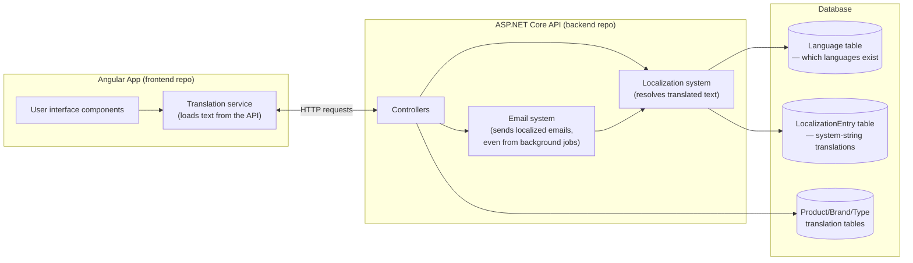
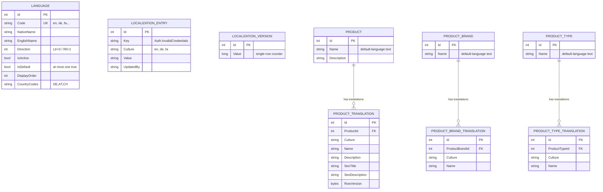
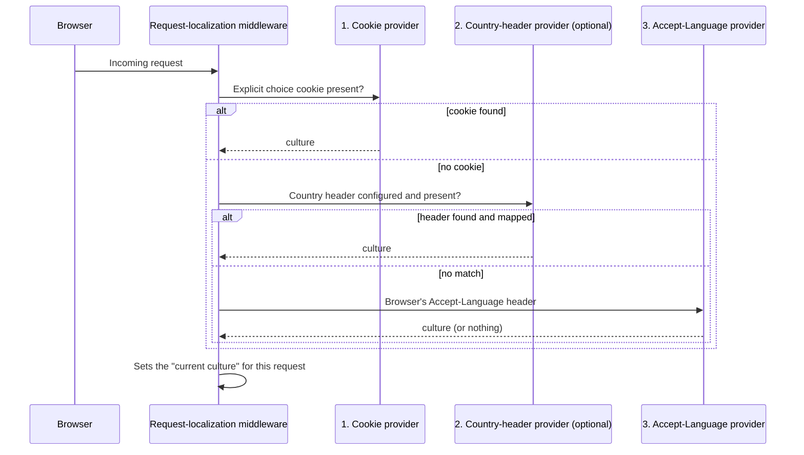

# 00 — Introduction and Architecture Overview

## Who this tutorial is for

This is a tutorial for developers. It walks through a real, working multilingual (multi-language) system built into an e-commerce application called **LiliShop**, and explains not just *what* the code does, but *why* it was built this way.

You don't need to know anything about LiliShop before reading this. You do need basic familiarity with web development — what a database table is, what an API endpoint is, what a frontend framework does. Anything more specific than that (ASP.NET Core concepts, Angular concepts, caching, cryptography) will be explained the first time it comes up, in plain language, before we use the technical term.

By the end of this series, you should understand:
- How to make an application support many languages without hardcoding them.
- How to let a non-developer edit translated text without a software deployment.
- How to keep that system fast, even though it reads from a database instead of files.
- How to make languages "sound right" in emails sent from background jobs that have no user request to work with.
- How to detect a visitor's likely language without asking them or tracking their location.
- What trade-offs were made along the way, and why.

## What "multilingual" means in LiliShop, concretely

LiliShop is an online shop. Before this feature existed, every piece of text in the application — button labels, error messages, product names, confirmation emails — existed in exactly one language. This project added support for **11 languages**:

| Code | Language | Direction |
|---|---|---|
| `en` | English (default) | Left-to-right |
| `de` | German | Left-to-right |
| `fa` | Persian | Right-to-left |
| `ru` | Russian | Left-to-right |
| `es` | Spanish | Left-to-right |
| `hi` | Hindi | Left-to-right |
| `zh` | Chinese | Left-to-right |
| `ar` | Arabic | Right-to-left |
| `tr` | Turkish | Left-to-right |
| `da` | Danish | Left-to-right |
| `sv` | Swedish | Left-to-right |

This list comes directly from the application's seed data (`languages.json` in the backend project) and is not hardcoded anywhere as a fixed list — it lives in a database table, which is one of the central ideas this tutorial series will keep coming back to.

A quick vocabulary note before we go further, since these two words will appear constantly:

- **Culture code**: a short string that identifies a language (and sometimes a region), like `en`, `de`, or `fa`. Some systems use more specific codes like `de-DE` (German, as spoken in Germany) versus `de-AT` (German, as spoken in Austria). LiliShop mostly works with the simpler two-letter form.
- **Locale**: closely related to "culture," but usually refers to everything that changes based on a user's region and language together — not just the words on screen, but also how dates, numbers, and currency are displayed (for example, whether a decimal point or a decimal comma is used).

Two of LiliShop's 11 languages — Persian and Arabic — are **right-to-left (RTL)** languages. That means the entire page layout has to mirror itself: text starts on the right edge of the screen instead of the left, navigation menus flip, and even icons that imply direction (like an arrow "back" button) need to point the other way. The other nine languages are **left-to-right (LTR)**, the direction most Western languages and most English-speaking developers are used to by default. Supporting RTL is not just a translation problem — it's a layout problem, and we'll dedicate a full chapter (file 09) to how LiliShop solves it.

## The two codebases

LiliShop is built as two separate applications that talk to each other over HTTP:

- **`LiliShop-backend-dotnet`** — a .NET (C#) API server, built using a style called **Clean Architecture**. In short, this means the codebase is organized into layers, where each layer has one job and doesn't need to know the details of the layers around it. We'll explain each layer as we encounter it, but at a glance:
  - **Domain** — the core data shapes (e.g., "a Product has a Name and a Price"), with no dependency on databases, web frameworks, or anything external.
  - **Application** — the business rules and the *interfaces* (contracts) that describe what operations are available, without saying how they're implemented.
  - **Infrastructure** — the actual implementations: talking to the SQL database, talking to Redis (a caching system we'll explain in file 05), sending emails, and so on.
  - **API** — the outermost layer: the controllers that turn incoming HTTP requests into calls against the Application layer, and turn the results back into HTTP responses.

- **`LiliShop-frontend-angular`** — the shopper- and admin-facing website, built with Angular, a JavaScript/TypeScript framework for building web user interfaces.

This separation matters for localization specifically because **translated text has to be correct in three very different places**: on screen in the Angular app, inside error messages the .NET API sends back, and inside emails the .NET backend generates — sometimes with no web request involved at all (more on that in a moment). Understanding both codebases, and how they agree on "what language is this?", is the core subject of this tutorial.

## The two localization systems, and why there are two

Here is the single most important architectural fact to understand before reading anything else in this series: **LiliShop's translated content is split into two independent systems**, because the two kinds of content behave completely differently.

### System 1 — System strings (UI text, error messages, email copy)

Things like "Add to Cart," "Your email or password is incorrect," or "Your order has shipped" are **system strings**: short pieces of text that are part of the *application itself*, not part of the shop's product catalog. There's a fixed, known set of these (currently a few hundred), and the same text ("Add to Cart") needs to be translated once per language and then reused everywhere it appears.

These are stored in a database table called `LocalizationEntry`. Each row is one translated phrase for one language, addressed by a short identifier called a **key** — for example, the key `Auth.InvalidCredentials` might map to "Your email or password is incorrect" in English and "Ihre E-Mail-Adresse oder Ihr Passwort ist falsch" in German. We'll dig into this table's exact structure in file 02, and into exactly how a key gets turned into displayed text in file 03.

### System 2 — Business data (product names, brand names, category names)

A product name like "Wireless Bluetooth Headphones" is completely different from a system string. There isn't a small, fixed catalog of product names — there could be thousands of products, each needing its own translation into each of the 11 languages, and new products are added constantly by shop administrators, not developers.

These translations live in their own tables — one for products, one for product brands, one for product types (categories) — separate from the `LocalizationEntry` table entirely. We'll cover exactly how this works, including what happens when a product *hasn't* been translated into a given language yet, in file 07.

### Why not just use one system for both?

It might seem simpler to store everything — UI text and product names alike — in one big table. LiliShop's design deliberately doesn't do that, and the reasoning is a preview of a theme that runs through this whole series: **the two kinds of content have different shapes, different volumes, and different owners**, so combining them would make both harder to work with. System strings are a small, mostly-fixed set edited occasionally by an administrator through a translation-management screen. Product translations are potentially huge in number, tied directly to a specific product record, and edited by whoever manages that product. File 01 goes into this trade-off — and the other major architecture decisions — in much more depth.

## The core idea: translations live in the database, not in files

If you've worked with localization in other applications, you may have seen it done with **files**: a `.resx` file per language in .NET, or a `messages.json` per language in a JavaScript app. Every translated string sits in a file that's part of the source code, gets committed to version control, and only takes effect after the application is rebuilt and redeployed.

LiliShop takes a different approach: **almost all translated text lives in the database**, not in files, and can be added or edited by an administrator through a web page, taking effect immediately — with no code change, no rebuild, and no redeployment.

This single decision is what makes almost everything else in this tutorial series necessary:

- Because translations live in a database instead of files, reading them on every request would normally be slow — so LiliShop needed a **caching strategy** (file 05) to keep things fast.
- Because a database can be updated by an admin at any moment, the running application needs a way to find out "did anything change?" without constantly re-reading the whole database — that's the **versioning** part of file 05.
- Because languages themselves (not just their translated text) are rows in a database table, a brand-new language can be **activated without a deployment** — that's the subject of files 04 and 06.
- Because emails are sometimes sent by background processes with no active web request, and those processes still need to read from the same database-backed translation system, a specific piece of engineering was needed to make that work reliably — that's file 10.

File 01 explains this decision in full detail, including exactly what problems a file-based approach would have caused for LiliShop specifically, and what alternatives (JSON bundles, third-party translation services) were considered and rejected.

## A first look at the moving parts

Before diving into any single piece, it helps to see how the major pieces fit together. This diagram is deliberately simplified — every box here gets its own detailed explanation in a later file.



A few things worth noticing already, even before we explore each box:

- The **Language table** is read by nearly everything — it's the single source of truth for "which languages exist right now, and what are their properties (name, direction, is it currently active)?"
- The **frontend never hardcodes a list of languages or a list of translated phrases**. It asks the backend, at startup, "what languages exist?" and "what does each phrase translate to in my chosen language?" We'll see exactly how in file 08.
- The **email system reuses the exact same localization system** as the rest of the API — it doesn't have its own separate set of translated email templates per language. File 10 explains why that reuse was possible and what problem it solved.

## What "verified" means in this series

Before we go further, one commitment: **everything in this tutorial series is based on directly reading LiliShop's actual source code** — real class names, real file paths, real database columns. Where something is unclear from the code, or where a feature described here has a known limitation, this series will say so explicitly rather than guessing. You'll see this most clearly in file 09 (language detection has real, acknowledged limitations) and file 13 (a closing, honest assessment of what's production-ready versus what would need more work).

## How this series is organized

This is file 0 of 14. Each file builds on the ones before it — you can read them in order, or, once you understand this introduction, jump to whichever topic you need. Here's the full map:

| # | File | What it covers |
|---|---|---|
| 00 | Introduction and Architecture Overview | *You are here.* |
| 01 | The Localization Problem and Architecture Decisions | Why database-driven translations were chosen over files, JSON bundles, or third-party services |
| 02 | Database Design and Translation Models | The actual tables: `Language`, `LocalizationEntry`, and the product/brand/type translation tables |
| 03 | Backend System Translations with `IStringLocalizer` | How a translation key becomes displayed text on the server |
| 04 | Request Culture Resolution and Runtime Language Activation | How the server figures out which language to use for a given request, and how a new language goes live instantly |
| 05 | Caching and Versioning Strategy | How the database-backed system stays fast, and how it knows when to refresh |
| 06 | Dynamic Language and Translation Management | The admin screens for managing languages and editing translations |
| 07 | Business Data Localization | How product, brand, and category names get translated |
| 08 | Angular Runtime Translation System | How the frontend loads and displays translated text |
| 09 | Language Detection and RTL Support | How LiliShop guesses a new visitor's language, and how right-to-left layout works |
| 10 | Localized Email Architecture | How emails — including ones sent by background jobs — get sent in the right language |
| 11 | Security Considerations | How LiliShop protects a specific, security-sensitive email link (unsubscribing) |
| 12 | Testing Strategy | What's automatically tested, and what specific mistakes each test prevents |
| 13 | Lessons Learned and Future Improvements | What to take away for your own projects, and what LiliShop's system still doesn't do |

Let's start with **why** this system was built the way it was — file 01.

***

# 01 — The Localization Problem and Architecture Decisions

File 00 told you *what* LiliShop built: a system where translated text lives in a database instead of in files, and can be edited by an administrator without a deployment. Before we look at *how* it's built, this file explains *why* that specific choice was made. Understanding the reasoning here will make every later file easier to follow, because almost every technical decision in this series traces back to the problem explained on this page.

## Start with the obvious approach, and why it doesn't hold up

If you've never built a multilingual application before, the "obvious" way to do it is to keep a file of translated text for each language. In the .NET world, this is usually done with **`.resx` files** — one file per language, containing a list of key/value pairs, something like:

```
Auth.InvalidCredentials = "Your email or password is incorrect"
```

You'd have `Messages.resx` (the default, usually English), `Messages.de.resx` (German), `Messages.fa.resx` (Persian), and so on — one file per language, sitting inside the project's source code.

This is a completely reasonable approach for many applications, and it's what ASP.NET Core supports out of the box. So why didn't LiliShop use it?

### Problem 1: every translation fix requires a deployment

A `.resx` file is a source file. It gets compiled into the application when the application is built. If a translator finds a typo in the German text three weeks after launch — or if the shop wants to reword a single sentence in the checkout flow — fixing it means:

1. A developer edits the file.
2. The change goes through code review.
3. The application is rebuilt.
4. The application is redeployed to production.

For a single sentence of copy. On a shop that is actively taking orders in 11 languages, translation tweaks are not rare events — they happen constantly, as content teams review live text, run marketing campaigns, or notice something reads awkwardly in a language the original developer doesn't speak. Tying every one of those tweaks to a full software deployment is slow, and it puts translation quality in the hands of people who have to ask a developer to do something as small as fixing a comma.

### Problem 2: it doesn't fit the people who need to edit it

Related to the above: `.resx` files live in source control, in a format most translators, administrators, or shop-content people are not equipped to edit safely. Someone without developer tools would need a developer's help just to change a sentence. LiliShop's requirement (visible directly in the codebase, which we'll examine in file 06) is a web-based admin screen where an authorized non-developer can search for a phrase, edit it, and save — and see the change reflected on the live site within moments, not after the next release.

### The same two problems apply to JSON translation bundles

A common alternative — especially on the frontend side, where `.resx` doesn't even apply — is a **JSON translation bundle**: a file like `en.json`, `de.json`, `fa.json`, shipped as a static asset with the built frontend application. This is simpler than `.resx` and very common in JavaScript frameworks. But it has exactly the same two core problems: the files are part of the built application, so a text change means a frontend rebuild and redeploy, and it's not something a non-developer can safely edit through source control alone.

It also introduces a *third* problem, specific to LiliShop: a JSON bundle only solves translation for the frontend. It says nothing about how the **backend** — which generates error messages and emails — gets its text translated. You'd end up needing a second, separate mechanism for backend text, and now you have two translation systems that can drift out of sync with each other (the German word for "confirm" might read differently in an email than it does on a button, simply because they were translated by different people at different times using different tools).

### Problem 3: third-party translation platforms solve a different problem

There are commercial platforms built specifically for managing translations (services like Lokalise, Crowdin, or POEditor are the general category — the Codebase Analysis Summary that this series is based on notes these as the kind of alternative considered, not as specific vendors LiliShop evaluated in detail). These tools are genuinely good at what they do: giving professional translators a proper workflow, tracking translation memory (reusing previous translations for similar phrases), and sometimes integrating machine translation.

But they come with real costs that mattered for this decision: they are an **external dependency** — your application now depends on a third-party service being available and affordable; they typically require a **network call at build time or runtime** to fetch translations; and for a project at LiliShop's current scale, the operational overhead of integrating and paying for such a platform is disproportionate to the actual problem being solved. This isn't a claim that such platforms are bad — only that they solve a *workflow and scale* problem LiliShop didn't yet have, while leaving the *redeploy* problem (the actual blocker) partly unsolved unless the platform also pushes translations into the running application without a rebuild.

A related idea is using a **CMS (content management system)** — a general-purpose tool for managing editable content — to hold translated text. This has the same shape of trade-off: good non-developer editing experience, but it's a second system a developer now has to keep in sync with the actual translation *keys* referenced in code, and it's a heavy tool to introduce just for short UI strings.

## The deciding factor: one catalog, three surfaces

Here is the specific fact from LiliShop's codebase that tips the decision, and it's worth understanding in detail because it's the single strongest piece of evidence for the architecture this series documents.

LiliShop's backend needs to produce translated text in **three different situations**, not just one:

1. **UI labels and messages** shown directly in the Angular application — the obvious case every localization approach handles.
2. **Error messages returned by the API.** When something goes wrong on the server — say, a login attempt fails — the backend doesn't just return a raw error code. It returns a human-readable message, and that message needs to be in the user's language too. In the actual code, this happens in a class called `OperationResultHandler`, which takes an internal error result and turns it into the HTTP response the frontend receives — and it looks up the translated version of that error message on the way out.
3. **Emails.** Confirmation emails, password reset emails, price-drop notifications — all generated entirely on the server, with no frontend involved at all, and all needing to be in the recipient's preferred language. In the actual code, this is handled by a class called `EmailComposer`.

Here's the problem a file-based (or frontend-only) approach creates: a JSON bundle shipped to the browser can translate a button label, but it cannot translate an error message generated deep inside the server, and it cannot translate the body of an email sent by a background process that never talks to a browser at all. You would need the JSON bundle for the frontend, *plus* some separate `.resx`-based mechanism for backend errors, *plus* some other mechanism for emails — three different translation systems, three different places a translator has to check, and three different chances for the same phrase to be translated inconsistently.

LiliShop's answer was to make **all three surfaces read from the same single catalog** — the `LocalizationEntry` database table introduced in file 00. A translated string entered once by an administrator is immediately available to the UI, to server-side error messages, and to emails, because all three go through the same lookup mechanism underneath.

### The mechanism that made this possible: `IStringLocalizer`

To understand how "the same lookup mechanism" is even possible across such different situations (a web request, a background email job), you need one piece of background about ASP.NET Core (the web framework LiliShop's backend is built on).

ASP.NET Core has a built-in, standard way for backend code to ask for a translated piece of text, called **`IStringLocalizer`**. Think of it as a simple contract: "give me a piece of text by its name (its key), and I'll hand you back the translated version for whatever language is currently active." Code that needs translated text doesn't need to know or care *where* that text is actually stored — a file, a database, anywhere — it just asks the `IStringLocalizer` for a key and gets a string back.

Normally, ASP.NET Core's built-in implementation of this contract reads from `.resx` files — that's the "default backing store" this tutorial keeps mentioning. LiliShop's key architectural move was: **keep using the standard `IStringLocalizer` contract everywhere in the codebase (so the code that consumes translations looks completely normal and idiomatic), but replace what's behind it** with a custom implementation that reads from the `LocalizationEntry` database table instead of `.resx` files.

This is why the same catalog can serve all three surfaces: `OperationResultHandler` (for error messages) and `EmailComposer` (for emails) both simply ask the standard `IStringLocalizer` for a translated string, exactly the same way any UI-facing code would. Neither of them needed to be taught anything special about databases or caching — that complexity is hidden behind the standard interface. File 03 opens up this custom implementation in detail and shows exactly how a lookup works from end to end.

## What this decision costs — and why it was worth it here

Every real trade-off has a downside, and this tutorial series tries to be honest about them rather than presenting one option as free of costs.

**Cost 1 — you have to build the caching yourself.** A `.resx` file is compiled directly into the application; reading it is essentially free. A database table is not free to read on every single request — done naively, this would add a database round trip to every page load, in every language, for every user. This is why LiliShop needed to build a real caching and cache-invalidation strategy (file 05) — something a file-based approach gets for free from the way compiled code works.

**Cost 2 — the frontend needs an extra network request.** Instead of translations being baked into the built frontend application, the Angular app has to *ask* the backend for the current dictionary of translated phrases when it starts up. LiliShop reduces the impact of this (using a locally cached copy in the browser plus a lightweight "has anything changed?" check, both covered in files 05 and 08), but it is a genuine architectural cost compared to translations being bundled directly into the shipped JavaScript.

**Cost 3 — more moving parts to build and maintain.** A `.resx`-based system is "free" in the sense that ASP.NET Core already does all the work. Building a database-backed replacement means writing and testing the lookup logic, the fallback behavior (what happens when a translation is missing — covered in file 03), the caching layer, and the admin tooling to manage it all. This is real engineering effort that a simpler approach wouldn't have required.

LiliShop's bet is that these costs are worth paying because the alternative — tying every translation fix to a software deployment, and needing three separate translation mechanisms for UI, errors, and emails — was a worse long-term problem for a shop actively operating in 11 languages. Whether that's the right call for *your* project depends on your own scale and team — file 13, the closing chapter of this series, revisits this question directly with a practical checklist.

## Summary: the shape of the decision

| Approach | Fixes without a deploy? | Non-developer editable? | Covers backend errors and emails too? |
|---|---|---|---|
| `.resx` files (ASP.NET Core default) | No | No | Yes, but still requires a deploy per change |
| JSON bundles (typical frontend pattern) | No | No | No — frontend only |
| Third-party translation platform | Depends on integration | Yes | Not by itself — still needs wiring into backend errors/emails |
| CMS-based content | Yes | Yes | Not by itself — a second system to keep in sync |
| **LiliShop's database-backed `IStringLocalizer`** | **Yes** | **Yes** | **Yes — one catalog, three surfaces** |

With the *why* established, file 02 moves on to the *what*: the actual database tables — `Language`, `LocalizationEntry`, and the separate tables that hold translated product, brand, and category names — and exactly how they're structured and why.

***

# 02 — Database Design and Translation Models

File 01 explained *why* LiliShop stores translations in a database. This file shows exactly *what* that database looks like: the actual tables, the columns on each one, and the rules (constraints) that keep the data correct. Every backend file after this one assumes you understand this schema, so it's worth reading slowly.

A quick note on how LiliShop's backend talks to its database, for readers new to .NET: LiliShop uses **Entity Framework Core** (usually just called "EF Core"), a tool that lets you describe database tables as ordinary C# classes instead of writing raw SQL. Each class like `Language` or `Product` becomes a table, and each property on the class (like `Name` or `Code`) becomes a column. We'll see this pattern throughout this file.

## The two systems, now as real tables

File 00 introduced the idea that LiliShop has two separate localization systems: one for short, fixed **system strings**, and one for **business data** like product names. Here's what that looks like as an actual database diagram.



That's the whole schema this feature added. Let's go through each table, one at a time, and understand exactly why it exists and why its columns look the way they do.

## The `Language` table — the catalog of what languages exist

In the actual code, this is the `Language` class, found in `Domain/Entities/Language.cs`. Here's what its columns mean:

- **`Code`** — the culture code, like `en`, `de`, `fa` (introduced in file 00). This is marked as **unique** in the database, meaning no two rows can have the same code — you can't accidentally add "German" twice.
- **`NativeName`** — the language's name written in that language itself, e.g. `Deutsch` for German, `فارسی` for Persian. This is what a language switcher shows, so a German speaker sees "Deutsch," not "German."
- **`EnglishName`** — the language's name in English (e.g. `German`), mainly useful for admin screens where the person managing languages might not read every script.
- **`Direction`** — whether this language reads left-to-right or right-to-left. This isn't stored as plain text; it's stored as a small piece of code called an **enum** (short for "enumeration"), which is just a fixed, named set of possible values. In this case, the enum is called `LanguageDirection`, and it only has two values: `Ltr` and `Rtl`. Using an enum instead of free text means the database can never end up with a typo like `"letf-to-right"` — only the two valid options exist.
- **`IsActive`** — whether shoppers can currently select this language. A language can exist in the table without being active — useful for adding a language's data ahead of time before turning it on for real visitors. File 06 covers this in detail.
- **`IsDefault`** — marks exactly one language as the fallback of last resort. If a translation is missing everywhere else, the default language's version is used instead of showing nothing.
- **`DisplayOrder`** — a plain number controlling the order languages appear in, for example, in the language-switcher menu.
- **`CountryCodes`** — a list of country codes (like `DE,AT,CH` for Germany, Austria, Switzerland) stored as one comma-separated piece of text. This is used to guess a new visitor's language based on where their device's clock is set to — covered fully in file 09. It's worth noting this list only matters for that one detection feature; it isn't used anywhere else in the system.

### Why "exactly one default language" needed a special kind of index

Here's a detail worth understanding, because it's a good example of a general database technique. The rule "exactly one language can be the default" is important — if two languages were both marked default, the whole fallback system (file 03) wouldn't know which one to use.

The obvious way to enforce "this column can only be true once across the whole table" would be a normal **unique index** — a database rule that says "no two rows may have the same value in this column." But a plain unique index on `IsDefault` wouldn't work here, because `IsDefault` is a true/false column, and *every other* language row has `IsDefault = false`. A normal unique index would immediately complain that there are many rows with the same value (`false`) — which is not the rule we actually want.

The solution used in LiliShop's database configuration is called a **filtered unique index**: a unique index that only applies to rows matching a specific condition. In this case, the condition is `IsDefault = true`. This means: "among the rows where `IsDefault` is true, no duplicates allowed" — while completely ignoring all the rows where it's false. The result is exactly the rule LiliShop needs: at most one language can ever be marked as the default, enforced directly by the database itself, not just by application code that could have a bug.

## The `LocalizationEntry` table — the system-string catalog

This is the `LocalizationEntry` class (`Domain/Entities/LocalizationEntry.cs`), and it's the table behind everything covered conceptually in file 00's "System 1." Its shape is intentionally simple:

- **`Key`** — the identifier for one piece of text, like `Auth.InvalidCredentials`. Keys use a dotted naming convention (`Section.SpecificMessage`) purely as a human organizing convention — the database doesn't treat the dots specially.
- **`Culture`** — which language this particular row's text is written in.
- **`Value`** — the actual translated text.
- **`UpdatedBy`** — records who last edited this entry, for audit purposes when an administrator makes a change through the translation management screen (file 06).

The critical rule here: **one key can have at most one row per language.** The database enforces this with a **unique index across two columns together** — `Key` and `Culture` combined. That means you could have a row for (`Auth.InvalidCredentials`, `en`) and a separate row for (`Auth.InvalidCredentials`, `de`) — that's normal, expected, and how translations for the same phrase in different languages coexist — but you could never have two different rows both claiming to be (`Auth.InvalidCredentials`, `en`), because that would be ambiguous: which one is the real English translation?

There's also a second, simpler index on `Culture` alone. This exists purely for performance: one of the most common operations in the whole system is "load every translated string for one language" (we'll see exactly where in file 03 and file 05), and a plain index on `Culture` makes that specific lookup fast.

## The `LocalizationVersion` table — a single counter

This one is unusual: it's a table that's designed to hold exactly one row, containing a single number. The `LocalizationVersion` class (`Domain/Entities/LocalizationVersion.cs`) has essentially one meaningful column: `Value`, a counter that goes up by one every time any translation anywhere is added, changed, or removed.

Why would you build a whole table for one number? Because this counter is the key to answering a question cheaply: **"has anything changed since I last checked?"** Instead of a client (like the Angular frontend) having to re-download every translation on every page load just to be sure it's up to date, it can ask a tiny, fast question first — "what's the current version number?" — and only download the full set of translations if that number has changed. File 05 is entirely dedicated to this mechanism, because it's also the backbone of how LiliShop keeps its caching both fast *and* correct.

## The business-data translation tables

Now for "System 2" from file 00: translated product, brand, and category (product type) names. There are three separate tables — `ProductTranslation`, `ProductBrandTranslation`, and `ProductTypeTranslation` — and they all follow the exact same pattern, so once you understand one, you understand all three.

Take `ProductTranslation` (`Domain/Entities/ProductTranslation.cs`) as the example, since it's the richest of the three:

- **`ProductId`** — a **foreign key**: a column that points at a row in another table (here, the `Product` table), identifying *which* product this translation belongs to. This is what connects a translation row back to the actual product.
- **`Culture`** — same idea as before: which language this row's text is written in.
- **`Name`**, **`Description`** — the translated product name and description.
- **`SeoTitle`**, **`SeoDescription`** — translated search-engine-optimization text (the title and description search engines show in results), which can differ from the on-page name and description.
- **`RowVersion`** — we'll explain this one separately below.

`ProductBrandTranslation` and `ProductTypeTranslation` are simpler versions of the same idea — each just has a foreign key back to its parent (`ProductBrandId` or `ProductTypeId`), a `Culture` column, and a translated `Name`. Brands and product types don't have descriptions or SEO fields in this system, so their translation tables don't either.

Just like `LocalizationEntry`, each of these tables has a **unique index across two columns**: (`ProductId`, `Culture`) for product translations, and the equivalent for the other two. This enforces the same rule as before, applied to business data: a single product can have at most one translation row per language.

### Why not just add columns like `Name_EN`, `Name_DE`, `Name_FA`?

This is a question worth asking directly, because "one column per language" is often the very first idea a developer has when facing this problem, and it's important to understand why LiliShop's codebase deliberately avoided it — this reasoning is stated directly in the code's own comments on these classes.

Imagine instead that the `Product` table itself had columns `Name_EN`, `Name_DE`, `Name_FA`, `Name_RU`, and so on — one column per supported language. This looks simple at first, but breaks down quickly:

1. **Adding a language means changing the database schema.** To support language #12, you'd need to run a database migration (a structural change to the table) adding a new column to `Product`, and also to `ProductBrand` and `ProductType`. Every query anywhere in the codebase that reads a product's name would potentially need updating too. Compare this to what actually happened in LiliShop's history: eight new languages were added in a single change, and it required precisely zero schema changes — only new rows of data.
2. **It wastes space for untranslated content.** If a product hasn't been translated into Danish yet, a `Name_DA` column sitting on every single product row holds an empty (`NULL`) value. Multiply that by 11 languages across thousands of products, and most of that space is empty, unused columns.
3. **It can't be queried generically.** "Give me every translation of product #42" becomes a simple `WHERE ProductId = 42` against the `ProductTranslation` table. With a column-per-language design, the same question means inspecting a different, differently-named column for each language — code that has to change every time a language is added.
4. **It breaks the fallback design.** LiliShop's actual model — which we'll return to in file 07 — is that `Product.Name` (the original column, still on the `Product` table itself) represents the *default* language's text, and a missing translation row simply means "fall back to that column." A translation existing or not existing is a normal, easy-to-detect state (a row is present, or it isn't) rather than a special case involving checking whether a specific column happens to be `NULL`.

This is why `Product`, `ProductBrand`, and `ProductType` still keep their original `Name`/`Description` columns even after this feature was added — they were never replaced. They now serve double duty: they're both the original data *and* the default-language fallback, used whenever no matching translation row exists for the requested language.

### What `RowVersion` is for, and why only `ProductTranslation` has it

`ProductTranslation` has one column the other two translation tables don't: `RowVersion`. This is LiliShop's implementation of a pattern called **optimistic concurrency control**.

Here's the problem it solves: imagine two administrators open the same product's German translation for editing at the same time. Admin A saves a change. A few seconds later, Admin B — who has been looking at an now-outdated copy of the same data — saves *their* change, accidentally overwriting Admin A's edit without ever seeing it. This is called a "lost update," and it's a classic problem whenever more than one person can edit the same data.

Optimistic concurrency solves this without locking the record (which would mean only one admin could even *open* it for editing at a time — a heavier-handed and often frustrating approach). Instead, every row carries a hidden version marker (`RowVersion`) that automatically changes every time the row is saved. When someone tries to save an edit, the database checks: "does the version marker I'm about to overwrite still match the version marker I originally read?" If Admin B's save is based on a version that's already been superseded by Admin A's edit, the save is rejected, and Admin B is told their data is stale instead of silently destroying Admin A's work.

Only `ProductTranslation` has this protection. `ProductBrandTranslation` and `ProductTypeTranslation` don't — they hold just a single short text field each (a brand or category name), which is both lower-risk to accidentally overwrite and much less likely to be edited concurrently in practice than a full product's translated name, description, and SEO fields.

## How these rules are actually written in the code

If you open the backend project, you won't find these rules (unique indexes, the filtered index, `RowVersion` behavior) written directly on the `Language` or `ProductTranslation` classes themselves. EF Core (introduced at the top of this file) uses a pattern called **fluent configuration**: for each table, there's a separate small class — `LanguageConfiguration`, `LocalizationEntryConfiguration`, `ProductTranslationConfiguration`, and so on, all found under `Infrastructure/Data/Config/` — whose only job is to describe the rules for that one table. This keeps the entity classes themselves (`Language.cs`, `ProductTranslation.cs`) focused purely on "what data does this thing hold," while the configuration classes separately answer "what database rules apply to it." For example, `LanguageConfiguration` is where the filtered unique index on `IsDefault` described earlier is actually defined, and `LocalizationEntryConfiguration` is where the two-column unique index on (`Key`, `Culture`) is defined.

## Summary

| Table | Holds | Key rule enforced |
|---|---|---|
| `Language` | Which languages exist and their properties | Unique `Code`; at most one `IsDefault = true` (filtered unique index) |
| `LocalizationEntry` | System-string translations | At most one row per (`Key`, `Culture`) pair |
| `LocalizationVersion` | A single change-counter | N/A — deliberately a single row |
| `ProductTranslation` | Translated product name/description/SEO text | At most one row per (`ProductId`, `Culture`); protected against lost updates via `RowVersion` |
| `ProductBrandTranslation` | Translated brand names | At most one row per (`ProductBrandId`, `Culture`) |
| `ProductTypeTranslation` | Translated category names | At most one row per (`ProductTypeId`, `Culture`) |

With the data model established, file 03 moves from *storage* to *retrieval*: how a key like `Auth.InvalidCredentials` actually turns into the right piece of translated text at the moment the server needs it, through the `IStringLocalizer` mechanism introduced conceptually in file 01.

***

# 03 — Backend System Translations with `IStringLocalizer`

File 01 introduced `IStringLocalizer` as a concept: a standard ASP.NET Core contract that says "give me a piece of text by its key, and I'll hand back the translated version." File 02 showed you the table it reads from, `LocalizationEntry`. This file opens up the actual implementation and shows, step by step, how a key like `Auth.InvalidCredentials` becomes real translated text — and how that same mechanism ends up powering error messages, not just UI labels.

## A quick refresher: what `IStringLocalizer` actually looks like in code

Before looking at LiliShop's version, it helps to see the shape of the contract itself. Code that wants a translated string writes something like this:

```csharp
var message = _localizer["Auth.InvalidCredentials"];
```

That square-bracket syntax is called an **indexer** in C# — it lets an object be used a bit like an array or dictionary, even though it isn't really one underneath. So `_localizer["Auth.InvalidCredentials"]` reads almost like "look up this key in a dictionary of localized strings," which is exactly the mental model you should have. The `_localizer` object here is of type `IStringLocalizer` — an **interface**, meaning it's a contract describing *what* operations are available ("give me a string for this key"), without saying *how* they're implemented. Code that calls `_localizer["Auth.InvalidCredentials"]` doesn't need to know or care whether the answer comes from a file, a database, or anywhere else.

By default, ASP.NET Core ships with an implementation of this contract that reads from `.resx` files (the approach discussed and rejected in file 01). LiliShop's entire strategy in this file is: **keep every piece of code that consumes translations exactly as-is, using the same standard `IStringLocalizer` contract** — but swap out what's running behind it.

## `DatabaseStringLocalizer` — the custom implementation

The class that does this swap is called `DatabaseStringLocalizer`, and it lives in `Infrastructure/Localization/DatabaseStringLocalizer.cs`. It implements the same `IStringLocalizer` contract described above, but instead of reading `.resx` files, it reads from the `LocalizationEntry` table (via a caching layer we'll get to in file 05).

### A necessary detour: dependency injection "scopes"

Before we look at the lookup logic itself, there's one piece of background worth understanding, because you'll see it in almost every class this series covers: **dependency injection**, or DI.

In a typical ASP.NET Core application, classes don't create the other objects they depend on themselves. Instead, they declare what they need (for example, "I need something that can talk to the database"), and a central system — the DI container — hands them a ready-made instance when they're constructed. This keeps classes decoupled from exactly how their dependencies are built.

Some of those dependencies are meant to live for the lifetime of a single web request (a "scoped" lifetime) — for example, a database connection that should be reused for the duration of one request, then closed. `DatabaseStringLocalizer`, however, is registered so it lives for the *entire lifetime of the application* (we'll see exactly why in the next section) — meaning it can't simply ask for a scoped dependency directly at construction time, because there is no single request it belongs to. Instead, it's given an `IServiceScopeFactory`, which is exactly what it sounds like: a factory whose only job is to create new scopes on demand. Every time `DatabaseStringLocalizer` needs to look something up, it opens a fresh scope (`_scopeFactory.CreateScope()`), grabs the scoped services it needs from that scope, and lets the scope get cleaned up afterward. You'll see this same `using var scope = _scopeFactory.CreateScope()` pattern repeated in the lookup code below.

### Looking up a single key

Here's the core of what happens when code writes `_localizer["Auth.InvalidCredentials"]`:

1. A new scope is created, and from it, a service called `ILocalizationEntryService` is retrieved — this is the class (covered in detail in file 05) that actually knows how to fetch a language's full dictionary of translated strings, using a fast cache instead of hitting the database every time.
2. `DatabaseStringLocalizer` asks that service for the dictionary belonging to the **current culture** (we'll explain exactly how the "current culture" gets decided in file 04 — for now, just think of it as "whatever language this request is in").
3. If the key exists in that dictionary, its value is returned, and `DatabaseStringLocalizer` reports back a `LocalizedString` with `resourceNotFound: false` — meaning "found it."
4. If the key is *not* found, `DatabaseStringLocalizer` doesn't give up immediately — it starts walking a fallback chain, described next.

### The fallback chain, explained with a real example

This is one of the most important behaviors in the whole system, so let's walk through it concretely. Say a French-speaking browser (culture code `fr-FR`) requests a page, but LiliShop doesn't actually have French translations for a particular key — or more realistically within LiliShop's actual 11 supported languages, say a request comes in for `de-CH` (German as used in Switzerland) for a key that's only ever been translated for the plain `de` code.

`DatabaseStringLocalizer`'s private `Resolve` method walks through candidate cultures in this order, stopping at the first one where the key is found:

1. **The exact requested culture** — e.g., `de-CH`.
2. **Its parent culture** — e.g., `de`. Many culture codes come in a specific-region form (`de-CH`, `de-DE`, `de-AT`) built on top of a more general "neutral" form (`de`). .NET's built-in `CultureInfo` type already understands this relationship, and `DatabaseStringLocalizer` uses it: if `de-CH` isn't found, it tries plain `de` next. This single step is what lets LiliShop support translations at the simpler two-letter level (as described in file 00 — LiliShop mostly works with codes like `de`, not `de-CH`) while still working correctly if a browser happens to send a more specific regional code.
3. **The default language** — whatever language is currently marked `IsDefault = true` in the `Language` table (file 02). This is the safety net: if a translation genuinely doesn't exist for the requested language at all, the default language's version is used instead of showing nothing.
4. **The key itself, unchanged** — if even the default language doesn't have this key (which would usually mean a genuine gap in the translation catalog, not just a missing language), the raw key (e.g., the literal text `Auth.InvalidCredentials`) is returned as the displayed value. This is deliberately *not* an empty string or blank text — a raw key showing up on screen is ugly, but it's *visible*, which makes gaps in the translation catalog obvious during testing rather than silently invisible. A warning is also written to the application's logs whenever this happens, and file 06 will show the admin tool built specifically to find these gaps before they reach production.

Each step in this chain only fires if the previous one didn't find the key — the code keeps a small internal set of "cultures already tried" so it never wastes effort checking the same language twice (which matters, for instance, when the requested culture's parent *is* the default language already).

### A safe use of "blocking" code — sync over async

Here's a detail that looks unusual if you're used to modern C# code, and it's worth explaining rather than skipping over. `IStringLocalizer`'s indexer (`this[string name]`) is a **synchronous** method — it has to return a value immediately, the moment it's called, because the interface's contract doesn't allow returning "a promise of a value later." But the actual lookup — asking the cache or database for a dictionary of translations — is naturally an **asynchronous** operation (something that might take a moment and shouldn't block the whole application while it waits).

`DatabaseStringLocalizer` bridges this gap by calling the async lookup and then immediately, forcibly waiting for its result with `.GetAwaiter().GetResult()` — a pattern generally known as **"blocking on async code,"** and one that's usually risky. In many .NET application types (like older-style desktop or ASP.NET applications), doing this can cause a **deadlock** — a situation where the code waiting for the result and the code trying to produce that result end up stuck waiting on each other forever, because of something called a "synchronization context" that tries to run continuations back on a specific thread.

ASP.NET Core specifically does **not** have that synchronization context — a change from older ASP.NET versions that was made deliberately, partly because it makes this exact pattern safe. Combined with the fact that this blocking call only ever waits on a warm, fast in-process cache (or, rarely, one short database query), the trade-off here is: this is a slightly unusual thing to do, but it's a well-understood safe exception in this specific environment, not a general license to block on async code everywhere.

### Getting every translated string at once

Besides the single-key indexer, `IStringLocalizer` also defines a method called `GetAllStrings`, which returns *every* translated string for the current context rather than just one. `DatabaseStringLocalizer` implements this by walking the same kind of fallback chain (current culture, then optionally its fallbacks), merging dictionaries together so that a key present in the default language but missing in the current one is still included — using the default language's version. This matters for one specific use in LiliShop: exporting a *complete* dictionary of translations to send to the Angular frontend, which is exactly the endpoint file 05 and file 08 will cover in detail (`GET /api/localization/{culture}`).

## `DatabaseStringLocalizerFactory` — replacing the framework's default

`IStringLocalizer` objects aren't usually created directly — they're handed out by a second interface, `IStringLocalizerFactory`, whose whole job is to produce the right localizer for a given situation. LiliShop's implementation is `DatabaseStringLocalizerFactory` (`Infrastructure/Localization/DatabaseStringLocalizerFactory.cs`), and it's registered in the application's startup configuration in place of the framework's default factory.

Here's a subtlety worth explaining. In the traditional `.resx`-based design, translations are often organized **per "resource type"** — for example, you might have one `.resx` file (and thus one localizer) specifically for account-related messages, and a separate one for product-related messages, each tied to a specific C# class or feature area. The factory's job, traditionally, is to figure out *which* set of resource files to use based on the type or name you ask for.

LiliShop doesn't organize its catalog that way at all — every system string lives in the single flat `LocalizationEntry` table described in file 02, regardless of what feature it belongs to. So `DatabaseStringLocalizerFactory`'s two methods (`Create(Type resourceSource)` and `Create(string baseName, string location)`) both do the same simple thing: they return the exact same single `DatabaseStringLocalizer` instance, no matter what type or name was asked for. The "which resource type do you want?" question that the traditional factory design answers just doesn't apply here — there's only ever one catalog.

### `SharedResource` — a class that does nothing, on purpose

Because of the point above, you'll see code elsewhere in the backend ask for `IStringLocalizer<SharedResource>` rather than a plain `IStringLocalizer`. `SharedResource` (`Application/Common/Localization/SharedResource.cs`) is a class with **no properties, no methods, nothing inside it at all**. Its only purpose is to exist as a name you can pass as a **generic type parameter** — the `<SharedResource>` part — purely so that .NET's dependency injection system has something concrete to hand you a strongly-typed localizer for. Since `DatabaseStringLocalizerFactory` ignores the type anyway and always returns the same localizer, `SharedResource` isn't pointing at a real resource file the way a traditional `.resx`-per-type design would use it — it's essentially a formality needed to use the standard `IStringLocalizer<T>` syntax at all.

## From UI labels to error messages: `OperationResultHandler`

File 01 promised that this same catalog serves error messages, not just UI text. Here's exactly how that connection works.

Deep inside LiliShop's backend, when an operation fails (say, a login attempt with the wrong password), the service layer doesn't throw a raw exception up to the API layer. It returns something called an `OperationResult` — an object that represents "here's what happened," including a machine-readable `ErrorCode` (like `InvalidArgument`) and a human-readable `Message`. Turning that `OperationResult` into an actual HTTP response is the job of a class called `OperationResultHandler` (`Infrastructure/Web/OperationResultHandler.cs`), and its `LocalizeMessage` method is where translation happens, following three rules in order:

1. **If the result carries an explicit `MessageKey`,** that key is looked up directly through `IStringLocalizer<SharedResource>` — the exact same lookup mechanism this whole file has been describing, fallback chain included. If that lookup succeeds, its translated value is used as the error message sent back to the client.
2. **Otherwise, if the result's message is exactly the generic default message for its error code** (in other words, nobody bothered writing a specific custom message — it's just the standard, boilerplate text for that kind of failure), `OperationResultHandler` tries a naming convention: it looks up the key `Error.{ErrorCode}` — for example, `Error.InvalidArgument`. If a translation exists for that conventionally-named key, it's used.
3. **Otherwise**, the original, untranslated `Message` text is returned exactly as-is. This is the safety net for messages that were written as specific, one-off English text by a developer and were never meant to be a translation key — better to show *some* message in English than to show a broken lookup or nothing at all.

Notice that step 1 and step 2 both ultimately call the very same `_localizer[key]` indexer explained earlier in this file — meaning error messages go through **exactly the same fallback chain** (requested culture → parent culture → default language → raw key) as any UI label would. There is no separate error-translation system; it's the same one, reused.

## Following one lookup, start to finish

To tie this all together, here's the complete story of what happens when a German-speaking user tries to log in with the wrong password:

1. The login attempt fails inside the service layer, which returns an `OperationResult` with `ErrorCode = InvalidArgument` and the standard boilerplate message for that error code.
2. `OperationResultHandler.LocalizeMessage` checks: no explicit `MessageKey` was set, but the message *is* the standard boilerplate for `InvalidArgument` — so it tries looking up `Error.InvalidArgument`.
3. That lookup goes to `IStringLocalizer<SharedResource>` — which, thanks to `DatabaseStringLocalizerFactory`, is really a `DatabaseStringLocalizer`.
4. `DatabaseStringLocalizer` opens a scope, fetches the German dictionary (from cache, most likely — see file 05), and finds `Error.InvalidArgument` translated as "Ihre E-Mail-Adresse oder Ihr Passwort ist falsch."
5. That translated text flows back up through `OperationResultHandler`, into the HTTP error response, and the user sees the message in German — even though nothing about the login logic itself, or the `OperationResult` it returned, ever mentioned German specifically.

## How this is proven to work: the tests

Two test files exist specifically to verify the behavior described in this file. `DatabaseStringLocalizerTests.cs` tests the fallback chain directly — checking that a key found in the requested culture is used as-is, that a missing key correctly falls through to the parent culture, then to the default language, and finally to the raw key if nothing matches anywhere. `OperationResultHandlerLocalizationTests.cs` tests the three-step `MessageKey` → `Error.{ErrorCode}` → raw-message logic described above. Together, these tests are what let you trust that a change to this code won't silently break translated error messages — file 12 covers the full testing strategy across the whole system.

## What's still missing

This file explained how a translation gets *found*, once you know what culture (language) to look in. It deliberately left one big question unanswered: **how does the system decide what "the current culture" even is** for a given request, and how can a brand-new language become usable the moment an admin activates it, without restarting the application? That's the subject of file 04.

***

# 04 — Request Culture Resolution and Runtime Language Activation

File 03 explained how `DatabaseStringLocalizer` turns a key into translated text, *once it already knows what language to look in*. This file answers the question that comes before that: for a given request, how does the server decide which language is active? And just as importantly — how can an administrator add and activate a brand-new language, and have the server start using it immediately, with no restart and no deployment?

## What "middleware" means, and why it matters here

Before explaining how culture is resolved, you need one piece of background about how ASP.NET Core processes a request at all.

An incoming HTTP request doesn't go straight to your application code. It passes through a chain of small, focused steps first, each one allowed to inspect or modify the request (or the response) before handing it to the next step. This chain is called **middleware**, and each step in it is a piece of middleware. Common examples include middleware that logs every request, middleware that checks whether the user is authenticated, and — the one relevant to this file — middleware that figures out what language and region ("culture") the request should be treated as.

Middleware runs in a specific, configured order, and that order matters: whatever a middleware step decides gets passed down the chain to everything after it. This is important here because **culture resolution has to happen before almost anything else** — you can't correctly generate a translated error message (file 03) if the code generating it doesn't yet know what language to use.

## The built-in mechanism: `RequestLocalizationOptions` and its providers

ASP.NET Core ships with its own middleware for exactly this purpose, called request localization. You turn it on with a line like `app.UseRequestLocalization(...)`, and you configure it with an object called `RequestLocalizationOptions`, which answers three questions:

- **Which cultures does this application support at all?** (`SupportedCultures` / `SupportedUICultures`)
- **Which culture should be used if nothing else says otherwise?** (`DefaultRequestCulture`)
- **How should the middleware figure out what culture a specific request wants?**

That last question is answered by a list of objects called **`RequestCultureProvider`s**. Each provider knows how to look for a language preference in one specific place — for example, in a cookie, or in an HTTP header — and the middleware tries them **in order**, using the first one that finds something.

LiliShop configures this list with three providers, in this exact priority order (set up in the backend's `Program.cs`, in a method called `ConfigureLocalization`):

1. **`CookieRequestCultureProvider`** — checks for a specific cookie the browser sends with the request. This represents an **explicit choice the user already made** — for example, by clicking a language in the switcher (covered from the frontend side in file 08). Because it's first in the list, an explicit past choice always wins over any other signal.
2. **`CountryHeaderRequestCultureProvider`** — a custom provider, explained in detail below, that's only active if specifically configured.
3. **`AcceptLanguageHeaderRequestCultureProvider`** — a built-in provider that reads the standard `Accept-Language` HTTP header, which browsers send automatically based on the user's operating system or browser language settings. This is the fallback for a visitor who hasn't made any explicit choice yet.

If none of the three find anything usable, the middleware falls back to whatever `DefaultRequestCulture` is configured — which, as we'll see shortly, is itself driven by the `Language` table from file 02, not hardcoded.



### The optional geo step: `CountryHeaderRequestCultureProvider`

This is a custom provider LiliShop built, found in `Infrastructure/Localization/CountryHeaderRequestCultureProvider.cs`, and it's worth understanding both what it does and — just as important — what it deliberately does *not* do.

Some hosting setups sit behind a content delivery network (CDN) or edge service (the code comments mention Cloudflare as an example) that can inspect a visitor's IP address and stamp an HTTP header on the request with the visitor's two-letter country code — for example, a header like `CF-IPCountry: DE`. `CountryHeaderRequestCultureProvider` reads *that already-computed header* — if one is configured — and maps the country code to a language using the same `CountryCodes` column on the `Language` table introduced in file 02 (the same data used for a related but different purpose on the frontend, covered in file 09).

Two things are worth being precise about here. First, **this provider never looks at an IP address itself, and never resolves one** — it only reads a country code that some other system (the CDN/edge) has already computed and attached as a header. Second, **it's entirely optional** — it only does anything if a specific configuration setting (`Localization:CountryHeader`) names which header to look for. If that setting isn't present, this provider is inert and simply passes through to the next one in the chain. This design keeps the responsibility for "how do we determine a country from an IP" outside the application entirely, delegated to infrastructure that's already built for it — the application itself only ever consumes a coarse, already-computed result.

If two languages happen to claim the same country in their `CountryCodes` list, the provider picks whichever language comes first by `DisplayOrder` — the same tie-breaking rule used everywhere else in the system that reads this column.

## The harder problem: activating a language without a restart

Here's where this file gets to LiliShop's most distinctive piece of engineering in the whole backend.

Normally, `RequestLocalizationOptions` — the object holding `SupportedCultures`, `DefaultRequestCulture`, and the provider list — is something you configure **once, when the application starts up**, and it stays fixed for as long as the application keeps running. That's fine for an application with a hardcoded, unchanging list of languages. But LiliShop's entire premise (file 00) is that the list of supported languages is **data** — rows in the `Language` table — that an administrator can change at any time through a web page. If `RequestLocalizationOptions` were only ever set once at startup, activating a new language would require restarting the whole application before it actually worked — quietly breaking the "no redeploy needed" promise for the one piece of configuration ASP.NET Core normally expects to be fixed.

### A quick note on "singleton" vs. other service lifetimes

To explain the fix, you need one more piece of background about dependency injection (introduced in file 03): objects registered with the DI container can have different **lifetimes**. A **scoped** object lives for one request and is then discarded. A **singleton** object is created once, the very first time it's needed, and then the *same instance* is reused for the entire lifetime of the running application — every part of the code that asks for it gets the exact same object.

LiliShop registers `RequestLocalizationOptions` as a singleton — but that alone wouldn't solve the problem, since a singleton is still just "created once and left alone" by default. The trick is what LiliShop does *with* that singleton after it's created: it treats it as a target that can be updated later, safely, while the application keeps running.

### `RequestCultureRefresher` — updating the singleton live

The class responsible for this is `RequestCultureRefresher` (`Infrastructure/Localization/RequestCultureRefresher.cs`). Its one real method, `RefreshAsync`, does the following:

1. Asks the `Language` table (through `ILanguageService`, covered more in file 06) for the current list of active language codes, and which one is the default.
2. Converts each code into a `CultureInfo` object — .NET's built-in representation of a culture. If a code in the `Language` table turns out to be invalid (not a real culture .NET recognizes — say, someone typo'd a language code while adding a row), that one code is simply skipped, with a warning logged, **rather than the whole refresh failing**. This matters: one bad row in the `Language` table must never take down culture resolution for every other language.
3. If, after that filtering, there's at least one valid culture, it directly reassigns the singleton's `SupportedCultures`, `SupportedUICultures`, and `DefaultRequestCulture` properties to the new values.

That last step — directly reassigning the properties on the shared singleton — is the whole mechanism. Because the request-localization middleware reads those same properties on every single request, the *very next* request after a refresh sees the updated list.

### Why this is safe without locks

If you're familiar with concurrent programming, you might expect that changing shared, application-wide data while other requests are actively reading it would need some kind of lock, to prevent one request from reading a half-updated, inconsistent state. `RequestCultureRefresher` avoids needing one, because of how the update is done: each property (like `SupportedCultures`) is replaced with a **brand new list object**, not modified in place. Replacing a reference to point at a new object is what's called an **atomic operation** in most .NET scenarios — from the perspective of any other code reading that property, it either sees the old list, complete and unchanged, or the new list, complete and unchanged. There's no possible moment where a reader could see a list that's half-old, half-new, because no code ever edits the list's contents directly — it always builds a full replacement first and only then swaps the reference. This is what lets in-flight requests keep working correctly even if a refresh happens at the exact same moment.

### When does a refresh actually happen?

Two triggers:

1. **Once at application startup**, right after the database seeding process runs (seeding is covered briefly in file 06) — this loads whatever languages already exist in the database into the live configuration, since a freshly-started application otherwise only knows about a single hardcoded starting culture (`en`) until its first refresh.
2. **Every time an administrator saves a language** through the admin Languages screen — specifically, right after `LanguageService`'s `UpsertLanguageAsync` method commits a language change to the database (file 06 covers this admin flow in full). This is the actual mechanism behind "activating a language takes effect immediately."

### Walking through the whole story

Here's the complete, concrete sequence for the scenario that matters most: an administrator adds a brand-new language and turns it on.

1. The administrator fills in the Languages admin form (file 06) — code, native name, English name, direction, and ticks "Active" — and clicks Save.
2. The backend validates the code is a real culture .NET can understand, and saves a new row into the `Language` table.
3. Immediately after saving, the code calls `RequestCultureRefresher.RefreshAsync()`.
4. `RefreshAsync` reads the `Language` table again — now including the brand-new row — builds a fresh list of `CultureInfo` objects, and atomically swaps it into the shared `RequestLocalizationOptions` singleton.
5. The very next request that arrives — from any user, anywhere — is processed by request-localization middleware that now recognizes the new language as valid, with no application restart, no redeployment, and no delay beyond the time it took to save the form.

## `CultureScope` — when there's no request at all

Everything described so far in this file assumes there's an actual HTTP request flowing through the middleware pipeline, setting the "current culture" along the way. But not all of LiliShop's code runs inside a request. File 10 covers this in depth, but the short version: LiliShop sends emails from **background jobs** — code that runs on a separate worker process, triggered by a schedule or a queue, with no browser, no HTTP request, and therefore **no middleware pipeline ever running at all**. There's simply no request-localization middleware to set the current culture, because there's no request.

For situations like this, LiliShop uses a small helper class called `CultureScope` (`Infrastructure/Localization/CultureScope.cs`). It's what's known as a **disposable** — a class designed to be used with C#'s `using` block, which guarantees some cleanup logic runs automatically once you're done with it, even if an error happens in between. `CultureScope`'s job is simple: when created, it remembers whatever the current culture was, and forces it to a specific culture you give it; when the `using` block ends (and `CultureScope` is disposed), it puts the original culture back exactly as it was. Code that needs to produce output in a specific language — regardless of whether a request or middleware set that language — can wrap its work like this:

```csharp
using (new CultureScope("de"))
{
    // Any code here that asks for the "current culture" — including
    // DatabaseStringLocalizer lookups from file 03 — sees "de".
}
// Outside the block, the culture is back to whatever it was before.
```

This is the piece that connects file 03's lookup mechanism (which relies on "the current culture" being set correctly) to situations where no middleware ever ran to set it. File 10 will show exactly where this gets used for real, in the email-sending code.

## How this is proven to work: the tests

`RequestCultureRefresherTests.cs` directly tests the behaviors described above: that a refresh correctly applies a new set of active languages to the shared options object, that an invalid culture code is skipped without breaking the refresh for the other valid codes, that the configuration is left completely untouched if *no* valid codes are found at all (better to keep the last known-good configuration than to leave the application with zero supported cultures), and — most directly relevant to the "add language #12" story — that a newly-activated language is picked up correctly after a second refresh. `CountryHeaderRequestCultureProviderTests.cs` separately verifies that the optional geo provider only reacts to short, plausible-looking country codes, and correctly ignores malformed or oversized header values rather than trying to use them as-is.

## What's still missing

This file explained how the *correct* culture gets determined for a request, and how the list of valid cultures can change live. It didn't yet explain how the actual translation lookups (file 03) stay fast despite reading from a database, or how the system knows when its cached data has gone stale after an admin makes an edit. That's the entire subject of file 05.

***

# 05 — Caching and Versioning Strategy

Files 03 and 04 explained how a translation gets looked up and how the server knows what language to look in. Both of those explanations quietly assumed that looking things up in the `LocalizationEntry` table (file 02) is fast. This file explains why that assumption holds up in practice, and — the harder half of the problem — how the system still stays *correct* after an administrator edits a translation, without needing to constantly re-check the database "just in case."

## Why reading from a database on every request would be too slow

Here's the problem in concrete terms. LiliShop is a shop, not an internal tool — every single page a shopper loads involves multiple translated strings (button labels, navigation text, product page labels, and so on). If every one of those lookups meant a fresh trip to the database, you'd be adding a database round trip — typically a few milliseconds, sometimes much more under load — to practically everything the application does, just to fetch text that changes extremely rarely (an admin editing a translation is a rare event compared to the volume of page loads that read it).

The standard fix for "the same data is read constantly but changes rarely" is a **cache**: a fast, temporary copy of the data kept somewhere quicker to read from than the original source — typically in memory. The idea is simple: check the cache first; if the data you need is already there, use it and skip the database entirely; if it's not there yet, fetch it from the database once, and *then* store a copy in the cache so the next request doesn't have to.

## `HybridCache` — two layers instead of one

LiliShop uses a caching tool called `HybridCache`, which is worth understanding as "two caches in one," because that's genuinely what it is:

1. **A local, in-process cache.** This lives directly inside the memory of the specific running copy (instance) of the API application handling a given request. It's the fastest possible option, because reading from it doesn't even involve a network call — but it only exists inside that one running copy.
2. **A distributed cache**, backed by **Redis** — a separate, dedicated caching server that every instance of the API can talk to. This is slightly slower than the local, in-process option (it does involve a network call, just a very fast one to a nearby server built specifically for this job), but it has a crucial property the local cache doesn't: **every instance of the application shares the same distributed cache.**

That second point matters because LiliShop, like most production web applications, doesn't necessarily run as a single copy of the API server — for reliability and capacity, it's normal to run several instances behind a load balancer. If each instance only had its own local cache, an admin's translation edit might update the database, but three other running instances could keep serving their own stale, locally-cached copies of the old text until their local cache separately expired. Backing the cache with Redis means an edit can be made visible to *every* instance at once, not just the one that happened to handle the admin's save request.

LiliShop uses `HybridCache` for every piece of localization data that's read often and changes rarely: the per-language dictionary of system strings (file 03's lookups ultimately go through this), the global version counter (explained below), the list of active languages (file 04's refresh logic reads this), and the cached name-lookup tables for product brands and categories (file 07).

### Two expiration times, not one

Every cached localization entry in LiliShop is stored with two different expiration settings at once: a short one for the local, in-process layer, and a longer one for the distributed Redis layer. This is a deliberate balance. The short local expiration means that even *before* any explicit invalidation (explained next) has a chance to happen, no single instance can serve badly stale data for very long — it's a safety margin. The longer distributed expiration means the shared Redis cache doesn't get needlessly wiped and refetched from the database constantly, since it's shared and therefore doing more useful work per fetch.

## Cache "tags" and why invalidation matters more than expiration

Relying purely on "the cache automatically expires after some time" is a weak strategy on its own — there's a well-known saying in software engineering that cache invalidation (knowing exactly when to throw away stale cached data) is one of the genuinely hard problems in computer science, precisely because getting the timing wrong in either direction causes real problems: throw data away too eagerly and you lose the performance benefit of caching at all; keep it too long and users see stale information.

LiliShop's answer is to not rely on expiration timing alone, but to **explicitly and immediately invalidate** (throw away) exactly the right cached data the moment it's known to be out of date — specifically, right after an admin saves a translation change. `HybridCache` supports this through **tags**: when you store something in the cache, you can label it with one or more tags (plain string labels, like `"localization"` or `"languages"`), and later, you can say "throw away everything tagged `localization`" in one call, without needing to know the exact cache keys involved. LiliShop's `LocalizationEntryService` (in `Infrastructure/Services/LocalizationEntryService.cs`) tags every localization-related cache entry with `"localization"`; `LanguageService` similarly tags language-list entries with `"languages"`.

So the actual invalidation strategy is: **cache aggressively, with generous expiration times, but explicitly wipe the relevant tag the instant something changes.** This gets the performance benefit of a long-lived cache without the correctness risk of relying on that long expiration time to eventually catch up with reality.

## `LocalizationVersion` — telling clients "something changed" cheaply

File 02 introduced the `LocalizationVersion` table: a single row holding one number, incremented every time any translation anywhere is added, edited, or deleted. This file is where that number's real purpose becomes clear — it's not really for the server's own cache invalidation (tags already handle that); it exists to solve a **different, client-facing** version of the same problem: how does the Angular frontend (file 08 covers this from its own side) know whether it needs to re-download the full translation dictionary, without downloading the whole thing just to check?

The pattern LiliShop uses is:

1. There's a tiny, extremely cheap endpoint, `GET /api/localization/version`, that returns just the current version number. This response is deliberately marked as **never cacheable** (`Cache-Control: no-cache`) — it always has to reflect the true, current number, because its whole job is to be trustworthy proof of freshness.
2. There's a separate, much larger endpoint, `GET /api/localization/{culture}?v={version}`, that returns the *entire* translated dictionary for one language.
3. A client is expected to call the small version endpoint first, compare the number it gets back to whatever version it last saw, and only call the large dictionary endpoint if the number has actually changed.

This "check a cheap signal before paying for an expensive fetch" pattern is why one global counter, rather than a separate version per individual translation key, is enough — LiliShop doesn't need to know precisely *which* key changed, only whether *anything* changed since the client's last check, which a single incrementing number answers perfectly well.

### Why the dictionary endpoint can be cached aggressively

Here's a detail that ties directly back to the version number, and it's a good example of a broader HTTP technique worth understanding. The dictionary endpoint's URL includes the version number as a query parameter: `/api/localization/de?v=12`. Because the *content* of the response can only change when the version number itself changes, the URL `.../de?v=12` will always, forever, return the exact same content — a new translation edit doesn't change what `v=12` means, it just means the *next* request will ask for `v=13` instead. A URL that will never return different content for the same address is safe to cache for a long time without any risk of showing stale data — LiliShop sets this endpoint's cache header to `Cache-Control: public,max-age=86400` (one full day), plus an `ETag`.

An **`ETag`** is a short identifier — think of it as roughly "a fingerprint of this specific response" — that a server includes in a response. On a later request, the browser can send that same fingerprint back and ask the server "has anything changed since you gave me this fingerprint?" If not, the server can reply with a `304 Not Modified` status and **no response body at all**, saving the bandwidth of sending the same dictionary again even if the browser's local cache had expired and it needed to re-check. LiliShop constructs its `ETag` directly from the culture and version number (`"loc-{culture}-v{version}"}`), so the fingerprint is, by construction, guaranteed to change exactly when — and only when — the actual content would change.

The combination of a long `max-age` plus a version-derived `ETag` is a deliberate belt-and-suspenders design: a well-behaved client that correctly follows the version-check-then-fetch pattern almost never needs the `ETag` at all (it simply won't ask for a URL whose content it already has); the `ETag` and the capped one-day `max-age` exist as a safety net for any client that doesn't perfectly follow that pattern, so it still refreshes within a bounded time instead of caching forever.

## Following one full edit, start to finish

This is the story that ties files 03, 04, and 05 together. Suppose an administrator opens the Translations admin page (file 06 covers this screen itself) and fixes a typo in the German text for `Auth.InvalidCredentials`.

1. The admin's save request reaches `LocalizationEntryService.UpsertEntryAsync`, which writes the corrected text into the `LocalizationEntry` table.
2. In the same operation, the code calls a private helper, `BumpVersionAsync`, which increments the single row in `LocalizationVersion` by one.
3. Both database changes are committed together.
4. The service then explicitly invalidates every cache entry tagged `"localization"` — across the local cache of the instance that handled this request, *and* the shared Redis cache, so every other running instance sees the change too, not just this one.
5. Some time later — could be seconds, could be the next time a page loads — a shopper's browser calls `GET /api/localization/version` as part of its normal startup routine (file 08 explains exactly when).
6. That call now returns the new, incremented version number, which the browser compares against the version number stored in its own local cache from before.
7. Because the numbers differ, the browser fetches `GET /api/localization/de?v={new version}` — a URL it has never requested before, so there's no stale cached copy of *that specific URL* to get in the way — receives the freshly corrected dictionary, and updates what it stores locally.
8. The corrected German text now appears everywhere in the shopper's UI that uses that key.

Every step in this chain — the tag-based server-side cache invalidation, and the version-based client-side refresh check — exists specifically to make this whole sequence both fast (nothing here re-reads the database or re-downloads the dictionary unless something genuinely changed) and correct (nobody keeps seeing the typo after it's been fixed).

## What happens when the application itself starts up

There's one more piece worth knowing about, because it closes a subtle gap. LiliShop's database seeding process (briefly mentioned in file 04, covered fully in file 06) can add new languages or new translation keys to a database that already exists and is already running — for example, when a new version of the application is deployed with additional translation keys built in. Because the distributed Redis cache persists independently of the API process (it doesn't get wiped just because the application restarts), it's possible for a freshly-restarted application to start up, seed in new data, and yet still have an old, pre-seeding cached dictionary sitting in Redis from before the restart.

To close this gap, LiliShop's startup code (in `Program.cs`) explicitly invalidates both the `"localization"` and `"languages"` cache tags immediately after seeding runs, every time the application starts — a small but deliberate extra step to guarantee a freshly-started process is never serving cached data from before its own startup.

## What's still missing

This file explained how the backend keeps translation lookups fast and correct. It hasn't yet shown you the actual admin-facing tools that trigger these edits — the Languages and Translations management screens a real administrator uses day to day. That's the subject of file 06.

***

# 06 — Dynamic Language and Translation Management

Files 02 through 05 explained the machinery: the database tables, the lookup logic, the culture resolution, and the caching that keeps it all fast. This file is about the actual product built on top of that machinery — the two web pages a real administrator uses, day to day, to manage languages and edit translations. If files 02–05 were "how the engine works," this file is "what the dashboard looks like, and what happens when you press the pedal."

Both screens are part of the Angular admin area, and both talk to backend endpoints that require an administrator to be logged in. That last point is enforced by something called an **authorization policy** — a rule, checked automatically before the request is allowed to run, that requires the logged-in user to hold at least the Administrator role. We won't go deep into LiliShop's authentication system in this series (it's a separate concern from localization), but it's worth knowing this protection exists: nobody without administrator access can add languages or edit translated text through these endpoints.

## The Languages page

This screen manages rows in the `Language` table from file 02. An administrator can:

- **Add a new language** — entering its culture code (like `sv` for Swedish), its native name, its English name, whether it reads left-to-right or right-to-left, and an initial active/inactive state.
- **Edit an existing language** — changing any of the above.
- **Activate or deactivate a language** — a single toggle, backed by the same save operation as a full edit.
- **Mark a language as the default** — the language file 03's fallback chain lands on when nothing more specific is found.
- **Set the display order** — controlling where the language appears in menus like the language switcher.
- **Set which countries suggest this language** — the comma-separated country list used for first-visit language detection, covered in file 09.

All of this is served by one backend class, `LanguagesController` (`API/Controllers/LanguagesController.cs`), with two endpoints that matter here: `GET /api/languages/admin` (returns every language, including inactive ones — the public-facing `GET /api/languages` endpoint, used by the frontend switcher, only returns active ones) and `PUT /api/languages/admin` (creates or updates a single language in one call).

### What the backend checks before saving

Saving a language isn't just "write whatever was submitted" — `LanguageService.UpsertLanguageAsync` (`Infrastructure/Services/LanguageService.cs`) enforces two rules directly in code, on top of whatever the database itself enforces:

1. **The culture code has to be real.** Before saving, the code tries to resolve the submitted code using .NET's own `CultureInfo.GetCultureInfo(...)` — the exact same mechanism file 04 described as the thing that turns a code like `de` into something request-culture resolution can actually use. If the code isn't something .NET recognizes as a valid culture, the save is rejected outright. This matters because a bad code wouldn't just fail silently — it's exactly the kind of row that file 04's `RequestCultureRefresher` would otherwise have to skip and log a warning about; catching it here, at save time, is a better place to reject it than discovering it later.
2. **Only one language can be the default.** File 02 explained that the database itself enforces "at most one `IsDefault = true`" using a filtered unique index — but a raw database constraint would only reject a bad *save*, with a generic database error, rather than doing the friendlier thing of automatically handling the transition. So the application code handles this proactively: if a language is being newly marked as the default, the code first finds whichever language currently holds that title and demotes it (sets its `IsDefault` back to `false`) as part of the very same save — so an administrator can just tick "make this the default" without needing to separately untick the old one.

Once a language is successfully saved, two more things happen automatically, both explained in earlier files: the relevant caches are invalidated (file 05), and `RequestCultureRefresher.RefreshAsync()` runs (file 04) — which is the actual mechanism that makes an activated language usable immediately.

### What happens when a language is deactivated

Turning a language's `IsActive` flag off does **not** delete anything. Every `LocalizationEntry` row and every `ProductTranslation`/`ProductBrandTranslation`/`ProductTypeTranslation` row for that language stays exactly where it was in the database — the deactivation only removes the language from the *active* list, which is what controls whether shoppers can select it (via the public `GET /api/languages` endpoint) and whether the request-culture pipeline will accept it (file 04). Re-activating a language later is instant and loses nothing, because the underlying translated content was never touched.

There's a specific, real scenario this matters for: a visitor might have a deactivated language remembered as their preference from before it was turned off (file 09 covers exactly how the frontend recovers gracefully from this — it doesn't crash or get stuck, it re-runs its normal language-detection logic as if the visitor were new).

## The Translations page

This screen manages rows in the `LocalizationEntry` table — the system-string catalog from file 03. It's backed by `LocalizationController` (`API/Controllers/LocalizationController.cs`), specifically the endpoints under `/api/localization/admin/...`. An administrator can:

- **Search and filter** the full catalog — by a text search that matches either the key or the translated value, and by a specific language — using `GET /api/localization/admin/entries`, which returns results a page at a time rather than all at once (useful given the catalog can run into the hundreds of keys across 11 languages).
- **Edit a translation inline**, or **add a brand-new key/language pair**, both through `PUT /api/localization/admin/entries` — this is the exact save operation whose full effect (cache invalidation, version bump, eventual client refresh) was traced step by step in file 05.
- **Delete a translation entry** via `DELETE /api/localization/admin/entries/{id}`.
- **See a completion percentage per language** — for example, "German: 92% complete" — via `GET /api/localization/admin/completion`.
- **List exactly which keys are missing** for a given language via `GET /api/localization/admin/missing/{culture}`, and jump straight from a missing key into a pre-filled "add this translation" form.

### How "completion percentage" is actually calculated

It's worth being precise about what this number means, since "92% complete" could mean several different things. `LocalizationEntryService.GetCompletionAsync` computes it as: **the number of keys translated into a given language, divided by the total number of keys that exist in the default language.** The default language's key count is treated as the "full" catalog size — the assumption being that every key that matters has at least a default-language translation, so that count represents the true total. A language showing 92% simply means 92% of the keys that exist in the default language also have a row for that language; the remaining 8% are exactly the keys `GetMissingKeysAsync` will list by name.

### How new languages avoid needing a hardcoded list anywhere

This is worth stating directly, because it's the payoff of everything files 02–05 set up. Search LiliShop's codebase for a hardcoded list of supported languages — an `enum` listing English, German, Persian, and so on, or a `switch` statement branching on language code — and you won't find one, anywhere. Every place in the system that needs to know "what languages exist" — the switcher, the admin dropdowns, the request-culture pipeline, the email system (file 10), the first-visit detection logic (file 09) — reads the same `Language` table, at runtime, through the same `ILanguageService`. Adding language #12 is fundamentally a **data change**, not a code change.

### What actually needs a code change, and what doesn't

To be precise and avoid overstating this: adding a new language purely through the admin Languages page and the Translations page — no code, no deployment — gets you a fully functional language: it appears in the switcher, error messages translate into it, product translations can be entered for it, and its request-culture resolution works correctly per file 04.

Two things are true *enhancements*, not requirements, and only need a frontend code change if you want the very best experience in that new language:

- **Exact currency/date/number formatting** for that language (file 08 explains this fully) relies on a small amount of locale data that the frontend bundles at build time. A language without that data bundled in still works — it just falls back to using English-style number and date formatting until a developer adds it.
- **First-visit detection by timezone** (file 09) relies on a static map from timezones to countries, maintained in frontend code. A country not yet present in that map simply means visitors from that specific country won't be auto-detected into the new language on their first visit — they'll fall through to the next step in the detection chain instead (typically their browser's own language setting). It doesn't break anything; it's a missed opportunity for a slightly better first impression, not a functional gap.

Both of these degrade gracefully rather than failing, which is a deliberate design choice worth calling out on its own: a language added purely through data is never *broken* by the frontend not yet knowing about it in detail — it's simply not as polished as a language a developer has also touched.

## How the seed files fit in

You may be wondering how the 11 languages and their initial translations got into a fresh database in the first place, given everything in this file is about *live*, admin-driven changes. The answer is a one-time (and repeatable) seeding process, defined in `ShopContextSeed.cs`, that reads two JSON files bundled with the backend: `languages.json` (the 11 starting languages, referenced back in file 00) and `localization-entries.json` (the starting set of translated system strings).

What makes this interact safely with a *live*, already-running, admin-edited database is that both merge operations are written to be **idempotent** — a term that means "running the same operation multiple times has the same effect as running it once," with no harmful side effects from repetition. Concretely:

- `MergeLanguagesFromFileAsync` only adds a language row from the seed file if no row with that code already exists. If an administrator has already customized an existing language's data, the seed file is never allowed to silently overwrite that customization — the one narrow exception is backfilling the `CountryCodes` column specifically when it's still empty, a one-time convenience for languages that existed before the country-detection feature was added.
- `MergeLocalizationEntriesFromFileAsync` only inserts a (`Key`, `Culture`) pair from the seed file if that exact pair doesn't already exist in the database. An admin's edited translation is never overwritten by a redeploy that happens to include an updated seed file — only genuinely *new* keys the seed file introduces get added.

This is what allows a new backend release to introduce, say, 20 new translation keys for a new feature, and have those 20 keys reach an existing, already-customized production database automatically on the next startup — without ever touching or reverting anything an administrator has already translated. When new keys *are* inserted this way, the seeding code also bumps the global version counter from file 05, so that clients pick up the newly-added keys the same way they'd pick up any other translation change.

## What's still missing

This file covered how system strings and languages themselves are managed. It hasn't yet covered the *other* kind of translated content introduced back in file 00 — product, brand, and category names — which have their own admin experience and their own fallback rules. That's the subject of file 07.

***

# 07 — Business Data Localization

Files 02 through 06 covered "System 1" from file 00 in full: system strings, stored in `LocalizationEntry`, resolved through `IStringLocalizer`, cached and versioned, managed through an admin screen. This file covers "System 2": how product names, brand names, and category names get translated — a genuinely separate system, built for a genuinely different shape of problem.

## Why this isn't just more rows in `LocalizationEntry`

It's worth being explicit about why business data needed its own tables (`ProductTranslation`, `ProductBrandTranslation`, `ProductTypeTranslation`, all introduced in file 02) instead of simply adding more keys to the existing system-string catalog.

A system string like "Add to Cart" is part of the *application* — there's a small, mostly fixed number of them, and a developer typically knows the full list in advance. A product name is part of the *catalog* — there could be thousands of products, each one added and edited independently by whoever manages the shop's inventory, completely unrelated to any code change or deployment. Trying to force both into the same table and the same admin screen would mean an administrator managing product names has to wade through a system-strings-focused search interface not built for "browse by product," and a translation key like `Product.1234.Name` would carry no real structure — versus a proper foreign key (file 02) directly and reliably connecting a translation row to the exact product it belongs to.

## `BusinessTranslationService` — the read path

The class responsible for fetching business-data translations is `BusinessTranslationService` (`Infrastructure/Services/BusinessTranslationService.cs`). It has, in effect, three closely related jobs: fetching translations for a batch of products, fetching a cached lookup of translated brand names, and fetching a cached lookup of translated category (product type) names. We'll look at the product case in detail, since brands and categories work the same way at smaller scale.

### Avoiding the "N+1 query" trap

Here's a problem that's extremely common in applications that show lists of things pulled from a database, and it's worth understanding by name, because avoiding it was a deliberate design goal here. Imagine a product listing page showing 20 products. A naive way to add translations might be: for each of the 20 products, run a separate database query asking "does this specific product have a translation for the current language?" That's 1 query to get the list of 20 products, plus 20 more queries — one per product — to get their translations. This pattern is called the **N+1 query problem** (one query for "the list," plus N more queries, one per item in that list), and it's a common source of surprisingly slow pages, because the number of queries grows directly with the number of items shown, rather than staying constant.

`BusinessTranslationService.GetProductTranslationsAsync` avoids this by taking the **entire list of product IDs at once** and running a single query with a `WHERE ProductId IN (...)` condition (technically implemented as `productIds.Contains(t.ProductId)` in the C# query, which the database driver translates into that same efficient form) — one query, regardless of whether the page is showing 5 products or 500. The method's own comment in the code describes this directly: "resolves the current culture's product translations in ONE query for the whole set... no per-product lookups, no N+1."

### Skipping the work entirely when it isn't needed

There's a further optimization worth calling out, because it reveals something about how the fallback design (file 02) pays off. `BusinessTranslationService` has a small private helper, `GetNonDefaultCultureAsync`, that checks: is the *current* culture actually the *default* language? If so, it returns nothing to look up at all, and every translation-fetching method short-circuits to an empty result immediately, skipping the database and cache entirely.

This is correct, not just a shortcut, because of a decision made back in file 02: the base `Product.Name`/`Product.Description` columns **are** the default-language content already. If the current shopper is browsing in the default language, there is nothing a `ProductTranslation` row could add — the answer is already sitting in the base columns. Looking anything up in that case would be pure wasted work.

## `ProductToReturnDtoMapper` — combining everything into one response

Fetching translations is only half the story — something has to combine a product's base data, its translation (if one exists), and the translated brand/category names into the actual JSON object sent to the frontend. That's the job of `ProductToReturnDtoMapper` (`Application/Mappers/ProductToReturnDtoMapper.cs`).

A quick term worth defining if you haven't seen it before: a **DTO**, short for "data transfer object," is simply a plain object shaped exactly like the data you want to send somewhere (in this case, out over the API to the frontend) — as opposed to sending your internal database entity classes directly. Using a dedicated DTO means you can freely combine data from multiple sources (a `Product` row, a `ProductTranslation` row, a cached brand-name lookup) into one clean shape, and you control exactly what fields are exposed, without accidentally leaking internal-only data or being locked into whatever shape your database tables happen to have.

`ProductToReturnDtoMapper` has a batch method, `MapAllAsync`, that mirrors the N+1-avoidance pattern from `BusinessTranslationService`: for a whole list of products, it makes exactly three lookups total — one batched call for all the products' translations, one (cached) call for the full map of translated category names, and one (cached) call for the full map of translated brand names — and then combines them per product entirely in memory, with no further database or cache calls per item.

For each individual product, the actual combination logic is simple once you see it: the translated name is used **if a translation row was found**, and the product's own base `Name` column is used **otherwise** — written directly as `translation?.Name ?? source.Name` in the code (the `??` here is C#'s "use the left side if it isn't empty/missing, otherwise fall back to the right side" operator). The exact same pattern applies to `Description`, and to the translated brand and category names.

## The three layers of fallback

This is worth naming explicitly, because "never show a shopper a blank field" is the central promise of this whole file, and it's actually enforced at three separate, independent layers — meaning a failure at any one layer still doesn't produce a broken page.

**Layer 1 — no translation row exists.** This is the everyday case: a product simply hasn't been translated into the requested language yet (perhaps it was added recently, or that language was added recently). As shown above, the mapper falls back to the base `Name`/`Description` columns automatically. This isn't treated as an error at all — it's the expected, normal behavior for untranslated content.

**Layer 2 — the translation lookup itself fails.** `BusinessTranslationService`'s methods are wrapped in error handling that specifically catches failures (say, a database or cache outage) and returns an **empty** result rather than letting the failure propagate up and break the request. The code's own comment states the reasoning plainly: "Localization must never break the product read path." An empty translations dictionary simply means every single product on the page falls back to layer 1's behavior — the base columns — so a translation-system outage degrades the site to "everything shows in the default language" rather than causing product pages to fail to load at all.

**Layer 3 — the admin editing experience.** This one is about *authoring*, not *reading*. LiliShop's product-editing screen (`edit-product.component.ts` in the Angular admin area) treats the **default language's** content as the main, required Name/Description fields on the form — the ones that always have to be filled in to save a product at all. Every *other* language gets its own optional "draft" — the code calls this `translationDrafts`, a small in-memory object keyed by culture code, holding whatever the admin has typed so far for each non-default language. When the form is saved, a draft is only included in what gets sent to the backend if it actually has a name typed into it; an empty draft for, say, Danish is simply left out of the save entirely. This means an administrator adding a brand-new product is never forced to fill in all 11 languages just to hit Save — they can enter the default language's content, publish the product, and translations can be filled in for other languages later, by anyone, at any time, with the product falling back correctly (layer 1) in the meantime.

## Writing a translation: the admin's save path

The write side mirrors the structure you'd expect from everything above. When an admin saves per-language product content, the request carries a list of translation entries (one per language that had something typed in), represented by `ProductTranslationInputDto`. `BusinessTranslationService.UpsertProductTranslationsAsync` walks that list and, for each entry, either updates the existing `ProductTranslation` row for that (product, culture) pair or creates a new one — the same "does a row already exist for this exact combination" logic you've now seen in a few different places in this series. One extra detail worth noting: if the culture being saved happens to be the *default* language, the code also writes that same content directly into the `Product` entity's own base `Name`/`Description` columns — keeping the "base columns represent the default language" rule from file 02 true and up to date, rather than letting the base columns and the default-language translation row drift apart from each other over time.

## Testing this behavior

`ProductToReturnDtoMapperLocalizationTests.cs` verifies the batch-mapping logic directly: that the N+1-avoiding batched lookups produce correct results, and that the fallback to base columns happens exactly when expected. `BusinessTranslationServiceTests.cs` verifies the "must never break the product read path" guarantee from layer 2 above — specifically, that a failure during translation lookup is caught and degrades to an empty (safely fallback-triggering) result, rather than causing an exception to escape and break the page.

## What's still missing

Files 02 through 07 have now covered the entire backend side of this feature: the schema, the lookup mechanism, culture resolution, caching, admin tooling, and business data. File 08 shifts the whole series to the **frontend** — how the Angular application actually consumes everything described so far, and turns it into what a shopper sees on screen.

***

# 08 — Angular Runtime Translation System

Files 02 through 07 covered the backend: how translations are stored, looked up, cached, and managed. Starting with this file, the series shifts to the **frontend** — the Angular application shoppers and administrators actually see. This file explains how that application loads translated text and turns it into what appears on screen, without ever hardcoding a single translated phrase into its own build.

## A quick primer on Angular "signals," since this whole system is built on them

Before looking at any code, it helps to understand one specific piece of modern Angular, because you'll see it constantly in this file: **signals**.

A signal is a container that holds a value — much like an ordinary variable — but with one important difference: anything that *reads* a signal's value inside a template or a reactive context is automatically registered as "interested" in that value. When the signal's value later changes, everything that read it gets automatically notified and re-evaluated — without you having to manually wire up "and now go update this specific piece of the page." You can think of it as a variable that keeps track of who's watching it, and taps them on the shoulder whenever it changes.

This matters specifically for a translation system, because translations don't arrive instantly — they're fetched from the backend after the page has already started rendering (as you'll see below). Signals are what let the page correctly go from "showing raw translation keys because nothing has loaded yet" to "showing real translated text" the moment the data arrives, with no extra plumbing needed.

## `TranslationService` — the frontend's mirror of the backend's version system

The class responsible for loading and holding translated text is `TranslationService` (`core/i18n/translation.service.ts`). Its design deliberately mirrors the version-check-then-fetch pattern file 05 described from the backend's side — this file shows the same story from the other end of the wire.

### What happens the moment the app starts

`TranslationService` has an `initialize()` method, called exactly once, right when the application starts up (we'll see exactly where in a moment). It does two things, one synchronous and one asynchronous:

1. **Synchronously**, it checks the browser's `localStorage` — a small amount of storage every browser gives a website to keep data between visits — for a previously-cached dictionary of translations, saved under a key like `ls-i18n:de`. If one exists, it's applied to the in-memory signal **immediately**, before anything is fetched from the network. This is a deliberate choice to avoid what's sometimes called a "flash of untranslated content" — without this step, a returning visitor would briefly see raw translation keys or blank text while the network request was still in flight, even though their browser already has a perfectly good cached copy from their last visit.
2. **Asynchronously, in the background**, it calls `refresh()`, which repeats the exact version-check pattern from file 05: first it calls `GET /api/localization/version` — the tiny, always-fresh endpoint — and compares the number it gets back to whatever version number was saved alongside the cached dictionary. If the numbers match, nothing more happens; the cached copy was already correct, and no further network request is needed. If the numbers differ (or there was no cached copy at all), it fetches the full dictionary from `GET /api/localization/{culture}?v={version}`, then updates both the in-memory signal and the `localStorage` cache with the fresh copy.

Because the dictionary itself is stored in a signal, any part of the UI reading from it automatically updates the moment step 2 finishes — with no manual "now refresh the page" logic needed anywhere else in the application.

### Looking up a single translated phrase

The actual lookup method, `translate(key, params)`, is a straightforward dictionary read: given a key like `Auth.SignIn`, it looks the key up in the current dictionary signal and returns whatever text is stored there. If the key genuinely isn't found (this can legitimately happen briefly before the dictionary has finished loading, or, more rarely, if a truly missing key slipped through), it returns the raw key itself — the same "show the key rather than a blank field" philosophy file 03 described for the backend's own fallback chain — and logs a warning to the browser console, but only once per missing key, so a page that repeatedly references the same missing key doesn't flood the console.

The `params` argument supports filling in placeholders inside a translated phrase — for example, a phrase like `"Showing {0} of {1} results"` can have `{0}` and `{1}` replaced with actual numbers at the moment it's displayed. This works with two different placeholder styles: numbered placeholders like `{0}`, `{1}` (matching the convention the backend's seeded translations use, as introduced conceptually in file 03), and named placeholders like `{count}`, useful when a translated phrase has enough variables that numbered ones would become hard to read.

## `TranslatePipe` — using translations directly in a template

Rather than every component manually calling `translationService.translate(...)`, LiliShop provides a small **pipe** — Angular's built-in mechanism for transforming a value directly inside a template — so a developer can write:

```html
{{ TranslationKeys.Nav.Shop | translate }}
```

and have it display the translated text for that key, wherever it appears. The `| translate` syntax means "take the value on the left, and run it through the pipe named `translate`."

### Why this pipe is marked "impure," and what would break otherwise

Here's a detail that looks like a small technical footnote but is actually solving a real, specific bug — worth understanding rather than skipping past.

Angular pipes can be marked **pure** or **impure**. A pure pipe (the default, and usually the right choice) is an optimization: Angular remembers the last input it was given and the output it produced, and only re-runs the pipe's logic if the *input itself* changes. This is normally a good thing — it avoids needless recomputation.

But think about what the input to `{{ TranslationKeys.Nav.Shop | translate }}` actually is: it's the string `'Nav.Shop'` — a plain key, which **never changes**, regardless of whether the translation dictionary has finished loading yet or not. If `TranslatePipe` were pure, Angular would run it once, very early — likely before `TranslationService`'s dictionary has finished loading — get back the raw key (because nothing was found yet), remember that as "the answer for this input," and then **never re-run it again**, even after the real translated dictionary arrives moments later. The page would be permanently stuck showing raw keys like `Nav.Shop` instead of "Shop," because from the pipe's (mistaken) point of view, nothing about its input ever changed.

Marking the pipe **impure** disables that optimization — Angular re-runs it on every check rather than trusting a remembered answer. Combined with the fact that the pipe's `transform()` method reads the dictionary **signal** directly (rather than some snapshot), this means: every time the signal notifies its watchers (i.e., every time the dictionary changes — most importantly, the moment it first finishes loading), the pipe re-runs, correctly picking up the real translated text. The cost is a small one — re-running a dictionary lookup on every check is cheap — paid deliberately in exchange for correctness.

This detail also connects to a broader change in how LiliShop's Angular application checks whether anything needs re-rendering at all, called **zoneless change detection** — worth a brief explanation since it's directly why this pipe needed the fix described above. Traditional Angular applications use a library called Zone.js to automatically detect "something might have happened, better re-check the whole page" after almost any browser event. Newer Angular applications (LiliShop included) can turn this off for better performance, relying instead on **signals specifically** to say "something changed, re-check exactly what depends on this" — a more precise, less wasteful mechanism, but one that only works correctly if the code reading a value actually reads it *as a signal*, inside a reactive context, the way `TranslatePipe` does.

## `TranslationKeys` — catching typos before they ship

If every component referenced translation keys as plain strings — `translate('Auth.SingIn')` instead of `translate('Auth.SignIn')` — a typo like that wouldn't cause an error. It would just silently show the raw, misspelled key on screen (or, worse, always fall back to showing nothing meaningful), and nobody would notice until a human spotted it.

LiliShop avoids this with a generated file, `core/i18n/translation-keys.ts`, which defines a large, nested constant object — `TranslationKeys.Nav.Shop`, `TranslationKeys.Auth.SignIn`, and so on — where every valid path exists as a real TypeScript property. Referencing `TranslationKeys.Auth.SingIn` (misspelled) is no longer just a silently-wrong string — it's a **compile error**, because that property doesn't exist on the generated object. TypeScript, the language Angular applications are written in, checks this automatically the moment the code is built, long before it ever reaches a real user.

### Keeping it in sync automatically: `generate-i18n-keys.mjs`

This file is never hand-edited — a small script, `scripts/generate-i18n-keys.mjs`, generates it automatically, and its own header comment says so directly: "GENERATED FILE — do not edit by hand." What makes this genuinely useful, rather than just a formality, is *where* it gets its list of valid keys from: **the backend's own translation catalog**, not some separately hand-maintained list. It tries, in order: an explicitly configured source (an environment variable naming either a file or a live API URL), then the sibling backend repository's seed file on disk (`localization-entries.json`, introduced in file 02 and file 06 — this works even without a running backend, handy for a frontend-only development setup), and finally a live call to a locally running backend's `/api/localization/en` endpoint as a last resort.

The practical effect: whenever a developer adds new translation keys on the backend and wants to reference them from Angular, running this one script regenerates `translation-keys.ts` to match — keeping the two repositories' key spaces in sync through a repeatable, automatic step, rather than through developer discipline and hoping nobody forgets to update a hand-maintained list.

## `LanguageInterceptor` — telling the backend what language to use

File 04 explained that the backend figures out a request's culture from, among other signals, an HTTP header. LiliShop's frontend makes sure that header is always present and correct, using an **HTTP interceptor** — a small piece of code that Angular runs on every outgoing HTTP request (and every incoming response) before it's actually sent, letting you inspect or modify it uniformly, without touching every individual place in the codebase that makes an API call.

`languageInterceptor` (`core/interceptors/language.interceptor.ts`) is about as small as an interceptor gets: for every request going to LiliShop's own API (checked by comparing the request URL against the configured API address, so this doesn't accidentally attach the header to unrelated third-party requests), it adds an `Accept-Language` header carrying the currently active language code. This works alongside — not instead of — the culture cookie file 04 described as the *first* provider in the backend's priority chain; the header is effectively a backup signal, useful in situations (like certain cross-origin development setups) where the cookie might not reliably travel with the request.

## `LocaleRegistry` — preparing for correct number and date formatting

A separate concept from *translated text* is **locale-aware formatting** — how dates, numbers, and currency amounts are displayed, which follows regional conventions independent of translated words. For example, the way a large number's thousands are grouped, or where a decimal point sits, differs by locale, even in languages that otherwise share an alphabet.

Angular gets this formatting knowledge from something called **CLDR data** (the Unicode Common Locale Data Repository — a large, standardized dataset describing exactly these regional formatting conventions for essentially every locale in the world). Angular ships with English's CLDR data built in, but every *other* locale's data has to be explicitly registered before Angular can use it.

`core/i18n/locale-registry.ts` registers the CLDR data for all ten of LiliShop's non-English languages **up front**, at application startup (`registerAppLocales()`, called once, before the application even bootstraps) — rather than, say, only loading a given language's data the first time that language is actually selected. This is a deliberate trade-off: it costs a small amount of extra data bundled into the application (a few kilobytes per locale) that some users will never actually use, in exchange for a real benefit described back in file 06 — a new language added purely through the admin screens still gets fully correct number and date formatting immediately, with no separate frontend deployment needed, *as long as* its locale data happens to already be part of this pre-registered set. (A language outside that set still functions correctly — file 06 covered this — it simply falls back to English-style formatting for numbers and dates until a developer adds its data here.)

## `LOCALE_ID`, and why switching languages reloads the whole page

Angular has its own built-in concept called `LOCALE_ID` — effectively "which locale's CLDR formatting rules should every date/number/currency pipe in this application currently use." LiliShop binds this to the active language, via a small piece of configuration in `app.config.ts` that computes it from `LanguageService` (the class responsible for tracking the currently selected language — its full detection logic is the subject of file 09; for this file, all you need to know is that it exposes the current language as a signal, the same pattern `TranslationService` uses for the dictionary).

Here's the detail worth calling out: **`LOCALE_ID` is resolved once, at the moment the application starts up, and is not itself reactive** — unlike the translation dictionary, it isn't a signal the rest of the application watches for changes. This is a genuine constraint of how Angular's own locale system works, not a design LiliShop chose freely. Given that constraint, LiliShop's `LanguageService.setLanguage()` method — called when a user picks a new language from the switcher — deliberately performs a **full page reload** rather than trying to update the language in place. A full reload is what guarantees `LOCALE_ID`, the translation dictionary, the text direction (file 09), and every other locale-sensitive piece of the page all become consistent with the newly chosen language together, in one clean step, rather than risking some parts of the page updating and others silently staying in the old language.

## How currency, date, and number formatting actually work

With `LOCALE_ID` and the registered CLDR data in place, most of LiliShop's date and number formatting can use Angular's own built-in formatting tools directly, and they'll automatically follow the active locale's conventions. `FormatValuePipe` (`shared/pipes/format-value.pipe.ts`) is where this comes together for LiliShop's admin tables — for example, formatting a date column using Angular's `formatDate` function together with the current `LOCALE_ID`.

One deliberate exception: **the currency symbol always stays `$`, regardless of the selected language.** This might look like an oversight at first, but it's intentional — LiliShop sells in a single currency, so there's no need (and it would arguably be *confusing*) to show, say, a Euro symbol just because the page happens to be displaying German text, when the actual price is still denominated in dollars. What *does* still change by locale is the surrounding number formatting — how digit grouping and decimal points are written — just not the currency symbol itself. This same reasoning, and the identical fixed `$` symbol, is applied on the backend side too, in the email-composition code covered in file 10 — a small but deliberate piece of consistency between the two systems.

## Following the whole startup sequence

Here's the complete story of what happens, end to end, in the frontend, when a shopper opens LiliShop for the very first time in a browser session:

1. Before the Angular application itself even starts running, a small inline script in `index.html` reads whatever language was saved in `localStorage` from a previous visit (if any) and immediately sets the page's language and text-direction attributes — this exists purely to avoid a jarring flash of the wrong layout direction before Angular has even loaded, and is covered more fully in file 09.
2. Angular's bootstrap process runs `provideAppInitializer(...)`, configured in `app.config.ts`, which calls `LanguageService.initialize()` and `TranslationService.initialize()` — both, deliberately, without waiting for either to fully finish before the rest of the application starts rendering.
3. `LanguageService.initialize()` fetches the list of active languages from `GET /api/languages` (file 06 covered the admin side of what populates this list) and begins its own first-visit detection logic — the full subject of file 09.
4. `TranslationService.initialize()`, as described above, applies any cached dictionary from `localStorage` immediately, then checks in the background whether a fresher one needs to be fetched.
5. `LOCALE_ID` is resolved once, from whatever language was determined synchronously at this point (from `localStorage`, or a sensible default).
6. The page renders. Any `{{ ... | translate }}` usage shows either real translated text (if a cached dictionary was already available) or the raw key momentarily (if nothing was cached yet) — and because `TranslatePipe` is impure and reads the dictionary signal directly, it automatically re-renders with the correct translated text the instant `TranslationService`'s background fetch resolves, with no further action needed anywhere else in the application.

## A second example of the same pattern: paginator labels

`TranslatePipe` isn't the only place LiliShop had to bridge "a signal that updates asynchronously" with "a piece of Angular UI that expects plain, static text." Angular Material's table pagination controls (the "Items per page," "Next page" labels you'd see under an admin data table) get their text from a class called `MatPaginatorIntl`, which normally expects you to just set plain string properties once.

LiliShop's `LocalizedMatPaginatorIntl` (`core/i18n/localized-paginator-intl.ts`) solves this with a **signal effect** — a block of code that Angular automatically re-runs whenever any signal it reads inside changes. Its effect reads the translation dictionary signal, reassigns each label property (`itemsPerPageLabel`, `nextPageLabel`, and so on) to the freshly translated text, and then calls `this.changes.next()` — a signal Angular Material's own paginator component listens to internally, telling it "re-render your labels now." This is a different mechanical approach than `TranslatePipe`'s impure-pipe trick, but it's solving the exact same underlying problem: making sure a piece of UI whose text was set before the dictionary finished loading doesn't get stuck showing stale (or missing) text once the real translations arrive.

## Testing this behavior

`translation.service.spec.ts` verifies the cache-then-refresh sequencing described above — including that a matching version number correctly avoids a redundant download — and the interpolation logic for both placeholder styles. `language.interceptor.spec.ts` verifies that the `Accept-Language` header is only added to requests actually going to LiliShop's own API, not to unrelated third-party requests.

## What's still missing

This file covered how translated *text* and locale-aware *formatting* reach the page. It deliberately deferred two closely related frontend topics: how LiliShop guesses a brand-new visitor's language in the first place, and how the page layout itself flips direction for right-to-left languages like Persian and Arabic. Both are the subject of file 09.

***

# 09 — Language Detection and RTL Support

File 08 covered how the Angular app loads and displays translated text, once it knows what language to show. This file covers two closely related frontend problems that file 08 deliberately set aside: **what language does a brand-new visitor see before they've ever told the site anything?** and **how does the entire page layout flip for right-to-left languages like Persian and Arabic?**

## What happens when a brand-new visitor opens LiliShop

Let's follow this concretely, because the actual logic is a genuine priority chain — several signals checked in a specific order, each one only consulted if the ones before it didn't produce an answer.

### Step 1 (before any of this even runs): a fast synchronous guess

Before `LanguageService` even talks to the backend, it needs *some* language to render the very first frame of the page with — you can't wait for a network request before showing anything at all. So its very first move, `resolveInitialCode()`, is synchronous and local: check `localStorage` for a previously saved language; if there is none (a genuinely first-time visitor), fall back to the browser's own `navigator.language` setting (whatever language the browser itself is configured in), taking just the language part of it (e.g., turning `de-DE` into `de`); and if even that's unavailable, fall back to a hardcoded default of `en`. This is a reasonable first guess, but — as the next sections show — it's not necessarily LiliShop's *final* answer, because the browser's configured language doesn't always reflect the language a visitor would actually prefer to shop in.

### Step 2: the real priority chain, once the language list has loaded

Once `LanguageService.initialize()` has fetched the actual list of active languages from the backend (file 06 covered how that list gets populated), a method called `runFirstVisitDetection()` runs, following this priority order:

1. **An explicit choice already saved on this device wins, always.** If `localStorage` already holds a language that was set because the visitor *actively chose it* — clicked it in the switcher, for instance — detection stops immediately. This is a hard rule: nothing in this chapter's detection logic is ever allowed to override a decision a visitor already made themselves.
2. **Timezone-based detection**, described in detail below — the main "smart guess" for a genuinely new visitor.
3. **The browser's language setting** — already applied as the initial guess in step 1, and reused here if timezone detection didn't produce anything more specific.
4. **The backend's default language** — the absolute last resort, used only if nothing else above produced a usable answer.

There's actually a fifth, separate signal, layered on top of all of this: if a visitor **logs into an existing account** on a device that has no prior explicit local choice, `applyProfileLanguage()` (called right after login) applies whatever language that account previously saved as its preference — covered more in file 10, where that same stored preference is also used to pick the language for emails. Importantly, this still respects rule 1 above: if this specific device already has an explicit local choice, logging in does **not** override it — the reasoning being that "what I clicked on *this* device" is a more immediate, current signal than "what my account remembered from wherever I last set it."

## How timezone detection actually works

This is the most interesting piece of engineering in this file, so it's worth walking through mechanically, step by step.

Every device has a **timezone** setting — usually configured automatically by the operating system, sometimes manually. Modern browsers expose this to any website through a standard JavaScript call: `Intl.DateTimeFormat().resolvedOptions().timeZone`. This doesn't return a simple number like "UTC+2" — it returns an **IANA timezone name**, a standardized identifier like `Europe/Berlin` or `Asia/Tehran`. This naming style is worth understanding on its own: rather than just an offset from UTC (which many different places around the world share, and which also shifts with daylight saving time), an IANA name identifies a specific *region*, tied to a real place, which is precisely what makes it useful here — `Europe/Berlin` tells you something concrete about where a device probably is, in a way a raw number like `+2` doesn't.

LiliShop maintains a static lookup table, `timezone-country-map.ts`, mapping IANA timezone names to two-letter country codes — for example, `Europe/Berlin` maps to `DE`. Once a visitor's timezone has been mapped to a country code this way, that code is matched against the exact same `CountryCodes` column on the `Language` table introduced in file 02, and used again by the backend's own (optional) geo provider in file 04. If a language claims that country (and if two languages happen to both claim it, whichever comes first by `DisplayOrder` wins — the identical tie-breaking rule used everywhere else this column is read), that language becomes the detected choice.

It's worth being precise about *why* this table lives in frontend code while the language each country prefers lives in the database. Which country a given timezone belongs to is a fixed fact about world geography — `Europe/Berlin` will always mean Germany; that doesn't change based on business decisions. Which *language* a country's visitors should default to, on the other hand, is a judgment call an administrator might reasonably want to adjust — which is exactly the kind of thing file 06 established belongs in the database, not in code.

### Why timezone detection instead of just using IP address / GeoIP?

A very common way other applications solve "guess a visitor's location" is to look up their IP address against a geolocation database (often called "GeoIP"). LiliShop deliberately didn't do this, for reasons worth spelling out:

- **It solves a real problem browser language alone misses.** A visitor's browser language setting is frequently *not* a reliable signal — someone using a shared or older device, or an operating system installed with English as the interface language regardless of where they actually live (genuinely common in parts of the world, including several of the specific regions LiliShop added language support for, like Iran or Turkey), would show up as "English" by browser language even though they'd clearly prefer to shop in Persian or Turkish. Timezone is a signal that's much less tied to how someone's device happens to be configured, and more tied to where they actually are.
- **No network call, no third party, no added latency.** Reading the device's timezone is a synchronous, local JavaScript call — it doesn't involve looking anything up over the network, doesn't depend on a third-party GeoIP service being available or paid for, and can't fail due to a network problem.
- **No IP address is ever read, sent, or stored, by this mechanism specifically.** This is a genuinely different category of data than an IP-based lookup. An IP address is often treated as personal data requiring careful handling under privacy regulation; a device's configured timezone is a much coarser, more commonly-shared signal (millions of people share the same timezone) that this system never even transmits to a server for the purpose of detection — the entire calculation (timezone → country → language) happens **inside the browser**.

### The privacy story, precisely

Because this is a genuinely privacy-sensitive area to write about carelessly, it's worth being exact about what actually happens, rather than making a broad claim:

- The detection logic runs **entirely client-side** — the timezone string and the resulting country lookup never leave the browser as part of this specific mechanism.
- The **only** thing that's ever persisted is the *outcome* — a language code — saved in `localStorage` on the visitor's own device, tagged internally as `source: 'detected'` (as opposed to `source: 'user'` for an explicit click). This tag is what allows the system to know, later, that this particular choice was a guess rather than a deliberate decision, and can be silently re-evaluated or upgraded, but never treated as an unchangeable commitment the way an explicit click is.
- Once the visitor's language is decided, it's naturally reflected in the standard `Accept-Language` header sent on ordinary requests (file 08) — but that's simply normal HTTP behavior every website already relies on, not something specific to this detection feature.
- Nothing about this detection process is recorded server-side, in a database, or in a log tied to a specific visitor — there's no table anywhere holding "we guessed this visitor is probably in Iran."

### What this approach doesn't solve — stated honestly

No detection heuristic is perfect, and it's worth naming the real limitations rather than glossing over them:

- **A timezone maps to exactly one country in this table**, but the real world is messier: a country can have many languages, and a shared timezone can span countries with different dominant languages. The table is built at a reasonably fine-grained, city-level resolution specifically to reduce this ambiguity, but it can't eliminate it entirely.
- **Travelers and VPN users** will have their system timezone reflect wherever their device is currently configured for, which doesn't necessarily match their nationality or actual language preference. This is precisely why detection is only ever a *default suggestion*, always visibly overridable through the language switcher, and — per the priority chain above — never runs again once a visitor has made an explicit choice.
- **An unmapped timezone silently does nothing.** The table doesn't cover every one of the hundreds of valid IANA timezone identifiers that exist — only common, population-relevant ones. If a visitor's timezone isn't in the table, `countryFromTimezone()` simply returns nothing, and the chain moves on to the browser-language step, exactly as if this feature didn't run at all.
- **A country genuinely split between several languages** (a country where, say, three languages are all in wide daily use) still collapses to a single detected language — whichever one an administrator happened to list that country under first. This is a real, acknowledged simplification, not a solved problem.

### Recovering when a saved language gets deactivated

File 06 explained that deactivating a language doesn't delete its data, but it does remove it from the *active* list. This creates a real scenario worth walking through: a visitor previously chose (or was detected into) a language that an administrator has since deactivated. `LanguageService.ensureCurrentIsActive()` handles exactly this: on load, if the currently remembered language isn't in the fresh, active list from the backend, the visitor isn't simply dumped onto the default language — instead, the system runs through the **same** detection chain a first-time visitor would go through (timezone, then browser language, then the backend's default), and reloads the page once with the result. The practical effect is that a visitor in this situation gets treated, gracefully, almost exactly like a fresh first visit, rather than the application breaking or silently switching them to an unrelated language with no logic behind it.

## How right-to-left layout actually works

Persian and Arabic (file 00) are the two right-to-left (RTL) languages LiliShop supports. Supporting RTL means far more than translating the words — the entire visual layout has to mirror: text starts from the right edge of the screen, navigation and menus flip sides, and anything implying a direction (like a "next" arrow) needs to point the other way.

### `LanguageDirection` — direction as data, not a hardcoded list

File 02 introduced the `LanguageDirection` enum on the `Language` table — each language is explicitly marked `Ltr` or `Rtl`. This single piece of data, read from the database, is what drives every direction-related decision in the whole system — there's no separate hardcoded list anywhere saying "these specific languages are RTL." `LanguageService` exposes this as a computed value, `currentDirection`, derived from whichever language is currently active.

### CSS logical properties — letting the browser do the mirroring

Here's the actual mechanism LiliShop uses to make the layout flip, and it's a genuinely elegant piece of modern CSS worth explaining if you haven't encountered it before.

Traditionally, CSS styling uses **physical** properties — `margin-left`, `padding-right`, and so on — which describe a fixed physical direction on screen, regardless of the text's reading direction. If you style something with `margin-left: 16px` and then need it mirrored for an RTL language, you'd traditionally need a *separate* rule specifically targeting RTL pages (something like `[dir="rtl"] { margin-left: 0; margin-right: 16px; }`), doubling the amount of direction-related CSS you have to write and maintain.

**CSS logical properties** solve this differently: instead of `margin-left`, you write `margin-inline-start`. This doesn't mean "left" — it means "the start edge, in whatever direction text is currently flowing." In a left-to-right language, "start" is the left edge, so `margin-inline-start` behaves exactly like `margin-left` always did. But in a right-to-left language, "start" is the *right* edge — and the browser handles this translation automatically, based on the page's `dir` attribute, with **no extra CSS rule needed at all**. LiliShop's stylesheets use exactly this style throughout — for example, the site's navigation bar uses properties like `margin-inline-end`, `inset-inline-start`, and `border-inline-end` rather than their physical equivalents. Because of this, most of the layout mirrors correctly for Persian and Arabic automatically, without a large parallel set of `[dir="rtl"]` override rules to keep in sync with the normal styling.

### Applying the `dir` attribute, and avoiding a flash of the wrong layout

All of this hinges on one HTML attribute: `<html dir="rtl">` (or `"ltr"`). `LanguageService` keeps this attribute in sync reactively — using a signal-driven **effect** (the same underlying Angular mechanism file 08 described for `LocalizedMatPaginatorIntl`'s labels) that automatically re-applies the correct `lang` and `dir` attributes to the page's root element whenever the active language or its direction changes.

There's one more subtlety worth knowing about, because it's a real, deliberately-solved problem rather than an accident. By the time Angular itself has loaded, parsed, and run enough code to know what language and direction to apply, the browser may have already started rendering the page in the *default* (left-to-right) direction — producing a brief, visually jarring flash where the layout is shown correctly-mirrored only after a noticeable flicker. LiliShop avoids this with a small inline `<script>` placed directly in `index.html`, run before Angular has loaded at all: it reads whatever language was last saved in `localStorage` and immediately sets the `lang`/`dir` attributes on the page, before the very first pixel is painted. This is the same technique the application uses to avoid a similar flash for its light/dark color theme, applied here to layout direction instead.

## Testing this behavior

`language.service.spec.ts` verifies core pieces of this file's logic directly: that a valid, active list of languages loads correctly, that RTL and LTR directions are reported correctly per language, that the service gracefully keeps the current language rather than breaking if the backend call for the language list fails, and that a persisted-but-now-invalid language code correctly falls back to the default rather than leaving the application in a broken state.

## What's still missing

Files 02 through 09 have now covered translated UI text, business data, and how the frontend presents everything correctly per language and direction. One area remains where none of this machinery directly applies, because it runs completely outside any web request: **emails**, sent sometimes by background processes with no browser and no HTTP request involved at all. That's the subject of file 10.

***

# 10 — Localized Email Architecture

Every file so far has assumed a web browser is involved somewhere — a shopper viewing a page, an admin using a management screen. This file covers a case where that assumption completely breaks down: **emails**, some of which are sent by code that never runs as part of any web request at all. Understanding why that matters, and how LiliShop solved it, is the subject of this file — and it ties together nearly everything explained in files 03 and 04.

## Where LiliShop's emails come from

LiliShop sends several kinds of emails: an email confirmation link when someone registers, a password reset link, and price-drop notifications to shoppers who've subscribed to be told when a product they're watching goes on sale. The first two happen as a direct, immediate response to something a user just did in their browser — a normal web request. The third is different in an important way: a price-drop notification isn't triggered by the recipient doing anything at all. It's triggered by an administrator changing a product's price, and it needs to go out to potentially many subscribers, each of whom might be expecting it in a different language, without making the administrator's own request wait around for every single email to be composed and sent.

## Background jobs, and why they don't have a "current request"

LiliShop uses a tool called **Hangfire** to handle work like this — a **background job** system. The idea is simple: instead of doing slow or bulk work directly inside the request that triggered it (which would make an admin's "update this product" click hang until hundreds of emails finished sending), that work is handed off to a separate job, which a different worker process picks up and runs on its own schedule, completely independently of the original request.

Here's the problem this creates for everything files 03 and 04 described. File 04 explained that ASP.NET Core's request-localization **middleware** is what sets "the current culture" for a request — and middleware, by definition, only runs as part of processing an actual incoming HTTP request. A Hangfire background job is not an HTTP request. There's no browser, no incoming request, and therefore **no middleware pipeline ever runs for it at all** — meaning nothing ever sets a "current culture" for that code to use. Any code inside a background job that tried to rely on "whatever culture the framework happened to set" (the way ordinary request-handling code implicitly can) would find... nothing was ever set, or worse, would pick up whatever culture happened to be left over from an unrelated, completely different piece of work that ran on the same worker thread earlier.

The same underlying issue affects link generation. ASP.NET Core provides tools (`IUrlHelper`, and similar) for building a URL back to a specific page or action, and — like the culture — they're normally built on top of information taken from the *current request* (like which host and port the request came in on). A background job has no current request to take that information from either. The codebase's own history shows this was a real, previously-broken feature, not a hypothetical concern: a class called `IUrlHelperService`, along with its implementation, was **deleted entirely** as part of building the current email system, specifically because it depended on this kind of request-derived information that simply isn't available from a background job.

## `EmailLinkBuilder` — links built from configuration, not from a request

The fix for link generation is `EmailLinkBuilder` (`Infrastructure/Services/Email/EmailLinkBuilder.cs`), and its design is refreshingly simple once you understand the problem it solves: it builds every URL purely from **application configuration** — settings like the API's base address and the frontend's base address, read once at startup — never from anything about "the current request." A method like `UnsubscribeUrl(token)` just concatenates a configured base address with a fixed path and the token, with no dependency on `HttpContext` anywhere in the class at all. Because of this, the exact same code produces byte-identical, correct URLs whether it's called from a real web request or from a Hangfire worker with no request in sight — there's no special-casing needed for either situation, because neither situation is treated as special.

## `EmailComposer` — reusing the same translation catalog, on purpose

The class responsible for actually assembling an email's subject and body is `EmailComposer` (`Infrastructure/Services/Email/EmailComposer.cs`), and the single most important fact about it is one this series has been building toward since file 01: **it uses the exact same `IStringLocalizer<SharedResource>` described in file 03** — the same catalog, the same fallback chain, the same admin-editable translations — rather than having its own separate set of translated email copy per language.

This has a direct, practical payoff worth stating plainly: if an administrator fixes a typo in a system string through the Translations admin screen (file 06), and that string happens to be reused inside an email template, **the email is corrected too, immediately** — because there was never a second, separate copy of that text to go out of sync in the first place.

### How a single email gets composed

`EmailComposer` builds each email from two ingredients: a **culture-neutral HTML template** (a file like `PasswordReset.html`, containing the visual structure and placeholder markers like `{{Title}}` or `{{ButtonText}}`, with no actual English or German or Persian text baked into it directly) and the translation catalog, used to fill in each of those placeholders with the correct text for the target language.

This is where `CultureScope`, introduced in file 04, does its real work. Composing an email starts by resolving which language to use (explained next), and then wraps the entire composition process in a `using (new CultureScope(languageCode))` block — exactly the pattern file 04 previewed. Every translation lookup that happens *inside* that block — including calls that ultimately reach `DatabaseStringLocalizer` from file 03 — sees the correct culture, purely because `CultureScope` forced it, with no dependency on any request-localization middleware ever having run.

### Picking the right language for a given email

`EmailComposer` has a method, `ResolveLanguageAsync`, that takes a requested culture code and maps it onto an actual, currently-**active** language — falling back, in order, to the default language, then to whatever language happens to be available at all, and finally to a hardcoded English fallback as an absolute last resort if the `Language` table were somehow completely empty. This mirrors the same "always produce something reasonable rather than fail outright" philosophy file 03's fallback chain used for individual translation keys, applied here at the level of "which language should this whole email be in."

But where does the *requested* culture code actually come from, if there's no request to read it from? This is where `ApplicationUser.PreferredLanguageCode` — a column on the user account itself, briefly mentioned in file 09 — becomes essential. It's set automatically the moment someone registers (captured from whatever culture was active during their registration request — the one case in this chapter where a real request *was* involved) and can be updated any time a signed-in user changes their language (file 08's switcher writes it, as file 09 described). Every email-sending code path in LiliShop passes this stored value explicitly as a plain string parameter — falling back to the current request's culture only in the rare case a user's preference hasn't been recorded yet. Passing the culture as an explicit parameter, rather than relying on some ambient, implicitly-set value, is exactly the design choice that makes this code equally correct whether it's called from a live request or a Hangfire job — there's no hidden assumption anywhere about *how* the calling code happened to be triggered.

## Sending one email efficiently to many subscribers in different languages

Price-drop notifications are the most complex email flow, because they can go out to many subscribers at once, potentially in several different languages, and this is a good place to see LiliShop's habit (already seen in file 07, for a completely different reason) of specifically avoiding repeated, wasteful work.

`NotificationService.DispatchPriceDropEmailsAsync` (`Infrastructure/Services/NotificationService.cs`) doesn't compose one email individually per subscriber. Instead, it first groups all the subscribers by their stored preferred language, and composes **exactly one** finished email per *distinct language actually present* among that batch of subscribers — so if 200 subscribers are watching a product and all but three of them prefer English, the composer runs a total of two or three times (once for English, once each for whatever other languages are represented), not 200 times. The translated **product name** used in each version comes from the product-translation system covered in file 07, so a German subscriber correctly sees the German product name in their email, not a raw English one. Only the very last step — substituting each individual recipient's personalized unsubscribe link (file 11 covers exactly how that link is made safe) — happens per-subscriber, since that part is, by definition, unique to each person.

## RTL emails: a different mechanism from the frontend's

File 09 explained that the frontend achieves right-to-left layout mostly through CSS logical properties, letting the browser handle the mirroring automatically. **Emails cannot reliably use that same technique.** Email is rendered by a wide variety of different email clients — Gmail, Outlook (which, notably, uses Microsoft Word's rendering engine for HTML email, a genuinely unusual and limited renderer), Apple Mail, and others — many of which have inconsistent or simply absent support for modern CSS features like logical properties. Relying on them the way the frontend does would produce broken layouts in a meaningful number of real inboxes.

Instead, LiliShop's shared email shell, `EmailLayout.html`, sets the direction **explicitly and directly**: the template includes tokens like `{{Dir}}` and `{{Align}}`, filled in from the same `Language.Direction` data described in file 02 and file 09, producing literal `dir="rtl"` HTML attributes and explicit `right`/`left` alignment values baked directly into the generated markup — a more manual, less elegant approach than the frontend's, but a deliberately more *compatible* one, chosen specifically because the email-client environment doesn't support the frontend's cleverer technique reliably.

## What's still missing

This file covered how emails get composed correctly, in the right language, from any execution context. It set aside one specific, security-sensitive detail on purpose: the price-drop unsubscribe link mentioned briefly above has to work for a recipient who **isn't logged in at all** — and making that safe from abuse required a real piece of cryptographic design. That's the entire subject of file 11.

***

# 11 — Security Considerations

Files 01 through 10 covered how LiliShop's multilingual system works. This file covers one specific, narrow, genuinely security-sensitive corner of it: the link inside a price-drop email that lets a subscriber unsubscribe. It looks like a small feature, but building it safely required real thought, and it's a good, self-contained example of a security technique worth understanding in isolation.

This file is deliberately narrow in scope. The same branch of work that built this feature also included broader security hardening — things like restricting which websites are allowed to make credentialed cross-origin requests to the API, and rate-limiting login attempts to slow down password-guessing attacks. Those are real and worth knowing about, but they aren't specific to *localization* or *email*, which is what this tutorial series is about — so this file only touches on them briefly, at the very end, rather than covering them in depth.

## Why the unsubscribe link can't require a login

Think about the actual situation: a subscriber gets a price-drop email, decides they don't want any more of these, and clicks "unsubscribe." For this to work well, clicking that link has to *just work* — it can't reasonably demand that the person first go log into their account. Many recipients won't remember their password, won't want to bother, or may be checking email on a device where they've never even logged into the site. This means the endpoint handling this click has to be **anonymous** — usable by anyone, without proving who they are through a login first.

## The problem anonymous access creates

Here's the catch: if *anyone* can call this endpoint without logging in, then the endpoint itself needs some other way to know exactly *whose* subscription to remove. The obvious approach is to put the subscriber's user ID and the product ID directly in the link — something like `unsubscribe?userId=12&productId=345`. But think about what that means: **anyone** who can guess or construct a similar-looking link — not just the actual recipient — could use it to unsubscribe a completely different person from a completely different product, with no login and no proof they were ever the intended recipient at all. User IDs and product IDs in a shop are typically small, sequential numbers — genuinely easy to guess or simply enumerate one after another. This is exactly the kind of vulnerability the codebase's own tests point back to directly: `UnsubscribeTokenTests.cs` includes a test explicitly named around rejecting "the pre-fix format" — a plain, unsigned `userId:productId` value — confirming this was a real weakness that existed and was deliberately fixed, not just a hypothetical concern.

## The fix: a token that proves it wasn't tampered with

The solution is to make the **token itself** — the string embedded in the link — the actual credential, cryptographically resistant to forgery, so that knowing (or guessing) a valid-looking `userId`/`productId` pair isn't enough on its own to produce a link the server will accept.

### HMAC, explained from first principles

This relies on a technique called **HMAC** (Hash-based Message Authentication Code). Here's the idea in plain terms, without assuming any prior cryptography background: imagine you have a secret password that only the server knows. You can combine that secret with a piece of data (say, `"12:345"`, meaning user 12, product 345) and run it through a special mathematical function that produces a short, fixed-length string — a **signature**. This function has two properties that make it useful here: first, it's effectively impossible to work backward from the signature to guess the secret; and second, changing *even a single character* of the original data (say, from `"12:345"` to `"13:345"`) produces a **completely different** signature — not a similar one, a completely unrelated-looking one. So, if the server later receives both a piece of data *and* a signature, it can independently recompute what the signature *should* be (since only the server knows the secret), compare that to the signature it was given, and know for certain: either this data came from the server itself and hasn't been altered, or it didn't and it has been.

### How LiliShop applies this, step by step

The relevant code lives in `NotificationSubscriptionService` (`Infrastructure/Services/NotificationSubscriptionService.cs`), specifically three methods:

**Generating a token** (`GenerateUnsubscribeToken`): the payload `"{userId}:{productId}"` is built, then signed (details on the signing step below) to produce a signature. The final token is the payload and its signature, joined together and encoded using a URL-safe variant of Base64 (a standard way of turning arbitrary bytes into plain text that's safe to embed directly in a URL, without needing any further escaping for characters a normal URL wouldn't allow).

**Embedding it in the email**: this encoded token is placed into the unsubscribe link built by `EmailLinkBuilder` (file 10), sent out as part of the price-drop email.

**Validating a token** (`ValidateUnsubscribeToken`): when a click comes in, the server decodes the token back into its payload and signature, **independently recomputes** what the signature for that exact payload *should* be, using the same secret and the same process, and then checks whether the recomputed signature matches the one embedded in the token. If they match, the `userId`/`productId` pair is trusted as genuine, and the unsubscribe proceeds. If they don't match — because the payload was altered, or the signature was simply made up — the request is rejected outright.

### Why the signing key isn't reused from elsewhere

The secret used to sign these tokens isn't the application's raw authentication signing key (the same key used elsewhere for session/login tokens) — it's a *derived* key, calculated by combining that main key with a fixed string identifying this specific purpose (`"unsubscribe:"` plus the main key) and hashing the result. This is a standard, worthwhile precaution called **key derivation**, or purpose-specific key separation. The reasoning: if the exact same secret were reused for multiple different purposes throughout the application, a weakness discovered in how *any one* of those purposes uses the key could potentially be leveraged to compromise all the others. Deriving a separate, purpose-specific key means the unsubscribe-token mechanism is cryptographically isolated from everything else the main signing key protects, even though both ultimately trace back to the same original secret.

### Comparing signatures safely — the timing-attack problem

There's one more subtle detail worth understanding, because it's an easy mistake to make even once you understand everything above. When the server compares the *recomputed* signature to the one embedded in the token, it might seem natural to just write ordinary code like `if (signatureA == signatureB)`. LiliShop deliberately does **not** do this — it uses a special comparison function instead, `CryptographicOperations.FixedTimeEquals`, and the reason is worth understanding.

A typical string/byte comparison usually stops checking the moment it finds the *first* character that doesn't match — which is a sensible optimization for ordinary code, but a real problem for comparing secret-derived values. It means a well-placed attacker who can measure exactly *how long* each attempt takes to be rejected could, in principle, learn *how many leading characters* of their guess were correct — because a guess with more correct leading characters takes a tiny fraction longer to be rejected, since the comparison has to check further before finding a mismatch. Repeating this, character by character, could in theory let an attacker gradually reconstruct a valid signature without ever needing to guess the whole thing at once. This category of vulnerability is called a **timing attack**. `FixedTimeEquals` avoids it by always taking the same amount of time to compare two values, regardless of where — or whether — they differ, so no useful timing information ever leaks out through how long the comparison took.

### What this actually prevents, concretely

`UnsubscribeTokenTests.cs` verifies this design directly, and each test case corresponds to a specific attack scenario worth naming: that a genuine token round-trips correctly (generated, then successfully validated); that a **forged plain payload** — the old, pre-fix, unsigned format — is correctly rejected; that a token signed with a **different** key than the server's own is rejected (guarding against a scenario where a signing key might be swapped or a stale key reused); and that assorted garbage, malformed, or empty input is rejected safely rather than causing an error.

## Keeping the rest of the email pipeline safe

Two smaller, related points from file 10 are worth restating here specifically as security measures, since that's really what they are. First, every piece of dynamic text inserted into an email template — a product name, a translated phrase, anything not part of the fixed template itself — is explicitly **HTML-encoded** before being placed into the email's markup (the `Text()`/`Attr()` helpers inside `EmailComposer`, mentioned in file 10). This matters because without it, a value containing characters with special meaning in HTML could alter the structure of the email itself rather than just being displayed as plain text — a general category of problem called **HTML injection**. Second, because `EmailLinkBuilder` (also file 10) builds every link purely from fixed server-side configuration rather than from anything about the incoming request, there's no opportunity for a manipulated request to influence what host or domain a generated link points to — a class of problem that can arise when link-building code trusts request-supplied information like the `Host` header.

## What's still missing

This file covered the one genuinely security-critical piece of new surface area this feature introduced. File 12 shifts to a different kind of validation: not "is this safe," but "how do we know all of this actually works, and keeps working, as the codebase changes over time" — the automated test suite behind everything this series has described.

***

# 12 — Testing Strategy

Every previous file described a piece of behavior — a fallback chain, a caching rule, a token scheme — largely by explaining the code itself. This file looks at the other side of the coin: how each of those behaviors is **automatically verified**, so that a future change to the codebase that accidentally breaks one of them gets caught immediately, rather than being discovered later by a real user seeing broken or stale translations.

## Two quick concepts, if you're new to automated testing

Before the table below, two terms worth defining, since they appear throughout this file's source material.

A **mock** (sometimes called a **fake**) is a stand-in object used in a test, built to behave like a real dependency (say, a database or an external service) without actually being one. Using a mock lets a test check "did my code call this dependency correctly, with the right values?" or "how does my code behave if this dependency returns an error?" — without needing a real database, a real cache server, or a real network connection just to run the test. You'll see this pattern in nearly every backend test file listed below.

**Testing a failure mode** means deliberately writing a test where something goes wrong on purpose — a database that's unreachable, a malformed input, a missing configuration value — and checking that the code responds sensibly (falls back gracefully, rejects the bad input, logs a warning) rather than crashing or behaving unpredictably. Several of the most important tests in this codebase are exactly this kind of test, not "happy path" tests where everything goes right.

## What's tested, and what specific risk each test guards against

| Test file | What it verifies | The specific risk it guards against |
|---|---|---|
| `DatabaseStringLocalizerTests.cs` | The fallback chain from file 03 (requested culture → parent culture → default language → raw key) | A bug here would silently mistranslate or blank out text across the *entire* application — every UI label and every error message ultimately depends on this logic being correct |
| `LanguageServiceTests.cs` | `GetActiveCultureCodesAsync`'s behavior, including its fallback to a hardcoded `"en"` if the database is unreachable, and the single-default-language rule from file 06 | That culture resolution keeps working even if the database is temporarily unavailable, and that saving a language can never leave two languages both marked default |
| `LocalizationEntryServiceTests.cs` | The dictionary-merging and fallback logic behind `GetDictionaryAsync` (file 05), version bumping on every edit, and that cache invalidation actually fires on mutation | That an edit is genuinely reflected everywhere it should be, not just written to the database while stale cached copies keep being served |
| `LocalizationAdminTests.cs` | The admin CRUD operations from file 06 — paging, search, the completion-percentage calculation, and the missing-keys lookup | That the tools an administrator actually relies on to keep the catalog complete behave correctly |
| `RequestCultureRefresherTests.cs` | The zero-redeploy activation guarantee from file 04 — that a newly activated language becomes usable, and that one invalid culture code doesn't break resolution for every other language | Arguably the single most important test file in this series to get right: a regression here would silently break the entire "activate a language with no redeploy" promise this whole system is built around |
| `CountryHeaderRequestCultureProviderTests.cs` | That the optional geo-header provider from file 04 only reacts to short, plausible-looking country codes | That a malformed or oversized header value can't be misused as a culture string |
| `ProductToReturnDtoMapperLocalizationTests.cs` | The batched, N+1-avoiding mapping logic from file 07, and the fallback to base columns when no translation exists | That product listings stay both fast and correct as translation coverage varies from product to product |
| `BusinessTranslationServiceTests.cs` | The "must never break the product read path" guarantee from file 07 | That a failure fetching translations degrades to an empty result — and therefore a normal, default-language page — rather than crashing the request |
| `OperationResultHandlerLocalizationTests.cs` | The `MessageKey` → `Error.{ErrorCode}` → raw-message fallback logic from file 03 | That *every* API error across the whole application is correctly localized through the shared catalog, not just UI labels |
| `EmailComposerTests.cs` | Correct template and translation wiring per email type (file 10), and that `CultureScope` correctly isolates the culture used for each individual composition | That composing one email in one language never leaks its culture setting into a different email being composed around the same time |
| `EmailLinkBuilderTests.cs` | Purely configuration-driven link generation (file 10), and correct URL encoding | That no dependency on `HttpContext` quietly creeps back into link generation, and that the specific double-encoding behavior described in file 10 round-trips correctly |
| `NotificationServiceDispatchTests.cs` | The per-language batching logic in `DispatchPriceDropEmailsAsync` (file 10) | That subscribers are grouped by their stored language correctly, and that each group receives the content actually composed for its language |
| `UnsubscribeTokenTests.cs` | The HMAC token scheme from file 11 | The specific forgery and tampering scenarios described in file 11 — a forged plain payload, a token signed with the wrong key, and malformed input |
| `FakeHybridCache.cs` | Not a test itself, but test *infrastructure* — an in-memory stand-in for the real `HybridCache` (file 05) | Lets the services described above be unit-tested without needing a real Redis server running just to execute a test |
| `language.service.spec.ts` (frontend) | The API-load and detection behaviors from files 08–09 — direction resolution per language, graceful handling when the languages API call fails, and recovery when a persisted language isn't in the active list | That the frontend never gets stuck in a broken state due to a network failure or a deactivated language |
| `language.interceptor.spec.ts` (frontend) | That the `Accept-Language` header is added only to requests going to LiliShop's own API | That the interceptor doesn't leak the user's language preference to unrelated third-party requests |
| `translation.service.spec.ts` (frontend) | The cache-then-refresh sequencing and version-check short-circuiting from file 08, plus placeholder interpolation | That the frontend doesn't perform redundant downloads, and that both positional (`{0}`) and named (`{count}`) placeholder styles are filled in correctly |

## The overall shape of the test suite

Looking at the table as a whole, a clear pattern emerges: the heaviest testing effort goes toward **fallback logic** and **cache correctness** — the kinds of bugs that don't crash anything, and therefore wouldn't necessarily be caught by simply running the application and clicking around, but would instead show up as subtly wrong behavior (a stale translation, a silently blank field, a language that mysteriously won't activate) that could go unnoticed for a while. The **unsubscribe token** is the other clear area of concentrated testing, for the opposite reason: it's the one place in this whole feature where a bug wouldn't just be an inconvenience, but a genuine security exposure.

By contrast, the admin UI components themselves (the Angular components behind the Languages and Translations screens from file 06) have lighter or no dedicated automated test coverage in this codebase. This is a reasonably common, deliberate trade-off in real projects: CRUD-style screens whose logic is largely "call the right endpoint with the right values" are lower-risk if something's subtly wrong (a bug is usually obvious the moment someone uses the screen) and relatively cheap to verify manually, compared to the fallback and security logic above, where a bug can be invisible until it's already caused a real problem.

## What's still missing

Every file up to this point has focused on describing what LiliShop actually built, and how it works. The last file in this series changes register: it looks back across everything covered so far, names the recurring design principles, and gives an honest assessment of what's genuinely solid versus what would need more investment before scaling further — closing with practical lessons for building something similar yourself. That's file 13.

***

# 13 — Lessons Learned and Future Improvements

This is the closing file in the series. Files 00 through 12 walked through LiliShop's multilingual system piece by piece — schema, backend mechanics, caching, admin tooling, business data, frontend, detection, RTL, email, security, and testing. This file zooms back out. The goal here isn't to explain any more code — it's to help you take what you've read and apply the *judgment* behind it to your own project, which might look nothing like LiliShop.

## The principles that kept showing up

Looking back across the whole series, a small number of ideas repeat again and again, in very different parts of the codebase. Naming them explicitly is more useful than it might seem — these are the kinds of decisions that transfer to other projects even when the specific technology doesn't.

**Data-driven, not hardcoded.** File 06 was explicit about this: there is no hardcoded list of supported languages anywhere in LiliShop's code. Every place that needs to know "what languages exist" reads the same `Language` table, at runtime. This single idea is *why* eight languages could be added in one change with zero schema changes (file 02), why a language can be activated with no redeploy (file 04), and why the admin tooling in file 06 is even possible in the first place. Whenever you find yourself writing a `switch` statement or an `enum` for something that a non-developer might reasonably want to change, that's usually a sign it belongs in a database table instead.

**Explicit parameters over ambient state.** File 04 and file 10 both turned on this idea, in different contexts. `CultureScope` and `EmailLinkBuilder` both work correctly inside a Hangfire background job specifically because they never assume "the current culture" or "the current request" is quietly available somewhere — culture is passed in as an explicit string, links are built from configuration, not from context that might not exist. Code that depends on ambient, implicitly-available state tends to work fine until it's run in a context (like a background job) where that state was never set — and the bug that results can be genuinely confusing to track down, because nothing about the code *looks* wrong.

**Graceful degradation over hard failure.** This shows up constantly: a missing system-string translation shows the raw key rather than blank text or a crash (file 03). A missing product translation falls back to the default-language columns (file 07). A translation-lookup failure returns an empty result rather than propagating an exception (file 07). A deactivated language triggers re-detection rather than breaking the page (file 09). None of these are accidents — they reflect a consistent choice that a localization problem should never be allowed to become an *availability* problem. The application should always be able to show *something* correct, even if it's not yet translated into the ideal language.

**One canonical source, consumed the same way everywhere.** File 01's central argument, and it holds up across the whole series: system strings, API error messages, and email copy all read from the same catalog through the same `IStringLocalizer` mechanism (file 03), rather than three separate, driftable systems. This is the kind of decision that pays off slowly — it doesn't make the first feature easier to build, but it prevents a specific, easy-to-miss class of bug (the same phrase translated two different ways in two different places) from ever having the chance to happen.

## Revisiting the biggest calls — and whether they'd be right for you

File 01 already laid out LiliShop's core decision (database-backed translations instead of `.resx` files or JSON bundles) in detail, including its real costs. It's worth being honest here about when that decision would, and wouldn't, make sense for a different project:

- If your application supports **one language, or a small, genuinely fixed set that almost never changes**, most of this series' machinery is more than you need. `.resx` files, or even hardcoded strings, are a perfectly reasonable choice when translation changes are rare and always accompanied by a developer anyway.
- If your team **has a dedicated localization/translation department already using a professional platform** (the kind mentioned in file 01), integrating with that platform's own workflow may serve your team better than building bespoke admin screens like file 06's — LiliShop built its own admin tooling because, at its scale, that was simpler than integrating a third-party platform, not because third-party platforms are inherently worse.
- If your application **never sends emails or generates server-side error messages that need translation** — say, a strictly single-page frontend talking to a backend that only ever returns error codes, translated entirely client-side — then file 01's central argument (one catalog serving three surfaces) doesn't apply to you as strongly, and a simpler frontend-only translation approach may be entirely sufficient.
- LiliShop's decision made the most sense specifically **because** it needed the same text correct in three different execution contexts (UI, API errors, background-job emails) at a real, growing scale (11 languages and counting). If your situation matches that shape, the same reasoning likely applies; if it doesn't, some of this architecture may be solving a problem you don't actually have yet.

## What's genuinely production-ready today

Based on everything covered in this series, several pieces of this system are well-built and thoroughly verified, per file 12's testing coverage specifically:

- The **system-string localization core** (file 03) — the fallback chain is directly, thoroughly tested, and it cleanly solves the redeploy problem it set out to solve.
- The **zero-redeploy language activation mechanism** (file 04) — tested against exactly the failure modes that would matter in practice (an invalid code, no valid codes at all), which is a genuinely strong signal of care in the implementation.
- The **unsubscribe-token security model** (file 11) — a sound, well-tested cryptographic design, specifically verified against the exact vulnerability it replaced.
- The **HttpContext-free email pipeline** (file 10) — correctly solves the specific background-job problem it targets, with tests confirming the fix.

## What would need more investment at larger scale

This series has tried to be honest throughout about limitations, rather than presenting LiliShop's system as flawless. Gathered together, here's what isn't yet built, based only on what's actually verified as present (or absent) in the codebase:

- **No translation memory or machine-translation assistance.** The Translations admin screen (file 06) is pure manual entry — an admin types a key, a culture, and a value. At LiliShop's current scale (11 languages, hundreds of keys), this is manageable, but it would become a real burden at a larger catalog size. Nothing in the current design would prevent adding this later — the `UpsertEntryAsync` interface (file 06) doesn't care where a translation's text came from.
- **No bulk import/export.** There's no CSV or XLIFF (a standard translation-exchange file format) import/export for the translation catalog, which most professional translation workflows — handing a batch of text to an external translator or agency — typically expect. The existing paged listing and single-entry save/delete endpoints (file 06) are a natural place to extend this from.
- **No aggregated missing-key monitoring.** File 03 explained that a missing key is logged as a warning, and file 06 covered the admin tool that lists missing keys on demand — but nothing currently aggregates those warning logs into a dashboard or alert (for example, "these 12 keys were requested-and-missing 500 times this week"). The two pieces already exist; they just aren't wired together into a proactive monitoring signal yet.
- **No plural-form awareness.** The interpolation scheme covered in file 08 (`{0}`, `{count}`) is simple substitution — it works for filling values into a sentence, but doesn't understand that different languages need entirely different sentence structures depending on a quantity (English distinguishes only "1 item" vs. "2 items"; some of LiliShop's other 10 languages, like Arabic and Russian, have considerably more grammatical plural forms than that). This is a real, unaddressed gap for any UI text that needs to count something and read naturally in every supported language.
- **Inconsistent concurrency protection across the business-translation tables.** File 02 noted that only `ProductTranslation` has the `RowVersion` column protecting against two admins overwriting each other's simultaneous edits (file 02's "lost update" explanation) — `ProductBrandTranslation` and `ProductTypeTranslation` don't have the same protection. This is a modest, currently low-probability risk given it requires two admins editing the exact same brand or category translation at the exact same moment, but it's a real inconsistency worth resolving for completeness.
- **Detection precision for genuinely multilingual countries.** File 09 was explicit about this limitation: both the frontend's timezone-based detection and the backend's optional country-header provider (file 04) resolve a country to a single language by `DisplayOrder` precedence. A country with several widely-used languages doesn't get a nuanced answer from either mechanism — this is an acknowledged simplification, not a bug, but it's a real gap for global commerce use cases beyond LiliShop's current needs.
- **A potentially slow query as the catalog grows.** File 06's "missing keys" lookup, as implemented, checks each default-language key against the target culture's existing keys in a way that could become slower as the total catalog size grows into the thousands of keys. This isn't a problem yet at LiliShop's current scale, but it's a specific, nameable spot worth revisiting if the admin panel's missing-keys view is ever reported as slow.

## If you're building this for a new project, starting from scratch

If everything in this series has convinced you that a similar architecture is right for your own project, here's a practical, minimum-first ordering — deliberately structured so each step is independently useful even if you stop there:

1. **Start with the schema** (file 02's pattern): a `Language` table (code, name, direction, active flag, default flag), and a flat key/culture/value table for system strings. Don't build the business-data translation tables yet if your project doesn't have translatable business data — add that pattern only when you actually need it (file 07).
2. **Wire up the standard localization interface your framework provides** (file 03's `IStringLocalizer` pattern, or your framework's equivalent) against that table, with a simple fallback chain: requested culture → default culture → raw key. Resist the urge to add caching before you've confirmed you need it.
3. **Add caching only once you can measure it mattering** (file 05) — a two-tier cache with tag-based invalidation is real engineering effort, and it's much easier to add correctly once you already have a working, correct, uncached version to compare against.
4. **Build minimal admin editing** (file 06) as soon as a non-developer needs to touch translations — even a bare-bones table with inline editing delivers most of the value long before you need pagination, search, or completion percentages.
5. **Only then, if you actually need it,** tackle the harder problems this series covered later: business-data translation tables (file 07), zero-redeploy culture-list refreshing (file 04), background-job-safe composition (file 10), first-visit detection (file 09), and RTL support (file 09) — each of these solves a real problem, but each is also real, avoidable complexity if your project doesn't need it yet.

The single biggest transferable lesson from this whole series might be this: LiliShop's system isn't impressive because it's complicated — several of its cleanest ideas (data-driven language lists, one shared translation catalog, graceful fallback at every layer) are genuinely simple once you see them. It's a good example of engineering effort spent specifically where a real, concrete problem existed (a redeploy-per-translation-fix bottleneck, a background job with no request context, an anonymous link that needed to be unforgeable) — and not spent on solving problems the project didn't actually have yet.

---

This concludes the 14-file LiliShop multilingual system tutorial series.

