# Building a Modern Product Variant & Invoice Architecture in LiliShop

*A complete engineering handbook to the Milestone 7 (Invoicing) and Product Variant / Inventory rewrite — from the database up to the browser.*

> **Who this is for:** a developer who already knows C#/.NET and Angular, but has never built a product-variant system or an invoicing system before.
>
> **How to read it:** every chapter answers four questions, in this order — *What problem existed? Why was this solution chosen? How does it work? What files participate, and how do they talk to each other?* Code snippets are copied verbatim from the real LiliShop source tree.

---

## Table of Contents

**Part 1 — Foundations**

1. [Introduction — Why This Architecture Exists](#chapter-1)
2. [The Database Layer — Where Everything Begins](#chapter-2)

**Part 2 — Backend Core**

3. [The Domain Layer — Entities & Enums](#chapter-3)
4. [The Application Layer — DTOs, Interfaces, Mappers](#chapter-4)
5. [The Variant & Inventory Engine](#chapter-5)

**Part 3 — Invoicing, API, and Runtime Flows**

6. [The Invoicing Engine, End to End](#chapter-6)
7. [The API Layer — Controllers](#chapter-7)
8. [End-to-End Runtime Flows](#chapter-8)

**Part 4 — Frontend**

9. [The Angular Frontend — Models & Services](#chapter-9)
10. [The Angular Frontend — Admin Experience](#chapter-10)
11. [The Angular Frontend — Customer Experience](#chapter-11)


**Part 5 — Cross-Cutting Concerns & Reference**

12. [Localization Integration](#chapter-12)
13. [Testing Strategy](#chapter-13)
14. [Appendix A — Complete Backend File Reference](#appendix-a)
15. [Appendix B — Complete Frontend File Reference](#appendix-b)
16. [Glossary & Closing Thoughts](#chapter-16)


---

<a id="chapter-1"></a>
## Chapter 1 — Introduction: Why This Architecture Exists

### 1.1 The problem with the old shop

Before this work, LiliShop modeled a product exactly one way: a `Product` row with a fixed `Size` **enum** (`XSmall`, `Small`, `Medium`, `Large`, `XLarge`, `XXLarge`) and a `ProductCharacteristic` join table that just recorded *how many of each size* were in stock. That is a size-only, single-axis model, baked into the code as an actual C# `enum`.

Two things made this a dead end:

- **Only one axis, and it was hardcoded.** A T-shirt that comes in 3 colors × 6 sizes had no way to be represented — the schema had no `Color` column at all. Adding "Pattern" or "Material" would have meant a new enum, new columns, a new join table, and a redeploy, every single time the business wanted a new kind of option.
- **No real stock safety.** Stock was a single `Quantity` integer per (product, size) pair. Nothing stopped two customers from buying the last unit at the same moment — there was no reservation concept, no ledger, no audit trail of *why* stock changed.

On top of that, the shop had **no invoices at all**. When a customer paid, an `Order` row changed status to `PaymentReceived` and that was it — no legal document, no PDF, no sequential invoice numbering, nothing to email the customer or hand to an accountant.

### 1.2 The two problems this feature solves

This body of work — spread across two repositories, `LiliShop-backend-dotnet` and `LiliShop-frontend-angular` — solves both problems with two, deliberately separate, engines:

1. **A dynamic Product Variant system** (`ProductAttribute` → `ProductAttributeValue` → `ProductVariant`), backed by a proper **inventory ledger** (`InventoryItem`, `InventoryReservation`, `InventoryTransaction`) that makes overselling structurally hard, not just "usually avoided."
2. **An Invoicing engine** (`Invoice`, `InvoiceLine`, `InvoiceNumberSequence`) that mints an immutable, gaplessly-numbered legal document the moment an order is paid, renders it to PDF with QuestPDF, and emails it to the customer — all without ever being able to undo a successful payment if something in the invoicing path fails.

These two engines meet at exactly one point: an **order line snapshot**. When a customer buys "Casual Shirt, Tropical pattern, size M", the order item freezes the variant's SKU and a human-readable description ("Pattern: Tropical · Size: M") at the moment of purchase, via a small pure helper called `VariantSnapshotBuilder`. The invoice line, in turn, copies that same frozen text — never a live join back to the catalog. This is the single most important idea in the whole feature, and it shows up again and again: **documents that matter legally or financially must never change when the catalog changes later.**

> **Note — this is a migration project, not a green-field one.** This feature also *removes* `ProductCharacteristic`, `SizeClassification`, and the `Size` enum once the new tables carry the same data. That removal is done carefully, in its own migration, with a hand-written SQL data migration that copies every existing size/stock row into the new attribute-and-variant shape *before* anything is dropped — see [§2.4](#sec-2-4) and [§2.5](#sec-2-5).

<a id="sec-1-3"></a>
### 1.3 The five-layer shape of the change

Both engines follow the same layered architecture the rest of LiliShop already uses (Clean-Architecture-flavored):

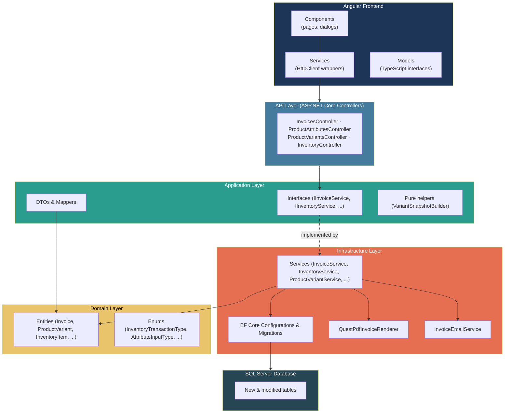
```mermaid
flowchart TB
    subgraph FE["Angular Frontend"]
        FEC["Components<br/>(pages, dialogs)"]
        FES["Services<br/>(HttpClient wrappers)"]
        FEM["Models<br/>(TypeScript interfaces)"]
    end
    subgraph API["API Layer (ASP.NET Core Controllers)"]
        CTRL["InvoicesController · ProductAttributesController<br/>ProductVariantsController · InventoryController"]
    end
    subgraph APP["Application Layer"]
        IFACE["Interfaces (IInvoiceService, IInventoryService, ...)"]
        DTO["DTOs & Mappers"]
        HELP["Pure helpers (VariantSnapshotBuilder)"]
    end
    subgraph INFRA["Infrastructure Layer"]
        SVC["Services (InvoiceService, InventoryService, ProductVariantService, ...)"]
        CFG["EF Core Configurations & Migrations"]
        PDF["QuestPdfInvoiceRenderer"]
        MAIL["InvoiceEmailService"]
    end
    subgraph DOMAIN["Domain Layer"]
        ENT["Entities (Invoice, ProductVariant, InventoryItem, ...)"]
        ENUM["Enums (InventoryTransactionType, AttributeInputType, ...)"]
    end
    subgraph DB["SQL Server Database"]
        TBL["New & modified tables"]
    end

    FEC --> FES --> API
    API --> IFACE
    IFACE -.implemented by.-> SVC
    SVC --> ENT
    SVC --> CFG --> DB
    SVC --> PDF
    SVC --> MAIL
    DTO --> ENT

    style FE fill:#1d3557,color:#fff
    style API fill:#457b9d,color:#fff
    style APP fill:#2a9d8f,color:#fff
    style INFRA fill:#e76f51,color:#fff
    style DOMAIN fill:#e9c46a,color:#000
    style DB fill:#264653,color:#fff
```

Chapters 2–8 walk this diagram from the bottom up for the backend (database → domain → application → infrastructure → API → runtime flow), and Chapters 9–11 do the same for the Angular frontend, from the wire format up to the pixels on screen.

<a id="sec-1-4"></a>
### 1.4 What "Milestone" numbers mean

You will see migration class names like `M0`, `M1`, `M2`, `M3`, `M4`, `M6`, `M7A`, and design-document labels like `M7-B`, `M7-C`, `M7-D`. These are the project's own milestone labels, and they tell a story worth knowing before you read the code:

| Milestone | What it shipped |
|---|---|
| **M0** | `ProductAttribute` / `ProductAttributeValue` tables — the new EAV vocabulary — plus a data migration that seeds a `size` attribute from the legacy `SizeClassifications` table. |
| **M1** | `ProductVariant`, `ProductVariantAttributeValue`, `InventoryItem` — the sellable-unit model — plus a data migration that converts every existing (product, size) stock row into a variant. |
| **M2** | `InventoryTransaction` — the append-only stock ledger — plus an opening-balance migration so the ledger and `InventoryItem.QuantityOnHand` agree from day one. |
| **M3** | Order-line variant snapshot columns (`OrderItem.ProductVariantId/Sku/VariantDescription/AttributesJson`). |
| **M4** | `InventoryReservation` — checkout stock holds — wired into the payment-intent flow. |
| **M6** | Drops the now-fully-replaced `ProductCharacteristic`, `SizeClassification` tables and the `Size` enum. |
| **M7-A** | `Invoice`, `InvoiceLine`, `InvoiceNumberSequence` — the invoicing domain and gapless numbering, wired into the payment-webhook. |
| **M7-B / M7-C / M7-D** | Frontend invoice surfacing, PDF download buttons, and invoice email delivery (covered in Chapters 6, 9–11). |
| **M7-E** *(design only, not built)* | VAT enablement and credit notes — explicitly a **design document**, not shipped code. This guide is careful never to claim VAT math or credit notes exist; they don't yet. See the callout in [§6.7](#sec-6-7). |

> **Tip** — if you ever see a class or column that *looks* tax-related (`PricesIncludeTax`, `TaxBreakdownJson`, `ShippingTaxRate`), remember: today they are always the "no VAT yet" values (`PricesIncludeTax = true`, tax = 0, `TaxBreakdownJson = "[]"`). The columns exist now so that turning on VAT later is a **computation change**, not a schema migration. That is the entire point of M7-E's design note — introduce the shape early, activate the behavior later.

With the *why* out of the way, it is time for the *how*. Every idea in this introduction — the attribute vocabulary, the inventory ledger, the frozen invoice snapshot — starts life as a table in the database, so that is exactly where Chapter 2 begins.

---

<a id="chapter-2"></a>
## Chapter 2 — The Database Layer: Where Everything Begins

Every one of the tables below was created by a real, hand-verified EF Core migration in `Main/LiliShop.Infrastructure/Data/Migrations/`. We start here, as the brief demands, because in this codebase **the database schema *is* the contract** — the domain entities, EF configurations, and even the migrations' own SQL data-backfill blocks all exist to keep one invariant true at every step: *no existing data is lost, and no row is ever left inconsistent, even for one migration.*

### 2.1 The big picture — one ER diagram

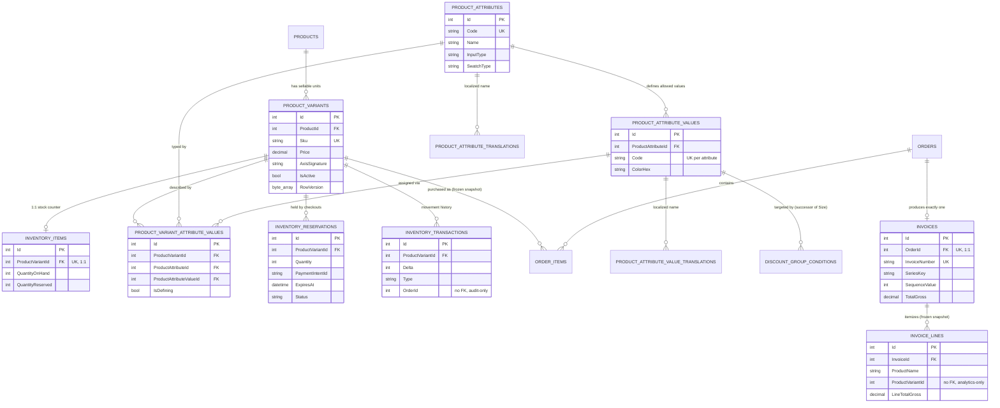
```mermaid
erDiagram
    PRODUCTS ||--o{ PRODUCT_VARIANTS : "has sellable units"
    PRODUCT_VARIANTS ||--o| INVENTORY_ITEMS : "1:1 stock counter"
    PRODUCT_VARIANTS ||--o{ PRODUCT_VARIANT_ATTRIBUTE_VALUES : "described by"
    PRODUCT_VARIANTS ||--o{ INVENTORY_RESERVATIONS : "held by checkouts"
    PRODUCT_VARIANTS ||--o{ INVENTORY_TRANSACTIONS : "movement history"
    PRODUCT_VARIANTS ||--o{ ORDER_ITEMS : "purchased as (frozen snapshot)"

    PRODUCT_ATTRIBUTES ||--o{ PRODUCT_ATTRIBUTE_VALUES : "defines allowed values"
    PRODUCT_ATTRIBUTES ||--o{ PRODUCT_ATTRIBUTE_TRANSLATIONS : "localized name"
    PRODUCT_ATTRIBUTE_VALUES ||--o{ PRODUCT_ATTRIBUTE_VALUE_TRANSLATIONS : "localized name"
    PRODUCT_ATTRIBUTES ||--o{ PRODUCT_VARIANT_ATTRIBUTE_VALUES : "typed by"
    PRODUCT_ATTRIBUTE_VALUES ||--o{ PRODUCT_VARIANT_ATTRIBUTE_VALUES : "assigned via"
    PRODUCT_ATTRIBUTE_VALUES ||--o{ DISCOUNT_GROUP_CONDITIONS : "targeted by (successor of Size)"

    ORDERS ||--o{ ORDER_ITEMS : "contains"
    ORDERS ||--o| INVOICES : "produces exactly one"
    INVOICES ||--o{ INVOICE_LINES : "itemizes (frozen snapshot)"

    PRODUCT_VARIANTS {
        int Id PK
        int ProductId FK
        string Sku UK
        decimal Price
        string AxisSignature
        bool IsActive
        byte_array RowVersion
    }
    INVENTORY_ITEMS {
        int Id PK
        int ProductVariantId FK "UK, 1:1"
        int QuantityOnHand
        int QuantityReserved
    }
    INVENTORY_RESERVATIONS {
        int Id PK
        int ProductVariantId FK
        int Quantity
        string PaymentIntentId
        datetime ExpiresAt
        string Status
    }
    INVENTORY_TRANSACTIONS {
        int Id PK
        int ProductVariantId FK
        int Delta
        string Type
        int OrderId "no FK, audit-only"
    }
    PRODUCT_ATTRIBUTES {
        int Id PK
        string Code UK
        string Name
        string InputType
        string SwatchType
    }
    PRODUCT_ATTRIBUTE_VALUES {
        int Id PK
        int ProductAttributeId FK
        string Code "UK per attribute"
        string ColorHex
    }
    PRODUCT_VARIANT_ATTRIBUTE_VALUES {
        int Id PK
        int ProductVariantId FK
        int ProductAttributeId FK
        int ProductAttributeValueId FK
        bool IsDefining
    }
    INVOICES {
        int Id PK
        int OrderId FK "UK, 1:1"
        string InvoiceNumber UK
        string SeriesKey
        int SequenceValue
        decimal TotalGross
    }
    INVOICE_LINES {
        int Id PK
        int InvoiceId FK
        string ProductName
        int ProductVariantId "no FK, analytics-only"
        decimal LineTotalGross
    }
```

Read that diagram slowly — it already tells you most of the design:

- `ProductVariant` is the new center of gravity. A `Product` is the marketing-facing "thing" (name, photos, description); a `ProductVariant` is the *sellable unit* — the thing that actually has a SKU, a price, and stock.
- `InventoryItem` has a **1-to-1** relationship with `ProductVariant` (enforced by a unique index on `ProductVariantId`) — one live counter per variant.
- `InventoryReservation` and `InventoryTransaction` both point at `ProductVariant` but never at each other directly; they are two different views of the same stock — "what's held right now" vs. "everything that ever happened."
- Two foreign keys are **deliberately absent**: `InventoryTransaction.OrderId` and `InvoiceLine.ProductVariantId`. Both are plain `int` columns with no navigation property. This is not an oversight — it is explained in [§2.5](#sec-2-5) and [§3.5](#sec-3-5): an audit ledger and a legal document must never be able to lose their record just because something else was deleted.
- `Invoice` has a strict **1-to-1** with `Order` (unique index on `OrderId`) — "exactly one invoice per order," enforced by the database, not just by application logic.

<a id="sec-2-2"></a>
### 2.2 Table-by-table reference

For each table below: purpose, every column, keys, indexes, and — where useful — an example row. All of this is taken directly from the EF Core migration `Up()` methods and the matching `IEntityTypeConfiguration<T>` classes, so column types/lengths are exact.

#### `ProductAttributes`

*Migration: `M0_AddProductAttributes`. Configuration: `ProductAttributeConfiguration.cs`.*

The catalog-wide vocabulary of "axes a product can vary along" — Color, Size, Pattern, Material, whatever the business wants next. This is the table that makes the whole system *dynamic*: adding a new kind of option is an admin creating a row here, not a code change.

| Column | Type | Notes |
|---|---|---|
| `Id` | `int` (identity) | **PK** |
| `Code` | `nvarchar(50)` | **Unique.** Stable, lowercase, culture-neutral identifier (`"color"`, `"size"`, `"pattern"`) — used in SKU generation, never shown to a customer. |
| `Name` | `nvarchar(100)` | Default-culture display name ("Color"). Overridden per-culture by `ProductAttributeTranslations`. |
| `InputType` | `nvarchar(50)` | `Select` or `MultiSelect` — see [§3.2](#sec-3-2). Stored as the enum's *string* name (`HasConversion<string>()`), not a number, so the raw DB row is human-readable. |
| `SwatchType` | `nvarchar(50)` | `None`, `ColorHex`, or `Image` — how the storefront renders this attribute's values. |
| `IsFilterable` | `bit` | Whether the storefront should offer this as a filter facet. |
| `DisplayOrder` | `int` | Sort order among attributes in selectors/filters. |
| `IsActive` | `bit` | Soft "is this attribute usable" flag. |
| `CreatedDate` / `ModifiedDate` | `datetimeoffset` | Standard audit columns from `BaseEntity`. |

**Indexes:** unique on `Code`.

**Example rows** (from the real seed data, `productAttributes.json`):

| Id | Code | Name | InputType | SwatchType | DisplayOrder |
|---|---|---|---|---|---|
| 1 | `color` | Color | MultiSelect | ColorHex | 10 |
| 2 | `size` | Size | Select | None | 20 |
| 3 | `pattern` | Pattern | Select | Image | 30 |

Notice `color` is `MultiSelect` at the catalog level — that is the attribute's *default* nature, not a hard rule. As you'll see in [§9](#chapter-9), the admin variant editor lets an individual **product** decide that Color is a *defining* (single-value) axis for that one product, e.g. a plain-color T-shirt, while a striped shirt keeps Color as a *descriptive* (multi-value) fact. The attribute doesn't hardcode this — the variant's links do (`IsDefining`, [§2.4](#sec-2-4)).

#### `ProductAttributeTranslations` / `ProductAttributeValueTranslations`

*Same migration. Configurations: `ProductAttributeTranslationConfiguration.cs`, `ProductAttributeValueTranslationConfiguration.cs`.*

Thin per-culture name tables, one row per (attribute, culture) or (value, culture). This mirrors the exact pattern already used elsewhere in LiliShop for `ProductTranslation` — nothing new was invented here, the new attribute system just plugs into the shop's existing localization convention (more in [Chapter 12](#chapter-12)).

| Table | Columns | Unique index |
|---|---|---|
| `ProductAttributeTranslations` | `Id`, `ProductAttributeId` (FK, cascade), `Culture` (`nvarchar(10)`), `Name` (`nvarchar(100)`) | `(ProductAttributeId, Culture)` |
| `ProductAttributeValueTranslations` | `Id`, `ProductAttributeValueId` (FK, cascade), `Culture`, `Name` | `(ProductAttributeValueId, Culture)` |

If a culture has no row here, the reader falls back to the base `Name` column on `ProductAttribute`/`ProductAttributeValue` — that's *why* the base `Name` is called "the default-culture fallback" throughout the code comments.

#### `ProductAttributeValues`

*Migration: `M0`. Configuration: `ProductAttributeValueConfiguration.cs`.*

One selectable value of an attribute — Color → "Yellow", Size → "M".

| Column | Type | Notes |
|---|---|---|
| `Id` | `int` (identity) | **PK** |
| `ProductAttributeId` | `int` | **FK** → `ProductAttributes.Id`, `Cascade` delete. |
| `Code` | `nvarchar(50)` | Unique *per attribute* (`(ProductAttributeId, Code)`), lowercase, e.g. `"yellow"`, `"m"`. |
| `Name` | `nvarchar(100)` | Default-culture display name. |
| `ColorHex` | `nvarchar(9)` (nullable) | `"#RRGGBB"` or `"#RRGGBBAA"`, only meaningful when the parent attribute's `SwatchType` is `ColorHex`. |
| `SortOrder` | `int` | Lets sizes sort `XS → S → M → L → XL` instead of alphabetically. |
| `IsActive` | `bit` | |

**Example rows** (`color` attribute):

| Id | ProductAttributeId | Code | Name | ColorHex | SortOrder |
|---|---|---|---|---|---|
| 10 | 1 | `black` | Black | `#000000` | 10 |
| 16 | 1 | `yellow` | Yellow | `#FBC02D` | 60 |

#### `ProductVariants`

*Migration: `M1_AddProductVariants`. Configuration: `ProductVariantConfiguration.cs`.*

**This is the table the entire feature revolves around.** A `ProductVariant` is the sellable unit — what actually has a SKU, a price, and stock. A `Product` becomes a container of one-or-more variants.

| Column | Type | Notes |
|---|---|---|
| `Id` | `int` (identity) | **PK** |
| `ProductId` | `int` | **FK** → `Products.Id`, `Cascade`. |
| `Sku` | `nvarchar(64)` | **Unique catalog-wide.** Auto-generated (`P{productId}-{VALUECODE}-...`) or admin-supplied. |
| `Price` | `decimal(18,2)` | Per-variant price — a striped shirt's M and XL can cost differently if the business wants that. |
| `PreviousPrice` | `decimal(18,2)`, nullable | Pre-sale price while a discount is active. |
| `AxisSignature` | `nvarchar(400)` | See callout below — the identity fingerprint of the variant. |
| `Barcode` | `nvarchar(64)`, nullable | |
| `WeightGrams` | `int`, nullable | |
| `IsActive` | `bit` | |
| `Position` | `int` | Sort order in the variant selector. |
| `RowVersion` | `rowversion` | Optimistic-concurrency token (`[Timestamp]` in C#). |

**Indexes:**
- Unique on `Sku`.
- **Unique on `(ProductId, AxisSignature)`** — this is the constraint that makes "no two variants of one product can share the same defining combination" a database-level guarantee, not just application logic.
- Non-unique on `(ProductId, IsActive)` — the storefront's "give me this product's active variants" query.

> **What is `AxisSignature`?** It's a normalized string built from a variant's *defining* attribute/value pairs, sorted by attribute id: `"attributeId:valueId|attributeId:valueId"` (empty string `""` for a product's single axis-less default variant). It is computed by one static method and *only* that method — never hand-assembled elsewhere:
> ```csharp
> // LiliShop.Domain/Entities/ProductVariant.cs
> public static string ComputeAxisSignature(IEnumerable<(int AttributeId, int ValueId)> definingPairs)
> {
>     return string.Join('|', definingPairs
>         .OrderBy(p => p.AttributeId)
>         .ThenBy(p => p.ValueId)
>         .Select(p => $"{p.AttributeId}:{p.ValueId}"));
> }
> ```
> Because the string is canonical (always sorted the same way), two variants can never accidentally collide *or* accidentally miss a real collision — the unique index on `(ProductId, AxisSignature)` does the rest. This single idea replaces what would otherwise be a much more complex "check every existing variant's attribute set" validation query.

**Example rows** (a shirt, product id 42, with Pattern + Size as defining axes):

| Id | ProductId | Sku | Price | AxisSignature | IsActive |
|---|---|---|---|---|---|
| 501 | 42 | `P42-TROPICAL-M` | 29.99 | `3:60\|2:30` | 1 |
| 502 | 42 | `P42-TROPICAL-L` | 29.99 | `3:60\|2:40` | 1 |

(Here `3:60` reads as "attribute 3 [Pattern] = value 60 [Tropical]", `2:30` as "attribute 2 [Size] = value 30 [M]".)

#### `ProductVariantAttributeValues`

*Migration: `M1`. Configuration: `ProductVariantAttributeValueConfiguration.cs`.*

The join table that actually attaches attribute values to a variant — and the table that carries the single most important boolean in the whole feature: `IsDefining`.

| Column | Type | Notes |
|---|---|---|
| `Id` | `int` (identity) | **PK** |
| `ProductVariantId` | `int` | **FK** → `ProductVariants.Id`, `Cascade`. |
| `ProductAttributeId` | `int` | **FK** → `ProductAttributes.Id`, `Restrict` (see below). |
| `ProductAttributeValueId` | `int` | **FK** → `ProductAttributeValues.Id`, `Restrict`. |
| `IsDefining` | `bit` | `true` = this value is part of the variant's *identity*. `false` = this value merely *describes* the variant. |

**Indexes:**
- Unique on `(ProductVariantId, ProductAttributeId, ProductAttributeValueId)` — a variant can't carry the exact same link twice.
- Non-unique on `(ProductAttributeValueId, ProductVariantId)` — the "find every variant that has value X" query direction, which the storefront filter sidebar will use.

**Why `Restrict` here but `Cascade` from `ProductVariant`?** Deleting a variant should take its own links with it (cascade). But deleting a *catalog* attribute or value while variants still reference it would silently corrupt those variants' identity — so the database refuses the delete outright, and the application layer (`ProductAttributeService.DeleteAttributeAsync`/`DeleteValueAsync`) is responsible for giving the admin a clear error instead of a raw SQL exception.

**Defining vs. descriptive, in one picture:**

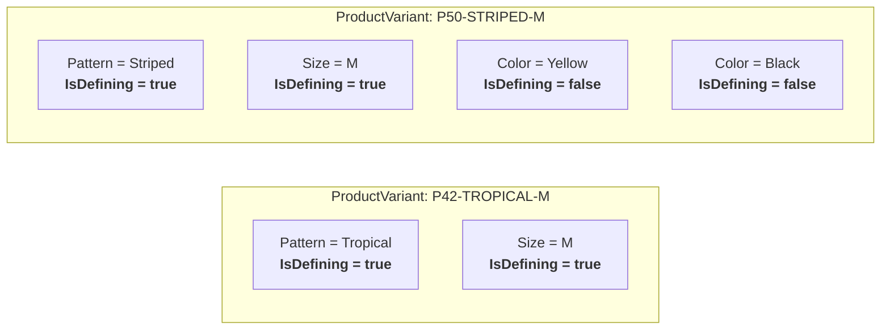
```mermaid
flowchart LR
    subgraph V1["ProductVariant: P42-TROPICAL-M"]
        direction TB
        D1["Pattern = Tropical <br/><b>IsDefining = true</b>"]
        D2["Size = M <br/><b>IsDefining = true</b>"]
    end
    subgraph V2["ProductVariant: P50-STRIPED-M"]
        direction TB
        D3["Pattern = Striped <br/><b>IsDefining = true</b>"]
        D4["Size = M <br/><b>IsDefining = true</b>"]
        D5["Color = Yellow <br/><b>IsDefining = false</b>"]
        D6["Color = Black <br/><b>IsDefining = false</b>"]
    end
```

The striped shirt has *two* Color values on the *same* variant — both non-defining. That's only legal because `IsDefining = false` allows several rows per attribute; a defining attribute is restricted (in the application layer, [§5](#chapter-5)) to at most one value per variant.

#### `InventoryItems`

*Migration: `M1`. Configuration: `InventoryItemConfiguration.cs`.*

The live stock counter — one row per variant, always.

| Column | Type | Notes |
|---|---|---|
| `Id` | `int` (identity) | **PK** |
| `ProductVariantId` | `int` | **FK**, `Cascade`. **Unique** (1:1 with `ProductVariant`). |
| `QuantityOnHand` | `int` | Physical stock. |
| `QuantityReserved` | `int` | Units currently held by active checkout reservations. |
| `RowVersion` | `rowversion` | Optimistic concurrency. |

`AvailableToSell = QuantityOnHand − QuantityReserved`. This subtraction happens everywhere in the code (never stored as its own column) — you'll see the exact same expression in the backend service, the checkout guard, and the Angular product page.

#### `InventoryTransactions`

*Migration: `M2_AddInventoryLedger`. Configuration: `InventoryTransactionConfiguration.cs`.*

The append-only ledger — **every** stock movement, ever, with no update or delete path. This *is* the audit trail.

| Column | Type | Notes |
|---|---|---|
| `Id` | `int` (identity) | **PK** |
| `ProductVariantId` | `int` | **FK**, `Cascade`. |
| `Delta` | `int` | Signed change. Which quantity it applies to (`OnHand` vs `Reserved`) follows from `Type`. |
| `Type` | `nvarchar(50)` | `Receive`, `Adjust`, `Reserve`, `ReleaseReservation`, `Deduct`, `Refund` — see [§3.3](#sec-3-3). |
| `Reason` | `nvarchar(500)`, nullable | Required for manual `Adjust` rows; optional context otherwise. |
| `OrderId` | `int`, nullable | **Deliberately NOT a foreign key.** A plain value, so the audit row outlives the order it references even in a hypothetical future where orders could be purged. |
| `PerformedBy` | `nvarchar(256)`, nullable | Admin username, or `"system"` for automatic movements. |

**Indexes:** `(ProductVariantId, Id)` for "newest movements of one variant" reads; `(OrderId)` for "has this order already been deducted?" idempotency checks.

**Migration's own data backfill** — when this table was introduced, existing stock didn't just appear from nowhere; the migration inserts one opening `Receive` row per variant that already had stock, so the ledger invariant ("sum of a variant's deltas equals `InventoryItem.QuantityOnHand`") is true from row one:

```sql
INSERT INTO [InventoryTransactions] ([ProductVariantId], [Delta], [Type], [Reason], [PerformedBy], [CreatedDate])
SELECT ii.[ProductVariantId], ii.[QuantityOnHand], N'Receive', N'M1 stock carry-over', N'system', SYSDATETIMEOFFSET()
FROM [InventoryItems] ii
WHERE ii.[QuantityOnHand] > 0
  AND NOT EXISTS (SELECT 1 FROM [InventoryTransactions] t WHERE t.[ProductVariantId] = ii.[ProductVariantId]);
```

#### `InventoryReservations`

*Migration: `M4_AddInventoryReservations`. Configuration: `InventoryReservationConfiguration.cs`.*

A checkout stock hold: "this payment intent holds N units of this variant until this moment."

| Column | Type | Notes |
|---|---|---|
| `Id` | `int` (identity) | **PK** |
| `ProductVariantId` | `int` | **FK**, `Cascade`. |
| `Quantity` | `int` | |
| `PaymentIntentId` | `nvarchar(256)` | The Stripe payment intent this hold belongs to. |
| `ExpiresAt` | `datetimeoffset` | After this, the sweep releases the hold. |
| `Status` | `nvarchar(50)` | `Active`, `Committed`, `Released`, `Expired` — see [§3.3](#sec-3-3). |

**Indexes:** `(PaymentIntentId, Status)` — webhook/re-reservation lookups; `(Status, ExpiresAt)` — the expiry sweep's scan.

#### `Invoices`

*Migration: `M7A_AddInvoices`. Configuration: `InvoiceConfiguration.cs`.*

An immutable, self-contained legal document. Read that adjective twice — **immutable**. Every value on this row is a *snapshot*, copied at issue time; nothing here is a live join back to the order, the catalog, or the shop's configuration. Full column-by-column detail (there are almost 30 columns, grouped by purpose) is in [Chapter 6](#chapter-6), which is dedicated entirely to invoicing. The schema highlights for this database chapter:

| Column group | Example columns | Purpose |
|---|---|---|
| Identity | `InvoiceNumber` (unique), `SeriesKey`, `SequenceValue` | The gapless, human-readable number. |
| Seller snapshot | `SellerLegalName`, `SellerAddressLine`, `SellerVatId`, `SellerContact` | Copied from configuration *at issue time*. |
| Buyer/billing snapshot | `BuyerEmail`, `BillingFirstName`...`BillingCountry` | Copied from the order's ship-to address. |
| Money | `ShippingGross/Net/Tax`, `TotalNet/Tax/Gross`, `TaxBreakdownJson` | Gross-only today (see the M7-E callout). |
| Rendered document | `PdfPublicId`, `PdfUrl` | Reserved for a future stored-PDF workflow; today the PDF is rendered on demand ([§6.5](#sec-6-5)). |

**Indexes:** unique on `OrderId` (one invoice per order — the hard backstop against a double-mint on webhook replay), unique on `InvoiceNumber`.

**Relationship to `Order`:** `HasOne(i => i.Order).WithOne().OnDelete(DeleteBehavior.Restrict)` — an invoiced order can never be cascade-deleted out from under its invoice. The database enforces what the order service's own business rules already try to guarantee.

#### `InvoiceLines`

*Migration: `M7A`. Configuration: `InvoiceLineConfiguration.cs`.*

One line per purchased item, frozen at issue time — **not** a foreign key to `OrderItem`. If the order changes later (it shouldn't, but *if*), the invoice line is unaffected.

| Column | Type | Notes |
|---|---|---|
| `Id` | `int` (identity) | **PK** |
| `InvoiceId` | `int` | **FK** → `Invoices.Id`, `Cascade` (lines die with their invoice; invoices are never deleted in practice). |
| `Position` | `int` | Display order. |
| `ProductName`, `Sku`, `VariantDescription`, `AttributesJson` | various | Copied from the order item **as sold** — see [§4.5](#sec-4-5). |
| `ProductVariantId` | `int`, nullable | **No FK, no navigation** — deliberately non-relational, for reorder/analytics only. |
| Money columns | `UnitPriceGross`, `LineNetAmount`, `LineTaxAmount`, `TaxRate`, `LineTotalGross` | |

#### `InvoiceNumberSequences`

*Migration: `M7A`. Configuration: `InvoiceNumberSequenceConfiguration.cs`.*

A tiny table — one row per numbering series (e.g. `"LILI-2026"`) — that exists purely to make invoice numbering **gapless** under concurrency. Full mechanics in [§6.3](#sec-6-3).

| Column | Type | Notes |
|---|---|---|
| `Id` | `int` (identity) | **PK** |
| `SeriesKey` | `nvarchar(40)` | **Unique.** |
| `LastValue` | `int` | Last allocated number in this series. |

### 2.3 What changed on *existing* tables

Three pre-existing tables were touched, each by a small, additive migration:

| Table | Migration | Change |
|---|---|---|
| `DiscountGroupConditions` | `M0` | `+ ProductAttributeValueId` (nullable FK → `ProductAttributeValues`, `Restrict`) — the successor of size-based discount targeting. |
| `OrderItems` | `M3_AddOrderItemVariantSnapshot` | `+ ProductVariantId` (nullable FK → `ProductVariants`, `Restrict`), `+ Sku`, `+ VariantDescription`, `+ AttributesJson` — the order-time variant snapshot. |
| `Orders` | `M7A` | `+ Currency` (`nvarchar(3)`, default `'eur'`, backfilled on every existing row) — a currency snapshot for the invoice to copy. |

<a id="sec-2-4"></a>
### 2.4 The retirement of `ProductCharacteristic` and `SizeClassification`

*Migration: `M6_DropLegacySizeAndCharacteristics`.*

This migration's `Up()` is almost entirely `DropTable`/`DropColumn` calls — dropping `ProductCharacteristics`, `SizeClassifications`, the `SizeClassificationId` column and its FK on `DiscountGroupConditions`. Nothing dramatic in the SQL itself; the real engineering happened two migrations earlier, in M0/M1, where every row of that legacy data was *already* copied forward into the new tables. M6 is simply "now it's safe to remove the old furniture."

What makes this safe is the discipline in the **earlier** migrations' data-backfill blocks (fully shown in [§2.5](#sec-2-5) below) — each one ends with an explicit SQL verification query that **throws and aborts the migration** if anything doesn't add up:

```sql
-- from M1_AddProductVariants.cs
IF EXISTS (SELECT 1 FROM [Products] p WHERE NOT EXISTS (SELECT 1 FROM [ProductVariants] pv WHERE pv.[ProductId] = p.[Id]))
    THROW 50010, N'M1 migration verification failed: some products have no variant.', 1;

IF (SELECT ISNULL(SUM(CAST([Quantity] AS BIGINT)), 0) FROM [ProductCharacteristics])
   <> (SELECT ISNULL(SUM(CAST([QuantityOnHand] AS BIGINT)), 0) FROM [InventoryItems])
    THROW 50011, N'M1 migration verification failed: total stock does not match the legacy ProductCharacteristics table.', 1;
```

> **Why this matters, and why it's a good pattern to learn:** a silent migration bug that quietly drops or duplicates stock is one of the worst things that can happen to an e-commerce database — it's invisible until a customer complains, and by then the audit trail is gone too. By making the migration itself refuse to proceed on a mismatch, a bad migration fails loudly, in a maintenance window, with a rollback still possible — instead of failing silently in production three weeks later.

<a id="sec-2-5"></a>
### 2.5 Data migrations, not just schema migrations

It's worth pulling one thread all the way through, because it's the most instructive part of this database chapter: **M0 and M1 don't just create tables — each one also migrates real, existing data**, in three steps, every time:

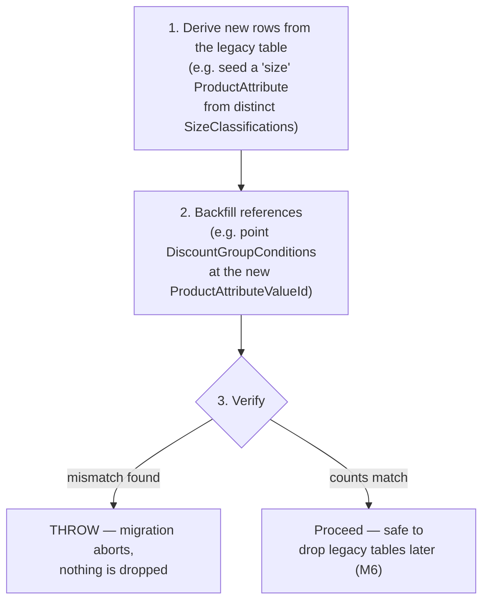
```mermaid
flowchart TD
    A["1. Derive new rows from the legacy table<br/>(e.g. seed a 'size' ProductAttribute<br/>from distinct SizeClassifications)"] --> B["2. Backfill references<br/>(e.g. point DiscountGroupConditions<br/>at the new ProductAttributeValueId)"]
    B --> C{"3. Verify"}
    C -->|mismatch found| D["THROW — migration aborts,<br/>nothing is dropped"]
    C -->|counts match| E["Proceed — safe to<br/>drop legacy tables later (M6)"]
```

M0 does this for `SizeClassifications` → `ProductAttributes`/`ProductAttributeValues`. M1 does it again for `ProductCharacteristics` → `ProductVariants`/`InventoryItems`.

There is one more wrinkle. A database could have been migrated to exactly M0 and then had new discount conditions created before M1 ran. To cover that gap, M1 *re-runs* M0's `DiscountGroupConditions` backfill for any rows created in between. This "re-run the previous backfill for the gap window" detail is a subtle but real production concern: migrations don't all run at the same instant across every environment, and this codebase accounts for that.

Fresh databases (a new dev environment, CI, a demo instance) never hit these `SQL` blocks doing anything — the `IF EXISTS (SELECT 1 FROM [SizeClassifications])` guards are all false because there's no legacy data to migrate, and `ShopContextSeed` (LiliShop's seed-data runner) populates the new tables directly from `productAttributes.json` instead (see Appendix A.10).

<a id="sec-2-6"></a>
### 2.6 EF Core mapping — from migration SQL to C#

Every table above has a matching `IEntityTypeConfiguration<T>` class in `Main/LiliShop.Infrastructure/Data/Config/`, which is where the migration's raw SQL types (`nvarchar(64)`, `decimal(18,2)`) get tied back to strongly-typed C# properties, relationships, and indexes that EF Core's LINQ provider understands. Two configuration idioms are used repeatedly and worth calling out once, here, since you'll see them again in every chapter:

**1. Enums are stored as strings, not numbers:**
```csharp
// ProductAttributeConfiguration.cs
builder.Property(a => a.InputType)
    .IsRequired()
    .HasMaxLength(50)
    .HasConversion<string>();
```
This trades a few bytes of storage for a database that's directly readable during debugging (`InputType = 'Select'`, not `InputType = 10`) and immune to enum-reordering bugs.

**2. `Restrict` vs. `Cascade` is a deliberate business decision, not a default:**

| Relationship | Delete behavior | Reasoning |
|---|---|---|
| `ProductVariant` → `Product` | `Cascade` | Deleting a product should take its variants with it. |
| `InventoryItem`/`InventoryReservation`/`InventoryTransaction` → `ProductVariant` | `Cascade` | Same logic — but in practice the application layer refuses to hard-delete an ordered variant at all ([§5.2](#sec-5-2)), so this rarely fires. |
| `ProductVariantAttributeValue` → `ProductAttribute` / `ProductAttributeValue` | `Restrict` | A catalog attribute/value referenced by a variant must not silently vanish. |
| `Invoice` → `Order` | `Restrict` | A paid, invoiced order must never be cascade-deleted. |
| `OrderItem` → `ProductVariant` | `Restrict` | An ordered variant can be deactivated but its order history must survive even a (hypothetical) variant deletion attempt. |

The next chapter moves one layer up from these tables into the C# `Domain` entities that map onto them — where you'll meet the actual classes (`ProductVariant.cs`, `InventoryItem.cs`, `Invoice.cs`, …) and the business rules encoded directly in their doc-comments and computed properties.

<a id="chapter-3"></a>
## Chapter 3 — The Domain Layer: Entities & Enums

The Domain layer is the innermost ring of LiliShop's Clean Architecture — it has no dependency on EF Core, ASP.NET, or anything external. It is plain C# classes and enums that describe *what a thing is* and, through doc-comments and a few computed helpers, *what rules always hold about it*. Every class below lives in `Main/LiliShop.Domain/Entities/` (or `Entities/Invoicing/`) and `Main/LiliShop.Domain/Enums/`.

### 3.1 Class diagram

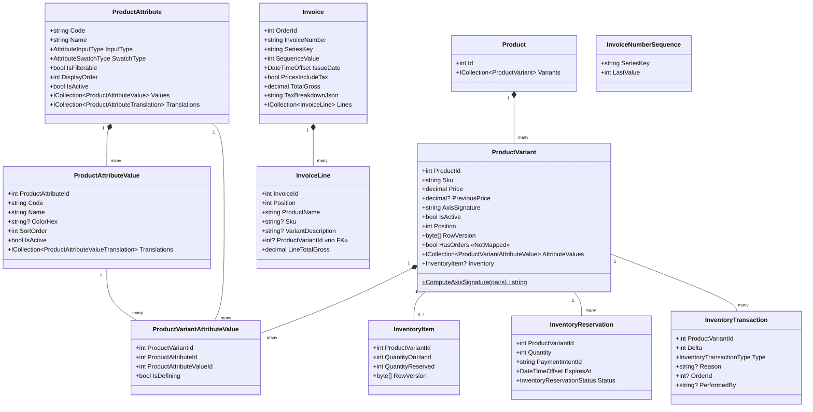
```mermaid
classDiagram
    class Product {
        +int Id
        +ICollection~ProductVariant~ Variants
    }
    class ProductVariant {
        +int ProductId
        +string Sku
        +decimal Price
        +decimal? PreviousPrice
        +string AxisSignature
        +bool IsActive
        +int Position
        +byte[] RowVersion
        +bool HasOrders  «NotMapped»
        +ICollection~ProductVariantAttributeValue~ AttributeValues
        +InventoryItem? Inventory
        +ComputeAxisSignature(pairs)$ string
    }
    class ProductAttribute {
        +string Code
        +string Name
        +AttributeInputType InputType
        +AttributeSwatchType SwatchType
        +bool IsFilterable
        +int DisplayOrder
        +bool IsActive
        +ICollection~ProductAttributeValue~ Values
        +ICollection~ProductAttributeTranslation~ Translations
    }
    class ProductAttributeValue {
        +int ProductAttributeId
        +string Code
        +string Name
        +string? ColorHex
        +int SortOrder
        +bool IsActive
        +ICollection~ProductAttributeValueTranslation~ Translations
    }
    class ProductVariantAttributeValue {
        +int ProductVariantId
        +int ProductAttributeId
        +int ProductAttributeValueId
        +bool IsDefining
    }
    class InventoryItem {
        +int ProductVariantId
        +int QuantityOnHand
        +int QuantityReserved
        +byte[] RowVersion
    }
    class InventoryReservation {
        +int ProductVariantId
        +int Quantity
        +string PaymentIntentId
        +DateTimeOffset ExpiresAt
        +InventoryReservationStatus Status
    }
    class InventoryTransaction {
        +int ProductVariantId
        +int Delta
        +InventoryTransactionType Type
        +string? Reason
        +int? OrderId
        +string? PerformedBy
    }
    class Invoice {
        +int OrderId
        +string InvoiceNumber
        +string SeriesKey
        +int SequenceValue
        +DateTimeOffset IssueDate
        +bool PricesIncludeTax
        +decimal TotalGross
        +string TaxBreakdownJson
        +ICollection~InvoiceLine~ Lines
    }
    class InvoiceLine {
        +int InvoiceId
        +int Position
        +string ProductName
        +string? Sku
        +string? VariantDescription
        +int? ProductVariantId «no FK»
        +decimal LineTotalGross
    }
    class InvoiceNumberSequence {
        +string SeriesKey
        +int LastValue
    }

    Product "1" *-- "many" ProductVariant
    ProductVariant "1" *-- "many" ProductVariantAttributeValue
    ProductAttribute "1" *-- "many" ProductAttributeValue
    ProductAttribute "1" -- "many" ProductVariantAttributeValue
    ProductAttributeValue "1" -- "many" ProductVariantAttributeValue
    ProductVariant "1" -- "0..1" InventoryItem
    ProductVariant "1" -- "many" InventoryReservation
    ProductVariant "1" -- "many" InventoryTransaction
    Invoice "1" *-- "many" InvoiceLine
```

### 3.2 The attribute vocabulary: `ProductAttribute`, `ProductAttributeValue`, and their translations

`ProductAttribute.cs` states its own purpose in its doc-comment better than any paraphrase could:

```csharp
/// An admin-managed catalog attribute (Color, Size, Pattern, Material, …).
/// Attributes and their <see cref="ProductAttributeValue"/> lists replace the former
/// hardcoded <c>Size</c> enum so new axes need no code change or redeploy.
```

Two enums shape how an attribute behaves, and both are worth memorizing because they show up constantly in later chapters:

<a id="sec-3-2"></a>
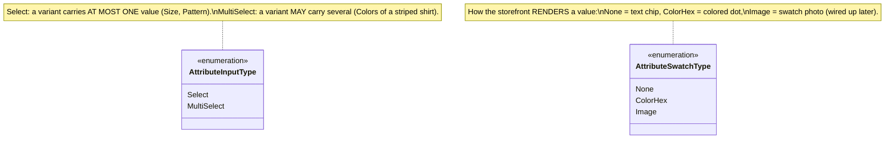
```mermaid
classDiagram
    class AttributeInputType {
        <<enumeration>>
        Select
        MultiSelect
    }
    class AttributeSwatchType {
        <<enumeration>>
        None
        ColorHex
        Image
    }
    note for AttributeInputType "Select: a variant carries AT MOST ONE value (Size, Pattern).\nMultiSelect: a variant MAY carry several (Colors of a striped shirt)."
    note for AttributeSwatchType "How the storefront RENDERS a value:\nNone = text chip, ColorHex = colored dot,\nImage = swatch photo (wired up later)."
```

`AttributeInputType` describes the attribute's *catalog-wide default nature* — but as you already saw in [§2.2](#sec-2-2), the *actual* defining/descriptive choice for a given product's variants is stored per-link (`ProductVariantAttributeValue.IsDefining`), not read off this enum at variant-save time. `InputType` mostly matters to the admin UI (should this render as a single-select dropdown or a multi-select?) — the real identity rule lives one class down, on the join entity.

`ProductAttributeValue` is the one selectable value ("Yellow", "M", "Tropical"). It carries `ColorHex` (used only when the parent's `SwatchType` is `ColorHex`) and `SortOrder` — the reason sizes render `XS → S → M → L → XL` instead of alphabetically is this one integer column, nothing cleverer.

`ProductAttributeTranslation` and `ProductAttributeValueTranslation` are almost embarrassingly simple — `{ ForeignKey, Culture, Name }` — and that simplicity is the point: LiliShop already had this exact shape for `ProductTranslation`, so the new attribute system didn't invent a new localization pattern, it reused one. [Chapter 12](#chapter-12) covers how the *read* side (`BusinessTranslationService`) turns these rows into name lookups without an N+1 query per page.

<a id="sec-3-3"></a>
### 3.3 The sellable unit: `ProductVariant` and `ProductVariantAttributeValue`

`ProductVariant`'s doc-comment draws the line between "product" and "variant" precisely:

```csharp
/// The sellable unit (SKU). A <see cref="Product"/> is the container; what a customer actually
/// buys is one of its variants ("Casual Shirt / Tropical / M"). The defining attribute values
/// (<see cref="ProductVariantAttributeValue.IsDefining"/>) identify the variant; descriptive
/// values (e.g. the two colors of a striped shirt) describe it for display and filtering.
```

Two members deserve a closer look because they encode business rules directly in the entity, not buried in a service:

**`HasOrders` is `[NotMapped]` — a computed, not stored, property:**

```csharp
/// True when at least one order line references this variant (computed per request, not stored).
/// From that moment the variant's IDENTITY is locked — its SKU and its defining combination
/// (Color/Size/Pattern) can no longer change and it can no longer be hard-deleted, because that
/// identity is what the customer bought and it lives on order confirmations, invoices, and
/// exports. Operational fields (price, previous price, stock, active, images) stay editable.
/// A different identity is a different variant: create a new one and deactivate this.
[NotMapped]
public bool HasOrders { get; set; }
```

This is design decision **D2** from the Product Variant roadmap, and it's worth understanding *why* it exists, because it's a genuinely subtle real-world problem. Imagine an admin renames a variant's SKU, or flips its size from `M` to `L`, *after* ten customers have already bought "the M". Every one of those ten already-shipped orders, invoices, and packing labels now silently refers to something that no longer exists under that identity. The roadmap doc calls this out directly: it "turns the variant into a different product under a SKU that already shipped as something else."

D2's answer: once `HasOrders` is true (computed by `ProductVariantService`, [§5.2](#sec-5-2), by checking whether any `OrderItem.ProductVariantId` points at this row), the **identity** fields (SKU, defining attribute values) freeze — the server refuses the edit and the delete — while **operational** fields (price, stock, active flag, images) stay fully editable. The roadmap doc explicitly considered and rejected two simpler alternatives: locking everything from creation (too strict — it punishes a typo fixed one minute after saving), and locking on first inventory receipt (effectively identical to locking at creation, since initial stock is set the moment the variant is created).

> **Common mistake to avoid:** it is tempting to think "the SKU is just a label, why not let admins fix it any time?" The answer is that a SKU is not just a label here — it is a reference other documents point to. Once an invoice or a shipping label has printed a SKU, that string has left the database and become a fact in the outside world. D2 exists so the database can never contradict paperwork that already left the building.

**`ComputeAxisSignature` is a `static` method, called from exactly one place:**

```csharp
public static string ComputeAxisSignature(IEnumerable<(int AttributeId, int ValueId)> definingPairs)
{
    return string.Join('|', definingPairs
        .OrderBy(p => p.AttributeId)
        .ThenBy(p => p.ValueId)
        .Select(p => $"{p.AttributeId}:{p.ValueId}"));
}
```

Putting this on the entity itself — rather than as a private helper duplicated in the service and the tests — guarantees that the *exact same* canonicalization logic runs everywhere the signature matters: the save-time validation (`ProductVariantService.UpsertVariantsAsync`), the bulk generator's duplicate-skip check (`GenerateVariantDraftsAsync`), and the unit tests (`ComputeAxisSignature_IsOrderIndependent_AndSorted`). One method, one truth.

`ProductVariantAttributeValue` is the join row carrying `IsDefining`. Its doc-comment gives the exact vocabulary this guide has been using:

```csharp
/// Defining rows (IsDefining = true, at most one per attribute per variant) make up the variant's
/// identity — e.g. Pattern=Striped + Size=M. Descriptive rows (IsDefining = false, several per
/// attribute allowed) describe it — e.g. Color=Yellow AND Color=Black on the striped shirt — and
/// drive filtering: a customer filtering on Yellow or Black finds this variant.
```

<a id="sec-3-4"></a>
### 3.4 The stock ledger: `InventoryItem`, `InventoryReservation`, `InventoryTransaction`

These three classes exist because "how much is in stock" turned out to need three different questions answered, not one:

| Entity | Answers | Lifespan |
|---|---|---|
| `InventoryItem` | "What's the number **right now**?" | Mutated in place, but *only* by `InventoryService`'s guarded atomic updates. |
| `InventoryReservation` | "Who is **currently holding** stock, and until when?" | Created and resolved (`Committed`/`Released`/`Expired`) per checkout. |
| `InventoryTransaction` | "What **happened**, ever?" | Append-only. Never updated, never deleted. |

`InventoryTransactionType` and `InventoryReservationStatus` are the two enums that drive this trio:

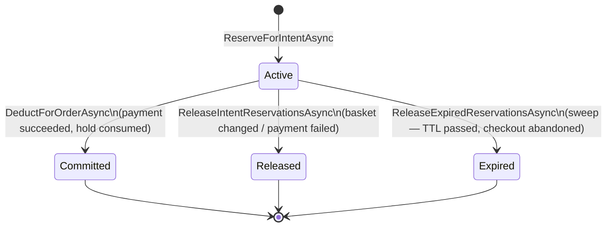
```mermaid
stateDiagram-v2
    [*] --> Active: ReserveForIntentAsync
    Active --> Committed: DeductForOrderAsync\n(payment succeeded, hold consumed)
    Active --> Released: ReleaseIntentReservationsAsync\n(basket changed / payment failed)
    Active --> Expired: ReleaseExpiredReservationsAsync\n(sweep — TTL passed, checkout abandoned)
    Committed --> [*]
    Released --> [*]
    Expired --> [*]
```

Every arrow above corresponds to a real method on `IInventoryService` ([§5.3](#sec-5-3)), and every transition writes an `InventoryTransaction` row (`Reserve` on entry, `ReleaseReservation` on any of the three exits) — so the ledger and the reservation table's status column never drift apart; they're written inside the very same guarded database transaction.

`InventoryTransactionType` has six values, and the doc-comment on the enum groups them by which `InventoryItem` column they touch:

```csharp
/// Receive/Adjust/Deduct/Refund apply their delta to QuantityOnHand;
/// Reserve/ReleaseReservation apply it to QuantityReserved.
public enum InventoryTransactionType
{
    Receive = 10, Adjust = 20, Reserve = 30,
    ReleaseReservation = 40, Deduct = 50, Refund = 60
}
```

> **Note** — `Refund` (value 60) exists in the enum today but nothing in this codebase writes a `Refund` transaction yet; it's reserved for a future returns workflow. The M7-E design note explicitly calls this out: a future credit-note feature would use it for the *physical restock* side of a return, deliberately kept independent of the *financial* credit-note document. Neither is built — see the callout in [§6.7](#sec-6-7).

One field on `InventoryTransaction` deserves its own callout, because it is a pattern you'll see again on `InvoiceLine`:

```csharp
/// The order that caused this movement (Deduct/Refund). Deliberately a plain value, not a
/// foreign key: the ledger is an audit record and must outlive anything it references.
public int? OrderId { get; set; }
```

An audit trail that could be silently deleted along with the thing it audits isn't an audit trail. Both `InventoryTransaction.OrderId` and `InvoiceLine.ProductVariantId` ([§3.5](#sec-3-5)) are intentionally *not* foreign keys, for exactly this reason.

<a id="sec-3-5"></a>
### 3.5 The legal documents: `Invoice`, `InvoiceLine`, `InvoiceNumberSequence`

`Invoice.cs`'s opening doc-comment is the thesis statement for the entire invoicing chapter ahead:

```csharp
/// An immutable, self-contained legal document issued for a paid order. It is NOT a view over the
/// order: every value shown on the invoice is snapshotted here (seller, buyer, lines, money,
/// currency) so the document renders identically forever, even if the catalog, delivery methods or
/// order data change later. Created only on the Pending -> PaymentReceived transition, with a
/// gapless sequential number. Once issued it is never edited — corrections are a separate credit
/// note (future work).
```

Notice the entity's properties are all `virtual` (`public virtual string InvoiceNumber`, etc.) — that's an EF Core convention enabling lazy-loading proxies elsewhere in this codebase's entity style, not something specific to invoices.

`InvoiceLine`'s doc-comment explains the one decision this guide's introduction already promised to explain in depth — *why does an invoice line duplicate data that already exists on `OrderItem`, instead of just referencing it?*

```csharp
/// An immutable line of an <see cref="Invoice"/>. It is a full snapshot copied from the order line
/// at issue time — deliberately NOT a foreign-key reference to OrderItem — so operational changes to
/// (or deletion of) the order can never alter a booked invoice (GoBD Unveränderbarkeit). Lives and
/// dies with its invoice, which is never deleted.
```

This was, per the roadmap doc, an *actively reversed* design decision, not the first idea. The original draft proposed reusing `OrderItem` directly, on the reasonable-sounding argument that "order lines are already immutable snapshots, so a second table is duplication." Review reversed it for five concrete reasons worth knowing, because each one is a small lesson in its own right:

1. `OrderItem` is immutable **only by convention** — nothing in the code stops a future feature from editing it.
2. It is cascade-coupled to order deletion — `Order`/`OrderItem` really can be deleted (`OnDelete(Cascade)`), so an invoice referencing it would depend entirely on the order service's own delete-guard staying correct forever.
3. Operational and legal semantics diverge over time — order lines may need to merge, split, or correct for *operational* reasons (fulfillment issues, data fixes) that must never silently rewrite a *billed* legal record.
4. German GoBD record-keeping law requires *Unveränderbarkeit* (immutability) — a genuinely separate, untouchable copy, "exactly Magento's `invoice_item` model" (the roadmap doc's own comparison).
5. A stored PDF alone isn't sufficient either — re-rendering in another language, data exports, accounting integrations, and a future credit note all need frozen, *structured* line data, not just a rendered image of it.

The accepted cost is "trivial storage" duplication (a `ProductName`/`Sku`/`Quantity`/price copy per line) — a small price for a legal record that can never be pulled out from under itself.

`InvoiceNumberSequence` is the smallest entity in the whole feature — `{ SeriesKey, LastValue }` — but it is the linchpin of gapless numbering, and [§6.3](#sec-6-3) is dedicated entirely to how a two-column table produces a legally defensible sequence under concurrent webhook traffic.

### 3.6 Two enums, one already covered

`AttributeInputType` and `AttributeSwatchType` were introduced in [§3.2](#sec-3-2). `InventoryReservationStatus` and `InventoryTransactionType` were introduced in [§3.4](#sec-3-4). All four share the same EF Core mapping idiom from [§2.6](#sec-2-6) — stored as their string member name, never as a raw integer — and all four are decorated with `[EnumMember(Value = "...")]` so that ASP.NET Core's JSON serializer and Swagger both agree on the exact wire-format string (`"MultiSelect"`, not `"multiSelect"` or `"1"`). This is why the Angular frontend's TypeScript types can be simple string-literal unions (`export type AttributeInputType = 'Select' | 'MultiSelect';`, [§9.1](#sec-9-1)) instead of numeric codes that would need a lookup table to be human-readable.

We now know what the pieces *are*. The next chapter shows how they arrive over the wire — the DTOs, interfaces, and one small pure function that turns a variant's attributes into the text a customer actually reads on their order.

---

<a id="chapter-4"></a>
## Chapter 4 — The Application Layer: DTOs, Interfaces, Mappers

The Application layer is where the Domain's entities get translated into shapes safe to send over HTTP, and where the *contracts* (interfaces) that the API layer depends on are declared — without knowing or caring that Infrastructure will implement them with EF Core. This is what makes the API controllers in [Chapter 7](#chapter-7) testable without a database, and what let the backend test-writers in [Chapter 13](#chapter-13) replace whole services with mocks.

### 4.1 Why DTOs at all?

None of the API controllers in this feature return a `ProductVariant` or an `Invoice` entity directly to a client that shouldn't see it that way — variants come close (the raw entity is returned from `ProductVariantsController`, since it has no sensitive fields), but invoices and attributes go through dedicated DTOs. The reasons are concrete, not dogmatic:

- **Shape control** — `InvoiceToReturnDto` flattens the invoice's snapshot fields into exactly what a customer or admin should see; it deliberately does *not* expose `SequenceValue` or `PdfPublicId` (internal bookkeeping) even though those are real columns on `Invoice`.
- **Input validation surface** — `ProductAttributeToUpdateDto` and `ProductVariantToUpdateDto` describe exactly what an admin is allowed to *submit*, which is narrower than what the entity stores (e.g., a client never submits `RowVersion` or `HasOrders`).
- **Decoupling the wire format from the schema** — if a column is renamed or restructured later, only the mapper needs to change, not every caller.

<a id="sec-4-2"></a>
### 4.2 The DTO catalog

| DTO | File | Purpose |
|---|---|---|
| `InventoryAdjustmentDto` | `DTOs/InventoryAdjustmentDto.cs` | Admin stock correction input: `{ Delta, Reason }` — `Reason` is `[Required]`, enforced at the model-binding level *and* again in `InventoryService.AdjustAsync`. |
| `InvoiceLineDto` | `DTOs/Invoices/InvoiceLineDto.cs` | One rendered invoice line for the API response — a flattened mirror of `InvoiceLine`. |
| `InvoicePdfDto` | `DTOs/Invoices/InvoicePdfDto.cs` | `{ Content: byte[], FileName, ContentType }` — everything an `ActionResult` needs to stream a PDF file back. |
| `InvoiceSummaryDto` | `DTOs/Invoices/InvoiceSummaryDto.cs` | Row shape for the admin invoice **list** — six fields, no line items. |
| `InvoiceToReturnDto` | `DTOs/Invoices/InvoiceToReturnDto.cs` | Full invoice detail — customer's own-order view and admin detail view share this one DTO. |
| `ProductAttributeToUpdateDto` (+ `ProductAttributeValueToUpdateDto`) | `DTOs/ProductAttributeToUpdateDto.cs` | Admin create/update payload for an attribute and its values, including per-culture `Translations`. |
| `ProductVariantToUpdateDto` (+ `VariantAttributeSelectionDto`) | `DTOs/Products/ProductVariantToUpdateDto.cs` | One row of the admin's batch variant save. |
| `VariantGenerationRequestDto` (+ `VariantAxisSelectionDto`) | `DTOs/Products/VariantGenerationRequestDto.cs` | The "generate combinations" bulk request — axes to expand, shared descriptive values, optional SKU pattern. |

Two of these are worth reading in full because their *shape* tells a design story on its own.

**`ProductAttributeToUpdateDto`'s value-list comment explains a deliberately incomplete CRUD contract:**

```csharp
/// Values to add (Id == 0) or update (Id > 0). Values missing from the list are NOT
/// deleted — removal is an explicit endpoint so a partial save can never orphan data
/// that discount conditions (or, later, variants) reference.
public List<ProductAttributeValueToUpdateDto>? Values { get; set; }
```

This "upsert-only, delete-is-separate" shape repeats on `ProductVariantToUpdateDto` too (variants missing from a batch save are *not* deleted). It's a small but important safety net: a client that only fetched *some* of an attribute's values (say, a paginated editor) can never accidentally wipe out the rest just by submitting an incomplete list.

**`VariantGenerationRequestDto`'s doc-comment describes the entire "generate-then-review" workflow in one paragraph** — worth reading now, because [§5.2](#sec-5-2) and [§10.3](#sec-10-3) both build directly on it:

```csharp
/// Bulk "generate-then-review" request: the server expands the cartesian product of the picked
/// defining-axis values into DRAFT variant rows, skips combinations that already exist, renders
/// each SKU from <see cref="SkuPattern"/>, and returns the drafts without saving anything.
/// The admin edits the drafts and saves them through the normal batch upsert (PUT), so the
/// generation endpoint has no side effects and is idempotent (re-running only proposes the
/// combinations that are still missing).
```

<a id="sec-4-3"></a>
### 4.3 The interfaces — the seven contracts

Every one of these lives in `Main/LiliShop.Application/Interfaces/Services/` (or `/Infrastructure/` for the one renderer interface), and every one is implemented by exactly one class in the Infrastructure layer (Chapter 5 and 6 walk each implementation):

| Interface | Implemented by | One-line contract |
|---|---|---|
| `IProductAttributeService` | `ProductAttributeService` | CRUD for attributes/values, paginated and "get all" reads. |
| `IProductVariantService` | `ProductVariantService` | Read variants of a product; batch upsert; bulk-generate drafts; delete. |
| `IInventoryService` | `InventoryService` | The *only* legal way to move stock: adjust, deduct-for-order, reserve/release, expire-sweep, read transactions. |
| `IInvoiceService` | `InvoiceService` | Mint an invoice for a paid order (idempotent); reconcile sweep; customer/admin reads; PDF rendering entry points. |
| `IInvoiceDocumentRenderer` | `QuestPdfInvoiceRenderer` | `byte[] Render(Invoice, InvoiceLabels, cultureCode)` — a pure function, deliberately swappable. |
| `IInvoiceEmailService` | `InvoiceEmailService` | `SendInvoiceEmailAsync(invoiceId)` — the Hangfire job body. |
| `IBusinessTranslationService` | `BusinessTranslationService` | Batched, cached reads and upserts for every business-data translation table (products, types, brands, **and now attributes/values**). |

The interface doc-comments are, again, not boilerplate — `IInventoryService`'s is essentially a one-paragraph spec of the entire stock-safety model:

```csharp
/// The single owner of stock movement. Every change to InventoryItem quantities goes through
/// here: an atomic conditional UPDATE guards against races/overselling, and an append-only
/// InventoryTransaction row records the movement (history + audit).
```

And `IInvoiceService`'s does the same for invoicing:

```csharp
/// Owns invoice issuance. An invoice is minted exactly once per order, on the paid transition, with
/// a gapless sequential number allocated inside the same transaction as the invoice insert. All
/// operations are idempotent (keyed on OrderId) so webhook replays and the reconcile sweep are safe.
```

If you remember only one sentence from each, remember these two — everything in Chapters 5 and 6 is these two sentences, worked out in code.

<a id="sec-4-4"></a>
### 4.4 The mappers

`InvoiceMappers.cs` and `ProductAttributeMappers.cs` are static extension-method classes — plain, unglamorous `entity → dto` and `dto → entity` conversions, plus a couple of normalization helpers worth knowing about because they're where *input hygiene* actually lives:

```csharp
// ProductAttributeMappers.cs
/// Codes are culture-neutral identifiers: trimmed, lowercase, never displayed.
public static string NormalizeCode(string code) => code.Trim().ToLowerInvariant();

private static string? NormalizeColorHex(string? colorHex)
{
    if (string.IsNullOrWhiteSpace(colorHex)) return null;
    var value = colorHex.Trim();
    return value.StartsWith('#') ? value.ToUpperInvariant() : ('#' + value.ToUpperInvariant());
}
```

`NormalizeCode` runs on every attribute and value `Code` before it ever reaches the database — this is *why* the unique index on `(ProductAttributeId, Code)` in [§2.2](#sec-2-2) can be a simple string index instead of a case-insensitive collation trick: the code guarantees lowercase before the row is written. `NormalizeColorHex` is a small but real quality-of-life detail — an admin can type `ffd700`, `#ffd700`, or `" #FFD700 "` and all three end up stored as the identical `"#FFD700"`. The unit test `ValueToEntity_NormalizesColorHex` ([§13.2](#sec-13-2)) pins exactly these cases, plus `null`/whitespace → `null`.

One more small but telling line, from `UpdateEntity`:

```csharp
// The Id is deliberately not updated here to maintain database tracking integrity.
```

A mapper that blindly copied every DTO field onto a tracked entity would let a malicious or buggy client overwrite the primary key mid-update. This one line — and the matching test `UpdateEntity_AppliesFields_ButNeverTheId` — is the whole defense.

<a id="sec-4-5"></a>
### 4.5 `VariantSnapshotBuilder` — the seam between catalog and history

This is the single most important *pure function* in the entire feature — small enough to read in one sitting, and it deserves that reading, because it is the one piece of code both the **order** system and the **invoice** system call, and it is what makes their snapshots agree with each other.

```csharp
// LiliShop.Application/Common/Helpers/VariantSnapshotBuilder.cs
public static (string? Description, string? AttributesJson) Build(
    ProductVariant variant,
    IReadOnlyDictionary<int, string> attributeNames,
    IReadOnlyDictionary<int, string> valueNames)
{
    var links = variant.AttributeValues
        .Where(l => l.ProductAttribute is not null && l.ProductAttributeValue is not null)
        .OrderBy(l => l.ProductAttribute.DisplayOrder)
        .ThenBy(l => l.ProductAttributeValue.SortOrder)
        .ToList();

    if (links.Count == 0)
    {
        return (null, null);   // axis-less default variant
    }

    var entries = links.Select(l => new AttributeSnapshotEntry(
        l.ProductAttribute.Code,
        attributeNames.TryGetValue(l.ProductAttributeId, out var an) ? an : l.ProductAttribute.Name,
        l.ProductAttributeValue.Code,
        valueNames.TryGetValue(l.ProductAttributeValueId, out var vn) ? vn : l.ProductAttributeValue.Name))
        .ToList();

    // "Size: M · Color: Yellow, Black" — one segment per attribute, values comma-joined.
    var description = string.Join(" · ", entries
        .GroupBy(e => (e.Attribute, e.AttributeName))
        .Select(g => $"{g.Key.AttributeName}: {string.Join(", ", g.Select(e => e.ValueName))}"));

    var attributesJson = JsonSerializer.Serialize(entries, JsonOptions);

    return (description, attributesJson);
}
```

Walking through it line by line:

1. **It filters and sorts by `DisplayOrder`/`SortOrder`**, not by database id or insertion order — so "Size: M · Color: Yellow" always reads in the same, admin-configured, order, everywhere it's shown.
2. **It groups by attribute** before joining values — this is what turns two separate `ProductVariantAttributeValue` rows (Color=Yellow, Color=Black, both non-defining) into a single line, `"Color: Yellow, Black"`, instead of two.
3. **It returns *two* things, not one**: a human string for display (`Description`) and a structured JSON array (`AttributesJson`) that keeps the culture-neutral `Code` *alongside* the localized `Name`. That JSON survives forever on the order line and the invoice line, so a future export or a different-language re-render doesn't need to guess back from the display string.
4. **`attributeNames`/`valueNames` are passed in, not looked up internally** — this is what the doc-comment means by "pure... so the builder is testable and culture handling stays in one place (the caller)." The unit tests (`VariantSnapshotBuilderTests`, [§13.2](#sec-13-2)) construct these dictionaries directly and never touch a database, a cache, or `CultureInfo`.
5. **An axis-less variant (no attribute links at all) returns `(null, null)`** — a product with only one, default, variant (no Size/Color chosen) simply has no variant description at all; the order line just shows the product name, exactly as it did before this feature existed.

The two call sites are `OrderService.BuildOrderItemsAsync` (freezing what the customer bought, at order-creation time — [§8.2](#sec-8-2)) and `InvoiceService.BuildInvoice` (which, notably, does **not** call `VariantSnapshotBuilder` again — it copies the *already-frozen* `OrderItem.VariantDescription`/`AttributesJson` straight across, [§6.4](#sec-6-4)). The snapshot is taken exactly once, at the moment of purchase, and never recomputed — which is the whole point.

We have the contracts. The next chapter puts them to work — the two Infrastructure services that actually validate, save, and guard a product's variants and its stock.

<a id="chapter-5"></a>
## Chapter 5 — The Variant & Inventory Engine

This chapter covers the four Infrastructure-layer classes that turn the Domain/Application contracts from Chapters 3–4 into working, database-backed behavior: `ProductAttributeService`, `ProductVariantService`, and `InventoryService` (all in `Main/LiliShop.Infrastructure/Services/`). `BusinessTranslationService` is introduced here too, but its deep dive is deliberately saved for [Chapter 12](#chapter-12), which is dedicated to localization end-to-end.

<a id="sec-5-1"></a>
### 5.1 `ProductAttributeService` — the catalog vocabulary's CRUD

Nothing here is exotic — it's the kind of service you'd expect — but three details are worth calling out because they show up as explicit unit tests later ([§13.2](#sec-13-2)):

**1. Code uniqueness is checked *before* the entity is even built**, via `EnsureCodeIsUniqueAsync`, so a duplicate code fails with a clear `ErrorCode.InvalidData` message instead of a raw SQL unique-constraint exception bubbling up to the client.

**2. Values are upserted, never wholesale-replaced.** `UpsertValuesAsync` walks the incoming `Values` list and, for each one, either updates the existing row (`Id > 0`) or adds a new one (`Id == 0`) — but a value simply *absent* from the payload is left alone. Deleting a value is only possible through the dedicated `DeleteValueAsync` endpoint, which re-checks the same reference guard:

```csharp
public virtual async Task<OperationResult> DeleteValueAsync(int attributeId, int valueId)
{
    ...
    var isReferencedByDiscounts = await _unitOfWork.Repository<DiscountGroupCondition>()
        .GetByCriteria(c => c.ProductAttributeValueId == valueId)
        .AnyAsync();
    if (isReferencedByDiscounts)
    {
        return OperationResult.Failure(ErrorCode.DeletionFailed, "The value cannot be deleted because discount conditions reference it.");
    }
    ...
}
```

`DeleteAttributeAsync` runs the equivalent check across every value of the attribute. This is the application-layer half of the `Restrict` foreign-key behavior from [§2.6](#sec-2-6) — the database *would* refuse the delete anyway, but the service catches it first and turns it into a message an admin can actually act on.

**3. Every write invalidates the `"attributes"` cache tag** (`ICacheManagerService.InvalidateCacheByTagsAsync`) — this is the tag the `[Cached(...)]` attribute on `ProductAttributesController.GetAllAttributes` ([§7.2](#sec-7-2)) reads from, so an admin's save is visible on the storefront/editor immediately, not after a TTL expires.

<a id="sec-5-2"></a>
### 5.2 `ProductVariantService` — the heart of the feature

This is the largest and most carefully-reasoned service in the whole feature (600+ lines), because `UpsertVariantsAsync` has to hold *five* separate invariants true at once, on every save:

1. Every attribute-value the payload references really exists, and really belongs to the attribute the client claims.
2. A defining combination appears **at most once** per variant (`AxisValues` can't list the same attribute twice) and **at most once** across the whole product (no duplicate `AxisSignature`).
3. Every SKU is unique catalog-wide.
4. A variant that has ever been ordered (`HasOrders`) has its identity (SKU + defining values) frozen — D2.
5. Every *active* variant of a product carries a value for the *same set* of defining attributes — D1.

Here is the shape of that validation pipeline as a flowchart, followed by the code for the two invariants that are easy to get wrong (D1 and D2):

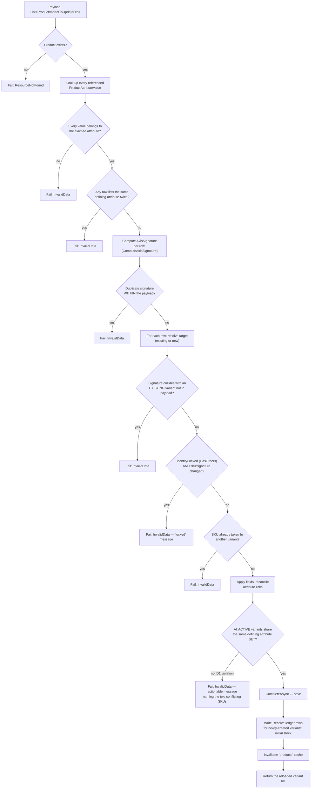
```mermaid
flowchart TD
    A["Payload: List&lt;ProductVariantToUpdateDto&gt;"] --> B{"Product exists?"}
    B -->|no| FAIL1["Fail: ResourceNotFound"]
    B -->|yes| C["Look up every referenced\nProductAttributeValue"]
    C --> D{"Every value belongs to\nthe claimed attribute?"}
    D -->|no| FAIL2["Fail: InvalidData"]
    D -->|yes| E{"Any row lists the same\ndefining attribute twice?"}
    E -->|yes| FAIL3["Fail: InvalidData"]
    E -->|no| F["Compute AxisSignature\nper row (ComputeAxisSignature)"]
    F --> G{"Duplicate signature\nWITHIN the payload?"}
    G -->|yes| FAIL4["Fail: InvalidData"]
    G -->|no| H["For each row: resolve target\n(existing or new)"]
    H --> I{"Signature collides with an\nEXISTING variant not in payload?"}
    I -->|yes| FAIL5["Fail: InvalidData"]
    I -->|no| J{"identityLocked (HasOrders)\nAND sku/signature changed?"}
    J -->|yes| FAIL6["Fail: InvalidData — 'locked' message"]
    J -->|no| K{"SKU already taken by\nanother variant?"}
    K -->|yes| FAIL7["Fail: InvalidData"]
    K -->|no| L["Apply fields, reconcile\nattribute links"]
    L --> M{"All ACTIVE variants share\nthe same defining attribute SET?"}
    M -->|no, D1 violation| FAIL8["Fail: InvalidData — actionable message\nnaming the two conflicting SKUs"]
    M -->|yes| N["CompleteAsync — save"]
    N --> O["Write Receive ledger rows\nfor newly-created variants' initial stock"]
    O --> P["Invalidate 'products' cache"]
    P --> Q["Return the reloaded variant list"]
```

**D2 in code — the identity lock:**

```csharp
var identityLocked = target is not null && orderedVariantIds.Contains(target.Id);

string sku;
if (string.IsNullOrWhiteSpace(dto.Sku))
{
    // Blank means "keep" for a locked variant (regenerating would rename its locked SKU).
    sku = identityLocked ? target!.Sku : GenerateSku(productId, dto, valuesById, takenSkus);
}
else
{
    sku = dto.Sku.Trim().ToUpperInvariant();
    if (identityLocked && !string.Equals(sku, target!.Sku, StringComparison.OrdinalIgnoreCase))
    {
        return OperationResult.Failure<...>(ErrorCode.InvalidData,
            $"SKU '{target.Sku}' is locked because this variant appears on orders. Create a new variant " +
            "(and deactivate this one) instead of renaming its SKU.");
    }
}

if (identityLocked && signature != target!.AxisSignature)
{
    return OperationResult.Failure<...>(ErrorCode.InvalidData,
        $"The defining attributes of SKU '{target.Sku}' are locked because this variant appears on orders. " +
        "Create a new variant instead of changing its Color/Size/Pattern.");
}
```

Notice the subtle inversion: for a *fresh* (unordered) variant, a blank SKU means *"auto-generate one for me."* For a *locked* variant, a blank SKU means the opposite — *"leave my existing SKU alone."* The Angular editor never has to know this distinction exists; it just always sends `sku: row.sku?.trim() ? row.sku.trim() : null` and the backend interprets `null` correctly for either case. This exact asymmetry is pinned by two unit tests: `UpsertVariantsAsync_KeepsSku_WhenBlankOnOrderedVariant` and `UpsertVariantsAsync_AcceptsUnchangedSku_OnOrderedVariant` (the latter also proves the comparison is case-insensitive, so re-submitting `"p42-m"` against a stored `"P42-M"` is accepted as unchanged, not as a rename attempt).

**D1 in code — uniform defining sets, with an exemption for retired variants:**

```csharp
private async Task<string?> DescribeDefiningSetMismatchAsync(IReadOnlyList<ProductVariant> variants)
{
    var sets = variants
        .Where(v => v.IsActive)                                   // <-- inactive variants are exempt
        .Select(v => (v.Sku, AttributeIds: v.AttributeValues.Where(l => l.IsDefining)
            .Select(l => l.ProductAttributeId).Distinct().OrderBy(id => id).ToArray()))
        .ToList();
    if (sets.Count <= 1) return null;

    var reference = sets[0];
    var conflict = sets.FirstOrDefault(s => !s.AttributeIds.SequenceEqual(reference.AttributeIds));
    ...
    return $"All active variants must use the same defining attributes. '{reference.Sku}' uses " +
        $"{Describe(reference.AttributeIds, names)} but '{conflict.Sku}' uses {Describe(conflict.AttributeIds, names)}. " +
        "Give every active variant a value for each defining attribute (add an explicit value such as " +
        "'Solid' when one does not apply), or deactivate the mismatched variant.";
}
```

Why does this rule exist at all? Because the storefront's variant selector ([§11.1](#sec-11-1)) demands a value for *every* defining axis of the product before it can resolve a variant — a variant silently missing one axis (say, "Pattern" left unset) could **never be selected by a customer**, and nothing in the old system would have told the admin that. D1's fix, in the roadmap doc's own words, is that *"not applicable" must be an explicit value* (e.g., seed a `Solid` pattern value) rather than a gap — and the rule is only enforced on *active* variants, so retiring an old variant under a since-abandoned axis set never blocks a save.

**`GenerateVariantDraftsAsync`** — the bulk "generate-then-review" endpoint — deserves one more look, because its cartesian-product expansion is a nice, small piece of functional-style C#:

```csharp
IEnumerable<List<(int AttributeId, int ValueId)>> combos = new List<List<(int, int)>> { new() };
foreach (var axis in axes.OrderBy(a => a.AttributeId))
{
    combos = combos.SelectMany(prefix => axis.ValueIds.Select(valueId =>
        new List<(int, int)>(prefix) { (axis.AttributeId, valueId) }));
}
```

Starting from a single empty combination and folding in one axis at a time via `SelectMany` is the textbook way to build a cartesian product lazily in LINQ — two defining axes with 3 and 6 values each become 18 combinations, computed without ever writing a nested loop. Each combination is then checked against `existingSignatures` (already-saved variants *and* combinations produced earlier in the very same generation call) so **re-running the generator is idempotent** — adding one new size and regenerating only proposes that one new size's combinations, never duplicates. Nothing from this method is ever saved directly; it returns `List<ProductVariantToUpdateDto>` drafts that the admin edits and only persists by calling the *normal* `UpsertVariantsAsync` (the PUT endpoint) — meaning the generator has **zero side effects** and needs no rollback logic of its own.

**`DeleteVariantAsync`** enforces two more small but important rules: a product's *last* remaining variant can never be deleted (there must always be something to sell), and a variant that `wasOrdered` is refused with a message steering the admin toward deactivation instead — the delete-side twin of D2's edit-side lock.

<a id="sec-5-3"></a>
### 5.3 `InventoryService` — stock as a guarded ledger, not a mutable number

Read `InventoryService.cs`'s five `protected virtual` methods once and you understand the entire stock-safety model of this shop: `ApplyMovementAsync`, `ApplyReserveAsync`, `ApplyReleaseAsync`, `ApplyCommitAsync`, `ApplyReservedReleaseAsync`. Every one of them follows the *exact same shape*:

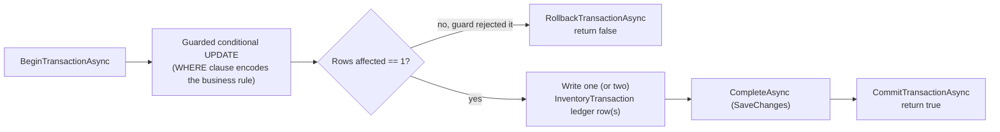
```mermaid
flowchart LR
    A["BeginTransactionAsync"] --> B["Guarded conditional UPDATE\n(WHERE clause encodes the business rule)"]
    B --> C{"Rows affected == 1?"}
    C -->|no, guard rejected it| D["RollbackTransactionAsync\nreturn false"]
    C -->|yes| E["Write one (or two)\nInventoryTransaction ledger row(s)"]
    E --> F["CompleteAsync (SaveChanges)"]
    F --> G["CommitTransactionAsync\nreturn true"]
```

Take the plainest one, `ApplyMovementAsync` (used by `AdjustAsync` and the unreserved fallback in `DeductForOrderAsync`):

```csharp
var guarded = delta >= 0
    ? _unitOfWork.Repository<InventoryItem>().GetByCriteria(i => i.ProductVariantId == variantId)
    : _unitOfWork.Repository<InventoryItem>().GetByCriteria(i =>
        i.ProductVariantId == variantId && i.QuantityOnHand + delta >= i.QuantityReserved);

var affected = await guarded.ExecuteUpdateAsync(s => s
    .SetProperty(i => i.QuantityOnHand, i => i.QuantityOnHand + delta)
    .SetProperty(i => i.ModifiedDate, _ => DateTimeOffset.UtcNow));

if (affected != 1) { await _unitOfWork.RollbackTransactionAsync(); return false; }
```

Here is the key insight, and it is genuinely worth internalizing because it is the single technique that makes the whole ledger race-free: **the availability check and the update are the same SQL statement.** There is no "read the current quantity, check it in C#, then write" window at all. `ExecuteUpdateAsync` compiles to one `UPDATE ... SET ... WHERE ...` statement, and the database itself guarantees only one concurrent request can win that `WHERE` clause for the last unit of stock.

> **Why does this matter?** Picture the naive alternative: read `QuantityOnHand` into a C# variable, check `if (quantity >= requested)`, then write the new value back. Between the *read* and the *write* there is a window — call it a few milliseconds — during which another request can run the exact same steps. Two customers can both read "1 unit left," both pass the check, and both write a version of "0 units left." The shop just oversold. Folding the check into the `WHERE` clause removes that window entirely: the database itself decides, atomically, whether the row still qualifies. This is exactly what the Product Variant roadmap doc means by *"race-free under plain READ COMMITTED — no serializable transactions, no lock hints, no read-modify-write window."*

The other four guarded methods apply the same trick to different `WHERE` clauses:

| Method | Guard clause (paraphrased) | Used by |
|---|---|---|
| `ApplyReserveAsync` | `QuantityOnHand − QuantityReserved ≥ quantity` | `ReserveForIntentAsync` — placing a checkout hold. |
| `ApplyReleaseAsync` | `QuantityReserved ≥ hold.Quantity` | Freeing an `Active` hold (released, expired, or a partial-commit remainder). |
| `ApplyCommitAsync` | `QuantityOnHand ≥ sold AND QuantityReserved ≥ reservedTake` | `DeductForOrderAsync` — converting a hold into a sale; shrinks **both** counters in one statement. |
| `ApplyReservedReleaseAsync` | `QuantityReserved ≥ quantity` | Freeing the unconsumed remainder of a hold larger than what was actually ordered. |

**`ReserveForIntentAsync` — all-or-nothing, with re-entry:**

```csharp
public virtual async Task<OperationResult> ReserveForIntentAsync(
    string paymentIntentId, IReadOnlyList<(int VariantId, int Quantity, string Sku)> lines, TimeSpan timeToLive)
{
    await ReleaseIntentReservationsAsync(paymentIntentId);   // re-entry: old holds go first

    var expiresAt = DateTimeOffset.UtcNow.Add(timeToLive);
    foreach (var line in lines)
    {
        var held = await ApplyReserveAsync(line.VariantId, line.Quantity, paymentIntentId, expiresAt);
        if (!held)
        {
            await ReleaseIntentReservationsAsync(paymentIntentId);   // all-or-nothing rollback
            return OperationResult.Failure(ErrorCode.InvalidData,
                $"Not enough stock of '{line.Sku}' to hold your order. Please update your basket.");
        }
    }
    return OperationResult.Success();
}
```

Two customer-facing behaviors fall directly out of these six lines: (1) every time a customer edits their basket during checkout, the *entire* previous set of holds for that Stripe payment intent is released and a fresh set is placed — so an abandoned edit never leaves phantom partial holds; and (2) if line 3 of 5 can't be held, lines 1 and 2 (already reserved earlier in the same loop) are released again — a checkout either holds *everything* it needs or holds *nothing*, never a partial basket's worth of stock.

**`DeductForOrderAsync` — the webhook path, and why it can never fail the payment:**

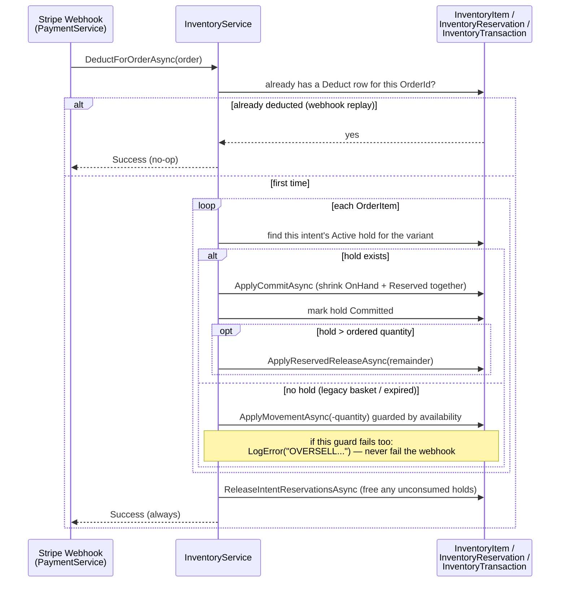
```mermaid
sequenceDiagram
    participant Webhook as Stripe Webhook<br/>(PaymentService)
    participant Inv as InventoryService
    participant DB as InventoryItem / <br/>InventoryReservation / <br/>InventoryTransaction

    Webhook->>Inv: DeductForOrderAsync(order)
    Inv->>DB: already has a Deduct row for this OrderId?
    alt already deducted (webhook replay)
        DB-->>Inv: yes
        Inv-->>Webhook: Success (no-op)
    else first time
        loop each OrderItem
            Inv->>DB: find this intent's Active hold for the variant
            alt hold exists
                Inv->>DB: ApplyCommitAsync (shrink OnHand + Reserved together)
                Inv->>DB: mark hold Committed
                opt hold > ordered quantity
                    Inv->>DB: ApplyReservedReleaseAsync(remainder)
                end
            else no hold (legacy basket / expired)
                Inv->>DB: ApplyMovementAsync(-quantity) guarded by availability
                Note over Inv,DB: if this guard fails too:<br/>LogError("OVERSELL...") — never fail the webhook
            end
        end
        Inv->>DB: ReleaseIntentReservationsAsync (free any unconsumed holds)
        Inv-->>Webhook: Success (always)
    end
```

The doc-comment on `IInventoryService.DeductForOrderAsync` and the code's own catch block both make the same point twice, deliberately: **a paid order is a promise the shop already made to the customer's bank. Nothing about inventory bookkeeping is allowed to undo that promise.** If every guard fails — the rare true oversell, where a checkout's hold expired in the exact window between reservation and payment confirmation — the code logs `_logger.LogError("OVERSELL: paid order {OrderId}...")` and moves on. That log line is the shop's signal to a human, not an automatic rollback; the alternative (failing the webhook) would leave Stripe retrying forever against an order that will never successfully deduct, which is strictly worse.

**The recurring sweep** — abandoned checkouts must not lock stock forever. `Program.cs` registers a Hangfire recurring job that calls exactly the interface method you'd expect:

```csharp
// LiliShop.API/Program.cs
RecurringJob.AddOrUpdate<IInventoryService>(
    "release-expired-stock-reservations",
    service => service.ReleaseExpiredReservationsAsync(),
    "*/5 * * * *");   // every 5 minutes
```

`ReleaseExpiredReservationsAsync` scans `InventoryReservations` where `Status == Active AND ExpiresAt < now`, and calls `ApplyReleaseAsync(hold, InventoryReservationStatus.Expired)` for each — the exact same guarded release path a payment failure uses, just triggered by a clock instead of a webhook.

### 5.4 `BusinessTranslationService` — a preview

`ProductVariantService` and `ProductAttributeService` both depend on `IBusinessTranslationService` for exactly two reads — `GetProductAttributeNamesAsync()` and `GetProductAttributeValueNamesAsync()` — used to swap base-culture names for the current request's culture just before returning data to a client (`ApplyLocalizedNamesAsync` in both services). The full mechanics of *how* that lookup stays fast (a `HybridCache`-backed map, one query per culture rather than per row) is covered in depth in [Chapter 12](#chapter-12), alongside the write-side (`UpsertProductAttributeTranslationsAsync`) that the admin editor calls.

Variants and stock are only half of this feature. The other half — turning a paid order into a legally defensible document — is a self-contained engine of its own, and it gets a full chapter next.

<a id="chapter-6"></a>
## Chapter 6 — The Invoicing Engine, End to End

> **A note on sources, in the interest of never guessing.** This chapter is built from two kinds of evidence: the actual source code (`InvoiceService.cs`, `QuestPdfInvoiceRenderer.cs`, `InvoiceEmailService.cs`, `Invoice.html`, `InvoicesController.cs`, the frontend `invoice.service.ts` and its components) — all read directly and quoted below — and the project's own `M7_INVOICE_ARCHITECTURE_ROADMAP.md` design document.
>
> Those two sources disagree on one point: the roadmap doc's own status banner marks milestones **M7-B (retrieval API), M7-C (PDF), and M7-D (email)** as *"not started."* But the actual code tells a different story. `InvoicesController` (admin PDF download), `InvoiceService.GetInvoicePdfForOrderForCurrentUserAsync`/`GetInvoicePdfForAdminAsync`, `QuestPdfInvoiceRenderer`, `InvoiceEmailService`, the Angular `InvoiceService`/`InvoicesComponent`/`InvoiceDetailComponent`/`OrderDetailedComponent`, and the dedicated tests `InvoiceEmailServiceTests`/`QuestPdfInvoiceRendererTests` **all exist, are complete, and are exercised by passing tests.**
>
> This guide describes what the code actually does. The roadmap document's status banner appears to simply predate that later work having landed. The one part of the roadmap's "not built" list that *is* still accurate, confirmed by its own dedicated and explicitly-labeled design note, is **M7-E: VAT and credit notes** — covered honestly as unbuilt in [§6.7](#sec-6-7).

### 6.1 Recap: what's already covered

`Invoice`, `InvoiceLine`, and `InvoiceNumberSequence` were introduced in [§3.5](#sec-3-5); their table schemas in [§2.2](#sec-2-2); the `IInvoiceService`/`IInvoiceDocumentRenderer`/`IInvoiceEmailService` contracts and the `InvoiceToReturnDto`/`InvoiceSummaryDto`/`InvoicePdfDto` shapes in [§4.3](#sec-4-3)–[§4.4](#sec-4-4). This chapter is about the one class that ties all of that together — `InvoiceService` — plus its two collaborators, the PDF renderer and the email service.

<a id="sec-6-2"></a>
### 6.2 The seller's identity lives in configuration, not the database

`SellerProfileOptions` (`Main/LiliShop.Infrastructure/Configuration/SellerProfileOptions.cs`) is bound from an `appsettings.json` `"SellerProfile"` section — there is deliberately **no** `Seller` database table and **no** admin UI to edit it:

```csharp
public class SellerProfileOptions
{
    public const string SectionName = "SellerProfile";
    public string LegalName { get; set; } = "LiliShop";
    public string AddressLine { get; set; } = string.Empty;
    public string? VatId { get; set; }
    public string? Contact { get; set; }
    public string Currency { get; set; } = "eur";
    public string InvoiceNumberPrefix { get; set; } = "LILI";
    public string HomeCountry { get; set; } = "DE";
    public string InvoiceCulture { get; set; } = "en";
    public string? TaxNote { get; set; }
}
```

The doc-comment explains the trade-off plainly: the seller's legal identity "changes rarely," so a full entity + admin CRUD screen "warrants... [nothing]" — a configuration value is snapshotted onto each invoice at issue time (`SellerLegalName`, `SellerAddressLine`, etc. on the `Invoice` entity), so **even if this configuration changes tomorrow, every invoice already issued still shows the seller identity that was true when it was minted.** This is worth pausing on: configuration-as-source-of-truth is fine *precisely because* the invoice never reads it live — it reads it once, at mint time, and freezes it.

<a id="sec-6-3"></a>
### 6.3 Gapless numbering under concurrency

Here is the exact code that makes "LILI-2026-000123" a legally defensible, gap-free number, even if two orders are paid in the same millisecond:

```csharp
protected virtual async Task<int> AllocateNextSequenceValueAsync(string seriesKey)
{
    var affected = await _unitOfWork.Repository<InvoiceNumberSequence>()
        .GetByCriteria(s => s.SeriesKey == seriesKey)
        .ExecuteUpdateAsync(s => s.SetProperty(x => x.LastValue, x => x.LastValue + 1));

    if (affected == 0)
    {
        // Lazy-create the series row (normally pre-seeded; hit only at a year boundary).
        await _unitOfWork.Repository<InvoiceNumberSequence>()
            .AddAsync(new InvoiceNumberSequence { SeriesKey = seriesKey, LastValue = 0 });
        await _unitOfWork.CompleteAsync();
        await _unitOfWork.Repository<InvoiceNumberSequence>()
            .GetByCriteria(s => s.SeriesKey == seriesKey)
            .ExecuteUpdateAsync(s => s.SetProperty(x => x.LastValue, x => x.LastValue + 1));
    }

    return await _unitOfWork.Repository<InvoiceNumberSequence>()
        .GetByCriteria(s => s.SeriesKey == seriesKey)
        .Select(s => s.LastValue)
        .FirstAsync();
}
```

And the caller, `CreateInvoiceForOrderAsync`, wraps this in a transaction *together with* the invoice insert:

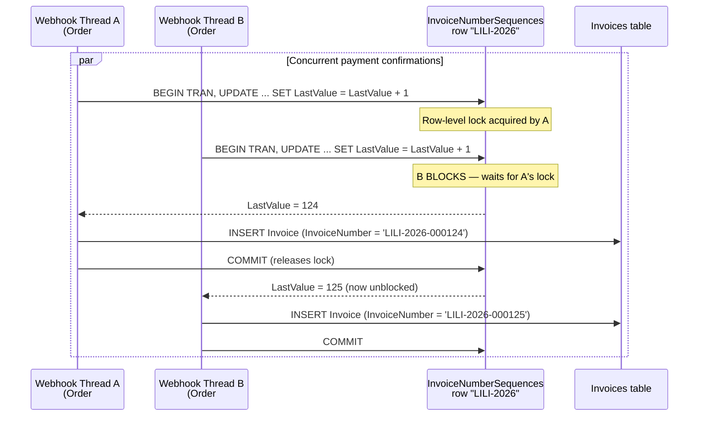
```mermaid
sequenceDiagram
    participant W1 as Webhook Thread A<br/>(Order #900 paid)
    participant W2 as Webhook Thread B<br/>(Order #901 paid, same instant)
    participant Seq as InvoiceNumberSequences<br/>row "LILI-2026"
    participant Inv as Invoices table

    par Concurrent payment confirmations
        W1->>Seq: BEGIN TRAN, UPDATE ... SET LastValue = LastValue + 1
        Note over Seq: Row-level lock acquired by A
        W2->>Seq: BEGIN TRAN, UPDATE ... SET LastValue = LastValue + 1
        Note over Seq: B BLOCKS — waits for A's lock
        Seq-->>W1: LastValue = 124
        W1->>Inv: INSERT Invoice (InvoiceNumber = 'LILI-2026-000124')
        W1->>Seq: COMMIT (releases lock)
        Seq-->>W2: LastValue = 125 (now unblocked)
        W2->>Inv: INSERT Invoice (InvoiceNumber = 'LILI-2026-000125')
        W2->>Seq: COMMIT
    end
```

The comment at the top of `InvoiceService.cs` names the mechanism precisely: *"the counter increment holds an exclusive row lock until commit, so concurrent minters serialize and a rollback returns the number — the series can never gap."* If thread A's transaction were to fail *after* incrementing the counter but *before* committing the invoice insert, the whole transaction rolls back — counter increment included — so number 124 becomes available again rather than being silently burned. That's the "rollback returns the number" half of the guarantee.

**Idempotency is the first check, before any of this even runs:**

```csharp
var existing = await _unitOfWork.Repository<Invoice>()
    .GetByCriteria(i => i.OrderId == order.Id)
    .FirstOrDefaultAsync();
if (existing is not null)
{
    return OperationResult.Success(existing);   // webhook replay — no new number consumed
}
```

And even that isn't the *only* backstop — the unique index on `Invoices.OrderId` ([§2.2](#sec-2-2)) means that if two threads somehow both pass this check (a genuine race, not just a replay), one insert wins and the other's transaction fails on the unique constraint; the `catch` block re-checks for the now-existing invoice and returns it as a success, calling this "a benign race, not a failure." Three independent layers — an early idempotency check, a transactional row lock, and a unique database constraint — all protect the same single invariant: **exactly one invoice per order, ever.**

<a id="sec-6-4"></a>
### 6.4 Building the snapshot — `BuildInvoice`

```csharp
private Invoice BuildInvoice(Order order, string seriesKey, int sequenceValue, DateTimeOffset issueDate)
{
    var currency = string.IsNullOrWhiteSpace(order.Currency) ? _seller.Currency : order.Currency;
    var shippingGross = order.DeliveryMethod?.Price ?? 0m;
    var address = order.ShipToAddress;

    var invoice = new Invoice
    {
        OrderId = order.Id,
        InvoiceNumber = FormatInvoiceNumber(seriesKey, sequenceValue),   // "LILI-2026-000124"
        ...
        PricesIncludeTax = true,   // EU B2C: prices are gross-inclusive (tax decomposed, never added)
        SellerLegalName = _seller.LegalName,
        ...
        BillingCountry = _seller.HomeCountry,  // TODO(Address.Country): Address has no Country column yet
        ShippingGross = shippingGross,
        ShippingNet = shippingGross,     // net == gross until VAT is enabled
        ShippingTax = 0m,
        TotalGross = order.Subtotal + shippingGross,
        TotalNet = order.Subtotal + shippingGross,
        TotalTax = 0m,
        TaxBreakdownJson = "[]",
        TaxNote = _seller.TaxNote,
    };

    var position = 1;
    foreach (var item in order.OrderItems)
    {
        var lineGross = item.Price * item.Quantity;
        invoice.Lines.Add(new InvoiceLine
        {
            Position = position++,
            ProductName = item.ItemOrdered?.ProductName ?? string.Empty,
            Sku = item.Sku,
            VariantDescription = item.VariantDescription,     // <-- copied straight from OrderItem
            AttributesJson = item.AttributesJson,              //     (frozen by VariantSnapshotBuilder
            ProductVariantId = item.ProductVariantId,          //      back at order-creation time)
            Quantity = item.Quantity,
            UnitPriceGross = item.Price,
            LineTotalGross = lineGross,
            LineNetAmount = lineGross,
            LineTaxAmount = 0m,
            TaxRate = 0m,
        });
    }
    return invoice;
}
```

Notice what's *not* here: no join back to `ProductVariant`, no re-computation of the variant description via `VariantSnapshotBuilder`. The invoice line simply **copies whatever the order item already froze** — proving the design story from [§3.5](#sec-3-5) in the actual implementation. Notice also `ShippingGross = order.DeliveryMethod?.Price ?? 0m`, computed from the order's own loaded `DeliveryMethod` navigation rather than calling `order.GetTotal()` (which the code comment explains would risk a null-reference if `DeliveryMethod` isn't loaded on some call path) — and that this is a genuine snapshot: if an admin edits a delivery method's price a week later, every invoice issued before that edit still shows the shipping price the customer actually paid.

Finally — the `PricesIncludeTax = true` / `TotalTax = 0m` / `TaxBreakdownJson = "[]"` triplet is the concrete embodiment of the roadmap's single most important VAT-readiness fact: *EU B2C prices are already gross (tax-inclusive)*, so turning on VAT later is a pure decomposition of numbers that already exist — `net = gross / (1 + rate)`, `tax = gross − net` — never a change to what Stripe actually charges the customer.

<a id="sec-6-5"></a>
### 6.5 Rendering — `QuestPdfInvoiceRenderer`

`IInvoiceDocumentRenderer` is a one-method interface — `byte[] Render(Invoice, InvoiceLabels, cultureCode)` — implemented by `QuestPdfInvoiceRenderer` using the [QuestPDF](https://www.questpdf.com/) library (Community license, declared right in the static constructor):

```csharp
static QuestPdfInvoiceRenderer()
{
    QuestPDF.Settings.License = LicenseType.Community;
    // The shop supports non-Latin cultures (fa/ar/zh/hi/ru). With the default (Latin) font, glyphs
    // for those scripts are missing; keep rendering resilient (boxes instead of a thrown exception)
    // rather than crashing.
    QuestPDF.Settings.CheckIfAllTextGlyphsAreAvailable = false;
}
```

The renderer builds an A4 page with a header (seller block on the left, invoice number/date/order-number block on the right), a "Bill To" block, a line-items table, and a totals block — all through QuestPDF's fluent, declarative layout API (`container.Row(row => { row.RelativeItem().Column(...); })`). It is a genuinely **pure function**: given the same `Invoice`, `InvoiceLabels`, and culture code, it always produces byte-identical PDF output — which is exactly what `QuestPdfInvoiceRendererTests` verifies, including a themed test across three real cultures (`en`, `de`, and the right-to-left `fa`) asserting the output is non-empty and starts with the literal PDF magic bytes `"%PDF"`, plus a fallback test proving an unrecognized culture string degrades to English instead of throwing.

`InvoiceLabels` (from [§4.2](#sec-4-2)) is how the renderer stays "culture-agnostic" despite producing localized text — `InvoiceService.BuildLabels` resolves every label string once, through the shop's normal `IStringLocalizer<SharedResource>` localization catalog, *before* handing them to the renderer:

```csharp
private InvoiceLabels BuildLabels(string cultureCode)
{
    using (new CultureScope(cultureCode))
    {
        return new InvoiceLabels(
            Title: _localizer["Invoice.Pdf.Title"],
            Number: _localizer["Invoice.Pdf.Number"],
            ...
            VatId: _localizer["Invoice.Pdf.VatId"]);
    }
}
```

`CultureScope` is a small `IDisposable` that temporarily swaps `CultureInfo.CurrentUICulture` for the duration of the lookup — this keeps the renderer itself free of any dependency on ASP.NET's request culture machinery; by the time `Render()` runs, every string it needs is already a plain, resolved value.

Both PDF endpoints — the customer's own-order download and the admin download — funnel through the same private helper, `RenderPdf(invoice)`, so **the exact same bytes** are what a customer downloads, what an admin downloads, and what gets emailed:

```csharp
public virtual async Task<OperationResult<InvoicePdfDto>> GetInvoicePdfForOrderForCurrentUserAsync(int orderId, ClaimsPrincipal user)
{
    ...
    var invoice = await LoadInvoiceWithLinesAsync(i => i.OrderId == orderId);
    if (invoice is null || !string.Equals(invoice.BuyerEmail, email, StringComparison.OrdinalIgnoreCase))
    {
        return OperationResult.NoData<InvoicePdfDto>();   // never 404 — never confirms/denies existence
    }
    return RenderPdf(invoice);
}
```

That `NoData` (not `Failure`, not a 404) for "wrong owner" is a deliberate anti-enumeration choice, repeated identically for the JSON invoice-detail endpoint — a curious customer trying order id `901` instead of their own `900` learns nothing about whether `901` exists or who it belongs to.

<a id="sec-6-6"></a>
### 6.6 Delivery — `InvoiceEmailService`, Hangfire, and `Invoice.html`

`InvoiceEmailService.SendInvoiceEmailAsync(invoiceId)` is enqueued as a Hangfire background job, and *only* from inside `InvoiceService.CreateInvoiceForOrderAsync`, immediately after a **newly minted** invoice commits:

```csharp
private void EnqueueInvoiceEmail(Invoice invoice)
{
    try
    {
        _backgroundJobClient.Enqueue<IInvoiceEmailService>(x => x.SendInvoiceEmailAsync(invoice.Id));
    }
    catch (Exception ex)
    {
        _logger.LogError(ex, "Failed to enqueue delivery email for invoice {InvoiceNumber}.", invoice.InvoiceNumber);
    }
}
```

Two ordering guarantees matter here and are easy to miss on a first read: (1) this line is reached **only** after a brand-new invoice commits — both the "already exists" idempotent early-return and the "lost the race, found the other transaction's invoice" branch return *before* reaching this call — so a webhook replay or the `reconcile-missing-invoices` sweep finding an *existing* invoice never re-sends the email; and (2) the enqueue happens **outside** the invoice's own database transaction and is wrapped in its own `try/catch` that only logs — a Hangfire connectivity hiccup can never cause the invoice-minting transaction to roll back, because the invoice, at that point, already legally exists and is downloadable regardless of whether the email goes out.

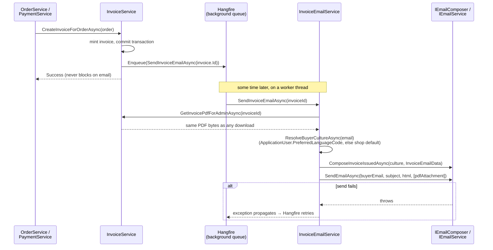
```mermaid
sequenceDiagram
    participant Order as OrderService /<br/>PaymentService
    participant InvSvc as InvoiceService
    participant HF as Hangfire<br/>(background queue)
    participant Job as InvoiceEmailService
    participant Mail as IEmailComposer /<br/>IEmailService

    Order->>InvSvc: CreateInvoiceForOrderAsync(order)
    InvSvc->>InvSvc: mint invoice, commit transaction
    InvSvc->>HF: Enqueue(SendInvoiceEmailAsync(invoice.Id))
    InvSvc-->>Order: Success (never blocks on email)
    Note over HF,Job: some time later, on a worker thread
    HF->>Job: SendInvoiceEmailAsync(invoiceId)
    Job->>InvSvc: GetInvoicePdfForAdminAsync(invoiceId)
    InvSvc-->>Job: same PDF bytes as any download
    Job->>Job: ResolveBuyerCultureAsync(email)<br/>(ApplicationUser.PreferredLanguageCode, else shop default)
    Job->>Mail: ComposeInvoiceIssuedAsync(culture, InvoiceEmailData)
    Job->>Mail: SendEmailAsync(buyerEmail, subject, html, [pdfAttachment])
    alt send fails
        Mail-->>Job: throws
        Job-->>HF: exception propagates → Hangfire retries
    end
```

`SendInvoiceEmailAsync` itself is short enough to read as a whole:

```csharp
public async Task SendInvoiceEmailAsync(int invoiceId)
{
    var invoice = await _unitOfWork.Repository<Invoice>().GetByCriteria(i => i.Id == invoiceId).FirstOrDefaultAsync();
    if (invoice is null)
    {
        _logger.LogWarning("SendInvoiceEmailAsync: invoice {InvoiceId} not found; skipping delivery.", invoiceId);
        return;   // not an error — nothing to deliver
    }

    var pdfResult = await _invoiceService.GetInvoicePdfForAdminAsync(invoiceId);
    if (pdfResult.Status != OperationResultStatus.Success || pdfResult.Data is null)
    {
        // Throw so Hangfire retries: a render failure is treated as transient, not swallowed.
        throw new InvalidOperationException($"Failed to render PDF for invoice {invoice.InvoiceNumber} (id {invoiceId}).");
    }

    var culture = await ResolveBuyerCultureAsync(invoice.BuyerEmail);
    var content = await _emailComposer.ComposeInvoiceIssuedAsync(culture, new InvoiceEmailData { ... });
    var attachment = new EmailAttachment(pdfResult.Data.FileName, pdfResult.Data.Content, pdfResult.Data.ContentType);

    await _emailService.SendEmailAsync(invoice.BuyerEmail, content.Subject, content.HtmlBody, new[] { attachment });
}
```

Two failure-handling choices are worth naming explicitly: a *missing* invoice is treated as a benign no-op (logged, returned, no exception) — it can legitimately happen if, say, an invoice were ever removed in some future admin tooling — while a *PDF render failure* deliberately **throws**, specifically so Hangfire's own retry policy takes over instead of the failure being silently swallowed. `SendInvoiceEmailAsync_Throws_WhenPdfRenderFails_SoHangfireRetries` is the unit test that pins exactly this distinction.

`ResolveBuyerCultureAsync` looks up the buyer's stored account preference first, falling back to the shop's `InvoiceCulture` configuration default for guest checkouts or accounts with no stored language:

```csharp
private async Task<string?> ResolveBuyerCultureAsync(string email)
{
    try
    {
        var user = await _userManager.FindByEmailAsync(email);
        var code = user?.PreferredLanguageCode;
        return string.IsNullOrWhiteSpace(code) ? _seller.InvoiceCulture : code;
    }
    catch (Exception ex)
    {
        _logger.LogWarning(ex, "Could not resolve preferred language for {Email}; using the shop default.", email);
        return _seller.InvoiceCulture;
    }
}
```

`Invoice.html` (`Main/LiliShop.Infrastructure/Resources/EmailTemplates/Invoice.html`) is a small, token-based HTML fragment — its own comment explains it's *"injected into `EmailLayout.html`"* (the shop's shared email chrome, pre-existing and not part of this feature) and that the invoice PDF itself travels as an attachment, never embedded inline. The fragment renders a title, greeting/intro paragraphs, and a bordered summary table (Invoice Number / Issue Date / Total), followed by an optional call-to-action button block (`{{ButtonBlock}}`, a "view your order" link built from `IEmailLinkBuilder.OrderUrl(invoice.OrderId)`) and a sign-off. Every token (`{{Title}}`, `{{Greeting}}`, `{{NumberLabel}}`, …) is filled in by `IEmailComposer.ComposeInvoiceIssuedAsync`, which is how the whole email ends up localized in the buyer's own language, not just the PDF.

<a id="sec-6-7"></a>
### 6.7 What's *not* built: VAT and credit notes (M7-E)

`M7E_VAT_AND_CREDIT_NOTES_DESIGN.md` opens with the sentence that must be repeated here, verbatim, so nothing in this guide is mistaken for a claim that this exists: **"Design note only. No code ships in M7."** Every field this guide has already described as "zeroed until VAT is enabled" — `PricesIncludeTax = true`, `TotalTax = 0m`, `TaxBreakdownJson = "[]"`, `ShippingTaxRate = 0m` — really is always zero/empty in the current codebase, on every invoice issued today. There is no `ITaxCalculator` interface, no `ConfiguredRateTaxCalculator`, no `CreditNote` document type, no `DocumentType` discriminator column, and no admin "issue a credit note" endpoint anywhere in the source tree at the time of this writing.

What the design note *does* establish — worth knowing because it explains **why the schema already looks VAT-shaped** — is a plan that would let VAT switch on as a computation change, not a migration:

- A single `ITaxCalculator` seam, with a `ZeroTaxCalculator` (today's behavior, kept as the permanent default) and a future `ConfiguredRateTaxCalculator`, swapped in only when `SellerProfile.VatEnabled` is explicitly turned on.
- Tax math derived so a line's net and tax *always* sum exactly back to its gross (`lineTax = lineGross − round(lineGross / (1+rate), 2)`), avoiding any rounding-drift between `TotalNet + TotalTax` and `TotalGross`.
- Credit notes proposed as the *same* `Invoice` entity with an added `DocumentType` discriminator and a non-FK `CorrectsInvoiceId`/`CorrectsInvoiceNumber` snapshot pair — reusing the entire numbering/rendering/email pipeline rather than duplicating it — plus their own separate numbering series (e.g. `"LILI-CN-2026"`) so the two document types never interleave numbers.
- Historical invoices are explicitly guaranteed, by design, to **never** be touched, recomputed, or re-issued once VAT is switched on — "VAT applies only to invoices issued after the switch."

None of this is code today. It's included in this guide only because a reader of the *real* `Invoice` entity will inevitably ask "why are there tax columns that are always zero?" — and the honest answer is: *this is prepared ground for a feature that has been designed but deliberately not built yet.*

That covers every service in the backend. The last backend layer is the thinnest one by far — the controllers that expose these services over HTTP.

---

<a id="chapter-7"></a>
## Chapter 7 — The API Layer: Controllers

All four controllers below inherit `BaseApiController`, which fixes the route convention (`[Route("api/[controller]")]`) and funnels every `OperationResult`/`OperationResult<T>` through one shared `HandleOperationResult` helper — so a service-layer `ErrorCode.ResourceNotFound` always becomes the same HTTP status and JSON error shape, no matter which controller produced it. None of the four controllers below contain business logic themselves; each method is a thin translation from an HTTP verb/route to exactly one service call, which is precisely the point of the Application-layer interfaces from [§4.3](#sec-4-3) — the controllers can be read, and trusted, in about a minute each.

<a id="sec-7-1"></a>
### 7.1 `InvoicesController` — admin, read-only

```csharp
public class InvoicesController : BaseApiController
{
    private readonly IInvoiceService _invoiceService;
    ...
}
```

Its own doc-comment states the design in one line: *"Admin, read-only access to issued invoices. Invoices are immutable legal documents; there are no create/update/delete endpoints — issuance happens automatically on payment."*

| Route | Verb | Auth policy | Calls |
|---|---|---|---|
| `api/invoices` | GET | `RequireAtLeastAdminPanelViewerRole` | `GetInvoicesForAdminAsync(pageIndex, pageSize, search)` |
| `api/invoices/{id}` | GET | `RequireAtLeastAdminPanelViewerRole` | `GetInvoiceByIdForAdminAsync(id)` |
| `api/invoices/{id}/pdf` | GET | `RequireAtLeastAdminPanelViewerRole` | `GetInvoicePdfForAdminAsync(id)` → streamed via `File(bytes, contentType, fileName)`, or `204 NoContent` on `NoData` |

Notice there is **no customer-facing route on this controller at all** — a customer's own invoice is served from the *Orders* controller instead (`api/orders/{id}/invoice`, `api/orders/{id}/invoice/pdf`, a method added to the pre-existing `OrdersController` rather than a new file), which is a deliberate separation: the admin surface and the customer surface never share a route, even though they both ultimately call methods on the same `IInvoiceService`.

### 7.2 `ProductAttributesController` — mixed public/admin

<a id="sec-7-2"></a>

| Route | Verb | Auth policy | Calls |
|---|---|---|---|
| `api/productattributes/attributes` | GET | *(public)* | `GetPaginatedAttributesAsync` |
| `api/productattributes/all` | GET | *(public, `[Cached(Long, "attributes")]`)* | `GetAll(isActive)` |
| `api/productattributes/attribute/{id}` | GET | *(public)* | `GetAttributeByIdAsync` |
| `api/productattributes/create` | POST | `RequireAtLeastAdministratorRole` | `AddOrUpdateAsync` |
| `api/productattributes/update/{id}` | PUT | `RequireAtLeastAdministratorRole` | `UpdateAttributeAsync` |
| `api/productattributes/delete/{id}` | DELETE | `RequireAtLeastAdministratorRole` | `DeleteAttributeAsync` |
| `api/productattributes/{attributeId}/values/{valueId}` | DELETE | `RequireAtLeastAdministratorRole` | `DeleteValueAsync` |

The `[Cached(CacheDurations.Long, "attributes")]` attribute on `GetAllAttributes` is the read-side of the caching story from [§5.1](#sec-5-1) — this is the exact endpoint whose cache gets invalidated the instant `ProductAttributeService` calls `InvalidateCacheByTagsAsync(new[] { "attributes" })` after any create/update/delete, so an admin's edit is visible on the very next `all` request rather than after a TTL. It's also the endpoint the Angular admin variant editor calls on load ([§10.3](#sec-10-3)) to populate its list of available attributes.

<a id="sec-7-3"></a>
### 7.3 `ProductVariantsController` — mixed public/admin

| Route | Verb | Auth policy | Calls |
|---|---|---|---|
| `api/productvariants/product/{productId}` | GET | *(public)* | `GetVariantsByProductAsync` |
| `api/productvariants/product/{productId}` | PUT | `RequireAtLeastAdministratorRole` | `UpsertVariantsAsync` |
| `api/productvariants/product/{productId}/generate` | POST | `RequireAtLeastAdministratorRole` | `GenerateVariantDraftsAsync` |
| `api/productvariants/{id}` | DELETE | `RequireAtLeastAdministratorRole` | `DeleteVariantAsync` |

The `GET` route is public and unauthenticated for a simple reason: this is the exact endpoint the storefront product-details page calls to build the variant selector for every visitor, logged in or not ([§11.1](#sec-11-1)).

### 7.4 `InventoryController` — admin only

This controller existed under a slightly different shape before the variant work described in this guide, but is included here because both of its routes now operate against variant ids and the new ledger:

```csharp
[Authorize(Policy = PolicyType.RequireAtLeastAdministratorRole)]
[HttpPost("variants/{variantId}/adjustments")]
public async Task<ActionResult<InventoryItem>> Adjust(int variantId, [FromBody] InventoryAdjustmentDto adjustment)
{
    var performedBy = User?.Identity?.Name;
    var result = await _inventoryService.AdjustAsync(variantId, adjustment.Delta, adjustment.Reason, performedBy);
    return HandleOperationResult(result);
}
```

| Route | Verb | Auth policy | Calls |
|---|---|---|---|
| `api/inventory/variants/{variantId}/adjustments` | POST | `RequireAtLeastAdministratorRole` | `AdjustAsync(variantId, delta, reason, performedBy)` |
| `api/inventory/variants/{variantId}/transactions` | GET | `RequireAtLeastAdminPanelViewerRole` | `GetTransactionsAsync(variantId, pageIndex, pageSize)` |

Two details worth noticing: `performedBy` is read straight off `User.Identity.Name` — the *server* stamps who made the adjustment onto the ledger row, a client can never spoof this — and the write endpoint requires the stronger `RequireAtLeastAdministratorRole` policy while the read (history) endpoint only requires the weaker `RequireAtLeastAdminPanelViewerRole` — a support-tier admin can *see* the stock history but only a full administrator can *change* stock.

We have now met every class in isolation — entity, DTO, service, controller. The next chapter puts them back together and follows five real requests from click to database and back, so you can see the whole stack move at once instead of one layer at a time.

<a id="chapter-8"></a>
## Chapter 8 — End-to-End Runtime Flows

Chapters 2–7 walked the backend bottom-up, one layer at a time. This chapter walks it the way a real request actually travels — sideways, through every layer in one pass — for the five flows that matter most. Each diagram is built directly from the code already quoted in earlier chapters; nothing here is new logic, only new *sequencing*.

### 8.1 Flow: an admin creates a variant-defining combination

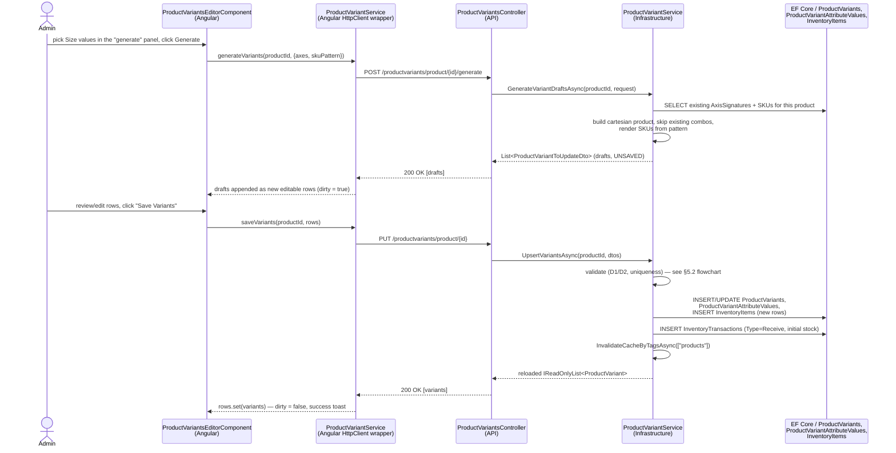
```mermaid
sequenceDiagram
    actor Admin
    participant UI as ProductVariantsEditorComponent<br/>(Angular)
    participant Svc as ProductVariantService<br/>(Angular HttpClient wrapper)
    participant Ctrl as ProductVariantsController<br/>(API)
    participant App as ProductVariantService<br/>(Infrastructure)
    participant EF as EF Core / ProductVariants,<br/>ProductVariantAttributeValues,<br/>InventoryItems

    Admin->>UI: pick Size values in the "generate" panel, click Generate
    UI->>Svc: generateVariants(productId, {axes, skuPattern})
    Svc->>Ctrl: POST /productvariants/product/{id}/generate
    Ctrl->>App: GenerateVariantDraftsAsync(productId, request)
    App->>EF: SELECT existing AxisSignatures + SKUs for this product
    App->>App: build cartesian product, skip existing combos,<br/>render SKUs from pattern
    App-->>Ctrl: List<ProductVariantToUpdateDto> (drafts, UNSAVED)
    Ctrl-->>Svc: 200 OK [drafts]
    Svc-->>UI: drafts appended as new editable rows (dirty = true)
    Admin->>UI: review/edit rows, click "Save Variants"
    UI->>Svc: saveVariants(productId, rows)
    Svc->>Ctrl: PUT /productvariants/product/{id}
    Ctrl->>App: UpsertVariantsAsync(productId, dtos)
    App->>App: validate (D1/D2, uniqueness) — see §5.2 flowchart
    App->>EF: INSERT/UPDATE ProductVariants,<br/>ProductVariantAttributeValues,<br/>INSERT InventoryItems (new rows)
    App->>EF: INSERT InventoryTransactions (Type=Receive, initial stock)
    App->>App: InvalidateCacheByTagsAsync(["products"])
    App-->>Ctrl: reloaded IReadOnlyList<ProductVariant>
    Ctrl-->>Svc: 200 OK [variants]
    Svc-->>UI: rows.set(variants) — dirty = false, success toast
```

### 8.2 Flow: a customer picks a variant and adds it to the basket

<a id="sec-8-2"></a>

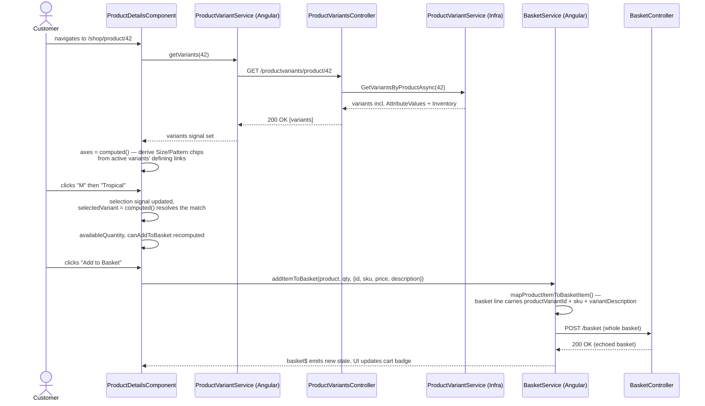
```mermaid
sequenceDiagram
    actor Customer
    participant PD as ProductDetailsComponent
    participant PVSvc as ProductVariantService (Angular)
    participant Ctrl as ProductVariantsController
    participant App as ProductVariantService (Infra)
    participant Basket as BasketService (Angular)
    participant BasketAPI as BasketController

    Customer->>PD: navigates to /shop/product/42
    PD->>PVSvc: getVariants(42)
    PVSvc->>Ctrl: GET /productvariants/product/42
    Ctrl->>App: GetVariantsByProductAsync(42)
    App-->>Ctrl: variants incl. AttributeValues + Inventory
    Ctrl-->>PVSvc: 200 OK [variants]
    PVSvc-->>PD: variants signal set
    PD->>PD: axes = computed() — derive Size/Pattern chips<br/>from active variants' defining links
    Customer->>PD: clicks "M" then "Tropical"
    PD->>PD: selection signal updated,<br/>selectedVariant = computed() resolves the match
    PD->>PD: availableQuantity, canAddToBasket recomputed
    Customer->>PD: clicks "Add to Basket"
    PD->>Basket: addItemToBasket(product, qty, {id, sku, price, description})
    Basket->>Basket: mapProductItemToBasketItem() —<br/>basket line carries productVariantId + sku + variantDescription
    Basket->>BasketAPI: POST /basket (whole basket)
    BasketAPI-->>Basket: 200 OK (echoed basket)
    Basket-->>PD: basket$ emits new state, UI updates cart badge
```

Notice this flow never touches `InventoryService` at all — adding to a basket is not a stock-affecting event in this system; the *only* thing that reserves real stock is initiating checkout (`CreateOrUpdatePaymentIntentAsync`, next flow). This is a deliberate, load-bearing distinction: a customer can add ten different sizes to their basket "just to compare" without ever locking a single unit of stock away from anyone else.

### 8.3 Flow: checkout — basket becomes a held payment intent

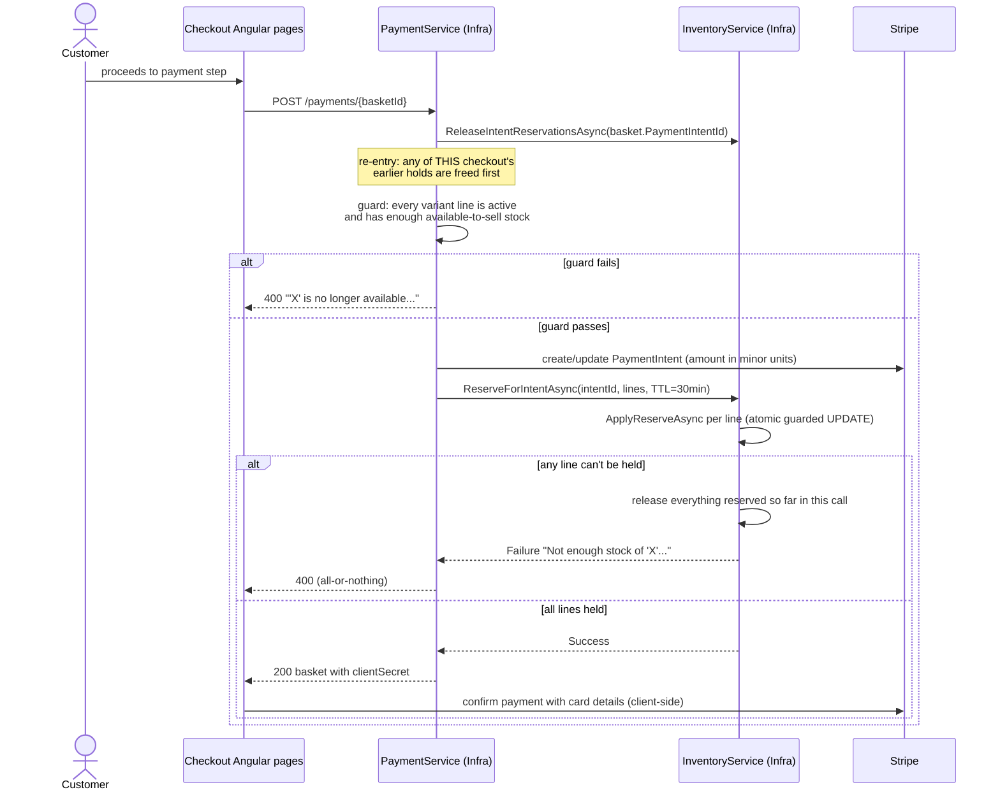
```mermaid
sequenceDiagram
    actor Customer
    participant CO as Checkout Angular pages
    participant PaySvc as PaymentService (Infra)
    participant Inv as InventoryService (Infra)
    participant Stripe

    Customer->>CO: proceeds to payment step
    CO->>PaySvc: POST /payments/{basketId}
    PaySvc->>Inv: ReleaseIntentReservationsAsync(basket.PaymentIntentId)
    Note over PaySvc: re-entry: any of THIS checkout's<br/>earlier holds are freed first
    PaySvc->>PaySvc: guard: every variant line is active<br/>and has enough available-to-sell stock
    alt guard fails
        PaySvc-->>CO: 400 "'X' is no longer available..."
    else guard passes
        PaySvc->>Stripe: create/update PaymentIntent (amount in minor units)
        PaySvc->>Inv: ReserveForIntentAsync(intentId, lines, TTL=30min)
        Inv->>Inv: ApplyReserveAsync per line (atomic guarded UPDATE)
        alt any line can't be held
            Inv->>Inv: release everything reserved so far in this call
            Inv-->>PaySvc: Failure "Not enough stock of 'X'..."
            PaySvc-->>CO: 400 (all-or-nothing)
        else all lines held
            Inv-->>PaySvc: Success
            PaySvc-->>CO: 200 basket with clientSecret
            CO->>Stripe: confirm payment with card details (client-side)
        end
    end
```

The 30-minute TTL (`ReservationTimeToLive` in `PaymentService`) is exactly the window the recurring `release-expired-stock-reservations` Hangfire job ([§5.3](#sec-5-3)) exists to close — if the customer simply abandons the tab here, their held stock returns to the shelf five minutes after the TTL passes, without any other code path needing to know or care.

### 8.4 Flow: payment succeeds — the webhook, in full

This is the flow where every engine in this guide meets at once: inventory deduction, invoice minting, and email delivery, all triggered by one Stripe event.

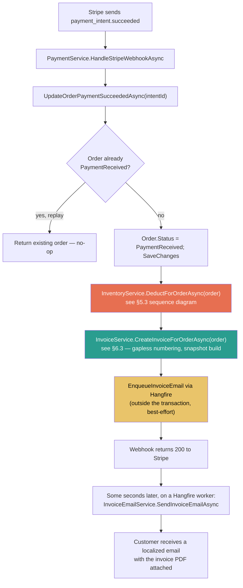
```mermaid
flowchart TD
    A["Stripe sends payment_intent.succeeded"] --> B["PaymentService.HandleStripeWebhookAsync"]
    B --> C["UpdateOrderPaymentSucceededAsync(intentId)"]
    C --> D{"Order already\nPaymentReceived?"}
    D -->|yes, replay| E["Return existing order — no-op"]
    D -->|no| F["Order.Status = PaymentReceived; SaveChanges"]
    F --> G["InventoryService.DeductForOrderAsync(order)\nsee §5.3 sequence diagram"]
    G --> H["InvoiceService.CreateInvoiceForOrderAsync(order)\nsee §6.3 — gapless numbering, snapshot build"]
    H --> I["EnqueueInvoiceEmail via Hangfire\n(outside the transaction, best-effort)"]
    I --> J["Webhook returns 200 to Stripe"]
    J --> K["Some seconds later, on a Hangfire worker:\nInvoiceEmailService.SendInvoiceEmailAsync"]
    K --> L["Customer receives a localized email\nwith the invoice PDF attached"]

    style G fill:#e76f51,color:#fff
    style H fill:#2a9d8f,color:#fff
    style I fill:#e9c46a,color:#000
```

The order of `G` then `H` is not incidental — `OrderService.BuildOrderItemsAsync` already froze each order line's `ProductVariantId`/`Sku`/`VariantDescription`/`AttributesJson` at order-*creation* time (before payment), via `VariantSnapshotBuilder.Build(...)`, so by the time the webhook fires, `InvoiceService.BuildInvoice` ([§6.4](#sec-6-4)) has nothing left to compute — it just copies those already-frozen fields onto each `InvoiceLine`. Stock deduction and invoice minting are two independent operations on the same paid order, not a pipeline where one feeds the other.

<a id="sec-8-5"></a>
### 8.5 Flow: a customer views their order and downloads the invoice

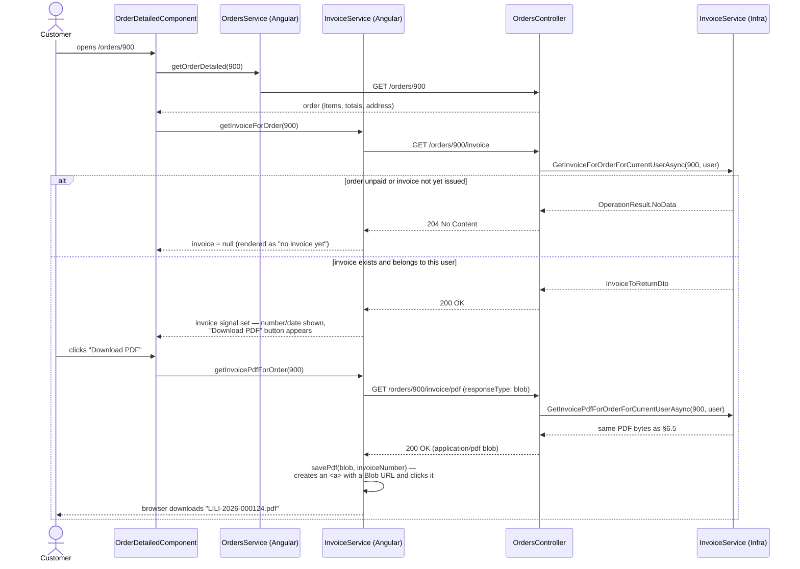
```mermaid
sequenceDiagram
    actor Customer
    participant OD as OrderDetailedComponent
    participant OrdSvc as OrdersService (Angular)
    participant InvSvc as InvoiceService (Angular)
    participant OrdCtrl as OrdersController
    participant InvApp as InvoiceService (Infra)

    Customer->>OD: opens /orders/900
    OD->>OrdSvc: getOrderDetailed(900)
    OrdSvc->>OrdCtrl: GET /orders/900
    OrdCtrl-->>OD: order (items, totals, address)
    OD->>InvSvc: getInvoiceForOrder(900)
    InvSvc->>OrdCtrl: GET /orders/900/invoice
    OrdCtrl->>InvApp: GetInvoiceForOrderForCurrentUserAsync(900, user)
    alt order unpaid or invoice not yet issued
        InvApp-->>OrdCtrl: OperationResult.NoData
        OrdCtrl-->>InvSvc: 204 No Content
        InvSvc-->>OD: invoice = null (rendered as "no invoice yet")
    else invoice exists and belongs to this user
        InvApp-->>OrdCtrl: InvoiceToReturnDto
        OrdCtrl-->>InvSvc: 200 OK
        InvSvc-->>OD: invoice signal set — number/date shown,<br/>"Download PDF" button appears
        Customer->>OD: clicks "Download PDF"
        OD->>InvSvc: getInvoicePdfForOrder(900)
        InvSvc->>OrdCtrl: GET /orders/900/invoice/pdf (responseType: blob)
        OrdCtrl->>InvApp: GetInvoicePdfForOrderForCurrentUserAsync(900, user)
        InvApp-->>OrdCtrl: same PDF bytes as §6.5
        OrdCtrl-->>InvSvc: 200 OK (application/pdf blob)
        InvSvc->>InvSvc: savePdf(blob, invoiceNumber) —<br/>creates an <a> with a Blob URL and clicks it
        InvSvc-->>Customer: browser downloads "LILI-2026-000124.pdf"
    end
```

The `204`/`null` path here is not an error state in the UI at all — `OrderDetailedComponent.loadInvoice`'s own comment says it plainly: *"Paid orders have an invoice; a 204 (unpaid/not yet issued) is expected and shown as 'no invoice.'"* An order page for an order that hasn't been paid yet simply renders without the invoice card — no spinner stuck loading, no error toast, because nothing about this response is actually exceptional.

That closes out the backend half of this guide. The next three chapters cross into the Angular frontend and answer the same question from the other side: how does a browser turn these same API calls into chips, forms, and buttons a customer or admin actually clicks?

<a id="chapter-9"></a>
## Chapter 9 — The Angular Frontend: Models & Services

Every backend concept from Chapters 2–7 has a direct, deliberately-thin mirror on the Angular side. This chapter covers the four new core services and the three new shared model files that everything else in Chapters 10–11 is built on.

<a id="sec-9-1"></a>
### 9.1 Models — the wire-format contracts

`src/app/shared/models/productAttribute.ts`, `productVariant.ts`, and `invoice.ts` are plain TypeScript `interface`s — no classes, no methods, just shapes — because they exist purely to describe what JSON the backend sends and receives. Two small details are worth calling out:

**The enums are literal string unions, matching the backend's `HasConversion<string>()` choice exactly:**

```typescript
/** Mirrors LiliShop.Domain.Enums.AttributeInputType (serialized as enum member names). */
export type AttributeInputType = 'Select' | 'MultiSelect';

/** Mirrors LiliShop.Domain.Enums.AttributeSwatchType (serialized as enum member names). */
export type AttributeSwatchType = 'None' | 'ColorHex' | 'Image';
```

If the backend enum member names ever changed, TypeScript would immediately flag every place in the Angular codebase that still used the old string — this is the payoff of the backend's [§2.6](#sec-2-6) decision to serialize enums as their member name rather than a number.

**`IProductVariant` mirrors the entity's shape closely, including the `hasOrders` computed flag:**

```typescript
export interface IProductVariant {
  id: number;
  productId: number;
  sku: string;
  price: number;
  previousPrice?: number | null;
  axisSignature: string;
  ...
  /**
   * True when an order line references this variant. From then on the SKU is locked (it appears
   * on order documents) and the variant can only be deactivated, never deleted.
   */
  hasOrders?: boolean;
  attributeValues: IVariantAttributeValueLink[];
  inventory?: IVariantInventory | null;
}
```

That comment is copied almost word-for-word from the backend's `ProductVariant.HasOrders` doc-comment ([§3.3](#sec-3-3)) — the frontend model's author clearly cross-referenced the backend entity rather than guessing at the flag's meaning, and the Angular variant editor ([§10.3](#sec-10-3)) uses it to decide when to render a lock icon.

`basket.ts` was *modified*, not newly added, to grow three optional fields onto `IBasketItem` — `productVariantId`, `sku`, `variantDescription` — each explicitly marked "undefined on legacy lines" in its own comment, which is the frontend's acknowledgment of the exact same "not every order line has a variant" reality the backend's `OrderService.BuildOrderItemsAsync` ([§8.2](#sec-8-2)) handles with its three-way variant resolution fallback.

<a id="sec-9-2"></a>
### 9.2 Services — thin `HttpClient` wrappers

| Service | File | Talks to |
|---|---|---|
| `InventoryService` | `core/services/inventory.service.ts` | `POST inventory/variants/{id}/adjustments`, `GET inventory/variants/{id}/transactions` |
| `InvoiceService` | `core/services/invoice.service.ts` | `GET orders/{id}/invoice`, `GET invoices`, `GET invoices/{id}`, `GET orders/{id}/invoice/pdf`, `GET invoices/{id}/pdf` |
| `ProductAttributeService` | `core/services/product-attribute.service.ts` | Full CRUD against `productattributes/*` |
| `ProductVariantService` | `core/services/product-variant.service.ts` | `GET/PUT productvariants/product/{id}`, `POST .../generate`, `DELETE productvariants/{id}` |

None of these services contain business logic — they are, almost line for line, a TypeScript method per backend endpoint from [Chapter 7](#chapter-7). Two small implementation details are worth knowing because they show up as explicit behavior elsewhere:

**`InvoiceService.savePdf` is how a downloaded `Blob` becomes an actual file on the customer's disk** — there's no server-redirect trick here, just the standard browser pattern of a synthetic anchor click against an object URL:

```typescript
savePdf(blob: Blob, invoiceNumber: string): void {
  const url = URL.createObjectURL(blob);
  const anchor = document.createElement('a');
  anchor.href = url;
  anchor.download = `${invoiceNumber}.pdf`;
  anchor.click();
  URL.revokeObjectURL(url);
}
```

**`ProductVariantService.generateVariants` and `saveVariants` map directly onto the two-step "generate-then-review" workflow from [§5.2](#sec-5-2)** — `generateVariants` is a `POST` with no persistence side effects on the server, `saveVariants` is the `PUT` that actually writes.

These four services are the plumbing. The next chapter is where that plumbing becomes a screen an admin actually uses — starting with the most complex component in the whole feature, the variant editor.

<a id="chapter-10"></a>
## Chapter 10 — The Angular Frontend: Admin Experience

<a id="sec-10-1"></a>
### 10.1 Invoices — `InvoicesComponent` / `InvoiceDetailComponent`

These two components (`features/admin-area/admin/invoices/`) are exactly what [§7.1](#sec-7-1)'s "read-only, no CRUD" design implies on the frontend too — a Material `mat-table` list with server-side paging and a search box (`InvoicesComponent`), and a detail page (`InvoiceDetailComponent`) that renders the seller/buyer/order cards and the line-items table, plus a "Download PDF" button that calls `InvoiceService.getAdminInvoicePdf(id)` and pipes the blob straight into `savePdf`. Both are declared standalone and routed via `invoices.routes.ts` (`{ path: '', component: InvoicesComponent }`, `{ path: ':id', component: InvoiceDetailComponent }`), mounted under the admin shell's lazy-loaded route tree.

<a id="sec-10-2"></a>
### 10.2 Attributes — `AttributesComponent` / `EditAttributeComponent`

`AttributesComponent` is a standard paginated Material table (id, name, code, value count, active, actions) — nothing here departs from the shop's existing admin-list conventions. `EditAttributeComponent` is where the interesting UI lives: a reactive form for the attribute's own fields (`name`, `code`, `inputType`, `swatchType`, `isFilterable`, `displayOrder`, `isActive`), plus a **hand-managed array of value rows** that is deliberately *not* a `FormArray` — it's a plain `signal<ValueDraft[]>`, mutated through small `update()` calls (`addValue`, `updateValue`, `removeValue`, `toggleValueTranslations`).

The per-culture translation UI is the most instructive part of this component, because it shows the exact pattern [Chapter 12](#chapter-12) explains from the backend side: for every active language *other than* the shop's default, both the attribute and each value gets its own optional name input, stored in a plain `Record<string, string>` keyed by culture code:

```typescript
/** Active languages except the default one (its content is the main Name field). */
get extraLanguages() {
  return this.languageService.languages().filter(l => !l.isDefault);
}
```

On save, `buildTranslationsPayload` turns that record back into the `INameTranslation[]` array the backend's `ProductAttributeToUpdateDto.Translations` expects — including, always, an explicit entry for the default culture built from the main form field, so the default-culture translation row and the base `Name` column ([§3.2](#sec-3-2)) never disagree.

Deleting a *saved* value (`id > 0`) goes through a confirmation dialog and then straight to `ProductAttributeService.deleteValue(attributeId, valueId)` — the same backend endpoint that refuses the delete when a discount condition still references the value ([§5.1](#sec-5-1)); the component's `error` handler simply surfaces whatever message the backend returned. An *unsaved* draft row (`id === 0`) is just spliced out of the local array — no request needed, since nothing exists server-side to delete yet.

<a id="sec-10-3"></a>
### 10.3 The Variant Editor — the most complex component in the feature

`ProductVariantsEditorComponent` (`features/admin-area/admin/products/edit-product/product-variants-editor/`) is wired into `EditProductComponent`'s template like this — only once the base product actually has a saved id, since a variant needs a real `ProductId` to attach to:

```html
@if (isProductIdValid()) {
  <app-product-variants-editor
    [productId]="adminProduct()?.id ?? 0"
    [defaultPrice]="productModel().price" />
} @else {
  <p class="variants-create-first-hint">{{ TranslationKeys.Admin.Products.SaveProductFirstForVariants | translate }}</p>
}
```

**The core data shape — `VariantRow` — mirrors the defining/descriptive distinction from the domain model exactly:**

```typescript
interface VariantRow {
  key: number;          // stable client-only identity — NEVER the array index (see BUG 3 below)
  id: number;            // 0 = unsaved draft
  sku: string;
  price: number;
  quantityOnHand: number;
  isActive: boolean;
  position: number;
  selections: Record<number, number[]>;   // attributeId → chosen value ids
  preserved: PreservedLink[];              // links of retired/unknown attributes, round-tripped untouched
  selected: boolean;    // transient bulk-op checkbox — never sent to the server
  hasOrders: boolean;
}
```

Which attributes are *defining* for a product is a **per-product, client-computed default**, not read from `AttributeInputType`: `deriveDefiningAttributeIds` looks at what's already marked `isDefining` on the product's existing variants, and only falls back to "every `Select`-type attribute" for a brand-new product with no variants yet:

```typescript
private deriveDefiningAttributeIds(variants: IProductVariant[]): Set<number> {
  const known = new Set(this.attributes().map(a => a.id));
  const defining = new Set<number>();
  for (const variant of variants) {
    for (const link of variant.attributeValues) {
      if (link.isDefining && known.has(link.productAttributeId)) {
        defining.add(link.productAttributeId);
      }
    }
  }
  if (defining.size === 0) {
    for (const attribute of this.attributes()) {
      if (attribute.inputType === 'Select') { defining.add(attribute.id); }
    }
  }
  return defining;
}
```

An admin can flip this per-product via `toggleDefiningAttribute` — and the component is careful to trim a multi-value selection down to a single value the moment an attribute *becomes* defining (a defining axis only ever carries one value):

```typescript
if (values && values.length > 1) {
  return { ...row, selections: { ...row.selections, [attributeId]: [values[0]] } };
}
```

**Three real, fixed bugs are worth studying here, because each one is a genuinely instructive Angular lesson, not just a footnote — and each is pinned forever by a DOM-level test in `product-variants-editor.component.dom.spec.ts`:**

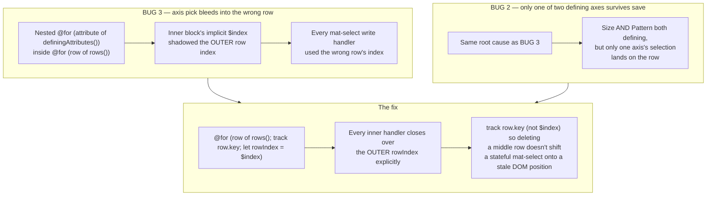
```mermaid
flowchart TD
    subgraph BUG3["BUG 3 — axis pick bleeds into the wrong row"]
        B3A["Nested @for (attribute of definingAttributes())<br/>inside @for (row of rows())"] --> B3B["Inner block's implicit $index<br/>shadowed the OUTER row index"]
        B3B --> B3C["Every mat-select write handler<br/>used the wrong row's index"]
    end
    subgraph BUG2["BUG 2 — only one of two defining axes survives save"]
        B2A["Same root cause as BUG 3"] --> B2B["Size AND Pattern both defining,<br/>but only one axis's selection<br/>lands on the row"]
    end
    subgraph FIX["The fix"]
        F1["@for (row of rows(); track row.key; let rowIndex = $index)"] --> F2["Every inner handler closes over<br/>the OUTER rowIndex explicitly"]
        F2 --> F3["track row.key (not $index) so deleting<br/>a middle row doesn't shift<br/>a stateful mat-select onto a stale DOM position"]
    end
    BUG3 --> FIX
    BUG2 --> FIX
```

**BUG 3 and BUG 2** were, in fact, the *same* root cause wearing two different symptoms. The template's row loop (`@for (row of rows(); ...)`) contains a *nested* `@for (attribute of definingAttributes(); ...)` loop, to render one `mat-select` per defining attribute. In the pre-fix version, the nested loop's own `$index` was being used — by mistake — as if it were the *row's* index inside the click handlers wired to each select.

With only one defining axis, that mistake showed up as **BUG 3**: every write landed on row 0, no matter which row's dropdown was actually touched. With two defining axes (Size *and* Pattern), the same mistake showed up differently, as **BUG 2**: only one attribute's selection ever made it into the saved payload for a freshly-added row. Same shadowing bug, two symptoms, because a different number of axes exposed it in a different way.

The fix aliases the *outer* loop's index explicitly — `@for (row of rows(); track row.key; let rowIndex = $index)` — and every nested handler closes over that named `rowIndex`, never the ambient (and now inner-shadowed) `$index`.

**BUG 3's test** adds two rows, picks "X-Small" via the *second* rendered `mat-select` on the page and "Medium" via the *third*, then asserts row 0 stays unselected, row 1 got the X-Small value, and row 2 got Medium — no cross-row bleed. **BUG 2's test** sets up two defining Select attributes (Size + Pattern), picks both on one new row, and asserts the saved payload carries *both* attribute/value pairs on that one row.

**The third bug — stable row keys —** is why `VariantRow.key` exists at all, separate from `id`. Every draft row has `id === 0`, so `id` can't be a stable template-tracking key. Tracking by array index (`track $index`) has the same problem: it breaks the moment a row in the *middle* of the array is deleted, because Angular then reuses the DOM node — and any live `mat-select` state inside it — for whatever row now occupies that index, silently attaching one row's stateful dropdown to a different row's data. `track row.key` (a monotonically-incrementing counter, `nextRowKey++`, assigned once per row instance and never reused) fixes this permanently.

The regression test — `deleting a middle row leaves the remaining rows selections intact` — adds two rows with distinct values, deletes the middle one, and asserts the surviving row still shows its *own* value rather than inheriting a stale one.

**A fourth, more subtle correctness issue — a zoneless change-detection infinite loop — is guarded by `NO_SELECTION`:**

```typescript
/**
 * Shared, stable empty selection. A descriptive `mat-select multiple` binds its `[ngModel]` to
 * `multiValue(...)`, which runs on every change-detection pass. Returning a fresh `[]` here would
 * hand the value accessor a NEW array reference each pass; NgModel would treat that as a change,
 * write it back to the control, MatSelect would `markForCheck()`, and — under zoneless change
 * detection — that schedules yet another pass, looping forever (NG0103 / "page unresponsive").
 * A single shared instance keeps the reference identical across passes, so the loop never starts.
 */
private static readonly NO_SELECTION: number[] = [];

multiValue(row: VariantRow, attributeId: number): number[] {
  return row.selections[attributeId] ?? ProductVariantsEditorComponent.NO_SELECTION;
}
```

This is worth understanding even outside this feature, because it's a trap any Angular codebase adopting zoneless change detection can fall into: a template expression that *looks* pure (`multiValue(row, attr.id)`) but allocates a brand-new array literal on every call is not actually referentially stable, and a two-way-bound Material control that receives a "new" value every pass will happily loop forever trying to reconcile it. The fix — one shared, frozen, reused empty array — is almost invisible in a diff, but the regression test (`multiValue returns a stable array reference for an unset selection`) asserts the two calls return the exact *same* reference (`toBe`, not `toEqual`) specifically to catch a future refactor that reintroduces a fresh literal.

**Bulk operations** — select-all, bulk price, bulk stock, bulk activate/deactivate — all operate only on rows with `selected === true` (a transient, never-persisted UI flag), with one asymmetry worth knowing: `applyBulkStock()` only touches **draft** rows (`row.id === 0`); a *saved* variant's stock can only change through the ledger-backed stock dialog ([§10.4](#sec-10-4)), never by bulk-editing a plain number field — this mirrors the backend's own rule that only `InventoryService` may move stock for an existing variant.

**Identity-lock rendering** — for any row where `hasOrders === true`, the template renders the SKU `<input>` as `readonly`, disables the delete button, disables the defining-attribute `mat-select`s with a lock icon and an `.identity-lock-note` paragraph explaining why — while price and the active checkbox stay fully interactive. This is D2 ([§3.3](#sec-3-3)), rendered as UI, backed by the exact same rule the server enforces — the frontend lock is a courtesy that prevents a wasted round-trip, not the actual security boundary; `ProductVariantsEditorComponent.save()` sends the same payload regardless, and the server would refuse an identity change either way.

<a id="sec-10-4"></a>
### 10.4 The Stock Dialog — the only path to changing a saved variant's stock

`VariantStockDialogComponent` (`features/admin-area/admin/products/edit-product/variant-stock-dialog/`) is a small Material dialog that loads the variant's recent `InventoryTransaction` history (`InventoryService.getTransactions`) and lets the admin submit a signed delta plus a mandatory reason:

```typescript
get canApply(): boolean {
  return !this.saving() && !!this.delta && this.reason.trim().length > 0;
}

apply(): void {
  ...
  this.inventoryService.adjust(this.data.variantId, this.delta, this.reason.trim()).subscribe({
    next: (inventory) => {
      this.quantityOnHand.set(inventory.quantityOnHand);
      this.changed = true;
      ...
      this.loadTransactions();   // refresh the history right after a successful adjustment
    },
    error: (error) => {
      this.saving.set(false);
      this.errorMessage.set(error?.error?.message ?? '');
    }
  });
}
```

The dialog closes with the *new, server-confirmed* quantity (or `undefined` if nothing changed) — never with a locally-computed guess — so `ProductVariantsEditorComponent.openStockDialog`'s subscriber can trust the returned number outright and doesn't need to mark the row dirty (it explicitly doesn't — a server-confirmed stock change is not an unsaved form edit). A rejected adjustment (say, one that would push available stock negative — the same guard from `InventoryService.AdjustAsync`, [§5.3](#sec-5-3)) leaves `quantityOnHand` completely untouched and only surfaces the backend's error message.

So much for the admin side. The next chapter follows the same feature from the other side of the counter — what a shopper sees and clicks on the storefront.

<a id="chapter-11"></a>
## Chapter 11 — The Angular Frontend: Customer Experience

<a id="sec-11-1"></a>
### 11.1 `ProductDetailsComponent` — the variant selector

Everything about which chips render, which are disabled, and what price shows is a chain of Angular `computed()` signals built directly off the raw `variants[]` array fetched once in `loadProduct()`. Reading the chain in dependency order tells the whole story:

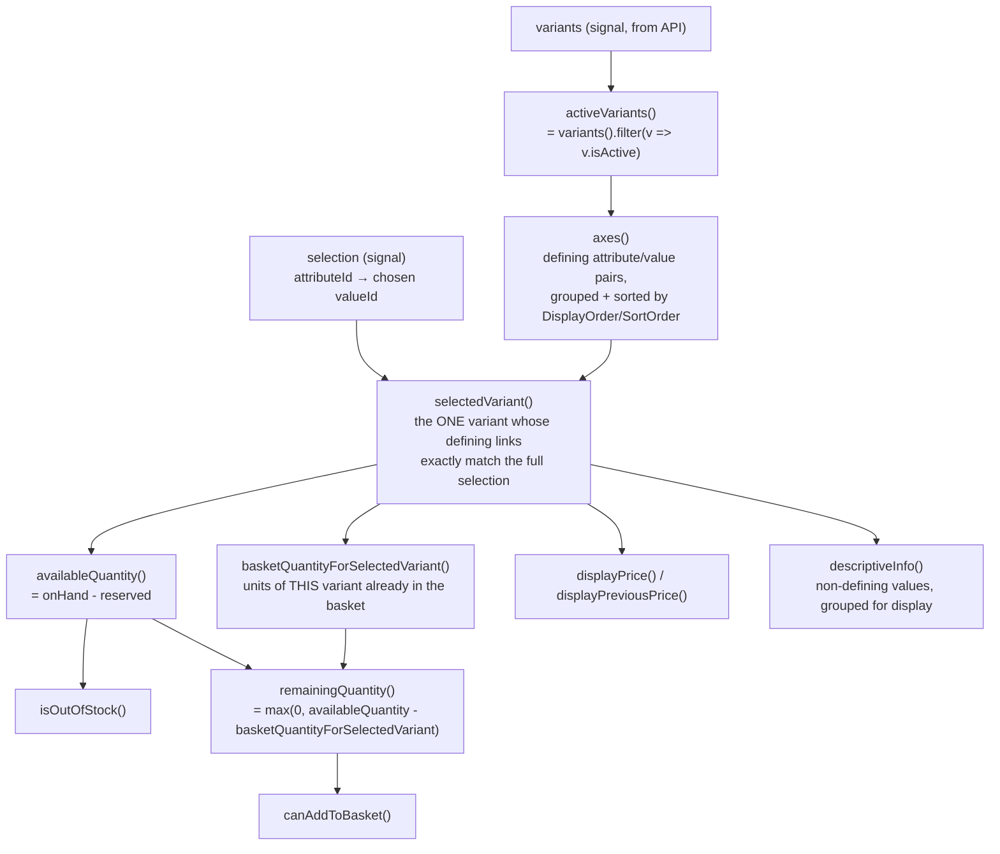
```mermaid
flowchart TD
    V["variants (signal, from API)"] --> AV["activeVariants()<br/>= variants().filter(v => v.isActive)"]
    AV --> AX["axes()<br/>defining attribute/value pairs,<br/>grouped + sorted by DisplayOrder/SortOrder"]
    SEL["selection (signal)<br/>attributeId → chosen valueId"] --> SV["selectedVariant()<br/>the ONE variant whose defining links\nexactly match the full selection"]
    AX --> SV
    SV --> AQ["availableQuantity()<br/>= onHand - reserved"]
    AQ --> OOS["isOutOfStock()"]
    SV --> BQ["basketQuantityForSelectedVariant()<br/>units of THIS variant already in the basket"]
    AQ --> RQ["remainingQuantity()<br/>= max(0, availableQuantity - basketQuantityForSelectedVariant)"]
    BQ --> RQ
    RQ --> CAB["canAddToBasket()"]
    SV --> DP["displayPrice() / displayPreviousPrice()"]
    SV --> DI["descriptiveInfo()<br/>non-defining values, grouped for display"]
```

Three of these deserve a closer look because they encode real customer-facing business rules, each pinned by its own unit test:

**`selectedVariant()` only resolves once *every* defining axis has a choice** — a half-picked selection (e.g. Size chosen but Pattern not yet) resolves to `null`, and the "Add to Basket" button stays disabled:

```typescript
readonly selectedVariant = computed<IProductVariant | null>(() => {
  const active = this.activeVariants();
  const axes = this.axes();
  if (axes.length === 0) { return active.length === 1 ? active[0] : null; }   // no variants at all
  const selection = this.selection();
  if (selection.size !== axes.length) { return null; }                        // incomplete pick
  return active.find(v => {
    const defining = v.attributeValues.filter(l => l.isDefining);
    return defining.length === selection.size
      && defining.every(l => selection.get(l.productAttributeId) === l.productAttributeValueId);
  }) ?? null;
});
```

**`remainingQuantity()` subtracts what's already in the customer's own basket from available stock** — this is the frontend half of the same "don't let the same customer queue up more than exists" idea `InventoryService.GetActiveReservedQuantityAsync` embodies on the backend ([§5.3](#sec-5-3), consumed by `OrderService.BuildOrderItemsAsync`), but here it's purely a UI convenience cap, computed client-side from the live basket state:

```typescript
readonly basketQuantityForSelectedVariant = computed<number>(() => {
  const variant = this.selectedVariant();
  const productId = this.product()?.id;
  if (!variant || !productId) { return 0; }
  return this.basketItems()
    .filter(i => i.id === productId && i.productVariantId === variant.id)
    .reduce((sum, i) => sum + i.quantity, 0);
});

readonly remainingQuantity = computed<number | null>(() => {
  const stock = this.availableQuantity();
  if (stock === null) { return null; }
  return Math.max(0, stock - this.basketQuantityForSelectedVariant());
});
```

The dedicated unit test for this (from `product-details.component.spec.ts`) selects a variant with 3 units on hand, pre-loads the basket with all 3 units of that *same* variant already added, and asserts `remainingQuantity()` drops to `0`, `canAddToBasket()` becomes `false`, the quantity stepper's `incrementQuantity()` refuses to move past `1`, and — critically — clicking "Add to Basket" does **not** even call `BasketService.addItemToBasket` at all. This is purely a client-side UX guard, though; the real, unavoidable authority is still the backend's availability check inside `BasketService`/`OrderService` — the frontend cap just avoids a round-trip that would be rejected anyway.

**`isValueUnavailable(attributeId, valueId)` greys out a chip the moment picking it, combined with everything *else* already selected, could never resolve to an in-stock variant:**

```typescript
isValueUnavailable(attributeId: number, valueId: number): boolean {
  return !this.activeVariants().some(variant => {
    const defining = variant.attributeValues.filter(l => l.isDefining);
    if (!defining.some(l => l.productAttributeId === attributeId && l.productAttributeValueId === valueId)) {
      return false;
    }
    for (const [otherAttributeId, otherValueId] of this.selection()) {
      if (otherAttributeId === attributeId) { continue; }
      if (!defining.some(l => l.productAttributeId === otherAttributeId && l.productAttributeValueId === otherValueId)) {
        return false;
      }
    }
    const available = (variant.inventory?.quantityOnHand ?? 0) - (variant.inventory?.quantityReserved ?? 0);
    return available > 0;
  });
}
```

This is what makes a color-and-size selector feel "smart" instead of just a plain grid: pick Size = XL first, and any Color chip whose XL combination is out of stock immediately dims, *before* the customer wastes a click discovering that.

<a id="sec-11-2"></a>
### 11.2 Adding to basket, and what the basket line actually carries

```typescript
addItemToBasket() {
  ...
  const variant = this.selectedVariant();
  if (variant) {
    const remaining = this.remainingQuantity();
    const quantity = remaining === null ? this.quantity() : Math.min(this.quantity(), remaining);
    if (quantity <= 0) { return; }
    this.basketService.addItemToBasket(this.product(), quantity, {
      id: variant.id,
      sku: variant.sku,
      price: variant.price,
      description: this.buildVariantDescription(variant)
    });
  } else {
    this.basketService.addItemToBasket(this.product(), this.quantity());   // product with no variants
  }
}
```

`buildVariantDescription` on the Angular side is a **near-duplicate**, in spirit, of `VariantSnapshotBuilder.Build` on the backend ([§4.5](#sec-4-5)) — group descriptive links by attribute, join values with commas, join attribute groups with `" · "`. This is intentional, not an oversight: the frontend needs *some* string to show immediately in the basket UI before any server round-trip, but it is explicitly a **display convenience, not the source of truth** — the moment an order is actually placed, `OrderService.BuildOrderItemsAsync` re-derives the authoritative description server-side from the live, localized attribute data, via the *real* `VariantSnapshotBuilder`. If the two ever disagree (say, a translation changed between add-to-basket and checkout), the server's version is what ends up on the order and the invoice, always.

`BasketService.addItemToBasket` treats two basket lines for the *same product* but *different variants* as genuinely separate lines — `isSameLine` matches on `(productId, productVariantId)`, not `productId` alone:

```typescript
/** Basket lines are unique per (product id, variant id); legacy lines have no variant id. */
private isSameLine(a: IBasketItem, b: IBasketItem): boolean {
  return a.id === b.id && (a.productVariantId ?? null) === (b.productVariantId ?? null);
}
```

And every basket mutation goes through `persistWithRollback`, which snapshots the basket *before* the change and restores that snapshot if the server rejects the write:

```typescript
private persistWithRollback(currentBasket: IBasket, previousBasket: IBasket | null): void {
  this.setBasket(currentBasket).subscribe({
    next: () => console.log('Basket updated successfully'),
    error: () => {
      this.basketSource.next(previousBasket);   // undo the optimistic UI update
      this.shipping = previousBasket?.shippingPrice ?? 0;
      this.calculateTotals();
    }
  });
}
```

This is optimistic UI done safely: the basket badge/quantity updates *immediately* on click (no waiting for a round-trip), but if the server's own stock guard rejects the increment (say, someone else bought the last unit a second ago), the customer's screen snaps back to the last server-confirmed state instead of silently showing a quantity that was never actually accepted. The dedicated spec test (`rolls back when the server rejects an over-stock quantity increase`) seeds a basket at 4 units, increments to 5, has the mocked HTTP layer respond with a 400 `ProblemDetails` body, and asserts the basket's quantity is still `4` afterward — proving the rollback, not just the optimistic update, actually happens.

`BasketSummaryComponent`, used on both the basket page and (via `[isOrder]="true"`) the order-detail page, renders `item.variantDescription` in place of the old generic `"Type: {{item.type}}"` line whenever a variant description exists, plus `item.sku` as a small secondary line — so the exact same component, unmodified in structure, now shows "Size: M · Color: Brown" and "P40-BROWN-M" on both a live basket and a placed order's line items, driven entirely by whether the underlying `IBasketItem`/order-item carries those optional fields.

### 11.3 `OrderDetailedComponent` — where the invoice reappears

Already walked step-by-step as a runtime flow in [§8.5](#sec-8-5); the component itself is short enough to note two things not yet said: it loads the order and the invoice as two **independent** requests (`getOrderDetailed` then, in the success callback, `loadInvoice`) rather than one combined endpoint — deliberately so an order page still renders fully even if the invoice call fails or simply returns "nothing yet" — and the exact same `invoice.service.ts`/`downloadInvoicePdf()` pairing is reused, unchanged, by `InvoiceDetailComponent` in the admin area ([§10.1](#sec-10-1)), just pointed at the admin PDF endpoint instead of the customer one.

That is the full tour of both codebases, layer by layer. Two cross-cutting concerns remain — how names get translated across the whole stack, and how the test suite backs up every claim this guide has made so far.

<a id="chapter-12"></a>
## Chapter 12 — Localization Integration

LiliShop already had a localization system before this feature — per-culture translation tables for products, product types, and brands, read through `IBusinessTranslationService` and written through the same interface's upsert methods. This chapter covers exactly the part of that system this feature *extended* — attribute and attribute-value names — plus how a variant's localized description ends up frozen onto an order and an invoice, and how the invoice PDF itself gets localized. It does not re-explain the shop's general localization architecture (culture resolution, `Language`/`LanguageTranslation` tables, the `CultureScope`/middleware plumbing) beyond what's needed to follow these two paths.

### 12.1 The read side — batched, cached, and free for the default culture

`BusinessTranslationService` gained four new methods for this feature, and all four follow the exact same shape as the pre-existing product/type/brand methods:

```csharp
public async Task<IReadOnlyDictionary<int, string>> GetProductAttributeNamesAsync(CancellationToken cancellationToken = default)
{
    var culture = await GetNonDefaultCultureAsync(cancellationToken);
    if (culture is null) { return new Dictionary<int, string>(); }   // default culture: base columns are already correct

    return await _cache.GetOrCreateAsync(
        $"attributes:names:{culture}",
        async token => {
            var rows = await _unitOfWork.Repository<ProductAttributeTranslation>()
                .GetByCriteria(t => t.Culture == culture).ToListAsync(token);
            return (IReadOnlyDictionary<int, string>)rows.ToDictionary(t => t.ProductAttributeId, t => t.Name);
        },
        NameMapCacheOptions,
        tags: ["attributes"],
        cancellationToken: cancellationToken);
}
```

`GetProductAttributeValueNamesAsync` is the same shape, keyed by `ProductAttributeValueId`. Three things make this fast and safe:

1. **`GetNonDefaultCultureAsync` short-circuits entirely for the shop's default culture** — if the visitor's UI culture *is* the default, there is no translation table to consult at all; the base `Name` columns on `ProductAttribute`/`ProductAttributeValue` already hold the right text. This is why `BusinessTranslationServiceAttributeTests`' first test (`GetProductAttributeNamesAsync_ShortCircuits_ForDefaultCulture`) asserts the repository's `GetByCriteria` is **never called** in that case — it's a real optimization, not just a fallback path.
2. **One query per culture, cached under the `"attributes"` tag** — not one query per attribute, and not one query per page render. The whole translation map for a culture is fetched once and reused across every subsequent request until the cache entry expires *or* an admin writes a change and invalidates the tag.
3. **Failure is swallowed, not surfaced** — every one of these methods wraps its cache/DB call in a `try/catch` that logs and returns an *empty* dictionary on error, because — as the interface doc-comment states — localization must never be the reason a product or attribute page fails to load; a translation problem degrades to "show the default-culture name," never to a 500.

**Both `ProductAttributeService.GetAll`/`GetAttributeByIdAsync` and `ProductVariantService.GetVariantsByProductAsync` call the exact same `ApplyLocalizedNamesAsync` pattern** — fetch the two name maps once, then walk the already-loaded entity graph swapping in localized names by id:

```csharp
// ProductVariantService.cs
private async Task ApplyLocalizedNamesAsync(IReadOnlyList<ProductVariant> variants)
{
    var attributeNames = await _businessTranslationService.GetProductAttributeNamesAsync();
    var valueNames = await _businessTranslationService.GetProductAttributeValueNamesAsync();
    if (attributeNames.Count == 0 && valueNames.Count == 0) { return; }

    foreach (var link in variants.SelectMany(v => v.AttributeValues))
    {
        if (link.ProductAttribute is not null && attributeNames.TryGetValue(link.ProductAttributeId, out var attributeName))
        { link.ProductAttribute.Name = attributeName; }
        if (link.ProductAttributeValue is not null && valueNames.TryGetValue(link.ProductAttributeValueId, out var valueName))
        { link.ProductAttributeValue.Name = valueName; }
    }
}
```

This mutation happens on entities that were fetched **without** change-tracking for this purpose (or are otherwise never saved back), so overwriting `.Name` in memory only affects the JSON that goes out on this one response — it never accidentally persists a "translated" name into the base column.

### 12.2 The write side — the admin editor's per-culture inputs

`ProductAttributeService.AddOrUpdateAsync`/`UpdateAttributeAsync` call `UpsertProductAttributeTranslationsAsync`/`UpsertProductAttributeValueTranslationsAsync` whenever the incoming DTO's `Translations` list is non-null — and, notably, **also keep the base `Name` column in sync whenever the incoming translation is for the shop's default culture**:

```csharp
if (culture == defaultCode.ToLowerInvariant())
{
    productAttribute.Name = input.Name;   // the base column IS the default-culture fallback
}
```

This is the exact mechanism that keeps the "base column = default-culture fallback" invariant true forever, even as an admin edits translations through what looks, in the Angular UI, like a totally separate per-language input field.

On the Angular side ([§10.2](#sec-10-2)), `EditAttributeComponent` builds this payload from two parallel pieces of state: the main reactive form field `name` (always the default culture) and a plain `translationDrafts: Record<string, string>` object holding one optional entry per *other* active language, sourced from `LanguageService.languages()` filtered to `!l.isDefault`:

```typescript
private buildTranslationsPayload(defaultName: string, drafts: Record<string, string>): INameTranslation[] {
  const translations: INameTranslation[] = [];
  if (this.defaultCulture) { translations.push({ culture: this.defaultCulture, name: defaultName }); }
  for (const [culture, name] of Object.entries(drafts)) {
    if (name?.trim()) { translations.push({ culture, name: name.trim() }); }
  }
  return translations;
}
```

Each attribute *value* row carries its own independent `translations` record too, expandable per-row via a toggle icon (`toggleValueTranslations`) — so an admin editing, say, the `color` attribute's twelve values doesn't have twelve translation panels open by default; they expand only the ones they need to touch.

### 12.3 Localization inside a frozen snapshot

`VariantSnapshotBuilder.Build` ([§4.5](#sec-4-5)) is where localization and immutability meet directly: it accepts the *already-resolved* `attributeNames`/`valueNames` dictionaries for the order's culture and bakes the localized text straight into `OrderItem.VariantDescription` at the moment of purchase. Once that snapshot is written, it is culture-frozen forever — an order placed in German shows "Größe: Mittel" on its order confirmation and its invoice line **even if the attribute's German translation is edited or removed the next day.** This is the same immutability principle from [§3.5](#sec-3-5) applied one layer down, to text instead of numbers.

### 12.4 Localizing the invoice PDF itself

The invoice PDF's labels ("Invoice", "Bill To", "Quantity", …) are a separate, smaller localization concern from the attribute-name system above — they come from the shop's general `IStringLocalizer<SharedResource>` resource catalog (the `Invoice.Pdf.*` keys), resolved once per render via `InvoiceService.BuildLabels` inside a temporary `CultureScope` ([§6.5](#sec-6-5)), and handed to `QuestPdfInvoiceRenderer` as an already-resolved `InvoiceLabels` record — the renderer itself never touches `CultureInfo` or a resource file directly. Which culture to render in is decided differently depending on *who's* asking: a customer's own download or the automated delivery email uses `InvoiceEmailService.ResolveBuyerCultureAsync` (the buyer's stored `ApplicationUser.PreferredLanguageCode`, falling back to `SellerProfileOptions.InvoiceCulture`), while the shop's configured `InvoiceCulture` is the single language every invoice is minted in by default — the roadmap explicitly notes *per-order* invoice language selection is a future enhancement, not something this feature builds.

### 12.5 The frontend's translation-key inventory for this feature

`src/app/core/i18n/translation-keys.ts` gained several new key groups, used by exactly the components this guide has already walked through — listed here for completeness, not because the keys themselves need individual explanation:

| Group | Used by |
|---|---|
| `Admin.Attributes.*` (`AddValue`, `CodeLabel`, `InputTypeSelect`, `SwatchTypeColorHex`, `Values`, …) | `AttributesComponent`, `EditAttributeComponent` |
| `Admin.Inventory.*` (`TypeReceive`, `TypeAdjust`, `TypeReserve`, `TypeReleaseReservation`, `TypeDeduct`, `TypeRefund`, `History`, `Delta`, `Reason`, …) | `VariantStockDialogComponent`'s transaction-type labels |
| `Admin.Invoices.*` (`Title`, `Number`, `IssueDate`, `Buyer`, `Total`, `SearchPlaceholder`, …) | `InvoicesComponent`, `InvoiceDetailComponent` |
| `Admin.Products.*` — extended with variant/generator keys (`DefiningAttributes`, `GenerateVariants`, `MissingAxisValues`, `VariantOrderedLock`, `SkuLockedHint`, `IdentityLockedHelper`, `NoNewCombinations`, …) | `ProductVariantsEditorComponent` |
| `Invoice.*` (top-level, distinct from `Admin.Invoices`) — `DownloadPdf`, and a nested `Pdf.*` group | The customer-facing download button, shared by `OrderDetailedComponent` and `InvoiceDetailComponent` |
| `Orders.Invoice`, `Orders.InvoiceDate`, `Orders.InvoiceNumber` | `OrderDetailedComponent`'s invoice card |

The one detail worth pausing on: `Admin.Invoices.*` and the top-level `Invoice.*` group are **deliberately separate namespaces** for the same underlying concept, because the admin list/detail pages and the customer-facing download button are different UI contexts that happen to both talk about invoices — keeping them as separate key groups means a copy change to the admin table header can never accidentally change the wording of the customer's download button, and vice versa.

Every rule this guide has described — D1, D2, gapless numbering, the reservation ledger — is backed by an executable test. The final chapter shows how, and why the suite is organized the way it is.

<a id="chapter-13"></a>
## Chapter 13 — Testing Strategy

The test suite for this feature (15 new backend files, 9 new frontend spec files) is organized in visible, deliberate layers — and understanding *why* a given test lives in one layer rather than another teaches you almost as much about the architecture as the production code does. This chapter groups tests by *what kind of confidence* they're built to give, not by file name.

### 13.1 Backend: three layers of confidence

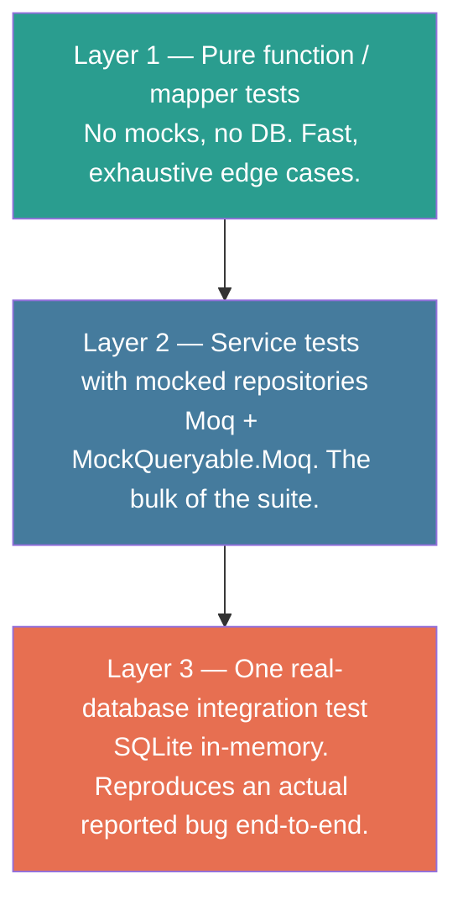
```mermaid
flowchart TB
    L1["Layer 1 — Pure function / mapper tests\nNo mocks, no DB. Fast, exhaustive edge cases."]
    L2["Layer 2 — Service tests with mocked repositories\nMoq + MockQueryable.Moq. The bulk of the suite."]
    L3["Layer 3 — One real-database integration test\nSQLite in-memory. Reproduces an actual reported bug end-to-end."]
    L1 --> L2 --> L3
    style L1 fill:#2a9d8f,color:#fff
    style L2 fill:#457b9d,color:#fff
    style L3 fill:#e76f51,color:#fff
```

### 13.2 Layer 1 — pure functions, no mocks at all

<a id="sec-13-2"></a>

| File | What it validates | Why it matters |
|---|---|---|
| `VariantSnapshotBuilderTests.cs` | Grouping by attribute, ordering by `DisplayOrder`/`SortOrder`, localized-name substitution, the axis-less `(null, null)` case. | This function's output is frozen forever onto orders and invoices ([§4.5](#sec-4-5)) — a bug here can't be "fixed later," it would already be baked into every order placed before the fix. |
| `ProductAttributeMapperTests.cs` | Code normalization (trim + lowercase), color-hex normalization (5 inline edge cases via `[Theory]`), and — critically — that `UpdateEntity` never lets an incoming DTO overwrite the entity's `Id`. | Mapper bugs are invisible in normal testing because they *look* like they work; a theory test with explicit edge cases (`null`, whitespace, already-prefixed, padded) is the only way to actually pin down a string-normalization function. |
| `BasketMappersTests.cs` | `ProductVariantId`/`Sku`/`VariantDescription` survive `BasketItem ↔ BasketItemDto` mapping in both directions and round-trip. | The doc-comment states the stakes directly: drop `ProductVariantId` in a mapper and reloaded basket lines can't be matched (silent duplicate rows), and variant-aware pricing/reservation at checkout is silently skipped. |
| `ProductsSpecificationFacetTests.cs` | The storefront facet-filter predicate — same-variant AND-across-groups, OR-within-a-group, and that out-of-stock/inactive variants never match — run directly against constructed object graphs. | Its own doc-comment explains why this is safe as a pure test: "the predicate shape is identical to what EF translates to EXISTS subqueries," so exercising the `Expression` in memory validates the actual filter logic without needing a database. |
| `QuestPdfInvoiceRendererTests.cs` | The renderer produces real, non-empty PDF bytes (`"%PDF"` magic header) for `en`/`de`/`fa` (right-to-left) cultures, and falls back to English for an unrecognized culture string instead of throwing. | Proves the "supports non-Latin cultures without crashing" claim from the renderer's own static-constructor comment ([§6.5](#sec-6-5)) is actually true, not just asserted in a comment. |
| `VariantSerializationReproTests.cs` | A list of `ProductVariant`s sharing EF-identity-resolved `ProductAttribute`/`ProductAttributeValue` instances still serializes every variant's `attributeValues` fully under `ReferenceHandler.IgnoreCycles`. | A targeted regression repro for a real `System.Text.Json` gotcha — `IgnoreCycles` can, depending on where a shared reference is first seen, skip re-emitting it on later occurrences in the graph, which is exactly the shape EF Core's change tracker produces for shared lookup entities like attributes. This test exists because that failure mode is easy to reintroduce silently in a future refactor and would look like "attributes just went missing from the API" with no obvious cause. |

### 13.3 Layer 2, special case — faking the SQL-Server-only atomic calls

`InventoryServiceTests.cs` and `InvoiceServiceTests.cs` share a distinctive, and genuinely clever, testing technique worth understanding on its own: both `InventoryService` and `InvoiceService` have `protected virtual` methods that, in production, issue a SQL-Server-specific atomic conditional `UPDATE` ([§5.3](#sec-5-3), [§6.3](#sec-6-3)) — behavior that an in-memory or SQLite fake can't reproduce identically. Rather than skip testing the *surrounding* orchestration logic, both test files wrap the service in a **Moq partial mock**:

```csharp
var sutMock = new Mock<InventoryService>(unitOfWork, logger) { CallBase = true };
sutMock.Protected()
    .Setup<Task<bool>>("ApplyReserveAsync", ItExpr.IsAny<int>(), ItExpr.IsAny<int>(), ...)
    .Returns<int, int, string, DateTimeOffset>((variantId, qty, intentId, expiresAt) => {
        // hand-written in-memory guard that mirrors the real SQL WHERE clause
        var item = _items.First(i => i.ProductVariantId == variantId);
        if (item.QuantityOnHand - item.QuantityReserved < qty) return Task.FromResult(false);
        item.QuantityReserved += qty;
        _reservations.Add(new InventoryReservation { ... });
        return Task.FromResult(true);
    });
```

`CallBase = true` means every *real* method — `AdjustAsync`, `DeductForOrderAsync`, `ReserveForIntentAsync`, and all the idempotency/validation logic inside them — genuinely runs; only the five protected atomic-update methods (`ApplyMovementAsync`, `ApplyReserveAsync`, `ApplyReleaseAsync`, `ApplyCommitAsync`, `ApplyReservedReleaseAsync` for inventory; `AllocateNextSequenceValueAsync` for invoicing) are replaced with hand-rolled equivalents that reproduce the *same guard semantics* against plain in-memory lists. This buys real coverage of orchestration bugs — idempotency, all-or-nothing rollback, hold-then-commit sequencing — without needing a real SQL Server instance in CI.

**Both files are explicit, in their own doc-comments, about what this technique does *not* prove.** Genuine concurrency (two real threads racing the same row lock), the row-lock-held-to-commit guarantee, and the unique-index backstop are called out as requiring "the SQL-Server integration harness." Worth noting honestly: no such SQL-Server integration test file exists in this codebase today for inventory or invoicing concurrency specifically — unlike variants, which do get a real-database integration test ([§13.5](#sec-13-5)).

What these tests *do* prove — solidly — is every business rule layered on top of the atomic primitive: that `DeductForOrderAsync` is idempotent per order (`DeductForOrderAsync_IsIdempotent_PerOrder` calls it twice and asserts exactly one `Deduct` transaction), that a multi-line reservation is genuinely all-or-nothing (`ReserveForIntentAsync_IsAllOrNothing_WhenOneLineLacksStock` proves a successful hold on one line is rolled back when a *later* line in the same call fails), that a checkout's own reservation is honored at commit even against fully-depleted free stock, and that `CreateInvoiceForOrderAsync` never re-mints or re-emails on a second call for the same order.

### 13.4 Layer 2 — ordinary service tests with full repository mocking

The remaining service-level suites (`ProductAttributeServiceTests`, `ProductVariantServiceTests`, `InvoiceEmailServiceTests`, `BusinessTranslationServiceAttributeTests`, `BasketServiceTests`, `ProductAttributesControllerTests`) all use the shop's established pattern: `Moq` for `IUnitOfWork`/`IGenericRepository<T>`, and `MockQueryable.Moq`'s `BuildMockDbSet()` to turn a plain in-memory `List<T>` into something EF Core's `IQueryable` LINQ operators can run against. That last part matters: it means a repository mock's `GetByCriteria(predicate)` genuinely filters by compiling and running the real `Expression<Func<T,bool>>`, not just returning a canned list regardless of the predicate.

`ProductVariantServiceTests.cs` is the largest single file in the suite (~30 tests) precisely because `UpsertVariantsAsync`'s validation pipeline ([§5.2](#sec-5-2)) has that many genuinely distinct rules to pin. Worth calling out directly are the dedicated tests for **D1** (`UpsertVariantsAsync_Fails_WhenActiveVariantsUseDifferentDefiningSets`, and its exemption test `UpsertVariantsAsync_AllowsInactiveVariant_WithDifferentDefiningSet`) and **D2** (`UpsertVariantsAsync_Fails_WhenRenamingSkuOfOrderedVariant`, `UpsertVariantsAsync_KeepsSku_WhenBlankOnOrderedVariant`, `UpsertVariantsAsync_AcceptsUnchangedSku_OnOrderedVariant`, `UpsertVariantsAsync_AllowsOperationalEdits_OnOrderedVariant`). These are not incidental coverage — they are the roadmap's own domain decisions, each one written down as an executable test.

`InvoiceEmailServiceTests.cs` deserves one specific callout: `SendInvoiceEmailAsync_Throws_WhenPdfRenderFails_SoHangfireRetries` exists specifically to pin the *deliberate* choice to let a render failure propagate as an exception rather than swallow it — because this method runs as a Hangfire job, and Hangfire's own retry policy is the actual error-recovery mechanism here, not a try/catch inside the service.

### 13.5 Layer 3 — the one real-database integration test

<a id="sec-13-5"></a>

`ProductVariantServiceIntegrationTests.cs` stands apart from every other backend test file: it spins up a real, if lightweight, **SQLite in-memory `ShopDbContext`** and runs the actual `ProductVariantService`, `UnitOfWork`, and EF Core LINQ translation against it — no mocked repositories at all (only `IBusinessTranslationService` and `ICacheManagerService` are faked, since neither matters to this test's purpose). A local `SqliteShopDbContext` subclass has to walk the EF model and turn off every `[Timestamp]` concurrency-token column's SQL-Server-specific `rowversion` behavior, since SQLite has no equivalent.

Why does this one file exist when everything else uses mocks? Because its four tests are **ground-truth reproductions of real, previously-reported admin bugs** — not hypothetical edge cases. `AddSize_ThenReload_ThenAddAnotherSize_Succeeds` replays the exact sequence an admin actually performed (save a Medium variant, reload the page, add a Small, save, reload again, add a Large, save) against a **fresh `DbContext` instance for each step** — deliberately simulating separate HTTP requests hitting the same underlying data, which is precisely the condition that can expose bugs a single-context, single-request mocked test would never see. `ColorAsDefiningAxis_AllowsTwoColorsOfTheSameSize` and its sibling `ColorAsDescriptiveOnly_CollidesForTwoColorsOfTheSameSize` reproduce the *same* two target SKUs with *one* configuration difference (is Color defining or descriptive?) to prove the collision a reporting admin saw was correct behavior given their editor configuration, not a backend defect — a genuinely useful outcome for a bug report, even though the "fix" turned out to be "no fix needed, use the other axis mode."

### 13.6 Frontend: Vitest + Angular `TestBed`

Every new spec file uses **Vitest** (not the legacy Jasmine/Karma runner) with Angular's `TestBed`, `provideHttpClient(...)` + `provideHttpClientTesting()`/`HttpTestingController` for anything that talks to the backend, and hand-rolled mock objects (not a mocking library) for injected services — matching the shop's existing frontend test conventions. A few patterns recur across files and are worth naming once:

- **Signal inputs are set via `fixture.componentRef.setInput(...)`**, not by binding in a host template — the modern, explicit way to drive a standalone component's `input()`/`input.required()` signals in a unit test.
- **`BasketService`'s mock in `product-details.component.spec.ts` uses a real `BehaviorSubject<IBasket | null>`** for `basket$`, so a test can push a new basket state mid-test (`basketServiceMock.basket$.next(...)`) and assert the component's `computed()` signals react — proving the reactive chain from [§11.1](#sec-11-1), not just a snapshot of its output.
- **`afterEach(() => httpMock.verify())`** in `basket.service.spec.ts` ensures no test accidentally leaves an unhandled HTTP expectation — a discipline that catches "I forgot this test also triggers a background request" bugs immediately instead of letting them rot.

<a id="sec-13-7"></a>
### 13.7 The DOM-level regression suite for the variant editor

`product-variants-editor.component.dom.spec.ts` is a deliberately different *kind* of test from its sibling `product-variants-editor.component.spec.ts` (which drives the component's TypeScript methods directly). This file drives the **rendered template**, clicking through real `mat-select` overlays via a `pickOption(fixture, selectIndex, optionText)` helper that clicks the trigger, then finds and clicks the matching `<mat-option>` in the CDK overlay attached to `document`. It has to work this way because BUG 2 and BUG 3 ([§10.3](#sec-10-3)) were template *row-index binding* bugs — the kind of defect that a test calling `component.setSingleValue(0, 10, 101)` directly would never catch, because that call bypasses the exact template wiring that was broken.

This is a genuinely important testing lesson on its own: **a bug in how a template's local index variables are scoped can only be caught by a test that exercises the actual template**, not by testing the component class in isolation — however thoroughly.

<a id="sec-13-8"></a>
### 13.8 Full test-file inventory

| File | Layer | Primary purpose |
|---|---|---|
| `API/ProductAttributesControllerTests.cs` | Controller unit | Service-result → HTTP-status mapping, incl. business-rule failures. |
| `Services/BasketMappersTests.cs` | Pure mapper | Variant identity survives DTO↔entity mapping. |
| `Services/BasketServiceTests.cs` | Service, mocked | Oversell prevention at basket-write time, incl. summed multi-line and reservation-aware checks. |
| `Services/InventoryServiceTests.cs` | Service, partial mock | The entire reservation/deduct/adjust orchestration and its idempotency guarantees. |
| `Services/InvoiceEmailServiceTests.cs` | Service, mocked | Culture resolution, PDF attachment, no-op vs. throw-for-retry semantics. |
| `Services/InvoiceServiceTests.cs` | Service, partial mock | Gapless numbering, idempotent minting, VAT-zeroed snapshot invariant, admin/customer scoping. |
| `Services/Localization/BusinessTranslationServiceAttributeTests.cs` | Service, mocked | Default-culture short-circuit, translation upsert + base-column sync. |
| `Services/Mappers/ProductAttributeMapperTests.cs` | Pure mapper | Code/color normalization; `Id` never overwritten. |
| `Services/Mappers/VariantSnapshotBuilderTests.cs` | Pure function | The exact frozen text/JSON that lands on every order and invoice line. |
| `Services/ProductAttributeServiceTests.cs` | Service, mocked | Referential-integrity delete guards, duplicate-code rejection, cache invalidation. |
| `Services/ProductVariantServiceIntegrationTests.cs` | Real SQLite DB | Ground-truth repro of reported save/reload variant bugs. |
| `Services/ProductVariantServiceTests.cs` | Service, mocked | The full validation pipeline, including D1 and D2 enforcement. |
| `Services/ProductsSpecificationFacetTests.cs` | Pure predicate | Storefront facet-filter same-variant/AND/OR/stock semantics. |
| `Services/QuestPdfInvoiceRendererTests.cs` | Pure function | Real PDF output for multiple cultures, incl. RTL. |
| `Services/VariantSerializationReproTests.cs` | Regression repro | `System.Text.Json` reference-cycle handling doesn't drop shared-entity data. |
| `core/services/basket.service.spec.ts` | Service, HTTP-mocked | Merge/split basket lines by variant; rollback on server rejection. |
| `.../edit-product.component.spec.ts` | Component | Route-sentinel (`-1` → real id) redirect correctness. |
| `.../product-details.component.spec.ts` | Component | The entire variant-selector `computed()` chain, incl. basket-aware stock capping. |
| `.../basket-summary.component.spec.ts` | Component | SKU + variant description actually render on a basket/order line. |
| `.../product-variants-editor.component.spec.ts` | Component | Bulk ops, generation, D1/D2 UI enforcement, the zoneless-loop guard. |
| `.../product-variants-editor.dom.spec.ts` | DOM/template | The three real template-binding bugs (BUG 1/2/3), caught only at the template level. |
| `.../variant-stock-dialog.component.spec.ts` | Component | Validation gating, close-semantics, server-rejection handling. |
| `.../attributes.component.spec.ts` | Component | Standard list/delete/navigate CRUD flows. |
| `shared/pipes/format-value.pipe.spec.ts` | Pure pipe | `isActive` reads from either the cell value or a passed row context, matching each table's call convention. |

That is the whole story, chapter by chapter. What follows is reference material: a complete map of every file this feature touches, and a glossary you can return to whenever a term feels unfamiliar.

<a id="appendix-a"></a>
## Appendix A — Complete Backend File Reference

Every file this feature added, grouped by layer, with a one-line purpose grounded in the source code this guide has already walked through. Use it as an index — jump back into the chapter each row links to for the full explanation.

### A.1 Architecture & Design Documentation

| File | Purpose |
|---|---|
| `PRODUCT_VARIANT_ARCHITECTURE_ROADMAP.md` | The variant/inventory system's milestone plan (M0–M6) and its two post-launch domain decisions, D1 and D2 ([§5.2](#sec-5-2), [§3.3](#sec-3-3)). |
| `M7_INVOICE_ARCHITECTURE_ROADMAP.md` | The invoicing system's milestone plan (M7-A through M7-D) and design rationale ([Chapter 6](#chapter-6)). |
| `M7E_VAT_AND_CREDIT_NOTES_DESIGN.md` | A design-only note (no code ships) for future VAT enablement and credit notes ([§6.7](#sec-6-7)). |

### A.2 API Layer

| File | Purpose |
|---|---|
| `Controllers/InvoicesController.cs` | Admin, read-only invoice list/detail/PDF endpoints ([§7.1](#sec-7-1)). |
| `Controllers/ProductAttributesController.cs` | Public reads + admin CRUD for the attribute vocabulary ([§7.2](#sec-7-2)). |
| `Controllers/ProductVariantsController.cs` | Public variant reads + admin batch upsert / bulk-generate / delete ([§7.3](#sec-7-3)). |

### A.3 Application Layer — DTOs & Models

| File | Purpose |
|---|---|
| `Common/Emails/EmailAttachment.cs` | `{ FileName, Content, ContentType }` — a binary attachment for an outgoing email. |
| `Common/Emails/InvoiceEmailData.cs` | Input shape for the "invoice issued" email composer. |
| `Common/Helpers/VariantSnapshotBuilder.cs` | Pure function freezing a variant's attributes into display text + structured JSON ([§4.5](#sec-4-5)). |
| `Common/Invoices/InvoiceLabels.cs` | Pre-localized static label strings passed to the PDF renderer ([§6.5](#sec-6-5)). |
| `DTOs/InventoryAdjustmentDto.cs` | Admin stock-correction input: signed delta + mandatory reason. |
| `DTOs/Invoices/InvoiceLineDto.cs` | One rendered invoice line for API responses. |
| `DTOs/Invoices/InvoicePdfDto.cs` | Rendered PDF bytes + filename, ready to stream. |
| `DTOs/Invoices/InvoiceSummaryDto.cs` | Row shape for the admin invoice list. |
| `DTOs/Invoices/InvoiceToReturnDto.cs` | Full invoice detail, shared by the customer and admin read paths. |
| `DTOs/ProductAttributeToUpdateDto.cs` | Admin create/update payload for an attribute and its values. |
| `DTOs/Products/ProductVariantToUpdateDto.cs` | One row of the admin's batch variant save. |
| `DTOs/Products/VariantGenerationRequestDto.cs` | The bulk "generate combinations" request shape ([§4.2](#sec-4-2)). |

### A.4 Application Layer — Interfaces

| File | Purpose |
|---|---|
| `Interfaces/Infrastructure/IInvoiceDocumentRenderer.cs` | Contract for rendering an invoice to a PDF document ([§4.3](#sec-4-3)). |
| `Interfaces/Services/IBusinessTranslationService.cs` | Contract for every business-data translation read/write, incl. attributes ([Chapter 12](#chapter-12)). |
| `Interfaces/Services/IInventoryService.cs` | Contract for the single owner of stock movement ([§4.3](#sec-4-3), [§5.3](#sec-5-3)). |
| `Interfaces/Services/IInvoiceEmailService.cs` | Contract for delivering an issued invoice by email. |
| `Interfaces/Services/IInvoiceService.cs` | Contract for invoice issuance, retrieval, and PDF rendering entry points. |
| `Interfaces/Services/IProductAttributeService.cs` | Contract for attribute/value CRUD. |
| `Interfaces/Services/IProductVariantService.cs` | Contract for variant reads, batch upsert, bulk generation, delete. |

### A.5 Application Layer — Mappers & Specifications

| File | Purpose |
|---|---|
| `Mappers/InvoiceMappers.cs` | `Invoice`/`InvoiceLine` → DTO extension methods ([§4.4](#sec-4-4)). |
| `Mappers/ProductAttributeMappers.cs` | DTO ↔ `ProductAttribute`/`ProductAttributeValue` conversions, code/color normalization. |
| `Specifications/Params/ProductAttributeSpecParams.cs` | Paging + `IsActive` filter parameters for the attribute list endpoint. |

### A.6 Domain Layer — Entities

| File | Purpose |
|---|---|
| `Entities/InventoryItem.cs` | Live per-variant stock counter ([§3.4](#sec-3-4)). |
| `Entities/InventoryReservation.cs` | One checkout stock hold. |
| `Entities/InventoryTransaction.cs` | Append-only stock-movement ledger row. |
| `Entities/Invoicing/Invoice.cs` | The immutable legal invoice document ([§3.5](#sec-3-5)). |
| `Entities/Invoicing/InvoiceLine.cs` | One frozen line of an invoice. |
| `Entities/Invoicing/InvoiceNumberSequence.cs` | Per-series gapless numbering counter. |
| `Entities/ProductAttribute.cs` | A catalog-wide variation axis (Color, Size, …) ([§3.2](#sec-3-2)). |
| `Entities/ProductAttributeTranslation.cs` | Per-culture attribute name. |
| `Entities/ProductAttributeValue.cs` | One selectable value of an attribute. |
| `Entities/ProductAttributeValueTranslation.cs` | Per-culture value name. |
| `Entities/ProductVariant.cs` | The sellable unit — SKU, price, identity ([§3.3](#sec-3-3)). |
| `Entities/ProductVariantAttributeValue.cs` | Links a value to a variant; carries `IsDefining`. |

### A.7 Domain Layer — Enums

| File | Purpose |
|---|---|
| `Enums/AttributeInputType.cs` | `Select` / `MultiSelect`. |
| `Enums/AttributeSwatchType.cs` | `None` / `ColorHex` / `Image`. |
| `Enums/InventoryReservationStatus.cs` | `Active` / `Committed` / `Released` / `Expired`. |
| `Enums/InventoryTransactionType.cs` | `Receive` / `Adjust` / `Reserve` / `ReleaseReservation` / `Deduct` / `Refund`. |

### A.8 Infrastructure Layer — EF Core Configurations

| File | Purpose |
|---|---|
| `Configuration/SellerProfileOptions.cs` | Bound `"SellerProfile"` settings snapshotted onto each invoice ([§6.2](#sec-6-2)). |
| `Data/Config/InventoryItemConfiguration.cs` | 1:1 `InventoryItem`↔`ProductVariant` mapping. |
| `Data/Config/InventoryReservationConfiguration.cs` | Reservation indexes for webhook lookup and the expiry sweep. |
| `Data/Config/InventoryTransactionConfiguration.cs` | Ledger indexes for history reads and webhook idempotency. |
| `Data/Config/InvoiceConfiguration.cs` | Invoice column types, the `OrderId`/`InvoiceNumber` unique indexes, `Restrict` delete. |
| `Data/Config/InvoiceLineConfiguration.cs` | Invoice line column types; documents why `ProductVariantId` has no FK. |
| `Data/Config/InvoiceNumberSequenceConfiguration.cs` | Unique `SeriesKey` index. |
| `Data/Config/ProductAttributeConfiguration.cs` | Attribute column types, string-enum conversions, unique `Code`. |
| `Data/Config/ProductAttributeTranslationConfiguration.cs` | Unique `(ProductAttributeId, Culture)`. |
| `Data/Config/ProductAttributeValueConfiguration.cs` | Unique `(ProductAttributeId, Code)`. |
| `Data/Config/ProductAttributeValueTranslationConfiguration.cs` | Unique `(ProductAttributeValueId, Culture)`. |
| `Data/Config/ProductVariantAttributeValueConfiguration.cs` | Join-table indexes; `Restrict` on attribute/value FKs. |
| `Data/Config/ProductVariantConfiguration.cs` | Unique `Sku`, unique `(ProductId, AxisSignature)`. |

### A.9 Infrastructure Layer — EF Core Migrations

| File | Purpose |
|---|---|
| `20260718022635_M0_AddProductAttributes.cs` (+ `.Designer.cs`) | Creates the attribute vocabulary tables; migrates `SizeClassifications` data ([§2.4](#sec-2-4)/[§2.5](#sec-2-5)). |
| `20260718081814_M1_AddProductVariants.cs` (+ `.Designer.cs`) | Creates `ProductVariants`/`ProductVariantAttributeValues`/`InventoryItems`; migrates `ProductCharacteristics` data. |
| `20260718083908_M2_AddInventoryLedger.cs` (+ `.Designer.cs`) | Creates `InventoryTransactions`; seeds opening `Receive` balances. |
| `20260718130524_M3_AddOrderItemVariantSnapshot.cs` (+ `.Designer.cs`) | Adds the variant-snapshot columns to `OrderItems`. |
| `20260718132701_M4_AddInventoryReservations.cs` (+ `.Designer.cs`) | Creates `InventoryReservations`. |
| `20260719092237_M6_DropLegacySizeAndCharacteristics.cs` (+ `.Designer.cs`) | Drops `ProductCharacteristics`/`SizeClassifications` and the legacy FK/column ([§2.4](#sec-2-4)). |
| `20260720000000_M7A_AddInvoices.cs` | Creates `Invoices`/`InvoiceLines`/`InvoiceNumberSequences`; adds `Orders.Currency`. Hand-authored (no `.Designer.cs` — see the file's own comment about the EF CLI not being available in that environment). |

### A.10 Infrastructure Layer — Services, Data & Templates

| File | Purpose |
|---|---|
| `Data/SeedData/productAttributes.json` | Seed data for a fresh database's `color`/`pattern`/… attributes and values ([§2.5](#sec-2-5)). |
| `Data/Specifications/Concrete/ProductAttributesSpecification.cs` | `IsActive` filter + pagination spec for the attribute list. |
| `Resources/EmailTemplates/Invoice.html` | The "invoice issued" email body fragment ([§6.6](#sec-6-6)). |
| `Services/BusinessTranslationService.cs` | Cached, batched translation reads/writes, incl. attributes ([Chapter 12](#chapter-12)). |
| `Services/InventoryService.cs` | The guarded, ledgered implementation of every stock movement ([§5.3](#sec-5-3)). |
| `Services/InvoiceEmailService.cs` | The Hangfire job that emails an issued invoice ([§6.6](#sec-6-6)). |
| `Services/InvoiceService.cs` | Gapless-numbered invoice issuance, retrieval, PDF entry points ([§6.3](#sec-6-3)–[§6.5](#sec-6-5)). |
| `Services/Invoices/QuestPdfInvoiceRenderer.cs` | Pure QuestPDF rendering of an invoice to bytes ([§6.5](#sec-6-5)). |
| `Services/ProductAttributeService.cs` | Attribute/value CRUD with referential-integrity delete guards ([§5.1](#sec-5-1)). |
| `Services/ProductVariantService.cs` | Batch upsert, bulk generation, delete — the D1/D2 enforcement point ([§5.2](#sec-5-2)). |

### A.11 Test Suite

See the full rationale for each file in [§13.8](#sec-13-8); file list only, here, for completeness: `API/ProductAttributesControllerTests.cs`, `Services/BasketMappersTests.cs`, `Services/BasketServiceTests.cs`, `Services/InventoryServiceTests.cs`, `Services/InvoiceEmailServiceTests.cs`, `Services/InvoiceServiceTests.cs`, `Services/Localization/BusinessTranslationServiceAttributeTests.cs`, `Services/Mappers/ProductAttributeMapperTests.cs`, `Services/Mappers/VariantSnapshotBuilderTests.cs`, `Services/ProductAttributeServiceTests.cs`, `Services/ProductVariantServiceIntegrationTests.cs`, `Services/ProductVariantServiceTests.cs`, `Services/ProductsSpecificationFacetTests.cs`, `Services/QuestPdfInvoiceRendererTests.cs`, `Services/VariantSerializationReproTests.cs`.

---

<a id="appendix-b"></a>
## Appendix B — Complete Frontend File Reference

The same idea, on the Angular side: every new file, grouped by area, with a pointer back to the chapter that explains it.

### B.1 Core Services & Internationalization

| File | Purpose |
|---|---|
| `core/services/inventory.service.ts` | Stock adjustment + transaction-history HTTP calls ([§9.2](#sec-9-2)). |
| `core/services/invoice.service.ts` | Every invoice read/PDF-download HTTP call, customer and admin. |
| `core/services/product-attribute.service.ts` | Attribute CRUD HTTP calls. |
| `core/services/product-variant.service.ts` | Variant read/save/generate/delete HTTP calls. |

### B.2 Shared Models & Pipes

| File | Purpose |
|---|---|
| `shared/models/invoice.ts` | `IInvoice`/`IInvoiceLine`/`IInvoiceSummary` wire-format interfaces ([§9.1](#sec-9-1)). |
| `shared/models/productAttribute.ts` | `IProductAttribute`/`IProductAttributeValue` + the `AttributeInputType`/`AttributeSwatchType` literal unions. |
| `shared/models/productVariant.ts` | `IProductVariant` + upsert/generation request shapes. |
| `shared/pipes/format-value.pipe.spec.ts` | Test coverage for the pre-existing `FormatValuePipe`'s `isActive` cell-vs-row-context convention. |

### B.3 Admin Features — Invoices

| File | Purpose |
|---|---|
| `admin/invoices/invoices.routes.ts` | Route table for the admin invoices list/detail pages. |
| `admin/invoices/invoices.component.html` / `.ts` | Paginated, searchable admin invoice list ([§10.1](#sec-10-1)). |
| `admin/invoices/invoice-detail/invoice-detail.component.html` / `.ts` | Admin single-invoice detail + PDF download. |

### B.4 Admin Features — Dynamic Attributes Management

| File | Purpose |
|---|---|
| `admin/attributes/attributes.routes.ts` | Route table for the attributes list/edit pages. |
| `admin/attributes/attributes.component.html` / `.ts` / `.scss` / `.spec.ts` | Paginated attribute list with delete/navigate actions ([§10.2](#sec-10-2)). |
| `admin/attributes/edit-attribute/edit-attribute.component.html` / `.ts` / `.scss` | Attribute + value editor, incl. per-culture translation inputs. |

### B.5 Admin Features — Product Variant Editing & Stock Management

| File | Purpose |
|---|---|
| `.../product-variants-editor/product-variants-editor.component.html` / `.ts` / `.scss` | The full variant editor — defining-axis toggles, bulk generation, bulk edit, identity locks ([§10.3](#sec-10-3)). |
| `.../product-variants-editor/product-variants-editor.component.spec.ts` | Component-level tests for the editor's logic, D1/D2 UI enforcement, the zoneless-loop guard. |
| `.../product-variants-editor/product-variants-editor.dom.spec.ts` | Template-level regression tests for the three row-index binding bugs ([§13.7](#sec-13-7)). |
| `.../variant-stock-dialog/variant-stock-dialog.component.html` / `.ts` / `.scss` | The ledger-backed stock-adjustment dialog ([§10.4](#sec-10-4)). |
| `.../variant-stock-dialog/variant-stock-dialog.component.spec.ts` | Validation gating, close semantics, server-rejection handling. |

### B.6 Unit & Integration Test Specifications

| File | Purpose |
|---|---|
| `core/services/basket.service.spec.ts` | Variant-aware basket merging and rollback-on-rejection ([§11.2](#sec-11-2)). |
| `.../edit-product/edit-product.component.spec.ts` | The `-1` new-product route-sentinel redirect. |
| `.../product-details/product-details.component.spec.ts` | The full variant-selector `computed()` chain ([§11.1](#sec-11-1)). |
| `shared/components/basket-summary/basket-summary.component.spec.ts` | SKU/variant-description rendering on a basket or order line. |

<a id="chapter-16"></a>
## Chapter 16 — Glossary & Closing Thoughts

### 16.1 Glossary

| Term | Meaning in this codebase |
|---|---|
| **Attribute** | A catalog-wide variation axis — `ProductAttribute` (Color, Size, Pattern, …). |
| **Attribute value** | One selectable value of an attribute — `ProductAttributeValue` ("Yellow", "M"). |
| **Axis** | Informal term for an attribute when discussing variant identity — a "defining axis" is an attribute whose value is part of a variant's identity for a given product. |
| **AxisSignature** | The normalized `"attrId:valueId\|..."` string that makes "no duplicate defining combination" a database unique-index constraint. |
| **Defining vs. descriptive** | `IsDefining = true` links make up a variant's identity (at most one value per attribute); `IsDefining = false` links merely describe it (several values per attribute allowed). |
| **D1 / D2** | The two post-launch domain decisions from the Product Variant roadmap: D1 = every active variant must carry the same set of defining attributes; D2 = a variant's identity (SKU + defining values) locks the first time it's ordered. |
| **HasOrders** | A `[NotMapped]` computed flag on `ProductVariant` — true once any order line references it; triggers D2's identity lock. |
| **Reservation / hold** | An `InventoryReservation` — a checkout's temporary claim on stock, released on payment failure, basket change, expiry, or converted to a sale on payment success. |
| **Ledger** | The append-only `InventoryTransaction` table — every stock movement, ever, with no update/delete path. |
| **Snapshot** | Data frozen at a point in time and never re-derived — an order line's `VariantDescription`/`AttributesJson`, or an entire `Invoice`/`InvoiceLine`. |
| **Gapless numbering** | Invoice numbers allocated so no number is ever skipped or reused, even under concurrent webhook traffic, via a row-locked counter table (`InvoiceNumberSequence`). |
| **VAT-ready, tax-zeroed** | The invoice schema already has net/tax/rate columns; they are always `0`/gross-equals-net today, deliberately, so enabling VAT later is a computation change, not a migration. |
| **Milestone (M0…M7-E)** | The project's own labels for incremental, independently-shippable slices of this work — see the table in [§1.4](#sec-1-4). |

### 16.2 The three ideas worth carrying forward

If you take nothing else from this guide, take these three, because each one solved a problem that a naive first attempt at "add product variants" or "add invoices" would almost certainly have gotten wrong:

1. **An identity, once sold, is frozen — everywhere.** A variant's SKU and defining attributes lock after its first order (D2); an order line's variant description is snapshotted at purchase, never re-derived; an invoice line copies that snapshot again rather than referencing the order; even the seller's own legal identity is snapshotted from configuration onto the invoice at issue time. Four different tables, one recurring idea: *documents that matter must never change when the things they originally described change later.*

2. **Stock safety comes from a guarded, atomic database statement — not from application-level locking.** Every quantity change in `InventoryService` is a single `UPDATE ... WHERE <availability guard>` statement, so the check and the write can never be pulled apart by a race. No serializable transactions, no distributed locks, no read-modify-write window — just one well-chosen `WHERE` clause per operation.

3. **Introduce the shape before the behavior.** The invoice schema has had tax-decomposition columns since the day it was created, always zeroed — so that turning VAT on, someday, is a configuration flip and a calculator swap, not a database migration that has to somehow reconcile with years of already-issued invoices. The M7-E design note takes this even further, proposing credit notes as a `DocumentType` discriminator on the *existing* `Invoice` table rather than a whole parallel entity.

### 16.3 What this guide deliberately does not claim

To close exactly where the brief asked this document to be most careful: **VAT calculation and credit notes do not exist in this codebase.** Every tax column on `Invoice`/`InvoiceLine` is always zero/gross-equals-net today. There is no `ITaxCalculator`, no `CreditNote` entity, no admin correction workflow. The M7-E design document is real, thorough, and thoughtfully reasoned — but it is a design document, not shipped code, and this guide has tried, at every point where the two could be confused, to say so plainly rather than let a well-written design note read as a description of working software.

Everything else described in this guide — the database schema, every entity and enum, every service method quoted, every controller endpoint, every Angular component and the bugs its tests were written to catch — was read directly from the source trees of `LiliShop-backend-dotnet` and `LiliShop-frontend-angular`, and cross-checked against the project's own architecture roadmap documents. Where the two disagreed, as with the M7 roadmap's stale "not started" status banner for work that demonstrably exists and passes its own tests, this guide resolved the conflict in favor of what the code and tests actually show.

If a future change to the codebase makes any part of this guide inaccurate, treat the code as correct and this document as the thing that needs updating — that is, after all, exactly the same rule this guide has applied to the M7 roadmap document throughout.
