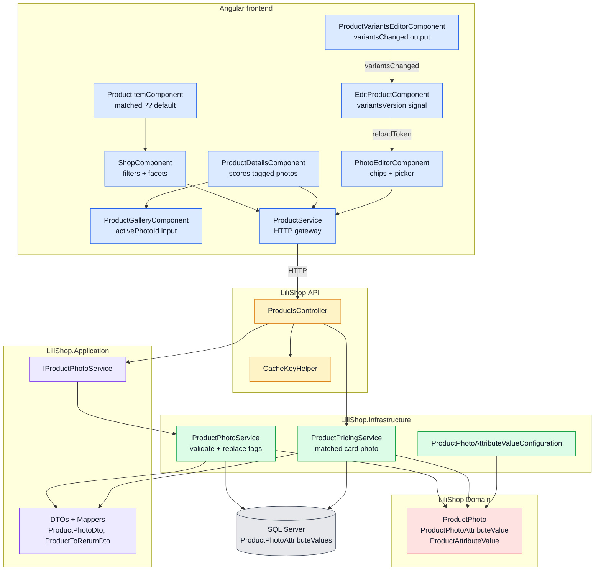
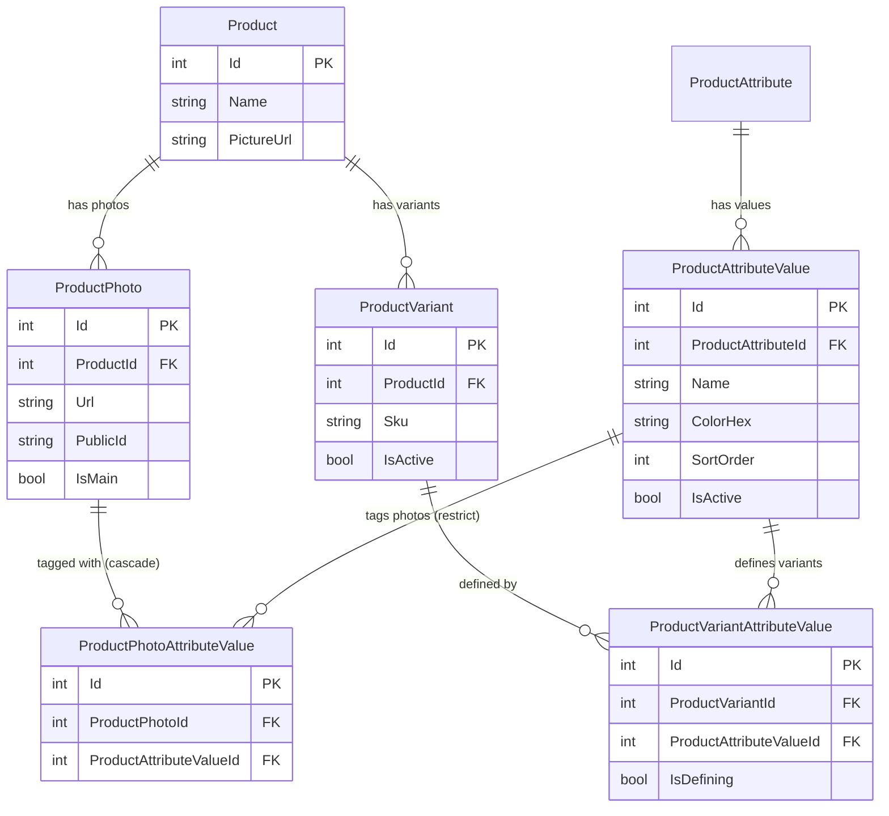
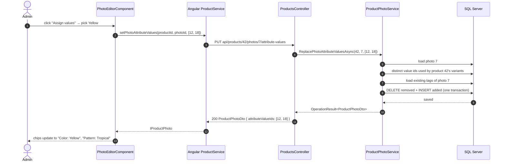
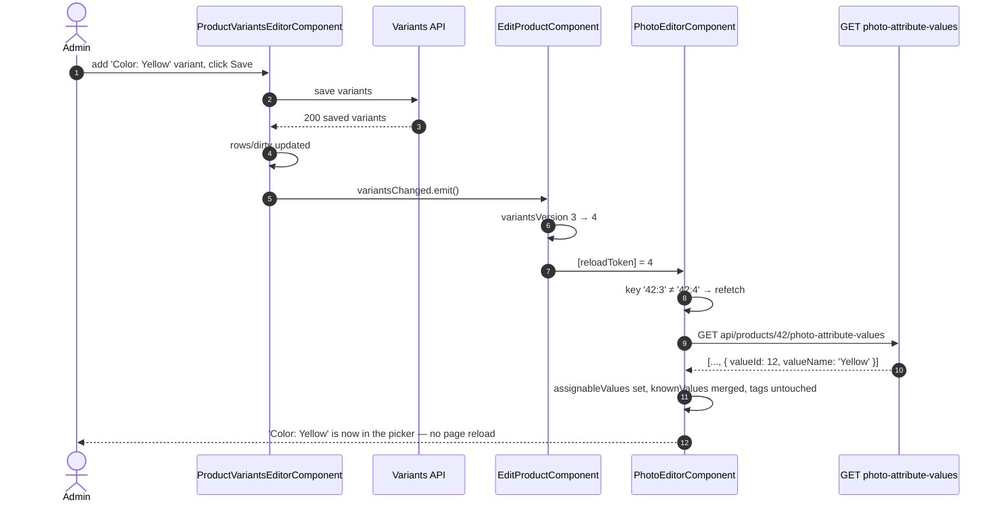
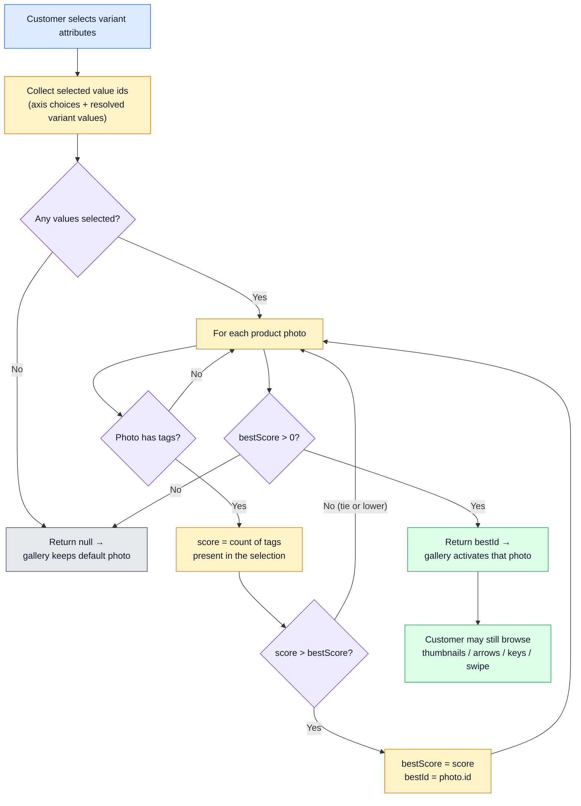
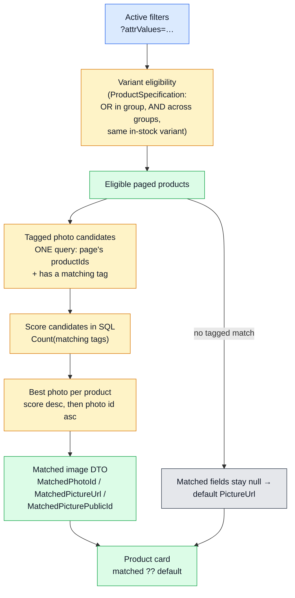
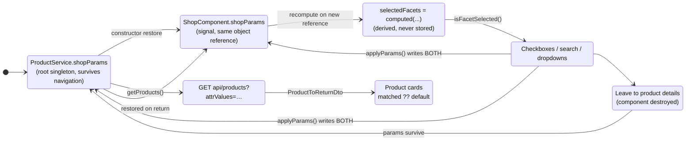
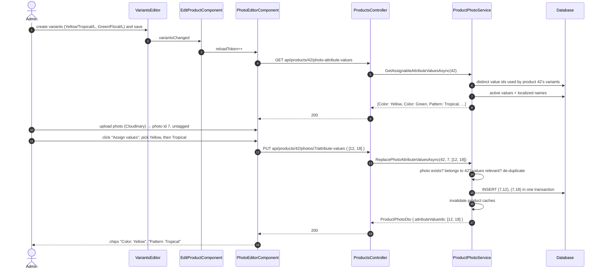
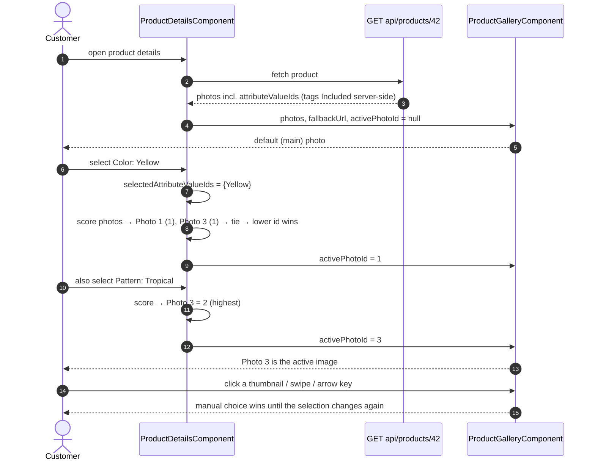
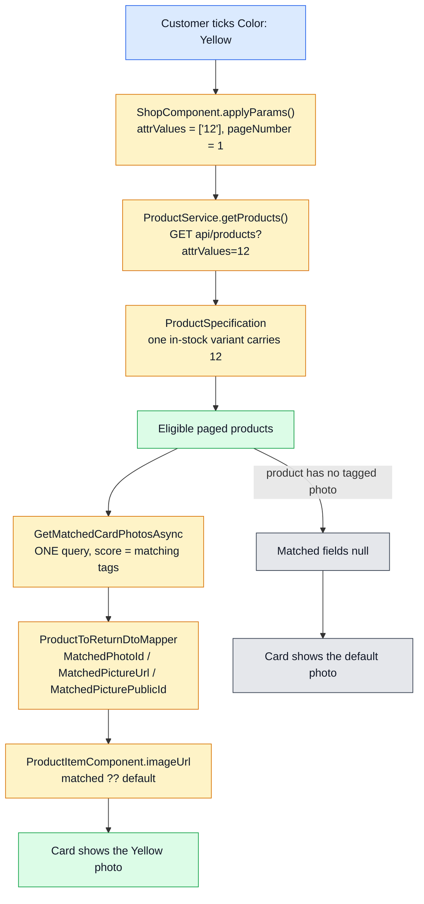

# Product Photo Attribute Tagging and Filter-Aware Images — Developer Guide

This guide explains one complete LiliShop feature from end to end: **product photos can be
associated with existing product attribute values**, and the shop uses those associations to show
the *right* picture instead of always showing the default one.

It is written for a developer who has never worked on LiliShop before. Every technical term is
explained before it is used heavily, every code excerpt is taken from the current `main` branch of
the two repositories, and each excerpt is followed by an explanation of what it does and why it was
designed that way.

> **Repositories covered**
> * Backend: `jahanalem/LiliShop-backend-dotnet` (ASP.NET Core, Entity Framework Core, SQL Server)
> * Frontend: `jahanalem/LiliShop-frontend-angular` (Angular, standalone components, signals)
>


---

## Table of contents

1. [Introduction](#1-introduction)
2. [Mental model](#2-mental-model)
3. [High-level architecture](#3-high-level-architecture)
4. [Database changes](#4-database-changes)
5. [Domain model](#5-domain-model)
6. [EF Core configuration](#6-ef-core-configuration)
7. [Application DTOs](#7-application-dtos)
8. [Mapping](#8-mapping)
9. [ProductPhotoService](#9-productphotoservice)
10. [API endpoints](#10-api-endpoints)
11. [Admin photo editor](#11-admin-photo-editor)
12. [Synchronization after variant changes](#12-synchronization-after-variant-changes)
13. [Product details gallery and slider](#13-product-details-gallery-and-slider)
14. [Shop filtering and matched card images](#14-shop-filtering-and-matched-card-images)
15. [Product card behavior](#15-product-card-behavior)
16. [Shop filter-state consistency](#16-shop-filter-state-consistency)
17. [Cache-key normalization](#17-cache-key-normalization)
18. [End-to-end flows](#18-end-to-end-flows)
19. [Testing strategy](#19-testing-strategy)
20. [Design decisions](#20-design-decisions)
21. [Limitations and future improvements](#21-limitations-and-future-improvements)
22. [Complete source-file map](#22-complete-source-file-map)
23. [Glossary](#23-glossary)
24. [Summary](#24-summary)

---

## 1. Introduction

### 1.1 Vocabulary first

Four LiliShop concepts appear on almost every page of this guide.

| Term | Meaning |
| --- | --- |
| **Product** | The thing you see on a card: "Summer Shirt". |
| **ProductAttribute** | A property that products can be described by: `Color`, `Pattern`, `Size`. |
| **ProductAttributeValue** | One concrete value of an attribute: `Color: Yellow`, `Pattern: Tropical`. |
| **ProductVariant** | One purchasable combination with its own SKU, price and stock: "Yellow / Tropical / L". |

A variant is linked to its attribute values through the join table
`ProductVariantAttributeValue`. That link is what makes a product *findable*: filtering the shop by
`Color: Yellow` returns products that have a yellow variant in stock.

A **ProductPhoto** is one uploaded image of a product. Before this feature, a photo was just a URL
plus an `IsMain` flag. Nothing connected a photo to the attribute values it actually shows.

### 1.2 The business problem

A single product often has several colors and patterns, and one photo per look. The shop card,
however, always showed the product's default (main) image. That produced a confusing result:

```text
Customer filters by Yellow
→ The product correctly appears because it has a Yellow variant
→ The card displays the default Red photo
```

The result list was technically correct — the product *does* have a yellow variant — but visually
wrong. The customer asked for yellow and saw red. The same problem existed on the product details
page: choosing "Yellow" in the variant selector left the gallery on whichever photo happened to be
the main one.

### 1.3 What structured photo tags solve

The feature adds a way to say: *this photo shows Yellow and Tropical*.

```text
Photo A
- Color: Yellow
- Pattern: Tropical
```

These are **not free-form text tags**. The UI shows them as removable chips, which look a little
like hashtags, but the database stores a structured relationship to existing `ProductAttributeValue`
records. `Yellow` on a photo is the *same row* as `Yellow` on a variant — same id, same localized
name, same color swatch.

With that information available, the new behavior is:

```text
Customer filters by Yellow
→ The product qualifies through variant filtering
→ The backend selects a photo tagged Yellow
→ The card displays the Yellow photo
```

### 1.4 Where the feature is used

1. **Product details page** — selecting variant attributes automatically activates the most relevant
   product photo in the existing gallery.
2. **Shop page** — filtering by attributes such as `Color` or `Pattern` makes each product card
   display a matching photo instead of always displaying the default image.
3. **Admin product editor** — an administrator assigns the values to each photo.

### 1.5 The rule that must never be broken

> [!IMPORTANT]
> **Variant filtering decides whether a product is eligible to appear in the result list. Photo
> matching only decides which image represents an already eligible product.**
>
> Photo tags must not change product eligibility and must not replace the existing same-variant
> filtering logic. Tagging a photo `Yellow` can never pull a product into a `Yellow` result list if
> none of its variants is yellow.

This separation is the backbone of the whole design. It is enforced in code (the eligibility query
and the photo-matching query are completely separate steps) and it is covered by a dedicated test,
`PhotoTagsDoNotChangeProductEligibility`.

### 1.6 The final user experience

* An administrator uploads photos, then clicks **Assign values** under a photo and picks
  `Color: Yellow` and `Pattern: Tropical` from a searchable list. Chips appear immediately.
* A customer on the product details page picks "Yellow" and "Tropical"; the gallery jumps to the
  photo that shows exactly that. They can still browse the gallery manually afterwards.
* A customer filtering the shop by "Yellow" sees yellow photos on the cards. Products without any
  tagged photo simply keep their default image — nothing breaks, nothing looks empty.

---

## 2. Mental model

A product now has **two independent sets** of attribute-value links.

```text
Product
├── ProductVariants
│   └── ProductAttributeValues     ← what is purchasable (eligibility)
└── ProductPhotos
    └── Assigned ProductAttributeValues   ← what is shown (presentation)
```

Rules of the photo side:

* One photo can have **several** attribute-value tags (`Yellow` **and** `Tropical`).
* One attribute value can be assigned to **several** photos (two photos can both be `Yellow`).
* A photo **may remain untagged**. This is the default, and it is perfectly valid.
* Only **existing structured values** are used. There is no way to invent a tag.
* The relationship is therefore **many-to-many**, implemented with a join entity.
* **Existing photos remain valid** — they simply have an empty tag set.
* **Localized names are resolved from the localization system** and are *not* stored in the join
  table. The table stores ids only.

### 2.1 A worked example

A shirt exists in these attribute values:

* `Color: Red`
* `Color: Yellow`
* `Pattern: Tropical`
* `Pattern: Floral`

Its variants might be "Red / Floral / M" and "Yellow / Tropical / L". Its four photos could be
tagged like this:

| Photo | Tags | Meaning |
| --- | --- | --- |
| Photo 1 | `Color: Red` | a red shot, pattern not visible |
| Photo 2 | `Color: Yellow`, `Pattern: Tropical` | the yellow tropical look |
| Photo 3 | `Pattern: Floral` | a close-up of the floral print |
| Photo 4 | *(none)* | a studio shot of the folded shirt |

Notice that `Color: Yellow` is used both by a variant (so the product is findable under Yellow) and
by Photo 2 (so Photo 2 can represent the product under a Yellow filter). It is the **same
`ProductAttributeValue` row** in both cases. That is what "structured" means here.

---

## 3. High-level architecture

LiliShop's backend follows a layered (clean-architecture-style) structure. Each layer has one job.

| Layer / component | Responsibility in this feature |
| --- | --- |
| **Domain** (`LiliShop.Domain`) | The entities and their relationships: the new `ProductPhotoAttributeValue` join entity and the new `ProductPhoto.AttributeValueTags` collection. No database or HTTP knowledge. |
| **Application** (`LiliShop.Application`) | Contracts and shapes: the `IProductPhotoService` interface, the DTOs sent over HTTP, and the mappers that turn entities into DTOs. |
| **Infrastructure** (`LiliShop.Infrastructure`) | The real work: EF Core configuration and migrations, `ProductPhotoService` (validate + save tags), `ProductPricingService` (choose the matched card photo), `CacheKeyHelper` (cache-key normalization). |
| **API** (`LiliShop.API`) | `ProductsController` exposes two endpoints and maps service results to HTTP status codes. |
| **Angular `ProductService`** | The single HTTP gateway on the client: `getAssignablePhotoAttributeValues()` and `setPhotoAttributeValues()`, plus the shared `shopParams` filter state. |
| **Admin `PhotoEditorComponent`** | Renders photos, their assigned chips, and the searchable picker; saves through the replacement endpoint. |
| **`ProductVariantsEditorComponent`** | Emits `variantsChanged` after a variant change has been *persisted*, because the assignable values depend on variants. |
| **`EditProductComponent`** | The parent that relays that event to the photo editor by bumping a `variantsVersion` counter. |
| **`ProductDetailsComponent`** | Scores the loaded photos against the customer's current selection and feeds the winner into the gallery's `activePhotoId` input. |
| **`ProductItemComponent`** (card) | Renders "matched picture ?? default picture". |
| **`ShopComponent`** | Owns the filter UI, and derives the facet checkbox state from the applied query params so the two can never disagree. |
| **`CacheKeyHelper`** | Normalizes `attrValues` into the response cache key so equivalent requests share an entry and different ones do not. |
| **Backend tests** (`Lili.Shop.Tests`) | SQLite integration tests for assignment/validation and matched-photo scoring, plus cache-key unit tests. |
| **Frontend tests** (`*.spec.ts`) | Component specs for the chip editor, the variant-refresh handshake, gallery matching, card image choice and filter-state persistence. |



---

## 4. Database changes

### 4.1 One new table, nothing else

The entire persistence change is a single join table: `ProductPhotoAttributeValues`. No existing
column was altered, renamed or dropped.

**Source:** `Main/LiliShop.Infrastructure/Data/Migrations/20260724120000_AddProductPhotoAttributeValues.cs`

```csharp
protected override void Up(MigrationBuilder migrationBuilder)
{
    migrationBuilder.CreateTable(
        name: "ProductPhotoAttributeValues",
        columns: table => new
        {
            Id = table.Column<int>(type: "int", nullable: false)
                .Annotation("SqlServer:Identity", "1, 1"),
            ProductPhotoId = table.Column<int>(type: "int", nullable: false),
            ProductAttributeValueId = table.Column<int>(type: "int", nullable: false),
            CreatedDate = table.Column<DateTimeOffset>(type: "datetimeoffset", nullable: true),
            ModifiedDate = table.Column<DateTimeOffset>(type: "datetimeoffset", nullable: true)
        },
        constraints: table =>
        {
            table.PrimaryKey("PK_ProductPhotoAttributeValues", x => x.Id);
            table.ForeignKey(
                name: "FK_ProductPhotoAttributeValues_ProductAttributeValues_ProductAttributeValueId",
                column: x => x.ProductAttributeValueId,
                principalTable: "ProductAttributeValues",
                principalColumn: "Id",
                onDelete: ReferentialAction.Restrict);
            table.ForeignKey(
                name: "FK_ProductPhotoAttributeValues_ProductPhotos_ProductPhotoId",
                column: x => x.ProductPhotoId,
                principalTable: "ProductPhotos",
                principalColumn: "Id",
                onDelete: ReferentialAction.Cascade);
        });

    migrationBuilder.CreateIndex(
        name: "IX_ProductPhotoAttributeValues_ProductAttributeValueId_ProductPhotoId",
        table: "ProductPhotoAttributeValues",
        columns: new[] { "ProductAttributeValueId", "ProductPhotoId" });

    migrationBuilder.CreateIndex(
        name: "IX_ProductPhotoAttributeValues_ProductPhotoId_ProductAttributeValueId",
        table: "ProductPhotoAttributeValues",
        columns: new[] { "ProductPhotoId", "ProductAttributeValueId" },
        unique: true);
}
```

Reading it piece by piece:

* **Columns.** `Id` is a surrogate primary key (`int IDENTITY`). `ProductPhotoId` and
  `ProductAttributeValueId` are the two sides of the relationship. `CreatedDate` / `ModifiedDate`
  come from LiliShop's `BaseEntity` and are audit columns every entity has.
* **Primary key.** `PK_ProductPhotoAttributeValues` on `Id`. A surrogate key (rather than a composite
  key on the two foreign keys) keeps the entity consistent with the rest of the domain, where
  `BaseEntity.Id` is assumed everywhere by the generic repository.
* **Foreign keys.** One to `ProductPhotos`, one to `ProductAttributeValues`.
* **Cascade behavior.** Deleting a photo deletes its tags (`ReferentialAction.Cascade`). Tags have no
  meaning without their photo.
* **Restrict behavior.** Deleting an attribute value that is still tagged is **blocked**
  (`ReferentialAction.Restrict`). This mirrors `ProductVariantAttributeValue`, and it also keeps this
  table on a *single* cascade path — SQL Server rejects a table reachable by two cascade paths.
* **Indexes.** Two composite indexes, described in the next subsection.
* **Uniqueness.** `(ProductPhotoId, ProductAttributeValueId)` is unique, so the same value can never
  be assigned twice to the same photo. This is a database-level guarantee, not only an application
  check.

`Down` simply drops the table, so the migration is fully reversible.

### 4.2 Why the two indexes exist

The two indexes are deliberately mirror images of each other, because the feature asks two opposite
questions:

| Index | Question it answers | Used by |
| --- | --- | --- |
| `(ProductPhotoId, ProductAttributeValueId)` — unique | "Which values does *this photo* have?" | Assignment: loading and diffing a photo's current tags. |
| `(ProductAttributeValueId, ProductPhotoId)` | "Which photos carry *this value*?" | Photo matching: scoring candidate photos for the active filters. |

The unique index doubles as the lookup index for the assignment path, so no third index is needed.

### 4.3 Backward compatibility

* No existing photo data needed to be migrated. A photo with no rows in the new table has an empty
  tag set, which is exactly the pre-feature behavior.
* **Untagged photos remain valid** by design: the matching logic treats "no tagged photo" as "use the
  default image", which is the old behavior.
* Products without variants have no assignable values at all, so nothing about them changes.
* `PictureUrl` and `PicturePublicId` keep their original meaning. The matched image travels in
  *additional* fields (section 7).

### 4.4 The generated Designer file

Every EF Core migration comes with a `*.Designer.cs` file — here
`20260724120000_AddProductPhotoAttributeValues.Designer.cs`. It is **generated**, roughly 2,400 lines
long, and it contains a complete snapshot of the model *as of that migration*: every entity, every
property, every relationship in the whole database, not just the new table. EF Core uses it to
compute the difference when the next migration is created.

You never edit it by hand, and it is not reproduced here. The only part relevant to this feature is
the same entity block that also landed in the model snapshot, shown in section 6.3.

### 4.5 Entity-relationship diagram



The diagram makes the symmetry visible: `ProductPhotoAttributeValue` sits next to
`ProductVariantAttributeValue`, both pointing at the same `ProductAttributeValue` catalog. One
governs presentation, the other governs purchasability.

---

## 5. Domain model

### 5.1 The new join entity

**Source:** `Main/LiliShop.Domain/Entities/ProductPhotoAttributeValue.cs`

```csharp
/// <summary>
/// A "structured hashtag" on a product photo: it links one <see cref="ProductPhoto"/> to one
/// existing <see cref="ProductAttributeValue"/> (e.g. Color=Yellow, Pattern=Tropical). Unlike a
/// variant's defining values these are pure display metadata — they never affect which variant
/// a customer buys or whether a product is eligible for a filter. They only steer which photo
/// best represents the product for the currently selected/filtered attribute values.
///
/// The pair (ProductPhotoId, ProductAttributeValueId) is unique. Localized names are resolved
/// through the existing translation pipeline from <see cref="ProductAttributeValueId"/>; no
/// display text is ever stored here.
/// </summary>
public class ProductPhotoAttributeValue : BaseEntity
{
    public int ProductPhotoId { get; set; }

    [JsonIgnore]
    public virtual ProductPhoto ProductPhoto { get; set; } = null!;

    public int ProductAttributeValueId { get; set; }
    public virtual ProductAttributeValue ProductAttributeValue { get; set; } = null!;
}
```

Every member explained:

* `BaseEntity` supplies `Id`, `CreatedDate` and `ModifiedDate` — the audit shape every LiliShop
  entity has.
* `ProductPhotoId` — foreign key to the tagged photo.
* `ProductPhoto` — the navigation property back to that photo. It is marked `[JsonIgnore]` so that
  serializing a photo's tags can never loop back into the photo and produce a cycle.
* `ProductAttributeValueId` — foreign key to the value. **This is the only piece of meaning the row
  carries.** No name, no color, no language.
* `ProductAttributeValue` — the navigation property to the catalog row, used when the service needs
  the value's attribute, name or color hex.
* `virtual` marks the navigations as overridable, matching the convention used across the domain.

Because the row stores only an id, the label shown to a German user and the label shown to an English
user come from the same row through the translation pipeline. Nothing has to be re-tagged when a
translation changes.

### 5.2 The change to `ProductPhoto`

**Source:** `Main/LiliShop.Domain/Entities/ProductPhoto.cs`

```csharp
public class ProductPhoto : BaseEntity
{
    public string Url { get; set; } = null!;
    public bool IsMain { get; set; }
    public string PublicId { get; set; } = null!;
    public int ProductId { get; set; }
    public virtual Product Product { get; set; } = null!;

    /// <summary>
    /// The attribute values ("structured hashtags") assigned to this photo. Empty for untagged
    /// photos, which is the default for every existing photo. Deleting the photo cascades these
    /// away (see <c>ProductPhotoAttributeValueConfiguration</c>).
    /// </summary>
    public virtual ICollection<ProductPhotoAttributeValue> AttributeValueTags { get; set; } = new List<ProductPhotoAttributeValue>();
}
```

Exactly one property was added: `AttributeValueTags`. It is initialized to an empty list, so a photo
loaded without its tags behaves like an untagged photo rather than throwing a
`NullReferenceException`. Nothing else about `ProductPhoto` changed — `Url`, `IsMain`, `PublicId` and
the Cloudinary flow are untouched.

### 5.3 Why a join entity and not something simpler?

Four alternatives were considered and rejected.

**Free-form strings (`"#yellow, #tropical"`).** Cheap to write, expensive forever after. Filtering
would need string matching, localization would be impossible (is it "Yellow" or "Gelb"?), typos would
silently break matching, and there would be no referential integrity between a photo's "yellow" and a
variant's `Color: Yellow`.

**A JSON array of ids in a column.** Better than strings, but the database can no longer index or
join it. The shop-card query in section 14 filters and counts matches *inside SQL Server*; with JSON
that becomes either a table scan with JSON functions or an in-memory loop over the whole page. There
is also no foreign key, so a deleted attribute value would leave dangling ids.

**A direct `ProductVariantId` on the photo.** This looks natural — "this photo shows this variant" —
but it collapses under real data. A product with 3 colors × 4 patterns × 5 sizes has 60 variants and
maybe 6 photos. A yellow-tropical photo is correct for *all five sizes*, so pointing at one variant
would be wrong for four of them, and pointing at each would need duplicate rows. Worse, the customer
filtering by `Color: Yellow` has not chosen a size yet, so there is no variant to match against.
Attribute values are the right granularity: they are the level at which customers actually filter.

**Duplicate photos, one per complete variant combination.** Storage and upload cost multiply, the
gallery fills with visually identical images, and every re-shoot has to be re-uploaded 60 times.

The many-to-many join entity is the only option that keeps localization centralized, integrity
enforced by the database, matching computable in SQL, and one photo reusable across many variants.

---

## 6. EF Core configuration

### 6.1 The configuration class

EF Core needs to be told how the new entity maps to the table. LiliShop does this with
`IEntityTypeConfiguration<T>` classes.

**Source:** `Main/LiliShop.Infrastructure/Data/Config/ProductPhotoAttributeValueConfiguration.cs`

```csharp
public class ProductPhotoAttributeValueConfiguration : IEntityTypeConfiguration<ProductPhotoAttributeValue>
{
    public void Configure(EntityTypeBuilder<ProductPhotoAttributeValue> builder)
    {
        // Deleting a photo removes its tags (they are meaningless without the photo).
        builder.HasOne(x => x.ProductPhoto)
            .WithMany(p => p.AttributeValueTags)
            .HasForeignKey(x => x.ProductPhotoId)
            .OnDelete(DeleteBehavior.Cascade);

        // Restrict, mirroring ProductVariantAttributeValue: an attribute value that is actually in
        // use must not silently disappear. Because only values used by the product's variants are
        // assignable in the first place, any tagged value is already variant-protected from deletion,
        // so a photo tag can never become a dangling reference. (Restrict also keeps this table to a
        // single cascade path — via the photo — avoiding SQL Server multiple-cascade-path errors.)
        builder.HasOne(x => x.ProductAttributeValue)
            .WithMany()
            .HasForeignKey(x => x.ProductAttributeValueId)
            .OnDelete(DeleteBehavior.Restrict);

        // "A photo may have several tags; multiple photos may share a tag; the same value cannot be
        // assigned twice to one photo."
        builder.HasIndex(x => new { x.ProductPhotoId, x.ProductAttributeValueId })
            .IsUnique();

        // Match entry point: "photos tagged with value X" — used by the shop-card photo selection.
        builder.HasIndex(x => new { x.ProductAttributeValueId, x.ProductPhotoId });
    }
}
```

What each call does:

* **Key.** No `HasKey` call is needed: `BaseEntity.Id` is discovered by EF Core's convention as the
  primary key, and SQL Server makes it an identity column.
* **Photo relationship.** `HasOne(...).WithMany(p => p.AttributeValueTags)` wires the entity to the
  collection added in section 5.2, making it a real bidirectional navigation. `Cascade` means
  `DELETE FROM ProductPhotos` also removes the tag rows.
* **Value relationship.** `WithMany()` with no argument is deliberate: `ProductAttributeValue` gets
  **no** collection of photo tags. Nothing in the code needs to walk from a value to all photos that
  use it, and leaving the navigation out keeps the popular catalog entity small and prevents
  accidental large loads.
* **Delete behavior.** `Restrict` on the value side. Combined with the rule that only
  variant-backed values are assignable, a tagged value is always also referenced by a variant, so it
  is already protected from deletion. The tag can never dangle.
* **Uniqueness.** `IsUnique()` on `(ProductPhotoId, ProductAttributeValueId)` enforces the
  "no duplicates" rule in the database, so a race between two admin requests cannot create a double
  tag even if both pass the application-level check.
* **Second index.** `(ProductAttributeValueId, ProductPhotoId)` is the reverse lookup.

### 6.2 How the indexes help the two query shapes

The photo-matching query (section 14) filters with
`ph.AttributeValueTags.Any(t => filterValueIds.Contains(t.ProductAttributeValueId))` and projects
`Count(...)` over the same set. Both translate into subqueries over the join table keyed by
`ProductAttributeValueId` — served directly by the second index, and because `ProductPhotoId` is the
included second column, the index alone answers the query (a covering index) without touching the
table.

The assignment query loads `t.ProductPhotoId == photoId`, which is the leading column of the unique
index. Both hot paths are index seeks, not scans.

### 6.3 Registration and the model snapshot

**Source:** `Main/LiliShop.Infrastructure/Data/ShopDbContext.cs`

```csharp
public DbSet<ProductVariantAttributeValue> ProductVariantAttributeValues { get; set; }
public DbSet<ProductPhotoAttributeValue> ProductPhotoAttributeValues { get; set; }
```

The `DbSet` makes the entity queryable directly (used by the tests) and part of the model. The
configuration class itself needs no manual registration, because the context picks up every
`IEntityTypeConfiguration` in the assembly:

```csharp
modelBuilder.ApplyConfigurationsFromAssembly(Assembly.GetExecutingAssembly());
```

**Source:** `Main/LiliShop.Infrastructure/Data/Migrations/ShopDbContextModelSnapshot.cs`

```csharp
modelBuilder.Entity("LiliShop.Domain.Entities.ProductPhotoAttributeValue", b =>
    {
        // Id / CreatedDate / ModifiedDate omitted here for focus.
        b.Property<int>("ProductAttributeValueId")
            .HasColumnType("int");

        b.Property<int>("ProductPhotoId")
            .HasColumnType("int");

        b.HasKey("Id");

        b.HasIndex("ProductAttributeValueId", "ProductPhotoId");

        b.HasIndex("ProductPhotoId", "ProductAttributeValueId")
            .IsUnique();

        b.ToTable("ProductPhotoAttributeValues");
    });
```

The snapshot is EF Core's record of the *current* model. It also gained the two relationship blocks
(`Cascade` on the photo, `Restrict` on the value) and one line adding the `AttributeValueTags`
navigation to `ProductPhoto`. Like the Designer file it is generated; it is shown here only because
it is the clearest single place to verify that the intended keys, indexes and delete behaviors really
reached the model.

---

## 7. Application DTOs

A **DTO** (data transfer object) is a plain class describing the exact shape of data crossing the
HTTP boundary. Entities stay on the server; DTOs travel.

Three DTOs are new and two existing ones grew.

### 7.1 `AssignPhotoAttributeValuesDto` — the request body

**Source:** `Main/LiliShop.Application/DTOs/Products/AssignPhotoAttributeValuesDto.cs`

```csharp
/// <summary>
/// Replacement-style payload for assigning attribute values to a photo:
/// the given set becomes the photo's complete tag set (add + remove in one call).
/// An empty/null list clears all tags.
/// </summary>
public class AssignPhotoAttributeValuesDto
{
    public List<int> AttributeValueIds { get; set; } = new();
}
```

One field: the complete desired set of value ids. Not "values to add", not "values to remove" — the
final state. Section 9.3 explains why that matters.

### 7.2 `PhotoAttributeValueOptionDto` — the available values

**Source:** `Main/LiliShop.Application/DTOs/Products/PhotoAttributeValueOptionDto.cs`

```csharp
/// <summary>
/// One assignable attribute value for a product's photos, i.e. a value that is actually used by
/// one or more of the product's variants ("relevant to the product"). Carries enough context
/// (attribute name + value name) for the admin UI to render an unambiguous chip like
/// "Size: Large" rather than a bare "#Large". Names are localized by the server.
/// </summary>
public class PhotoAttributeValueOptionDto
{
    public int AttributeId { get; set; }
    public required string AttributeName { get; set; }
    public int DisplayOrder { get; set; }

    public int ValueId { get; set; }
    public required string ValueName { get; set; }
    public string? ColorHex { get; set; }
    public int SortOrder { get; set; }
}
```

* `AttributeId` / `AttributeName` — the group the value belongs to ("Color"), already localized.
* `DisplayOrder` — the attribute's ordering, so `Color` groups sort before `Size` in the picker.
* `ValueId` — the id the client sends back on save. The only field the database cares about.
* `ValueName` — the localized value label ("Yellow").
* `ColorHex` — optional, present for color-swatch attributes, letting the UI render a colored dot.
* `SortOrder` — the value's ordering inside its attribute.

The DTO exists so the admin UI can render "Color: Yellow" instead of an ambiguous "#Yellow" without
having to fetch and join the full attribute catalog itself.

### 7.3 `ProductCardPhotoMatch` — the internal match result

**Source:** `Main/LiliShop.Application/DTOs/Products/ProductCardPhotoMatch.cs`

```csharp
/// <summary>
/// The winning photo for one product when attribute-value filters are active in the shop list.
/// Produced by the matched-photo query and handed to the mapper, which resolves the final URL.
/// </summary>
public sealed record ProductCardPhotoMatch(int PhotoId, string Url, string? PublicId);
```

This one never leaves the server. It is the small, immutable hand-off from the matching query in
`ProductPricingService` to the mapper. A `record` is used because it is pure data with value
semantics.

### 7.4 `ProductPhotoDto` — the photo shape, extended

**Source:** `Main/LiliShop.Application/DTOs/ProductPhotoDto.cs`

```csharp
public class ProductPhotoDto
{
    public int Id { get; set; }
    public required string Url { get; set; }
    public bool IsMain { get; set; }
    // Mappers coalesce a missing (seeded) PublicId to string.Empty, so this stays non-null.
    public required string PublicId { get; set; }

    /// <summary>
    /// Ids of the attribute values assigned to this photo (Plan B "structured hashtags").
    /// Empty for untagged photos. Names are resolved on the client from the attribute catalog /
    /// assignable-values endpoint — only ids travel here so localization stays centralized.
    /// </summary>
    public List<int> AttributeValueIds { get; set; } = new();
}
```

One added field: `AttributeValueIds`. Ids only — the names are already available on the client from
the assignable-values endpoint, so sending them again on every photo would duplicate localized text
in every response.

### 7.5 `ProductToReturnDto` — the card and details shape, extended

**Source:** `Main/LiliShop.Application/DTOs/Products/ProductToReturnDto.cs`

```csharp
    public required string PictureUrl { get; set; }
    // Null for seeded photos that were never uploaded to Cloudinary.
    public string? PicturePublicId { get; set; }

    // ... other product fields omitted here for focus.

    /// <summary>
    /// Plan B: when attribute-value filters are active in the shop list, this is the photo whose
    /// tags best match those filters (highest number matched, then display order, then id). Null
    /// when no filter is active or no tagged photo matches — the card then keeps using
    /// <see cref="PictureUrl"/>/<see cref="PicturePublicId"/>. The meaning of the default picture
    /// is unchanged; these are a purely additive, "matched ?? default" hint for the card image.
    /// </summary>
    public int? MatchedPhotoId { get; set; }
    public string? MatchedPictureUrl { get; set; }
    public string? MatchedPicturePublicId { get; set; }
```

Three added nullable fields. All three are `null` unless a filter is active *and* a tagged photo
matched.

### 7.6 Which object is used where

| Purpose | Object |
| --- | --- |
| Assignment request body | `AssignPhotoAttributeValuesDto` |
| Available (assignable) values for the picker | `IReadOnlyList<PhotoAttributeValueOptionDto>` |
| Assigned tags of a photo | `ProductPhotoDto.AttributeValueIds` |
| Matched product-card image info | `ProductToReturnDto.MatchedPhotoId` / `MatchedPictureUrl` / `MatchedPicturePublicId` |
| Fallback to the normal product image | `ProductToReturnDto.PictureUrl` / `PicturePublicId` (unchanged) |
| Internal query → mapper hand-off | `ProductCardPhotoMatch` |

---

## 8. Mapping

**Mappers** convert entities into DTOs. Two of them changed.

### 8.1 `ProductPhotoMapper`

**Source:** `Main/LiliShop.Application/Mappers/ProductPhotoMapper.cs`

```csharp
return new ProductPhotoDto
{
    Id = photo.Id,
    Url = photo.Url ?? string.Empty,
    IsMain = photo.IsMain,
    PublicId = photo.PublicId ?? string.Empty,
    // Empty when the tags were not Included (lazy loading is off, so this never triggers a
    // query); populated on the product-details / admin paths that do Include them.
    AttributeValueIds = photo.AttributeValueTags?
        .Select(t => t.ProductAttributeValueId)
        .Distinct()
        .OrderBy(id => id)
        .ToList() ?? new List<int>()
};
```

The mapper projects the tag rows down to their value ids. `Distinct()` is defensive (the unique index
already prevents duplicates) and `OrderBy(id => id)` makes the response **deterministic** — the same
photo always serializes its tags in the same order, which keeps client-side comparisons and test
assertions stable.

The comment about `Include` matters: lazy loading is disabled in this codebase, so if a caller did not
explicitly `Include` the tags, the collection is empty rather than triggering a hidden per-photo
query. Untagged and not-loaded therefore both produce an empty list, and the shop-list path pays
nothing for a feature it does not use.

### 8.2 `ProductToReturnDtoMapper`

The list mapper gained an optional dictionary of matches.

**Source:** `Main/LiliShop.Application/Mappers/ProductToReturnDtoMapper.cs`

```csharp
public async Task<List<ProductToReturnDto>> MapAllAsync(
    IReadOnlyCollection<Product> products,
    IReadOnlyDictionary<int, ProductCardPhotoMatch>? matchedPhotos = null,
    CancellationToken cancellationToken = default)
{
    // Translation / type / brand lookups omitted here for focus.

    return products
        .Select(p =>
        {
            var dto = Map(p, translations.GetValueOrDefault(p.Id), typeNames, brandNames);
            if (matchedPhotos is not null && matchedPhotos.TryGetValue(p.Id, out var match))
            {
                dto.MatchedPhotoId = match.PhotoId;
                dto.MatchedPictureUrl = ResolvePictureUrl(match.Url);
                dto.MatchedPicturePublicId = string.IsNullOrWhiteSpace(match.PublicId) ? null : match.PublicId;
            }
            return dto;
        })
        .ToList();
}
```

Reading it:

* The parameter is **optional and nullable**. Every existing call site keeps working unchanged; only
  the filtered shop-list path passes a dictionary.
* `TryGetValue` means a product without a match is simply skipped, leaving the three matched fields
  `null`.
* `ResolvePictureUrl` is the *same* helper used for the default `PictureUrl`, so a matched image gets
  identical treatment: relative URLs are prefixed with the configured `ApiUrl`, absolute ones are
  left alone.
* An empty `PublicId` is normalized to `null`, so the client's `||` fallback chain (section 15) skips
  it cleanly.

The single-product overload passes `matchedPhotos: null` explicitly — product details never needs a
"matched" photo, because the client does its own scoring against the customer's live selection.

The photo projection inside the same mapper mirrors `ProductPhotoMapper`:

```csharp
// Empty unless AttributeValueTags were Included (product-details / admin paths).
// Lazy loading is disabled, so this never causes a per-photo query on the list.
AttributeValueIds = p.AttributeValueTags?
    .Select(t => t.ProductAttributeValueId)
    .Distinct()
    .OrderBy(id => id)
    .ToList() ?? new List<int>()
```

### 8.3 What the backend returns, and the fallback

| Information | Field(s) |
| --- | --- |
| Normal/default photo data | `PictureUrl`, `PicturePublicId`, `ProductPhotos[]` |
| Assigned attribute values | `ProductPhotos[].attributeValueIds` |
| Matched photo data | `MatchedPhotoId`, `MatchedPictureUrl`, `MatchedPicturePublicId` |

The client rule is one line of logic:

```text
matched image ?? default image
```

### 8.4 Why `PictureUrl` was not overwritten

Overwriting `PictureUrl` with the matched photo would have been fewer lines of code. It was rejected
because:

* **`PictureUrl` has an established meaning** — "the product's default/main image" — and other
  consumers (notifications, admin screens, structured data, anything reading the same DTO) rely on
  it. Silently changing its meaning depending on query parameters would be a trap.
* **Debuggability.** With separate fields you can see, in one response, both what the product's
  default image is *and* which photo the matcher picked. If matching misbehaves, the cause is
  visible.
* **Safety of the fallback.** The client's fallback chain needs both values present at once. If the
  default had been overwritten there would be nothing to fall back to.
* **Cache correctness.** A response where `PictureUrl` depends on `attrValues` is much easier to
  serve to the wrong request. Keeping the default stable makes the filter-dependent part explicit
  and clearly named.

---

## 9. ProductPhotoService

### 9.1 The interface

**Source:** `Main/LiliShop.Application/Interfaces/Services/IProductPhotoService.cs`

```csharp
Task<ProductPhoto?> GetByIdAsync(int id);
Task<IReadOnlyList<ProductPhoto>> GetByProductIdAsync(int productId);
Task<ProductPhoto?> GetCurrentMainPhotoAsync(int productId);
Task<OperationResult> SetMainPhotoAsync(int photoId);
Task<OperationResult> DeletePhotoAsync(int photoId, bool force = false);

/// <summary>
/// The attribute values that may be assigned to this product's photos: every value used by one
/// or more of the product's variants ("relevant to the product"), with localized names for the
/// admin chip picker.
/// </summary>
Task<OperationResult<IReadOnlyList<PhotoAttributeValueOptionDto>>> GetAssignableAttributeValuesAsync(int productId);

/// <summary>
/// Replaces a photo's attribute-value tags with the given set (add + remove in one call).
/// Validates that the photo belongs to the product and that every value is relevant to it,
/// de-duplicates, then returns the updated photo. An empty set clears the tags.
/// </summary>
Task<OperationResult<ProductPhotoDto>> ReplacePhotoAttributeValuesAsync(int productId, int photoId, IReadOnlyList<int> attributeValueIds);
```

The first five members already existed; the last two are new. `OperationResult<T>` is LiliShop's
result wrapper: it carries either data or an `ErrorCode` plus a message, so services never throw for
expected validation problems and controllers can translate failures into HTTP status codes uniformly.

### 9.2 Loading assignable attribute values

The set of assignable values is **derived**, never stored. It is exactly "the values used by this
product's variants".

**Source:** `Main/LiliShop.Infrastructure/Services/ProductPhotoService.cs`

```csharp
/// <summary>Distinct attribute-value ids used by any of the product's variants (defining or descriptive).</summary>
private async Task<List<int>> GetRelevantAttributeValueIdsAsync(int productId)
{
    return await _unitOfWork.Repository<ProductVariant>()
        .GetByCriteria(v => v.ProductId == productId)
        .SelectMany(v => v.AttributeValues)
        .Select(link => link.ProductAttributeValueId)
        .Distinct()
        .ToListAsync();
}
```

One database round trip walks variants → their value links → distinct ids. This single helper is the
authority for *both* the picker list and the save-time validation, so the two can never disagree.

```csharp
public virtual async Task<OperationResult<IReadOnlyList<PhotoAttributeValueOptionDto>>> GetAssignableAttributeValuesAsync(int productId)
{
    if (!await _unitOfWork.Repository<Product>().ExistsAsync(productId))
    {
        return OperationResult.Failure<IReadOnlyList<PhotoAttributeValueOptionDto>>(ErrorCode.ResourceNotFound, "Product not found");
    }

    var relevantValueIds = await GetRelevantAttributeValueIdsAsync(productId);
    if (relevantValueIds.Count == 0)
    {
        return OperationResult.Success<IReadOnlyList<PhotoAttributeValueOptionDto>>(Array.Empty<PhotoAttributeValueOptionDto>());
    }

    var values = await _unitOfWork.Repository<ProductAttributeValue>()
        .GetByCriteria(v => relevantValueIds.Contains(v.Id) && v.IsActive)
        .Include(v => v.ProductAttribute)
        .ToListAsync();

    // Resolve localized names from the shared translation pipeline (ids only are stored).
    var attributeNames = await _businessTranslationService.GetProductAttributeNamesAsync();
    var valueNames = await _businessTranslationService.GetProductAttributeValueNamesAsync();

    var options = values
        .Select(v => new PhotoAttributeValueOptionDto
        {
            AttributeId = v.ProductAttributeId,
            AttributeName = attributeNames.TryGetValue(v.ProductAttributeId, out var an) ? an : v.ProductAttribute?.Name ?? string.Empty,
            DisplayOrder = v.ProductAttribute?.DisplayOrder ?? 0,
            ValueId = v.Id,
            ValueName = valueNames.TryGetValue(v.Id, out var vn) ? vn : v.Name,
            ColorHex = v.ColorHex,
            SortOrder = v.SortOrder
        })
        .OrderBy(o => o.DisplayOrder)
        .ThenBy(o => o.SortOrder)
        .ThenBy(o => o.ValueName)
        .ToList();

    return OperationResult.Success<IReadOnlyList<PhotoAttributeValueOptionDto>>(options);
}
```

Key points:

* A missing product yields `ResourceNotFound` → HTTP 404.
* A product with no variants returns an **empty list, not an error**. This is a legitimate state, and
  the admin UI renders a helpful hint ("add variants first") for it.
* Only `IsActive` values are offered, so a retired value is not newly assignable.
* Localized names come from `IBusinessTranslationService`, the same cached pipeline used everywhere
  else, with a fallback to the base column when no translation exists.
* Sorting is `attribute display order → value sort order → name`, which produces a stable, natural
  picker order regardless of database row order.

### 9.3 Replacing a photo's tags

```csharp
public virtual async Task<OperationResult<ProductPhotoDto>> ReplacePhotoAttributeValuesAsync(int productId, int photoId, IReadOnlyList<int> attributeValueIds)
{
    var photo = await _unitOfWork.Repository<ProductPhoto>().GetByIdAsync(photoId);
    if (photo is null)
    {
        return OperationResult.Failure<ProductPhotoDto>(ErrorCode.ResourceNotFound, "Photo not found");
    }
    if (photo.ProductId != productId)
    {
        return OperationResult.Failure<ProductPhotoDto>(ErrorCode.InvalidData, "The photo does not belong to the specified product.");
    }

    // De-duplicate and drop non-positive ids up front.
    var desired = (attributeValueIds ?? Array.Empty<int>())
        .Where(id => id > 0)
        .Distinct()
        .ToHashSet();

    if (desired.Count > 0)
    {
        var relevantValueIds = (await GetRelevantAttributeValueIdsAsync(productId)).ToHashSet();
        var invalid = desired.Where(id => !relevantValueIds.Contains(id)).ToList();
        if (invalid.Count > 0)
        {
            return OperationResult.Failure<ProductPhotoDto>(
                ErrorCode.InvalidData,
                $"These attribute values are not used by any variant of this product and cannot be assigned: {string.Join(", ", invalid)}.");
        }
    }

    var existing = await _unitOfWork.Repository<ProductPhotoAttributeValue>()
        .GetByCriteria(t => t.ProductPhotoId == photoId, trackChanges: true)
        .ToListAsync();
    var existingIds = existing.Select(t => t.ProductAttributeValueId).ToHashSet();

    // Diff: remove tags no longer wanted, add newly requested ones. The unique index guarantees
    // a value can never be assigned twice to the same photo.
    var toRemove = existing.Where(t => !desired.Contains(t.ProductAttributeValueId)).ToList();
    if (toRemove.Count > 0)
    {
        _unitOfWork.Repository<ProductPhotoAttributeValue>().DeleteRange(toRemove);
    }

    foreach (var valueId in desired.Where(id => !existingIds.Contains(id)))
    {
        await _unitOfWork.Repository<ProductPhotoAttributeValue>().AddAsync(new ProductPhotoAttributeValue
        {
            ProductPhotoId = photoId,
            ProductAttributeValueId = valueId
        });
    }

    await _unitOfWork.CompleteAsync();

    // A photo's tags change which image represents a product for a given filter, so the shop
    // list / product caches must drop. Reuse the existing broad product invalidation.
    await _cacheManagerService.InvalidateCacheAsync();

    var dto = photo.ToProductPhotoDto()!;
    dto.AttributeValueIds = desired.OrderBy(id => id).ToList();
    return OperationResult.Success<ProductPhotoDto>(dto);
}
```

Step by step:

1. **Load the photo.** Unknown photo → `ResourceNotFound` (404).
2. **Validate ownership.** `photo.ProductId != productId` → `InvalidData` (400). Without this check,
   an admin could tag product B's photo through product A's route.
3. **Normalize the request.** Non-positive ids are dropped and `Distinct()` removes duplicates, so
   `[7, 7, 7]` is simply `{7}`.
4. **Validate relevance.** Every requested value must be used by one of the product's variants.
   Invalid ids are listed in the error message, which makes the failure diagnosable rather than a
   bare 400. This is also what guarantees the `Restrict` foreign key can never dangle (section 6.1)
   — a tagged value is always variant-protected.
5. **Load existing tags with change tracking.** `trackChanges: true` is required so EF Core can
   delete the rows.
6. **Diff, don't rebuild.** Only tags that dropped out are deleted; only genuinely new ones are
   inserted. Unchanged rows are left alone, keeping their `Id` and `CreatedDate`, and writing the
   minimum number of rows.
7. **Save once.** `CompleteAsync()` commits all inserts and deletes in one unit of work, so a failure
   cannot leave the photo half-tagged.
8. **Invalidate the cache.** Tag changes alter which photo represents a product for a filter, so the
   existing broad product invalidation is reused rather than inventing a new cache tag.
9. **Return the updated photo DTO** with the applied ids, sorted. The client can trust the response
   instead of guessing what the server stored.

### 9.4 Replacement in practice

```text
Existing tags:
- Yellow
- Tropical

Requested tags:
- Yellow
- Floral

Final tags:
- Yellow
- Floral
```

Internally: `Yellow` is untouched (present in both sets), `Tropical` is deleted, `Floral` is
inserted. One request, one transaction.

### 9.5 Why replacement instead of add/remove endpoints

* **One round trip per user action.** Adding two values and removing one is a single call, not three.
* **Idempotency.** Sending the same set twice changes nothing, so a retry after a flaky network is
  safe. Separate add/remove calls can produce a different result on replay.
* **No partial states.** With several calls, a failure halfway leaves the photo in a state the admin
  never asked for. The replacement call either applies fully or not at all.
* **The client already knows the answer.** The chip UI holds the complete desired set in memory, so
  sending it is natural and requires no diffing logic on the client.
* **Simple to reason about and to test.** The endpoint's contract is "the body *is* the final state".
  Clearing tags is not a special case — it is an empty list.

### 9.6 Cleanup after photo deletion

`DeletePhotoAsync` was **not modified** for this feature, and that is intentional.

**Source:** `Main/LiliShop.Infrastructure/Services/ProductPhotoService.cs`

```csharp
_unitOfWork.Repository<ProductPhoto>().Delete(photo);

if (await _unitOfWork.CompleteAsync() > 0)
{
    await _cacheManagerService.InvalidateCacheAsync();
    return OperationResult.Success();
}
```

Deleting the photo row cascades its tag rows away at the database level, thanks to
`DeleteBehavior.Cascade`. No service code has to remember to clean up, so no future code path can
forget. The test `DeletingAPhotoRemovesItsTags` locks this behavior in.

---

## 10. API endpoints

Both endpoints live in `ProductsController`, which is routed at `api/products` (the controller
inherits LiliShop's `[Route("api/[controller]")]` convention).

**Source:** `Main/LiliShop.API/Controllers/ProductsController.cs`

```csharp
/// <summary>The attribute values assignable to this product's photos, with localized names (admin picker).</summary>
[Authorize(Policy = PolicyType.RequireAtLeastAdministratorRole)]
[HttpGet("{productId}/photo-attribute-values")]
public async Task<ActionResult<IReadOnlyList<PhotoAttributeValueOptionDto>>> GetAssignablePhotoAttributeValues(int productId)
{
    var result = await _productPhotoService.GetAssignableAttributeValuesAsync(productId);
    return HandleOperationResult(result);
}

/// <summary>Replaces the attribute-value tags of one photo (add + remove in one call).</summary>
[Authorize(Policy = PolicyType.RequireAtLeastAdministratorRole)]
[HttpPut("{productId}/photos/{photoId}/attribute-values")]
public async Task<ActionResult<ProductPhotoDto>> ReplacePhotoAttributeValues(int productId, int photoId, [FromBody] AssignPhotoAttributeValuesDto body)
{
    var result = await _productPhotoService.ReplacePhotoAttributeValuesAsync(productId, photoId, body?.AttributeValueIds ?? new List<int>());
    return HandleOperationResult(result);
}
```

Both actions are thin: authorize, delegate, translate. `HandleOperationResult` maps the
`OperationResult` to an HTTP response through `ErrorCodeToStatusMapper`, so
`ErrorCode.InvalidData` becomes **400** and `ErrorCode.ResourceNotFound` becomes **404**, with a
localized ProblemDetails body.

### 10.1 `GET api/products/{productId}/photo-attribute-values`

| Aspect | Value |
| --- | --- |
| Method | `GET` |
| Route | `api/products/{productId}/photo-attribute-values` |
| Authorization | `PolicyType.RequireAtLeastAdministratorRole` |
| Request DTO | none (route parameter only) |
| Response DTO | `IReadOnlyList<PhotoAttributeValueOptionDto>` |
| Validation | product must exist |
| Errors | `404` unknown product; `200` with `[]` when the product has no variants |

Example response for a shirt with Yellow/Green variants:

```json
[
  {
    "attributeId": 1,
    "attributeName": "Color",
    "displayOrder": 10,
    "valueId": 12,
    "valueName": "Yellow",
    "colorHex": "#FFD700",
    "sortOrder": 10
  },
  {
    "attributeId": 1,
    "attributeName": "Color",
    "displayOrder": 10,
    "valueId": 13,
    "valueName": "Green",
    "colorHex": "#2E7D32",
    "sortOrder": 20
  },
  {
    "attributeId": 2,
    "attributeName": "Pattern",
    "displayOrder": 20,
    "valueId": 18,
    "valueName": "Tropical",
    "colorHex": null,
    "sortOrder": 10
  }
]
```

### 10.2 `PUT api/products/{productId}/photos/{photoId}/attribute-values`

| Aspect | Value |
| --- | --- |
| Method | `PUT` |
| Route | `api/products/{productId}/photos/{photoId}/attribute-values` |
| Authorization | `PolicyType.RequireAtLeastAdministratorRole` |
| Request DTO | `AssignPhotoAttributeValuesDto` |
| Response DTO | `ProductPhotoDto` |
| Validation | photo exists; photo belongs to `productId`; every value used by a variant of the product; ids de-duplicated |
| Errors | `404` unknown photo; `400` foreign photo or irrelevant value |

`PUT` is the correct verb precisely because the operation is a full replacement of a sub-resource,
and it is idempotent.

Request:

```json
{
  "attributeValueIds": [12, 18]
}
```

Response:

```json
{
  "id": 7,
  "url": "https://res.cloudinary.com/.../shirt-yellow.jpg",
  "isMain": false,
  "publicId": "lilishop/products/shirt-yellow",
  "attributeValueIds": [12, 18]
}
```

Clearing every tag is the same endpoint with an empty list:

```json
{ "attributeValueIds": [] }
```

A rejected value produces a 400 with a message naming the offending ids:

```json
{
  "status": 400,
  "detail": "These attribute values are not used by any variant of this product and cannot be assigned: 55."
}
```

### 10.3 The assignment sequence



---

## 11. Admin photo editor

`PhotoEditorComponent` is the reusable admin component that already handled uploading, choosing the
main photo and deleting photos. Tagging was added *inside* it, next to each photo, so the admin never
leaves the product editor.

### 11.1 Angular concepts used here

* **Signal** — a reactive value. `signal(0)` holds state; `mySignal()` reads it; `.set()` / `.update()`
  write it. Reading a signal inside a template or a `computed` registers a dependency.
* **`computed()`** — derived state. It recalculates automatically when any signal it read changes,
  and it is cached in between. Derived state cannot drift out of sync with its source.
* **`input()` / `input.required()`** — a signal-based component input, read as `this.product()`.
* **`output()`** — a signal-era event emitter, used in section 12.
* **`effect()`** — a side effect that re-runs when the signals it reads change. Used here for the two
  data loads.
* **`OnPush` change detection** — the component re-renders only when told to. Because signals do the
  telling, the view stays cheap.

### 11.2 State

**Source:** `src/app/shared/components/photo-editor/photo-editor.component.ts` (frontend repository)

```typescript
product             = input.required<IProduct | undefined>();

/**
 * Incremented by the parent after a variant change is persisted. The values a photo may be tagged
 * with are derived from the product's variants, so a new token re-fetches the assignable list.
 * Already-assigned tags are preserved across the refresh.
 */
reloadToken         = input<number>(0);

/** Values assignable to this product's photos right now (those used by its variants), localized. */
readonly assignableValues = signal<IPhotoAttributeValueOption[]>([]);
/**
 * Every value seen for this product so far, keyed by id. Chips render from here rather than from
 * the current assignable list, so a tag whose value stopped being assignable (its last variant was
 * deleted) keeps its proper "Attribute: Value" label and stays removable instead of silently
 * vanishing. The picker still offers only currently assignable values.
 */
private readonly knownValues = signal<ReadonlyMap<number, IPhotoAttributeValueOption>>(new Map());
/** photoId → assigned value ids. The single source of truth for the chips. */
readonly tagsByPhotoId    = signal<ReadonlyMap<number, number[]>>(new Map());
/** The photo whose "assign values" picker is currently open (null = none). */
readonly openPickerPhotoId = signal<number | null>(null);
readonly tagSearch         = signal<string>('');
readonly tagError          = signal<string>('');
```

The two-map split is the subtle part. `assignableValues` is *what can be picked now*; `knownValues`
accumulates *every label ever seen*. If an admin deletes the last variant that used `Floral`, the
value stops being assignable — but a photo may still carry it. Rendering chips from `knownValues`
means that chip keeps reading "Pattern: Floral" and stays removable, instead of turning into a blank
or disappearing while the database row still exists.

### 11.3 Derived view state

```typescript
/** Photos plus their resolved chips — precomputed so the template calls no functions. */
readonly photoRows = computed(() => {
  this.photosVersion();
  const byId = this.knownValues();
  const tags = this.tagsByPhotoId();

  return (this.product()?.productPhotos ?? []).map(photo => ({
    photo,
    tags: (tags.get(photo.id) ?? [])
      .map(id => byId.get(id))
      .filter((option): option is IPhotoAttributeValueOption => !!option)
  }));
});

/** Values still assignable to the open photo, narrowed by the search box. */
readonly pickerOptions = computed(() => {
  const photoId = this.openPickerPhotoId();
  if (photoId === null) {
    return [];
  }
  const assigned = new Set(this.tagsByPhotoId().get(photoId) ?? []);
  const needle = this.tagSearch().trim().toLowerCase();

  return this.assignableValues().filter(option =>
    !assigned.has(option.valueId)
    && (needle === ''
      || option.valueName.toLowerCase().includes(needle)
      || option.attributeName.toLowerCase().includes(needle)));
});
```

* `photoRows` joins photos with their resolved chip labels once per change, so the template iterates
  a ready-made array instead of calling a method per row — important under `OnPush`.
* `photosVersion()` is read purely to create a dependency. The photo array is mutated imperatively by
  the existing upload/delete code (`productPhotos.push(...)`), which a signal cannot observe, so the
  version counter is bumped after those mutations to force a recompute.
* `pickerOptions` implements two requirements at once: **exclude values already assigned to the
  current photo** (so you cannot add a duplicate) and **search** over both the value name and the
  attribute name (typing "col" finds every Color value).

### 11.4 Loading data

```typescript
// Tagging needs database ids, so it only becomes available once the product has been saved
// (staged workflow: create product → add variants → upload photos → tag them).
// The assigned tags live in the product graph, so they are seeded once per product.
effect(() => {
  const product = this.product();
  if (!product?.id || this.loadedTagsForProductId === product.id) {
    return;
  }
  this.loadedTagsForProductId = product.id;
  this.seedTagsFromProduct(product.productPhotos ?? []);
});

// The assignable values are DERIVED from the product's variants, so they must be re-fetched
// whenever the parent reports a persisted variant change — not just once per product.
effect(() => {
  const productId = this.product()?.id;
  const token = this.reloadToken();
  if (!productId) {
    return;
  }

  const requestKey = `${productId}:${token}`;
  if (this.loadedOptionsKey === requestKey) {
    return; // nothing relevant changed — do not re-issue the request
  }
  this.loadedOptionsKey = requestKey;

  this.loadAssignableValues(productId);
});
```

Two independent loads:

* **Assigned tags** come free with the product. The admin editor loads the product through
  `GET api/products/{productId}`, which is the path that `Include`s `AttributeValueTags`, so
  `photo.attributeValueIds` is already populated — no extra request.
* **Assignable values** need their own request, guarded by a `productId:reloadToken` key so the
  request fires once per meaningful change and never in a loop.

```typescript
private loadAssignableValues(productId: number): void {
  this.productService.getAssignablePhotoAttributeValues(productId).subscribe({
    next: options => {
      const fresh = options ?? [];
      this.assignableValues.set(fresh);

      // Merge (never prune) so chips for values that are no longer assignable keep their label.
      this.knownValues.update(known => {
        const merged = new Map(known);
        for (const option of fresh) {
          merged.set(option.valueId, option);
        }
        return merged;
      });

      this.cdr.markForCheck();
    },
    error: () => {
      // Keep the previously known labels so existing chips survive a failed refresh.
      this.assignableValues.set([]);
      this.cdr.markForCheck();
    }
  });
}
```

Note the error branch: a failed refresh empties the *picker* but leaves `knownValues` intact, so the
admin still sees and can remove existing chips. Failure degrades one capability instead of blanking
the UI.

### 11.5 Adding and removing

```typescript
addTag(photoId: number, valueId: number): void {
  const current = this.tagsByPhotoId().get(photoId) ?? [];
  if (current.includes(valueId)) {
    return; // the unique (photo, value) pair is also enforced by the database
  }
  this.saveTags(photoId, [...current, valueId]);
}

removeTag(photoId: number, valueId: number): void {
  const current = this.tagsByPhotoId().get(photoId) ?? [];
  this.saveTags(photoId, current.filter(id => id !== valueId));
}

/** Replacement-style save: the given set becomes the photo's complete tag set. */
private saveTags(photoId: number, valueIds: number[]): void {
  const product = this.product();
  if (!product?.id) {
    return;
  }

  this.productService.setPhotoAttributeValues(product.id, photoId, valueIds).subscribe({
    next: updated => {
      const applied = updated?.attributeValueIds ?? valueIds;
      const next = new Map(this.tagsByPhotoId());
      next.set(photoId, [...applied]);
      this.tagsByPhotoId.set(next);

      // Keep the product graph in sync so a later reload/save observes the same tags.
      const photo = product.productPhotos?.find(p => p.id === photoId);
      if (photo) {
        photo.attributeValueIds = [...applied];
      }

      this.tagError.set('');
      this.cdr.markForCheck();
    },
    error: () => {
      this.tagError.set('The attribute values could not be saved. Please try again.');
      this.cdr.markForCheck();
    }
  });
}
```

Both actions funnel into one save that always sends the **complete** set, matching the replacement
endpoint exactly. The local state is updated from the *server's* response
(`updated?.attributeValueIds`), so what you see is what was stored. The product graph is updated too,
so a later save of the product form does not resurrect stale tags. On failure the UI shows a message
and the previous chips stay — no optimistic write that silently diverges from the database.

Clicking the same photo's "Assign values" button again closes the picker:

```typescript
openTagPicker(photoId: number): void {
  this.tagSearch.set('');
  this.tagError.set('');
  this.openPickerPhotoId.update(current => (current === photoId ? null : photoId));
}
```

### 11.6 The template

**Source:** `src/app/shared/components/photo-editor/photo-editor.component.html`

```html
<!-- Attribute-value tags: real AttributeValue relationships, shown as "Attribute: Value" chips. -->
<div class="photo-tags">
  <span class="photo-tags__label">Assigned values</span>

  @if (row.tags.length > 0) {
    <ul class="photo-tags__chips" role="list">
      @for (tag of row.tags; track tag.valueId) {
        <li class="photo-tag">
          @if (tag.colorHex) {
            <span class="photo-tag__dot" [style.background]="tag.colorHex" aria-hidden="true"></span>
          }
          <span class="photo-tag__text">{{ tag.attributeName }}: {{ tag.valueName }}</span>
          <button
            type="button"
            class="photo-tag__remove"
            (click)="removeTag(row.photo.id, tag.valueId)"
            [attr.aria-label]="'Remove ' + tag.attributeName + ': ' + tag.valueName">
            <mat-icon>close</mat-icon>
          </button>
        </li>
      }
    </ul>
  } @else {
    <p class="photo-tags__empty">No values assigned yet.</p>
  }
```

Each chip displays **attribute name and value name** together ("Color: Yellow"), never a bare value.
A **color swatch** dot is rendered only when the value carries a `colorHex`, so color attributes get
a visual cue and non-color attributes stay clean. Every chip has an accessible remove button with an
explicit `aria-label`. The `@else` branch is the per-photo **empty state**.

```html
  @if (openPickerPhotoId() === row.photo.id) {
    <div class="tag-picker">
      @if (assignableValues().length === 0) {
        <p class="tag-picker__empty">
          No attribute values are available yet. Add variants to this product first — only
          values used by its variants can be assigned to a photo.
        </p>
      } @else {
        <input
          type="text"
          class="tag-picker__search"
          [value]="tagSearch()"
          (input)="onTagSearch($any($event.target).value)"
          [placeholder]="TranslationKeys.Common.Search | translate"
          aria-label="Search attribute values" />
```

The second **empty state** explains *why* nothing is offered and what to do about it — a product
without variants has nothing assignable. Errors surface once per editor:

```html
@if (tagError()) {
  <p class="photo-tags__error" role="alert">{{ tagError() }}</p>
}
```

`role="alert"` makes screen readers announce the failure.

The existing photo management is untouched by all of this: the main-photo button is still disabled
for the current main photo, deletion is still blocked for it, and the drag-and-drop upload zone,
queue table and progress bar continue to work exactly as before. Upload success now also registers
the new photo's (empty) tag set so its chip row renders immediately:

```typescript
// A freshly uploaded photo starts untagged; register it so its chip row renders.
const next = new Map(this.tagsByPhotoId());
next.set(photo.id, [...(photo.attributeValueIds ?? [])]);
this.tagsByPhotoId.set(next);
this.photosVersion.update(v => v + 1);
```

And deletion drops the local tag entry, mirroring the database cascade:

```typescript
// The server cascades the photo's tags away; drop the local copy too.
const next = new Map(this.tagsByPhotoId());
next.delete(photoId);
this.tagsByPhotoId.set(next);
if (this.openPickerPhotoId() === photoId) {
  this.openPickerPhotoId.set(null);
}
```

### 11.7 Styling, and the hashtag analogy

`photo-editor.component.scss` gained a dedicated block (`/* attribute-value tags (Plan B) */`) with
classes such as `.photo-tags`, `.photo-tag`, `.photo-tag__dot`, `.photo-tag__remove`, `.tag-picker`,
`.tag-picker__search` and `.tag-picker__options`. Chips are pill-shaped, wrap onto multiple lines, and
have visible `:focus-visible` outlines for keyboard users. The picker is a small scrollable panel
anchored under the photo.

> [!NOTE]
> **The hashtag appearance is only a UI analogy.** A chip looks like a tag you could type, but you
> cannot type one. Every chip is a `ProductAttributeValue` **id** chosen from a server-provided list,
> validated on save, and stored as a foreign key. There is no free text anywhere in this feature.

---

## 12. Synchronization after variant changes

### 12.1 The problem

The set of assignable values is derived from the product's variants. The photo editor fetched that
set when the page loaded. So this happened:

```text
Create a variant with Color: Yellow
→ Save succeeds
→ Open Assign values
→ Yellow is missing
→ Refresh browser
→ Yellow appears
```

Nothing was broken in the database. The picker was simply showing a list fetched before Yellow
existed.

### 12.2 The fix: an event, a counter, and a keyed reload

The variants editor announces persisted changes; the parent turns that into a counter; the photo
editor treats a new counter value as "re-fetch".

**Source:** `src/app/features/admin-area/admin/products/edit-product/product-variants-editor/product-variants-editor.component.ts`

```typescript
/**
 * Raised after a variant change has been PERSISTED (save or delete). The set of attribute values
 * a product's photos may be tagged with is derived from its variants, so the photo editor has to
 * reload its options when this fires. Bulk generation deliberately does not emit: the backend
 * returns unsaved drafts, so nothing is assignable until the subsequent save.
 */
readonly variantsChanged = output<void>();
```

It is emitted in exactly two places — both inside a success callback.

```typescript
// after a successful save
this.definingAttributeIds.set(this.deriveDefiningAttributeIds(variants));
this.rows.set(variants.map(v => this.toRow(v)));
this.dirty.set(false);
// Saved variants may introduce (or drop) attribute values — tell the parent so the photo
// editor can refresh what is assignable without a page reload.
this.variantsChanged.emit();
```

```typescript
// after a successful delete
this.variantService.deleteVariant(row.id).subscribe({
  next: () => {
    this.rows.update(rows => rows.filter((_, i) => i !== index));
    // Deleting the last variant carrying a value makes that value un-assignable.
    this.variantsChanged.emit();
  },
  // error branch omitted here for focus.
```

**Source:** `src/app/features/admin-area/admin/products/edit-product/edit-product.component.ts`

```typescript
/**
 * Bumped every time the variants editor persists a change. The photo editor watches it and
 * reloads the attribute values assignable to the product's photos, because that set is derived
 * from the product's variants — without this the picker would keep serving the list fetched when
 * the page first loaded until the admin refreshed the browser.
 */
readonly variantsVersion = signal<number>(0);

onVariantsChanged(): void {
  this.variantsVersion.update(version => version + 1);
}
```

**Source:** `src/app/features/admin-area/admin/products/edit-product/edit-product.component.html`

```html
<app-product-variants-editor
  [productId]="adminProduct()?.id ?? 0"
  [defaultPrice]="productModel().price"
  (variantsChanged)="onVariantsChanged()" />
```

```html
<app-photo-editor [product]="adminProduct()" [reloadToken]="variantsVersion()"></app-photo-editor>
```

The photo editor's side of the handshake is the second `effect()` from section 11.4: it builds
`` `${productId}:${token}` `` and re-fetches only when that key changes.

### 12.3 How each path behaves

| Path | Emits? | Why |
| --- | --- | --- |
| **Create** a variant (via save) | yes | A new variant may introduce values that were not assignable before. |
| **Update** a variant (via save) | yes | Editing which values a variant carries can add or drop assignable values. |
| **Delete** a variant | yes | Deleting the last variant using a value makes that value un-assignable. |
| **Bulk generation** | **no** | Generation returns *unsaved drafts*. Nothing is persisted yet, so nothing is assignable yet. The subsequent save emits. |
| **Failed save** | **no** | Nothing changed in the database, so the list is still correct. |

### 12.4 Why it was built this way

* **Refresh only after a successful save.** Assignable values are computed by the *server* from
  *persisted* variants. Refreshing after an unsaved change would either show nothing new or, worse,
  offer a value the server would reject. Emitting only from success callbacks keeps client and server
  aligned by construction.
* **No browser reload.** A reload would throw away the whole editor state — unsaved form fields,
  scroll position, the open picker. One targeted HTTP request replaces it.
* **No polling.** Polling means requests when nothing changed and a delay when something does. The
  editor knows the exact moment a change is persisted, so it can say so.
* **No `setTimeout`.** A timer is a guess about how long the server takes. If it is too short the
  refresh runs before the save commits; if it is too long the admin sees a stale list. The event
  fires *after* the response arrives, which is not a guess.
* **Existing assigned tags stay intact.** The refresh touches only `assignableValues` and merges into
  `knownValues`. `tagsByPhotoId` is never rewritten, so no chip flickers or disappears, and a chip
  whose value stopped being assignable keeps its label (section 11.2).

### 12.5 Sequence



---

## 13. Product details gallery and slider

### 13.1 How the existing gallery works

`ProductGalleryComponent` was built before this feature and was **not rewritten** for it. Knowing
what it already does explains why the addition was so small.

**Source:** `src/app/features/user-area/shop/product-details/product-gallery/product-gallery.component.ts`

```typescript
readonly images = computed<GalleryImage[]>(() => {
  const photos = this.photos() ?? [];
  // de-duplication helpers omitted here for focus.

  // 1) A valid main photo leads.
  const main = valid.find(p => p.isMain === true);
  if (main) {
    add(main.id, main.publicId, main.url);
  }

  // 2) The remaining unique photos, in their original order.
  for (const photo of valid) {
    if (photo === main) {
      continue;
    }
    add(photo.id, photo.publicId, photo.url);
  }

  // 3) The product-level fallback — appended only if not already present (also the sole
  //    image when `productPhotos` is empty).
  add(null, this.fallbackPublicId(), this.fallbackUrl());

  return collected.map((image, index) => ({ ...image, index, key: keyOf(image.publicId, image.url) }));
});
```

* **Photo collection.** The raw `productPhotos` array plus the product-level `pictureUrl` fallback,
  de-duplicated by public id (or URL), with the main photo first. The input array is never mutated.
  Each entry keeps its originating `photoId` — the hook the matching feature needs.
* **Main image.** `activeImage` is `images()[activeIndex()]`, rendered on a large "stage".
* **Thumbnail list.** A strip of thumbnails; the active one is scrolled into view by an `effect`
  calling `scrollIntoView`.
* **Active photo.** `activeIndex` is a `linkedSignal` (see below).
* **Next / previous.** `prev()` / `next()` with `canGoPrev` / `canGoNext` guards, so the controls
  disable at the ends.
* **Keyboard navigation.** `onKeydown` handles `ArrowLeft`, `ArrowRight`, `Home` and `End`.
* **Swipe navigation.** Implemented: `onTouchStart` / `onTouchEnd` compare the drag deltas against a
  40 px `SWIPE_THRESHOLD` and only treat clearly horizontal drags as swipes, so vertical page
  scrolling is unaffected.
* **Responsive layout.** Handled in the component's SCSS; the stage and thumbnail strip reflow on
  small screens.
* **Manual thumbnail selection.** `select(index)` clamps to valid bounds.
* **Lazy loading.** Partly: `stageWindow` keeps only the active image and its two neighbours in the
  DOM, and the component uses `NgOptimizedImage`, so the browser gets proper `loading`/`priority`
  hints and Cloudinary-optimized sources. Broken URLs are tracked in `brokenKeys` and replaced with a
  placeholder.

The one seam that made attribute-aware selection cheap:

```typescript
readonly activeIndex = linkedSignal<{ images: GalleryImage[]; requested: number | null }, number>({
  source: () => ({ images: this.images(), requested: this.activePhotoId() }),
  computation: ({ images, requested }) => {
    if (requested != null) {
      const match = images.findIndex(image => image.photoId === requested);
      if (match >= 0) {
        return match;
      }
    }
    return 0;
  }
});
```

A `linkedSignal` is a writable signal with a derived default. It **recomputes** when its `source`
changes (a new product, or a new `activePhotoId`), but it can also be **written** directly by
`select()` / `prev()` / `next()`. That is exactly the behavior this feature needs: the parent can
propose a photo, and the customer's own clicks win until the next meaningful change.

### 13.2 The addition on the product details side

**Source:** `src/app/features/user-area/shop/product-details/product-details.component.html`

```html
<app-product-gallery
  [photos]="product().productPhotos"
  [fallbackUrl]="product().pictureUrl"
  [fallbackPublicId]="product().picturePublicId"
  [productName]="product().name"
  [activePhotoId]="activeGalleryPhotoId()" />
```

One added binding. The gallery itself did not change.

**Source:** `src/app/features/user-area/shop/product-details/product-details.component.ts`

```typescript
/**
 * The attribute values currently implied by the customer's choice: the values picked on the
 * defining axes, plus (once a variant resolves) that variant's own values, so descriptive-only
 * attributes such as the two colors of a striped shirt also steer the gallery.
 */
private readonly selectedAttributeValueIds = computed<ReadonlySet<number>>(() => {
  const ids = new Set<number>(this.selection().values());
  for (const link of this.selectedVariant()?.attributeValues ?? []) {
    ids.add(link.productAttributeValueId);
  }
  return ids;
});
```

`selection()` holds what the customer clicked (attribute id → value id). Once those choices resolve
to a single variant, that variant's *own* values are added too. This matters for descriptive values:
a striped yellow/black shirt may be sold under one "Striped" defining option while carrying both
color links descriptively — those links should be able to steer the gallery as well.

```typescript
/**
 * Plan B: the photo that best represents the current selection, fed to the gallery's existing
 * `activePhotoId` input. Scoring is deterministic — most selected values matched first, then
 * display order, then photo id. Only values that actually appear on a photo tag can contribute,
 * so picking a Size never moves the gallery unless a photo is explicitly tagged with that size.
 * Returns null when nothing matches, which leaves the gallery on its default (main) photo.
 */
readonly activeGalleryPhotoId = computed<number | null>(() => {
  const selected = this.selectedAttributeValueIds();
  if (selected.size === 0) {
    return null;
  }

  const photos = this.product()?.productPhotos ?? [];
  let bestId: number | null = null;
  let bestScore = 0;

  for (let index = 0; index < photos.length; index++) {
    const photo = photos[index];
    const tags = photo?.attributeValueIds ?? [];
    if (tags.length === 0) {
      continue;
    }

    let score = 0;
    for (const tag of tags) {
      if (selected.has(tag)) {
        score++;
      }
    }

    // Strictly greater keeps the first photo in display order on a tie; ids ascend with that
    // order, so the result is stable regardless of how the array was built.
    if (score > bestScore) {
      bestScore = score;
      bestId = photo.id;
    }
  }

  return bestId;
});
```

### 13.3 The algorithm, step by step

1. **Collect relevant selected attribute values** — the picked axis values plus the resolved
   variant's values, as a `Set` for O(1) lookups.
2. **Ignore selected values that no photo uses.** This is implicit but important: a value only
   contributes if some photo is tagged with it, because the loop counts *tags* that appear in the
   selection. A `Size: Large` selection that no photo carries adds nothing to any score.
3. **Calculate a score for every tagged photo.** Untagged photos are skipped by the
   `tags.length === 0` guard.
4. **The score is the number of selected values matched by the photo.** Nothing more — no weights,
   no attribute priorities.
5. **Select the highest-scoring photo.**
6. **Deterministic tie-breaker.** The comparison is `score > bestScore`, strictly greater, so the
   **first** photo in display order keeps a tie. Photo ids ascend with display order, so the outcome
   does not depend on array construction or object iteration order.
7. **Fall back when no photo matches.** `bestScore` starts at 0 and only a strictly positive score
   assigns `bestId`, so "no match" returns `null` — and `null` makes the gallery's `linkedSignal`
   fall back to index 0, the default photo. There is no broken-image or empty state.
8. **Manual browsing still works.** `activeIndex` is writable; thumbnail clicks, arrows, keys and
   swipes all `set` it directly. The computed value is a *proposal*, not a lock.
9. **The active image only changes on a meaningful selection change.** The `linkedSignal` recomputes
   when `activePhotoId` changes value. Re-selecting the same option, or selecting something no photo
   is tagged with, produces the same `activeGalleryPhotoId`, so the customer's manual choice is not
   yanked away.

### 13.4 The worked example

```text
Selected:
- Color: Yellow
- Pattern: Tropical
- Size: Large

Photos:
- Photo 1: Yellow
- Photo 2: Tropical
- Photo 3: Yellow + Tropical
- Photo 4: Green

Result:
- Photo 3
```

Scoring: Photo 1 → 1, Photo 2 → 1, Photo 3 → **2**, Photo 4 → 0. Photo 3 wins.

**Why `Size: Large` does not affect the result:** no photo is tagged with `Large`, so `Large` never
appears in any photo's tag list and can never increment a score. This is the behavior you want — a
size is not visible in a photograph, and if choosing a size could change the picture, the gallery
would jump around for no visual reason. The same logic protects any other non-visual attribute
automatically, without a hard-coded list of "attributes that may steer the gallery".

### 13.5 Flowchart



---

## 14. Shop filtering and matched card images

### 14.1 The existing filter rules (unchanged)

Facet filters arrive as a repeated query parameter. Each occurrence is one attribute's selected
values, comma-separated:

```text
?attrValues=201,202&attrValues=101
```

**Source:** `Main/LiliShop.Application/Specifications/Params/ProductSpecParams.cs`

```csharp
/// <summary>
/// Attribute facet filters: each entry is one attribute's selected value ids as a
/// comma-separated list (?attrValues=201,202&amp;attrValues=101). Values within an entry
/// OR-combine; entries AND-combine and must be satisfied by the SAME in-stock variant —
/// "Yellow or Black, in size M" means one purchasable item that is both.
/// </summary>
public List<string>? AttrValues { get; set; }
```

`GetAttributeValueGroups()` parses those strings into `IReadOnlyList<IReadOnlyList<int>>`, ignoring
malformed pieces. The eligibility rules are then:

* **OR inside one attribute group** — `Yellow` or `Green` both qualify.
* **AND across different attribute groups** — the Color group *and* the Pattern group must be
  satisfied.
* **Same-variant semantics** — one single variant must satisfy every group.
* **Eligibility is based on variants**, and only on in-stock, active ones.

**Source:** `Main/LiliShop.Infrastructure/Data/Specifications/Concrete/ProductSpecification.cs`

```csharp
var attributeGroups = productParams.GetAttributeValueGroups();
if (attributeGroups.Count > 0)
{
    // Same-variant semantics: ONE in-stock active variant must satisfy every group
    // (values within a group OR-combine) — "Yellow or Black, size M" is one purchasable
    // item, not a yellow variant plus a different M variant. The striped yellow/black
    // shirt matches a Yellow filter through its descriptive color links.
    Expression<Func<ProductVariant, bool>> variantPredicate = v =>
        v.IsActive && v.Inventory != null && v.Inventory.QuantityOnHand - v.Inventory.QuantityReserved > 0;

    foreach (var group in attributeGroups)
    {
        var valueIds = group.ToList();
        variantPredicate = variantPredicate.And(v =>
            v.AttributeValues.Any(av => valueIds.Contains(av.ProductAttributeValueId)));
    }

    predicate = predicate.And(p => p.Variants.AsQueryable().Any(variantPredicate));
}
```

Why "same variant" matters: without it, a product with a yellow small shirt and a black medium shirt
would match "Yellow AND size M" even though no such item exists. **This code was not touched by the
photo feature.** It remains the sole authority on eligibility.

### 14.2 The new photo-matching step

**Source:** `Main/LiliShop.Infrastructure/Services/ProductPricingService.cs`

```csharp
var products = await _unitOfWork.Repository<Product>().ListAsync(spec);

// Plan B: when attribute-value filters are active, pick the photo whose tags best match
// them so the card shows a relevant image instead of the default one. Product eligibility
// is already decided by the spec above — this only chooses which image represents it.
var filterValueIds = specParams.GetAttributeValueGroups()
    .SelectMany(group => group)
    .Distinct()
    .ToList();

IReadOnlyDictionary<int, ProductCardPhotoMatch>? matchedPhotos = null;
if (filterValueIds.Count > 0 && products.Count > 0)
{
    matchedPhotos = await GetMatchedCardPhotosAsync(
        products.Select(p => p.Id).ToList(), filterValueIds);
}

var data = await _productMapper.MapAllAsync(products, matchedPhotos);
```

The ordering is the design. Eligibility runs first (`ListAsync(spec)`), and only the **already
eligible, already paged** products are considered for photo matching. The group structure is
flattened here on purpose: for *scoring*, all that matters is "which values did the customer ask
for". The OR/AND structure was already applied where it belongs — in eligibility.

```csharp
/// <summary>
/// For the given page of products, returns the highest-scoring tagged photo per product against
/// the active filter values. Score = number of active filter values the photo is tagged with;
/// ties break by display order (photo id ascending, matching the gallery order). Runs as a
/// single set-based query (one <c>Any</c> filter + one <c>Count</c> projection over the join
/// table, both index-backed) — no N+1 and no full product graphs are loaded.
/// </summary>
private async Task<IReadOnlyDictionary<int, ProductCardPhotoMatch>> GetMatchedCardPhotosAsync(
    IReadOnlyCollection<int> productIds,
    IReadOnlyCollection<int> filterValueIds)
{
    var candidates = await _unitOfWork.Repository<ProductPhoto>()
        .GetByCriteria(ph => productIds.Contains(ph.ProductId)
            && ph.AttributeValueTags.Any(t => filterValueIds.Contains(t.ProductAttributeValueId)))
        .Select(ph => new
        {
            ph.Id,
            ph.ProductId,
            ph.Url,
            ph.PublicId,
            Score = ph.AttributeValueTags.Count(t => filterValueIds.Contains(t.ProductAttributeValueId))
        })
        .ToListAsync();

    return candidates
        .GroupBy(x => x.ProductId)
        .ToDictionary(
            group => group.Key,
            group =>
            {
                var best = group
                    .OrderByDescending(x => x.Score)
                    .ThenBy(x => x.Id)
                    .First();
                return new ProductCardPhotoMatch(best.Id, best.Url, best.PublicId);
            });
}
```

Walking the steps:

* **Collecting active attribute-value ids** — done by the caller, flattened and de-duplicated.
* **Querying candidate tagged photos** — one query, restricted to this page's product ids and to
  photos with at least one matching tag. Untagged photos and non-matching photos never leave the
  database.
* **Calculating match scores** — `Count(...)` is computed **in SQL**, not in C#. The projection also
  selects only four scalar columns, so no entity graphs are materialized.
* **Grouping by product** — `GroupBy` over the small in-memory candidate list.
* **Selecting the best candidate** — `OrderByDescending(Score)`.
* **Deterministic tie-breaking** — `ThenBy(x => x.Id)`: the lowest photo id wins. Photo id ascends
  with display order, so this matches the gallery's ordering and is stable across requests.
* **Avoiding N+1 queries** — the naive version would be "for each product on the page, query its
  photos", i.e. 20 extra queries for a 20-item page. Here it is exactly **one** query for the whole
  page, regardless of page size. A dedicated test enforces this.
* **Keeping eligibility separate** — this method receives `productIds` that were *already* selected.
  It can narrow nothing and add nothing.

### 14.3 The worked example

```text
Active filters:

Color:
- Yellow
- Green

Pattern:
- Tropical
```

as a request: `?attrValues=Yellow,Green&attrValues=Tropical` (with real ids). Photos:

```text
Photo A: Yellow
Photo B: Green
Photo C: Green + Tropical
Photo D: Yellow + Floral
```

Flattened filter set: `{Yellow, Green, Tropical}`. Scores:

| Photo | Matching tags | Score |
| --- | --- | --- |
| Photo A | Yellow | 1 |
| Photo B | Green | 1 |
| Photo C | Green, Tropical | **2** |
| Photo D | Yellow (Floral is not in the filter) | 1 |

**Photo C is selected** because it matches two of the requested values — it is the only photo that
shows both a requested color and the requested pattern, so it is the best visual answer to the
customer's question. Photo D scores 1: `Floral` was not asked for, so it neither helps nor hurts.

### 14.4 Flowchart



> [!IMPORTANT]
> **Photo tags influence image representation, not product eligibility.** Step `B` decides *which
> products appear*. Steps `D`–`G` only decide *which image* represents the products that step `B`
> already chose. Removing the photo-matching code entirely would change no result list.

### 14.5 Product details also gets the tags

One more small change lets the client-side gallery matching work at all:

```csharp
var product = await _unitOfWork.Repository<Product>()
    .GetByCriteria(p => p.Id == productId)
    .Include(p => p.ProductPhotos)
        .ThenInclude(ph => ph.AttributeValueTags) // Plan B: photo tags drive gallery matching on the client.
    .Include(p => p.ProductBrand)
    .Include(p => p.ProductType)
    .AsNoTracking()
```

The single-product path eagerly loads each photo's tags, so `ProductPhotoDto.AttributeValueIds`
arrives populated. This is the same endpoint the admin editor uses, which is why the photo editor's
chips render without an extra request. The *list* path deliberately does **not** include tags —
sending every tag of every photo of every card would be wasted bytes, since the card only needs the
one matched image the server already computed.

---

## 15. Product card behavior

**Source:** `src/app/features/user-area/shop/product-item/product-item.component.ts`

```typescript
/**
 * "matched picture ?? default picture": when attribute filters are active the backend nominates the
 * photo whose tags match them, so a Yellow filter shows the yellow shot instead of the default one.
 * Falls back to the product's default picture whenever nothing matched (or no filter is active).
 */
readonly imageUrl = computed(() => {
  const product = this.product();
  return product.matchedPicturePublicId
    || product.matchedPictureUrl
    || product.picturePublicId
    || product.pictureUrl;
});
```

The chain is four steps, in strict preference order:

1. `matchedPicturePublicId` — the matched photo's Cloudinary public id, best for optimized delivery.
2. `matchedPictureUrl` — the matched photo's URL, when it has no public id (e.g. seeded data).
3. `picturePublicId` — the default photo's public id (the previous behavior's first choice).
4. `pictureUrl` — the default URL, the last resort.

`||` rather than `??` is deliberate here: the backend may send an empty string as well as `null`, and
both must fall through. Section 8.2 already normalizes an empty matched `PublicId` to `null`, so the
two layers agree.

Behavior summary:

```text
Matched image exists
→ show matched image

No matched image
→ show normal product image

No attribute filters
→ normal product image behavior
```

**Source:** `src/app/features/user-area/shop/product-item/product-item.component.spec.ts`

The spec adds a `matched card image (attribute-aware photos)` block with three cases: the matched
picture is preferred when present, the default picture is used when no photo matched, and the default
picture is kept when no attribute filter is active. Together they pin all three branches of the
chain, so a future refactor cannot silently reorder the preference.

---

## 16. Shop filter-state consistency

### 16.1 The navigation bug

```text
Select Color: Red
→ Results are filtered
→ Open product details
→ Return to shop
→ Results are still filtered
→ Red checkbox incorrectly appears unchecked
```

The results were right and the checkboxes were wrong — the worst combination, because the customer
cannot tell why they are seeing a filtered list and cannot un-tick a box that already looks empty.

### 16.2 Root cause

There were **two** stores for one piece of truth:

* The **real applied filters** lived in `ProductService.shopParams`. `ProductService` is a root-level
  Angular singleton, so it **survives navigation**.
* The **facet checkbox state** lived in a separate writable signal inside `ShopComponent`. Navigating
  to product details **destroys** `ShopComponent`; coming back constructs a new one with empty local
  state.

So after returning, the service still had `attrValues = ['Red']` (results filtered) while the
component's local copy was `{}` (checkbox empty). Two sources of truth, one of which had a shorter
lifetime than the other.

### 16.3 The fix: derive, never duplicate

**Source:** `src/app/features/user-area/shop/shop.component.ts`

```typescript
/**
 * attributeId → selected value ids, DERIVED from the applied query params.
 *
 * This used to be its own writable signal, which is exactly why the checkboxes lost their state:
 * the applied filters live in ProductService.shopParams and survive navigation (so the results
 * came back filtered), while a component-local copy was recreated empty every time the shop page
 * was rebuilt after returning from product details. Deriving it keeps one source of truth, so the
 * results, the query params and the checkboxes can never disagree.
 *
 * attrValues carries value ids grouped per attribute but not the attribute ids themselves, so the
 * grouping is reconstructed from the loaded facet attributes (a value belongs to exactly one
 * attribute). Before the attributes have loaded this yields {}, and it recomputes when they arrive.
 */
readonly selectedFacets = computed<Record<number, number[]>>(() => {
  const entries = this.shopParams()?.attrValues ?? [];
  if (entries.length === 0) {
    return {};
  }

  const attributeIdByValueId = new Map<number, number>();
  for (const attribute of this.facetAttributes()) {
    for (const value of attribute.values ?? []) {
      attributeIdByValueId.set(value.id, attribute.id);
    }
  }

  const selected: Record<number, number[]> = {};
  for (const entry of entries) {
    for (const token of (entry ?? '').split(',')) {
      const valueId = Number(token.trim());
      if (!valueId) {
        continue;
      }
      const attributeId = attributeIdByValueId.get(valueId);
      if (attributeId === undefined) {
        continue; // value no longer offered as a facet; the filter itself still applies
      }
      (selected[attributeId] ??= []).push(valueId);
    }
  }
  return selected;
});
```

* **One source of truth.** `shopParams` (mirrored from the service) is the only stored filter state.
* **Checkbox selection is derived** from `shopParams().attrValues`. There is no second store that
  could go stale.
* **The role of `computed()`.** It recalculates whenever `shopParams` *or* `facetAttributes` changes.
  That second dependency matters: `attrValues` groups value ids per attribute but does not carry the
  attribute ids, so the grouping must be rebuilt from the loaded attribute catalog. When the catalog
  arrives a moment after the params are restored, the checkboxes light up automatically — no manual
  re-sync.
* A value that is no longer offered as a facet is skipped for *display* purposes only. The filter
  itself is still applied, because it is still in the params.

The component restores the service's state on construction:

```typescript
constructor() {
  // Restore whatever filters are currently applied (the service holds them across navigation).
  this.shopParams.set(this.productService.getShopParams());
}
```

### 16.4 One write path

```typescript
/**
 * The single write path for filter state: produce a NEW params object, hand the SAME reference to
 * both the service (which builds the request) and the view signal (which drives the controls).
 *
 * A fresh reference is required — signals compare by identity, so mutating the existing object in
 * place would leave `selectedFacets` and the rest of the template stale. Sharing that one reference
 * with the service is equally required, otherwise the two-way-bound selects would write into a
 * component-only copy and drift from the params actually sent to the API.
 */
private applyParams(mutate: (params: ProductQueryParams) => void): ProductQueryParams {
  const next = Object.assign(new ProductQueryParams(), this.productService.getShopParams());
  mutate(next);
  this.productService.setShopParams(next);
  this.shopParams.set(next);
  return next;
}
```

Two subtle requirements are satisfied by these four lines:

* **Angular signal identity.** Signals compare by reference (`Object.is`). Mutating the existing
  params object in place would not notify anything, and `selectedFacets` would keep its cached value.
  Building a **new** object guarantees the recompute.
* **Shared reference.** The service and the view signal must hold the **same** object. The sort and
  sale dropdowns use two-way binding into `shopParams()`; if the view held a private copy, those
  writes would never reach the request. Sharing one reference keeps the UI, the request and the
  results in lock-step.

Every filter action now goes through it — facets, search, paging and the dropdowns:

```typescript
async toggleFacetValue(attributeId: number, valueId: number): Promise<void> {
  const facets = { ...this.selectedFacets() };
  const current = facets[attributeId] ?? [];
  facets[attributeId] = current.includes(valueId)
    ? current.filter(id => id !== valueId)
    : [...current, valueId];
  if (facets[attributeId].length === 0) {
    delete facets[attributeId];
  }

  // Writing the params is enough — the checkboxes read back out of them.
  this.applyParams(params => {
    params.attrValues = Object.values(facets).map(ids => ids.join(','));
    params.pageNumber = 1;
  });
  await this.getProducts();
}
```

`isFacetSelected` reads the derived state, so the checkbox is a pure function of the params:

```typescript
isFacetSelected(attributeId: number, valueId: number): boolean {
  return this.selectedFacets()[attributeId]?.includes(valueId) ?? false;
}
```

Reset is symmetrical — it writes default params, and the checkboxes clear themselves:

```typescript
// Resetting the params clears the facet checkboxes too, since they are derived from them.
const defaultParams = new ProductQueryParams();
this.productService.setShopParams(defaultParams);
this.shopParams.set(defaultParams);
```

### 16.5 Restoring the search field

**Source:** `src/app/features/user-area/shop/shop.component.html`

```html
<input matInput
  [placeholder]="TranslationKeys.Shop.SearchPlaceholder | translate"
  [value]="shopParams().search ?? ''"
  #search (keyup.enter)="onSearch()" />
```

The search box had the same problem in miniature: the term was applied but the input rendered empty.
Binding `[value]` to the params fixes it with one line.

### 16.6 Navigation coverage, and the current limit

**Browser Back** and **normal Angular router navigation** are the *same* lifecycle here: the shop
component is destroyed and later re-created, while the root-level `ProductService` survives. Deriving
from the service therefore covers both without special-casing either.

> [!WARNING]
> **Hard refresh (F5) still clears the filters.** The filter state lives in a service instance in
> memory, not in the URL. A full page load creates a new service with default params. Section 21
> discusses URL-backed filters as the fix.

### 16.7 Data flow



The loop is closed: the UI writes params, the params drive both the request and the checkboxes, and
the only long-lived store is the service.

---

## 17. Cache-key normalization

### 17.1 Why the cache key had to change

LiliShop can cache list responses with a `[Cached]` action filter that builds a key from the request
path and query string. The shop-list response now *depends on* the active attribute filters, because
the matched card photo differs per filter. So `attrValues` must be part of the key — and it must be
part of it in a **normalized** form.

### 17.2 The code

**Source:** `Main/LiliShop.Infrastructure/Web/Caching/CacheKeyHelper.cs`

```csharp
foreach (var (key, value) in request.Query.OrderBy(x => x.Key))
{
    // Attribute-value filters are order-insensitive within and across the groups
    // ("Yellow OR Green" == "Green OR Yellow"; group A AND group B == B AND A), so normalize
    // them for a stable cache key. Ids are sorted inside each entry and the entries are sorted
    // relative to each other, but the entry boundaries are PRESERVED — flattening them would
    // wrongly collapse ?attrValues=12,18 (one OR-group) and ?attrValues=12&attrValues=18
    // (two AND-groups), which mean different things.
    if (string.Equals(key, "attrValues", StringComparison.OrdinalIgnoreCase))
    {
        var normalizedEntries = value
            .Select(entry => (entry ?? string.Empty)
                .Split(',', StringSplitOptions.RemoveEmptyEntries | StringSplitOptions.TrimEntries)
                .Select(token => int.TryParse(token, out var id) ? id : 0)
                .Where(id => id > 0)
                .Distinct()
                .OrderBy(id => id))
            .Where(ids => ids.Any())
            .Select(ids => string.Join(',', ids))
            .OrderBy(entry => entry, StringComparer.Ordinal);

        keyBuilder.Append($"|{key}-{string.Join(';', normalizedEntries)}");
        continue;
    }

    keyBuilder.Append($"|{key}-{value}");
}
```

What it does, in order:

* **Sorting ids inside a group.** `12,18` and `18,12` both become `12,18`.
* **Sorting groups.** The entries are then ordered against each other, so
  `?attrValues=18&attrValues=12` and `?attrValues=12&attrValues=18` produce the same key.
* **Preserving group boundaries.** Groups are joined with `;`, ids with `,`. The structure survives.
* Blank and duplicate tokens are removed, and non-numeric junk is dropped — the same cleanup the
  filter itself performs, so key and behavior agree.
* Every other query parameter keeps its original handling.

### 17.3 The two cases that must behave differently

**These must share a key** (same meaning, different spelling):

```text
12,18
18,12
```

Both say "Yellow OR Green" inside one attribute group. Same eligible products, same photo scoring,
same response — so sharing one cache entry is a pure win.

**These must stay different:**

```text
attrValues=12,18
```

and

```text
attrValues=12&attrValues=18
```

The first is **one** group: "Color is Yellow **OR** Green". The second is **two** groups: "matches
group 12 **AND** group 18" — one variant must satisfy both. These select different products. If
normalization flattened both to `12,18`, the cache would serve the OR result to an AND request, and
the customer would see products that do not satisfy their filter *at all*. The bug would be invisible
in the code that builds the query and would only appear under cache hits — the hardest kind to
diagnose. That is why the `;` separator matters more than it looks.

* **OR semantics inside a group** → ids joined with `,`, sorted.
* **AND semantics across groups** → entries joined with `;`, sorted as whole strings.

The test `OneOrGroupIsNotConfusedWithTwoAndGroups` guards exactly this.

### 17.4 Current caching state

> [!NOTE]
> In the final code, **shop-list caching is currently disabled.** In `ProductsController` the
> `[Cached]` attributes on `GetProducts` and `GetProduct` are commented out:
>
> ```csharp
> //[Cached(CacheDurations.Default, "products")]
> [HttpGet]
> public async Task<ActionResult<Pagination<ProductToReturnDto>>> GetProducts([FromQuery] ProductSpecParams productParams)
> ```
>
> The normalization is nevertheless implemented, unit-tested and ready, so re-enabling the attribute
> is a one-line change that is correct from the first request. Tag changes already invalidate the
> product caches through `ICacheManagerService.InvalidateCacheAsync()` (section 9.3).

---

## 18. End-to-end flows

### 18.1 Admin assignment flow

```text
Admin creates variants
→ uploads photos
→ opens Assign values
→ selects Yellow and Tropical
→ frontend sends value IDs
→ backend validates them
→ join rows are saved
→ updated photo DTO returns
→ chips update
```



### 18.2 Product details flow

```text
Customer selects Yellow + Tropical
→ frontend scores tagged photos
→ best photo becomes active
→ customer may still browse manually
```



### 18.3 Shop filtering flow

```text
Customer filters Yellow
→ variant filtering selects eligible products
→ backend selects the best Yellow-tagged photo
→ DTO contains matched image
→ card displays the Yellow image
```



---

## 19. Testing strategy

### 19.1 New backend test files

#### `Main/Applications/Lili.Shop.Tests/Services/CacheKeyHelperAttributeFilterTests.cs`

Six focused unit tests that build a `DefaultHttpContext` with a query string and compare generated
keys:

```csharp
private static string KeyFor(string queryString)
{
    var context = new DefaultHttpContext();
    context.Request.Path = "/api/products";
    context.Request.QueryString = new QueryString(queryString);
    return CacheKeyHelper.GenerateCacheKey(context.Request);
}

[Fact]
public void OneOrGroupIsNotConfusedWithTwoAndGroups()
{
    // ?attrValues=12,18 (one OR-group) and ?attrValues=12&attrValues=18 (two AND-groups)
    // select different products, so they must never collapse onto the same cache entry.
    KeyFor("?attrValues=12,18").Should().NotBe(KeyFor("?attrValues=12&attrValues=18"));
}
```

The six cases: value order inside a group is irrelevant; group order is irrelevant; duplicate and
blank tokens are normalized away; one OR-group is never confused with two AND-groups; different values
still produce different keys; other query parameters still participate in the key.

#### `Main/Applications/Lili.Shop.Tests/Services/ProductPhotoAttributeValueTests.cs`

An **integration** test class driven against a real `ShopDbContext` on in-memory SQLite. It seeds a
realistic catalog: attributes `Color` (Yellow, Green), `Pattern` (Tropical, Floral), `Size` (Large)
and `Material` (Silk — used by *no* variant of the product under test), product 42 with two in-stock
variants, product 43 for cross-product checks, and photos 1–4 (plus photo 9 on product 43).

Scenarios covered:

| Area | Tests |
| --- | --- |
| Assigning one value | `AssignsASingleValueToAPhoto` |
| Assigning several values | `AssignsSeveralValuesToOnePhoto`, `SeveralPhotosMayShareTheSameValue` |
| Duplicate ids | `DuplicateValuesInTheRequestArePersistedOnlyOnce`, `ReassigningTheSameValueIsIdempotent` |
| Replacement | `ReplacementRemovesValuesThatAreNoLongerRequested` |
| Clearing | `EmptyListClearsAllTags` |
| Unrelated value rejection | `RejectsValuesNotUsedByAnyVariantOfTheProduct` |
| Foreign photo rejection | `RejectsAPhotoBelongingToAnotherProduct`, `RejectsAnUnknownPhoto` |
| Deletion cleanup | `DeletingAPhotoRemovesItsTags` (verifies the cascade) |
| Assignable-value scoping | `AssignableValuesAreOnlyThoseUsedByTheProductsVariants`, `AssignableValuesCarryTheirAttributeContextForUnambiguousChips` |
| No active filter | `NoActiveAttributeFilter_LeavesTheMatchedPhotoUnset` |
| Single active filter | `OneActiveFilter_SelectsAPhotoTaggedWithThatValue` |
| Highest score | `SeveralActiveValues_SelectTheHighestScoringPhoto` |
| OR-group behavior | `OrGroup_PrefersThePhotoMatchingMoreOfTheSelectedValues` |
| Deterministic tie-breaking | `TieBreakingIsDeterministic_LowestPhotoIdWins` (asserted twice, to catch order-dependence) |
| Untagged fallback | `NoMatchingTaggedPhoto_FallsBackToTheDefaultPicture`, `UntaggedProductsAreUnaffectedByFiltering` |
| Product eligibility isolation | `PhotoTagsDoNotChangeProductEligibility` |
| N+1 guard | `MatchedPhotoLookupDoesNotIntroduceNPlusOneQueries` |

The eligibility-isolation test is the guardian of the rule from section 1.5:

```csharp
[Fact]
public async Task PhotoTagsDoNotChangeProductEligibility()
{
    // Photo tags are display metadata only: tagging cannot pull in a product whose variants
    // do not carry the filtered value.
    await TagAsync(1, _yellow);

    using var ctx = new SqliteShopDbContext(_options);
    var result = await CreatePricingService(ctx).GetPagedProductsWithEffectivePricesAsync(
        CardSpecParams($"{_unrelatedValue}"));

    result.IsSuccess.Should().BeTrue();
    result.Data.Data.Should().NotContain(p => p.Id == ProductId);
}
```

The N+1 guard uses a small EF Core interceptor that counts executed readers:

```csharp
internal sealed class CountingCommandInterceptor : DbCommandInterceptor
{
    public int ReaderCount { get; private set; }
    // ReaderExecuting / ReaderExecutingAsync increment the counter.
}
```

```csharp
// count + page (+ include splits) + exactly ONE matched-photo query. A per-product photo
// lookup would scale with the page size; this stays a small constant.
interceptor.ReaderCount.Should().BeLessThanOrEqualTo(5);
```

This asserts a *shape*, not a number of milliseconds: a regression that reintroduces per-product
queries fails immediately, regardless of machine speed.

### 19.2 The SQLite `DateTimeOffset ORDER BY` issue

A real provider difference surfaced while writing these tests, and the fix is documented in the code
itself:

```csharp
/// <summary>
/// Spec params for the shop-list query under test.
///
/// The explicit "id" sort is deliberate and must not be dropped: with no Sort the production
/// specification falls back to ORDER BY Product.CreatedDate, and CreatedDate is a
/// DateTimeOffset, which the SQLite provider cannot translate into an ORDER BY clause
/// (SQL Server, the real target, handles it fine). Sorting by the Id scalar keeps the whole
/// query server-side — the point of these tests — instead of pulling rows into memory, and
/// gives the page a deterministic order for the tie-breaking assertions.
/// </summary>
private static ProductSpecParams CardSpecParams(params string[] attrValueGroups)
{
    var specParams = new ProductSpecParams
    {
        PageIndex = 1,
        PageSize = 10,
        Sort = "id",
        SortDirection = "asc"
    };
    // attrValues assignment omitted here for focus.
}
```

The situation: SQLite has no native `DateTimeOffset`; EF Core's SQLite provider stores it as text and
**cannot translate it into an `ORDER BY`**. SQL Server, the production database, sorts it natively
without any trouble.

**Why the tests set a deterministic `id` sort instead of changing production code:**

* The production default (`ORDER BY CreatedDate`) is **correct** for SQL Server and is the behavior
  customers see. Changing it to satisfy a test tool would mean shipping a worse product to make a
  test pass — the wrong trade every time.
* If the test relied on the untranslatable sort, EF Core would either throw or fall back to
  client-side evaluation. Client-side evaluation would silently pull rows into memory and **destroy
  the very thing these tests verify**: that filtering, scoring and paging happen server-side in one
  query. The N+1 guard would become meaningless.
* Sorting by `Id` gives the page a **fixed, obvious order**, which is what the tie-breaking assertions
  ("the lowest photo id wins") need in order to be meaningful rather than accidental.

The constraint is therefore confined to the test harness, where it belongs, and the reason is written
next to the code so nobody "simplifies" it away later.

### 19.3 New frontend test file

**`src/app/shared/components/photo-editor/photo-editor.component.spec.ts`** — the only new frontend
file. `describe('PhotoEditorComponent (attribute-value tags)')` covers:

* only the values assignable to this product are loaded;
* assigned values render as attribute-qualified chips ("Color: Yellow", not "#Yellow");
* the empty state appears for a photo without tags;
* adding a tag persists the **complete new set** (the replacement contract);
* the newly added chip appears in the DOM;
* removing a tag persists the remaining set, and the chip leaves the DOM;
* a value already assigned to the photo is never offered again;
* the search box filters the offered values;
* a duplicate add is ignored client-side instead of being sent;
* the picker toggles open and closed;
* a failed save surfaces an error **and keeps the previous tags**;
* deleting a photo drops its local tags (mirroring the cascade);
* existing photo management (main-photo selection) still works.

A nested `describe('refreshing after a variant change (no page reload)')` block covers the
section-12 handshake: values load exactly once until the token changes; a bumped token re-fetches and
offers the new value; already-assigned tags survive the refresh; options are not duplicated; a value
whose last variant is gone disappears from the picker; an assigned chip stays readable even after its
value stops being assignable; existing chips survive a failed refresh.

### 19.4 Additions to existing frontend specs

**`edit-product.component.spec.ts`** — one test proving the parent relays the event:

```typescript
it('bumps the photo-editor reload token when the variants editor reports a change', async () => {
  // The photo editor's assignable values are derived from the product's variants, so the parent
  // relays a persisted variant change to it via this token instead of a page reload.
  const { component } = await setup('49');
  const before = component.variantsVersion();

  component.onVariantsChanged();
  expect(component.variantsVersion()).toBe(before + 1);

  component.onVariantsChanged();
  expect(component.variantsVersion()).toBe(before + 2);
});
```

**`product-variants-editor.component.spec.ts`** — four tests pinning *when* the output fires: emits
after a successful save; **does not** emit when the save fails; emits after a successful delete;
**does not** emit for bulk generation, which only returns unsaved drafts. The negative cases are the
valuable ones — they encode the "only after a successful save" rule.

**`product-details.component.spec.ts`** — a
`describe('ProductDetailsComponent (attribute-aware gallery photo)')` block: no specific photo before
anything is selected; the photo matching a single selected value is activated; the highest-scoring
photo wins when several values are selected; selected values that no photo is tagged with (e.g. Size)
are ignored; an untagged axis does not dilute an otherwise matching selection; no override when the
selection matches no tagged photo; back to no override once the selection is cleared; the first photo
in display order wins a tie.

**`product-item.component.spec.ts`** — the three card-image cases from section 15.

**`shop.component.spec.ts`** — six cases reproducing the reported workflow: the facet stays ticked
after navigating to product details and back; the params, the outgoing request and the checkbox all
agree; several facets across different attributes are restored; the other filter controls *and* the
search box are restored; toggling one facet off leaves the others alone; reset clears every facet and
the cleared state survives a revisit.

---

## 20. Design decisions

| Decision | Reason |
| --- | --- |
| **Structured ids instead of free-form strings** | Referential integrity, working localization, no typos, indexable and joinable in SQL. A photo's `Yellow` is literally the same row as a variant's `Yellow`. |
| **`ProductAttributeValue` instead of `ProductVariantId`** | Attribute values are the level customers filter at, and one photo legitimately represents many variants (all sizes of the yellow shirt). A variant reference would be wrong for most of them and unusable before a size is chosen. |
| **Many-to-many join entity** | Matches reality: several tags per photo, several photos per value. Gives the database a place to enforce uniqueness and the query planner something to index. |
| **Backend product-card matching** | The card needs one image, not the data to compute it. Doing it server-side keeps the payload small, keeps the logic in one place, and lets SQL Server do the counting on indexed data. |
| **Separate matched image fields** | `PictureUrl` keeps its established meaning; the fallback needs both values present; responses stay debuggable and cache-safe. |
| **Deterministic scoring** | Same inputs always give the same photo. Without a defined tie-break, the image could change between two identical requests — impossible to test, and it looks like a bug to users. |
| **Server-side queries** | Filtering and counting run in the database over covering indexes instead of materializing rows into memory. |
| **No N+1 queries** | One query per page instead of one per product; enforced by an interceptor-based test so the property cannot silently regress. |
| **No full product graph sent to the frontend** | The shop list deliberately omits photo tags; only the matched image travels. The details page gets tags because its client-side matching needs them. |
| **One source of truth for filter state** | The navigation bug in section 16 was caused by two stores with different lifetimes. Deriving the UI state from the applied params makes disagreement structurally impossible. |
| **Event-driven refresh after variant changes** | The client knows exactly when a change was persisted, so it can act at that moment. |
| **No browser reload** | Preserves the whole editor state (unsaved fields, scroll, open picker) and costs one small request instead of a full page load. |
| **No polling** | Wasteful when nothing changes, and still late when something does. |
| **No arbitrary delays (`setTimeout`)** | A timer is a guess about server timing: too short and the refresh precedes the commit, too long and the admin stares at stale data. Reacting to the response is exact. |

---

## 21. Limitations and future improvements

These are the **real** limitations of the code as it stands today, verified against the final `main`
branches.

### 21.1 Shop filters are not stored in URL query parameters

The applied filters live in `ProductService.shopParams`, an in-memory root-level singleton. That is
enough for router navigation and browser Back (section 16.6), but:

* **A hard browser refresh (F5) resets the filters** to their defaults, because a new page load
  creates a new service instance.
* A filtered result list **cannot be shared or bookmarked** — the URL carries no filter information.

Serializing the filter state into the URL and reading it back on startup would fix all of these at
once. It is not implemented today.

### 21.2 `ProductPhoto` has no explicit `DisplayOrder` property

Verified: `ProductPhoto` has `Url`, `IsMain`, `PublicId`, `ProductId`, `Product` and (new)
`AttributeValueTags`. There is no `DisplayOrder` column.

Both tie-breakers therefore use the **photo id ascending** as a proxy for display order — which works
because ids ascend with upload order, and the gallery lists photos in that same order (after hoisting
the main photo). The behavior is deterministic and consistent between backend and frontend, but an
admin **cannot reorder photos**, and so cannot influence which photo wins a tie other than by
re-uploading. A real `DisplayOrder` property with drag-and-drop ordering would be a natural
enhancement; both tie-breakers would then sort by it before falling back to id.

### 21.3 Cleanup of tags after removing the final variant using a value

This is a deliberate, documented behavior rather than a defect, but it is worth understanding.

If an admin deletes the last variant that used `Pattern: Floral`, that value stops being
**assignable** — but any photo already tagged `Floral` **keeps its tag row**. Nothing deletes it. The
consequences:

* The database row is still valid (`Floral` still exists in the catalog, so the `Restrict` foreign key
  is satisfied).
* The admin UI keeps rendering the chip with its correct label and keeps it removable, thanks to the
  accumulated `knownValues` map (section 11.2). The value is simply no longer offered in the picker.
  A dedicated frontend test covers this.
* Shop-card matching can still use the tag if a customer filters by `Floral` — but the product will
  not be *eligible* for that filter any more, since no variant carries the value. So the stale tag
  has no visible effect on the shop.

The trade-off chosen was **preserve admin data and let a human remove it** rather than silently
deleting rows an admin created. A future improvement could report such orphaned tags in the admin UI
(for example a "no longer used by any variant" hint on the chip), or offer a bulk cleanup action.
Neither exists today.

### 21.4 Localization status of the new labels

Mixed, and worth knowing before touching this UI.

* **Server-provided text is fully localized.** Attribute and value names come from
  `IBusinessTranslationService` (section 9.2), so chips read "Farbe: Gelb" or "Color: Yellow"
  according to the request culture, with a fallback to the base column.
* **Some new admin labels in `photo-editor.component.html` are hard-coded English**: the
  "Assigned values" heading, "No values assigned yet.", the "Assign values" button, the
  "No attribute values are available yet…" hint, the `aria-label` on the remove button, and the
  "The attribute values could not be saved. Please try again." error message set in
  `photo-editor.component.ts`.
* The surrounding, older parts of the same component *do* use `TranslationKeys` with the `translate`
  pipe (for example `TranslationKeys.Admin.Photos.Main` and `TranslationKeys.Common.Search`, the
  latter reused for the picker's search placeholder).

Moving those literals into `TranslationKeys` and the translation resources is a small, well-scoped
follow-up. It affects the admin area only; nothing customer-facing is hard-coded.

### 21.5 Product-list caching is currently inactive

As described in section 17.4, the `[Cached]` attributes on `GetProducts` and `GetProduct` are
commented out in `ProductsController`. The `attrValues` cache-key normalization is implemented and
tested, so re-enabling caching is a one-line change — but today the shop list is not cached, and the
normalization code is dormant insurance rather than something running in production.

### 21.6 Possible future improvements

Clearly separated from the implemented behavior above — none of the following exists today:

* **Media-only tags** such as `Front View`, `Back View`, `Detail` or `Lifestyle`. Today only values
  used by the product's variants are assignable, which by design excludes purely photographic
  concepts. Supporting them would require a second tag source (a media-attribute catalog, or a flag
  on `ProductAttribute` marking an attribute as presentation-only) plus a decision about whether such
  tags participate in scoring.
* **Deep-linkable filters** — filters in the URL, per section 21.1, making result lists shareable and
  refresh-proof.
* **Admin-controlled photo ordering** via a real `DisplayOrder`, per section 21.2.
* **Orphaned-tag reporting or cleanup**, per section 21.3.
* **Weighted scoring**, e.g. treating a `Color` match as more important than a `Pattern` match. The
  current score is a plain count, which is predictable and easy to reason about; weights would need a
  product-side rationale before they earn their complexity.

---

## 22. Complete source-file map

### 22.1 New backend files

| File | Purpose |
| --- | --- |
| `Main/LiliShop.Domain/Entities/ProductPhotoAttributeValue.cs` | The join entity linking one photo to one attribute value. |
| `Main/LiliShop.Infrastructure/Data/Config/ProductPhotoAttributeValueConfiguration.cs` | EF Core mapping: relationships, delete behavior, unique index, lookup index. |
| `Main/LiliShop.Infrastructure/Data/Migrations/20260724120000_AddProductPhotoAttributeValues.cs` | Creates the `ProductPhotoAttributeValues` table, its foreign keys and its two indexes. |
| `Main/LiliShop.Application/DTOs/Products/AssignPhotoAttributeValuesDto.cs` | Request body for the replacement-style assignment endpoint. |
| `Main/LiliShop.Application/DTOs/Products/PhotoAttributeValueOptionDto.cs` | One assignable value with localized attribute/value names, color hex and ordering. |
| `Main/LiliShop.Application/DTOs/Products/ProductCardPhotoMatch.cs` | Internal record carrying the winning photo from the matching query to the mapper. |

### 22.2 Generated backend files

| File | Purpose |
| --- | --- |
| `Main/LiliShop.Infrastructure/Data/Migrations/20260724120000_AddProductPhotoAttributeValues.Designer.cs` | EF Core's generated model snapshot *as of this migration*. Never hand-edited; not reproduced in this guide. |

### 22.3 Modified backend files

| File | Change |
| --- | --- |
| `Main/LiliShop.Domain/Entities/ProductPhoto.cs` | Added the `AttributeValueTags` collection navigation. |
| `Main/LiliShop.Infrastructure/Data/ShopDbContext.cs` | Added the `ProductPhotoAttributeValues` `DbSet`. |
| `Main/LiliShop.Infrastructure/Data/Migrations/ShopDbContextModelSnapshot.cs` | Generated: the new entity, its indexes, its two relationships and the new navigation. |
| `Main/LiliShop.Application/Interfaces/Services/IProductPhotoService.cs` | Added `GetAssignableAttributeValuesAsync` and `ReplacePhotoAttributeValuesAsync`. |
| `Main/LiliShop.Infrastructure/Services/ProductPhotoService.cs` | Implemented both methods, plus the shared `GetRelevantAttributeValueIdsAsync` helper and cache invalidation; took a dependency on `IBusinessTranslationService`. |
| `Main/LiliShop.Infrastructure/Services/ProductPricingService.cs` | Included photo tags on the single-product path; added `GetMatchedCardPhotosAsync` and wired matches into the list mapper. |
| `Main/LiliShop.API/Controllers/ProductsController.cs` | Added the two admin-only endpoints. |
| `Main/LiliShop.Application/DTOs/ProductPhotoDto.cs` | Added `AttributeValueIds`. |
| `Main/LiliShop.Application/DTOs/Products/ProductToReturnDto.cs` | Added `MatchedPhotoId`, `MatchedPictureUrl`, `MatchedPicturePublicId`. |
| `Main/LiliShop.Application/Mappers/ProductPhotoMapper.cs` | Projects photo tags into `AttributeValueIds`, distinct and sorted. |
| `Main/LiliShop.Application/Mappers/ProductToReturnDtoMapper.cs` | Optional `matchedPhotos` parameter; fills the matched fields; maps photo tags. |
| `Main/LiliShop.Infrastructure/Web/Caching/CacheKeyHelper.cs` | Normalizes `attrValues` into the cache key, preserving group boundaries. |

### 22.4 Backend test files

| File | Purpose |
| --- | --- |
| `Main/Applications/Lili.Shop.Tests/Services/ProductPhotoAttributeValueTests.cs` | SQLite integration tests: assignment, validation, replacement, cascade cleanup, matched-photo scoring, tie-breaking, fallback, eligibility isolation, N+1 guard. |
| `Main/Applications/Lili.Shop.Tests/Services/CacheKeyHelperAttributeFilterTests.cs` | Unit tests for `attrValues` cache-key normalization. |

### 22.5 New frontend file

Verified with Git as the only added frontend file:

| File | Purpose |
| --- | --- |
| `src/app/shared/components/photo-editor/photo-editor.component.spec.ts` | Specs for chip rendering, add/remove, search, duplicate guard, error handling, delete cleanup, preserved main-photo behavior, and the variant-refresh handshake. |

### 22.6 Modified frontend files

| File | Change |
| --- | --- |
| `src/app/core/services/product.service.ts` | Added `getAssignablePhotoAttributeValues()` and `setPhotoAttributeValues()`. |
| `src/app/shared/models/product.ts` | Added the three optional `matched*` fields to `IProduct`. |
| `src/app/shared/models/productPhoto.ts` | Added `attributeValueIds?` to `IProductPhoto`; added the `IPhotoAttributeValueOption` interface. |
| `src/app/shared/components/photo-editor/photo-editor.component.ts` | Tag state, derived `photoRows` / `pickerOptions`, the two loading effects, add/remove/save, upload and delete synchronization, the `reloadToken` input. |
| `src/app/shared/components/photo-editor/photo-editor.component.html` | Chip list, remove buttons, color dots, "Assign values" toggle, searchable picker, empty and error states. |
| `src/app/shared/components/photo-editor/photo-editor.component.scss` | Styles for chips, dots, remove buttons, picker panel, search field and focus states. |
| `.../edit-product/edit-product.component.ts` | Added the `variantsVersion` signal and `onVariantsChanged()`. |
| `.../edit-product/edit-product.component.html` | Bound `(variantsChanged)` on the variants editor and `[reloadToken]` on the photo editor. |
| `.../edit-product/product-variants-editor/product-variants-editor.component.ts` | Added the `variantsChanged` output, emitted after a successful save and a successful delete only. |
| `src/app/features/user-area/shop/product-details/product-details.component.ts` | Added `selectedAttributeValueIds` and the `activeGalleryPhotoId` scoring computed. |
| `src/app/features/user-area/shop/product-details/product-details.component.html` | Bound `[activePhotoId]` on the gallery. |
| `src/app/features/user-area/shop/product-item/product-item.component.ts` | `imageUrl` now resolves "matched ?? default". |
| `src/app/features/user-area/shop/shop.component.ts` | `selectedFacets` became a `computed` derived from `shopParams().attrValues`; all writes go through `applyParams()`. |
| `src/app/features/user-area/shop/shop.component.html` | Bound the search input's `[value]` to `shopParams().search`. |

### 22.7 Frontend test files

| File | Purpose |
| --- | --- |
| `src/app/shared/components/photo-editor/photo-editor.component.spec.ts` | New; see 22.5. |
| `.../edit-product/edit-product.component.spec.ts` | The parent bumps `variantsVersion` on a reported variant change. |
| `.../product-variants-editor/product-variants-editor.component.spec.ts` | Emits on successful save and delete; not on failure or bulk generation. |
| `src/app/features/user-area/shop/product-details/product-details.component.spec.ts` | Gallery matching: single value, highest score, untagged axes, cleared selection, deterministic tie-break. |
| `src/app/features/user-area/shop/product-item/product-item.component.spec.ts` | Matched image preferred; fallback to default; unchanged with no filter. |
| `src/app/features/user-area/shop/shop.component.spec.ts` | Filter state survives leaving and returning; params/request/checkbox agreement; multi-attribute restore; search box restore; toggling off; reset. |

---

## 23. Glossary

| Term | Definition |
| --- | --- |
| **Attribute** | A property products are described by: `Color`, `Pattern`, `Size`. Entity: `ProductAttribute`. |
| **Attribute value** | One concrete option of an attribute: `Yellow`. Entity: `ProductAttributeValue`. |
| **Variant** | One purchasable combination with its own SKU, price and stock. Entity: `ProductVariant`. |
| **Photo tag** | A row in `ProductPhotoAttributeValues` linking a photo to an attribute value. Structured, not free text. |
| **"Plan B"** | The internal codename for this feature. It appears in many of the quoted code comments and means exactly what this guide describes: attribute-aware product photos. |
| **Assignable value** | A value that may be tagged onto a product's photo, i.e. one used by at least one of that product's variants. |
| **Facet** | One attribute rendered as a checkbox group in the shop's filter sidebar. |
| **Eligibility** | Whether a product appears in a filtered result list. Decided *only* by variant filtering. |
| **Matched photo** | The photo the backend nominates to represent a product for the currently active filters. |
| **Same-variant semantics** | The rule that one single in-stock variant must satisfy every active filter group. |
| **OR group / AND across groups** | Values inside one `attrValues` entry are alternatives; separate entries must all be satisfied. |
| **DTO** | Data transfer object: the shape of data crossing the HTTP boundary. |
| **Mapper** | Code that converts entities into DTOs. |
| **`OperationResult<T>`** | LiliShop's result wrapper carrying either data or an `ErrorCode` and message. |
| **Join entity** | An entity representing a many-to-many relationship as a first-class row. |
| **Cascade / Restrict** | Foreign-key delete behaviors: cascade deletes dependents; restrict blocks the delete. |
| **Signal** | Angular's reactive value primitive. Read as `mySignal()`. |
| **`computed()`** | Derived signal, recalculated automatically and cached. |
| **`linkedSignal()`** | A writable signal with a derived default; recomputes on source change but accepts direct writes. |
| **`effect()`** | A side effect re-running when the signals it reads change. |
| **`output()`** | Angular's signal-era component event emitter. |
| **`OnPush`** | Change-detection strategy that re-renders only when notified. |
| **N+1 query** | An anti-pattern: one query per row of a previous result instead of one set-based query. |
| **Covering index** | An index that contains every column a query needs, so the table itself is never read. |

---

## 24. Summary

The feature adds one table, one entity, two endpoints and a handful of derived computations — and
that small surface is the point.

* **The database** gained `ProductPhotoAttributeValues`: a many-to-many join between `ProductPhoto`
  and `ProductAttributeValue`, with a unique pair index, a reverse lookup index, cascade from the
  photo and restrict on the value. Nothing existing was migrated, because an untagged photo is simply
  a photo with no rows in the new table.
* **The backend** validates assignments against the values the product's own variants actually use,
  saves them as a replacement in one transaction, and — when filters are active — picks the
  best-matching photo per product in a single set-based, index-backed query. The result travels in
  additive `Matched*` fields so `PictureUrl` keeps its meaning.
* **The frontend** assigns tags through a searchable chip picker in the admin editor, refreshes its
  options the moment a variant change is persisted (no reload, no polling, no timers), scores tagged
  photos against the customer's live selection to drive the existing gallery, renders
  "matched ?? default" on the card, and derives its facet checkboxes from the one stored copy of the
  filter state so the UI and the results can never disagree.
* **The tests** pin the behavior that is easy to break later: deterministic tie-breaking, the
  untagged fallback, the absence of N+1 queries, cache-key normalization that shares equivalent keys
  without ever confusing an OR-group with two AND-groups, and — above all — that photo tags cannot
  change which products appear.

That last point is the sentence to remember:

> **Variant filtering decides whether a product is eligible to appear. Photo matching only decides
> which image represents an already eligible product.**
