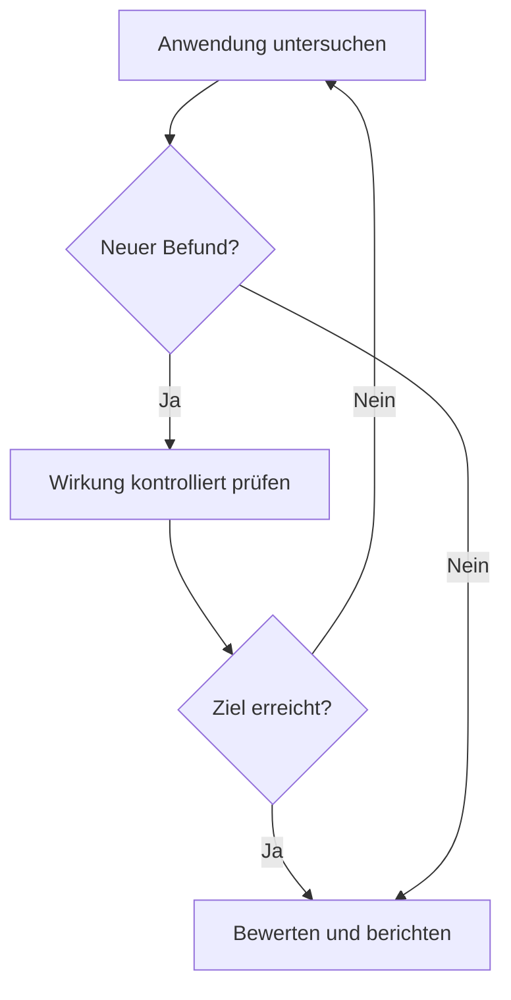

# Wie sicher ist eine Anwendung wirklich?

## Ein Bericht zum imbus-Webinar über Penetrationstests

**Termin:** 23. September 2026, 10:00–11:00 Uhr  
**Veranstalter:** imbus AG  
**Thema:** Sicherheitstests und Penetrationstests – der kontrollierte Angriff

> **Zur Grundlage dieses Berichts:** Der Text fasst die bereitgestellte automatische Mitschrift des Webinars in eigenen Worten zusammen. Offensichtliche Fehler der Spracherkennung wurden sinngemäß berichtigt. Wo eine geplante Vorführung technisch nicht funktionierte, wird das ausdrücklich erwähnt. Die Beispiele im Vortrag sind keine Bestätigung für eine Sicherheitslücke bei den genannten Unternehmen.

Eine Anwendung kann für ihre Nutzer völlig normal funktionieren und trotzdem unsicher sein. Ein Login öffnet die richtige Seite, ein Formular speichert die eingegebenen Daten, und die Tests der gewünschten Funktionen sind erfolgreich. Doch was passiert, wenn jemand absichtlich andere Eingaben macht, fremde Daten anfordert oder mehrere kleine Fehler miteinander verbindet?

Genau mit dieser Frage beschäftigte sich das Webinar von imbus. Nach einer kurzen Einführung durch die Moderation erklärte Tobias aus der Abteilung für IT-Sicherheit, wie ein Penetrationstest geplant, durchgeführt und ausgewertet wird. Seine zentrale Botschaft: Sicherheitsmaßnahmen müssen sich in der wirklichen Anwendung bewähren. Ein Konzept auf Papier allein zeigt noch nicht, ob ein Angreifer tatsächlich aufgehalten wird.

## Die wichtigsten Aussagen auf einen Blick

- Ein Penetrationstest simuliert einen Angriff **innerhalb schriftlich vereinbarter Grenzen**.
- Das Ziel ist, einen möglichen Angriffsweg und seine Folgen zu verstehen. Der Test findet nicht automatisch alle Sicherheitslücken.
- Die Erfahrung der testenden Person ist ebenso wichtig wie ihre Werkzeuge. Automatische Scanner allein reichen nicht aus.
- Ein guter Bericht erklärt das Risiko für das Management und gibt dem technischen Team konkrete Hinweise zur Behebung.
- Sicherheit entsteht durch regelmäßige Arbeit während der Entwicklung und des Betriebs. Ein einzelner Penetrationstest genügt dafür nicht.

## 1. Was ist ein Penetrationstest?

Ein Penetrationstest, kurz **Pentest**, ist ein kontrollierter Versuch, die Sicherheit eines Systems aus der Sicht eines möglichen Angreifers zu prüfen. Die testende Person verwendet dazu Methoden, die auch bei einem echten Angriff vorkommen könnten. Sie sucht nach Schwachstellen, untersucht ihre mögliche Wirkung und dokumentiert die Ergebnisse.

Im Webinar wurde betont, dass der Begriff „Penetrationstest“ nicht überall gleich verwendet wird. Deshalb müssen Auftraggeber und Testteam vor dem Start klären, **welche Systeme, Ziele, Methoden und Grenzen** für diesen konkreten Test gelten.

Eine schriftliche Erlaubnis ist dabei eine grundlegende Voraussetzung. Ein Test kann Systeme belasten oder sensible Informationen sichtbar machen. Das Team darf deshalb nur in dem vereinbarten Rahmen arbeiten. Auch die Tiefe einer Prüfung kann begrenzt werden: Wenn das vollständige Ausnutzen einer Schwachstelle sehr lange dauern oder zu viel Risiko schaffen würde, können die Beteiligten ein anderes Vorgehen vereinbaren und den nächsten Schritt auf andere Weise prüfen.

Die Aufgabe endet nicht mit dem Fund einer Lücke. Ein professionelles Team muss auch beantworten:

1. **Was ist passiert?**
2. **Welches Risiko entsteht dadurch im konkreten System?**
3. **Wie lässt sich das Problem beheben oder begrenzen?**

Ein kurzer technischer Nachweis kann helfen, einen Befund nachvollziehbar zu machen. Entscheidend ist jedoch, dass der Auftraggeber anschließend handeln kann.

### Warum ein Pentest nicht alle Lücken findet

Der Referent verglich die Suche mit einem Baum voller Früchte: Wer schnell eine Frucht erreichen will, nimmt zunächst die leicht erreichbare. Ähnlich kann ein Angreifer den einfachsten Weg zum vereinbarten Ziel wählen, etwa zu einem geschützten System oder zu wichtigen Daten.

Wenn ein Testteam diesen Weg erfolgreich nachweist, bedeutet das **nicht**, dass es jeden anderen Weg untersucht hat. Das Ergebnis beschreibt, was ein Angreifer mit vergleichbarem Wissen und innerhalb des verfügbaren Zeitraums erreichen konnte. Für eine möglichst breite, systematische Prüfung einzelner Anforderungen eignen sich zusätzlich andere Testarten und Sicherheitsanalysen.

## 2. Funktionstest, Sicherheitstest und Pentest: Wo liegt der Unterschied?

Der Vortrag erklärte die Unterschiede anhand einer Anwendung:

| Testart | Leitfrage | Beispiel | Typisches Vorgehen |
| --- | --- | --- | --- |
| Funktionstest | Funktioniert die Anwendung wie vorgesehen? | Ein Button fehlt oder lässt sich nicht bedienen. | Fehler festhalten, beheben lassen und die Funktion erneut testen. |
| Sicherheitstest anhand von Anforderungen | Hält die Anwendung eine festgelegte Sicherheitsregel ein? | Bei der Registrierung sind lange Passwörter nötig, beim Ändern des Passworts wird diese Regel aber nicht geprüft. | Die Abweichung von der Regel dokumentieren und korrigieren lassen. |
| Penetrationstest | Welchen Schaden könnte ein Angreifer mit einer Schwachstelle erreichen? | Nach dem Zugriff auf fremde Informationen werden weitere mögliche Angriffswege untersucht. | Den Befund im vereinbarten Rahmen prüfen, weitere Schritte untersuchen und die Folgen bewerten. |

Ein wichtiger Unterschied betrifft die **Sichtbarkeit des Fehlers**. Wenn ein Button fehlt, fällt das meist sofort auf. Eine Sicherheitslücke kann dagegen bestehen, während die Anwendung für normale Nutzer unverändert funktioniert. Gerade deshalb muss ein Pentest häufig über die sichtbare Oberfläche hinausgehen.

Die Suche kann sich wiederholen: Ein neuer Befund liefert Informationen, mit denen weitere Teile des Systems untersucht werden. Sie endet, wenn das vereinbarte Ziel erreicht ist, keine sinnvollen nächsten Schritte mehr erkennbar sind oder der festgelegte Rahmen erreicht ist.

## 3. Welche Sicherheitsziele können betroffen sein?

Der Referent ordnete Sicherheitslücken drei grundlegenden Schutzzielen zu:

| Schutzziel | Einfache Bedeutung | Beispiel aus dem Vortrag |
| --- | --- | --- |
| **Vertraulichkeit** | Nur berechtigte Personen dürfen Informationen lesen. | Jemand sieht Daten eines anderen Kunden oder eines Administrators. |
| **Integrität** | Daten und Aktionen dürfen nicht unbefugt verändert oder ausgelöst werden. | Jemand kann eine Überweisung im Namen einer anderen Person veranlassen. |
| **Verfügbarkeit** | Ein System soll für berechtigte Nutzer erreichbar bleiben. | Ein Angriff legt einen Dienst lahm, sodass niemand mehr darauf zugreifen kann. |

Ein Befund kann mehrere Ziele zugleich betreffen. Seine Bedeutung hängt außerdem vom System ab: Dieselbe technische Lücke kann in einer Testumgebung andere Folgen haben als in einer Anwendung mit vertraulichen Kundendaten. Deshalb ist eine **Bewertung des konkreten Risikos** nötig.

## 4. Die Phasen eines Penetrationstests

Als Orientierung nutzte Tobias den **Penetration Testing Execution Standard (PTES)**, auf Deutsch etwa „Standard für die Durchführung von Penetrationstests“. Er stellte ihn als verbreitete Struktur für den Ablauf vor, nicht als Beweis dafür, dass jede Prüfung genau gleich ablaufen muss.

| Phase | Was geschieht? | Worauf kommt es besonders an? |
| --- | --- | --- |
| **1. Vorbereitung und Abstimmung** | Ziel, Umfang, Erlaubnis, Testtiefe, Zeitplan und Kommunikation werden vereinbart. | Der Test darf weder unerwartet wichtige Systeme gefährden noch außerhalb der vereinbarten Grenzen laufen. |
| **2. Informationssammlung** | Das Team sammelt öffentlich zugängliche und technisch sichtbare Informationen über das Ziel. | Es will verstehen, welche Systeme und Dienste überhaupt vorhanden sind. |
| **3. Bedrohungsmodellierung** | Mögliche Angriffswege zu wichtigen Daten oder Funktionen werden beschrieben. | Die Frage lautet: Wie könnte eine normale Funktion missbraucht werden? |
| **4. Schwachstellenanalyse** | Menschen und Werkzeuge prüfen mögliche Fehler in Anwendungen und Infrastruktur. | Scanner liefern Hinweise; die Ergebnisse müssen verstanden und überprüft werden. |
| **5. Kontrollierte Ausnutzung** | Ein Befund wird innerhalb des vereinbarten Rahmens auf seine Wirkung geprüft. | Ein möglicher Schaden soll nachvollziehbar werden, ohne den Auftrag zu überschreiten. |
| **6. Untersuchung nach einem Zugriff** | Nach einem erreichten Zugang wird untersucht, welche weiteren Informationen oder Rechte verfügbar wären. | Interne Informationen können neue Wege zeigen, die von außen nicht erkennbar waren. |
| **7. Bericht und Abschluss** | Ergebnisse, Risiken und Vorschläge zur Behebung werden erklärt und besprochen. | Das Testteam räumt eigene Änderungen auf und empfiehlt gegebenenfalls weitere Prüfungen. |

### Schon vor dem Test fallen wichtige Entscheidungen

Der Referent machte deutlich, dass ein Pentest nicht für jeden Ausgangspunkt die beste erste Maßnahme ist. Wenn ein System noch nie grundlegend abgesichert wurde, kann zunächst ein Sicherheits-Scan oder eine andere Prüfung sinnvoller sein. Ein kleines Pilotprojekt kann außerdem zeigen, ob das Team und der Auftraggeber mit der Art der Ergebnisse gut arbeiten können. Tobias riet auch dazu, vor einer Beauftragung einen Beispielbericht anzusehen und sich erklären zu lassen.

Für ein brauchbares Angebot braucht das Testteam Informationen. Bei einem **Blackbox-Test** kennt es anfangs nur wenig vom System. Bei **Greybox- oder Whitebox-Tests** erhält es mehr Einblick, zum Beispiel in Zugänge oder technische Details. Sensible Informationen sollten geschützt ausgetauscht werden; im Webinar wurde dafür auch eine Vertraulichkeitsvereinbarung angesprochen.

Besonders wichtig ist der **Testumfang**: Welche Anwendungen, Adressen und Umgebungen gehören dazu? Welche Bereiche sind ausgeschlossen? Wie werden Zwischenfälle gemeldet? Wann kommen die Ergebnisse? Auch die Frage, wie weit eine gefundene Lücke ausgenutzt werden darf, gehört in diese Abstimmung.

## 5. Informationssammlung: Was ist von außen sichtbar?

Die zweite Phase wurde mit **OSINT** erklärt. Die englische Abkürzung steht für die Auswertung öffentlich zugänglicher Quellen. Dazu können Suchmaschinen, Informationen über Domainnamen, öffentlich erreichbare Dienste oder Metadaten von Dateien gehören.

Ein einfaches Bild aus dem Vortrag hilft beim Verständnis: Die **IP-Adresse** ähnelt der Hausnummer eines Systems. Ein **Port** ist wie eine Tür für einen bestimmten Dienst. Das **Domain Name System (DNS)** verbindet einen Namen wie eine Webadresse mit einer IP-Adresse.

Mit Suchmaschinen und dem Dienst **Shodan** zeigte Tobias, welche Informationen über öffentlich erreichbare Systeme gefunden werden können. Eine Suche in bereits erfassten Shodan-Daten kann zunächst Informationen liefern, ohne das untersuchte Ziel selbst direkt anzusprechen. Als Anschauungsbeispiel nutzte er Webangebote, die mit Tesla verbunden sind. Er untersuchte dabei unter anderem Domains, Dienste und sichtbare technische Hinweise. Die Beispiele dienten der Erklärung der Methode. Im Webinar wurde **keine bestätigte Sicherheitslücke bei Tesla** nachgewiesen. Tobias erwähnte auch ein Programm zur Meldung von Sicherheitslücken gegen mögliche Prämien. Er unterschied ein solches Programm von einem beauftragten Pentest mit vorher vereinbarten Zielen und einem festen Testteam.

Der Vortrag nannte außerdem mögliche Warnsignale: Eine alte Softwareversion, eine beschädigt wirkende Seite, ein altes Copyright-Datum oder eine Verbindung ohne HTTPS können Anlass für eine genauere Prüfung sein. **Ein einzelnes Signal ist aber noch kein Beweis für eine ausnutzbare Schwachstelle.** Auch ein offener Port 80 ist für sich genommen kein Sicherheitsfehler; er zeigt zunächst nur, dass ein Dienst erreichbar ist.

Auch Metadaten können etwas verraten: Eine veröffentlichte PDF-Datei kann etwa den Namen ihres Erstellers und die verwendete Software zeigen. Diese Hinweise könnten für gezielte Täuschungsversuche genutzt werden.

Die praktische Lehre ist einfach: Unternehmen sollten wissen, welche eigenen Systeme aus dem Internet sichtbar sind. Alte, vergessene oder falsch konfigurierte Dienste verdienen besondere Aufmerksamkeit.

## 6. Bedrohungen modellieren: Eine normale Funktion anders denken

Nach der Informationssammlung fragte das Testteam im Vortrag: **Wo liegen wichtige Daten, und über welche Wege könnte jemand dorthin gelangen?** Dafür wird eine mögliche Bedrohung beschrieben und anschließend in passende Prüfungen übersetzt.

Ein Beispiel war eine **User Story**, also eine kurze Beschreibung einer gewünschten Funktion: „Als Nutzer möchte ich mein Profil ändern.“ Aus Sicht eines möglichen Angreifers entsteht eine andere Frage: „Kann ich das Profil einer fremden Person ändern?“ Damit wird aus einer normalen Funktion ein konkreter Sicherheitsfall.

Ein zweites Beispiel betrifft gespeicherte Eingaben. Ein öffentlicher Nutzername kann in einer Ansicht korrekt dargestellt werden. Später erscheint derselbe Wert vielleicht in einem internen Protokoll oder in einer Administrationsansicht. Wenn die zweite Ansicht ihn anders verarbeitet, könnte dort ein Problem entstehen. Die Sicherheit einer Eingabe muss also **an jedem Ort geprüft werden, an dem sie später verwendet wird**.

Aus einem solchen Modell können konkrete Tests und Gegenmaßnahmen folgen. Gerade bei komplexen Wegen ist die gemeinsame Arbeit mehrerer Fachleute hilfreich: Sie betrachten verschiedene Zugänge zu denselben wichtigen Daten.

## 7. Schwachstellenanalyse: Werkzeuge helfen, Menschen entscheiden

Für die technische Analyse nannte Tobias Werkzeuge wie **Nmap** und **Nessus** für Infrastruktur sowie **OWASP ZAP** und **Burp Suite** für Webanwendungen. Automatische Prüfungen können viele bekannte Muster erkennen. Sie ersetzen aber nicht das Verständnis einer besonderen Anwendung, ihrer Daten und ihrer Geschäftsabläufe.

Ein Scanner kann zum Beispiel Hinweise liefern, die im konkreten System keine echte Lücke sind. Umgekehrt kann er eine zusammengesetzte Schwachstelle übersehen: Erst mehrere Funktionen zusammen machen den Angriff möglich. Deshalb müssen Tester Ergebnisse prüfen, Methoden anpassen und bei Bedarf eigene kleine Hilfsmittel schreiben.

### Was die Live-Demonstration tatsächlich zeigte

Geplant war eine Vorführung mit dem absichtlich verwundbaren **OWASP Juice Shop**, einer Übungsanwendung. Die dafür vorgesehenen Instanzen waren während des Webinars nicht erreichbar. Der geplante Angriff konnte deshalb **nicht live vorgeführt werden**.

Stattdessen zeigte Tobias mit Burp Suite auf einer imbus-Seite, wie sich die Kommunikation zwischen Browser und Server ansehen lässt. Er öffnete einen vom Werkzeug eingerichteten Browser, betrachtete Anfragen und Antworten und suchte unter anderem die Anfrage eines Anmeldeformulars. Mit der Funktion **Repeater** lässt sich eine eigene Anfrage erneut senden und ihre Antwort untersuchen, ohne jedes Mal die ganze Oberfläche zu bedienen.

Dieser Teil zeigte die **Arbeitsweise auf Protokollebene**. Ein sichtbarer Hinweis des Browsers entstand im Zusammenhang mit dem eingerichteten Analysewerkzeug. Aus dieser Vorführung folgt **kein Nachweis für eine Schwachstelle der imbus-Seite**. Der ausgefallene Juice Shop und der Ersatz durch eine Erklärung gehören zur tatsächlichen Geschichte des Webinars.

## 8. Von der Schwachstelle zu ihren Folgen

Als geplantes Beispiel für eine mögliche Ausnutzung erläuterte Tobias eine **SQL-Injection**. Vereinfacht gesagt: Wenn eine Anwendung Nutzereingaben unsicher in eine Datenbankabfrage übernimmt, können diese Eingaben die Bedeutung der Abfrage verändern. Unter bestimmten Bedingungen könnte dadurch etwa eine Anmeldung umgangen werden. Ob das in einer konkreten Anwendung möglich ist, muss geprüft werden; im Webinar wurde dieser Angriff **nur erklärt, nicht erfolgreich demonstriert**.

Für Entwickler lässt sich daraus eine praktische Regel ableiten: Eingaben dürfen nicht unkontrolliert Teil einer Datenbankabfrage werden. Parameterisierte Abfragen sind eine wichtige Schutzmaßnahme. Ebenso muss geprüft werden, ob eine Anmeldung und die Berechtigungen auf dem Server wirklich durchgesetzt werden. Diese technischen Folgerungen ergänzen die Erklärung des Vortrags; sie beschreiben keinen im Webinar nachgewiesenen Fehler.

Nach einem erfolgreichen Zugriff beginnt die Prüfung oft erneut auf einer anderen Ebene. Von außen waren vielleicht nur Domains und Ports sichtbar. Mit einem berechtigten oder unberechtigt erreichten Administrationszugang wären plötzlich interne Funktionen und Informationen zu sehen. Die Phase nach der Ausnutzung fragt deshalb: **Was wäre mit diesem Zugriff als Nächstes möglich?**

## 9. Der Bericht muss Entscheidungen ermöglichen

Ein guter Pentest-Bericht richtet sich an verschiedene Leser. Das **Management** braucht eine verständliche Zusammenfassung: Welche Risiken sind dringend, was könnte passieren und wo müssen Ressourcen bereitgestellt werden? Das **technische Team** benötigt genaue Befunde und Vorschläge für die Behebung.

Eine Priorisierung, etwa mit Ampelfarben, kann die Dringlichkeit sichtbar machen. Sie ersetzt aber keine Erklärung. Der Bericht soll zeigen, warum ein Befund wichtig ist und welche Schritte sinnvoll sind. Die Ergebnisse sollten zudem gemeinsam besprochen werden, damit Fragen geklärt und Maßnahmen geplant werden können.

Zum Abschluss gehört auch das **Aufräumen**. Tobias erzählte von einem späteren Test, bei dem sein Team auf einem Produktivsystem zurückgelassenen Schadcode eines früheren Tests fand. Das Beispiel zeigt, warum Testdateien, Zugänge und andere Änderungen nach einer Prüfung kontrolliert entfernt werden müssen.

## 10. Sicherheit braucht einen längeren Atem

Der Referent stellte den Pentest als Teil eines größeren Prozesses dar: Sicherheit sollte schon bei Anforderungen, Entwurf, Entwicklung, Tests und Betrieb mitgedacht werden. Wenn ein Pentest eine Lücke findet, lohnt sich deshalb eine zweite Frage: **Warum konnte dieser Fehler überhaupt entstehen und bis in das Produkt gelangen?**

Regelmäßige Sicherheitstests verkürzen die Zeit, in der ein Fehler unbemerkt bleiben kann. Das bedeutet nicht, jeden Tag einen vollständigen Pentest zu beauftragen. Einzelne automatische Prüfungen und andere passende Methoden lassen sich jedoch häufiger durchführen. Auch Entwickler und Administratoren können geeignete Werkzeuge in ihre tägliche Arbeit aufnehmen.

Zum Schluss sprach Tobias über **künstliche Intelligenz (KI)**. Er hält ihren Einsatz in der Arbeit von Penetrationstestern für zunehmend wichtig und wies zugleich darauf hin, dass der Umgang mit Daten geklärt werden muss. Das war seine Einschätzung im Webinar; eine ausführliche Demonstration zu KI gehörte nicht zu diesem Termin.

### Was ich als Entwickler aus dem Vortrag mitnehme

Aus den Beispielen ergeben sich einige Fragen für die eigene Arbeit:

1. Gelten Sicherheitsregeln wirklich in **allen** zugehörigen Funktionen, zum Beispiel bei Registrierung **und** Passwortänderung?
2. Wird jede Anfrage auf dem Server geprüft, auch wenn die Benutzeroberfläche eine Aktion nicht anbietet?
3. Was passiert mit gespeicherten Nutzereingaben, wenn sie später in einer anderen Ansicht, einem Protokoll oder einem Administrationsbereich erscheinen?
4. Welche eigenen Dienste sind öffentlich erreichbar, und werden sie regelmäßig gepflegt?
5. Können Fachleute und Entwickler einen Sicherheitsbefund gemeinsam verstehen, beheben und anschließend erneut prüfen?

Diese Fragen sind kein Ersatz für einen Pentest. Sie helfen aber, schon vor einem Test genauer hinzusehen.

## Fazit

Der stärkste Gedanke des Webinars ist auch der einfachste: **Eine Anwendung ist nicht schon deshalb sicher, weil sie wie geplant funktioniert.** Ein Penetrationstest untersucht, was geschieht, wenn jemand bewusst nach unerwarteten Wegen sucht. Sein Wert liegt in der Verbindung aus klarer Erlaubnis, fachlicher Neugier, nachvollziehbarer Risikobewertung und einem Bericht, aus dem konkrete Verbesserungen entstehen.

Die ausgefallene Übungsumgebung änderte nichts an dieser Kernaussage. Im Gegenteil: Die improvisierte Analyse der Browserkommunikation machte sichtbar, wie viel hinter einer scheinbar einfachen Anmeldung passiert. Wer nach dem Webinar eine Frage mitnimmt, kann sie direkt auf die eigene Anwendung anwenden: **Welche Annahme über ihre Sicherheit haben wir bisher nur auf dem Papier geprüft?**

---

## Wortschatz aus der Mitschrift: Deutsch–Persisch

Die folgende Auswahl wichtiger Wörter und Wendungen stammt aus der bereitgestellten Mitschrift; offensichtliche Schreibfehler der automatischen Erkennung wurden korrigiert und gebeugte Formen auf die Grundform zurückgeführt. Die Niveaustufen sind **ungefähre Lernhilfen**, keine offizielle Einstufung. Fachwörter lassen sich oft nicht eindeutig einem GER-Niveau zuordnen. Die letzte Gruppe enthält besonders anspruchsvolle Fachsprache, die man ungefähr im Bereich **C1/C2** einordnen kann.

### Ungefähr B2

| Deutsches Wort / Wendung | Bedeutung auf Persisch |
| --- | --- |
| die Maßnahme | اقدام، تدبیر |
| die Schwachstelle | نقطه‌ضعف، آسیب‌پذیری |
| die Sicherheitslücke | حفرهٔ امنیتی، آسیب‌پذیری امنیتی |
| ausnutzen | بهره‌برداری کردن؛ در این متن: از ضعف سوءاستفاده کردن |
| zuverlässig | قابل‌اعتماد، مطمئن |
| die Anforderung | الزام، نیازمندی |
| die Einschränkung | محدودیت |
| die Richtlinie | دستورالعمل، خط‌مشی |
| die Behebung | رفع کردن، برطرف‌سازی |
| die Vorgehensweise | شیوهٔ عمل، روش انجام کار |
| die Auswertung | ارزیابی و تحلیل نتایج |
| die Bewertung | ارزیابی، سنجش |
| öffentlich | عمومی؛ در دسترس عموم |
| sensibel | حساس؛ به‌ویژه دربارهٔ داده‌ها |
| die Ressource | منبع، امکانات |
| im Vorfeld | پیشاپیش، پیش از شروع کار |
| im Nachgang | پس از انجام کار، در پی آن |
| ausschließen | مستثنا کردن؛ منتفی دانستن |
| die Verfügbarkeit | در دسترس بودن |
| die Vertraulichkeit | محرمانگی |

### Ungefähr C1

| Deutsches Wort / Wendung | Bedeutung auf Persisch |
| --- | --- |
| die Integrität | یکپارچگی و دست‌نخوردگی داده‌ها |
| beeinträchtigen | مختل کردن، تحت تأثیر منفی قرار دادن |
| einordnen | طبقه‌بندی یا در جای درست ارزیابی کردن |
| ableiten | استنتاج کردن، از چیزی نتیجه گرفتن |
| identifizieren | شناسایی کردن |
| aufspüren | ردیابی و پیدا کردن |
| strukturiert | ساختاریافته، منظم |
| systematisch | نظام‌مند، روشمند |
| zeitintensiv | زمان‌بر |
| die Infrastruktur | زیرساخت |
| schützenswert | شایستهٔ حفاظت، نیازمند محافظت |
| die Bedrohung | تهدید |
| die Konfiguration / konfigurieren | پیکربندی / پیکربندی کردن |
| manipulieren | دست‌کاری کردن |
| einschleusen | به‌صورت پنهانی وارد یا تزریق کردن |
| freistellen | در اختیار گذاشتن؛ در متن: منابعی را اختصاص دادن |
| die Metadaten | فراداده‌ها |
| die Ausnutzung | بهره‌برداری؛ در متن: سوءاستفاده از آسیب‌پذیری |

### Anspruchsvolle Fachsprache, ungefähr C1/C2

| Deutsches Wort / Wendung | Bedeutung auf Persisch |
| --- | --- |
| das Schutzziel | هدف امنیتی یا هدف حفاظتی |
| das Sicherheitsniveau | سطح امنیت |
| die Umsetzungsempfehlung | پیشنهاد عملی برای پیاده‌سازی یا رفع مشکل |
| der Anforderungskatalog | فهرست منظم الزامات و نیازمندی‌ها |
| die Testkonzeption | طراحی و تدوین طرح آزمون |
| die Testplanungssteuerung | برنامه‌ریزی و هدایت فرایند آزمون |
| proprietär | اختصاصی؛ وابسته به یک سازنده یا مالک |
| das Haupteinfallstor | مسیر اصلی ورود مهاجم به یک سامانه |
| die Testautomatisierung | خودکارسازی آزمون‌ها |
| exploratives Testen | آزمون اکتشافی؛ بررسی همراه با یادگیری و کشف |

**Hinweis zum Lernen:** Im Alltag reichen oft einfachere Wörter: „beheben“ statt „eine Behebung durchführen“, „schützen“ statt „absichern“ und „prüfen“ statt „evaluieren“. In technischen Gesprächen lohnt es sich trotzdem, die genauen Fachwörter zu kennen.
