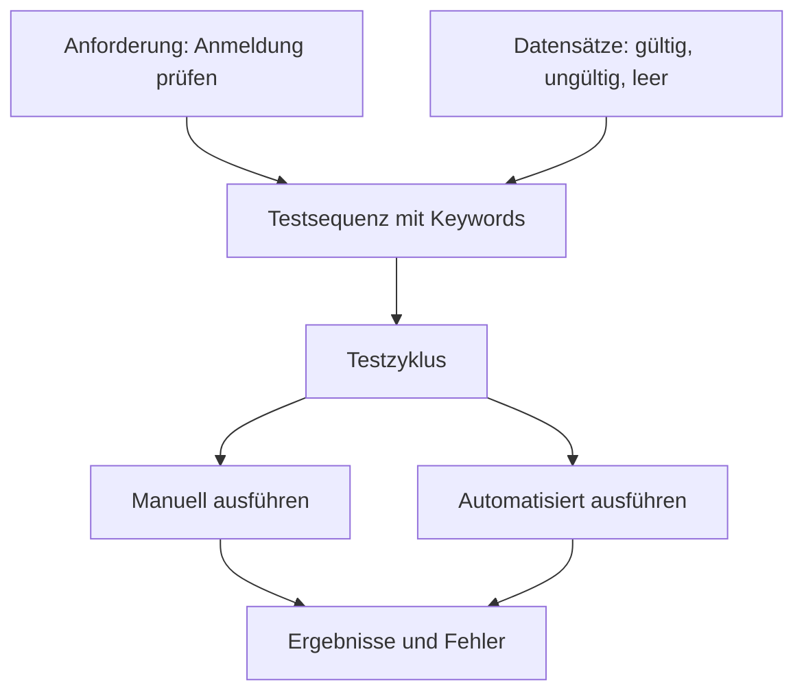

# TestBench-Webinar, Teil 1: Testmanagement und Testdesign leicht gemacht

**Termin:** 29. September 2026, 10:00–11:30 Uhr  
**Veranstalter:** imbus  
**Grundlage:** Transkript des Webinars  
**Themen:** Testspezifikation, Testdaten, manuelle Testdurchführung, Versionierung, Testmanagement und Schnittstellen

> **Hinweis zur Quelle:** Dieser Bericht fasst das bereitgestellte, automatisch erstellte Transkript zusammen. Offensichtliche Erkennungsfehler wurden sinngemäß korrigiert: Gemeint sind beispielsweise *TestBench*, *Jira*, *JSON*, *Robot Framework*, *Anforderungsmanagement* sowie schlüsselwortbasiertes und datengetriebenes Testen. Zahlen und Leistungsangaben geben Aussagen aus dem Webinar wieder; sie sind keine unabhängig gemessenen Ergebnisse. Der Wortschatzteil am Ende verwendet ebenfalls die korrigierten Formen.

## Warum dieses Webinar interessant war

Ein Testfall ist schnell geschrieben. Schwieriger wird es, wenn Hunderte Menschen an einem Produkt arbeiten, Tausende Tests über mehrere Versionen bestehen bleiben und sich Anforderungen laufend ändern. Dann stellen sich ganz praktische Fragen: Wer darf einen Test ändern? Welche Daten gehören zu ihm? Welche Tests müssen in diesem Sprint laufen? Und wie lässt sich später belegen, was für eine bestimmte Produktversion wirklich geprüft wurde?

Im ersten Teil des Webinars zeigte der Referent TestBench als Werkzeug für diese Aufgaben. Im Mittelpunkt standen **fachlich verständliche Tests**, **wiederverwendbare Schritte**, **strukturierte Testdaten** und **nachvollziehbare Ergebnisse**. Die Testautomatisierung wurde bereits angesprochen; ihre technische Umsetzung mit Robot Framework war vor allem für den zweiten Webinarteil angekündigt.

Die wichtigste Idee lässt sich so ausdrücken: Ein Test soll eine fachliche Geschichte erzählen. Die einzelnen Schritte und die verwendeten Daten sollen sich dabei gezielt ändern und mehrfach nutzen lassen.

## 1. Die Ausgangslage: Warum Testmanagement mehr als eine Testliste ist

Der Referent beschrieb mehrere Schwierigkeiten aus der Praxis:

1. **Fachwissen und technisches Wissen sind verteilt.** Manche Teammitglieder kennen das Produkt und die Regeln sehr gut. Andere wissen, wie man Umgebungen einrichtet oder Tests automatisiert. Beide Gruppen müssen zusammenarbeiten.
2. **Testmengen und Testfälle wachsen.** Längere Abläufe, mehr Daten und viele Produktvarianten machen Tests schwer lesbar und teuer in der Pflege.
3. **Agile Entwicklung verlangt schnelle Rückmeldung.** Tests sollen während eines Sprints vorbereitet und durchgeführt werden. Änderungen erzeugen immer wieder neue Regressionstests.
4. **Manche Branchen verlangen Nachweise.** Spezifikationen, Freigaben, Reviews und Testergebnisse müssen zu einem bestimmten Zeitpunkt belegbar sein.
5. **Testdaten und andere Systeme müssen zusammenpassen.** Daten können fest vorliegen oder erst während eines Testlaufs entstehen. Anforderungen, Fehlerverwaltung und Automatisierung liegen oft in anderen Werkzeugen.

Ein eigenes Webinar zum **Variantenmanagement** wurde erwähnt. Dieser Teil wurde hier bewusst nicht im Detail erklärt.

TestBench wurde anhand von fünf Arbeitsbereichen vorgestellt: **Testmanagement**, **Testspezifikation**, **Testautomatisierung**, **Integration mit anderen Systemen** und **Testdurchführung**. Diese Bereiche greifen ineinander. Ein Testplan ist nur dann nützlich, wenn klar ist, welche Version getestet wird, was die Schritte bedeuten und wohin die Ergebnisse zurückfließen.

## 2. Wie Projekte, Versionen und Testzyklen zusammenhängen

In der Demo gab es zunächst **Projekte**. Darunter lagen **Testobjektversionen**: Sie bündeln die Anforderungen, Tests und weiteren Informationen für eine Version des geprüften Produkts. Zu einer solchen Version lassen sich **Testzyklen** beziehungsweise Testpläne anlegen. In einem agilen Projekt kann eine Version über mehrere Sprints wachsen; pro Sprint können ein oder mehrere Testzyklen entstehen.

| Ebene | Einfache Bedeutung | Beispiel |
| --- | --- | --- |
| Projekt | Der organisatorische Rahmen | Konfigurator einer Anwendung |
| Testobjektversion | Der Stand des Produkts, auf den sich Tests beziehen | Release 3 oder Patch 3.1.1 |
| Testzyklus | Geplanter Durchlauf einer Auswahl von Tests | Systemtest im aktuellen Sprint |
| Testfall / Testfallsatz | Der beschriebene Prüfablauf | Anmeldung mit ungültigem Benutzernamen |
| Testergebnis | Was beim konkreten Durchlauf geschah | Bestanden, fehlgeschlagen oder noch zu prüfen |

Der Referent verwendete in einem Beispiel *Testfall* und *Testfallsatz* vereinfacht als ähnliche Bezeichnungen. Für die Grundidee ist entscheidend, **Spezifikation und einzelnen Testdurchlauf auseinanderzuhalten**: Derselbe beschriebene Test kann in verschiedenen Zyklen und Produktversionen unterschiedliche Ergebnisse liefern.

## 3. Von Prosa zu wiederverwendbaren Testbausteinen

TestBench erlaubt laut Demo mehrere Arten, einen Test zu beschreiben:

- **Ein zusammenhängender Text:** Der ganze Ablauf steht in Prosa.
- **Einzelne Textschritte:** Der Ablauf ist bereits in Schritte zerlegt.
- **Keyword-basierte Schritte:** Ein Test ruft benannte, wiederverwendbare Bausteine auf.
- **Eine Mischung:** Vorhandene Keywords können mit neuen Textschritten kombiniert werden. Ein Textschritt lässt sich später in einen Baustein umwandeln.

Ein kleines Beispiel macht den Unterschied sichtbar. In einem reinen Texttest müsste der Vorgang „Anwendung öffnen, Benutzer anmelden, Ergebnis prüfen“ bei ähnlichen Tests wiederholt werden. In einer Bausteinspezifikation könnten dagegen die Schritte **„Konfigurator starten“**, **„Anmeldevorgang durchführen“** und **„Anmeldung prüfen“** stehen. Der zweite Schritt erhält passende Daten, etwa Benutzername und Passwort.

Ändert sich der Anmeldevorgang, wird der gemeinsame Baustein an seiner Quelle angepasst. Seine Verwendungen können die Änderung übernehmen. Im Webinar hieß das **„Single Point of Change“**: eine zentrale Stelle für die Änderung. Eine Funktion in einem Programm ist eine hilfreiche Analogie. Gleichzeitig muss das Team prüfen, ob die Änderung tatsächlich für *alle* Verwendungen gelten soll. Verwendungsnachweise, Sperren und Versionen helfen dabei.

### Keywords können weitere Keywords enthalten

Ein Baustein wie **„Nutzer anmelden“** kann selbst aus mehreren kleineren Schritten bestehen. Im Testfall erscheint dann zunächst nur der fachliche Schritt. Wer mehr wissen muss, öffnet die Details. So lassen sich verschiedene Ebenen für unterschiedliche Leser nutzen:

- Ein Testmanager erkennt, **welcher Vorgang** geprüft wird.
- Ein Testdesigner sieht, **welche Teilschritte** und Daten beteiligt sind.
- Eine testende Person kann bei Bedarf bis zum **genauen Handgriff** gehen.

Der Referent illustrierte dies mit einem umfangreichen Frachtbrief: In einem übergeordneten Test genügt der Schritt „Frachtbrief ausfüllen“; die vielen Eingaben bleiben in der tieferen Ebene. Er empfahl verständliche und einheitliche Namen für Keywords. Sonst entstehen leicht doppelte Bausteine, obwohl ein passender Schritt bereits existiert.

**Wichtig:** Wiederverwendung spart bei länger gepflegten Produkten viel Arbeit, verlangt aber zunächst eine Investition in den Bausteinkatalog. Die im Webinar genannten Zeitgewinne waren Erfahrungswerte aus der Präsentation. Sie hängen von den vorhandenen Tests und der Arbeitsweise des Teams ab.

## 4. Datengetrieben testen: Ein Ablauf, mehrere Fälle

Neben den Schritten können auch **Testdaten getrennt verwaltet** werden. Ein Testablauf beschreibt dann *was passiert*; eine Datentabelle bestimmt *mit welchen Werten* er ausgeführt wird.

| Testdatensatz | Benutzername | Erwartetes Ergebnis |
| --- | --- | --- |
| Gültiger Benutzer | Ein vorhandener Benutzername | Anmeldung gelingt |
| Ungültiger Benutzer | Ein nicht vorhandener Name | Anmeldung wird abgelehnt |
| Leerer Benutzername | Kein Name | Eingabe wird zurückgewiesen |

Die Tabelle ist ein **vereinfachtes Lernbeispiel** auf Basis der gezeigten Anmeldung, keine Abschrift einer Folie. Ein neuer Datensatz kann einen weiteren konkreten Testfall ergeben, ohne den ganzen Ablauf zu kopieren. Dazu passt die **Äquivalenzklassenbildung**: Werte mit vergleichbarem Verhalten werden gruppiert. Man wählt passende Vertreter und prüft bei Bedarf auch Grenzwerte, statt beliebig viele fast gleiche Fälle anzulegen.

Testdaten können außerdem **Strukturen** bilden. Ein Datensatz „Benutzer“ enthält zum Beispiel Name, E-Mail-Adresse, Kontotyp und Passwort. Ein Testschritt nutzt daraus vielleicht nur den Namen. Andere Schritte greifen auf die übrigen Felder zu. Im Webinar gab es auch ein Beispiel aus der Versicherung: Für einen minderjährigen Versicherungsnehmer muss zusätzlich ein passender Erziehungsberechtigter in den Daten vorhanden sein. Solche Beziehungen lassen sich vorher vorbereiten.

In der Demo konnte man von einem Wert oder Datentyp zu seinen Verwendungen springen. Das beantwortet vor einer Änderung die entscheidende Frage: **Welche Tests und Datenstrukturen sind betroffen?** Der Referent erwähnte außerdem, dass Testdaten aus einem anderen System übernommen oder vor der Ausführung dynamisch ergänzt werden können.

Das Diagramm zeigt die fachliche Beziehung. Welche konkreten Werkzeuge oder Datenformate eingesetzt werden, hängt von der jeweiligen Integration ab.

## 5. Im Team arbeiten: Rollen, Reviews und Sperren

Die Demo zeigte, dass TestBench auf Zusammenarbeit ausgelegt ist. Änderungen anderer Teammitglieder erscheinen in der Oberfläche, ohne dass man sie ständig selbst neu laden muss. Gleichzeitig können Bearbeitungsrechte und Sperren verhindern, dass jemand einen gerade bearbeiteten Baustein überschreibt. Die Sperre eines Keywords umfasst nach der Antwort auf eine Teilnehmerfrage auch die zugehörigen Testdaten. Ganze Teilbäume können gesperrt werden; ein Administrator kann eine liegen gebliebene Sperre bei Bedarf lösen.

Vier Rollen wurden erklärt:

| Rolle | Schwerpunkt |
| --- | --- |
| Testmanager | Plant und verwaltet innerhalb seiner Projekte; hat dort weitreichende Rechte. |
| Testdesigner | Erstellt und bearbeitet Spezifikationen, Bausteine und Testdaten. |
| Testprogrammierer | Kümmert sich um die technische Umsetzung und den Status der Automatisierung. |
| Tester | Liest Spezifikationen, führt Tests durch und erfasst Ergebnisse und Fehler. |

Zusätzlich können Personen **nur lesenden Zugriff** erhalten, etwa für eine Begutachtung. Für Reviews kann ein **Vier-Augen-Prinzip** eingerichtet werden: Wer einen Test erstellt hat, soll ihn dann nicht selbst freigeben. Das ist besonders hilfreich, wenn eine Organisation formale Nachweise braucht.

## 6. Manuelle Tests und automatisierte Ergebnisse in einer Sicht

Für die manuelle Durchführung wurde ein **browserbasierter Assistent** gezeigt, der auch offline arbeiten kann. Testende können einen zugewiesenen Ablauf Schritt für Schritt ansehen und Ergebnisse erfassen. Die Oberfläche zeigt auf Wunsch nur geplante und aktuell durchführbare Tests. Bereiche wie Kommentare oder Fehlererfassung können je nach Aufgabe ausgeblendet werden.

Zusammengesetzte Keywords lassen sich aufklappen. Eine erfahrene Person kann einen übergeordneten Schritt als **bestanden** markieren; dabei muss klar sein, dass auch seine untergeordneten Schritte als erledigt gelten. Ein einzelner fehlerhafter Schritt kann gezielt als **fehlgeschlagen** markiert werden. Weitere Zustände sind etwa **ausgelassen** und **zu prüfen**. Gerade der letzte Zustand ist wichtig, wenn ein Automat nur einen Teil der Prüfung leisten kann.

Das Beispiel des Referenten: Ein automatisierter Test erzeugt ein Bild und markiert den betreffenden Prüfschritt als **„zu prüfen“**. Ein Mensch beurteilt anschließend das Bild und entscheidet über das Ergebnis. So ergänzen sich automatische und manuelle Arbeit. Importierte Automatisierungsprotokolle lassen sich im Assistenten ansehen; dort kann man einem fehlgeschlagenen Schritt einen Fehler zuordnen oder eine fälschliche Fehlermeldung bewerten. Der Referent beschrieb ausdrücklich, dass dabei das **importierte Protokoll** ergänzt wird.

Der Assistent kann Tests für Einsatzorte ohne dauerhafte Verbindung bereitstellen. Als Beispiel wurden Prüfungen in fahrenden Zügen genannt. Dadurch wird ein Test auch außerhalb der gewohnten Büroverbindung durchführbar.

## 7. Zwei Arten der Versionierung

Die Versionierung war ein Schwerpunkt der Demo. Hier lohnt sich eine klare Trennung:

| Art | Was wird festgehalten? | Wozu dient es? |
| --- | --- | --- |
| **Äußere Versionierung** | Ein eigener Stand des Testobjekts, etwa für Release 3 und Patch 3.1.1 | Später nachvollziehen, welche Anforderungen, Tests und Zyklen zu einem Produktstand gehörten. |
| **Innere Versionierung** | Ein festgehaltener Stand der Spezifikation einschließlich verwendeter Bausteine und Daten | Eine freigegebene Fassung schützen, vergleichen oder bei Bedarf wieder aufrufen. |

Eine neue Testobjektversion kann aus einer älteren **abgeleitet** werden. Beim Kopieren werden laut Demo Teststatus zurückgesetzt; bestimmte freigegebene Spezifikationen müssen beispielsweise erneut geprüft werden. So kann ein Team auf bestehenden Tests aufbauen, ohne frühere Ergebnisse einfach als Ergebnisse des neuen Releases auszugeben.

Innerhalb einer Version wird mit einer **Arbeitsfassung** gearbeitet. Ein Einchecken oder eine Freigabe kann einen festen Stand erzeugen. Der Referent zeigte, dass solche Stände einen Zeitpunkt und einen Kommentar tragen können. Sie lassen sich später ansehen; nur Personen mit passenden Rechten können einen geschützten Stand wieder zur Bearbeitung öffnen. Die Frage aus dem Publikum, ob man einen Fehler während eines manuellen Tests sofort im Schritt ändern darf, führte zu einer wichtigen Antwort: Der konkrete Versionsmechanismus lässt sich konfigurieren. Wer direkte Änderungen an der Arbeitsfassung erlaubt, muss die Folgen bewusst steuern.

Eine **dauerhafte eindeutige Kennung (UID)** verbindet einen Test über verschiedene Versionen hinweg. Wird er im Baum verschoben, geht diese Identität laut Antwort des Referenten nicht verloren. Damit bleibt die Historie auffindbar.

## 8. Statusmodelle, Testplanung und Filter

TestBench hat nach Aussage des Referenten **fest vorgegebene Statusmodelle**; die Statuslogik kann nicht beliebig umdefiniert werden. Ein Spezifikationsstatus kann beispielsweise von „nicht geplant“ über Arbeit und Review bis zu „freigegeben“ reichen. Bei der Durchführung gibt es unter anderem „geplant“, „zugeordnet“, „laufend“, „abgebrochen“ und „durchgeführt“. Dazu kommen Ergebnisse wie „bestanden“, „fehlgeschlagen“ und „zu prüfen“. Ein Test kann **blockiert** werden, wenn ein bekannter Fehler weitere Durchläufe vorerst sinnlos macht.

Übersichten verdichten die Zustände im Testbaum. So ist erkennbar, wenn unter einem Bereich noch Tests laufen oder ein Fehler aufgetreten ist. Bei Anforderungen erläuterte der Referent: **Fehlgeschlagen** bedeutet, dass wenigstens ein verknüpfter Test fehlgeschlagen ist; **bestanden** setzt voraus, dass alle erforderlichen Tests bestanden haben; **teilweise getestet** zeigt einen Zwischenstand.

Für wiederkehrende Läufe können Tests mit **Schlagwörtern (Tags)** und eigenen Feldern beschrieben werden: etwa Regressionstest, automatisiert, nächtlicher Lauf oder Wochenendlauf. Gespeicherte Filter verbinden Bedingungen mit **UND**, **ODER** und **NICHT**. Ein CI-System wie Jenkins kann über eine Schnittstelle die aktuell passende Testmenge abrufen. Dadurch kann ein Team die Auswahl im Testmanagement pflegen, statt für jede Änderung einen festen Testkatalog in der Pipeline umzubauen.

Ein praktischer Hinweis aus der Demo: **Mehrere gleichzeitig aktive Filter können zusammen alles ausblenden.** Wenn der Testbaum plötzlich leer aussieht, sollte man zuerst die aktiven Filter prüfen. Außerdem wirken Aktionen im gefilterten Baum nur auf die Elemente, die noch zur Ergebnismenge gehören. Komplexe Filter können bei sehr großen Datenmengen länger brauchen.

## 9. Anforderungen, Fehler und Berichte verbinden

Ein Test kann mehreren Anforderungen zugeordnet sein; eine Anforderung kann durch mehrere Tests geprüft werden. Das ist eine **Viele-zu-viele-Beziehung**. In der Demo wurden Anforderungen aus Jira übernommen. TestBench zeigte dazu, welche User Stories vollständig, teilweise, erfolgreich oder noch gar nicht getestet waren. Von einer Anforderung aus konnte man ihre Verwendungen und die zugehörigen Testzyklen untersuchen.

Für Fehler wurde die Verbindung zum Test besprochen, in dem der Fehler gefunden wurde. Bei einer externen Fehlerverwaltung wie Jira hängt es von der **konfigurierten Schnittstelle** ab, welche Informationen übergeben werden. Ändert sich ein Fehler später auf einen Status wie „bereit zum Test“, können passende fehlgeschlagene Tests gefiltert und erneut geplant werden. Die interne Fehlerverwaltung wurde eher als **übersichtliche Fehlerliste** beschrieben; in der gezeigten Praxis war ein externes System angebunden.

Ein Teilnehmer fragte, ob sich ein Release anhand von **Schwellwerten** beurteilen lässt, zum Beispiel nach Erfolgsquote und Zahl kritischer Fehler. Die Antwort war klar: **Diese Freigabeentscheidung entsteht nicht direkt aus dem gezeigten internen Anforderungsstatus.** Die Daten können über Schnittstellen exportiert und dann etwa in Power BI oder einem eigenen Skript ausgewertet werden. So kann eine Organisation eigene Regeln für „freigegeben“, „unter Auflagen freigegeben“ oder „gesperrt“ umsetzen.

Für Berichte nannte der Referent **XML und JSON** als Rohdatenformate sowie Vorlagen für HTML, PDF, Word und Excel. Ungefähr 40 Vorlagen in Deutsch und Englisch wurden erwähnt. Die Umwandlung in Zielformate kann angepasst werden, etwa für das eigene Firmenlogo oder spezielle Kennzahlen. Auch größere Projektbestände können über eine Rohdatenschnittstelle exportiert und wieder importiert werden. Vor einer Automatisierung können Daten in einem Zwischenschritt ergänzt werden, zum Beispiel ein zur Laufzeit berechnetes Monatsende.

Die genannten Standardintegrationen betreffen **Anforderungsmanagement, Fehlermanagement, CI/CD (kontinuierliche Integration und Bereitstellung) und Testautomaten**. Das Webinar zeigte damit TestBench als Teil einer größeren Werkzeuglandschaft. Laut Referent wird das Produkt lokal auf Windows oder Linux betrieben; für Fragen zur Einrichtung bot er eine weitere Demo an.

## 10. Ausblick auf die Testautomatisierung

Für den zweiten Teil wurde die Verbindung zu **Robot Framework** angekündigt. Die fachlichen Testsequenzen und Daten kommen aus TestBench. Robot Framework und seine Erweiterungen setzen die technischen Schritte um. In der Präsentation wurde beschrieben, dass Keywords bei der Automatisierung technischen Code erhalten können und dass sich der Automatisierungsstatus zurückmelden lässt. Für Weboberflächen, SAP und mobile Anwendungen wurden passende Bibliotheken als Beispiele genannt.

Die Idee hinter dieser Trennung: Fachleute beschreiben **was** geprüft werden soll; Automatisierungsspezialisten lösen **wie** der technische Zugriff funktioniert. Ein Test kann weiterhin manuelle Prüfschritte enthalten. Der Referent hielt eine Automatisierung sämtlicher sinnvoller Prüfungen für unrealistisch. Die von ihm genannten Quoten und Zeitaufwände waren Einschätzungen aus der Praxis, keine allgemeine Zielvorgabe.

**Termin-Klarstellung:** Im Gespräch fiel einmal versehentlich „Freitag“. Auf Nachfrage korrigierte der Referent den Folgetermin ausdrücklich auf **Donnerstag, 1. Oktober 2026, 10:00 Uhr**.

## 11. Antworten auf praktische Fragen aus dem Publikum

| Frage | Antwort aus dem Webinar |
| --- | --- |
| Gibt es wiederverwendbare Vorbedingungen? | Ja. Sie wurden in der Demo nur nicht eigens gezeigt. |
| Bleiben Keywords über Versionen erhalten? | Ja; die Versionierung bewahrt frühere Stände. |
| Ändert ein Verschieben im Testbaum die Identität eines Tests? | Nein, die eindeutige Kennung dient als Verbindung über Versionen hinweg. |
| Kann ein Tester eine Spezifikation während der Durchführung ändern? | Das hängt von Rechten und der gewählten Versionierung ab; direkte Änderungen sollten bewusst begrenzt werden. |
| Wie strukturiert man manuelle, automatische, funktionale und nicht funktionale Tests? | Der Referent empfahl einen fachlich gegliederten Baum. Weitere Merkmale gehören in Tags oder eigene Felder und werden über gespeicherte Filter kombiniert. |
| Lassen sich Freigabeschwellen direkt im gezeigten Anforderungsstatus festlegen? | Nein. Für solche Regeln wurde eine externe Auswertung über API oder Rohdatenexport vorgeschlagen. |

## Was ich aus dem Webinar mitnehme

Für mich liegt der größte Nutzen nicht in einer einzelnen Funktion. Interessant ist das **Zusammenspiel**: Ein fachlich benannter Schritt wird mehrfach genutzt; Testdaten bleiben geordnet; Anforderungen und Ergebnisse sind verknüpft; Versionen schützen frühere Stände; Filter stellen für jeden Lauf die passende Testmenge zusammen.

Wer ein ähnliches Vorgehen im eigenen Projekt ausprobieren möchte, kann klein anfangen:

1. Einen oft wiederholten Ablauf wählen, zum Beispiel „Benutzer anmelden“.
2. Den Ablauf in klar benannte Schritte teilen und die Werte in eine eigene Datentabelle legen.
3. Einige gültige, ungültige und Grenzfälle festlegen.
4. Prüfen, wo Bausteine und Daten bereits verwendet werden, bevor man sie ändert.
5. Tests an Anforderungen binden und für einen konkreten Testzyklus planen.
6. Ergebnisse, Fehler und die freigegebene Fassung so aufbewahren, dass sie später wiedergefunden werden.

Damit wird aus einer Sammlung von Testfällen nach und nach ein **lesbares und überprüfbares Testsystem**. Gerade bei Produkten, die über Jahre weiterentwickelt werden, kann diese Ordnung den Alltag eines Testteams deutlich erleichtern.

---

## Lernwortschatz aus dem Transkript: Deutsch – فارسی

Die folgende Sammlung führt **unterschiedliche Wörter und Wendungen in ihrer Grundform** auf. Wiederholungen, reine Produktnamen und sehr einfache Wörter sind ausgelassen. Die Einstufung **B2/C1/C2 ist eine Lernorientierung**, keine amtliche Prüfungseinstufung; bei Fachwörtern hängt sie stark vom Vorwissen ab. Schreibfehler der automatischen Transkription sind korrigiert. Jeder Beispielsatz wurde eigens für diesen Lernteil formuliert.

### B2 – häufige Wörter und Wendungen

| Wort / Ausdruck | فارسی | Beispielsatz |
| --- | --- | --- |
| abbilden | بازنمایی کردن؛ نشان دادن | Der Testbaum bildet die fachliche Struktur des Systems ab. |
| abbrechen | قطع کردن؛ متوقف کردن | Wir mussten den Test nach einem schweren Fehler abbrechen. |
| abdecken | پوشش دادن | Drei Testfälle decken die wichtigste Anforderung ab. |
| die Abfrage | پرس‌وجو؛ کوئری | Eine komplexe Abfrage kann länger dauern. |
| der Ablauf, die Abläufe | روند؛ توالی مراحل | Der Ablauf ist auch ohne technische Details verständlich. |
| ablegen | ثبت یا ذخیره کردن | Die Ergebnisse werden im Testzyklus abgelegt. |
| ableiten | مشتق کردن؛ از چیزی ساختن | Aus der alten Version leiten wir einen neuen Teststand ab. |
| die Abnahme | پذیرش نهایی | Nach dem Systemtest folgt die Abnahme durch den Kunden. |
| absagen | لغو کردن | Trotz Krankheit musste das Webinar nicht abgesagt werden. |
| abschließen | به پایان رساندن | Vor der Freigabe schließen wir den Testzyklus ab. |
| die Anforderung | نیازمندی | Jede Anforderung soll mit passenden Tests verknüpft sein. |
| anhand | بر اساس؛ با کمک | Anhand der Ergebnisse entscheiden wir über die Freigabe. |
| anlegen | ایجاد کردن | Für den Patch legen wir eine neue Version an. |
| anpassen | تطبیق دادن؛ تغییر دادن | Wir passen den Bericht an unsere Kennzahlen an. |
| der Anteil | سهم؛ نسبت | Der Anteil automatisierter Tests wächst langsam. |
| die Anwendung | نرم‌افزار؛ کاربرد | Die Anwendung zeigt dem Tester nur seine Aufgaben. |
| auftauchen | پدیدار شدن؛ ظاهر شدن | Der neue Testschritt taucht sofort in der Ansicht auf. |
| der Aufwand, die Aufwände | زحمت؛ میزان کار | Wiederverwendbare Schritte senken den Pflegeaufwand. |
| ausblenden | پنهان کردن | Unnötige Spalten lassen sich ausblenden. |
| auschecken | نسخهٔ قفل‌شده را برای ویرایش باز کردن | Der Admin kann eine geschützte Version auschecken. |
| ausführen | اجرا کردن | Jenkins führt die ausgewählten Tests nachts aus. |
| auslassen | حذف یا رد کردن | Dieser Prüfschritt darf nicht einfach ausgelassen werden. |
| aussperren | دسترسی کسی را بستن | Eine Sperre kann andere Bearbeiter vorübergehend aussperren. |
| austauschen | جایگزین کردن | Im Entwurf tauschen wir den Textschritt gegen ein Keyword aus. |
| die Auswahl | انتخاب؛ گزینش | Die Auswahl der Tests muss zum Sprint passen. |
| auswerten | ارزیابی کردن | Wir werten die Fehler nach ihrer Wichtigkeit aus. |
| bearbeiten | ویرایش یا پردازش کردن | Nur der zuständige Designer darf den Baustein bearbeiten. |
| bedienen, sich einer Sache bedienen | از چیزی استفاده کردن | Der Assistent bedient sich eines Rohdatenformats. |
| beenden | پایان دادن | Nach dem letzten Schritt beenden wir den Testlauf. |
| berechnen | محاسبه کردن | Das Skript berechnet das nächste Monatsende. |
| der Bereich | حوزه؛ بخش | Dieser Bereich enthält alle Testdaten. |
| bereitstellen | فراهم کردن | Die App stellt die Tests auch offline bereit. |
| beschleunigen | سرعت بخشیدن | Klare Keywords können die Durchführung beschleunigen. |
| beschreiben | توصیف کردن | Der Testfall beschreibt das erwartete Verhalten. |
| bestimmen | تعیین کردن | Die Daten bestimmen, welcher Fall geprüft wird. |
| betroffen sein | تحت تأثیر بودن | Von der Änderung sind mehrere Tests betroffen. |
| bewähren, sich | کارایی خود را ثابت کردن | Kurze Namen haben sich im Team bewährt. |
| beweisen | اثبات کردن | Der Testbericht soll die Abdeckung der Anforderung beweisen. |
| die Bewertung | ارزیابی | Die Bewertung des Releases erfolgt nach festen Regeln. |
| die Beziehung | رابطه | Zwischen Anforderungen und Tests besteht eine Beziehung. |
| darstellen | نمایش دادن | Der Editor kann viele Inhalte aus Word darstellen. |
| durchführbar | قابل اجرا | Heute sind nur freigegebene Tests durchführbar. |
| durchführen | انجام دادن | Die Testerin führt den manuellen Test durch. |
| einbeziehen | دخیل کردن | Wir beziehen die Entwickler in die Fehleranalyse ein. |
| einchecken | ثبت و قفل کردن نسخه در سیستم | Nach dem Review wird die Spezifikation eingecheckt. |
| einfügen | درج کردن | Den neuen Schritt können wir in die Sequenz einfügen. |
| einführen | معرفی و پیاده‌سازی کردن | Das Team möchte ein neues Testwerkzeug einführen. |
| die Einsortierung | مرتب‌سازی؛ جای‌دهی در ساختار | Die Einsortierung im Baum kann sich ändern. |
| entscheiden | تصمیم گرفتن | Der Reviewer entscheidet über die Freigabe. |
| entsperren | قفل را باز کردن | Nur ein Berechtigter darf diesen Baustein entsperren. |
| entstehen | به وجود آمدن | Durch zusätzliche Daten entstehen neue Testfälle. |
| erfassen | ثبت کردن | Der Tester erfasst einen Fehler direkt beim Schritt. |
| erfüllen | برآورده کردن | Der Bericht soll die Nachweispflichten erfüllen. |
| ergänzen | تکمیل کردن؛ افزودن | Ein Skript ergänzt das aktuelle Datum. |
| das Ergebnis | نتیجه | Das Ergebnis kann später erneut geprüft werden. |
| erkennen | تشخیص دادن | Im Dashboard erkennt man offene Tests sofort. |
| ermöglichen | امکان‌پذیر کردن | Die Schnittstelle ermöglicht einen automatischen Import. |
| erscheinen | ظاهر شدن | Änderungen der Kollegen erscheinen sofort im Fenster. |
| erstellen | تهیه یا ایجاد کردن | Die Designerin erstellt einen neuen Schritt. |
| erwähnen | اشاره کردن | Der Referent erwähnt auch das Variantenmanagement. |
| erzeugen | تولید کردن؛ ایجاد کردن | Ein Datensatz erzeugt einen weiteren Testfall. |
| festlegen | تعیین کردن | Der Manager legt die Testmenge für das Wochenende fest. |
| feststellen | متوجه شدن؛ تشخیص دادن | Wir stellen fest, dass der Fehler behoben ist. |
| die Freigabe | تأیید؛ اجازهٔ انتشار | Vor der Freigabe muss ein Reviewer den Test prüfen. |
| freigeben | تأیید یا آزاد کردن | Nur der Manager darf diese Fassung freigeben. |
| freischalten | فعال کردن | Nach der Korrektur schalten wir den Test wieder frei. |
| der Grenzwert | مقدار مرزی؛ آستانه | Auch der Grenzwert des Eingabefelds wird getestet. |
| die Herausforderung | چالش | Die wachsende Testmenge ist eine Herausforderung. |
| hinterlegen | ثبت و ذخیره کردن | Wir hinterlegen den Kontotyp im Datensatz. |
| hinzufügen | افزودن | Die Entwicklerin fügt ein neues Keyword hinzu. |
| hinzukommen | اضافه شدن | Im nächsten Sprint kommen neue Anforderungen hinzu. |
| die Kombination | ترکیب | Für jeden Kundentyp prüfen wir eine passende Kombination. |
| mitgeben | همراه چیزی فرستادن یا منتقل کردن | Die Schnittstelle kann die Fehler-ID mitgeben. |
| mitliefern | همراه محصول ارائه کردن | Für Berichte werden mehrere Vorlagen mitgeliefert. |
| nachgucken | دوباره بررسی کردن؛ نگاه انداختن | Im alten Testzyklus können wir den Status nachgucken. |
| die Oberfläche | رابط کاربری | Die Oberfläche zeigt den aktuellen Teststatus. |
| planen | برنامه‌ریزی کردن | Der Testmanager plant die erneute Prüfung. |
| die Reihenfolge | ترتیب | Die Reihenfolge der Schritte beeinflusst das Ergebnis. |
| Rücksicht nehmen auf | در نظر گرفتن؛ ملاحظه کردن | Beim Testdesign nehmen wir Rücksicht auf vorhandene Daten. |
| sperren | قفل یا مسدود کردن | Der Bearbeiter sperrt seinen Testbaustein. |
| übergeben | تحویل دادن؛ به‌عنوان ورودی دادن | Der Test übergibt den Namen an das Keyword. |
| übernehmen | منتقل یا قبول کردن | Die neue Version übernimmt viele alte Testfälle. |
| überschreiben | بازنویسی و جایگزین کردن | Eine Sperre verhindert, dass jemand meine Daten überschreibt. |
| überschreiten | فراتر رفتن از حد | Die Fehlerzahl überschreitet den vereinbarten Grenzwert. |
| umwandeln | تبدیل کردن | Ein Textschritt lässt sich in ein Keyword umwandeln. |
| unterbrechen | حرف کسی را قطع کردن؛ وقفه ایجاد کردن | Die Teilnehmenden durften den Referenten für Fragen unterbrechen. |
| unterscheiden | تفاوت قائل شدن | Wir unterscheiden manuelle und automatische Durchläufe. |
| unterstützen | پشتیبانی کردن | Gespeicherte Filter unterstützen die tägliche Planung. |
| verantworten | مسئولیت چیزی را بر عهده گرفتن | Der Tester muss das Ergebnis des ganzen Schritts verantworten. |
| verbrauchen | مصرف کردن | Manche Testdaten sind nach einem Lauf verbraucht. |
| verhindern | جلوگیری کردن | Eine Sperre verhindert gleichzeitige Änderungen. |
| verknüpfen | پیوند دادن | Wir verknüpfen die Story mit ihren Testfällen. |
| verlassen | ترک کردن | Nach dem Speichern kann die Person das System verlassen. |
| vermeiden | جلوگیری کردن | Gemeinsame Bausteine vermeiden doppelte Arbeit. |
| vernünftig | معقول؛ درست و سنجیده | Die Struktur soll für das Projekt vernünftig sein. |
| verschieben | جابه‌جا کردن | Ein Test kann im Baum verschoben werden. |
| verteilen | تقسیم یا توزیع کردن | Der Manager verteilt die Aufgaben im Team. |
| verwenden | به کار بردن | Mehrere Tests verwenden denselben Datentyp. |
| verwerfen | کنار گذاشتن؛ باطل کردن | Ein falsches Testergebnis kann verworfen werden. |
| vollständig | کامل | Erst nach allen Prüfungen ist die Anforderung vollständig getestet. |
| vorbereiten | آماده کردن | Wir bereiten die Testdaten vor dem Lauf vor. |
| vorgehen | عمل کردن؛ پیش رفتن | Bei einem bekannten Fehler gehen wir systematisch vor. |
| wachsen | رشد کردن | Mit jedem Sprint wächst die Zahl der Tests. |
| wiederfinden | دوباره پیدا کردن | Über die UID lässt sich ein alter Test wiederfinden. |
| zugreifen auf | دسترسی داشتن به | Offline kann die App nicht auf den Server zugreifen. |
| zuordnen | اختصاص دادن | Die Tests werden einer Person zugeordnet. |
| zur Verfügung stehen | در دسترس بودن | Der neue Baustein steht dem ganzen Team zur Verfügung. |
| zurückgeben | برگرداندن | Ein neues Keyword kann an TestBench zurückgegeben werden. |
| zurückmelden | بازخورد یا وضعیت را اعلام کردن | Das Werkzeug meldet den Automatisierungsstatus zurück. |
| zurücksetzen | بازنشانی کردن | Beim Klonen wird der alte Teststatus zurückgesetzt. |
| zurückspringen | به وضعیت قبلی بازگشتن | Bei Bedarf springen wir zu einer früheren Version zurück. |
| zusammenbringen | گرد هم آوردن؛ به هم پیوند دادن | Testmanagement bringt Fachleute und Techniker zusammen. |
| zusammensetzen | از اجزا تشکیل دادن | Wir setzen das Keyword aus drei Schritten zusammen. |
| zustimmen | موافقت کردن | Ein Erziehungsberechtigter muss dem Vertrag zustimmen. |

### C1 – gehobene und fachliche Wörter

| Wort / Ausdruck | فارسی | Beispielsatz |
| --- | --- | --- |
| der Abnahmetest | آزمون پذیرش نهایی | Im Abnahmetest prüft der Kunde das fertige Produkt. |
| die Abstraktionsebene | سطح انتزاع | Der Manager liest den Test auf einer höheren Abstraktionsebene. |
| die Agilität | چابکی | Agilität verlangt schnelle Rückmeldungen zu Änderungen. |
| anforderungsbasiert | مبتنی بر نیازمندی | Wir entwerfen die Tests anforderungsbasiert. |
| das Anforderungsmanagement | مدیریت نیازمندی‌ها | Das Anforderungsmanagement liegt in einem anderen Werkzeug. |
| die Anforderungsverwaltung | بخش مدیریت نیازمندی‌ها | In der Anforderungsverwaltung sieht man die zugeordneten Tests. |
| der Anmeldevorgang | فرایند ورود | Der Anmeldevorgang wird in mehreren Tests verwendet. |
| die Äquivalenzklasse | کلاس هم‌ارزی | Ein gültiger Benutzername gehört zu einer Äquivalenzklasse. |
| die Äquivalenzklassenzerlegung | تقسیم ورودی‌ها به کلاس‌های هم‌ارزی | Die Äquivalenzklassenzerlegung reduziert doppelte Testfälle. |
| die Arbeitsversion | نسخهٔ در حال ویرایش | In der Arbeitsversion darf der Designer Änderungen machen. |
| das Attribut | ویژگی؛ صفت | Das Attribut „automatisiert“ hilft beim Filtern. |
| die Attributierung | اختصاص ویژگی‌ها یا برچسب‌ها | Durch die Attributierung entsteht eine flexible Testauswahl. |
| automatisieren | خودکارسازی کردن | Diesen wiederkehrenden Test wollen wir automatisieren. |
| die Automatisierung | خودکارسازی | Für die Automatisierung wird ein technischer Baustein benötigt. |
| der Bausteinkatalog | مجموعهٔ اجزای قابل استفادهٔ مجدد | Der Bausteinkatalog enthält alle gemeinsamen Testschritte. |
| die Compliance-Vorgabe | الزام انطباق با مقررات | Eine Compliance-Vorgabe verlangt eine dokumentierte Freigabe. |
| der Datenexport | خروجی گرفتن از داده‌ها | Der Datenexport liefert Informationen für eigene Berichte. |
| datengetrieben | داده‌محور | Bei einem datengetriebenen Test bleibt der Ablauf gleich. |
| die Datenkombination | ترکیب داده‌ها | Eine neue Datenkombination prüft einen anderen Kundentyp. |
| die Datenkombinatorik | ترکیب‌بندی نظام‌مند داده‌های آزمون | Die Datenkombinatorik kann bei vielen Parametern schwierig werden. |
| die Datenstruktur | ساختار داده | Eine Datenstruktur hält zusammengehörige Werte bereit. |
| der Datentyp | نوع داده | Der Datentyp „Fahrzeug“ enthält Name und Preis. |
| die Durchführbarkeit | قابلیت اجرا | Vor der Planung prüfen wir die Durchführbarkeit des Tests. |
| die Durchführungssicht | نمای ویژهٔ اجرای آزمون | Die Durchführungssicht zeigt nur geplante Tests. |
| dynamisch | پویا | Die Testmenge wird vor jedem Lauf dynamisch bestimmt. |
| entkoppeln | مستقل یا جدا کردن | Einige Firmen entkoppeln Fehler- und Testmanagement. |
| der Erziehungsberechtigte | سرپرست قانونی | Bei Minderjährigen wird ein Erziehungsberechtigter benötigt. |
| exportieren | برون‌بری کردن؛ خروجی گرفتن | Wir exportieren die Ergebnisse als JSON. |
| fachlich | از نظر محتوایی یا کسب‌وکاری | Die fachliche Logik bleibt in der Testspezifikation. |
| die Fachlichkeit | دانش و منطق حوزهٔ کاری | Eine Fachperson kennt die Fachlichkeit des Produkts. |
| das Fehlermanagement | مدیریت خطاها | Das Fehlermanagement ist an Jira angebunden. |
| die Filtermenge | مجموعهٔ عناصر باقی‌مانده پس از فیلتر | Nur die Filtermenge ist für diese Aktion sichtbar. |
| der Funktionsaufruf | فراخوانی تابع | Ein Keyword verhält sich ähnlich wie ein Funktionsaufruf. |
| granular | ریزدانه؛ با جزئیات | Der Test kann zuerst sehr granular beschrieben werden. |
| hochkomplex | بسیار پیچیده | Für hochkomplexe Filter braucht das System mehr Zeit. |
| der Identifikator | شناسه | Eine UID dient als Identifikator eines Tests. |
| importieren | درون‌ریزی کردن؛ وارد کردن | Nach dem Lauf importieren wir das Protokoll. |
| die Integration | یکپارچه‌سازی | Die Integration mit dem CI-System startet die nächtlichen Tests. |
| integrieren | یکپارچه کردن | Wir integrieren die Fehlerverwaltung in den Testprozess. |
| interagieren | تعامل داشتن | Die Teilnehmenden konnten direkt mit dem Referenten interagieren. |
| die Konfiguration | پیکربندی | Die Konfiguration der Filter bestimmt die Testauswahl. |
| konfigurieren | پیکربندی کردن | Der Manager kann die Ansicht für Tester konfigurieren. |
| konvertieren | تبدیل کردن | Das System konvertiert das importierte Protokoll. |
| die Konvertierung | تبدیل قالب یا فرمت | Die Konvertierung erzeugt einen PDF-Bericht. |
| die Metrik | سنجه؛ شاخص اندازه‌گیری | Eine Metrik zeigt den Anteil bestandener Tests. |
| nachträglich | در مرحلهٔ بعد؛ پس از وقوع | Einen Textschritt kann man nachträglich umwandeln. |
| die Nachweispflicht | الزام به ارائهٔ مدرک | Die Nachweispflicht verlangt gespeicherte Testergebnisse. |
| nicht funktional | غیروظیفه‌ای؛ غیرعملکردی | Barrierefreiheit ist ein nicht funktionales Testthema. |
| die Nomenklatur | نظام نام‌گذاری | Eine einheitliche Nomenklatur macht Keywords verständlich. |
| der Parameter | پارامتر | Das Keyword erhält einen Benutzernamen als Parameter. |
| die Parameterkombination | ترکیب پارامترها | Jede Parameterkombination erzeugt einen neuen Testfall. |
| die Parameterliste | فهرست پارامترها | Der zusammengesetzte Schritt hat eine lange Parameterliste. |
| partizipieren | مشارکت کردن؛ بهره‌مند شدن | Das ganze Team kann sofort an neuen Bausteinen partizipieren. |
| die Patchversion | نسخهٔ اصلاحی | Für den kleinen Fix wurde eine Patchversion angelegt. |
| die Projektwurzel | ریشهٔ پروژه | Die Rollen werden an der Projektwurzel zugeordnet. |
| die Prosa | نثر؛ متن پیوسته | In der Prosa ist der Test weniger klar gegliedert. |
| quelloffen | متن‌باز | Die Vorlagen für Berichte sind laut Vortrag quelloffen. |
| die Redundanz | افزونگی؛ تکرار غیرضروری | Gemeinsame Keywords verringern Redundanz. |
| der Regressionstest | آزمون بازگشتی | Der Regressionstest prüft alte Funktionen nach einer Änderung. |
| regulatorisch | مربوط به مقررات | Regulatorische Anforderungen können Reviews vorschreiben. |
| rekursiv | بازگشتی | Der Manager sperrt den gesamten Teilbaum rekursiv. |
| reviewen | بازبینی کردن | Eine andere Person muss den Test reviewen. |
| das Rohdatenformat | قالب دادهٔ خام | XML ist eines der genannten Rohdatenformate. |
| die Rohdatenschnittstelle | رابط دادهٔ خام | Über die Rohdatenschnittstelle lässt sich ein Projekt exportieren. |
| die Schnittstelle | رابط میان سامانه‌ها؛ API | Die Schnittstelle verbindet TestBench mit Jira. |
| der Schwellwert | مقدار آستانه | Bei diesem Schwellwert wäre die Freigabe zu prüfen. |
| die Semantik | معنا و منطق یک وضعیت | Hinter dem festen Statusmodell liegt eine bestimmte Semantik. |
| die Sequenz | توالی | Die Sequenz besteht aus vier Keywords. |
| die Spezifikation | تعریف دقیق؛ مشخصات | Eine freigegebene Spezifikation wird geschützt. |
| spezifizieren | مشخص و دقیق تعریف کردن | Der Designer spezifiziert den erwarteten Ablauf. |
| das Statusmodell | مدل وضعیت‌ها | Das Statusmodell bestimmt die möglichen Testzustände. |
| der Statusübergang | تغییر از یک وضعیت به وضعیت دیگر | Beim Statusübergang zur Freigabe entsteht eine Version. |
| der Testautomat | ابزار اجرای خودکار آزمون | Der Testautomat liefert Ergebnisse an TestBench zurück. |
| die Testautomatisierung | خودکارسازی آزمون | Die Testautomatisierung nutzt die fachlichen Keywords. |
| der Testbaustein | جزء قابل استفادهٔ مجدد در آزمون | Der Testbaustein „Anmelden“ wird oft genutzt. |
| die Testdaten | داده‌های آزمون | Die Testdaten sind getrennt von den Schritten gespeichert. |
| die Testdurchführung | اجرای آزمون | Für die Testdurchführung wird ein Zyklus geplant. |
| die Testfallmenge | مجموعهٔ موارد آزمون | Der Filter ändert die Testfallmenge für Jenkins. |
| die Testfalltabelle | جدول موارد آزمون | In der Testfalltabelle stehen gültige und ungültige Namen. |
| der Testlauf | اجرای مشخص آزمون | Dieser Testlauf ist noch nicht abgeschlossen. |
| das Testmanagement | مدیریت آزمون | Testmanagement umfasst Planung und Auswertung. |
| die Testmenge | مجموعه یا تعداد آزمون‌ها | Der Filter bestimmt die Testmenge für heute Nacht. |
| das Testobjekt | سامانه یا چیزی که آزموده می‌شود | Das Testobjekt ist in diesem Beispiel eine Webanwendung. |
| die Testobjektversion | نسخهٔ سامانهٔ تحت آزمون | Die Testobjektversion enthält Tests für ein Release. |
| das Testprotokoll | گزارش اجرای آزمون | Im Testprotokoll steht der fehlerhafte Schritt. |
| die Testsequenz | توالی مراحل آزمون | Die Testsequenz wird aus mehreren Bausteinen gebaut. |
| die Teststufe | سطح آزمون | Systemtest und Abnahmetest sind verschiedene Teststufen. |
| die Testtiefe | عمق آزمون | Zusätzliche Daten können die Testtiefe erhöhen. |
| der Testzyklus | چرخهٔ برنامه‌ریزی‌شدهٔ اجرای آزمون | Ein Testzyklus gehört zum aktuellen Sprint. |
| textbasiert | مبتنی بر متن | Der erste Entwurf des Tests ist noch textbasiert. |
| das Umsystem | سامانهٔ پیرامونی | Das Umsystem liefert Anforderungen an TestBench. |
| die Variante | گونه؛ نوع | Eine neue Produktvariante braucht passende Testdaten. |
| das Variantenmanagement | مدیریت گونه‌های محصول | Variantenmanagement war nicht Schwerpunkt dieses Webinars. |
| die Verknüpfung | پیوند | Die Verknüpfung verbindet den Fehler mit dem Test. |
| die Verschränkung | درهم‌تنیدگی؛ پیوند نزدیک | Die Verschränkung von Entwicklung und Test erhöht den Zeitdruck. |
| die Versionierung | نسخه‌بندی | Die Versionierung erhält einen alten Stand der Spezifikation. |
| der Versionsschlüssel | کلید نسخه | UID und Versionsschlüssel finden den alten Test wieder. |
| der Verwendungsgrad | میزان استفادهٔ مجدد | Ein Login-Baustein hat oft einen hohen Verwendungsgrad. |
| der Verwendungsnachweis | نمایش محل‌های استفاده | Der Verwendungsnachweis zeigt alle betroffenen Tests. |
| das Vier-Augen-Prinzip | اصل بررسی توسط دو نفر | Das Vier-Augen-Prinzip verhindert eine Selbstfreigabe. |
| die Vorbedingung | پیش‌شرط | Eine Vorbedingung kann wiederverwendet werden. |
| die Wartbarkeit | قابلیت نگهداری | Kurze gemeinsame Bausteine verbessern die Wartbarkeit. |
| wiederverwendbar | قابل استفادهٔ مجدد | Ein wiederverwendbarer Schritt spart spätere Arbeit. |

### C2 oder besonders anspruchsvolle Fachsprache und Redewendungen

Diese kleine Gruppe enthält seltene Ausdrücke aus dem Gespräch. Einige werden je nach Lehrwerk auch **C1** zugeordnet.

| Wort / Ausdruck | فارسی | Beispielsatz |
| --- | --- | --- |
| ausnahmslos | بدون استثنا | Laut Referent liegen die benötigten Daten ausnahmslos an der Schnittstelle an. |
| aufweichen | سست یا انعطاف‌پذیرتر کردن | Eine Firma kann die strenge Regel zur Versionierung aufweichen. |
| sich durch etwas durcharbeiten | با زحمت و مرحله‌به‌مرحله چیزی را بررسی کردن | Ich muss mich durch viele alte Testfälle durcharbeiten. |
| etwas aus dem Ärmel schütteln | کاری را ظاهراً بی‌زحمت و فوری انجام دادن | Der erfahrene Support kann ein kleines Skript aus dem Ärmel schütteln. |
| etwas in eine Sackgasse bringen | چیزی را به بن‌بست کشاندن | Zu viele aktive Filter bringen die Suche in eine Sackgasse. |
| hochprivilegiert | دارای سطح دسترسی بسیار بالا | Nur ein hochprivilegierter Nutzer darf die Fassung entsperren. |
| injizieren | وارد یا تزریق کردن، به‌ویژه داده | Vor dem Test werden aktuelle Daten in den Ablauf injiziert. |
| invalidieren | نامعتبر کردن | Ein fehlgeschlagener Test kann den Status der Anforderung invalidieren. |
| kumulieren | روی هم جمع کردن؛ انباشتن | Mehrere Filter kumulieren ihre Wirkung im Testbaum. |
| krankheitsgebeutelt | سخت درگیر بیماری یا کمبود نیروی ناشی از بیماری | Das Team war am Webinartag krankheitsgebeutelt. |
| tarieren | با دقت تنظیم و متعادل کردن | Das Team tariert die nächtliche Testmenge nach verfügbarem Zeitfenster. |
| sich einer Vorgabe unterwerfen | خود را تابع یک الزام کردن | Die Spezifikation muss sich dem vorgeschriebenen Prozess unterwerfen. |
| unter Auflagen freigeben | با شروط یا محدودیت‌هایی تأیید کردن | Das Release wird nur unter Auflagen freigegeben. |

### Nützliche Wendungen aus dem gesprochenen Deutsch

Diese Wendungen stehen ebenfalls im Transkript. Sie helfen besonders beim Verstehen natürlicher Gespräche im Beruf. Das ungefähre Niveau steht jeweils dabei.

| Wendung | Niveau | فارسی | Beispielsatz |
| --- | --- | --- | --- |
| aus Versehen | B2 | سهواً؛ از روی اشتباه | Ich habe aus Versehen zwei Filter aktiviert. |
| auf Basis von | B2 | بر پایهٔ | Auf Basis der Ergebnisse planen wir den nächsten Lauf. |
| einen Überblick haben | B2 | دید کلی داشتن | Die Fehlerliste hilft, einen Überblick zu haben. |
| in der Lage sein | B2 | قادر بودن | Das Team ist in der Lage, den Test offline durchzuführen. |
| mit etwas zu kämpfen haben | B2 | با چیزی دست‌وپنجه نرم کردن | Viele Teams haben mit komplexen Testdaten zu kämpfen. |
| sich an etwas orientieren | B2 | از چیزی الگو یا جهت گرفتن | Die Daten orientieren sich am Testablauf. |
| Schritt für Schritt | B2 | گام‌به‌گام | Wir prüfen die Anforderung Schritt für Schritt. |
| unter Umständen | B2 | در برخی شرایط؛ ممکن است | Unter Umständen muss der Test erneut laufen. |
| von Hand | B2 | به‌صورت دستی | Diese Tests sollen nicht jedes Mal von Hand gewählt werden. |
| vor allem | B2 | به‌ویژه | Vor allem Regressionstests profitieren von Bausteinen. |
| im Prinzip | B2 | در اصل؛ اساساً | Im Prinzip nutzt jeder Fall denselben Ablauf. |
| etwas sprengt den Rahmen | C1 | چیزی از محدودهٔ زمان یا بحث فراتر می‌رود | Eine vollständige Demo würde heute den Rahmen sprengen. |
| auf einen Fehler laufen | C1 | هنگام اجرا به خطا برخورد کردن | Ohne Sperre läuft der Test wieder auf denselben Fehler. |
| sich dazwischenschalten | C1 | میانجی شدن؛ مداخله کردن | Bei Änderungen durch Anfänger sollte sich ein Reviewer dazwischenschalten. |
| sich an etwas heranarbeiten | C1 | به‌تدریج به چیزی نزدیک شدن و آن را یاد گرفتن | Neue Designer arbeiten sich an die Keywords heran. |
| nicht ohne Weiteres | C1 | نه به‌سادگی؛ بدون اقدام یا مجوز اضافی نه | Ein Designer kann die Freigabe nicht ohne Weiteres aufheben. |
| sich durch die Versionen ziehen | C1 | در نسخه‌های پیاپی ادامه داشتن | Die eindeutige Kennung zieht sich durch die Versionen. |

---

*Dieser Bericht ist eine redaktionell bearbeitete Zusammenfassung des bereitgestellten Webinartranskripts. Die Lernbeispiele sind neu formuliert; sie sind keine wörtlichen Aussagen des Referenten.*
