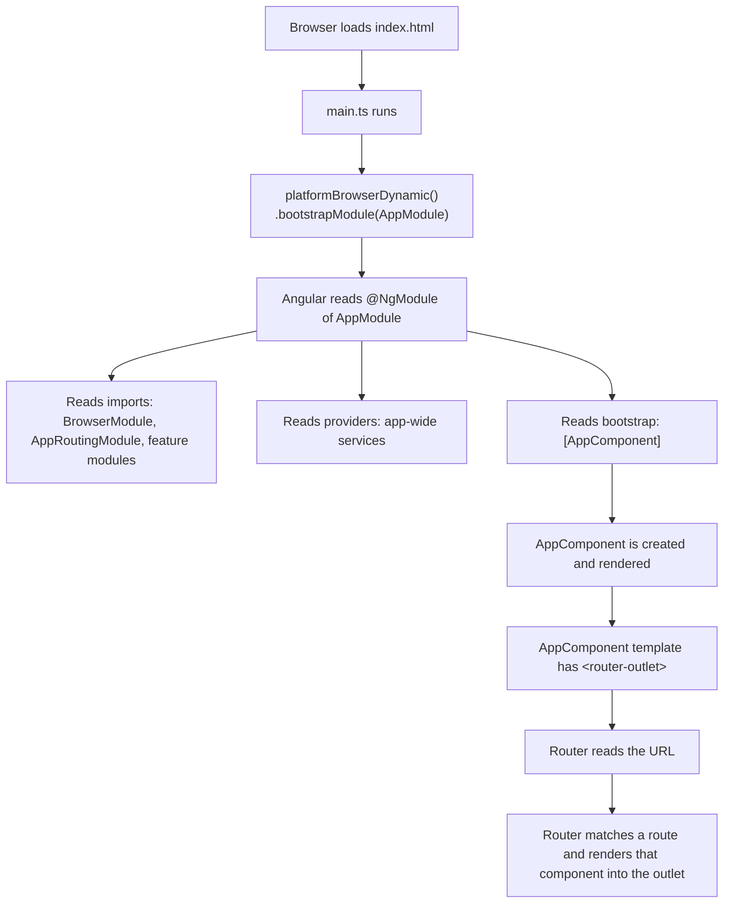
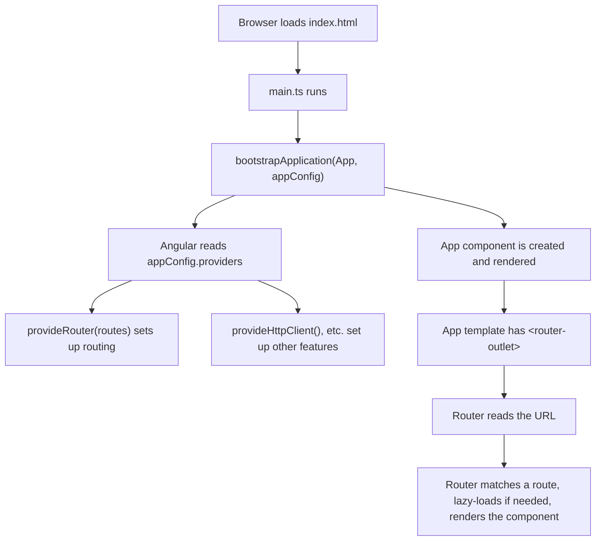
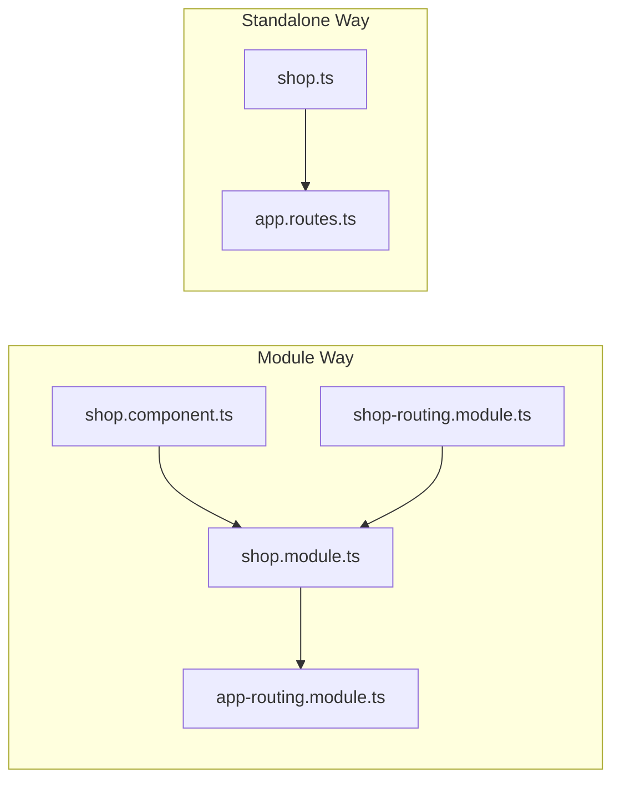

# From NgModules to Standalone: A Complete, Beginner‑Friendly Guide to Angular Components & Routing (Angular 22)

> A long, step‑by‑step tutorial. We learn how Angular worked with **NgModules**, how it works now with **Standalone Components** in **Angular 22**, how to **migrate** from one to the other, and **when to use which**. Real code, real diagrams, and a real example app throughout.

---

## Table of Contents

- [How to Read This Guide](#how-to-read-this-guide)
- [Chapter 0 — The Absolute Basics (Read First)](#chapter-0--the-absolute-basics-read-first)
- [Chapter 1 — Components & Routing the NgModule Way](#chapter-1--components--routing-the-ngmodule-way)
  - [1.1 What Is a Component?](#11-what-is-a-component)
  - [1.2 What Is an NgModule, and Why Did Angular Use It?](#12-what-is-an-ngmodule-and-why-did-angular-use-it)
  - [1.3 The Five Fields of `@NgModule`](#13-the-five-fields-of-ngmodule)
  - [1.4 Feature Modules & Shared Modules](#14-feature-modules--shared-modules)
  - [1.5 Lazy‑Loaded Modules](#15-lazy-loaded-modules)
  - [1.6 Routing in a Module‑Based App](#16-routing-in-a-module-based-app)
  - [1.7 The Startup Flow (Module Version)](#17-the-startup-flow-module-version)
  - [1.8 Summary & Key Takeaways](#18-summary--key-takeaways)
- [Chapter 2 — Components & Routing the Standalone Way (Angular 22)](#chapter-2--components--routing-the-standalone-way-angular-22)
  - [2.1 What Is a Standalone Component?](#21-what-is-a-standalone-component)
  - [2.2 Why Angular Introduced Standalone](#22-why-angular-introduced-standalone)
  - [2.3 Component‑Level Imports](#23-component-level-imports)
  - [2.4 Application Configuration & `bootstrapApplication()`](#24-application-configuration--bootstrapapplication)
  - [2.5 `provideRouter()` & Route Definitions](#25-providerouter--route-definitions)
  - [2.6 Lazy Loading Standalone Components](#26-lazy-loading-standalone-components)
  - [2.7 Layout Routes & Child Routes](#27-layout-routes--child-routes)
  - [2.8 Guards & Resolvers](#28-guards--resolvers)
  - [2.9 The Startup Flow (Standalone Version)](#29-the-startup-flow-standalone-version)
  - [2.10 Angular 22 Specifics You Should Know](#210-angular-22-specifics-you-should-know)
  - [2.11 Summary & Key Takeaways](#211-summary--key-takeaways)
- [Chapter 3 — Migrating from NgModules to Standalone](#chapter-3--migrating-from-ngmodules-to-standalone)
  - [3.1 The Mental Model of Migration](#31-the-mental-model-of-migration)
  - [3.2 Convert a Component, Directive, or Pipe](#32-convert-a-component-directive-or-pipe)
  - [3.3 Replace Module Imports with Component Imports](#33-replace-module-imports-with-component-imports)
  - [3.4 Migrate `AppModule` → `bootstrapApplication()`](#34-migrate-appmodule--bootstrapapplication)
  - [3.5 Migrate `AppRoutingModule` → `provideRouter()`](#35-migrate-approutingmodule--providerouter)
  - [3.6 Migrate Feature & Lazy Modules](#36-migrate-feature--lazy-modules)
  - [3.7 The Automated Migration Tool](#37-the-automated-migration-tool)
  - [3.8 Common Problems & Fixes](#38-common-problems--fixes)
  - [3.9 Strategy for Large Apps](#39-strategy-for-large-apps)
  - [3.10 Summary & Key Takeaways](#310-summary--key-takeaways)
- [Chapter 4 — Comparison, Best Practices & a Real Example](#chapter-4--comparison-best-practices--a-real-example)
  - [4.1 Side‑by‑Side Comparison](#41-side-by-side-comparison)
  - [4.2 Performance, Maintainability, Scalability](#42-performance-maintainability-scalability)
  - [4.3 Developer Experience & Learning Curve](#43-developer-experience--learning-curve)
  - [4.4 Real‑World Recommendations](#44-real-world-recommendations)
  - [4.5 The Same App, Both Ways](#45-the-same-app-both-ways)
- [Final Cheat Sheet](#final-cheat-sheet)

---

## How to Read This Guide

If you are brand new to Angular, read from Chapter 0 in order. If you already know the old NgModule world and just want the new way, jump to Chapter 2. If you have an existing app to convert, Chapter 3 is your recipe book.

Throughout, you will see two recurring icons in the prose:

- **What it is** — the plain definition of a term.
- **Why it matters** — the reason the feature exists, so you remember it instead of memorizing it.

We will use one running example: a small online shop called **LiliShop**, with a public area (shop, basket, checkout) and an admin area (products, users). It is small enough to follow, but real enough to show the patterns you will meet at work.

---

## Chapter 0 — The Absolute Basics (Read First)

Before components and modules, four words appear everywhere in Angular. Let's define them once.

**Angular.** A framework for building web applications using **TypeScript** (JavaScript with types). It gives you a structured way to build a UI out of reusable pieces.

**TypeScript.** JavaScript plus a type system. When you write `name: string`, you are telling the compiler "this must always be text." It catches mistakes before the app runs.

**Decorator.** A special label that starts with `@` and sits on top of a class. It attaches extra meaning to that class. `@Component({...})` says "this class is a component." `@NgModule({...})` says "this class is a module." A decorator is just configuration written in a fancy way.

**Signal.** Angular's modern way of holding a value that can change over time. You read it by *calling it* like a function: `count()`. When the value changes, anything using it updates automatically. Angular 22 is "signal‑first," meaning signals are now the default tool for reactive data. (We won't go deep on signals here, but you'll see the word.)

Keep these four in your back pocket. Now let's build.

---

## Chapter 1 — Components & Routing the NgModule Way

This is "old Angular" — roughly versions 2 through 16. You still meet it constantly because millions of apps were built this way (including LiliShop, before we migrated it). Understanding it makes the new way *click*, because the new way is mostly "the old way, with the boilerplate removed."

### 1.1 What Is a Component?

**What it is.** A component is one reusable piece of your screen. A button, a navigation bar, a product card, an entire page — each is a component. A component bundles three things:

1. **A template** — the HTML that says what to show.
2. **A class** — the TypeScript that holds the data and logic.
3. **Styles** — the CSS for how it looks.

Here is the smallest possible component in the old style:

```typescript
import { Component } from '@angular/core';

@Component({
  selector: 'app-product-card',     // the HTML tag you'll use: <app-product-card>
  templateUrl: './product-card.component.html',
  styleUrl: './product-card.component.css',
})
export class ProductCardComponent {
  title = 'Coffee Mug';
  price = 9.99;
}
```

Let's name every part:

- **`selector`** — the custom HTML tag name. Once this component exists, writing `<app-product-card></app-product-card>` somewhere puts it on the screen.
- **`templateUrl`** — points to the HTML file. (You can also write the HTML inline with `template:` instead.)
- **`styleUrl`** — points to the CSS file.
- **The class** (`ProductCardComponent`) — holds the data (`title`, `price`) the template can display with `{{ title }}`.

> **Why a component is a class with a decorator:** the class holds your logic in a normal, testable way, and the `@Component` decorator tells Angular how to turn that class into something on the screen. Separating the two keeps logic clean and display declarative.

### 1.2 What Is an NgModule, and Why Did Angular Use It?

Here is the key fact about old Angular: **a component could not be used on its own.** Before you could put `<app-product-card>` on a page, you had to *register* it inside an **NgModule**.

**What it is.** An NgModule is a container class, marked with `@NgModule`, that groups related components, directives, and pipes together and tells Angular how they fit into the app. Think of it as a *box with a packing list*: "here are the parts inside this box, here are the boxes I depend on, and here are the parts I let other boxes use."

```typescript
import { NgModule } from '@angular/core';
import { CommonModule } from '@angular/common';
import { ProductCardComponent } from './product-card.component';

@NgModule({
  declarations: [ProductCardComponent], // the parts INSIDE this box
  imports: [CommonModule],              // other boxes this box needs
  exports: [ProductCardComponent],      // parts other boxes may use
})
export class ProductModule {}
```

**Why Angular used it.** When Angular 2 launched in 2016, JavaScript did not have a great built‑in way to organize big applications and to support features like **lazy loading** (loading code only when needed). NgModules solved several problems at once:

1. **Grouping** — keep related features together.
2. **Dependency management** — declare what a group needs.
3. **Compilation boundaries** — give the Angular compiler clear units to process.
4. **Lazy‑loading units** — a module became the natural "chunk" of code to load on demand.

**Why it eventually became a burden.** Every single component, no matter how tiny, had to be declared in *exactly one* module. Beginners constantly hit the error "component is not a known element" — which simply meant "you forgot to declare or import it somewhere." A lot of NgModules existed only to satisfy Angular, not to express anything meaningful about your app. That friction is exactly what the standalone approach removes.

### 1.3 The Five Fields of `@NgModule`

These five properties are the entire NgModule system. Learn them and you understand old Angular's architecture.

| Field | Plain meaning | Real example |
| --- | --- | --- |
| **`declarations`** | The components, directives, and pipes that *belong to* this module. Each one lives in exactly one module. | `[ShopComponent, ProductItemComponent]` |
| **`imports`** | Other modules whose exported parts this module wants to *use*. | `[CommonModule, ReactiveFormsModule]` |
| **`exports`** | The parts of this module that *other* modules are allowed to use. | `[ProductItemComponent]` |
| **`providers`** | Services this module makes available for **dependency injection** (more below). | `[BasketService]` |
| **`bootstrap`** | The single root component Angular renders first. Only the root `AppModule` uses this. | `[AppComponent]` |

Two terms in that table need their own definitions:

**Directive.** A class that adds behavior to an existing element without being a full component. Example: a directive that highlights a row on hover. (A component is actually a special kind of directive — one that also has a template.)

**Pipe.** A small tool that transforms a value in the template. `{{ price | currency }}` turns `9.99` into `$9.99`. The `|` is the pipe operator; `currency` is the pipe.

**Dependency injection (DI).** A system where, instead of a class creating the things it needs, Angular *hands them in* automatically. You ask for a `BasketService` in your constructor, and Angular provides one. `providers` is where you tell Angular how to create those things. DI is one of Angular's most important ideas and it survives unchanged into the standalone world.

```typescript
export class ShopComponent {
  // We "ask for" BasketService; Angular injects it. We never write `new BasketService()`.
  constructor(private basket: BasketService) {}
}
```

### 1.4 Feature Modules & Shared Modules

As apps grow, one giant module becomes unmanageable. So old Angular split things into two common kinds of module.

**Feature module.** **What it is:** a module that groups everything for one area of the app. In LiliShop, a `ShopModule` would hold the shop page, the product list, the product detail, and the shop's routing. **Why it matters:** it keeps a feature self‑contained and makes lazy loading possible (you can load the whole `ShopModule` only when the user visits `/shop`).

**Shared module.** **What it is:** a module that collects the common pieces used across *many* features — shared buttons, dialogs, pipes, and re‑exported Angular modules — so each feature can import one thing instead of twenty. **Why it matters:** it removes repetition. **The catch:** shared modules often became dumping grounds, and importing a big `SharedModule` pulled in things a component didn't actually use.

```typescript
// A typical SharedModule (old style)
@NgModule({
  declarations: [ConfirmationDialogComponent, TruncatePipe],
  imports: [CommonModule, ReactiveFormsModule, MatButtonModule],
  exports: [
    ConfirmationDialogComponent,
    TruncatePipe,
    CommonModule,          // re-export so features get these "for free"
    ReactiveFormsModule,
    MatButtonModule,
  ],
})
export class SharedModule {}
```

```
        ┌──────────────────────────────────────────────┐
        │                  AppModule                   │
        │  (root - has bootstrap: [AppComponent])      │
        └───────────────┬──────────────────────────────┘
                        │ imports
        ┌───────────────┼───────────────┐
        ▼               ▼               ▼
  ┌───────────┐   ┌───────────┐   ┌───────────┐
  │ ShopModule│   │AdminModule│   │SharedModule│ ◄─── imported by many
  │ (feature) │   │ (feature) │   │ (common)  │
  └───────────┘   └───────────┘   └───────────┘
```

### 1.5 Lazy‑Loaded Modules

**What it is.** Lazy loading means a chunk of your app is downloaded by the browser **only when the user navigates to it**, instead of all at once on first load.

**Why it matters.** The first page load is faster because the browser downloads less code. A user who never visits the admin area never downloads the admin code.

In the module world, the unit of lazy loading was a **whole module**, wired through the router with `loadChildren`:

```typescript
const routes: Routes = [
  {
    path: 'admin',
    // Only when the user goes to /admin does the browser fetch admin.module
    loadChildren: () => import('./admin/admin.module').then(m => m.AdminModule),
  },
];
```

Read that as: "When someone visits `/admin`, go fetch the file that contains `AdminModule`, then hand that module to the router." Remember this `loadChildren` → *module* shape — in Chapter 3 we replace it with `loadComponent` → *component* or `loadChildren` → *routes array*.

### 1.6 Routing in a Module‑Based App

**Routing.** **What it is:** the system that shows different components based on the URL. URL `/shop` shows the shop page; `/basket` shows the basket. **Why it matters:** it turns one HTML page into a multi‑screen app without full page reloads (a "single‑page application").

In the module world, routing was itself configured through a module. Four building blocks did all the work.

**`Routes`** — an array of "URL → component" rules:

```typescript
const routes: Routes = [
  { path: 'shop', component: ShopComponent },
  { path: 'basket', component: BasketComponent },
  { path: '', redirectTo: 'shop', pathMatch: 'full' }, // empty URL → /shop
  { path: '**', component: NotFoundComponent },         // anything else → 404
];
```

**`AppRoutingModule`** — a dedicated module that registered those routes at the root with `RouterModule.forRoot()`:

```typescript
@NgModule({
  imports: [RouterModule.forRoot(routes)], // forRoot = "these are the app's top routes"
  exports: [RouterModule],
})
export class AppRoutingModule {}
```

Feature modules used `RouterModule.forChild(routes)` instead — same idea, but for routes that belong to a lazily loaded feature, not the root.

Now the four directives and classes you use day to day:

- **`RouterOutlet`** — the placeholder in a template, written `<router-outlet></router-outlet>`, where the matched component appears. The rest of the page (like your nav bar) stays put; only the outlet's contents swap.
- **`RouterLink`** — the navigation directive: `<a routerLink="/shop">Shop</a>`. Unlike a plain `href`, it navigates *without* reloading the whole page.
- **`Router`** — a service you inject to navigate from code: `this.router.navigate(['/checkout'])`. Useful after, say, a successful form submit.
- **`ActivatedRoute`** — a service that tells a component *which route it is on right now*, including its parameters. On `/product/42`, you read the `42` from `ActivatedRoute`.

```typescript
export class ProductDetailComponent {
  constructor(private route: ActivatedRoute, private router: Router) {}

  ngOnInit() {
    const id = this.route.snapshot.paramMap.get('id'); // read "42" from /product/42
  }

  goHome() {
    this.router.navigate(['/shop']); // navigate from code
  }
}
```

### 1.7 The Startup Flow (Module Version)

Here is what actually happens when a module‑based Angular app loads. Follow the arrows.



In words: the browser loads `index.html`, which runs `main.ts`, which **bootstraps** `AppModule`. Angular reads `AppModule`'s decorator to learn the app's imports, providers, and root component. It renders `AppComponent`. Inside `AppComponent` sits a `<router-outlet>`, so the router looks at the URL and drops the matching component into that outlet.

### 1.8 Summary & Key Takeaways

- A **component** = template + class + styles, marked with `@Component`.
- In old Angular, **every component had to be declared in exactly one NgModule** before you could use it.
- `@NgModule` has five fields: **declarations, imports, exports, providers, bootstrap**.
- **Feature modules** group one area; **shared modules** group common parts; **lazy modules** load on demand via `loadChildren`.
- Routing used a dedicated **`AppRoutingModule`** with `RouterModule.forRoot()`, plus **`RouterOutlet`, `RouterLink`, `Router`, `ActivatedRoute`**.
- The app started by **bootstrapping `AppModule`**, which rendered `AppComponent`, which hosted the router outlet.
- The recurring pain: lots of boilerplate modules that existed only to satisfy Angular. Standalone removes them.

---

## Chapter 2 — Components & Routing the Standalone Way (Angular 22)

Now the modern world. The big idea in one line: **the NgModule disappears, and each component declares its own dependencies.**

### 2.1 What Is a Standalone Component?

**What it is.** A standalone component is a component that does **not** need to be declared in any NgModule. It is self‑sufficient: it lists its own dependencies directly.

In Angular 22, standalone is the **default**. You no longer even write `standalone: true` — it is simply assumed. (If you ever truly need the old behavior, you write `standalone: false`.)

```typescript
import { Component } from '@angular/core';
import { CurrencyPipe } from '@angular/common';

@Component({
  selector: 'app-product-card',
  imports: [CurrencyPipe],   // <-- the component declares what IT needs
  template: `<h3>{{ title }} — {{ price | currency }}</h3>`,
})
export class ProductCard {
  title = 'Coffee Mug';
  price = 9.99;
}
```

Notice the difference from Chapter 1: there is **no module**. The component itself has an `imports` array. It says "to render my template I need the `CurrencyPipe`," and that's the whole story.

> **A naming note for Angular 22:** the CLI now generates classes *without* the `Component` suffix (`ProductCard`, not `ProductCardComponent`) and files like `product-card.ts` instead of `product-card.component.ts`. Both styles work; you'll see the shorter one in new projects.

### 2.2 Why Angular Introduced Standalone

The standalone approach exists to fix the exact pains from Chapter 1:

1. **Less boilerplate.** No more module files that exist only to declare a single component.
2. **Clearer dependencies.** A component's `imports` array tells you *exactly* what it uses. You don't have to hunt through a `SharedModule` to find out.
3. **Easier learning.** Beginners stop hitting "not a known element" errors caused by forgetting to declare something in a far‑away module.
4. **Better tree‑shaking.** **Tree‑shaking** is the build tool's ability to drop unused code. When each component imports only what it needs, the bundler can remove the rest more precisely, producing smaller downloads.
5. **Simpler lazy loading.** You can lazy‑load a *single component*, not just a whole module.

**The trade‑offs (honesty matters):**

- If a common pill (say, a Material button) is used by 30 components, each of those 30 now imports it explicitly. That's a little more repetition at the top of each file. (Solution: small shared *arrays* of imports, or just let your editor auto‑import.)
- Teams that built deep mental models around modules have to adjust. The concepts (DI, routing, lazy loading) are the same, but the wiring is different.

For almost all new work, the benefits clearly win — which is why Angular made standalone the default.

### 2.3 Component‑Level Imports

This is the heart of the standalone model, so let's be precise. A standalone component's `imports` array can contain:

- **Other standalone components** you use in your template (e.g. `<app-product-card>`).
- **Directives** you use (e.g. `RouterLink`, `NgClass`).
- **Pipes** you use (e.g. `CurrencyPipe`, `AsyncPipe`).
- **Existing NgModules** when a library still ships them (e.g. `ReactiveFormsModule`, or an Angular Material module). Standalone components can import old modules — interop works both ways.

```typescript
@Component({
  selector: 'app-shop',
  imports: [
    ProductCard,          // a standalone component
    RouterLink,           // a directive
    CurrencyPipe,         // a pipe
    ReactiveFormsModule,  // an old-style module — still allowed
  ],
  templateUrl: './shop.html',
})
export class Shop {}
```

> **Rule of thumb:** if you reference something in your template — a tag, an attribute directive, or a `| pipe` — it must be in that component's `imports`. If you forget, Angular tells you exactly what's missing.

**Standalone directives and pipes** work the same way as standalone components: you mark them (standalone by default in v22) and import them directly where used, instead of declaring them in a module.

```typescript
import { Pipe, PipeTransform } from '@angular/core';

@Pipe({ name: 'truncate' }) // standalone by default in v22
export class TruncatePipe implements PipeTransform {
  transform(value: string, limit = 20): string {
    return value.length > limit ? value.slice(0, limit) + '…' : value;
  }
}
```

### 2.4 Application Configuration & `bootstrapApplication()`

With no `AppModule`, where do app‑wide settings live? In two places: a config object and a bootstrap call.

**`bootstrapApplication()`** — **What it is:** the function that starts a standalone app. It replaces the old `bootstrapModule(AppModule)`. **Why it matters:** it takes your root component *directly*, with no module in between.

```typescript
// main.ts
import { bootstrapApplication } from '@angular/platform-browser';
import { App } from './app/app';
import { appConfig } from './app/app.config';

bootstrapApplication(App, appConfig)
  .catch(err => console.error(err));
```

**`ApplicationConfig`** — **What it is:** a plain object holding your app‑wide **providers** (the things that used to live in `AppModule`'s `imports` and `providers`). **Why it matters:** it's the single home for global setup, expressed as a list of `provideX()` functions.

```typescript
// app.config.ts
import { ApplicationConfig, provideZonelessChangeDetection } from '@angular/core';
import { provideRouter } from '@angular/router';
import { provideHttpClient } from '@angular/common/http';
import { routes } from './app.routes';

export const appConfig: ApplicationConfig = {
  providers: [
    provideZonelessChangeDetection(), // modern, zone-free change detection (v22 default)
    provideRouter(routes),            // set up routing
    provideHttpClient(),              // enable HttpClient for API calls
  ],
};
```

Notice the pattern: every global feature is now a **`provideX()` function** you add to a list. Need routing? `provideRouter`. Need HTTP? `provideHttpClient`. Need animations? `provideAnimations`. This is far more discoverable than hunting through module `imports`.

### 2.5 `provideRouter()` & Route Definitions

**`provideRouter()`** replaces the entire `AppRoutingModule` + `RouterModule.forRoot()` machinery. You hand it your routes array, and routing is on.

Routes themselves are written in a plain file — no module wrapper:

```typescript
// app.routes.ts
import { Routes } from '@angular/router';

export const routes: Routes = [
  { path: '', redirectTo: 'shop', pathMatch: 'full' },
  { path: 'shop', loadComponent: () => import('./shop/shop').then(m => m.Shop) },
  { path: 'basket', loadComponent: () => import('./basket/basket').then(m => m.Basket) },
  { path: '**', redirectTo: 'not-found' },
];
```

The router **directives are identical to the old world** — `RouterOutlet`, `RouterLink`, `Router`, `ActivatedRoute` all behave the same. The only change is that a standalone component **imports them itself**:

```typescript
import { Component } from '@angular/core';
import { RouterOutlet, RouterLink, RouterLinkActive } from '@angular/router';

@Component({
  selector: 'app-root',
  imports: [RouterOutlet, RouterLink, RouterLinkActive],
  template: `
    <nav>
      <a routerLink="/shop" routerLinkActive="active">Shop</a>
      <a routerLink="/basket" routerLinkActive="active">Basket</a>
    </nav>
    <router-outlet />
  `,
})
export class App {}
```

`routerLinkActive="active"` adds the CSS class `active` to whichever link matches the current URL — handy for highlighting the current page.

### 2.6 Lazy Loading Standalone Components

Here standalone shines. You can lazy‑load a single component with **`loadComponent`** — no module required:

```typescript
{
  path: 'discounts',
  loadComponent: () => import('./admin/discounts/discounts').then(c => c.Discounts),
}
```

And when a feature has *several* routes, you lazy‑load a **routes array** with `loadChildren` pointing at a plain file (not a module):

```typescript
{
  path: 'shop',
  loadChildren: () => import('./shop/shop.routes').then(m => m.SHOP_ROUTES),
}
```

```typescript
// shop/shop.routes.ts — a plain array, no @NgModule
import { Routes } from '@angular/router';

export const SHOP_ROUTES: Routes = [
  { path: '', loadComponent: () => import('./shop').then(m => m.Shop) },
  { path: ':id', loadComponent: () => import('./product-detail').then(m => m.ProductDetail) },
];
```

Compare the two lazy shapes:

| Goal | Old (module) | New (standalone) |
| --- | --- | --- |
| Lazy‑load one screen | `loadChildren` → a module with one component | `loadComponent` → the component |
| Lazy‑load a feature with many screens | `loadChildren` → a feature module | `loadChildren` → a `*.routes.ts` array |

### 2.7 Layout Routes & Child Routes

Real apps wrap pages in a shared **layout** — a header, a footer, a sidebar — that stays on screen while the inner page changes. You express this with a **parent route that has a component plus `children`**.

```typescript
// user-layout.routes.ts
import { Routes } from '@angular/router';
import { UserLayout } from './user-layout';

export const USER_LAYOUT_ROUTES: Routes = [
  {
    path: '',
    component: UserLayout,          // the shell: header + footer + its own <router-outlet>
    children: [
      { path: '', redirectTo: 'shop', pathMatch: 'full' },
      { path: 'shop', loadChildren: () => import('./shop/shop.routes').then(m => m.SHOP_ROUTES) },
      { path: 'basket', loadChildren: () => import('./basket/basket.routes').then(m => m.BASKET_ROUTES) },
    ],
  },
];
```

The trick: `UserLayout`'s template contains its **own** `<router-outlet>`. The app has an outer outlet (in `App`) and the layout has an inner one. The outer outlet shows the layout; the inner outlet shows the page. This is exactly the structure in a real LiliShop‑style app — a user layout holding shop/basket/checkout, and a separate admin layout holding the admin pages.

```
App (outer <router-outlet>)
└── UserLayout  (header + footer + inner <router-outlet>)
    ├── Shop
    ├── Basket
    └── Checkout
```

### 2.8 Guards & Resolvers

**Route guard.** **What it is:** a function that runs *before* a route activates and answers "is the user allowed here?" Return `true` to allow, `false` (or a redirect) to block. **Why it matters:** it protects pages like checkout or admin from users who aren't logged in or lack permission.

In modern Angular, guards are **plain functions** (not classes). The common ones are `canActivate` (can the user enter this route?) and `canMatch` (should this route even be considered? — great for blocking a lazy chunk from downloading at all).

```typescript
import { CanMatchFn, Router } from '@angular/router';
import { inject } from '@angular/core';
import { AuthService } from './auth.service';

export const authGuard: CanMatchFn = (route, segments, currentSnapshot) => {
  const auth = inject(AuthService);  // inject() lets us use DI inside a function
  const router = inject(Router);
  return auth.isLoggedIn() ? true : router.parseUrl('/account/login');
};
```

```typescript
// using it on a route
{ path: 'checkout', canMatch: [authGuard], loadChildren: () => import('./checkout/checkout.routes').then(m => m.CHECKOUT_ROUTES) }
```

> **Angular 22 note:** `CanMatchFn` now takes a **third parameter**, `currentSnapshot`. If you wrote a guard for an older Angular with only `(route, segments)`, update the signature (an automatic migration handles this during `ng update`).

**Resolver.** **What it is:** a function that fetches data *before* a route loads, so the page opens with its data already in hand instead of flashing empty then filling in. **Why it matters:** smoother UX for data‑heavy pages. Like guards, resolvers are now plain functions:

```typescript
import { ResolveFn } from '@angular/router';
import { inject } from '@angular/core';
import { ProductService } from './product.service';

export const productResolver: ResolveFn<Product> = (route) => {
  const id = Number(route.paramMap.get('id'));
  return inject(ProductService).getProduct(id);
};

// on the route:
{ path: ':id', resolve: { product: productResolver }, loadComponent: () => import('./product-detail').then(m => m.ProductDetail) }
```

### 2.9 The Startup Flow (Standalone Version)

Compare this to the module flow in 1.7 — it's shorter, because two boxes (AppModule, AppRoutingModule) are gone.



In words: `index.html` runs `main.ts`, which calls `bootstrapApplication(App, appConfig)`. Angular reads the providers from `appConfig` (routing, HTTP, and so on), renders the root `App` component, and the router fills the outlet based on the URL — lazy‑loading the chunk if the route uses `loadComponent`/`loadChildren`.

### 2.10 Angular 22 Specifics You Should Know

A few defaults changed in Angular 22 (released around June 2026). They affect the code above, so know them:

- **Standalone is the default.** No `standalone: true` needed.
- **Zoneless change detection** is the default for new projects (`provideZonelessChangeDetection()`), so apps no longer ship Zone.js by default. This pairs naturally with signals.
- **`OnPush` is the default change‑detection strategy** for new components, which makes them faster by default.
- **`paramsInheritanceStrategy` now defaults to `'always'`**, meaning child routes inherit their parent's route parameters by default. Handy, but worth remembering when you nest routes.
- **`canMatch` guards take a third parameter** (`currentSnapshot`), as noted above.
- **Signal Forms** became stable, giving a signal‑based alternative to Reactive Forms (a topic of its own).

### 2.11 Summary & Key Takeaways

- A **standalone component** declares its own dependencies in an `imports` array — **no NgModule required**. In v22 it's the default.
- App‑wide setup moved from `AppModule` into **`app.config.ts`** (an `ApplicationConfig`) plus **`bootstrapApplication()`** in `main.ts`.
- Routing moved from `AppRoutingModule` to **`provideRouter(routes)`**, with routes in a plain **`app.routes.ts`** file.
- **`RouterOutlet`, `RouterLink`, `Router`, `ActivatedRoute` are unchanged** — components just import them directly.
- Lazy‑load a single screen with **`loadComponent`**, or a multi‑route feature with **`loadChildren` → a routes array**.
- **Layouts** are parent routes with a `component` and `children`, each layout hosting its own `<router-outlet>`.
- **Guards and resolvers are plain functions** using `inject()`.
- Angular 22 brings zoneless + OnPush defaults and a couple of routing default changes to keep in mind.

---

## Chapter 3 — Migrating from NgModules to Standalone

You have an existing module‑based app and you want to modernize it. This chapter is the recipe. (It is exactly the path a real LiliShop‑style app follows.)

### 3.1 The Mental Model of Migration

Hold one idea in your head: **migration is a series of small, safe replacements, not one big rewrite.** Each NgModule concept maps to a standalone concept:

```
declarations:  [X]   ──►  X becomes standalone, declares its own imports
imports of a module  ──►  imports array on each component that needs them
AppModule            ──►  bootstrapApplication() + app.config.ts
AppRoutingModule     ──►  provideRouter(routes) + app.routes.ts
feature module       ──►  a *.routes.ts file (an array of routes)
loadChildren → module──►  loadChildren → routes array  (or loadComponent)
```

Do them in this order, building and committing after each step, and you can stop safely at any point — old and new styles run side by side.

### 3.2 Convert a Component, Directive, or Pipe

The first step is making each declarable standalone.

**Before** (declared in a module, no `imports` of its own):

```typescript
@Component({
  selector: 'app-product-item',
  templateUrl: './product-item.component.html',
})
export class ProductItemComponent {}
```

**After** (standalone — it now lists what its template uses):

```typescript
@Component({
  selector: 'app-product-item',
  imports: [CurrencyPipe, RouterLink], // whatever the template references
  templateUrl: './product-item.component.html',
})
export class ProductItemComponent {}
```

The same applies to directives and pipes: they become standalone and are imported directly where used, instead of being declared in a module. You rarely do this by hand for a whole app — the automated tool (3.7) does the bulk.

### 3.3 Replace Module Imports with Component Imports

When a component used to rely on a `SharedModule` for, say, Reactive Forms and a Material button, you now import those *into the component itself*:

**Before:** `ShopModule` imported `ReactiveFormsModule` and `SharedModule`, and `ShopComponent` got them "for free."

**After:** `Shop` imports exactly what it uses:

```typescript
@Component({
  selector: 'app-shop',
  imports: [ReactiveFormsModule, ProductItem, MatButtonModule],
  templateUrl: './shop.html',
})
export class Shop {}
```

> **Tip:** if many components share the same handful of imports, export a small `const` array and spread it: `imports: [...SHARED_IMPORTS, ProductItem]`. It keeps things DRY without resurrecting a giant `SharedModule`.

### 3.4 Migrate `AppModule` → `bootstrapApplication()`

Move everything that lived in `AppModule` into `app.config.ts`, then bootstrap the root component directly.

**Before:**

```typescript
@NgModule({
  declarations: [AppComponent],
  imports: [BrowserModule, AppRoutingModule, HttpClientModule],
  providers: [{ provide: HTTP_INTERCEPTORS, useClass: AuthInterceptor, multi: true }],
  bootstrap: [AppComponent],
})
export class AppModule {}
```

**After** — `app.config.ts` collects the providers:

```typescript
export const appConfig: ApplicationConfig = {
  providers: [
    provideRouter(routes),
    provideHttpClient(withInterceptors([authInterceptor])), // interceptor as a function now
  ],
};
```

…and `main.ts` bootstraps the component:

```typescript
bootstrapApplication(App, appConfig).catch(err => console.error(err));
```

Two things to watch: `BrowserModule` is no longer imported (it's built into `bootstrapApplication`), and class‑based HTTP interceptors are typically rewritten as **functional interceptors** passed to `withInterceptors([...])`.

### 3.5 Migrate `AppRoutingModule` → `provideRouter()`

Take the `routes` array out of `AppRoutingModule`, drop it into `app.routes.ts`, delete the module wrapper, and register the array with `provideRouter(routes)` (shown above). The routes themselves barely change — only the wrapper around them disappears.

### 3.6 Migrate Feature & Lazy Modules

Each feature module becomes a **routes file**. And each lazy `loadChildren → module` becomes either `loadChildren → routes array` or `loadComponent`.

**Before:**

```typescript
// app routes
{ path: 'admin', loadChildren: () => import('./admin/admin.module').then(m => m.AdminModule) }

// admin-routing.module.ts
const routes: Routes = [{ path: '', component: AdminComponent, children: [/* ... */] }];
@NgModule({ imports: [RouterModule.forChild(routes)] })
export class AdminRoutingModule {}
```

**After:**

```typescript
// app.routes.ts
{ path: 'admin', loadChildren: () => import('./admin/admin.routes').then(m => m.ADMIN_ROUTES) }

// admin/admin.routes.ts — just an array
export const ADMIN_ROUTES: Routes = [
  { path: '', component: Admin, children: [/* ... */] },
];
```

The `admin.module.ts` and `admin-routing.module.ts` files are now empty of purpose — delete them.

### 3.7 The Automated Migration Tool

You don't do all of this by hand. Angular ships an official schematic:

```bash
ng generate @angular/core:standalone
```

Run it **three times**, choosing one option each time, in this order:

1. **Convert all components, directives and pipes to standalone** — makes everything standalone and fixes test files.
2. **Remove unnecessary NgModule classes** — deletes modules that nothing depends on anymore.
3. **Bootstrap the project using standalone APIs** — rewrites `main.ts` to `bootstrapApplication()`.

> **Important ordering rule:** the tool won't delete a module that is still in use. If your lazy routes still say `loadChildren → some.module`, that module *stays*, because something still depends on it. So you often need to convert lazy routes to the routes‑array shape (3.6) *before* step 2 can remove those modules. This is the single most common reason the remover reports "Nothing to be done."

### 3.8 Common Problems & Fixes

| Symptom | Cause | Fix |
| --- | --- | --- |
| "Nothing to be done" when removing modules | Modules still referenced by `loadChildren → module` | Convert those lazy routes to `loadChildren → routes array` or `loadComponent`, then re‑run |
| "X is not a known element" after converting | The component's template uses something not in its `imports` | Add the missing component/directive/pipe to that component's `imports` |
| A pipe like `| async` stops working | `CommonModule` was implicit before; now it's missing | Import the specific pipe (`AsyncPipe`) into the component |
| Guard behaves oddly after upgrade | `CanMatchFn` missing the v22 third parameter | Update the signature to `(route, segments, currentSnapshot)`; let `ng update` migrate it |
| HTTP interceptor no longer runs | Class interceptor not registered the new way | Rewrite as a functional interceptor and pass via `withInterceptors([...])` |
| Routes that read a parent param break | v22 changed `paramsInheritanceStrategy` to `'always'` | Usually it's *better*; if you relied on the old behavior, set it to `'emptyOnly'` |

### 3.9 Strategy for Large Apps

For a big codebase, do **not** mix concerns. Follow this order:

1. **Upgrade the Angular version first.** Get safely onto Angular 22 with the app still building the old way. Keep the *version jump* separate from the *pattern change* so bugs are easy to trace.
2. **Commit a clean baseline**, then run the automated tool one step at a time, building and committing after each.
3. **Convert lazy routes** (module → routes array) so the module‑remover can do its job.
4. **Migrate one feature at a time** if doing it manually. Old and new styles interoperate, so partial migration is safe.
5. **Verify behavior, not just the build.** A green `ng build` is not proof the app *behaves* the same — click through every area, watch the Network tab to confirm lazy chunks still load on demand, and run your tests.

> **The golden rule:** small commits. If any step misbehaves, `git reset` to the last good commit and you've lost nothing.

### 3.10 Summary & Key Takeaways

- Migration is **many small replacements**, each with a clear old→new mapping.
- Make declarables **standalone** → give each its own **`imports`** → replace **`AppModule`** with **`bootstrapApplication()` + `app.config.ts`** → replace **`AppRoutingModule`** with **`provideRouter()`** → turn **feature modules into `*.routes.ts`** files.
- Use **`ng generate @angular/core:standalone`** (three steps, in order). It can only remove modules that nothing depends on, so **convert lazy routes first**.
- Watch for the classic fixes: missing template imports, the v22 `canMatch` parameter, functional interceptors, and the params‑inheritance default.
- For large apps: **version first, then pattern**, with clean commits and real runtime verification.

---

## Chapter 4 — Comparison, Best Practices & a Real Example

### 4.1 Side‑by‑Side Comparison

| Concept | Module‑based Angular | Standalone Angular (v22) |
| --- | --- | --- |
| Unit of organization | `@NgModule` | the component itself |
| Register a component | `declarations` in a module | nothing — it's standalone |
| Declare dependencies | module `imports` | component `imports` |
| App bootstrap | `bootstrapModule(AppModule)` | `bootstrapApplication(App, appConfig)` |
| App‑wide providers | `AppModule.providers` / imported modules | `app.config.ts` → `provideX()` list |
| Routing setup | `AppRoutingModule` + `forRoot` | `provideRouter(routes)` |
| Routes location | inside a routing module | plain `app.routes.ts` array |
| Feature routing | `forChild` in a feature module | a `*.routes.ts` array |
| Lazy load one screen | `loadChildren` → module | `loadComponent` → component |
| Lazy load a feature | `loadChildren` → feature module | `loadChildren` → routes array |
| Guards/resolvers | classes implementing interfaces | plain functions with `inject()` |
| Router directives | same (`RouterOutlet`, `RouterLink`…) | same — just imported per component |
| Boilerplate | high | low |

### 4.2 Performance, Maintainability, Scalability

**Performance.** Standalone enables more precise **tree‑shaking** (dropping unused code), so bundles can be a touch smaller. Lazy‑loading a single component (rather than a whole module) gives finer control over what downloads when. Combined with Angular 22's zoneless + OnPush defaults, new apps are lean by default. The difference is real but usually modest — don't expect a dramatic speed jump from the architecture change alone.

**Maintainability.** This is where standalone wins clearly. A component's `imports` array is a precise, local list of its dependencies. There's no detective work tracing what a `SharedModule` quietly provided. Fewer files, fewer indirections, less "where is this registered?"

**Scalability.** Both scale to large apps. Module‑based apps proved it for years. But standalone scales with *less ceremony*: adding a feature means adding a folder with a component and a `*.routes.ts`, not also wiring up two module files. Lazy loading stays first‑class.

### 4.3 Developer Experience & Learning Curve

**Learning curve.** Standalone is markedly easier for beginners. The single biggest source of early confusion in old Angular — "why isn't my component showing up?" caused by module registration — largely disappears. New learners can build a working app without ever meeting `@NgModule`.

**Developer experience.** Day to day, standalone means less file‑hopping. Auto‑import in editors handles most `imports` entries for you. The mental model is "this component needs these things," which matches how people actually think.

**The one adjustment:** developers used to modules must unlearn the habit of "declare it in the module." And very large legacy apps carry migration cost. But for new code, the experience is simply lighter.

### 4.4 Real‑World Recommendations

- **New project?** Use standalone. It's the default in Angular 22 and the direction the framework is heading. There is no good reason to start with modules today.
- **Existing module app?** Migrate when you're already touching the code or doing a version upgrade. Don't migrate for its own sake under deadline pressure — it's safe to run both styles side by side and convert gradually.
- **Library author?** Ship standalone components/directives/pipes; they're consumable by both module and standalone apps.
- **Learning Angular?** Learn standalone first (it's simpler and current), then learn enough about modules to maintain older code you'll inevitably meet.

### 4.5 The Same App, Both Ways

Here is one tiny feature — a shop page reachable at `/shop` — written both ways, so the difference is concrete.

**The Module Way (4 files):**

```typescript
// shop.component.ts
@Component({ selector: 'app-shop', templateUrl: './shop.component.html' })
export class ShopComponent {}

// shop-routing.module.ts
@NgModule({
  imports: [RouterModule.forChild([{ path: '', component: ShopComponent }])],
  exports: [RouterModule],
})
export class ShopRoutingModule {}

// shop.module.ts
@NgModule({
  declarations: [ShopComponent],
  imports: [CommonModule, ShopRoutingModule],
})
export class ShopModule {}

// app-routing.module.ts (the lazy link)
const routes: Routes = [
  { path: 'shop', loadChildren: () => import('./shop/shop.module').then(m => m.ShopModule) },
];
```

**The Standalone Way (2 files):**

```typescript
// shop.ts
@Component({ selector: 'app-shop', imports: [CommonModule], templateUrl: './shop.html' })
export class Shop {}

// app.routes.ts (the lazy link — no module, no routing module)
export const routes: Routes = [
  { path: 'shop', loadComponent: () => import('./shop/shop').then(m => m.Shop) },
];
```

Same behavior. Four files become two. Two NgModules become zero. The lazy route points straight at the component. Multiply that saving across 20 features and you can see why standalone became the default — and why migrating a real app deletes dozens of files while *adding* clarity.



---

## Final Cheat Sheet

**Module world (old):**
```typescript
@NgModule({ declarations: [...], imports: [...], exports: [...], providers: [...], bootstrap: [...] })
bootstrapModule(AppModule)
RouterModule.forRoot(routes) / forChild(routes)
loadChildren: () => import('./x.module').then(m => m.XModule)
```

**Standalone world (Angular 22):**
```typescript
@Component({ imports: [...] })          // standalone by default
bootstrapApplication(App, appConfig)
provideRouter(routes)                   // in app.config.ts
loadComponent: () => import('./x').then(m => m.X)
loadChildren: () => import('./x.routes').then(m => m.X_ROUTES)
```

**Unchanged in both:** `RouterOutlet`, `RouterLink`, `Router`, `ActivatedRoute`, dependency injection, the idea of routes as URL→component rules.

**Migration order:** version upgrade → make standalone → give components their imports → convert lazy routes to arrays → remove modules → bootstrap standalone → verify behavior.

**Angular 22 defaults to remember:** standalone, zoneless, OnPush, `paramsInheritanceStrategy: 'always'`, `canMatch` third parameter.

---

*Build the same small feature both ways once, by hand, and the whole model will click. After that, standalone simply feels like Angular with the busywork removed.* 🚀
