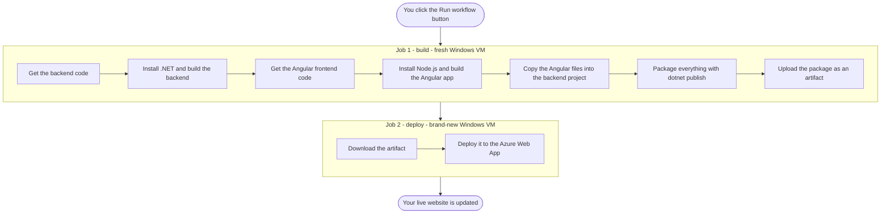

# Understanding GitHub Actions: A Line-by-Line Guide to `main_lilishop.yml`

This guide walks through a real GitHub Actions workflow file, `main_lilishop.yml`, one piece at a time. You don't need any prior CI/CD experience — by the end, you'll understand both this specific file and the general ideas behind GitHub Actions, so you can read (or write) your own workflows with confidence.

**What does this file actually do?** In plain words: it takes a .NET backend project and a separate Angular frontend project, builds both of them, combines them into a single package, and ships that package to a website running on Microsoft Azure. It only starts when a person manually presses a button — nothing here happens automatically.

## Contents

- [What Is CI/CD?](#what-is-cicd)
- [What Is GitHub Actions?](#what-is-github-actions)
- [A Quick YAML Primer](#a-quick-yaml-primer)
- [The Complete File](#the-complete-file)
- [The Big Picture](#the-big-picture)
- [Breaking It Down, Line by Line](#breaking-it-down-line-by-line)
- [What Happens When You Click "Run workflow"](#what-happens-when-you-click-run-workflow)
- [Glossary](#glossary)

---

## What Is CI/CD?

**CI** stands for **Continuous Integration**. **CD** usually means **Continuous Delivery** or **Continuous Deployment**. Put together, "CI/CD" simply means: *automate the repetitive parts of getting code from a developer's computer onto a real, working website or app.*

Think of a car factory. A person designs the car, but robots on the assembly line handle the repetitive work — welding, painting, quality checks — the same way, every single time, without anyone doing it by hand. CI/CD is that assembly line for software:

- **Continuous Integration** – every time someone changes the code, automatically build it and check that it still works.
- **Continuous Delivery/Deployment** – automatically take that working code and ship it to a real server, so users can actually use it.

Before CI/CD, developers did all of this by hand: build the project manually, copy files to a server manually, restart things manually. That's slow, and it's easy to make a mistake. A workflow file like the one below replaces all of that manual work with an automatic, repeatable recipe.

## What Is GitHub Actions?

**GitHub Actions** is GitHub's built-in automation system. You describe what you want to happen in a YAML file, save it inside your repository, and GitHub runs it for you — on GitHub's own computers, for free within certain usage limits. For GitHub to notice a workflow file at all, it has to sit inside a specific folder in your repository: `.github/workflows/`.

A few words you'll see constantly:

- **Workflow** — the entire automated process, described in one YAML file. `main_lilishop.yml` *is* a workflow.
- **Job** — a group of tasks that run together on one machine. A workflow can have one job or several. This file has two: `build` and `deploy`.
- **Step** — a single task inside a job, like "download the code" or "run this command." Steps run one after another, top to bottom.
- **Runner** — the actual computer (a temporary virtual machine) that runs your job. GitHub provides these on demand, and once the job finishes, the runner is thrown away.
- **Action** — a small, ready-made, reusable piece of automation that someone already built, so you don't have to write it yourself. `actions/checkout` is an action — you "use" it instead of writing that logic from scratch.

By default, if a workflow has more than one job, they all start **at the same time**, independently of each other — unless you specifically tell GitHub that one job has to wait for another.

## A Quick YAML Primer

The file is written in **YAML**, a simple, human-readable format for organizing information. You'll see it used for configuration files all over the software world, not just in GitHub Actions. Here's everything you need to follow along:

- **Indentation shows structure.** Lines indented further to the right "belong to" the line above them, like an outline. YAML uses spaces for this — never tabs.
- **`key: value` pairs.** This is the basic building block: a label, a colon, then its value. For example, `dotnet-version: '10.x'` sets the value `'10.x'` for the key `dotnet-version`.
- **Lists use a dash.** A `-` at the start of a line means "this is one item in a list." Every step in a job starts with a `-`, because `steps` is a list of steps.
- **`#` starts a comment.** Anything after a `#` is ignored completely — it's just a note left for humans reading the file.
- **`${{ ... }}` is an expression.** These double curly braces mean "insert a value here." Inside, you might see `env.PROJECT_PATH` (a variable you defined yourself), `secrets.GH_PAT` (a securely stored secret), or `github.workspace` (a built-in value GitHub provides automatically).
- **A pipe `|` before a block means "multiple lines follow."** It tells YAML "treat everything below, at this indentation, as one multi-line block of text, and keep the line breaks." You'll see this used for steps that run several commands in a row.

That's genuinely everything you need. Let's look at the real file.

## The Complete File

Here's `main_lilishop.yml` in full, so you can see the whole picture before we zoom in:

```yaml
name: Build and deploy ASP.Net Core app to Azure Web App - lilishop

on:
  workflow_dispatch:

jobs:
  build:
    runs-on: windows-latest

    env:
      PROJECT_PATH: ./Main/LiliShop.API

    steps:
      # Step 1: Check out the .NET backend repository (this repository)
      - uses: actions/checkout@v4

      - name: Print working directory
        run: pwd

      # Step 2: Set up .NET Core
      - name: Set up .NET Core
        uses: actions/setup-dotnet@v4
        with:
          dotnet-version: '10.x'

      # Step 3: Build the .NET project
      - name: Build with dotnet
        run: dotnet build ${{env.PROJECT_PATH}} --configuration Release

      # Step 4: Check out the Angular frontend repository using PAT
      - name: Check out frontend repository
        uses: actions/checkout@v4
        with:
          repository: jahanalem/LiliShop-frontend-angular
          path: frontend
          token: ${{ secrets.GH_PAT }} # Use PAT for accessing the private repository

      # Step 5: Set up Node.js for Angular
      - name: Set up Node.js
        uses: actions/setup-node@v4
        with:
          node-version: '26'

      # Step 6: Install Angular dependencies and build Angular app
      - name: Install dependencies and build Angular app
        run: |
          cd frontend
          npm ci --legacy-peer-deps
          npx ng build --configuration=production --output-path="../Main/LiliShop.API/ClientBuildOutput" --output-hashing=all

      - name: Copy Angular browser output to wwwroot
        run: |
          cd "${{ github.workspace }}"
          xcopy /E /I /Y "Main\LiliShop.API\ClientBuildOutput\browser\*" "Main\LiliShop.API\wwwroot\browser"

      # Step 7: List the wwwroot contents after Angular build
      - name: List wwwroot contents after Angular build
        run: ls -R ./Main/LiliShop.API/wwwroot/browser

      # Step 8: Publish the .NET project (with the Angular build included)
      - name: dotnet publish
        run: dotnet publish ${{env.PROJECT_PATH}} -c Release -o "${{github.workspace}}/myapp"

      # Step 9: Verify the publish output contents
      - name: List publish output contents
        run: ls -R "${{github.workspace}}/myapp"

      # Step 10: Upload artifact for deployment job
      - name: Upload artifact for deployment job
        uses: actions/upload-artifact@v4
        with:
          name: .net-app
          path: "${{github.workspace}}/myapp"

  deploy:
    runs-on: windows-latest
    needs: build
    environment:
      name: 'Production'
      url: ${{ steps.deploy-to-webapp.outputs.webapp-url }}
    permissions:
      id-token: write # This is required for requesting the JWT

    steps:
      - name: Download artifact from build job
        uses: actions/download-artifact@v4
        with:
          name: .net-app
          path: .  # Downloaded files go to current directory

      # No more Azure login step! Directly deploy with publish profile
      - name: Deploy to Azure Web App
        id: deploy-to-webapp
        uses: azure/webapps-deploy@v3
        with:
          app-name: 'lilishop'
          publish-profile: ${{ secrets.AZURE_PUBLISH_PROFILE }}
          package: .  # Deploy files from the current directory (downloaded artifact)
```

## The Big Picture

Before going line by line, here's the overall flow this workflow follows:



Notice that `build` and `deploy` are two separate boxes — that's because they run on two separate, unconnected virtual machines. The only way files move from one to the other is through that "artifact" step, explained properly below.

## Breaking It Down, Line by Line

### The Name

```yaml
name: Build and deploy ASP.Net Core app to Azure Web App - lilishop
```

This is just a label — the title you'll see for this workflow in the "Actions" tab of the repository. It has zero effect on what the workflow actually does; it's purely there so a human can recognize it at a glance.

### The Trigger

```yaml
on:
  workflow_dispatch:
```

`on:` tells GitHub *when* this workflow should start. There are many possible triggers — `push` (run on every push), `pull_request` (run on every pull request), a schedule, and more. Here, the only trigger is `workflow_dispatch`, which means **"only run this when a person manually clicks 'Run workflow' in GitHub's interface"** (or triggers it through GitHub's API). Nothing here happens automatically.

### The Jobs

```yaml
jobs:
  build:
    runs-on: windows-latest
```

`jobs:` opens the section listing every job in this workflow. The first one is named `build` (you could call it anything you like). `runs-on: windows-latest` tells GitHub which kind of virtual machine to use — here, the newest available Windows machine GitHub offers. Other common choices are `ubuntu-latest` or `macos-latest`.

#### A shortcut variable

```yaml
    env:
      PROJECT_PATH: ./Main/LiliShop.API
```

`env:` at this level defines an environment variable available to every step inside the `build` job. Think of it as giving a nickname to a value you'll reuse — here, the folder path of the ASP.NET Core project. Instead of typing `./Main/LiliShop.API` over and over, later steps just write `${{env.PROJECT_PATH}}`.

### Job 1: `build` — Step by Step

```yaml
    steps:
      # Step 1: Check out the .NET backend repository (this repository)
      - uses: actions/checkout@v4
```

`steps:` starts the list of tasks this job runs, one by one, top to bottom. Every step begins with a `-`.

This first step doesn't run a command — it **uses** a pre-built action instead: `actions/checkout`, version 4. This is the single most common step in almost any workflow, because a fresh runner starts out completely empty. `checkout` copies your repository's code onto that empty machine. Without it, none of the following steps would have any code to work with.

```yaml
      - name: Print working directory
        run: pwd
```

This step has a `name:` (a readable label shown in the logs) and a `run:` command instead of `uses:`. The difference matters: `uses:` runs someone else's packaged action, while `run:` types a command directly into the runner's command line, just like on your own computer. `pwd` means "print working directory" — it simply prints which folder the runner is currently sitting in. It's a small debugging step, added so whoever checks the workflow logs can confirm the current location.

> **Side note:** this file uses `windows-latest`, yet `pwd` and, later, `ls` are normally Linux/macOS commands. They work here because GitHub's Windows runners use **PowerShell** by default for `run:` steps, and PowerShell happens to include built-in aliases for several familiar Unix-style commands.

```yaml
      # Step 2: Set up .NET Core
      - name: Set up .NET Core
        uses: actions/setup-dotnet@v4
        with:
          dotnet-version: '10.x'
```

Another pre-built action: `setup-dotnet`. It installs the .NET SDK onto the runner, since a fresh machine doesn't come with it pre-installed. `with:` is how you pass settings into an action — like filling out a small form. The only setting here is which version to install: `10.x` (version 10, accepting any minor update).

```yaml
      # Step 3: Build the .NET project
      - name: Build with dotnet
        run: dotnet build ${{env.PROJECT_PATH}} --configuration Release
```

Now that .NET is installed, this step compiles the backend project using the `dotnet build` command-line tool. `${{env.PROJECT_PATH}}` plugs in the shortcut variable defined earlier. `--configuration Release` builds the polished, optimized "production" version, rather than `Debug` (which is slower but easier to troubleshoot).

```yaml
      # Step 4: Check out the Angular frontend repository using PAT
      - name: Check out frontend repository
        uses: actions/checkout@v4
        with:
          repository: jahanalem/LiliShop-frontend-angular
          path: frontend
          token: ${{ secrets.GH_PAT }} # Use PAT for accessing the private repository
```

`checkout` again — but look at the `with:` block this time. By default, `checkout` grabs the *current* repository. Here, it's told to grab a completely different repository instead — `jahanalem/LiliShop-frontend-angular`, the Angular frontend, kept as its own separate project — and place it into a new folder called `frontend` (`path: frontend`), so it doesn't mix in with the backend code.

Since that frontend repository is private, GitHub needs proof this workflow is allowed to access it. That's the job of `token: ${{ secrets.GH_PAT }}`. A **secret** is a value (like a password or access key) stored securely in the repository's settings — it's never shown in the code or the logs. `GH_PAT` stands for a **Personal Access Token**, essentially a special password that grants access to specific repositories.

```yaml
      # Step 5: Set up Node.js for Angular
      - name: Set up Node.js
        uses: actions/setup-node@v4
        with:
          node-version: '26'
```

Just like `setup-dotnet` installed .NET, `setup-node` installs **Node.js** — needed because the Angular frontend is a JavaScript/TypeScript project, and Node.js is what runs the tools that build it.

```yaml
      # Step 6: Install Angular dependencies and build Angular app
      - name: Install dependencies and build Angular app
        run: |
          cd frontend
          npm ci --legacy-peer-deps
          npx ng build --configuration=production --output-path="../Main/LiliShop.API/ClientBuildOutput" --output-hashing=all
```

Here's that pipe `|` from the YAML primer — this step runs three commands in a row, like a mini script:

1. `cd frontend` — move into the `frontend` folder that was checked out in step 4.
2. `npm ci --legacy-peer-deps` — install every package the Angular project depends on. `npm ci` ("clean install") is a faster, more reliable version of `npm install`, built specifically for automated environments like this one. `--legacy-peer-deps` tells npm to relax some of its stricter version-matching rules between packages, which can otherwise block an install over a minor mismatch that's usually harmless.
3. `npx ng build --configuration=production ...` — run the Angular CLI's build command (`npx` runs a tool from the project's own installed packages, without installing anything globally). `--configuration=production` builds the smaller, optimized version meant for real users. `--output-path` sends the result into a specific folder, and `--output-hashing=all` adds a unique fingerprint to each output filename, so browsers know to fetch a fresh copy whenever the files change.

```yaml
      - name: Copy Angular browser output to wwwroot
        run: |
          cd "${{ github.workspace }}"
          xcopy /E /I /Y "Main\LiliShop.API\ClientBuildOutput\browser\*" "Main\LiliShop.API\wwwroot\browser"
```

`${{ github.workspace }}` is a built-in value GitHub fills in automatically — it's always the main folder where your repository was checked out. This step moves back to that root folder, then uses `xcopy`, a Windows command for copying files and folders, to move the freshly built Angular files into `wwwroot/browser`. In ASP.NET Core, **`wwwroot`** is the standard folder where static, public-facing web files (HTML, CSS, JavaScript, images) are expected to live — so this step is essentially handing the finished Angular app over to the backend project.

The three flags on `xcopy` mean: `/E` copy every subfolder, including empty ones; `/I` treat the destination as a folder (even if it doesn't exist yet); `/Y` don't pause to ask "are you sure you want to overwrite this?" — just do it.

```yaml
      # Step 7: List the wwwroot contents after Angular build
      - name: List wwwroot contents after Angular build
        run: ls -R ./Main/LiliShop.API/wwwroot/browser
```

Another small debugging step, similar to the `pwd` step earlier. `ls -R` lists every file, including everything inside subfolders (`-R` stands for "recursive"). This doesn't change anything — it just prints a file list to the log, so you can visually confirm the copy in the previous step actually worked.

```yaml
      # Step 8: Publish the .NET project (with the Angular build included)
      - name: dotnet publish
        run: dotnet publish ${{env.PROJECT_PATH}} -c Release -o "${{github.workspace}}/myapp"
```

This is where everything comes together. `dotnet publish` takes the backend project — which, by now, already has the Angular files sitting inside its `wwwroot` folder — and packages the whole thing into one clean, ready-to-deploy folder. `-o "${{github.workspace}}/myapp"` tells it to put that output into a new folder called `myapp`.

```yaml
      # Step 9: Verify the publish output contents
      - name: List publish output contents
        run: ls -R "${{github.workspace}}/myapp"
```

The same idea as step 7 — just double-checking what actually landed inside the `myapp` folder before moving on.

```yaml
      # Step 10: Upload artifact for deployment job
      - name: Upload artifact for deployment job
        uses: actions/upload-artifact@v4
        with:
          name: .net-app
          path: "${{github.workspace}}/myapp"
```

This step matters more than it looks. Here's the key thing to understand about GitHub Actions: **every job runs on its own separate, temporary machine.** Once the `build` job finishes, its virtual machine — along with every file on it — is thrown away completely. So how does the `deploy` job get access to the `myapp` folder that was just built?

The answer is an **artifact**: a temporary package that GitHub stores for you in between jobs. `upload-artifact` saves the `myapp` folder under the name `.net-app`, and — as you'll see next — the `deploy` job can then download it. It's the equivalent of packing a box and shipping it to a different department, since the two departments don't share the same office.

### Job 2: `deploy` — Step by Step

```yaml
  deploy:
    runs-on: windows-latest
    needs: build
```

The second job. Notice it's indented at the same level as `build:` — both are jobs listed under `jobs:`. `needs: build` is the important new piece here: it tells GitHub *"don't start this job until the `build` job has finished successfully."* Without it, `deploy` would try to start immediately, in parallel with `build` — which would fail, since there'd be no artifact ready to download yet.

```yaml
    environment:
      name: 'Production'
      url: ${{ steps.deploy-to-webapp.outputs.webapp-url }}
```

`environment:` links this job to a named GitHub "environment" — here called `Production`. Environments are a GitHub feature that can be configured, in the repository's settings outside this file, with protection rules such as requiring a specific person's approval before a deployment proceeds. The `url:` shown here isn't fixed text; it's filled in dynamically later, pulled from the *output* of a step further down (specifically, the step with the ID `deploy-to-webapp`) — once that step runs, GitHub knows the real URL of the deployed site and shows it as a clickable link.

```yaml
    permissions:
      id-token: write # This is required for requesting the JWT
```

This grants the job permission to request a special, secure identity token (an OpenID Connect token, sometimes called a JWT). It's normally used so a workflow can log in to a cloud provider like Azure *without* needing a separately stored password. Interestingly, the comment further down in this same job says "No more Azure login step" — meaning this particular workflow now authenticates a different way instead (with a publish profile, explained next), so this permission may no longer actually be doing anything here. It's a good example of how workflow files can carry a small leftover from an earlier version without it causing any harm.

```yaml
    steps:
      - name: Download artifact from build job
        uses: actions/download-artifact@v4
        with:
          name: .net-app
          path: .  # Downloaded files go to current directory
```

The other half of the artifact story: `download-artifact` fetches the package uploaded at the very end of the `build` job (remember, it was named `.net-app`), and places its contents into the current folder (`.`) of this brand-new machine. This is the "unboxing" step.

```yaml
      # No more Azure login step! Directly deploy with publish profile
      - name: Deploy to Azure Web App
        id: deploy-to-webapp
        uses: azure/webapps-deploy@v3
        with:
          app-name: 'lilishop'
          publish-profile: ${{ secrets.AZURE_PUBLISH_PROFILE }}
          package: .  # Deploy files from the current directory (downloaded artifact)
```

The final, most important step — this is where the app actually goes live. It uses Microsoft's own `azure/webapps-deploy` action.

- `id: deploy-to-webapp` gives this step a nickname, so other parts of the file can reference its results — this is exactly the ID that the `environment.url` line above was pointing to.
- `app-name: 'lilishop'` is the exact name of the Azure Web App this should be deployed to.
- `publish-profile: ${{ secrets.AZURE_PUBLISH_PROFILE }}` is another secret — a credentials file downloaded from Azure ahead of time, proving this workflow is allowed to deploy to that specific app.
- `package: .` tells the action to deploy whatever is sitting in the current folder — which, thanks to the previous step, is exactly the app that was built earlier.

## What Happens When You Click "Run workflow"

Putting it all together, here's the story from start to finish:

1. You go to the "Actions" tab on GitHub and click **Run workflow**.
2. GitHub spins up a brand-new Windows virtual machine for the `build` job.
3. It copies your backend code onto that machine, installs .NET, and compiles the backend.
4. It then also copies the *separate* Angular frontend repository onto the same machine, installs Node.js, and builds the Angular app for production.
5. The finished Angular files get copied into the backend project's `wwwroot` folder.
6. `dotnet publish` bundles everything — backend and frontend together — into one folder called `myapp`.
7. That folder is uploaded as an artifact, and the `build` machine is discarded.
8. GitHub spins up a *second*, completely fresh Windows machine for the `deploy` job.
9. That machine downloads the artifact from step 7.
10. Using a stored secret (the publish profile), it deploys those files straight to the `lilishop` Azure Web App.
11. Your live website is now running the newly built version — with no manual copying or typing required.

## Glossary

| Term | What It Means |
|---|---|
| **Workflow** | The entire automated process described in one YAML file. |
| **Job** | A group of steps that run together on one runner (machine). |
| **Step** | A single task inside a job — either `run:` a command or `uses:` an action. |
| **Runner** | The temporary virtual machine that actually executes a job. |
| **Action** | A ready-made, reusable step someone else built, referenced with `uses:`. |
| **Secret** | A sensitive value (password, token, key) stored securely by GitHub, never shown in logs. |
| **Artifact** | A temporary file package used to pass files from one job to another. |
| **Environment variable** | A named shortcut for a value, reused across steps with `${{ env.NAME }}`. |
| **Environment (deployment)** | A named target (like "Production") that can carry its own protection rules. |
| **Expression `${{ }}`** | Special syntax meaning "insert a value here" — a variable, secret, or output. |
| **YAML** | The plain-text, indentation-based format used to write workflow files. |

---

For GitHub to recognize a file like this as a workflow, it needs to live inside the `.github/workflows/` folder of your repository — for example, `.github/workflows/main_lilishop.yml`. If you want to go deeper, GitHub's own documentation at [docs.github.com/en/actions](https://docs.github.com/en/actions) is a great next stop.
