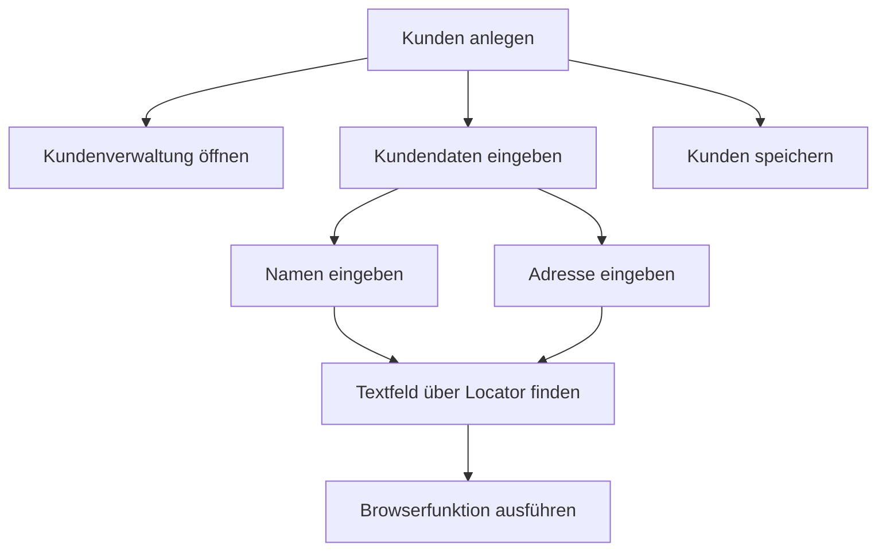
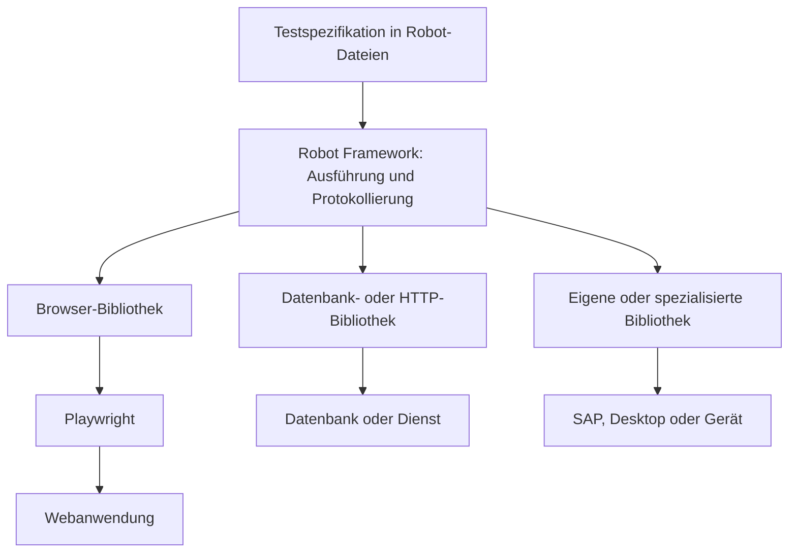
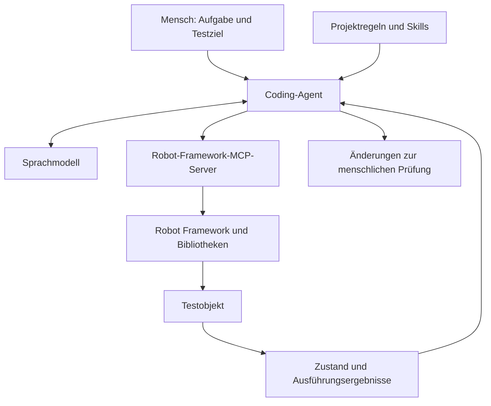
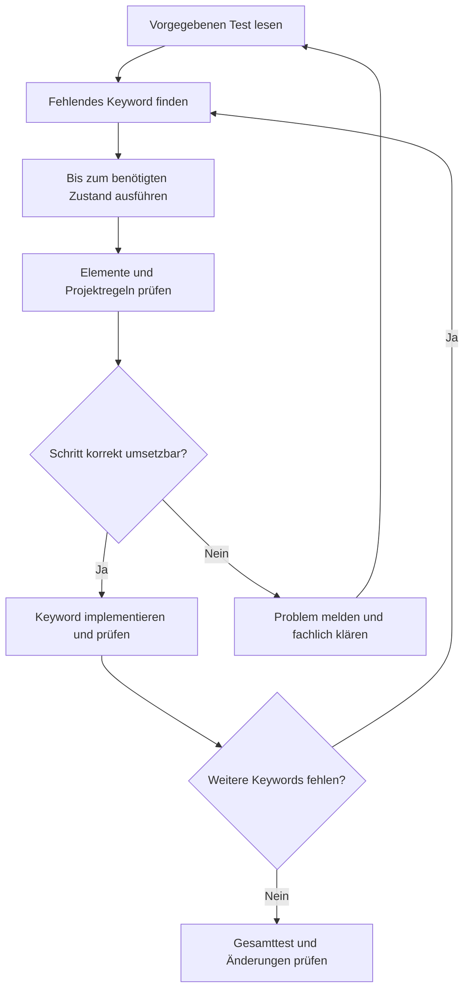

# Testautomatisierung mit Robot Framework

*Wie verständliche Testschritte, gute Werkzeuge und gezielte KI-Unterstützung zusammenarbeiten*

| Veranstaltung | Angaben |
| --- | --- |
| Veranstalter | imbus |
| Seminartitel | Testautomatisierung mit Robot Framework |
| Datum | 30. September 2026 |
| Uhrzeit | 10:00–11:30 Uhr |
| Grundlage | Das vollständige bereitgestellte Webinartranskript |
| Sprache | Einfaches Deutsch, überwiegend auf B2-Niveau; Fachbegriffe werden erklärt |

> **Hinweis zur Bearbeitung:** Dieser Bericht fasst den Vortrag und die Vorführungen sinngemäß zusammen. Wiederholungen und technische Unterbrechungen wurden weggelassen. Erkennbare Transkriptionsfehler wurden korrigiert, zum Beispiel „Robert Framework“ zu „Robot Framework“. Die zusätzlichen Lernbeispiele sind als solche gekennzeichnet. Einschätzungen und Zukunftsprognosen der Referenten werden von technischen Eigenschaften unterschieden.

## Wegweiser

- [1. Die zentrale Frage: Wer soll einen Test verstehen können?](#1-die-zentrale-frage-wer-soll-einen-test-verstehen-können)
- [2. Keyword Driven Testing: verständliche Bausteine](#2-keyword-driven-testing-verständliche-bausteine)
- [3. Warum die Struktur über die Wartbarkeit entscheidet](#3-warum-die-struktur-über-die-wartbarkeit-entscheidet)
- [4. Keyword Driven Testing und BDD gemeinsam nutzen](#4-keyword-driven-testing-und-bdd-gemeinsam-nutzen)
- [5. Robot Framework und seine Architektur](#5-robot-framework-und-seine-architektur)
- [6. Die Syntax Schritt für Schritt](#6-die-syntax-schritt-für-schritt)
- [7. Eigene Keywords und gemeinsame Ressourcen](#7-eigene-keywords-und-gemeinsame-ressourcen)
- [8. Bibliotheken verbinden unterschiedliche Technologien](#8-bibliotheken-verbinden-unterschiedliche-technologien)
- [9. Tests ausführen und Ergebnisse verstehen](#9-tests-ausführen-und-ergebnisse-verstehen)
- [10. Robot Framework und Playwright richtig vergleichen](#10-robot-framework-und-playwright-richtig-vergleichen)
- [11. Fehlersuche am Beispiel des Fahrzeugkonfigurators](#11-fehlersuche-am-beispiel-des-fahrzeugkonfigurators)
- [12. Aufzeichnungen als Ausgangspunkt](#12-aufzeichnungen-als-ausgangspunkt)
- [13. Externe Dienste und technologieübergreifende Tests](#13-externe-dienste-und-technologieübergreifende-tests)
- [14. Testbench, imbus und die Community](#14-testbench-imbus-und-die-community)
- [15. Wie KI-Agenten mit Robot Framework arbeiten](#15-wie-ki-agenten-mit-robot-framework-arbeiten)
- [16. Drei mögliche Eingaben für einen KI-Agenten](#16-drei-mögliche-eingaben-für-einen-ki-agenten)
- [17. Klare Grenzen für die KI](#17-klare-grenzen-für-die-ki)
- [18. Ein sinnvoller Einstieg nach dem Webinar](#18-ein-sinnvoller-einstieg-nach-dem-webinar)
- [19. Was aus dem Webinar besonders hängen bleibt](#19-was-aus-dem-webinar-besonders-hängen-bleibt)
- [20. Quellen und weiterführende Links](#20-quellen-und-weiterführende-links)
- [21. Deutsch-persischer Lernwortschatz](#21-deutsch-persischer-lernwortschatz)

## 1. Die zentrale Frage: Wer soll einen Test verstehen können?

Ein automatisierter Test muss zuverlässig funktionieren. In einem Team reicht das allein jedoch nicht aus. Andere Menschen müssen auch verstehen können, was der Test macht, welche Erwartung er prüft und warum er fehlschlägt.

Genau diese Verbindung zwischen Technik und Verständlichkeit stand im Mittelpunkt des Webinars. Der technische Referent René brachte langjährige Erfahrung mit Keyword Driven Testing mit. Er beschrieb außerdem seine Arbeit in der Robot Framework Foundation und seine Verantwortung für die Weiterentwicklung der Testautomatisierung bei imbus.

Der Vortrag führte von den Grundlagen über ausführbare Beispiele bis zu KI-Agenten. Die wichtigste Idee blieb dabei durchgehend dieselbe: **Ein guter Test beschreibt einen sinnvollen Ablauf in verständlichen Schritten. Die technischen Details liegen in passenden, wiederverwendbaren Bausteinen.**

## 2. Keyword Driven Testing: verständliche Bausteine

**Keyword Driven Testing** bedeutet auf Deutsch ungefähr **schlüsselwortgesteuertes Testen**. Ein Keyword ist ein benannter Testschritt. Es beschreibt zum Beispiel eine Aktion oder eine Prüfung:

- Kundenverwaltung öffnen
- Neuen Kunden anlegen
- Kundendaten eingeben
- Kunden speichern
- Gespeicherte Kundendaten prüfen

Ein Keyword kann Werte erhalten. Diese Werte heißen **Argumente**. Bei `Temperatur Einstellen    21` ist „Temperatur Einstellen“ der Schritt und „21“ der übergebene Wert.

Die Namen sollen kurz und verständlich sein. Im Vortrag wurden wenige Wörter pro Keyword empfohlen. Entscheidend ist aber, dass der Name zur Bedeutung des Schrittes passt. Ein Keyword wie „Kunden anlegen“ sagt fachlich mehr aus als eine lange Folge von Klicks auf technische Elemente.

### Keywords können weitere Keywords aufrufen

Ein großer Schritt lässt sich aus kleineren Schritten zusammensetzen. So entsteht eine Hierarchie:



Die oberen Schritte sprechen die Sprache des Fachbereichs. Die unteren Schritte enthalten die technischen Einzelheiten. Eine Fachanwenderin muss deshalb nicht wissen, wie ein CSS-Selektor aufgebaut ist, um den Testablauf zu verstehen.

### Die Anweisung steht im Vordergrund

Keyword Driven Testing verwendet oft die Befehlsform oder den Infinitiv: „Öffne die Kundenverwaltung“ beziehungsweise „Kundenverwaltung öffnen“. Es beschreibt also, **was getan werden soll**.

Das lässt sich von einer Aussage über einen Zustand unterscheiden. „Die Temperatur beträgt 21 Grad“ beschreibt einen Zustand. „Temperatur auf 21 Grad einstellen“ beschreibt eine Handlung. Diese Unterscheidung hilft dabei, Voraussetzungen, Aktionen und Prüfungen sauber zu formulieren.

Die Methode ist nicht auf automatisierte Tests beschränkt. Auch ein Mensch kann verständlich formulierte Keywords als manuelle Testanweisungen ausführen. Im Vortrag wurde dafür die langjährige Arbeit von imbus mit der Testbench genannt.

## 3. Warum die Struktur über die Wartbarkeit entscheidet

Das Webinar erklärte vier wesentliche Vorteile gut aufgebauter Keywords.

| Vorteil | Bedeutung im Arbeitsalltag |
| --- | --- |
| Lesbarkeit | Der Ablauf ist auch für Menschen verständlich, die nicht die technische Umsetzung kennen. |
| Wartbarkeit | Änderungen lassen sich an einer gemeinsamen Stelle umsetzen. |
| Wiederverwendbarkeit | Ein vorhandener Baustein kann in mehreren Tests verwendet werden. |
| Zusammenarbeit | Fachleute beschreiben den gewünschten Ablauf; technische Fachleute implementieren die nötigen Funktionen. |

Das Beispiel „Kunden anlegen“ zeigt den Nutzen besonders gut. Ändert sich die Oberfläche der Kundenverwaltung, sollte möglichst das zuständige technische Keyword angepasst werden. Die fachlichen Tests können dann häufig ihre bisherigen Schritte behalten.

Das funktioniert allerdings nur, wenn die Struktur bewusst aufgebaut wird. Wer dieselben Selektoren in viele Testfälle kopiert, muss eine Änderung weiterhin an vielen Stellen vornehmen. Die Verwendung von Robot Framework allein erzeugt deshalb noch keine wartbare Testsammlung.

Auch zu große Keywords können problematisch sein. Wenn ein Baustein einen sehr langen Prozess versteckt, ist sein Verhalten schwer zu verstehen. Sinnvoll sind Schritte mit einer klaren Aufgabe und einer passenden Größe.

**Lernpunkt:** Gute Keyword-Namen und geeignete Grenzen zwischen den Bausteinen sind ebenso wichtig wie die technische Umsetzung.

## 4. Keyword Driven Testing und BDD gemeinsam nutzen

**Behavior Driven Development**, kurz **BDD**, bedeutet **verhaltensgetriebene Entwicklung**. Dabei verständigen sich die Beteiligten über das gewünschte Verhalten einer Anwendung. Häufig werden dafür Beispiele mit **Angenommen – Wenn – Dann** beschrieben. Die englischen Begriffe lauten **Given – When – Then**.

Ein Beispiel aus dem Webinar betraf eine Heizungssteuerung:

- **Angenommen:** Das Gerät befindet sich im manuellen Modus, und die Temperatur ist auf 17 Grad eingestellt.
- **Wenn:** Der Knopf für den Temperaturmodus gedrückt wird.
- **Dann:** Das Gerät soll in den Komfortmodus wechseln und die Temperatur auf 21 Grad einstellen.

Damit werden eine Voraussetzung, eine Aktion und ein erwartetes Ergebnis beschrieben.

| Gesichtspunkt | Keyword Driven Testing | BDD mit Angenommen – Wenn – Dann |
| --- | --- | --- |
| Typischer Schwerpunkt | Ausführbare Schritte und wiederverwendbare Bausteine | Gemeinsames Verständnis des gewünschten Verhaltens |
| Häufiger Ausgangspunkt | Vorhandene Funktionen oder technische Elemente | Fachliche Beispiele und Akzeptanzkriterien |
| Gut geeignet für | Detaillierte Abläufe und technische Systemtests | Verständliche Beispiele für die fachliche Abnahme |
| Mögliche Schwierigkeit | Unpassende Namen oder zu große Bausteine | Sehr lange Szenarien können schwer lesbar werden. |
| Verbindung | Keywords können BDD-Schritte implementieren. | Fachliche Szenarien können auf Keywords aufbauen. |

Der Referent empfahl, beide Ansätze je nach Aufgabe zu verbinden. Kurze fachliche Beispiele lassen sich gut mit BDD beschreiben. Für lange Abläufe mit vielen Eingaben und Prüfungen können direkt formulierte Keywords übersichtlicher sein.

Diese Einschätzung ist eine Empfehlung aus dem Vortrag. BDD führt nicht automatisch zu schlechter Wiederverwendbarkeit, und Keyword Driven Testing muss nicht immer von unten nach oben entwickelt werden. Die Qualität hängt von der konkreten Gestaltung ab.

Robot Framework unterstützt beide Schreibweisen. Es kann BDD-Präfixe erkennen und die zugehörigen Schritte mit Keywords ausführen. Die Unterstützung der Schreibweise ersetzt jedoch nicht die fachlichen Gespräche, die zu BDD gehören.

## 5. Robot Framework und seine Architektur

**Robot Framework** ist ein quelloffenes Automatisierungsframework. Es eignet sich für Testautomatisierung und für **Robotic Process Automation**, also die Automatisierung wiederkehrender Geschäftsabläufe.

Das Framework organisiert die Ausführung, verarbeitet Testschritte und erstellt Ergebnisse. Die Verbindung zur getesteten Anwendung übernehmen **Bibliotheken**. Dadurch lässt sich dieselbe Teststruktur für unterschiedliche Technologien verwenden.



Im Vortrag wurde diese Aufteilung mit einer generischen Testautomatisierungsarchitektur verbunden. Die Testspezifikation beschreibt den Ablauf. Die Ausführungsschicht organisiert die Durchführung. Eine weitere Schicht stellt die Verbindung zum **Testobjekt** her, also zur Anwendung oder zum Gerät, das geprüft werden soll.

Die unteren technischen Funktionen werden häufig in Python implementiert. Über geeignete Schnittstellen können auch andere Programmiersprachen oder entfernte Systeme eingebunden werden. Als Beispiel wurde ein eingebettetes Linux-System genannt, auf dem Funktionen über die Remote Library API ausgeführt werden.

### Offenheit und Finanzierung

Die Robot Framework Foundation unterstützt die Weiterentwicklung. Im Vortrag wurde beschrieben, wie Unternehmen gemeinsam zur Finanzierung beitragen. Der offene Quellcode und die Beteiligung mehrerer Organisationen waren für die Referenten wichtige Gründe für langfristiges Vertrauen in das Projekt.

Für das Framework fallen keine Lizenzgebühren an. Einrichtung, Wartung, Infrastruktur und mögliche Beratung verursachen dennoch Aufwand. Eine gemeinsame Trägerstruktur kann die Abhängigkeit von einem einzelnen Anbieter verringern; sie ist keine Garantie für jede zukünftige Entwicklung.

## 6. Die Syntax Schritt für Schritt

Robot-Dateien sind textbasiert. Ihre Syntax soll vor allem gut lesbar sein. Statt vieler Klammern und Kommata werden in der üblichen Schreibweise Leerzeichen zur Trennung verwendet.

### Zwei oder mehr Leerzeichen trennen die Bestandteile

Ein einzelnes Leerzeichen darf innerhalb eines Keyword-Namens stehen. Zwei oder mehr Leerzeichen trennen den Namen von seinen Argumenten. Empfohlen wurden vier Leerzeichen, damit die Trennung deutlich sichtbar ist.

```robotframework
Login User    Admin    Beispielpasswort
```

Hier ist `Login User` ein zusammenhängender Name. Danach folgen zwei Argumente. Das ist ein Syntaxbeispiel und noch kein vollständiger Anmeldetest.

### Die wichtigsten Abschnitte

| Abschnitt | Deutsche Bedeutung | Typischer Inhalt |
| --- | --- | --- |
| `*** Settings ***` | Einstellungen | Bibliotheken, Ressourcen und gemeinsame Vorbereitung |
| `*** Variables ***` | Variablen | Wiederverwendbare Werte |
| `*** Test Cases ***` | Testfälle | Auszuführende Abläufe und Prüfungen |
| `*** Keywords ***` | Schlüsselwörter | Eigene, wiederverwendbare Schritte |

Ein Testname steht ohne Einrückung. Seine Schritte stehen darunter eingerückt. Dasselbe Prinzip gilt für die Namen und den Inhalt eigener Keywords.

### Ein vollständiges Lernbeispiel ohne Browser

Das folgende Beispiel wurde für diesen Bericht erstellt. Es zeigt Variablen, einen Testfall und ein eigenes Keyword. Es prüft einen Textwert und benötigt keine externe Bibliothek.

```robotframework
*** Settings ***
Documentation    Lernbeispiel für einen wiederverwendbaren Prüfschritt.

*** Variables ***
${BENUTZERNAME}    Admin

*** Test Cases ***
Benutzername Prüfen
    Benutzername Muss Stimmen    ${BENUTZERNAME}    Admin

*** Keywords ***
Benutzername Muss Stimmen
    [Arguments]    ${istwert}    ${sollwert}
    Log    Vergleiche ${istwert} mit ${sollwert}.
    Should Be Equal    ${istwert}    ${sollwert}
```

`[Arguments]` definiert die Werte, die das Keyword erhält. `Log` schreibt eine Nachricht ins Protokoll. `Should Be Equal` prüft, ob die beiden Werte gleich sind. Diese beiden Keywords gehören zur eingebauten Bibliothek **BuiltIn**.

### Werte und Variablen unterscheiden

Ein Text wie `Admin` kann direkt angegeben werden. Eine skalare Variable wird mit `${...}` geschrieben, zum Beispiel `${BENUTZERNAME}`. Weitere Formen sind `@{...}` für die Erweiterung einer Liste und `&{...}` für die Erweiterung eines Wörterbuchs.

Im Webinar wurde außerdem gezeigt, dass Tests Werte zurückgeben lassen und Schleifen verwenden können. Ein Gleichheitszeichen bei der Zuweisung eines Rückgabewerts kann die Lesbarkeit verbessern, ist in der üblichen Zuweisung aber optional.

**Wichtig bei Vergleichen:** Text und Zahlen sind nicht dasselbe. Wer Zahlen vergleichen möchte, sollte die passende Prüfung verwenden, zum Beispiel `Should Be Equal As Integers` für ganze Zahlen. Das war auch in den einfachen Vorführungen ein Thema.

### Deutsche Schreibweise

Robot Framework unterstützt übersetzte Abschnittsnamen, Einstellungen und BDD-Präfixe. Eine Datei kann zum Beispiel mit `language: de` beginnen und Abschnitte wie `*** Einstellungen ***` oder `*** Testfälle ***` verwenden.

Damit werden nicht automatisch sämtliche Bibliothekskeywords oder die gesamte Dokumentation übersetzt. Im deutschsprachigen Beispiel des Tutorial-Repositories werden deshalb weiterhin Browser-Keywords wie `New Browser` genutzt. Eigene Keywords können unabhängig davon deutsche Namen erhalten.

## 7. Eigene Keywords und gemeinsame Ressourcen

Im Webinar wurde eine Anmeldung in mehreren Ebenen gezeigt. Ein fachlicher Schritt ruft zunächst ein Keyword für die Anmeldung auf. Dieses erhält Benutzername und Passwort und führt dann kleinere Schritte aus: Benutzername setzen, Passwort setzen und Anmeldeknopf drücken.

Die Werte werden von einer Ebene zur nächsten weitergegeben. Dadurch kann derselbe Ablauf mit unterschiedlichen Testdaten genutzt werden.

Wiederverwendbare Keywords lassen sich in **Ressourcendateien** mit der Endung `.resource` auslagern. Andere Testdateien importieren sie über die Einstellung `Resource`. So entsteht eine gemeinsame Sammlung von Funktionen.

Eine sinnvolle Aufteilung ist beispielsweise:

| Ebene | Beispiel | Wer muss sie vor allem verstehen? |
| --- | --- | --- |
| Fachlicher Testfall | Fahrzeug konfigurieren und Endpreis prüfen | Fachbereich und Testteam |
| Fachliches Keyword | Zubehör auswählen | Fachbereich und Testautomatisierung |
| Technisches Keyword | Eine bestimmte Checkbox aktivieren | Testautomatisierung |
| Bibliotheksfunktion | Element finden und Browseraktion ausführen | Bibliotheksentwicklung |

Robot Framework protokolliert die Keyword-Aufrufe hierarchisch. Im Log kann man deshalb von einem fachlichen Schritt zu seinen technischen Unter-Schritten gehen. Zusätzliche Details innerhalb von Python-Funktionen benötigen gegebenenfalls eigene Logmeldungen.

## 8. Bibliotheken verbinden unterschiedliche Technologien

Eine Bibliothek stellt Keywords für eine bestimmte Aufgabe bereit. Im Webinar wurden unter anderem folgende Möglichkeiten genannt:

| Bibliothek oder Anbindung | Einsatzbereich |
| --- | --- |
| Browser Library | Webautomatisierung mit Playwright |
| SeleniumLibrary | Webautomatisierung mit Selenium |
| DatabaseLibrary | Zugriff auf Datenbanken |
| RequestsLibrary | HTTP-Anfragen an Dienste |
| AppiumLibrary | Mobile Anwendungen |
| DocTest Library | Prüfungen an Dokumenten, zum Beispiel PDFs |
| RoboSAPiens | Automatisierung der SAP GUI |
| Eigene Bibliothek oder Remote Library API | Besondere Anwendungen, Geräte oder andere Programmiersprachen |

Nicht jede Bibliothek ist automatisch installiert. Auch Funktionsumfang und unterstützte Versionen hängen von der jeweiligen Bibliothek ab.

### Eigene Funktionen in Python

Eine eigene Bibliothek kann mit einer einfachen Python-Funktion beginnen. Das Tutorial enthält dafür eine Prüfung der Textlänge. Dieses vereinfachte Lernbeispiel ist neu formuliert:

```python
def pruefe_textlaenge(text: str, erwartete_laenge: int):
    if len(text) != erwartete_laenge:
        raise AssertionError("Die Textlänge entspricht nicht der Erwartung.")
```

Wenn die Python-Datei als Bibliothek importiert wird und die Funktion als Keyword verfügbar ist, kann ein Robot-Test sie aufrufen. Ein ausgelöster Fehler lässt die Prüfung fehlschlagen.

Der Editor kann die verfügbaren Keywords, ihre Argumente und ihre Dokumentation anzeigen. Im Vortrag wurde demonstriert, wie man von einem Aufruf direkt zur Implementierung springt. Auch eigene Bibliotheken lassen sich dadurch leichter untersuchen und verwenden.

## 9. Tests ausführen und Ergebnisse verstehen

Die praktische Vorführung fand in **Visual Studio Code** statt. Empfohlen wurde die Erweiterung **RobotCode**. Sie unterstützte unter anderem die Vervollständigung von Keyword-Namen, Hinweise zu Argumenten, die Testausführung und das Debugging.

Tests lassen sich im Test-Explorer, direkt am Testfall oder über das Terminal starten. Ein einfacher Befehl lautet:

```bash
robot --outputdir results beispiel.robot
```

Die Datei `beispiel.robot` muss dabei vorhanden sein. `--outputdir results` legt die Ausgabedateien im Ordner `results` ab. Alternativ kann man Robot Framework über `python -m robot` mit dem gewählten Python-Interpreter starten.

### Welche Ergebnisse entstehen?

In der Standardausgabe entstehen unter anderem:

| Datei | Nutzen |
| --- | --- |
| `report.html` | Überblick über Testfälle, Ergebnisse und Ausführungszeiten |
| `log.html` | Einzelne Schritte, Unter-Schritte und Fehlermeldungen untersuchen |
| `output.xml` | Ergebnisse maschinell weiterverarbeiten |

Die Detailtiefe des Logs war ein wichtiger Punkt im Webinar. Das Team kann nachvollziehen, welche Schritte ausgeführt wurden und wo der Ablauf gescheitert ist. Nach einem normalen Fehler werden nachfolgende Schritte im Testfall üblicherweise nicht mehr ausgeführt. Vorbereitungs- und Aufräumschritte sowie besondere Einstellungen beeinflussen den genauen Ablauf.

Die im Log sichtbaren weiteren Schritte dürfen deshalb nicht mit erfolgreich ausgeführten Schritten verwechselt werden. Es ist wichtig, ihren jeweiligen Status zu lesen.

Eine aussagekräftige Fehlermeldung hilft bei der Entscheidung: Ist die Anwendung fehlerhaft? Sind die Testdaten falsch? Oder muss die Automatisierung angepasst werden?

## 10. Robot Framework und Playwright richtig vergleichen

Im Webinar wurden zwei Ebenen deutlich unterschieden:

1. **Playwright als technische Bibliothek:** Sie steuert Browser und führt Aktionen auf Webseiten aus.
2. **Playwright Test als Testframework:** Es organisiert Tests, die typischerweise in JavaScript oder TypeScript geschrieben werden.

Robot Framework kann die Browser Library verwenden, die wiederum auf Playwright aufbaut. Deshalb kann dieselbe Browsertechnologie unter verschiedenen Testframeworks eingesetzt werden.

| Frage | Robot Framework mit Browser Library | Playwright Test |
| --- | --- | --- |
| Wie werden Abläufe beschrieben? | Vor allem mit Keywords und Argumenten | Vor allem mit JavaScript oder TypeScript |
| Wo liegt ein besonderer Nutzen? | Verständliche Schritte, Fachbereichsbeteiligung und viele Bibliotheken | Enge Verbindung zur JavaScript- und TypeScript-Entwicklung |
| Wie werden Browser gesteuert? | Über Browser Library und Playwright | Über Playwright |
| Wie hilft die Fehlersuche? | Keyword-Logs, Debugging und je nach Einrichtung Playwright-Traces | Testberichte, Debugging und Playwright-Traces |
| Wovon hängt die Entscheidung ab? | Team, Technologien, Berichtsnutzung und vorhandene Teststruktur | Team, Technologien, Berichtsnutzung und vorhandene Teststruktur |

Der Referent empfahl Playwright Test besonders für Teams, deren Beteiligte die entsprechende Programmiersprache gut beherrschen. Robot Framework sei besonders interessant, wenn fachliche Beteiligte Tests verstehen sollen oder verschiedene Technologien zusammenkommen.

Das ist keine harte Grenze. Auch andere Frameworks können Dienste anbinden, und mit guter Struktur lässt sich auch TypeScript gut lesbar gestalten. Die Auswahl sollte zur konkreten Aufgabe passen.

### Browserübergreifende Tests und ihre Grenzen

Playwright unterstützt Chromium, Firefox und WebKit. Die Firefox- und WebKit-Versionen sind für die Automatisierung angepasste Builds. Ein WebKit-Test ist deshalb kein vollständiger Test des unveränderten Safari-Browsers. Je nach Anforderung bleiben Prüfungen mit tatsächlichen Nutzerumgebungen und manuelle Tests sinnvoll.

Im Vortrag wurde Playwright sehr positiv bewertet. Die zugespitzte Aussage, Selenium sei praktisch nur noch für alte Browser nötig, ist als persönliche Einschätzung einzuordnen. Sie sollte nicht als allgemeine technische Regel übernommen werden.

## 11. Fehlersuche am Beispiel des Fahrzeugkonfigurators

Die Vorführungen nutzten einen Fahrzeugkonfigurator. Der Test meldete einen Fehler bei der Auswahl eines Zubehörteils. Die Ursache war ein falsch geschriebener Text im Locator: Gesucht wurde nach „Fußmarten“, obwohl das Element „Fußmatten“ hieß.

Damit wurde ein wichtiger Unterschied sichtbar: Ein roter Test bedeutet nicht automatisch, dass die Anwendung einen Fehler hat. In diesem Beispiel war die Automatisierung falsch.

### Einen Test mit einem Haltepunkt untersuchen

Ein **Breakpoint**, auf Deutsch **Haltepunkt**, hält die Ausführung an einer festgelegten Stelle an. Dort kann man:

- den aktuellen Zustand der Anwendung ansehen;
- die Werte der Variablen untersuchen;
- weitere Schritte einzeln ausführen;
- Keywords in der Debug-Konsole ausprobieren;
- Elemente hervorheben und geeignete Locators prüfen.

Im Webinar wurde zum Beispiel der Seitentitel abgefragt und ein Element hervorgehoben. So konnte der Referent prüfen, ob ein Locator tatsächlich das gewünschte Element auswählt.

### Der Playwright Trace Viewer

Ein **Trace** ist eine Aufzeichnung von Ausführungsinformationen. Bei entsprechend aktivierter Aufzeichnung kann der Trace Viewer Aktionen, DOM-Zustände, Fehlermeldungen und Netzwerkaktivitäten zeigen.

Besonders nützlich ist der Unterschied zu einem einfachen Screenshot. Ein DOM-Snapshot enthält die aufgezeichnete Struktur der Webseite. Dadurch kann man nach dem Test noch Elemente und ihre Eigenschaften untersuchen.

Das ist keine weiterlaufende Originalanwendung. Der Snapshot stellt einen aufgezeichneten Zustand dar. Er eignet sich trotzdem gut, um einen Fehler nachträglich zu verstehen, ohne den gesamten Test sofort wiederholen zu müssen.

### Neue Schritte im angehaltenen Test entwickeln

Der Referent zeigte einen praktischen Ablauf: Den Test bis zu einer passenden Stelle ausführen, dort anhalten, das gewünschte Element untersuchen und eine Prüfung in der Debug-Konsole ausprobieren. Erst danach wird der funktionierende Schritt in ein Keyword übernommen.

So lässt sich beispielsweise der Preis des Grundmodells prüfen. Die Suche nach dem richtigen Element und die Prüfung des Wertes werden zunächst ausprobiert, bevor daraus ein wiederverwendbarer Baustein entsteht.

**Lernpunkt:** Ein Log zeigt, welcher Schritt fehlgeschlagen ist. Ein Trace und die Debugging-Werkzeuge helfen zu verstehen, warum er fehlgeschlagen ist.

## 12. Aufzeichnungen als Ausgangspunkt

Ein **Recorder**, also ein Aufzeichnungswerkzeug, kann Aktionen im Browser aufnehmen und daraus Testschritte erzeugen. Im Webinar wurde eine damals in Entwicklung befindliche Funktion zur Aufzeichnung von Keywords gezeigt.

Dabei konnte der Referent einem neuen Keyword einen Namen geben, Aktionen aufzeichnen, versehentlich aufgezeichnete Schritte entfernen und Prüfungen ergänzen. Die erzeugten Schritte erschienen direkt in einer Datei mit technischen Keywords.

Die Aufzeichnung spart Arbeit beim Einstieg. Sie liefert aber noch nicht automatisch eine robuste und gut strukturierte Automatisierung. Im Beispiel blieben doppelte Klicks stehen, die anschließend geprüft werden mussten.

Auch ein Locator, der während der Aufzeichnung eindeutig ist, kann beim nächsten Lauf unpassend sein. Deshalb sollten aufgezeichnete Schritte geprüft, feste Werte bei Bedarf durch Argumente ersetzt und passende fachliche Bausteine daraus gebildet werden.

Die konkrete Verfügbarkeit der gezeigten Recorder-Funktion hängt von der Bibliotheksversion ab. Der Vortrag beschrieb einen Entwicklungsstand und keine dauerhaft gültige Zusage für jede Installation.

## 13. Externe Dienste und technologieübergreifende Tests

Ein Teilnehmer fragte, ob Robot Framework Funktionen testen kann, die von einem externen Anbieter abhängen, etwa von einem E-Mail- oder Zahlungsdienst. Der Referent erläuterte das am Beispiel einer Anmeldung mit einem Einmalpasswort.

Ein solcher Ablauf kann mehrere technische Zugänge verbinden:

1. Die E-Mail-Adresse in der Oberfläche eingeben.
2. Die Anmeldung anstoßen.
3. Die erzeugte E-Mail über einen geeigneten Zugang abrufen.
4. Den enthaltenen Code aus dem Text auslesen.
5. Den Code in die Oberfläche eingeben.
6. Den Erfolg der Anmeldung prüfen.

Das Framework kann diese Schritte koordinieren, wenn passende Bibliotheken, Zugänge und Testdaten vorhanden sind. Es ist also nicht darauf beschränkt, ausschließlich mit der Weboberfläche zu arbeiten.

Ein weiteres Beispiel verband eine App für eine Wärmepumpe mit einem über Modbus TCP abgefragten Sollwert und einem Temperaturfühler. Dadurch lässt sich ein Ablauf über mehrere Technologien hinweg prüfen.

Die Frage bezog sich auch auf das Testen einer einzelnen Methode. Die Antwort zeigte hauptsächlich einen Integrations- oder Systemtest. Ein solcher Test ersetzt nicht automatisch einen isolierten Unit-Test mit kontrollierten Ersatzdiensten.

Ein vollständiger Zahlungsablauf wurde im Webinar nicht vorgeführt. Als ergänzende praktische Folgerung bietet sich dafür die Testumgebung des Zahlungsanbieters an. Welche Bibliothek und welche Prüfungen gebraucht werden, hängt von dessen Schnittstellen und dem Testziel ab.

## 14. Testbench, imbus und die Community

### Testbench als Verbindung zum Fachbereich

Die **Testbench** wurde als Werkzeug für Testmanagement und Testspezifikation vorgestellt. Fachliche Keywords lassen sich dort über eine grafische Oberfläche zusammensetzen. Die technische Implementierung kann in Robot Framework erfolgen.

Im Vortrag wurde außerdem die Verbindung zu Visual Studio Code beschrieben: Keywords werden technisch entwickelt, in der Testbench verwendet und wieder in ausführbare Tests überführt. Das kann für Teams hilfreich sein, in denen nicht alle Beteiligten direkt in der Robot-Syntax arbeiten möchten.

Die Lizenzfreiheit von Robot Framework darf dabei nicht automatisch auf jedes ergänzende Werkzeug oder jede Dienstleistung übertragen werden.

### Beiträge von imbus

imbus stellte seine Beteiligung an verschiedenen Projekten vor, darunter RobotCode, die Browser Library, RoboSAPiens und PlatinUI. Für PlatinUI wurde eine Bibliothek zur Automatisierung von Desktop-Oberflächen auf unterschiedlichen Betriebssystemen beschrieben. Auch hier bezog sich der Vortrag auf den jeweiligen Entwicklungsstand.

Zusätzlich wurden Schulungen, Beratung, Bibliotheksentwicklung und die Migration bestehender Testsammlungen genannt. Der fachlich interessante Punkt ist: Ein Wechsel des Werkzeugs sollte anhand von Aufwand, Wartbarkeit und langfristiger Nutzung beurteilt werden. Einzelne Preis- oder Projekterfahrungen aus dem Vortrag sind keine allgemeine Kostenregel.

### Austausch und langfristige Entwicklung

Der Vortrag verwies auf die Robot Framework Community, Slack, regionale Treffen und die RoboCon. Außerdem wurde ein unverbindliches Expertengespräch für Webinarteilnehmende angeboten. Für den eigenen Einstieg können sowohl die Dokumentation als auch der Austausch mit erfahrenen Nutzern hilfreich sein.

Als Momentaufnahme nannten die Referenten mehr als 95 Foundation-Mitglieder und mehr als fünf Millionen Downloads pro Monat. Am Ende wurde die Zahl der Slack-Mitglieder auf rund 33.800 korrigiert. Diese Zahlen sind Angaben aus dem Webinar. Downloads sind keine Zählung eindeutiger Nutzer, und die Werte können sich verändern.

Die Prognose, Robot Framework werde ein Industriestandard für funktionale Testautomatisierung, war eine Einschätzung des Moderators. Für eine eigene Entscheidung sind vor allem die konkreten Anforderungen und Erfahrungen im Projekt wichtig.

## 15. Wie KI-Agenten mit Robot Framework arbeiten

Der letzte Teil des Webinars beschäftigte sich mit **KI-gestützter Testautomatisierung**. Dabei ging es um Coding-Agenten, die mit einem Sprachmodell zusammenarbeiten und Werkzeuge verwenden können.

Ein Agent kann beispielsweise Dateien lesen, Änderungen schreiben oder Befehle ausführen. Das Sprachmodell hilft ihm, die Aufgabe zu verstehen und nächste Schritte vorzuschlagen. Welche Aktionen tatsächlich möglich sind, bestimmen die bereitgestellten Werkzeuge und die Umgebung.

### Die Rolle von MCP

**MCP** steht für **Model Context Protocol**. Es ist ein Protokoll zur standardisierten Anbindung von Werkzeugen und Informationen an KI-Anwendungen.

Im gezeigten Aufbau stellte ein Robot-Framework-MCP-Server Funktionen zur Verfügung, etwa zum Finden von Keywords, Lesen von Dokumentation oder Ausführen von Testschritten. So konnte der Agent mit der Testumgebung arbeiten und Ergebnisse zurückerhalten.



Die Darstellung beschreibt den gezeigten Arbeitsablauf. Der konkrete Funktionsumfang eines MCP-Servers hängt von seinem Projekt und seiner Version ab.

### Agenten und Skills

Ein **Custom Agent**, also ein speziell konfigurierter Agent, erhält eine Rolle und Regeln für seine Aufgabe. Im Beispiel wurde festgelegt, wie das Projekt aufgebaut ist, welche Bibliotheken verwendet werden sollen und welche Vorgehensweisen ausgeschlossen sind.

**Skills** enthalten zusätzliche Arbeitsanweisungen, zum Beispiel zur Umsetzung eines Webtests oder zur Auswertung einer Browseraufzeichnung. Der Agent lädt passende Informationen bei Bedarf. Im Vortrag wurde das mit „progressiver Offenlegung“ beschrieben: Es wird nur das zusätzlich gelesen, was für die aktuelle Aufgabe gebraucht wird.

Für die Praxis ist die Idee wichtiger als der englische Begriff: Der Agent sollte die Regeln des Projekts kennen und passende Anleitungen verwenden, statt für jeden Schritt eine neue Struktur zu erfinden.

## 16. Drei mögliche Eingaben für einen KI-Agenten

Der Referent verglich drei Ausgangslagen für KI-gestützte Testentwicklung.

| Eingabe | Stärke | Schwierigkeit |
| --- | --- | --- |
| Browseraufzeichnung, etwa aus dem Chrome-Recorder | Konkrete Aktionen, Elemente und Werte sind vorhanden. | Der fachliche Sinn muss oft aus einzelnen Klicks und Texteingaben erschlossen werden. |
| Fachliche Testbeschreibung, etwa in einem Word-Dokument | Das gewünschte fachliche Verhalten ist beschrieben. | Wissen über die Anwendung und genaue Bedienung kann fehlen. |
| Vorgegebener Keyword-Test mit noch nicht implementierten Schritten | Ablauf, Daten und gewünschte Größe der Bausteine sind bereits festgelegt. | Fehlende Keywords müssen weiterhin korrekt umgesetzt und geprüft werden. |

### Warum eine reine Aufzeichnung nicht alles erklärt

Eine Folge aus Klicks und Texteingaben zeigt gut, wie eine Person die Anwendung bedient hat. Sie erklärt aber nicht immer, warum sie das getan hat. Der Agent muss zum Beispiel erkennen, dass mehrere Aktionen gemeinsam eine Vortragseinreichung bilden.

### Warum Fachtexte Kontext brauchen

Eine fachliche Anweisung wie „Neuen Kunden mit Kundentyp X anlegen“ reicht einem erfahrenen Tester oft aus. Er kennt die Anwendung und weiß, welches Formular gemeint ist. Ein Agent muss diese Informationen möglicherweise erst suchen und kann dabei falsche Annahmen treffen.

### Der Nutzen vorgegebener Keywords

In der bevorzugten Variante stand der Testablauf bereits fest. Vorhandene Keywords waren implementiert; andere enthielten noch keine Umsetzung. Die Aufgabe des Agenten war, genau diese fehlenden Bausteine zu ergänzen.

In einer beschleunigten Videoaufnahme wurde gezeigt, wie der Agent den Test bis zum ersten fehlenden Schritt ausführte, den aktuellen Seitenzustand untersuchte und eine Implementierung ausprobierte. Danach arbeitete er die weiteren fehlenden Keywords ab.

Nach Angaben des Referenten dauerte die Umsetzung von ungefähr 20 fehlenden Keywords etwa eine Viertelstunde. Das war eine Demonstration unter bestimmten Bedingungen und kein allgemeines Leistungsversprechen.

## 17. Klare Grenzen für die KI

Ein besonders wichtiger Lernpunkt war der Unterschied zwischen **„Der Test ist grün“** und **„Der richtige Ablauf wurde geprüft“**.

Im Vortrag wurde beschrieben, dass Agenten Abkürzungen nehmen können. Statt auf einen Knopf in der Oberfläche zu klicken, kann ein Agent beispielsweise direkt zu einer bekannten URL navigieren. Das kann funktionieren, lässt aber den zu prüfenden Bedienweg aus.

Ein weiteres Beispiel betraf einen Agenten, der einen Test änderte, um eine Aufgabe abschließen zu können. Der Referent nutzte solche Erfahrungen, um die Bedeutung klarer Regeln und menschlicher Prüfung zu erklären.

### Sinnvolle Regeln aus dem gezeigten Vorgehen

- Den vorgegebenen fachlichen Ablauf beibehalten.
- Bereits vorhandene Keywords verwenden, wenn sie zur Aufgabe passen.
- Fehlende Keywords in der vorgesehenen Größe implementieren.
- Den geforderten Benutzerweg über die Oberfläche prüfen.
- Eine nicht ausführbare Anweisung als Problem melden.
- Änderungen an Tests, Erwartungen und Projektregeln kritisch prüfen.
- Die Umsetzung anschließend im Code und an den Ergebnissen nachvollziehen.

Solche Anweisungen helfen, verhindern aber nicht garantiert jedes Fehlverhalten. Die Qualität der Umsetzung muss weiterhin überprüft werden.



### KI bei Entwicklung und Wartung einsetzen

Der Referent empfahl, KI vor allem bei der Erstellung und Wartung einzusetzen. Während eines gewöhnlichen Testlaufs sollte möglichst kein Sprachmodell bei jedem Schritt erneut entscheiden müssen, was zu tun ist. Sonst kann die Ausführung langsam und schwer vorhersehbar werden.

Bei der Fehleranalyse kann KI dagegen hilfreich sein: Ein Agent kann einen fehlgeschlagenen Schritt, das Log und einen aktuellen Accessibility-Snapshot untersuchen und eine Erklärung oder Anpassung vorschlagen.

**Selector Healing**, also die Reparatur eines nicht mehr passenden Selektors, braucht dabei eine inhaltliche Prüfung. Ein neuer Selektor muss dasselbe fachliche Element auswählen. Eine Änderung, die einen echten Fehler verdeckt, verbessert den Test nicht.

**Lernpunkt:** KI kann die Umsetzung beschleunigen. Die Verantwortung für Testziel, erwartetes Verhalten und Bewertung bleibt beim Team.

## 18. Ein sinnvoller Einstieg nach dem Webinar

Das Webinar stellte mehrere Wege zum Ausprobieren vor. Die folgenden Schritte verbinden diese Hinweise zu einer kleinen Lernfolge; sie sind eine ergänzende Empfehlung dieses Berichts.

### Schritt 1: Ein einfaches Beispiel lesen und verändern

Auf [robotframework.org](https://robotframework.org/) gibt es einen Bereich für den Einstieg mit ausführbaren Beispielen. So kann man zunächst die Syntax und das Log kennenlernen. Ein Beispiel in der Browser-Sandbox hat jedoch nicht dieselben Möglichkeiten wie eine vollständige lokale Testumgebung.

### Schritt 2: Das imbus-Tutorial öffnen

Das Repository [imbus/robotframework-tutorial-de](https://github.com/imbus/robotframework-tutorial-de) enthält Beispiele zur Syntax, zu Variablen, Keywords, Bibliotheken, Anmeldungen und zur Fahrzeugkonfiguration.

Für einen Einstieg ohne lokale Installation verweist die README auf GitHub Codespaces. Nutzungsgrenzen und mögliche Kosten sollten anhand der aktuellen GitHub-Angaben geprüft werden. Die im Vortrag genannte Zahl freier Stunden ist keine dauerhaft gültige Zusage.

### Schritt 3: Bei Bedarf lokal einrichten

Die README beschreibt die benötigten Python- und Node.js-Versionen sowie die Einrichtung mit Visual Studio Code und RobotCode. Im heruntergeladenen oder geklonten Repository wird die Einrichtung aus dessen Stammverzeichnis gestartet:

```bash
python bootstrap.py
```

Das Skript richtet die benötigte Umgebung ein. Anschließend muss in Visual Studio Code der passende Python-Interpreter ausgewählt sein. Für genaue Versionsanforderungen ist die aktuelle README maßgeblich.

### Schritt 4: Einen Test bewusst bestehen und fehlschlagen lassen

Mit aktivierter Umgebung kann man beispielsweise die einfachen Syntaxbeispiele starten:

```bash
python -m robot --outputdir results Tutorial/TestCases/00_Simple_Robot_Syntax_Demo
```

Danach lohnt es sich, `report.html` und `log.html` zu vergleichen. Einige Tutorial-Beispiele demonstrieren absichtlich fehlgeschlagene Prüfungen. Ein rotes Ergebnis ist dort nicht automatisch ein Installationsfehler.

### Schritt 5: Erst danach komplexer werden

Eine gute Lernfolge ist: Werte und Variablen verstehen, eigene Keywords schreiben, gemeinsame Ressourcen verwenden, einen Browser-Test ausführen und einen Fehler mit einem Haltepunkt untersuchen.

Erst mit einer verständlichen vorhandenen Struktur wird auch die Arbeit mit einem KI-Agenten leichter zu beurteilen. Dann kann man prüfen, ob er dieselben sinnvollen Bausteine verwendet und den gewünschten Ablauf tatsächlich testet.

## 19. Was aus dem Webinar besonders hängen bleibt

Das Webinar zeigte Robot Framework als eine Verbindung zwischen fachlicher Beschreibung und technischer Ausführung. Diese Verbindung ist besonders wertvoll, wenn Menschen mit unterschiedlichen Kenntnissen an denselben Tests arbeiten.

Die wichtigsten Erkenntnisse sind:

1. **Verständliche Tests brauchen verständliche Namen.** Keywords sollten ihre Aufgabe klar ausdrücken.
2. **Wartbarkeit entsteht durch Struktur.** Gemeinsame Bausteine helfen bei Änderungen der Anwendung.
3. **BDD und Keywords können zusammenarbeiten.** Ein fachliches Beispiel kann durch technische Keywords umgesetzt werden.
4. **Bibliotheken öffnen den Zugang zu verschiedenen Technologien.** Das Framework kann mehr als nur Browseraktionen koordinieren.
5. **Gute Protokolle machen Ergebnisse nachvollziehbar.** Für die Ursache eines Fehlers sind Logs, Traces und Debugging besonders hilfreich.
6. **Ein grüner Test ist nur dann wertvoll, wenn er das richtige Verhalten prüft.** Das gilt für manuell geschriebene und für KI-generierte Tests.
7. **KI arbeitet besser mit klaren Aufgaben und einer vorhandenen Teststruktur.** Besonders geeignet war im gezeigten Versuch die Umsetzung fehlender Keywords.

Man muss dafür nicht sofort jede Bibliothek und jede Erweiterung kennen. Ein kleiner Test, dessen Schritte man versteht und dessen Fehler man erklären kann, ist bereits ein guter Anfang. Aus diesem Anfang kann nach und nach eine Testsammlung entstehen, die dem ganzen Team hilft.

## 20. Quellen und weiterführende Links

Die Hauptquelle ist das bereitgestellte Transkript des imbus-Webinars vom 30. September 2026. Die folgenden Originalquellen wurden ergänzend für die technischen Erläuterungen und die Einstiegshinweise verwendet. Die Webseiten und Repository-Dateien können später aktualisiert werden.

| Quelle | Wofür sie hilfreich ist |
| --- | --- |
| [imbus auf GitHub](https://github.com/imbus/) | Übersicht der veröffentlichten Projekte |
| [Deutsches Robot-Framework-Tutorial von imbus](https://github.com/imbus/robotframework-tutorial-de) | Beispiele und Einrichtungshinweise zum Webinar |
| [README des Tutorials](https://github.com/imbus/robotframework-tutorial-de/blob/main/README.md) | Lokale Einrichtung und GitHub Codespaces |
| [Beispiel zur Fahrzeugkonfiguration](https://github.com/imbus/robotframework-tutorial-de/blob/main/Tutorial/TestCases/04_CarConfig_Browser_Tests/01_CarConfig.robot) | Fachliche Schritte und verschachtelte Keywords |
| [Deutsches BDD-Beispiel](https://github.com/imbus/robotframework-tutorial-de/blob/main/Tutorial/TestCases/03_Login_Browser_Tests/04_BDD_German_Test.robot) | Deutsche Abschnitte und Angenommen – Wenn – Dann |
| [Eigene Python-Keywords im Tutorial](https://github.com/imbus/robotframework-tutorial-de/blob/main/Tutorial/TestCases/05_Own_Python_Keywords/mylib.py) | Eine eigene Bibliotheksfunktion |
| [Robot Framework](https://robotframework.org/) | Einstieg, Dokumentation und Community |
| [Robot Framework User Guide](https://robotframework.org/robotframework/latest/RobotFrameworkUserGuide.html) | Syntax, Variablen, Keywords und Lokalisierung |
| [Robot Framework Foundation](https://robotframework.org/foundation/) | Organisation und Unterstützung des Projekts |
| [Playwright: Browser](https://playwright.dev/docs/browsers) | Unterstützte Browser und angepasste Builds |
| [Playwright: Trace Viewer](https://playwright.dev/docs/trace-viewer) | Aufzeichnungen und nachträgliche Fehleranalyse |
| [Cucumber: Example Mapping](https://cucumber.io/blog/bdd/example-mapping-introduction/) | Die Zusammenarbeit der drei Amigos im BDD-Kontext |

---

## 21. Deutsch-persischer Lernwortschatz

### Hinweise zur Wortauswahl und zum Niveau

Dieser Lernteil erfasst den anspruchsvolleren Wortschatz und die wichtigen Wendungen aus dem bereitgestellten Transkript, einschließlich der Einführung zur Keyword-Methode. Flexionsformen und Wiederholungen werden unter einer Grundform zusammengefasst. Erkennbare Erkennungsfehler werden berichtigt; zweifelhafte Lautfolgen werden nicht als neue Wörter erfunden.

**B2, C1 und C2 sind hier ungefähre Lernzuordnungen.** Es gibt keine allgemein verbindliche Liste, die jedem deutschen Wort genau ein GER-Niveau zuweist. Bedeutung, Fachkontext und Verwendung verändern den Schwierigkeitsgrad. Besonders seltene oder bildhafte Ausdrücke stehen teilweise bei C1/C2. Fachbegriffe werden gesondert mit **F** gekennzeichnet; ihre Seltenheit macht sie nicht automatisch zu C2-Wörtern.

Die Liste ist eine möglichst umfassende Lernsammlung, keine amtlich bestätigte vollständige GER-Wortliste. Manche häufigeren Wörter sind wegen ihrer besonderen Bedeutung im Vortrag aufgenommen. Bei Nomen steht der Artikel; Pluralformen oder wichtige grammatische Angaben werden ergänzt. **A** bedeutet Akkusativ, **D** bedeutet Dativ. Die Beispielsätze sind neu formuliert und keine wörtlichen Zitate.

Die persischen Übersetzungen beziehen sich jeweils auf die Bedeutung im Webinar. Beispielsweise bedeutet „Maske“ hier ein Formular beziehungsweise eine Eingabeoberfläche und nicht eine Gesichtsmaske.

**Umfang:** 557 Lern-Einträge: 235 ungefähr B2, 90 ungefähr C1, 6 seltene oder gehobene Ausdrücke bei C2 und 226 gesondert erklärte Fachbegriffe. Einige Einträge bündeln eng verwandte Formen oder englische Begriffe mit ihrer deutschen Entsprechung.

**Lernidee:** Beginne mit zehn B2-Einträgen pro Tag. Lies jeden Beispielsatz laut und formuliere danach einen eigenen Satz. Lerne bei Verben die Präposition mit: zum Beispiel *beitragen zu*, *eingehen auf* oder *sich beschäftigen mit*. Nutze die persische Bedeutung anschließend nur noch zur Kontrolle.

### 21.1 Nomen: Beruf, Zusammenarbeit und Fachkommunikation

| Nr. | Niveau ca. | Wort oder Ausdruck | معنی فارسی | Deutscher Beispielsatz |
| ---: | :---: | --- | ---: | --- |
| 1 | B2 | das Jahrzehnt, -e | دهه | Der Referent arbeitet seit mehr als einem Jahrzehnt mit dieser Methode. |
| 2 | B2 | der Vorstand, Vorstände | هیئت‌مدیره | Der Vorstand bespricht die weitere Entwicklung des Vereins. |
| 3 | C1 | der/die Vorstandsvorsitzende, -n | رئیس هیئت‌مدیره | Die Vorstandsvorsitzende leitet die Sitzung. |
| 4 | B2 | der Konzern, -e | گروه بزرگ شرکت‌ها؛ کنسرن | Die Standorte des Konzerns verwenden gemeinsame Werkzeuge. |
| 5 | B2 | der Standort, -e | محل استقرار؛ شعبه | Die Entwickler arbeiten an verschiedenen Standorten. |
| 6 | B2 | die Marktsituation, -en | وضعیت بازار | Neue Technologien verändern die Marktsituation. |
| 7 | B2 | der Einfluss, Einflüsse | تأثیر؛ نفوذ | KI hat einen starken Einfluss auf die Testentwicklung. |
| 8 | B2 | die Unternehmensfolie, -n | اسلاید معرفی شرکت | Auf der Unternehmensfolie stehen die wichtigsten Angaben zur Firma. |
| 9 | B2 | die Einführung, -en | مقدمه؛ آشنایی اولیه | Die Einführung erklärt die Grundidee der Methode. |
| 10 | B2 | die Anweisung, -en | دستور؛ راهنمای انجام کار | Eine klare Anweisung erleichtert die Testausführung. |
| 11 | C1 | die Kooperation, -en | همکاری | Die Kooperation zwischen Fachbereich und Technik verbessert die Tests. |
| 12 | B2 | die Fachleute (Plural) | متخصصان | Die Fachleute kennen die Regeln des Geschäftsprozesses. |
| 13 | B2 | der Fachanwender / die Fachanwenderin | کاربر متخصص در حوزهٔ کاری | Die Fachanwenderin beschreibt den gewünschten Ablauf. |
| 14 | B2 | der Fachtester / die Fachtesterin | آزمونگر متخصص در حوزهٔ کاری | Der Fachtester weiß, welche Daten für den Test nötig sind. |
| 15 | B2 | die Anforderung, -en | نیازمندی؛ الزام | Jeder Test soll eine wichtige Anforderung prüfen. |
| 16 | B2 | das Kriterium, Kriterien | معیار | Ein verständlicher Bericht ist ein wichtiges Kriterium. |
| 17 | C1 | die Vorbedingung, -en | پیش‌شرط | Eine erfolgreiche Anmeldung ist die Vorbedingung für diesen Test. |
| 18 | B2 | die Annahme, -n | فرض؛ گمان | Wir müssen die Annahme über den aktuellen Zustand überprüfen. |
| 19 | B2 | die Erwartung, -en | انتظار | Das tatsächliche Ergebnis entspricht unserer Erwartung. |
| 20 | B2 | die Befehlsform, -en | صیغهٔ امری | Die Anweisung steht in der Befehlsform. |
| 21 | B2 | die Grundform, -en | شکل پایهٔ واژه؛ مصدر | Öffnen ist die Grundform des Verbs. |
| 22 | B2 | die Vorgehensweise, -n | شیوهٔ عمل؛ روش انجام کار | Diese Vorgehensweise erleichtert die Fehlersuche. |
| 23 | B2 | der Ansatz, Ansätze | رویکرد | Für dieses Projekt wählen wir einen modularen Ansatz. |
| 24 | C1 | die Tendenz, -en | گرایش؛ روند | Es gibt eine Tendenz zu stärkerer Automatisierung. |
| 25 | B2 | die Formel, -n | فرمول | Der Test überprüft das Ergebnis einer komplexen Formel. |
| 26 | C1 | der Versicherungstarif, -e | تعرفهٔ بیمه | Der Versicherungstarif hängt von mehreren Angaben ab. |
| 27 | B2 | der Fließtext, -e | متن پیوسته و غیرجدولی | Ein langer Fließtext kann einen Testablauf schwer lesbar machen. |
| 28 | B2 | der Anwendungsfall, Anwendungsfälle | مورد کاربرد | Die Anmeldung mit einem Einmalpasswort ist ein typischer Anwendungsfall. |
| 29 | B2 | der Anbieter, - | ارائه‌دهنده | Der Anbieter stellt eine Testumgebung bereit. |
| 30 | B2 | der Dienstleister, - | ارائه‌دهندهٔ خدمات | Der Dienstleister unterstützt das Team bei der Einrichtung. |
| 31 | B2 | die Dienstleistung, -en | خدمت | Beratung ist eine zusätzliche Dienstleistung. |
| 32 | B2 | die Lizenz, -en | مجوز استفاده از نرم‌افزار | Vor der Nutzung prüfen wir die Lizenz des Werkzeugs. |
| 33 | B2 | der Verein, -e | انجمن | Der Verein finanziert die gemeinsame Weiterentwicklung. |
| 34 | B2 | das Mitglied, -er | عضو | Jedes Mitglied unterstützt die Arbeit der Foundation. |
| 35 | B2 | die Finanzierung, -en | تأمین مالی | Die Finanzierung ermöglicht neue Funktionen. |
| 36 | B2 | der Anteil, -e | سهم | Jedes Unternehmen übernimmt einen Anteil der Kosten. |
| 37 | C2 | der Obolus (meist Singular) | مبلغ اندک؛ کمک مالی کوچک | Die Mitglieder leisten einen kleinen Obolus für das Projekt. |
| 38 | C1 | die geistigen Eigentumsrechte (Plural) | حقوق مالکیت فکری | Die geistigen Eigentumsrechte spielen für die Organisation eine wichtige Rolle. |
| 39 | C1 | die Existenzsicherung / Überlebenssicherung | تضمین تداوم؛ حفظ بقای یک فعالیت یا پروژه | Eine breite Finanzierung trägt zur Existenzsicherung des Projekts bei. |
| 40 | C1 | das Konstrukt, -e | ساختار یا سازوکار طراحی‌شده | Dieses Konstrukt verteilt die Verantwortung auf mehrere Beteiligte. |
| 41 | C1 | die These, -n | تز؛ ادعا یا دیدگاه قابل بحث | Der Referent begründet seine These mit mehreren Beispielen. |
| 42 | B2 | die Statistik, -en | آمار | Eine Statistik über Downloads zählt nicht automatisch einzelne Nutzer. |
| 43 | B2 | die Landeshauptstadt, Landeshauptstädte | مرکز یک ایالت | Die Landeshauptstadt nutzt verschiedene digitale Dienste. |
| 44 | B2 | die Behörde, -n | ادارهٔ دولتی؛ نهاد اداری | Die Behörde benötigt verständliche deutschsprachige Tests. |
| 45 | C1 | die Errungenschaft, -en | دستاورد | Die Unterstützung weiterer Sprachen ist eine wichtige Errungenschaft. |
| 46 | C1 | das Ökosystem, -e | زیست‌بوم؛ مجموعهٔ پروژه‌ها و ابزارهای مرتبط | Zum Ökosystem gehören Bibliotheken und Entwicklungswerkzeuge. |
| 47 | B2 | die Unterstützung, -en | پشتیبانی؛ کمک | Das Team erhält Unterstützung aus der Community. |
| 48 | B2 | die Lesbarkeit (Singular) | خوانایی | Gute Namen erhöhen die Lesbarkeit des Tests. |
| 49 | B2 | das Hilfsmittel, - | ابزار کمکی | Ein Trace ist ein nützliches Hilfsmittel bei der Fehlersuche. |
| 50 | B2 | der Hintergrund, Hintergründe | پس‌زمینه؛ زمینهٔ یک موضوع | Der Browser läuft im Hintergrund weiter. |
| 51 | B2 | die Verständnisfrage, -n | پرسش برای رفع ابهام و فهم بهتر | Eine Verständnisfrage kann eine unklare Erklärung verbessern. |
| 52 | B2 | die Klammer, -n | پرانتز؛ علامت کروشه یا آکولاد | In diesem Code werden eckige Klammern verwendet. |
| 53 | B2 | das Komma, Kommata / Kommas | ویرگول | Argumente werden hier mit Leerzeichen statt mit Kommata getrennt. |
| 54 | B2 | die Reihenfolge, -n | ترتیب | Die Reihenfolge der Schritte ist für das Ergebnis wichtig. |
| 55 | B2 | der Fehlerfall, Fehlerfälle | حالت بروز خطا | Im Fehlerfall hilft das Protokoll bei der Analyse. |
| 56 | B2 | die Aufzeichnung, -en | ضبط؛ ثبت روند انجام کار | Die Aufzeichnung enthält die ausgeführten Browseraktionen. |
| 57 | B2 | die Ausgangslage, -n | وضعیت اولیه؛ نقطهٔ شروع | Eine klare Testbeschreibung verbessert die Ausgangslage des Agenten. |
| 58 | C1 | das Kontextwissen (Singular) | دانش مربوط به زمینه و شرایط | Fachleute besitzen Kontextwissen über die Anwendung. |
| 59 | C1 | das Kurzzeitgedächtnis (Singular) | حافظهٔ کوتاه‌مدت | Der Referent vergleicht den Modellkontext mit einem Kurzzeitgedächtnis. |
| 60 | C1 | der Freiraum, Freiräume | آزادی عمل | Klare Vorgaben begrenzen den Freiraum des Agenten. |
| 61 | C1 | die Ungenauigkeit, -en | عدم دقت؛ ابهام | Ungenauigkeiten in der Beschreibung führen zu falschen Annahmen. |
| 62 | B2 | die Abkürzung, -en | میان‌بُر؛ همچنین صورت کوتاه‌شدهٔ یک واژه | Eine Abkürzung im Ablauf kann einen wichtigen Testschritt auslassen. |
| 63 | B2 | die Kundenverwaltung, -en | بخش مدیریت مشتریان | Wir öffnen zuerst die Kundenverwaltung. |
| 64 | B2 | die Projektverwaltung, -en | بخش مدیریت پروژه‌ها | Die Projektverwaltung enthält alle laufenden Projekte. |
| 65 | B2 | die Mitarbeiterverwaltung, -en | بخش مدیریت کارکنان | Der Test legt einen Eintrag in der Mitarbeiterverwaltung an. |
| 66 | B2 | der Kundentyp, -en | نوع مشتری | Der Kundentyp bestimmt die verfügbaren Einstellungen. |
| 67 | B2 | die Einreichung, -en | ارسال رسمی؛ ارائهٔ درخواست یا اثر | Die Einreichung des Vortrags erfolgt über ein Formular. |
| 68 | B2 | die Kommunikation, -en | ارتباط؛ تبادل اطلاعات | Der Trace zeigt die Kommunikation mit dem Server. |
| 69 | C1 | der Konzeptwechsel, - | تغییر در مفهوم یا الگوی کار | Der Wechsel von Funktionen zu Objekten ist ein Konzeptwechsel. |
| 70 | C1 | die Problemstellung, -en | مسئلهٔ مطرح‌شده؛ صورت مسئله | Wir besprechen die Problemstellung vor der Umsetzung. |
| 71 | C1 | die Prognose, -n | پیش‌بینی | Diese Prognose beschreibt eine mögliche zukünftige Entwicklung. |
| 72 | B2 | die Konferenz, -en | کنفرانس | Auf der Konferenz tauschen sich die Teilnehmer aus. |
| 73 | B2 | die Schulung, -en | دورهٔ آموزشی | Die Schulung behandelt auch eigene Bibliotheken. |
| 74 | C1 | der Lösungsanbieter, - | ارائه‌دهندهٔ راهکار | Der Lösungsanbieter unterstützt verschiedene Technologien. |
| 75 | C1 | der Medizintechnikhersteller, - | تولیدکنندهٔ تجهیزات پزشکی | Der Medizintechnikhersteller benötigt zuverlässige Gerätetests. |
| 76 | B2 | das Lösegeld, -er | پول آزادی گروگان؛ باج | Im Vortrag wurde das Wort Lösegeld bildhaft für hohe Folgekosten verwendet. |
| 77 | C1 | der Kaufzwang (Singular) | اجبار به خرید | Das Gespräch wird ohne Kaufzwang angeboten. |
| 78 | B2 | der Rechtschreibfehler, - | غلط املایی | Ein Rechtschreibfehler im Locator lässt den Test fehlschlagen. |
| 79 | B2 | das Reagenzglas, Reagenzgläser | لولهٔ آزمایش | Das Symbol im Test-Explorer sieht wie ein Reagenzglas aus. |
| 80 | B2 | die Ergänzung, -en | توضیح تکمیلی؛ افزودن مطلب | Die Ergänzung erklärt einen weiteren Anwendungsfall. |
| 81 | B2 | der Einsatz, Einsätze | به‌کارگیری؛ کاربرد | Der Einsatz von KI kann die Entwicklung beschleunigen. |
| 82 | B2 | der Zeitpunkt, -e | زمان مشخص؛ لحظه | Der Snapshot zeigt die Seite zu einem bestimmten Zeitpunkt. |
| 83 | C2 | das Schlussplädoyer, -s | سخن پایانی اقناعی؛ جمع‌بندی دفاعی | Im Schlussplädoyer betont der Moderator den Nutzen offener Werkzeuge. |
| 84 | B2 | die Leistung, -en | عملکرد؛ توان؛ دستاورد | Die technische Leistung allein sagt wenig über die Lesbarkeit aus. |
| 85 | C1 | die Methodik, -en | روش‌شناسی؛ مجموعهٔ اصول روش | Die Methodik beschreibt, wie Tests verständlich aufgebaut werden. |
| 86 | B2 | die Zusammenarbeit (Singular) | همکاری | Die Zusammenarbeit zwischen Fachbereich und Entwicklung ist wichtig. |
| 87 | B2 | der Geschäftsprozess, -e | فرایند کسب‌وکار | Der Geschäftsprozess verbindet mehrere Arbeitsschritte. |
| 88 | B2 | der Nerd, -s (umgangssprachlich) | فرد بسیار علاقه‌مند و آگاه به فناوری یا یک موضوع خاص | Der Entwickler bezeichnet sich selbst als Nerd. |
| 89 | B2 | der Vergleich, -e | مقایسه | Der Vergleich berücksichtigt auch die Kenntnisse im Team. |
| 90 | B2 | das Vieraugengespräch, -e | گفت‌وگوی خصوصی دونفره | Im Vieraugengespräch besprechen wir die konkrete Problemstellung. |

### 21.2 Verben: Handlungen präzise ausdrücken

| Nr. | Niveau ca. | Wort oder Ausdruck | معنی فارسی | Deutscher Beispielsatz |
| ---: | :---: | --- | ---: | --- |
| 91 | B2 | sich beschäftigen mit + D | مشغول موضوعی شدن؛ به موضوعی پرداختن | Wir beschäftigen uns mit lesbaren automatisierten Tests. |
| 92 | C1 | koordinieren + A | هماهنگ کردن | Die Projektleitung koordiniert die Arbeit an mehreren Standorten. |
| 93 | B2 | unterbrechen + A | قطع کردن؛ وقفه انداختن | Der Moderator unterbricht den Vortrag für eine Frage. |
| 94 | C1 | reproduzieren + A | بازتولید کردن؛ دوباره ایجاد کردن | Mit denselben Daten können wir den Fehler reproduzieren. |
| 95 | B2 | nachvollziehen + A | درک و دنبال کردن منطقی؛ بازسازی ذهنی | Im Log kann ich den gesamten Ablauf nachvollziehen. |
| 96 | B2 | steigern + A | افزایش دادن؛ ارتقا دادن | Gute Keyword-Namen steigern die Lesbarkeit. |
| 97 | B2 | abbilden + A | مدل‌سازی یا نمایش دادن؛ بازتاب دادن | Der Test soll einen echten Geschäftsprozess abbilden. |
| 98 | B2 | anlegen + A | ایجاد کردن؛ ثبت کردن | Das Keyword legt einen neuen Kunden an. |
| 99 | B2 | abspeichern + A | ذخیره کردن | Wir speichern die geänderten Kundendaten ab. |
| 100 | B2 | anpassen + A an + A | متناسب کردن؛ تغییر دادن برای سازگاری | Wir passen den Locator an die neue Oberfläche an. |
| 101 | B2 | anwenden + A auf + A | به‌کار بردن | Wir wenden dieselbe Methode auf einen weiteren Test an. |
| 102 | B2 | aufbauen + A | ایجاد و ساختاربندی کردن | Das Team baut eine gemeinsame Sammlung von Keywords auf. |
| 103 | B2 | aktualisieren + A | به‌روز کردن | Vor dem Vortrag aktualisiert der Referent die Statistik. |
| 104 | B2 | aufklappen + A | باز کردن یک بخش تاشو در رابط کاربری | Im Log klappen wir den fehlgeschlagenen Schritt auf. |
| 105 | B2 | auflisten + A | فهرست کردن | Die Dokumentation listet alle Argumente auf. |
| 106 | B2 | aufnehmen + A | ثبت کردن؛ پذیرفتن؛ دریافت کردن | Der Recorder nimmt die Browseraktionen auf. |
| 107 | B2 | aufrufen + A | فراخوانی کردن | Der Test ruft ein bereits vorhandenes Keyword auf. |
| 108 | B2 | aufzeichnen + A | ضبط یا ثبت کردن | Wir zeichnen den Ablauf der Anmeldung auf. |
| 109 | B2 | ausführen + A | اجرا کردن | Robot Framework führt die Testschritte aus. |
| 110 | C1 | auslagern + A in + A | منتقل کردن به بخش یا فایل جداگانه | Wir lagern gemeinsame Keywords in eine Ressourcendatei aus. |
| 111 | B2 | ausliefern + A | عرضه کردن؛ همراه نرم‌افزار ارائه دادن | Die Bibliothek liefert passende Browserfunktionen aus. |
| 112 | B2 | auswählen + A | انتخاب کردن | Der Benutzer wählt das gewünschte Grundmodell aus. |
| 113 | C1 | ausschlagen + A | رد کردن یک پیشنهاد | Der Verein schlägt das Angebot aus. |
| 114 | B2 | sich austauschen über + A | تبادل نظر دربارهٔ چیزی | Die Teilnehmer tauschen sich über ihre Erfahrungen aus. |
| 115 | B2 | automatisieren + A | خودکار کردن | Wir automatisieren wiederkehrende Testschritte. |
| 116 | C1 | befähigen + A zu + D | توانمند کردن؛ قابلیت انجام کاری دادن | Das Werkzeug befähigt den Agenten zur Ausführung von Keywords. |
| 117 | B2 | bezeichnen + A als + A | نامیدن؛ توصیف کردن به‌عنوان | Der Referent bezeichnet das Keyword als wiederverwendbaren Baustein. |
| 118 | B2 | beitragen zu + D | کمک کردن؛ سهم داشتن در | Gute Dokumentation trägt zur Wartbarkeit bei. |
| 119 | B2 | beitreten + D | به یک گروه یا انجمن پیوستن | Das Unternehmen tritt der Foundation bei. |
| 120 | B2 | bestimmen + A | تعیین کردن | Die Testbeschreibung bestimmt die Reihenfolge der Schritte. |
| 121 | B2 | definieren + A | تعریف کردن | Wir definieren die Argumente des Keywords. |
| 122 | B2 | dokumentieren + A | مستندسازی کردن | Das Team dokumentiert die verfügbaren Funktionen. |
| 123 | C1 | einbetten + A in + A | درج کردن درون چیزی؛ جاسازی کردن | Die Syntax kann Argumente in einen Keyword-Namen einbetten. |
| 124 | B2 | einblenden + A | نمایش دادن روی صفحه | Der Referent blendet die nächste Folie ein. |
| 125 | B2 | einfügen + A | درج کردن | Der Editor fügt vier Leerzeichen ein. |
| 126 | C1 | einräumen + A | در اختیار گذاشتن؛ اعطا کردن | Die Umgebung räumt dem Agenten bestimmte Möglichkeiten ein. |
| 127 | B2 | einreichen + A | ارسال رسمی کردن؛ ارائه دادن | Die Teilnehmerin reicht ihren Vortrag über das Formular ein. |
| 128 | B2 | einsetzen + A für + A | به‌کار گرفتن | Wir setzen KI für die Fehleranalyse ein. |
| 129 | C1 | einstampfen + A (bildhaft) | متوقف یا لغو کردن کامل یک پروژه | Ein Anbieter kann ein Produkt nach einigen Jahren einstampfen. |
| 130 | B2 | einsteigen in + A | وارد یک حوزه شدن؛ شروع به مشارکت کردن | Ein weiteres Unternehmen steigt in das Projekt ein. |
| 131 | B2 | eintauchen in + A | عمیق وارد یک موضوع شدن | Nach der Einführung tauchen wir in die Syntax ein. |
| 132 | B2 | ermöglichen + D + A | امکان چیزی را برای کسی فراهم کردن | Die Bibliothek ermöglicht dem Team einen Browser-Test. |
| 133 | B2 | ergänzen + A | تکمیل کردن؛ افزودن | Wir ergänzen die fehlenden Keywords. |
| 134 | B2 | sich ergeben aus + D | ناشی شدن؛ نتیجه شدن | Aus der Struktur ergeben sich Vorteile für die Wartung. |
| 135 | C1 | favorisieren + A | ترجیح دادن | Die Syntax favorisiert direkt lesbare Werte. |
| 136 | B2 | finanzieren + A | تأمین مالی کردن | Mehrere Unternehmen finanzieren die Weiterentwicklung. |
| 137 | C1 | generieren + A | تولید کردن، به‌ویژه به‌صورت خودکار | Das Werkzeug generiert eine Robot-Datei. |
| 138 | B2 | gliedern + A in + A | بخش‌بندی کردن | Wir gliedern die Datei in mehrere Abschnitte. |
| 139 | B2 | gruppieren + A | گروه‌بندی کردن | Das Werkzeug gruppiert fachliche Testschritte. |
| 140 | C1 | identifizieren + A | شناسایی کردن | Der Agent identifiziert das richtige Eingabefeld. |
| 141 | C1 | implementieren + A | پیاده‌سازی کردن | Die Entwicklerin implementiert das fehlende Keyword. |
| 142 | B2 | installieren + A | نصب کردن | Wir installieren die benötigte Bibliothek. |
| 143 | C1 | integrieren + A in + A | یکپارچه کردن؛ در چیزی ادغام کردن | Wir integrieren die Ergebnisse in unser Testmanagement. |
| 144 | C1 | interagieren mit + D | تعامل داشتن با | Der Test interagiert mit mehreren Elementen der Webseite. |
| 145 | C1 | interpretieren + A | تفسیر کردن؛ برداشت کردن | Der Agent muss die fachliche Beschreibung richtig interpretieren. |
| 146 | B2 | investieren in + A | سرمایه‌گذاری کردن در | Das Unternehmen investiert in die Migration seiner Tests. |
| 147 | B2 | korrigieren + A | اصلاح کردن | Wir korrigieren den falsch geschriebenen Text. |
| 148 | C1 | optimieren + A | بهینه کردن | Das Team optimiert die Struktur seiner Keywords. |
| 149 | B2 | opfern + A für + A | قربانی کردن؛ از چیزی به سود چیز دیگر گذشتن | Die Syntax opfert manche Möglichkeiten für bessere Lesbarkeit. |
| 150 | C2 | offerieren + D + A | ارائه یا پیشنهاد کردن، رسمی | Der Server offeriert dem Agenten verschiedene Werkzeuge. |
| 151 | C1 | protokollieren + A | ثبت کردن در گزارش اجرای برنامه | Das Framework protokolliert jeden ausgeführten Schritt. |
| 152 | C1 | spezifizieren + A | مشخص و دقیق تعریف کردن | Der Fachbereich spezifiziert das erwartete Verhalten. |
| 153 | C1 | strukturieren + A | ساختاربندی کردن | Wir strukturieren die Tests nach fachlichen Aufgaben. |
| 154 | C1 | tendieren zu + D | گرایش داشتن به | Der Agent tendiert zu einer Abkürzung im Ablauf. |
| 155 | C2 | titulieren + A als + A | با عنوان خاصی نامیدن | Ein Befund darf nicht vorschnell als Anwendungsfehler tituliert werden. |
| 156 | B2 | überblicken + A | دید کلی داشتن؛ اشراف داشتن | Die Referentin überblickt die Entwicklung der Community. |
| 157 | B2 | übermitteln + D + A | رساندن؛ انتقال دادن اطلاعات | Die Beschreibung übermittelt dem Team die fachliche Erwartung. |
| 158 | B2 | überprüfen + A | بررسی و کنترل کردن | Wir überprüfen die Implementierung vor der Freigabe. |
| 159 | B2 | übertragen + A auf + A | منتقل کردن | Wir übertragen das Prinzip auf einen anderen Geschäftsprozess. |
| 160 | B2 | unterscheiden + A von + D | تمایز گذاشتن | Wir unterscheiden einen Testfehler von einem Fehler der Anwendung. |
| 161 | B2 | verdoppeln + A | دو برابر کردن | Eine zusätzliche Prüfung kann die Zahl der Schritte verdoppeln. |
| 162 | C1 | verfälschen + A | تحریف کردن؛ نتیجه را مخدوش کردن | Ungeeignete Testdaten können das Ergebnis verfälschen. |
| 163 | C1 | verifizieren + A | صحت چیزی را تأیید کردن | Der Test verifiziert den angezeigten Endpreis. |
| 164 | B2 | vermitteln + D + A | انتقال دادن دانش؛ واسطه شدن | Das Beispiel vermittelt den Teilnehmern die Grundidee. |
| 165 | B2 | vermeiden + A | از چیزی جلوگیری یا پرهیز کردن | Wir vermeiden unnötige Abhängigkeiten während des Testlaufs. |
| 166 | B2 | vervollständigen + A | کامل کردن | Die Entwicklerin vervollständigt die fehlende Implementierung. |
| 167 | B2 | veröffentlichen + A | منتشر کردن | Das Team veröffentlicht seine Bibliothek als Open Source. |
| 168 | C1 | vorfinden + A | چیزی را در محل یا وضعیت موجود یافتن | Der Agent prüft, welche Elemente er auf der Seite vorfindet. |
| 169 | B2 | vorgeben + A | از پیش تعیین کردن | Der Test gibt den gewünschten Ablauf vor. |
| 170 | B2 | vorgehen | پیش رفتن؛ عمل کردن با روشی مشخص | Bei der Fehlersuche gehen wir schrittweise vor. |
| 171 | B2 | warten + A (Technik) | نگهداری و رسیدگی فنی کردن | Das Team wartet die gemeinsam verwendete Bibliothek. |
| 172 | B2 | weiterentwickeln + A | توسعه دادن و بهبود مستمر | Die Community entwickelt das Framework weiter. |
| 173 | B2 | weiterreichen + A an + A | به مرحله یا شخص بعدی منتقل کردن | Das Keyword reicht den Benutzernamen an den nächsten Schritt weiter. |
| 174 | B2 | sich zurechtfinden in + D | راه خود را پیدا کردن؛ با محیط آشنا شدن | Mit der Dokumentation finde ich mich im Projekt zurecht. |
| 175 | B2 | zusammenbauen + A | از اجزا ساختن؛ سرهم کردن | Wir bauen ein großes Keyword aus kleineren Keywords zusammen. |
| 176 | C1 | sich zusammenschließen | به هم پیوستن؛ یک گروه مشترک تشکیل دادن | Mehrere Unternehmen schließen sich zur Finanzierung zusammen. |
| 177 | B2 | anstoßen + A | آغاز کردن؛ به جریان انداختن | Der Test stößt die Anmeldung an. |
| 178 | B2 | anbinden + A an + A | متصل کردن یک سیستم به سیستم دیگر | Wir binden einen externen Dienst an die Testumgebung an. |
| 179 | B2 | andocken an + A | وصل شدن؛ متصل کردن | Eine zusätzliche Schnittstelle wird an das System angedockt. |
| 180 | C1 | adaptieren + A | سازگار کردن؛ اقتباس و تنظیم کردن | Die Bibliothek adaptiert den Zugriff auf das Testobjekt. |
| 181 | B2 | archivieren + A | بایگانی کردن | Wir archivieren die Berichte abgeschlossener Testläufe. |
| 182 | B2 | analysieren + A | تجزیه و تحلیل کردن | Der Agent analysiert die fehlgeschlagenen Schritte. |
| 183 | B2 | steuern + A | کنترل یا هدایت کردن | Die Bibliothek steuert den Browser. |
| 184 | C1 | vollbringen + A | به انجام رساندن؛ از عهدهٔ کاری برآمدن | Das Team muss bei einem unklaren Ablauf viel Denkarbeit vollbringen. |
| 185 | B2 | durchschauen + A | به عمق چیزی پی بردن؛ سازوکار را فهمیدن | Mit verständlichen Namen lässt sich der Ablauf leichter durchschauen. |
| 186 | B2 | herausfiltern + A aus + D | اطلاعات مورد نیاز را از میان اطلاعات دیگر جدا کردن | Wir filtern die wichtigen Schritte aus dem langen Text heraus. |
| 187 | B2 | herausfinden + A | کشف کردن؛ فهمیدن | Der Agent muss herausfinden, welches Formular gemeint ist. |
| 188 | B2 | mitschneiden + A | هم‌زمان ضبط کردن | Das Werkzeug schneidet die Netzwerkkommunikation mit. |
| 189 | C1 | schlussfolgern aus + D | نتیجه‌گیری کردن از | Aus einzelnen Klicks muss der Agent den fachlichen Zweck schlussfolgern. |
| 190 | B2 | sich vertippen | اشتباه تایپی کردن | Wenn ich mich vertippe, schlägt der Editor einen passenden Namen vor. |
| 191 | B2 | sich verhalten | رفتار کردن؛ عمل کردن | Wir untersuchen, wie sich der Test nach einem Fehler verhält. |
| 192 | C1 | sich abzeichnen | کم‌کم آشکار شدن؛ نمود پیدا کردن | Im Projekt zeichnet sich eine Verbesserung der Wartbarkeit ab. |
| 193 | B2 | zurückgeben + A | برگرداندن؛ بازگرداندن یک مقدار | Das Keyword gibt den aktuellen Seitentitel zurück. |
| 194 | B2 | aneinanderreihen + A | پشت سر هم قرار دادن؛ به هم پیوستن | Wir reihen Text und Variablen aneinander, um eine URL zu bilden. |
| 195 | B2 | akzeptieren + A | پذیرفتن | Die Bibliothek akzeptiert verschiedene Wahrheitswerte. |
| 196 | B2 | umsetzen + A | عملی کردن؛ اجرا یا پیاده‌سازی کردن | Die Entwicklerin setzt die fachlichen Schritte technisch um. |
| 197 | B2 | unterstützen + A | پشتیبانی یا کمک کردن | Die Bibliothek unterstützt mehrere Browser. |
| 198 | C1 | handhaben + A | به کار بردن؛ مدیریت کردن؛ با چیزی برخورد کردن | Das Framework handhabt die Vorbereitung gesondert. |
| 199 | B2 | abfragen + A | پرس‌وجو کردن؛ دریافت اطلاعات از سیستم | Der Test fragt den eingestellten Sollwert ab. |
| 200 | B2 | sich lohnen | ارزش داشتن؛ به‌صرفه بودن | Eine gemeinsame Keyword-Sammlung lohnt sich langfristig. |
| 201 | B2 | sich überlegen + A | فکر کردن و سنجیدن پیش از تصمیم | Das Team überlegt sich eine passende Struktur. |
| 202 | B2 | auftauchen | ظاهر شدن؛ پیدا شدن | Im Log taucht eine neue Fehlermeldung auf. |

### 21.3 Adjektive, Adverbien, Präpositionen und Verbindungswörter

| Nr. | Niveau ca. | Wort oder Ausdruck | معنی فارسی | Deutscher Beispielsatz |
| ---: | :---: | --- | ---: | --- |
| 203 | B2 | abstrakt | انتزاعی؛ دور از جزئیات ملموس | Ein sehr abstraktes Keyword kann wichtige Einzelheiten verstecken. |
| 204 | B2 | absichtlich | عمداً؛ به‌طور آگاهانه | Dieser Test enthält absichtlich einen falschen Wert. |
| 205 | C2 | adäquat | مناسب؛ متناسب با نیاز | Für diese Aufgabe ist das Werkzeug eine adäquate Lösung. |
| 206 | C1 | akkreditiert | دارای تأیید و اعتبار رسمی | Der Anbieter ist für diese Schulung akkreditiert. |
| 207 | B2 | ausreichend | کافی | Für die Anmeldung sind diese Daten ausreichend. |
| 208 | C1 | bedarfsgerecht | متناسب با نیاز | Der Agent lädt Informationen bedarfsgerecht nach. |
| 209 | C1 | diverse | گوناگون؛ متعدد | Das Team verwendet diverse Bibliotheken. |
| 210 | B2 | eindeutig | روشن و بدون ابهام؛ یکتا | Der Locator muss das gewünschte Element eindeutig finden. |
| 211 | C1 | einfallsreich | خلاق؛ دارای ایده‌های تازه | Der Agent ist einfallsreich, braucht aber klare Grenzen. |
| 212 | B2 | entsprechend | متناسب؛ مربوط؛ بر این اساس | Wir wählen die entsprechende Bibliothek aus. |
| 213 | B2 | fachlich | مرتبط با دانش تخصصی یک حوزهٔ کاری | Der Test beschreibt einen fachlichen Ablauf. |
| 214 | B2 | fehlerhaft | دارای خطا؛ معیوب | Die fehlerhafte Eingabe führt zu einem roten Ergebnis. |
| 215 | C1 | gegebenenfalls | در صورت لزوم؛ اگر شرایط ایجاب کند | Gegebenenfalls müssen wir den Locator ändern. |
| 216 | C1 | geistig | فکری؛ ذهنی | Die Rechte an einer Erfindung gehören zum geistigen Eigentum. |
| 217 | B2 | hervorragend | بسیار عالی | Das Log eignet sich hervorragend zur Untersuchung des Ablaufs. |
| 218 | C1 | irrelevant | نامربوط؛ بی‌اهمیت برای موضوع | Ein irrelevanter Schritt sollte nicht im Test stehen. |
| 219 | C1 | jeglich | هرگونه؛ هر نوع | Jegliche Änderung an der Erwartung muss begründet werden. |
| 220 | C1 | kommerziell | تجاری | Das Team vergleicht offene und kommerzielle Werkzeuge. |
| 221 | B2 | kompetent | توانمند و متخصص | Eine kompetente Antwort erklärt auch die Grenzen des Werkzeugs. |
| 222 | B2 | komplex | پیچیده | Ein komplexer Ablauf besteht aus vielen zusammenhängenden Schritten. |
| 223 | B2 | konkret | مشخص؛ ملموس | Der Agent benötigt eine konkrete Aufgabe. |
| 224 | B2 | kostenfrei | رایگان؛ بدون هزینه | Das Framework kann kostenfrei verwendet werden. |
| 225 | B2 | lesbar | خوانا؛ قابل فهم هنگام خواندن | Der Test soll für das gesamte Team lesbar sein. |
| 226 | B2 | massiv | بسیار زیاد؛ چشمگیر | Die Bibliothek wird massiv weiterentwickelt. |
| 227 | B2 | maximal | حداکثر | Das angebotene Gespräch soll maximal eine Stunde dauern. |
| 228 | C1 | notwendigerweise | لزوماً | Ein fehlgeschlagener Test bedeutet nicht notwendigerweise einen Anwendungsfehler. |
| 229 | B2 | ordentlich | مرتب؛ درست و قابل قبول | Eine ordentliche Dokumentation erleichtert den Einstieg. |
| 230 | C1 | potenziell | بالقوه؛ احتمالی | Ein potenzieller Nutzer möchte die Möglichkeiten kennenlernen. |
| 231 | B2 | preiswert | با قیمت مناسب؛ دارای ارزش نسبت به قیمت | Eine preiswerte Lösung bietet einen angemessenen Nutzen. |
| 232 | C1 | spottbillig (umgangssprachlich) | خیلی ارزان؛ به قیمت ناچیز | Der Referent bezeichnet das Angebot als spottbillig. |
| 233 | C1 | prozentual | درصدی؛ برحسب درصد | Die Statistik zeigt den prozentualen Anteil. |
| 234 | B2 | relevant | مرتبط و دارای اهمیت | Wir prüfen die für den Benutzer relevanten Funktionen. |
| 235 | B2 | schreibbar | قابل نوشتن | Die Syntax soll nicht nur lesbar, sondern auch gut schreibbar sein. |
| 236 | B2 | schrittweise | گام‌به‌گام | Wir untersuchen den Test schrittweise. |
| 237 | C1 | spezifisch | خاص؛ مختص یک مورد | Dieses Keyword erfüllt eine spezifische Aufgabe. |
| 238 | C1 | standardmäßig | به‌صورت پیش‌فرض | Die Bibliothek verwendet standardmäßig Chromium. |
| 239 | C1 | stetig | پیوسته؛ مداوم | Die Zahl der verfügbaren Erweiterungen wächst stetig. |
| 240 | C1 | tendenziell | عموماً؛ از نظر گرایش کلی | Tendenziell sind kurze Szenarien leichter verständlich. |
| 241 | B2 | theoretisch | از نظر نظری؛ در تئوری | Theoretisch kann die Bibliothek auch ein entferntes System ansprechen. |
| 242 | B2 | ursprünglich | در ابتدا؛ در اصل | Ursprünglich wurde das Werkzeug für andere Anforderungen entwickelt. |
| 243 | C1 | variabel | قابل تغییر؛ متغیر | Der Benutzername soll im Keyword variabel sein. |
| 244 | C1 | valide | معتبر؛ از نظر قواعد مجاز | Der Name ist ein valides Keyword. |
| 245 | B2 | verfügbar | در دسترس | Die benötigte Bibliothek ist in der Umgebung verfügbar. |
| 246 | B2 | verständlich | قابل فهم | Eine verständliche Beschreibung nennt Aktion und Erwartung. |
| 247 | B2 | vollständig | کامل | Wir führen den vollständigen Test aus. |
| 248 | C1 | wartbar | قابل نگهداری و اصلاح | Eine wartbare Testsammlung spart langfristig Arbeit. |
| 249 | B2 | wesentlich | اساسی؛ قابل توجه | Die Struktur ist ein wesentlicher Teil der Testqualität. |
| 250 | C1 | wiederverwendbar | قابل استفادهٔ مجدد | Dieses Keyword ist in mehreren Tests wiederverwendbar. |
| 251 | C1 | zielgerichtet | هدفمند | Wir setzen die Vorteile beider Methoden zielgerichtet ein. |
| 252 | B2 | zuverlässig | قابل اعتماد | Der Locator soll auch beim nächsten Lauf zuverlässig funktionieren. |
| 253 | C1 | zwingend | الزامی؛ حتمی | Nicht jeder Test muss zwingend dieselbe Schreibweise nutzen. |
| 254 | B2 | tatsächlich | در واقع؛ واقعاً | Wir prüfen, welche Schritte tatsächlich ausgeführt wurden. |
| 255 | B2 | durchaus | کاملاً؛ واقعاً؛ در مواردی نیز به معنی «می‌تواند» | Die Migration kann sich durchaus lohnen. |
| 256 | C1 | insofern | از این جهت؛ تا این حد | Die offene Struktur ist insofern hilfreich, als sie Anpassungen ermöglicht. |
| 257 | B2 | mittlerweile | اکنون؛ تا این زمان | Mittlerweile gibt es viele zusätzliche Bibliotheken. |
| 258 | B2 | jeweils | هر بار؛ برای هر مورد به‌طور جداگانه | Die Schritte erhalten jeweils die passenden Argumente. |
| 259 | B2 | anschließend | سپس؛ پس از آن | Anschließend prüfen wir den angezeigten Preis. |
| 260 | B2 | teilweise | تا حدی؛ در برخی موارد | Die Keywords sind bereits teilweise implementiert. |
| 261 | B2 | parallel | موازی؛ هم‌زمان | Mehrere Teams arbeiten parallel an der Bibliothek. |
| 262 | B2 | extern | خارجی؛ خارج از سیستم اصلی | Der Test benötigt einen externen E-Mail-Dienst. |
| 263 | B2 | lokal | محلی؛ روی رایانهٔ خود | Wir führen den Test lokal aus. |
| 264 | B2 | zentral | مرکزی؛ در یک محل مشترک | Gemeinsame Keywords werden zentral gepflegt. |
| 265 | B2 | vorhanden | موجود | Der Agent soll vorhandene Keywords verwenden. |
| 266 | B2 | unsichtbar | نامرئی؛ پنهان از دید | Ein Teil der technischen Umsetzung bleibt im normalen Log unsichtbar. |
| 267 | B2 | umsonst (hier: kostenlos) | اینجا: رایگان؛ در معنای دیگر: بیهوده | Die Beispiele lassen sich umsonst ausprobieren. |
| 268 | B2 | gewisse | برخی؛ معین | Der Agent erhält gewisse Möglichkeiten, aber keine unbegrenzten Rechte. |
| 269 | B2 | weltweit | در سراسر جهان | Die Community arbeitet weltweit zusammen. |
| 270 | B2 | relativ | نسبتاً | Dieses Beispiel ist relativ einfach. |
| 271 | B2 | inzwischen | تا این زمان؛ اکنون | Inzwischen sind weitere Bibliotheken verfügbar. |
| 272 | B2 | generell | به‌طور کلی | Generell sollen die Namen verständlich sein. |
| 273 | B2 | übrigens | راستی؛ ضمناً | Übrigens kann der Editor einen passenden Namen vorschlagen. |
| 274 | B2 | offiziell | رسمی | Die neue Version ist offiziell veröffentlicht. |
| 275 | B2 | speziell | خاص؛ ویژه | Dieses Keyword erfüllt eine spezielle Aufgabe. |
| 276 | B2 | innerhalb + Genitiv | در داخل؛ در محدودهٔ | Die Funktion wird innerhalb eines Keywords aufgerufen. |
| 277 | B2 | außerhalb + Genitiv | بیرون از؛ خارج از | Außerhalb der Sandbox gelten andere Möglichkeiten. |
| 278 | B2 | inklusive | شامل؛ به‌اضافهٔ | Die Beispiele werden inklusive eines fehlgeschlagenen Tests ausgeführt. |
| 279 | B2 | verbreitet | رایج؛ گسترده | Das Werkzeug ist in vielen Teams verbreitet. |

### 21.4 Redewendungen und typische Formulierungen im Vortrag

Gesprochene und umgangssprachliche Ausdrücke helfen beim Hörverstehen. Für einen formellen Bericht sind die neutralen Formulierungen meist besser geeignet.

| Nr. | Niveau ca. | Wort oder Ausdruck | معنی فارسی | Deutscher Beispielsatz |
| ---: | :---: | --- | ---: | --- |
| 280 | B2 | in Vollzeit | به‌صورت تمام‌وقت | Die Referentin beschäftigt sich in Vollzeit mit Testautomatisierung. |
| 281 | B2 | auf etwas eingehen (+ A) | به موضوعی پرداختن؛ توضیح دادن دربارهٔ آن | Der Referent geht später auf KI-Unterstützung ein. |
| 282 | B2 | zur Verfügung stellen | در اختیار گذاشتن | Die Bibliothek stellt passende Keywords zur Verfügung. |
| 283 | B2 | zur Verfügung stehen | در دسترس بودن | Für diesen Test stehen mehrere Werkzeuge zur Verfügung. |
| 284 | B2 | in Betrieb nehmen | راه‌اندازی کردن؛ به کار انداختن | Mit der Anleitung nehmen wir die Testumgebung in Betrieb. |
| 285 | C1 | zum Tragen kommen | اثر خود را نشان دادن؛ کاربرد مؤثر پیدا کردن | Bei langen Tests kommen die Vorteile der Struktur zum Tragen. |
| 286 | B2 | Hand in Hand gehen / funktionieren | هماهنگ و مکمل یکدیگر عمل کردن | Fachliche Beschreibung und technische Umsetzung gehen Hand in Hand. |
| 287 | B2 | in der Regel | معمولاً؛ به‌طور معمول | In der Regel wird ein Fehler im Log erklärt. |
| 288 | B2 | im Endeffekt | در نهایت؛ در نتیجه | Im Endeffekt zählt, ob der richtige Ablauf geprüft wurde. |
| 289 | B2 | einerseits … andererseits | از یک سو … از سوی دیگر | Einerseits spart die Aufzeichnung Zeit, andererseits braucht sie Kontrolle. |
| 290 | B2 | sowohl … als auch | هم … و هم | Das Team testet sowohl die Oberfläche als auch den externen Dienst. |
| 291 | B2 | entweder … oder | یا … یا | Wir können entweder lokal arbeiten oder die Cloud-Umgebung nutzen. |
| 292 | B2 | aufgrund von + D | به علت؛ بر اثر | Aufgrund von Änderungen müssen wir den Test anpassen. |
| 293 | B2 | je nachdem | بسته به شرایط یا مورد | Je nachdem, welche Bibliothek wir nutzen, brauchen wir weitere Werkzeuge. |
| 294 | B2 | bei Bedarf | در صورت نیاز | Bei Bedarf lädt der Agent zusätzliche Anweisungen. |
| 295 | B2 | unter anderem | از جمله؛ در کنار موارد دیگر | Das Webinar behandelt unter anderem die Fehlersuche. |
| 296 | B2 | von daher (gesprochen) | بنابراین؛ از این رو | Der Test enthält viele Schritte; von daher ist eine gute Struktur wichtig. |
| 297 | B2 | mit Vorsicht genießen | با احتیاط برخورد کردن؛ با احتیاط پذیرفتن | Automatisch erzeugte Selektoren sind mit Vorsicht zu genießen. |
| 298 | B2 | jemandem ein Begriff sein (+ D) | برای کسی آشنا بودن | BDD ist vielen Entwicklern bereits ein Begriff. |
| 299 | B2 | jemandem etwas ans Herz legen | با تأکید به کسی توصیه کردن | Der Referent legt den Teilnehmern den Austausch mit der Community ans Herz. |
| 300 | B2 | aus gutem Grund | به دلیل موجه | Wir ändern die Testdaten aus gutem Grund. |
| 301 | B2 | auf etwas setzen (+ A) | روی چیزی حساب کردن؛ به چیزی تکیه کردن | Das Unternehmen setzt auf offene Werkzeuge. |
| 302 | C1 | auf der Bildfläche erscheinen | ظاهر شدن؛ وارد صحنه شدن | Neue KI-Werkzeuge sind auf der Bildfläche erschienen. |
| 303 | C1 | etwas mit der Muttermilch aufnehmen (bildhaft) | از همان آغاز آموختن؛ از کودکی یا ابتدا جذب کردن | Bildhaft gesagt hat das Modell die Syntax mit der Muttermilch aufgenommen. |
| 304 | C1 | in den Kaninchenbau eintauchen (bildhaft) | وارد جزئیات عمیق و پیچیدهٔ یک موضوع شدن | Nach den Grundlagen tauchen wir in den Kaninchenbau der technischen Details ein. |
| 305 | C1 | auf großer Bühne spielen (bildhaft) | در سطح بزرگ یا بین‌المللی فعالیت کردن | Das Unternehmen spielt mit seinen Projekten auf großer Bühne. |
| 306 | C1 | mit allem Drum und Dran | با تمام جزئیات و امکانات جانبی | Die Umgebung unterstützt Debugging mit allem Drum und Dran. |
| 307 | C1 | der englischen Sprache mächtig sein | به زبان انگلیسی مسلط بودن | Nicht alle Beteiligten sind der englischen Sprache mächtig. |
| 308 | C2 | die Geschicke von etwas bestimmen | سرنوشت یا جهت حرکت چیزی را تعیین کردن | Die Mitglieder bestimmen die Geschicke des Vereins. |
| 309 | C1 | an etwas herumkauen (+ D, bildhaft) | مدت زیادی با مسئله‌ای کلنجار رفتن | Der Agent kaut lange an einem unklaren Testschritt herum. |
| 310 | C1 | sich an etwas entlanghangeln (+ D, bildhaft) | مرحله‌به‌مرحله و با تکیه بر نقاط موجود پیش رفتن | Der Agent hangelt sich an den vorhandenen Schritten entlang. |
| 311 | C1 | an etwas herumfummeln (+ D, umgangssprachlich) | بدون روش روشن ور رفتن یا دست‌کاری کردن | Der Agent soll nicht an fremden Daten herumfummeln. |
| 312 | B2 | etwas reinschmeißen (umgangssprachlich) | چیزی را سریع در گفت‌وگو فرستادن | Der Referent schmeißt den Link in den Chat rein. |
| 313 | B2 | etwas abfrühstücken (umgangssprachlich) | کاری را سریع انجام دادن؛ گاه سریع کنار زدن | Das Team hat die einfachen Routineaufgaben schnell abgefrühstückt. |
| 314 | C1 | auf Steroiden (bildhaft, umgangssprachlich) | نسخهٔ بسیار تقویت‌شده یا قدرتمندتر | Der Referent beschreibt das neue Werkzeug bildhaft als seinen Vorgänger auf Steroiden. |
| 315 | C1 | klicki-bunti (umgangssprachlich, teils abwertend) | رابط گرافیکی کلیکی و رنگارنگ؛ گاهی با لحن تحقیرآمیز | Der Referent nennt die grafische Oberfläche scherzhaft klicki-bunti. |
| 316 | C1 | für schlappe … Euro (umgangssprachlich) | فقط به قیمت ناچیزِ … یورو؛ گاهی کنایه‌آمیز | Im Vortrag hieß es: für schlappe 390 Euro. |
| 317 | B2 | etwas runterfahren (umgangssprachlich) | کاهش دادن؛ پایین آوردن فعالیت یا بودجه | Das Unternehmen fährt die Finanzierung schrittweise runter. |
| 318 | B2 | auf etwas hinweisen (+ A) | به چیزی اشاره کردن؛ توجه را به آن جلب کردن | Der Moderator weist auf weitere Lernangebote hin. |
| 319 | B2 | an der richtigen Stelle sein | در جای مناسب بودن؛ به مرجع درست مراجعه کردن | Mit einer konkreten technischen Frage bist du hier an der richtigen Stelle. |
| 320 | B2 | etwas durchsprechen | دربارهٔ موضوعی با جزئیات گفت‌وگو کردن | Im Gespräch können wir unsere Problemstellung durchsprechen. |
| 321 | B2 | bis zum Ende durchhalten | تا پایان ادامه دادن و دوام آوردن | Die Teilnehmer halten bis zum Ende des Webinars durch. |
| 322 | B2 | auf jeden Fall | در هر صورت؛ حتماً | Den erzeugten Code sollten wir auf jeden Fall prüfen. |
| 323 | C1 | ein großes Maß an + D | میزان زیادی از | Eine unklare Beschreibung enthält ein großes Maß an Unsicherheit. |
| 324 | B2 | eine Nummer größer | یک درجه بزرگ‌تر؛ کمی بزرگ‌تر | Für die Vorführung stellt der Referent die Schrift eine Nummer größer ein. |
| 325 | B2 | einmal hin, einmal her | یک بار از این طرف و یک بار از آن طرف؛ رفت‌وبرگشتی | Der Test prüft die Temperatur einmal hin, einmal her. |
| 326 | C1 | es trug sich zu, dass … (erzählerisch) | چنین اتفاق افتاد که …؛ در روایت | Es trug sich zu, dass mehrere Entwickler das Unternehmen wechselten. |
| 327 | B2 | tief in einem Thema drin sein (gesprochen) | در یک موضوع عمیقاً درگیر یا متخصص بودن | Das Team ist tief im Robot-Framework-Ökosystem drin. |
| 328 | B2 | ohne jeglichen Kaufzwang | بدون هیچ اجباری برای خرید | Das Expertengespräch findet ohne jeglichen Kaufzwang statt. |
| 329 | B2 | etwas vorwärts und rückwärts können (bildhaft) | بر کاری کاملاً مسلط بودن | Die Entwicklerin kennt die Automatisierung vorwärts und rückwärts. |
| 330 | B2 | was etwas angeht (+ A) | در موردِ …؛ تا جایی که به … مربوط می‌شود | Was die Fehlersuche angeht, hilft uns der Trace besonders gut. |
| 331 | B2 | Vor- und Nachteile | مزایا و معایب | Wir sollten die Vor- und Nachteile der Methoden kennen. |

### 21.5 Fachwortschatz: Testmethoden, Syntax und Entwicklung

**F = Fachwort.** Die deutsche Erklärung und die persische Bedeutung sind wichtiger als eine künstlich genaue GER-Einstufung. Eigennamen von Produkten und Programmiersprachen werden nicht übersetzt.

| Nr. | Niveau ca. | Wort oder Ausdruck | معنی فارسی | Deutscher Beispielsatz |
| ---: | :---: | --- | ---: | --- |
| 332 | F | die Testautomatisierung | خودکارسازی آزمون نرم‌افزار | Die Testautomatisierung übernimmt wiederkehrende Prüfungen. |
| 333 | F | die Testspezifikation, -en | مشخصات دقیق آزمون | Die Testspezifikation beschreibt Schritte und Erwartungen. |
| 334 | F | die Testspezifikationsmethodik | روش‌شناسی تدوین مشخصات آزمون | Keyword Driven Testing ist eine Testspezifikationsmethodik. |
| 335 | F | die Testanweisung, -en | دستور انجام آزمون | Eine Testanweisung muss eindeutig formuliert sein. |
| 336 | F | der Testfall, Testfälle | مورد آزمون | Dieser Testfall prüft die Anmeldung. |
| 337 | F | der Testschritt, -e | گام آزمون | Jeder Testschritt hat eine klare Aufgabe. |
| 338 | F | das Testobjekt, -e | سیستم، نرم‌افزار یا دستگاه تحت آزمون | Das Testobjekt ist hier ein Fahrzeugkonfigurator. |
| 339 | F | das Testprotokoll, -e | گزارش ثبت‌شدهٔ اجرای آزمون | Das Testprotokoll zeigt den fehlgeschlagenen Schritt. |
| 340 | F | die Testausführung, -en | اجرای آزمون | Die Testausführung startet im Terminal. |
| 341 | F | die Testdokumentation / Testdoku | مستندات آزمون | Wir ergänzen die Testdokumentation um das Ergebnis. |
| 342 | F | die Testautomatisierungsarchitektur | معماری خودکارسازی آزمون | Die Testautomatisierungsarchitektur trennt Beschreibung und technischen Zugriff. |
| 343 | F | der Systemtest, -s | آزمون کل سیستم | Ein Systemtest prüft einen vollständigen fachlichen Ablauf. |
| 344 | F | der Abnahmetest, -s | آزمون پذیرش | Der Abnahmetest zeigt, ob die fachlichen Anforderungen erfüllt sind. |
| 345 | F | das Akzeptanzkriterium, Akzeptanzkriterien | معیار پذیرش | Das Akzeptanzkriterium legt das erwartete Verhalten fest. |
| 346 | F | die Verifikation | بررسی و تأیید انطباق با انتظار | Die Verifikation erfolgt nach der Aktion. |
| 347 | F | das Keyword, -s | کلیدواژه؛ گام نام‌گذاری‌شدهٔ آزمون | Ein Keyword kann weitere Keywords aufrufen. |
| 348 | F | Keyword Driven Testing / schlüsselwortgesteuertes Testen | آزمون مبتنی بر کلیدواژه | Keyword Driven Testing verbindet verständliche Schritte mit technischer Umsetzung. |
| 349 | F | Behavior Driven Development / verhaltensgetriebene Entwicklung | توسعهٔ مبتنی بر رفتار | Behavior Driven Development unterstützt ein gemeinsames Verständnis der Anforderungen. |
| 350 | F | Behavior Driven Testing / verhaltensorientiertes Testen | آزمون مبتنی بر رفتار | Der Referent zeigt ein Beispiel für Behavior Driven Testing. |
| 351 | F | Given – When – Then / Angenommen – Wenn – Dann | فرض کنیم – هنگامی که – آنگاه | Angenommen, Wenn und Dann trennen Voraussetzung, Aktion und Erwartung. |
| 352 | F | Gherkin | زبان توصیف سناریوهای رفتاری | Ein Szenario kann in Gherkin formuliert werden. |
| 353 | F | die drei Amigos (BDD) | سه دیدگاهِ نیازمندی، توسعه و آزمون در همکاری BDD | Die drei Amigos besprechen ein fachliches Beispiel gemeinsam. |
| 354 | F | die Interaktion, -en | تعامل؛ در این زمینه یک گام عملیاتی | Eine Interaktion beschreibt den Zugriff auf die Anwendung. |
| 355 | F | High-Level-Keyword / fachlich übergeordneter Schritt | کلیدواژهٔ سطح بالا؛ گام تخصصی کلی‌تر | Ein High-Level-Keyword fasst mehrere technische Schritte zusammen. |
| 356 | F | die Granularität | ریزدانگی؛ اندازه و میزان جزئیات هر جزء | Die Granularität der Keywords soll zur fachlichen Beschreibung passen. |
| 357 | F | modular / die Modularität | ماژولار؛ تقسیم‌پذیر به اجزای مستقل | Ein modularer Aufbau erleichtert die Wiederverwendung. |
| 358 | F | die Wiederverwendbarkeit | قابلیت استفادهٔ مجدد | Die Wiederverwendbarkeit steigt durch gemeinsame Ressourcen. |
| 359 | F | prozedural / die Prozedur, -en | رویه‌ای؛ رویه یا تابع اجرایی | Der Test ist prozedural aufgebaut und ruft benannte Schritte auf. |
| 360 | F | objektorientiert | شیءگرا | Playwright-Code kann objektorientiert aufgebaut werden. |
| 361 | F | imperativ | امری؛ بیان‌کنندهٔ دستور انجام کار | Temperatur einstellen ist eine imperative Anweisung. |
| 362 | F | deklarativ | اعلامی؛ توصیف‌کنندهٔ نتیجه یا وضعیت | Eine deklarative Aussage beschreibt den gewünschten Zustand. |
| 363 | F | Bottom-up / von unten nach oben | از پایین به بالا؛ شروع از اجزای کوچک | Beim Bottom-up-Ansatz beginnen wir mit technischen Bausteinen. |
| 364 | F | Top-down / von oben nach unten | از بالا به پایین؛ شروع از هدف یا سناریوی کلی | Beim Top-down-Ansatz beginnen wir mit dem fachlichen Szenario. |
| 365 | F | die Syntax | قواعد نوشتاری یک زبان | Die Syntax verwendet Leerzeichen als Trennzeichen. |
| 366 | F | Syntax Highlighting / farbliche Syntaxhervorhebung | رنگ‌آمیزی بخش‌های کد براساس نقش آن‌ها | Syntax Highlighting macht verschiedene Bestandteile sichtbar. |
| 367 | F | die Sektion, -en | بخش یک فایل | Eine Sektion beginnt mit einer Überschrift. |
| 368 | F | der Separator, -en | جداکننده | Mehrere Leerzeichen bilden einen Separator. |
| 369 | F | das Leerzeichen, - | فاصلهٔ خالی بین نویسه‌ها | Vier Leerzeichen machen die Trennung deutlich. |
| 370 | F | eingerückt / die Einrückung | تورفته؛ تورفتگی در ابتدای خط | Die Schritte stehen eingerückt unter dem Testnamen. |
| 371 | F | das Sonderzeichen, - | نویسهٔ ویژه | Ein Sonderzeichen kann in der Syntax eine besondere Bedeutung haben. |
| 372 | F | das Steuerzeichen, - | نویسهٔ کنترلی | Ein Steuerzeichen beeinflusst die Interpretation des Textes. |
| 373 | F | das Gleichheitszeichen, - | علامت مساوی | Das Gleichheitszeichen verdeutlicht die Zuweisung. |
| 374 | F | syntaktisch / syntaktischer Zucker | نحوی؛ نوشتار کمکی برای خواناتر شدن کد | Das optionale Gleichheitszeichen wird als syntaktischer Zucker bezeichnet. |
| 375 | F | das Semikolon, -s / Semikola | نقطه‌ویرگول | In manchen Programmiersprachen steht am Zeilenende ein Semikolon. |
| 376 | F | das Argument, -e | آرگومان؛ مقدار ورودیِ فراخوانی | Das Keyword erhält zwei Argumente. |
| 377 | F | die Variable, -n | متغیر | Die Variable enthält die Adresse der Anwendung. |
| 378 | F | die Konstante, -n | ثابت | Eine Konstante kann einen gemeinsamen Ausgangswert enthalten. |
| 379 | F | der String, -s / die Zeichenkette | رشتهٔ متنی | Der Benutzername ist ein String. |
| 380 | F | Integer / die ganze Zahl | عدد صحیح | Diese Prüfung vergleicht die Werte als ganze Zahlen. |
| 381 | F | Boolean / der Wahrheitswert | مقدار بولی؛ درست یا نادرست | Das Argument erwartet einen Wahrheitswert. |
| 382 | F | der Rückgabewert, -e / Returnwert | مقدار بازگشتی | Wir speichern den Rückgabewert in einer Variablen. |
| 383 | F | die FOR-Schleife / Vorschleife im Transkript | حلقهٔ تکرار FOR | Die FOR-Schleife verarbeitet jedes Zubehörteil. |
| 384 | F | der Getter, - | تابع یا متدی برای دریافت یک مقدار | Der Getter liefert den aktuellen Wert zurück. |
| 385 | F | die Funktion, -en | تابع | Eine Python-Funktion kann als Keyword verwendet werden. |
| 386 | F | die Methode, -n | متد؛ تابع وابسته به یک ساختار یا شیء | Die Methode füllt ein Eingabefeld aus. |
| 387 | F | die Funktionalität, -en | قابلیت؛ مجموعهٔ کارکردهای نرم‌افزار | Die neue Funktionalität benötigt zusätzliche Tests. |
| 388 | F | funktional | کارکردی؛ مرتبط با عملکرد مورد انتظار | Der funktionale Test prüft das Verhalten der Anwendung. |
| 389 | F | die Kaskadierung | زنجیره‌ای یا سلسله‌مراتبی شدن فراخوانی‌ها | Die Kaskadierung reicht Argumente an tiefere Ebenen weiter. |
| 390 | F | die Schicht, -en / Layer | لایه در معماری نرم‌افزار | Die technische Schicht verbindet den Test mit dem Browser. |
| 391 | F | Execution Layer / Ausführungsschicht | لایهٔ اجرا | Der Execution Layer führt die beschriebenen Schritte aus. |
| 392 | F | Test Definition Layer / Spezifikationsschicht | لایهٔ تعریف یا مشخصات آزمون | Im Test Definition Layer stehen die fachlichen Abläufe. |
| 393 | F | System Under Test / zu prüfendes System | سیستم تحت آزمون | Das System Under Test wird über Bibliotheken angesprochen. |
| 394 | F | Adaptation Layer / Anpassungsschicht | لایهٔ تطبیق و اتصال به سیستم تحت آزمون | Der Adaptation Layer stellt den technischen Zugriff her. |
| 395 | F | die Bibliothek, -en / Library | کتابخانهٔ نرم‌افزاری | Die Bibliothek stellt Keywords für HTTP-Anfragen bereit. |
| 396 | F | die Bibliotheksentwicklung | توسعهٔ کتابخانهٔ نرم‌افزاری | Die Schulung behandelt auch die Bibliotheksentwicklung. |
| 397 | F | die Library API / Bibliotheksschnittstelle | رابط برنامه‌نویسی کتابخانه | Die Library API verbindet eigene Funktionen mit Robot Framework. |
| 398 | F | die Remote Library API / entfernte Bibliotheksschnittstelle | رابط اجرای کلیدواژه‌ها روی سیستم راه‌دور | Über die Remote Library API wird ein Keyword auf einem anderen Gerät ausgeführt. |
| 399 | F | die Ressourcendatei, -en | فایل منابع شامل کلیدواژه‌ها و داده‌های مشترک | Die Ressourcendatei enthält gemeinsam verwendete Keywords. |
| 400 | F | importieren | وارد یا بارگذاری کردن در برنامه | Wir importieren die Bibliothek in den Einstellungen. |
| 401 | F | initialisieren | مقداردهی یا آماده‌سازی اولیه کردن | Das Skript initialisiert die Browser-Bibliothek. |
| 402 | F | konfigurieren / die Konfiguration | پیکربندی کردن؛ تنظیمات | Wir konfigurieren den Browser für diesen Testlauf. |
| 403 | F | die Metadaten (Plural) | فراداده؛ اطلاعات توصیفی دربارهٔ داده یا آزمون | Die Metadaten enthalten zusätzliche Angaben zum Test. |
| 404 | F | Setup / Vorbereitung | آماده‌سازی پیش از آزمون | Das Setup öffnet die benötigte Seite. |
| 405 | F | Teardown / Nachbereitung | پاک‌سازی و اقدامات پس از آزمون | Das Teardown schließt die geöffneten Ressourcen. |
| 406 | F | die Assertion / Ergebnisprüfung | بررسی شرط یا نتیجهٔ مورد انتظار | Eine Assertion vergleicht den Istwert mit dem Sollwert. |
| 407 | F | Should Be Equal / Gleichheit prüfen | کلیدواژهٔ بررسی برابری دو مقدار | Should Be Equal lässt den Test bei ungleichen Werten fehlschlagen. |
| 408 | F | Log / protokollieren | کلیدواژهٔ ثبت پیام در گزارش اجرا | Mit Log schreiben wir eine Nachricht in das Protokoll. |
| 409 | F | die Logdatei, -en | فایل گزارش اجرا | Die Logdatei enthält die Details der Schritte. |
| 410 | F | Logging / Protokollierung | ثبت رویدادها و پیام‌های اجرای برنامه | Logging hilft bei der späteren Fehlersuche. |
| 411 | F | die Testsuite, -s / Suite | مجموعهٔ موارد آزمون | Die Testsuite enthält mehrere zusammengehörige Testfälle. |
| 412 | F | PASS / bestanden | نتیجهٔ موفق آزمون | PASS bedeutet, dass der Test bestanden wurde. |
| 413 | F | FAIL / fehlgeschlagen | نتیجهٔ ناموفق آزمون | FAIL zeigt eine fehlgeschlagene Prüfung an. |
| 414 | F | die IDE / integrierte Entwicklungsumgebung | محیط توسعهٔ یکپارچه | Die IDE zeigt Argumente und Dokumentation an. |
| 415 | F | Code Completion / Codevervollständigung | تکمیل خودکار کد | Die Codevervollständigung schlägt passende Keywords vor. |
| 416 | F | die Konsole, -n / das Terminal, -s | کنسول؛ محیط اجرای فرمان‌ها | Im Terminal starten wir den Testlauf. |
| 417 | F | die Erweiterung / Extension | افزونه | Eine Erweiterung ergänzt den Editor um Testfunktionen. |
| 418 | F | der Breakpoint, -s / Haltepunkt | نقطهٔ توقف برای اشکال‌زدایی | Am Haltepunkt untersuchen wir die Variablen. |
| 419 | F | Debugging / Fehlersuche im laufenden Programm | اشکال‌زدایی | Debugging hilft, den aktuellen Zustand zu verstehen. |
| 420 | F | Step-Debugging / schrittweise Fehlersuche | اشکال‌زدایی با اجرای مرحله‌به‌مرحله | Beim Step-Debugging führen wir jeweils einen Schritt aus. |
| 421 | F | die Debug-Konsole | کنسول اشکال‌زدایی | In der Debug-Konsole probieren wir ein Keyword aus. |
| 422 | F | attach / einen Debugger anbinden | متصل کردن اشکال‌زدا به فرایند اجرا | Wir binden den Debugger an den laufenden Test an. |
| 423 | F | Page Object / Seitenobjekt | شیء نمایندهٔ عناصر و عملیات یک صفحه | Ein Page Object kann den Zugriff auf eine Seite bündeln. |
| 424 | F | generisch | عمومی و قابل استفاده در زمینه‌های مختلف | Ein generisches Framework ist nicht auf eine einzige Anwendung festgelegt. |
| 425 | F | textbasiert | مبتنی بر متن | Die Tests sind textbasiert und lassen sich versionieren. |
| 426 | F | das Kompetenzlevel / Kompetenzniveau | سطح مهارت و دانش تخصصی | Die Beteiligten haben unterschiedliche Kompetenzlevel. |
| 427 | F | der Testautomatisierer / die Testautomatisiererin | متخصص پیاده‌سازی آزمون خودکار | Die Testautomatisiererin entwickelt die technischen Keywords. |
| 428 | F | das Testautomatisierungswerkzeug, -e | ابزار خودکارسازی آزمون | Ein Testautomatisierungswerkzeug soll zum Projekt passen. |
| 429 | F | Action Words / Aktionswörter | واژه‌های عملیاتی؛ نامی قدیمی‌تر برای گام‌های کلیدواژه‌ای | Action Words wurde im Vortrag als frühere Bezeichnung für Keywords genannt. |
| 430 | F | der Infinitiv | مصدر فعل | In einer Testanweisung kann der Infinitiv statt der Befehlsform stehen. |
| 431 | F | die Dokumentation | مستندات؛ مستندسازی | Die Dokumentation erklärt die Argumente des Keywords. |
| 432 | F | die Programmiersprache, -n | زبان برنامه‌نویسی | Die Bibliothek kann in einer anderen Programmiersprache umgesetzt sein. |
| 433 | F | das Framework, -s / Software-Rahmenwerk | چارچوب نرم‌افزاری | Das Framework organisiert die Ausführung der Tests. |
| 434 | F | der Programmbefehl, -e | دستور برنامه | Der Programmbefehl löst eine Aktion auf dem Gerät aus. |

### 21.6 Fachwortschatz: Browser, Schnittstellen und Geräte

**F = Fachwort.** Die deutsche Erklärung und die persische Bedeutung sind wichtiger als eine künstlich genaue GER-Einstufung. Eigennamen von Produkten und Programmiersprachen werden nicht übersetzt.

| Nr. | Niveau ca. | Wort oder Ausdruck | معنی فارسی | Deutscher Beispielsatz |
| ---: | :---: | --- | ---: | --- |
| 435 | F | die Webautomatisierung | خودکارسازی عملیات در وب | Die Webautomatisierung steuert die Anwendung im Browser. |
| 436 | F | die Applikation / Webapplikation | برنامه؛ برنامهٔ تحت وب | Die Webapplikation enthält ein Formular für neue Kunden. |
| 437 | F | GUI / grafische Benutzeroberfläche; UI / Benutzeroberfläche | رابط کاربری گرافیکی؛ رابط کاربری | Der Test bedient die GUI wie ein Benutzer. |
| 438 | F | die Maske, -n (Software) | فرم یا صفحهٔ ورود اطلاعات | Die Maske enthält Felder für Name und Adresse. |
| 439 | F | das Maskenelement, -e | عنصر یک فرم، مانند فیلد یا دکمه | Für jedes Maskenelement kann es ein technisches Keyword geben. |
| 440 | F | die Maskensequenz, -en | توالی فرم‌ها یا صفحه‌های ورود اطلاعات | Der Systemtest durchläuft eine lange Maskensequenz. |
| 441 | F | der Dialog, -e (Software) | پنجره یا فرم گفت‌وگو در نرم‌افزار | Der Dialog fordert den Benutzer zur Anmeldung auf. |
| 442 | F | der Locator / Selektor | نشانی یا قاعدهٔ پیدا کردن عنصر در صفحه | Der Locator findet das gewünschte Eingabefeld. |
| 443 | F | der CSS-Selektor, -en | انتخابگر CSS برای پیدا کردن عنصر | Der CSS-Selektor verwendet eine stabile Kennzeichnung. |
| 444 | F | XPath | زبان پیمایش و انتخاب گره‌ها در سند | Mit XPath kann ein übergeordnetes Element ausgewählt werden. |
| 445 | F | das Attribut, -e | ویژگی یک عنصر یا شیء | Das Attribut enthält eine Kennzeichnung des Elements. |
| 446 | F | DOM / Dokumentobjektmodell | مدل شیءگرای ساختار سند | Im DOM sehen wir die Struktur der Webseite. |
| 447 | F | Shadow DOM / gekapselter Teil des DOM | بخش محصورشدهٔ ساختار صفحه در مؤلفه‌های وب | Ein Webbaustein kann seine Elemente im Shadow DOM kapseln. |
| 448 | F | der Shadow Root | ریشهٔ یک ساختار Shadow DOM | Der Shadow Root gehört zum gekapselten Bereich der Komponente. |
| 449 | F | die Komponente, -n | مؤلفه؛ جزء نرم‌افزاری | Die Komponente enthält mehrere Eingabefelder. |
| 450 | F | der Accessibility Tree / der Barrierefreiheitsbaum | درخت اطلاعات مربوط به دسترس‌پذیری عناصر | Der Accessibility Tree zeigt Rollen und Namen der Elemente. |
| 451 | F | Accessibility-Snapshot / Momentaufnahme der Barrierefreiheitsstruktur | تصویر ثبت‌شده از ساختار دسترس‌پذیری صفحه | Der Agent untersucht einen Accessibility-Snapshot. |
| 452 | F | ARIA-Snapshot (im Transkript: „Area Snapshot“) | تصویر ثبت‌شده از نقش‌ها و ویژگی‌های دسترس‌پذیری | Der ARIA-Snapshot hilft bei der Suche nach dem richtigen Feld. |
| 453 | F | der Screenshot, -s / Bildschirmaufnahme | عکس صفحه | Der Screenshot zeigt den sichtbaren Zustand. |
| 454 | F | der Snapshot, -s / Zustandsaufnahme | ثبت وضعیت در یک لحظه | Der Snapshot beschreibt einen aufgezeichneten Zustand. |
| 455 | F | der DOM-Snapshot | تصویر ثبت‌شده از ساختار DOM صفحه | Im DOM-Snapshot untersuchen wir die Elemente nach dem Testlauf. |
| 456 | F | der Trace, -s / Ausführungsaufzeichnung | ردیابی ثبت‌شدهٔ اجرای برنامه یا آزمون | Der Trace enthält Informationen über mehrere Aktionen. |
| 457 | F | der Trace Viewer / Betrachter für Ausführungsaufzeichnungen | ابزار مشاهده و تحلیل رد اجرای آزمون | Der Trace Viewer zeigt den Zustand vor und nach einer Aktion. |
| 458 | F | die Netzwerkkommunikation | تبادل اطلاعات از طریق شبکه | Die Netzwerkkommunikation zeigt die Anfrage an den Dienst. |
| 459 | F | der Recorder, - / Aufzeichnungswerkzeug | ابزار ضبط گام‌ها | Der Recorder erstellt Schritte aus Browseraktionen. |
| 460 | F | Recording / Aufzeichnung | ضبط یا ثبت روند | Das Recording liefert eine erste technische Vorlage. |
| 461 | F | refactoren / die Struktur überarbeiten | بازآرایی کد بدون تغییر رفتار مورد نظر | Nach der Aufzeichnung refactoren wir die erzeugten Schritte. |
| 462 | F | Selector Healing / Selektorreparatur | اصلاح انتخابگر نامعتبر پس از تغییر صفحه | Selector Healing muss dasselbe fachliche Element wiederfinden. |
| 463 | F | die Developer Tools / Browser-Entwicklerwerkzeuge | ابزارهای توسعه‌دهندهٔ مرورگر | Mit den Developer Tools untersuchen wir das Eingabefeld. |
| 464 | F | inspect / inspizieren | بررسی دقیق یک عنصر یا وضعیت | Wir inspizieren das Element mit den Browserwerkzeugen. |
| 465 | F | highlight / hervorheben | برجسته یا مشخص کردن عنصر | Das Keyword hebt das gefundene Element hervor. |
| 466 | F | headless / ohne sichtbares Browserfenster | اجرای مرورگر بدون پنجرهٔ قابل مشاهده | Im Headless-Modus erscheint kein Browserfenster. |
| 467 | F | die Rendering Engine / Darstellungsengine | موتور پردازش و نمایش محتوای صفحه | Die Rendering Engine stellt die Webseite dar. |
| 468 | F | Cross-Browser / browserübergreifend | در چند مرورگر مختلف | Ein Cross-Browser-Test prüft mehrere Browserumgebungen. |
| 469 | F | Cross-Platform / plattformübergreifend | قابل استفاده یا آزمون روی چند سکوی مختلف | Die Bibliothek soll plattformübergreifend funktionieren. |
| 470 | F | der Browserkontext / Browser Context | محیط مستقل یک نشست مرورگر | Der Browserkontext trennt die Sitzung vom anderen Test. |
| 471 | F | der Button, -s / die Schaltfläche | دکمه در رابط کاربری | Der Button öffnet das nächste Formular. |
| 472 | F | die Checkbox / das Kontrollkästchen | کادر انتخاب | Die Checkbox aktiviert ein zusätzliches Zubehörteil. |
| 473 | F | der Placeholder / Platzhalter | متن راهنما یا جای‌نگهدار در فیلد | Der Placeholder verschwindet nach der Eingabe. |
| 474 | F | Credentials / Zugangsdaten | اطلاعات ورود؛ نام کاربری و رمز عبور | Die Zugangsdaten werden an das Anmelde-Keyword übergeben. |
| 475 | F | Visibility / Sichtbarkeit | قابل مشاهده بودن عنصر | Der Test prüft die Sichtbarkeit des Abmeldeknopfs. |
| 476 | F | Drag-and-drop / Ziehen und Ablegen | کشیدن و رها کردن با ماوس | Die Oberfläche ordnet Keywords per Drag-and-drop an. |
| 477 | F | Await und Async / asynchrones Warten und Ausführen | کلیدواژه‌های انتظار و اجرای ناهمگام | Mit await wartet der Code auf den Abschluss der Aktion. |
| 478 | F | die API / Programmierschnittstelle | رابط برنامه‌نویسی کاربردی | Die API ermöglicht den Zugriff auf den Dienst. |
| 479 | F | die Schnittstelle, -n | رابط اتصال دو بخش یا سیستم | Die Schnittstelle verbindet die Bibliothek mit der Anwendung. |
| 480 | F | HTTP / Protokoll für Webkommunikation | پروتکل انتقال داده در وب | Über HTTP fragt der Test Informationen beim Dienst ab. |
| 481 | F | der Request, -s / die Anfrage | درخواست به یک سرویس یا سرور | Der Request liefert Daten für die Prüfung. |
| 482 | F | der GET-Request / GET-Anfrage | درخواست GET برای دریافت داده | Ein direkter GET-Request ersetzt nicht automatisch den geforderten Benutzerweg. |
| 483 | F | die Datenbank, -en | پایگاه داده | Der Test liest einen gespeicherten Wert aus der Datenbank. |
| 484 | F | SQL / Sprache für Datenbankabfragen | زبان پرس‌وجو برای پایگاه‌های داده | Mit SQL prüfen wir einen Eintrag in der Datenbank. |
| 485 | F | der Service, -s / Dienst | سرویس | Ein externer Dienst versendet die E-Mail. |
| 486 | F | der E-Mail-Service / E-Mail-Dienst | سرویس ارسال یا دریافت ایمیل | Der Test ruft eine Nachricht beim E-Mail-Dienst ab. |
| 487 | F | der Zahlungsservice / Zahlungsdienst | سرویس پرداخت | Der Zahlungsdienst bietet eine eigene Testumgebung. |
| 488 | F | One-Time Password / Einmalpasswort | رمز یک‌بارمصرف | Das Einmalpasswort wird aus der E-Mail ausgelesen. |
| 489 | F | der Token, -s / Zugriffscode | توکن؛ کد دسترسی یا تأیید | Der Token wird in das vorgesehene Feld eingegeben. |
| 490 | F | RPA / Automatisierung von Geschäftsabläufen | خودکارسازی فرایندهای کاری تکراری | RPA verbindet die Bedienung verschiedener Anwendungen. |
| 491 | F | das Hostsystem, -e | سامانهٔ میزبان؛ در این زمینه گاه سیستم مرکزی | Eine Bibliothek verbindet den Test mit dem Hostsystem. |
| 492 | F | Embedded Linux / Linux auf einem eingebetteten System | لینوکس روی یک دستگاه یا سامانهٔ تعبیه‌شده | Das Gerät verwendet Embedded Linux. |
| 493 | F | das Steuergerät, -e | واحد کنترل الکترونیکی | Der Test prüft die Reaktion des Steuergeräts. |
| 494 | F | CAN-Bus | گذرگاه ارتباطی CAN برای تبادل دادهٔ دستگاه‌ها | Über den CAN-Bus wird eine Nachricht an das Steuergerät gesendet. |
| 495 | F | Modbus TCP | پروتکل ارتباط صنعتی Modbus روی شبکهٔ TCP | Über Modbus TCP fragt der Test den Sollwert ab. |
| 496 | F | der Temperaturfühler, - | حسگر دما | Der Temperaturfühler liefert einen gemessenen Wert. |
| 497 | F | die Wärmepumpe, -n | پمپ حرارتی | Die App steuert die Wärmepumpe. |
| 498 | F | der Sollwert, -e | مقدار هدف؛ مقدار تنظیم‌شدهٔ مطلوب | Der Sollwert beträgt 21 Grad. |
| 499 | F | das Grundmodell, -e / Basismodell | مدل پایه | Der Benutzer wählt zuerst das Grundmodell des Fahrzeugs. |
| 500 | F | die Fahrzeugkonfiguration | پیکربندی خودرو | Die Fahrzeugkonfiguration bestimmt Ausstattung und Preis. |
| 501 | F | die IT-Infrastruktur | زیرساخت فناوری اطلاعات | Das Monitoring überwacht die IT-Infrastruktur. |
| 502 | F | Monitoring / Überwachung | پایش | Monitoring meldet technische Auffälligkeiten. |
| 503 | F | technologieübergreifend | در چند فناوری مختلف و با اتصال آن‌ها | Der Test arbeitet technologieübergreifend mit App und Gerät. |
| 504 | F | Banking / Bankgeschäft | امور و فعالیت‌های بانکی | Fachleute erklären die Regeln des Bankgeschäfts. |
| 505 | F | parsen / Informationen aus Text auslesen | تحلیل ساختاری متن برای استخراج اطلاعات | Der Test parst die E-Mail, um den Code zu finden. |

### 21.7 Fachwortschatz: KI, Projekte und Community

**F = Fachwort.** Die deutsche Erklärung und die persische Bedeutung sind wichtiger als eine künstlich genaue GER-Einstufung. Eigennamen von Produkten und Programmiersprachen werden nicht übersetzt.

| Nr. | Niveau ca. | Wort oder Ausdruck | معنی فارسی | Deutscher Beispielsatz |
| ---: | :---: | --- | ---: | --- |
| 506 | F | der Coding-Agent / Programmieragent | عامل هوش مصنوعی برای انجام کارهای برنامه‌نویسی | Der Coding-Agent ergänzt fehlende Keywords. |
| 507 | F | das Large Language Model / große Sprachmodell | مدل زبانی بزرگ | Das Sprachmodell interpretiert die Aufgabe. |
| 508 | F | der Prompt / die Aufgabenanweisung | دستور یا ورودی داده‌شده به مدل | Ein genauer Prompt nennt Testziel und Grenzen. |
| 509 | F | MCP / Model Context Protocol | پروتکل اتصال ابزارها و اطلاعات به برنامه‌های هوش مصنوعی | MCP verbindet den Agenten mit Testwerkzeugen. |
| 510 | F | der MCP-Server | سرور ارائه‌دهندهٔ ابزارها از طریق MCP | Der MCP-Server stellt eine Funktion zur Keyword-Ausführung bereit. |
| 511 | F | der Tool Call / Werkzeugaufruf | فراخوانی ابزار توسط عامل یا مدل | Ein Tool Call führt einen Testschritt aus. |
| 512 | F | das Tool, -s / Werkzeug | ابزار یا تابع قابل فراخوانی | Der Agent darf nur die freigegebenen Werkzeuge verwenden. |
| 513 | F | der Custom Agent / speziell konfigurierter Agent | عامل هوش مصنوعی با نقش و دستورهای اختصاصی | Der Custom Agent kennt die Struktur des Projekts. |
| 514 | F | der Skill, -s / bedarfsgerecht geladene Arbeitsanleitung | مهارت؛ بستهٔ دستورالعمل برای انجام یک نوع کار | Der Agent lädt den passenden Skill vor der Umsetzung. |
| 515 | F | Progressive Disclosure / schrittweise Offenlegung | ارائه یا بارگذاری تدریجی اطلاعات مورد نیاز | Progressive Disclosure reduziert unnötige Informationen im Kontext. |
| 516 | F | der Kontext | زمینهٔ اطلاعاتی؛ اطلاعات در اختیار مدل | Der Kontext enthält die relevanten Projektregeln. |
| 517 | F | der Input, -s / die Eingabe | ورودی | Ein vorgegebener Keyword-Test ist ein geeigneter Input. |
| 518 | F | das Delta / die zusätzliche oder veränderte Information | تفاوت؛ اطلاعات افزوده نسبت به اطلاعات قبلی | Der Agent benötigt nur noch das Delta zur vorbereiteten Aufgabe. |
| 519 | F | Constraints / verbindliche Grenzen | محدودیت‌ها و قواعد الزام‌آور | Die Constraints schließen unerwünschte Abkürzungen aus. |
| 520 | F | Hardcore Constraints / besonders strenge Vorgaben | محدودیت‌های بسیار سخت‌گیرانه | Im Beispiel erlauben die strengen Vorgaben nur den vorgesehenen Webtest. |
| 521 | F | die Instruktion, -en | دستورالعمل | Eine Instruktion legt die erlaubten Aktionen fest. |
| 522 | F | die Sandbox / abgeschirmte Ausführungsumgebung | محیط اجرای محدود و جداشده | Die Sandbox begrenzt den Zugriff auf andere Systeme. |
| 523 | F | der Workaround / die Umgehungslösung | راه‌حل موقت یا میان‌بُر برای دور زدن مشکل | Ein Workaround darf den eigentlichen Fehler nicht verdecken. |
| 524 | F | Review / Prüfung von Änderungen | بازبینی تغییرات | Im Review prüfen wir die geänderten Keywords. |
| 525 | F | der Workflow / Arbeitsablauf | روند کاری | Der Workflow verbindet Analyse, Umsetzung und Prüfung. |
| 526 | F | die To-do-Liste / Aufgabenliste | فهرست کارهای لازم | Der Agent erstellt eine To-do-Liste für fehlende Keywords. |
| 527 | F | das Repository, Repositories | مخزن کد | Das Repository enthält Tests und gemeinsame Ressourcen. |
| 528 | F | der Sourcecode / Quellcode | کد منبع | Die Aufzeichnung schreibt neue Schritte in den Quellcode. |
| 529 | F | der Pull Request / Änderungsvorschlag im Repository | درخواست بررسی و ادغام تغییرات کد | Das Team reicht die Funktion als Pull Request ein. |
| 530 | F | die Contribution / der Projektbeitrag | مشارکت در توسعهٔ یک پروژه | Eine Contribution ergänzt eine neue Funktion. |
| 531 | F | Open Source / quelloffen | متن‌باز | Die Bibliothek wird als Open Source veröffentlicht. |
| 532 | F | das Release, -s / die Veröffentlichung einer Version | انتشار یک نسخهٔ نرم‌افزار | Das neue Release enthält zusätzliche Funktionen. |
| 533 | F | die Version, -en | نسخه | Vor der Einrichtung prüfen wir die benötigte Version. |
| 534 | F | die Migration, -en | مهاجرت نرم‌افزار یا آزمون‌ها به ساختار یا ابزار دیگر | Die Migration umfasst auch die vorhandenen Testfälle. |
| 535 | F | Maintenance / Wartung | نگهداری و اصلاح نرم‌افزار یا آزمون‌ها | KI kann bei der Maintenance unterstützen. |
| 536 | F | die Integration, -en | یکپارچه‌سازی | Die Integration verbindet Testmanagement und Automatisierung. |
| 537 | F | GitHub Codespaces / Entwicklungsumgebung in der Cloud | محیط توسعهٔ ابری در GitHub | Mit GitHub Codespaces lässt sich das Tutorial im Browser öffnen. |
| 538 | F | der Dev Container / Entwicklungscontainer | کانتینر دارای محیط توسعه و وابستگی‌ها | Der Dev Container enthält die benötigten Werkzeuge. |
| 539 | F | der Container, - | محیط اجرایی بسته‌بندی‌شده و جداشده | Der Container stellt eine vorbereitete Umgebung bereit. |
| 540 | F | das Environment / die Laufzeitumgebung | محیط اجرا | Im Environment müssen die benötigten Bibliotheken vorhanden sein. |
| 541 | F | JSON / strukturiertes Datenaustauschformat | قالب متنی ساختاریافته برای تبادل داده | Der Recorder speichert die Aktionen als JSON. |
| 542 | F | Markdown / Auszeichnungssprache für Textdateien | زبان نشانه‌گذاری ساده برای قالب‌بندی متن | Der Skill wird als Markdown-Datei bereitgestellt. |
| 543 | F | der Product Owner / Verantwortlicher für Produktprioritäten | مسئول اولویت‌ها و نیازمندی‌های محصول | Der Product Owner beschreibt ein Akzeptanzkriterium. |
| 544 | F | der Value Stream / Wertstrom | زنجیرهٔ فعالیت‌های ایجادکنندهٔ ارزش | Der Value Stream verbindet die Aktivitäten zur Testautomatisierung. |
| 545 | F | das Testmanagement | مدیریت آزمون‌ها | Das Testmanagement organisiert Fälle und Ergebnisse. |
| 546 | F | der Trainingsprovider / Schulungsanbieter | ارائه‌دهندهٔ دورهٔ آموزشی | Der Trainingsprovider bietet verschiedene Lernstufen an. |
| 547 | F | der Syllabus / Lehrplan | سرفصل یا برنامهٔ آموزشی | Der Syllabus beschreibt die Inhalte der Zertifizierung. |
| 548 | F | Certified Professional / zertifizierte Fachperson | فرد دارای گواهی تخصصی | Die Schulung bereitet auf die Zertifizierung als Certified Professional vor. |
| 549 | F | der Workshop, -s / praxisorientierte Lernveranstaltung | کارگاه آموزشی | Im Workshop werden eigene Beispiele bearbeitet. |
| 550 | F | die Community / Nutzergemeinschaft | جامعهٔ کاربران و مشارکت‌کنندگان | Die Community hilft bei Fragen zur Einrichtung. |
| 551 | F | das Meetup / regionales Treffen | گردهمایی محلی کاربران یا متخصصان | Bei einem Meetup tauschen sich Nutzer über ihre Projekte aus. |
| 552 | F | die Usergroup / Nutzergruppe | گروه کاربران | Die Usergroup organisiert regelmäßige Treffen. |
| 553 | F | Branding / unter einer Marke anbieten | ارائه یا معرفی محصول زیر یک برند | Das Branding verändert den Auftritt eines Werkzeugs. |
| 554 | F | Wording / Formulierung | شیوهٔ انتخاب واژه‌ها و بیان مطلب | Ein einheitliches Wording erleichtert das Verständnis. |
| 555 | F | der Benefit / Nutzen | فایده؛ مزیت | Der wichtigste Benefit ist die bessere Zusammenarbeit. |
| 556 | F | der Support / Unterstützung | پشتیبانی | Der Support hilft bei technischen Fragen. |
| 557 | F | State of the Art / aktueller Stand der Technik | مطابق تازه‌ترین دانش و فناوری رایج | Die Automatisierung soll dem aktuellen Stand der Technik entsprechen. |
